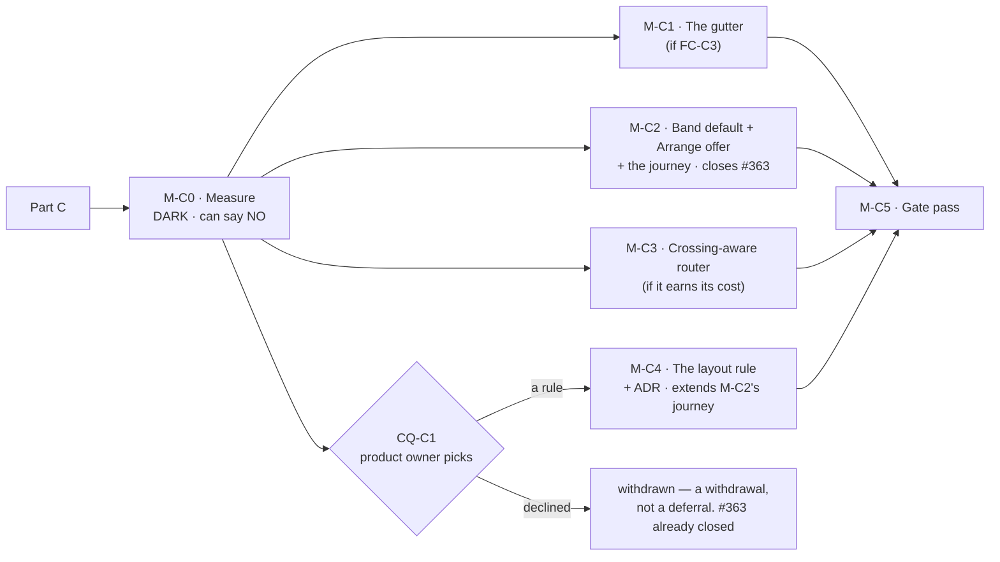

# Implementation Plan: Diagram legibility, Part C — crossings, rows, and the gutter

- **Feature spec:** [`./part-c-feature-spec.md`](./part-c-feature-spec.md) — **Draft, awaiting
  approval before implementation.**
- **Status:** Draft — awaiting approval before implementation
- **Owner:** web

> **Read §0 of the spec first.** Six things change this plan's shape. The complaint has changed
> quantity (§0.4) and **no instrument here measures the new one** (§4.5). **Every figure in the
> epic's measurement files needs its configuration attached** — §0.1 records this spec's own first
> draft getting that wrong, and is kept in place because the way it was wrong is the failure the
> whole section is about. Compressing the diagram may cost crossings, which is now a headline
> measurement rather than a note (§0.5). The band default cannot simply be flipped, because the
> defect it exposes is clearable only with a permission most readers lack (§0.9). And the import
> report is **pre-commit**, so the offer CQ-C3's answer asks for cannot live there (§0.10).

## Breakdown

### Epic

**Part C of `diagram-legibility`** — make the TSLD's logic lines cross rarely, at whatever vertical
cost reads best; deliver the 420 px #364 already earned and has never shipped; and let the product
owner pick the layout rule from numbers and pictures.

**On the ordering — the router now precedes the layout rule, and that follows this plan's own
rationale rather than overruling it.** The first draft numbered the layout rule M-C2 and the router
M-C3 while arguing in the same paragraph that the layout rule should go last. The argument was right
and the numbering was not; they agree now.

1. The **layout rule goes last** because it is the only one needing a decision nobody can make yet
   (CQ-C1) and an ADR, and the only one withdrawable on its own condition (FC-C2) — and everything
   built before a withdrawal is wasted. That is the sequencing lesson Part A paid for and then
   profited from (`m0-measurement.md`: deferring M0-T4 _"would have been the largest single piece of
   wasted work in the epic"_, and FC-2 then withdrew M3).
2. The **router goes before it** because it tells the product owner how much of the complaint a
   change costing **no height at all** absorbs — information they should have _before_ being asked
   to spend height. If it absorbs most of it, CQ-C1 becomes cheap.
3. The **gutter** is one constant and ships alone. Note the corrected arithmetic: at the state the
   reader is in it is 27 rows, not 12 (spec §0.1), so the diagram already fills ~93 % of the canvas
   and the gutter is **not** the nearly-free change the first draft called it.
4. **M-C2 is new and is inserted ahead of the router**, which departs from the milestone list I was
   handed. Three reasons: nothing in this part gates it; it delivers #364's 420 px, which has never
   reached a user (spec §0.1); and **its own content is an offer to press `Arrange`, so its journey
   must press `Arrange`** — which is exactly `docs/TECH_DEBT.md` #363's content, so that row closes
   at M-C2 rather than surviving to the end and dying with a milestone CQ-C1 can cancel.

---

## Milestone 0 — Measure, and commit the conditions

**Outcome:** the numbers and the **rendered before/after pictures** the product owner asked for, for
three layout rules × two routers × four gutters, on the plan from their screenshot — plus a verdict
this milestone is allowed to return as NO.
**Ships dark:** nothing is reachable. No product code changes; harnesses, fixtures and documents
only. Every candidate lives **behind the probe** and is deleted at the end.
**Journey:** none — nothing user-facing. See spec §4.8 for where it lands and why.

> **The conditions land in their own commit, before any harness exists** (ADR-0128's ordering).
> **Every harness asserts its non-vacuity control first and THROWS rather than judging** when it has
> nothing to judge (ADR-0130). This register holds six instrument defects in ADR-0115 alone, a
> harness that measured the bars instead of the pills (ADR-0106), one that measured the cull instead
> of the painter (ADR-0066), and one that produced `PROCEED` from an `undefined` (ADR-0097 Landing C).
> This epic's own `cheap-levers.md` records measuring a **model** of a rule that did not exist yet.

#### Feature: M-C0-F1 — the conditions and the instrument

> **Description:** the falsification conditions, then the first instrument in this repository that
> counts link–link crossings.
> **Complexity:** L
> **Dependencies:** none.
> **Risks:** an instrument measuring the wrong quantity → every harness prints the set it examined
> and the counts it attributed; each has a control checked first.
> **Testing requirements:** each harness has a negative control that must fail, and the metric's pure
> arithmetic has unit cases over hand-built polylines.

##### M-C0-T1 — Commit the falsification conditions

- **Description:** FC-C1…FC-C7 (spec §4.10) written to
  `docs/specs/diagram-legibility/part-c-conditions.md` and committed **alone**, before any harness
  file exists.
- **Complexity:** S · **Dependencies:** none
- **Risks:** a condition written after its measurement is a number tuned to the answer → separate
  commit; the git order is the evidence.
- **Testing:** none (a document).
- **Development steps:**
  1. Write each condition with its withdrawal clause and the derivation of its threshold.
  2. Record explicitly that **FC-C2's 50 % is a floor on what may be OFFERED, not the decision** —
     CQ-C1 is the decision — so nobody later reads a passed condition as an approval.
  3. Commit alone; no harness file in the diff.

##### M-C0-T2 — The crossing metric, and its control (FC-C1)

- **Description:** extend `vhv-gutter-probe.ts`'s recording context to tag each polyline with the
  `stroke()` batch that flushed it and the `strokeStyle` at flush time; identify link batches by
  sentinel palette values; count transversal intersections between distinct links' segments.
- **Complexity:** L · **Dependencies:** M-C0-T1
- **Risks:**
  - **Counting the shipped design as the defect.** Fan-out converges many ends on one bar edge by
    design, and `bundleCorridors` merges corridors by design. Both exclusions are in the spec §4.5
    and **each gets its own unit case over a hand-built pair**, so a future reader cannot remove one
    as an apparent simplification.
  - **Rewarding a candidate for culling the evidence.** A raw count at a fixed viewport falls when
    fewer links are visible, which is what spending rows does → **every figure is per visible link**
    and the visible-link count is printed beside it.
  - **Measuring a model.** → the polylines come from the **real painter**; a lane-only reimplementation
    would be blind to corridor choice and to the bundler (ADR-0124).
  - **Batch attribution being wrong.** The assumption is that the painter flushes one layer pass per
    `stroke()` → the control is the discriminator, not the assumption.
- **Testing:** the control (attributed link polylines == the independently computed visible-edge
  count, else throw); unit cases for each of the three exclusions; **FC-C1 itself is the
  discrimination test** — run the metric against the shipped layout and the source-order layout and
  require ≥ 3×.
- **Development steps:**
  1. Add the batch tag and flush-time `strokeStyle` to the recording context.
  2. Give `PALETTE.edge` / `critical` / `nearCritical` sentinel values; identify link batches.
  3. Implement the axis-aligned transversal-intersection count with its three exclusions.
  4. Assert the control **first**; print what it examined.
  5. Run FC-C1. **If it fails, stop and replace the metric** — nothing else in this milestone is
     worth running.

##### M-C0-T3 — The four configurations, and which one the reader is in

- **Description:** measure spec §0.1's table directly — band on/off × packed/un-packed — on lanes,
  drawn extent, mean |Δlane|, >5-lane links **and crossings per link**. This is a **headline result**,
  not a baseline: it decides whether compressing the diagram helps or hurts the thing that was
  actually complained about (spec §0.5).
- **Complexity:** M · **Dependencies:** M-C0-T2
- **Risks:**
  - **Labelling a band-on-after-Arrange figure as "current"** — which this spec's first draft did,
    and which is the whole reason this task exists in this shape. Every row names its configuration;
    the harness prints which one it ran and the commit it ran against.
  - Quoting `cheap-levers.md`'s 27 / 1.78 / 14 forward without its configuration → those are the
    **band-off / packed** numbers and remain correct as such.
- **Testing:** determinism — two runs agree exactly.
- **Development steps:**
  1. Run all four configurations; label every figure with the one it came from.
  2. **Judge spec §0.5**: does crossings-per-link rise as the diagram compresses 27 → 12? If it does,
     file it as a register row. **It is not an argument for reverting #364** — those 13 rows paint
     nothing at all — and the row must say so, and must not be read as an argument against the band
     flip either.
  3. Withdraw `cheap-levers.md`'s CQ-4 note in place (spec §0.2) — the screenshot's plan **is** the
     fixture, on the plan name and an exact 144-activity count — and label that file's "shipped" row
     with its configuration rather than leaving it to read as the current state.

##### M-C0-T3a — Does a freshly imported plan report "already arranged"? (M-C2's predicate)

- **Description:** M-C2's derived default rests on `computeArrangeChanges()` being **empty** exactly
  when the lanes are already scene-first. Band **off**, an imported plan should report empty — the
  importer ran the same `packLanes` with the same hint. **Established by running it, not by reading
  it**, because two differences are visible in the code and neither is obviously inert.
- **Complexity:** S · **Dependencies:** M-C0-T3
- **Risks:** assuming equivalence → two known divergences: the importer derives day offsets as
  `Math.round(getTime() / DAY_MS)` (`interchange.service.ts:1080-1081`) while `arrange-lanes.ts:73-74`
  uses `daysBetween(dataDate, …)` (offset-invariant, so expected to be inert); and the importer
  **skips** an activity whose `earlyFinish` is null (`:1075`) where `arrange-lanes` substitutes
  `earlyStart` (`:74`) — so a milestone with no finish is packed by one and not the other. If that
  makes the predicate non-empty on a fresh import band-off, the derived default still behaves
  correctly (it would default the band off, which is safe) but the **strip would offer a press that
  moves nothing**, which is a dead end.
- **Testing:** run it on the Unit 300 import; report the change count in both band states.
- **Development steps:** compute and print `computeArrangeChanges()` band-off and band-on on a
  freshly imported plan; if band-off is non-empty, identify which activities move and why, and record
  whether the strip's predicate needs the band-on form specifically.

##### M-C0-T3b — The cost of deriving the default (FC-C8's third limb)

- **Complexity:** S · **Dependencies:** M-C0-T3
- **Risks:** shipping a per-load `packLanes` without a number → FC-C8 sets a one-frame (16 ms) bar at
  `scale-2000` and names the fallback in advance.
- **Testing:** the measurement is the deliverable.
- **Development steps:** time the derivation at 540 and 2,160 activities; report against the 16 ms
  bar; state which fallback fires if it is over.

##### M-C0-T4 — The three candidates, behind the probe

- **Description:** one harness-local chooser with three configurations (spec §4.4): control,
  (a) chain rows, (b) open-to-stay-near at a swept `D`. Plus the crossing-aware router as a second
  axis, and `LANE_HEIGHT` ∈ {28, 32, 34, 36} as a rendering parameter.
- **Complexity:** L · **Dependencies:** M-C0-T2, M-C0-T3
- **Risks:**
  - **Three implementations measuring themselves rather than the objectives** → **one** chooser,
    three configurations, shared tie-breaks. This is the task's central design decision.
  - **The variant becoming the shipped implementation without review** → it lives in the harness
    directory and is **deleted at the end of M-C0**; M-C2 writes the real one. The numbers are
    committed; the code is not.
  - **Opening a row at the end rather than at the target** buys nothing (spec §4.4) → the chooser
    inserts at the target and shifts later rows down; a unit case pins that the inserted row is
    adjacent to the target.
  - **Bundling silently reverting the router** (spec §0.6) → the router axis is measured with
    bundling **on and off**, and the difference is reported rather than assumed away.
- **Testing:** determinism per configuration; the shipped control must reproduce M-C0-T3's baseline
  exactly, or the chooser is not a superset of today's rule.
- **Development steps:**
  1. Implement the chooser: `target`, `openWhen(d)`, insert-at-target.
  2. Sweep the matrix; for each cell record **rows, diagram height in px and in screens at 1646,
     crossings per link (whole-plan and at 1646 Week/Fit), mean |Δlane|, >5-lane links, bars drawn at
     Fit and at Week, minimap `pxPerLane`, and the `whole` export's natural raster per side at
     `devicePixelRatio = 1.75`** — their own display, not 1. The raster is `size × dpr`
     (`use-diagram-image.ts:218`), so measuring at 1 overstates the headroom by 75 % and the first
     draft of the spec did exactly that (§0.8).
     2a. Sweep the **four gutter candidates against BOTH the 27-row and the 12-row configurations**
     (spec §4.6), because the pitch is comfortable in one and pushes past a screen in the other. A
     single-configuration sweep is what produced the first draft's "the gutter is nearly free".
  3. Assert the control's identity with M-C0-T3 first.
  4. Delete the chooser at the end of the milestone.

##### M-C0-T5 — The pictures

- **Description:** the product owner asked for before/after pictures of a real imported programme.
  **That is the deliverable, not an illustration of it.**
- **Complexity:** M · **Dependencies:** M-C0-T4
- **Risks:**
  - A six-activity fixture cannot exhibit any of this → `shoot.mjs`'s canvas shots seed six linked
    activities (spec's Part A §0.4). The new shots use a Unit 300 import and **only** the new shots,
    so `plan-workspace`'s baseline is unchanged and the pixel-diff method stays meaningful (ADR-0099
    M2).
  - A picture taken at a framing nobody uses → **1646 × 1097**, the product owner's own screen, at
    the Week preset and at Fit, each labelled with its row count and its crossing figure.
  - A fixture that produces the answer by accident → `cheap-levers.md` records exactly that: the
    screenshot fixture's seven phases all started on the data date, so the before/after was
    pixel-identical for a reason that had nothing to do with the change. **Check the fixture exhibits
    the condition before taking the pair.**
- **Testing:** the shots run and produce non-blank images; each is captioned with the cell it came
  from.
- **Development steps:**
  1. Add a Unit 300 shot fixture behind new shot entries.
  2. Take the control pair and one pair per offered candidate, at both framings.
  3. Also take the **exported PNG** at the largest candidate — spec §0.8 is about the deliverable and
     ADR-0102 records twelve screens being photographed and never once what the product _produces_.

##### M-C0-T6 — The verdict, and the question

- **Description:** `part-c-measurement.md`: every number with its fixture, framing, viewport and
  commit; the pictures; the judgement of FC-C1, and which candidates clear FC-C2's floor.
- **Complexity:** M · **Dependencies:** M-C0-T5
- **Risks:** presenting a recommendation as the decision → **CQ-C1 is the product owner's**, and the
  document says so. A candidate clearing FC-C2 is _offerable_, not chosen.
- **Testing:** none (a document), but every figure must be reproducible from a named command.
- **Development steps:**
  1. Write the verdict; state which conditions fired and which withdrew anything.
  2. Put **CQ-C1** to the product owner with the table, the pictures, and the cost in **screens**
     rather than rows.
  3. Put **CQ-C2** to them with §0.8's two numbers — the export cap and the minimap `pxPerLane` —
     because they removed the height ceiling without either in front of them.
  4. Put **CQ-C3** to them with the import consequence stated in one sentence.

**M-C0 exit:** the conditions are committed and judged, every number names its fixture and commit,
every harness has passed its own control, the pictures exist, the chooser is deleted, and the three
questions are asked.

---

## Milestone 1 — The gutter — **WITHDRAWN 2026-09-22 on FC-C3's own withdrawal clause**

> **The pitch stays at 28 and this milestone does not happen.** M-C0-T4 measured both halves of
> FC-C3 at pitches 28, 36 and 44 and neither is achievable by changing the pitch:
>
> - **Two runs through one gutter never read as two lines.** 11 of Unit 300's 34 gutter legs draw
>   at a **single y**, identically at every pitch — `routeOrthogonal`'s `gutterY` is
>   `(gutterLane + 1) * laneHeight - (laneHeight - barHeight) / 2`, which has **no per-link term**,
>   and `bundleCorridors` bundles verticals only.
> - **The leg is never clear of a bar edge.** `gutterY` expands to exactly the upper lane's bar
>   bottom at every pitch; measured against `activityRect`, **31 of 34 legs lie _inside_ a painted
>   bar's extent**, smallest gap **0.0 px**.
>
> The rendered pictures (`gutter-pitch-{28,36,44}.png`) are the artefact FC-C3 asks to be judged on
> and they say the same thing: at 44 the rows are far apart, the extra space is empty, and every
> run sits where it sat at 28.
>
> **The condition names this outcome as itself a finding** — "the complaint is entirely row
> assignment and corridor choice" — which is now the third independent measurement pointing that
> way, beside M-C0-T2b's 2.45× and M-C0-T3's compression result. Distributing legs **within** a
> gutter is a corridor decision and belongs to **M-C3**, and is recorded there rather than kept
> alive here as a pitch change wearing a different name.
>
> The text below is kept rather than deleted, because the reasoning is what makes the withdrawal
> checkable.

> **The gutter interacts with the band work and the first draft said it did not.** Spec §4.6's
> corrected table: in the state the reader is in (27 rows) Unit 300 already fills ~93 % of the
> canvas, so **any** pitch increase pushes it past one screen — where on a plan M-C2 has made compact
> (12 rows) a 36 px pitch is comfortable. M-C0 therefore measures the pitch candidates **in both
> configurations**, and the answer may legitimately be "34 after M-C2, 28 before it". If it is, this
> milestone ships **after** M-C2 rather than before it; the plan says so here rather than letting a
> task order decide it silently.

**Outcome:** two relationships passing between the same two rows can be told apart.
**Entry point:** the **TSLD canvas itself**, plus the exported PNG/PDF and the printed diagram — no
control is pressed, no capability is added (spec §4.8).
**Journey:** none. The reasoning is `m0-measurement.md`'s, recorded for Part A's M1 and unchanged:
the subject is a polyline's y inside an `aria-hidden` Canvas 2D bitmap, which Playwright cannot read,
so a journey here would assert something adjacent and prove nothing.

> **This milestone ships alone and first.** It is one constant, it is nearly free at Unit 300's
> present 12 rows (96 px on a ~816 px canvas at the largest candidate), and it is the only part of
> Part C that is independent of CQ-C1. ADR-0090 M1 and ADR-0114 M1 both took this shape.

#### Feature: M-C1-F1 — the pitch, and the invariant that was never gated

> **Description:** `LANE_HEIGHT` moves to the value M-C0's pictures supported; FC-6 becomes a gate.
> **Complexity:** S (the constant) / M (the gate, the golden re-baseline)
> **Dependencies:** M-C0-T6, and FC-C3 must have passed
> **Risks:** the golden log re-baselined carelessly → M-C1-T3.
> **Testing requirements:** the FC-6 gate verified red; the golden log audited by reading; a browser
> check of the rendered gutter.

##### M-C1-T1 — The constant

- **Complexity:** S · **Dependencies:** M-C0-T6
- **Risks:** a hidden duplicate of `28` → **checked, not assumed**: the only bare `28` in non-test
  source under `features/tsld/` is a text baseline in the export title band
  (`export/render-export-image.ts:286`), and `--row-h` governs the Gantt and only the Gantt
  (`globals.css:936`). 65 lines across 18 files read the one exported constant.
- **Testing:** the whole `render/` suite; `render-model.test.ts` and `viewport.reveal.test.ts` carry
  pitch-dependent expectations and must be updated **by derivation from the constant**, never by
  pasting the new number.
- **Development steps:** change the constant; update its docblock to say what the gutter is _for_
  (two distinguishable runs) rather than what it measures; run the suite.

##### M-C1-T2 — FC-6 as a gate, and the fan-out invariant the compiler cannot see

- **Description:** every glyph family and decoration draws within
  `[screenYOfLane(L), screenYOfLane(L+1))`; and `FAN_OUT_MAX_PX * 2 <= BAR_HEIGHT`.
- **Complexity:** M · **Dependencies:** none
- **Risks:**
  - A gate that passes for the wrong reason → **verified red twice**, against a deliberately-too-tall
    bar and against `FAN_OUT_MAX_PX = 10` (ADR-0110 D5: a gate is finished when it has been made to
    fail by the defect it was written for; ADR-0090 M5 and ADR-0110 D5 each record a sweep that
    passed while sweeping the wrong element).
  - A green run meaning "found no glyphs" → a **pinned positive case**: at least one glyph of each
    family must be examined, asserted by count (ADR-0093 / ADR-0108's lesson).
  - Importing `BAR_HEIGHT` into `link-routing.ts` to "fix" the comment-only invariant → that reverses
    that module's deliberate leaf-ness (`link-routing.ts:20-27`). **The assertion lives in a test**,
    which may import both.
- **Testing:** the gate is the test.
- **Development steps:** enumerate the families and decorations from the painter; compute each extent
  from the **shipped** geometry functions, never a private mirror (ADR-0121's finding); assert;
  mutate; record both red runs.

##### M-C1-T3 — Re-baseline the golden log, by reading

- **Complexity:** M · **Dependencies:** M-C1-T1
- **Risks:** taking it with `-u` → **forbidden**. ADR-0106 records auditing a re-baseline line by
  line against a written list; a pitch change moves **every** y in the log, which is the case where
  `-u` is most tempting and most dangerous.
- **Testing:** the audited diff is the test.
- **Development steps:** write the expected change list first (every lane-derived y moves by
  `(newPitch − 28) × laneIndex`; nothing else moves); run; diff against the list; investigate any
  entry not on it.

##### M-C1-T4 — The browser check and the shots

- **Complexity:** S · **Dependencies:** M-C1-T1
- **Risks:** judging the gutter from arithmetic → whether two hairlines read as two lines is not a
  number. jsdom has no layout and no canvas.
- **Testing:** retake M-C0-T5's shots plus `export-diagram` and `tsld-print-diagram`; compare.
- **Development steps:** retake; compare; judge **FC-C3** and record the verdict.

##### M-C1-T5 — Record it

- **Complexity:** S · **Dependencies:** M-C1-T4
- **Testing:** `pnpm check:debt-status`.
- **Development steps:** a `docs/DECISIONS.md` entry (no ADR — spec §4.9); a changeset (patch, a
  user-visible picture change); note the minimap and export figures in the relevant rows.

---

## Milestone 2 — The band default, the `Arrange` offer, and the journey

**Outcome:** the planner is told in one line what one press of `Arrange` would buy, on the plans
where it would buy something. Closes `docs/TECH_DEBT.md` **#363**.

> **Amended 2026-09-22.** This read "#364's 420 px reaches a user for the first time, on every plan
> where it is correct to deliver it" — which assumed the band default would flip. M-C0-T3 measured
> that it should not (M-C2-F1 below), so what this milestone delivers is the **offer**, not the
> default. The 420 px still reaches a user, on the plans where a planner presses the button.
> **Entry point:** the **"Arrange now" strip in the canvas dock** on
> `/orgs/:slug/plans/:planId` — the screen an import's `navigate` lands on
> (`ImportScheduleDialog.tsx:163-170`) — plus the WBS band itself.
> **Journey:** `apps/web/e2e-arrange/` lands **here** (ADR-0081: the first milestone adding a control
> a planner can reach), and it is the first thing in this repository ever to press `Arrange`.

> **This milestone exists because the flip cannot ship alone.** Defaulting the band on before a plan
> is re-arranged shows **13 blank rows, 364 px**, on every load — and the only remedy is `Arrange`,
> which is pen-gated, so a Viewer, a Contributor without the lock and a guest **cannot clear it at
> all** (spec §0.9). The design is spec §4.7a: the default is **derived**, not flipped, and the dock
> carries the offer to whoever can take it.

#### Feature: M-C2-F1 — the derived default — **WITHDRAWN 2026-09-22 on M-C0-T3's measurement**

> **The flip does not land, and the text below is kept rather than deleted** because the reasoning
> is what makes the withdrawal checkable. CQ-C4 held this feature until M-C0-T3 reported whether 12
> rows genuinely reads better than 27. It does not: **crossings per link rise 10.9 %–11.7 % across
> the 27 → 12 compression, at 3 of 3 measured zooms**
> (`part-c-m-c0.md` § M-C0-T3). The condition's withdrawal clause is explicit — the band default
> stays **off**, the dock still offers the press, and the finding is filed.
>
> **What M-C2 still builds:** the `Arrange` offer in the canvas dock (M-C2-F2 onwards), the
> post-import offer, and the `apps/web/e2e-arrange/` journey. Only the **default** goes.
>
> **What goes with it, recorded rather than dropped:** **FC-C8 is not judged** — all three of its
> limbs are properties of a derived default that is not shipping — and **M-C0-T3b** (the cost of
> deriving it, FC-C8's third limb) is **withdrawn for the same reason**: there is nothing to cost.
> If the default is ever revisited, both come back with it.
>
> **It is not an argument for reverting `#364`.** Those 13 rows paint nothing whatever the band
> does, and band-on-arranged draws a strictly better picture than band-on-unarranged: the routed
> polylines are byte-identical and one uses 12 rows where the other uses 27.

> **Description:** `wbsBand` defaults on exactly when `computeArrangeChanges()` is empty — i.e. when
> the plan's lanes already are what the scene-first rule would produce, so there are no blank rows
> to expose.
> **Complexity:** M · **Dependencies:** M-C0-T3 (which establishes the predicate's behaviour on a
> freshly imported plan) · **CQ-C4** should be answered, but its default is this design.
> **Risks:**
>
> - **The two declarations drifting.** `DEFAULT_VIEW_TOGGLES` has **no `wbsBand` key** and the panel
>   writes `?? false` (spec §0.9) → one literal in the constant, the panel's fallback reads it, and a
>   structural test asserts they resolve to one value.
> - **Re-deriving under the reader.** A continuously-derived default would flip the band on the
>   instant `Arrange` succeeds and off again on the next hand-edit → seed **once per plan id**,
>   guarded by a ref, fired when the activities first resolve rather than at mount. That is the
>   `useDurationSeed` stale-seed trap ADR-0070 M6 records closing.
> - **A default pinned by nothing.** The three band suites set the toggle explicitly, so **no
>   existing test would fail if the flip were wrong** (spec §0.9).
>   **Testing requirements:** FC-C8's three limbs; the default asserted **as a fact**; the structural
>   agreement test; the seed-once property.

##### M-C2-T1 — The one literal, and the gate that keeps it one

- **Complexity:** S · **Dependencies:** none
- **Testing:** a structural test that `DEFAULT_VIEW_TOGGLES.wbsBand` and the panel's fallback resolve
  to the same value, **verified red** by setting them to disagree — which is trivially producible and
  is today's shape with the constant added.
- **Development steps:** add `wbsBand` to `DEFAULT_VIEW_TOGGLES`; replace `TsldPanel.tsx:1100`'s
  `?? false` with a read of that constant; update `view-toggles.ts:68-73`'s docblock, which currently
  states "Default **off**" as the rule.

##### M-C2-T2 — The derivation and the seed

- **Complexity:** M · **Dependencies:** M-C2-T1
- **Risks:** computing `packLanes` on every plan load → **FC-C8's cost limb**, with the fallback
  written down in advance (behind the on-demand path, default off, strip still offered), so a failure
  has a landing rather than a redesign.
- **Testing:** FC-C8 correctness limb, both branches, **verified red against a default that ignores
  the predicate** — which is the shipped behaviour, so the red run costs nothing to produce; the
  blank-row limb **verified red against the unconditional flip**, which must report 13 on Unit 300 or
  the measurement is not discriminating between the two designs; the seed-once property.
- **Development steps:** derive the predicate from the same inputs `computeArrangeChanges` uses;
  seed once per plan id; assert the planner's manual toggle is never overwritten.

#### Feature: M-C2-F2 — the dock strip

> **Description:** a fifth `DockStrip` member stating the row cost and offering the press.
> **Complexity:** M · **Dependencies:** M-C2-T2
> **Risks:**
>
> - **A fifth strip re-deriving the "at most one is up" invariant.** `resolveDockStrip`
>   (`model/dock-strip.ts:53-70`) exists precisely because that invariant had been spelt three times
>   in three shapes → the new member goes **into that function**, last in precedence, with its reason
>   in the docblock beside the existing four.
> - **Showing a Viewer an offer they cannot take** → **omitted, not shaded** (spec §4.7a): the
>   strip's whole content is an offer to press a pen-gated command, and a permanent un-actionable
>   notice is the lit-but-inert defect ADR-0059 M6 and ADR-0062 M6 both record.
> - **Costing the canvas** → ADR-0092's docked guarantee, asserted as an **equality** and not a
>   bound; ADR-0115 records a `<= 120 px` bound that could not tell the fixed state from the broken
>   one.
>   **Testing requirements:** the precedence asserted on the pure function, not the DOM (ADR-0093's
>   rule); the 0 px equality; the omit case at every role.

##### M-C2-T3 — The strip, its precedence and its copy

- **Complexity:** M · **Dependencies:** M-C2-T2
- **Testing:** `resolveDockStrip` unit cases for the new member, including that it yields to all four
  above it; the role-omit case; the 0 px equality in a browser.
- **Development steps:** add the member and its precedence with the reason; render the strip stating
  the resulting row count against the current one, from **the same derivation** M-C4-T4's confirm
  dialog will use, so the two numbers cannot disagree; `Arrange` and `Dismiss`; dismissal is per plan
  per session and never persisted (consistent with every other toggle on this surface, spec §0.9).

#### Feature: M-C2-F3 — the journey (ADR-0081), closing #363

> **Complexity:** L · **Dependencies:** M-C2-T3
> **Risks:**
>
> - **A new Playwright config is not free** → `check:ci-roster` (ADR-0136) and `check:e2e-roster`
>   (ADR-0138) both refuse a suite not declared in `ci.yml`, `package.json` and the rosters, and it
>   takes a shard slot. **That refusal is the gate working; budget for it.**
> - **Locating a control by its copy** → by role+name and `[data-toolbar-item]`
>   (`docs/TECH_DEBT.md` #133).
> - **Asserting on the canvas** → it is `aria-hidden`. The assertions are about the strip, the
>   command, the dialog, the written rows and the undo.
> - **A rate-limit bucket exhausted by seeding** (`docs/TECH_DEBT.md` #361).
> - **A journey that passes alone and fails in the sweep** (#347's shape) → run it inside
>   `scripts/e2e-sweep.sh`, not only alone.

##### M-C2-T4 — `apps/web/e2e-arrange/`

- **Complexity:** L · **Dependencies:** M-C2-T3
- **Testing:** this is the test. **Verify red**: the row-count assertion against the pre-M-C2 commit,
  and the undo assertion against a deliberately broken undo.
- **Development steps:**
  1. `apps/web/playwright.arrange.config.ts` + `apps/web/e2e-arrange/`.
  2. Cover **#363's own list**: the "nothing to move" early return with no dialog; a plan where rows
     genuinely change; the count in the confirmation matching the rows written; the pen gate; and
     **undo restoring the prior lanes** — the one no unit test can reach.
  3. Cover **this milestone's own**, amended 2026-09-22 by M-C0-T3a and M-C0-T3 — this step read
     "an imported plan shows the strip and no blank rows; taking the offer clears the strip and
     brings the band on", and **both halves are now wrong**:
     - **A healthy import shows NO strip**, and that is the correct behaviour: ADR-0069 phase 3 has
       already packed the plan and `packLanes` is idempotent, so `computeArrangeChanges()` is empty.
       Assert the absence.
     - **The phase-3-prevented import DOES show it**, and is the negative control **without which
       this journey passes against a strip that can never render** — ADR-0081's defect with a green
       test on top of it.
     - **Taking the offer does not bring the band on.** The derived default is withdrawn (M-C2-F1);
       assert the strip clears and the rows move, and nothing about the band's state.
     - A role without the pen sees **no strip**.
  4. Add the CI step, the `package.json` script, the roster entry and the duration entry; run
     `pnpm check:e2e-roster` and `pnpm check:ci-roster` locally.
  5. Run `scripts/e2e-local.sh web:arrange`, the base journey `scripts/e2e-local.sh web`, and the
     full sweep.
  6. **Close #363** with a ledger entry; the number is never reused.

##### M-C2-T5 — Record it

- **Complexity:** S · **Dependencies:** M-C2-T4
- **Development steps:** the ADR or ADR section spec §4.9 requires (the derived default is a
  mechanism, not a `DECISIONS.md` line); the register entry in `CLAUDE.md` §16 **in the same commit**
  if an ADR is filed (ADR-0147); a changeset (minor — a new user-facing control); the measured
  minimap and export figures into the rows CQ-C2 asked for.

---

## Milestone 3 — The crossing-aware router _(conditional on M-C0)_

**Outcome:** a corridor is chosen for what it crosses, not only for what it hits.
**Entry point:** the **TSLD canvas itself**, plus the export and the print — no control.
**Journey:** none, for M-C1's recorded reason.

> **Inherited from M-C1's withdrawal, 2026-09-22: distributing gutter legs is a corridor decision
> and lands here.** M-C0-T4 measured 11 of Unit 300's 34 gutter legs drawing at a **single y**,
> because `routeOrthogonal`'s `gutterY` has no per-link term, and a further **31 of 34** lying
> inside a painted bar's vertical extent because that y expands to exactly the upper lane's bar
> bottom at every pitch. Neither is a pitch problem and both are this milestone's kind of problem.
> Whatever is built must keep ADR-0065's determinism rule — a route that varies between frames
> reads as the diagram twitching — so an offset has to be a function of the edge, not of iteration
> order.

> **Measured before built, and it may not be built — and it comes BEFORE the layout rule on
> purpose.** M-C0 reports how much of the complaint this absorbs at **zero height cost**. If that is
> a large share, it may be the whole remedy and CQ-C1 becomes cheap; if it is negligible, it is
> withdrawn and recorded as measured-and-rejected. Either answer is information the product owner
> should have before being asked to spend vertical space.

#### Feature: M-C3-F1 — a second obstacle class

> **Complexity:** L · **Dependencies:** M-C0-T6
> **Risks:**
>
> - **An unbounded search on the paint path** — _"bounded work is the contract"_
>   (`link-routing.ts:218-220`) → the candidate list stays bounded at `MAX_CORRIDOR_CANDIDATES`; only
>   the **scoring** changes, and an interval index over already-routed corridors keeps the query
>   logarithmic. `paint.routing-budget.test.ts` must stay green **without being edited**; if it has
>   to be relaxed, the router is withdrawn (FC-C4 limb B).
> - **Order dependence** (spec §0.7) → edges are sorted by a total order before routing, the
>   `computeEdgeFanOut` `keyOf` pattern (`link-routing.ts:549-550`). **Verified red** against an
>   implementation that consults `scene.edges` in array order.
> - **The bundler silently reverting it** (spec §0.6) → `bundleCorridors`' free-check is about bars.
>   Either extend it to links or measure with bundling on and off and record which. **The spec does
>   not decide this, and this task may not decide it quietly** — whichever is chosen goes in the ADR.
>   **Testing requirements:** the no-parameter parity case; the budget gate unedited; determinism.

##### M-C3-T1 — The parameter, the index and the scoring

- **Complexity:** L · **Dependencies:** M-C0-T6
- **Testing:** `routeOrthogonal` without the new parameter is byte-identical point for point
  (FC-C6); the budget gate green unedited; FC-C5.
- **Development steps:** add the optional parameter with the same shape as `obstacles`; build the
  per-frame corridor index; score the bounded candidate list on links crossed **and** bars hit; keep
  the fixed candidate order so ties resolve identically.

##### M-C3-T2 — Judge it

- **Complexity:** S · **Dependencies:** M-C3-T1
- **Development steps:** re-run the crossing harness; report the reduction at zero height cost;
  request the ADR-0128 press for **FC-C4 limb B**; fold into M-C4's ADR or file its own per spec
  §4.9's discriminator.

---

## Milestone 4 — The layout rule _(conditional on CQ-C1 and FC-C2)_

> **Re-aimed 2026-09-22, on M-C0-T2b's measurement and the product owner's decision.** This
> milestone was framed as _spend rows to buy fewer crossings_, with CQ-C1 choosing how many. That
> framing is falsified on their own plan: **the maximum possible height spend — one bar per row,
> 144 rows against 27 — buys a 17 % crossing reduction**, against FC-C2's 50 % floor, while
> **assignment quality at constant height moves the same number by 2.45×**. Compression is not
> free either, and not the dominant term: 27 → 12 rows costs 11 %.
>
> So the rule's subject is now **how rows are assigned, not how many there are**: follow the logic
> — chains together, a successor near its predecessors — at **whatever height that needs**. Height
> becomes an **output** of the rule rather than its input. The no-ceiling decision stands
> unchanged; what goes is spending height for its own sake.
>
> **What this changes downstream.** CQ-C1 stops being "which of three height budgets" and becomes
> "which of three assignment rules, and here is the height each one happens to need". FC-C2's floor
> is untouched, and its derivation is flagged in `part-c-conditions.md` as partly stale — that is
> the product owner's to move, with a number in front of them, if a candidate lands between 20 %
> and 50 %.

**Outcome:** `Arrange` lays activities out so relationships rarely cross, at whatever vertical cost
the chosen assignment rule turns out to need.
**Entry point:** the **`Arrange`** command on the plan command strip (accessible name `Arrange`,
description "Auto-arrange lanes", pen-gated, `tsld-toolbar-items.tsx:2917-2933`) — and **M-C2's dock
strip**, whose stated row cost now describes the new rule.
**Journey:** **M-C2's**, extended. It exists already, which is the practical gain from moving it.

> **Gate M-C4-G: this milestone does not start until (a) at least one candidate cleared FC-C2's
> floor and (b) CQ-C1 has an answer.** A rule chosen by the implementer is the failure §19.3 and
> ADR-0105 both describe, and the product owner reserved this decision in writing.

#### Feature: M-C4-F1 — the ADR

> **Description:** five reasons this is ADR-level (spec §4.9), the fifth being that it **deliberately
> diverges the `Arrange` picture from the import picture** — ADR-0069's subject — and an unexplained
> divergence is what ADR-0065/0069/0121 all refuse.
> **Complexity:** M · **Dependencies:** M-C4-G. **CQ-C3 is answered** (the offer, not a second
> objective), so the ADR records that decision rather than posing it.
> **Risks:** pinning a number early → take the next free one **at filing** (ADR-0079).
> **Testing:** `pnpm check:adr-coverage` (the index **and** `ROADMAP.md`, both directions — ADR-0110
> D6) and **ADR-0147's assertions over `CLAUDE.md` §16**, which refuse an ADR whose register entry
> does not land in the same commit.

##### M-C4-T1 — Write and file it

- **Complexity:** M · **Dependencies:** M-C4-G
- **Development steps:** problem, options (spec §4.4's table, including the rejected sibling packer,
  the rejected second command and the rejected per-plan setting), decision, trade-offs, consequences;
  **the parity sentence in its honest form** — `computeSchedule` not imported, not reachable, no
  migration, therefore nothing to hold parity _for_ (ADR-0125 D1's strong claim, explicitly not
  ADR-0116 D7's weaker sibling); file; index; write the **§16 register entry in the same commit**.

#### Feature: M-C4-F2 — the objective

> **Description:** one optional parameter of `packLanes`; absent ⇒ byte-identical; one call site
> passes it.
> **Complexity:** L · **Dependencies:** M-C4-T1
> **Risks:**
>
> - **Losing determinism** → a property test across input permutations (FC-C5).
> - **Losing "only placed predecessors steer"** (`pack-lanes.ts:94-109`) → reaching for unplaced ones
>   makes the result order-dependent; pinned by the same property test.
> - **A second packer appearing** → structurally refused: one function, one parameter, one call site
>   (spec §4.7).
> - **The importer picking it up by accident** → a structural test asserts `interchange.service.ts`'s
>   call passes no objective, because the scope decision is "Arrange only" and nothing else enforces
>   it.
>   **Testing requirements:** unit + property + **both callers' existing suites passing unedited** —
>   an invariant you must touch to make room for your feature was never an invariant.

##### M-C4-T2 — The parameter and the choice

- **Complexity:** L · **Dependencies:** M-C4-T1
- **Risks:** the objective read as a module constant → make it a **required parameter of the internal
  chooser** with the public default reproducing today (the `clampPxPerDay` / `maxPxPerDay` pattern,
  `viewport.ts:130-131`).
- **Testing:** byte-identity with the parameter **omitted** and with it set to the neutral value, as
  **two separate cases** (FC-C6); the permutation property; `pack-lanes.spec.ts` passes **unedited**.
- **Development steps:** extend the signature; implement insert-at-target with `laneEnds` as an
  insertion structure; keep the total order and the tie-to-lower-lane rule; update the docblock with
  **the numbers this epic measured**, replacing the 2026-07-31 figures the file still quotes forward.

##### M-C4-T3 — Wire the one call site

- **Complexity:** S · **Dependencies:** M-C4-T2 · **Testing:** `arrange-lanes` unit + M-C2's journey,
  extended.
- **Risks:** changing `computeLaneArrangement`'s #364 shape → the scene/band split is untouched; only
  the `packLanes` call gains an argument. Band-off identity (`sceneActivities === activities`) must
  still hold.
- **Development steps:** pass the objective at `arrange-lanes.ts:95`; leave the band pack
  (`:117-120`) calling `packLanes` unchanged, since a summary is never a dependency endpoint
  (ADR-0038) and the objective is inert there — and say so, rather than passing it "for symmetry".

##### M-C4-T4 — The confirm dialog tells the truth (US-2)

- **Complexity:** S · **Dependencies:** M-C4-T3
- **Risks:**
  - Leaving _"into the fewest lanes"_ in place (`TsldPanel.tsx:3342-3343`, **both** branches) → it
    becomes a promise the packer no longer keeps, which is a false statement on screen; this register
    records that class shipping repeatedly.
  - **The dialog and M-C2's strip stating different numbers** → both read **one** derivation of the
    resulting row count. Two derivations of "how tall will this be" is the drift argument inside one
    screen, and a planner who saw the strip and then the dialog is the only person who would notice.
- **Testing:** a unit assertion on the copy in **both** `UNDO_REDO_ENABLED` branches; a journey
  assertion that the strip's number and the dialog's number agree.
- **Development steps:** rewrite both branches to state the resulting row count against the current
  one; keep the undo-caveat logic untouched.

##### M-C4-T5 — Re-measure and judge

- **Complexity:** M · **Dependencies:** M-C4-T3
- **Risks:** judging from the harness rather than from the product → the verdict needs the harness
  numbers **and** a picture pair at 1646 **and** the product owner's look at the released build.
  Re-run everything on **one** commit (ADR-0099's recorded finding: a sweep measures the tree it runs
  against).
- **Testing:** the harnesses' controls, again.
- **Development steps:** re-run the crossing harness and `measure-lane-travel.mjs`; judge **FC-C2**
  and **FC-C5**; request the ADR-0128 probe press and judge **FC-C4 limb A**, stating whether spec
  §0.3's prediction (bars drawn falls) held; judge **FC-C7** and add the readings to
  `docs/TECH_DEBT.md` #75 and #323; write `part-c-m4-verdict.md`.

---

> **The standalone "`Arrange` journey" milestone the first draft carried here is GONE, folded into
> M-C2-F3.** It was written when nothing else in this part added a reachable control, so the journey
> had nowhere earlier to land. M-C2 now adds one, and its content is an offer to press `Arrange` —
> so the journey belongs there, **#363 closes there**, and M-C4-T3 extends it rather than a
> cancellable milestone owning a filed obligation. Recorded as a fold rather than deleted silently,
> because a milestone that disappears between drafts is how a task list comes to describe work
> nobody did (ADR-0090 M5's finding).

## Milestone 5 — The gate pass

**Outcome:** the specialist reviews run over the **combined** diff and every blocking finding is
folded with a regression test **verified red first**.
**Ships dark:** review and fold-ins only.
**Journey:** the existing suites, plus **every journey in the estate** if anything about layout
moved — `docs/TECH_DEBT.md` #133's rule, which exists because three journeys broke across one such
epic and CI, not the author, found each.

> **This milestone earns its place empirically.** Nine consecutive epics in this register have had a
> gate pass find defects that passed a human read, and the commonest shape is _one correct pattern
> applied to a control and not its neighbour_.

#### Feature: M-C5-F1 — the reviews

##### M-C5-T1 — Run them

- **Complexity:** L · **Dependencies:** M-C4 (or M-C1/M-C3, if M-C2 was withdrawn)
- **Development steps:** **performance-reviewer** (the router and the row count both touch the one
  measured quantity in #75); **accessibility-reviewer** (a repack changes what every moved row
  announces, and the ADR-0063 §4 count invariant must be asserted across it);
  **component-reviewer** (§19.13 — canvas geometry that four glyph families depend on);
  **ux-reviewer** (the dock strip's copy and its dismissal, the confirm copy, and whether the taller
  diagram reads as intended); **test-engineer** on the coverage. **`api-reviewer` and
  `backend-performance-reviewer` are not run, because `apps/api` contributes zero files** — which
  CQ-C3's answer confirms rather than assumes (the import stays byte-identical) — recorded so it does
  not read as an oversight. **`database-architect` is not run, because there is no schema change to
  design** — likewise, and §4.7a records that a per-plan stored fact was _considered_ and rejected,
  so the absence is a decision.
- **One thing to put in front of the accessibility review by name:** the dock strip is **omitted**
  for a reader who cannot press `Arrange` (spec §4.7a). That is ADR-0082's omit clause rather than
  its shade clause, and this register has overstated an ADR-0082 citation once — so the reviewer is
  asked to confirm the discriminator rather than the conclusion.
- **Testing:** each fold-in verified red first.

##### M-C5-T2 — Count the findings, and close the paperwork

- **Complexity:** S · **Dependencies:** M-C5-T1
- **Risks:** writing "five specialists, nine findings" without counting → ADR-0136 records exactly
  that, in the ADR about unchecked claims. **Count them.**
- **Development steps:** fold-ins; the non-blocking findings as one numbered `docs/TECH_DEBT.md` row
  with reasons; update **every** spec header in this directory that the ADR now cites, in the commit
  that files it (`pnpm check:spec-status`, ADR-0131 — note the gate keys on the **directory**, so
  filing an ADR that cites `docs/specs/diagram-legibility/` promotes **all six** documents here out
  of `Draft` at once, including Parts A and B's); run `pnpm prepush` and the full journey sweep.

---

## Sequencing & slices

| #        | Slice                                      | Releasable alone?              | Can be withdrawn?                                                        |
| -------- | ------------------------------------------ | ------------------------------ | ------------------------------------------------------------------------ |
| M-C0     | Measurement + conditions                   | yes (no product code)          | —                                                                        |
| **M-C1** | **The gutter**                             | **yes — and should be, alone** | **yes — FC-C3**                                                          |
| **M-C2** | **Band default + Arrange offer + journey** | **yes**                        | **no — it is the remedy for a defect the flip would otherwise ship**     |
| M-C3     | The crossing-aware router                  | yes                            | **yes — M-C0's measurement, or FC-C4 limb B**                            |
| M-C4     | The layout rule                            | yes                            | **yes — FC-C2 or CQ-C1 can withdraw it; #363 is already closed by M-C2** |
| M-C5     | Gate pass                                  | yes                            | —                                                                        |

**M-C2 is the one slice with no withdrawal clause, and that is deliberate.** Its two halves are a
defect and its remedy: the band flip alone ships 364 px of blank rows to every reader who cannot
press `Arrange`, and the derived default alone is a change nobody asked for. Shipping either without
the other is the failure; shipping neither is simply today. **So the flip may never land before the
derivation, and the plan states that as an ordering rule rather than leaving it to a task sequence.**

**No feature flag** (ADR-0088 D1). The rollback is a **commit boundary**, which each slice is shaped
to make real: M-C1 is one constant, M-C2 is one predicate plus one strip, M-C4's objective is an
optional parameter whose absence is byte-identical, M-C3's is the same shape as the existing obstacle
parameter.

**Three milestones can end this part early**, and that is the design rather than a caveat: FC-C1 can
stop everything before a candidate is measured, M-C0's measurement can withdraw M-C3, and FC-C2 or
CQ-C1 can withdraw M-C4 — which now costs less than it did, because #363 and the journey no longer
die with it.

## Definition of Done (per task)

Each task's PR satisfies the Feature Completion Criteria in [`docs/PROCESS.md`](../../PROCESS.md).
Five that bite here:

- **The pre-push gate is run, not written** — `pnpm prepush`, plus `scripts/e2e-local.sh web:arrange`
  **and** `scripts/e2e-local.sh web` (the base journey) for any task touching a screen. `apps/api` is
  untouched, so `scripts/e2e-local.sh api` is not owed — stated so its absence is a fact rather than
  an omission.
- **Every new gate is verified red** against the defect it names (ADR-0110 D5), and carries a pinned
  positive case so a green run cannot mean "found nothing".
- **Every re-baselined golden log is audited line by line** against a written list, never `-u`
  (ADR-0106).
- **Every harness asserts its control first and throws rather than judging** (ADR-0130).
- **The ADR's register entry in `CLAUDE.md` §16 lands in the same commit as the ADR** — ADR-0147's
  gate refuses otherwise, and ADR-0071's failure is filing a decision the register does not hold.

## Risks & assumptions (rollup)

| Risk / assumption                                                                                              | Likelihood  | Impact       | Mitigation                                                                                                                                                                     |
| -------------------------------------------------------------------------------------------------------------- | ----------- | ------------ | ------------------------------------------------------------------------------------------------------------------------------------------------------------------------------ |
| The crossing metric does not discriminate, or counts the shipped design as the defect                          | med         | **high**     | FC-C1 runs before any candidate is measured; three exclusions each with a unit case; the control throws                                                                        |
| The measured plan is not the product owner's after all                                                         | low         | med          | Name and exact activity count both match (spec §0.2); the residual — that they imported a different export, or have edited it — is cheap to close and is not assumed           |
| Row spending costs more than the product owner expects once they see it                                        | **high**    | med          | CQ-C1 is theirs, taken on **pictures** and on cost in **screens**; M-C0 can return NO                                                                                          |
| The export and the minimap degrade and nobody asked                                                            | **med**     | **high**     | CQ-C2, with both numbers measured rather than argued; FC-C7's withdrawal clause points at the export and the minimap, never at a row cap                                       |
| The import picture diverges from the Arrange picture                                                           | **certain** | med          | **CQ-C3 answered:** the import stays byte-identical and M-C2's dock strip offers the press; the divergence and the answer both go in M-C4's ADR                                |
| **Flipping the band exposes blank rows to readers who cannot clear them**                                      | **certain** | **high**     | **The flip is not a flip** — the default is derived (spec §4.7a), so no reader meets the defect; FC-C8's second limb is verified red against the unconditional flip            |
| **The derived default costs a `packLanes` run per plan load**                                                  | med         | med          | FC-C8's third limb, 16 ms at `scale-2000`, measured at M-C0-T3b; the fallback (on-demand, default off, strip still offered) is named **before** the measurement                |
| **The band predicate is non-empty on a fresh import band-off, so the strip offers a press that moves nothing** | med         | med          | **M-C0-T3a runs it** rather than reading it; two concrete divergences are already identified (`earlyFinish` null handling, day-offset derivation) and neither is assumed inert |
| **The two `wbsBand` defaults drift** (`DEFAULT_VIEW_TOGGLES` has no key; the panel writes `?? false`)          | med         | med          | One literal, the panel reads it, a structural test asserts they agree — and **no existing test would have caught it** (spec §0.9)                                              |
| **The derivation re-fires and moves the band under the reader**                                                | med         | med          | Seed once per plan id, guarded by a ref, fired when activities first resolve — the ADR-0070 M6 stale-seed trap, with a seed-once property test                                 |
| §0.3's paint prediction is wrong and more rows **do** cost frames                                              | med         | med          | FC-C4 limb A, on the product owner's hardware; the prediction is committed so either outcome is a finding                                                                      |
| The crossing-aware router becomes an unbounded search                                                          | med         | **high**     | `paint.routing-budget.test.ts` green **unedited**; bounded candidate list unchanged; FC-C4 limb B withdraws it                                                                 |
| Bundling reverts the router                                                                                    | med         | med          | Measured with bundling on and off; the choice goes in the ADR rather than being made quietly (spec §0.6)                                                                       |
| The router is non-deterministic across refetches                                                               | med         | **high**     | FC-C5, verified red against array-order routing (spec §0.7)                                                                                                                    |
| The golden log is re-baselined with `-u` and hides a real change                                               | med         | high         | M-C1-T3's written expectation list first; a pitch change moves every y, which is when `-u` is most tempting                                                                    |
| A repack changes what an AT user hears                                                                         | **certain** | low          | `a11y.ts` speaks the lane number; the ADR-0063 §4 count invariant is asserted and the text change is expected and announced                                                    |
| The new journey's config is not declared in CI                                                                 | med         | low          | `check:e2e-roster` + `check:ci-roster` refuse the PR — the gate working, budgeted for                                                                                          |
| §0.5 holds and compressing the diagram costs crossings                                                         | med         | **positive** | M-C0-T3 measures all four configurations; a finding either way, and **not** an argument for reverting #364 (those 13 rows paint nothing) nor against the band flip             |
| **A figure is quoted without its configuration**                                                               | **high**    | **high**     | This spec's first draft did exactly that (spec §0.1) and it is preserved rather than deleted. Every row in M-C0-T3 names band on/off and packed/un-packed                      |
