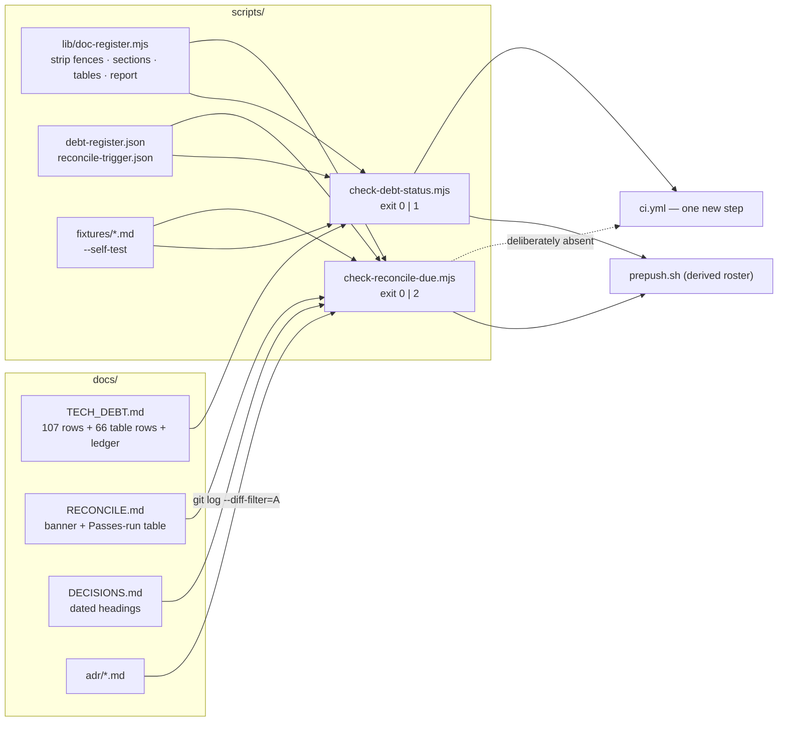

# Feature Spec: Drift gates — a computed observer for the register and for the pass

- **Status:** Draft — awaiting approval
- **Author(s):** feature-analyst (Product Owner / Solution Architect / Technical Lead hats)
- **Date:** 2026-08-30
- **Tracking issue / epic:** `docs/TECH_DEBT.md` #219(a) and #220
- **Roadmap link:** repository maintenance (`docs/RECONCILE.md`); no product milestone
- **Related ADR(s):** builds on ADR-0058 (drift control), ADR-0076 (wrong claims are a defect
  class), ADR-0105 (a register row is not a spec), ADR-0110 D5 (a gate is verified against the
  defect it names), ADR-0081 (a milestone names its entry point). **Proposes one new ADR** —
  outline in §4.9.

> **Scope note.** This is repository tooling. It changes no application code, no schema, no API and
> no user-facing surface. **The CPM engine is not imported and no migration runs**, so the ADR-0034
> recalculation parity gate is untouched — in its honest form: there is nothing here to hold parity
> _for_.

---

## 1. Business understanding

### Problem

Two documented obligations in this repository have **no computed observer**. Both are the same
shape, and both have already cost something measurable.

**A — `docs/TECH_DEBT.md` cannot be asked what is still open.** The register's one job is to be the
input to "what should we do next". On 2026-08-30 three candidates were drawn from it and put to the
product owner; one of them (`#109`) had been fixed three weeks earlier, and that was discovered only
by opening the code afterwards. The sweep that followed verified seven rows by hand: **six were
fixed and never closed, and one (`#169`) was reported fixed by an automated pass and is half
fixed.** Row #219 records all of it.

The reason it cannot be asked is arithmetic, not attitude. Measured today:

| Measurement                                            | Command                                         | Result                  |
| ------------------------------------------------------ | ----------------------------------------------- | ----------------------- |
| Detailed rows (`## ` item headings)                    | `grep -c '^## #\?[0-9]' docs/TECH_DEBT.md`      | **107**                 |
| All `## ` headings (items + 3 section headings)        | `grep -c '^## ' docs/TECH_DEBT.md`              | 110                     |
| Rows with a machine-readable status line               | `grep -c '^\*\*Status:\*\*' docs/TECH_DEBT.md`  | **13**                  |
| `**Status:**` occurrences anywhere, incl. prose        | `grep -c '\*\*Status:\*\*' docs/TECH_DEBT.md`   | 14 — see the trap below |
| Rows annotated CLOSED / RESOLVED / ANSWERED in a title | `grep -cE '^## .*(CLOSED\|RESOLVED\|ANSWERED)'` | **17**                  |
| Rows in the compact table at the head of the file      | `grep -cE '^\| [0-9]+ +\|' docs/TECH_DEBT.md`   | **66**                  |
| Fenced code blocks in the register                     | `grep -c '^```' docs/TECH_DEBT.md`              | 32 lines → 16 blocks    |

So **94 of 107 detailed rows say nothing a parser can find**, and a further 66 rows are in a table
format that has no status field at all. The register is 173 rows, of which 13 can be counted.

Two of those numbers are traps rather than statistics, and they are the design constraint:

- **The 14th `**Status:**` is prose.** `docs/TECH_DEBT.md:6363` reads
  ``**(a) A `**Status:**` line on every row, and `pnpm check:debt-status` to parse it.`` — a
  sentence _about_ the status convention, inside inline code, inside row #219. A gate that greps
  for the string counts it as a row. This is live today, in the row that asks for the gate.
- **17 rows say CLOSED in their heading**, which `docs/TECH_DEBT.md:10-16` forbids in bold
  ("**Delete resolved rows; do not annotate them 'RESOLVED'.**"), and **none of the 17 is in the
  [Closed numbers](../../TECH_DEBT.md#closed-numbers) ledger**, whose newest entry is `#129`. So
  the register currently disagrees with its own opening rule 17 times, and the ledger that exists to
  keep inbound ADR citations resolvable is 17 rows behind.

**B — `docs/RECONCILE.md`'s trigger is "each epic boundary", and nothing observes an epic
boundary.** The three-month hard floor works, because a date is a fact a person can check. The
trigger does not, and there are now **two measurements** of it failing:

| Pass       | Gap it found                                          |
| ---------- | ----------------------------------------------------- |
| 2026-08-25 | **eleven** epics (ADR-0100–0110), no pass since 08-20 |
| 2026-08-30 | **nine** epics (ADR-0111–0119), no pass since 08-25   |

The second happened five days after a pass whose own headline finding was that the cadence had
stopped, written by the same hand, in a file that opens with the rule. The 2026-08-25 row states the
mechanism exactly: _"nothing noticed, because each epic looked complete on its own."_ An epic ends
with a release and a release is a satisfying terminal state; nothing in that sequence asks how many
boundaries have gone by, because **the answer is not a property of the epic that just ended — it is
a property of the gap between epics, and no artefact owns a gap.**

**Two more instances were found while writing this spec, both live, neither previously reported:**

1. `docs/RECONCILE.md:7` says **"Last full pass: 2026-08-28"** while the newest row in its own
   Passes-run table is **2026-08-30** (`docs/RECONCILE.md:218`). That banner carries a paragraph
   warning that this exact thing happened before ("this line said `2026-07-28` while the table below
   recorded a pass on `2026-07-31`, so the drift-control document had drifted about its own drift
   control"). It has recurred, two days after the most recent pass.
2. The 2026-08-30 table row asserts "no pass since 08-25" while a **2026-08-28** row sits
   immediately above it in the same table (`docs/RECONCILE.md:217`). Whether the 08-28 pass was
   discounted deliberately or overlooked cannot be settled from the file, and that is the point:
   **the trigger's own input data is prose, disordered, and internally contradictory.**

Both of these are exactly what a computed observer would have caught, and both are available today
as the gates' red cases without inventing a fixture.

### Why now

Three reasons, in order of weight:

1. **The cost has been paid once already**, in a recommendation to the product owner for work that
   was already done, and the register is the input to every such recommendation.
2. **The two obligations are one problem and share their plumbing.** Both parse a Markdown document
   in `docs/`; both are `check:*` scripts; both must resist the same prose-scanning failure. Built
   once they share a parser and a self-test harness; built twice they get two parsers, which is the
   ADR-0065 argument (two implementations drift, and **the drift is invisible** because each looks
   right alone).
3. **`docs/RECONCILE.md:118-123` already states the standing rule**: _"if you find yourself writing
   'remember to re-check X', write a gate for X instead"_ — and both #219(c) and #220 are currently
   written as reminders.

### Users

There are **no application users and no organisation roles in this feature.** It is developer and
agent tooling; the permission model is "anyone who can push". §2 says so again in the place the
template reserves for RBAC, rather than leaving it looking unanswered.

| Persona                       | What they need                                                                                                                                      |
| ----------------------------- | --------------------------------------------------------------------------------------------------------------------------------------------------- |
| **Maintainer picking work**   | To ask the register what is open without reading 6,400 lines, and to trust the answer.                                                              |
| **Maintainer closing a row**  | To be told, at push time, that a row they annotated CLOSED must be deleted and ledgered.                                                            |
| **Reconciliation pass owner** | To be told how far behind the pass is, at the moment they are already at a terminal.                                                                |
| **AI assistant (this repo)**  | A machine-readable status, so "what is still open?" is a parse rather than a judgement — the failure in #219 was an agent recommending a fixed row. |
| **Product owner**             | That neither gate ever blocks a release on a documentation chore (settled — §1 decisions).                                                          |

### Primary use cases

1. Run `pnpm check:debt-status` and get a status histogram plus a list of well-formedness findings.
2. Run `pnpm prepush` and see, in the terminal, how many ADRs and days have passed since the last
   recorded reconciliation pass — **as a warning, never as a failure**.
3. Add a register row and have CI refuse it if it carries no status, a status outside the
   vocabulary, a duplicate number, or a number already in the Closed-numbers ledger.
4. Close a register row and be told to delete it and ledger the number, per the file's own rule.
5. Record a reconciliation pass and be told if the banner, the table and `docs/DECISIONS.md`
   disagree about when it happened.

### User journeys

**Happy path (Gate A, blocking).** A maintainer adds `## 221. …` to `docs/TECH_DEBT.md` with
`**Status:** open`. `pnpm prepush` runs `check:debt-status` among the ten existing `check:*` gates;
it parses 108 rows, finds one new one, prints
`debt-status OK (108 rows: 12 open · 3 deferred · 4 standing · 89 unverified)`, exits 0.

**Unhappy path (Gate A).** The maintainer instead appends `**(CLOSED 2026-09-02)**` to the heading.
`check:debt-status` exits 1 with:

```
docs/TECH_DEBT.md is out of step with its own rules:

  - #221 is annotated CLOSED in its heading (line 6431).
    docs/TECH_DEBT.md:10 forbids this in bold: delete the row and add its number
    to "Closed numbers" with a one-line record of where the story lives.
```

**Happy path (Gate B, advisory).** A maintainer runs `pnpm prepush` four days after the last pass,
with three ADRs since. `check:reconcile-due` exits 0 silently:
`reconcile OK (3 ADRs / 4 days since 2026-08-30; warns at 8 / 14).`

**The path this feature exists for (Gate B).** Eight ADRs have landed since the last recorded pass.
`prepush.sh` prints, in full and in yellow, a **WARN** block naming the count, the date, the ADR
numbers and the runbook; then it carries on and exits 0. Nothing is blocked; nothing is hidden.

### Expected outcomes

- "What is still open?" becomes a command instead of a reading exercise.
- A row cannot silently claim `open` while its subject has been deleted for three weeks — because
  a status becomes a field somebody has to write, and a row nobody has verified says so in the one
  word `unverified` instead of by implication.
- The register stops disagreeing with its own opening rule (17 → 0 heading annotations; the ledger
  caught up).
- The reconciliation gap becomes visible at the moment a maintainer is already stopped at a gate,
  which is the only moment it is cheap to act on.
- Two live inconsistencies in `docs/RECONCILE.md` (the banner, the contradictory row) are repaired,
  and a gate exists so they are repaired by a machine next time.

### Success criteria

Measurable, checkable at the end of the epic:

| #   | Criterion                                                                                         | How it is measured                                                                                                                                                                                               |
| --- | ------------------------------------------------------------------------------------------------- | ---------------------------------------------------------------------------------------------------------------------------------------------------------------------------------------------------------------- |
| S1  | Every detailed register row carries exactly one machine-readable status. **107 → 107**; today 13. | `pnpm check:debt-status` exits 0 and prints the histogram.                                                                                                                                                       |
| S2  | Zero rows annotated CLOSED/RESOLVED/ANSWERED in a heading. **17 → 0**.                            | Same gate; the assertion is one of its findings.                                                                                                                                                                 |
| S3  | The Closed-numbers ledger holds every number deleted by this epic. **+17 rows minimum**.          | Same gate: a number may not be both a live row and a ledger entry, and a deleted row's number must appear in the ledger.                                                                                         |
| S4  | Both gates were **made to fail** by the defect they name, before being trusted (ADR-0110 D5).     | The verified-red output is committed in each script's docblock **and** pinned as a self-test fixture that must fail.                                                                                             |
| S5  | Gate B's warning is **visible** in a `pnpm prepush` run.                                          | A `prepush.sh` self-check asserts the WARN path prints the script's output (today `run()` discards stdout on success — `scripts/prepush.sh:40`).                                                                 |
| S6  | Gate B never blocks. `pnpm prepush` and CI both stay green with the warning live.                 | The script's exit codes are 0 or 2 only, asserted by the self-test; it is registered in **no** CI step.                                                                                                          |
| S7  | The two gates together add **< 1.0 s** to `pnpm prepush`.                                         | Measured before/after. Budget rationale: #191 measured the ten `check:*` gates at **10.4 s, 2.2%** of the local gate; a documentation gate that costs a second of that is affordable, one that costs ten is not. |
| S8  | `docs/RECONCILE.md`'s three pass-recording sites agree.                                           | Gate B's consistency clause, plus the one-line banner fix.                                                                                                                                                       |

### Open questions

Two are **CRITICAL** — their answers change the design or the size of the epic. Everything else has
a stated default and needs no answer.

> **CRITICAL-1 — May `scripts/prepush.sh` gain a third result state (`WARN`)?**
>
> The settled decision is that Gate B "warns loudly in the pre-push gate". **There is no design in
> which it does that without editing `prepush.sh`.** The gate roster is derived from every `check:*`
> script in `package.json` (`scripts/prepush.sh:60-63`), and `run()` sends each script's stdout and
> stderr to `/tmp/prepush-last.log` and **prints nothing at all on success** (`:40-41`); the log is
> only surfaced by `tail -12` on failure (`:44`). So a warn-only gate that exits 0 today is
> **completely silent** — the loudest possible version of "ignorable".
>
> **Default if unanswered: yes, minimally.** `run()` gains one branch: exit 0 → `ok`; **exit 2 →
> `WARN`, print the whole captured log, do not add to `failed`**; any other non-zero → `FAIL` as
> today. Eight lines. It establishes an **advisory-gate convention** the repository does not yet
> have, which is why it is a question rather than a detail: the next advisory check will copy it.
>
> The alternatives, and why they are worse: (a) Gate B exits 1 — refused by the settled decision;
> (b) Gate B is invoked by a hand-written line in `prepush.sh` outside the derived roster — that is
> the hard-coded roster `:55-59` was deliberately written to avoid, and the same edit to the same
> shared file anyway; (c) Gate B writes to a file the developer is told to read — a reminder, which
> is the thing being replaced.

> **CRITICAL-2 — Do the 66 compact-table rows get statuses, or is the table frozen and ratcheted?**
>
> The register has **two formats**: a wide four-column table (66 rows, lines 30–87) and `## `
> detailed sections (107 rows). The table has no status field and its rows are single lines of
> several thousand characters; adding a fifth column is a large, mechanical, merge-hostile edit that
> makes an already unreadable table wider, and it is 38% of the register.
>
> **Default if unanswered: freeze the table.** Table rows count as `unverified` **by their format**;
> the gate records the count as a **ratchet in `scripts/debt-register.json` set at the measured 66,
> which may only go down**, so a new row cannot be added there and each table row migrated to the
> heading format lowers the number. That converts "two formats forever" into a terminal state at no
> up-front cost, and it is the idiom the repository already uses for caps and coverage floors
> (ADR-0088's Class A cap; the ADR-0058 coverage ratchets).
>
> The alternative — migrate all 66 now — is a genuinely larger epic (a full re-read and rewrite of
> 66 rows, most of which are old enough that #219's finding applies to them) and would make this
> epic's shape "verify the whole register", which #219(b) deliberately separates out.

**Defaults taken without asking** (each with its reason; overrule any of them and the design
absorbs it):

- **D-a — Gate A blocks; Gate B warns.** Gate A's assertions are all about the file being
  well-formed and self-consistent: cheap, deterministic, and fixable in the same commit that breaks
  them. `unverified` being a valid status (settled decision 3) is precisely what makes a blocking
  gate survivable on day one. Gate B's subject is a chore whose fix is an hour of a person's
  judgement, which is the thing the settled decision says must never block.
- **D-b — Gate B gets no CI step at all**, rather than a CI step that always exits 0. A green check
  that cannot go red is a claim that something is verified when nothing is — this repository has
  recorded that failure twice (ADR-0088's 135 no-op flag pins; `check:frontend-only`'s
  `contains(github.head_ref, 'gantt')` opt-in that could never fire on this repository's one
  long-lived branch). It runs in `pnpm prepush` only, and the script's docblock says so, so a later
  reader does not "fix" it by copying a neighbour into `ci.yml`.
- **D-c — the status vocabulary is four closed tokens** (`open`, `deferred`, `standing`,
  `unverified`); `closed` is deliberately **not** one of them — see §4.3.
- **D-d — the 17 CLOSED rows are deleted and ledgered**, per `docs/TECH_DEBT.md:10-16`. The story
  lives in the commit, the ADR and `docs/DECISIONS.md`; the ledger's fourth column is exactly the
  pointer.
- **D-e — no new npm dependency.** No Markdown parser. Both gates are Node built-ins only
  (`node:fs`, `node:path`, `node:child_process`). CLAUDE.md §2: every dependency is a liability, and
  a parser would be one added to the tooling that exists to reduce liabilities.
- **D-f — the threshold is 8 ADRs, with a 14-day backstop**, derived in §4.6 and re-derivable by the
  script itself. It is provisional until M0 re-derives it from `git`; M0 commits its falsification
  condition first.

---

## 2. Functional requirements

### User stories & acceptance criteria

> **US-1** — As a maintainer, I want `pnpm check:debt-status` to tell me the register's status mix,
> so that "what is still open?" is a command rather than a reading exercise.
>
> **Acceptance criteria**
>
> - **Given** the register as it stands after M3 **when** I run the gate **then** it prints one
>   summary line naming the total row count and the count per status token, and exits 0.
> - **Given** the register **when** it parses **then** the total it reports equals the count of
>   `## ` item headings, so a row it failed to see is visible as a discrepancy rather than as a
>   silently smaller number.
> - **Given** a register containing **zero** rows **when** the gate runs **then** it exits non-zero
>   with "refusing to report success on nothing" — a pinned positive case, because a gate that
>   passes over an empty set cannot distinguish "all rows are fine" from "there are no rows"
>   (ADR-0108's census gate shipped that defect; `scripts/prepush.sh:64-66` is the same guard).

> **US-2** — As a maintainer, I want a row that claims to be closed to fail the build, so that the
> register stops disagreeing with its own opening rule.
>
> - **Given** a heading matching `CLOSED`, `RESOLVED` or `ANSWERED` **when** the gate runs **then**
>   it names the row and line and quotes `docs/TECH_DEBT.md:10`, and exits 1.
> - **Given** a row whose status token is `closed` **then** the same finding is raised — the
>   vocabulary does not contain `closed`, and the message says why (§4.3).
> - **Given** the register today (17 such rows) **then** the gate reports **17 findings**, which is
>   the M2 red case.

> **US-3** — As a maintainer, I want register numbers to be unique and never reused, so that the
> ADRs and `DECISIONS.md` entries that cite them by number stay resolvable.
>
> - **Given** two rows carrying the same number (in either format) **then** the gate names both
>   lines and exits 1. _This has happened twice: two rows numbered 83 (`docs/TECH_DEBT.md:1079`),
>   and 182/183/184 reused across the two numbering styles, renumbered to 207/208/209 by the
>   2026-08-28 pass._
> - **Given** a live row whose number is also in the Closed-numbers ledger **then** the gate names
>   both and exits 1.
> - **Given** a ledger row whose number is not a plain integer, or whose `Closed` column is not a
>   parseable date **then** the gate exits 1. (The footnote marker `83¹` at `:1072` is a real case
>   and must be accepted: the number is parsed from the leading digits.)

> **US-4** — As a maintainer, I want `unverified` to be a legal, quiet status, so that the gate is
> green on the day it lands.
>
> - **Given** 89 rows marked `unverified` **then** the gate exits 0 and reports the count in its
>   summary line, so the size of the known-unknown is printed on every run rather than buried.
> - **Given** a row marked `unverified` that also carries a `**Verified:**` date **then** the gate
>   exits 1 — the two claims contradict, and #115 records that "two status lines disagreeing is
>   worse than either".

> **US-5** — As a maintainer running the pre-push gate, I want to be told how far behind the
> reconciliation pass is, so that the gap is visible at the one moment I am already stopped.
>
> - **Given** ≥ 8 ADRs added since the newest recorded pass **when** `pnpm prepush` runs **then** a
>   WARN block is printed **in full**, naming the count, the ADR numbers, the days elapsed and
>   `docs/RECONCILE.md`; and the overall exit status is unchanged.
> - **Given** ≥ 14 days since the newest recorded pass **then** the same, keyed on the day clause.
> - **Given** neither **then** the gate is silent and exits 0.
> - **Given** the warning fires **then** `pnpm prepush` still exits 0 if everything else is green,
>   and **no CI job status changes**, because the gate is in no CI step.

> **US-6** — As the owner of a reconciliation pass, I want the three places a pass is recorded to be
> checked against each other, so that the trigger's own input is not prose.
>
> - **Given** `docs/RECONCILE.md`'s banner date differs from the newest date in its Passes-run table
>   **then** the gate reports it, names both line numbers, and exits 2 (warn).
> - **Given** the newest table date has no `docs/DECISIONS.md` heading carrying that date **then**
>   the gate reports it. _Its stated blind spot: it cannot tell whether that entry is about the
>   pass, only that an entry with that date exists. Matching the word "Reconciliation" in a heading
>   would be prose-scanning, which is the failure this whole design is built against._
> - **Given** the repository as it stands today **then** the gate reports the banner discrepancy
>   (`:7` says 2026-08-28, `:218` says 2026-08-30). **This is Gate B's red case and it needs no
>   fixture.**

> **US-7** — As a maintainer, I want both gates to be immune to their own explanatory prose, so that
> writing down the rule cannot violate it.
>
> - **Given** a `**Status:**` string inside inline code, inside a fenced block, or not at column 0
>   **then** it is not counted as a status line. _Live case: `docs/TECH_DEBT.md:6363`._
> - **Given** a `## ` line inside a fenced code block **then** it is not counted as a row. _The
>   register holds 16 fenced blocks._
> - **Given** a date inside the Passes-run table's prose columns **then** it is not counted as a
>   pass date. _The "What it found" column contains dozens of dates, including "no pass since
>   08-25"._
> - **Given** the gates' own fixtures **then** one of them is a file whose prose discusses statuses
>   and closures without carrying any, and the expected result is **zero rows found and a refusal**,
>   not a false positive.

### Workflows

**W1 — adding a register row.** Author writes the heading `## NNN. Title` and, on the next non-blank
line at column 0, `**Status:** open · **Owner:** … · **Raised:** …`. `pnpm prepush` parses it.

**W2 — closing a register row.** Author deletes the row, adds one line to Closed numbers
(`| NNN | what it was | YYYY-MM-DD | where the record is |`), and — per #219(c) — names the commit
in that fourth column. The gate then asserts the number is not live and is in the ledger.

**W3 — half-closing a row.** Author rewrites the row to be about what is **left** and keeps
`**Status:** open` (`docs/TECH_DEBT.md:15-16`). There is no half-closed status, deliberately: `#169`
is the row that proves a half-closed row read as closed and misled an automated sweep.

**W4 — recording a reconciliation pass.** Author updates the banner, adds a table row, and writes a
`docs/DECISIONS.md` entry — "all three, in the same commit" (`docs/RECONCILE.md:11-13`). The next
`prepush` cross-checks them.

**W5 — being warned.** Gate B prints its block; the maintainer either runs the pass, or does not.
Nothing enforces the choice. That is the settled decision and §4.8 states its cost.

### Edge cases

| Case                                                       | Expected behaviour                                                                                                                                                                                                              |
| ---------------------------------------------------------- | ------------------------------------------------------------------------------------------------------------------------------------------------------------------------------------------------------------------------------- |
| Fenced code block containing `## ` or `**Status:**`        | Ignored. Fences are stripped before any structural parse.                                                                                                                                                                       |
| Inline code containing `**Status:**` (live, `:6363`)       | Ignored — the status line must start at column 0 and is read before inline-code content is considered.                                                                                                                          |
| Two status lines in one row                                | Finding. `#115:1740-1743` records the cost of two disagreeing claims.                                                                                                                                                           |
| Status token not in the vocabulary                         | Finding, listing the four legal tokens.                                                                                                                                                                                         |
| Sub-lettered numbers (`118a`, `118b`, `119a`)              | Legal. Parsed as number + suffix; uniqueness is over the pair.                                                                                                                                                                  |
| Two numbering styles (`## 219.` and `## #207 —`)           | Both legal, both parsed. The register uses both today and normalising them is a separate, larger edit.                                                                                                                          |
| Rows out of numeric order (the register is unsorted today) | Legal. No ordering assertion — it would be noise, and the file has never been sorted.                                                                                                                                           |
| Status line wrapping onto following lines (`#114`, `#115`) | Legal. Only the first line is parsed; the tail after the token is free text.                                                                                                                                                    |
| Prettier reformatting the register                         | Safe: `.prettierrc.json` sets no `proseWrap`, and the register today contains hand-wrapped prose and multi-line status tails that survive `pnpm format:check` — so `**Status:**` cannot be moved off column 0 by the formatter. |
| `docs/RECONCILE.md`'s table unsorted (it is today)         | The gate takes `max(date)`, never the first row.                                                                                                                                                                                |
| Banner newer than the newest table row                     | The effective date is the **newest of the three sites**, so a forgotten update never inflates the gap.                                                                                                                          |
| `git` unavailable or history shallow                       | The ADR count cannot be computed. **WARN with the reason**, never a silent pass — a gate that cannot compute must not report OK.                                                                                                |
| An ADR filed and a pass recorded on the same day           | The ADR counts toward the interval **ending** at that pass (inclusive), matching how the historical series in §4.6 was derived.                                                                                                 |
| Zero ADRs since the last pass                              | Silent, exit 0.                                                                                                                                                                                                                 |
| Register or runbook missing entirely                       | Exit 1 (Gate A) / exit 2 with reason (Gate B). Never exit 0.                                                                                                                                                                    |

### Permissions

**Not applicable, and stated rather than omitted.** No endpoint, no RBAC permission, no organisation
scope, no `assertHoldsPen`, no audit event. These are repository scripts run by whoever can push;
the trust boundary is the pull request. Nothing here reads or writes application data.

### Validation rules

The **status line grammar**, which is the only new convention in the epic:

```
^\*\*Status:\*\* (open|deferred|standing|unverified)\b.*$
```

- At **column 0**, in the row's section, after fenced code has been stripped.
- **Exactly one** per row.
- The token is lower-case and is the first thing after the label.
- Anything after the token is free text and is not interpreted — this is what lets existing rows
  keep `· **Owner:** web · **Raised:** 2026-08-08 (…)`.
- An optional `**Verified:** YYYY-MM-DD` may appear on the same line or the next; when present it
  must parse as a date, and it is **forbidden** when the status is `unverified`.

**Ledger grammar** (Closed numbers): `| <int>[footnote marker] | text | YYYY-MM-DD | text |`.

**Pass-record grammar** (`docs/RECONCILE.md`): banner `**Last full pass: YYYY-MM-DD.**`; table rows
under the `## Passes run` heading with a `YYYY-MM-DD` in **column 1 only**.

### Error scenarios

"User-facing result" here means the message and the process exit code.

| Scenario                                              | Detection                             | Result                                                                         | Exit |
| ----------------------------------------------------- | ------------------------------------- | ------------------------------------------------------------------------------ | ---- |
| Row with no status line                               | structural parse                      | names the row and line; quotes the four legal tokens and suggests `unverified` | 1    |
| Row with two status lines                             | structural parse                      | names both lines                                                               | 1    |
| Status token outside the vocabulary                   | token match                           | names the token and the legal set                                              | 1    |
| Heading annotated CLOSED / RESOLVED / ANSWERED        | heading match (on the heading only)   | quotes `docs/TECH_DEBT.md:10`; says delete + ledger                            | 1    |
| Duplicate row number                                  | set membership                        | names both lines                                                               | 1    |
| Live row number also in the ledger                    | set intersection                      | names both lines                                                               | 1    |
| Ledger row unparseable                                | grammar                               | names the line                                                                 | 1    |
| Compact-table row count above the ratchet             | count vs `scripts/debt-register.json` | names the ratchet and that it may only decrease                                | 1    |
| Register parsed to zero rows                          | pinned positive case                  | "refusing to report success on nothing"                                        | 1    |
| ≥ 8 ADRs, or ≥ 14 days, since the newest pass         | derived count                         | full WARN block naming counts, ADRs and the runbook                            | 2    |
| Banner / table / DECISIONS.md disagree                | three-way compare                     | names each site and its date and the one-line fix                              | 2    |
| `git` unavailable, or `docs/RECONCILE.md` unparseable | exception                             | WARN naming the reason; explicitly "the gap could not be computed"             | 2    |
| Everything in order                                   | —                                     | one summary line each                                                          | 0    |

---

## 3. Technical analysis

| Area           | Impact   | Notes                                                                                                                                                                                                                                                                                                                     |
| -------------- | -------- | ------------------------------------------------------------------------------------------------------------------------------------------------------------------------------------------------------------------------------------------------------------------------------------------------------------------------- |
| Frontend       | **none** | No file under `apps/web/` changes. No route, component, token or flag.                                                                                                                                                                                                                                                    |
| Backend        | **none** | No file under `apps/api/` changes.                                                                                                                                                                                                                                                                                        |
| Database       | **none** | No model, column, index, constraint or migration. **`database-architect` is therefore not engaged — because there is no schema change to design, not because one was judged too small** (CLAUDE.md §19.3's distinction).                                                                                                  |
| API            | **none** | No endpoint, DTO, status code or OpenAPI change.                                                                                                                                                                                                                                                                          |
| Security       | **low**  | One genuine surface: Gate B shells out to `git`. It must use `execFileSync('git', [...])` with a fixed argument array and `shell: false` — never a string command line, and never interpolating a file path read from a document. No network, no secrets, no `.env` read. Both scripts are read-only on the working tree. |
| Performance    | **low**  | Two file reads (~250 kB total) and one `git log` over `docs/adr/`. **Budget: < 1.0 s combined** (S7), against #191's measured 10.4 s for the ten existing `check:*` gates. If the `git log` alone exceeds it, the fallback is to bound it with `--since` at the last pass date.                                           |
| Infrastructure | **low**  | One new CI step (Gate A). **No CI step for Gate B** (D-b). One edit to `scripts/prepush.sh` (CRITICAL-1). Two new `check:*` entries in `package.json`, which the prepush roster picks up automatically (`scripts/prepush.sh:60-63`).                                                                                      |
| Observability  | **none** | No logs, metrics, traces or health impact in the running system.                                                                                                                                                                                                                                                          |
| Testing        | **med**  | There is **no test harness for `scripts/` at all** — `scripts/**/*.test.*` matches nothing, and every existing gate's "verified red" is a one-off manual act recorded in a docblock. §4.7 proposes a `--self-test` fixture mode so verified-red becomes permanent rather than historical.                                 |

### Dependencies

- **Prerequisites:** none. Nothing must land first; no other epic is blocked by this one.
- **Affected files:** `docs/TECH_DEBT.md` (bulk edit, M3), `docs/RECONCILE.md` (banner + one
  contradictory row), `scripts/prepush.sh`, `package.json`, `.github/workflows/ci.yml`,
  `docs/TESTING.md` (the "Before you push" table at `:337-351`), `docs/RECONCILE.md`'s
  already-automated table (`:44-56`), `scripts/README.md` (**itself stale** — it documents one
  script and the directory holds 25; noted here because this epic adds two more).
- **Third parties:** none.
- **Contention risk:** `docs/TECH_DEBT.md` is edited by almost every epic. M3's bulk edit must land
  as one PR, quickly, or it rebases badly.

---

## 4. Solution design

### 4.1 Architecture overview

One shared parsing module, two thin gates, two consumers.



### 4.2 Data flow

```mermaid
sequenceDiagram
  participant Dev as Developer / agent
  participant PP as scripts/prepush.sh
  participant A as check:debt-status
  participant B as check:reconcile-due
  participant Git as git

  Dev->>PP: pnpm prepush
  PP->>PP: derive check:* roster from package.json
  PP->>A: run (stdout+stderr → log)
  A->>A: strip fences → sections → statuses → ledger → ratchet
  A-->>PP: exit 0 + summary  (or 1 + findings)
  PP->>B: run (stdout+stderr → log)
  B->>B: parse banner, table col 1, DECISIONS headings
  B->>Git: git log --diff-filter=A --format=%aI -- docs/adr/
  Git-->>B: add-dates per ADR file
  B->>B: gap = ADRs since max(pass dates); days since
  alt gap below both thresholds
    B-->>PP: exit 0 + one-line summary
    PP-->>Dev: "ok  check:reconcile-due"  (log discarded)
  else gap at or above a threshold
    B-->>PP: exit 2 + WARN block
    PP-->>Dev: WARN + the whole block, printed
    Note over PP,Dev: `failed` is not appended; overall status unchanged
  end
```

### 4.3 The status vocabulary, and why `closed` is not in it

Four tokens. Each earns its place against a live row.

| Token        | Means                                                                                | Why it is separate                                                                                                                                                                                                                                                                                                                                                                                                                                                      | Live examples          |
| ------------ | ------------------------------------------------------------------------------------ | ----------------------------------------------------------------------------------------------------------------------------------------------------------------------------------------------------------------------------------------------------------------------------------------------------------------------------------------------------------------------------------------------------------------------------------------------------------------------- | ---------------------- |
| `open`       | Work is owed and could be picked up now.                                             | The default answer to "what should we do next".                                                                                                                                                                                                                                                                                                                                                                                                                         | most rows              |
| `deferred`   | Work is owed, deliberately not now, against a named trigger.                         | A reader choosing work must skip it; a reader auditing coverage must not. The register already writes this in prose — `#110:1601` reads "open, **deferred on a measured trigger**".                                                                                                                                                                                                                                                                                     | `#110`, `#122`, `#139` |
| `standing`   | **No work is owed.** A recorded decision or rule kept so nobody redoes the analysis. | Without it these rows must be filed `open` and read as backlog forever. That is not hypothetical: CLAUDE.md §17 records hosting having been "recorded as 'undecided' since the foundation stage, **which read as work owed. It is not.**" `#57` is explicitly "a **standing rule**, recorded so a future performance fix cannot quietly break restore-grouping"; `#139` is "**deliberately NOT fixed**"; `#5` is "a record, not a task"; `#157` is "ANSWERED, no gate". | `#5`, `#57`, `#157`    |
| `unverified` | The row has not been checked against the code since it was written.                  | **The settled decision.** ADR-0058's rule: a gate that fails on day one gets deleted rather than fixed. 94 rows have no status; classifying them by reading is precisely what #219 proves does not work.                                                                                                                                                                                                                                                                | the ~94 rows M3 marks  |

**`closed` is not a status; it is a finding.** `docs/TECH_DEBT.md:10-16` says in bold that a
resolved row is **deleted** and its number ledgered, and gives the reason — a row that says it is
done is a row a reader still has to read, and the register had accumulated nine of them. Making
`closed` legal would relegalise exactly what the file forbids, and it would do so in the epic whose
subject is the register disagreeing with itself. So the gate's message for a closed row tells the
author what to do instead, and the 17 existing heading annotations are the epic's M3 payload.

**No half-closed token**, for the same reason plus a sharper one: `#169` was **reported fixed by an
automated pass and is half fixed**, and #219 calls that "the calibration worth keeping". A
half-closed row is rewritten to be about what is left and stays `open` — the register's own rule at
`:15-16`.

`**Verified:** YYYY-MM-DD` is **optional** and, where present, is what makes staleness measurable
(#219's title is "nothing measures how much"). Requiring it on every row would be a second bulk edit
with no information in it, since the honest value for 94 rows is "never".

### 4.4 Parsing: structure first, prose never

This is the design's load-bearing constraint, because the repository has now recorded **five**
instances of a scan matching its own explanatory text — four in TypeScript gates
(`reset-fills.structural.test.ts:63`, `token-architecture.test.ts:458,606,643`,
`control-height.structural.test.ts:21`, `typeface-reach.structural.test.ts:49`) and, live today,
the fourteenth `**Status:**` in `docs/TECH_DEBT.md:6363`. #219 records a sixth: a classifier that
matched the word "closed" **inside `#169`'s own sentence** explaining that a neighbouring row would
_read as_ closed when half closed.

The rules, in `scripts/lib/doc-register.mjs` so both gates share one implementation:

1. **Strip fenced blocks first**, tracking ` ``` ` and `~~~` openers, before any other
   parse. The register holds 16 of them.
2. **Anchor every structural match at column 0.** A heading is `^## `; a status is
   `^\*\*Status:\*\*`. This alone excludes today's live prose case, verified: 14 occurrences
   anywhere, 13 at column 0.
3. **Never search a body for a verdict.** A row's status comes from its status line or the row has
   none. The word "closed" appearing in a row's prose is not evidence of anything and is never read.
4. **Table cells are read by column index**, never by scanning the row for a pattern. Gate B reads
   column 1 of the Passes-run table; its column 4 contains dozens of dates in prose, including the
   phrase "no pass since 08-25".
5. **Headings are matched on the heading line only.** The CLOSED check reads the heading text, not
   the section body — otherwise a row explaining that another row is closed becomes a finding, which
   is instance six above, exactly.
6. **The fixtures pin the traps.** One fixture is a document whose prose discusses statuses,
   closures and dates and carries none of them structurally; its expected result is _no rows found →
   refusal_, not a false positive.

`stripComments` is currently duplicated in at least two test files
(`control-height.structural.test.ts:87`, `typeface-reach.structural.test.ts:50`). One shared
Markdown equivalent, used by both gates, is the mitigation for the same drift here.

### 4.5 Gate A — `check:debt-status`

**Subject:** `docs/TECH_DEBT.md`. **Severity:** blocking (exit 1). **Assertions:**

| #   | Assertion                                                                                                                    | Red case available today                                                |
| --- | ---------------------------------------------------------------------------------------------------------------------------- | ----------------------------------------------------------------------- |
| A1  | Every `## ` item row has exactly one column-0 status line.                                                                   | **94 rows** fail.                                                       |
| A2  | Every status token is in the four-token vocabulary.                                                                          | Synthetic fixture.                                                      |
| A3  | No heading is annotated CLOSED / RESOLVED / ANSWERED.                                                                        | **17 rows** fail.                                                       |
| A4  | Row numbers (number + optional letter suffix) are unique across both formats.                                                | Synthetic fixture (has happened twice for real).                        |
| A5  | No live row number appears in the Closed-numbers ledger.                                                                     | Synthetic fixture.                                                      |
| A6  | Every ledger row parses: integer number, `YYYY-MM-DD` closed date.                                                           | Synthetic fixture (`83¹` must be **accepted**).                         |
| A7  | The compact table holds at most the ratchet count (66, decreasing only).                                                     | Synthetic fixture.                                                      |
| A8  | `unverified` rows carry no `**Verified:**` date.                                                                             | Synthetic fixture.                                                      |
| A9  | **Pinned positive case:** the parse found ≥ 1 row of each format, and the row count equals the count of `## ` item headings. | Empty-file fixture; a fixture whose rows are all inside a fenced block. |

A9 is not decoration. ADR-0108's census gate passed perfectly while its glob matched **zero files**,
and it was the pinned positive case that caught it. Gate A must be unable to report success by
having seen nothing — the same guard `scripts/prepush.sh:64-66` already carries for its own roster.

**Output on success**, one line, with the numbers that make the known-unknown visible:

```
debt-status OK (107 rows · 12 open · 3 deferred · 4 standing · 88 unverified;
                66 compact rows at the ratchet; ledger 42 numbers, no collisions).
```

### 4.6 Gate B — `check:reconcile-due`, and the derivation of its threshold

**Subject:** `docs/RECONCILE.md` + `docs/DECISIONS.md` + `git log` over `docs/adr/`.
**Severity:** advisory (exit 0 or 2, **never 1**).

#### The counting noun, written down as #220 requires

**The trigger counts ADRs, and an ADR is a proxy for an epic, not the thing.** Some epics file none;
some file two; ADR-0111/0112/0113 were three separate epics filed on one day, while ADR-0097 covers
one epic with six landing stages. The over-count is real and roughly measurable: the repository
holds **119 ADRs** and **70 `docs/specs/<slug>/feature-spec.md` directories**, so over the project's
life an epic has produced about **1.7 ADRs**. Three alternatives were considered:

- **Spec directories** — the most epic-shaped noun in the repository (`docs/PROCESS.md`: "a feature
  gets **one directory**"). Rejected as the primary: a spec directory is created when an epic
  **starts**, and the trigger is about boundaries; several epics share one directory (the engine
  conformance framework holds seven milestone spec pairs); and the first ~20 ADRs predate the
  convention entirely.
- **Release tags** — a release is not an epic. Patch releases are frequent and a single epic can cut
  several (`api-v0.54.0`/`web-v0.109.0` for one milestone set), so the count would be noisier than
  ADRs, in the same direction.
- **`docs/DECISIONS.md` entries** — mixed granularity by design: it holds both reconciliation-pass
  records and one-paragraph decisions, so the count answers neither question.

ADRs win on availability and on being the closest thing to "a decision worth reconciling against
the documents". The warning text **names the ADR numbers it counted**, so the reader can see at a
glance whether nine ADRs are nine epics or four.

#### The historical series

Derived from `docs/RECONCILE.md`'s Passes-run table (pass dates) and the `**Date:**` field of each
ADR. Two same-day passes on 2026-08-09 are treated as one. An ADR filed on a pass date counts toward
the interval **ending** at that pass.

| Interval          | Days  | ADRs   | Which     |
| ----------------- | ----- | ------ | --------- |
| 07-31 → 08-04     | 4     | 8      | 0067–0074 |
| 08-04 → 08-09     | 5     | 12     | 0075–0086 |
| 08-09 → 08-13     | 4     | 7      | 0087–0093 |
| 08-13 → 08-17     | 4     | 2      | 0094–0095 |
| 08-17 → 08-18     | 1     | 2      | 0096–0097 |
| 08-18 → 08-19     | 1     | 2      | 0098–0099 |
| 08-19 → 08-20     | 1     | 0      | —         |
| **08-20 → 08-25** | **5** | **11** | 0100–0110 |
| 08-25 → 08-28     | 3     | 7      | 0111–0117 |
| 08-28 → 08-30     | 2     | 2      | 0118–0119 |

**Two independent corroborations that the extraction is right**, which is why this table is usable
rather than merely plausible: the 08-20 → 08-25 interval computes to **11**, and that pass's own row
says "eleven epics (ADR-0100–0110)"; and 08-25 → 08-30, taken as one interval (which is how the
08-30 row counts it), computes to **9**, and that row says "nine epics (ADR-0111–0119)".

Distribution of ADRs per interval, n = 10, total 53: `[0, 2, 2, 2, 2, 7, 7, 8, 11, 12]` —
median **4.5**, mean **5.3**, **p75 = 7.75**, p90 = 11.1, max 12.

#### Choosing the threshold

The right statistic is not "how many intervals would fire" but **how much of the time the warning is
live**, because a warning that is live most of the time is wallpaper. For a threshold `T`, an
interval of `k` ADRs has the warning live for `max(0, k − T + 1)` of its filings:

| T   | Warning live | Fires before the 08-25 discovery?        | Fires before the 08-30 discovery?       |
| --- | ------------ | ---------------------------------------- | --------------------------------------- |
| 3   | 35/53 = 66%  | yes, day 1                               | yes, day 1                              |
| 5   | 25/53 = 47%  | yes (08-22, 3 days early)                | yes (08-27, 3 days early)               |
| 6   | 20/53 = 38%  | yes (08-22)                              | yes (08-28)                             |
| 8   | 10/53 = 19%  | **yes (ADR-0107, 08-23 — 2 days early)** | **yes (ADR-0118, 08-29 — 1 day early)** |
| 9   | 7/53 = 13%   | yes (08-23)                              | marginal (08-30, same day)              |
| 10  | 5/53 = 9%    | barely (08-24, 1 day early)              | **never**                               |

`T = 3` is #220's own objection made arithmetic: live on two thirds of ADR-filing events. `T = 10`
is its other objection: it never fires at the second failure at all. **`T = 8` is the p75 of the
realised distribution (7.75) rounded up** — it fires only in the top quartile of intervals, is live
on 19% of filings, and fires at least a day before both observed discoveries.

**A second, independent clause: 14 days.** The count clause has one failure mode that is structural
rather than tunable — if epics stop filing ADRs, it goes silent forever, which is the "wrong noun"
weakness in its most dangerous form. So the gate also warns at **14 days** since the newest recorded
pass. It is derived as ~3× the maximum realised gap (5 days) and sits 6× tighter than
`docs/RECONCILE.md`'s three-month hard floor. **It has never fired in the observed history, and the
gate's docblock says so**: it is insurance against a change of regime, not a tuned trigger, and it
must not be mistaken for one.

Both numbers live in `scripts/reconcile-trigger.json` with the series they were derived from and the
date. They may be **lowered** freely; **raising** one requires re-running the derivation and
recording the new series — the ratchet idiom this repository already uses. The script carries a
`--derive` mode that re-prints the table above from live data, so the next person changing the
number does arithmetic rather than instinct.

**Provisional until M0.** The series above uses each ADR's `**Date:**` field, and that field is
**not reliable**: ADR-0070 and ADR-0093 have **no `Date:` line at all** (their dates are inside the
Status line); six ADRs (0081–0086) write `**Date:**` without the leading `- `; ADR-0050 carries
three; ADR-0071's reads "2026-08-02 (decided) · 2026-08-04 (filed)" and that ADR is the one this
repository records as having been **filed two days late and cited by shipped code before it existed
in the register**. So the running gate reads **git** — `git log --diff-filter=A --format=%aI --
docs/adr/` — which answers "when did this land on this branch" rather than "what does the document
claim". M0 re-derives the whole series from git and commits the result **before** the threshold is
written into the JSON, with the falsification condition stated first: _if the git-derived p75
differs from 7.75 by more than 1, the threshold changes and this section is corrected in place._

#### The three sites, and which one is authoritative

A pass is recorded in three places, and `docs/RECONCILE.md:11-13` says "**All three, in the same
commit**". Today they disagree: the banner says 2026-08-28 (`:7`), the newest table row says
2026-08-30 (`:218`), and `docs/DECISIONS.md` has a 2026-08-30 entry that is the #219 register sweep
rather than a pass record.

- **The effective last-pass date is the newest of the three**, never the banner and never the first
  table row. Using the newest means a forgotten update can only make the gate _quieter_, never
  noisier — and over-warning on a bookkeeping slip is the one failure this gate cannot afford,
  because its only power is being read.
- **A disagreement between the three is itself a finding**, reported with all three line numbers and
  the one-line fix.
- **The table is not required to be sorted** (it is not, today) — `max()` is taken.

### 4.7 Verified red, made permanent

ADR-0110 D5: _a gate is not finished when it passes; it is finished when it has been made to fail by
the defect it was written for._ That ADR exists because a WCAG target-size sweep was rebuilt with
both of its predecessor's recorded traps in mind and **still could not see a split button's caret**
— the exact control class it was written for — while reporting green.

There is no test harness for `scripts/` (`scripts/**/*.test.*` matches nothing), so every existing
gate's red verification is a one-off act recorded in a docblock. This epic proposes making it
permanent and cheap:

- `node scripts/check-debt-status.mjs --self-test` runs the parser over
  `scripts/fixtures/debt-status/*.md`, each fixture paired with an expected verdict, and **fails if
  a fixture that must be rejected is accepted**. Same for Gate B.
- `--self-test` runs as part of the ordinary `pnpm check:debt-status` invocation, so it is covered by
  prepush and CI without a second entry.
- **The concrete red cases:**

| Gate | Red case                                                                                                 | Where it comes from                                            |
| ---- | -------------------------------------------------------------------------------------------------------- | -------------------------------------------------------------- |
| A    | The register **as it stands before M3** — 94 statusless rows and 17 CLOSED headings.                     | Live. The M2 run's output is committed as evidence.            |
| A    | A fixture whose prose discusses statuses and closures in inline code and fenced blocks and carries none. | The live `:6363` case and #219's "closed"-in-prose classifier. |
| A    | A fixture with two rows numbered `144`.                                                                  | Has happened twice for real (`83`, `182/183/184`).             |
| A    | An empty fixture, and one whose only rows are inside a fenced block.                                     | ADR-0108's census gate.                                        |
| B    | **The repository today** — banner `2026-08-28` vs table `2026-08-30`.                                    | Live, needs no fixture.                                        |
| B    | A fixture runbook whose "What it found" column contains a later date than any pass date in column 1.     | The prose-date trap.                                           |
| B    | A synthetic pass date far enough back to trip both clauses; assert exit **2**, not 1.                    | S6 — the settled never-blocks decision.                        |

### 4.8 The honest weaknesses, written down rather than glossed

The settled decisions each carry a cost, and the spec is the place to record them.

- **Gate B's warning is ignorable, and that is exactly how #220 happened.** A warning that fires and
  is scrolled past leaves the repository in the state it is in today. Three things are done about
  it and none of them is a fix: the warning is printed in full rather than truncated; it names the
  ADR numbers rather than a bare count, so the reader can judge; and the day clause means it cannot
  go silent if ADRs stop. **What is deliberately not done** is escalate it to a failure after N
  warnings, because a warning that eventually blocks is a blocking gate with extra steps, and the
  settled reasoning — that a blocked release gets `--no-verify`d, and once bypassed it is bypassed
  always — applies to it in full.
- **`unverified` may sit for months.** Marking 94 rows `unverified` makes the register's ignorance
  honest and measurable; it does not reduce it. The gate will print `88 unverified` on every run for
  a long time, and there is a real risk that the number becomes wallpaper in the same way the
  warning might. The counter-pressure is #219(b) — verification in batches when a row is next
  touched — and the summary line is what makes the trend visible at all. **If the count has not
  fallen by the next reconciliation pass, that is a finding for that pass**, and this sentence is
  the record that it was expected.
- **Gate B counts the wrong noun**, by about 1.7×, and §4.6 says so in the place a reader will meet
  it.
- **Gate B's DECISIONS.md check cannot tell whether the entry it found is about the pass**, only
  that an entry with that date exists. Tightening it means matching a word in a heading, which is
  the trap this design is built against.
- **Neither gate can tell whether a row's claim is true.** Gate A checks that a row _says_ something
  parseable; only opening the file the row cites can say whether it is right, and #219 is emphatic
  that reading the row is not that. This epic makes the register countable, not correct.

### 4.9 ADR outline

The epic is architecturally significant in one narrow, durable way: it establishes an **advisory
gate** convention (exit code 2 → `WARN` in `prepush.sh`) that every future non-blocking check will
copy. That warrants an ADR.

> **ADR-0120 — An obligation with no observer, and the advisory gate**
>
> _(check the number is free at filing time — ADR-0071 was cited by shipped code while absent from
> the register, and ADR-0079 was filed one number along because its own plan's number had been taken
> in the interim.)_
>
> - **Context** — ADR-0058 made drift a defect class with computed gates; ADR-0076 added three more.
>   Two obligations were left as prose: the register's status, and the reconciliation trigger. Both
>   failed, both measurably, and the second failed five days after a pass whose headline finding was
>   that it had failed.
> - **Decision 1** — A register row carries a machine-readable status from a closed four-token
>   vocabulary. `closed` is not one of them: a resolved row is deleted and ledgered, which the file
>   already says in bold and disagreed with itself about 17 times.
> - **Decision 2** — `unverified` is a first-class status. A gate that fails on day one gets deleted
>   rather than fixed (ADR-0058), and #219 establishes that classifying the residue by reading is
>   the failure, not the remedy.
> - **Decision 3** — The reconciliation trigger is computed and **advisory**: a missed pass is a
>   documentation debt, not a broken build, and a blocking gate on a chore is how `--no-verify`
>   becomes habitual. Its weakness — a warning is ignorable — is stated rather than mitigated away.
> - **Decision 4** — The threshold is **derived, ratcheted and re-derivable**, not picked (§4.6).
> - **Decision 5** — Advisory gates exit **2**; `prepush.sh` gains a third result state and prints
>   the whole block. This is the reusable half.
> - **Decision 6** — Structure-first parsing, one shared module, never a prose scan — with the six
>   recorded instances of that failure named, including the live one in the row that asked for the
>   gate.
> - **Alternatives** — an LLM classifier over the register (rejected: #219's whole finding is that a
>   report about the register is a document like any other); a blocking reconciliation gate
>   (rejected by the product owner, reasoning preserved); a Markdown parser dependency (rejected:
>   CLAUDE.md §2); a CI step for Gate B that always passes (rejected: a check that cannot go red).
> - **Consequences** — the register becomes countable and its ignorance becomes a printed number;
>   two documents get one more convention each to keep; the advisory state exists for the next gate
>   to use, and for the next author to misuse by making something advisory that ought to block.

### 4.10 Database changes

**None.** No model, column, index, constraint or data migration. `database-architect` is not engaged
because there is nothing to design.

### 4.11 API changes

**None.**

### 4.12 Component changes

**None.** No file under `apps/web/` is touched, so there is no design-system, accessibility or
responsive surface in this epic.

### 4.13 Implementation approach & alternatives

**Chosen:** one shared parsing module under `scripts/lib/`, two small Node gates, fixture-driven
self-tests, a bulk register reconciliation, and a three-state `prepush.sh`. Sequenced so that the
register is repaired **before** the blocking gate is armed, with the red run captured on the way
through.

**Alternatives considered:**

| Alternative                                              | Why not                                                                                                                                                                                       |
| -------------------------------------------------------- | --------------------------------------------------------------------------------------------------------------------------------------------------------------------------------------------- |
| Two independent scripts with their own parsers           | The ADR-0065 argument: two implementations drift and the drift is invisible. Both need identical fence-stripping and column-0 anchoring; the brief's own premise is that they share plumbing. |
| Arm Gate A first and repair the register afterwards      | A gate that fails on day one gets deleted rather than fixed (ADR-0058). The red run is still taken — in M2's report-only mode — so nothing is lost and the evidence is captured.              |
| Move the register to YAML front-matter or a database     | A large migration of a document whose value is that people read and edit it in prose. The status line is the smallest possible change that makes it countable.                                |
| Have an agent classify the 94 unstated rows              | #219's central finding, and it was made while auditing for exactly this error. `unverified` is the honest answer.                                                                             |
| Escalate Gate B's warning to a failure after N pushes    | A blocking gate with extra steps; contradicts the settled decision and its reasoning.                                                                                                         |
| Gate B counts spec directories or release tags           | Measured and rejected in §4.6, with the reasons written down as #220 requires.                                                                                                                |
| Skip the `--self-test` fixtures; verify red by hand once | Every existing gate does this, and ADR-0110 D5 exists because a hand-verified gate was rebuilt blind to the defect it named. Fixtures are ~10 small files and make it permanent.              |

---

---

## Approvals — all five decisions settled (product owner, 2026-08-30)

**Shaping questions, answered before the spec was written:**

1. **Build both gates as one epic.** They are the same shape — a documented obligation with no
   computed observer — and share their parser.
2. **Gate B warns loudly in the pre-push gate and never blocks CI.** A missed pass is a documentation
   debt, not a broken build; blocking a release on it is how a gate gets bypassed with `--no-verify`,
   and once bypassed it is bypassed always. **Its weakness is recorded rather than designed away: a
   warning is ignorable.** Escalation-to-failure is explicitly refused — that is a blocking gate with
   extra steps.
3. **`unverified` is a valid status.** The rows without one are marked and verified opportunistically
   when next touched (ADR-0058: a gate that fails on day one gets deleted rather than fixed). Honest
   cost: `unverified` may sit for months. The count prints on every run, and if it has not fallen by
   the next pass, that is a finding for that pass.

**The spec's own two critical questions, answered after it was written:**

4. **`scripts/prepush.sh` MAY gain a third result state (`WARN`, exit 2).** Establishing a reusable
   advisory-gate convention was preferred to either of the alternatives: a silent gate (the failure
   mode this repository has shipped at least three times) or a script printing to stderr on its own,
   which leaves prepush unable to summarise or count advisory gates and makes the next one solve this
   from scratch.
5. **The compact table is frozen with a decreasing ratchet at 66.** Those rows convert
   opportunistically; no new row may join that format. Accepted cost, stated: two row formats coexist
   and the register is not filterable in one pass until the ratchet reaches zero.

**Nothing else was escalated.** Everything not listed here is a stated default in the sections above.

## 5. Links

- Implementation plan: [`./implementation-plan.md`](./implementation-plan.md)
- Register rows this epic answers: `docs/TECH_DEBT.md` **#219(a)**, **#219(c)**, **#220**
- Docs updated by this change: `docs/TECH_DEBT.md`, `docs/RECONCILE.md` (banner, the automated-gates
  table at `:44-56`, and the contradictory 08-30 row), `docs/TESTING.md` (the "Before you push"
  table at `:337-351`), `scripts/README.md`, `.github/workflows/ci.yml`, `package.json`,
  `scripts/prepush.sh`, `CLAUDE.md` §16 (the new ADR) and §18.

---

## Appendix — evidence log

Every decision-bearing claim above, with what was run or read to establish it (ADR-0076 / DoR).

| Claim                                                                                                                          | Evidence                                                                                                                                                                               |
| ------------------------------------------------------------------------------------------------------------------------------ | -------------------------------------------------------------------------------------------------------------------------------------------------------------------------------------- |
| 107 detailed rows; 110 `## ` headings; 13 column-0 status lines; 14 total; 17 CLOSED headings; 66 table rows; 16 fenced blocks | ripgrep over `docs/TECH_DEBT.md`, 2026-08-30; patterns given in §1's table so they can be re-run.                                                                                      |
| The 14th `**Status:**` is prose inside inline code                                                                             | `docs/TECH_DEBT.md:6363`, read.                                                                                                                                                        |
| The register forbids CLOSED annotations in bold                                                                                | `docs/TECH_DEBT.md:10-16`, read.                                                                                                                                                       |
| The ledger's newest entry is `#129`, and none of the 17 is in it                                                               | `docs/TECH_DEBT.md:1051-1078`, read.                                                                                                                                                   |
| `#115` records two disagreeing status claims                                                                                   | `docs/TECH_DEBT.md:1740-1743`, read.                                                                                                                                                   |
| `#110` already writes "open, deferred on a measured trigger"                                                                   | `docs/TECH_DEBT.md:1601`, read.                                                                                                                                                        |
| `#5`, `#57`, `#139`, `#157` are standing decisions, not work                                                                   | `docs/TECH_DEBT.md:40`, `:86`, `:36`, `:3303`, read; CLAUDE.md §17's hosting paragraph.                                                                                                |
| The banner is two days stale                                                                                                   | `docs/RECONCILE.md:7` ("2026-08-28") vs `:218` (table row "2026-08-30"), read.                                                                                                         |
| The 08-30 row contradicts the 08-28 row above it                                                                               | `docs/RECONCILE.md:217-218`, read.                                                                                                                                                     |
| The Passes-run table is not in date order                                                                                      | `docs/RECONCILE.md:216-227`: 08-20, 08-28, 08-30, 08-25, 08-19, …                                                                                                                      |
| A pass must be recorded in three places, in one commit                                                                         | `docs/RECONCILE.md:7-13`, read.                                                                                                                                                        |
| `prepush.sh` derives its roster and discards a passing gate's output                                                           | `scripts/prepush.sh:38-47` (`run()`), `:60-70` (derived roster), `:64-66` (refusal on an empty roster).                                                                                |
| Each `check:*` gate is its own CI step, so a gate can be omitted                                                               | `.github/workflows/ci.yml:63-152`, read.                                                                                                                                               |
| Ten `check:*` scripts exist today                                                                                              | `package.json:21-39`, read.                                                                                                                                                            |
| The ten `check:*` gates cost 10.4 s, 2.2% of the local gate                                                                    | `docs/TECH_DEBT.md` #191, measured by the 2026-08-25 pass.                                                                                                                             |
| There is no test harness for `scripts/`                                                                                        | `scripts/**/*.test.*` matches nothing; `scripts/` holds 25 files and `scripts/README.md` documents one.                                                                                |
| `check-adr-coverage.mjs` is the shape both gates follow                                                                        | `scripts/check-adr-coverage.mjs`, read in full — `problems[]`, exit 1 with guidance, a JSON register of written reasons.                                                               |
| ADR `**Date:**` fields are unreliable                                                                                          | ADR-0070 and ADR-0093 have no `Date` line (their headers were read); ADRs 0081–0086 omit the leading `- `; ADR-0050 has three; ADR-0071's carries "(decided) · (filed)".               |
| 119 ADRs, 70 spec directories                                                                                                  | `docs/adr/[0-9]*.md` and `docs/specs/*/feature-spec.md` listings, 2026-08-30.                                                                                                          |
| The ADR/pass interval series in §4.6                                                                                           | ADR `**Date:**` fields joined to `docs/RECONCILE.md`'s table; corroborated by two of that table's own counts (11 and 9).                                                               |
| Prettier will not move `**Status:**` off column 0                                                                              | `.prettierrc.json` sets no `proseWrap`; the register contains hand-wrapped prose and multi-line status tails that pass `pnpm format:check` today.                                      |
| Five prior instances of a scan matching its own prose                                                                          | `reset-fills.structural.test.ts:63`, `token-architecture.test.ts:458/606/643`, `control-height.structural.test.ts:21`, `typeface-reach.structural.test.ts:49`; plus #219's classifier. |
| A green check that cannot go red has shipped here twice                                                                        | ADR-0088 (135 no-op flag pins); `.github/workflows/ci.yml:110-116` (`check:frontend-only`'s inert opt-in).                                                                             |
| A pinned positive case is required                                                                                             | ADR-0108's census gate passed over zero files; `scripts/prepush.sh:64-66` carries the same guard.                                                                                      |

**Corrections to the brief that started this work** — recorded because a claim inherited from the
brief is checked like any other (`docs/PROCESS.md` "The brief is not evidence"):

1. The brief says the register has "109 `## ` rows". Measured: **110** `## ` lines, of which **107**
   are item rows and three are section headings (`Principles for managing debt`, `Detailed items`,
   `Closed numbers`). The "13 carry a `**Status:**` line" half is **correct**, and is correct only
   because the count is anchored at column 0 — an unanchored count returns 14.
2. The brief says "~96 rows with no status line". Measured: **94** detailed rows (107 − 13), plus
   66 compact-table rows that have no status field at all — which is a second population the brief
   did not separate, and it is CRITICAL-2.
3. The brief describes #220's two observed gaps as "eleven … and nine". Both reproduce from the
   data, but the second only if the **2026-08-28 pass is discounted**; that pass exists in the same
   table, one row above. The contradiction is unresolved in the file and is reported here rather
   than smoothed over.
