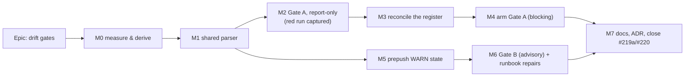

# Implementation Plan: Drift gates — a computed observer for the register and for the pass

- **Feature spec:** [`./feature-spec.md`](./feature-spec.md) — **not yet approved**
- **Status:** Draft — awaiting approval
- **Owner:** repo tooling

> **A note on two template fields, and why they are answered the way they are.**
>
> The template requires each milestone to name **an entry point** or declare that it **ships dark**
> (ADR-0081 §1), and to land **a flag-on Playwright journey** with the first user-facing milestone
> (ADR-0081 §2). This epic has no browser surface at all — a Playwright config is explicitly out of
> scope — so:
>
> - **Entry point** for a tooling milestone is **the command a maintainer runs** and **the line it
>   prints in `pnpm prepush`**. That is a real entry point in ADR-0081's sense: something you can
>   reach and press. A milestone that produces a module nobody can invoke says **ships dark**.
> - **The journey's role** — proving the thing works when driven for real rather than in a
>   fixture — is taken by two substitutes, both required: the **`--self-test` fixture run** wired
>   into the ordinary gate invocation, and the **verified-red evidence** captured against the live
>   repository before the gate is armed. ADR-0081's hole survived unit tests and a human read and
>   died the first time something drove the real product; here, "the real product" is this
>   repository, and M2 and M6 both run against it un-repaired.

## Breakdown

### Epic

**Drift gates** — give two documented obligations a computed observer: the debt register's status
(`docs/TECH_DEBT.md` #219(a)) and the reconciliation trigger (`#220`). Roadmap theme: repository
maintenance / drift control (ADR-0058, ADR-0076). No product capability changes.

---

## Milestone M0 — Measure and derive (ships dark)

**Outcome:** the threshold is a number with a derivation and a falsification condition behind it,
and the epic's own problem statement has been re-verified against the tree it will run on.
**Ships dark:** nothing is invocable; the deliverable is a committed measurement under
`docs/specs/drift-gates/`.
**Journey substitute:** none needed — this milestone's whole output _is_ measurement.

> **Why this is first, and not an afterthought.** Six consecutive epics in this repository have had a
> headline number contradicted by their own measurement, and ADR-0113's finding is sharper still: a
> problem statement can be stale even when the person reporting it is looking at their own screen.
> The counts in the spec were measured on 2026-08-30; if this epic starts later, they will have
> moved, and #219's central lesson is that a document about the register is a document like any
> other.

#### Feature: the derivation

> **Description:** re-derive the ADR/pass interval series from `git`, set the threshold, and record
> the falsification condition **before** any of it is written into config.
> **Complexity:** S
> **Dependencies:** none
> **Risks:** the git-derived series differs materially from the `**Date:**`-derived one in
> spec §4.6 → that is what the falsification condition is for, and the spec is corrected in place
> rather than quietly kept.
> **Testing requirements:** the derivation script prints the table; the numbers are compared against
> the two independent corroborations already in the spec (the 08-25 pass's own "eleven", the 08-30
> pass's own "nine").

##### Task M0-T1 — Re-derive the series from git

- **Description:** produce, from `git log --diff-filter=A --format=%aI -- docs/adr/`, the ADR
  landing date for all 119 ADRs; join to `docs/RECONCILE.md`'s pass dates; print the interval table,
  the distribution, and the warning-live fraction per candidate threshold.
- **Complexity:** S
- **Dependencies:** none
- **Risks:** squash-merges attribute an ADR to its merge date, and a renamed ADR file reads as a new
  add → both are _closer_ to "when it landed" than the document's own claim, and both are recorded
  in the output's header rather than corrected.
- **Testing:** the two corroborations above must reproduce. If either does not, stop and find out
  why before choosing a number.
- **Development steps:**
  1. Write the falsification condition into `docs/specs/drift-gates/measurement.md` **first**: _if
     the git-derived p75 differs from 7.75 by more than 1, the threshold changes and spec §4.6 is
     corrected in place, not annotated._
  2. Derive and print the table; commit it verbatim into `measurement.md`, including the ADRs whose
     `**Date:**` field disagrees with git (expected: at least 0069, 0070, 0071, 0093).
  3. Record the chosen threshold and the day backstop, with the arithmetic.

##### Task M0-T2 — Measure the runtime budget

- **Description:** time `git log --diff-filter=A -- docs/adr/` and the two file reads on this
  machine; confirm the combined cost fits the < 1.0 s budget (spec S7).
- **Complexity:** S
- **Dependencies:** M0-T1
- **Risks:** `git log` over a long history is slower than assumed → bound it with
  `--since=<last pass date>`, which is all the gate needs; record the measured figure either way.
- **Testing:** three timed runs, warm and cold; the numbers go into `measurement.md`.
- **Development steps:** measure; record; state which variant was chosen and why.

##### Task M0-T3 — Re-verify the problem statement

- **Description:** re-run every count in spec §1 against the tree as it stands on the day the epic
  starts, and correct the spec in place if any has moved.
- **Complexity:** S
- **Dependencies:** none
- **Risks:** rows added or closed between spec and start silently invalidate the "17" and "94"
  figures that M3 is sized against.
- **Testing:** the seven counts in §1's table.
- **Development steps:** re-run; correct; note the deltas in `measurement.md`.

---

## Milestone M1 — The shared parser (ships dark)

**Outcome:** one module that both gates parse Markdown with, and a fixture harness that can prove it
rejects what it must.
**Ships dark:** no `check:*` script exists yet; nothing runs it but its own fixtures. The next
milestone surfaces it.
**Journey substitute:** the `--self-test` fixture run, which lands here rather than later — this is
the milestone where "it works" is a claim, and the fixtures are what make it checkable.

#### Feature: `scripts/lib/doc-register.mjs`

> **Description:** fence-stripping, section splitting, column-0 field extraction, table-column
> reading, and a shared `report()` that implements the 0 / 1 / 2 exit convention.
> **Complexity:** M
> **Dependencies:** none (Node built-ins only — spec D-e)
> **Risks:** the module grows into a general Markdown parser → its API is fixed to the five
> functions the two gates need, and a sixth consumer is a design conversation, not an addition.
> **Testing requirements:** fixture files with expected parses, including every trap in spec §4.4.

##### Task M1-T1 — The module

- **Description:** implement `readRepoDoc(path)`, `stripFences(md)`, `sections(md, level)` (heading
  text, body, 1-based line numbers), `tableRows(md, headingText)` (cells by index), and
  `report({ problems, warnings, summary })`.
- **Complexity:** M
- **Dependencies:** none
- **Risks:** a subtle fence-tracking bug silently drops half a document, and the gate then reports
  green over less than it thinks → mitigated by the pinned positive case (every caller asserts a
  minimum population and that its row count equals a naive `^## ` count taken _outside_ the parser).
- **Testing:** fixtures for: nested fences, `~~~` fences, an unterminated fence, a `## ` inside a
  fence, a `**Status:**` inside inline code, a `**Status:**` indented by two spaces, a table with a
  date in a prose column.
- **Development steps:**
  1. Implement, with a docblock naming the six recorded prose-scan failures and why every match is
     anchored at column 0.
  2. Write the fixtures; each is a few lines and carries a comment saying which real defect it pins.
  3. Implement `--self-test` as an exported runner both gates call.

##### Task M1-T2 — The exit-code convention

- **Description:** `report()` owns the convention: **0** clean, **1** blocking findings, **2**
  advisory findings, and it refuses to emit 0 when the caller passes a zero population.
- **Complexity:** S
- **Dependencies:** M1-T1
- **Risks:** a future gate returns 2 for something that ought to block → the docblock states the
  discriminator: exit 2 is for an obligation whose remedy is somebody's judgement, exit 1 for one
  whose remedy is an edit to the file that failed.
- **Testing:** a fixture per exit code; a fixture asserting the empty-population refusal.
- **Development steps:** implement; document; pin all three exit codes in the self-test.

---

## Milestone M2 — Gate A, report-only, and the red run

**Outcome:** `node scripts/check-debt-status.mjs --report` prints the register's true status and
every well-formedness finding — against the register **as it stands**, un-repaired.
**Entry point:** the command `node scripts/check-debt-status.mjs --report`. It is deliberately
**not** yet a `package.json` `check:*` script, because `scripts/prepush.sh:60-63` derives its roster
from those keys and registering it here would make it blocking before M3 has repaired the file.
**Journey substitute:** the red run itself — the gate driven against the real repository, with its
output committed as evidence (ADR-0110 D5).

#### Feature: the register gate

> **Description:** assertions A1–A9 from spec §4.5.
> **Complexity:** M
> **Dependencies:** M1
> **Risks:** an assertion that cannot fail (the ADR-0110 D5 defect, and this repository has shipped
> it) → every one of A1–A9 lands with the fixture that makes it fail, and the fixture is committed.
> **Testing requirements:** `--self-test` green; the live report reproduces the spec's counts.

##### Task M2-T1 — Parse and report

- **Description:** implement the parse and the summary line; no findings yet, no exit codes but 0.
- **Complexity:** S
- **Dependencies:** M1-T1
- **Risks:** the parse silently misses rows → **acceptance condition: the reported row count equals
  107** (or M0-T3's re-measured figure), and the reported compact-table count equals 66.
- **Testing:** run against `docs/TECH_DEBT.md`; compare with the independent grep counts.
- **Development steps:** parse; print; compare; record the comparison in the docblock.

##### Task M2-T2 — Assertions A1–A9

- **Description:** implement each assertion with its message, its line number, and the sentence
  telling the author what to do.
- **Complexity:** M
- **Dependencies:** M2-T1
- **Risks:** A3 (the CLOSED heading check) matching a body sentence about closure — instance six of
  the prose trap, and #219 records it happening to an earlier classifier → A3 reads the **heading
  line only**, with a fixture whose body says "this row would read as closed" and whose expected
  result is _no finding_.
- **Testing:** one fixture per assertion, each verified to fail before the assertion exists.
- **Development steps:**
  1. A1, A2, A8 (status grammar). 2. A3 (heading annotations). 3. A4, A5, A6 (numbering + ledger).
  2. A7 (the table ratchet, reading `scripts/debt-register.json`). 5. A9 (pinned positive case).

##### Task M2-T3 — Capture the red run

- **Description:** run the gate against the un-repaired register; commit its full output into
  `docs/specs/drift-gates/red-run.md`.
- **Complexity:** S
- **Dependencies:** M2-T2
- **Risks:** the run finds fewer than the expected 94 + 17 findings → that is a parser bug, not good
  news, and the milestone does not close until the discrepancy is explained.
- **Testing:** the counts must match §1's table (or M0-T3's).
- **Development steps:** run; commit the output; reconcile against the expected counts in writing.

---

## Milestone M3 — Reconcile the register

**Outcome:** every detailed row carries a status; the 17 heading-annotated rows are deleted and
ledgered; the numbering is unique. The register answers "what is still open?".
**Entry point:** `node scripts/check-debt-status.mjs --report` now prints a clean report — the same
command as M2, with a different answer. This is the milestone a reader feels.
**Journey substitute:** the M2 red run is the before; this milestone's clean run is the after, and
both are committed.

> **This is the largest hand-work in the epic and the only part that cannot be automated**, because
> deciding whether a row is `open`, `deferred` or `standing` is a judgement. `unverified` is the
> default and needs no judgement at all, which is exactly why the settled decision makes it legal.

#### Feature: the register repair

> **Description:** three mechanical passes and one judgement pass over `docs/TECH_DEBT.md`.
> **Complexity:** L
> **Dependencies:** M2 (the report is the checklist)
> **Risks:** (a) a 6,400-line file edited by nearly every epic → land as **one PR, quickly**, and
> rebase rather than merge; (b) deleting 17 rows destroys narrative some ADR cites → the ledger's
> fourth column is the pointer, and every deletion names the commit and the ADR or `DECISIONS.md`
> entry that holds the story; (c) Prettier reflows the table → run `pnpm format` and re-run the
> gate, and note that `docs/TESTING.md:332-335` records a note written _into_ a table destroying its
> header.
> **Testing requirements:** the gate, run after each pass; `pnpm check:doc-links` (deleting rows can
> orphan anchors); `pnpm format:check`.

##### Task M3-T1 — Close and ledger the 17

- **Description:** delete each row annotated CLOSED / RESOLVED / ANSWERED; add one ledger line each
  with its number, one-line description, closing date and — per **#219(c)** — the commit that fixed
  it.
- **Complexity:** M
- **Dependencies:** M2-T3
- **Risks:** a row is annotated CLOSED and is **not** actually closed (`#169` is annotated
  "HALF CLOSED") → half-closed rows are **rewritten to be about what is left** and stay `open`,
  per `docs/TECH_DEBT.md:15-16`; only fully closed rows are deleted. `#169` is named here because it
  is the known case and #219 records that an automated sweep got it wrong.
- **Testing:** A3 and A5 go green; `check:doc-links` stays green.
- **Development steps:**
  1. List the 17 from the M2 report. 2. For each, open the file the row cites and confirm the
     closure — **not** read the row (#219's whole finding). 3. Delete + ledger, or rewrite as
     `open`. 4. Re-run the gate.

##### Task M3-T2 — Add the status lines

- **Description:** insert `**Status:** unverified` on the first content line of every detailed row
  that has none; upgrade to `open` / `deferred` / `standing` only where the row's own text already
  states it unambiguously (e.g. `#110`'s "open, deferred on a measured trigger"; `#5`'s "this row is
  a record, not a task"; `#57`'s "standing rule"; `#139`'s "deliberately NOT fixed").
- **Complexity:** M
- **Dependencies:** M3-T1
- **Risks:** the temptation to classify by reading, which is #219's finding → the rule for this task
  is explicit: **if the row does not already say it, the answer is `unverified`.** Upgrading a row
  requires opening the code it cites, and that is #219(b)'s work, not this task's.
- **Testing:** A1, A2 and A8 go green; the summary line's `unverified` count is recorded, because it
  is the baseline the next reconciliation pass will be measured against (spec §4.8).
- **Development steps:** insert; upgrade only where stated; record the histogram in the PR body.

##### Task M3-T3 — Numbering, the ledger and the ratchet

- **Description:** resolve any duplicate or ledger-colliding number the gate reports; write
  `scripts/debt-register.json` with the compact-table ratchet at its measured value and a written
  reason (the `scripts/adr-coverage.json` shape).
- **Complexity:** S
- **Dependencies:** M3-T2
- **Risks:** the ratchet is set from a miscount and immediately blocks a legitimate edit → it is set
  from the gate's own reported number, not from a hand count.
- **Testing:** A4, A5, A6, A7 green.
- **Development steps:** fix; write the JSON with reasons; re-run.

---

## Milestone M4 — Arm Gate A

**Outcome:** the register's rules are enforced on every push and in CI.
**Entry point:** `pnpm check:debt-status`, and the `ok  check:debt-status` line in `pnpm prepush`.
**Journey substitute:** the `--self-test` fixtures run inside the armed gate, so the red cases are
re-proved on every run rather than once.

#### Feature: wiring

> **Description:** register the script, add the CI step, update the three documents that list gates.
> **Complexity:** S
> **Dependencies:** M3 (arming before the repair would fail on day one — ADR-0058)
> **Risks:** the "which documents list the gates" roster is itself hand-maintained in three places →
> all three are updated in this task and named in its steps.
> **Testing requirements:** `pnpm prepush` green; CI green.

##### Task M4-T1 — Register and wire

- **Description:** add `"check:debt-status": "node scripts/check-debt-status.mjs"` to
  `package.json`; add a CI step with the comment convention the neighbours use (what it catches and
  which incident produced it).
- **Complexity:** S
- **Dependencies:** M3-T3
- **Risks:** none material. The prepush roster picks it up automatically (`scripts/prepush.sh:60-63`).
- **Testing:** `pnpm prepush`; CI.
- **Development steps:** package.json; `ci.yml`; run both.

##### Task M4-T2 — Documentation

- **Description:** add a row to `docs/RECONCILE.md`'s "What is already automated" table (`:44-56`),
  a row to `docs/TESTING.md`'s "Before you push" table (`:337-351`), the convention itself to
  `docs/TECH_DEBT.md`'s header, and the two new scripts to `scripts/README.md` — **which currently
  documents one script out of 25 and is itself a drift finding**.
- **Complexity:** S
- **Dependencies:** M4-T1
- **Risks:** `docs/TECH_DEBT.md`'s header grows a fourth bold paragraph nobody reads → the status
  convention is stated in **one** sentence with a pointer to this spec.
- **Testing:** `pnpm check:doc-links`; `pnpm format:check`.
- **Development steps:** edit the four documents; re-run the link and format gates.

---

## Milestone M5 — `prepush.sh` learns to warn

**Outcome:** an advisory gate can be heard. Today it cannot: `run()` sends a passing gate's output
to a log file and prints nothing (`scripts/prepush.sh:38-47`).
**Entry point:** any `pnpm prepush` run — the new `WARN` line. Proved by a temporary probe script in
this milestone, and by Gate B in M6.
**Journey substitute:** a self-check that runs the three exit codes through `run()` and asserts what
reaches stdout. This is the milestone whose defect would otherwise be invisible, because a swallowed
warning looks exactly like no warning.

> **Blocked on CRITICAL-1.** If the product owner declines the `prepush.sh` change, M5 and M6's
> visibility half do not proceed and the epic stops after M4 with #220 unaddressed — there is no
> other design in which an advisory gate is heard (spec CRITICAL-1 lists the three alternatives and
> why each is worse).

#### Feature: the third result state

> **Description:** `run()` gains one branch: exit 2 → `WARN`, print the **whole** captured log, do
> not append to `failed`.
> **Complexity:** S
> **Dependencies:** M1-T2 (the convention)
> **Risks:** (a) a real failure that happens to exit 2 is downgraded to a warning → only two scripts
> may exit 2, and both say so in their docblock; the convention is documented in `prepush.sh` itself;
> (b) `tail -12` truncating a warning → the WARN branch prints the whole log, and Gate B's block is
> asserted to be short.
> **Testing requirements:** a self-check exercising all three states.

##### Task M5-T1 — The branch and its self-check

- **Description:** implement; add `scripts/prepush.sh --self-check`, which runs three trivial inline
  commands exiting 0, 1 and 2 through `run()` and asserts the printed output and the final status.
- **Complexity:** S
- **Dependencies:** none beyond M1-T2
- **Risks:** the self-check itself passes vacuously → it asserts a **specific string** from the
  exit-2 command's stdout is present, so a swallowed warning fails it; verified red by removing the
  new branch.
- **Testing:** the self-check, verified red against the pre-change `run()`.
- **Development steps:**
  1. Add the branch. 2. Add the self-check. 3. Remove the branch, watch it fail, restore it, and
     record that in the comment. 4. Document the convention in the script header and in
     `docs/TESTING.md`.

---

## Milestone M6 — Gate B, and the runbook repairs

**Outcome:** every pre-push run says how far behind the reconciliation pass is; the three places a
pass is recorded are checked against each other; and the two live inconsistencies found while
writing this spec are repaired.
**Entry point:** `pnpm check:reconcile-due`, and the `WARN` block in `pnpm prepush`.
**Journey substitute:** the red run — the gate driven against `docs/RECONCILE.md` **before** the
banner is fixed, where it must report the 2026-08-28 / 2026-08-30 discrepancy without any fixture.

#### Feature: the trigger

> **Description:** compute the gap; warn at 8 ADRs or 14 days; cross-check the three recording sites.
> **Complexity:** M
> **Dependencies:** M0 (the threshold), M1 (the parser), M5 (visibility)
> **Risks:** (a) `git` unavailable or shallow → WARN with the reason, never a silent 0 (spec's edge
> cases); (b) the gate becomes noise and is ignored → the honest weakness, recorded in spec §4.8 and
> in the ADR, not designed away; (c) somebody later adds it to `ci.yml` by copying a neighbour → the
> docblock states why it is deliberately absent.
> **Testing requirements:** `--self-test` fixtures; the live red run; exit code asserted to be 2 and
> never 1.

##### Task M6-T1 — Parse the three sites

- **Description:** banner date (`docs/RECONCILE.md:7`), `max()` over column 1 of the Passes-run
  table, and the newest `docs/DECISIONS.md` heading date; effective date = newest of the three;
  disagreement = a warning finding naming all three line numbers.
- **Complexity:** S
- **Dependencies:** M1-T1
- **Risks:** the table's prose column contains dates → cells are read **by column index**; a fixture
  pins a runbook whose column 4 holds a later date than any real pass, and the expected answer is
  the column-1 max.
- **Testing:** the fixture above; the live repository, which must report the banner discrepancy.
- **Development steps:** parse; compare; report; run live and capture the output.

##### Task M6-T2 — Count the ADRs and apply the thresholds

- **Description:** `execFileSync('git', ['log', '--diff-filter=A', '--format=%aI', '--name-only',
'--', 'docs/adr/'])` with a fixed argument array; count ADR files added after the effective date;
  compute days; apply the two clauses; print the WARN block naming counts, ADR numbers, days and
  `docs/RECONCILE.md`.
- **Complexity:** M
- **Dependencies:** M6-T1, M0-T1
- **Risks:** shell injection via an interpolated command string → fixed argument array, `shell:
false`, no interpolation of anything read from a document; the security reviewer's one item.
- **Testing:** fixture with a back-dated pass tripping both clauses, asserting **exit 2**; fixture
  with `git` stubbed to fail, asserting exit 2 with the "could not compute" reason and **not** 0.
- **Development steps:** implement; add `--derive` (re-prints M0's table from live data); write
  `scripts/reconcile-trigger.json` with the thresholds, the series and the ratchet rule.

##### Task M6-T3 — Repair the runbook, and record it

- **Description:** fix `docs/RECONCILE.md:7` to the newest pass date; resolve the 2026-08-30 row's
  claim that there had been "no pass since 08-25" when a 2026-08-28 row sits above it — by
  determining which is right and correcting **in place with the correction recorded**, not by
  deleting a row.
- **Complexity:** S
- **Dependencies:** M6-T1
- **Risks:** the resolution is a judgement about somebody's past intent → if it cannot be settled
  from the tree, the row keeps a one-line note saying the two disagree and why it could not be
  resolved. An unresolvable fact recorded honestly beats a tidy file.
- **Testing:** the gate goes green on the consistency clause.
- **Development steps:** determine; correct; note; re-run.

##### Task M6-T4 — Register and document

- **Description:** add `"check:reconcile-due"` to `package.json` (which arms it in prepush
  automatically); **add no CI step**; update `docs/TESTING.md`, `docs/RECONCILE.md`'s automated
  table and `scripts/README.md`.
- **Complexity:** S
- **Dependencies:** M6-T2, M5-T1
- **Risks:** a reader "fixes" the missing CI step → both the script's docblock and the
  `docs/TESTING.md` row state that its absence is the decision, with the reason (a check that cannot
  go red is a claim that something is verified when nothing is).
- **Testing:** `pnpm prepush` — with the warning live, the overall status must still be green.
- **Development steps:** register; document; run prepush twice (warning live, warning silent).

---

## Milestone M7 — The record

**Outcome:** the decisions are filed, and the epic closes its own two register rows using the
mechanism it built.
**Entry point:** none — this milestone is documentation. **Ships dark** in ADR-0081's sense, and
says so rather than implying a capability.

#### Feature: ADR, register, manual

> **Description:** file the ADR outlined in spec §4.9; close `#219(a)` and `#220`; rewrite `#219`
> to be about what is left (`#219(b)`, the ~94 unverified rows, and `#219(c)` if not fully covered);
> add the CLAUDE.md §16 entry.
> **Complexity:** S
> **Dependencies:** M4, M6
> **Risks:** the ADR number is taken between plan and filing — this has happened (ADR-0079 was filed
> one number along for exactly this reason, and ADR-0071 was cited by shipped code while absent from
> the register) → check `docs/adr/` at filing time and record the collision if there is one.
> **Testing requirements:** `pnpm check:adr-coverage` (both directions: `docs/ROADMAP.md` and
> `docs/adr/README.md`), `pnpm check:counts` (the ADR count moves), `pnpm check:doc-links`.

##### Task M7-T1 — File the ADR

- **Complexity:** S · **Dependencies:** M4, M6
- **Development steps:** confirm the number is free; write it from the §4.9 outline; add it to
  `docs/adr/README.md`; add it to `docs/ROADMAP.md` **or** exempt it in `scripts/adr-coverage.json`
  with a written reason (a drift-control decision is process, not product direction — the exemption
  is likely the honest answer, and every other ADR-0058-family decision took it); run
  `check:adr-coverage` and `check:counts`.

##### Task M7-T2 — Close the epic's own rows

- **Complexity:** S · **Dependencies:** M7-T1
- **Risks:** closing `#219` wholesale when only (a) and (c) are done → the row is **rewritten to be
  about what is left**, which is the register's own rule and, pleasingly, the rule this epic exists
  to enforce.
- **Development steps:** rewrite `#219`; delete `#220` and ledger it; run `check:debt-status`, which
  now checks that closure.

##### Task M7-T3 — The operating manual

- **Complexity:** S · **Dependencies:** M7-T1
- **Development steps:** add the ADR entry to `CLAUDE.md` §16 and the two gates to §18's pointers;
  re-run `pnpm prepush` in full.

---

## Sequencing & slices

Seven slices, each leaving `main` releasable. **No feature flag** — ADR-0088 D1 established that a
`VITE_` constant is inlined at build time and is not an operator rollback, and none of this reaches
a bundle anyway. The rollback for every slice is a revert of one commit.

| Order | Slice | Releasable because                                                                                                  |
| ----- | ----- | ------------------------------------------------------------------------------------------------------------------- |
| 1     | M0    | Adds one document under `docs/specs/`. Changes no behaviour.                                                        |
| 2     | M1    | Adds an uninvoked module and its fixtures.                                                                          |
| 3     | M2    | Adds a script nobody runs automatically; it is not a `check:*` key, so prepush ignores it.                          |
| 4     | M3    | Edits documentation only. The gate is still not armed, so a mistake here blocks nothing.                            |
| 5     | M4    | Arms Gate A **after** the file is clean — ADR-0058's "a gate that fails on day one gets deleted rather than fixed". |
| 6     | M5    | `prepush.sh` behaviour is unchanged for exit 0 and 1; only exit 2 is new, and nothing returns it yet.               |
| 7     | M6    | Adds an advisory gate that cannot fail anything, plus two one-line documentation repairs.                           |
| 8     | M7    | Documentation.                                                                                                      |

**M5 can be built in parallel with M2–M4** — it depends only on M1-T2's convention — and is drawn
that way in the breakdown. It is sequenced after M4 above only to keep one thing in flight at a time.

**The ordering that is not negotiable:** M3 before M4 (arm after repair), and M5 before M6 (a gate
whose output is discarded cannot be said to warn — and shipping it that way would be this
repository's own recurring defect: a capability that exists, tests green, and cannot be reached).

## Definition of Done (per task)

Each task's PR must satisfy the Feature Completion Criteria in
[`docs/PROCESS.md`](../../PROCESS.md). Two of them need translating for a tooling epic, and two do
not apply:

- **"Tests completed"** means the `--self-test` fixtures pass **and** the new assertion was verified
  red against the defect it names, with the evidence in the commit (ADR-0110 D5).
- **"The pre-push gate was run"** means `pnpm prepush` in full. `scripts/e2e-local.sh` is **not**
  required: no file under `apps/api` or `apps/web` changes in this epic, which is the condition
  `docs/TESTING.md` states. If that stops being true, the epic has grown a surface and
  `docs/PROCESS.md`'s triggers apply again.
- **Accessibility** and **Docker build**: no UI and no image content changes. Stated, not skipped.
- **Changeset:** **none.** No published package changes; `package.json` at the root is private and
  its `scripts` are not a released artefact. Version impact: **none**.

**Specialised agents to involve:**

| Agent                                                      | When                  | Why                                                                                                                                               |
| ---------------------------------------------------------- | --------------------- | ------------------------------------------------------------------------------------------------------------------------------------------------- |
| **devops-reviewer**                                        | M4, M5, M6 — required | `prepush.sh` and `ci.yml` are shared gates; the exit-code convention is the reusable half of this epic.                                           |
| **test-engineer**                                          | M1, M2 — required     | The fixture set and the verified-red procedure are the epic's only safety net, and this repository has shipped a blind gate before (ADR-0110 D5). |
| **security-reviewer**                                      | M6 — targeted, short  | One item: the `git` invocation must be `execFileSync` with a fixed argument array and no interpolation.                                           |
| **database-architect**                                     | not engaged           | There is no schema change to design — not a judgement that one is too small (CLAUDE.md §19.3).                                                    |
| **accessibility / component / ux / performance reviewers** | not engaged           | No UI, no component contract, no bundle. Stated so the omission is a decision rather than an oversight.                                           |

## Risks & assumptions (rollup)

| Risk / assumption                                                 | Likelihood | Impact | Mitigation                                                                                                                                                                                                                         |
| ----------------------------------------------------------------- | ---------- | ------ | ---------------------------------------------------------------------------------------------------------------------------------------------------------------------------------------------------------------------------------- |
| **CRITICAL-1 declined** — `prepush.sh` may not change             | low        | high   | The epic stops after M4 with #220 unaddressed. There is no alternative design; spec CRITICAL-1 lists the three considered and why each is worse.                                                                                   |
| **CRITICAL-2 answered "migrate the table"**                       | low        | high   | M3 roughly doubles: 66 wide rows re-read and rewritten. Would become its own milestone between M3 and M4, and would drag #219(b)'s verification work with it.                                                                      |
| Gate B's warning is ignored, exactly as #220 happened             | **high**   | med    | Cannot be mitigated away, and is not: recorded in spec §4.8 and in the ADR. Printed in full, names the ADRs, and the day clause prevents silence.                                                                                  |
| `unverified` becomes wallpaper — 88 rows for months               | med        | med    | The count is printed on every run; if it has not fallen by the next reconciliation pass, that is a finding for that pass, and the spec says so in advance.                                                                         |
| The M3 bulk edit conflicts with a concurrent epic's register edit | med        | low    | Land as one PR, quickly; rebase, never merge (CLAUDE.md §8).                                                                                                                                                                       |
| A gate ships that cannot fail                                     | med        | high   | Every assertion lands with the fixture that makes it fail; the red run is committed; A9 pins a positive case. This repository has shipped the defect at least three times (ADR-0110 D5, ADR-0108's census, ADR-0088's no-op pins). |
| The parser silently sees fewer rows than exist                    | med        | high   | The row count is compared against a naive `grep -c '^## '` taken outside the parser, as an acceptance condition, not as a log line.                                                                                                |
| The threshold is wrong for the project's future cadence           | med        | low    | It is a ratchet in JSON with a `--derive` mode; lowering is free, raising requires a fresh series.                                                                                                                                 |
| The git-derived series contradicts §4.6's `**Date:**`-derived one | med        | low    | M0's falsification condition is committed before the run; the spec is corrected in place.                                                                                                                                          |
| Deleting 17 rows orphans an anchor an ADR links to                | low        | med    | `check:doc-links` runs after M3-T1; the Closed-numbers ledger exists precisely to keep number citations resolvable (`docs/TECH_DEBT.md:18-21`).                                                                                    |
| Prettier reformats the register or the runbook table              | low        | med    | `pnpm format` then re-run both gates; `docs/TESTING.md:332-335` records a note-in-a-table destroying its header, which is the shape to watch for.                                                                                  |
| **Assumption:** `git` history is available where the gate runs    | —          | —      | True locally; Gate B is in no CI step. Where it is not, the gate warns with the reason and never reports OK.                                                                                                                       |
| **Assumption:** Prettier will not move `**Status:**` off column 0 | —          | —      | `.prettierrc.json` sets no `proseWrap`; the register's hand-wrapped prose and multi-line status tails pass `format:check` today.                                                                                                   |
| **Assumption:** no other epic is blocked by this one              | —          | —      | Nothing in `apps/` changes; the only shared file touched outside `docs/` and `scripts/` is `.github/workflows/ci.yml` (one added step).                                                                                            |
