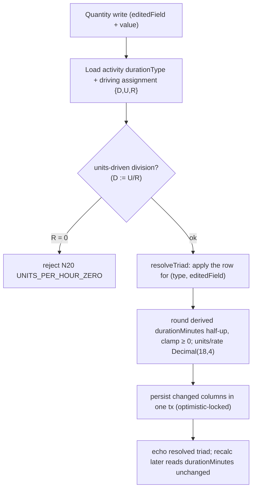
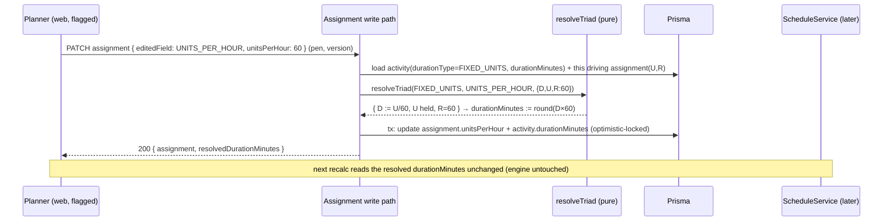

# Feature Spec: Duration Types & the Resource-Units model (M7 rung 4)

- **Status:** Draft (awaiting approval)
- **Author(s):** feature-analyst (Product Owner / Solution Architect / Technical Lead hats), with James Ewbank
- **Date:** 2026-07-17
- **Tracking issue / epic:** Engine conformance & validation framework (ADR-0034) — capability epic **M7 (the Resource dimension)**, **rung 4: Duration/Units types** (`dt_*`). Follows M7.1/M7.2 (the resource model + resource-dependent scheduling, ADR-0039).
- **Roadmap link:** `docs/specs/engine-conformance-framework/CAPABILITY_MATRIX.md` — the ⚪ **Duration types** row (`dt_fixed_units`, `dt_fixed_units_time`, `dt_fixed_dur_units`, and the default `dt_fixed_dur_units_time`), "needs the resource/units model" — now unblocked by ADR-0039. **Percent-complete types** (`pct_physical`, `pct_units`, `code_steps`) stay ⚪ and are **explicitly deferred to a later EV rung** (see the boundary decision in §1/§4).
- **Related ADR(s):**
  - **ADR-0040 _(NEW — proposed, drafted in outline by this rung; §4)_** — Duration types & the resource-units triad: where `duration_type` and `units/time` live, the recompute truth table, and the service-boundary-vs-engine split.
  - **ADR-0035 _(new clauses proposed, Accept under this rung)_** — §26 (the duration-type recompute contract + the `U = D × R` triad semantics), §27 (units/time home = the driving assignment; duration-derivation boundary; zero/negative guards), and the N19/N20 negative-case additions to §25. (%-complete types are reserved for a §28 the EV rung Accepts, not this one.)
  - **Builds on:** ADR-0039 (`Resource`/`ResourceAssignment` + `isDriving` + `RESOURCE_DEPENDENT`; the units column extends the same assignment), ADR-0036 (durations in working **minutes** — the triad is minute-exact), ADR-0037 (per-activity/driving-resource calendar port — the axis the derived duration is placed on), ADR-0022 (engine-owned write contract), ADR-0012/0016 (RBAC + org scope), ADR-0034 (the conformance parity gate), ADR-0028 (edit-pen), ADR-0007 (RHF+Zod forms).

> **This rung gives SchedulePoint P6-class _duration types_ — the rule that decides which of {Duration, Units, Units/Time} is _recomputed_ when a planner changes another.** It is the natural successor to the resource model (ADR-0039): that rung gave every assignment a `budgetedUnits`; this rung adds the **rate** (`units/time`), the per-activity **`duration_type`**, and the **pure recompute function** that keeps the identity `Units = Duration × Units/Time` true at every edit. The design is deliberately **additive and engine-neutral**: the recompute is a **service-boundary "assignment math" concern** that resolves a `durationMinutes` and persists it; **the CPM engine is unchanged** and the no-units path stays **byte-identical** (the ADR-0034 parity gate). It is sliced as an epic of rungs, exactly like ADR-0039: **rung A** (schema + recompute math + engine tie-in — the shippable first slice), **rung B** (conformance — flip the `dt_*` matrix rows, Accept the ADR-0035 clauses), **rung C** (flagged web surface). **Percent-complete/earned-value types are a later rung**, not this one.

---

## 1. Business understanding

### Problem

SchedulePoint can now model **resources** and assign them to activities with a **budgeted quantity** of work (ADR-0039: `ResourceAssignment.budgetedUnits`), and a `RESOURCE_DEPENDENT` activity schedules on its driving resource's calendar (§23). But the model is **static**: an activity's `durationMinutes`, its assignment's `budgetedUnits`, and the resource's **productivity rate** are unrelated numbers. There is no notion of the relationship every real planning tool enforces:

> **Units = Duration × Units/Time** — the budgeted work of a driving resource equals the activity's working duration times the rate at which that resource produces (units per hour).

Because that identity is not modelled, SchedulePoint cannot answer the questions a planner asks constantly:

- _"This 10-day excavation needs 30 crew-hours/day of a civil operative — if I add a second crew (double the rate), how short does it get?"_ (Fixed Units: **duration** recomputes.)
- _"I've only got the crane for 5 days — at that fixed duration and rate, how many units of lift does that buy?"_ (Fixed Duration & Units/Time: **units** recompute.)
- _"The concrete pour is 400 m³ at a fixed 8-day duration — what daily rate must I sustain?"_ (Fixed Duration & Units: **units/time** recomputes.)

P6 encodes this as an activity's **Duration Type** — one of four values that decides **which of the three quantities is held and which is recomputed** when a planner edits another. The conformance fixture carries a `duration_type` on **every** activity (all four P6 values appear — the dominant default `FIXED_DURATION_AND_UNITS_TIME`, plus `FIXED_DURATION_AND_UNITS`, `FIXED_UNITS`, `FIXED_UNITS_TIME`) and a `units_per_hour` on every assignment, and the capability matrix marks the `dt_*` row **⚪ Deferred — "needs the resource/units model."** That model now exists; this is the rung that consumes it.

**Why now.** Duration types are the **first** capability the resource model unblocks and the one with the least new machinery: the triad is a **pure arithmetic identity** in the working-minute units ADR-0036 already established, computed at the write boundary — **no new CPM-pass logic, no engine axis change**. It is the cheap, high-value next rung before the heavier deferred quadrant (levelling — a new scheduling pass; cost/EV — a whole new dimension). It also makes the resource model _felt_: a planner who assigns a crew and a rate now sees the duration respond, which is the point of having assigned it.

### Users

Roles are per **organisation membership** (ADR-0012/0016). Setting an activity's duration type and editing the driving assignment's units/rate is a **definition-level, Planner-owned** act (same class as editing a duration or a dependency); everyone else reads the resulting dates and quantities.

| Role                                | Need in this rung                                                                                                                                                                                                              |
| ----------------------------------- | ------------------------------------------------------------------------------------------------------------------------------------------------------------------------------------------------------------------------------ |
| **Org Admin**                       | Full definition access; read all computed quantities; never locked out of the org's data.                                                                                                                                      |
| **Planner**                         | Set an activity's **duration type**; enter the driving assignment's **units** and **units/time**; edit any one of {duration, units, units/time} and have the correct **other** field recompute per the type. The primary user. |
| **Contributor**                     | Same as Planner for activities in scope (pen-gated); smaller scope.                                                                                                                                                            |
| **Viewer / External Guest**         | Read an activity's duration type, its driving assignment's units and rate, and the schedule that results. No edits.                                                                                                            |
| **Engine / conformance maintainer** | Flip the `dt_*` capability rows to ✅ with first-principles goldens + differentials (flip a duration type ⇒ a different field moves); Accept ADR-0035 §26/§27; keep the no-units path byte-identical.                          |

### Primary use cases

1. **Set an activity's duration type** — a Planner picks one of the four P6 duration types on an activity (default `FIXED_DURATION_AND_UNITS_TIME`).
2. **Enter units + rate on the driving assignment** — a Planner sets the driving assignment's `budgetedUnits` (exists) and `unitsPerHour` (new), and the triad is made consistent.
3. **Edit one quantity, have another recompute** — the Planner edits the activity's duration (or the assignment's units, or its rate); per the duration type, exactly one **other** quantity is recomputed and persisted, keeping `Units = Duration × Units/Time` true.
4. **Drive an activity's duration from its resource** — for a **Fixed Units** or **Fixed Units/Time** activity, the **duration itself is derived** (`Duration = Units ÷ Units/Time`) from the driving assignment and fed to the CPM engine (the tie-in to §23/ADR-0039).
5. **Recalculate & read** — the schedule reflects the derived durations; a non-driving or unit-less activity is unaffected (parity).
6. **(Conformance)** flip `dt_fixed_units` / `dt_fixed_units_time` / `dt_fixed_dur_units` (+ the default) to ✅ with goldens/differentials; Accept the ADR-0035 clauses.

### User journeys

**Happy path — Fixed Units drives duration.** A Planner opens the excavation activity, sets **Duration Type → Fixed Units**, and on the driving Civil-Crew assignment enters `budgetedUnits = 300 h`, `unitsPerHour = 30`. The activity's duration resolves to `300 ÷ 30 = 10` working hours-of-crew → the service persists the equivalent `durationMinutes`. The planner then **doubles the rate** to `60`; the duration recomputes to `5` (units held). Recalculate: the activity and its successors move earlier. See the recompute-truth-table and data-flow diagrams in §4.

**Happy path — Fixed Duration & Units/Time absorbs into units (the default).** A planner leaves an activity on the default type, enters a `10 d` duration and a `unitsPerHour = 4`; `budgetedUnits` is computed (`= 10 d × working-hours/day × 4`) and shown. Editing the duration to `12 d` recomputes **units** (duration and rate held). The schedule is unchanged by the units number — the default type never lets units drive the schedule.

**Alternate — no driving assignment / no rate.** An activity with no driving assignment, or a driving assignment with no `unitsPerHour`, has **nothing to recompute**: its `durationMinutes` is whatever the planner entered, and the triad is inert. The whole feature is dark until a rate is supplied — the parity gate.

**Alternate — material / milestone.** A `MATERIAL` resource is never a driver (ADR-0039), so it never participates in the duration triad. A milestone (0 duration, 0 units) is inert regardless of its (default) duration type.

**Read-only (Viewer/Guest).** Sees the duration type, units and rate, and the resulting dates; no edit affordance.

**Conformance journey.** The maintainer teaches the adapter to read the fixture's `duration_type` + the driving assignment's `units_per_hour`, resolves each activity's `durationMinutes` through the same pure function the API uses, adds first-principles goldens (a Fixed-Units activity's duration = units ÷ rate; a Fixed-Duration activity's duration untouched), adds an S-style differential (flip the duration type ⇒ a **different** quantity moves), rejects N19/N20 at the boundary, flips the `dt_*` rows, and Accepts ADR-0035 §26/§27 — with the no-units path byte-identical.

### Expected outcomes

- Planners get **P6-class duration types**: the single most-used data-entry behaviour a scheduling tool provides after logic and calendars — edit one of {duration, units, rate} and the right other one follows.
- The resource model becomes **dynamic**: assigned units and rates now **drive duration** (for the units-driven types), closing the loop ADR-0039 opened.
- The conformance matrix's **Duration types** row flips ⚪ → ✅; ADR-0035 gains an accepted **duration-type contract**; the units/rate model that the later **%-complete / earned-value** rung needs is now in place.
- **Zero engine risk**: the CPM engine is untouched; the parity suite is the net.

### Success criteria

- **Truth-table correctness (goldens).** For each of the four duration types, editing each of {duration, units, units/time} recomputes exactly the field the table (§4) specifies, and the identity `budgetedUnits = (durationMinutes ÷ 60) × unitsPerHour` holds to the Decimal(18,4) precision after every write. Unit-proven by a pure-function golden per cell.
- **Duration drive (dt_fixed_units / dt_fixed_units_time).** A Fixed-Units activity whose driving assignment has units + rate schedules on the **derived** duration (`units ÷ rate`), and a differential that flips the type off (to Fixed-Duration) leaves the duration at its entered value — proving the drive is wired.
- **Parity gate.** A plan with **no `unitsPerHour` on any driving assignment** (or no driving assignment) recalculates and stores `durationMinutes` **byte-identically** to the pre-rung output across every prior golden + scenario (ADR-0034/0037/0039 gate).
- **Boundary (N19/N20).** Negative `unitsPerHour` is rejected at the API (`@Min(0)`); a `unitsPerHour` of 0 that would divide (a units-driven type with units set) is rejected with a clear message — never a NaN/Infinity duration.
- **Tenancy & standards.** All writes deny-by-default, org- + plan-scoped, pen-gated, optimistic-locked, audited; `duration_type` and `unitsPerHour` are ordinary client-settable definition fields (the derived field is server-computed, never blindly trusted from the client); `pnpm lint && typecheck && test` green; ADR-0040 + ADR-0035 §26/§27 accepted; database-architect / api / security / backend-performance (and, for the flagged UI, a11y/component/ux) reviews clean.

### Open questions

The design-changing ones are surfaced in the implementation plan's **"Critical questions for approval,"** with defaults stated inline so work is not blocked. In brief:

1. **Four duration types vs three (CRITICAL).** The fixture actually carries **all four** P6 duration types (the task's "three" omitted the dominant default `FIXED_DURATION_AND_UNITS_TIME`). _Recommended default:_ model **all four** — a closed P6 enum; three-plus-coerce is strictly worse and mis-scores the default.
2. **Drive duration from the driving resource (CRITICAL).** For **Fixed Units / Fixed Units/Time**, derive `durationMinutes` from `units ÷ units/time` at the write boundary and feed the engine the resolved value (P6 behaviour). _Recommended default:_ **yes** — this is the point of the rung; the derivation is a pure, calendar-independent function.
3. **%-complete-types boundary (CRITICAL).** Physical/units/steps percent-complete types (which change how **remaining duration** is measured under progress) belong to the **earned-value rung**, not this one. _Recommended default:_ **defer** — this rung is the **planning-time** triad only (duration/units/rate), no progress semantics.
4. **Recompute location: service boundary vs engine (CRITICAL-ish).** Put the recompute in a **pure service-boundary function** (the write path resolves `durationMinutes`), **not** in the CPM pass. _Recommended default:_ **service boundary** — argued in §4.
5. _Non-critical (defaults applied):_ **units/time home = the assignment** (`ResourceAssignment.unitsPerHour`), not the resource (`resource.max_units_per_hour` stays reserved for levelling); **only the driving assignment** participates in the triad; **do not** add `remaining_units`/`actual_units`/`curve` yet (EV rung); **precedence** when a write touches more than one field = the explicitly-edited field wins, ties broken duration → units → rate; the derived field is **recomputed and stored** (not computed on read).

---

## 2. Functional requirements

### User stories & acceptance criteria

> **US-1 (Set an activity's duration type)** — As a **Planner**, I want to choose one of the four P6 duration types on an activity, so that edits recompute the field I expect.
>
> **Acceptance criteria**
>
> - **Given** I hold the edit pen (ADR-0028) and `activity:update` **when** I PATCH an activity's `durationType ∈ {FIXED_DURATION_AND_UNITS_TIME, FIXED_DURATION_AND_UNITS, FIXED_UNITS, FIXED_UNITS_TIME}` **then** it is persisted (versioned, audited); default is `FIXED_DURATION_AND_UNITS_TIME`.
> - **Given** an invalid `durationType` **then** 422 (DTO enum validation), nothing written.
> - **Given** I change **only** the duration type (no quantity edit) **then** no quantity is recomputed — the type governs **future** edits (documented P6-aligned choice: changing the type does not retroactively re-solve the triad).

> **US-2 (Units + rate on the driving assignment)** — As a **Planner**, I want to enter budgeted units and a units/time on the driving assignment, so the triad is complete.
>
> **Acceptance criteria**
>
> - **Given** a driving assignment **when** I set `budgetedUnits ≥ 0` (exists) and `unitsPerHour ≥ 0` (new) **then** both persist; the dependent field of the triad is recomputed per the activity's duration type (US-3) in the same transaction.
> - **Given** `unitsPerHour < 0` (**N19**) **then** it is rejected at the boundary (`@Min(0)`), never persisted.
> - **Given** a **non-driving** assignment **then** its `unitsPerHour`/`budgetedUnits` are stored but **do not** drive the activity's duration (only the driving assignment participates in the triad).

> **US-3 (Edit one quantity, recompute another — the truth table)** — As a **Planner**, I want the correct field to recompute when I change duration, units, or rate, so the identity stays true.
>
> **Acceptance criteria** (per the §4 truth table; `D` = working hours = `durationMinutes/60`, `U` = `budgetedUnits`, `R` = `unitsPerHour`; identity `U = D × R`)
>
> - **FIXED_UNITS** — edit `D` ⇒ `R := U/D`; edit `R` ⇒ `D := U/R`; edit `U` ⇒ `R := U/D` (duration held).
> - **FIXED_UNITS_TIME** — edit `D` ⇒ `U := D×R`; edit `U` ⇒ `D := U/R`; edit `R` ⇒ `U := D×R` (duration held).
> - **FIXED_DURATION_AND_UNITS** — edit `D` ⇒ `R := U/D`; edit `U` ⇒ `R := U/D`; edit `R` ⇒ `U := D×R` (duration held).
> - **FIXED_DURATION_AND_UNITS_TIME** (default) — edit `D` ⇒ `U := D×R`; edit `R` ⇒ `U := D×R`; edit `U` ⇒ `R := U/D` (duration held).
> - **Given** any recompute **then** the stored `durationMinutes`, `budgetedUnits`, `unitsPerHour` satisfy the identity to Decimal(18,4); `durationMinutes` stays a non-negative integer (rounded per the documented rule; see Validation).

> **US-4 (Duration derived from the driving resource — the §23/§39 tie-in)** — As a **Planner**, for a Fixed-Units / Fixed-Units-Time activity, I want its duration to follow the driving resource's units and rate, so scheduling reflects productivity.
>
> **Acceptance criteria**
>
> - **Given** a `FIXED_UNITS` (or `FIXED_UNITS_TIME`) activity with a driving assignment carrying `U` and `R` **when** an edit recomputes `D` **then** `durationMinutes := round((U/R) × 60)` is persisted and **fed to the CPM engine unchanged** (the engine reads `durationMinutes`; no engine change).
> - **Given** such an activity is also `RESOURCE_DEPENDENT` **then** the derived duration is placed on the **driving resource's** calendar (already ADR-0039) — the working-hours→minutes conversion is calendar-independent, so no interaction bug.
> - **Given** no driving assignment, or a driving assignment with no `unitsPerHour` **then** `durationMinutes` is left exactly as the planner entered it (triad inert; parity).

> **US-5 (Read duration type, units, rate + resulting schedule)** — As any member, I want to read the triad and the schedule it produces.
>
> **Acceptance criteria**
>
> - **Given** `activity:read` **when** I read an activity **then** its `durationType` and its assignments' `budgetedUnits`/`unitsPerHour` are on the response; the schedule dates reflect any derived duration.

> **US-6 (Conformance)** — As an **engine maintainer**, I want the fixture's duration types to become runnable goldens/differentials.
>
> **Acceptance criteria**
>
> - The adapter reads each fixture activity's `duration_type` and its driving assignment's `units_per_hour`, resolves `durationMinutes` via the **same pure function** the API uses, and leaves activities with no rate on their fixture duration.
> - First-principles goldens assert a Fixed-Units activity's derived duration and a Fixed-Duration activity's held duration; an S-style differential flips a duration type ⇒ a different quantity moves; N19/N20 are runnable negatives; the `dt_*` rows flip ⚪ → ✅ and ADR-0035 §26/§27 move to Accepted, in the same PRs.

### Workflows

1. **Set duration type (write):** authz (`activity:update`, org scope, anti-IDOR) + `assertHoldsPen` → validate enum → optimistic-locked update of `durationType` only (no quantity recompute) → response.
2. **Edit a quantity (write):** authz + pen → the write DTO declares the edited field(s) and their new value(s) → the service loads the activity (`durationType`, `durationMinutes`) **and its driving assignment** (`budgetedUnits`, `unitsPerHour`) in one query → the **pure `resolveTriad(type, edited, {D,U,R})` function** returns the new `{D,U,R}` → the service persists the changed activity column (`durationMinutes`) and/or assignment columns in one transaction (optimistic-locked) → response echoes the resolved triad.
3. **Recalculate (read-through):** unchanged from ADR-0039 — the service loads `durationMinutes` (already resolved at write time) and runs the engine. **No triad math at recalc time** (planning-time only; progress-driven re-derivation is the EV rung).
4. **Conformance run:** the adapter resolves each fixture activity's `durationMinutes` through `resolveTriad` from `duration_type` + driving `units_per_hour`, then runs the existing goldens/differentials.

### Edge cases

- **No rate / no driving assignment:** triad inert; `durationMinutes` as entered; byte-identical (parity gate).
- **`unitsPerHour = 0` on a units-driven edit** (would divide by zero: `D = U/0`): **rejected** (N20) — never Infinity/NaN. A 0 rate is allowed only where it is not a divisor (e.g. a Fixed-Duration type editing duration, which multiplies) — but recommend rejecting `0` for any driving assignment on a units-driven type to keep the rule simple; documented.
- **Non-integer derived minutes:** `(U/R) × 60` rarely lands on an integer minute; **round half-up to the nearest whole minute** (documented; ADR-0036 stores integer minutes), and re-derive the _displayed_ units from the rounded duration so the shown triad is self-consistent (or surface the residual — see Validation). Milestones stay 0.
- **Changing the driving assignment** (mark a different assignment driving) on a units-driven activity: re-runs `resolveTriad` against the new driver (the previously-derived duration may change); documented.
- **Multiple assignments:** only the **driving** one participates; non-driving assignments' units are independent bookkeeping.
- **Material driver:** impossible (ADR-0039 rejects a material `isDriving`), so a material never enters the triad.
- **Concurrent edits:** optimistic lock (409) + pen (423) cover both the activity and the assignment rows; the triad write touches both in one transaction, so a stale version on either aborts the whole write.
- **Milestone / zero-duration task:** `durationType` inert (duration is 0 / fixed by type semantics); no recompute.

### Permissions (RBAC + resource scope, ADR-0012/0016)

No new permissions — this rung rides the existing activity/assignment write permissions.

| Action                                              | Permission                             | Scope        | Notes                                                  |
| --------------------------------------------------- | -------------------------------------- | ------------ | ------------------------------------------------------ |
| Set `durationType`                                  | `activity:update`                      | resolved org | pen-gated, optimistic-locked                           |
| Edit `budgetedUnits` / `unitsPerHour` (+ recompute) | `activity:update`                      | resolved org | pen-gated; only the driving assignment drives duration |
| Read duration type / units / rate                   | `activity:read`                        | resolved org | every member                                           |
| Recalculate / read schedule                         | `schedule:calculate` / `schedule:read` | resolved org | unchanged                                              |

Deny-by-default throughout; the **derived** field is server-computed (the client's value for it is ignored/overwritten), never a trusted input.

### Validation rules (shared client ↔ server where possible)

- `Activity.durationType ∈ {FIXED_DURATION_AND_UNITS_TIME, FIXED_DURATION_AND_UNITS, FIXED_UNITS, FIXED_UNITS_TIME}` — new Prisma enum `DurationType` + `@repo/types` union in lock-step; default `FIXED_DURATION_AND_UNITS_TIME`.
- `ResourceAssignment.unitsPerHour` — optional `Decimal(18,4)?`, `@Min(0)` (**N19**); a DB `ck_resource_assignments_units_per_hour_nonneg (>= 0)` CHECK backs the boundary reject (the ADR-0039 `budgetedUnits` precedent).
- **Zero-rate divisor guard (N20):** for a units-driven recompute (`D := U/R`), `R = 0` is rejected (`UNITS_PER_HOUR_ZERO`) before any division; the pure function never divides by zero.
- **Rounding:** derived `durationMinutes = roundHalfUp((U/R) × 60)`, clamped `≥ 0`; derived `budgetedUnits`/`unitsPerHour` kept at Decimal(18,4). The identity is asserted **on the stored integer-minute duration** (a small rounding residual on units is documented and, per the non-critical default, absorbed by re-deriving the shown dependent).
- **Edited-field declaration:** the write carries which field the planner changed (see §4 API); precedence when more than one is present = the explicitly-edited field wins, ties broken duration → units → rate (documented).
- Engine-owned outputs unchanged; `durationType`/`unitsPerHour` are **client-settable** definition fields (unlike `resourceDriverMissing`).

### Error scenarios

| Scenario                                                  | Detection                   | User-facing result                                 | Status |
| --------------------------------------------------------- | --------------------------- | -------------------------------------------------- | ------ |
| Not a member of the org                                   | authz scope check           | friendly forbidden                                 | 403    |
| Missing `activity:update`                                 | permission check            | forbidden                                          | 403    |
| Invalid `durationType` enum                               | DTO (`class-validator`)     | inline validation error                            | 422    |
| Negative `unitsPerHour` (**N19**)                         | DTO `@Min(0)` + CHECK       | inline validation error                            | 422    |
| Zero `unitsPerHour` on a units-driven recompute (**N20**) | service pre-division guard  | "rate must be greater than zero to drive duration" | 422    |
| Not holding the edit pen                                  | `assertHoldsPen` (ADR-0028) | locked                                             | 423    |
| Stale `version` on activity or assignment                 | optimistic `updateMany` = 0 | "changed elsewhere, refresh"                       | 409    |
| Activity / assignment / resource in another org/plan      | service scope check         | not found                                          | 404    |

---

## 3. Technical analysis

| Area           | Impact                    | Notes                                                                                                                                                                                                                                                                    |
| -------------- | ------------------------- | ------------------------------------------------------------------------------------------------------------------------------------------------------------------------------------------------------------------------------------------------------------------------ |
| Frontend       | med (flagged, deferrable) | A **duration-type picker** on the activity editor; **units/time** field on the assignment panel; a **live recompute preview** showing which field will change. Behind `VITE_DURATION_TYPES`. Deferrable like ADR-0039 F6.                                                |
| Backend        | med                       | New pure **`duration-type` domain module** (`resolveTriad` + the truth table) consumed by **both** the activities write path (duration edit, type set) and the assignment write path (units/rate edit). No new NestJS module; a shared pure helper + DTO/service wiring. |
| Database       | **low–med**               | Additive: `DurationType` enum + `activities.duration_type` (default) + `resource_assignments.units_per_hour Decimal(18,4)?` + a non-negative CHECK. No data migration (defaults backfill). Designed with **database-architect**; **ADR-0040**.                           |
| API            | low–med                   | Additive fields on the activity + assignment DTOs; an **edited-field** discriminator on the quantity-write DTOs; `@repo/types` + OpenAPI. Additive → **minor** bump.                                                                                                     |
| Security       | low                       | No new permissions/surface; the derived field is server-computed (never trusted from client); N19/N20 boundary rejects; org/plan scope + pen unchanged. security-reviewer on the write paths (derived-field trust, IDOR).                                                |
| Performance    | low                       | The triad is O(1) arithmetic at write time; the quantity write loads **one** driving assignment alongside the activity (no N+1). **Recalc is unchanged** (duration already resolved). Re-verify the ADR-0036/0037 recalc budget is untouched.                            |
| Infrastructure | none                      | No new services/env/containers.                                                                                                                                                                                                                                          |
| Observability  | low                       | Optionally log the recompute (`durationType`, editedField, resolved triad) at debug; no new metric.                                                                                                                                                                      |
| Testing        | high                      | Pure-function goldens per truth-table cell (4 types × 3 edits) incl. rounding + zero-rate; service tests (derived-field trust, driving-only, N19/N20, parity); conformance adapter + `dt_*` goldens + differential; flagged FE component/a11y.                           |

### Dependencies

- **Prerequisite (landed):** **ADR-0039** — `Resource`/`ResourceAssignment` (+ `budgetedUnits`, `isDriving`, `RESOURCE_DEPENDENT`); this rung adds `unitsPerHour` to that assignment and `durationType` to the activity. **ADR-0036** — durations in working minutes (the triad is minute-exact). **ADR-0037** — the driving-resource calendar port (the derived duration is placed there; conversion is calendar-independent).
- **Reference & standards:** `docs/REFERENCE_FEATURE.md`, `apps/api/examples/reference-feature/`, `docs/API.md`, `docs/DATABASE.md`, `docs/SECURITY_STANDARDS.md`, `docs/PERFORMANCE.md`, ADR-0015; the ADR-0039 spec/plan (the sibling this mirrors).
- **No third parties. No external oracle** (self-baselined goldens, ADR-0034).
- **Downstream (later rungs):** **%-complete / earned-value** (`pct_*`, cost, curves) builds directly on `unitsPerHour` + the deferred `actual_units`/`remaining_units`/`curve`; **levelling** consumes `resource.max_units_per_hour` (still reserved). Each is its own milestone/ADR.

---

## 4. Solution design

### Architecture overview

The rung adds a **pure `duration-type` domain module** (`resolveTriad` + the truth table + the guards) with **no I/O**, consumed by the two existing write paths (activities: duration/type; assignments: units/rate). Each write path resolves the triad in its transaction and persists the changed columns. **The schedule module and the CPM engine are untouched** — they read the already-resolved `durationMinutes`. The conformance adapter calls the **same** pure function so the fixture and the API agree by construction.

```mermaid
flowchart LR
  subgraph Web["apps/web (flagged VITE_DURATION_TYPES, deferrable)"]
    DP[Activity editor\nDuration-Type picker]
    AP[Assignment panel\nunits + units/time]
    PV[Live recompute preview\n"changing duration → units will update"]
  end
  subgraph API["apps/api"]
    subgraph DT["duration-type domain (NEW, pure — no I/O)"]
      RT[[resolveTriad(type, editedField, D,U,R)\ntruth table + rounding + zero/negative guards]]
    end
    subgraph ActMod["activities module"]
      AD[Activity DTOs\n+ durationType + editedField]
      AS[Activity write path\nload driving assignment → resolveTriad → persist durationMinutes/units]
    end
    subgraph AsgMod["assignment write path (ADR-0039)"]
      AZ[Assignment DTOs\n+ unitsPerHour (@Min 0) + editedField]
      AW[Assignment write\nload activity → resolveTriad → persist units/rate/(durationMinutes)]
    end
    subgraph SchedMod["schedule module (UNCHANGED)"]
      SS[ScheduleService reads durationMinutes]
      ENG[[Pure CPM engine — NO change\nreads durationMinutes, drives on the ADR-0037 port]]
    end
    DB[(Postgres · activities.duration_type\n· resource_assignments.units_per_hour)]
  end
  subgraph Conf["schedule/conformance (ADR-0034)"]
    AP2[adapter.ts\nfixture duration_type + units_per_hour → resolveTriad → durationMinutes]
    GD[goldens/differential\ndt_fixed_units · dt_* · flip-type-moves-a-different-field]
  end
  DP --> AD --> AS --> RT
  AP --> AZ --> AW --> RT
  AS --> DB
  AW --> DB
  DB --> SS --> ENG
  RT -. same fn .-> AP2 --> GD
  PV -. mirrors .- RT
```

### The recompute truth table (the heart of the rung)

Let `D` = working hours (`durationMinutes / 60`), `U` = `budgetedUnits`, `R` = `unitsPerHour`, with the identity **`U = D × R`**. The **duration type** names which quantity is **recomputed** (the dependent) given which field the planner **edited**. "Duration held" means the schedule-significant duration is never silently changed by that edit.

| Duration type                                 | Edit **Duration** ⇒ recompute | Edit **Units** ⇒ recompute | Edit **Units/Time** ⇒ recompute | Duration ever auto-derived? |
| --------------------------------------------- | ----------------------------- | -------------------------- | ------------------------------- | :-------------------------: |
| **FIXED_UNITS**                               | `R := U / D`                  | `R := U / D`               | `D := U / R`                    |   **Yes** (on rate edit)    |
| **FIXED_UNITS_TIME**                          | `U := D × R`                  | `D := U / R`               | `U := D × R`                    |   **Yes** (on units edit)   |
| **FIXED_DURATION_AND_UNITS**                  | `R := U / D`                  | `R := U / D`               | `U := D × R`                    |             No              |
| **FIXED_DURATION_AND_UNITS_TIME** _(default)_ | `U := D × R`                  | `R := U / D`               | `U := D × R`                    |             No              |



**Ambiguous cells are a documented choice (ADR-0035 §26).** Where a planner edits a field the type nominally "holds" (e.g. editing Units on a Fixed-Duration-&-Units-Time activity), P6 resolves by a **priority order — duration is protected first, then the pair's second member, and the remaining field absorbs**. The table above encodes that: **duration is never auto-changed except under the two units-driven types, and only on the complementary edit.** These cells are recorded in ADR-0035 §26 and asserted by goldens (no external oracle — ADR-0034).

### Data flow — edit units on a Fixed-Units activity



### Database changes

Designed with the **database-architect**; recorded in **ADR-0040**. Additive; constant defaults ⇒ no data migration; the no-units path is byte-identical.

- **New enum `DurationType`** — `FIXED_DURATION_AND_UNITS_TIME | FIXED_DURATION_AND_UNITS | FIXED_UNITS | FIXED_UNITS_TIME` (Prisma + `@repo/types`, lock-step). The fixture's four values map 1:1.
- **`Activity`** — add `durationType DurationType @default(FIXED_DURATION_AND_UNITS_TIME) @map("duration_type")`. Client-settable definition column; **not** engine-owned; no index (read on the full-plan recalc load, never a predicate — the `secondaryConstraintType` precedent).
- **`ResourceAssignment`** — add `unitsPerHour Decimal? @db.Decimal(18,4) @map("units_per_hour")` (nullable — no rate = triad inert), with raw-SQL `ck_resource_assignments_units_per_hour_nonneg (units_per_hour IS NULL OR units_per_hour >= 0)` behind the `@Min(0)` boundary reject (the `budgetedUnits` precedent, ADR-0039). No new index (the assignment is loaded by the existing `(activity_id)` partial-unique's leftmost prefix / the driving partial-unique).
- **Reserved, NOT added:** `resource.max_units_per_hour` (levelling), assignment `actual_units`/`remaining_units`/`at_completion_units`/`curve`/`assignment_lag` (EV rung) — mirroring how ADR-0039 reserved cost/EV columns.

### API changes

- **Activity** — `CreateActivityDto`/`UpdateActivityDto` gain optional `durationType`; the activity response + `@repo/types` `ActivitySummary` gain `durationType`.
- **Assignment** — the create/update DTOs gain optional `unitsPerHour` (`@Min(0)`) and an **`editedField`** discriminator (`DURATION | UNITS | UNITS_PER_HOUR`) so the service knows what to hold vs recompute; the response echoes the resolved triad (`durationMinutes`, `budgetedUnits`, `unitsPerHour`). One assignment per (activity, resource) unchanged (ADR-0039).
- **Activity duration edit** — the existing duration-update path gains the same `editedField=DURATION` handling so a duration edit recomputes the dependent per the type.
- Standard envelopes; additive; **minor** bump. Review with **api-reviewer** + **security-reviewer**.

### Component changes (frontend — flagged `VITE_DURATION_TYPES`, deferrable last slice)

- A **Duration-Type picker** (shadcn/ui `Select`, semantic tokens, CVA — no one-off styling) on the activity editor, defaulting to `FIXED_DURATION_AND_UNITS_TIME`, with helper copy explaining which field will move.
- A **units/time** field on the assignment panel (ADR-0039's panel) next to `budgetedUnits`, with a **live client-side preview** of the recompute (mirroring the server `resolveTriad` via a shared `@repo/types`/util so client and server agree) — RHF + Zod (ADR-0007), full loading/empty/error/success states, WCAG 2.2 AA.
- Review with **ux-reviewer**, **component-reviewer**, **accessibility-reviewer**. Deferrable — the engine/API/conformance land without it.

### Implementation approach & alternatives

**Chosen — a pure service-boundary recompute function; the engine untouched; percent-complete deferred.**

1. **The triad is data-entry math, not scheduling.** `resolveTriad(type, editedField, {D,U,R})` is a **pure, I/O-free, calendar-independent** function (working hours in, working hours out; the hours→minutes scaling is a fixed `×60`). Both write paths call it in-transaction and persist the resolved `durationMinutes` (and/or units/rate). The CPM engine reads `durationMinutes` exactly as today. This keeps the parity gate trivially green and the engine a pure network walker.
2. **Duration derives only under the two units-driven types**, and only on the complementary edit (the table). This is the §23/ADR-0039 tie-in: for a `RESOURCE_DEPENDENT` **and** `FIXED_UNITS` activity, the derived working-hours duration is placed on the driving resource's calendar (already ADR-0039) — the derivation being calendar-independent means the two features compose without a special case.
3. **Only the driving assignment participates.** Multi-assignment activities keep non-driving units as bookkeeping; the triad is single-driver by construction (ADR-0039's ≤1-driver partial-unique).
4. **Boundary guards (N19/N20).** Negative rate rejected by `@Min(0)` + CHECK; zero rate rejected before any division. The pure function is total (never NaN/Infinity).
5. **Conformance uses the same function** — the adapter resolves `durationMinutes` from `duration_type` + driving `units_per_hour`, so goldens can't drift from production math.
6. **Parity gate** — no `unitsPerHour` ⇒ `resolveTriad` is a no-op ⇒ byte-identical.

**Alternatives considered.**

- **Recompute inside the CPM engine (at recalc time).** Rejected: it would make the engine non-pure (it would need units/rate + duration type as inputs and mutate duration mid-pass), break the byte-parity gate, and couple a data-entry concern to the scheduling algorithm. Duration types are resolved **once, at edit time**, in P6 too. _(Progress-driven remaining-duration recompute — the `pct_units` behaviour — genuinely is a recalc-time concern, which is exactly why it is the **deferred EV rung**, not this one.)_
- **Compute the dependent field on read instead of storing it.** Rejected: the schedule reads `durationMinutes`, so a derived duration **must** be persisted for the engine to see it; storing the whole resolved triad keeps reads cheap and the identity auditable. (A tiny rounding residual is documented, not hidden.)
- **Model three duration types + coerce the default.** Rejected: the fixture uses **all four**; the default `FIXED_DURATION_AND_UNITS_TIME` is the most common, and coercing it mis-scores conformance. Four is a closed P6 enum. _(Critical question.)_
- **Put units/time on the resource (`max_units_per_hour`).** Rejected: P6 (and the fixture) put the **planned rate per assignment**; `resource.max_units_per_hour` is an **availability cap** for levelling (reserved by ADR-0039), a different concept. Using it would conflate "how fast this crew works here" with "how much of this crew exists." _(Non-critical default.)_
- **Include percent-complete types now.** Rejected: `pct_physical`/`pct_units`/`code_steps` change how **remaining duration / % complete** is measured under **progress**, need `actual_units`/`remaining_units`/`curve`, and lean into earned value — a separate, heavier rung. Clean cut at the planning-time triad. _(Critical question.)_

**Architectural significance / ADR.** Introducing `duration_type` + a units/time model + a cross-module recompute contract is architecturally significant → **ADR-0040 (proposed; outline below)**, plus **ADR-0035 §26/§27 (new clauses, Accept under this rung)**.

**ADR-0040 outline (draft — do not finalize):** _Problem:_ the resource model is static; the `U = D × R` identity and P6 duration types are unmodelled. _Options:_ (a) units/time home — assignment vs resource; (b) recompute location — service-boundary pure function vs CPM engine vs on-read; (c) three vs four duration types; (d) which assignment drives (driving-only vs aggregate). _Decision:_ `durationType` on the activity (four-value enum, default Fixed-Duration-&-Units/Time); `unitsPerHour` on the **driving** assignment; a pure **`resolveTriad`** at both write boundaries persisting a resolved `durationMinutes`; the CPM engine untouched; N19/N20 boundary rejects. _Invariants:_ identity holds to Decimal(18,4) post-write; duration auto-derives only under the two units-driven types; only the driving assignment participates; no-rate ⇒ byte-parity. _Consequences:_ unblocks the `dt_*` matrix rows; sets up the %-complete/EV rung (which will add `actual/remaining_units` + curves and a recalc-time re-derivation); levelling still reserved on `resource.max_units_per_hour`. Write it with the **database-architect** before the migration.

**ADR-0035 §26/§27 outline (draft):** **§26 — the duration-type recompute contract:** the truth table above, the priority order for "edit a held field," and the rounding rule (half-up integer minutes; units re-derived from the rounded duration for display). **§27 — units/time home & the derivation boundary:** units/time on the driving assignment; duration derived only under Fixed-Units / Fixed-Units-Time; the zero-rate (N20) and negative-rate (N19) rejects; the no-rate parity no-op. Both Accept under this rung's conformance milestone.

## 5. Links

- Implementation plan: `docs/specs/duration-types-and-units/implementation-plan.md`
- New ADR (proposed): `docs/adr/0040-duration-types-and-resource-units.md` (drafted with database-architect).
- Governing contract (to extend + Accept): `docs/adr/0035-schedulepoint-cpm-semantics.md` **§26/§27** (+ N19/N20 in §25); the ADR-0035 acceptance ledger gains the rows.
- Capability matrix (rows to flip): `docs/specs/engine-conformance-framework/CAPABILITY_MATRIX.md` — **Duration types** (⚪ → ✅); **N14** precedent for N19/N20; **Percent-complete types** stays ⚪ (owned by the later EV rung).
- Sibling prior art: `docs/adr/0039-resource-model-and-resource-calendar-scheduling.md`, `docs/specs/engine-conformance-framework/M7-resource-dimension-{feature-spec,implementation-plan}.md`.
- Engine/service seam (read-only for this rung): `apps/api/src/modules/schedule/engine/types.ts` (`EngineActivity.durationMinutes`), `apps/api/src/modules/schedule/schedule.service.ts`; conformance `apps/api/src/modules/schedule/conformance/{type-map.ts,adapter.ts,goldens.ts,scenarios.ts}`.
- Fixture: `packages/engine-conformance/fixtures/p6_torture_test_v1.json` (`duration_type`, `percent_complete_type`, per-assignment `units_per_hour`/`budgeted_units`).
