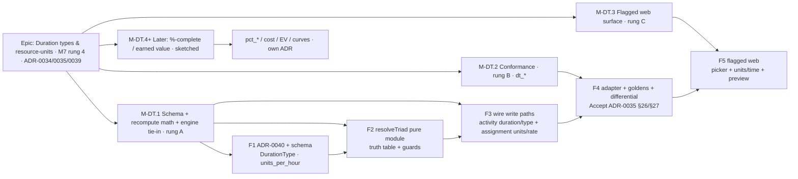

# Implementation Plan: Duration Types & the Resource-Units model (M7 rung 4)

- **Feature spec:** `docs/specs/duration-types-and-units/feature-spec.md`
- **Status:** Draft (awaiting approval)
- **Owner:** engine + backend + conformance

> **Scope.** Give SchedulePoint P6-class **duration types** and the **resource-units** model that governs them — the identity `Units = Duration × Units/Time` and the rule deciding which quantity recomputes on an edit. Built as an epic of rungs mirroring ADR-0039: **rung A** (schema + the pure recompute math + the engine tie-in — the shippable first slice), **rung B** (conformance — flip the `dt_*` rows, Accept the ADR-0035 clauses), **rung C** (flagged web surface). **Percent-complete / earned-value types are a later, separate rung**, sketched here, not built.
>
> **Sequencing stance.** Rung A first (it is the whole feature: schema + `resolveTriad` + wiring both write paths + the engine tie-in, which is a _no-op_ for the engine). Then rung B (conformance uses the same `resolveTriad`, so it is cheap). Then rung C (flagged web, deferrable). With no `unitsPerHour` on any driving assignment the whole feature is inert, so `main` stays **byte-identical and releasable** throughout.

## Breakdown

### Epic

**Duration types & the resource-units model** — the M7 rung that turns the (static) ADR-0039 resource model dynamic: add the per-activity `duration_type`, the per-assignment `units/time`, and the pure recompute that keeps `Units = Duration × Units/Time` true, bringing the `dt_*` conformance rows to documented P6-class parity, and laying the units foundation the later earned-value rung needs — **with the CPM engine untouched**.

---

### Milestone: M-DT.1 — Schema + recompute math + engine tie-in (rung A, shippable slice)

**Outcome:** Planners set an activity's **duration type** and a driving assignment's **units/time**; editing any one of {duration, units, units/time} recomputes the correct other field per the type, persisting a resolved `durationMinutes` the CPM engine reads unchanged. N19/N20 reject at the boundary. With no rate present, everything is byte-identical.

**Global invariant for every task:** with no `unitsPerHour` on any driving assignment (or no driving assignment), `resolveTriad` is a no-op and the engine/recalc are **byte-identical** to the pre-rung output across all prior goldens + scenarios (the ADR-0034/0037/0039 parity gate). Any golden re-baseline is a reviewed change, never silent.

---

#### Feature: F1 — Schema foundation (ADR-0040 + `DurationType` enum + `units_per_hour`)

> **Description:** introduce `DurationType` (four values), `activities.duration_type` (default `FIXED_DURATION_AND_UNITS_TIME`), `resource_assignments.units_per_hour Decimal(18,4)?` + a non-negative CHECK, and the `@repo/types` unions — **schema + ADR only, no behaviour.**
> **ADR-0035 clause:** §26/§27 (foundation) · **Capability row:** none yet · **Governing ADR:** **ADR-0040 (NEW).**
> **Complexity:** M · **Dependencies:** ADR-0039 (landed); **database-architect drafts ADR-0040 + the migration first.**
> **Risks:** enum drift `@repo/types` ↔ Prisma → lock-step task + CI check; `units_per_hour` nullability (null = triad inert) must be preserved → documented in ADR-0040.
> **Testing:** migration up/down; enum lock-step; parity (no rate ⇒ unchanged).

##### Task F1.T1 — ADR-0040 + database-architect design

- **Description:** draft **ADR-0040 (duration types & the resource-units triad)** — units/time home (assignment vs resource), recompute location (service-boundary pure fn vs engine vs on-read), three-vs-four types, driving-only vs aggregate; decision + invariants + the ADR-0035 §26/§27 clause outlines. database-architect reviews the schema before any migration.
- **Complexity:** M · **Dependencies:** none · **Testing:** n/a (design) — sign-off gate for F1.T2.

##### Task F1.T2 — Prisma: `DurationType` + `duration_type` + `units_per_hour` + CHECK

- **Description:** add the `DurationType` enum; `activities.duration_type` (default); `resource_assignments.units_per_hour Decimal(18,4)?`; raw-SQL `ck_resource_assignments_units_per_hour_nonneg`. Lock-step `@repo/types` (`DurationType` union; `unitsPerHour`/`durationType` on the summaries).
- **Complexity:** S–M · **Dependencies:** F1.T1 · **Testing:** migration up/down; enum lock-step; changeset + `DATABASE.md`.

---

#### Feature: F2 — `resolveTriad` pure domain module (the truth table + guards)

> **Description:** a pure, I/O-free `resolveTriad(type, editedField, {D,U,R})` implementing the §4 truth table, the half-up integer-minute rounding, and the N20 zero-rate / negative guards. No DB, no HTTP. The single source of truth shared by both write paths **and** the conformance adapter.
> **ADR-0035 clause:** §26/§27 · **Capability row:** none (pure math) · **Proven by:** exhaustive unit goldens.
> **Complexity:** M · **Dependencies:** F1 (the enum/types).
> **Risks:** rounding residual on the identity → documented rule (round duration, re-derive shown dependent); division-by-zero → guarded before divide (total function); the "edit a held field" precedence → the documented ADR-0035 §26 cells.
> **Testing:** a golden per cell (4 types × 3 edited fields = 12) + rounding + zero-rate + no-rate no-op; property test that the identity holds post-resolve within tolerance.

##### Task F2.T1 — Implement + unit-test `resolveTriad`

- **Description:** implement the truth table + rounding + guards in a pure module (`apps/api/src/modules/schedule/duration-type/` or a shared util); export the `EditedField`/`DurationType` types via `@repo/types`.
- **Complexity:** M · **Dependencies:** F1.T2 · **Testing:** the 12-cell golden matrix + edge tests (rounding, R=0 reject, no-rate no-op); test-engineer.

---

#### Feature: F3 — Wire the write paths (activity duration/type + assignment units/rate) + engine tie-in

> **Description:** call `resolveTriad` in-transaction from (a) the activity write path (duration edit, `durationType` set) and (b) the assignment write path (units/rate edit), loading the driving assignment / owning activity as needed; persist the resolved `durationMinutes`/units/rate; the derived field is server-computed (client value ignored). The **engine tie-in is a no-op** — it already reads `durationMinutes`; a golden asserts a Fixed-Units activity schedules on the derived duration.
> **ADR-0035 clause:** §26/§27 + §25 (N19/N20) · **Capability row:** none (surface later flips the rows) · **Proven by:** service specs + a schedule golden.
> **Complexity:** M · **Dependencies:** F1, F2.
> **Risks:** loading the driving assignment on an activity duration edit adds a read → one indexed join via the `(activity_id) WHERE is_driving` partial-unique (no N+1); cross-module coordination (activity + assignment in one tx) → optimistic-lock both rows, abort on stale; derived-field trust → server overwrites the client's derived value (security-reviewer).
> **Testing:** service specs (each truth-table cell end-to-end, N19/N20 reject, driving-only, derived-field-not-trusted, scope 404, optimistic 409, pen 423); a schedule-service golden (Fixed-Units derived duration reaches the engine); parity (no rate ⇒ byte-identical).

##### Task F3.T1 — Activity write path: `durationType` set + duration-edit recompute

- **Description:** DTOs gain `durationType` + `editedField=DURATION`; the service loads the driving assignment, calls `resolveTriad`, persists `durationMinutes`/dependent; pen-gated, optimistic-locked.
- **Complexity:** M · **Dependencies:** F2.T1 · **Testing:** service/DTO specs; security-reviewer (derived-field trust).

##### Task F3.T2 — Assignment write path: `unitsPerHour` + editedField recompute + N19/N20

- **Description:** assignment DTOs gain `unitsPerHour` (`@Min(0)`, N19) + `editedField ∈ {UNITS, UNITS_PER_HOUR}`; the service loads the owning activity's `durationType`/`durationMinutes`, calls `resolveTriad` (N20 zero-rate guard), persists in one tx; only the **driving** assignment drives duration.
- **Complexity:** M · **Dependencies:** F3.T1 · **Testing:** service specs (N19/N20, driving-only, one-tx optimistic lock); backend-performance-reviewer (single join, no N+1).

##### Task F3.T3 — Engine tie-in golden + parity

- **Description:** assert a `FIXED_UNITS` (and `RESOURCE_DEPENDENT`+`FIXED_UNITS`) activity schedules on the derived `durationMinutes` (engine unchanged); run the full golden/scenario suite to prove the no-rate path is byte-identical.
- **Complexity:** S · **Dependencies:** F3.T2 · **Testing:** `compute.*`/service golden + full parity suite.

---

### Milestone: M-DT.2 — Conformance (rung B, `dt_*` rows → ✅)

**Outcome:** the fixture's duration types become runnable goldens/differentials; the **Duration types** capability row flips ⚪ → ✅; ADR-0035 §26/§27 + N19/N20 move to Accepted — with the no-rate path byte-identical.

---

#### Feature: F4 — Adapter + goldens + differential + Accept ADR-0035 §26/§27

> **Description:** teach `adapter.ts` to read each fixture activity's `duration_type` + its driving assignment's `units_per_hour` and resolve `durationMinutes` via the **same `resolveTriad`**; add first-principles goldens (Fixed-Units derived duration; Fixed-Duration held duration) and an S-style differential (flip a duration type ⇒ a different field moves); assert N19/N20; flip the matrix row; Accept the ADR-0035 clauses.
> **ADR-0035 clause:** §26/§27 · **Capability row:** _Duration types_ ⚪ → ✅ · **Proven by:** `goldens.ts` + `adapter.spec.ts` + `scenarios.spec.ts`.
> **Complexity:** M · **Dependencies:** F1–F3.
> **Risks:** the fixture expresses units/time per **assignment**, not on the activity → the adapter resolves activity → driving assignment → `units_per_hour` (mirrors the ADR-0039 driving-calendar chain); rounding must match production → same `resolveTriad`.
> **Testing:** conformance goldens + differential; capability-matrix + ADR-0035 ledger update in the same PR.

##### Task F4.T1 — Adapter: resolve `durationMinutes` from `duration_type` + driving `units_per_hour`

- **Description:** in `adapter.ts`, resolve each activity's `durationMinutes` through `resolveTriad` from its `duration_type` and driving-assignment `units_per_hour`; leave rate-less activities on their fixture duration.
- **Complexity:** M · **Dependencies:** F3.T3 · **Testing:** `adapter.spec.ts` (derived vs held; rate-less unchanged).

##### Task F4.T2 — Goldens + differential + capability matrix + ADR-0035 §26/§27 Accepted

- **Description:** add goldens for a Fixed-Units derived duration and a Fixed-Duration held duration; add an S-style differential (flip type ⇒ different field moves); assert N19/N20; flip **Duration types** to ✅ in `CAPABILITY_MATRIX.md`; move ADR-0035 §26/§27 (+ N19/N20) to Accepted.
- **Complexity:** S · **Dependencies:** F4.T1 · **Testing:** `goldens.spec.ts`, `scenarios.spec.ts`, `negative.spec.ts`; docs in the same PR.

---

### Milestone: M-DT.3 — Flagged web surface (rung C, deferrable)

#### Feature: F5 — Web: duration-type picker + units/time + live recompute preview (flagged)

> **Description:** behind `VITE_DURATION_TYPES` — a duration-type `Select` on the activity editor, a `unitsPerHour` field on the assignment panel (ADR-0039), and a live client-side recompute preview (a shared util mirroring `resolveTriad`); full loading/empty/error/success states, WCAG 2.2 AA.
> **ADR-0035 clause:** §26/§27 (surface) · **Capability row:** none · **Proven by:** component + a11y + e2e.
> **Complexity:** L · **Dependencies:** F1–F4 (API); deferrable like ADR-0039 F6.
> **Risks:** client/server recompute divergence → share the pure fn via `@repo/types`/util, one implementation; UI/a11y drift → design-system tokens + RHF/Zod (ADR-0007), APG primitives.
> **Testing:** component + a11y + e2e (flagged); ux/component/accessibility reviewers; changeset + docs.

##### Task F5.T1 — Duration-type picker + units/time field + preview (flagged)

- **Description:** the picker + field + preview, wired to the API DTOs; the preview computes the would-be recompute client-side from the shared util.
- **Complexity:** L · **Dependencies:** F4.T2 · **Testing:** component/a11y/e2e; reviewers.

---

### Milestone: M-DT.4+ — Later rung (sketched — NOT built here)

| Rung | Milestone                                                                                                                                                                                                                                                                                                                                                 | Owning rows / scenarios                          | Rough size | Own ADR?                    |
| ---- | --------------------------------------------------------------------------------------------------------------------------------------------------------------------------------------------------------------------------------------------------------------------------------------------------------------------------------------------------------- | ------------------------------------------------ | ---------- | --------------------------- |
| 5    | **Percent-complete / earned value / cost / curves / accrual** — `pct_physical`/`pct_units`/`code_steps`, CPI/SPI, LINEAR/BELL/FRONT/BACK/DOUBLE_PEAK curves; adds `actual_units`/`remaining_units`/`at_completion_units`/`curve` to the assignment and a **recalc-time** remaining-duration re-derivation (the one part that genuinely touches progress). | `pct_*`, `cost_*`, `*_curve_*`, `accrual_*` (⚪) | **XL**     | **Yes** — cost/EV model ADR |

Percent-complete types are deliberately out of this epic: they change how **remaining duration** is measured under **progress**, need the EV columns above, and re-derive at recalc time — a materially different concern from the planning-time triad this epic ships.

---

## Sequencing & slices

Each feature is an independently releasable slice; the whole feature is dark until a driving assignment has a `unitsPerHour`, so `main` stays byte-identical and releasable throughout. Recommended order:

1. **M-DT.1 rung A:** **F1** (ADR-0040 + schema — database-architect first) → **F2** (`resolveTriad` pure module) → **F3** (wire both write paths + engine tie-in golden + parity). Ships the whole behaviour; rejects N19/N20.
2. **M-DT.2 rung B:** **F4** (adapter + goldens + differential + Accept ADR-0035 §26/§27). Flips **Duration types** ⚪ → ✅.
3. **M-DT.3 rung C:** **F5** web, flagged (`VITE_DURATION_TYPES`), deferrable.
4. **M-DT.4+** later — %-complete / earned value (own ADR/sub-epic).

**Feature flags:** `VITE_DURATION_TYPES` (web, `flagDefaultOff`). The engine/API changes are dark by default (no `unitsPerHour` ⇒ no recompute), so no server flag is required.

## Critical questions for approval

1. **Four duration types vs three (CRITICAL).** Model **all four** P6 duration types — the fixture uses all four, with `FIXED_DURATION_AND_UNITS_TIME` the dominant default (the task's "three" omitted it) — vs. modelling three and coercing the default. _Default: **all four** (a closed P6 enum; coercing the default mis-scores conformance)._
2. **Drive duration from the driving resource (CRITICAL).** For **Fixed Units / Fixed Units-Time**, derive `durationMinutes` from `units ÷ units/time` at the write boundary and feed the engine the resolved value (P6 behaviour) — vs. treating duration as always planner-entered. _Default: **derive** (the point of the rung; a pure, calendar-independent function)._
3. **%-complete-types boundary (CRITICAL).** Ship the **planning-time triad only** (duration/units/rate) now; **defer** physical/units/steps percent-complete types (which change remaining-duration measurement under progress) to the earned-value rung — vs. bundling them here. _Default: **defer** (clean cut; they need EV columns + a recalc-time re-derivation)._
4. **Recompute location (CRITICAL-ish).** Put the recompute in a **pure service-boundary function** resolving `durationMinutes` (engine untouched, parity trivial) — vs. inside the CPM pass. _Default: **service boundary** (argued in the spec §4)._

Non-critical (defaults taken, not surfaced): **units/time home = the driving assignment** (`unitsPerHour`), not the resource (`max_units_per_hour` stays reserved for levelling); **only the driving assignment** participates in the triad; **do not** add `actual_units`/`remaining_units`/`curve` yet (EV rung); **precedence** on a multi-field write = explicitly-edited field wins, ties duration → units → rate; the derived field is **stored** (not computed on read) so the engine sees it; **rounding** = derived `durationMinutes` half-up to whole minutes, units re-derived from the rounded duration for display; **zero units/time** on a units-driven recompute is **rejected** (N20), negative rate rejected (N19).

## Definition of Done (per task)

Each task's PR satisfies the Feature Completion Criteria in `docs/PROCESS.md` (code, tests ≥ 80% on changed code, docs incl. capability-matrix + ADR-0035 §26/§27 ledger + ADR-0040, security review, performance, accessibility for UI, Docker build, CI green, changeset, version impact). **Additionally:** every engine/service PR runs the full golden + scenario suite and demonstrates the no-rate path is byte-identical; the rung-B PR flips the **Duration types** matrix row in the same change; and the write paths follow the reference template (`scripts/verify-template.sh`).

## Risks & assumptions (rollup)

| Risk / assumption                                                    | Likelihood | Impact | Mitigation                                                                                                                  |
| -------------------------------------------------------------------- | ---------- | ------ | --------------------------------------------------------------------------------------------------------------------------- |
| The recompute leaks into the CPM engine, breaking parity             | low        | high   | `resolveTriad` is a **pure boundary** function; the engine reads `durationMinutes` unchanged; full parity suite is the net. |
| Rounding makes the identity `U = D × R` drift                        | med        | med    | Documented rule (round duration, re-derive shown dependent); property test asserts identity within Decimal(18,4) tolerance. |
| Division by zero / NaN duration on a zero rate                       | med        | high   | N20 guard **before** any divide; the pure function is total; boundary reject + CHECK.                                       |
| Client preview and server math diverge                               | med        | med    | One shared pure implementation via `@repo/types`/util; the API is authoritative and overwrites the derived field.           |
| Modelling three types + coercing the default mis-scores conformance  | med        | med    | Model **all four** (critical question 1); adapter maps the four fixture values 1:1.                                         |
| Loading the driving assignment on an activity duration edit adds N+1 | low        | med    | Single indexed join via `(activity_id) WHERE is_driving`; backend-performance-reviewer.                                     |
| Scope creep into percent-complete / earned value                     | med        | med    | %-complete types explicitly the **next** rung (own ADR); this epic is planning-time triad only.                             |
| Derived field trusted from the client (data-integrity/IDOR)          | low        | med    | Server computes the derived field and ignores the client's value; security-reviewer on both write paths.                    |

## Recommended specialised agents (build phase)

- **database-architect** — **ADR-0040** + the `DurationType` enum, `activities.duration_type` default, `resource_assignments.units_per_hour` + the non-negative CHECK (**before** the migration).
- **test-engineer** — the exhaustive `resolveTriad` truth-table matrix (12 cells + rounding + zero-rate + no-rate no-op), the service end-to-end cells, the conformance goldens/differential, N19/N20.
- **api-reviewer** + **security-reviewer** — the additive DTO fields + the `editedField` discriminator, the derived-field-server-computed contract (never trusted from client), N19/N20 boundary rejects, org/plan scope + pen.
- **backend-performance-reviewer** — the single driving-assignment join on the activity write path (no N+1); confirm recalc is untouched.
- **ux-reviewer / component-reviewer / accessibility-reviewer** — the flagged duration-type picker, units/time field, and live recompute preview.
