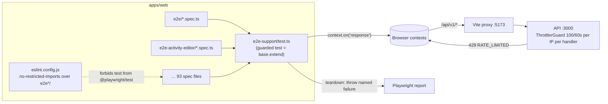
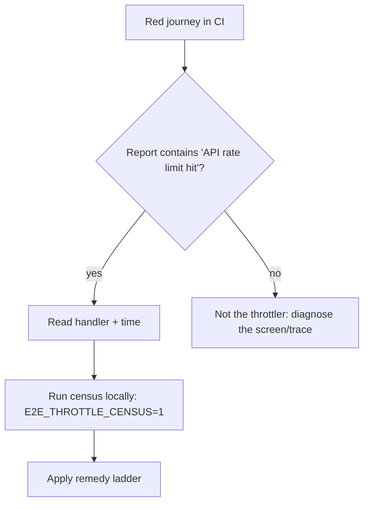

# Feature Spec: A journey that hits the rate limiter says so

- **Status:** Approved — by the product owner, 2026-10-03, as planned: Q1 yes (a test that met a 429 fails even if it otherwise passed; measured temporary allowances absorb M2 reds); Q2 yes (the eight 100000 limits become measured numbers in M3); Q3 yes, conditional on M0 confirming the throttle. ADR number 0175 (0172–0174 taken the same day).
- **Author(s):** feature-analyst (for the product owner)
- **Date:** 2026-10-03
- **Tracking issue / epic:** `docs/TECH_DEBT.md` #361 (with #435 as the live recurrence)
- **Roadmap link:** none — test-harness reliability; no product surface
- **Related ADR(s):** ADR-0081 (journey is the gate), ADR-0105 (why this is a spec), ADR-0110 (a gate
  is verified against the defect it names), ADR-0088 D1 (no flag); proposes **ADR-0175** (outline in §4)

> **Why this is a spec and not a register fix (ADR-0105).** It adds a shared test fixture every
> journey imports, a lint rule over every `e2e*/` directory, and a change to Playwright configs. Each
> of those is a named trigger.

## 1. Business understanding

### Problem

The API refuses more than **100 requests per 60 s from one IP to one handler**
(`apps/api/src/app.module.ts:100-105`, `ThrottlerGuard` registered globally at `:155`; the bucket
key is `` `${class}-${handler}-${name}` `` per tracker, registered in
`scripts/dependency-claims.json` as `throttler.guard.js:148-150`). A journey suite runs every test
from one IP against one API process, so a suite that signs up a fresh user in every test spends the
same handler's budget over and over.

When it runs out, **nothing says so**:

1. **The session read is a throttled handler.** `useSession` reads `GET /api/v1/me`
   (`apps/web/src/features/auth/api/use-session.ts:28-41`). It maps only a 401 to "signed out" and
   rethrows anything else.
2. **What a 429 there renders.** After #314 a 429 is retried twice with backoff
   (`apps/web/src/lib/query/query-client.ts:30-33`, `lib/api/retryable-status.ts:37`). That backoff is
   about 3 s, and a 60 s bucket that is genuinely spent outlasts it (the file says so itself at
   `retryable-status.ts:31-35`). Then:
   - `_authed`'s `beforeLoad` awaits the session (`apps/web/src/app/router.tsx:235`). The rejection
     lands on the router's error screen, not on onboarding.
   - Every component that branches on `useSession().data` sees `undefined` and draws its
     **signed-out** half. This is the #360 case: `AcceptInvitationCard` offered "Sign in / Create an
     account" to someone who had just signed up (`apps/web/playwright.overview.config.ts:72-77`).
   - Sign-up's `onSuccess` re-reads the session (`use-session.ts:255`). A 429 there fails the
     mutation, so the form stays filled.
3. **The report names the wrong thing.** The journey then waits out its timeout on a heading or
   button that the product is right not to draw, and the failure names that control. Every API
   webServer in the configs sets `LOG_LEVEL: 'silent'` (e.g.
   `apps/web/playwright.activity-editor.config.ts:58`). The filter that would have logged
   `429 RATE_LIMITED on GET /api/v1/me` at `warn` (`apps/api/src/common/filters/all-exceptions.filter.ts:108-112`)
   therefore says nothing.

**Why now.** CI run `37158874019` (PR #774), web shard 4, `e2e-activity-editor`:

- **J1** failed at `e2e-activity-editor/support.ts:19`, where the "Create your organisation" heading
  was not visible within 15 s.
- **J3** and the "Escape, Escape, Escape" test were flaky.

Those three are tests 14, 15 and 11 of 15 in `activity-editor.spec.ts`, and each one calls
`onboard()` (fresh sign-up, then onboarding). `activity-create.spec.ts` runs first, against the same
API process. #435 recorded four earlier failures at the same step and attributed them to a cold chunk
fetch. It widened the wait to 15 s and said in writing: "a recurrence after this change means the
diagnosis is incomplete, so read the trace before widening anything further." This is that
recurrence.

**The register row's figures are stale, so they are corrected here (§19.11).** #361 says "four of
the 49 configs". Measured today:

- There are **53** `apps/web/playwright*.config.ts`.
- **Eight** raise `RATE_LIMIT_LIMIT` to `100000`: overview, netpoint-grammar, measure-gantt,
  gantt-editing, measure-route-splitting, gantt, arrange and workspace-chrome (`grep RATE_LIMIT_LIMIT
apps/web/playwright*.config.ts`).
- `activity-editor` and the base `playwright.config.ts` do not raise it.

**One claim in #361 needs correcting, and one is confirmed.**

- **Corrected.** #361 says "a 429 on the session read makes `useSession` yield no user". That is
  still true of components. Since #314, though, the `_authed` guard shows an error screen instead of
  redirecting. Either way the report names a control, not the throttler, so the conclusion stands.
- **Confirmed hot handler.** One suite has been measured: `GET /api/v1/me` peaked at **99, then 106,
  requests per 60 s** in `overview` (`playwright.overview.config.ts:65-70`).

### Users

There are no product users. The users are **engineers and agents reading a red journey**, and the
**product owner**, who merges on CI's word under §19.9 (`main` is unprotected, §8). The quantity
lost is diagnosis time. The worse loss is misdiagnosis: #360 was published as "pre-existing" before
anyone measured it, and #435 widened a wait for a cause it never established.

### Primary use cases

1. A journey that receives a 429 it did not deliberately provoke **fails, and the failure names the
   throttler, the method and the path, and when it happened**.
2. An engineer can **measure a suite's per-handler peak** without editing code, so that any limit
   raise or suite slimming is backed by a number.
3. Suites that genuinely exceed a handler's budget get an **honest remedy**: fewer requests, or a
   scoped raise to a measured ceiling. A blind `100000` is not an honest remedy.

### Expected outcomes

- The next 429 in any journey is diagnosed from the report in seconds.
- `e2e-activity-editor` stops failing late in the suite. If the cause turns out to be something
  else, we know that for certain and #435 reopens with evidence.
- No new CI step, no product change, no flag.

### Success criteria

- **The gate is proven against the defect (ADR-0110).** A self-test journey that fulfils a 429 on
  `GET /api/v1/me` fails with a message containing `429`, `ThrottlerGuard` and `GET /api/v1/me`.
  With the fixture removed, the same journey passes, which shows the fixture is what catches it.
- **Every journey uses the fixture.** Every `apps/web/e2e*/**/*.spec.ts` imports `test` from the
  shared module, and `pnpm lint` fails otherwise.
- **The suite is green.** `e2e-activity-editor` passes 10 consecutive CI runs with no 429 recorded.
  This is also #435's own exit criterion.

### Open questions

See §"Critical questions" at the end of the implementation plan. There are three, each with a
default.

## 2. Functional requirements

### User stories & acceptance criteria

> **US-1** — As an engineer reading a red journey, I want a throttled request to fail the test by
> name, so that I diagnose the limiter and not a screen.
>
> - **Given** a journey whose page (or any browser context it opens) receives a response with
>   status 429 from `/api/` **when** the test ends **then** the test fails with:
>   `API rate limit hit: 429 RATE_LIMITED on GET /api/v1/me at +41.2s (ThrottlerGuard, per IP per handler; limit RATE_LIMIT_LIMIT=100 / RATE_LIMIT_TTL=60s). The screen failure above is a symptom.`
>   This error is listed alongside any assertion error the test also produced.
> - **Given** several 429s **then** the message lists the first one plus a count per
>   `METHOD path`.
> - **Given** a test that provokes a 429 on purpose (`e2e-public/public-screens.spec.ts:162` fulfils
>   one for the sign-in screen) **when** it opts out with `test.use({ allowRateLimited: true })`
>   **then** it is not failed.
> - **Given** zero 429s **then** the fixture adds no failure and no output.

> **US-2** — As an engineer, I want any journey to import the guarded `test`, so that a new suite
> cannot opt out by accident.
>
> - **Given** a spec under `apps/web/e2e*/` that imports `test` from `@playwright/test` **when**
>   `pnpm lint` runs **then** lint fails and names the shared module to import instead.
>   `expect`, `devices` and types may still come from `@playwright/test`.

> **US-3** — As an engineer sizing a suite, I want a per-handler peak count on demand.
>
> - **Given** `E2E_THROTTLE_CENSUS=1` **when** a suite finishes **then** the worker prints the peak
>   number of requests per `METHOD path-template` in any rolling 60 s window, highest first.
> - **Given** the variable is unset **then** nothing is printed and nothing is attached.

> **US-4** — As the product owner, I want suites that genuinely exceed a budget remedied honestly,
> so the next suite does not rediscover this.
>
> - **Given** the measured census for `e2e-activity-editor` **when** its remedy lands **then** its
>   hot handler's peak sits at or below **80** per 60 s, which leaves 20 % headroom under 100.

### Workflows

1. The fixture attaches a `response` listener to the test's `context`, and to every context the test
   opens with `browser.newContext()`.
2. When a response has status 429 and a URL path starting `/api/`, the fixture records the method,
   path, time since test start and response `error.code`.
3. At teardown, if anything was recorded and `allowRateLimited` is false, the fixture throws the
   US-1 message. The test fails, and is retried under the config's normal `retries`.

### Edge cases

- **Requests made through `APIRequestContext` (`page.request`, the `request` fixture) emit no
  `response` event.** Today that is 9 calls in 4 files (staff, library, interchange,
  public-screens). They already assert status on their own responses. **Not covered, and stated
  rather than implied.** In-page `fetch` via `page.evaluate`, which most helpers use (e.g.
  `e2e-workspace-chrome/support.ts:312-325`), _is_ covered.
- **Multi-actor tests** call `browser.newContext()` (34 calls in 12 files). The fixture wraps
  `browser.newContext` for the duration of the test and restores it at teardown, so those call sites
  stay unchanged.
- **Better Auth's own limiter** (`/api/auth/*`) is `enabled: options.isProduction`
  (`apps/api/src/common/auth/better-auth.ts:275-279`). It cannot fire against the dev API the
  journeys run, so every real 429 here is `ThrottlerGuard`. The fixture still reports any 429 under
  `/api/` and does not assume where it came from.
- **CI retries run inside the same spent window.** Retries run straight after the failure and the
  bucket has not reset. That explains "J1 failed on every attempt, later tests merely flaky". It is
  why the message says the screen failure is a symptom, and why a retry is not a remedy.
- **Suites with no API webServer** (`splitting`, `forced-colors`) see no `/api/` 429. The fixture is
  a no-op there, and the lint rule still applies for uniformity.

### Permissions

Not applicable. This is test code with no RBAC, org scope or pen involvement. No product write is
added, so the ADR-0028 pen is not involved.

### Validation rules

`allowRateLimited` is a boolean fixture option, default `false`. `E2E_THROTTLE_CENSUS` is read as
`'1'` or unset.

### Error scenarios

| Scenario                         | Detection                      | Result in the report                                    | Status |
| -------------------------------- | ------------------------------ | ------------------------------------------------------- | ------ |
| Unprovoked 429 from the API      | context `response` listener    | test fails, message names throttler + `METHOD path` + t | 429    |
| Deliberate 429 (route fulfilled) | `allowRateLimited: true`       | ignored                                                 | 429    |
| Spec bypasses the fixture        | ESLint `no-restricted-imports` | `pnpm lint` fails, names the module                     | —      |

## 3. Technical analysis

| Area           | Impact | Notes                                                                                                                        |
| -------------- | ------ | ---------------------------------------------------------------------------------------------------------------------------- |
| Frontend       | none   | No `src/` change. Test code under `apps/web/e2e*/` only.                                                                     |
| Backend        | none   | The guard, the limit and the default 100/60 s are untouched.                                                                 |
| Database       | none   | No schema change, so database-architect is not needed.                                                                       |
| API            | none   | —                                                                                                                            |
| Security       | low    | The product rate limit is **not** weakened. M3 replaces blind `100000` raises with measured ceilings, which is a tightening. |
| Performance    | none   | A response listener adds microseconds per request.                                                                           |
| Infrastructure | none   | **No new CI step.** The lint rule rides `quality`'s existing `pnpm lint`, and the fixture rides each existing suite step.    |
| Observability  | low    | Option B (log level) is evaluated in §4 and **not** chosen as the primary mechanism.                                         |
| Testing        | medium | A shared fixture across 93 spec files; a self-test journey in the base suite; a lint rule.                                   |

**Recalc parity:** not applicable, because no scheduling input is added and `computeSchedule` is
untouched. **Roles:** not applicable. **Flag:** none (ADR-0088 D1). There is nothing user-visible to
gate, and the rollback is the commit.

### Dependencies

- `@playwright/test` fixtures (`test.extend`, auto fixtures, `BrowserContext` `response` event).
  These are public API, not internals. **One internal-behaviour claim needs registering before code
  cites it:** that a `webServer` entry's stdout is not piped to the report by default (Option B
  below). M0 verifies it against the installed version and adds it to
  `scripts/dependency-claims.json` if it is cited.
- **How imports work today.** All **93** spec files import `test` directly from `@playwright/test`
  (`grep -c "from '@playwright/test'" apps/web/e2e*/**/*.spec.ts`). No `test.extend` and no
  `globalSetup` exist anywhere under `apps/web` (grep). Each suite has its own `support.ts`.
  `apps/web/tsconfig.json:40-41` already includes `e2e-*/**/*`, so a new `e2e-support/` directory is
  type-checked without config edits. `scripts/check-counts.mjs:76-82` counts only `e2e-*`
  directories that **contain a `.spec.ts`**, so a spec-less `e2e-support/` does not change the
  "Playwright suites" figure in CLAUDE.md.

## 4. Solution design

### Architecture overview



### Data flow

```mermaid
sequenceDiagram
  participant T as Journey test
  participant F as throttleGuard fixture
  participant C as BrowserContext
  participant API as API (ThrottlerGuard)
  F->>C: on('response', record429)
  T->>C: goto /sign-up, submit
  C->>API: GET /api/v1/me
  API-->>C: 429 RATE_LIMITED
  C-->>F: response(status 429) - recorded {GET /api/v1/me, +41.2s}
  T->>T: waits for "Create your organisation" (15 s), times out
  F->>T: teardown throws "API rate limit hit: 429 … GET /api/v1/me …"
  Note over T: Report lists both errors; the named one explains the other
```

### User flow (engineer reading a failure)



### Database changes

None.

### API changes

None.

### Component changes

None in `src/`. New test module `apps/web/e2e-support/test.ts`, which exports:

- `test`: `base.extend` with an **auto** fixture `throttleGuard` and the option
  `allowRateLimited`;
- `expect`, re-exported for convenience.

It also contains a worker-scoped census fixture, active only when `E2E_THROTTLE_CENSUS=1`.

### Implementation approach & alternatives

**Option A: a shared fixture that fails the test on a 429 (recommended).**

How it reaches all 53 configs is through **imports, not config**. Every spec imports `test` from
`e2e-support/test.ts`, and the lint rule makes that permanent. The alternatives do not work:

- A `globalSetup` runs once in a separate process and has no access to test pages, so it cannot
  observe responses.
- Playwright has no config-level hook that wraps every test without the spec importing an extended
  `test`.

The migration is mechanical: one import line in each of 93 files.

On "fail immediately": a `response` listener cannot abort a running test body, and throwing inside
it is an unhandled error in the runner, not a test failure. So the fixture records **at the moment**
and **fails at teardown**. The test still waits out its current expectation (at most 15 s here).
What changes is that the report leads with the cause. That is the property #361 asks for. Saving
the 15 s is not worth a mechanism that would close the page mid-test and add a confusing third
error.

**Option B: raise the API's `LOG_LEVEL` to `warn` in the configs. Not chosen as the mechanism, but
used as the M0 measurement.**

- At `warn`, the exception filter logs **every** 4xx (`all-exceptions.filter.ts:108-112`). That
  includes the expected 401 on `/me` before sign-in, and the 403s, 409s and 423s that journeys
  provoke on purpose. That is noise in every run.
- That output goes to the API's stdout. As far as can be read without running it, Playwright's
  `webServer` does not pipe stdout into the report by default (to be verified in M0, see
  Dependencies).
- Even piped, it lands in the job log and is **not attached to the failing test**. The reader still
  has to correlate timestamps by hand.

It is excellent as a **one-off local measurement**, which is where M0 uses it.

**Option C: both.** Rejected as a standing configuration for the noise reason above. A and B are
complementary only in that B is the measurement before A exists.

**The second half: remedies, in a fixed order (the "remedy ladder").** For a suite the census shows
above 80 per handler per 60 s:

1. **Remove redundant reads.** Polls without intervals, re-reads that could be one read, and
   reloads that were never needed. `e2e-workspace-chrome/support.ts:536-545, 611-616` are two
   worked examples already in the tree.
2. **Stop re-paying sign-up per test.** Sign up and onboard once per worker, with a worker-scoped
   account (`storageState`). Each test then creates its own client, project and plan inside that
   organisation. This applies when the hot handler is one that onboarding drives, such as
   `GET /me`, `GET /organizations` or `POST /organizations`.
3. **Scoped raise to a measured ceiling, as a last resort.** Set `RATE_LIMIT_LIMIT` to about
   **2× the measured peak**, never `100000`. Cite the census figure and date in the config comment.
   A ceiling of `100000` blinds the fixture for that suite for ever, which is the "fourth time"
   #361 refuses.

**Recommendation for `e2e-activity-editor`:** expect rung 2, but **confirm with the census first**.
Every one of its 15 tests (plus 7 in `activity-create.spec.ts`) re-runs sign-up and onboarding
only to obtain an empty organisation (`support.ts:11-26`). The one suite measured so far points at
`/me` (99 to 106 per 60 s in `overview`), and that is a read onboarding drives. The tests mutate
their own plans, so sharing an organisation is safe if each test names its plan by `stamp`. The
pen is per plan (ADR-0028), so separate plans do not contend. **If the census shows instead that
no handler exceeds about 60, the throttler is not the cause.** The suite is then not changed,
#435's diagnosis reopens with the fixture's clean bill as evidence, and the trace (which #435
asks for) is read next.

**The eight `100000` configs** (Critical question 2): **default** is to re-measure each with the
census and replace `100000` with a measured ceiling, in one PR. They stay exactly as they are until
that PR lands.

**What this epic does not touch.** The product limit (100/60 s), `ThrottlerGuard`, Better Auth's
limiter, the session hook's `staleTime: 0` and the CI workflow.

**An observation outside this scope, raised so it is not lost.** The same per-IP, per-handler
bucket means an office of planners behind **one NAT address** shares one `GET /me` budget of 100
per 60 s. The keying is at `app-setup.ts:80` and is keyed on `req.ip`. If the census shows `/me`
at about 7 requests per test (inferred, not measured), a dozen people working at once could plausibly
reach it. **This is not established.** It should be its own `TECH_DEBT.md` row, measured on its
own, and must not be fixed by this harness work.

**ADR: yes, a short new one, ADR-0175 "A spent budget is reported as a spent budget".** No existing
ADR owns journey-harness conventions. ADR-0081 governs what a journey must drive, not how it fails,
and an amendment there would bury a cross-suite rule in an unrelated decision.

Outline:

- **Context.** #361, #360, #435 and the eight blind raises. The per-IP, per-handler key. The
  symptom-not-cause failure shape.
- **D1.** Every journey imports `test` from `apps/web/e2e-support/test.ts`, and an unprovoked API
  429 fails the test by name. Enforced by lint.
- **D2.** A deliberate 429 opts out per test (`allowRateLimited`), never per suite.
- **D3.** A raised `RATE_LIMIT_LIMIT` in a harness must cite a census figure and a date, and sit
  at about 2× it. `100000` is withdrawn.
- **D4.** Option B (log level) is a measurement tool, not the mechanism. Reason: noise, and it is
  not attached to the failing test.
- **Consequences.** 93 import lines. One self-test journey. APIRequestContext is a stated gap. No
  CI step.
- **Verification (ADR-0110).** The self-test journey fails with the fixture and passes without it.

## 5. Links

- Implementation plan: [`./implementation-plan.md`](./implementation-plan.md)
- Related docs updated by this change: `docs/TESTING.md` (a new subsection after
  "Running several suites back to back", ~line 627, plus a correction to its line 651 advice so that
  local sweeps prefer the census to a blind raise); `docs/TECH_DEBT.md` #361 (figures corrected,
  closed on M3) and #435 (updated with the M0 finding); ADR-0175 plus its one line in CLAUDE.md §16.
