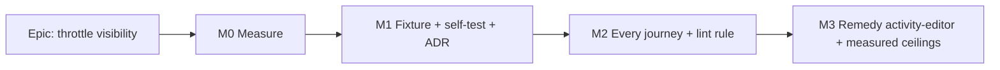

# Implementation Plan: A journey that hits the rate limiter says so

- **Feature spec:** [`./feature-spec.md`](./feature-spec.md)
- **Status:** Approved — by the product owner, 2026-10-03, as planned: Q1 yes (a test that met a 429 fails even if it otherwise passed; measured temporary allowances absorb M2 reds); Q2 yes (the eight 100000 limits become measured numbers in M3); Q3 yes, conditional on M0 confirming the throttle. ADR number 0175 (0172–0174 taken the same day).
- **Owner:** web (builder agent for M1–M3; the orchestrator runs every Playwright step)

## Breakdown

### Epic

**A journey that hits the rate limiter says so.** This closes `docs/TECH_DEBT.md` #361 and settles
#435 with evidence. It is test-harness reliability work, with no product surface and no flag
(ADR-0088 D1).

Every milestone below is **`Ships dark: test-harness only; no product entry point exists or is
added`** (ADR-0081 §1). The "journey" for each is the harness proving itself against the defect it
names (ADR-0110), which is the self-test in M1.

---

### Milestone M0 — Confirm the diagnosis before building anything (no code)

**Outcome:** a measured answer to one question. Did `e2e-activity-editor` receive a 429 before the
onboarding heading timed out, and on which handler? **The orchestrator runs this, not an agent.**
**Complexity:** S. **Dependencies:** none.

1. **Read what already exists (zero runs).** Download the `playwright-report-activity-editor`
   artifact from CI run `37158874019`. J1's retry has a trace (`trace: 'on-first-retry'`,
   `playwright.activity-editor.config.ts:34`). In its **Network** tab, look for any `429` on
   `/api/v1/*` before the `support.ts:19` wait began. Record the method, path and count.
2. **Local measurement with Option B as the instrument.** Start the API yourself, so the suite
   reuses it (`reuseExistingServer` is true locally):
   `LOG_LEVEL=info PLAN_EDIT_LOCK_ENFORCED=true pnpm --filter @repo/api exec nest start > /tmp/api.log 2>&1`.
   Then run `pnpm --filter @repo/web test:e2e:activity-editor`.
   - `grep -c '429 RATE_LIMITED' /tmp/api.log` answers whether a 429 happened, from the filter's
     warn line at `all-exceptions.filter.ts:108-112`.
   - The `info` request lines give a per-path count per minute, which is the census before the
     census exists.
   - Kill `apps/api/dist/main` by name afterwards, per `docs/TESTING.md:627-654`.
3. **While there, verify one dependency claim.** Is the `webServer` stdout piped to the report by
   default in the installed Playwright? Record the file and line. It decides nothing in the
   recommendation, but the spec states it as unverified.
4. **Write the result into `docs/TECH_DEBT.md` #435 and #361**, including the corrected figures:
   53 configs, 8 raise.

**Result (measured 2026-10-03, by the orchestrator, local, `main` at `b405dd7`).** The API was
started by hand with `LOG_LEVEL=info PLAN_EDIT_LOCK_ENFORCED=true` and the default throttle
(`RATE_LIMIT_LIMIT` unset, so 100 per 60 s per IP per handler), then
`E2E_ALLOW_EXISTING_SERVER=1 scripts/e2e-local.sh web:activity-editor` ran: 18 passed, 1.8 min. The
pino `request completed` lines were tallied.

- 844 requests: 200 x603, 304 x127, 201 x97, 204 x15, 409 x1, 423 x1. **Zero 429s.**
- Busiest sliding 60 s window per handler: `GET /me` 64; `GET …/plans/:id/activities` 39;
  `GET …/baselines/variance` 32; `GET …/schedule/summary` 26; `GET …/edit-lock` 24.
- So `activity-editor` peaks at **64 % of the `/me` budget** locally. A 429 is **not confirmed** here.
  CI retries (`retries: 2`) and runner speed can push it over, so M3's shared sign-up is still
  justified as headroom, and the measured limit for this config should sit above ~64 per minute with
  margin, not at `100000`.
- **Not done in M0:** the CI trace of run `37158874019` (step 1) was not read, and the `webServer`
  stdout-piping claim (step 3) was not verified. Neither decided anything; the second is stated as
  unverified in the spec and nothing here cites it.

**Decision taken.** No 429 locally, and a clean local run is weak evidence (the Risk below). The
CI trace is the remaining unread evidence. M1 and M2 ship regardless, as the plan said; M3.1 stays
conditional on a census showing a handler near the ceiling.

**Decision point (the only one in the epic).**

- **429s found:** proceed with M1 to M3 as planned.
- **No 429 locally _and_ none in the CI trace:** still ship M1 and M2. They are cheap and they
  close #361's real complaint, that a spent budget is invisible. M3 changes for
  `activity-editor`: no suite change. #435 reopens as "not the throttler, not (only) the chunk",
  and the trace is the next read.

**Risk:** the local machine is faster than CI. That _concentrates_ requests into fewer seconds, so
a local run over-reports exposure rather than hiding it. A clean local run is therefore weak
evidence and a 429 locally is strong evidence. Treat them accordingly.

---

### Milestone M1 — The fixture, its self-test, and ADR-0175

**Outcome:** a shared guarded `test` exists and is proven to fail a journey on a 429 by name. Only
the base suite adopts it in this milestone. **Entry point:** ships dark (harness). **Journey:**
`e2e/throttle-visibility.spec.ts` (the self-test).

#### Feature: guarded `test`

> **Description:** `apps/web/e2e-support/test.ts`: `base.extend` with the auto fixture
> `throttleGuard`, the option `allowRateLimited` (default `false`), the re-exported `expect`, and
> the worker-scoped census behind `E2E_THROTTLE_CENSUS=1`.
> **Complexity:** S
> **Dependencies:** M0 (for the go/no-go only. The fixture is worth shipping either way)
> **Risks:**
>
> - **Wrapping `browser.newContext` leaks between tests.** Mitigation: restore at teardown in a
>   `finally`, and cover it with a self-test that opens a second context.
> - **A teardown error is not shown by the `github` reporter.** Mitigation: the self-test asserts
>   on `testInfo.errors` text, and the orchestrator confirms the annotation in one CI run.
>
> **Testing requirements:** the self-test journey (below). No Vitest unit test, because the logic is
> a listener plus a formatter and the journey exercises both against a real browser.

##### Task 1.1 — `e2e-support/test.ts` (≈ one PR together with 1.2 and 1.3)

- **Description:** the fixture per spec §2 and §4.
  - Listen on `context`, and on any context created via `browser.newContext` during the test.
  - Record 429s whose path starts `/api/`.
  - At teardown, throw the US-1 message unless `allowRateLimited` is set.
  - The census keeps a rolling 60 s tally per `METHOD path-template` and prints the top entries at
    worker teardown. Path templating collapses UUIDs and cuid-like segments to `:id`.
- **Complexity:** S
- **Development steps:**
  1. Write the module, with a docblock citing #361, the per-handler key and the APIRequestContext
     gap.
  2. Move the base suite (`apps/web/e2e/*.spec.ts`, 11 files) to `import { test, expect } from
'../e2e-support/test'`.

##### Task 1.2 — Self-test journey `apps/web/e2e/throttle-visibility.spec.ts`

- **Description:** prove the gate against the defect it names (ADR-0110).
  1. Fulfil `GET /api/v1/me` once with `429 { error: { code: 'RATE_LIMITED' } }` via `page.route`.
     Mark the test `test.fail()` and assert, via a final fixture-order check, that the error text
     names `429`, `ThrottlerGuard` and `GET /api/v1/me`.
  2. A twin with `allowRateLimited: true` passes.
  3. A twin that opens a second `browser.newContext()` and fulfils the 429 there also fails.
- **Complexity:** S
- **Dependencies:** 1.1
- **Testing:** the orchestrator runs `scripts/e2e-local.sh web:base` (or the base command) with the
  fixture, then once with the fixture's throw commented out locally, to confirm the self-test then
  goes red. Report both results in the PR. That second run is the ADR-0110 evidence.

##### Task 1.3 — ADR-0175 and docs

- **Description:** write ADR-0175 from the outline in spec §4 and add its one line to CLAUDE.md §16
  (`check:adr-coverage`). Add a `docs/TESTING.md` subsection, "A 429 in a journey fails by name",
  covering the fixture, the opt-out, the census and the remedy ladder. Amend the line-651 advice so
  local sweeps reach for the census rather than a blind raise.
- **Complexity:** S
- **Testing:** `pnpm prepush`.

**No changeset:** test code and docs only, and no published package changes.

---

### Milestone M2 — Every journey, enforced

**Status:** built and swept. 83 spec files moved to the guarded `test` and the lint rule is live.
The full local sweep (2026-10-04, `scripts/e2e-local.sh` once per suite, chromium, the 48
`test:e2e:*` suites plus the base journey) came back **49 of 49 green with zero 429s**, including
`activity-editor` — so no `TEMPORARY` ceiling was needed. That does not clear #435/#361: the CI
failures happened on CI runners, and the guard now names a 429 there if it is the cause. **It did, on the PR's first
CI run** (run 37195968342, web shard 4): J1 and J3 of `activity-editor` failed with `429
RATE_LIMITED on GET /api/v1/me`, so the throttler is confirmed as #435's cause on CI runners, and the
M0 risk's assumption (a local peak is higher than CI's) is **wrong for this suite**: CI spent more
than 100 per 60 s where local peaked at 64. The suite carries a `TEMPORARY` 200 ceiling (rung 3)
until M3.1's per-worker account removes it; M3.2 should not take a local 2× as conservative.

### Milestone M3 status

**Task 3.1 shipped in #786 (2026-10-04).** `e2e-activity-editor/fixtures.ts` adds a worker-scoped `account`
fixture (one sign-up and onboarding per worker, saved `storageState`, applied through the `storageState`
option); all 19 tests stopped signing up. Three local runs came back 19/19, the census peak was `GET /me` at
**49 per 60 s** against the production limit of 100, the `TEMPORARY` 200 ceiling is removed, and CI was green
on all four shards.

**Task 3.2: six of eight ceilings measured (2026-10-04).** Each suite was run locally with
`E2E_THROTTLE_CENSUS=1` (all green, zero 429s) and its `RATE_LIMIT_LIMIT` replaced the blind `100000`:

| Config                                  | Busiest handler                         | Local peak / 60 s | Ceiling |
| --------------------------------------- | --------------------------------------- | ----------------- | ------- |
| `playwright.arrange.config.ts`          | `GET /api/v1/me`                        | 84                | 350     |
| `playwright.gantt.config.ts`            | `POST …/plans/:id/activities` (seeding) | 300               | 1200    |
| `playwright.gantt-editing.config.ts`    | `GET /api/v1/me`                        | 86                | 350     |
| `playwright.netpoint-grammar.config.ts` | `GET /api/v1/me`                        | 76                | 350     |
| `playwright.overview.config.ts`         | `GET /api/v1/me`                        | 95                | 400     |
| `playwright.workspace-chrome.config.ts` | `GET /api/v1/me`                        | 74                | 300     |

The rule is about **4x the local peak, rounded up to the next 50**, not the 2x this plan first proposed: M2's
status above records CI runners spending more than 100 per 60 s on `activity-editor` where the local peak was 64,
so a local 2x is not conservative for CI. The two `measure-*` harness configs
(`playwright.measure-gantt.config.ts`, `playwright.measure-route-splitting.config.ts`) are still pending and
keep `100000`. #435 and #361 stay open pending ten consecutive green CI runs and M3.3.

**Outcome:** all 93 spec files use the guarded `test`, and lint refuses one that does not.
**Entry point:** ships dark (harness). **Journey:** every existing suite, unchanged in behaviour.

##### Task 2.1 — Migrate the remaining 82 spec files

- **Description:** one import line per file. `public-screens.spec.ts:162` gains
  `test.use({ allowRateLimited: true })` **inside that one test's `describe`**, never file-wide.
- **Complexity:** S, but wide.
- **Risks:** this is the milestone that may turn currently-green suites red, by revealing 429s
  that retries were hiding. **That is the point, but it must not block the migration.** Mitigation:
  - the orchestrator runs the full local sweep, killing the API between suites, before pushing;
  - any suite that goes red with a named 429 is listed in the PR and in #361;
  - those suites get a **measured** scoped ceiling in the same PR (rung 3), marked `TEMPORARY —
see #361`, so `main` stays releasable. Their real remedy is queued for M3.
- **Testing:** the full Playwright sweep locally (`scripts/e2e-local.sh` per suite), then CI's four
  shards.

##### Task 2.2 — Lint rule

- **Description:** add a `no-restricted-imports` block to `apps/web/eslint.config.js`:
  - `files: ['e2e*/**/*.ts']`, `ignores: ['e2e-support/**']`;
  - forbid `importNames: ['test']` from `@playwright/test`, with a message naming
    `e2e-support/test`.

  It runs in the existing `pnpm lint`, so it costs **no new CI step**, and it is
  `--max-warnings=0` (ADR-0164).

- **Complexity:** S
- **Dependencies:** 2.1 (otherwise lint goes red on 82 files).
- **Testing:**
  - Prove the rule by temporarily reverting one spec's import: `pnpm --filter @repo/web lint`
    must fail, naming the module. Record this in the PR (ADR-0110).
  - First confirm that the shared React preset actually lints `e2e*/` files. If it does not, the
    block must also add them to the lint scope, and that is stated in the PR.

---

### Milestone M3 — The honest remedy

**Outcome:** `e2e-activity-editor` sits at or below 80 per handler per 60 s, and the `100000`
ceilings become measured ones. **Entry point:** ships dark (harness). **Journey:** the remedied
suites themselves, green.

##### Task 3.1 — Census the activity-editor suite and apply its rung

- **Description:**
  - Run `E2E_THROTTLE_CENSUS=1 pnpm --filter @repo/web test:e2e:activity-editor` (orchestrator).
  - **Default (rung 2, Critical question 3):** add a worker-scoped `account` fixture to
    `e2e-activity-editor/support.ts` that signs up and onboards **once** and saves `storageState`.
    Each test then calls `openProject` and `createAndOpenPlan` with a `stamp`-unique plan name, and
    no longer calls `onboard`.
  - Tests whose subject _is_ a second actor (the Contributor and pen tests) keep minting that actor
    as they do today.
  - Re-run the census and record before/after in the PR.
- **Complexity:** M (15 + 7 tests touched, but the change is setup only).
- **Risks:** shared-organisation state leaks between tests, for example a client named `Northgate`
  created twice. Mitigation: `stamp`-suffix the client and project names in `openProject`, and keep
  `workers: 1` and serial order unchanged.
- **Testing:** suite green locally three times running, then 10 consecutive green CI runs. That run
  count is #435's exit criterion and closes #435.

##### Task 3.2 — Replace the `100000` ceilings with measured ones (Critical question 2)

- **Description:** for each of the 8 configs, run the census, set `RATE_LIMIT_LIMIT` to about
  2× the measured peak, and rewrite the config comment to cite the figure and the date. Any
  `TEMPORARY` ceilings from M2 are measured the same way, or remedied by rung 1 or 2 if they are
  cheap.
- **Complexity:** S–M (eight runs, eight one-line edits).
- **Risks:** a peak measured on a fast local machine is higher than CI's (see the M0 risk), so a
  2× ceiling taken locally is conservative for CI. That is the safe direction.
- **Testing:** each suite green locally and in CI.

##### Task 3.3 — Close out

- Update #361 to resolved, with a ledger entry, and #435 per its own rule. Add the NAT observation
  from spec §4 as a **new** `TECH_DEBT.md` row, unmeasured, with a trigger. It is not fixed here.

## Sequencing & slices

M0, then M1, then M2, then M3. Each slice is independently mergeable and keeps `main` releasable:

- **M1** affects only the base suite.
- **M2** is mechanical, plus a lint rule landed after the migration.
- **M3** changes only test setup and config values.

There is no flag (ADR-0088 D1), and the rollback for any slice is reverting its commit. **No CI
workflow change in any milestone.** The fixture rides the existing suite steps and the lint rule
rides `quality`.

**Agents.**

- **builder** implements M1–M3.
- **test-engineer** reviews the fixture design in M1, especially the context wrapping and
  teardown-error reporting.
- **devops-reviewer** confirms in M2 that no CI step changed and that the reports still upload.
- No database-architect (no schema).
- No security-reviewer beyond a glance at M3's ceilings, which tighten rather than loosen.
- No accessibility or component reviewer (no UI).

## Definition of Done (per task)

Each PR meets [`docs/PROCESS.md`](../../PROCESS.md)'s Feature Completion Criteria.

- `pnpm prepush` is green. The orchestrator ran the affected Playwright suites locally, and in M2
  that means all of them.
- ADR-0110 evidence (fixture removed, self-test red; import reverted, lint red) is recorded in the
  PR body.
- No changeset (no published artefact changes).

## Risks & assumptions (rollup)

| Risk / assumption                                                  | Likelihood | Impact  | Mitigation                                                                                                            |
| ------------------------------------------------------------------ | ---------- | ------- | --------------------------------------------------------------------------------------------------------------------- |
| M0 finds no 429: the activity-editor failure is not the throttler  | med        | med     | M1/M2 still ship. M3.1 is dropped for that suite. #435 reopens with evidence and the trace is read next               |
| M2 turns several green suites red by revealing hidden 429s         | med        | med     | Measured `TEMPORARY` ceilings in the same PR, real remedies in M3. A red that names its cause is the intended outcome |
| Teardown failure not surfaced by the `github` reporter             | low        | med     | The self-test asserts the error text, and one CI run is checked by eye in M1                                          |
| `browser.newContext` wrapping leaks across tests                   | low        | low     | Restore in `finally`, covered by a self-test                                                                          |
| `APIRequestContext` 429s not seen (9 calls, 4 files)               | low        | low     | Stated gap. Those calls already assert their status                                                                   |
| Shared organisation in activity-editor causes cross-test coupling  | low        | med     | `stamp`-unique names, serial order unchanged, 3 local runs before push                                                |
| A per-handler bucket also throttles real offices behind one NAT IP | unknown    | unknown | Out of scope. Raised as its own unmeasured row in M3.3                                                                |

## Critical questions (plain English, with the default I will use if you say nothing)

1. **If a test passes but the fixture saw the rate limiter refuse something along the way, should
   that test fail?**
   - **Default: yes.** A refusal the test did not ask for means it passed by luck, because the
     automatic retry happened to get through. That is the kind of hidden near-miss #361 is about.
     The cost is that a few currently-green suites may turn red in M2. The plan absorbs that with
     measured, temporary allowances so nothing is blocked.

2. **Eight test suites currently switch the limit up to 100,000, which in practice means "never
   limit". Should we replace each with a measured number (about double what the suite actually
   uses)?**
   - **Default: yes, in M3.** With 100,000 in place, the new alarm can never ring for those
     suites, so a future change that makes one of them far chattier would go unnoticed. The real
     product limit is not affected either way.

3. **For the activity-editor suite, should its tests share one signed-up account and organisation
   instead of each creating a brand-new one?**
   - **Default: yes, but only if the M0 measurement confirms the limiter is the cause.** Each test
     would still make its own plan, so the tests stay independent. The alternative is simply
     raising that suite's allowance, which is the "fourth time" #361 asks us not to repeat.
