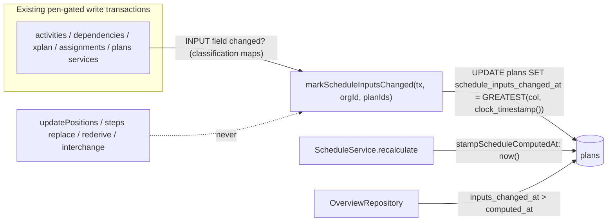
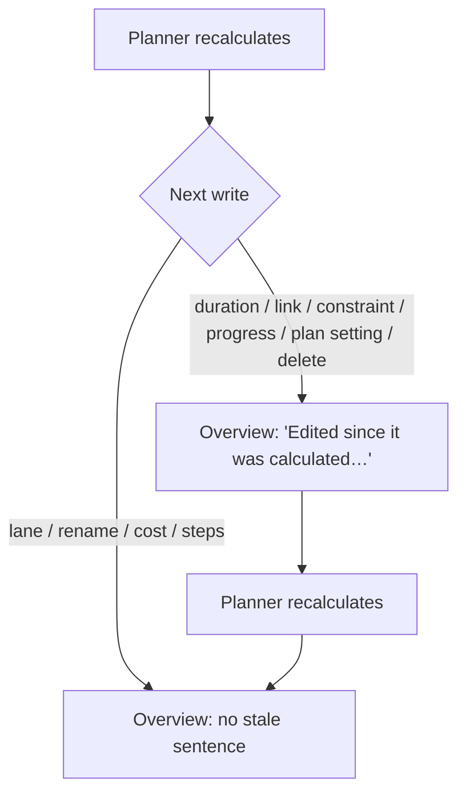

# Feature Spec: "Edited since it was calculated" means a scheduling input changed

- **Status:** Approved — shipped in PR #799 (no ADR was proposed, so the header stays Approved: the decision is in `docs/DECISIONS.md` 2026-10-04 and `docs/DATABASE.md`). Product owner, 2026-10-04 ("leave calendar edits out of it for now", in reply to the plain-English summary). CQ-1 answered (a): calendar, shift and exception edits and resource max-units/calendar edits stay out of scope and go to a TECH_DEBT row.
- **Author(s):** feature-analyst (for the product owner), folding in the database-architect's design
- **Date:** 2026-10-04
- **Tracking issue / epic:** no register row of its own; this spec is the record. Required by
  ADR-0105 / CLAUDE.md §19.1 because the fix adds a schema column. Branch `fix/layout-edits-not-stale`.
- **Roadmap link:** none. This fixes a defect in ADR-0098's organisation overview.
- **Related ADR(s):** ADR-0098 (the overview), ADR-0022 (engine-owned write and `schedule_computed_at`),
  ADR-0028 (the pen), ADR-0172 (soft-delete filter gate), ADR-0076 (claims carry evidence). **No new
  ADR is proposed.** The rule change is recorded in `docs/DATABASE.md` (the database-architect's
  subsection) and a `docs/DECISIONS.md` line. See D-4 for why.

## Plain-English summary (for the product owner)

1. The overview says "Edited since it was calculated" whenever **anything** in a plan was saved after
   the last recalculation. That includes moving a bar to another row, which can never change a date.
2. That is why you see it all the time. Arrange, Alt+↓ and the automatic overlap fix all trigger it.
3. The fix: the plan remembers when a **date-affecting** input last changed, for example a duration,
   a link, a constraint, progress or a plan setting. The overview compares the recalculation with
   that time, not with "last saved".
4. Renames, row moves, notes, costs and steps will no longer trigger the warning. Deleting an activity
   or link after a recalculation **will** trigger it, which today it wrongly does not.
5. Calendar and resource-limit edits still will not trigger it. They did not before either. They are
   recorded as known debt, and Question 1 asks whether you want them now.
6. One database change and one code change ship together in one release. Nothing new appears on
   screen. The false warning simply stops.

## 1. Business understanding

### Problem

The overview's "Where the work stands" row prints `STALE_FIGURES_SENTENCE`, "Edited since it was
calculated, so these figures may have moved"
(`apps/web/src/features/overview/model/standing-copy.ts:44-45`). "Recently changed" prints "Edited
since it was last calculated" (`RecentlyChangedRow.tsx:56-59`). Both show whenever
`editedSinceCalculated` is true. Both API reads compute that flag as:

`GREATEST(plans.updated_at, latest active activity updated_at, latest active dependency updated_at) > plans.schedule_computed_at`

- Recently changed: `overview.repository.ts:166-170` computes the GREATEST and `:218-220` sets the
  flag.
- Standing: `:304-308` computes the GREATEST and `:378-380` sets the flag.

These were read on 2026-10-04 in the working tree.

A lane move writes `activities.lane_index`. Prisma's `@updatedAt` advances `updated_at`, so the flag
becomes true even though lane is not an engine input. The engine's activity select
(`schedule.repository.ts:286-309`) has no `laneIndex`. Lane-only writes include:

- `updatePositions` (`activities.service.ts:865`), whose docblock at `:858-863` says "Layout only …
  triggers no CPM recalculation".
- Lane-only placement batches.
- Arrange.
- Overlap auto-resolve.

The web code already names this as a known false positive (`RecentlyChangedRow.tsx:30-35`). The
product owner reproduced it in a real browser on 2026-10-04 and reports seeing it "constantly". The
same rule has a **false negative**. Both laterals filter `deleted_at IS NULL`
(`overview.repository.ts:189`, `:196`, `:339`, `:344`), so deleting an activity or link after a
recalculation never flags the plan.

**Out of scope:** a second cause is a keyboard-nudge hook that re-sends an undone edit on unmount.
It is fixed separately as `docs/TECH_DEBT.md` #448. That cause is a **real** input write, so this
spec does not and should not suppress it.

### Users

The flag is read by every organisation member who can open the overview: Org Admin, Planner,
Contributor and Viewer. External Guests never reach the overview. Writers are unchanged. Planners
make the structural writes and Contributors make progress writes.

### Primary use cases

1. A planner rearranges rows after a recalculation. The overview still reads as current.
2. A planner or contributor changes a duration, a link or progress. The overview says the figures
   may have moved until the next recalculation.

### Expected outcomes and success criteria

- After a recalculation, a lane-only write (positions, lane-only placements, Arrange, auto-resolve)
  leaves `editedSinceCalculated` false in **both** sections. An API e2e test proves this.
- Every engine-input write path flags the plan. A structural test ties the INPUT set to the engine
  select, so a new engine input cannot be forgotten silently.
- Recently changed ordering and attribution do not change. A lane move still moves the plan up the
  list and credits the mover.

### Open questions

See §6. There is one critical question. Every other point has a stated default.

## 2. Functional requirements

> **US-1.** As a member reading the overview, I want "Edited since it was calculated" to show only
> when a change could have moved a date, so that I trust it when it does show.
>
> - **Given** a plan recalculated at T **when** a lane-only write lands after T **then** both sections
>   report `editedSinceCalculated: false`.
> - **Given** a plan recalculated at T **when** any INPUT field (§3.2) changes value after T **then**
>   both sections report `true`. **When** the plan is recalculated again **then** both report `false`.
> - **Given** a plan recalculated at T **when** an activity, dependency or assignment is deleted or
>   restored **then** the flag is `true`. This is the new behaviour that fixes the false negative.
> - **Given** a plan never calculated **then** the flag is `false` and `scheduleComputedAt` is null.
>   This does not change.
> - **Given** a lane move **then** Recently changed still advances `changedAt` and credits the mover.

> **US-2.** As a planner, I want my non-date edits to stay out of the staleness signal: renames,
> codes, descriptions, cost and EV fields, steps, curve type, plan name and currency.
>
> - **Given** any NOT_INPUT field change **then** the flag does not change.

### Edge cases

- **Write a value equal to the stored one.** A field counts only if its value differs from the
  pre-write row. Re-saving an unchanged editor therefore does not flag.
- **Edit and then undo before recalculating.** Both writes are input changes, so the plan stays
  flagged even though the inputs are back to what was calculated. This is conservative and
  accepted. Comparing against a computed snapshot is a content digest, and the digest approach was
  rejected (§4.6).
- **Concurrent edit and recalculation.** See D-2. With `clock_timestamp()` the remaining race runs
  both ways: an edit that stamps before a recalculation starts and commits after its read is missed
  (only edits that do not take the plan advisory lock), and a recalculation queued behind a
  lock-taking edit leaves a spurious flag until the next one (TECH_DEBT #449).
- **Cross-plan link create/delete.** Both plans are flagged.
- **Interchange import.** The new plan gets the column default. Phase 2's recalculation stamps
  `schedule_computed_at` after it, so a fresh import reads current.
- **Plan restore** (`plans.service.ts:296`) and hierarchy cascades do not stamp. The inputs could not
  change while the plan was in the bin.

### Permissions

No change. The helper runs inside existing, already-authorised, pen-gated transactions. It adds no
endpoint, permission or write a caller can aim. Overview reads keep their organisation scope
(`p.organization_id = …`, `overview.repository.ts:200`, `:365`).

### Validation rules and error scenarios

No new input exists, so no new validation applies. The helper changes no `version`, so it cannot
create a new 409 for a client holding a plan version. A failure inside the helper rolls back the
whole edit transaction, the same as any other statement in it.

## 3. Technical analysis

| Area           | Impact | Notes                                                                                                                                                                                                                                                                                                                                     |
| -------------- | ------ | ----------------------------------------------------------------------------------------------------------------------------------------------------------------------------------------------------------------------------------------------------------------------------------------------------------------------------------------- |
| Frontend       | low    | No behaviour change. `RecentlyChangedRow.tsx:22-35` docblock rewritten. Copy unchanged (D-3)                                                                                                                                                                                                                                              |
| Backend        | med    | New `src/common/schedule-inputs/` helper and classification maps. About 20 call sites across 5 services. Overview read changed in 2 places                                                                                                                                                                                                |
| Database       | low    | One nullable or defaulted `timestamptz` column with backfill, already designed and committed (f45c4425). No index, CHECK or trigger                                                                                                                                                                                                       |
| API            | low    | Field shape unchanged. The **meaning** of `editedSinceCalculated` narrows. Rewrite the OpenAPI description at `overview-response.dto.ts:64-70` and `:256-259`, and `docs/API.md:1334-1340`                                                                                                                                                |
| Security       | none   | No new surface. The helper is organisation-scoped (`WHERE organization_id = $1 AND id = ANY($2)`)                                                                                                                                                                                                                                         |
| Performance    | low    | Each input-changing edit transaction gains one primary-key `UPDATE` on the plan row. Recently changed keeps its laterals because ordering and attribution use them. Standing can drop `last_touched_at`, its `MAX(act.updated_at)` and the dependency lateral if nothing else reads them; the builder checks `findPlanStanding`'s callers |
| Infrastructure | none   | The migration self-applies at boot (ADR-0018). It **must ship in the same release** as the app change                                                                                                                                                                                                                                     |
| Observability  | none   |                                                                                                                                                                                                                                                                                                                                           |
| Testing        | med    | API e2e covers both sections. Structural specs cover the classification. Unit specs cover the helper                                                                                                                                                                                                                                      |

### 3.1 The column (database-architect, committed at f45c4425)

The database-architect designed and committed `Plan.scheduleInputsChangedAt` →
`plans.schedule_inputs_changed_at`, plus migration
`20261004120000_plan_schedule_inputs_changed_at` with a backfill and a `docs/DATABASE.md` subsection.

- **Backfill.** The latest write of any kind, **including soft-deleted rows**. This is what flips 7
  of 5,000 synthetic plans false→true (deletions after a calculation) and none true→false. Measured
  at 393–471 ms on 5k plans and 600k activities.
- **No index, CHECK or trigger.** See DATABASE.md:188, cited by the architect.
- **`schedule_computed_at` is untouched.** The cross-plan `staleness.ts` read is unaffected.

**Verification note (§19.11).** This spec was written against the working tree on `feat/undo-m0`,
which does not contain f45c4425. The analyst had no shell, so `git show` could not be run, and a grep
for `schedule_inputs_changed_at` finds nothing in the tree. The schema, migration SQL, default and
backfill figures above are the **architect's claims and were not re-read here**. Plan Task 0 re-reads
them before any code is written. Every application-code citation in §1, §3.2 and §3.3 **was**
re-read in the working tree on 2026-10-04.

### 3.2 Classification (exhaustive and server-side)

A field is an INPUT if and only if the engine reads it. For activities, that means the keys of the
engine select at `schedule.repository.ts:286-309`. This was re-read, and the select has 19 keys
excluding `id`.

- **Activity INPUT:** `durationMinutes, type, parentId, constraintType, constraintDate,
secondaryConstraintType, secondaryConstraintDate, externalEarlyStart, externalLateFinish,
visualStart, scheduleAsLateAsPossible, calendarId, actualStart, actualFinish, percentComplete,
remainingDurationMinutes, resumeDate, expectedFinish, levelingPriority`.
- **Activity NOT_INPUT:** `name, code, description, durationType, laneIndex, percentCompleteType,
physicalPercentComplete, budgetedExpense, actualExpense, accrualType, status, suspendDate`.
  Together with the INPUT list, this covers every key of `ActivityPatch`
  (`activity.repository.ts:22-73`, re-read). `durationType` is NOT_INPUT because a triad edit that
  matters writes `durationMinutes`, which is an INPUT.
- **Plan INPUT:** `plannedStart, calendarId, progressRecalcMode, useExpectedFinishDates,
criticalPathDefinition, criticalFloatThresholdMinutes, totalFloatMode, makeOpenEndsCritical,
levelResources, levelWithinFloatOnly, ignoreExternalRelationships`.
- **Plan NOT_INPUT:** `name, description, status, eacMethod, currencyCode`. This covers
  `UpdatePlanDto` (`plans/dto/update-plan.dto.ts`, re-read) apart from `version`.
- **Assignment INPUT:** `unitsPerHour, lagMinutes, isDriving, budgetedUnits`.
- **Assignment NOT_INPUT:** `curveType, budgetedCost, actualCost, actualUnits`, plus `editedField`,
  which is a control field and not persisted state (`update-assignment.dto.ts`, re-read).
- **Dependency:** every mutable field is an INPUT: `type, lagDays/lagMinutes, lagCalendar`
  (`update-dependency.dto.ts:14-62`, re-read). Create and delete always stamp.

These are typed as `Record<keyof ActivityPatch, 'INPUT' | 'NOT_INPUT'>`, with equivalents for the
DTOs. A new patch field then fails to compile until someone classifies it, and that is the observer
ADR-0120 asks for. The activity INPUT set is **exported from `schedule.repository.ts` as the select
constant**, and a structural test asserts the two are equal.

### 3.3 Write paths

**Paths that stamp.** Each calls the helper last in its transaction, and only when a classified
INPUT changed value. Create, delete and restore always stamp. The method declarations were re-read
at the cited lines.

| File                                 | Method (line)                                                                                                                                                                                                                                                                                                                                                    |
| ------------------------------------ | ---------------------------------------------------------------------------------------------------------------------------------------------------------------------------------------------------------------------------------------------------------------------------------------------------------------------------------------------------------------- |
| `activities.service.ts`              | `create` :317, `update` :470 (pre-row read at :480), `updatePlacements` :946 (pre-row `byId` select at :968-981, which includes `laneIndex`, so a lane-only placement does not stamp), `updateParents` :1070, `updateProgress` :1246, `remove` :1426, `bulkDelete` :1512, `restoreDeleteBatch` :1652, `dissolveSummary` :1782 (writes at :1829), `restore` :1897 |
| `dependencies.service.ts`            | `create` :206, `update` :369, `remove` :458                                                                                                                                                                                                                                                                                                                      |
| `cross-plan-dependencies.service.ts` | `create` :146, `remove` :267. **Both** plans are stamped                                                                                                                                                                                                                                                                                                         |
| `resource-assignment.service.ts`     | `create` :117, `update` :256 (including the derived `durationMinutes` write at :519-536), `remove` :387                                                                                                                                                                                                                                                          |
| `plans.service.ts`                   | `update` :129                                                                                                                                                                                                                                                                                                                                                    |

**Paths that must not stamp:**

- `updatePositions` (`activities.service.ts:865`, which calls `activity.repository.ts`
  `updateLanePositions`).
- `activity-steps.service.ts` `replace` :56. It bumps the activity's version and `updated_at` at
  :79-82 but writes no engine column.
- The recalculation write (`schedule.service.ts:608` stamps `schedule_computed_at`).
- The three boot-time rederive services (`*-rederive.service.ts`). Each recalculates.
- Interchange (column default plus phase-2 recalculation).
- Plan restore and the hierarchy-lifecycle cascades.

**Lock order.** The recalculation writes activities and then the plan row
(`stampScheduleComputedAt`, `schedule.repository.ts:1011-1026`). Calling the helper last gives edits
the same child → plan order, so it adds no new inversion. The existing activity-row ordering risk is
`docs/TECH_DEBT.md` #440, which this change neither fixes nor worsens.

### Dependencies

- f45c4425 (the schema) must be in the same PR.
- #448 is independent.
- Overview structural specs and `test/overview.e2e-spec.ts` (:171-254 cover the current flag) must
  be updated.

## 4. Solution design

### 4.1 Architecture



### 4.2 Data flow

```mermaid
sequenceDiagram
  participant C as Client
  participant S as ActivitiesService.update
  participant DB as Postgres
  participant OV as Overview read
  C->>S: PATCH activity {laneIndex}
  S->>DB: UPDATE activities (updated_at advances)
  Note over S: laneIndex is NOT_INPUT → no helper call
  OV->>DB: inputs_changed_at > computed_at ?
  DB-->>OV: false (row still ordered by updated_at in Recently changed)
  C->>S: PATCH activity {durationMinutes}
  S->>DB: UPDATE activities; then helper UPDATE plans
  OV->>DB: → true until the next recalculate stamps computed_at
```

### 4.3 User flow



### 4.4 Database changes

The database changes are the committed f45c4425 (§3.1) and nothing more. The database-architect
reviews the PR again because D-2 changes the helper's clock (§19.3).

### 4.5 API changes

No endpoint, shape or status changes. The semantics of `editedSinceCalculated` change from "touched
since" to "**a scheduling input changed since**". Update the OpenAPI descriptions
(`overview-response.dto.ts:64-70`, `:256-259`) and `docs/API.md:1336`. `changedAt` and
`changedByUserId` keep the `updated_at` rule.

### 4.6 Component changes

No behaviour change. Rewrite the `RecentlyChangedRow.tsx:22-35` docblock. The "Auto-arrange is a
known false positive" paragraph is now false. The docblock's reason for not narrowing ("the client
holding a second opinion about what a scheduling input is") is answered, because the classification
lives on the server, derived from the engine select. Also rewrite the "nothing has been WRITTEN"
wording at :25-26.

### 4.7 Approach and alternatives

**Chosen: (b), a plan-level, application-written `schedule_inputs_changed_at`.**

- **(a) Layout writes skip `updated_at`. Rejected.** It breaks the `@updatedAt` rule and fixes only
  lane moves. It fails open for the next layout field. It also hides lane moves from Recently changed
  and from the public `updatedAt`.
- **(c) Content digest of the inputs, compared with a digest stored at recalculation. Rejected.** It
  needs a per-plan scan on every overview load.
- **(d) A database trigger on input columns. Rejected by the architect.** DATABASE.md:188 says no
  triggers for application logic. It would also need column lists in SQL that duplicate the engine
  select, with no compile-time tie.

**Recalc parity.** `computeSchedule` never reads the column. The engine select is unchanged; it is
only exported. The output is byte-identical by construction, and the existing parity suites stay
green with no change.

**Decisions taken as defaults:**

- **D-1.** The helper is a raw `UPDATE`. It does not touch `version`, `updated_at` or `updated_by`.
  It carries a `// soft-delete: any-state —` justification for the ADR-0172 gate and is
  organisation-scoped.
- **D-2. `clock_timestamp()` instead of the architect's `now()`.** `now()` is the edit
  transaction's **start**. An edit that began before a recalculation and committed after the
  recalculation's read would be stamped earlier than `computed_at`, so the change would be **missed**
  (fail-open). `clock_timestamp()` in the last statement of the edit is close to commit time, so the
  residual race fails towards a spurious flag. The pre-existing race is the same class, so this is a
  strict improvement. The backfill is unaffected. **The database-architect must confirm this in
  review.** If they hold to `now()`, the race goes into the gap TECH_DEBT row unchanged.
- **D-3. Keep the copy.** "Edited since it was calculated" stays true whenever the flag fires.
  `freshness-copy.structural.test.ts` stays untouched.
- **D-4. No ADR.** This narrows one read-model flag within ADR-0098 and adds no pattern other
  modules must follow beyond a helper whose obligation is compiler- and structurally enforced. It is
  recorded in DATABASE.md (the architect's subsection) and in DECISIONS.md.
- **D-5. Known gaps go to one new TECH_DEBT row** (the next free number after #448). These are not
  flagged:
  - calendar, shift and exception edits;
  - resource `maxUnitsPerHour` and `calendarId` edits;
  - the residual commit race.

  The old rule missed all of these too, so this is no regression. The row's trigger is a planner
  reporting a stale-but-silent overview after a calendar edit.

- **D-6. No `VITE_*` flag** (ADR-0088 D1). **Entry point:** the existing overview. This is a
  behaviour fix on an existing surface, so no new journey is required (ADR-0081 applies to a new
  capability). The proof is the API e2e test.

## 5. Links

- Implementation plan: [./implementation-plan.md](./implementation-plan.md)
- Docs updated by this change:
  - `docs/API.md`
  - `docs/DATABASE.md` (the architect's subsection, already committed)
  - `docs/DECISIONS.md`
  - `docs/TECH_DEBT.md` (the new gap row)
  - migration counts 73→74 in CLAUDE.md §1/§4, `README.md`, `docs/ARCHITECTURE.md` and
    `docs/DATABASE.md` (`check:counts`)

## 6. Critical question

**CQ-1. Should calendar and resource edits also flag affected plans in this change?**

- **(a) No — the default. Record them as known debt.** Today's rule misses them too. One calendar
  can serve many plans, so stamping means a fan-out `UPDATE` across every plan using that calendar,
  including plans that inherit it through a resource. That fan-out deserves its own design and
  database-architect pass.
- **(b) Yes, now.** This adds a fan-out task and probably a second milestone. Expect roughly double
  the size.
