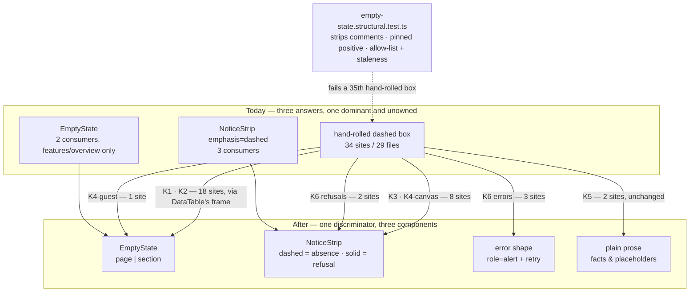
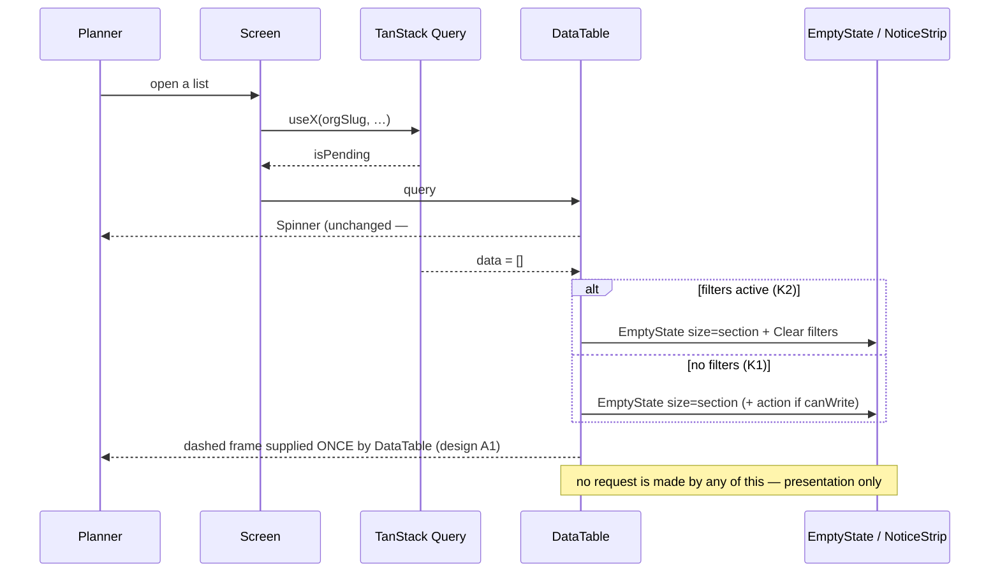
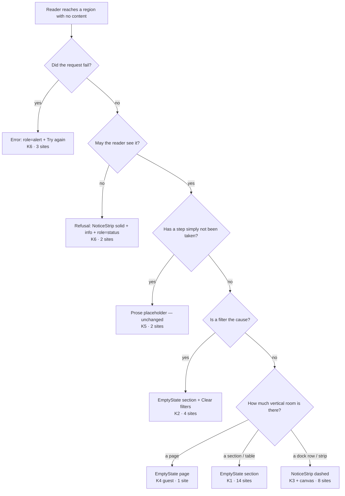

# Feature Spec: Empty-state consolidation

- **Status:** Draft — awaiting product-owner approval
- **Author(s):** feature-analyst
- **Date:** 2026-09-01
- **Tracking issue / epic:** `docs/TECH_DEBT.md` #161(a) **and #161(b)** — one epic, separate
  milestones. (b) was folded in on 2026-09-01 after counting `DataTable`'s consumers; §1.7 records
  that my first answer was to split them and why the measurement overturned it.
- **Roadmap link:** none — this is register-driven consolidation, not a roadmap theme
- **Related ADR(s):** ADR-0097 (surface scopes / design language), ADR-0098 (the page
  archetypes, which built `EmptyState`), ADR-0058 (drift control — why a consolidation needs a
  gate), ADR-0082 (omit vs. shade — why a _fact_ is not an absence), ADR-0105 (which triggers
  this crosses), ADR-0110 D5 (a gate is verified against the defect it names)

---

## 0. What was verified, and what the brief got wrong

Everything below that decides something names what was run or read to establish it (ADR-0076,
`docs/PROCESS.md` "Decision-bearing claims carry their evidence"). **The brief is not evidence**
either — three of its claims were checked and two needed correcting.

| Claim                                                                        | Source                  | Verdict                                                                                                                                                                                                                                                                                                                                                                                                                                                                    |
| ---------------------------------------------------------------------------- | ----------------------- | -------------------------------------------------------------------------------------------------------------------------------------------------------------------------------------------------------------------------------------------------------------------------------------------------------------------------------------------------------------------------------------------------------------------------------------------------------------------------- |
| 34 occurrences across 29 files                                               | brief / #161(a)         | **CONFIRMED.** `rg 'rounded-lg border border-dashed' apps/web/src -g '*.tsx'` → 34 lines, 29 distinct paths (counted, listed in §1.3).                                                                                                                                                                                                                                                                                                                                     |
| "every one the same class string"                                            | brief / #161(a)         | **WRONG — 4 differ.** `CalendarsTable.tsx:370`, `ResourcesTable.tsx:425`, `AuditEventList.tsx:131` omit `text-muted-foreground` and `text-sm` (they carry a nested `<p>` plus a button instead); `TsldPanel.tsx:2473` adds `flex items-center justify-center` and is inside a `cn()` with a conditional `h-full min-h-[240px]`. The idiom is dominant, not uniform — which matters, because a gate keyed on the exact string would have missed 4 of the 34.                |
| `EmptyState` has two consumers, both in `features/overview`                  | brief / #161(a)         | **CONFIRMED.** `rg EmptyState apps/web/src` → `OrganisationEmptyState.tsx` (2 uses) and `RecentlyChangedSection.tsx` (2 uses), plus the primitive, the barrel, its own unit suite and the `archetypes.structural.test.ts` name check. No consumer outside `features/overview`.                                                                                                                                                                                             |
| #161(b) is a `clients-loading` screen defect fixable with `ListRowSkeleton`  | brief / #161(a)         | **WRONG on both halves** — see §1.7. The spinner is in `DataTable` (`data-table.tsx:82-87`), not in `ClientsTable`; and `ListRowSkeleton` renders a _list row_, which is the wrong shape for a table.                                                                                                                                                                                                                                                                      |
| #161(b) is the same shape as (a) and belongs in this pass                    | coordinator, 2026-09-01 | **CONFIRMED, and my own first answer was wrong.** I had defaulted it to a separate pass; the measurement below overturns that and the folded-in version is §1.7. Recorded rather than silently corrected — the first draft of this spec argued for splitting, and the argument did not survive counting `DataTable`'s consumers.                                                                                                                                           |
| `DataTable` has 15 non-test consumers                                        | coordinator             | **CLOSE — it is 17.** `rg DataTable apps/web/src` → 21 files; minus the primitive, its own suite, `staff.test.tsx`, and `skeleton.tsx` (a docblock mention, not a use) = **17 consumers**. The direction of the argument is unaffected; the figure is corrected because a spec that repeats a number it did not count is how #161(a) got filed as "three screens".                                                                                                         |
| `Skeleton` + `ListRowSkeleton` have 2 consumers, both in `features/overview` | coordinator             | **CONFIRMED, and sharper than stated.** `ListRowSkeleton` has exactly 2 (`NeedsAttentionSection.tsx:113`, `RecentlyChangedSection.tsx:56`). `Skeleton` has **zero** consumers outside `list-row.tsx` and the archetype suite — so the material primitive has never been used by a feature at all. Same "the primitive did not spread" shape as `EmptyState`, one rung lower.                                                                                               |
| ~19 files touch `Spinner`/`animate-spin`                                     | coordinator             | **22 files, 52 occurrences** (`rg 'Spinner\|animate-spin' apps/web/src`). Classified in §1.8; **most are correct and stay**.                                                                                                                                                                                                                                                                                                                                               |
| (not in the brief) `DataTable` was already told to own its loading shape     | —                       | **`components/ui/page/skeleton.tsx:11-12`**: _"each archetype that has a shape owns its own loading render and uses this as the material: `ListRow.Loading` knows a row's height and columns, **`DataTable` knows its own**."_ The design system assigned this job when the archetypes were built and nothing ever observed it. ADR-0120's class exactly — a documented obligation with no computed observer — and it is the strongest single argument for folding (b) in. |
| (not in the brief) `EmptyState` is the only shared answer                    | —                       | **WRONG.** `components/ui/notice-strip.tsx:34-35` declares `emphasis: 'dashed'` with the docblock _"Nothing here yet — an empty state, never a message about something that happened."_ It has **9 consumers** and is already the in-use answer for panel-level empties. There are **three** answers in the tree, not two. This is the single biggest finding in the spec (§1.4).                                                                                          |

**Marked unverified (not established from the code, do not act on without checking):**

- Whether the visual loss of the dashed frame (§4, CQ-1) is acceptable to the product owner. This
  is a taste judgement, not a code fact.
- Whether any of the 34 sites is covered by an existing Playwright assertion that asserts on the
  _box_ rather than on its text. §5 assumes text-based locators throughout; the conversion tasks
  each carry a step to run the named suite rather than to reason about it.
- Real assistive-technology announcement of the four sites that carry `role="status"`
  (`audit-log.tsx:86`, `EarnedValuePanel.tsx:131` and `:319`, `FloatPathsPanel` sibling). Reasoned
  from the ARIA specification, not observed.

---

## 1. Business understanding

### Problem

A planner meets "there is nothing here" on roughly thirty screens of SchedulePoint, and each one
was written by hand. `rg 'rounded-lg border border-dashed' apps/web/src -g '*.tsx'` returns **34
occurrences across 29 files** — tables, panels, dialogs, four route files and the unauthenticated
guest share view. Against that, `EmptyState` — the archetype ADR-0098 built and
`docs/UX_STANDARDS.md:61` documents as _"Icon + one-line explanation + primary action to
proceed"_ — has **two consumers**, both inside the `features/overview` feature it was written for.

**The primitive did not spread; the hand-rolled box did.** That is the defect, and it has three
costs, only one of which is cosmetic:

1. **The documented archetype is not what the product does.** `UX_STANDARDS.md:61` describes a
   state the app renders in 2 places out of ~31. A standard that describes a minority is not a
   standard; it is a claim, and the next author reads the code rather than the document.
2. **The idiom has already drifted, silently.** Four of the 34 differ from the other thirty
   (§0). Two of them — `resource-strip-panel.tsx:320` and `ResourceHistogram.tsx:108` — carry
   the _same sentence_ about resource loading in two files. One file, `TsldPanel.tsx`, uses the
   correct shared primitive at line 2700 (`NoticeStrip emphasis="dashed"`) and hand-rolls the box
   at line 2473, ~230 lines apart. That is this register's most-recorded shape: one correct
   pattern applied to a control and not its neighbour.
3. **Five of the 34 are not empty states at all** and are dressed as one (§1.5). Three are
   _not-found errors_, two are _permission refusals_. A refusal wearing an empty state's clothes
   tells a Viewer that something is missing when the truth is that they may not see it.

**And the same table's loading state has the same defect, filed the same way.** #161(b) reads
_"`clients-loading` is a bare spinner"_ — one screen — and the spinner is in `DataTable`
(`data-table.tsx:85`), which has **17 consumers**. `clients` was the one a screenshot caught.
`components/ui/page/skeleton.tsx:11-12` already says _"`DataTable` knows its own"_ loading shape,
and it never did. The two rows are one reader's experience of one screen, so they are one epic
(§1.7).

**Why now.** #161(a) was filed 2026-08-21 as "three screens — pick one and apply it", from a
screenshot list that had just gone 12 → 25 shots. Counted from the code on 2026-09-01 it is an
order of magnitude larger, which is the difference between a tidy-up and a pass that needs a
gate. It is ADR-0110 D5's shape: a figure that came from an instrument's reach rather than from
the code, and read afterwards as a count — **and it happened twice, in adjacent rows, neither
noticed until somebody counted.** That is the argument for the gate rather than another sweep.

### Users

Every authenticated role, plus one unauthenticated one. Nobody gains a capability here; what
changes is what they are told when there is nothing to show.

| Role                               | What changes                                                                                                                                                                                               |
| ---------------------------------- | ---------------------------------------------------------------------------------------------------------------------------------------------------------------------------------------------------------- |
| **Org Admin**                      | The member, calendar, resource and audit-log empties become consistent. Two permission refusals stop reading as absences.                                                                                  |
| **Planner**                        | ~20 of the 34 sites are on plan-authoring surfaces (activities, dependencies, baselines, resources, notes, steps, share links).                                                                            |
| **Contributor**                    | Progress and notes panels. The Steps empty state (`ActivityProgressPanels.tsx:590`) is the one they meet most.                                                                                             |
| **Viewer**                         | Benefits most from the §1.5 correction: three of the five mis-dressed sites are the ones a Viewer is most likely to hit, because a Viewer sees more refusals than anyone.                                  |
| **External Guest** (ADR-0016/0051) | `GuestPlanView.tsx:237` — _"This plan has no activities yet."_ This is the **only screen an outsider sees**, and it is the only site here reachable without a session. It gets its own milestone (§5, M5). |

### Primary use cases

1. A planner opens a list, panel or dialog that has nothing in it, and is told what is absent, why,
   and what to do about it — in one consistent shape wherever it happens.
2. A planner filters a list to nothing and can tell that apart from the list being empty, with a
   way back (this already works in 3 of 4 places; §1.6 records the fourth as a defect).
3. A reader who **may not see** something is told so, in a shape that does not read as an absence.
4. A guest opens a share link for a plan with no activities and gets a sentence that makes sense to
   someone with no account and no context.
5. An engineer adding the thirty-fifth empty state cannot hand-roll it without a gate objecting.

### User journeys

No journey changes. Every one of these states is already reachable and already rendered; this
changes _what is rendered there_, never _whether it is reachable_. There is therefore **no new
entry point** in the ADR-0105 sense (§3.5), and each milestone's "entry point" line in the plan
names the existing control that reaches the state it converts.

### Expected outcomes

- One vocabulary with **three** members and a written discriminator (§4.1), rather than three
  primitives and an undocumented majority idiom.
- `docs/UX_STANDARDS.md:61` becomes true of the product instead of true of two screens.
- Five sites stop misrepresenting an error or a refusal as an absence.
- A structural gate makes the thirty-fifth site a decision somebody makes rather than a copy
  somebody pastes.

### Success criteria

| #    | Criterion                                                            | How it is measured                                                                                                                                                     |
| ---- | -------------------------------------------------------------------- | ---------------------------------------------------------------------------------------------------------------------------------------------------------------------- |
| SC-1 | The hand-rolled idiom appears **only** where somebody wrote down why | `empty-state.structural.test.ts` allow-list is non-empty and every entry carries a reason ≥ 20 chars; unexpected set is `[]`                                           |
| SC-2 | The gate can fail                                                    | Verified red against the pre-conversion tree, output committed as `red-run.md` (ADR-0120 precedent)                                                                    |
| SC-3 | No site changes what it _means_                                      | The §1.5 classification is reproduced as a table in the gate's docblock; the 5 K6 sites are converted to the error/refusal shapes, not to `EmptyState`                 |
| SC-4 | Nothing became unreachable                                           | Every named existing Playwright suite (§5) passes unchanged; where a suite asserted on copy, the copy is preserved verbatim or the assertion is updated in the same PR |
| SC-5 | The visual result was **looked at**                                  | `apps/web/scripts/shoot.mjs` gains shots for the panel and dialog kinds, which today it has none of; the milestone is not done until the pictures have been read       |

### Open questions

Critical ones are in §6. Defaults for everything else are stated inline and marked **Default:**.

---

### 1.3 The 34 sites, enumerated

Every line below was opened and read. Grouped by the **kind** established in §1.5.

**Group A — table empty, supplied through `DataTable`'s `empty` prop (18 sites, 17 files).**

| #   | Site                                                                        | Kind                                                   |
| --- | --------------------------------------------------------------------------- | ------------------------------------------------------ |
| 1   | `features/clients/components/ClientsTable.tsx:119`                          | K1                                                     |
| 2   | `features/projects/components/ProjectsTable.tsx:122`                        | K1                                                     |
| 3   | `features/plans/components/PlansTable.tsx:123`                              | K1                                                     |
| 4   | `features/activities/components/ActivitiesTable.tsx:892`                    | K1                                                     |
| 5   | `features/members/components/MembersTable.tsx:98`                           | K1                                                     |
| 6   | `features/baselines/components/BaselinesPanel.tsx:138`                      | K1                                                     |
| 7   | `features/share/components/ShareLinksDialog.tsx:265`                        | K1 (in a dialog)                                       |
| 8   | `features/recently-deleted/components/RecentlyDeletedTable.tsx:326`         | K1                                                     |
| 9   | `features/cross-plan-dependencies/components/CrossPlanLinksSection.tsx:158` | K1                                                     |
| 10  | `features/dependencies/components/DependencyTable.tsx:171`                  | K1                                                     |
| 11  | `features/calendars/components/ProjectCalendarsSection.tsx:248`             | K1                                                     |
| 12  | `features/calendars/components/CalendarsTable.tsx:377`                      | K1                                                     |
| 13  | `features/resources/components/ResourcesTable.tsx:432`                      | K1                                                     |
| 14  | `features/audit/components/AuditEventList.tsx:127`                          | K1                                                     |
| 15  | `features/calendars/components/ProjectCalendarsSection.tsx:244`             | **K2** (filtered — and the one with no way back, §1.6) |
| 16  | `features/calendars/components/CalendarsTable.tsx:370`                      | K2 (filtered + Clear filters)                          |
| 17  | `features/resources/components/ResourcesTable.tsx:425`                      | K2 (filtered + Clear filters)                          |
| 18  | `features/audit/components/AuditEventList.tsx:131`                          | K2 (filtered + Clear filters)                          |

**Over half the estate is behind one prop on one primitive.** That is the most useful structural
fact in this spec and it drives the slicing (§5): Group A is one seam, not seventeen.

**Group B — panel / section empty, hand-rolled inline (7 sites).**

| #   | Site                                                             | Kind                       |
| --- | ---------------------------------------------------------------- | -------------------------- |
| 19  | `components/layout/workspace/resource-strip-panel.tsx:320`       | K3 — near-duplicate of #20 |
| 20  | `features/resources/components/ResourceHistogram.tsx:108`        | K3 — same sentence as #19  |
| 21  | `features/resources/components/ActivityResourcesPanel.tsx:302`   | K3                         |
| 22  | `features/notes/components/NoteThread.tsx:95`                    | K3                         |
| 23  | `features/calendars/components/CalendarExceptionsEditor.tsx:441` | K3 (in a dialog)           |
| 24  | `features/activities/components/ActivityProgressPanels.tsx:590`  | K3 (in a dialog)           |
| 25  | `features/earned-value/components/EarnedValuePanel.tsx:319`      | K3, `role="status"`        |

**Group C — canvas / page-filling (2 sites).**

| #   | Site                                              | Kind                                                                             |
| --- | ------------------------------------------------- | -------------------------------------------------------------------------------- |
| 26  | `features/tsld/components/TsldPanel.tsx:2473`     | K4 — the `fill` variant; **the same file uses `NoticeStrip` correctly at :2700** |
| 27  | `features/share/components/GuestPlanView.tsx:237` | K4 — the guest view, own milestone                                               |

**Group D — precondition placeholder (2 sites).**

| #   | Site                                                           | Kind                                                       |
| --- | -------------------------------------------------------------- | ---------------------------------------------------------- |
| 28  | `features/interchange/components/ImportScheduleDialog.tsx:264` | K5 — _"Choose a file above and its report appears here."_  |
| 29  | `features/dependencies/components/AddLinkSection.tsx:165`      | K5 — _"This plan has no other activities to link to yet."_ |

**Group E — NOT empty states. Must not be converted to `EmptyState` (5 sites).**

| #   | Site                                                        | What it actually is                                                                                 |
| --- | ----------------------------------------------------------- | --------------------------------------------------------------------------------------------------- |
| 30  | `routes/plan-detail.tsx:61`                                 | `query.isError` — not-found / no-access, with a "Back to clients" link                              |
| 31  | `routes/project-detail.tsx:58`                              | ditto                                                                                               |
| 32  | `routes/client-detail.tsx:35`                               | ditto                                                                                               |
| 33  | `routes/audit-log.tsx:86`                                   | permission refusal, `role="status"` — _"Only an Org Admin can read this organisation's audit log."_ |
| 34  | `features/earned-value/components/EarnedValuePanel.tsx:131` | permission refusal, `role="status"` — _"Cost & earned value is restricted"_                         |

**14 + 4 + 7 + 2 + 2 + 5 = 34.** ✓

### 1.4 There are three primitives in this space, not one

The brief frames this as "`EmptyState` did not spread". It is worse and more interesting than
that: **a second shared primitive already covers part of the estate and is in use.**

`components/ui/notice-strip.tsx` declares:

```
emphasis: {
  solid: 'rounded-md',
  /** Nothing here yet — an empty state, never a message about something that happened. */
  dashed: 'rounded-md border-dashed',
},
```

Its own docblock records that it was extracted because _"four had been hand-rolled — `EditConflictBanner`,
the two faces of `CanvasModeBand`, and the canvas empty state"_. It has **9 consumers**
(`rg NoticeStrip apps/web/src` → 9 non-test source files), and `emphasis="dashed"` is used at
`FloatPathsPanel.tsx:199` and `:247` and `TsldPanel.tsx:2702` — all three of them panel-level
empty states, all three correct.

So the honest statement of the problem is not "one primitive, 34 strays". It is:

- `EmptyState` — **vertical, centred, unframed**, icon + title + description + action. Built for a
  page or a section inside a `SectionCard`. 2 consumers.
- `NoticeStrip emphasis="dashed"` — **horizontal, one line, framed**, actions on the right. Built
  for a panel or a strip. 3 dashed consumers (9 total).
- The hand-rolled box — **framed, centred, no action slot**. 34 sites.

A consolidation that funnels all 34 into `EmptyState` would be wrong: it would take the three
correct `NoticeStrip` panel empties and leave them as a fourth idiom, or drag them into a shape
that does not fit a 36-px dock row. **The deliverable is a discriminator, not a single component**
(§4.1).

### 1.5 The classification — six kinds, and the two that must not be converted

`EmptyState`'s own docblock (`empty-state.tsx:39-41`) already names the category that must be kept
out, and `NeedsAttentionSection.tsx:17-20` follows it:

> There is a fourth thing that is NOT an empty state and must not render as one: a settled
> one-liner like "Nothing needs you right now" is a **fact**, not an absence to be resolved.

Applying that test to all 34:

| Kind   | What it is                                                                                                                                                         | Count | Answer                                                                       |
| ------ | ------------------------------------------------------------------------------------------------------------------------------------------------------------------ | ----- | ---------------------------------------------------------------------------- |
| **K1** | **Table empty.** The box replaces the rows; the caption and any header controls still stand. The reader may be able to create the first row.                       | 14    | `EmptyState size="section"`, framed by `DataTable` (§4.2)                    |
| **K2** | **Table filtered to nothing.** A _different situation_ from K1 and must never read as one — `CalendarsTable.tsx:368-369` says so in a comment. Carries a way back. | 4     | `EmptyState size="section"` + `action={<Clear filters>}`                     |
| **K3** | **Panel / section empty.** Inside a dock, a `FormSection` or a side panel; vertical room is scarce.                                                                | 7     | `NoticeStrip emphasis="dashed"` — the existing, in-use answer                |
| **K4** | **Canvas / page-filling empty.** Fills a region sized by its host.                                                                                                 | 2     | `EmptyState size="page"` (guest) / `NoticeStrip` in the dock (canvas) — §4.3 |
| **K5** | **Precondition placeholder.** Nothing is missing; a step has not been taken yet ("choose a file above"), or the absence is resolved on a different screen.         | 2     | **Kept as prose, not converted.** §1.5.1                                     |
| **K6** | **Not an empty state.** An error, or a refusal.                                                                                                                    | 5     | **Must not be converted.** §1.5.2                                            |

**That is the reduction the brief asked me to state with its number: 7 of 34 sites (K5 + K6) are
correctly bespoke or wrongly framed, and the true consolidation target is 27.** Two more (K5) are
arguable and I have defaulted them to "leave alone" with the reason below.

#### 1.5.1 K5 — why a placeholder is not an empty state

`ImportScheduleDialog.tsx:264` reads _"Choose a file above and its report appears here."_ Nothing
is absent — the reader has not done the thing yet, and the sentence is an instruction pointing at
a control 200 px above it. Dressing it in an icon and a title would announce a problem where the
dialog is working exactly as designed. The file's own neighbouring comment (`:270-272`) already
reasons this way about step 3: _"an empty version of it would describe a decision this import does
not have."_

`AddLinkSection.tsx:165` is the harder one and I am calling it K5 rather than K1: _"This plan has
no other activities to link to yet. Add another activity to the plan first, then come back."_ It
is an absence, but it is not an absence **of this section's subject** — the section's subject is
links, and there are no links because there are no activities. Offering an action here would be
offering "add an activity", which is on a different surface. **Default: leave as prose.**
Reversible with one line if the product owner disagrees; it does not change the shape of the pass.

#### 1.5.2 K6 — the five that are lying, and what they become instead

These are the substantive product defects the count turned up, and they are worth the pass on
their own.

**Three not-found errors.** `plan-detail.tsx:61`, `project-detail.tsx:58`,
`client-detail.tsx:35` are the `query.isError` branch. They say _"This plan doesn't exist, was
deleted, or you don't have access to it"_ inside an empty-state box. `UX_STANDARDS.md:62` requires
an error state to be _"Friendly message + retry"_ — and there is no retry, only a link away. The
dashed box additionally makes a failed request look like a successful request that found nothing,
which is exactly the distinction ADR-0073 C1's live-region finding was about ("nothing recorded
yet" vs. "nothing matches what you asked for"). **They become the error shape** — `role="alert"`,
the existing `text-destructive-text` + Try again pattern that `DataTable.tsx:90-100` already
implements — plus the existing "Back to clients" link, which is a genuinely useful exit and stays.

**Two permission refusals.** `audit-log.tsx:86` and `EarnedValuePanel.tsx:131`. Both already carry
`role="status"` and both are correct about _what_ they say; what is wrong is the costume. A
refusal is `EmptyState`'s "fact" case with a name — ADR-0082 is the register's decision on this
exact distinction, and its rule is that a reader must be told _why_ it is shut, in a form that
does not pretend the thing is merely absent. **They become `NoticeStrip tone="info"
emphasis="solid"`** — solid, because per `notice-strip.tsx:34` dashed means "nothing here yet",
and there _is_ something here; the reader may not see it. `role="status"` is preserved verbatim,
because both fire on an async resolution and dropping it is a WCAG 4.1.3 regression that no unit
test would catch (`EarnedValuePanel.tsx:125-127` records why it is there).

**This is the part of the pass that changes meaning rather than appearance, so it is sliced first
(§5, M2) and reviewed on its own.**

### 1.6 One more defect found while classifying

`ProjectCalendarsSection.tsx:244` is a **K2 filtered-empty with no way back**. Its three siblings
(`CalendarsTable.tsx:370`, `ResourcesTable.tsx:425`, `AuditEventList.tsx:131`) all render a
`Clear filters` button; this one renders the bare sentence _"No archived calendars."_ when the
`archivedFilter === 'only'` filter is active. A reader who filtered to archived, found none, and
has no control offering the way back has to work out that the filter above is the cause.

One correct pattern applied to a control and not its neighbour, for the second time in one row.
**Fixed as part of M4**, with the fix named in the milestone rather than smuggled in.

### 1.7 #161(b) — folded in, and it is the same defect one state along

**My first answer was "separate pass". It was wrong, and the measurement is what changed it** —
recorded rather than quietly replaced, because the reasoning is the useful part.

The row reads _"`clients-loading` is a bare spinner where `docs/UX_STANDARDS.md` expects a
skeleton"_, which reads as one screen. It is not one screen, for exactly the reason (a) was not
three screens:

1. **The spinner is in the primitive.** `data-table.tsx:82-87` — `if (query.isPending) return <div
className="p-6"><Spinner label={loadingLabel} /></div>`. `apps/web/scripts/shoot.mjs:328-332`
   shoots `clients-loading` by hanging the clients API, so the picture is of `DataTable`'s loading
   branch. `DataTable` has **17 consumers** (§0). `clients` was simply the one a screenshot caught
   — **the identical instrument-reach error that filed (a) as "three screens"**, in the row
   directly beneath it, and neither was noticed until somebody counted.
2. **One change covers all 17.** The seam is the same seam as Group A: one primitive, one branch.
   Splitting the passes means touching `data-table.tsx` twice, reviewing it twice, and shipping a
   table whose empty state is consistent and whose loading state is not — which is one reader's
   experience of one screen, made inconsistent by our slicing rather than by anything in the
   product.
3. **The design system already assigned this job and nothing observed it.**
   `components/ui/page/skeleton.tsx:11-12` says _"each archetype that has a shape owns its own
   loading render… `ListRow.Loading` knows a row's height and columns, **`DataTable` knows its
   own**."_ That is a written obligation with no computed observer — ADR-0120's class — and it has
   been unmet since the archetypes were built.

**The brief's proposed remedy is still wrong, and that part stands.** `ListRowSkeleton` renders a
two-line stacked block with a trailing chip — the shape of a `ListRow`. A `DataTable` row is a set
of columns. Its own docblock (`list-row.tsx:53-58`) states the rule it would violate:
_"`docs/UX_STANDARDS.md` requires a skeleton and its settled layout to be identical… A generic
`Skeleton` rectangle cannot satisfy that."_ Using `ListRowSkeleton` in a table would reflow the
page the moment the columns arrived — the exact defect it was written to prevent.

**Can `DataTable` build the skeleton from what it already has? Yes.** It receives
`columns: Column<T>[]` (`data-table.tsx:41`), so it knows the column count, each column's
`headClassName`/`cellClassName`, and — through the shared `--row-h` token that `ListRow` and the
Gantt virtualizer already share — the row height. The skeleton is therefore **derived, not
configured**: N rows × `columns.length` cells, using `Skeleton` as the material, exactly as
`skeleton.tsx:12` instructs. **No new prop is required.** If a `skeletonRows?: number` is added
for the two or three callers whose lists are known-short, it is a _new optional_ prop and does not
change an existing prop's type or optionality — so it does not trip the letter of the ADR-0105
contract trigger. It is flagged to the product owner anyway (§6, CQ-4), because the spec is being
approved regardless and an API widening decided silently is how `EmptyState` ended up with two
consumers and a competitor.

**The one constraint that must not be broken.** `DataTable`'s empty branch carries
`describedById` (`data-table.tsx:105-114`), and `docs/TECH_DEBT.md` #93(d) records why: it _"used
to return before the described region, so prose qualifying what the rows mean reached a reader
WITH rows and not a reader with none — the state where an unexplained absence is most likely to be
misread."_ Fixed 2026-08-31, one day before this spec. Both changes proposed here touch that
branch:

- the **frame** (A1, §4.2) must wrap _inside_ or _be_ the `aria-describedby` div, never replace it;
- the **skeleton** raises the same question one state along — the loading branch does **not**
  carry `describedById` today (`:82-87`), and #93(d)'s reasoning ("an unexplained absence is most
  likely to be misread") applies at least as strongly while the reader is waiting.

M3 and M7 each carry a regression assertion for this, **verified red by reverting the #93(d) fix**
so the test is known to be able to fail. Extending `describedById` to the loading branch is
proposed but marked **unverified** — it is reasoned from #93(d)'s stated principle, not observed
with a screen reader, and it is put to the accessibility reviewer rather than asserted here.

### 1.8 The spinners — classified, and most of them are correct

The coordinator's warning is the right one: _"overreaching here would be the mirror of the mistake
that filed the row."_ `docs/UX_STANDARDS.md:60` asks for a _"Skeleton matching final layout (first
load) / inline busy (actions)"_ — **two answers, and the discriminator is whether the content has
a known shape**, not whether something is pending.

`rg 'Spinner|animate-spin' apps/web/src` → **52 occurrences across 22 files** (not ~19). Read and
classified:

| Verdict                                      | Sites                                                                                                                                                                                                                                                                                                                                   | Why                                                                                                                                                                                                                                                                                                                                                                               |
| -------------------------------------------- | --------------------------------------------------------------------------------------------------------------------------------------------------------------------------------------------------------------------------------------------------------------------------------------------------------------------------------------- | --------------------------------------------------------------------------------------------------------------------------------------------------------------------------------------------------------------------------------------------------------------------------------------------------------------------------------------------------------------------------------- |
| **Correct — an action, not content.** Stays. | `ImportScheduleDialog.tsx:246` ("Parsing the file…"), `:297` ("Importing the schedule…"), `plan-facts.tsx:297` (the recalculating cue — ADR-0031's `isBusy` rule, paired with a word because `prefers-reduced-motion` reduces the spin to nothing), `tsld-toolbar-items.tsx` (recalculate), `AcceptInvitationCard.tsx` (submit pending) | The duration is indeterminate and there is no final layout to match. A skeleton would promise a shape that is not coming.                                                                                                                                                                                                                                                         |
| **Correct — a gate, not content.** Stays.    | `router.tsx:372`, `:389` (Suspense chunk fallbacks — the chunk defines the shape and has not loaded, so nothing knows it), `staff.tsx:55` (staff identity check), `audit-log.tsx:77` ("Checking your access…"), `forgot-password.tsx:42` ("Checking whether you are signed in…")                                                        | The answer decides _which_ layout renders. A skeleton would have to guess, and would be wrong half the time — including on the refusal branch, where the settled layout is a sentence.                                                                                                                                                                                            |
| **The defect. In scope (M7).**               | `data-table.tsx:85`                                                                                                                                                                                                                                                                                                                     | 17 consumers; a known column count; a design-system docblock already assigning it the job.                                                                                                                                                                                                                                                                                        |
| **Candidates, deliberately NOT in scope.**   | `client-detail.tsx:20`, `project-detail.tsx:43`, `plan-detail.tsx:42`, `EarnedValuePanel.tsx:121`, `staff.tsx:192/345/505/569`, and the panel spinners in `NoteThread`, `CalendarExceptionsEditor`, `GuestPlanView`, `FloatPathsPanel`, `ScheduleSummaryStrip`, `ActivityMembersPanel`, `ScheduleHealthPanel`                           | Each is a _page or panel_ whose shape is bespoke, so each needs its own skeleton designed — that is 15 designs, not one primitive change, and it is a different piece of work. Two of them (`plan-detail.tsx:39,45`) already render partial `animate-pulse` bars beside the spinner, so the page-level pattern is half-invented already and wants deciding rather than extending. |

**So M7 changes exactly one spinner and leaves 51 occurrences alone**, which is the honest scope.
The remaining candidates are filed as a successor row rather than absorbed — the epic's own rule
about not letting an instrument's reach set a scope applies to _this_ spec too.

**One claim here is marked unverified:** the four `staff.tsx` panel spinners and the six panel
spinners in the last row were classified from their surrounding context in a single grep pass, not
from opening each file whole. M0-T2 opens all 22 and produces the final table; if any turns out to
be a `DataTable`-shaped list, it joins M7. Saying so now rather than discovering it mid-milestone
is the point of writing the classification down first.

---

## 2. Functional requirements

### User stories & acceptance criteria

> **US-1** — As **any signed-in member**, I want an empty list, panel or dialog to look and read
> the same wherever I meet it, so that I can tell "nothing here yet" from "something went wrong"
> without learning a new shape per screen.
>
> **Acceptance criteria**
>
> - **Given** a table with no rows, **when** it renders, **then** it shows the shared empty state
>   with the same spacing, alignment and frame as every other table's.
> - **Given** two screens whose absence is the same kind, **when** both are empty, **then** their
>   empty states are produced by the same component with the same props shape.
> - **Given** any of the 34 catalogued sites, **when** the pass is complete, **then** it renders
>   through `EmptyState`, `NoticeStrip`, or an allow-listed exception carrying a written reason.

> **US-2** — As a **Viewer or Contributor**, I want to be told when I _may not see_ something
> rather than that it is _absent_, so that I do not report a data problem that is really a
> permission boundary.
>
> **Acceptance criteria**
>
> - **Given** I lack `cost:read` on a plan, **when** I open the Earned Value panel, **then** I see
>   a solid-bordered informational notice saying access is restricted and who has it — not a
>   dashed empty-state box.
> - **Given** I am not an Org Admin, **when** I open the organisation audit log, **then** the same.
> - **Given** either case, **when** the query resolves, **then** the notice is announced through
>   `role="status"` exactly as it is today.

> **US-3** — As **any member**, I want a request that failed to look like a failure, so that I do
> not read "not found" as "empty".
>
> **Acceptance criteria**
>
> - **Given** a plan/project/client id that 404s, **when** the route renders, **then** the message
>   is an error (`role="alert"`), not an empty state.
> - **Given** that error, **when** I read it, **then** I still have the "Back to clients" exit that
>   exists today, and it is not removed by this change.

> **US-4** — As a **Planner**, I want a list I filtered to nothing to say so and offer the way
> back, so that I do not conclude the library is empty.
>
> **Acceptance criteria**
>
> - **Given** any filter is active and the result is empty, **when** the table renders, **then**
>   the copy names the filter as the cause and a `Clear filters` control is present.
> - **Given** the archived-only filter on a project's Calendars section (§1.6), **when** it
>   matches nothing, **then** a way back is offered — which it is not today.

> **US-5** — As an **External Guest**, I want a share link to a plan with no activities to explain
> itself without assuming I know the product.
>
> **Acceptance criteria**
>
> - **Given** a valid share token for a plan with zero activities, **when** I open the link,
>   **then** I see a page-level empty state naming the plan's state in terms that need no account.
> - **Given** that state, **when** it renders, **then** nothing on it links into the authenticated
>   app, and no new network call is made.

> **US-6** — As **any signed-in member**, I want a list that is still loading to show me the shape
> of what is coming, so that the page does not jump under my cursor when it arrives.
>
> **Acceptance criteria**
>
> - **Given** any of the 17 `DataTable` consumers, **when** its query is pending, **then** it
>   renders a skeleton whose column count matches the settled table's, not a centred spinner.
> - **Given** that skeleton, **when** the data arrives, **then** the rows replace it without a
>   layout shift (the rule `list-row.tsx:53-58` states and `UX_STANDARDS.md:60` requires).
> - **Given** an assistive reader, **when** the skeleton renders, **then** it hears one fact — this
>   list is loading — not a dozen announced rectangles (`aria-busy` on the wrapper, `aria-hidden`
>   on the material, as `ListRowSkeleton` already does).
> - **Given** a table whose rows are qualified by prose (`describedById`), **when** it is loading,
>   **then** that association is not lost — `docs/TECH_DEBT.md` #93(d), one state along.

> **US-7** — As an **engineer**, I want adding a thirty-fifth hand-rolled empty state to fail CI,
> so that this pass does not have to be repeated.
>
> **Acceptance criteria**
>
> - **Given** a new class string containing both `border-dashed` and `text-center` in
>   `apps/web/src`, **when** `pnpm test` runs, **then** the structural gate fails and names the
>   file, unless the string is allow-listed with a reason.
> - **Given** the allow-list contains an entry matching nothing, **when** the gate runs, **then**
>   it fails as a stale entry.
> - **Given** the gate is run against the tree before any conversion, **then** it reports all 34.

### Workflows

Unchanged. No control gains or loses a function; no route is added. The workflow this pass changes
is the **authoring** one: writing an empty state stops being "copy the nearest box" and becomes
"pick a kind from the discriminator table, use its component".

### Edge cases

| Case                                                            | Expected behaviour                                                                                                                                                                                                                                                                                                          |
| --------------------------------------------------------------- | --------------------------------------------------------------------------------------------------------------------------------------------------------------------------------------------------------------------------------------------------------------------------------------------------------------------------- |
| A table is empty **and** filtered                               | K2 wins — name the filter, offer the way back. Already how the 3 correct sites branch.                                                                                                                                                                                                                                      |
| A table is empty and the reader **cannot** create the first row | The trailing action clause is already conditional at 8 sites (`{canWrite ? ' Create your first client.' : ''}`). Preserved: the action is omitted, never shaded — ADR-0082's third omit clause (there is nothing here to act on).                                                                                           |
| An empty state renders inside a `<dialog>` (top layer)          | 4 sites (#7, #23, #24, #28). Top layer leaves every surface scope by construction, exactly as `reset-fills.structural.test.ts:29-42` records. `EmptyState` uses only rebound token names, so nothing changes; verified by reading `empty-state.tsx:53-76` — `text-muted-foreground`, `bg-muted`, no `bg-card`/`bg-popover`. |
| The canvas empty state must **fill** its region                 | `TsldPanel.tsx:2476` uses a conditional `h-full min-h-[240px]`. `EmptyState` accepts `className`; `NoticeStrip` accepts `className`. Either can express it. §4.3 chooses.                                                                                                                                                   |
| Zero-row table where the query errored                          | `DataTable` already branches error before empty (`:90` then `:104`). Unchanged.                                                                                                                                                                                                                                             |
| An empty state that is the reader's **good** outcome            | K6/fact. Not converted. `NeedsAttentionSection.tsx` is the precedent and stays as it is.                                                                                                                                                                                                                                    |
| Copy contains interpolated counts or `<strong>`                 | `title`/`description` are `React.ReactNode` (`empty-state.tsx:7,9`), so JSX copy survives conversion. Verified by reading the prop types.                                                                                                                                                                                   |

### Permissions

**No permission change.** No endpoint, no guard, no scope. Two sites _display_ a permission
boundary more honestly (US-2); neither changes who may do what. Deny-by-default is untouched
because nothing here is a write and nothing here calls the API.

### Validation rules

None — no input, no form, no DTO.

### Error scenarios

No new error paths. Three existing error paths (K6, §1.5.2) change **presentation only**, from an
empty-state box to the app's standard error shape. No status code changes; the underlying queries
are untouched.

---

## 3. Technical analysis

| Area           | Impact              | Notes                                                                                                                                                                                                                               |
| -------------- | ------------------- | ----------------------------------------------------------------------------------------------------------------------------------------------------------------------------------------------------------------------------------- |
| Frontend       | **medium**          | 29 files, 34 sites; 1 shared primitive (`DataTable`) gains a frame wrapper **and a derived skeleton**, affecting its 17 consumers; 1 new structural test. No new component, no new prop required.                                   |
| Backend        | **none**            | No module, service or endpoint is read or changed.                                                                                                                                                                                  |
| Database       | **none**            | No model, column, index, constraint or migration. **`database-architect` is deliberately not engaged, because there is no schema change to design** — recorded so its absence cannot read as an oversight (the ADR-0091 precedent). |
| API            | **none**            | No endpoint, contract or OpenAPI change.                                                                                                                                                                                            |
| Security       | **none**            | No authN/Z, no input, no secret. The guest-view site (M5) is on an unauthenticated surface, so that milestone carries a security review anyway — cheap, and the alternative is assuming.                                            |
| Performance    | **none measurable** | `EmptyState` and `NoticeStrip` render at most 4 elements; the sites they replace render 1–3. Nothing is on the canvas draw path — **`render/` is not touched**, so `docs/TECH_DEBT.md` #75's open budget question is not affected.  |
| Infrastructure | **none**            | No env var, no service, no container, **no new CI step** (§3.5).                                                                                                                                                                    |
| Observability  | **none**            | No log, metric or trace.                                                                                                                                                                                                            |
| Testing        | **medium**          | 1 new structural gate; unit assertions updated where they matched removed markup; 6 existing Playwright suites re-run; `shoot.mjs` gains panel/dialog shots.                                                                        |

### 3.1 The CPM engine and the recalculation parity gate

**The CPM engine is not imported and no migration runs**, so the ADR-0034 recalculation parity
gate is untouched by construction. In its honest form: there is nothing here to hold parity for.
Established by the scope — every file in §1.3 is under `apps/web/src`, and none is under
`features/tsld/render/`.

### 3.2 What the gate can and cannot see

The predicate is **a quoted class string containing both `border-dashed` and `text-center`**.

It was **derived from the code, not chosen**. `rg border-dashed apps/web/src` returns **42
occurrences across 35 files** — the 34 are a _subset_. The other 8 were each opened:

| Site                                                                    | What it is                  | Contains `text-center`? |
| ----------------------------------------------------------------------- | --------------------------- | ----------------------- |
| `features/gantt/.../GanttPanel.tsx:1825`                                | drag ghost                  | no                      |
| `features/gantt/.../GanttPanel.tsx:1840`                                | float tail                  | no                      |
| `components/layout/workspace/plan-workspace-toolbar.tsx:1718`           | late-start overlay notice   | no                      |
| `components/ui/notice-strip.tsx:35`                                     | the `dashed` variant itself | no                      |
| `features/tsld/toolbar/tsld-toolbar-items.tsx:598`                      | the "Soon" tag              | no                      |
| `features/gantt/.../GanttPanel.test.tsx` ×2, `notice-strip.test.tsx` ×1 | test files                  | excluded by the walker  |

So the pair `border-dashed` + `text-center` selects **exactly the 34 and nothing else**, checked
against all 42 occurrences. A predicate on `border-dashed` alone would fire on the Gantt drag
ghost — a gate that cries wolf gets deleted rather than fixed (ADR-0058).

**What it cannot see, stated plainly in its own docblock:**

- **A hand-rolled empty state written in a different idiom** — solid-bordered, or `text-left`, or
  built from a `cva`. The gate is keyed to _this_ idiom because that is the one that spread; it is
  a ratchet on a known drift, not a proof that every empty state goes through a primitive.
- **Whether a converted site chose the right kind.** No scan can distinguish a fact from an
  absence; that is the §1.5 human judgement, and the classification table is reproduced in the
  docblock so the next reader inherits the reasoning rather than the verdict.
- **Copy quality.** "No calendars yet." passing the gate says nothing about whether it should say
  what a calendar is for.
- **A class string assembled at runtime** (concatenation, a helper, a `cva` variant). The scanner
  reads quoted literals, exactly as `control-height.structural.test.ts:31` does.
- **Anything outside `apps/web/src`** — the `e2e*` directories and `scripts/` are not walked.

### 3.3 The four recorded scan failures this gate must not repeat

`control-height.structural.test.ts:21-23` names them: _"Four gates in this repository have now been
caught matching their own prose"_ — `docs/TECH_DEBT.md` #162's sibling, the ADR-0097 weight
ratchet, the sizing ratchet, and `reset-fills`. Each time, explaining the rule broke it. **Comments
are stripped before scanning**, using the same two-line strip both precedents use
(`reset-fills.structural.test.ts:74-76`, `control-height.structural.test.ts:87-88`).

This gate is at unusually high risk of that failure, because its own docblock will contain the
classification table, which quotes class strings. Stripping is not optional here; it is the
difference between the gate working and the gate being deleted by whoever documents it next.

`ADR-0120` adds the fifth shape and it is different: a scan whose glob matched **zero files** and
passed vacuously, with its own control assertion sharing the blind spot. Hence SC-2 and the pinned
positive (§4.4).

### 3.4 Dependencies

Nothing must land first. Nothing depends on this. It is self-contained inside `apps/web`.

`docs/TECH_DEBT.md` #161(b) is sequenced _after_ (§1.7) and touches the same primitive; the M3 task
carries a note to leave `DataTable`'s loading branch reachable.

### 3.5 ADR-0105 triggers — what needs approval before building

`docs/PROCESS.md:27-33` lists four. Assessed against the **recommended** design (§4):

| Trigger                                                          | Crossed?                              | Reasoning                                                                                                                                                                                                                                                                                                                              |
| ---------------------------------------------------------------- | ------------------------------------- | -------------------------------------------------------------------------------------------------------------------------------------------------------------------------------------------------------------------------------------------------------------------------------------------------------------------------------------- |
| **A shared gate**                                                | **YES**                               | `empty-state.structural.test.ts` is a new shared gate. This alone makes the full spec + plan mandatory, which is why this document exists.                                                                                                                                                                                             |
| **A component's public contract** (a prop's type or optionality) | **NO — under the recommended design** | §4.2 requires **no change to `EmptyState`'s props** and **no change to `DataTable`'s prop types**. It IS crossed under alternative A2 (a `framed` prop on `EmptyState`) and under alternative A3 (a structured `empty` prop on `DataTable`). CQ-1 decides which.                                                                       |
| **A user-facing entry point**                                    | **NO**                                | Every state converted is already reachable by an existing control; none is added or removed.                                                                                                                                                                                                                                           |
| **A Playwright config or CI step**                               | **NO — deliberately**                 | The gate is a **vitest** structural test (both precedents are), so it runs under the existing `pnpm test` and adds no CI step. No new Playwright config is proposed; §5 names existing suites. `shoot.mjs` is **not in CI** — `rg 'shoot\|screenshot' .github/workflows` returns no matches — so adding shots is not a CI-step change. |
| **The schema**                                                   | **NO**                                | §3, and `database-architect` is therefore not engaged, by decision.                                                                                                                                                                                                                                                                    |

**Therefore: the shared gate is the trigger that requires product-owner approval before building,
and CQ-1 may add a second.** Both are in §6.

---

## 4. Solution design

### 4.1 The discriminator — the actual deliverable

The pass's durable output is not "34 sites converted"; it is **one table that says which component
answers which question**, written into `docs/UX_STANDARDS.md` beside the state-coverage table it
corrects, and reproduced in the gate's docblock.

| The situation                                                                   | Component                                                    | Why                                                                                                        |
| ------------------------------------------------------------------------------- | ------------------------------------------------------------ | ---------------------------------------------------------------------------------------------------------- |
| A **page or screen** holds nothing                                              | `EmptyState size="page"`                                     | Room for an icon and a call to action; this is the archetype `UX_STANDARDS.md:61` describes                |
| A **section or table** holds nothing, its neighbours do                         | `EmptyState size="section"`                                  | Smaller; the question is "this section is empty", not "this organisation is new" (`empty-state.tsx:16-19`) |
| A **filtered** section matched nothing                                          | `EmptyState size="section"` + a `Clear filters` action       | A different situation from empty and must never read as one (`CalendarsTable.tsx:368-369`)                 |
| A **panel, dock or strip** holds nothing, and vertical room is scarce           | `NoticeStrip emphasis="dashed"`                              | Horizontal, one line; already the in-use answer at 3 sites                                                 |
| The reader **may not see** what is here                                         | `NoticeStrip emphasis="solid" tone="info"` + `role="status"` | Solid, because there _is_ something here (`notice-strip.tsx:34`); it is a refusal, not an absence          |
| The request **failed**                                                          | `role="alert"` + retry — the `DataTable.tsx:90-100` shape    | `UX_STANDARDS.md:62`; never an empty state                                                                 |
| Nothing is missing — a **step has not been taken**, or it is a settled **fact** | Plain prose                                                  | `empty-state.tsx:39-41`; an icon and a frame would dress a good outcome as a problem                       |

### 4.2 Where the frame lives — the one real design decision

Every one of the 34 sites is **framed** (`rounded-lg border border-dashed`). `EmptyState` renders
**no frame at all** (`empty-state.tsx:53-58` — `flex flex-col items-center text-center` plus
padding, no border). So a naïve conversion silently removes the dashed box from ~27 screens.

Three ways to resolve it:

- **A1 (recommended) — the frame belongs to the host.** `DataTable` wraps whatever it is given for
  `empty` in the dashed frame, in one place, covering all 18 Group A sites. Panel hosts use
  `NoticeStrip`, which already frames. `EmptyState` stays exactly as it is.
  - _Pros:_ no prop change on either primitive, so **no ADR-0105 contract trigger**; the frame
    becomes one decision instead of 34; consistent with how `NoticeStrip` already works (the frame
    is an `emphasis` of the strip, not of its message); a K2 filtered-empty and a K1 empty get the
    same frame for free.
  - _Cons:_ it changes `DataTable`'s rendered output for every caller in one diff — a visible
    change, even though it is not a prop-type change. It needs the product owner to look at a
    picture, which is why SC-5 exists.
- **A2 — `EmptyState` gains `framed?: boolean`.** Honest and local, and it borrows a vocabulary
  that already exists one primitive over (`emphasis: solid | dashed`).
  - _Cons:_ widens the API to absorb hosts' decisions, which the brief explicitly warns against;
    **crosses the component-contract trigger**; and it would then be legal to render a framed
    `EmptyState` inside a `NoticeStrip`-shaped dock, which is two answers to one question again.
- **A3 — `DataTable`'s `empty` becomes structured** (`empty={{ title, description, action }}`).
  - _Cons:_ changes a required prop's type — **crosses the trigger**; and it cannot express the K2
    branch without a second prop, because the caller decides _which_ empty applies from state the
    table does not have (`filtersActive`).

**Recommendation: A1.** It solves the estate with the smallest public surface and the frame ends
up owned by the thing that knows whether there is a table around it. CQ-1 puts it to the product
owner, because "the dashed box moves from 34 hand-written places to one" is a visible change and
approving it from a description rather than a picture is how ADR-0110 D3 got costed four times.

### 4.3 The two K4 sites

- **`GuestPlanView.tsx:237`** → `EmptyState size="page"`. It is a `<main>` filling a viewport with
  a header above it; page scale is right, and it is the one site where an icon genuinely earns its
  place, because the reader has no account, no navigation and no context. Own milestone (M5).
- **`TsldPanel.tsx:2473`** → `NoticeStrip emphasis="dashed"`, matching **the same file's line
  2700**, which already does exactly this for the dock's empty-plan strip. The `fill` variant's
  `h-full min-h-[240px]` centring is passed as `className`. This converges the file's two answers
  to one, which is the finding in §1.1 and is worth doing for that reason alone.

### 4.4 The gate

`apps/web/src/components/ui/page/empty-state.structural.test.ts` — a vitest structural test, next
to the primitive, following `reset-fills.structural.test.ts` and `control-height.structural.test.ts`.

**Three assertions:**

1. **No unexpected sites.** Walk `apps/web/src`, skip `*.test.ts(x)`, strip comments, match quoted
   class strings containing both `border-dashed` and `text-center`. Every hit must be in `ALLOWED`,
   keyed `path::substring` (never by file alone — `control-height.structural.test.ts:53-54` records
   that a file-level exemption blinded the first version of that gate to the one file carrying the
   pattern it enforced).
2. **No stale entries.** An `ALLOWED` entry matching nothing fails. `reset-fills.structural.test.ts:99-106`:
   _"an entry for a file that no longer paints these fills is a decision nobody is making any
   more, and it hides the next one."_
3. **The pinned positive — the scanner can still find something.** The predicate is run against a
   committed fixture string that is a known offender, and must return it. **Without this, assertion 1
   passes identically against a walker whose root path is wrong, a glob that matches nothing, or a
   regex that a refactor broke** — which is ADR-0120's failure verbatim, where the control
   assertion shared the blind spot with the thing it was controlling. The fixture is a string
   constant in the test file, not a file on disk, so Prettier cannot de-indent it out of
   existence (the ADR-0120 `.prettierignore` finding).

**Verified red before any site is converted** (SC-2, M1): run with `ALLOWED` empty against today's
tree, expect **34** findings, commit the output as
`docs/specs/empty-state-consolidation/red-run.md`. The red state disappears as the pass proceeds,
and that file is then the only record the gate ever had anything to find.

### 4.5 The table skeleton (#161(b))

`DataTable`'s loading branch becomes a skeleton **derived from what it already holds**, not a new
configurable component:

- **Width** — one cell per entry in `columns`, reusing each column's `headClassName`/`cellClassName`
  so the skeleton's columns land where the real ones will. This is what makes it satisfy
  `list-row.tsx:53-58`'s rule; a fixed-width block would not.
- **Height** — the shared `--row-h` token, which `ListRow` and the Gantt virtualizer already read
  (`list-row.tsx:27-30`), so a loading row, a settled row and a Gantt bar keep one rhythm.
- **Material** — `Skeleton` from the same barrel, which gains its first consumer outside
  `list-row.tsx` (§0).
- **Depth** — a constant (default 5). CQ-4 asks whether it becomes an optional prop; the default
  is no.
- **Announcement** — `aria-busy` on the wrapper, `aria-hidden` on the cells, copying
  `ListRowSkeleton`'s existing contract verbatim (`list-row.tsx:60-66`) rather than inventing a
  second one.
- **`describedById`** — preserved; see §1.7 and CQ-5.

`loadingLabel` is **kept**, not deleted. It is a required prop on 17 callers, it is what
`shoot.mjs:331` asserts on (`expectText: /Loading clients/i`), and it is the accessible name the
`aria-busy` region needs. Removing it would be a contract change _and_ would break the one shot
that photographs this state — the instrument that found the defect.

### Architecture overview



### Data flow



### User flow



### Database changes

**None.** No model, column, index, constraint or migration. `database-architect` is not engaged
because there is nothing for it to design — recorded rather than omitted.

### API changes

**None.** No endpoint, DTO, status code or OpenAPI change.

### Component changes

| Component                                           | Change                                                                                                                                                                                     | Contract change?                                                                                          |
| --------------------------------------------------- | ------------------------------------------------------------------------------------------------------------------------------------------------------------------------------------------ | --------------------------------------------------------------------------------------------------------- |
| `components/ui/page/empty-state.tsx`                | **none** under A1                                                                                                                                                                          | no                                                                                                        |
| `components/ui/notice-strip.tsx`                    | **none** — both variants already exist                                                                                                                                                     | no                                                                                                        |
| `components/ui/data-table.tsx`                      | wraps its `empty` child in the shared dashed frame (A1); **replaces its loading `Spinner` with a skeleton derived from `columns`** (§1.7)                                                  | rendering only; prop types unchanged. A `skeletonRows?: number` would be a _new optional_ prop — see CQ-4 |
| `components/ui/page/list-row.tsx`                   | **none** — `ListRowSkeleton` is deliberately not reused (§1.7)                                                                                                                             | no                                                                                                        |
| `components/ui/page/skeleton.tsx`                   | **none** — it is already the material, and gains its first non-`ListRow` consumer                                                                                                          | no                                                                                                        |
| 29 feature/route files                              | call a primitive instead of hand-rolling markup                                                                                                                                            | no                                                                                                        |
| `components/ui/page/empty-state.structural.test.ts` | **new** — the gate                                                                                                                                                                         | new shared gate (the ADR-0105 trigger)                                                                    |
| `docs/UX_STANDARDS.md`                              | §"State coverage" gains the §4.1 discriminator; row 61 corrected — the icon is optional and the action is optional, which the primitive has always allowed and the standard has never said | doc                                                                                                       |

**No new component is created.** That is deliberate: the estate already has three answers, and
adding a fourth to unify three is how this happened.

### Implementation approach & alternatives

**Chosen: classify, then convert per kind, behind a gate that was verified red first.**

Sliced by _kind and blast radius_, never by file count: the five meaning-changing sites first and
alone (M2), then the 18-site single-seam table change (M3–M4), then panels (M6), then the guest
view on its own (M5). 34 sites in one commit is unreviewable, and the two riskiest groups — the
ones that change what a screen _means_, and the one an outsider sees — deserve to be read on their
own.

**Alternatives considered:**

- **Convert everything to `EmptyState`.** Rejected: it ignores `NoticeStrip`, which already
  correctly serves the panel case at 3 sites, and it would drag a vertical icon-and-title block
  into a 36-px dock row. It also converts the 5 K6 sites, which is the defect this pass exists to
  fix, not a step towards fixing it.
- **A codemod across all 34.** Rejected: 7 of the 34 must not be converted and 4 have a different
  class string. A codemod encodes the assumption that the sites are one thing, which §1.5 disproves.
  The classification is the work; the edit is the easy part.
- **An ESLint rule instead of a structural test.** Rejected: the rule needs cross-file knowledge
  (the allow-list, and staleness in both directions), both precedents in this repo are vitest, and
  a new lint rule is a shared gate anyway — same trigger, more machinery.
- **Do nothing; the row is cosmetic.** Rejected on the §1.5.2 finding: five sites misrepresent an
  error or a refusal as an absence, which is a correctness defect about what the product tells a
  reader, not a styling one.
- **A new `VITE_` flag.** Rejected — ADR-0088 D1 established that a `VITE_` constant is inlined at
  build time and has never been an operator rollback. The rollback here is a commit boundary, which
  is what the slicing gives.

---

## 5. Milestone-to-evidence map

Each milestone's entry point and proof is in `implementation-plan.md`. Summary of which existing
Playwright suite covers which group — **no new config is proposed** (§3.5):

| Milestone                          | Sites                     | Existing journey that touches it                                                                                   |
| ---------------------------------- | ------------------------- | ------------------------------------------------------------------------------------------------------------------ |
| M2 (K6)                            | 5                         | `test:e2e:audit` (audit-log refusal); the three route errors have no journey — unit tests + a new `shoot.mjs` shot |
| M3 (`DataTable` frame)             | 0 sites, 18 affected      | `test:e2e:library`, `test:e2e:recently-deleted`, `test:e2e:audit`, `test:e2e:overview`                             |
| M4 (K1+K2 copy/structure)          | 18                        | as M3, plus `test:e2e:share` (share-links dialog table)                                                            |
| M5 (guest)                         | 1                         | `test:e2e:share` — the only suite that drives the unauthenticated view                                             |
| M6 (K3+canvas)                     | 8                         | `test:e2e:resource-view`, `test:e2e:notes`, `test:e2e:activity-editor`, `test:e2e:calendar-shifts`                 |
| M7 (#161(b), the loading skeleton) | 1 primitive, 17 consumers | all of the above; `shoot.mjs`'s existing `clients-loading` shot is the direct before/after                         |

---

## 6. Critical questions — these change design or scope

**CQ-1 — Does the dashed frame move into `DataTable` (A1), or does `EmptyState` gain a `framed`
prop (A2)?** _This is the only question that changes the public API and therefore what needs
approving._ A1 is recommended and crosses no component-contract trigger; A2 crosses it. Either way
the ~27 converted sites keep a visible frame. **Default if unanswered: A1**, with the picture shown
at M3 before M4 proceeds.

**CQ-2 — Are the five K6 sites (§1.5.2) in scope?** They are the substantive defects, but they
change what a screen _says_, not just how it looks — three not-found errors and two permission
refusals. **Default: yes, in scope, sliced first as M2 so they can be reviewed alone.** If the
answer is no, M2 drops and those 5 join the gate's allow-list with "deferred, see #161(a)" as the
reason, which keeps the gate honest.

**CQ-3 — Is `AddLinkSection.tsx:165` (K5) a placeholder or a table empty?** §1.5.1 reasons it is a
placeholder because the action that resolves it is on another surface. **Default: leave as prose.**
Cheap to reverse; does not change the plan's shape.

**CQ-4 — `DataTable`'s skeleton: derived only, or does it take a `skeletonRows?: number`?**
#161(b) is now **in scope** (§1.7 — my first answer was "separate pass" and the consumer count
overturned it). The skeleton needs no new prop: `columns.length` gives the width and a constant
gives the depth. A `skeletonRows?: number` would let a known-short list (members, baselines) show
three rows rather than a default five. It is a _new optional_ prop, so it does not trip the letter
of the ADR-0105 contract trigger — but it widens a shared primitive's API, which is how the
estate got into this state. **Default: derived only, no new prop.** Add it later if a real
caller's picture looks wrong, rather than in advance.

**CQ-5 — Should the loading branch also carry `describedById`?** It does not today
(`data-table.tsx:82-87`), while the empty branch does after `docs/TECH_DEBT.md` #93(d). That row's
stated principle — prose qualifying rows should reach the reader _most_ likely to misread their
absence — appears to apply while waiting too. **Marked unverified: reasoned from the principle,
not observed.** Put to the accessibility reviewer at M7 rather than decided here. **Default if
unanswered: yes, extend it**, since the alternative is a reader who gets the caveat with rows,
gets it with none, and loses it in between.

Everything else has a stated default and does not block.

### Decisions taken, 2026-09-01

**All five defaults are taken**, and the reasoning is recorded rather than left implicit because
four of them are reversible design calls and one is not quite.

- **CQ-1 → A1.** The frame moves into `DataTable`. It covers 18 of the sites from one place and
  leaves `EmptyState`'s props untouched, so the epic does not widen a shared primitive's API to
  solve a problem caused by shared primitives not being used.
- **CQ-2 → yes, in scope, as M2.** This is the only one that changes what a screen _says_, and it
  is the reason to do the epic at all rather than a consequence of it: a Viewer meeting "Nothing
  here yet" when the truth is "you may not see this" has been told something false about their
  organisation's data. It ships as its own milestone so it can be reviewed as a copy change rather
  than buried in a conversion sweep.
- **CQ-3 → leave as prose.** The action that resolves it is on another surface, so it is a
  placeholder and not an absence.
- **CQ-4 → derived only.** `columns.length` gives the width and a constant gives the depth. A
  `skeletonRows` prop is exactly the "widen the primitive in advance" move that produced the
  estate this epic is cleaning up; add it when a real caller's picture is wrong.
- **CQ-5 → yes, extend `describedById` to the loading branch — subject to the M7 accessibility
  review, which is where the spec itself put it.** The default stands because the alternative is a
  reader who gets the caveat with rows, gets it with none, and loses it in between; but the spec
  marks the claim _reasoned, not observed_, and that label survives this decision. If the reviewer
  disagrees, their answer wins and this line is what gets corrected.

---

## 7. Links

- Implementation plan: [`./implementation-plan.md`](./implementation-plan.md)
- Register row: `docs/TECH_DEBT.md` #161(a), and its 2026-09-01 block-quote correction
- Docs this change updates: `docs/UX_STANDARDS.md` (§"State coverage" + the new discriminator),
  `docs/COMPONENT_LIBRARY.md` (the `EmptyState` / `NoticeStrip` boundary), `docs/TECH_DEBT.md`
  (#161(a) closed, #161(b) restated with its real subject)
