# Implementation Plan: Empty-state consolidation

- **Feature spec:** [`./feature-spec.md`](./feature-spec.md) — **not yet approved**
- **Status:** Draft — awaiting product-owner approval
- **Owner:** unassigned

> **Nothing in this plan may start before the spec is approved.** It crosses ADR-0105's
> **shared-gate** trigger (a new structural test), and CQ-1 may add the component-contract trigger
> depending on how the frame question is answered. Both are in `feature-spec.md` §3.5 and §6.

## Breakdown

```mermaid
flowchart LR
  E["Epic: one vocabulary for absence and for waiting"]
  E --> M0["M0 · measure + classify<br/>(dark)"]
  M0 --> M1["M1 · the gate, verified RED<br/>(dark)"]
  M1 --> M2["M2 · the 5 that are lying<br/>K6"]
  M2 --> M3["M3 · DataTable owns the frame<br/>18 sites"]
  M3 --> M4["M4 · table copy + the filtered fix<br/>K1 K2"]
  M4 --> M5["M5 · the guest share view<br/>1 site, own care"]
  M5 --> M6["M6 · panels + the canvas<br/>K3 K4"]
  M6 --> M7["M7 · #161(b) the loading skeleton<br/>1 primitive, 17 consumers"]
  M7 --> M8["M8 · close the gate + docs"]
```

### Epic

**One vocabulary for absence, and one for waiting** — replace 34 hand-rolled empty states and one
hand-rolled loading state with three named components and a written discriminator, behind a
structural gate that was verified red first. Maps to no roadmap theme; it is register-driven
consolidation (`docs/TECH_DEBT.md` #161(a) + #161(b)).

**Sequencing principle.** Sliced by _kind and blast radius_, never by file count. The five sites
that change what a screen **means** go first and alone; the 18-site single-seam change is one PR
because it is one edit; the screen an **outsider** sees gets its own milestone; the loading
skeleton goes last because it is the only one that changes a state nobody has classified yet.

---

### Milestone M0 — Measure and classify (shippable: documentation only)

**Outcome:** the classification in `feature-spec.md` §1.5 and §1.8 is confirmed against every file
rather than against a grep with context.
**Ships dark:** nothing user-facing; this milestone produces two tables and changes no code. It
exists because every later milestone's correctness depends on a site being in the right kind, and
because two of this spec's own classifications are marked unverified.
**Journey:** none — no capability. Proof is the committed tables and the diff between them and the
spec's.

#### Feature: the two censuses

> **Description:** open all 34 empty-state sites and all 22 spinner files; produce the final
> classification tables; record every correction to the spec.
> **Complexity:** S
> **Dependencies:** none
> **Risks:** a site turns out to be a kind the spec has no answer for → the discriminator (§4.1)
> gains a row, and that is a spec amendment needing re-approval, not a judgement call at the
> keyboard.
> **Testing requirements:** none (no code). The output is reviewed as prose.

##### Task M0-T1 — Confirm the 34-site classification

- **Description:** open each of the 34, confirm its kind, record disagreements with §1.3.
- **Complexity:** S
- **Dependencies:** none
- **Risks:** confirmation bias — the table already exists → each site is classified by applying the
  §1.5 test in writing, not by checking the table agrees.
- **Testing:** n/a
- **Development steps:**
  1. Re-run `rg 'rounded-lg border border-dashed' apps/web/src -g '*.tsx'`; confirm 34 / 29.
  2. For each, record: kind, whether it carries an action, whether it carries a live-region role,
     and which existing test asserts on it.
  3. Write the result into `classification.md` beside this plan. Note every departure from §1.3
     explicitly — a silent correction is how a wrong table becomes a fact.

##### Task M0-T2 — Confirm the spinner classification

- **Description:** open all 22 `Spinner`/`animate-spin` files; finalise §1.8's four buckets.
- **Complexity:** S
- **Dependencies:** none
- **Risks:** **scope creep is the named risk here.** §1.8 keeps 51 of 52 occurrences. Any move of a
  site into "in scope" needs a written reason and moves M7's estimate.
- **Testing:** n/a
- **Development steps:**
  1. Open each of the 22. Apply the discriminator: does the content have a known shape?
  2. Confirm the four `staff.tsx` panel spinners and the six panel spinners flagged **unverified**
     in §1.8. If any is a `DataTable`-shaped list, it joins M7 and this is recorded.
  3. Append to `classification.md`.

---

### Milestone M1 — The gate, verified red (shippable: the gate alone) — **LANDED 2026-09-01**

> **Landed as specified, with one addition.** The plan asked for the gate to be verified red against
> the tree; it was also verified red against a **new** site and against a **stale allow-list entry**,
> because an allow-list matching the tree exactly satisfies the main assertion forever while
> protecting nothing. The allow-list holds **32 entries for 34 occurrences**: two files carry the
> same class string twice, and a `file::substring` entry covers both. `red-run.md` is committed.

**Outcome:** a structural test that fails against today's tree, naming all 34 sites.
**Ships dark:** no user-visible change. The gate lands **before** any conversion, which is the
whole point: a gate written afterwards has never been shown to be able to fail.
**Journey:** none — this is a vitest gate, not a surface. Its proof is the committed red run.

#### Feature: `empty-state.structural.test.ts`

> **Description:** the gate designed in `feature-spec.md` §4.4 — comment-stripped scan, allow-list
> keyed `path::substring`, staleness assertion, pinned positive.
> **Complexity:** M
> **Dependencies:** M0-T1 (the allow-list's reasons come from the classification)
> **Risks:** (1) it matches its own docblock → comments are stripped, and the docblock deliberately
> contains a class string so this is exercised rather than assumed. (2) It passes vacuously → the
> pinned positive, which is the ADR-0120 lesson. (3) The predicate over-reaches onto the Gantt drag
> ghost → verified against all 42 `border-dashed` occurrences in §3.2 before writing.
> **Testing requirements:** the gate is itself the test; it must be **verified red** and the output
> committed.

##### Task M1-T1 — Write the gate and prove it can fail

- **Description:** add the structural test with an **empty** allow-list.
- **Complexity:** M
- **Dependencies:** M0-T1
- **Risks:** as above.
- **Testing:** `pnpm --filter @repo/web test empty-state.structural`
- **Development steps:**
  1. Walk `apps/web/src`, skip `*.test.ts(x)`, strip block and line comments using the two-line
     strip from `control-height.structural.test.ts:87-88`.
  2. Match quoted class strings containing **both** `border-dashed` and `text-center`
     (`feature-spec.md` §3.2 — derived from all 42 occurrences, not chosen).
  3. Assertion 1: unexpected sites is `[]`. Assertion 2: no stale allow-list entry. Assertion 3:
     the **pinned positive** — run the predicate over a committed fixture string and require a hit,
     so a broken walker cannot pass as a clean tree.
  4. Docblock: the §4.1 discriminator, the §3.2 derivation, and **what it cannot see** (§3.2's five
     bullets) verbatim.
  5. **Run it. Expect 34 findings.** Commit the output as `red-run.md` beside this plan
     (ADR-0120's precedent — the red state disappears as the pass proceeds and this becomes the
     only record it ever had anything to find).
  6. Add the 34 to the allow-list, each with `deferred — see docs/TECH_DEBT.md #161(a)` and its
     kind, so the gate is **green on merge** and every later milestone _removes_ entries.

> **The allow-list shrinking is the progress metric.** 34 → 0 across M2–M7, minus the K5/K6
> survivors, which end as permanent entries carrying their reason.

---

### Milestone M2 — The five that are lying (shippable) — **LANDED 2026-09-01**

> **Landed, and its title overstates two of the five.** The two permission refusals' copy was
> already correct and both already carried `role="status"` — they were not lying about what they
> say, they were wearing the treatment this application uses for absence. The three not-found
> branches are the ones whose whole presentation asserted the wrong thing.
>
> **The plan named the truncation defect as the one most likely to ship, and it cannot be caught at
> the unit tier.** Removing `messageFit="grow"` left the suite green: `truncate` is
> `text-overflow: ellipsis`, jsdom has no layout, and the text stays in the DOM whatever the box
> does. The assertion checks the class instead — the realistic regression is the prop going
> missing — and says so in its own docblock.
>
> Four of the five leave the allow-list (34 → 28 entries). `EarnedValuePanel` keeps its entry: its
> refusal and its genuine empty state share one class string, and the empty case is M6's.
>
> `shoot.mjs` shots for the three not-found routes are **NOT** added — recorded as owed rather than
> silently dropped, and the reason is worth having: they need a route reached with a bad id, which
> the harness's current shot list has no shape for. M8 picks it up.

**Outcome:** three not-found errors stop looking like empty states; two permission refusals stop
looking like absences.
**Entry point:** `/orgs/:slug/clients/<bad-id>` (and the plan and project equivalents) reached by
following a stale link or a deleted item; and **Analysis ▸ Earned value** on a plan as a
Contributor or Viewer, and the **Audit log** nav item as a non-Org-Admin.
**Journey:** `pnpm --filter @repo/web test:e2e:audit` — the existing suite that reaches the audit
refusal. The three route errors have no journey and get a new `shoot.mjs` shot instead (they are
route-level 404 branches; adding a Playwright config for them would trip an ADR-0105 trigger to
cover three static screens).

#### Feature: correct the miscategorised five

> **Description:** `feature-spec.md` §1.5.2. Three → the error shape; two → `NoticeStrip
tone="info" emphasis="solid"`.
> **Complexity:** M
> **Dependencies:** M1
> **Risks:** dropping `role="status"` from the two refusals is a silent WCAG 4.1.3 regression that
> no unit test catches → both are asserted explicitly, and `EarnedValuePanel.tsx:125-127` records
> why the role is there. Second risk: an error shape without an exit is worse than an empty state
> with one → the "Back to clients" link is preserved and asserted.
> **Testing requirements:** unit assertions for the role on all five; `test:e2e:audit`;
> accessibility-reviewer on the diff, because this milestone changes what a screen announces.

##### Task M2-T1 — The three not-found routes

- **Description:** `plan-detail.tsx:61`, `project-detail.tsx:58`, `client-detail.tsx:35` → the
  `role="alert"` + retry shape `DataTable.tsx:90-100` already implements, keeping the existing
  "Back to clients" link.
- **Complexity:** S
- **Dependencies:** M1
- **Risks:** these are `isError`, which covers 404 **and** a transient network failure; a retry
  that always 404s is a dead end → the retry is offered _and_ the exit link stays, so neither
  branch strands the reader.
- **Testing:** unit — each route renders `role="alert"` and keeps the link. Add three `shoot.mjs`
  shots (`plan-not-found`, `project-not-found`, `client-not-found`), each with an `expectText`
  guard so a shot that photographs a spinner cannot pass as a shot of the error
  (`shoot.mjs:320-325` records that exact failure).
- **Development steps:**
  1. Replace the three boxes; keep copy verbatim; keep the link.
  2. Assert the role and the link in each route's unit suite.
  3. Add the three shots with `expectText`. Look at the pictures.
  4. Remove the three entries from the gate's allow-list.

##### Task M2-T2 — The two permission refusals

- **Description:** `audit-log.tsx:86` and `EarnedValuePanel.tsx:131` → `NoticeStrip tone="info"
emphasis="solid"`, `role="status"` preserved.
- **Complexity:** S
- **Dependencies:** M1
- **Risks:** `NoticeStrip` truncates by default (`messageFit` defaults to `'truncate'`,
  `notice-strip.tsx:58`) and both of these are two-line messages → both pass `messageFit="grow"`
  and `density="comfortable"`, matching `FloatPathsPanel.tsx:200-201`. **This is the specific thing
  most likely to ship wrong**: the default silently clips the second sentence, which is the one
  naming who _can_ see the data.
- **Testing:** unit — role preserved, full text present (assert the second sentence, not just the
  first, or the truncation defect passes). `test:e2e:audit`.
- **Development steps:**
  1. Convert both; pass `messageFit="grow"`, `density="comfortable"`, `role="status"`.
  2. Assert the **second** sentence renders.
  3. Run `test:e2e:audit`.
  4. Remove both from the allow-list.

---

### Milestone M3 — `DataTable` owns the frame (shippable)

**Outcome:** the dashed frame is one decision instead of 18. No copy changes; this is structure
only, so the diff is reviewable as "did the frame move?" and nothing else.
**Entry point:** any empty list — **Clients** in the Project Explorer on a new organisation is the
shortest path.
**Journey:** `test:e2e:library`, `test:e2e:recently-deleted`, `test:e2e:audit`, `test:e2e:overview`
— all four, because this changes one primitive under 17 consumers. **Run them locally, not in CI
first** (`docs/PROCESS.md` — CI is the second opinion).

#### Feature: the frame moves into the primitive

> **Description:** design A1 (`feature-spec.md` §4.2). `DataTable` wraps its `empty` child in the
> shared dashed frame; the 18 call sites drop their own.
> **Complexity:** M
> **Dependencies:** M1; **CQ-1 answered**.
> **Risks:** **the `describedById` regression** (`docs/TECH_DEBT.md` #93(d), fixed one day before
> this spec) — the frame must wrap inside or be the `aria-describedby` div, never replace it.
> Second: a call site passing something that is not an empty state (three consumers are not in the
> 34 — `activity-bottom-panel.tsx`, `staff.tsx`, `EarnedValuePanel.tsx`) would suddenly gain a
> frame it never had → those three are read first and named in the PR.
> **Testing requirements:** a regression test for #93(d) **verified red by reverting that fix**;
> the four journeys; a `shoot.mjs` look at two tables before and after.

##### Task M3-T1 — Read the three non-dashed consumers — **DONE 2026-09-01, and it corrects this milestone**

> **Counted and read. Four of this task's own premises were wrong, and one of the corrections
> changes M3's design.**
>
> **There are 15 consumer files and 19 renders, not "17 consumers".** `grep -rln '<DataTable'`
> over `apps/web/src` excluding tests: 14 files render one each, and `staff.tsx` renders **five**.
> (A raw `<DataTable` count returns 26 — the difference is test files.)
>
> **Two of the three files this task names do not render `DataTable` at all.**
> `activity-bottom-panel.tsx:69` and `EarnedValuePanel.tsx:348` each mention it **in a comment**,
> which is what a filename-level search finds. A reader following this task as written would have
> opened two files, found nothing to assess, and concluded the risk was clear — when the real
> blast radius is one file they would not have looked at twice.
>
> **`staff.tsx` is the only non-dashed consumer, and it holds five renders.** Three pass a bare
> `
` (`No failures recorded.`, `Nothing is swept on a schedule.`, `Nothing recorded yet.`), one
> passes a composed node, and **one passes `empty={<></>}`** (`:598`).
>
> **That last one is the finding.** An unconditional frame turns an empty fragment into a dashed
> box containing nothing — a visible rectangle asserting an absence that the author deliberately
> chose not to announce. It is not a styling regression; it is the frame saying something where
> the call site said nothing on purpose. So the design gains a rule this milestone did not have:
> **the frame renders only when there is something to frame.**
>
> The other four `staff.tsx` renders **do** gain a frame they never had. That is accepted rather
> than worked around — one treatment for one state across the product is the point of the
> milestone, and the staff console is the one surface where an inconsistency costs least — but it
> is a deliberate change to three screens outside the 34, and it belongs in the PR body rather
> than in a reviewer's surprise.

- **Description:** establish what `activity-bottom-panel.tsx`, `staff.tsx` and
  `EarnedValuePanel.tsx` pass for `empty`, before changing the primitive underneath them.
- **Complexity:** S
- **Dependencies:** M0-T1
- **Risks:** this is the step that stops the milestone framing something that should not be framed.
- **Testing:** n/a — a reading task whose output is a paragraph in the PR.

##### Task M3-T2 — Move the frame

- **Description:** `DataTable` renders the frame; the 18 sites pass bare content.
- **Complexity:** M
- **Dependencies:** M3-T1, CQ-1
- **Risks:** as the feature.
- **Testing:** as the feature.
- **Development steps:**
  1. Add the frame in `data-table.tsx`'s empty branch, **inside** the `aria-describedby` wrapper.
  2. Write the #93(d) regression assertion; **verify it red** by temporarily reverting that fix.
  3. Strip the frame classes from the 18 call sites; change no copy in this task.
  4. Run all four journeys locally.
  5. Take before/after shots of `clients-empty` and one filtered table; look at them.

---

### Milestone M4 — Table empties become the archetype (shippable) — **RE-DERIVED 2026-09-01; T2 LANDED, T1 WITHDRAWN pending a decision**

> **M3 changed this milestone's premise, and re-reading it rather than working through it is the
> point.** M4 was written while every call site owned its own box: converting the 18 table sites to
> `EmptyState size="section"` would have replaced eighteen hand-rolled boxes with one archetype.
> M3 shipped first and moved the box into `DataTable`, so the sites now pass a bare fragment into a
> frame the primitive owns — and the gate no longer reports any of them, because the hand-rolled
> treatment is gone.
>
> **So T1's remaining value is not what it was.** It would put an `EmptyState` inside `DataTable`'s
> frame, and `EmptyState size="section"` brings its own `px-4 py-10` and centring on top of the
> frame's `p-8 text-center` — two layouts nesting, neither aware of the other. That is a real
> design question (does the primitive's frame simply BECOME the section-sized empty state, or does
> `DataTable` render an `EmptyState` from structured props?) and it is **not answered here**.
> Building T1 as written would have produced doubled padding and called it consolidation.
>
> **T2 landed, because its value is unchanged.** The missing way back is a defect about behaviour,
> not treatment, and M3 did nothing to it.
>
> This is `CLAUDE.md` §19's rule — re-verify a plan's PROBLEM statement, not only its design —
> applied to a plan invalidated by its own predecessor two hours earlier.

### Milestone M4 — Table empties become the archetype (shippable)

**Outcome:** the 18 table sites render through `EmptyState`, and the filtered-empty defect in
§1.6 is fixed.
**Entry point:** **Calendars** and **Resources** library screens (filter to archived-only for the
K2 path); **Clients** for the K1 path.
**Journey:** `test:e2e:library` — it already drives the tier and archive filters, which is exactly
the K2 path.

#### Feature: K1 and K2 through `EmptyState`

> **Description:** 14 K1 + 4 K2 sites → `EmptyState size="section"`, with `action` on the K2 four.
> **Complexity:** L (18 sites, but mechanical after M3)
> **Dependencies:** M3
> **Risks:** copy drift during conversion → copy is moved **verbatim**, and any improvement is a
> separate commit so the review can tell a move from a rewrite. Second: an existing test asserting
> on the removed markup → each converted site's suite is run before the next is started.
> **Testing requirements:** unit per site; `test:e2e:library`, `test:e2e:share`,
> `test:e2e:recently-deleted`, `test:e2e:audit`.

##### Task M4-T1 — The 14 K1 sites

- **Description:** mechanical conversion, copy verbatim, conditional action clauses preserved.
- **Complexity:** M
- **Dependencies:** M3
- **Risks:** the `{canWrite ? ' Create your first client.' : ''}` clauses are **omission, not
  shading** (ADR-0082's third omit clause — there is nothing here to act on) → preserved as
  omission; do not convert them to a shaded button.
- **Testing:** per-site unit; the four journeys.
- **Development steps:** convert in ~4 PR-sized batches by feature area; remove allow-list entries
  as each batch lands.

##### Task M4-T2 — The 4 K2 filtered sites, and the missing way back — **DONE 2026-09-01**

> The three correct siblings need no conversion after M3 — they already render their copy and their
> `Clear filters` button, and the frame around them is now the primitive's.
> **`ProjectCalendarsSection` gained its way back**, which is what this task was really for: it
> rendered the bare sentence "No archived calendars." while `CalendarsTable`, `ResourcesTable` and
> `AuditEventList` all offered a control, so a reader who filtered to archived-only and found none
> had to work out that the select above was the cause. The only filter on that section IS the
> archived select, so the control returns it to its default and is labelled for what it does —
> **Show all calendars** — rather than borrowing the siblings' "Clear filters" for a single select.
>
> The test asserts the button **works**, not that it exists: a control that does not clear the
> filter is a worse dead end than the sentence it replaced, because it looks like an exit. Verified
> red against the bare sentence, with the deletion confirmed to have landed.

- **Description:** the three correct ones convert with their `Clear filters` action;
  **`ProjectCalendarsSection.tsx:244` gains one** (`feature-spec.md` §1.6).
- **Complexity:** S
- **Dependencies:** M4-T1
- **Risks:** the fix is a behaviour change, not a conversion → it is named in the PR title and gets
  its own test, rather than arriving inside a 14-site sweep.
- **Testing:** unit — with `archivedFilter === 'only'` and no results, a control that clears the
  filter is present and works. `test:e2e:library`.
- **Development steps:**
  1. Convert the three correct sites.
  2. Add the clear-filter action to `ProjectCalendarsSection`; test verified red first.
  3. Remove the four allow-list entries.

---

### Milestone M5 — The guest share view (shippable, own milestone by design) — **LANDED 2026-09-01**

> Converted to `EmptyState size="page"` with an icon. Page-sized because there is nothing else on
> that screen: a small centred box in a large empty column reads as a component that failed to load
> rather than as a plan with no work in it yet. **No action, and that is the archetype's third
> shape rather than an omission** — a guest holds a read-only link, so a button offering one would
> be a lie. The copy says whose move it is instead, without assuming product knowledge, because the
> reader has no account and did not choose to be here.
>
> **The token claim was re-verified in a browser rather than inherited**, which the milestone's
> first named risk insisted on. `e2e-share` now reads `--muted-foreground` and `--muted` off the
> guest page's `<main>` and asserts nothing on its ancestor chain carries a `[data-surface]`. The
> probe itself was **verified red** — inverting one expectation printed `oklch(0.5 0 0)`, so it is
> reading a real resolved value rather than passing on an absence, which is exactly how ADR-0102's
> defect stayed green.
>
> **Not done: the `shoot.mjs` shot of the guest empty state.** The journey's plan has an activity,
> so photographing this state needs a second share link on an empty plan; that is a fixture change
> rather than a shot, and it goes to M8 with the three not-found shots M2-T1 also owes. Recorded
> rather than quietly dropped.

**Outcome:** the one screen an outsider sees gets a page-level empty state written for someone
with no account and no context.
**Entry point:** open a share link (`/share#<token>`) for a plan with zero activities. The link is
minted from the **Share links** dialog on the plan toolbar.
**Journey:** `test:e2e:share` — the only suite that drives the unauthenticated view.

#### Feature: `GuestPlanView.tsx:237`

> **Description:** one site. It gets its own milestone because it is the only unauthenticated
> surface in the estate and because a mistake here is visible to someone outside the organisation.
> **Complexity:** S
> **Dependencies:** M1
> **Risks:** (1) `EmptyState` must not reach for a token that the guest page's surface scope does
> not rebind → `empty-state.tsx:53-76` uses only `text-muted-foreground` / `bg-muted`, and
> `reset-fills.structural.test.ts:41-42` already records `GuestPlanView.tsx` as _"a page in its own
> right, outside every scope"_; **re-verify rather than inherit** — ADR-0102's finding was that a
> canvas host mounted outside its provider painted the wrong family and every gate stayed green.
> (2) Copy that assumes product knowledge → reviewed for a reader with no account.
> **Testing requirements:** `test:e2e:share`; a `shoot.mjs` shot of the guest empty state, which
> does not exist today; **security-reviewer** on the diff — cheap, and the alternative is assuming
> that a presentation change on the only unauthenticated surface is safe.

##### Task M5-T1 — Convert, and look at it

- **Complexity:** S
- **Dependencies:** M1
- **Risks:** as above.
- **Testing:** as above.
- **Development steps:**
  1. Convert to `EmptyState size="page"` with an icon.
  2. Confirm in a **browser** that the tokens resolve on the guest page (ADR-0102's lesson: jsdom
     returns `''` for either root, so a unit test cannot see this).
  3. Assert no link into the authenticated app and no new request.
  4. `test:e2e:share`; add the shot; look at it.
  5. Remove the allow-list entry.

---

### Milestone M6 — Panels and the canvas (shippable)

**Outcome:** the 7 K3 panel sites and the canvas site render through `NoticeStrip
emphasis="dashed"`, converging on the answer three sites already use.
**Entry point:** **Analysis ▸ Resources** (the histogram and the resource strip), an activity's
**Notes** and **Resources** tabs, the **Steps** panel, and a plan with no activities (the canvas).
**Journey:** `test:e2e:resource-view`, `test:e2e:notes`, `test:e2e:activity-editor`,
`test:e2e:calendar-shifts`.

#### Feature: K3 + K4-canvas through `NoticeStrip`

> **Description:** 8 sites. Includes converging `TsldPanel.tsx:2473` on the same file's line 2700.
> **Complexity:** M
> **Dependencies:** M1
> **Risks:** (1) `messageFit` defaults to `truncate` and five of these are two-line messages → each
> takes `messageFit="grow" density="comfortable"`, and the test asserts the **last** sentence.
> (2) The canvas site's `fill` variant (`h-full min-h-[240px]`) must survive → passed as
> `className`, asserted in both `fill` and boxed modes. (3) `resource-strip-panel.tsx:320` and
> `ResourceHistogram.tsx:108` carry the **same sentence** in two files → deduplicate into one
> exported constant, or record why two are needed.
> **Testing requirements:** unit per site; the four journeys; `shoot.mjs` gains panel shots, which
> it has **none** of today (SC-5).

##### Task M6-T1 — The 7 panel sites

- **Complexity:** M · **Dependencies:** M1 · **Testing:** as the feature.
- **Development steps:** convert; dedupe the duplicated resource sentence; add panel shots; run the
  four journeys; remove 7 allow-list entries.

##### Task M6-T2 — The canvas site

- **Description:** `TsldPanel.tsx:2473` → `NoticeStrip`, matching `:2700`.
- **Complexity:** S · **Dependencies:** M6-T1
- **Risks:** this file is on the canvas surface; **`render/` is not touched**, so the ADR-0034
  parity gate stays untouched by construction and `docs/TECH_DEBT.md` #75's draw budget is
  unaffected. Stated so a reviewer does not have to work it out.
- **Testing:** unit in both `fill` and boxed modes; `test:e2e:authoring`.

---

### Milestone M7 — The loading skeleton (#161(b)) (shippable) — **T1 LANDED 2026-09-01**

> Landed as specified. Two of its numbers are corrected by M3-T1's count: **fifteen** consumers,
> not seventeen. `loadingLabel` is kept and announced through an `sr-only` `role="status"`, so
> `shoot.mjs:331`'s `expectText: /Loading clients/i` still matches — the instrument that found the
> defect survives the fix, which was the milestone's first named risk. The column-count assertion
> was **verified red with a hardcoded count**, which is the drift it exists to catch. **T2 filed the fifteen page/panel
> skeleton candidates as `docs/TECH_DEBT.md` #234**, with the ten spinners that are correct named
> alongside them so the next reader is not tempted to sweep those too.

**Outcome:** all 17 `DataTable` consumers show a column-matched skeleton instead of a centred
spinner, discharging the obligation `skeleton.tsx:11-12` has carried unobserved since the
archetypes were built.
**Entry point:** any list on first load — **Clients** is the one `shoot.mjs` already photographs
(`clients-loading`), so it is the direct before/after.
**Journey:** all suites named in M3–M6, because this changes one primitive under 17 consumers.

#### Feature: `DataTable`'s derived skeleton

> **Description:** `feature-spec.md` §4.5. Width from `columns`, height from `--row-h`, material
> from `Skeleton`, announcement copied from `ListRowSkeleton`.
> **Complexity:** M
> **Dependencies:** M3 (both changes touch the same branch region); M0-T2; **CQ-4 and CQ-5
> answered**.
> **Risks:** (1) **`loadingLabel` must not be deleted** — it is required on 17 callers and
> `shoot.mjs:331` asserts on it; removing it breaks the instrument that found the defect. (2) A
> skeleton whose column count differs from the settled table reflows the page, which is the exact
> defect `list-row.tsx:53-58` exists to prevent → asserted by comparing rendered cell count to
> `columns.length`. (3) `describedById` on the loading branch is **CQ-5, unverified** → not
> implemented until answered.
> **Testing requirements:** unit — cell count equals `columns.length`, `aria-busy` on the wrapper,
> `aria-hidden` on the material, `loadingLabel` still announced; every journey; the
> `clients-loading` shot re-taken and **looked at**.

##### Task M7-T1 — Replace the spinner branch

- **Complexity:** M · **Dependencies:** M3, CQ-4, CQ-5
- **Risks:** as the feature.
- **Testing:** as the feature.
- **Development steps:**
  1. Render N × `columns.length` skeleton cells reusing each column's `cellClassName`.
  2. Keep `loadingLabel`; keep `aria-busy`; `aria-hidden` the cells.
  3. Assert cell count against `columns.length` — verified red with a hardcoded count.
  4. Run every journey named in M3–M6.
  5. Re-take `clients-loading`; look at it beside the old one.

##### Task M7-T2 — File the page/panel skeleton candidates

- **Description:** the 15 candidates §1.8 deliberately excludes become a new `docs/TECH_DEBT.md`
  row with their classification, **not** an absorbed to-do.
- **Complexity:** S
- **Risks:** none. This is the step that stops M7 growing into 15 bespoke skeleton designs.

---

### Milestone M8 — Close the gate and correct the documents (shippable)

**Outcome:** the allow-list holds only K5/K6 survivors with permanent reasons; the standards say
what the product does.
**Ships dark:** documentation and gate state; no user-visible change.
**Journey:** none. Proof is the gate's own two assertions plus the full journey sweep.

#### Feature: the record

> **Complexity:** S · **Dependencies:** M2–M7
> **Risks:** an allow-list left full of "deferred" entries is a queue wearing a decision's clothes
> (ADR-0073 C3.4's `PENDING_COVERAGE` lesson) → every surviving entry must carry a _permanent_
> reason or the milestone is not done.
> **Testing requirements:** `pnpm prepush`, plus `scripts/e2e-sweep.sh` — **every** journey, not
> the ones I remember (ADR-0091 M7's recorded failure, and #133's rule: after any label or layout
> change, run every journey).

##### Task M8-T1 — Finish the gate and the docs

- **Development steps:**
  1. Confirm every remaining allow-list entry is K5 or K6 with a permanent reason.
  2. `docs/UX_STANDARDS.md`: add the §4.1 discriminator; correct row 61 — the icon and the action
     are both **optional**, which the primitive has always allowed and the standard has never said.
  3. `docs/COMPONENT_LIBRARY.md`: the `EmptyState` / `NoticeStrip` boundary.
  4. `docs/TECH_DEBT.md`: close #161(a) **and #161(b)**; file M7-T2's successor row.
  5. Consider whether this warrants an ADR. **Default: no** — it introduces no new architectural
     decision, it _applies_ ADR-0097's archetypes and ADR-0082's omit/shade rule. `docs/DECISIONS.md`
     gets the discriminator instead. If CQ-1 is answered A2 (a new prop on a shared primitive), that
     is an ADR.
  6. Changeset: `patch` for `@repo/web` (presentation), unless CQ-1 → A2, which is `minor`.

---

## Sequencing & slices

| #   | Milestone           | Sites           | Independently shippable? | Why here                                                         |
| --- | ------------------- | --------------- | ------------------------ | ---------------------------------------------------------------- |
| M0  | Classify            | 0               | yes (docs)               | every later milestone depends on the kind being right            |
| M1  | The gate, red       | 0               | yes                      | a gate written after the conversion has never been shown to fail |
| M2  | The 5 that lie      | 5               | yes                      | changes **meaning**; must be reviewed alone                      |
| M3  | Frame → `DataTable` | 0 (18 affected) | yes                      | structure only, so the diff is one question                      |
| M4  | K1 + K2             | 18              | yes (4 batches)          | mechanical once M3 lands                                         |
| M5  | Guest view          | 1               | yes                      | the only unauthenticated surface                                 |
| M6  | Panels + canvas     | 8               | yes                      | different primitive; convergence within `TsldPanel`              |
| M7  | Loading skeleton    | 1 primitive     | yes                      | same branch region as M3; needs CQ-4/CQ-5                        |
| M8  | Close               | 0               | yes                      | the allow-list must not end as a queue                           |

**No feature flag.** ADR-0088 D1: a `VITE_` constant is inlined at build time and has never been
an operator rollback. The rollback here is a commit boundary, which the slicing provides — and
`docker-publish.yml` passes no `VITE_` build args, so a flag would be unreachable anyway.

## Definition of Done (per task)

Each task's PR satisfies the Feature Completion Criteria in [`docs/PROCESS.md`](../../PROCESS.md).
Two are load-bearing here and are called out because they are the ones most likely to be skipped
on a change that "only moves markup":

- **The pre-push gate is run, not written** — `pnpm prepush`, plus the named journeys. This epic
  changes accessible names and DOM structure on ~30 screens; no unit suite can tell you a
  Playwright locator broke.
- **Look at the pictures.** SC-5. Every milestone that changes what a reader sees takes or re-takes
  a `shoot.mjs` shot and somebody reads it. Three defects in this register's history were findable
  only by photograph.

## Risks & assumptions (rollup)

| Risk / assumption                                                                | Likelihood | Impact   | Mitigation                                                                                                               |
| -------------------------------------------------------------------------------- | ---------- | -------- | ------------------------------------------------------------------------------------------------------------------------ |
| The gate matches its own docblock (5th recorded instance)                        | **high**   | med      | Comments stripped; the docblock deliberately contains a class string so the strip is exercised                           |
| The gate passes vacuously (ADR-0120)                                             | med        | **high** | Pinned positive over a committed fixture; verified red before any conversion                                             |
| `describedById` regression in `DataTable` (#93(d), fixed 1 day before this spec) | med        | **high** | Regression assertion verified red by reverting that fix; carried in both M3 and M7                                       |
| `NoticeStrip`'s `truncate` default clips the second sentence                     | **high**   | med      | `messageFit="grow"` on every multi-line conversion; tests assert the **last** sentence                                   |
| A Playwright locator asserted on removed markup                                  | med        | med      | Named suites run **locally** per milestone, not once at the end                                                          |
| Copy silently improved during a mechanical sweep                                 | med        | med      | Copy moved verbatim; improvements are separate commits                                                                   |
| A K6 conversion drops `role="status"` (WCAG 4.1.3)                               | med        | **high** | Asserted explicitly on all five; accessibility-reviewer on M2                                                            |
| M7 grows into 15 bespoke skeletons                                               | med        | med      | §1.8 keeps 51 of 52 spinners; M7-T2 files the candidates rather than absorbing them                                      |
| The frame decision (CQ-1) is approved from a description rather than a picture   | med        | med      | M3 ships structure alone and shows the shot before M4 proceeds                                                           |
| **Assumption:** no existing test asserts on the dashed box itself                | —          | med      | **Unverified.** M0-T1 records, per site, which test asserts on it                                                        |
| **Assumption:** `EmptyState`'s tokens resolve correctly on the guest page        | —          | med      | **Unverified — re-checked in a browser at M5**, not inherited from `reset-fills`' allow-list comment (ADR-0102's lesson) |

## Reviewers to engage

| Agent                             | Where          | Why                                                                                                          |
| --------------------------------- | -------------- | ------------------------------------------------------------------------------------------------------------ |
| **accessibility-reviewer**        | M2, M5, M6, M7 | live-region roles, `aria-busy`/`aria-hidden`, `describedById`, and the announcement of an absence            |
| **ux-reviewer**                   | M2, M4, M8     | the discriminator itself, the filtered-vs-empty distinction, and the copy of a refusal                       |
| **component-reviewer**            | M3, M7         | one primitive's rendering under 17 consumers; the API-widening question (CQ-4)                               |
| **security-reviewer**             | M5             | the only unauthenticated surface — cheap, and the alternative is assuming                                    |
| **frontend-performance-reviewer** | M7             | 17 consumers gaining N×C skeleton elements; confirm it is nothing, rather than assert it                     |
| **database-architect**            | —              | **deliberately not engaged: there is no schema change.** Recorded so its absence cannot read as an oversight |
