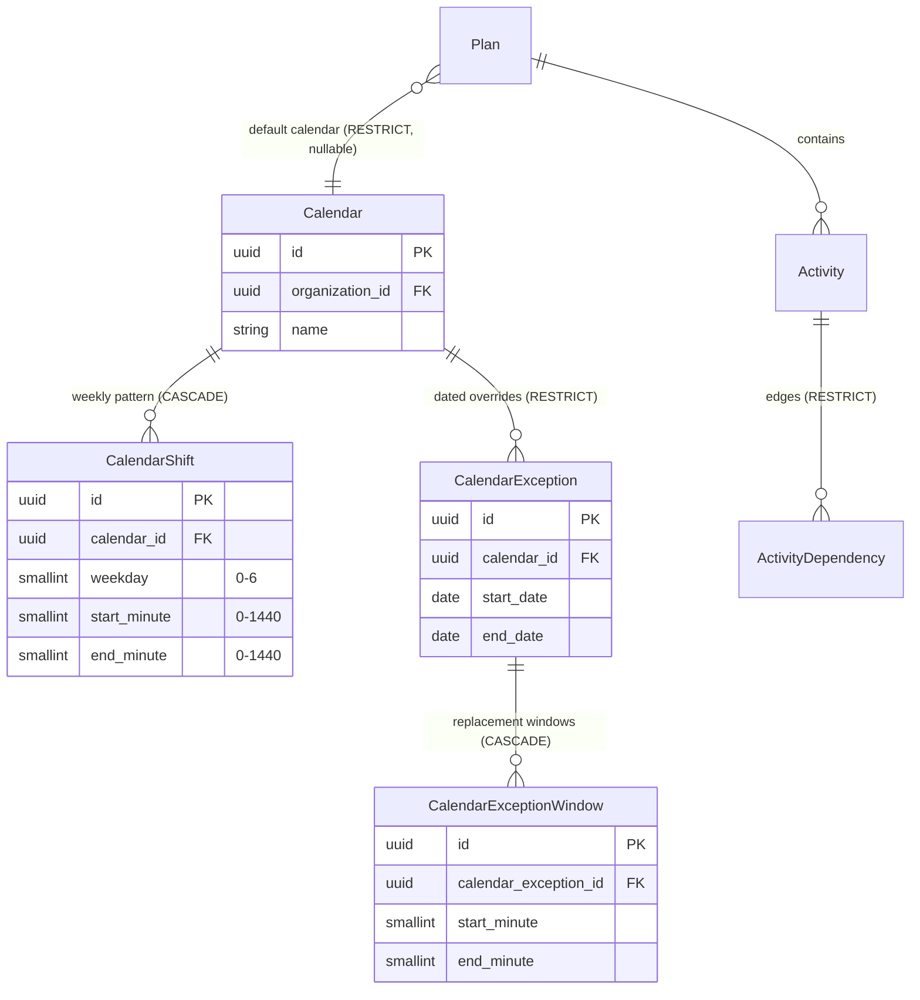
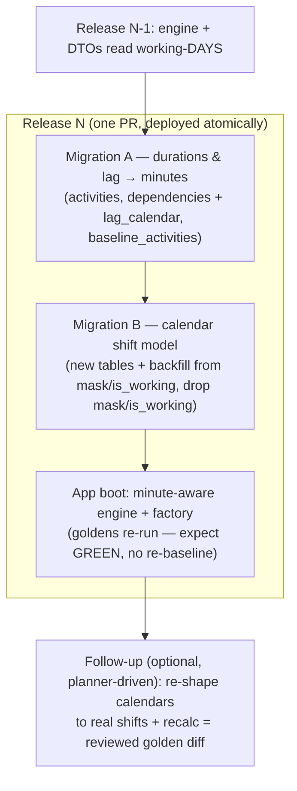

# M1 Storage & Migration Design — Hour/shift-granular calendars & durations

> **Status:** Draft for review (design → approval → build; `docs/PROCESS.md` §21).
> **Scope:** the storage half of milestone **M1** of the Engine Conformance & Validation
> Framework (ADR-0034), implementing [ADR-0036](../../adr/0036-hour-granular-calendars-and-durations.md).
> **Author:** database-architect. **Does not** modify `schema.prisma` or write migration SQL — it is
> the artifact reviewed **before** those are written.
>
> Amends the storage assumptions of [ADR-0023](../../adr/0023-cpm-scheduling-date-convention.md)
> (working-day → working-**minute** offsets) and
> [ADR-0024](../../adr/0024-working-day-calendars.md) (weekday mask → intraday shift patterns), and
> touches the [ADR-0025](../../adr/0025-baselines-snapshot-and-variance.md) baseline snapshot.

---

## 1. Summary

ADR-0036 moves the CPM engine from **continuous working-days** to **continuous working-minutes**, and
the calendar from a **7-bit weekday mask + whole-day exceptions** to **intraday shift patterns +
time-window exceptions**. That is a schema change on five columns across four tables, two new child
tables, one new enum, and a **once-only day→minute data backfill** that must not move any existing
plan's dates.

| Model                           | Today                     | After M1                                                                                                                          |
| ------------------------------- | ------------------------- | --------------------------------------------------------------------------------------------------------------------------------- |
| `Activity.durationDays`         | `Int` working days        | **`durationMinutes Int`** working-minutes (milestones `0`; elapsed durations fall out on a 24 h calendar)                         |
| `ActivityDependency.lagDays`    | `Int` signed working days | **`lagMinutes Int`** signed working-minutes **+ `lagCalendar` enum seam** (ADR-0036 §6; M1 lands the column, M3 wires resolution) |
| `Calendar.workingWeekdays`      | `SmallInt` 7-bit mask     | **`CalendarShift[]`** — per-weekday `[start,end)` minute windows (split shifts, 24 h, night, empty base week)                     |
| `CalendarException.isWorking`   | `Boolean` whole-day flag  | **date-range + `CalendarExceptionWindow[]`** — windows that _replace_ the day's pattern (`[]` = holiday)                          |
| `BaselineActivity.durationDays` | `Int` working days        | **`durationMinutes Int`** (frozen snapshot stays faithful, ADR-0025)                                                              |

The design's load-bearing decision is a **single, uniform conversion factor `M = 1440` minutes** (one
elapsed day) applied to every duration and lag, paired with a **full-day `00:00–24:00` window** for
every set weekday. Because all existing durations/lags are whole working days and all existing dates
land on day boundaries, this makes the migration a **provably date-preserving representation change**:
every existing plan — calendared _and_ null-calendar — reproduces byte-identical dates, so the M0
golden subset (`apps/api/src/modules/schedule/conformance/goldens.ts`) stays green **with no
re-baseline**. That green diff is the regression proof ADR-0036 §3/§7 demands.

---

## 2. Proposed schema

Prisma model diffs below. They are **proposals** — not applied to `schema.prisma`. Every `@map`, `@db`
type, index and CHECK follows the existing models' conventions (`docs/DATABASE.md`). CHECKs, partial
uniques and exclusion constraints are raw SQL in the migration (Prisma cannot express them); the model
comments name them as the existing models do.

### 2.1 Durations & lag → minutes

```prisma
model Activity {
  // ...
-  // Working days (= calendar days until the M5 Calendars slice); milestones are 0.
-  durationDays   Int             @default(1) @map("duration_days")
+  // Working-MINUTES of work (ADR-0036 §1,§3); milestones are 0. Int caps at ~4000 years
+  // of minutes — ample; elapsed durations fall out naturally on a 24 h calendar. The DB
+  // default (480 = one 8 h day) is a fallback only — the service sets duration explicitly
+  // (a planner entering "N days" is multiplied by the plan calendar's day-minutes there).
+  // A ck_activities_duration_minutes_nonneg (>= 0) CHECK replaces the days CHECK (raw SQL).
+  durationMinutes Int            @default(480) @map("duration_minutes")
  // ...
}
```

```prisma
// The calendar on which a relationship's lag is measured (ADR-0036 §6). Per-relationship
// override of the P6 "Calendar for scheduling relationship lag" setting. M1 lands the column
// (the seam); M3 wires resolution + the 24-hour override (the concrete-cure A4430→A4440 edge).
// PREDECESSOR/SUCCESSOR resolve against the endpoint's effective calendar (= the plan calendar
// until per-activity calendars land — they stay deferred, ADR-0024). MUST stay in lock-step with
// the TypeScript union in @repo/types.
enum LagCalendarSource {
  PREDECESSOR
  SUCCESSOR
  TWENTY_FOUR_HOUR
  PROJECT_DEFAULT
}

model ActivityDependency {
  // ...
-  // Logic (Planner-owned). `lag_days` is a SIGNED working-day lag (negative = lead),
-  // bounded to −3650…3650 by a CHECK in the migration (matches the DTO bound in B1).
-  type    DependencyType @default(FS)
-  lagDays Int            @default(0) @map("lag_days")
+  // Logic (Planner-owned). `lag_minutes` is a SIGNED working-MINUTE lag (negative = lead),
+  // bounded to −5_256_000…5_256_000 (≈ ±10 years, preserving the old ±3650-day intent) by
+  // ck_dependencies_lag_minutes_range (raw SQL). `lag_calendar` is the resolution seam; default
+  // PROJECT_DEFAULT is behaviour-preserving (today all lag resolves on the plan calendar). Read
+  // with the edge — no index (a low-cardinality enum on the plan-scoped load).
+  type        DependencyType    @default(FS)
+  lagMinutes  Int               @default(0) @map("lag_minutes")
+  lagCalendar LagCalendarSource @default(PROJECT_DEFAULT) @map("lag_calendar")
  // ...
}
```

```prisma
model BaselineActivity {
  // ...
-  code         String?
-  name         String
-  type         ActivityType @default(TASK)
-  durationDays Int          @map("duration_days")
+  code            String?
+  name            String
+  type            ActivityType @default(TASK)
+  // Frozen working-MINUTES (ADR-0036 §3) so a historic baseline stays faithful (ADR-0025):
+  // a 5-day baseline is still 5 days (7200 min) and displays identically. ×1440 backfill.
+  // ck_baseline_activities_duration_minutes_nonneg (>= 0) in the migration.
+  durationMinutes Int          @map("duration_minutes")
  // ...
}
```

### 2.2 Calendar → intraday shift patterns

`Calendar` loses `workingWeekdays`; the weekly pattern moves to a normalized child table
`CalendarShift`. A **window-only base week** (CAL-05 turnaround) is simply a calendar with **zero**
shift rows — now valid (the old `working_weekdays > 0` CHECK is dropped). Midnight-crossing (CAL-04
night shift) is stored the fixture's way: **two adjacent-day windows** (`MON [20:00–24:00]`,
`TUE [00:00–06:00, 20:00–24:00]`, …), so a window never wraps — `end_minute = 1440` is midnight.

```prisma
model Calendar {
  id             String  @id @default(uuid(7)) @db.Uuid
  organizationId String  @map("organization_id") @db.Uuid
  name           String
  description    String?

-  // The weekly working pattern as a 7-bit mask (bit 0 = Monday … bit 6 = Sunday).
-  // Stored as smallint ... `working_weekdays > 0 AND <= 127` CHECK ...
-  workingWeekdays Int @map("working_weekdays") @db.SmallInt
+  // The weekly working pattern is now the child `shifts` rows (ADR-0036 §2): per weekday a
+  // sorted list of [start,end) minute windows. NO working-time guard lives on Calendar — a
+  // window-only calendar (all weekdays empty; work comes only from positive exceptions) is
+  // VALID. "Has working time within the horizon" is a cross-row + temporal property the DB
+  // cannot express as a CHECK; it is enforced at the factory boundary (throws) and by the
+  // N11/N16 iteration cap + horizon (ADR-0036 §5) — the DAG-invariant precedent.

  version       Int       @default(1)
  // ... (unchanged housekeeping) ...

  organization Organization       @relation(fields: [organizationId], references: [id], onDelete: Restrict)
+  shifts       CalendarShift[]
  exceptions   CalendarException[]
  plans        Plan[]

  @@index([organizationId, createdAt, id])
  @@map("calendars")
}
```

```prisma
// One [start_minute, end_minute) working window on one weekday of a calendar's weekly pattern
// (ADR-0036 §2). An OWNED VALUE ROW — deliberately NOT a full domain record (the PlanLock
// precedent): no soft-delete, no `version`, no `delete_batch_id`, no created_by/updated_by, no
// denormalised organization_id. It is always reached VIA its (org-scoped) calendar and is never
// queried, scoped or sorted on its own, so those columns would be width for no read. The weekly
// pattern is edited as a SET — the service replaces a calendar's shift rows inside the calendar's
// write transaction, and the calendar's own `version` bump provides the optimistic lock. The FK is
// ON DELETE CASCADE (true composition — a window has no existence apart from its calendar; the same
// Session/PlanLock reasoning). Calendars soft-delete in normal use, so CASCADE only fires on a rare
// hard purge; a soft-deleted calendar's shift rows simply stop being loaded (the engine joins
// through the active calendar).
model CalendarShift {
  id           String @id @default(uuid(7)) @db.Uuid
  calendarId   String @map("calendar_id") @db.Uuid
  // Monday = 0 … Sunday = 6 (bit convention of the old mask). ck_calendar_shifts_weekday_range (0–6).
  weekday      Int    @map("weekday") @db.SmallInt
  // Minutes from local midnight, [0, 1440]. 1440 = 24:00 (midnight-crossing is two adjacent-day
  // windows). ck_calendar_shifts_minute_bounds (0 ≤ start,end ≤ 1440) + ck_calendar_shifts_window_order
  // (start_minute < end_minute), raw SQL. Non-overlap within (calendar, weekday) is a GiST EXCLUDE
  // constraint (see §3).
  startMinute  Int    @map("start_minute") @db.SmallInt
  endMinute    Int    @map("end_minute") @db.SmallInt

  createdAt DateTime @default(now()) @map("created_at") @db.Timestamptz(3)
  updatedAt DateTime @updatedAt @map("updated_at") @db.Timestamptz(3)

  calendar Calendar @relation(fields: [calendarId], references: [id], onDelete: Cascade)

  // The engine load IS this index: SELECT weekday, start_minute, end_minute FROM calendar_shifts
  // WHERE calendar_id = ? ORDER BY weekday, start_minute — covered by (calendar_id, weekday,
  // start_minute), which also backs the FK (leftmost prefix). No org_id / no partial index — this
  // table has no other access path.
  @@index([calendarId, weekday, startMinute])
  @@map("calendar_shifts")
}
```

```prisma
// A dated override whose windows REPLACE that date('s range')'s weekly pattern (ADR-0036 §2). A
// range with ZERO child windows is a holiday / non-work block (Christmas shutdown, the CAL-06 winter
// embargo); a range WITH windows is worked overtime or a window-only working period (the CAL-05
// turnaround). Replaces the old whole-day `is_working` flag. `date` becomes a [start_date, end_date]
// INCLUSIVE range (single day ⇒ start = end) so a multi-month block is one row, not ~120.
model CalendarException {
  id             String @id @default(uuid(7)) @db.Uuid
  organizationId String @map("organization_id") @db.Uuid
  calendarId     String @map("calendar_id") @db.Uuid

-  date      DateTime @db.Date
-  isWorking Boolean  @map("is_working")
-  label     String?
+  // Inclusive date range (both @db.Date). ck_calendar_exceptions_date_order (end_date >= start_date).
+  startDate DateTime @map("start_date") @db.Date
+  endDate   DateTime @map("end_date") @db.Date
+  label     String?

  version       Int       @default(1)
  // ... (unchanged housekeeping: audit, soft delete, delete_batch_id — a full domain record) ...

  organization Organization              @relation(fields: [organizationId], references: [id], onDelete: Restrict)
  calendar     Calendar                  @relation(fields: [calendarId], references: [id], onDelete: Restrict)
+  windows      CalendarExceptionWindow[]

-  @@index([calendarId, date])
+  // The editor's list-all + the engine's active load both order by start_date; (calendar_id,
+  // start_date) backs the FK and both. Active-range non-overlap is a GiST EXCLUDE (see §3) — it
+  // REPLACES the old uq_calendar_exceptions_cal_date partial unique (a range can't be a point key).
+  @@index([calendarId, startDate])
  @@index([organizationId])
  @@map("calendar_exceptions")
}
```

```prisma
// One [start_minute, end_minute) working window inside a CalendarException's replacement set
// (ADR-0036 §2). Same OWNED-VALUE-ROW treatment as CalendarShift (see that comment): no soft-delete /
// version / delete_batch_id / org_id, edited as a set under the exception's write transaction, FK
// CASCADE. A holiday exception simply has zero of these rows.
model CalendarExceptionWindow {
  id                  String @id @default(uuid(7)) @db.Uuid
  calendarExceptionId String @map("calendar_exception_id") @db.Uuid
  // Minutes from local midnight, [0, 1440]; same bounds/order CHECKs + GiST EXCLUDE as CalendarShift.
  startMinute Int @map("start_minute") @db.SmallInt
  endMinute   Int @map("end_minute") @db.SmallInt

  createdAt DateTime @default(now()) @map("created_at") @db.Timestamptz(3)
  updatedAt DateTime @updatedAt @map("updated_at") @db.Timestamptz(3)

  exception CalendarException @relation(fields: [calendarExceptionId], references: [id], onDelete: Cascade)

  // Engine load IS this index: WHERE calendar_exception_id = ? ORDER BY start_minute.
  @@index([calendarExceptionId, startMinute])
  @@map("calendar_exception_windows")
}
```

### 2.3 New model relationships (ER)



---

## 3. Indexes & constraints

### 3.1 Indexes — the "index IS the query" discipline

The engine port loads a calendar as **three batched reads** (never a query-per-window — the N+1 the
existing `CalendarException` comment guards against): the calendar row, all its shift rows, and all
its active exceptions joined to their windows.

| Index (raw / `@@index`)                                             | On                                      | Kind           | Serves                                                                                                     |
| ------------------------------------------------------------------- | --------------------------------------- | -------------- | ---------------------------------------------------------------------------------------------------------- |
| `calendar_shifts_calendar_id_weekday_start_minute_idx`              | `(calendar_id, weekday, start_minute)`  | full composite | FK (leftmost prefix) **and** the engine's ordered weekly-pattern load; this table has no other access path |
| `calendar_exception_windows_calendar_exception_id_start_minute_idx` | `(calendar_exception_id, start_minute)` | full composite | FK **and** the ordered replacement-window load                                                             |
| `calendar_exceptions_calendar_id_start_date_idx`                    | `(calendar_id, start_date)`             | full composite | FK + the editor's list-all + the engine's active load ordered by `start_date` (was `(calendar_id, date)`)  |
| `calendar_exceptions_organization_id_idx`                           | `(organization_id)`                     | full           | unchanged — FK + org-scoped IDOR loads                                                                     |

No new index on `activities`/`dependencies`/`baseline_activities` — the columns changing unit are read
with their already-indexed rows and never filtered/sorted on. `lag_calendar` is a low-cardinality enum
read with the plan-scoped edge load; indexing it would cost writes for no read (the `is_driving`
precedent). The shift/window tables carry **no partial `deleted_at` index and no `delete_batch_id`
index** — they have no soft-delete (§2.2).

### 3.2 Constraints

**Added (raw SQL):**

- `ck_activities_duration_minutes_nonneg` — `duration_minutes >= 0`.
- `ck_baseline_activities_duration_minutes_nonneg` — `duration_minutes >= 0`.
- `ck_dependencies_lag_minutes_range` — `lag_minutes BETWEEN -5256000 AND 5256000` (≈ ±10 y; §5 Q3).
- `ck_calendar_shifts_weekday_range` — `weekday BETWEEN 0 AND 6`.
- `ck_calendar_shifts_minute_bounds` — `start_minute >= 0 AND end_minute <= 1440`.
- `ck_calendar_shifts_window_order` — `start_minute < end_minute` (rejects empty/inverted windows; a
  non-working day is the _absence_ of a row, never a zero-length one).
- `ck_calendar_exception_windows_minute_bounds` / `ck_calendar_exception_windows_window_order` — as above.
- `ck_calendar_exceptions_date_order` — `end_date >= start_date`.
- **`ex_calendar_shifts_no_overlap`** — `EXCLUDE USING gist (calendar_id WITH =, weekday WITH =,
int4range(start_minute, end_minute) WITH &&)`. DB-enforced non-overlap of windows within a weekday
  (the "DB is the last line of defence" ideal, `docs/DATABASE.md` §Philosophy).
- **`ex_calendar_exception_windows_no_overlap`** — same shape keyed on `calendar_exception_id`.
- **`ex_calendar_exceptions_no_overlap`** — `EXCLUDE USING gist (calendar_id WITH =,
daterange(start_date, end_date, '[]') WITH &&) WHERE (deleted_at IS NULL)`. **Replaces** the old
  `uq_calendar_exceptions_cal_date` partial unique: it guarantees at most one _active_ exception
  covers any given day (a day cannot be both a holiday and a worked window), now over ranges. Backs the
  add `DUPLICATE_EXCEPTION` (409).

The three `EXCLUDE` constraints require `CREATE EXTENSION IF NOT EXISTS btree_gist` (a stock,
widely-used PostgreSQL contrib module). **Alternative, if adding the extension is unwanted:** enforce
non-overlap in the service layer + the pure factory (the DAG-invariant precedent) and keep only the
per-row bound/order CHECKs. Recommendation: take the `EXCLUDE` constraints — non-overlap is a
per-`(calendar[,weekday])` local invariant the DB _can_ express cheaply, unlike the graph-wide DAG.

**Dropped:**

- `ck_calendars_working_weekdays_range` (mask gone — a window-only calendar is valid).
- `ck_activities_duration_days_nonneg`, `ck_dependencies_lag_days_range` (columns renamed).
- `uq_calendar_exceptions_cal_date` (superseded by the range exclusion constraint).

**Not a DB constraint (documented):** the "has working time within the horizon" guard is cross-row +
temporal (weekly windows minus holiday ranges over an N-year horizon) and cannot be a `CHECK`. It lives
at the factory boundary (throws on a calendar with no reachable working minute) and the N11/N16
iteration cap + horizon (ADR-0036 §5), exactly as the DAG invariant is service-enforced.

---

## 4. Migration plan

### 4.1 Sequencing — one release, two focused migrations

Days literally **cannot represent** the target values (an elapsed 168 h, a 4 h task, a night shift), so
a prolonged **dual-unit** expand/contract window is _incoherent_ — there is nothing to dual-write. The
unit switch must therefore be **atomic within one release**, shipped together with the minute-aware
engine, behind the unchanged recalculate endpoint (ADR-0036 §7: "no user-visible API change"). This is
the same **forward-only, isolated-migration** posture as ADR-0033's `planned_start` `NOT NULL` change.
The self-migrating image (ADR-0018) runs `prisma migrate deploy` before the new app serves traffic, so
per-deploy the migrate-then-boot is atomic.

For reviewability we still split into **two single-purpose migrations in the same PR**, applied in
order:



### 4.2 The conversion arithmetic — one uniform factor `M = 1440`

**Every** duration and lag is converted `× 1440` (one elapsed day = 1440 minutes), and **every** set
weekday becomes a single full-day window `[0, 1440)`. The correctness rule:

> **The factor used for the duration/lag conversion MUST equal the per-day window length.** They are
> both `1440`, so a task of `D` whole working days still occupies exactly `D` working days
> (`D × 1440` working-minutes ÷ `1440` min/day). No fractional day is ever produced.

Because all existing durations/lags are **whole working days** and every existing date (`planned_start`,
`constraint_date`, `actual_*`, the CPM `*_start/finish`) lands on a **day boundary**, the intra-day
window position is irrelevant to the _date_: an activity starts at its start-day's window start and its
inclusive finish falls on the same last working day as before. **Dates are invariant** — for calendared
plans _and_ null-calendar plans:

| Plan kind                                     | Today                                  | After M1                                            | Date result |
| --------------------------------------------- | -------------------------------------- | --------------------------------------------------- | ----------- |
| `calendar_id = NULL` (all-days-work)          | every day works, offset = calendar day | all-days **24 h** (1440 min/day); `duration × 1440` | identical   |
| mask calendar (Mon–Fri, holidays, worked Sat) | set weekday works                      | set weekday → `[0,1440)`; `duration × 1440`         | identical   |

The null-calendar path **forces** `M = 1440`: all-days-work means every day is _fully_ working, so its
minute equivalent is 24 h/day; any smaller `M` would make a null-calendar plan finish early. Using the
**same** `1440` for calendared plans keeps the backfill a single un-joined arithmetic and keeps the two
paths from diverging.

### 4.3 Migration A — durations & lag → minutes (illustrative SQL, not applied)

Uses the lock-friendly `ADD COLUMN` → batched backfill → `SET NOT NULL` → `ADD CONSTRAINT … NOT VALID`
→ `VALIDATE CONSTRAINT` pattern (validate takes only `SHARE UPDATE EXCLUSIVE`, not blocking
reads/writes). At the current foundation-stage row counts this is near-instant; the pattern is written
for the decade.

```sql
-- activities: duration_days → duration_minutes
ALTER TABLE activities ADD COLUMN duration_minutes integer;                 -- fast, nullable
UPDATE activities SET duration_minutes = duration_days * 1440;              -- batch by id range if large
ALTER TABLE activities ALTER COLUMN duration_minutes SET DEFAULT 480,
                       ALTER COLUMN duration_minutes SET NOT NULL;
ALTER TABLE activities ADD CONSTRAINT ck_activities_duration_minutes_nonneg
  CHECK (duration_minutes >= 0) NOT VALID;
ALTER TABLE activities VALIDATE CONSTRAINT ck_activities_duration_minutes_nonneg;
ALTER TABLE activities DROP CONSTRAINT ck_activities_duration_days_nonneg;
ALTER TABLE activities DROP COLUMN duration_days;

-- dependencies: lag_days → lag_minutes + lag_calendar seam
CREATE TYPE "LagCalendarSource" AS ENUM ('PREDECESSOR','SUCCESSOR','TWENTY_FOUR_HOUR','PROJECT_DEFAULT');
ALTER TABLE dependencies ADD COLUMN lag_minutes integer NOT NULL DEFAULT 0;  -- constant default = metadata-only
ALTER TABLE dependencies ADD COLUMN lag_calendar "LagCalendarSource" NOT NULL DEFAULT 'PROJECT_DEFAULT';
UPDATE dependencies SET lag_minutes = lag_days * 1440;
ALTER TABLE dependencies ADD CONSTRAINT ck_dependencies_lag_minutes_range
  CHECK (lag_minutes BETWEEN -5256000 AND 5256000) NOT VALID;
ALTER TABLE dependencies VALIDATE CONSTRAINT ck_dependencies_lag_minutes_range;
ALTER TABLE dependencies DROP CONSTRAINT ck_dependencies_lag_days_range;
ALTER TABLE dependencies DROP COLUMN lag_days;

-- baseline_activities: duration_days → duration_minutes (frozen snapshots stay faithful)
ALTER TABLE baseline_activities ADD COLUMN duration_minutes integer;
UPDATE baseline_activities SET duration_minutes = duration_days * 1440;
ALTER TABLE baseline_activities ALTER COLUMN duration_minutes SET NOT NULL;
ALTER TABLE baseline_activities ADD CONSTRAINT ck_baseline_activities_duration_minutes_nonneg
  CHECK (duration_minutes >= 0) NOT VALID;
ALTER TABLE baseline_activities VALIDATE CONSTRAINT ck_baseline_activities_duration_minutes_nonneg;
ALTER TABLE baseline_activities DROP COLUMN duration_days;
```

### 4.4 Migration B — calendar shift model (illustrative SQL, not applied)

Order: **create children → backfill from the mask/flag → migrate exceptions to ranges → drop the mask
and flag** (the backfill reads `working_weekdays`/`is_working` before they are dropped).

```sql
CREATE EXTENSION IF NOT EXISTS btree_gist;

CREATE TABLE calendar_shifts (
  id           uuid PRIMARY KEY,
  calendar_id  uuid NOT NULL REFERENCES calendars(id) ON DELETE CASCADE,
  weekday      smallint NOT NULL,
  start_minute smallint NOT NULL,
  end_minute   smallint NOT NULL,
  created_at   timestamptz(3) NOT NULL DEFAULT now(),
  updated_at   timestamptz(3) NOT NULL,
  CONSTRAINT ck_calendar_shifts_weekday_range CHECK (weekday BETWEEN 0 AND 6),
  CONSTRAINT ck_calendar_shifts_minute_bounds CHECK (start_minute >= 0 AND end_minute <= 1440),
  CONSTRAINT ck_calendar_shifts_window_order  CHECK (start_minute < end_minute),
  CONSTRAINT ex_calendar_shifts_no_overlap EXCLUDE USING gist
    (calendar_id WITH =, weekday WITH =, int4range(start_minute, end_minute) WITH &&)
);
CREATE INDEX calendar_shifts_calendar_id_weekday_start_minute_idx
  ON calendar_shifts (calendar_id, weekday, start_minute);

CREATE TABLE calendar_exception_windows ( /* id, calendar_exception_id … + bounds/order CHECKs + EXCLUDE */ );
CREATE INDEX calendar_exception_windows_calendar_exception_id_start_minute_idx
  ON calendar_exception_windows (calendar_exception_id, start_minute);

-- Backfill the weekly pattern: each SET bit of the mask → a full-day [0,1440) window.
-- (gen_random_uuid() v4 is acceptable for these low-volume owned rows; app-created rows use uuid v7.)
INSERT INTO calendar_shifts (id, calendar_id, weekday, start_minute, end_minute, created_at, updated_at)
SELECT gen_random_uuid(), c.id, w.weekday, 0, 1440, now(), now()
FROM calendars c
CROSS JOIN generate_series(0, 6) AS w(weekday)
WHERE ((c.working_weekdays >> w.weekday) & 1) = 1;

-- Migrate exceptions to inclusive ranges (all existing rows are single-day).
ALTER TABLE calendar_exceptions RENAME COLUMN date TO start_date;
ALTER TABLE calendar_exceptions ADD COLUMN end_date date;
UPDATE calendar_exceptions SET end_date = start_date;
ALTER TABLE calendar_exceptions ALTER COLUMN end_date SET NOT NULL;
ALTER TABLE calendar_exceptions ADD CONSTRAINT ck_calendar_exceptions_date_order CHECK (end_date >= start_date);

-- Worked exceptions (is_working = true) → one full-day [0,1440) window; holidays → no window rows.
INSERT INTO calendar_exception_windows (id, calendar_exception_id, start_minute, end_minute, created_at, updated_at)
SELECT gen_random_uuid(), e.id, 0, 1440, now(), now()
FROM calendar_exceptions e
WHERE e.is_working = true;
ALTER TABLE calendar_exceptions DROP COLUMN is_working;

-- Swap uniqueness: drop the point-key partial unique, add the range exclusion.
DROP INDEX uq_calendar_exceptions_cal_date;   -- (raw-SQL partial unique)
ALTER TABLE calendar_exceptions ADD CONSTRAINT ex_calendar_exceptions_no_overlap
  EXCLUDE USING gist (calendar_id WITH =, daterange(start_date, end_date, '[]') WITH &&)
  WHERE (deleted_at IS NULL);

-- Retire the mask.
ALTER TABLE calendars DROP CONSTRAINT ck_calendars_working_weekdays_range;
ALTER TABLE calendars DROP COLUMN working_weekdays;
```

The engine's seeded **Standard (Mon–Fri)** calendar (ADR-0024) is covered by the generic mask backfill
(`0b0011111` → five `[0,1440)` shift rows); the seed code and any org-provisioning fixture move to
emitting shift rows in the same PR.

### 4.5 Locking, batching, ordering

- **Backfills are `UPDATE`/`INSERT … SELECT`** over `activities`, `dependencies`,
  `baseline_activities` and `calendars`. At target scale (≤ ~100 plans/org, thousands of activities)
  these run in one statement inside the migration transaction. If a deployment carries large tables,
  batch the `UPDATE`s by `id` range (UUID v7 is time-ordered, so range scans are cheap) with a bounded
  `statement_timeout`, committing per batch **before** the `SET NOT NULL`/`VALIDATE`.
- **`ADD COLUMN … NOT NULL DEFAULT <constant>`** (e.g. `lag_minutes`, `lag_calendar`) is metadata-only
  in PostgreSQL ≥ 11 — no rewrite. Nullable-then-backfill-then-`SET NOT NULL` is used only where the
  value comes from another column.
- **`ADD CONSTRAINT … NOT VALID` then `VALIDATE CONSTRAINT`** keeps constraint creation off the
  blocking `ACCESS EXCLUSIVE` path.
- **Ordering:** Migration A is independent of B; within B the mask/flag columns are dropped **last**,
  after every row that reads them has been backfilled.

### 4.6 Reversibility / rollback posture

**Forward-only and irreversible in practice**, matching ADR-0033's `planned_start`. The conversion is
arithmetically loss-preserving _at migration time_ (`× 1440` inverts by `÷ 1440`; the full-day window
inverts to the mask), so an **immediate** rollback before any minute-granular write could reconstruct
the day columns. But once traffic is served, new writes (a 4 h task, a real shift window, a 168 h
elapsed lag) have **no day representation**, so the drop of `duration_days`/`lag_days`/
`working_weekdays`/`is_working` is the point of no return. "Rollback" is therefore a **new compensating
migration + redeploying the prior image** (`docs/DATABASE.md` §Migrations) — and is only safe before
minute-granular data exists. This is documented as an accepted, reviewed one-way door.

### 4.7 Proving no regression

1. **M0 golden subset** (`goldens.ts` / `goldens.spec.ts`) — whole-day, single-calendar networks;
   dates are invariant under `× 1440` (the file's own header says so). **Expect green with NO
   re-baseline.** A red diff is a bug in the conversion, not an accepted drift.
2. **Engine unit tests** — `calendar.spec.ts`, `working-day-calendar.spec.ts`, `compute.spec.ts`,
   `constraints.spec.ts` (the inverse-invariant + differential-vs-naive tests carry over at minute
   granularity, ADR-0036 §4). Green.
3. **Migration round-trip test** — seed a representative pre-migration plan (Mon–Fri + holidays + a
   worked Saturday + a null-calendar plan), recalc and snapshot dates; run both migrations; recalc
   again; assert **identical** dates.
4. **`prisma validate`** + **`prisma migrate diff`** — schema/migration lock-step (a CI gate).
5. **Perf budget re-verified** (ADR-0036 §7): recalc < 500 ms @ 500 activities, < 2 s @ 2,000, with
   the three-read calendar load (no query-per-window).

> **Lock-step note (out of pure-storage scope, flagged):** the engine structs
> (`engine/types.ts` `EngineActivity.durationDays`→`durationMinutes`, `EngineEdge.lagDays`→
> `lagMinutes` + `lagCalendar`), the calendar factory (`engine/calendar.ts`), the repository
> projection (`schedule.repository.ts` `PlanCalendar`), `@repo/types`, and the write DTOs move in the
> **same PR**. Whether the public API keeps exposing days (derived) or adds minutes is an
> `api-reviewer` decision (ADR-0036 §7 wants no user-visible change) — noted, not decided here.

---

## 5. Open questions / decisions for the product owner

Kept tight — only choices that could move dates or are one-way doors.

**Q1 — The mask→shift window (and thus `M`): full-day `00:00–24:00` vs a construction `08:00–17:00`.**
_Recommendation: `00:00–24:00`, `M = 1440`._ It is the **only** choice that is provably
date-preserving for **both** calendared and null-calendar plans under a **single** factor (§4.2): the
null-calendar/all-days-work path is 24 h by definition, so matching calendared plans to it keeps one
un-joined backfill and zero divergence. It is also faithful to the old semantics (a "working day" was a
whole calendar day; `168 h = 7 elapsed days` only holds at 1440 min/day). _Trade-off:_ migrated
calendars read as 24 h "days" until a planner re-shapes them. An `08:00–17:00` alternative bakes in a
construction-day assumption; it is _also_ date-safe for today's whole-day data, but it forces a
**per-plan** factor (null-calendar plans still need 1440) and asserts hours the old model never had.

**Q2 — Do we _mechanically_ re-shape migrated calendars to realistic shifts, or defer to planners?**
_Recommendation: defer._ Leave migrated calendars as full-day `[0,1440)` and let a planner opt into
real shift windows by **editing the calendar and recalculating** — an explicit, `main`-releasable
action whose date movement is a **reviewed golden diff** (ADR-0024's "calendars never change dates
silently"; ADR-0036 §7). Baking `08:00–17:00` into the migration instead would move dates on the
fixture-class plans and require re-baselining goldens in the migration PR itself. _Trade-off:_ deferring
means the fixture's realistic shifts are entered post-migration (which is the intended workflow — a
calendar, not a migration, models a shift).

**Q3 — `lag_minutes` CHECK bound: must the N16 100,000 h (= 6,000,000 min) lag be _storable_?**
_Recommendation: no — bound at ±5,256,000 (≈ ±10 y, preserving the old ±3650-day intent)._ N16 is a
hostile input the engine must **reject/report** (ADR-0036 §5 horizon); rejecting it at the DTO/DB
boundary too is within the "reject, repair or report" contract. _Trade-off:_ if the PO wants six-figure
elapsed-hour lags to _persist_ (and be caught only by the engine horizon), widen the bound to e.g.
±26,280,000 (≈ ±50 y). Legit fixture lags (+400 h = 24,000 min) sit far inside either bound.

_(Not open questions — stated postures: the migration is forward-only/irreversible (§4.6); the
`btree_gist` `EXCLUDE` constraints are recommended with a service-enforced fallback (§3.2); the new
`durationMinutes` DB default of 480 is a fallback the service overrides (§2.1).)_

---

## 6. Risks & mitigations

| Risk                                                                             | Likelihood | Impact   | Mitigation                                                                                                                                                                |
| -------------------------------------------------------------------------------- | ---------- | -------- | ------------------------------------------------------------------------------------------------------------------------------------------------------------------------- |
| Backfill uses an inconsistent factor (window ≠ duration `M`) → silent date drift | Low        | **High** | The single-factor `× 1440` rule (§4.2) is enforced by both migrations using the literal `1440`; the M0 goldens + round-trip test (§4.7) catch any mismatch as a red diff. |
| Dropping `duration_days`/mask before the minute engine ships → broken reads      | Low        | High     | Both migrations + the minute-aware engine ship in **one PR/release** (§4.1); ADR-0018 migrate-then-boot is atomic per deploy.                                             |
| Irreversibility surprises a future operator                                      | Medium     | Medium   | §4.6 documents the one-way door explicitly (ADR-0033 precedent); rollback = compensating migration + prior image, safe only pre-minute-data.                              |
| `btree_gist` unavailable / undesired in the target Postgres                      | Low        | Medium   | Extension is stock contrib; if refused, fall back to service+factory-enforced non-overlap and per-row CHECKs (§3.2) — no schema redesign.                                 |
| Owned value rows (shifts/windows) leak under a soft-deleted parent               | Low        | Low      | The engine load **joins through the active parent** (`deleted_at IS NULL`), so orphan-under-soft-delete rows are never read; a hard purge CASCADEs them away.             |
| Range exceptions overlap or invert after edits                                   | Low        | Medium   | `ex_calendar_exceptions_no_overlap` (GiST) + `ck_calendar_exceptions_date_order` enforce it in the DB; the editor edits windows as a set in one transaction.              |
| Night-shift midnight crossing mis-stored as a wrap-around window                 | Low        | Medium   | Storage forbids wrap (`start < end`, `end ≤ 1440`); crossing is two adjacent-day windows (the fixture's own CAL-04 shape) — asserted by an import/factory test.           |
| Perf regression from the three-read calendar load                                | Low        | Medium   | Batched loads (no query-per-window) + the covering `(calendar_id, weekday, start_minute)` / `(calendar_exception_id, start_minute)` indexes; §4.7 re-verifies the budget. |

---

## Appendix — fixture calendars this model must store (`TEST_MATRIX.md` §4)

| Fixture calendar                                | Stored as                                                                                                                    |
| ----------------------------------------------- | ---------------------------------------------------------------------------------------------------------------------------- |
| CAL-01 5-day split shift `08–12,13–17`          | 5 weekdays × 2 shift rows `[480,720),[780,1020)`; holidays + Christmas shutdown as zero-window exception **ranges**          |
| CAL-02 6-day `07–12,12:30–17:30` Mon–Sat        | 6 weekdays × 2 shift rows                                                                                                    |
| CAL-03 7-day 24 h continuous                    | 7 weekdays × 1 shift row `[0,1440)` — elapsed durations fall out                                                             |
| CAL-04 night shift `20:00→06:00` Mon–Fri        | midnight crossing as adjacent-day windows: MON `[1200,1440)`; TUE–FRI `[0,360),[1200,1440)`; SAT `[0,360)`                   |
| CAL-05 turnaround (empty base week)             | **zero** shift rows + one worked exception range `05–16 Oct` with windows `[360,720),[750,1110)`                             |
| CAL-06 8 h + 4-month embargo                    | 5 weekdays × 1 shift `[480,960)` + a zero-window exception range `01-Nov→28-Feb` (drives the N16-class horizon walk)         |
| RCAL-CRANE600 / RCAL-SPECIALIST (resource cals) | same shapes (hire-window-only range; Mon–Thu 4-day week) — reused when resource-dependent scheduling lands (out of M1 scope) |
