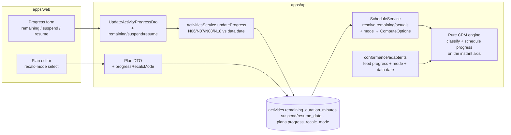
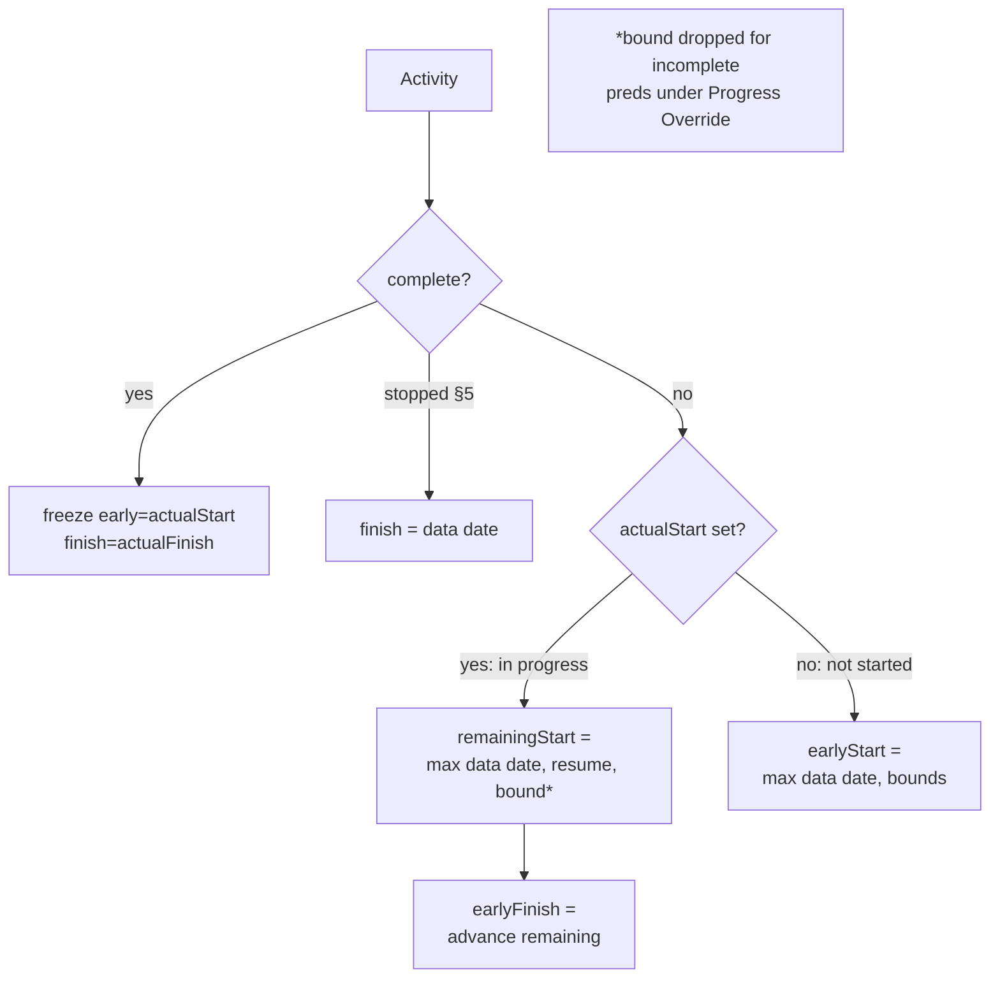

# Feature Spec: M2 — Progress ingestion, data-date floor & retained logic

- **Status:** Draft (awaiting approval)
- **Author(s):** feature-analyst (with James Ewbank)
- **Date:** 2026-07-16
- **Tracking issue / epic:** Engine Conformance & Validation Framework (ADR-0034), Milestone M2
- **Roadmap link:** `docs/specs/engine-conformance-framework/implementation-plan.md` → Milestone M2
- **Related ADR(s):** **ADR-0035 §1–§6** — the governing golden contract for progress & the data date;
  **M2 _Accepts_ those six clauses** (no new ADR is required — ADR-0035 already decides the semantics,
  and it says each decision "Accepts with its owning milestone"). Also: ADR-0022 (recalculate contract
  — engine-owned batched write, invisible to optimistic locking), ADR-0023 (inclusive-date / data-date
  convention), ADR-0037 (the absolute-instant engine axis M2 builds on), ADR-0036 (minute durations),
  ADR-0033 (data date vs Go-to-date; effective-Visual pass), ADR-0012 (RBAC + org scope), ADR-0028
  (pen edit-lock). Boundary progress rules touch the progress-report path (ActivitiesService B2).

---

## 1. Business understanding

### Problem

SchedulePoint's CPM engine schedules a **clean, unprogressed network from the data date every time** —
`computeSchedule` seeds every activity's earliest start at `dataDateAbs` and walks the logic, and it
**never reads an activity's progress** (`actualStart`, `actualFinish`, `percentComplete`, `status`).
The moment a plan has real progress this is wrong in the way planners notice first:

- A **completed** activity is re-scheduled into the future as if it had not happened; its **recorded
  actual dates are ignored** and its successors float off the real, in-the-ground sequence.
- An **in-progress** activity's **remaining** work is not floored at the data date — it can be drawn
  starting in the past, which no scheduling tool permits (the data date is "today's line": nothing
  incomplete can be earlier than it).
- **Out-of-sequence** progress (a successor started before its predecessor finished — routine on site)
  has no defined treatment: P6 offers **Retained Logic** (remaining work still waits for incomplete
  predecessors — the construction-industry default) and **Progress Override** (remaining runs from the
  data date, ignoring the broken logic), and SchedulePoint has **neither**.
- **Suspend/resume** (a stood-down activity) and the **stopped-activity** edge case (100 % duration
  but no actual finish) cannot be scheduled at all.

A schedule you cannot **update** is a drawing, not a plan. Progress ingestion is the difference between
a one-shot baseline and a living CPM tool — and it is the single largest ❌ block on the conformance
matrix (the whole `prog_*` group, the three primary scenarios S02/S03/S04, and five negative cases).

Why now: the two prerequisites are **landed**. M1 (ADR-0036) gave the engine minute-granular durations
and the injectable calendar port; **M5 (ADR-0037) moved the engine to an absolute-working-instant
axis**, so an actual start/finish instant and a remaining-work floor are now **first-class positions
the forward/backward pass can already compare** — M2 needs **no axis rework**, only to feed progress
into the passes it already runs. ADR-0035 §1–§6 has already **decided** the ambiguous behaviours; M2
implements and Accepts them.

### Users

- **Contributor** (`CONTRIBUTOR`) — reports progress (`activity:update_progress`): actual start/finish,
  percent complete, remaining duration, suspend/resume — and needs the schedule to honour it.
- **Planner** (`PLANNER`) — owns the plan; needs the data date to advance, chooses the plan's
  **recalc mode** (Retained Logic default / Progress Override / Actual Dates), and reads the updated
  critical path against reality.
- **Viewer / External Guest** — read-only; see progressed dates and the retained/override effect,
  never edit.
- **The conformance framework** (ADR-0034) — the differential/golden harness that must run S02/S03/S04
  as genuine differentials and flip the owning matrix + negative-case rows.

### Primary use cases

1. **Report progress** on an activity (actuals / % / remaining / suspend-resume) and have the next
   recalculation honour it.
2. **Recalculate a progressed plan** so completed work is frozen on its actual dates, in-progress
   remaining work is floored at the data date, and unstarted work flows from there.
3. **Choose the recalc mode** for out-of-sequence progress: **Retained Logic** (default) vs **Progress
   Override** vs **Actual Dates**, and see the successor dates change accordingly.
4. **Suspend and resume** an activity; remaining work reschedules from `max(data date, resume date)`.
5. (Conformance) run S02 (progressed, retained), S03 (override) and S04 (actual dates) as differentials
   whose dates **differ** from each other and from the S01 baseline; assert the five negative cases.

### User journeys

**Happy path (Contributor reports progress, Planner recalculates — Retained Logic):** a Contributor
opens an in-progress activity → sets **actual start = 5 May**, **60 %** → save. The Planner advances
the **data date** to today, keeps the plan on **Retained Logic**, and recalculates → the activity's
**actual start is frozen at 5 May**, its **remaining 40 %** is scheduled from the **data date** (not
the past), still waiting on any incomplete predecessor, and its successors re-date from the real
remaining finish. See §4 user-flow.

**Alternate (Progress Override):** the same plan, but the Planner switches the recalc mode to
**Progress Override** and recalculates → an out-of-sequence activity's remaining work now runs **from
the data date ignoring its incomplete predecessor**, so its successors land **earlier** than under
Retained Logic (the S03-vs-S02 discriminator).

**Alternate (completed + stopped):** a **completed** activity keeps its **actual start/finish**
unchanged across recalcs; a **stopped** activity (100 % duration, no actual finish) has its remaining
early finish set to the **data date** and propagates that to successors (never null).

**Edge (invalid progress at the boundary):** a Contributor enters an **actual finish before the actual
start** → rejected (N06, already); an **actual date in the future beyond the data date** → rejected
(N07, new); marks an activity **complete with no actual finish** → repaired to finish = data date with
a warning (N08); leaves **remaining > 0 on a complete** activity → repaired to remaining = 0 with a
warning (N18).

### Expected outcomes

- Planners can **update** a plan: the engine consumes progress, so recalculated dates reflect what has
  actually happened, not a re-run of the original plan.
- Completed work is **frozen on its actuals**; in-progress **remaining** work respects the **data-date
  floor**; out-of-sequence progress is handled by a **chosen, documented mode**.
- The conformance matrix's **Progress ingestion** row moves ❌ → ✅; **S02/S03/S04** become runnable
  differentials that differ from each other and from S01; **N06/N07/N08/N13/N18** flip to ✅ /
  repair-with-warning.
- **ADR-0035 §1–§6 move to Accepted** (recorded in the ADR + `CLAUDE.md`); the all-unprogressed default
  path stays **byte-identical** (the golden suite is the gate, as in M1/M5).

### Success criteria

- A **completed** activity's `earlyStart`/`earlyFinish` equal its recorded **actual** start/finish and
  do **not** move across a recalc (§6), verified by a first-principles golden.
- An **in-progress** activity's remaining work never schedules before the **data date**; the
  A4220→A4300 discriminator (fixture) produces **three different** successor date-sets under Retained
  Logic, Progress Override and Actual Dates (§1) — S02 ≠ S03 ≠ S04 and all ≠ S01.
- **N13** (a negative lag/lead cannot pull remaining work before the data date) truncates to the data
  date; **N06/N07** reject at the boundary; **N08/N18** repair with a warning.
- A **suspend/resume** activity schedules remaining work from `max(data date, resume date)`, with the
  suspended window excluded from its actual duration (§4).
- Every existing plan and the full golden suite recalculate **byte-identically** on the **all-NOT_STARTED
  - data-date = project-start** path (no actuals ⇒ today's arithmetic).
- Recalc performance budget holds (< 500 ms @ 500 activities, < 2 s @ 2 000 — ADR-0036 §7); progress
  adds O(activities) classification, no extra DB round-trips beyond the existing snapshot load.
- `pnpm lint && pnpm typecheck && pnpm test` green; **ADR-0035 §1–§6 Accepted**; database-architect,
  security, api, backend-performance and (for any UI) a11y/component/ux reviews clean.

### Open questions

> **CRITICAL — Q1 (remaining-duration representation — schema + DTO surface).** P6 stores **remaining
> duration independently** of percent complete; SchedulePoint stores **only** `percentComplete` +
> `durationMinutes`, so today the only way to get remaining work is to **derive** it
> (`remaining = round(durationMinutes × (1 − pct/100))`). Derived-remaining satisfies §1–§5 for the
> common case, but it **cannot represent** two ADR-0035 realities: (a) **out-of-sequence productivity**
> — an activity at 40 % whose crew reports the remaining work is **not** 60 % of the original (P6's core
> reason for an independent field), and (b) **N18** (remaining > 0 on a _complete_ activity) is
> structurally impossible to express — so it can never be _detected_ to repair. **Recommendation: add a
> nullable `remainingDurationMinutes` column (null ⇒ derive from %),** exposed as an optional
> `remainingDurationDays` on the progress DTO. It is additive/nullable (no data migration), makes the
> engine's remaining work **exact and P6-faithful**, and makes N18 a **real** repair case — matching
> the fixture, which carries an independent `remaining_duration_h`. Flagged because it changes the
> **write surface** (schema + progress DTO + shared type), not just internal maths. _Fallback if
> rejected:_ derive-only for M2 and defer the independent column — then N18 is a no-op (documented) and
> out-of-sequence productivity is approximated.

> **CRITICAL — Q2 (recalc-mode storage — API surface).** Retained Logic / Progress Override / Actual
> Dates is a **schedule option**. Two homes: **(A) a persisted plan-level enum** `progressRecalcMode`
> (default `RETAINED_LOGIC`), mirroring the existing `Plan.schedulingMode`; or **(B) an ephemeral
> per-recalculate request parameter**. **Recommendation: (A) a persisted plan-level enum, default
> `RETAINED_LOGIC`** (P6's default, ADR-0035 §1) — it is a durable planning decision, it round-trips in
> the plan detail, and it keeps the recalculate endpoint parameter-free (ADR-0022). The conformance
> harness flips the mode via a `ComputeOptions` field regardless of storage, so this choice is about
> the **product API**, not the engine. Flagged because (A) adds a plan column + DTO field and (B) does
> not.

> **CRITICAL — Q3 (suspend/resume scope in M2).** ADR-0035 **§4 assigns suspend/resume to M2**, but the
> schema has **no suspend/resume columns** and it is the most involved, least-common progress feature
> (an excluded-window in the actual-duration maths). **Recommendation: include it as the milestone's
> last, droppable slice** — add nullable `suspendDate`/`resumeDate` columns + DTO fields + the
> `max(data date, resume date)` remaining-work floor — but sequence it so M2 can ship the data-date
> floor + retained/override/actual-dates (the headline value + S02/S03/S04) **without** it if the slice
> is deferred. Flagged because it is a genuine tool-divergence point (ADR-0035 "Consequences") and the
> only clause whose deferral would leave one ADR-0035 §-clause un-Accepted this milestone.

> **Non-critical defaults (proceeding, P6-aligned per ADR-0035):**
>
> - **The data date is `Plan.plannedStart`** (schema: "This IS the CPM data date"; already settable by
>   a Planner, ADR-0033). M2 adds **no** separate data-date field; advancing the data date = editing
>   `plannedStart`. The floor `lower = dataDateAbs` already exists in the forward pass.
> - **Actuals are day-granular** (`@db.Date`, ADR-0036 §7 public-API convention). The engine maps an
>   **actual start** to the **first working instant of that day** on the activity's calendar and an
>   **actual finish** to that day's **last working-minute end boundary** (inclusive-date convention,
>   ADR-0023) — no sub-day progress input in M2.
> - **`status` stays derived** server-side (never input) from %/actuals — unchanged (B2).
> - **Actuals never move** (§6): a completed activity's early = late = its actuals; the backward pass
>   does not pull them.
> - **The engine stays pure** — the service resolves progress to plain instants/minutes + a mode enum;
>   the engine never sees a DTO, a Prisma row, or the data date as anything but an instant.
> - **Out of scope (stay deferred):** expected-finish remaining-duration recalculation (S12 → **M4**,
>   ADR-0035 §9); resource/units/earned-value %-complete types (`pct_units`/`code_steps` → M7);
>   longest-path / multi-path float (M6); a progress-quality/out-of-sequence **report** (later nicety).

## 2. Functional requirements

### User stories & acceptance criteria

> **US-1** — As a **Contributor**, I want a completed activity to keep its recorded actual dates when
> the plan is recalculated, so the schedule reflects what actually happened.
>
> **Acceptance criteria**
>
> - **Given** an activity with `actualStart` and `actualFinish` set (status COMPLETE), **when** the
>   plan is recalculated, **then** its `earlyStart`/`earlyFinish` equal those actual dates and do not
>   change on repeated recalcs; its successors take their bounds from the **actual finish**.
> - **Given** a completed activity, **then** its backward-pass late dates equal its actuals (float 0 on
>   the completed portion) — actuals are immutable (§6).

> **US-2** — As a **Contributor**, I want an in-progress activity's remaining work scheduled from the
> data date, so incomplete work is never drawn in the past.
>
> **Acceptance criteria**
>
> - **Given** an activity with `actualStart` in the past and `percentComplete` < 100, **when** I
>   recalculate, **then** its `earlyStart` is frozen at the actual start, its **remaining** work is
>   scheduled from **≥ the data date**, and `earlyFinish = remaining-work completion`.
> - **Given** the remaining duration would otherwise finish before the data date, **then** it is
>   floored at the data date (never earlier).

> **US-3** — As a **Planner**, I want to choose how out-of-sequence progress is handled, so I can model
> either retained logic or a progress override.
>
> **Acceptance criteria**
>
> - **Given** an out-of-sequence pair (successor started before its predecessor finished), **when** the
>   plan mode is **Retained Logic**, **then** the successor's remaining work still waits for the
>   incomplete predecessor; **when** **Progress Override**, **then** remaining work runs from the data
>   date ignoring that predecessor; **when** **Actual Dates**, **then** the third documented treatment
>   applies — and the three produce **different** successor dates (A4220→A4300 discriminator).
> - **Given** an all-NOT_STARTED plan, **then** all three modes coincide with today's dates (no
>   progress ⇒ nothing to override).

> **US-4** — As a **Contributor**, I want to suspend and resume an activity, so a stood-down activity
> reschedules its remaining work from the resume date.
>
> **Acceptance criteria**
>
> - **Given** an in-progress activity with a `resumeDate` **after** the data date, **when** I
>   recalculate, **then** its remaining work is floored at the **resume date** (not the data date), and
>   the suspended window is excluded from its actual duration (§4).
> - **Given** no suspend/resume, **then** the activity behaves exactly as US-2.

> **US-5** — As a **Contributor** reporting progress, I want invalid actuals rejected or repaired at
> the boundary, so a broken progress record never reaches the engine.
>
> **Acceptance criteria**
>
> - **Given** an actual finish **before** the actual start (N06) or an actual date **in the future
>   beyond the data date** (N07), **then** the progress update is **rejected** (422) before any write.
> - **Given** an activity marked **complete with no actual finish** (N08), **then** the finish is
>   **repaired to the data date** with a warning; **given** **remaining > 0 on a complete** activity
>   (N18), **then** remaining is **repaired to 0** with a warning.

> **US-6** — As a **Planner**, I want to set my plan's recalc mode, so my out-of-sequence policy
> persists and round-trips.
>
> **Acceptance criteria**
>
> - **Given** I hold the pen and a current `version`, **when** I set `progressRecalcMode`, **then** it
>   persists and is returned on the plan detail; the next recalculation uses it.
> - **Given** a plan created before M2, **then** its mode reads **Retained Logic** (the default).

> **US-7** — As the **conformance harness** (ADR-0034), I want the adapter to feed each fixture
> activity's progress + the scenario's mode + the progressed data date, so S02/S03/S04 run as
> differentials and the negative cases assert.
>
> **Acceptance criteria**
>
> - **Given** the fixture's progressed activities and data date, **when** the harness runs **S02**
>   (retained), **S03** (override) and **S04** (actual dates), **then** each runs, and
>   `resultsDiffer(S02, S03)`, `resultsDiffer(S03, S04)` and `resultsDiffer(S02, S01)` are all true.
> - **Given** N06/N07/N08/N13/N18, **then** the harness asserts the reject/repair/clamp contract; the
>   adapter no longer emits a `progress-ignored` note.

### Workflows

1. **Report progress (write, boundary):** authz (`activity:update_progress`, org scope) → assert pen
   (ADR-0028) → resolve effective values (provided overrides stored) → **validate against the plan's
   data date**: reject N06/N07; **repair** N08 (finish ← data date) and N18 (remaining ← 0) with a
   returned warning → derive `status` → optimistic-locked patch (`version+1`).
2. **Set recalc mode (write):** Planner PATCH plan `progressRecalcMode` (pen-gated, optimistic-locked),
   like any plan definition field.
3. **Recalculate (read-through, ADR-0022):** service loads activities (now selecting the progress
   columns) + edges → resolves each activity's **remaining minutes** (`remainingDurationMinutes` ??
   derive from %) and maps `actualStart`/`actualFinish`/`resumeDate` to instants → passes the plan's
   `progressMode` in `ComputeOptions` → engine classifies each node (complete / in-progress / stopped /
   suspended / not-started) and schedules on the **absolute-instant axis** → results persisted
   (engine-owned columns only, never `version`/`updated_at`).
4. **Conformance run:** adapter feeds progress + the scenario's mode + the fixture data date; harness
   asserts S02/S03/S04 differentials and the negative cases.

### Edge cases

- **All-NOT_STARTED plan + data date = project start:** identical to today; goldens hold. Empty plan →
  no change.
- **Completed activity with out-of-sequence successor:** the successor sees the predecessor's **actual
  finish** as its bound; retained vs override differ only for **incomplete** predecessors.
- **Stopped activity** (100 % duration, no actual finish, remaining 0 — §5): remaining early finish =
  **data date**; propagates to successors (never null).
- **Actual start after the data date** (progress recorded ahead of the line — unusual but legal): the
  actual start is honoured (frozen); N07 only rejects actuals **in the future beyond** the data date.
- **Resume date before the data date:** the data date still floors remaining work (`max(dd, resume)`);
  a resume **after** the data date raises the floor (§4).
- **Negative lag/lead into remaining work** (N13): truncated to the data date — the forward lower bound
  already `max`es with `dataDateAbs`; asserted, not merely incidental.
- **Complete activity with actual finish before the actual start** (N06): rejected at the boundary; can
  never reach the engine.
- **Percent 100 but no actual dates:** N08 repairs finish ← data date (and, if `actualStart` is also
  absent, start ← data date) with a warning, so a "complete" activity always has a start ≤ finish.
- **Concurrent edits:** pen (423) + optimistic lock (409) unchanged; progress joins the existing
  progress-patch set, no new concurrency surface.
- **Progressed activity on a distinct calendar (M5):** actuals map to that **activity's** calendar
  instants; remaining work advances on it — orthogonal to M2, composes cleanly.

### Permissions

Maps to ADR-0012 RBAC + org resource scope (deny-by-default); reuses the existing progress + plan
permission sets — M2 adds **no new permission**.

| Action                             | Permission                  | Scope        | Notes                                      |
| ---------------------------------- | --------------------------- | ------------ | ------------------------------------------ |
| Report progress (actuals/%/remain) | `activity:update_progress`  | resolved org | pen-gated; boundary-validated vs data date |
| Set suspend/resume                 | `activity:update_progress`  | resolved org | same path as other progress fields         |
| Set `progressRecalcMode`           | `plan:update`               | resolved org | pen-gated, optimistic-locked               |
| Recalculate (consumes progress)    | `schedule:calculate`        | resolved org | pen-gated; engine-owned write (ADR-0022)   |
| Read progressed dates / mode       | `activity:read`/`plan:read` | resolved org | every member incl. Viewer / External Guest |

### Validation rules

- `remainingDurationDays` — optional, nullable, `@IsInt @Min(0)` (null ⇒ derive from %). Shared
  client↔server (`z.number().int().min(0).nullable()`). Service scales days↔minutes (ADR-0036 §7).
- `suspendDate` / `resumeDate` — optional, nullable `YYYY-MM-DD` (`@IsCalendarDate`); `resumeDate`
  requires a `suspendDate`; both require an `actualStart` (you cannot suspend an un-started activity).
- **N06** — actual finish < actual start → reject (already enforced).
- **N07** — an actual (or suspend/resume) date **> the plan data date** → reject (`ACTUAL_IN_FUTURE`).
- **N08** — complete (100 % / status COMPLETE) with no `actualFinish` → **repair** finish ← data date,
  warning `COMPLETE_FINISH_REPAIRED`.
- **N18** — `remainingDurationMinutes > 0` while complete → **repair** remaining ← 0, warning
  `REMAINING_REPAIRED` (only reachable with Q1's explicit column).
- `progressRecalcMode` — enum `RETAINED_LOGIC | PROGRESS_OVERRIDE | ACTUAL_DATES` (`@IsEnum`), default
  `RETAINED_LOGIC`.

### Error scenarios

| Scenario                                        | Detection                        | User-facing result                | Status |
| ----------------------------------------------- | -------------------------------- | --------------------------------- | ------ |
| Not a member / lacks `activity:update_progress` | authz check                      | friendly forbidden message        | 403    |
| Actual finish before actual start (N06)         | progress service (final state)   | inline validation error           | 422    |
| Actual/suspend/resume date in the future (N07)  | data-date compare in service     | inline validation error           | 422    |
| Complete without actual finish (N08)            | progress service repair          | saved + warning banner (repaired) | 200    |
| Remaining > 0 on complete (N18)                 | progress service repair          | saved + warning banner (repaired) | 200    |
| `remainingDurationDays` not a non-neg int       | DTO `@IsInt @Min(0)`             | inline validation error           | 422    |
| Resume without suspend / suspend without start  | progress service invariant       | inline validation error           | 422    |
| Edit without the pen                            | `assertHoldsPen` (ADR-0028)      | "someone else is editing"         | 423    |
| Stale `version`                                 | optimistic `updateMany` count 0  | "changed elsewhere, refresh"      | 409    |
| Recalculate before a data date is set           | `PLAN_START_REQUIRED` (existing) | set the plan start first          | 422    |

## 3. Technical analysis

| Area           | Impact   | Notes                                                                                                                                                                                                                                                                                                                                                    |
| -------------- | -------- | -------------------------------------------------------------------------------------------------------------------------------------------------------------------------------------------------------------------------------------------------------------------------------------------------------------------------------------------------------- |
| Frontend       | low-med  | progress form gains `remainingDurationDays` + `suspendDate`/`resumeDate` (optional); a plan-level **recalc-mode** selector; a warning surface for N08/N18 repairs. Reuses the existing progress dialog + plan editor. Droppable/flagged. No new routes.                                                                                                  |
| Backend        | **high** | **engine** gains progress classification + retained/override/actual-dates + suspend/resume on the existing instant axis (no axis rework — M5 built it); **ScheduleService** resolves remaining/actuals/mode and threads them; **ActivitiesService** progress path gains data-date-aware N07/N08/N18.                                                     |
| Database       | med      | additive nullable columns: `activities.remaining_duration_minutes` (Q1), `activities.suspend_date` / `resume_date` (Q3), `plans.progress_recalc_mode` enum (Q2). All nullable/defaulted → **no data migration**. New `ProgressRecalcMode` enum. database-architect task.                                                                                 |
| API            | low-med  | additive nullable fields on the progress DTO (`remainingDurationDays`, `suspendDate`, `resumeDate`) + response/`ActivitySummary`; `progressRecalcMode` on plan create/update/response + `PlanSummary`; warning envelope for repairs. OpenAPI + `docs/API.md`. Additive → **minor** bump.                                                                 |
| Security       | med      | reuses `activity:update_progress` / `plan:update` + org scope + pen + optimistic lock. New inputs are dates/ints validated at the boundary against the plan data date (no IDOR surface — same-activity edit). Engine-owned CPM columns untouched; recalc stays invisible to `version`.                                                                   |
| Performance    | med      | progress adds O(activities) classification in the pass (a branch per node) + O(activities) remaining-resolution in the service — **no extra DB round-trips** (progress columns join the existing snapshot select). Re-verify the ADR-0036 budget @ 2 000 progressed activities.                                                                          |
| Infrastructure | none     | no new services, env, or containers.                                                                                                                                                                                                                                                                                                                     |
| Observability  | low      | extend the recalc log with `progressMode` + `progressedActivityCount` (activities with actuals) alongside the existing `calendarId`/`activityCalendarCount`/`lagCalendarOverrideCount`.                                                                                                                                                                  |
| Testing        | high     | engine unit tests (frozen actuals; remaining data-date floor; retained vs override vs actual-dates differ; stopped §5; suspend/resume §4; N13 clamp; all-NOT_STARTED golden byte-parity); progress-service boundary tests (N06/N07/N08/N18); DTO tests; schedule-service wiring; conformance flip + matrix; one API e2e; FE component/a11y (if shipped). |

### Dependencies

- **M1 (ADR-0036) — landed.** Minute durations, the calendar port, the horizon/iteration cap.
- **M5 (ADR-0037) — landed.** The **absolute-instant axis** M2 schedules progress on; per-activity
  calendars compose with progressed activities. Hard prerequisite; satisfied.
- **ADR-0035 §1–§6 — the governing contract** M2 implements and Accepts (no new ADR).
- **ADR-0022** — the recalculate contract (engine-owned batched write, pen-gated, invisible to
  optimistic locking) M2 preserves exactly.
- **The existing progress path** (`ActivitiesService.updateProgress`, `UpdateActivityProgressDto`,
  `deriveStatus`, the N06/finish-without-start checks) M2 extends with data-date awareness.
- Reference template & standards: `docs/REFERENCE_FEATURE.md`, `docs/API.md`, `docs/DATABASE.md`,
  `docs/SECURITY_STANDARDS.md`, `docs/PERFORMANCE.md`.
- **Downstream (not this milestone):** expected-finish remaining recalculation (S12) is **M4**;
  earned-value/%-complete types are **M7**.

## 4. Solution design

### Architecture overview

The engine stays a **pure domain library** (ADR-0008): the service resolves each activity's progress
to plain values (`actualStartInstant?`, `actualFinishInstant?`, `remainingMinutes`, `resumeInstant?`)
and passes the plan's `progressMode` in `ComputeOptions`; the engine classifies and schedules on the
**absolute-instant axis it already runs** (ADR-0037). Progress ingestion is a **new classification
branch** in the passes M5 already wrote — not a new axis.



### Data flow

```mermaid
sequenceDiagram
  participant C as Contributor (web)
  participant API as ActivitiesService (progress)
  participant DBW as Postgres
  participant SVC as ScheduleService
  participant ENG as Pure engine (instant axis)

  C->>API: PATCH progress { actualStart, percentComplete, remaining?, version }
  API->>API: authz + assertHoldsPen + validate vs data date (N06/N07 reject; N08/N18 repair+warn)
  API->>DBW: update progress cols (version+1) + derived status
  API-->>C: 200 { ..., warnings? }
  Note over C,SVC: later — Planner recalculates (mode = plan.progressRecalcMode)
  SVC->>DBW: loadActivities (+ actualStart/Finish, %, remaining, suspend/resume) + loadEdges
  SVC->>SVC: resolve remainingMinutes (col ?? derive from %); map actual/resume days → instants
  SVC->>ENG: computeSchedule(activities[{..progress}], edges, {dataDate, calendar, progressMode})
  ENG->>ENG: classify each node → freeze actuals / floor remaining at max(dataDate, resume) / mode
  ENG-->>SVC: results (completed frozen; remaining ≥ data date; S02≠S03≠S04)
  SVC->>DBW: writeResults (engine-owned columns only)
```

### User flow

```mermaid
flowchart TD
  A[Open activity → Progress] --> B{State}
  B -->|Actual start + %| C[In progress:\nremaining from ≥ data date]
  B -->|Actual start + finish| D[Complete:\nfrozen on actuals]
  B -->|Suspend + resume| E[Remaining from\nmax(data date, resume)]
  C --> F[Save]
  D --> F
  E --> F
  F --> G{Boundary}
  G -->|N06 / N07| H[Reject 422]
  G -->|N08 / N18| I[Repair + warn 200]
  G -->|valid| J[Saved]
  J --> K[Planner sets recalc mode → Recalculate]
  K --> L[Dates reflect progress + chosen mode]
```

### Database changes

All additive, nullable/defaulted → **no data migration** (existing rows are correct as-is). Design with
**database-architect** (nullability, the enum, check constraints, no new index needed — progress joins
the already plan-scoped activity load `(plan_id, created_at, id)`):

- **`activities.remaining_duration_minutes Int?`** (Q1) — nullable; `null` ⇒ derive from % at recalc.
  `ck_activities_remaining_minutes_nonneg (>= 0)` (raw SQL, mirrors the duration check).
- **`activities.suspend_date DATE?` / `resume_date DATE?`** (Q3) — nullable calendar days; a
  `ck_activities_resume_after_suspend` check (raw SQL).
- **`plans.progress_recalc_mode ProgressRecalcMode @default(RETAINED_LOGIC)`** (Q2) — new enum
  `RETAINED_LOGIC | PROGRESS_OVERRIDE | ACTUAL_DATES`, mirroring `SchedulingMode`.
- Update the `Activity`/`Plan` model comments (drop the "progress ignored by the engine" framing).

### API changes

Additive nullable fields on existing endpoints (`docs/API.md` + OpenAPI via `@nestjs/swagger`):

- `PATCH …/activities/{id}/progress` — `UpdateActivityProgressDto` gains `remainingDurationDays?: number
| null`, `suspendDate?: string | null`, `resumeDate?: string | null`; the response may carry a
  `warnings[]` list for N08/N18 repairs (standard `{ data, meta }` envelope — `meta.warnings`).
- `POST/PATCH …/plans/{id}` — plan DTOs gain `progressRecalcMode?: ProgressRecalcMode`; `PlanResponseDto`
  - `PlanSummary` expose it.
- `ActivityResponseDto` + shared `ActivitySummary` gain `remainingDurationDays`, `suspendDate`,
  `resumeDate` (read-back). Version impact **minor** (pre-1.0 additive).

### Component changes

- **Progress form** (`apps/web/src/features/activities/…`) — add optional `remainingDurationDays`,
  `suspendDate`, `resumeDate` fields to the existing progress dialog (RHF + Zod, design-system tokens);
  surface `meta.warnings` (N08/N18 repairs) in the dialog's success state. WCAG 2.2 AA, keyboard-operable.
- **Plan editor** — a shadcn/ui `Select` bound to `progressRecalcMode`, default **Retained Logic**,
  with helper copy for Override/Actual-Dates. No one-off styling.
- All FE is **droppable / behind `VITE_PROGRESS_INGESTION`** — the harness feeds the engine directly and
  the API makes the fields settable; the picker/form can flip on when the backend lands.

### Implementation approach & alternatives

**Chosen — feed progress into the existing instant-axis passes; classify per node; mode as a
ComputeOption.** No new ADR (ADR-0035 §1–§6 governs); no axis rework (ADR-0037 built it). Concretely:

- `EngineActivity` gains optional progress inputs: `actualStart?`/`actualFinish?` (`YYYY-MM-DD`),
  `remainingMinutes?` (service-resolved: column ?? derived), `resumeDate?`. `ComputeOptions` gains
  `progressMode: 'RETAINED_LOGIC' | 'PROGRESS_OVERRIDE' | 'ACTUAL_DATES'` (default `RETAINED_LOGIC`).
- **Forward pass — classify each node** (on its own calendar, ADR-0037):
  - **Complete** (`actualFinish` present, or 100 %/COMPLETE): `earlyStart = actualStart instant`,
    `earlyFinish = actualFinish instant` — **frozen** (§6). **Stopped** (§5: 100 %, remaining 0, no
    actual finish): `earlyFinish = data date`.
  - **In progress** (`actualStart` present, not complete): `earlyStart = actualStart instant` (frozen);
    the **remaining-work start** `= max(dataDateAbs, resumeInstant?, incoming-bound)` where the incoming
    bound is included under **Retained Logic** but **dropped for incomplete predecessors** under
    **Progress Override**; `earlyFinish = advanceWorking(cal, remainingStart, remainingMinutes)`.
    **Actual Dates** is the third documented treatment (ADR-0035 §1) — the exact per-mode arithmetic is
    pinned by the golden contract; the discriminator is that A4220→A4300 **differs** across the three.
  - **Not started**: today's behaviour — `earlyStart = max(dataDateAbs, incoming bounds)`; **N13** (a
    lead) is truncated by the `dataDateAbs` floor already in the `max`.
- **Backward pass:** completed/actual portions are pinned to their actuals (late = actual); remaining
  work computes late dates from successors as today, floored at the data date. Actuals never move (§6).
- **Suspend/resume (§4):** remaining floor `= max(dataDateAbs, resumeInstant)`; the suspended window is
  excluded from the remaining-work advance (the engine advances only `remainingMinutes`, which already
  excludes suspended time).
- **Default-path parity:** with every node NOT_STARTED and no actuals, the classification collapses to
  the not-started branch and `dataDate = project start`, so the pass is **byte-identical** to today —
  the golden suite is the gate (as M1/M5).

**Service resolution:** `loadActivities` selects the progress columns; `ScheduleService` resolves
`remainingMinutes = remainingDurationMinutes ?? round(durationMinutes × (1 − pct/100))`, maps
`actualStart`/`actualFinish`/`resumeDate` days → the activity-calendar instants, reads
`plan.progressRecalcMode` into `ComputeOptions.progressMode`, and passes plain values to the engine —
which stays calendar- and persistence-agnostic.



**ADR?** **No new ADR.** ADR-0035 §1–§6 already decides these semantics; M2 **Accepts** those clauses
(status note in ADR-0035 + `CLAUDE.md`). This is a deliberate contrast with M5 (which needed ADR-0037
for the axis) — M2 changes **behaviour within** the axis M5 established, which is not architecturally
significant. The only genuinely new design surface (the three schema/DTO decisions) is captured by the
critical questions, not an ADR.

**Alternatives considered:**

- _Progress Override as the default._ Simpler (remaining always from the data date), but hides broken
  logic and diverges from P6/construction expectation — **rejected** (ADR-0035 §1; Retained Logic is the
  default, Override selectable).
- _Derive remaining-duration only (no column)._ Less surface, but cannot represent out-of-sequence
  productivity or N18 — **the Q1 fallback**, recommended against.
- _Recalc mode as a per-request parameter._ Ephemeral and doesn't persist a planning decision — **the
  Q2 fallback**, recommended against.
- _Re-scheduling completed activities and reconciling to actuals afterward._ Wasteful and risks moving
  actuals — **rejected**; freeze actuals in the pass (§6).
- _Push progress handling into the persistence/service layer (pre-compute frozen dates, feed the engine
  a "clamped" network)._ Leaks scheduling semantics out of the pure engine and breaks the differential
  harness (which must flip the mode in the engine) — **rejected**; the engine owns the semantics, the
  service owns resolution.

## 5. Links

- Implementation plan: `docs/specs/engine-conformance-framework/M2-progress-retained-logic-implementation-plan.md`
- Docs updated by this change: `docs/adr/0035-schedulepoint-cpm-semantics.md` (§1–§6 → **Accepted**
  with M2 — status/date note, never edit the body of another decision), `CLAUDE.md` §16 (ADR-0035
  status), `docs/specs/engine-conformance-framework/CAPABILITY_MATRIX.md` (Progress row ❌ → ✅;
  S02/S03/S04 runnable; N06/N07/N08/N13/N18 flips; summary counts), `docs/API.md`, `docs/DATABASE.md`,
  `docs/DECISIONS.md` (remaining-duration + recalc-mode-storage + suspend/resume decisions).
- Grounding: ADR-0035 §1–§6, ADR-0037 (instant axis), ADR-0022/0023/0036/0033; `engine/compute.ts`,
`engine/constraints.ts`, `engine/instants.ts`, `engine/types.ts`, `schedule.service.ts`,
`schedule.repository.ts`, `activities.service.ts`, `dto/update-activity-progress.dto.ts`,
`conformance/adapter.ts`, `conformance/scenarios.ts`, `prisma/schema.prisma` (Activity/Plan); the
fixture `TEST_MATRIX.md` §5 (progress) and `negative_cases.json` (N06/N07/N08/N13/N18).
</content>

</invoke>
