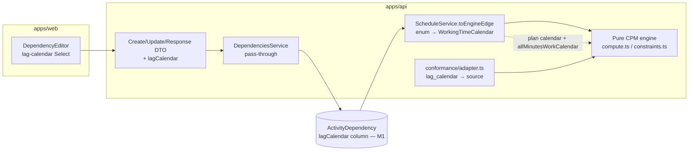
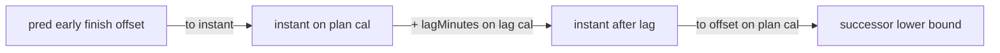

# Feature Spec: M3 — Per-relationship lag calendars

- **Status:** Draft
- **Author(s):** feature-analyst (with James Ewbank)
- **Date:** 2026-07-15
- **Tracking issue / epic:** Engine Conformance & Validation Framework (ADR-0034), Milestone M3
- **Roadmap link:** `docs/specs/engine-conformance-framework/implementation-plan.md` → Milestone M3
- **Related ADR(s):** ADR-0036 §6 (the lag-calendar seam — this feature _realises_ it), ADR-0035 §15 (lag/SF arithmetic), ADR-0024 (per-activity calendars deferred — the constraint on this rung), ADR-0022 (recalculate contract), ADR-0021 (DAG invariant). **No new ADR** (see §4).

---

## 1. Business understanding

### Problem

A logic tie's **lag** is a wait, and not every wait is measured on the project's working calendar.
The canonical construction case is **concrete cure**: after a foundation pour, the slab cannot be
loaded for 7 **elapsed** days — the concrete cures over the weekend and overnight, ignoring the site
shift pattern. On a 6-day, 10-hour calendar, a cure modelled as "7 working days of lag" resolves to
roughly **two weeks** of real time — wrong by a week. P6 models this with a per-relationship setting,
_Calendar for scheduling relationship lag_ (Predecessor / Successor / 24-Hour / Project Default), and
a **24-Hour** override on the cure edge.

SchedulePoint's engine today measures **every** edge's lag on the single plan calendar
(`compute.ts` adds `edge.lagMinutes` directly in plan-calendar working-minute offset space). It
therefore **cannot represent** the cure edge correctly. ADR-0036 §6 named this the per-relationship
lag seam and **M1 landed the storage half** — `ActivityDependency.lagCalendar`
(`LagCalendarSource { PREDECESSOR, SUCCESSOR, TWENTY_FOUR_HOUR, PROJECT_DEFAULT }`, default
`PROJECT_DEFAULT`) plus the shared `LAG_CALENDAR_SOURCES` type. The column is **stored but inert**:
it is on no DTO, and the engine never reads it (verified — `dependencies.service.ts` comments it "M3",
the adapter drops `lag_calendar` with a note). M3 **wires the behaviour**.

Why now: M1 (the gating hour/shift-granular rework, ADR-0036) is Accepted and landed, so the engine
can finally measure lag in minutes on an arbitrary calendar port. M3 is the smallest conformance rung
that M1 unblocks, and it clears a construction-critical scheduling error (mis-timed cures, backfill
waits, cure-before-strip sequences).

### Users

- **Planner** (`PLANNER`) — models the schedule; needs to say "this lag is elapsed time, not working
  time" on the specific relationships where it matters (cure, delivery lead time, contractual waits).
- **Contributor** (`CONTRIBUTOR`) — may edit relationships they own; same need at a smaller scope.
- **Viewer / External Guest** — read-only; see the chosen lag calendar on a relationship, never edit.
- **The conformance framework itself** (ADR-0034) — a non-human "user": the differential/golden
  harness that must be able to assert the 24-Hour lag behaviour and flip the owning matrix rows.

### Primary use cases

1. Set a relationship's lag calendar to **24-Hour** so its lag is measured as elapsed time (the cure).
2. Read a relationship's lag calendar back (list/detail) and see it reflected in the calculated dates.
3. Recalculate a plan and have the engine honour each edge's lag calendar in the forward/backward pass.
4. (Conformance) assert the `A4430→A4440 FS +168 h / 24H` cure edge lands 7 elapsed days after the
   pour, and that flipping the global lag-calendar setting to 24-Hour (S06) moves lagged edges.

### User journeys

**Happy path (Planner sets a 24-Hour cure lag):** open a plan → open the relationship editor on the
pour→load edge (rail or canvas link) → set type FS, lag 7 days, **lag calendar = 24-Hour** → save →
recalculate → the successor's early start is 7 elapsed days after the pour finish, not 7 working days.
See the user-flow diagram in §4.

**Alternate (leave default):** a Planner who does nothing gets `PROJECT_DEFAULT` — lag on the plan
calendar, byte-identical to today. No existing plan changes dates on upgrade.

**Read-only (Viewer):** sees the lag-calendar label on the relationship; the selector is disabled.

### Expected outcomes

- Planners can model elapsed-time lags correctly; cure/backfill/delivery sequences schedule to real
  site time.
- The engine measures each edge's lag on its chosen calendar; the default path is unchanged (goldens
  hold).
- The conformance capability matrix's **Per-relationship lag calendar** row moves ❌ → ✅ for the
  24-Hour behaviour; the `lag_calendar_24h` fixture case asserts; scenario **S06** (global 24-Hour)
  becomes a runnable differential.

### Success criteria

- The `A4430→A4440 FS +168 h / 24H` edge places its successor exactly **7 elapsed days** after the
  predecessor finish (10 080 elapsed minutes), verified by a first-principles golden/differential test.
- On a non-24/7 plan calendar, an edge with `TWENTY_FOUR_HOUR` produces a **different** successor date
  than the same edge with `PROJECT_DEFAULT` (the differential proof the option is wired).
- Every existing plan and the full golden suite recalculate **byte-identically** (default path
  unchanged): `PROJECT_DEFAULT` edges reduce to today's `predEF + lag` arithmetic.
- Recalc performance budget holds (< 500 ms @ 500 activities, < 2 s @ 2 000 — ADR-0036 §7).
- `pnpm lint && pnpm typecheck && pnpm test` green; api-review-clean DTO; no new ADR needed.

### Open questions

> **CRITICAL — Q1 (scope of the four sources).** Per-**activity** calendars are deferred to M5
> (ADR-0024), so today every activity schedules on the single plan calendar. That means in M3
> `PREDECESSOR`, `SUCCESSOR` and `PROJECT_DEFAULT` **all resolve to the same plan calendar** — only
> `TWENTY_FOUR_HOUR` is behaviourally distinct. Do we (a) land **all four** enum options now
> (Pred/Succ pre-wired but resolving to the plan calendar until M5 makes them distinct, documented as
> such), or (b) land **only 24-Hour + Project-Default** now and defer Pred/Succ to M5?
> **Recommendation: (a).** The enum and column already exist (M1 landed all four as valid stored
> values); exposing and resolving all four is trivial and forward-wires M5 with **zero DTO/API churn**.
> We mitigate the honesty concern with documented microcopy ("Predecessor / Successor / Project Default
> currently coincide until per-activity calendars land") rather than hiding a column the store already
> accepts. See also the **finding** below on what M3 can honestly assert.

> **CRITICAL — Q2 (FE selector in M3, or API-only?).** Ship the lag-calendar selector on the
> relationship editor in M3, or keep M3 backend-only (API + engine + conformance) and add the selector
> with the M5 per-activity work? **Recommendation: ship a minimal selector in M3** — an override that
> can't be set in the UI is a dead API — but it is the **lowest-priority slice** and can be dropped
> without affecting the milestone's conformance outcome (the harness feeds the engine directly).

> **Confirmation — Q3 (24-Hour = pure elapsed minutes).** Confirmed: the "24-Hour" lag calendar **is**
> `allMinutesWorkCalendar` (a 7-day, 24 h/day `WorkingTimeCalendar`), so `addWorkingTime` on it adds
> raw elapsed minutes — 168 h = 10 080 elapsed minutes = 7 elapsed days. "Pure elapsed minutes" and
> "elapsed minutes on a 7-day-all-day calendar" are the same object. Not a blocking question; recorded
> for the record.

> **FINDING (contradiction to flag).** The current implementation-plan M3 acceptance says _"S05 must
> move A8300"_ and lists `lag_calendar_setting_sensitive`. That case (`A2230→A8300`, PRED vs SUCC)
> depends on the predecessor and successor having **different** calendars (CAL-03 24 h vs CAL-01
> 5-day) — i.e. **per-activity calendars**, which are **M5**. In M3 both resolve to the plan calendar,
> so A8300 does **not** move and S05 cannot be a true differential yet. **M3 can honestly assert only
> the 24-Hour behaviour** (`lag_calendar_24h` / A4430→A4440, and S06 global 24-Hour). The
> `lag_calendar_setting_sensitive` row and S05 (Successor-sensitive) stay 🟡/`todo` against **M5**.
> This spec proposes updating the M3 acceptance accordingly (see §4 and the plan). Default assumption:
> proceed with the honest M3 scope; do not fake S05.

> **Non-critical defaults (proceeding):** the public API keeps lag **quantity** day-denominated
> (`lagDays`, ±3650; ADR-0036 §7) — M3 adds only the calendar **dimension** (an enum, exact); sub-day
> lag input stays an ADR-0036 §7 follow-on and the conformance harness exercises hour-precise lag at
> the engine level, bypassing the day DTO. `lagCalendar` is patchable on a relationship like `type`
> and `lagDays` (pen-gated, optimistic-locked). Default remains `PROJECT_DEFAULT`.

## 2. Functional requirements

### User stories & acceptance criteria

> **US-1** — As a **Planner**, I want to set a relationship's lag calendar to **24-Hour**, so that an
> elapsed-time wait (concrete cure) schedules to real time, not working time.
>
> **Acceptance criteria**
>
> - **Given** a plan on a non-24/7 calendar and an FS edge with 7-day lag, **when** I set its lag
>   calendar to `TWENTY_FOUR_HOUR` and recalculate, **then** the successor's early start is 7 **elapsed**
>   days after the predecessor's finish (not 7 working days).
> - **Given** the same edge left at `PROJECT_DEFAULT`, **when** I recalculate, **then** the lag is
>   measured on the plan calendar (today's behaviour, unchanged).
> - **Given** I switch the same edge between `PROJECT_DEFAULT` and `TWENTY_FOUR_HOUR`, **then** the
>   successor's date **differs** between the two (the option is provably wired).

> **US-2** — As a **Planner/Contributor/Viewer**, I want to see a relationship's lag calendar in the
> list and detail, so that the modelling intent is visible without opening an editor.
>
> **Acceptance criteria**
>
> - **Given** any relationship, **when** I read it (list or detail), **then** the response includes its
>   `lagCalendar` value.
> - **Given** a relationship created before M3, **then** its `lagCalendar` reads `PROJECT_DEFAULT`.

> **US-3** — As a **Contributor** editing a relationship, I want the lag calendar to be optimistic-locked
> and pen-gated like the type and lag, so that concurrent edits are safe.
>
> **Acceptance criteria**
>
> - **Given** I hold the edit-lock (pen) and a current `version`, **when** I PATCH `lagCalendar`, **then**
>   it updates and the version increments.
> - **Given** I do **not** hold the pen, **when** I PATCH `lagCalendar`, **then** I get 423 `LockedError`.
> - **Given** a stale `version`, **then** I get 409 (unchanged optimistic-lock behaviour).

> **US-4** — As the **conformance harness** (ADR-0034), I want the adapter to feed each fixture
> relationship's `lag_calendar` to the engine, so that the 24-Hour cure edge and the global-24-Hour
> scenario can be asserted and the matrix rows flipped.
>
> **Acceptance criteria**
>
> - **Given** the fixture's `A4430→A4440 FS +168 h / 24H` edge, **when** the adapter builds the network,
>   **then** the edge carries the 24-Hour lag calendar (no longer a `lag-calendar-dropped` note) and its
>   successor lands 7 elapsed days after the pour.
> - **Given** scenario **S06** (global lag calendar = 24-Hour), **when** run against S01, **then** the
>   dates **differ** (lagged edges move) — S06 flips from `todo` to a runnable differential.
> - **Given** scenario **S05** (global lag calendar = Successor) or the `lag_calendar_setting_sensitive`
>   edge, **then** they remain `todo`/🟡 with the reason "needs per-activity calendars (M5)".

### Workflows

1. **Set lag calendar (write):** authz (`dependency:update`, org scope) → load active edge in org →
   assert pen (ADR-0028) → optimistic-locked patch of `{ type?, lagDays?, lagCalendar?, version }` →
   updated response. Create mirrors this (`dependency:create`, plan-scoped, inside the advisory lock).
2. **Recalculate (read-through of the field):** service loads active edges (now selecting
   `lagCalendar`) → `toEngineEdge` resolves the enum to an optional `WorkingTimeCalendar` (24-Hour →
   `allMinutesWorkCalendar`; the other three → plan calendar / undefined) → engine measures each edge's
   lag on that calendar → results persisted (engine-owned columns only, ADR-0022).
3. **Conformance run:** adapter maps `rel.lag_calendar` → `LagCalendarSource` → resolved calendar on
   the `EngineEdge`; harness asserts the 24-Hour case and S06 differential.

### Edge cases

- **Default / legacy rows:** `lagCalendar = PROJECT_DEFAULT` → plan calendar → identical dates. Empty
  plan / no edges → no change.
- **Plan calendar is already 24/7** (`calendarId` null → `allMinutesWorkCalendar`): all four sources
  coincide with 24-Hour; the field is a harmless no-op — correct, not an error.
- **Negative lag (lead) on 24-Hour:** the lag term walks **backward** on the lag calendar; the backward
  pass must apply the same lag calendar so float stays symmetric (see §4 arithmetic).
- **SS/FF/SF edges:** the lag calendar applies to the lag term only; the type's start/finish anchor and
  the `− successorDuration`/`+ predecessorDuration` terms stay in plan-calendar offset space.
- **Very long lag on 24-Hour** (fixture N16, 100 000 h): bounded by the M1 horizon + iteration cap
  (`allMinutesWorkCalendar` is closed-form, so this is trivial) — must not spin.
- **Concurrent edits:** optimistic lock (409) + pen (423) already cover this; `lagCalendar` joins the
  patch set, no new concurrency surface.
- **Invalid enum value:** rejected at the DTO boundary (422) by `@IsEnum`.

### Permissions

Map to ADR-0012 RBAC + org resource scope (deny-by-default), unchanged from today's dependency rules —
`lagCalendar` is just another mutable field on the same endpoints:

| Action                           | Permission          | Scope                     | Notes                                |
| -------------------------------- | ------------------- | ------------------------- | ------------------------------------ |
| Read `lagCalendar` (list/detail) | `dependency:read`   | resolved org              | every member                         |
| Set on create                    | `dependency:create` | resolved org, parent plan | pen-gated, in advisory lock          |
| Update                           | `dependency:update` | resolved org              | pen-gated, optimistic-locked         |
| (No new permission)              | —                   | —                         | reuses the dependency permission set |

### Validation rules

- `lagCalendar` — optional, one of `LAG_CALENDAR_SOURCES` (`PREDECESSOR | SUCCESSOR |
TWENTY_FOUR_HOUR | PROJECT_DEFAULT`); omitted → DB default `PROJECT_DEFAULT`. Shared client↔server:
  `@IsEnum(LagCalendarSource)` (class-validator, mapped from the Prisma enum) on the API;
  `z.enum(LAG_CALENDAR_SOURCES)` on the web. `lagDays` unchanged (±3650, day-denominated). Enum values
  are stable strings, no locale concern.

### Error scenarios

| Scenario                              | Detection                       | User-facing result           | Status |
| ------------------------------------- | ------------------------------- | ---------------------------- | ------ |
| Not a member / lacks `dependency:*`   | authz check                     | friendly forbidden message   | 403    |
| Invalid `lagCalendar` enum value      | DTO `@IsEnum`                   | inline validation error      | 422    |
| Edit without the pen                  | `assertHoldsPen` (ADR-0028)     | "someone else is editing"    | 423    |
| Stale `version`                       | optimistic `updateMany` count 0 | "changed elsewhere, refresh" | 409    |
| Relationship not found / cross-tenant | org-scoped load                 | not found                    | 404    |

## 3. Technical analysis

| Area           | Impact   | Notes                                                                                                                                                                                                                                                                      |
| -------------- | -------- | -------------------------------------------------------------------------------------------------------------------------------------------------------------------------------------------------------------------------------------------------------------------------- |
| Frontend       | low      | one enum `Select` on the existing `DependencyEditor`; a lag-calendar label in the relationship list; Zod field + labels. No new routes/components. (Q2: droppable.)                                                                                                        |
| Backend        | med      | expose `lagCalendar` on create/update/response DTOs + shared `DependencySummary`; pass through service create/patch; **engine** gains per-edge lag-calendar resolution in the forward/backward bounds.                                                                     |
| Database       | **none** | column, enum, default and index landed in M1; no migration. Verified in `schema.prisma` (`lag_calendar LagCalendarSource @default(PROJECT_DEFAULT)`).                                                                                                                      |
| API            | low      | additive field on two request DTOs + one response DTO; OpenAPI/`docs/API.md` note. No new endpoint, no version bump beyond additive.                                                                                                                                       |
| Security       | low      | reuses dependency RBAC + org scope + pen + optimistic lock; only a new **enum** input (bounded by `@IsEnum`) — no IDOR/injection surface. Engine-owned columns untouched.                                                                                                  |
| Performance    | low      | `toEngineEdge` resolves at most two calendar singletons per plan (plan + `allMinutesWorkCalendar`); the 24-Hour path costs one extra `addWorkingTime`/`workingTimeBetween` **per 24-Hour edge only** (closed-form). Default path unchanged. Re-verify the ADR-0036 budget. |
| Infrastructure | none     | no new services, env, or containers.                                                                                                                                                                                                                                       |
| Observability  | low      | recalc log already records `calendarId`; optionally add a `lagCalendarOverrideCount` to the recalc log line.                                                                                                                                                               |
| Testing        | med      | engine unit tests (24-Hour elapsed-lag **differential** + inverse/symmetry), service wiring, DTO validation, conformance adapter flip + matrix update, one API e2e for the round-trip, a small web test.                                                                   |

### Dependencies

- **M1 (ADR-0036) — landed.** Provides minute-granular durations/lag, the `WorkingTimeCalendar` port,
  `allMinutesWorkCalendar`, and the `lagCalendar` column + shared type. Hard prerequisite; satisfied.
- **M5 (per-activity calendars, ADR-0024)** — the _downstream_ dependency: `PREDECESSOR`/`SUCCESSOR`
  become behaviourally distinct only once M5 lands. M3 forward-wires them; M5 flips the remaining rows.
- Reference template & standards: `docs/REFERENCE_FEATURE.md`, `docs/API.md`, `docs/DATABASE.md`,
  `docs/SECURITY_STANDARDS.md`, `docs/PERFORMANCE.md`.

## 4. Solution design

### Architecture overview

The engine stays a **pure, calendar-agnostic** domain library (ADR-0008): it receives resolved
`WorkingTimeCalendar` **ports**, never the `LagCalendarSource` enum. The service owns enum→calendar
resolution; the engine owns the arithmetic. This is the same seam M1 built for the plan calendar,
extended to a **per-edge** lag calendar.



### Data flow

```mermaid
sequenceDiagram
  participant P as Planner (web)
  participant API as DependenciesService
  participant DBW as Postgres
  participant SVC as ScheduleService
  participant ENG as Pure engine

  P->>API: PATCH edge { lagCalendar: TWENTY_FOUR_HOUR, version }
  API->>API: authz + assertHoldsPen + optimistic lock
  API->>DBW: update lag_calendar (version+1)
  API-->>P: 200 { ..., lagCalendar }
  Note over P,SVC: later — recalculate
  SVC->>DBW: loadEdges (now select lagCalendar)
  SVC->>SVC: toEngineEdge: 24H → allMinutesWorkCalendar; else plan calendar
  SVC->>ENG: computeSchedule(activities, edges[{lagMinutes, lagCalendar?}], {dataDate, calendar})
  ENG->>ENG: forward/backward bound: measure lag term on edge.lagCalendar
  ENG-->>SVC: results (successor +7 elapsed days)
  SVC->>DBW: writeResults (engine-owned columns only)
```

### User flow

```mermaid
flowchart TD
  A[Open plan → relationship editor] --> B[Set type FS, lag 7d]
  B --> C{Lag calendar}
  C -->|Project Default| D[Lag on plan calendar]
  C -->|24-Hour| E[Lag as elapsed time]
  C -->|Predecessor/Successor| F[= Project Default until M5\n(helper microcopy)]
  D --> G[Save → Recalculate]
  E --> G
  F --> G
  G --> H[Successor date reflects the chosen lag calendar]
```

### Database changes

**None.** The column, enum, default (`PROJECT_DEFAULT`) and any index were delivered by M1 (verified in
`apps/api/prisma/schema.prisma`; `packages/types` exports `LAG_CALENDAR_SOURCES`/`LagCalendarSource`).
M3 changes only the code that reads/writes the existing column. `ScheduleEdgeRow`/`loadEdges` gain
`lagCalendar` in their `select`; `DependencyPatch` and the create input gain `lagCalendar`.

### API changes

Additive fields on existing dependency endpoints (`docs/API.md` update, OpenAPI via `@nestjs/swagger`):

- `POST /api/v1/orgs/{org}/plans/{planId}/dependencies` — `CreateDependencyDto` gains
  `lagCalendar?: LagCalendarSource` (optional, `@IsEnum`, default `PROJECT_DEFAULT`, `@ApiPropertyOptional`).
- `PATCH /api/v1/orgs/{org}/dependencies/{id}` — `UpdateDependencyDto` gains the same optional field.
- Responses (`DependencyResponseDto` + shared `DependencySummary`) gain `lagCalendar: LagCalendarSource`.
- No status-code changes; `lagDays` stays day-denominated. Version impact: **minor** (pre-1.0 additive).

### Component changes

- **`apps/web/src/features/dependencies/schemas/dependency-schemas.ts`** — extend `typeAndLagSchema`
  with `lagCalendar: z.enum(LAG_CALENDAR_SOURCES)` (default `PROJECT_DEFAULT`); add
  `LAG_CALENDAR_LABELS` (exhaustive `Record<LagCalendarSource, string>`), e.g. "Project default",
  "24-Hour (elapsed)", "Predecessor", "Successor".
- **`DependencyEditor.tsx`** — add a shadcn/ui `Select` bound to `lagCalendar`, using design-system
  tokens (no one-off styling), with helper microcopy for Q1's honesty note. Keyboard-operable,
  labelled (WCAG 2.2 AA) — reuse the existing form field pattern. Loading/empty/error/success states
  inherit from the existing dialog.
- **Relationship list** — render the lag-calendar label as a small secondary detail (only when not
  `PROJECT_DEFAULT`, to avoid noise). No new component.

### Implementation approach & alternatives

**Chosen — service resolves the enum to a `WorkingTimeCalendar` port and attaches it per edge; the
engine measures the lag term on that port via an offset↔instant round-trip.**

`EngineEdge` gains `lagCalendar?: WorkingTimeCalendar` (undefined = the plan calendar in
`ComputeOptions`, preserving today's arithmetic). A single helper centralises the lag application:

```
applyLag(anchorOffset, lagMinutes, edge, planCalendar, dataDate):
  if edge.lagCalendar is undefined:        // PROJECT_DEFAULT / PRED / SUCC (M3) — fast, golden path
    return anchorOffset + lagMinutes
  instant  = planCalendar.addWorkingTime(dataDate, anchorOffset)
  shifted  = edge.lagCalendar.addWorkingTime(instant, lagMinutes)   // walk lag on the lag calendar
  return planCalendar.workingTimeBetween(dataDate, shifted)         // back to plan-offset space
```

Forward bounds become `FS: applyLag(predEF)`, `SS: applyLag(predES)`, `FF: applyLag(predEF) −
succDur`, `SF: applyLag(predES) − succDur`; backward bounds mirror with `applyLag(succLS|succLF,
−lag)` so float stays symmetric. **Correctness of the default path:** when `lagCalendar` is undefined
the helper is literally `anchorOffset + lag`, and even when the lag calendar _equals_ the plan
calendar the round-trip collapses to `anchorOffset + lag` by the port's inverse invariant
(`workingTimeBetween(from, addWorkingTime(from, n)) === n`) and additive composition — so goldens are
byte-identical and only `TWENTY_FOUR_HOUR` (a genuinely different calendar) moves dates. The driving-edge
detection in `compute.ts` must call the same `applyLag` so driving flags stay consistent.

Arithmetic unchanged **except the lag term's measurement frame** — the diagram:



**Resolution in the service** (`toEngineEdge`): `TWENTY_FOUR_HOUR → allMinutesWorkCalendar`;
`PREDECESSOR | SUCCESSOR | PROJECT_DEFAULT → undefined` (plan calendar) — with a comment that
Pred/Succ will resolve to the endpoint's per-activity calendar in M5.

**Alternatives considered:**

- _Engine resolves the enum from a calendar map (`EngineEdge.lagCalendarKey` + `Map` in options)._
  Rejected: pushes enum/domain knowledge into the pure engine; the port-object approach keeps the
  engine calendar-agnostic (matches the M1 plan-calendar seam) with less indirection.
- _Add lag as elapsed minutes for 24-Hour by short-circuiting to raw minute maths._ Rejected: the
  generic `applyLag` over `allMinutesWorkCalendar` **is** raw elapsed minutes (Q3), so a special case
  buys nothing and risks divergence for negative lag / SS-FF-SF anchors.
- _Land only 24-Hour + Project-Default (Q1 option b)._ Viable and honest, but the enum already stores
  all four; forward-wiring Pred/Succ now costs nothing and avoids a second DTO change at M5. Recommend
  (a).

**ADR?** **No new ADR.** M3 _realises_ ADR-0036 §6 (the seam it explicitly defers to M3) and applies
ADR-0035 §15 lag arithmetic; it introduces no new architectural decision. The only doc-of-record
change is the **capability matrix** (row flip) and a corrective note to the M3 acceptance (the S05 /
`lag_calendar_setting_sensitive` scope belongs to M5 — a `docs/DECISIONS.md` line, not an ADR).

## 5. Links

- Implementation plan: `docs/specs/engine-conformance-framework/M3-lag-calendars-implementation-plan.md`
- Docs updated by this change: `docs/specs/engine-conformance-framework/CAPABILITY_MATRIX.md`
  (Per-relationship lag calendar row; S06), `docs/API.md`, `docs/DECISIONS.md` (S05→M5 scope note).
- Grounding: ADR-0036 §6/§4, ADR-0035 §15, ADR-0024; `engine/compute.ts`, `engine/working-time-calendar.ts`,
  `schedule.service.ts`, `conformance/adapter.ts`; the fixture `TEST_MATRIX.md` §4.
