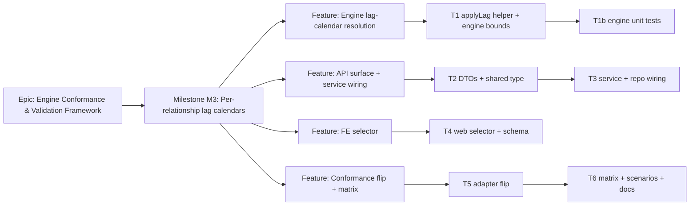

# Implementation Plan: M3 — Per-relationship lag calendars

- **Feature spec:** `docs/specs/engine-conformance-framework/M3-lag-calendars-feature-spec.md`
- **Status:** Draft (awaiting approval)
- **Owner:** TBD

## Breakdown

### Epic

**Engine Conformance & Validation Framework** (ADR-0034) — prove and close the gap between
SchedulePoint's CPM/PDM engine and a P6-class fixture, one capability rung at a time.

### Milestone: M3 — Per-relationship lag calendars (shippable slice)

**Outcome:** a Planner can mark a relationship's lag as **24-Hour (elapsed)** and the engine schedules
its successor by elapsed time; the default path is byte-identical; the conformance harness asserts the
concrete-cure edge and the global-24-Hour scenario, moving the owning matrix rows to ✅. Pred/Succ are
forward-wired but resolve to the plan calendar until M5.

**Complexity:** L · **Dependencies:** M1 (ADR-0036, landed) · **Flag:** none required — the default
path is unchanged, so this ships on trunk without a feature flag; the FE selector is the only
user-visible surface and is additive.

---

#### Feature: Engine lag-calendar resolution (the behaviour)

> **Description:** teach the pure engine to measure each edge's lag term on a per-edge
> `WorkingTimeCalendar`, defaulting to the plan calendar (unchanged arithmetic).
> **Complexity:** M
> **Dependencies:** none (engine is self-contained; M1 already landed the port)
> **Risks:** a subtle asymmetry between forward/backward application → negative/incorrect float →
> _mitigation:_ a single shared `applyLag` used by both passes **and** driving detection, plus an
> inverse/symmetry unit test; regression against the full golden suite for the default path.
> **Testing requirements:** engine unit tests — 24-Hour elapsed-lag **differential** (24H vs default
> on a non-24/7 calendar must differ), the exact `168 h → 7 elapsed days` value, negative-lag-on-24H,
> SS/FF/SF anchors, inverse invariant, and full golden-suite byte-parity for `PROJECT_DEFAULT`.

##### Task 1 — `applyLag` helper + per-edge lag calendar in the bounds (≈ one PR)

- **Description:** add `lagCalendar?: WorkingTimeCalendar` to `EngineEdge`; add `applyLag(anchorOffset,
lagMinutes, edge, planCalendar, dataDate)`; route `forwardLowerBound`, `backwardUpperBound`, and the
  driving-edge detection through it. Undefined lag calendar → fast `anchor + lag` path.
- **Complexity:** M
- **Dependencies:** —
- **Risks:** driving flags drift if detection doesn't use `applyLag` → _mitigation:_ one code path;
  test asserts driving flags on a 24-Hour edge.
- **Testing:** covered by T1b; keep this PR green with the existing `compute.spec.ts`.
- **Development steps:**
  1. `engine/types.ts`: add `lagCalendar?: WorkingTimeCalendar` to `EngineEdge` (documented: undefined
     = the plan calendar; only distinct for 24-Hour today).
  2. `engine/compute.ts`: add `applyLag`; thread `planCalendar`/`dataDate` into `forwardLowerBound`,
     `backwardUpperBound`, and the driving loop; keep the fast path when `lagCalendar` is undefined.
  3. Update the engine doc-comments (offsets, lag frame) to describe the per-edge lag calendar.

##### Task 1b — Engine unit tests for lag calendars

- **Description:** prove the behaviour and the parity guarantee.
- **Complexity:** S
- **Dependencies:** Task 1
- **Risks:** under-testing the negative/SS-FF-SF cases → _mitigation:_ explicit cases per anchor.
- **Testing:** new `compute.lag-calendar.spec.ts`: (a) FS +168 h, 24-Hour, on a 6-day/10-h plan
  calendar → successor exactly 7 elapsed days after the pour, and **differs** from `PROJECT_DEFAULT`;
  (b) negative lag on 24-Hour walks back correctly and float is symmetric; (c) SS/FF/SF each honour
  the lag calendar on the lag term only; (d) `PROJECT_DEFAULT` (undefined) reproduces today's dates;
  (e) N16-style long 24-Hour lag terminates within budget.
- **Development steps:**
  1. Add the spec with the five cases; assert both the value and the differential.
  2. Run the golden suite (`goldens.spec.ts`) to confirm byte-parity on the default path.

---

#### Feature: API surface + service wiring (expose + read the field)

> **Description:** expose `lagCalendar` on create/update/response DTOs and the shared type; pass it
> through the service to storage; resolve it to a calendar port at recalculation.
> **Complexity:** M
> **Dependencies:** Feature "Engine lag-calendar resolution" (T1) for the engine to consume it.
> **Risks:** leaking the enum into the engine, or the response DTO drifting from the shared type →
> _mitigation:_ resolve in the service (`toEngineEdge`), implement the shared `DependencySummary`.
> **Testing requirements:** DTO validation unit tests (valid/invalid enum, default), service spec
> (create/update persists + reads back; recalc honours 24-Hour), one API e2e round-trip.

##### Task 2 — DTOs + shared type

- **Description:** add `lagCalendar` to `CreateDependencyDto`, `UpdateDependencyDto`,
  `DependencyResponseDto`, and `DependencySummary` (`@repo/types`). Prisma enum ↔ shared union kept in
  lock-step (already aligned per M1).
- **Complexity:** S
- **Dependencies:** —
- **Risks:** `@IsEnum` bound to the Prisma enum vs the shared union mismatch → _mitigation:_ import the
  Prisma `LagCalendarSource` for validation, assert equality with `LAG_CALENDAR_SOURCES` in a type test.
- **Testing:** DTO validation spec — accepts each of the four, rejects an unknown value (422), omission
  → undefined (DB default applies).
- **Development steps:**
  1. `packages/types`: add `lagCalendar: LagCalendarSource` to `DependencySummary`.
  2. Create/Update DTOs: optional `@IsEnum(LagCalendarSource)` `@ApiPropertyOptional` field.
  3. `DependencyResponseDto`: expose `lagCalendar` from the entity in `from()`.
  4. api-reviewer pass (envelopes, OpenAPI); update `docs/API.md`.

##### Task 3 — Service + repository wiring

- **Description:** pass `dto.lagCalendar` through `DependenciesService.create`/`update`; add
  `lagCalendar` to `DependencyPatch` and the create input; select it in `loadEdges`/`ScheduleEdgeRow`;
  resolve it in `ScheduleService.toEngineEdge`.
- **Complexity:** M
- **Dependencies:** Task 1, Task 2
- **Risks:** forgetting `loadEdges` select → the engine always sees the default → _mitigation:_ service
  spec asserts a 24-Hour edge changes the recalculated date; log a `lagCalendarOverrideCount`.
- **Testing:** `dependencies.service.spec.ts` (create/update round-trip, pen + optimistic-lock still
  enforced with the new field); `schedule.service.spec.ts` (recalc with a 24-Hour edge moves the
  successor; default plan unchanged).
- **Development steps:**
  1. `dependency.repository.ts`: add `lagCalendar?` to `DependencyPatch`; include it in create input.
  2. `dependencies.service.ts`: thread `dto.lagCalendar` into create/patch (drop the "M3" comment).
  3. `schedule.repository.ts`: add `lagCalendar` to `ScheduleEdgeRow` + `loadEdges` select.
  4. `schedule.service.ts` `toEngineEdge`: `TWENTY_FOUR_HOUR → allMinutesWorkCalendar`; others →
     undefined (plan calendar) with the M5 comment; add the resolved calendar to the `EngineEdge`.
  5. security-reviewer + backend-performance-reviewer pass; changeset (minor).

---

#### Feature: FE lag-calendar selector (Q2 — recommended, droppable)

> **Description:** a lag-calendar `Select` on the relationship editor + a list label, with honest
> microcopy that Pred/Succ/Default coincide until M5.
> **Complexity:** S
> **Dependencies:** Task 2 (response field), Task 3 (persistence)
> **Risks:** a "no-op-looking" option confusing planners → _mitigation:_ helper text; default hidden
> in the list unless overridden.
> **Testing requirements:** component test (renders, default, change persists via the mutation);
> accessibility-reviewer (labelled, keyboard-operable, WCAG 2.2 AA); ux-reviewer (copy, states).

##### Task 4 — Web selector + schema

- **Description:** extend the dependency form schema and `DependencyEditor` with the selector; add the
  list label.
- **Complexity:** S
- **Dependencies:** Task 2, Task 3
- **Risks:** token/one-off styling drift → _mitigation:_ reuse the existing shadcn/ui `Select` field.
- **Testing:** `DependencyEditor.test.tsx` (selector present, default `PROJECT_DEFAULT`, edit submits
  the field); a11y check in the journey.
- **Development steps:**
  1. `dependency-schemas.ts`: add `lagCalendar` to `typeAndLagSchema` + `LAG_CALENDAR_LABELS`.
  2. `DependencyEditor.tsx`: add the `Select` with helper microcopy; wire to the mutation.
  3. Relationship list: show the label when not `PROJECT_DEFAULT`.
  4. component-reviewer + accessibility-reviewer + ux-reviewer pass; changeset (minor).

---

#### Feature: Conformance flip + capability matrix (prove it)

> **Description:** stop dropping `lag_calendar` in the adapter; assert the 24-Hour cure edge and S06;
> move the matrix rows; record the honest M3-vs-M5 scope split.
> **Complexity:** M
> **Dependencies:** Feature "Engine lag-calendar resolution" (T1)
> **Risks:** over-claiming S05/`lag_calendar_setting_sensitive` (needs M5) → _mitigation:_ the finding
> in the spec; keep those `todo`→M5 with a clear reason.
> **Testing requirements:** adapter spec (24-Hour edge carries the calendar, no `lag-calendar-dropped`
> note for it); scenarios spec (S06 runnable + differs from baseline; S05 still `todo`→M5); the
> `lag_calendar_24h` golden asserts 7 elapsed days.

##### Task 5 — Adapter flip

- **Description:** map `rel.lag_calendar` (`"24H"` etc. / null) → `LagCalendarSource`, resolve to a
  calendar port, attach to the `EngineEdge`; remove the blanket `lag-calendar-dropped` note for
  24-Hour; keep a Pred/Succ note ("resolves to plan calendar until per-activity calendars, M5").
- **Complexity:** M
- **Dependencies:** Task 1
- **Risks:** fixture lag-calendar string variants (`"24H"`, `"24_HOUR"`) → _mitigation:_ a small
  normaliser with an exhaustive map + a test over the fixture's actual values.
- **Testing:** `adapter.spec.ts` — A4430→A4440 carries 24-Hour; its note is gone; a Pred/Succ edge
  still noted; `approximations` updated (24-Hour no longer dropped, Pred/Succ still degraded to M5).
- **Development steps:**
  1. `conformance/adapter.ts`: normalise + resolve `lag_calendar`; attach the calendar; adjust notes
     and `approximations`.
  2. Assert the concrete-cure edge lands 7 elapsed days (first-principles golden in `goldens.ts`).

##### Task 6 — Scenarios, matrix & docs

- **Description:** flip S06 to runnable, keep S05 `todo`→M5; move the capability-matrix row; correct
  the M3 acceptance scope.
- **Complexity:** S
- **Dependencies:** Task 5
- **Risks:** matrix drift from behaviour → _mitigation:_ update in the same PR (matrix rule).
- **Testing:** `scenarios.spec.ts` — S06 runs and `resultsDiffer(S06, S01)` is true; S05 remains
  `todo` with the M5 reason.
- **Development steps:**
  1. `conformance/scenarios.ts`: `S06_LAG_CALENDAR_24H.runnable = true`; leave `S05_..._SUCCESSOR`
     `todo` with reason "needs per-activity calendars (M5)".
  2. `CAPABILITY_MATRIX.md`: Per-relationship lag calendar row → ✅ for `lag_calendar_24h` (note S06
     asserted); `lag_calendar_setting_sensitive`/S05 annotated → M5. Update the summary counts + the
     `Lag sign × type arithmetic` note (24-Hour override now wired).
  3. `docs/DECISIONS.md`: record the S05/`setting_sensitive` → M5 scope correction.
  4. changeset (docs/tests only for this PR).

## Sequencing & slices

1. **T1 → T1b (engine)** — pure, self-contained, ships first and keeps `main` releasable (default path
   unchanged; goldens prove it).
2. **T2 → T3 (API + service)** — makes the field settable and honoured end-to-end; the first
   user-valuable slice (a 24-Hour lag changes real recalculated dates).
3. **T5 → T6 (conformance)** — proves it against the fixture and flips the matrix; can run in parallel
   with T3 once T1 lands.
4. **T4 (FE selector)** — last, lowest-risk, droppable per Q2 without affecting the conformance outcome.

Each task is an independently reviewable PR; no feature flag needed (additive + default-preserving).

## Definition of Done (per task)

Each task's PR satisfies the Feature Completion Criteria in `docs/PROCESS.md` (code, tests ≥ 80% on
changed code, docs, security review, performance, accessibility for UI, Docker build, CI green,
changeset, version impact). Milestone-level: `lag_calendar_24h` asserts, S06 is a runnable
differential, the matrix row is ✅ (24-Hour), and the golden suite is byte-identical on the default
path.

## Risks & assumptions (rollup)

| Risk / assumption                                                                             | Likelihood | Impact | Mitigation                                                                            |
| --------------------------------------------------------------------------------------------- | ---------- | ------ | ------------------------------------------------------------------------------------- |
| Forward/backward lag application asymmetric → wrong float                                     | med        | high   | one shared `applyLag` for both passes + driving; inverse/symmetry unit test           |
| `loadEdges` not selecting `lagCalendar` → silent no-op                                        | med        | med    | service spec asserts a 24-Hour edge changes dates; recalc log counts overrides        |
| Default path drifts from goldens                                                              | low        | high   | undefined-lag-calendar fast path is literal `anchor + lag`; run full golden suite     |
| Over-claiming S05 / `setting_sensitive` (needs M5)                                            | med        | med    | spec finding; keep those `todo`→M5 with a clear reason; correct the M3 acceptance     |
| Pred/Succ "no-op-looking" options confuse planners                                            | med        | low    | honest microcopy; hide non-default label noise; forward-wired for M5                  |
| Fixture lag-calendar string variants unmapped                                                 | low        | med    | exhaustive normaliser + test over the fixture's real values                           |
| **Assumption:** M1 (ADR-0036) fully landed (column, port, `allMinutesWorkCalendar`)           | —          | —      | verified in schema/types/engine before planning                                       |
| **Assumption:** public API lag stays day-denominated; sub-day lag is an ADR-0036 §7 follow-on | —          | —      | conformance harness exercises hour-precise lag at the engine level, bypassing the DTO |
