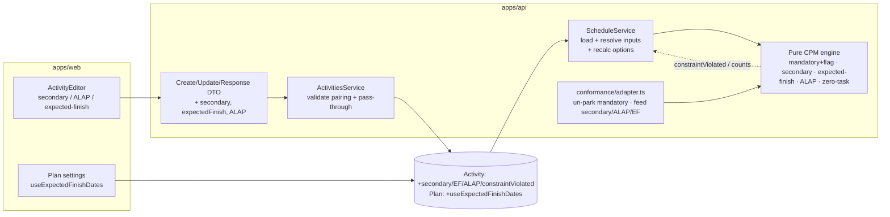
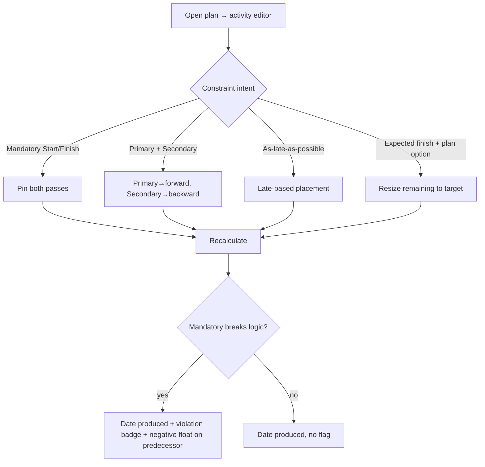

# Feature Spec: M4 — Advanced constraints

- **Status:** Draft (awaiting approval)
- **Author(s):** feature-analyst (with James Ewbank)
- **Date:** 2026-07-16
- **Tracking issue / epic:** Engine Conformance & Validation Framework (ADR-0034), Milestone M4
- **Roadmap link:** `docs/specs/engine-conformance-framework/implementation-plan.md` → Milestone M4
- **Related ADR(s):** **ADR-0035** — SchedulePoint CPM semantics (the golden contract). M4 **Accepts**
  its constraint clauses **§7 (mandatory breaks logic — produce-and-flag), §8 (Start-On/Finish-On
  pin), §9 (Expected Finish), §10 (secondary constraint), §11 (ALAP)** and its activity-type clause
  **§22 (zero-duration task ≠ milestone)**; it also lands the **§12 N15 warning** (constraint before
  the data date) and the **N10** impossible-mandatory-pair contract. Builds on ADR-0022 (recalculate
  contract; engine-owned columns), ADR-0023 §6 (the current MSO/MFO parking this un-parks), ADR-0035
  §1–§6 / **M2** (the progress + remaining-duration model Expected Finish extends), ADR-0036/ADR-0037
  (minute / absolute-instant axis and per-activity calendars the constraint clamps run on),
  ADR-0033 (the effective-Visual pass, which reads the same clamps), ADR-0021 (DAG invariant),
  ADR-0012 (RBAC + org scope). **No new ADR is required** — see Q1.

---

## 1. Business understanding

### Problem

SchedulePoint's engine models only the **six moderate constraints** (`SNET/SNLT/FNET/FNLT` plus the
`MSO/MFO` pins). The P6-class conformance fixture (ADR-0034) exercises a further band of constraints
that UK/EPC construction planners rely on, and today the engine **silently degrades or drops** every
one of them:

- **Mandatory Start / Finish** (`MANDATORY_START`/`MANDATORY_FINISH`) are **parked**: mapped to their
  moderate `MSO`/`MFO` equivalents and merely counted (`parkedConstraintCount`), so the engine never
  emits the honest signal the planner needs — _"this hard date has broken your logic."_ The fixture's
  turnaround window (A10100 opens, A10500 closes) and the impossible-pair negative case **N10** are
  exactly the situations where a planner must be told the schedule is infeasible, not have it quietly
  "fixed."
- **Expected Finish** (A6200) — recompute an in-progress activity's remaining duration so it lands on
  a committed date — is not modelled at all.
- A **secondary constraint** (A5200: `SNET` primary + `FNLT` secondary) cannot be represented: the
  engine honours **one** constraint per activity.
- **As-Late-As-Possible** (A9400) — a zero-free-float backward placement — has no pass; the fixture's
  `AS_LATE_AS_POSSIBLE` is dropped at the adapter.
- A **zero-duration _task_** (A7550) is silently conflated with a **milestone**: the engine keys every
  milestone branch off `durationMinutes === 0`, so a zero-duration task and a milestone are
  indistinguishable — the exact naive-engine trap the fixture calls out.

Why now: the prerequisites have landed. **M1 (ADR-0036)** put the engine on a minute axis and made a
constraint roll to the next working **instant**; **M5 (ADR-0037)** moved it to per-activity absolute
instants; **M2 (ADR-0035 §1–§6)** built the progress + remaining-duration model that **Expected
Finish** extends. Mandatory-breaks-logic is the single most important honesty gap in the constraint
engine, and it is the last block of constraint behaviour standing between SchedulePoint and a planner
trusting the schedule the way they trust P6's.

### Users

- **Planner** (`PLANNER`) — models the schedule; needs hard mandatory dates that **flag** an
  infeasible network rather than hiding it, a secondary constraint, an expected-finish commitment, and
  ALAP placement for non-driving finishing work.
- **Contributor** (`CONTRIBUTOR`) — edits activities they own; same needs at a smaller scope.
- **Viewer / External Guest** — read-only; must **see** a constraint-violation flag and the
  constraint kinds on an activity, never set them.
- **The conformance framework** (ADR-0034) — the differential/golden harness that must assert
  mandatory / secondary / expected-finish / ALAP / zero-duration-task behaviour, make **scenario S12**
  (Expected Finish OFF) a runnable differential, satisfy negative case **N10** (and add the **N15**
  warning), and flip the owning capability-matrix rows.

### Primary use cases

1. Set a **Mandatory Start/Finish** on an activity and, on recalculation, have its date **pinned even
   when logic contradicts it**, with the activity **flagged as breaking logic** and negative float
   propagating back onto the violated predecessor — the schedule is **produced, not repaired**.
2. Set a **secondary constraint** (a second type + date) so the primary governs the forward pass and
   the secondary the backward pass.
3. Turn on **Expected Finish** for an in-progress activity so its remaining duration is recomputed to
   land on the committed date; turn it off (S12) and see the dates move.
4. Mark an activity **As-Late-As-Possible** so it is placed as late as its successors allow (a
   zero-free-float pass), its total float unchanged.
5. Model a **zero-duration task** (a sign-off gate) that keeps a start _and_ a finish and is **not**
   coerced to a milestone.
6. (Conformance) assert each of the above against the fixture, make S12 a runnable differential, and
   satisfy N10 / N15.

### User journeys

**Happy path (Planner sets a mandatory turnaround window):** open a plan → activity editor on "TA
Window Opens (A10100)" → **Constraint → Mandatory Start, 2026-10-05** → save → recalculate → the
activity is pinned to 05-Oct; because its predecessor A10000 now finishes later, A10100 **shows a
"breaks logic" flag** and A10000 carries **negative float** — the planner sees the infeasibility
explicitly (they do not get a silently-slipped date). See §4 user-flow.

**Alternate (impossible pair, N10):** a Mandatory Finish earlier than the predecessor's Mandatory
Start → the engine produces the impossible schedule (both pinned), flags **both**, and reports the
violation; it never moves a mandatory date to "make it fit."

**Alternate (Expected Finish):** an in-progress activity A6200 with an expected-finish of 2026-08-14
and the plan option on → its remaining duration is recomputed so it finishes 14-Aug; with the option
off (S12) it finishes on its logic-driven date, and the two runs **differ**.

**Read-only (Viewer):** sees the constraint kind(s) and the violation flag on the activity; every
editor control is disabled.

### Expected outcomes

- Planners get **honest** hard constraints: a mandatory date that breaks logic is produced **and
  flagged**, never silently normalised — the P6 behaviour and the industry expectation.
- The constraint model matches the fixture's advanced band: secondary constraints, expected-finish
  recompute, ALAP placement, and a genuine zero-duration task.
- The conformance matrix's **Mandatory**, **Expected finish**, **Secondary constraint**,
  **As-late-as-possible** and **Zero-duration task** rows move ❌ → ✅; **S12** flips `todo` → a
  runnable differential; **N10** is satisfied and **N15** gains its warning; the silent
  `parkedConstraintCount` is **replaced** by an honest `constraintViolationCount`.

### Success criteria

- A Mandatory Start whose predecessor drives later produces the **pinned** early start, a per-activity
  `constraintViolated = true`, and **negative total float on the predecessor**, verified by a
  first-principles golden and the **N10** case (both pins produced, both flagged, no auto-repair).
- A6200 with Expected Finish on finishes on its expected date; **S12** (option off) produces
  **different** dates (`resultsDiffer(S12, S02)` true) — the option is provably wired.
- A5200's `SNET` primary governs its early start and its `FNLT` secondary caps its late finish (both
  provably active via a golden).
- A9400 (ALAP) is placed at its late-based start (total float unchanged); the free-float = 0 assertion
  is noted as **completed by M6** (which lands free float).
- A7550 schedules as a **task** — start and finish both present (equal), **not** coerced to a
  milestone — asserted by a golden that distinguishes it from a finish milestone at the same instant.
- **Every plan with none of these constraints recalculates byte-identically** to today (the golden
  suite is the parity gate — as M1/M2/M5 used it).
- Recalc performance budget holds (< 500 ms @ 500 activities, < 2 s @ 2 000 — ADR-0036 §7); the added
  passes are O(V+E).
- `pnpm lint && pnpm typecheck && pnpm test` green; **ADR-0035 §7–§11, §22 Accepted**; database-,
  security-, api-, backend-performance-reviewer (and a11y/component/ux for any FE) clean.

### Open questions

> **CRITICAL — Q1 (the produce-and-flag _output contract_; does it need a new ADR?).** Mandatory
> produce-and-flag needs a place to _report_ the violation. **Recommendation (default): add an
> engine-owned boolean `constraintViolated` to `EngineResult` + the `Activity` CPM columns + the
> activity response DTO, and a summary `constraintViolationCount` that replaces the silent
> `parkedConstraintCount`; no new standalone ADR — this introduces no new axis or invariant, so it is
> recorded as an amendment note on ADR-0035 §7 + a `docs/DECISIONS.md` entry, and ADR-0035 §7–§11/§22
> move Proposed→Accepted with this milestone (the M2/M5 pattern).** Flagged because it changes the
> engine result/summary contract and adds a persisted column + API field; if the reviewer wants the
> violation-reporting contract as its own ADR, that is a one-PR change to F0. (A richer per-activity
> _violation reason_ string is deferred; the boolean + count is the M4 contract.)

> **CRITICAL — Q2 (Expected Finish: plan-level option vs per-activity flag).** The fixture flips
> `use_expected_finish_dates` **plan-wide** (S12). **Recommendation: model it as a plan-level recalc
> option `useExpectedFinishDates` (mirroring how `progressMode` threads through the recalculate
> contract), plus a per-activity nullable `expectedFinish` date.** An activity participates only when
> it is **in progress** and carries an `expectedFinish`; the option gates whether the recompute runs.
> This reuses M2's remaining-duration resolution rather than inventing a parallel path. Flagged
> because it decides where the flag lives (plan vs activity) and couples Expected Finish to the M2
> progress model.

> **CRITICAL — Q3 (how ALAP is modelled).** ADR-0035 §11 says ALAP is **"not a date constraint."**
> **Recommendation: a dedicated per-activity boolean `scheduleAsLateAsPossible` (a new engine input +
> a nullable column), NOT a new `ConstraintType` enum value** — keeping `ConstraintType` strictly
> date-bearing (the `IsConstraintPaired` rule stays intact) and letting ALAP compose with a moderate
> constraint if both are set. The alternative (an `ALAP` enum value with a relaxed date-pairing rule)
> is rejected in §4. Flagged because it shapes the DTO/DB and the fixture maps `AS_LATE_AS_POSSIBLE`
> to it.

> **Non-critical defaults (proceeding):**
>
> - **Start-On / Finish-On stay `MSO`/`MFO`** — a firm both-pass pin (ADR-0035 §8), **unchanged**.
>   Mandatory is what un-parks; SO/FO are not mandatory and do **not** raise the violation flag (they
>   are a pin the planner chose, not a logic contradiction to surface). Only `MANDATORY_*` flag.
> - **ALAP free-float assertion is M6.** M4 delivers the ALAP **placement** (early = late-based, total
>   float unchanged); the `free float == 0` check lands with M6's free-float model (matrix owner
>   "M4 / M6"). M4's golden asserts the placement + unchanged total float.
> - **N15 warning surfaces via the recalc log + summary count** (a `constraintWarningCount`), not a
>   new per-row column — a constraint dated before the data date is not pulled back (already true since
>   M2's data-date floor); M4 only **adds the warning** (ADR-0035 §12).
> - **Zero-duration task needs no DB change** — a `TASK` with `durationDays = 0` is already valid; the
>   work is making the **engine** distinguish `isMilestone` (by _type_) from `duration === 0` (by
>   _value_), plus a golden. The milestone-duration coercion (N17, ADR-0035 §25) is unchanged.
> - **Secondary constraint reuses the constraint-pairing + roll-forward machinery** — two more columns
>   - the same `IsConstraintPaired` rule applied to the secondary pair; the engine's `resolve`/clamp
>     helpers run twice (primary forward, secondary backward).
> - **Topology reporting (N01/N03 cycle-member naming, N04 duplicate-edge reject — ADR-0035 §13/§14)**
>   is an **optional, droppable** adjacent slice (the matrix lists it "M0 → M4"); the write-path
>   already rejects duplicates and cycles, so M4 only sharpens the _message_ (name the members). See Q4.
> - **FE constraint editor** (secondary/ALAP/expected-finish controls + a violation badge) ships
>   **last, behind `VITE_ADVANCED_CONSTRAINTS`, and is droppable** — the harness feeds the engine
>   directly and the API makes the fields settable.
> - **Out of scope (stay deferred):** longest-path / open-ends-critical / multi-path float (M6);
>   LOE / resource-dependent / WBS-summary (M5-epic); the DCMA schedule-quality report (ADR-0035 §16,
>   a later non-blocking add).

> **Q4 (non-critical) — include topology reporting in M4?** Default: **yes, as a small droppable
> slice** — flip N01/N03 to name cycle members and N04 to an explicit duplicate reject (ADR-0035
> §13/§14 are ready and cheap). Droppable without affecting the constraint outcomes.

## 2. Functional requirements

### User stories & acceptance criteria

> **US-1 (Mandatory — produce-and-flag)** — As a **Planner**, I want a Mandatory Start/Finish to pin
> the date even when it breaks logic and to **tell me** it broke logic, so I see an infeasible network
> instead of a silently-slipped one.
>
> **Acceptance criteria**
>
> - **Given** an activity with `MANDATORY_START = 05-Oct` whose predecessor's driving finish would push
>   it to 09-Oct, **when** I recalculate, **then** its early start is **05-Oct** (pinned), its
>   `constraintViolated` is **true**, and the violated predecessor carries **negative total float**.
> - **Given** a `MANDATORY_FINISH` earlier than its predecessor's earliest possible finish (N10),
>   **then** the engine **produces** the impossible schedule (both pinned), flags the violated
>   activities, and **never** moves a mandatory date to repair it.
> - **Given** a mandatory constraint the network **can** satisfy, **then** `constraintViolated` is
>   **false** and the schedule is unchanged from an equivalent moderate pin.
> - **Given** no mandatory constraints in the plan, **then** the recalculation is byte-identical to
>   today and `constraintViolationCount = 0` (there is no `parkedConstraintCount` any longer).

> **US-2 (Secondary constraint)** — As a **Planner**, I want a second constraint on an activity so a
> `SNET` primary governs its start and an `FNLT` secondary caps its finish.
>
> **Acceptance criteria**
>
> - **Given** A5200 with `SNET` primary + `FNLT` secondary, **when** I recalculate, **then** the
>   primary clamps the **forward** pass (early start ≥ the SNET date, rolled to the next working
>   instant) and the secondary clamps the **backward** pass (late finish ≤ the FNLT date).
> - **Given** only a primary constraint, **then** behaviour is unchanged from today.
> - **Given** a secondary type/date where one is set without the other, **then** it is rejected at the
>   boundary (the same pairing rule as the primary).

> **US-3 (Expected Finish)** — As a **Planner**, I want an in-progress activity's remaining duration
> recomputed to hit a committed finish when Expected Finish is on.
>
> **Acceptance criteria**
>
> - **Given** an in-progress A6200 with `expectedFinish = 14-Aug` and the plan's `useExpectedFinishDates`
>   on, **when** I recalculate, **then** its remaining work is sized so its early finish is **14-Aug**
>   (rolled on its calendar), and successors follow.
> - **Given** the option **off** (S12), **then** A6200 finishes on its logic-driven remaining duration,
>   and the two runs **differ**.
> - **Given** a not-started or complete activity, or one with no `expectedFinish`, **then** the option
>   has no effect on it.

> **US-4 (ALAP)** — As a **Planner**, I want to place an activity as late as possible without delaying
> the project.
>
> **Acceptance criteria**
>
> - **Given** A9400 marked `scheduleAsLateAsPossible`, **when** I recalculate, **then** its displayed
>   start is pushed to its late-based placement (as late as its successors allow), its **total float is
>   unchanged**, and the project finish does not move.
> - **Given** ALAP off, **then** the activity schedules at its early start (unchanged).
> - _(Free float = 0 verification is completed by M6.)_

> **US-5 (Zero-duration task)** — As a **Planner**, I want a zero-duration task (a sign-off gate) that
> keeps a start and a finish and is not a milestone.
>
> **Acceptance criteria**
>
> - **Given** A7550, a `TASK` of 0 duration, **when** I recalculate, **then** it has an early **start
>   and finish** (equal), is reported as a **task** (not coerced to a milestone), and is distinguished
>   from a finish milestone at the same instant in the project-finish tie-break.
> - **Given** a `START/FINISH_MILESTONE` of 0 duration, **then** its milestone-specific behaviour is
>   unchanged (keyed off type, not off the zero duration).

> **US-6 (Read/write the constraint fields)** — As a **Contributor**, I want the new constraint fields
> pen-gated, optimistic-locked and validated like the existing definition fields; as a **Viewer**, I
> want to read the constraint kinds and the violation flag.
>
> **Acceptance criteria**
>
> - **Given** I hold the pen and a current `version`, **when** I PATCH a secondary constraint / ALAP /
>   expected-finish, **then** it persists and `version` increments; without the pen → **423**; stale
>   `version` → **409**.
> - **Given** any member reads an activity, **then** the response includes the primary + secondary
>   constraint, `scheduleAsLateAsPossible`, `expectedFinish`, and the engine-owned `constraintViolated`.
> - **Given** an invalid pairing (secondary type without date, or vice-versa), **then** **422** before
>   any write; the engine-owned `constraintViolated` is **never** accepted from input.

> **US-7 (Conformance)** — As the **conformance harness**, I want the adapter to feed mandatory
> (un-parked), secondary, expected-finish and ALAP, and to distinguish a zero-duration task, so the
> matrix rows flip and S12/N10/N15 are asserted.
>
> **Acceptance criteria**
>
> - **Given** the fixture, **then** the adapter no longer emits `constraint-dropped`
>   (`AS_LATE_AS_POSSIBLE`), `secondary-constraint-dropped`, or a mandatory "parked" degradation;
>   A7550 carries a task golden; **S12** runs and `resultsDiffer(S12, S02)` is true; **N10** produces
>   two flagged pins; **N15** emits a warning.

### Workflows

1. **Set constraints (write):** authz (`activity:update`/`activity:create`, org scope) → assert pen
   (ADR-0028) → validate pairing of the **primary** and **secondary** constraint (both or neither) →
   validate `expectedFinish` is a calendar day and `scheduleAsLateAsPossible` is a boolean →
   optimistic-locked patch → response. Engine-owned `constraintViolated` is never accepted.
2. **Recalculate (read-through):** the service loads activities (now selecting the secondary
   constraint, `expectedFinish`, `scheduleAsLateAsPossible`) and the plan's `useExpectedFinishDates`
   option → the engine runs the passes: **forward** clamps the primary (and mandatory pins, un-parked)
   → **Expected-Finish** re-sizes an in-progress activity's remaining work → **backward** clamps the
   secondary (and mandatory pins) → an **ALAP placement** pass places ALAP activities at their
   late-based start → **violation detection** sets `constraintViolated` and negative float →
   results + `constraintViolationCount`/`constraintWarningCount` persisted (engine-owned columns only,
   ADR-0022).
3. **Conformance run:** adapter maps `AS_LATE_AS_POSSIBLE`→`scheduleAsLateAsPossible`, feeds
   `secondary_constraint`, `expected_finish`, and un-parked `MANDATORY_*`; scenarios run S12 with the
   option off; harness asserts the goldens + N10/N15.

### Edge cases

- **No advanced constraints anywhere** (the common case): the passes are no-ops; byte-identical to
  today; goldens hold.
- **Mandatory the network satisfies:** pins with `constraintViolated = false` — identical dates to the
  moderate pin, but _not_ counted as a violation.
- **Impossible mandatory pair (N10):** both pinned, both flagged; the engine does not reconcile them —
  negative float on the gap; produced, not repaired.
- **Mandatory on a non-work instant:** the pin rolls to the next working instant on the activity's own
  calendar (M1/M5 behaviour), _then_ pins — the roll does not itself count as a violation.
- **Constraint dated before the data date (N15):** not pulled back (data-date floor since M2); M4
  emits a **warning** (counted), no date change.
- **Secondary that duplicates the primary’s side** (e.g. two start constraints): the primary governs
  forward, the secondary backward; a secondary `SNET` has no backward effect (it is a forward bound) —
  documented as a no-op on the backward pass, not an error (matches the moderate clamp table).
- **Expected Finish on a not-started/complete activity, or with no remaining work:** no effect (only
  in-progress remaining is re-sized); an expected finish **before** the data date is clamped to the
  data-date floor with a warning (reuses N15/N13 flooring).
- **Expected Finish shorter than elapsed work** (target finish already passed): remaining is floored at
  0 / the data date (cannot schedule remaining into the past — M2 rule), and flagged as a warning.
- **ALAP with no successors** (open end): placed at the project finish (as late as the plan allows);
  total float unchanged.
- **ALAP + a mandatory/moderate constraint on the same activity:** the constraint bound wins where it
  is more constraining than the ALAP placement (a pin is firmer than "as late as possible"); documented.
- **Zero-duration task as the project-finish node:** distinguished from a finish milestone in the
  tie-break (§4); start = finish, both present.
- **Concurrent edits:** optimistic lock (409) + pen (423) already cover the new fields; no new
  concurrency surface.

### Permissions

Maps to ADR-0012 RBAC + org resource scope (deny-by-default); the new fields are further **mutable
definition fields**, and `constraintViolated` is **engine-owned output** (read-only, never accepted):

| Action                                                  | Permission        | Scope        | Notes                                         |
| ------------------------------------------------------- | ----------------- | ------------ | --------------------------------------------- |
| Read constraints + `constraintViolated`                 | `activity:read`   | resolved org | every member; violation flag is read-only     |
| Set primary/secondary constraint, ALAP, expected-finish | `activity:create` | resolved org | on create; pen-gated                          |
| Update those fields                                     | `activity:update` | resolved org | pen-gated, optimistic-locked                  |
| Set `useExpectedFinishDates` (plan option)              | `plan:update`     | resolved org | plan-level recalc option (mirrors other opts) |
| (No new permission)                                     | —                 | —            | reuses the activity + plan permission sets    |

### Validation rules

- `secondaryConstraintType` / `secondaryConstraintDate` — the **same pair rule** as the primary
  (`IsConstraintPaired`): both set or both cleared; type ∈ the selectable set (+ `MANDATORY_*` via
  import, like the primary); date is `YYYY-MM-DD`. Shared client↔server (Zod + class-validator).
- `expectedFinish` — optional nullable `YYYY-MM-DD` (`@IsCalendarDate`, `z.string()` date on the web).
- `scheduleAsLateAsPossible` — optional boolean (default false).
- `useExpectedFinishDates` — optional boolean plan option (default false; a recalc input).
- `constraintViolated`, `constraintViolationCount`, `constraintWarningCount` — **engine-owned**;
  rejected if present on a write DTO (like the other CPM output columns).
- No locale/currency concern; durations stay day-denominated in the public API (ADR-0036 §7).

### Error scenarios

| Scenario                                    | Detection                        | User-facing result           | Status |
| ------------------------------------------- | -------------------------------- | ---------------------------- | ------ |
| Not a member / lacks `activity:*`           | authz check                      | friendly forbidden message   | 403    |
| Secondary type without date (or vice-versa) | `IsConstraintPaired` on the pair | inline validation error      | 422    |
| `expectedFinish` not a calendar day         | `@IsCalendarDate`                | inline validation error      | 422    |
| `constraintViolated`/counts sent on a write | DTO whitelist (engine-owned)     | field stripped / 422         | 422    |
| Edit without the pen                        | `assertHoldsPen` (ADR-0028)      | "someone else is editing"    | 423    |
| Stale `version`                             | optimistic `updateMany` count 0  | "changed elsewhere, refresh" | 409    |
| Activity not found / cross-tenant           | org-scoped load                  | not found                    | 404    |
| Impossible mandatory pair (N10)             | engine violation detection       | schedule produced + flagged  | 200    |
| Constraint before the data date (N15)       | engine warning                   | schedule produced + warned   | 200    |

## 3. Technical analysis

| Area           | Impact   | Notes                                                                                                                                                                                                                                                                                                                                                     |
| -------------- | -------- | --------------------------------------------------------------------------------------------------------------------------------------------------------------------------------------------------------------------------------------------------------------------------------------------------------------------------------------------------------- |
| Frontend       | low      | (droppable, behind `VITE_ADVANCED_CONSTRAINTS`) a secondary-constraint pair, an ALAP toggle and an expected-finish date on the activity editor; a **violation badge** on the activity list/detail; a plan-level Expected-Finish toggle. Zod fields + labels.                                                                                              |
| Backend        | **high** | expose the new fields on activity create/update/response DTOs + shared `ActivitySummary`; a plan-level `useExpectedFinishDates` recalc option; **engine** gains un-parked mandatory + violation output, a secondary-constraint clamp, an Expected-Finish resize, an ALAP placement pass, and type-aware zero-duration handling.                           |
| Database       | **med**  | add `secondaryConstraintType`/`secondaryConstraintDate`, `expectedFinish`, `scheduleAsLateAsPossible` (client-settable) + an engine-owned `constraintViolated` (CPM output) to `Activity`; add `useExpectedFinishDates` to `Plan`. All additive/nullable/defaulted — **no data migration**. database-architect task.                                      |
| API            | low-med  | additive fields on two request DTOs + one response DTO + the plan update DTO + the recalc option; OpenAPI/`docs/API.md`. No new endpoint; additive → minor bump.                                                                                                                                                                                          |
| Security       | med      | reuses activity RBAC + org scope + pen + optimistic lock; new inputs are dates/enums/booleans validated at the boundary; **engine-owned** violation columns are never accepted (anti-tamper); no new IDOR surface (no cross-entity reference like a calendar id).                                                                                         |
| Performance    | low-med  | the Expected-Finish resize, the ALAP placement and the violation detection are each an O(V+E) walk over the existing topo order; no new DB round-trips; re-verify the ADR-0036 budget @ 2 000.                                                                                                                                                            |
| Infrastructure | none     | no new services, env, or containers.                                                                                                                                                                                                                                                                                                                      |
| Observability  | low      | extend the recalc log with `constraintViolationCount`, `constraintWarningCount` (replaces `parkedConstraintCount`), `expectedFinishAppliedCount`, `alapCount`.                                                                                                                                                                                            |
| Testing        | high     | engine unit tests per constraint kind (mandatory pin + flag + negative float; N10; secondary forward/backward; expected-finish resize + S12 diff; ALAP placement; zero-task ≠ milestone) + **full golden byte-parity** on the no-advanced-constraint path; DTO + service validation; conformance flips + matrix; API e2e; FE component/a11y (if shipped). |

### Dependencies

- **M1 (ADR-0036) — landed.** Minute axis; constraint roll-to-next-working-instant; the `resolve`
  helper the secondary reuses.
- **M5 (ADR-0037) — landed.** Per-activity absolute instants; constraints already clamp on the
  activity's own calendar (`clampForwardStart`/`clampBackwardFinish` take a calendar) — the secondary
  and mandatory changes slot into that seam.
- **M2 (ADR-0035 §1–§6) — landed.** The progress + **remaining-duration** model Expected Finish
  extends (`resolveProgress`, `remainingMinutes`); the **data-date floor** N15 warns against.
- **ADR-0035** — the semantics contract; M4 Accepts §7–§11, §22 (and §12 N15, §13/§14 if Q4 taken).
- Reference template & standards: `docs/REFERENCE_FEATURE.md`, `docs/API.md`, `docs/DATABASE.md`,
  `docs/SECURITY_STANDARDS.md`, `docs/PERFORMANCE.md`.
- **Downstream (not this milestone):** ALAP free-float assertion, longest-path / open-ends / multi-path
  float (M6); LOE / resource-dependent / WBS-summary (M5-epic).

## 4. Solution design

### Architecture overview

The engine stays a **pure, calendar-agnostic** domain library (ADR-0008): the service resolves inputs
(constraints, the ALAP flag, `expectedFinish`, remaining minutes, per-activity calendars) into plain
structs, runs the engine, and writes back only engine-owned columns (ADR-0022). M4 adds **input
fields** and **output flags** to those structs and **passes** to the engine; it introduces no new axis
or invariant (contrast M5/ADR-0037).



### Data flow

```mermaid
sequenceDiagram
  participant P as Planner (web)
  participant API as ActivitiesService
  participant DBW as Postgres
  participant SVC as ScheduleService
  participant ENG as Pure engine

  P->>API: PATCH activity { secondaryConstraint, expectedFinish, scheduleAsLateAsPossible, version }
  API->>API: authz + assertHoldsPen + validate pairing/dates (engine-owned fields rejected)
  API->>DBW: update (version+1)
  API-->>P: 200 { ..., constraints, constraintViolated (read-only) }
  Note over P,SVC: later — recalculate (with useExpectedFinishDates option)
  SVC->>DBW: load activities (+secondary, expectedFinish, ALAP) + plan option
  SVC->>ENG: computeSchedule(activities, edges, { dataDate, calendar, progressMode, useExpectedFinishDates })
  ENG->>ENG: forward clamp (primary + un-parked mandatory pin)
  ENG->>ENG: expected-finish resize (in-progress remaining) [if option on]
  ENG->>ENG: backward clamp (secondary + mandatory pin)
  ENG->>ENG: ALAP placement pass; violation detection → constraintViolated + negative float
  ENG-->>SVC: results (+constraintViolated), summary (+violation/warning counts)
  SVC->>DBW: writeResults (engine-owned columns only)
```

### User flow



### Database changes

Additive columns; **no data migration** (all nullable/defaulted). Design with **database-architect**.

- `Activity.secondaryConstraintType` (`ConstraintType?`) + `secondaryConstraintDate` (`Date?`) —
  mirror the primary pair; the pairing rule is enforced in the DTO/service, not the DB.
- `Activity.expectedFinish` (`Date?`) — the committed finish for the resize.
- `Activity.scheduleAsLateAsPossible` (`Boolean @default(false)`) — the ALAP flag.
- `Activity.constraintViolated` (`Boolean @default(false)`) — **engine-owned CPM output** (never
  accepted from input; written by the recalc alongside `earlyStart`… ADR-0022). Documented as
  engine-owned in the schema comment, like the other CPM columns.
- `Plan.useExpectedFinishDates` (`Boolean @default(false)`) — the plan-level recalc option.
- No new indexes are required (these are read with the activity row on the recalc load; no new
  `WHERE`/`ORDER BY`). database-architect confirms.

### API changes

Additive fields on existing endpoints (`docs/API.md` update, OpenAPI via `@nestjs/swagger`):

- `POST …/activities` — `CreateActivityDto` gains `secondaryConstraintType?`, `secondaryConstraintDate?`
  (paired), `expectedFinish?`, `scheduleAsLateAsPossible?`.
- `PATCH …/activities/{id}` — `UpdateActivityDto` gains the same; `null` clears each.
- `ActivityResponseDto` + shared `ActivitySummary` gain those fields **plus the read-only
  `constraintViolated`**.
- `PATCH …/plans/{id}` — `UpdatePlanDto` gains `useExpectedFinishDates?`.
- The recalculate endpoint accepts/threads `useExpectedFinishDates` from the plan (like `progressMode`).
- Version impact **minor** (pre-1.0 additive).

### Component changes

_(All droppable, behind `VITE_ADVANCED_CONSTRAINTS`; reuse the design system — no one-off styling.)_

- **`ActivityEditor`** — a secondary-constraint pair (a `Select` + a date field, mirroring the primary
  constraint controls), an ALAP `Switch`, and an `expectedFinish` date field; all keyboard-operable and
  labelled (WCAG 2.2 AA). Loading/empty/error/success inherit the editor dialog.
- **Plan settings** — a `Switch` bound to `useExpectedFinishDates`.
- **Activity list/detail** — a small **violation badge** (e.g. a warning `Badge`) shown when
  `constraintViolated`; never colour-only (icon + text, contrast ≥ 4.5:1).
- Shared Zod schema fields (`secondary*`, `expectedFinish`, `scheduleAsLateAsPossible`).

### Implementation approach & alternatives

**Chosen — additive engine passes + input/output fields on the existing structs (no new axis).** Each
constraint kind is an **independent, differential-backed slice** that ships behind the golden suite
(byte-identical when its inputs are absent), mirroring how M1/M3/M5 sequenced:

- **Mandatory (un-park).** Stop routing `MANDATORY_*` through `normaliseConstraint`→`MSO`/`MFO`. Add
  distinct mandatory handling that (a) pins the date in both passes exactly as the pin does, but (b)
  records, during the forward pass, whether the pinned start is **earlier than the strongest incoming
  logic bound** (forward violation) and, symmetrically on the backward pass, whether the pinned finish
  is **earlier than the network-earliest finish** (N10) — setting `constraintViolated` and letting the
  existing backward-pass arithmetic surface **negative float on the predecessor**. Replace the summary
  `parkedConstraintCount` with `constraintViolationCount` (and a `constraintWarningCount` for N15). The
  schedule is **produced and flagged, never repaired** (ADR-0035 §7 / N10).
- **Secondary constraint.** `EngineActivity` gains an optional `secondaryConstraintType`/
  `secondaryConstraintDate`; the engine's `resolve`/clamp helpers run **twice** — the primary on the
  forward pass (`clampForwardStart`) and the secondary on the backward pass (`clampBackwardFinish`) —
  reusing the exact instant/roll machinery (ADR-0035 §10).
- **Expected Finish.** When the plan option is on and an **in-progress** activity carries an
  `expectedFinish`, its `remainingMinutes` are recomputed so `addWorkingTime(workStart, remaining)`
  lands on the expected-finish instant (rolled on its own calendar), reusing M2's remaining-duration
  seam; floored at 0/the data date if the target is already past (ADR-0035 §9). S12 flips the option
  off → the differential.
- **ALAP.** A **placement pass** after the backward pass sets an ALAP activity's _display_ start to its
  late-based position (as late as successors allow) while the pure `early*`/`late*`/total-float outputs
  stay a function of the network — closely analogous to the effective-Visual pass (ADR-0033), which
  already computes a display placement without touching the pure passes. Total float unchanged; the
  free-float = 0 assertion is M6's (ADR-0035 §11).
- **Zero-duration task ≠ milestone.** Introduce an `isMilestone(type)` predicate and key the
  milestone-specific branches (the project-finish tie-break at `compute.ts:360`, and the
  inclusive-finish display at `:335`/`:336`) off **type**, not off `duration === 0`. A zero-duration
  task then has an early start **and** finish (equal, a genuine finish) and is distinguished from a
  finish milestone at the same instant; a milestone's behaviour is unchanged (ADR-0035 §22).

**Parity gate.** For a plan with **no** mandatory / secondary / ALAP / expected-finish constraints and
no zero-duration task, every new pass is a no-op and the milestone predicate is equivalent to the old
duration test, so the golden suite is **byte-identical** — the safety net (as M1/M2/M5 used it).

**ADR?** **No new ADR.** M4 implements clauses already recorded (Proposed) in **ADR-0035 §7–§11, §22**
(+ §12 N15) and moves them to **Accepted** with the milestone (the M2/M5 acceptance pattern). The one
contract addition — the engine-owned `constraintViolated` flag + `constraintViolationCount` replacing
`parkedConstraintCount` — is recorded as an **amendment note on ADR-0035 §7** and a `docs/DECISIONS.md`
entry, not a standalone ADR (Q1). If the reviewer prefers, promoting the violation-reporting contract
to its own ADR is a one-PR change confined to F0.

**Alternatives considered:**

- _Keep mandatory parked as MSO/MFO and just rename the count._ Rejected — the whole point (ADR-0035
  §7) is the **honest flag**; a pin without a violation signal still hides infeasibility.
- _Model ALAP as a `ConstraintType` enum value (`ALAP`, dateless)._ Rejected (Q3) — it forces relaxing
  the `IsConstraintPaired` rule and blurs "constraint" (date-bearing) with "placement preference"; a
  boolean is cleaner and composes with a real constraint.
- _Expected Finish as a per-activity boolean rather than a plan option._ Rejected (Q2) — S12 flips it
  plan-wide; a plan option matches the fixture and reuses the `progressMode` threading; the per-activity
  dimension is just the `expectedFinish` **date**.
- _A single "constraints v2" mega-PR._ Rejected — the slices are independently valuable and each is its
  own differential/golden; a mega-PR forfeits the byte-parity gate per slice and the reviewable surface.

## 5. Links

- Implementation plan: `docs/specs/engine-conformance-framework/M4-advanced-constraints-implementation-plan.md`
- Docs updated by this change: `docs/adr/0035-schedulepoint-cpm-semantics.md` (status → Accepted for
  §7–§11, §22; add the `constraintViolated` amendment note — never edit an accepted body),
  `docs/specs/engine-conformance-framework/CAPABILITY_MATRIX.md` (Mandatory / Expected finish /
  Secondary / ALAP / Zero-duration-task rows → ✅; S12 runnable; N10/N15; replace `parkedConstraintCount`
  wording), `docs/API.md`, `docs/DATABASE.md`, `docs/DECISIONS.md` (violation-flag + ALAP-modelling +
  Expected-Finish-option decisions), `CLAUDE.md` §16 (if the violation contract is promoted to an ADR).
- Grounding: `engine/constraints.ts` (`normaliseConstraint`/`isParkedMandatory`, the clamp table),
  `engine/compute.ts` (the passes, the `duration === 0` milestone branches, `parkedConstraintCount`),
  `engine/types.ts` (`EngineActivity`/`EngineResult`/`EngineSummary`), `conformance/adapter.ts` +
  `type-map.ts` (the `constraint-dropped`/`secondary-constraint-dropped`/parked notes), `scenarios.ts`
  (S12), `packages/types` (`ConstraintType`, `SELECTABLE`/`PARKED_CONSTRAINT_TYPES`, `ActivitySummary`),
  `activities/dto/*` (`IsConstraintPaired`, `create/update/response`), `prisma/schema.prisma`
  (`Activity`/`Plan`); the fixture `TEST_MATRIX.md` §2 (constraints), §5 (A7550), the S12 scenario, and
  `negative_cases.json` N10/N15.
