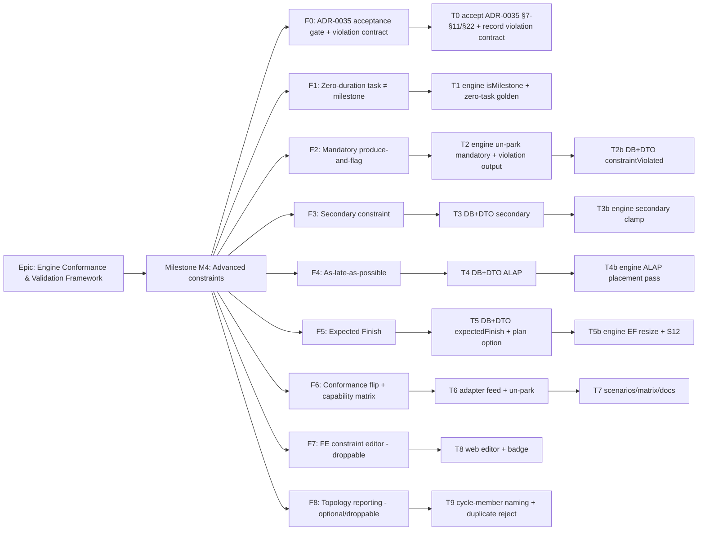

# Implementation Plan: M4 — Advanced constraints

- **Feature spec:** `docs/specs/engine-conformance-framework/M4-advanced-constraints-feature-spec.md`
- **Status:** Draft (awaiting approval)
- **Owner:** TBD

## Breakdown

### Epic

**Engine Conformance & Validation Framework** (ADR-0034) — prove and close the gap between
SchedulePoint's CPM/PDM engine and a P6-class fixture, one capability rung at a time.

### Milestone: M4 — Advanced constraints (shippable slice)

**Outcome:** a Planner can set a Mandatory Start/Finish that pins its date and is **flagged when it
breaks logic** (negative float on the predecessor, produced-not-repaired), a secondary constraint, an
Expected-Finish target, and an As-Late-As-Possible placement; a zero-duration task is scheduled as a
**task** (not coerced to a milestone). The conformance harness asserts each, makes **S12** a runnable
differential and satisfies **N10/N15**, moving the owning matrix rows to ✅ and replacing the silent
`parkedConstraintCount` with an honest `constraintViolationCount`.

**Complexity:** L (five small-to-medium engine slices, no axis rework) · **Dependencies:** M1 + M2 +
M5 (landed) · **Flag:** each engine slice ships behind the golden suite (byte-identical when its inputs
are absent); the settable fields are additive; only the FE editor needs `VITE_ADVANCED_CONSTRAINTS`.

---

#### Feature F0 — ADR-0035 acceptance gate + the violation-output contract (design gate)

> **Description:** move ADR-0035 **§7–§11 and §22** (and §12 N15) from Proposed → **Accepted** as this
> milestone lands them, and record the one contract addition — the engine-owned `constraintViolated`
> flag + `constraintViolationCount` replacing `parkedConstraintCount` — as an amendment note + a
> DECISIONS entry (no new standalone ADR; Q1).
> **Complexity:** S (writing) · gates F1–F6.
> **Dependencies:** none — but the violation-contract shape must be settled before F2 merges.
> **Risks:** the reviewer wants a standalone ADR for the violation contract → _mitigation:_ F0 is one
> PR; promoting it to an ADR is confined here.
> **Testing requirements:** n/a (docs); the clauses are proven by F1–F5's goldens/differentials.

##### Task 0 — Accept ADR-0035 clauses + record the violation contract (≈ one PR)

- **Description:** update ADR-0035 status/clauses to Accepted for §7–§11/§22 (mirroring how M2/M5
  accepted their clauses); add an amendment note on §7 describing `constraintViolated` +
  `constraintViolationCount` (+ `constraintWarningCount` for N15) as the produce-and-flag output; add
  a `docs/DECISIONS.md` entry for the violation flag, the ALAP boolean (Q3), and the plan-level
  Expected-Finish option (Q2).
- **Complexity:** S · **Dependencies:** —
- **Risks:** scope creep into M6 float/critical clauses → _mitigation:_ accept only the M4-owned clauses.
- **Testing:** n/a.
- **Development steps:**
  1. Edit ADR-0035 clause statuses (Accept §7–§11, §22; note §12 N15); add the §7 amendment note.
  2. Add the DECISIONS.md entries; cross-link the spec + capability matrix.
  3. If the reviewer elects a standalone ADR, author it here and add it to `CLAUDE.md` §16.

---

#### Feature F1 — Zero-duration task ≠ milestone (engine type-awareness)

> **Description:** distinguish a zero-duration `TASK` from a milestone by keying milestone-specific
> engine branches off **type**, not `duration === 0` (ADR-0035 §22). Smallest slice, no DB/DTO change.
> **Complexity:** S · **Dependencies:** F0.
> **Risks:** changing the project-finish tie-break subtly moves an existing plan's dates →
> _mitigation:_ the golden suite (byte-parity) + an explicit tie-break unit test; a plan with no
> zero-duration task is unaffected (a milestone stays keyed off type, a real task has duration > 0).
> **Testing requirements:** engine unit test (A7550-style zero-duration task has start = finish, is not
> coerced to a milestone, and loses the project-finish tie-break to a finish milestone at the same
> instant); full golden byte-parity.

##### Task 1 — `isMilestone` predicate + zero-task golden

- **Description:** add `isMilestone(type)` (START/FINISH_MILESTONE); replace the `duration === 0`
  milestone branches at `compute.ts` (project-finish tie-break `:360`, inclusive-finish display
  `:335`/`:336`, and the visual `:339`) with the type predicate where the milestone _semantics_
  (occupies its start instant) are intended, keeping `duration === 0` only where it is a pure
  arithmetic shortcut (finish = start when there is no work). Add a first-principles golden for a
  zero-duration task.
- **Complexity:** S · **Dependencies:** T0.
- **Risks:** conflating the two uses of `duration === 0` → _mitigation:_ document each branch; the
  golden + tie-break test pin the intent.
- **Testing:** `compute.zero-task.spec.ts` (zero-duration task start = finish, reported as task; a
  finish milestone at the same instant wins the project-finish tie-break); `goldens.spec.ts` byte-parity.
- **Development steps:**
  1. `engine/compute.ts`: add `isMilestone`; update the milestone-semantic branches.
  2. Add the golden + tie-break unit test; confirm byte-parity.
  3. Update the engine doc-comments; changeset.

---

#### Feature F2 — Mandatory produce-and-flag (the headline)

> **Description:** un-park `MANDATORY_*`; pin both passes as today **and** emit a per-activity
> `constraintViolated` when the pin contradicts logic (forward) or precedes the network-earliest
> finish (N10, backward), surfacing negative float on the predecessor; replace `parkedConstraintCount`
> with `constraintViolationCount` (+ `constraintWarningCount` for N15). Produce, never repair (§7/N10).
> **Complexity:** M · **Dependencies:** F0.
> **Risks:** (a) any date drift on non-mandatory plans; (b) the violation predicate mis-firing on a
> mandatory the network satisfies. _Mitigations:_ golden byte-parity; explicit "satisfiable ⇒ not
> flagged" test; keep the pin arithmetic identical to MSO/MFO (only add the _flag_).
> **Testing requirements:** engine unit tests (mandatory pin + flag + predecessor negative float; N10
> impossible pair produces two flagged pins with no repair; satisfiable mandatory ⇒ not flagged; N15
> warning; no-mandatory ⇒ byte-identical + `constraintViolationCount = 0`).

##### Task 2 — Engine: un-park mandatory + violation detection

- **Description:** in `constraints.ts`, stop mapping `MANDATORY_*` to `MSO`/`MFO` in
  `normaliseConstraint`; add a mandatory-aware clamp that pins and reports whether the pin overrode a
  stronger logic bound. In `compute.ts`, thread a per-activity `constraintViolated` (forward + backward
  detection), replace `isParkedMandatory`/`parkedConstraintCount` with the violation count, and add the
  N15 warning count. Add `constraintViolated` to `EngineResult` and the counts to `EngineSummary`.
- **Complexity:** M · **Dependencies:** T0.
- **Risks:** the forward/backward detection asymmetry → wrong flag on a satisfiable pin →
  _mitigation:_ detect a violation only when the pin is **more constraining in the wrong direction**
  than the strongest logic bound; unit-test both a satisfiable and an infeasible mandatory.
- **Testing:** `compute.mandatory.spec.ts` (all five cases above); `goldens.spec.ts` byte-parity.
- **Development steps:**
  1. `engine/types.ts`: add `constraintViolated: boolean` to `EngineResult`; add
     `constraintViolationCount`/`constraintWarningCount` to `EngineSummary` (drop `parkedConstraintCount`).
  2. `engine/constraints.ts`: mandatory-aware clamp (pin + report); retire `normaliseConstraint`'s
     mandatory mapping + `isParkedMandatory`.
  3. `engine/compute.ts`: detect + set `constraintViolated`; roll up the counts; N15 warning.
  4. Update engine doc-comments; unit tests + byte-parity.

##### Task 2b — Persist + expose `constraintViolated` (engine-owned) + summary counts

- **Description:** add the engine-owned `Activity.constraintViolated` column (CPM output) written by
  the recalc alongside the other engine columns; expose it read-only on `ActivityResponseDto` +
  `ActivitySummary`; surface the new summary counts on the recalc response + log (replace the parked
  count).
- **Complexity:** S · **Dependencies:** T2.
- **Risks:** `constraintViolated` accepted from a write DTO → tamper → _mitigation:_ it is not on any
  request DTO; a service/DTO test asserts it is engine-owned.
- **Testing:** migration up/down; `schedule.service.spec.ts` (recalc writes the flag + counts); DTO
  test (flag read-only); one API e2e (a mandatory-violating plan reports the flag).
- **Development steps:**
  1. `schema.prisma`: `constraintViolated Boolean @default(false)` (engine-owned comment); migration.
  2. `schedule.repository.ts`/write path: persist the flag; `ScheduleActivityRow` unaffected (input).
  3. `ActivityResponseDto`/`ActivitySummary`: expose read-only; recalc response/log carry the counts.
  4. database-architect + api-reviewer + security-reviewer passes; `docs/DATABASE.md`/`API.md`; changeset.

---

#### Feature F3 — Secondary constraint

> **Description:** a second (type, date) per activity — primary on the forward pass, secondary on the
> backward pass (ADR-0035 §10), reusing the existing clamp machinery.
> **Complexity:** M · **Dependencies:** F0; independent of F2 (parallel).
> **Risks:** the secondary applied on the wrong pass → wrong dates → _mitigation:_ a golden on A5200
> (SNET forward + FNLT backward) with both provably active.
> **Testing requirements:** DTO pairing tests; engine unit test (secondary clamps the backward pass
> only; primary-only unchanged); A5200 golden; no-secondary ⇒ byte-identical.

##### Task 3 — DB + DTO for the secondary constraint

- **Description:** add `secondaryConstraintType`/`secondaryConstraintDate` (mirror the primary) to
  `Activity`; the DTOs gain the paired fields with `IsConstraintPaired` applied to the secondary pair;
  add to `ActivityResponseDto` + `ActivitySummary`; select in the recalc load.
- **Complexity:** S · **Dependencies:** T0.
- **Risks:** the pairing rule only checking the primary → _mitigation:_ apply `IsConstraintPaired` to
  both secondary fields; DTO test.
- **Testing:** DTO spec (secondary pairing accept/reject); migration up/down.
- **Development steps:**
  1. `schema.prisma`: two nullable columns; migration (no data migration).
  2. Create/Update/Response DTOs + `ActivitySummary`: the paired fields.
  3. `schedule.repository.ts`: select the secondary in `loadActivities`/`ScheduleActivityRow`.
  4. database-architect + api-reviewer; `docs/DATABASE.md`/`API.md`; changeset.

##### Task 3b — Engine: secondary clamp on the backward pass

- **Description:** add `secondaryConstraintType`/`secondaryConstraintDate` to `EngineActivity`; run the
  `resolve`/clamp helpers a second time — primary via `clampForwardStart` (unchanged), secondary via
  `clampBackwardFinish`.
- **Complexity:** S · **Dependencies:** T3, F0.
- **Risks:** a secondary of a forward-only kind (SNET/FNET) silently ignored on the backward pass →
  _mitigation:_ documented as a no-op (matches the clamp table); unit-tested.
- **Testing:** `compute.secondary.spec.ts` + the A5200 golden; byte-parity.
- **Development steps:**
  1. `engine/types.ts`: add the secondary fields (documented: forward=primary, backward=secondary).
  2. `engine/constraints.ts`/`compute.ts`: apply the secondary on the backward clamp.
  3. Unit test + golden.

---

#### Feature F4 — As-late-as-possible

> **Description:** a per-activity `scheduleAsLateAsPossible` flag and a placement pass that sets the
> ALAP activity's display start as late as its successors allow, total float unchanged (ADR-0035 §11).
> **Complexity:** M · **Dependencies:** F0; independent of F2/F3.
> **Risks:** the ALAP placement leaking into the pure `early*`/`late*`/float → drift → _mitigation:_
> model it like the effective-Visual pass (a display-only pass that never writes the pure maps).
> **Testing requirements:** engine unit test (ALAP start = late-based placement; total float unchanged;
> project finish unmoved; ALAP off ⇒ unchanged); A9400 golden; free-float=0 noted as M6.

##### Task 4 — DB + DTO for ALAP

- **Description:** add `Activity.scheduleAsLateAsPossible Boolean @default(false)`; expose on the DTOs +
  `ActivitySummary`; select in the recalc load.
- **Complexity:** S · **Dependencies:** T0.
- **Risks:** — · **Testing:** DTO spec (boolean); migration up/down.
- **Development steps:**
  1. `schema.prisma`: the boolean column; migration.
  2. DTOs + `ActivitySummary`; `schedule.repository.ts` select.
  3. api-reviewer; `docs/DATABASE.md`/`API.md`; changeset.

##### Task 4b — Engine: ALAP placement pass

- **Description:** add `scheduleAsLateAsPossible` to `EngineActivity`; after the backward pass, place
  each ALAP activity's display start at its late-based position; keep the pure passes untouched. Decide
  the exposed early/display convention consistent with the effective-Visual model (documented).
- **Complexity:** M · **Dependencies:** T4, F0.
- **Risks:** interaction with a constraint on the same ALAP activity → _mitigation:_ the constraint
  bound wins where more constraining; unit-tested.
- **Testing:** `compute.alap.spec.ts` + A9400 golden; byte-parity.
- **Development steps:**
  1. `engine/types.ts`: the flag (documented as a placement preference, not a date constraint).
  2. `engine/compute.ts`: the placement pass (reuse the effective-Visual pattern).
  3. Unit test + golden; note the free-float assertion defers to M6.

---

#### Feature F5 — Expected Finish

> **Description:** recompute an in-progress activity's remaining duration to land on `expectedFinish`
> when the plan option `useExpectedFinishDates` is on (ADR-0035 §9); S12 flips it off.
> **Complexity:** M · **Dependencies:** F0; M2's progress/remaining model (landed).
> **Risks:** the resize fighting the data-date floor / a past target → _mitigation:_ floor at 0/the
> data date with a warning (reuse M2's N13/N15 flooring); unit-test a past target.
> **Testing requirements:** engine unit test (in-progress + expectedFinish + option on ⇒ finish = the
> expected instant; option off ⇒ logic-driven, differs; not-started/complete ⇒ no effect); A6200 golden;
> the S12 differential.

##### Task 5 — DB + DTO for expected-finish + the plan option

- **Description:** add `Activity.expectedFinish Date?`; add `Plan.useExpectedFinishDates Boolean
@default(false)`; DTOs (activity + `UpdatePlanDto`); thread the option through the recalculate
  contract like `progressMode`.
- **Complexity:** S · **Dependencies:** T0.
- **Risks:** the option not threaded into the engine call → _mitigation:_ service test asserts S12-style
  on/off differs.
- **Testing:** DTO spec (date + boolean); migration up/down.
- **Development steps:**
  1. `schema.prisma`: `expectedFinish` on Activity + `useExpectedFinishDates` on Plan; migration.
  2. DTOs + `ActivitySummary` + `UpdatePlanDto`; recalc option plumbing (`ComputeOptions`).
  3. database-architect + api-reviewer; `docs/DATABASE.md`/`API.md`; changeset.

##### Task 5b — Engine: expected-finish resize + S12

- **Description:** in the forward pass, when `useExpectedFinishDates` and an in-progress activity
  carries `expectedFinish`, recompute `remainingMinutes` so its early finish is the expected instant
  (rolled on its calendar), floored per M2; add `expectedFinishAppliedCount` to the summary/log.
- **Complexity:** M · **Dependencies:** T5, M2.
- **Risks:** double-counting with M2's remaining resolution → _mitigation:_ compute the EF remaining as
  an override of `resolveProgress`'s remaining, in one place; unit-test.
- **Testing:** `compute.expected-finish.spec.ts` + A6200 golden; the S12 differential in `scenarios.spec.ts`.
- **Development steps:**
  1. `engine/compute.ts` (+ `progress.ts` seam): the EF remaining override; the count.
  2. Unit test + golden; wire S12 (F6).

---

#### Feature F6 — Conformance flip + capability matrix (prove it)

> **Description:** feed the fixture's advanced constraints (un-park mandatory; feed secondary,
> expected-finish, ALAP), make S12 runnable, satisfy N10/N15, and flip the matrix rows.
> **Complexity:** M · **Dependencies:** F1–F5 (engine).
> **Risks:** over-claiming M6/M5-epic rows → _mitigation:_ flip only the five M4 rows; keep the rest ❌.
> **Testing requirements:** adapter spec (no more `secondary-constraint-dropped`/`AS_LATE` drop / parked
> mandatory note); scenarios spec (S12 runnable + `resultsDiffer(S12, S02)`); negative spec (N10 two
> flagged pins; N15 warning); the per-constraint goldens.

##### Task 6 — Adapter: feed the advanced constraints

- **Description:** `type-map.ts` maps `AS_LATE_AS_POSSIBLE` → the ALAP flag (was unsupported);
  `adapter.ts` feeds `secondary_constraint`, `expected_finish` (+ the plan option), and stops emitting
  the mandatory "parked" degradation + the secondary/ALAP drop notes; A7550 carries a task golden.
- **Complexity:** M · **Dependencies:** F1–F5.
- **Risks:** fixture constraint variants unmapped → _mitigation:_ exhaustive map + a test over the
  fixture's constraint set.
- **Testing:** `adapter.spec.ts` (advanced constraints carried; notes removed); the goldens.
- **Development steps:**
  1. `conformance/type-map.ts`: map `AS_LATE_AS_POSSIBLE`; remove the un-parked mandatory reason wording.
  2. `conformance/adapter.ts`: feed secondary/EF/ALAP; drop the obsolete degradation notes; add goldens.

##### Task 7 — Scenarios, negatives, matrix & docs

- **Description:** flip S12 to runnable; assert N10/N15; move the capability-matrix rows; replace the
  `parkedConstraintCount` wording with `constraintViolationCount`.
- **Complexity:** S · **Dependencies:** T6.
- **Risks:** matrix drift → _mitigation:_ update in the same PR (matrix rule, ADR-0034 §8).
- **Testing:** `scenarios.spec.ts` (S12 runs, differs from S02); `negative.spec.ts` (N10/N15).
- **Development steps:**
  1. `conformance/scenarios.ts`: `S12_EXPECTED_FINISH_OFF.runnable = true` (+ the on/off wiring).
  2. `CAPABILITY_MATRIX.md`: Mandatory / Expected finish / Secondary / ALAP / Zero-duration-task rows
     ❌ → ✅ (ALAP notes free-float=0 is M6); S12 runnable; N10 ✅, N15 warning; update the summary counts.
  3. `docs/DECISIONS.md` already updated in T0; changeset (docs/tests).

---

#### Feature F7 — FE constraint editor (recommended, droppable — behind `VITE_ADVANCED_CONSTRAINTS`)

> **Description:** a secondary-constraint pair, an ALAP toggle and an expected-finish date on the
> activity editor; a plan-level Expected-Finish toggle; a violation badge on the activity list/detail.
> **Complexity:** M · **Dependencies:** T2b/T3/T4/T5 (response fields).
> **Risks:** one-off styling / colour-only badge → _mitigation:_ reuse the primary-constraint controls
>
> - a token `Badge` with icon + text.
>   **Testing requirements:** component tests (controls render, persist via the mutation; badge shows on
>   `constraintViolated`); **accessibility-reviewer** (labelled, keyboard, non-colour-only, WCAG 2.2 AA);
>   **ux-reviewer** (copy, states); **component-reviewer** (token/variant reuse).

##### Task 8 — Web editor + violation badge

- **Description:** extend the activity form schema + `ActivityEditor` with the secondary pair, ALAP
  switch and expected-finish date; add the plan toggle and the list/detail violation badge.
- **Complexity:** M · **Dependencies:** T2b, T3, T4, T5.
- **Risks:** — · **Testing:** `ActivityEditor.test.tsx`; a11y in the journey.
- **Development steps:**
  1. Schema + `ActivityEditor` controls (reuse the primary-constraint field components).
  2. Plan settings toggle; list/detail badge (icon + text).
  3. component/accessibility/ux review; changeset (minor).

---

#### Feature F8 — Topology reporting (optional/droppable — ADR-0035 §13/§14, matrix "M0 → M4")

> **Description:** sharpen the existing cycle/duplicate rejects — **name the cycle members** (N01/N03)
> and make the **duplicate-edge** an explicit reject (N04). No scheduling behaviour change.
> **Complexity:** S · **Dependencies:** F0. **Droppable** without affecting the constraint outcomes.
> **Risks:** — · **Testing:** structural/negative specs (N01/N03 name members; N04 rejects with the pair).

##### Task 9 — Cycle-member naming + duplicate reject

- **Description:** extend the DAG/topo validator to report the cycle's exact members (including SS/FF-only
  cycles) and confirm the duplicate-edge reject names the ordered pair.
- **Complexity:** S · **Dependencies:** T0.
- **Testing:** `negative.spec.ts` (N01/N03/N04); `structural` validator test.
- **Development steps:**
  1. Graph/validator: collect + report cycle members; confirm the duplicate reject message.
  2. Update `CAPABILITY_MATRIX.md` N01/N03/N04 rows; changeset.

## Sequencing & slices

1. **T0 (F0)** — the acceptance gate; the violation-contract shape settles before F2 merges.
2. **T1 (F1 zero-task)** — smallest, no DB; lands first behind byte-parity. `main` stays releasable.
3. **F2–F5 are independent engine slices, parallelizable** — each ships behind the golden suite
   (byte-identical when its inputs are absent) and is its own differential/golden:
   - **F2 mandatory** (the headline) → T2 → T2b.
   - **F3 secondary** → T3 → T3b.
   - **F4 ALAP** → T4 → T4b.
   - **F5 expected-finish** (needs M2) → T5 → T5b.
     Each is one-to-two PRs (DB/DTO then engine), user-valuable on its own (a new constraint the planner
     can set and see recalculated).
4. **F6 (conformance)** — after the engine slices land; flips S12, satisfies N10/N15, moves the matrix.
5. **F7 (FE editor)** — last, lowest-risk, behind `VITE_ADVANCED_CONSTRAINTS`; droppable.
6. **F8 (topology reporting)** — optional; land any time after T0; droppable.

Only the FE editor needs a flag; every engine slice is gated by the goldens and the API fields are
additive.

## Definition of Done (per task)

Each task's PR satisfies the Feature Completion Criteria in `docs/PROCESS.md` (code, tests ≥ 80% on
changed code, docs, security review, performance, accessibility for UI, Docker build, CI green,
changeset, version impact). Milestone-level: ADR-0035 §7–§11/§22 Accepted; a Mandatory constraint pins

- flags with predecessor negative float (N10 satisfied, no auto-repair); a secondary constraint clamps
  the backward pass; Expected Finish resizes remaining and S12 is a runnable differential; ALAP places
  late with total float unchanged; a zero-duration task is scheduled as a task; the five matrix rows are
  ✅; `parkedConstraintCount` is replaced by `constraintViolationCount`; the full golden suite is
  byte-identical on the no-advanced-constraint path; recalc perf budget holds @ 2 000 activities.

## Risks & assumptions (rollup)

| Risk / assumption                                                                                     | Likelihood | Impact | Mitigation                                                                                       |
| ----------------------------------------------------------------------------------------------------- | ---------- | ------ | ------------------------------------------------------------------------------------------------ |
| Un-parking mandatory or the zero-task tie-break drifts the default path from the goldens              | med        | high   | each slice is a no-op when its inputs are absent → byte-identical; run the full golden suite     |
| Mandatory violation predicate mis-fires on a satisfiable pin                                          | med        | high   | flag only when the pin overrides a stronger logic bound; explicit satisfiable-vs-infeasible test |
| Secondary applied on the wrong pass → wrong dates                                                     | med        | med    | A5200 golden with both primary (forward) and secondary (backward) provably active                |
| ALAP placement leaks into the pure `early*`/`late*`/float                                             | med        | med    | model as a display-only pass (the effective-Visual pattern); pure maps never written             |
| Expected-Finish resize double-counts with M2's remaining resolution                                   | med        | med    | compute the EF remaining as a single override of `resolveProgress`; unit test; floor per M2      |
| `constraintViolated`/counts tampered via a write DTO                                                  | low        | med    | engine-owned; not on any request DTO; DTO/service test asserts read-only                         |
| Over-claiming M6 (free float / longest path) or M5-epic (LOE/resource/WBS) rows                       | med        | low    | flip only the five M4 rows; ALAP notes free-float=0 completes in M6                              |
| **Assumption:** M1 + M2 + M5 fully landed (minute/instant axis, progress/remaining, per-activity cal) | —          | —      | verified in engine/service/schema before planning                                                |
| **Assumption:** the violation-output contract needs no standalone ADR (Q1)                            | —          | —      | default recorded in ADR-0035 §7 amendment + DECISIONS; promotable in F0 if the reviewer prefers  |
