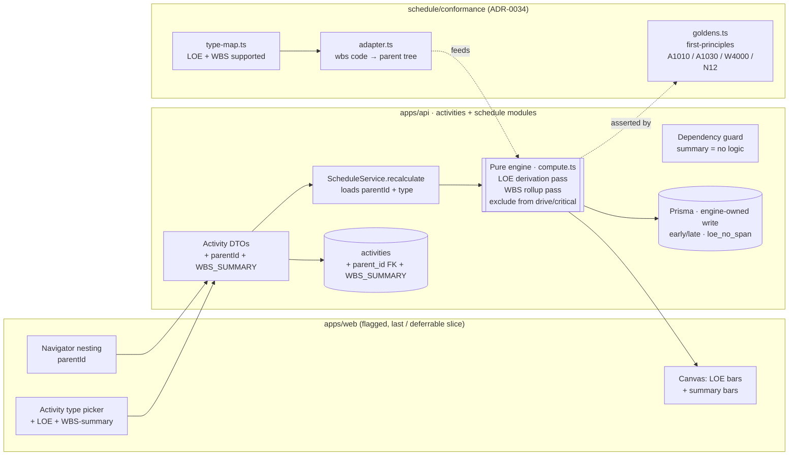
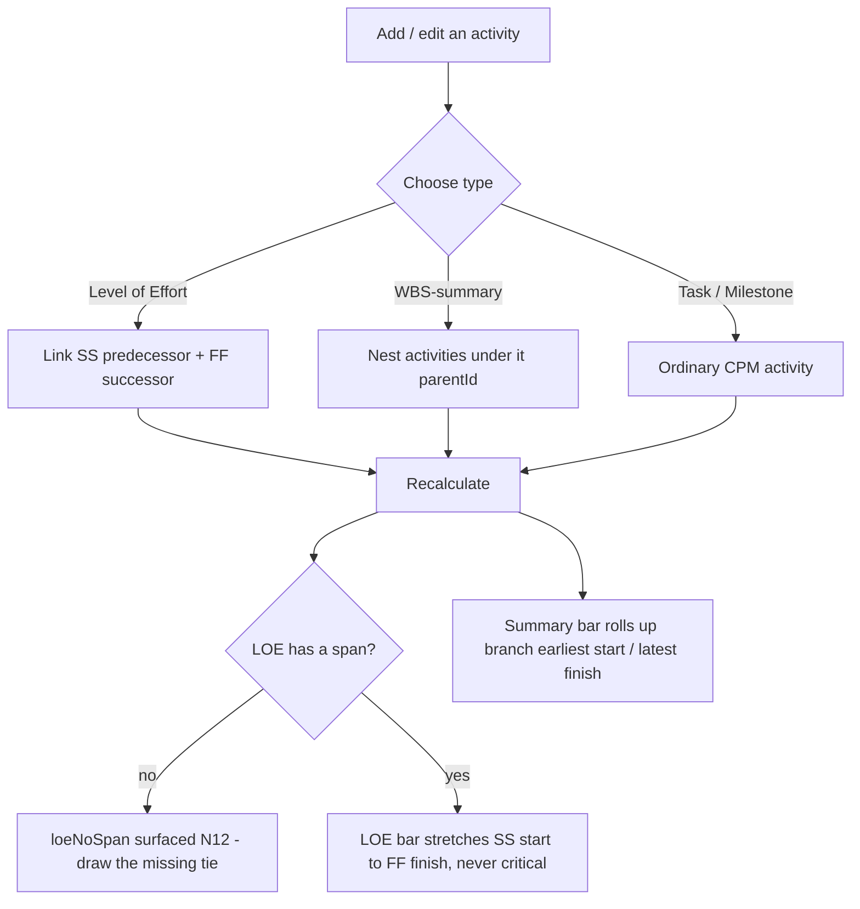

# Feature Spec: M5-epic — Advanced activity types (ADR-0035 §21 LOE, §24 WBS-summary)

- **Status:** Draft (awaiting approval)
- **Author(s):** feature-analyst (with James Ewbank)
- **Date:** 2026-07-17
- **Tracking issue / epic:** Engine conformance & validation framework (ADR-0034) — capability milestone **M5-epic** (Advanced activity types)
- **Roadmap link:** `docs/specs/engine-conformance-framework/CAPABILITY_MATRIX.md` (rows: _Level of effort_ `type_loe`/`loe_*`; _WBS-summary rollup_ `type_wbs_summary`; negative case **N12** _LOE with no span_). The _Resource-dependent scheduling_ row is **left untouched — see "Out of scope" below**.
- **Related ADR(s):** **ADR-0035 §21 + §24** (this milestone _builds and Accepts_ those two clauses; §23 stays Proposed); ADR-0034 (conformance methodology); **ADR-0038 (NEW — WBS activity hierarchy)** proposed by this milestone; ADR-0022 (recalc/persistence write contract); ADR-0021 (dependency DAG invariant — orthogonal to the WBS tree); ADR-0037 (per-activity calendars / own-calendar float); ADR-0016 (tenancy & scoping).

> **This milestone writes two of the three "advanced activity type" behaviours ADR-0035 already decided.** The
> semantics (§21 Level of Effort, §24 WBS-summary) are pre-approved and P6-aligned; nothing here re-litigates
> them. The job is to build LOE duration-from-span (never-drive / never-critical / never-negative-float, N12),
> and WBS-summary date rollup over an activity branch — and to flip the conformance rows `type_loe`,
> `type_wbs_summary` and negative case **N12** from ❌/🟡 to ✅, moving ADR-0035 §21 and §24 to **Accepted**.
>
> **§23 Resource-dependent scheduling is explicitly OUT OF SCOPE** — it needs a resource model that does not
> exist yet (there is no resource/units entity, no resource-calendar assignment). Its capability-matrix row
> and the `RESOURCE_DEPENDENT` mapping stay exactly where they are. See "Out of scope" below.

---

## Out of scope (called out deliberately)

**§23 Resource-dependent scheduling is deferred:** an activity that schedules on its _resource's_ calendar
requires a resource entity, resource-calendar assignment, and a units model — none of which exist in the schema
today (verified: no `Resource`/`ResourceAssignment` model, no `res_*` columns). Building it here would mean
inventing the whole resource dimension, which the roadmap parks at M7. The capability-matrix row
_Resource-dependent scheduling_ (`type_resource_dependent`, `res_calendar_drives`, `res_driving`) and the
`mapActivityType('RESOURCE_DEPENDENT') → unsupported` verdict are **left unchanged**; ADR-0035 §23 stays
**Proposed**. One-line reason for the record: _no resource model exists; deferred to the resource epic (M7)._

---

## 1. Business understanding

### Problem

Construction planners model two activity types that do **not** behave like ordinary tasks, and SchedulePoint's
engine cannot represent either today (both are `mapActivityType → unsupported` in the conformance adapter, and
both fail their fixture rows):

- **Level of Effort (LOE)** — sustaining work whose duration is **not planned** but **derived** from the work
  it supports: site management, QA/QC surveillance, HSE, scaffolding, project controls. An LOE _stretches_ from
  the start of its first supported activity (an **SS** predecessor) to the finish of its last (an **FF**
  successor). It must **never drive** a successor, **never appear on the critical path**, and **never inherit
  negative float** from a downstream constraint (e.g. a Finish-No-Later-Than). Reporting an LOE as critical, or
  letting it push a successor, is simply wrong — it is a passenger, not a driver. Fixture: `A1010` (spans the
  whole project), `A1020`, `A1030` (on a different calendar from its span ends), `A1040`, `A3100`; markers
  `type_loe`, `loe_spans_project`, `loe_different_calendar_to_span_ends`.
- **WBS-summary** — a roll-up bar for a Work Breakdown Structure branch (e.g. "CWA-100 Civils"), whose dates are
  the **earliest start and latest finish of everything in that branch**. A summary **carries no logic** (it has
  no relationships, drives nothing, is never critical); it is a reporting aggregate. Fixture: `W4000` (WBS
  `TT.4`), `W5000` (`TT.5`), `W7000` (`TT.7`); marker `type_wbs_summary`. The fixture note is explicit: _"Dates
  derived from earliest start / latest finish of all activities in WBS TT.4 and below. No relationships."_

These are the last two **activity-type** rows on the conformance capability matrix that are in scope for the
current ladder (calendars, lag, progress, constraints, float & critical have all landed). Closing them takes
the engine to documented P6-class parity on the activity types construction planners actually use, and Accepts
ADR-0035 §21/§24.

A structural gap sits underneath the WBS work: **SchedulePoint has no activity hierarchy.** Activities are flat
leaves of `Client → Project → Plan → Activity` (verified in `schema.prisma` — no self-referencing parent, no
WBS column, no grouping). WBS-summary rollup needs a **branch/parent relationship**, so this milestone must
introduce one. That is the milestone's biggest design decision and requires an ADR (proposed **ADR-0038**) and
the **database-architect**.

### Users

| Persona                             | Organisation role (ADR-0012/0016) | Need                                                                                                                                                |
| ----------------------------------- | --------------------------------- | --------------------------------------------------------------------------------------------------------------------------------------------------- |
| **Planner**                         | `PLANNER`                         | Model LOE (sustaining) activities that derive their span and never distort the critical path; group activities under WBS-summary bars that roll up. |
| **Org Admin**                       | `ORG_ADMIN`                       | Same, plus governance over plan structure.                                                                                                          |
| **Contributor / Viewer**            | `CONTRIBUTOR` / `VIEWER`          | Read a schedule where LOE bars stretch correctly and summary bars aggregate — no structural edits.                                                  |
| **Engine / conformance maintainer** | (engineering)                     | Prove LOE + WBS behaviour against the fixture (goldens + differential), flip the capability rows/negatives, self-baseline (ADR-0034).               |

### Primary use cases

1. **Model a Level-of-Effort activity** whose duration derives from its SS-predecessor's start to its
   FF-successor's finish, and have the engine schedule it as a passenger (no driving, no criticality, no
   negative float).
2. **Model a WBS-summary activity** that groups a branch of activities and whose dates roll up from that
   branch's earliest start / latest finish.
3. **Recalculate** a plan containing LOE and/or WBS-summary activities and read the correct derived/rolled-up
   dates alongside the ordinary CPM output.
4. **See the LOE "no span" case surfaced** (an LOE missing an SS-predecessor or FF-successor) rather than
   silently mis-scheduled.
5. **(Engine/conformance)** run the fixture's LOE and WBS activities as goldens/differentials, flipping the
   matrix rows and N12.

### User journeys

**Happy path (LOE).** A Planner adds an activity, sets its type to **Level of Effort**, and links it SS to the
activity it starts alongside and FF to the activity it finishes alongside. On recalculation the LOE bar
stretches to span those two endpoints; it is never flagged critical and never pushes its successors. If the
Planner has not yet drawn both span links, the LOE is flagged **no span** (surfaced, not silently zero-length).

**Happy path (WBS-summary).** A Planner creates a **WBS-summary** activity and nests ordinary activities under
it (parent/child). On recalculation the summary's start/finish roll up to the earliest start / latest finish of
its descendants; the summary carries no logic and is never critical. Nesting an activity under a summary later
re-rolls the summary on the next recalc.

**Engine/conformance journey.** The maintainer flips `mapActivityType` so LOE and WBS-summary become supported,
maps the fixture's `wbs` codes into the engine's branch grouping, adds first-principles goldens for the LOE span
and the WBS rollup, flips the capability rows and N12, and moves ADR-0035 §21/§24 to Accepted — with the
all-inherit / no-LOE / no-summary path staying byte-identical (parity gate).

See the user-flow diagram in §4.

### Expected outcomes

- Planners can model **sustaining (LOE)** and **summary (WBS)** activities the way P6/Asta let them, without
  corrupting the critical path or the driving logic.
- The engine gains a general **activity hierarchy** (parent/child), unblocking future grouping/reporting work.
- Conformance rows `type_loe`, `type_wbs_summary` and negative case **N12** flip to ✅; ADR-0035 §21 + §24 move
  to **Accepted** under M5-epic.

### Success criteria

- **LOE span (`A1010`/`loe_spans_project`):** the LOE's early/late start equal its SS-predecessor's start and
  its early/late finish equal its FF-successor's finish; its total float is **≥ 0** and it is **not** critical,
  even when a downstream constraint drives negative float onto the network.
- **LOE never drives (`type_loe`):** removing/adding an LOE never changes any non-LOE activity's dates
  (an LOE's outgoing edges are non-driving; its successors are computed as if the LOE were absent).
- **LOE cross-calendar (`A1030`/`loe_different_calendar_to_span_ends`):** an LOE on `CAL-02` spanning ends on
  `CAL-01`/`CAL-03` derives its span endpoints correctly (dates taken from the span-end activities; own-calendar
  float measurement per ADR-0037).
- **N12 (LOE with no span):** an LOE missing an SS-predecessor or an FF-successor is **flagged** (engine-owned
  `loeNoSpan` + a plan-level count) and the structural validator continues to warn — never a silent zero-length
  bar, never a crash.
- **WBS rollup (`W4000`/`type_wbs_summary`):** the summary's start = min(descendant early starts) and finish =
  max(descendant late/early finishes) of its branch; the summary is **not** critical and has **no** driving
  edges.
- **Parity gate:** a plan with no LOE and no WBS-summary (every activity a plain TASK/milestone) is
  **byte-identical** to the pre-milestone output across all prior goldens and scenarios (S01–S13).
- All new engine code has **first-principles** goldens (no external oracle, ADR-0034), ≥ 80% coverage on
  changed code.

### Open questions

The genuinely design-changing ones are surfaced for approval in the implementation plan's **"Critical questions
for approval"**. Defaults are stated inline below and in §4 so work is not blocked. In brief, the three that
change scope/design are: (1) the **WBS hierarchy schema model** (self-referencing `parentId` FK vs a
materialized `wbsCode` path vs engine-only proof); (2) **how much of the product surface** (schema + API + web)
ships in this milestone vs. an engine+conformance proof with the UX as a follow-on; (3) the **N12 contract**
(produce-and-flag vs. boundary reject). Recommended defaults: adjacency-list `parentId` FK + a new
`WBS_SUMMARY` enum member (ADR-0038); ship schema + engine + conformance now with the web summary/LOE rendering
behind a flag as the last, deferrable slice; and **produce-and-flag** `loeNoSpan` in the engine (mirroring M4's
`constraintViolated`), keeping the boundary permissive.

---

## 2. Functional requirements

### User stories & acceptance criteria

> **US-1 (LOE duration-from-span)** — As a **Planner**, I want a Level-of-Effort activity's duration to derive
> from its SS-predecessor's start to its FF-successor's finish, so that sustaining work stretches to cover the
> work it supports without my maintaining its duration by hand.
>
> **Acceptance criteria**
>
> - **Given** an LOE with an SS predecessor `P` and an FF successor `S` **when** I recalculate **then** the
>   LOE's early start = `P`'s early start (via the SS tie + lag) and its early finish = `S`'s early finish (via
>   the FF tie + lag); its late dates coincide with its early dates (float ≥ 0).
> - **Given** an LOE with several SS predecessors / FF successors **then** its start = the **earliest** SS-driven
>   start and its finish = the **latest** FF-driven finish across those ties (it spans them all).
> - **Given** an LOE on a different calendar from its span ends (`A1030`) **then** its dates are taken from the
>   span-end activities and its float is measured on its **own** calendar (ADR-0037).

> **US-2 (LOE never drives / never critical / never negative float)** — As a **Planner**, I want an LOE to be a
> passenger, so that it never distorts the critical path or pushes other work.
>
> **Acceptance criteria**
>
> - **Given** any plan **when** I recalculate **then** every edge **out of** an LOE is **non-driving**, and no
>   non-LOE activity's dates depend on the LOE (adding/removing an LOE leaves the rest of the schedule
>   byte-identical).
> - **Given** any critical definition (`TOTAL_FLOAT` or `LONGEST_PATH`) **then** an LOE is **never** `isCritical`
>   and never on the longest path.
> - **Given** a downstream FNLT that drives negative float onto the driving chain **then** the LOE's total float
>   is **floored at 0** (never negative), independent of the chain it spans.

> **US-3 (LOE no-span, N12)** — As a **Planner**, I want to be told when an LOE has no resolvable span, so that I
> notice an incomplete model instead of getting a silently wrong bar.
>
> **Acceptance criteria**
>
> - **Given** an LOE with **no** SS predecessor **or** **no** FF successor **when** I recalculate **then** the
>   activity is flagged `loeNoSpan` (engine-owned) and counted in a plan-level `loeNoSpanCount`; it is placed at
>   a defined fallback (its SS start if present else the data date; zero length if neither end resolves) and is
>   never critical.
> - **Given** the structural conformance validator **then** it continues to report N12 (`type_loe` with no span)
>   as a warning; the two signals agree.
> - **Given** the API boundary **then** an LOE without a span is **not rejected** (a Planner may draw the span
>   links after creating the activity) — the default; see the N12 critical question.

> **US-4 (WBS-summary rollup)** — As a **Planner**, I want a WBS-summary activity's dates to roll up from its
> branch, so that a summary bar reflects the span of the work beneath it.
>
> **Acceptance criteria**
>
> - **Given** a WBS-summary with descendant activities **when** I recalculate **then** its start = the
>   **earliest** descendant start and its finish = the **latest** descendant finish (over the transitive branch,
>   leaves only contribute their own dates; nested summaries roll up bottom-up).
> - **Given** a WBS-summary **then** it has **no** driving edges, is **never** critical, and its total/free float
>   are not meaningful (reported as 0/undefined per the documented convention).
> - **Given** a WBS-summary with **no** descendants **then** it has an empty rollup (defined convention: collapses
>   to the data date / flagged empty), never a crash.

> **US-5 (Summaries & LOE carry no invalid logic)** — As a **Planner**, I want the system to prevent a
> WBS-summary from carrying relationships, so that summaries stay pure aggregates (§24).
>
> **Acceptance criteria**
>
> - **Given** an attempt to create a dependency where either endpoint is a `WBS_SUMMARY` **then** it is rejected
>   with a clear error (summaries carry no logic).
> - **Given** an LOE **then** it **may** be a dependency endpoint (it needs SS/FF ties to derive its span) — this
>   is allowed.

> **US-6 (Conformance)** — As an **engine maintainer**, I want the fixture's LOE and WBS-summary activities to
> become runnable goldens/differentials, so that each behaviour is proven wired.
>
> **Acceptance criteria**
>
> - `mapActivityType('LEVEL_OF_EFFORT')` and `mapActivityType('WBS_SUMMARY')` become **supported**; the adapter
>   maps the fixture's `wbs` codes into the engine's branch grouping for summaries and feeds LOE SS/FF ties.
> - First-principles goldens assert the LOE span (`A1010`), the cross-calendar LOE (`A1030`), and the WBS rollup
>   (`W4000`); the capability rows `type_loe`, `type_wbs_summary` and negative case **N12** flip to ✅ in the same
>   PRs; ADR-0035 §21/§24 move to Accepted in the ledger.
> - `mapActivityType('RESOURCE_DEPENDENT')` stays **unsupported** (§23 out of scope).

### Workflows

1. **Set type → link/nest → recalc → read.** A Planner sets an activity's type (LOE or WBS-summary), then links
   the LOE's SS/FF ties or nests activities under the summary (validated DTO, pen-gated plan edit, ADR-0028).
   Recalculation (ADR-0022) loads activities (now including `parentId` and the type), the engine computes the
   leaf network, derives LOE spans and rolls up summaries, and the batched engine-owned write persists the CPM
   columns plus the new `loeNoSpan` flag (never touching `version`/`updated_at`). Reads return the persisted
   values.
2. **Conformance run.** The adapter maps the fixture into engine inputs (LOE via SS/FF, summaries via a
   `wbs`-code-derived parent tree), the engine runs, and goldens/differentials assert LOE span + WBS rollup.

### Edge cases

- **Empty plan / single LOE / single summary:** an LOE with no ties → N12 flagged; a summary with no descendants
  → empty-rollup convention; neither crashes.
- **LOE spanning across calendars (`A1030`):** dates from span ends; own-calendar float.
- **LOE with a downstream negative-float chain:** LOE float floored at 0.
- **Nested summaries (summary under summary):** roll up bottom-up over the transitive branch.
- **Cycle in the parent tree:** prevented (a node cannot be its own ancestor) — service guard + validation
  (distinct from the dependency DAG invariant, ADR-0021).
- **A WBS-summary or LOE that is a project-finish candidate:** a summary never sets the project finish (it is an
  aggregate); an LOE never sets it either (it is derived from others). The project-finish tie-break keys off
  real work + milestone type, unchanged (ADR-0035 §22).
- **All-inherit / no-LOE / no-summary plan:** every option/type absent ⇒ **byte-identical** to pre-milestone
  output (parity gate).

### Permissions (RBAC + resource scope, ADR-0012)

- **Create/update an activity's type, LOE ties, or WBS parent:** reuse the existing activity-write permission
  (`activity:update` / `activity:create`) + org scope; pen-gated (ADR-0028) like other plan mutations.
  Deny-by-default. The `parentId` (like `calendarId`) is client-settable but the same-org/same-plan check stays
  in the **service** (the FK alone does not enforce it).
- **Recalculate:** `schedule:calculate` (unchanged).
- **Read schedule (LOE spans, summary rollups, `loeNoSpan`):** `schedule:read` (every member).
- **No new permission is introduced.**

### Validation rules (shared client ↔ server where possible)

- `type ∈ {TASK, START_MILESTONE, FINISH_MILESTONE, HAMMOCK, LEVEL_OF_EFFORT, WBS_SUMMARY}` — `WBS_SUMMARY` is a
  **new** enum member (Prisma + `@repo/types`, kept in lock-step). `HAMMOCK` stays reserved/not newly selectable.
- `parentId`: optional uuid; must reference an activity **in the same plan** (service-checked), must not create a
  cycle in the parent tree, and a non-summary activity should only parent under a `WBS_SUMMARY` (documented rule;
  see the "grouping" question).
- **A `WBS_SUMMARY` may not be a dependency endpoint** (predecessor or successor) — rejected at the dependency
  write boundary (§24 "no logic").
- A `LEVEL_OF_EFFORT` **should** have at least one SS predecessor and one FF successor to resolve a span; missing
  either is **not** a write-time rejection (default) but is flagged at recalc (`loeNoSpan`, N12) and by the
  structural validator.
- New per-activity engine outputs (`loeNoSpan`) are **engine-owned** — never accepted from a write DTO (exactly
  like `total_float`/`is_critical`/`constraint_violated`).

### Error scenarios

| Scenario                                         | Detection                   | User-facing result           | Status  |
| ------------------------------------------------ | --------------------------- | ---------------------------- | ------- |
| Not a member of the org                          | authz scope check           | friendly forbidden           | 403     |
| Missing `activity:update` / `schedule:calculate` | permission check            | forbidden                    | 403     |
| Invalid `type` value                             | DTO (`class-validator`)     | inline validation error      | 400/422 |
| `parentId` in another plan/org                   | service scope check         | validation error             | 422     |
| `parentId` creates a parent-tree cycle           | service guard               | validation error             | 422     |
| Dependency endpoint is a `WBS_SUMMARY`           | dependency write validation | `SUMMARY_HAS_NO_LOGIC` error | 422     |
| LOE has no resolvable span (N12)                 | engine at recalc            | `loeNoSpan` flag (not error) | 200     |
| Recalc without a plan start (data date)          | existing guard              | `PLAN_START_REQUIRED`        | 422     |
| Not holding the edit pen on a plan mutation      | `assertHoldsPen` (ADR-0028) | locked                       | 423     |

---

## 3. Technical analysis

| Area           | Impact                                 | Notes                                                                                                                                                                                                                                                               |
| -------------- | -------------------------------------- | ------------------------------------------------------------------------------------------------------------------------------------------------------------------------------------------------------------------------------------------------------------------- |
| Frontend       | low (flagged, last / deferrable slice) | An activity-type picker offering **LOE** and **WBS-summary** (today it exposes only TASK + START/FINISH milestones), a nesting affordance in the navigator/tree, and canvas rendering of LOE bars + summary bars. Behind a `VITE_` flag.                            |
| Backend        | med                                    | `schedule` engine: `computeSchedule` gains an **LOE derivation pass** and a **WBS rollup pass**; LOE excluded from driving/critical/negative-float. `activities` module: `parentId` + type validation, summary-no-logic dependency guard.                           |
| Database       | med (**biggest decision**)             | **New `WBS_SUMMARY` enum member** + **new self-referencing `parentId` FK** (adjacency list) on `activities` (constant-default null, no data migration) + engine-owned `loe_no_span` boolean. Designed by **database-architect**; **ADR-0038**.                      |
| API            | low–med                                | Activity DTOs gain `parentId` and the new type; activity schedule read gains `loeNoSpan`; `PlanScheduleSummaryDto` may echo `loeNoSpanCount`. Dependency-create validation rejects summary endpoints. Follows `docs/API.md` envelopes.                              |
| Security       | low                                    | No new permissions; reuse `activity:*` / `schedule:*` + org scope; `parentId` same-org/plan checked in the service (anti-IDOR, like `calendarId`); engine-owned fields never client-writable.                                                                       |
| Performance    | med                                    | LOE derivation is O(V+E) reusing forward/backward maps; WBS rollup is O(V) bottom-up over the parent tree (build child index once; no N+1 — single plan-scoped activity load already includes `parentId`).                                                          |
| Infrastructure | none                                   | No new services/env.                                                                                                                                                                                                                                                |
| Observability  | low                                    | Log the LOE/summary/`loeNoSpan` counts on recalc (extend the existing structured recalc log).                                                                                                                                                                       |
| Testing        | high                                   | Engine unit goldens (first-principles) for LOE span, cross-calendar LOE, LOE-never-drives, N12, WBS rollup, nested summaries, empty summary; conformance differentials/goldens (`type_loe`, `type_wbs_summary`, N12); service + DTO tests; a11y for the flagged UI. |

### Dependencies

- **Prerequisite (in-milestone):** the **WBS hierarchy schema** (parentId FK + `WBS_SUMMARY` enum, ADR-0038)
  must land before the WBS rollup engine pass and its conformance proof. LOE has **no** schema prerequisite — the
  `LEVEL_OF_EFFORT` enum member already exists — so the LOE features can proceed first and independently.
- **Depends on already-landed work:** driving-edge output (M3), per-activity calendars / own-calendar float
  (ADR-0037, M5) for the cross-calendar LOE, the M6 critical-definition assembly (LOE/summary must be excluded
  from both `TOTAL_FLOAT` and `LONGEST_PATH` criticality), and the M4 produce-and-flag pattern (`constraintViolated`)
  which `loeNoSpan` mirrors.
- **Conformance harness:** `mapActivityType` flip + a `wbs`-code → parent-tree grouping in the adapter are
  prerequisites for the WBS golden; LOE reuses the existing SS/FF edge adaptation.
- **No third parties.** No external oracle (self-baselined goldens, ADR-0034).

---

## 4. Solution design

### Architecture overview

The change is concentrated in the **pure engine** (`apps/api/src/modules/schedule/engine/`) — two new passes
threaded into `computeSchedule` — plus a **schema/hierarchy** addition (`parentId` FK + `WBS_SUMMARY` enum), the
**service/DTO** thread, the **conformance harness** proof, and an optional **flagged web** slice. No new module.



### Data flow

```mermaid
sequenceDiagram
  participant P as Planner (web, flagged)
  participant API as ActivitiesController / ScheduleController
  participant S as ScheduleService
  participant E as Pure engine (compute.ts)
  participant DB as Prisma

  P->>API: PATCH activity { type: LEVEL_OF_EFFORT | WBS_SUMMARY, parentId }
  API->>DB: persist (pen-gated, optimistic-locked; parentId scope + no-cycle checked)
  P->>API: POST plan/schedule:recalculate
  API->>S: recalculate(principal, org, planId)
  S->>DB: lock plan + load activities (incl. parentId, type) + edges
  S->>E: computeSchedule(activities, edges, options)
  Note over E: forward/backward pass over leaf/task network\n(LOE outgoing edges excluded from bounds)\n→ LOE derivation pass (span from SS start … FF finish; float ≥ 0; loeNoSpan)\n→ WBS rollup pass (min start / max finish over descendants; no logic)
  E-->>S: results{ early/late, isCritical=false for LOE/summary, loeNoSpan } + summary{ loeNoSpanCount }
  S->>DB: batched engine-owned write (early/late, loe_no_span) — no version bump
  S-->>API: PlanScheduleSummary
  P->>API: GET plan activities schedule
  API-->>P: LOE bars stretched, summary bars rolled up, loeNoSpan surfaced
```

### User flow



### Database changes

Designed with the **database-architect** and recorded in **ADR-0038**. Additive, constant-default, no data
migration — mirroring the established engine-owned-column pattern (`total_float`, `constraint_violated`,
`free_float`).

**`ActivityType` enum** — add a member:

- `WBS_SUMMARY` (Prisma enum + `@repo/types` union, in lock-step). `LEVEL_OF_EFFORT` **already exists** — no
  change needed for LOE.

**`Activity`** (new hierarchy column + engine-owned output):

- `parentId String? @map("parent_id") @db.Uuid` — **self-referencing FK** (adjacency list) to `activities.id`,
  `onDelete: Restrict` (soft-delete owned by the hierarchy lifecycle service, like the plan/calendar FKs).
  Nullable ⇒ every existing row reads "no parent" and the byte-parity path is unchanged. Same-org/same-plan and
  no-parent-tree-cycle are **service-enforced** (the FK alone does not guarantee same-plan). Backed by a
  **partial index on `(parent_id) WHERE deleted_at IS NULL`** (raw SQL in the migration) for the "children of X"
  rollup load — this is a real query pattern (unlike `total_float`), so unlike the engine-owned columns it **is**
  indexed. A `ck_activities_parent_not_self` (parent_id IS NULL OR parent_id <> id) CHECK is raw SQL in the
  migration; deeper cycles are the service guard's job.
- `loeNoSpan Boolean @default(false) @map("loe_no_span")` — **engine-owned** exactly like `constraint_violated`:
  defaulted false, never accepted from a write DTO, written only by the recalc's batched `unnest` UPDATE (never
  touching `version`/`updated_at`/`updated_by`, ADR-0022). No index (aggregated over the plan-scoped load into
  `loeNoSpanCount`).

LOE derived dates and the summary rollup dates fill the **existing** engine-owned CPM columns
(`early_start`/`early_finish`/`late_start`/`late_finish`), whose meaning for these types is "derived span" /
"rolled-up branch span"; `is_critical` is always false for them. **No `wbsCode` column** is added to the product
schema (the fixture's `wbs` code is a conformance-only concept mapped to `parentId` in the adapter) — see the
schema critical question.

### API changes

- **Activity create/update DTOs** gain `parentId` (uuid, optional) and allow `type = WBS_SUMMARY`; validated by
  `class-validator`; echoed on the activity response DTO + `@repo/types`.
- **Activity schedule read** gains `loeNoSpan` (boolean, engine-owned, like `constraintViolated`).
- **Dependency create** rejects an edge whose predecessor or successor is a `WBS_SUMMARY`
  (`SUMMARY_HAS_NO_LOGIC`, 422).
- **`PlanScheduleSummaryDto`** may echo `loeNoSpanCount` (observability), alongside the existing
  `constraintViolationCount` family.
- No new endpoint family. Review with the **api-reviewer** and **security-reviewer** agents.

### Component changes (frontend — flagged, last / deferrable slice)

- The **activity-type picker** (today TASK + START/FINISH milestones only) gains **Level of Effort** and
  **WBS-summary** options, behind `VITE_ADVANCED_ACTIVITY_TYPES`. Semantic tokens + shadcn/ui + CVA; no one-off
  styling; full loading/empty/error/success states.
- A **nesting affordance** in the Project Explorer / activity tree to set `parentId` (drag-to-nest or a
  "move under…" action, reusing the APG `Menu`/`tree` primitives, ADR-0029) — flagged.
- **Canvas rendering:** LOE bars (a distinct "span" bar style) and summary bars (a bracket/roll-up style) on the
  TSLD canvas (ADR-0026/0030). This is the largest FE piece and is **deferrable** — the engine/API can land
  without it. Review any UI with **ux-reviewer**, **component-reviewer**, **accessibility-reviewer**.

### Implementation approach & alternatives

**Chosen approach — two new engine passes over the existing network, a general adjacency-list hierarchy for WBS,
LOE via its existing SS/FF edges, and produce-and-flag for N12.**

1. **LOE as a post-network derivation pass, not a driver.** The forward/backward passes run over the network
   with **LOE outgoing edges excluded from the bound computation** of non-LOE activities (an LOE never drives its
   successor's dates). After the passes, a dedicated loop derives each LOE's start = the earliest bound from its
   **SS** predecessors (via the existing `forwardLowerBound`) and its finish = the latest bound from its **FF**
   successors' finishes; its late dates are pinned to its early dates so total float ≥ 0. This keeps LOE a pure
   passenger and reuses the existing edge arithmetic (`forwardLowerBound`/`backwardUpperBound`).
2. **LOE excluded from criticality and driving** in the `isCritical`/`onLongestPath`/edge-driving assembly (M6):
   an activity of type `LEVEL_OF_EFFORT` is never critical, never on the longest path, and its outgoing edges are
   never `isDriving`. Its total float is floored at 0.
3. **N12 = produce-and-flag** (`loeNoSpan`), mirroring the M4 `constraintViolated`/§7 contract: the engine
   produces a defined fallback placement and sets an engine-owned boolean + a plan-level `loeNoSpanCount`, never
   rejecting at the boundary (a Planner may draw the span links after creating the LOE) and never crashing. The
   existing structural validator's N12 warning stays.
4. **WBS-summary via a general adjacency-list hierarchy** (`parentId` FK) — the standard, Prisma-friendly,
   relationally-clean model. The engine gains `parentId` on `EngineActivity`; after the leaf schedule is
   computed, a **bottom-up rollup pass** sets each summary's start = min(descendant starts) and finish =
   max(descendant finishes) over its transitive branch (leaves contribute their own dates; nested summaries roll
   up first). Summaries carry no logic: they may not be dependency endpoints (validation), have no driving edges,
   and are never critical.
5. **Conformance maps the fixture's `wbs` code path into `parentId`** in the adapter (deriving the parent tree
   from the code prefixes), and flips `mapActivityType` for LOE + WBS. LOE reuses the existing SS/FF edge
   adaptation. First-principles goldens assert `A1010` (span), `A1030` (cross-calendar), `W4000` (rollup) and
   N12.
6. **Parity gate:** with no LOE and no summary, the two new passes are no-ops and every prior golden/scenario is
   byte-identical.

**Alternatives considered.**

- **Materialized `wbsCode` path column** (e.g. `TT.4.1`) instead of a `parentId` FK. Matches the fixture and
  makes prefix rollup trivial, but bakes a string-encoded tree into the product schema (hard to reparent, no
  referential integrity, ordering/renumbering pain). Rejected for the product model in favour of an adjacency
  list; the fixture's `wbs` code stays a **conformance-only** input mapped to `parentId` in the adapter. _(This
  is the schema critical question — the human may prefer the path model.)_
- **Model WBS-summary as an existing grouping (none exists).** There is no plan-internal grouping today, so this
  is not available — hence the new hierarchy.
- **LOE as an ordinary activity with a "derive duration" flag rather than a type.** Rejected: the fixture and P6
  treat LOE as an activity **type** with distinct driving/criticality rules; the type already exists in the enum.
- **N12 as a hard boundary reject.** Rejected as the default: it would block saving an LOE before its span links
  are drawn (a normal authoring order) and diverges from the M4 produce-and-flag precedent. _(Surfaced as a
  critical question.)_
- **Engine takes the WBS tree as a separate grouping input rather than `parentId` on the activity.** Rejected:
  `parentId` on the activity is the persisted model and keeps the engine input a straight projection of the row.

**Architectural significance / ADR.** The LOE + WBS-summary **semantics** are already governed by ADR-0035
§21/§24 (this milestone Accepts them — **no new semantics ADR**). But introducing a **general activity
hierarchy** (`parentId` FK, a new structural relationship distinct from the dependency graph and the
Client→Project→Plan tree) **is architecturally significant** and warrants **ADR-0038 (WBS activity hierarchy)** —
capturing the adjacency-list-vs-path choice, the parent-tree acyclicity invariant, the same-plan scoping rule,
the summary "no logic" constraint, and the interaction with soft-delete/cascade and the dependency DAG
(ADR-0021). **Draft ADR-0038 outline** (problem: no hierarchy exists, WBS needs a branch; options:
adjacency-list `parentId` FK vs materialized `wbsCode` path vs engine-only; decision: adjacency list + new enum
member; invariants: parent tree acyclic, same-plan, summaries carry no logic; consequences: unblocks
grouping/reporting, new lifecycle/cascade edge, a follow-on for tree UI). Write it with the **database-architect**
before the migration.

## 5. Links

- Implementation plan: `docs/specs/engine-conformance-framework/M5-epic-advanced-activity-types-implementation-plan.md`
- Governing ADR: `docs/adr/0035-schedulepoint-cpm-semantics.md` (§21, §24) — move to Accepted under M5-epic;
  §23 stays Proposed (out of scope).
- New ADR (proposed): `docs/adr/0038-wbs-activity-hierarchy.md` (to be drafted with database-architect).
- Capability matrix (rows to flip): `docs/specs/engine-conformance-framework/CAPABILITY_MATRIX.md` — `Level of
effort`, `WBS-summary rollup`, negative case N12. **Leave** `Resource-dependent scheduling` unchanged.
- Conformance harness: `apps/api/src/modules/schedule/conformance/{type-map.ts,adapter.ts,goldens.ts,scenarios.ts}`.
- Engine: `apps/api/src/modules/schedule/engine/{compute.ts,types.ts,graph.ts,constraints.ts}`.
- Prior-art specs to mirror: `M4-advanced-constraints-*.md` (produce-and-flag), `M6-float-and-critical-*.md`
  (plan-option/engine spine).
