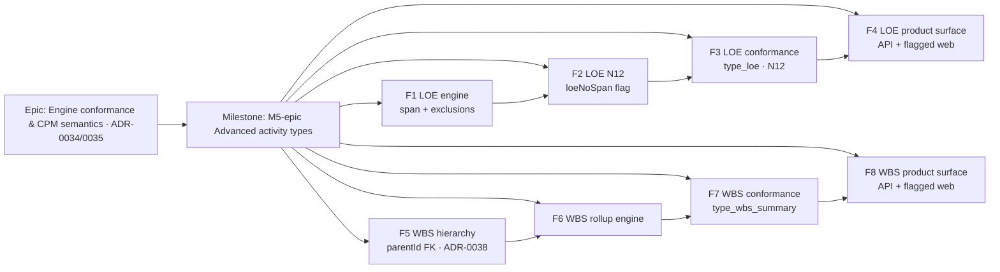

# Implementation Plan: M5-epic — Advanced activity types (ADR-0035 §21 LOE, §24 WBS-summary)

- **Feature spec:** `docs/specs/engine-conformance-framework/M5-epic-advanced-activity-types-feature-spec.md`
- **Status:** Draft (awaiting approval)
- **Owner:** engine + conformance

> **Scope.** ADR-0035 **§21 Level of Effort** and **§24 WBS-summary rollup** — build the behaviour, prove it
> against the conformance fixture, and Accept the two clauses. **§23 Resource-dependent scheduling is OUT OF
> SCOPE** (no resource model exists; deferred to the resource epic, M7). The `Resource-dependent scheduling`
> capability row and the `RESOURCE_DEPENDENT` mapping are **left untouched**.
>
> **Sequencing stance (recommended).** LOE first (no schema dependency — the `LEVEL_OF_EFFORT` enum member
> already exists), then the WBS hierarchy schema (ADR-0038, database-architect), then the WBS rollup engine +
> conformance, then the flagged web surface last (deferrable) — mirroring how M6 shipped engine + conformance
> before the flagged UI. Every feature is a thin vertical slice; with no LOE and no summary the engine passes
> are no-ops, so `main` stays byte-identical and releasable throughout.

## Breakdown

### Epic

**Engine conformance & CPM semantics (ADR-0034/0035)** — bring SchedulePoint's CPM engine to documented,
P6-class parity, proven by the conformance framework. **M5-epic** is the **Advanced activity types** slice
(LOE + WBS-summary; resource-dependent deferred).

### Milestone: M5-epic — Advanced activity types (shippable slice)

**Outcome:** planners can model **Level-of-Effort** activities (duration derived from an SS-predecessor's start
to an FF-successor's finish; never driving, never critical, never negative float; no-span surfaced) and
**WBS-summary** activities (dates rolled up from the branch's earliest start / latest finish; no logic).
Conformance rows `type_loe`, `type_wbs_summary` and negative case **N12** flip to ✅, and ADR-0035 §21 + §24 move
to **Accepted** — with the no-LOE / no-summary path byte-identical.

**Global invariant for every task:** with no `LEVEL_OF_EFFORT` and no `WBS_SUMMARY` activity present, the two new
engine passes are no-ops and every prior golden + scenario (S01–S13, all negatives) is **byte-identical** (the
ADR-0034/0037 parity gate). Any golden re-baseline is a reviewed change, never silent.

---

#### Feature: F1 — LOE engine: duration-from-span + never-drive / never-critical / never-negative-float

> **Description:** in `computeSchedule`, derive an LOE's dates from its SS-predecessor's start to its
> FF-successor's finish, exclude LOE outgoing edges from driving/bounding non-LOE activities, exclude LOE from
> criticality/longest-path, and floor LOE total float at 0.
> **ADR-0035 clause:** §21 · **Capability row:** _Level of effort_ (`type_loe`, `loe_*`) — engine half ·
> **Proven by:** `compute.loe.spec.ts` first-principles goldens (A1010 span, A1030 cross-calendar, LOE-never-drives).
> **Complexity:** L
> **Dependencies:** none (LOE type already in the enum); reuses forward/backward maps, driving-edge output (M3),
> per-activity calendars (ADR-0037), the M6 criticality assembly.
> **Risks:** LOE finish depends on a _successor_ (unusual) → resolve in a post-pass after the network is computed
> without LOE constraints, so no cycle/ordering hazard; multi-SS/multi-FF span → take earliest SS start / latest
> FF finish; cross-calendar span (A1030) → dates from span ends, float on own calendar.
> **Testing:** engine goldens (span, cross-calendar, multi-tie, never-drives, negative-float-floored); parity
> (no-LOE plan unchanged).

##### Task F1.T1 — Engine: exclude LOE from bounds, driving, criticality

- **Description:** in `compute.ts`, when computing a non-LOE activity's forward/backward bounds and the per-edge
  `isDriving` flags, **skip edges whose predecessor (forward) / successor (backward) is an `LEVEL_OF_EFFORT`**;
  in the `isCritical`/`onLongestPath` assembly, force `false` for LOE. Add an `isLoe(type)` helper to
  `constraints.ts` (mirroring `isMilestone`).
- **Complexity:** M
- **Dependencies:** none
- **Risks:** an LOE that is _also_ someone's only predecessor → that successor falls back to the data date (no
  driver) — documented and asserted.
- **Testing:** golden proving a non-LOE network is byte-identical whether or not an LOE is attached.
- **Development steps:**
  1. Add `isLoe` to `constraints.ts`; guard the forward/backward bound loops + the driving-edge loop.
  2. Force LOE `isCritical = false` and exclude from `onLongestPath` seeding/walk.
  3. Goldens; doc comments citing ADR-0035 §21.

##### Task F1.T2 — Engine: LOE derivation pass (span from SS start … FF finish; float floored)

- **Description:** after the forward/backward passes, a dedicated loop sets each LOE's early/late start = the
  earliest bound from its **SS** predecessors and its early/late finish = the latest bound from its **FF**
  successors' finishes (reusing `forwardLowerBound`/`backwardUpperBound`); pin late = early so total float ≥ 0;
  free float 0. Handle multi-tie (min start / max finish) and own-calendar mapping (ADR-0037).
- **Complexity:** L
- **Dependencies:** F1.T1
- **Risks:** span-end on a different calendar (A1030) → derive the instant from the span-end activity, map dates
  on the LOE's own calendar; ordering (successor computed after LOE in topo order) → the pass runs after the full
  network is computed, so all neighbour dates are available.
- **Testing:** `compute.loe.spec.ts` goldens for A1010 (spans project), A1030 (cross-calendar), multi-SS/FF.
- **Development steps:**
  1. Collect LOE ids; after the results loop inputs are ready, compute span endpoints from neighbour early/late maps.
  2. Set LOE early/late dates + float ≥ 0 + freeFloat 0; never critical/driving (from F1.T1).
  3. Goldens; doc comments (ADR-0035 §21).

---

#### Feature: F2 — LOE no-span produce-and-flag (N12)

> **Description:** flag an LOE with no resolvable span (`loeNoSpan`), count it plan-wide (`loeNoSpanCount`),
> persist the engine-owned boolean, and place the LOE at a defined fallback — never rejecting or crashing.
> **ADR-0035 clause:** §21 (N12) · **Capability row:** negative case **N12** (🟡 → ✅) · **Proven by:**
> `compute.loe.spec.ts` N12 golden + the conformance negative-case assertion.
> **Complexity:** M
> **Dependencies:** F1 (LOE derivation); mirrors the M4 `constraintViolated` produce-and-flag pattern.
> **Risks:** write-contract drift for the new engine-owned column → follow the exact `constraint_violated`
> pattern; **run database-architect** for the migration.
> **Testing:** engine golden (LOE missing SS / missing FF / missing both); service write test (column written,
> version untouched); N12 conformance negative flips 🟡→✅.

##### Task F2.T1 — Engine: `loeNoSpan` + `loeNoSpanCount`

- **Description:** in the LOE derivation pass, set `loeNoSpan = true` when the LOE has no SS predecessor or no FF
  successor; add `loeNoSpan` to `EngineResult` and `loeNoSpanCount` to `EngineSummary`; apply the fallback
  placement (SS start if present else data date; zero length if neither).
- **Complexity:** S
- **Dependencies:** F1.T2
- **Testing:** `compute.loe.spec.ts` N12 cases.

##### Task F2.T2 — Persist + expose `loeNoSpan`

- **Description:** add engine-owned `loe_no_span Boolean @default(false)` (`Activity`), write it in the batched
  recalc `unnest` UPDATE (no version bump), surface `loeNoSpan` on the activity schedule read DTO + `@repo/types`,
  echo `loeNoSpanCount` on `PlanScheduleSummaryDto`.
- **Complexity:** S
- **Dependencies:** F2.T1; **database-architect** for the migration
- **Testing:** service spec (column written, version untouched); DTO/serialisation test.
- **Development steps:**
  1. Prisma migration: `loe_no_span` (constant default false, no data migration).
  2. Extend the recalc write + repository row mapping + summary DTO.
  3. Add `loeNoSpan` to the activity schedule DTO + `@repo/types`; changeset; docs (`DATABASE.md`, `API.md`).

---

#### Feature: F3 — LOE conformance (type_loe, N12) + adapter flip

> **Description:** flip `mapActivityType('LEVEL_OF_EFFORT')` to supported, feed LOE SS/FF ties through the
> adapter, add first-principles goldens, flip the capability row + N12, and Accept ADR-0035 §21.
> **ADR-0035 clause:** §21 · **Capability row:** _Level of effort_ ❌→✅, N12 🟡→✅ · **Proven by:** `goldens.ts`
> (A1010/A1030) + `negative.spec.ts` (N12).
> **Complexity:** M
> **Dependencies:** F1, F2.
> **Risks:** LOE endpoints previously excluded from the graph (their edges dropped) → the adapter must now
> include them and keep the DAG valid; assert the rest of the network is unchanged.
> **Testing:** conformance goldens + differential; matrix + ADR ledger update in the same PR.

##### Task F3.T1 — Adapter + type-map: LOE supported

- **Description:** `mapActivityType('LEVEL_OF_EFFORT') → { supported: true, value: 'LEVEL_OF_EFFORT' }`; stop
  excluding LOE activities (and their SS/FF edges) in `adapter.ts`; note nothing to drop for LOE.
- **Complexity:** S
- **Dependencies:** F1
- **Testing:** `adapter.spec.ts` (LOE now included; endpoint edges retained).

##### Task F3.T2 — Goldens + capability matrix + ADR-0035 §21 Accepted

- **Description:** add `goldens.ts` expectations for A1010 (span), A1030 (cross-calendar); assert N12 in
  `negative.spec.ts`; flip the `Level of effort` row and N12 to ✅ in `CAPABILITY_MATRIX.md`; move ADR-0035 §21
  to Accepted in the ledger.
- **Complexity:** S
- **Dependencies:** F3.T1
- **Testing:** `goldens.spec.ts`, `negative.spec.ts`; docs updated in the same PR.

---

#### Feature: F4 — LOE product surface (API validation + flagged web type picker)

> **Description:** allow creating/updating an activity as `LEVEL_OF_EFFORT` via the API (already a valid enum;
> confirm DTO/validators accept it and the type round-trips), and offer LOE in the web activity-type picker
> behind a flag. LOE canvas rendering (span bar) is part of this or deferred with F8's canvas work.
> **ADR-0035 clause:** §21 (surface) · **Capability row:** none (surface only) · **Proven by:** service/DTO
> tests + component/a11y tests.
> **Complexity:** M · **Dependencies:** F1–F3 · **Risks:** UI drift / one-off styling → reuse the design system
>
> - existing picker; a11y → WCAG 2.2 AA. **Testing:** DTO round-trip; component + a11y + e2e (flagged).

##### Task F4.T1 — API: LOE type round-trips

- **Description:** confirm/adjust `create-activity.dto.ts` / `update-activity.dto.ts` + validators accept
  `LEVEL_OF_EFFORT`; response DTO carries `loeNoSpan`.
- **Complexity:** S · **Dependencies:** F2.T2 · **Testing:** activities service/DTO specs.

##### Task F4.T2 — Web: LOE in the type picker (flagged)

- **Description:** add LOE to the activity-type picker behind `VITE_ADVANCED_ACTIVITY_TYPES`; loading/empty/
  error/success states; reuse the existing picker pattern.
- **Complexity:** M · **Dependencies:** F4.T1 · **Testing:** component + a11y; ux/component/accessibility
  reviewers; changeset + docs.

---

#### Feature: F5 — WBS hierarchy foundation (parentId FK + WBS_SUMMARY enum + ADR-0038)

> **Description:** introduce the general activity hierarchy: a `WBS_SUMMARY` enum member and a self-referencing
> `parentId` FK on `activities`, with same-plan scoping, parent-tree acyclicity, and the "summary carries no
> logic" dependency guard. **No behaviour yet** — schema + validation only.
> **ADR-0035 clause:** §24 (foundation) · **Capability row:** none yet · **Proven by:** migration tests +
> validation specs · **Governing ADR:** **ADR-0038 (NEW).**
> **Complexity:** L (**biggest schema decision** — see the critical question)
> **Dependencies:** none; **database-architect drafts the migration and ADR-0038 BEFORE it is written.**
> **Risks:** parent-tree cycles / cross-plan parents → service guard + CHECK (not-self) + same-plan check;
> soft-delete cascade interaction (a summary with children) → define in ADR-0038 + the hierarchy lifecycle
> service; dependency DAG (ADR-0021) is orthogonal — keep them separate.
> **Testing:** migration up/down; service specs (scope, no-cycle, summary-no-logic reject); parity (null parent
> unchanged).

##### Task F5.T1 — ADR-0038 + database-architect design

- **Description:** draft **ADR-0038 (WBS activity hierarchy)** — adjacency-list `parentId` vs materialized
  `wbsCode` path vs engine-only; decision (adjacency list + `WBS_SUMMARY` member); invariants (acyclic parent
  tree, same-plan, summaries carry no logic); soft-delete/cascade; interaction with ADR-0021. **database-architect**
  reviews the schema before any migration.
- **Complexity:** M · **Dependencies:** none · **Testing:** n/a (design) — sign-off gate for F5.T2.

##### Task F5.T2 — Prisma: `WBS_SUMMARY` enum + `parent_id` FK + `loe_no_span` (if not already in F2.T2)

- **Description:** add `WBS_SUMMARY` to the `ActivityType` enum (Prisma + `@repo/types`); add `parentId` self-FK
  (`onDelete: Restrict`), the partial index `(parent_id) WHERE deleted_at IS NULL`, and the
  `ck_activities_parent_not_self` CHECK (raw SQL in the migration).
- **Complexity:** M · **Dependencies:** F5.T1 · **Testing:** migration up/down; enum lock-step check.
- **Development steps:** 1. enum + column + index + CHECK. 2. `@repo/types` union update. 3. changeset + `DATABASE.md`.

##### Task F5.T3 — Service validation: parent scope, no-cycle, summary-no-logic

- **Description:** in the activities service, validate `parentId` is same-org/same-plan and introduces no
  parent-tree cycle; in the dependency-create path, reject an edge whose endpoint is a `WBS_SUMMARY`
  (`SUMMARY_HAS_NO_LOGIC`, 422).
- **Complexity:** M · **Dependencies:** F5.T2 · **Testing:** service specs (each reject path); security-reviewer.

---

#### Feature: F6 — WBS-summary engine rollup

> **Description:** the engine takes `parentId` on `EngineActivity`; after the leaf schedule is computed, a
> bottom-up pass rolls each summary's dates up from its transitive branch (earliest start / latest finish);
> summaries carry no logic (no driving edges, never critical, float 0/undefined by convention).
> **ADR-0035 clause:** §24 · **Capability row:** _WBS-summary rollup_ (`type_wbs_summary`) — engine half ·
> **Proven by:** `compute.wbs.spec.ts` first-principles goldens (W4000 rollup, nested summary, empty summary).
> **Complexity:** L · **Dependencies:** F5 (schema/`parentId`); reuses the leaf schedule.
> **Risks:** nested summaries → roll up bottom-up (process children before parents via the parent-tree order);
> empty summary → defined convention (collapse to data date / flagged); a summary must never set the project
> finish → exclude summaries from the finish tie-break.
> **Testing:** engine goldens (single-level rollup, nested, empty); parity (no-summary plan unchanged).

##### Task F6.T1 — Engine input: `parentId` + summary exclusion from logic

- **Description:** add `parentId?: string | null` to `EngineActivity`; add `isSummary(type)` to `constraints.ts`;
  exclude summaries from forward/backward bounds, driving edges, criticality, and the project-finish tie-break.
- **Complexity:** M · **Dependencies:** F5.T2 · **Testing:** golden proving a summary contributes nothing to
  logic.

##### Task F6.T2 — Engine: bottom-up rollup pass

- **Description:** build a child index from `parentId`; after the leaf schedule, compute each summary's start =
  min(descendant early starts) and finish = max(descendant early/late finishes) bottom-up (children before
  parents); set summary float 0 / not critical / no driving; handle the empty-branch convention.
- **Complexity:** L · **Dependencies:** F6.T1 · **Testing:** `compute.wbs.spec.ts` (W4000, nested, empty).
- **Development steps:** 1. child index + topological parent order. 2. rollup loop. 3. goldens; doc (ADR-0035 §24).

---

#### Feature: F7 — WBS-summary conformance (type_wbs_summary) + adapter grouping

> **Description:** flip `mapActivityType('WBS_SUMMARY')` to supported, derive the parent tree from the fixture's
> `wbs` code prefixes in the adapter, add the W4000 rollup golden, flip the capability row, and Accept ADR-0035 §24.
> **ADR-0035 clause:** §24 · **Capability row:** _WBS-summary rollup_ ❌→✅ · **Proven by:** `goldens.ts` (W4000)
>
> - `adapter.spec.ts` (wbs → parent grouping).
>   **Complexity:** M · **Dependencies:** F5, F6.
>   **Risks:** the fixture expresses hierarchy via `wbs` code strings, not `parentId` → the adapter must build the
>   parent tree from code prefixes (a conformance-only mapping); assert the derived tree matches the fixture note
>   ("TT.4 and below").
>   **Testing:** conformance golden + adapter grouping test; matrix + ADR ledger update in the same PR.

##### Task F7.T1 — Adapter: wbs code → parentId + WBS supported

- **Description:** `mapActivityType('WBS_SUMMARY') → supported`; build a parent tree from the fixture's `wbs`
  code paths (assign each activity's `parentId` to the nearest ancestor summary); stop excluding summaries.
- **Complexity:** M · **Dependencies:** F6 · **Testing:** `adapter.spec.ts` (W4000 branch derived correctly).

##### Task F7.T2 — Golden + capability matrix + ADR-0035 §24 Accepted

- **Description:** add `goldens.ts` expectation for W4000 (rollup over TT.4 branch); flip the `WBS-summary
rollup` row to ✅ in `CAPABILITY_MATRIX.md`; move ADR-0035 §24 to Accepted; confirm `Resource-dependent
scheduling` row is **unchanged**.
- **Complexity:** S · **Dependencies:** F7.T1 · **Testing:** `goldens.spec.ts`; docs updated in the same PR.

---

#### Feature: F8 — WBS-summary product surface (API + flagged web) — largest / deferrable

> **Description:** allow creating a `WBS_SUMMARY` activity and setting `parentId` via the API; nest activities in
> the navigator and render summary bars (and LOE span bars) on the canvas, behind a flag.
> **ADR-0035 clause:** §24 (surface) · **Capability row:** none (surface only) · **Proven by:** service/DTO +
> component/a11y/e2e tests.
> **Complexity:** L · **Dependencies:** F5–F7; F4 (shared type-picker/canvas work).
> **Risks:** canvas rendering of nested summaries is a larger piece (ADR-0026/0030) → **deferrable** to a
> follow-on; UI/a11y drift → design system + APG tree/menu primitives (ADR-0029).
> **Testing:** DTO round-trip; navigator nesting e2e; canvas rendering; a11y (WCAG 2.2 AA).

##### Task F8.T1 — API: WBS_SUMMARY type + parentId round-trip

- **Description:** DTOs accept `WBS_SUMMARY` + `parentId`; response echoes rolled-up dates + `parentId`.
- **Complexity:** M · **Dependencies:** F5.T3 · **Testing:** activities service/DTO specs; api + security reviewers.

##### Task F8.T2 — Web: nesting + summary/LOE bars (flagged, deferrable)

- **Description:** navigator nesting affordance (`parentId`) + canvas summary/LOE bar rendering behind
  `VITE_ADVANCED_ACTIVITY_TYPES`.
- **Complexity:** L · **Dependencies:** F8.T1, F4.T2 · **Testing:** component + a11y + e2e; ux/component/
  accessibility reviewers; changeset + docs.
- **Status (delivered):** the **form surface** shipped — the Type picker offers **WBS summary** (with a
  roll-up explainer and hidden Duration/Expected-finish, like LOE) and a flag-gated **WBS parent picker**
  nests any activity under a plan summary (honest-selector: a seeded parent stays visible, self excluded),
  round-tripping `parentId` through create/update. A prerequisite **F7.5** shipped the WBS soft-delete
  subtree cascade (TECH_DEBT #36) so summaries are safe to make planner-creatable. **Deferred to a
  follow-on** (the plan's "deferrable" larger piece): canvas **summary/LOE span-bar rendering** and
  **navigator-tree visual nesting** of the `parentId` hierarchy — tracked in TECH_DEBT.

---

## Sequencing & slices

Each feature is an independently releasable slice (types default absent ⇒ `main` stays byte-identical and
releasable). Recommended order — **LOE (no schema dep) → WBS schema → WBS engine/conformance → web last**:

1. **F1 LOE engine** → **F2 LOE N12** → **F3 LOE conformance** — LOE needs no migration (enum member exists), so
   it ships first and flips `type_loe` + N12.
2. **F4 LOE product surface** — flagged; after F1–F3.
3. **F5 WBS hierarchy foundation** — **ADR-0038 + database-architect first**; the milestone's biggest decision.
4. **F6 WBS rollup engine** → **F7 WBS conformance** — flips `type_wbs_summary`, Accepts §24.
5. **F8 WBS product surface** — flagged, canvas rendering **deferrable** to a follow-on (like M6's F6/F7).

**Feature flags:** `VITE_ADVANCED_ACTIVITY_TYPES` (web). The engine/API changes are dark by default (no LOE/no
summary ⇒ no behaviour change), so no server flag is required.

## Critical questions for approval

1. **WBS hierarchy schema model (CRITICAL).** Introduce a self-referencing **`parentId` FK (adjacency list)** on
   `activities` + a new `WBS_SUMMARY` enum member, governed by **ADR-0038** — **recommended default**. Alternatives:
   a materialized **`wbsCode` path** column (matches the fixture, trivial prefix rollup, but string-encoded tree,
   no referential integrity, painful reparenting) or **engine+conformance only** (prove the rollup against the
   fixture's `wbs` codes without a product-facing hierarchy yet). This is the milestone's biggest design point and
   needs the **database-architect**. _Default: adjacency-list `parentId` FK + ADR-0038._
2. **Product-surface scope (CRITICAL).** Ship **schema + engine + conformance** now (flips the rows, Accepts
   §21/§24) with the **web** surface (LOE/summary pickers, navigator nesting, canvas bars) behind a flag as the
   last, **deferrable** slice — mirroring M6? Or hold the milestone until the full UX lands? _Default: engine +
   conformance now; web flagged and deferrable (F4/F8 canvas rendering may follow on)._
3. **N12 contract (CRITICAL).** **Produce-and-flag** an LOE with no span (`loeNoSpan` + `loeNoSpanCount`, engine-
   owned, mirroring M4 `constraintViolated`) and keep the boundary permissive — **recommended** — vs. a **hard
   boundary reject** of an LOE without both span ties. Produce-and-flag matches the M4 precedent and lets a
   Planner author the LOE before drawing its ties. _Default: produce-and-flag; structural validator keeps warning._

Non-critical (defaults taken, not surfaced): LOE **derived duration** is reflected via the existing early/late
date columns — no new `duration` column, and the client's `duration_minutes` (0 for an LOE) is not overwritten;
single web flag `VITE_ADVANCED_ACTIVITY_TYPES`; LOE span rule = earliest SS-driven start … latest FF-driven
finish; empty-summary convention = collapse to the data date and (optionally) flag; a non-summary activity may
only be nested under a `WBS_SUMMARY` (documented rule).

## Definition of Done (per task)

Each task's PR must satisfy the Feature Completion Criteria in `docs/PROCESS.md` (code, tests ≥ 80% on changed
code, docs incl. capability-matrix + ADR-0035 acceptance-ledger updates + ADR-0038, security review, performance,
accessibility for UI, Docker build, CI green, changeset, version impact). **Additionally:** every engine PR runs
the full golden + scenario suite and demonstrates the no-LOE / no-summary path is byte-identical; each capability
PR flips its matrix row (and, for N12/§24, the negative/scenario entries) in the same change; and the
`Resource-dependent scheduling` row is verified **unchanged**.

## Risks & assumptions (rollup)

| Risk / assumption                                                                        | Likelihood | Impact | Mitigation                                                                                                                  |
| ---------------------------------------------------------------------------------------- | ---------- | ------ | --------------------------------------------------------------------------------------------------------------------------- |
| WBS hierarchy schema is a large, architecturally-significant decision                    | high       | high   | ADR-0038 + database-architect **before** the migration; adjacency-list default; fixture `wbs` code stays conformance-only.  |
| LOE finish depends on a successor (unusual dependency direction) → ordering/cycle hazard | med        | high   | Derive LOE dates in a **post-pass** after the network is computed without LOE constraints; LOE never drives.                |
| LOE leaks into driving / critical / negative float                                       | med        | high   | `isLoe` guard in every bound/driving/criticality loop; float floored at 0; golden asserting non-LOE network byte-identical. |
| Parent-tree cycle or cross-plan parent                                                   | med        | med    | not-self CHECK + service no-cycle + same-plan scope check; separate from the dependency DAG (ADR-0021).                     |
| Fixture expresses hierarchy via `wbs` code strings, not `parentId`                       | med        | med    | Adapter derives the parent tree from code prefixes (conformance-only); assert against the fixture "TT.4 and below" note.    |
| New engine-owned column (`loe_no_span`) drifts from the write contract                   | low        | med    | Mirror `constraint_violated`; database-architect review; migration tests.                                                   |
| Canvas rendering of nested summaries is larger than planned                              | med        | low    | F8 canvas work is flagged + **deferrable** to a follow-on (rest of the milestone ships without it).                         |
| Scope creep into §23 resource-dependent                                                  | low        | med    | Explicitly out of scope; `RESOURCE_DEPENDENT` mapping + matrix row left untouched; DoD verifies it.                         |

## Recommended specialised agents (build phase)

- **database-architect** — **ADR-0038** + the `parentId` self-FK, index, CHECK, and the engine-owned `loe_no_span`
  migration (**before** writing them) — the milestone's biggest schema decision.
- **api-reviewer** + **security-reviewer** — activity DTO additions (`parentId`, `WBS_SUMMARY`), the summary-no-logic
  dependency guard, `parentId` same-org/plan scoping (IDOR), engine-owned fields never client-writable.
- **backend-performance-reviewer** — LOE derivation O(V+E) reuse of the existing maps; WBS rollup O(V) bottom-up;
  single plan-scoped activity load (no N+1); the new `(parent_id)` partial index vs. the rollup query.
- **test-engineer** — first-principles goldens (LOE span/cross-calendar/N12, WBS rollup/nested/empty), conformance
  differentials, service/validation tests.
- **ux-reviewer / component-reviewer / accessibility-reviewer** — the flagged type-picker, navigator nesting, and
  canvas summary/LOE bar rendering.
