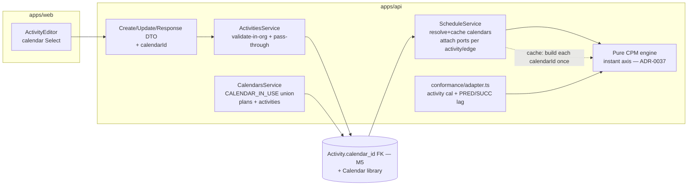
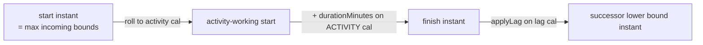

# Feature Spec: M5 — Per-activity working-time calendars

- **Status:** Draft (awaiting approval)
- **Author(s):** feature-analyst (with James Ewbank)
- **Date:** 2026-07-15
- **Tracking issue / epic:** Engine Conformance & Validation Framework (ADR-0034), Milestone M5
- **Roadmap link:** `docs/specs/engine-conformance-framework/implementation-plan.md` → Milestone M5
- **Related ADR(s):** **ADR-0037 _(new — required, drafted by this milestone)_** — per-activity calendars & the engine's instant axis (supersedes ADR-0024 §4's deferral; amends the offset-axis convention of ADR-0023/ADR-0036 §1). ADR-0024 (org calendar library + per-plan default — the seam this extends), ADR-0036 §6 (per-relationship lag seam — this makes PRED/SUCC distinct), ADR-0035 (CPM semantics — activity-calendar float/rounding), ADR-0022 (recalculate contract), ADR-0021 (DAG invariant), ADR-0033 (effective-Visual pass).

---

## 1. Business understanding

### Problem

Every activity in a plan schedules on **one** calendar today — the plan default (ADR-0024). That is
wrong for the way construction actually runs: a **concrete crew** may work 6 days, a **commissioning
subcontractor** 24/7, a **survey activity** only on the client's 4-day week, all inside one plan on a
5-day master calendar. A duration is a count of an activity's **own** working time — "10 days of
pours" means 10 days on the pour crew's calendar, not on the plan's — so measuring it on the plan
calendar puts the finish (and everything downstream) on the wrong date. P6 models this with a
**per-activity calendar**; SchedulePoint cannot represent it at all.

This gap also **strands M3**. M3 (ADR-0036 §6) landed all four `lagCalendar` sources, but only
`TWENTY_FOUR_HOUR` is behaviourally distinct: `PREDECESSOR` and `SUCCESSOR` are _forward-wired_ to the
plan calendar and "coincide until per-activity calendars land." A relationship lag measured "on the
predecessor's calendar" vs "on the successor's calendar" only differs once the two endpoints can
_have_ different calendars — i.e. **this milestone**. M5 is what finally makes `PREDECESSOR` and
`SUCCESSOR` mean something, closing the P6 _"calendar for scheduling relationship lag"_ setting.

Why now: M1 (ADR-0036, the gating hour/shift-granular rework) is Accepted and landed, so the engine
computes in working-**minutes** over an injectable `WorkingTimeCalendar` port — the prerequisite for
per-node calendars. M3 landed the lag-calendar column and the port-object seam. The `activities.calendar_id`
column already exists, **reserved** by ADR-0024 (nullable, no FK, not client-settable). M5 activates it.

### Users

- **Planner** (`PLANNER`) — models the schedule; needs to say "this activity runs on the 6-day crew
  calendar / the 24/7 commissioning calendar" on the specific activities where it matters.
- **Contributor** (`CONTRIBUTOR`) — may edit activities they own; same need at a smaller scope.
- **Viewer / External Guest** — read-only; see an activity's calendar, never edit it.
- **The conformance framework** (ADR-0034) — the differential/golden harness that must assert
  per-activity-calendar scheduling and flip the owning matrix rows (`lag_calendar_setting_sensitive`,
  scenario S05).

### Primary use cases

1. Assign an activity a **specific calendar** (from the org library), or leave it **inheriting** the
   plan default.
2. Recalculate a plan and have each activity's **duration measured on its own calendar**, so its
   finish and all successors land on real dates.
3. Have a relationship's lag resolve `PREDECESSOR`/`SUCCESSOR` to the **endpoint's** calendar (the two
   now differ), completing the M3 lag-calendar option.
4. Read an activity's calendar back (list/detail) and see it reflected in the calculated dates.
5. (Conformance) assert a 24/7-calendar activity inside a 5-day plan schedules across weekends, and
   that a `SUCCESSOR`-vs-`PREDECESSOR` lag resolves to different dates (S05 becomes a differential).

### User journeys

**Happy path (Planner puts a commissioning activity on a 24/7 calendar):** open a plan → open the
activity editor on "Commissioning" → **Calendar → 24-Hour** (was "Inherit plan default: Standard
Mon-Fri") → save → recalculate → the activity's 10-day duration is measured as 10 elapsed days
(spanning weekends) and its successors shift earlier accordingly. See §4 user-flow.

**Alternate (leave inheriting):** a Planner who does nothing keeps `calendarId = null` → the activity
schedules on the plan default, **byte-identical to today**. No existing plan changes dates on upgrade.

**Read-only (Viewer):** sees the activity's calendar label (or "Plan default"); the picker is disabled.

### Expected outcomes

- Planners can model mixed-calendar crews correctly; per-crew durations schedule to real site time.
- The engine measures each activity's duration on its own calendar and each edge's PRED/SUCC lag on
  the endpoint's calendar; the all-inherit default path is unchanged (goldens hold).
- The conformance matrix's **Per-relationship lag calendar** row moves 🟡 → ✅ (both halves);
  `lag_calendar_setting_sensitive` asserts; scenario **S05** (lag calendar = successor) becomes a
  runnable differential; a first **per-activity-calendar** golden lands.

### Success criteria

- A 24/7-calendar activity of 10 working-days' duration inside a 5-day plan finishes **10 elapsed
  days** after its start (spanning two weekends), verified by a first-principles golden/differential.
- On a plan with a 24h predecessor and a 5-day successor, an FS edge with `PREDECESSOR` lag and the
  same edge with `SUCCESSOR` lag produce **different** successor dates (S05 differential; the option
  is provably wired).
- Every existing plan and the full golden suite recalculate **byte-identically** on the all-inherit
  default path (`activity.calendarId == null` everywhere ⇒ today's arithmetic).
- Recalc performance budget holds (< 500 ms @ 500 activities, < 2 s @ 2 000 — ADR-0036 §7), with each
  distinct calendar built **at most once per recalculation** (calendar cache).
- `pnpm lint && pnpm typecheck && pnpm test` green; **ADR-0037 accepted**; database-architect,
  security, backend-performance and (for the picker) a11y/component/ux reviews clean.

### Open questions

> **CRITICAL — Q1 (the engine axis: this is the architecturally-significant decision → ADR-0037).**
> The engine today runs in **plan-calendar working-minute offsets** — one axis, so `earlyFinish =
earlyStart + durationMinutes` is valid only because every duration is measured on that one calendar
> (ADR-0024 §4 called this out when it deferred per-activity calendars). With per-activity calendars a
> duration is measured on the **activity's** calendar, and — crucially — an activity may work **when
> the plan calendar does not** (the 24/7 crew on a 5-day plan, the whole point). The plan-offset axis
> is then **lossy**: two different real finish instants (Fri 17:00 vs Sat 10:00) map to the _same_
> plan offset, so downstream bounds are wrong. **Recommendation: adopt an absolute-instant internal
> axis (Option A).** The engine computes in real working-instants (absolute minutes, calendar-agnostic
> and monotonic, so `max`/`min` bound comparisons are unchanged); each activity advances its own
> finish via its own calendar port; lag walks on the resolved lag calendar (M3's `applyLag`, now with
> PRED/SUCC endpoints); float is the working time between the early/late instants **measured on the
> activity's own calendar** (P6 semantics). For an all-inherit plan every advance uses the plan
> calendar, so the axis is a monotone relabelling of today's offsets → **goldens are byte-identical**.
> This is an **XL** rework of `compute.ts`/`constraints.ts` and **requires ADR-0037** (it amends the
> ADR-0023/0036 §1 offset-axis convention and supersedes ADR-0024 §4). The rejected alternative
> (Option B, keep plan-offset + round-trip durations) is documented in §4.

> **CRITICAL — Q2 (float unit when calendars differ).** Total float `= LS − ES`, but in whose working
> minutes? **Recommendation: the activity's own calendar** (`actCal.workingTimeBetween(ES, LS)`),
> matching P6 and ADR-0035, and identical to today when all activities inherit the plan calendar. This
> is a **semantics decision** that belongs in ADR-0037/ADR-0035 (it changes the meaning of the
> day-denominated `total_float` column for mixed-calendar plans). Flagged because it affects displayed
> float numbers, not just internal maths.

> **Non-critical defaults (proceeding):**
>
> - **Resolution/fallback order:** `activity.calendarId` → `plan.calendarId` → `null`
>   (`allMinutesWorkCalendar`, 24/7). Three levels; the reserved column's `null` keeps "inherit".
> - **FE picker ships in M5** (mirrors the plan calendar picker), but is the **lowest-priority,
>   droppable** slice (the harness feeds the engine directly; the API makes it settable).
> - **Recalc is explicit** — assigning a calendar never silently re-dates a plan (ADR-0024 §5 rule).
> - **Public API stays day-denominated** for durations/lag (ADR-0036 §7); M5 adds only the calendar
>   **dimension** (`calendarId`, a UUID). No sub-day input here.
> - **Constraint dates & data date** remain plan-level calendar days; an activity constraint still
>   rolls forward on the **activity's** calendar to its next working instant (ADR-0036 §4 behaviour,
>   now per-activity).
> - **Out of scope (stay deferred):** resource calendars / resource-dependent drive, LOE,
>   WBS-summary rollup (all separate M5-epic rungs), bulk calendar assignment, a calendar **authoring**
>   UI (ADR-0036 follow-on), and per-activity non-working timeline shading (M7).

## 2. Functional requirements

### User stories & acceptance criteria

> **US-1** — As a **Planner**, I want to assign an activity a specific working calendar, so that its
> duration is measured on that crew's real working time.
>
> **Acceptance criteria**
>
> - **Given** an activity of 10 working-days on a plan whose default is 5-day, **when** I set its
>   calendar to a 24/7 calendar and recalculate, **then** its finish is **10 elapsed days** after its
>   start (spanning weekends), and its successors move earlier accordingly.
> - **Given** I set the calendar back to "Plan default" (`null`), **when** I recalculate, **then** the
>   activity schedules on the plan calendar (today's behaviour, unchanged).
> - **Given** I switch an activity between "Plan default" and a distinct calendar, **then** its dates
>   **differ** between the two (the assignment is provably wired).

> **US-2** — As a **Planner**, I want `PREDECESSOR`/`SUCCESSOR` lag calendars to resolve to the
> endpoint activity's calendar, so that the M3 lag-calendar option is fully honoured.
>
> **Acceptance criteria**
>
> - **Given** a 24h predecessor, a 5-day successor and an FS +2d edge, **when** the edge's lag calendar
>   is `PREDECESSOR`, **then** the lag is measured on the 24h calendar; **when** `SUCCESSOR`, on the
>   5-day calendar; and the two produce **different** successor early starts.
> - **Given** both endpoints inherit the plan calendar, **then** `PREDECESSOR`, `SUCCESSOR` and
>   `PROJECT_DEFAULT` coincide (unchanged from M3).

> **US-3** — As a **Planner/Contributor/Viewer**, I want to see an activity's calendar in the list and
> detail, so that modelling intent is visible without opening the editor.
>
> **Acceptance criteria**
>
> - **Given** any activity, **when** I read it (list or detail), **then** the response includes its
>   `calendarId` (null = inherit) and, in the UI, a resolvable label.
> - **Given** an activity created before M5, **then** its `calendarId` reads `null` (inherit).

> **US-4** — As a **Contributor** editing an activity, I want the calendar to be optimistic-locked and
> pen-gated like the other definition fields, and validated against the org's calendars.
>
> **Acceptance criteria**
>
> - **Given** I hold the pen and a current `version`, **when** I PATCH `calendarId` to an active
>   calendar in the org, **then** it updates and `version` increments.
> - **Given** a `calendarId` that is not an active calendar in the org, **then** I get 404 (not found /
>   cross-tenant), before any write.
> - **Given** I do not hold the pen → 423; a stale `version` → 409 (unchanged concurrency behaviour).

> **US-5** — As an **Org Admin** deleting a calendar, I want the delete-in-use guard to also cover
> activities, so a calendar in use by an activity cannot be deleted out from under it.
>
> **Acceptance criteria**
>
> - **Given** a calendar referenced by an active activity (or plan), **when** I delete it, **then** I
>   get 409 `CALENDAR_IN_USE` with a count that includes activities.

> **US-6** — As the **conformance harness** (ADR-0034), I want the adapter to feed each fixture
> activity's calendar and resolve PRED/SUCC lag to the endpoint calendar, so per-activity-calendar
> scheduling and S05 can be asserted and the matrix rows flipped.
>
> **Acceptance criteria**
>
> - **Given** a fixture activity on a distinct calendar (e.g. CAL-03 24h) inside a 5-day plan, **then**
>   the adapter attaches that calendar and the activity schedules on it.
> - **Given** scenario **S05** (global lag calendar = Successor) run against S01, **then** dates
>   **differ** (lagged edges move) — S05 flips from `todo` to a runnable differential; the
>   `lag_calendar_setting_sensitive` case asserts.

### Workflows

1. **Assign calendar (write):** authz (`activity:update`/`activity:create`, org scope) → assert pen
   (ADR-0028) → if a non-null `calendarId` is supplied, take the calendar-scoped advisory lock and
   confirm it is an **active calendar in the org** (mirrors `PlansService.update`, no TOCTOU dangle) →
   optimistic-locked patch → updated response. `null` clears to "inherit plan default".
2. **Recalculate (read-through):** service loads activities (now selecting `calendarId`) → resolves &
   **builds each distinct calendar once** (cache keyed by `calendarId`; `null` → plan calendar) →
   attaches the built port to each `EngineActivity`, and resolves each edge's `lagCalendar` to the
   PRED/SUCC endpoint port → engine schedules on the instant axis → results persisted (engine-owned
   columns only, ADR-0022).
3. **Delete calendar (guard):** the `CALENDAR_IN_USE` count now unions active plans **and** active
   activities referencing the calendar (under the calendar write lock).
4. **Conformance run:** adapter maps each fixture activity's calendar id + each rel's lag source to
   resolved ports on the `EngineActivity`/`EngineEdge`; harness asserts per-activity scheduling + S05.

### Edge cases

- **All-inherit plan** (`calendarId == null` everywhere): identical to today; goldens hold. Empty
  plan / no activities → no change.
- **Activity calendar == plan calendar** (explicitly assigned the same id): the round-trip collapses
  to today's arithmetic by the port inverse invariant — same dates, one extra resolved port, no cache
  miss beyond the first build.
- **Activity works during plan non-working time** (24/7 crew on a 5-day plan): its start/finish
  instants legitimately fall on plan-non-working days — the exact case the **instant axis** exists to
  handle correctly (Option A). Its **display date** is derived on the **activity's** calendar.
- **Milestone (zero duration) with a calendar:** duration 0 ⇒ start = finish regardless of calendar;
  the calendar only affects the roll-to-next-working-instant of its start. Harmless.
- **PRED/SUCC lag where the endpoint inherits:** resolves to the plan calendar (unchanged); only a
  distinctly-calendared endpoint moves dates.
- **A referenced calendar was soft-deleted** (defensive; the in-use guard should prevent it): falls
  back to the plan calendar (then all-minutes), matching `resolveCalendar`'s existing defensive path —
  never an error mid-recalc.
- **No working time within the horizon** for an assigned calendar (window-only with no positive
  exception in range): the engine's N11/N16 iteration cap + horizon (ADR-0036 §5) returns a clear
  error, not a hang. Should be unreachable (build-time guard), but bounded regardless.
- **Concurrent edits:** optimistic lock (409) + pen (423) already cover this; `calendarId` joins the
  patch set, no new concurrency surface.
- **Invalid `calendarId` (not a UUID / not in org / soft-deleted):** rejected before write (422 shape,
  404 existence) — never persisted.

### Permissions

Maps to ADR-0012 RBAC + org resource scope (deny-by-default), unchanged from today's activity/calendar
rules — `calendarId` is another mutable definition field, and the delete guard reuses the calendar
permission set:

| Action                            | Permission        | Scope                     | Notes                                      |
| --------------------------------- | ----------------- | ------------------------- | ------------------------------------------ |
| Read `calendarId` (list/detail)   | `activity:read`   | resolved org              | every member                               |
| Set on create                     | `activity:create` | resolved org, parent plan | pen-gated; calendar validated in-org       |
| Update                            | `activity:update` | resolved org              | pen-gated, optimistic-locked; validated    |
| Delete calendar (guard extension) | `calendar:delete` | resolved org              | 409 count now unions plans + activities    |
| (No new permission)               | —                 | —                         | reuses activity + calendar permission sets |

### Validation rules

- `calendarId` — optional, nullable UUID; `null` = inherit plan default. When a non-null value is
  supplied it **must reference an active, non-deleted calendar in the resolved org** (cross-entity
  check in the service under the calendar advisory lock, exactly like the plan calendar picker;
  `@IsUUID()` + `@IsOptional()` shape at the DTO, existence/scope in the service → 404). Shared
  client↔server: `z.string().uuid().nullable().optional()` on the web; `@IsUUID()` on the API. No
  locale concern. `durationDays` unchanged (day-denominated, ADR-0036 §7).

### Error scenarios

| Scenario                                   | Detection                       | User-facing result             | Status |
| ------------------------------------------ | ------------------------------- | ------------------------------ | ------ |
| Not a member / lacks `activity:*`          | authz check                     | friendly forbidden message     | 403    |
| `calendarId` not a UUID                    | DTO `@IsUUID`                   | inline validation error        | 422    |
| `calendarId` not an active calendar in org | service in-org lookup           | not found                      | 404    |
| Edit without the pen                       | `assertHoldsPen` (ADR-0028)     | "someone else is editing"      | 423    |
| Stale `version`                            | optimistic `updateMany` count 0 | "changed elsewhere, refresh"   | 409    |
| Delete a calendar used by an activity      | `CALENDAR_IN_USE` union count   | "in use by N activities/plans" | 409    |
| Activity not found / cross-tenant          | org-scoped load                 | not found                      | 404    |

## 3. Technical analysis

| Area           | Impact   | Notes                                                                                                                                                                                                                                                                            |
| -------------- | -------- | -------------------------------------------------------------------------------------------------------------------------------------------------------------------------------------------------------------------------------------------------------------------------------- |
| Frontend       | low-med  | a calendar `Select` on the activity editor (mirrors the plan calendar picker); a calendar label in the activity list/detail; Zod field + labels. No new routes. (Droppable per Q on FE.)                                                                                         |
| Backend        | **high** | expose `calendarId` on activity create/update/response DTOs + shared `ActivitySummary`; validate-in-org in the service; extend the `CALENDAR_IN_USE` guard to count activities; **engine** gains per-activity calendar ports + the **instant-axis rework** (ADR-0037).           |
| Database       | **med**  | activate the reserved `activities.calendar_id`: add the FK relation (`onDelete: Restrict`, like Plan) + a partial index `(calendar_id) WHERE deleted_at IS NULL`; make it client-settable. **No data migration** (already nullable = inherit). database-architect task.          |
| API            | low      | additive nullable `calendarId` on two request DTOs + one response DTO; OpenAPI/`docs/API.md`. No new endpoint; additive → minor bump.                                                                                                                                            |
| Security       | med      | reuses activity RBAC + org scope + pen + optimistic lock; the new input is a **UUID that must resolve to an in-org calendar** — an IDOR surface handled exactly like the plan picker (in-org lookup + calendar advisory lock, no TOCTOU). Engine-owned columns untouched.        |
| Performance    | med      | resolver **builds each distinct calendar once per recalc** (cache keyed by `calendarId`) — O(distinct calendars), not O(activities); the instant axis costs one extra port round-trip per activity finish + per non-inherit edge lag. Re-verify the ADR-0036 budget @ 2 000.     |
| Infrastructure | none     | no new services, env, or containers.                                                                                                                                                                                                                                             |
| Observability  | low      | extend the recalc log with `activityCalendarCount` (distinct non-null activity calendars) alongside the existing `calendarId`/`lagCalendarOverrideCount`.                                                                                                                        |
| Testing        | high     | engine unit tests (per-activity duration on a distinct calendar; PRED/SUCC lag differential; activity-calendar float; full golden byte-parity on the all-inherit path); service validation + in-use guard; DTO tests; conformance flip + matrix; one API e2e; FE component/a11y. |

### Dependencies

- **M1 (ADR-0036) — landed.** Minute-granular durations/lag, the `WorkingTimeCalendar` port,
  `buildPlanCalendar`, `allMinutesWorkCalendar`. Hard prerequisite; satisfied.
- **M3 (ADR-0036 §6) — landed.** The `lagCalendar` column, the port-object seam, and `applyLag`. M5
  extends `applyLag`'s PRED/SUCC resolution to endpoint calendars.
- **ADR-0024** — the org calendar library, the plan calendar picker, and the `CALENDAR_IN_USE` guard
  this milestone mirrors and extends; the reserved `activities.calendar_id` column it activates.
- Reference template & standards: `docs/REFERENCE_FEATURE.md`, `docs/API.md`, `docs/DATABASE.md`,
  `docs/SECURITY_STANDARDS.md`, `docs/PERFORMANCE.md`.
- **Downstream (not this milestone):** resource-dependent scheduling (`res_calendar_drives`) is
  _unblocked_ by per-activity calendars but needs the resource model — a separate M5-epic rung.

## 4. Solution design

### Architecture overview

The engine stays a **pure, calendar-agnostic** domain library (ADR-0008): it receives resolved
`WorkingTimeCalendar` **ports** per activity and per edge, never a `calendarId` or an enum. The service
owns resolution + a per-recalc build cache; the engine owns the (now instant-axis) arithmetic. This is
the M1 plan-calendar seam and the M3 lag-calendar seam, generalised to **per-node** calendars.



### Data flow

```mermaid
sequenceDiagram
  participant P as Planner (web)
  participant API as ActivitiesService
  participant DBW as Postgres
  participant SVC as ScheduleService
  participant ENG as Pure engine (instant axis)

  P->>API: PATCH activity { calendarId, version }
  API->>API: authz + assertHoldsPen + validate calendar in-org (advisory lock)
  API->>DBW: update calendar_id (version+1)
  API-->>P: 200 { ..., calendarId }
  Note over P,SVC: later — recalculate
  SVC->>DBW: loadActivities (now select calendarId) + loadEdges
  SVC->>SVC: resolveCalendarPort(id) — build each distinct calendar ONCE (cache)
  SVC->>SVC: attach activity port to each EngineActivity; resolve edge PRED/SUCC → endpoint port
  SVC->>ENG: computeSchedule(activities[{..,calendar}], edges[{..,lagCalendar}], {dataDate, calendar})
  ENG->>ENG: forward/backward on absolute instants; duration on activity cal; float on activity cal
  ENG-->>SVC: results (24/7 activity spans weekends; PRED/SUCC lag distinct)
  SVC->>DBW: writeResults (engine-owned columns only)
```

### User flow

```mermaid
flowchart TD
  A[Open plan → activity editor] --> B{Calendar}
  B -->|Plan default (inherit)| C[Duration on plan calendar\n= today]
  B -->|Specific: 24-Hour| D[Duration as elapsed time]
  B -->|Specific: 6-day crew| E[Duration on the crew calendar]
  C --> F[Save → Recalculate]
  D --> F
  E --> F
  F --> G[Activity + successors re-dated on the chosen calendar]
```

### Database changes

Activate the **reserved** `activities.calendar_id` (ADR-0024 §4 kept the column so this is not a wide
migration):

- **Add the FK relation** `Activity.calendar → Calendar` on `calendar_id`, `onDelete: Restrict`
  (mirrors `Plan.calendar`), `organizationId`-consistent (validated in the service, like the plan
  picker — the FK alone does not enforce same-org, so the service check stays).
- **Add a partial index** `ix_activities_calendar_id (calendar_id) WHERE deleted_at IS NULL` (raw SQL
  in the migration, mirroring the plan one) — backs the extended `CALENDAR_IN_USE` count and the FK.
- **No data migration:** the column is already nullable and defaults to `null` (= inherit); existing
  rows are correct as-is. This is the milestone's **only** schema change and it is additive/reversible.
- Design with **database-architect** (FK direction, index shape, the RESTRICT + soft-delete interplay).

### API changes

Additive nullable field on existing activity endpoints (`docs/API.md` update, OpenAPI via `@nestjs/swagger`):

- `POST /api/v1/orgs/{org}/plans/{planId}/activities` — `CreateActivityDto` gains
  `calendarId?: string | null` (`@IsOptional`, `@IsUUID`, nullable; `@ApiPropertyOptional`).
- `PATCH /api/v1/orgs/{org}/activities/{id}` — `UpdateActivityDto` gains the same field; `null` clears
  to inherit (mirrors `UpdatePlanDto.calendarId`).
- `ActivityResponseDto` + shared `ActivitySummary` gain `calendarId: string | null`.
- No status-code changes for durations; version impact **minor** (pre-1.0 additive).

### Component changes

- **`apps/web/src/features/activities/schemas/…`** — add `calendarId: z.string().uuid().nullable()`
  to the activity form schema; reuse/lift the plan calendar picker's option-loading (org calendar
  list) so the same "Plan default (inherit)" + named-calendar options render.
- **`ActivityEditor`** — a shadcn/ui `Select` bound to `calendarId`, default option **"Plan default
  (Standard Mon-Fri)"** resolving `null`, using design-system tokens (no one-off styling),
  keyboard-operable and labelled (WCAG 2.2 AA). Loading/empty/error/success inherit the editor dialog.
- **Activity list/detail** — render the calendar label as a small secondary detail only when not
  inheriting (avoid noise), mirroring how the plan calendar surfaces. No new component.

### Implementation approach & alternatives

**Chosen — Option A: an absolute-instant internal axis + per-activity/per-edge calendar ports (ADR-0037).**

The engine's internal axis moves from **plan-calendar working-minute offsets** to **absolute
working-instants** (represented as absolute minutes — calendar-agnostic and monotonic, so every
`max`/`min` bound comparison and the topological pass are structurally unchanged). Concretely:

- `EngineActivity` gains `calendar?: WorkingTimeCalendar` (undefined ⇒ the plan calendar from
  `ComputeOptions.calendar`). `EngineEdge.lagCalendar` already exists (M3); the **service** now
  resolves `PREDECESSOR`/`SUCCESSOR` to the endpoint activity's port (not always undefined).
- **Forward pass:** an activity's start instant is the max of (data-date instant, each incoming edge's
  `applyLag`-shifted predecessor anchor), then **rolled forward to the activity calendar's next
  working instant**; its finish is `activityCalendar.addWorkingTime(startInstant, durationMinutes)`.
- **Backward pass** mirrors it (roll back to the activity calendar's previous working instant).
- **Float** `= activityCalendar.workingTimeBetween(earlyStartInstant, lateStartInstant)` — the
  activity's own working minutes (Q2; P6/ADR-0035). Written to the day-denominated column ÷1440 as today.
- **Display dates** derive from the instant on the **activity's** calendar (START/FINISH-aware, the
  existing `workingIndexDate`/`anchorInstant` logic, now per-activity).
- **Default-path parity:** when every activity inherits the plan calendar, all advances use one
  calendar, the instant axis is a monotone relabelling of today's offsets, and outputs (dates, float,
  driving, visual) are **byte-identical** → the golden suite is the safety net (as M1 used it).

`applyLag` (M3) is unchanged in shape — it already round-trips an anchor through instants; M5 only
feeds it PRED/SUCC endpoint calendars from the service instead of always-undefined. Driving detection
and the effective-Visual pass (ADR-0033) run through the same per-activity-calendar helpers so display,
conflict and drift stay consistent (drift baseline stays the pure early-start instant).

**Resolution + cache (service):** `resolveCalendarPort(calendarId)` memoises `buildPlanCalendar` per
`calendarId` for the duration of one recalculation (a `Map<string | null, WorkingTimeCalendar>`), so a
2 000-activity plan on three calendars builds **three** ports. `toEngineActivity` attaches the resolved
port; `toEngineEdge` resolves `PREDECESSOR`→pred's port, `SUCCESSOR`→succ's port, `TWENTY_FOUR_HOUR`→
`allMinutesWorkCalendar`, `PROJECT_DEFAULT`→undefined (plan calendar).



**ADR?** **Yes — a new ADR-0037 is required and is the first deliverable of this milestone.** It
amends the offset-axis convention of ADR-0023/ADR-0036 §1 (offset → absolute working-instant),
supersedes ADR-0024 §4's per-activity deferral, and records the Q2 float-unit semantics (also a note
in ADR-0035). This is the milestone's architecturally-significant decision; nothing else here is.

**Alternatives considered:**

- _Option B — keep the plan-offset axis, round-trip each activity's duration through its calendar to a
  plan-offset delta (the natural M3 `applyLag` extension)._ **Rejected — provably wrong for the
  headline case.** When an activity works during plan-non-working time, its finish instant maps
  ambiguously back to a plan offset (two instants → one offset), so downstream bounds lose information
  (ADR-0024 §4's exact objection). It is only correct if activity calendars are **subsets** of the
  plan calendar — which forbids the 24/7-crew-on-a-5-day-plan case that motivates the feature.
- _Enum-in-engine (pass `calendarId` + a `Map` into the engine)._ Rejected: pushes domain/resolution
  knowledge into the pure engine; the port-object approach keeps it calendar-agnostic (matches M1/M3).
- _Per-activity calendar as a resource calendar / resource-dependent drive._ Rejected for M5's scope:
  that needs the resource model (a separate rung); per-activity calendars are the simpler, foundational
  half and unblock it later.
- _Materialise per-activity working-day tables._ Rejected (ADR-0024): unbounded storage, no closed-form
  span math; the built port + cache is compact and O(log).

## 5. Links

- Implementation plan: `docs/specs/engine-conformance-framework/M5-per-activity-calendars-implementation-plan.md`
- Docs updated by this change: **`docs/adr/0037-*.md` (new)**, `docs/adr/0024-*.md` (add "superseded
  in part by ADR-0037" note — never edit the body), `docs/specs/engine-conformance-framework/CAPABILITY_MATRIX.md`
  (Per-relationship lag calendar row → ✅; S05 runnable), `docs/API.md`, `docs/DATABASE.md`,
  `docs/DECISIONS.md` (float-unit + resolution-order record).
- Grounding: ADR-0036 §6/§1, ADR-0024 §4, ADR-0035, ADR-0033; `engine/compute.ts`,
  `engine/working-time-calendar.ts`, `engine/types.ts`, `schedule.service.ts`, `schedule.repository.ts`,
  `plan-calendar.ts`, `calendars.service.ts`, `plans.service.ts`, `prisma/schema.prisma`; the fixture
  `TEST_MATRIX.md` §4 and the S05 / `lag_calendar_setting_sensitive` cases.
