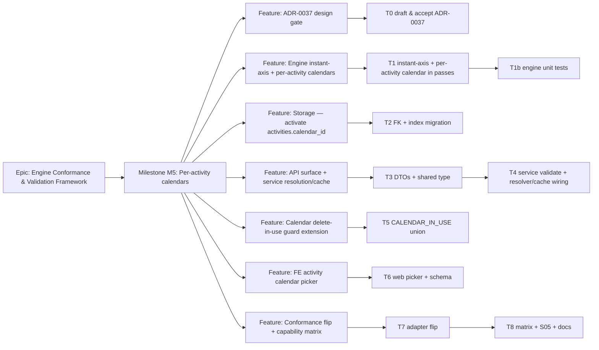

# Implementation Plan: M5 — Per-activity working-time calendars

- **Feature spec:** `docs/specs/engine-conformance-framework/M5-per-activity-calendars-feature-spec.md`
- **Status:** Draft (awaiting approval)
- **Owner:** TBD

## Breakdown

### Epic

**Engine Conformance & Validation Framework** (ADR-0034) — prove and close the gap between
SchedulePoint's CPM/PDM engine and a P6-class fixture, one capability rung at a time.

### Milestone: M5 — Per-activity working-time calendars (shippable slice)

**Outcome:** a Planner can put an activity on its own working calendar (or inherit the plan default),
the engine measures that activity's duration on its calendar and resolves `PREDECESSOR`/`SUCCESSOR`
lag to the endpoint's calendar; the all-inherit default path is byte-identical; the conformance
harness asserts per-activity scheduling and the S05 lag-calendar differential, moving the owning
matrix rows to ✅.

**Complexity:** XL (the engine instant-axis rework dominates) · **Dependencies:** M1 + M3 (landed) ·
**Flag:** the engine rework ships behind the unchanged recalculate endpoint with the golden suite as
the gate (like M1); the settable field + picker are additive. Recommend `VITE_ACTIVITY_CALENDAR` for
the FE picker only, so it can merge dark and flip on when the API + engine land.

---

#### Feature: ADR-0037 — per-activity calendars & the engine instant axis (design gate)

> **Description:** the architecturally-significant decision this milestone rests on: move the engine's
> internal axis from plan-calendar working-minute **offsets** to **absolute working-instants**; make
> `EngineActivity` carry a calendar port; define float as the activity-calendar working time; resolve
> PRED/SUCC lag to endpoint calendars. Amends ADR-0023/ADR-0036 §1; supersedes ADR-0024 §4.
> **Complexity:** M (writing), gates all of F1–F6.
> **Dependencies:** none — but must be **accepted before F1 merges**.
> **Risks:** designing the axis wrong → cascading rework → _mitigation:_ prototype the parity claim
> (all-inherit ⇒ byte-identical goldens) in the ADR's "consequences" before acceptance.
> **Testing requirements:** n/a (design doc); the parity claim is proven by F1's golden run.

##### Task 0 — Draft & accept ADR-0037 (≈ one PR)

- **Description:** author `docs/adr/0037-per-activity-calendars-and-instant-axis.md` from
  `docs/adr/_template.md`: problem/forces, options (A instant-axis chosen; B plan-offset rejected with
  the lossiness proof; enum-in-engine; resource-calendar), decision, trade-offs, consequences (Q2
  float unit, resolution order). Add a "superseded in part by ADR-0037" pointer at the top of ADR-0024
  (do **not** edit its body) and a note to ADR-0035 on activity-calendar float.
- **Complexity:** M
- **Dependencies:** —
- **Risks:** scope creep into resources/LOE → _mitigation:_ explicit "deferred" list mirroring the spec.
- **Testing:** n/a.
- **Development steps:**
  1. Write ADR-0037; cross-link ADR-0023/0024/0033/0035/0036 and the spec.
  2. Add the ADR to `CLAUDE.md` §16 and `docs/DECISIONS.md` (float unit + resolution order).
  3. Review with **ui-architect**/**database-architect** as design advisors; mark Accepted.

---

#### Feature: Engine instant-axis + per-activity calendars (the behaviour)

> **Description:** rework the pure engine to compute on absolute working-instants, advancing each
> activity's finish on its own calendar port and measuring float on that calendar; keep PRED/SUCC lag
> resolution (via the existing `applyLag`) fed by endpoint ports.
> **Complexity:** XL
> **Dependencies:** ADR-0037 (T0)
> **Risks:** (a) any default-path drift from the goldens; (b) forward/backward asymmetry across
> mixed calendars → wrong/negative float; (c) blowing the perf budget. _Mitigations:_ the all-inherit
> golden suite as the parity gate (byte-identical), one shared set of instant/anchor helpers used by
> both passes + driving + visual, and a perf re-verify at 2 000 activities (T1b).
> **Testing requirements:** engine unit tests — per-activity duration on a distinct calendar; the
> 24/7-in-a-5-day exact value (10 working-days = 10 elapsed days); PRED-vs-SUCC lag differential;
> activity-calendar float; inverse/symmetry; and **full golden byte-parity on the all-inherit path**.

##### Task 1 — Instant axis + per-activity calendar in the passes (≈ one PR)

- **Description:** add `calendar?: WorkingTimeCalendar` to `EngineActivity`; convert `compute.ts`
  (forward, backward, effective-Visual, driving, project-finish, display mapping) and `constraints.ts`
  from plan-offset to absolute-instant, advancing each activity's start→finish on its own calendar
  (fallback: `ComputeOptions.calendar`); measure float on the activity calendar; feed `applyLag` the
  edge's resolved lag calendar (unchanged shape).
- **Complexity:** XL (split into reviewable commits: axis conversion with all-inherit parity first,
  then per-activity calendar + float).
- **Dependencies:** T0.
- **Risks:** the display-date START/FINISH-aware mapping (`anchorInstant`) subtly wrong across a
  non-working gap on a distinct calendar → off-by-one dates → _mitigation:_ reuse the M1 gap logic
  per-activity; unit-test a finish landing on a plan-non-working (activity-working) instant.
- **Testing:** covered by T1b; keep the existing `compute.spec.ts` + `goldens.spec.ts` green
  throughout (parity is the guard rail).
- **Development steps:**
  1. `engine/types.ts`: add `calendar?: WorkingTimeCalendar` to `EngineActivity` (documented: undefined
     = plan calendar; distinct only for an assigned calendar).
  2. `engine/compute.ts`: introduce the absolute-instant maps; per-activity start-roll + finish-advance;
     float on the activity calendar; route driving + effective-Visual + display through per-activity
     helpers. Keep `applyLag` (M3) intact.
  3. `engine/constraints.ts`: clamp on instants using the activity's calendar.
  4. Update engine doc-comments (`types.ts` header, `compute.ts` header, `EngineResult`) from
     "working-day/plan-offset" to "absolute working-instant / per-activity calendar" per ADR-0037.

##### Task 1b — Engine unit tests + perf re-verify

- **Description:** prove the behaviour and the parity/perf guarantees.
- **Complexity:** M
- **Dependencies:** T1.
- **Risks:** under-testing mixed-calendar float / negative-lag PRED/SUCC → _mitigation:_ explicit cases.
- **Testing:** new `compute.activity-calendar.spec.ts`: (a) a 10-day activity on `allMinutesWorkCalendar`
  inside a 5-day plan finishes exactly 10 elapsed days after start, and **differs** from inherit;
  (b) an FS +2d edge with PRED (24h) vs SUCC (5-day) lag yields different successor starts;
  (c) float of a distinctly-calendared activity is measured in its own working minutes;
  (d) inverse/symmetry across a mixed-calendar edge (no spurious negative float);
  (e) all-inherit reproduces today's dates. Re-run `goldens.spec.ts` for byte-parity; add a perf assert
  (< 2 s @ 2 000 activities across ≥3 calendars).
- **Development steps:**
  1. Add the spec with the five cases + the perf case.
  2. Confirm the golden suite is byte-identical on the all-inherit path.

---

#### Feature: Storage — activate `activities.calendar_id`

> **Description:** turn the reserved column into a real, client-settable FK with an index.
> **Complexity:** S
> **Dependencies:** ADR-0037 (T0) for the FK/index decision; independent of the engine PR.
> **Risks:** RESTRICT + soft-delete interplay (a soft-deleted activity should not block a calendar
> delete) → _mitigation:_ the in-use count filters `deleted_at IS NULL`; database-architect review.
> **Testing requirements:** migration up/down; a Prisma-level FK test; index present.

##### Task 2 — FK relation + partial index migration

- **Description:** add `Activity.calendar → Calendar` (`onDelete: Restrict`) on the existing
  `calendar_id`; add the partial index `ix_activities_calendar_id (calendar_id) WHERE deleted_at IS
NULL` (raw SQL, mirroring the plan one). No data migration (already nullable = inherit).
- **Complexity:** S
- **Dependencies:** T0.
- **Risks:** FK does not enforce same-org → _mitigation:_ documented; org check stays in the service.
- **Testing:** migration applies cleanly on a seeded DB; `verify-template.sh`/schema checks pass.
- **Development steps:**
  1. `schema.prisma`: add the relation + back-relation `Calendar.activities`; drop the "reserved" note.
  2. Migration: `ADD CONSTRAINT … FOREIGN KEY … ON DELETE RESTRICT` + the partial index (raw SQL).
  3. database-architect review; update `docs/DATABASE.md`; changeset.

---

#### Feature: API surface + service resolution/cache

> **Description:** expose `calendarId` on activity DTOs + shared type, validate it in-org on write, and
> resolve/cache per-activity calendar ports (+ PRED/SUCC endpoint resolution) at recalculation.
> **Complexity:** M
> **Dependencies:** T1 (engine consumes ports), T2 (FK), T3→T4 order.
> **Risks:** leaking `calendarId` into the engine, or O(activities) calendar builds → _mitigation:_
> resolve+cache in the service (`Map` keyed by `calendarId`), attach only ports to the engine.
> **Testing requirements:** DTO validation, service validate-in-org (404) + pen/optimistic-lock still
> hold with the new field, recalc honours a distinct activity calendar + PRED/SUCC lag; one API e2e.

##### Task 3 — DTOs + shared type

- **Description:** add nullable `calendarId` to `CreateActivityDto`, `UpdateActivityDto`,
  `ActivityResponseDto`, and `ActivitySummary` (`@repo/types`).
- **Complexity:** S
- **Dependencies:** T2.
- **Risks:** response DTO drifting from the shared type → _mitigation:_ implement the shared summary; type test.
- **Testing:** DTO spec — accepts a UUID, accepts `null` (clear), rejects a non-UUID (422), omission → undefined.
- **Development steps:**
  1. `packages/types`: add `calendarId: string | null` to `ActivitySummary`.
  2. Create/Update DTOs: `@IsOptional() @IsUUID()` nullable `@ApiPropertyOptional` field (mirror `UpdatePlanDto.calendarId`).
  3. `ActivityResponseDto.from()`: expose `calendarId`.
  4. **api-reviewer** pass (envelopes, OpenAPI); update `docs/API.md`.

##### Task 4 — Service validate-in-org + resolver/cache wiring

- **Description:** in `ActivitiesService.create`/`update`, validate a non-null `calendarId` against an
  active calendar in the org under the calendar advisory lock (mirror `PlansService.update`); thread it
  to the repository; select `calendarId` in `loadActivities`/`ScheduleActivityRow`; add
  `resolveCalendarPort(calendarId)` with a per-recalc `Map` cache in `ScheduleService`; attach the port
  per `EngineActivity` and resolve edge PRED/SUCC → endpoint port in `toEngineEdge`.
- **Complexity:** M
- **Dependencies:** T3, T1.
- **Risks:** forgetting the `loadActivities` select → engine always sees inherit → _mitigation:_ service
  spec asserts a distinct-calendar activity changes dates; add `activityCalendarCount` to the recalc log.
- **Testing:** `activities.service.spec.ts` (create/update round-trip; 404 on a foreign/soft-deleted
  calendar; pen + optimistic lock enforced with the new field); `schedule.service.spec.ts` (recalc with
  a distinct activity calendar moves the finish; PRED/SUCC lag distinct; all-inherit unchanged; cache
  builds each calendar once).
- **Development steps:**
  1. `activity.repository.ts`: add `calendarId?` to the patch/create input + `ScheduleActivityRow`.
  2. `activities.service.ts`: validate-in-org (advisory lock, `findActiveByIdInOrg`) on non-null;
     `null` clears; thread through create/patch.
  3. `schedule.repository.ts`: select `calendarId` in `loadActivities`.
  4. `schedule.service.ts`: add the memoised `resolveCalendarPort`; attach ports in `toEngineActivity`;
     resolve PRED→pred port / SUCC→succ port in `toEngineEdge`; extend the recalc log.
  5. **security-reviewer** + **backend-performance-reviewer** pass; changeset (minor).

---

#### Feature: Calendar delete-in-use guard extension

> **Description:** the `CALENDAR_IN_USE` (409) guard must now also count active activities.
> **Complexity:** S
> **Dependencies:** T2 (index backing the count).
> **Risks:** counting soft-deleted activities → false positives → _mitigation:_ `deleted_at IS NULL` filter + test.
> **Testing requirements:** service spec — delete blocked when an activity references the calendar; the
> count message unions plans + activities.

##### Task 5 — `CALENDAR_IN_USE` union (plans + activities)

- **Description:** extend `CalendarRepository.countActivePlansUsing` (or add `countActiveActivitiesUsing`)
  and the service guard to union both; keep it under the existing calendar write lock (no TOCTOU).
- **Complexity:** S
- **Dependencies:** T2.
- **Risks:** perf of the count on large orgs → _mitigation:_ the partial index (T2) backs it.
- **Testing:** `calendars.service.spec.ts` — 409 with an activity in use; message/count includes activities.
- **Development steps:**
  1. `calendar.repository.ts`: add the active-activity count (org + calendar scoped, `deleted_at IS NULL`).
  2. `calendars.service.ts`: union the counts in the `CALENDAR_IN_USE` guard + message.
  3. security-reviewer pass; update the calendars controller `@ApiResponse` description; changeset.

---

#### Feature: FE activity calendar picker (recommended, droppable — behind `VITE_ACTIVITY_CALENDAR`)

> **Description:** a calendar `Select` on the activity editor + a list/detail label, echoing the plan
> calendar picker, with a "Plan default (inherit)" option resolving `null`.
> **Complexity:** S
> **Dependencies:** T3 (response field), T4 (persistence).
> **Risks:** duplicating the plan picker's option-loading → drift → _mitigation:_ lift a shared
> calendar-options hook/component.
> **Testing requirements:** component test (renders, default inherit, change persists via the mutation);
> **accessibility-reviewer** (labelled, keyboard-operable, WCAG 2.2 AA); **ux-reviewer** (copy, states);
> **component-reviewer** (token/variant reuse, no one-off styling).

##### Task 6 — Web picker + schema

- **Description:** extend the activity form schema + `ActivityEditor` with the calendar `Select`; add
  the list/detail label; reuse the plan picker's calendar-option source.
- **Complexity:** S
- **Dependencies:** T3, T4.
- **Risks:** one-off styling drift → _mitigation:_ reuse the shadcn/ui `Select` field the plan picker uses.
- **Testing:** `ActivityEditor.test.tsx` (picker present, default inherit, edit submits `calendarId`);
  a11y check in the journey.
- **Development steps:**
  1. Activity schema: add `calendarId` (nullable UUID) + a shared "Plan default" option.
  2. `ActivityEditor`: add the `Select` (default resolves `null`); wire to the mutation.
  3. List/detail: show the calendar label only when not inheriting.
  4. component/accessibility/ux review; changeset (minor).

---

#### Feature: Conformance flip + capability matrix (prove it)

> **Description:** feed each fixture activity's calendar + resolve PRED/SUCC lag to endpoint calendars;
> assert per-activity scheduling and S05; move the matrix rows; record the honest scope.
> **Complexity:** M
> **Dependencies:** T1 (engine).
> **Risks:** over-claiming resource-dependent/LOE rows (still M5-epic, not this feature) → _mitigation:_
> keep those rows ❌ with their reasons; only flip the per-activity-calendar + lag rows.
> **Testing requirements:** adapter spec (activity carries its calendar; PRED/SUCC no longer degraded);
> scenarios spec (S05 runnable + differs from baseline); a first-principles per-activity-calendar golden.

##### Task 7 — Adapter flip

- **Description:** map each fixture activity's `calendar` id → a resolved port on the `EngineActivity`;
  resolve `rel.lag_calendar` PRED/SUCC to the endpoint ports (remove the "resolves to plan calendar
  until M5" note); update `approximations`.
- **Complexity:** M
- **Dependencies:** T1.
- **Risks:** fixture calendar-id/name variants unmapped → _mitigation:_ an exhaustive normaliser + a
  test over the fixture's real calendar set (CAL-01…CAL-06).
- **Testing:** `adapter.spec.ts` — a distinctly-calendared activity carries its port; a PRED/SUCC edge
  resolves to the endpoint calendar; `approximations` no longer lists per-activity-calendar as dropped.
- **Development steps:**
  1. `conformance/adapter.ts`: resolve + attach activity calendars; resolve PRED/SUCC endpoint lag ports.
  2. Add a first-principles per-activity-calendar golden (24/7 activity in a 5-day plan = elapsed).

##### Task 8 — Scenarios, matrix & docs

- **Description:** flip S05 to runnable; move the capability-matrix rows; record the scope.
- **Complexity:** S
- **Dependencies:** T7.
- **Risks:** matrix drift from behaviour → _mitigation:_ update in the same PR (matrix rule).
- **Testing:** `scenarios.spec.ts` — S05 runs and `resultsDiffer(S05, S01)` is true.
- **Development steps:**
  1. `conformance/scenarios.ts`: `S05_LAG_CALENDAR_SUCCESSOR.runnable = true`.
  2. `CAPABILITY_MATRIX.md`: **Per-relationship lag calendar** row 🟡 → ✅ (both halves; note S05
     asserted); note the per-activity-calendar behaviour now proven; update the summary counts. Keep
     `type_loe`/`type_resource_dependent`/`type_wbs_summary` ❌ (separate M5-epic rungs).
  3. `docs/DECISIONS.md`: record the float-unit + resolution-order decisions (from ADR-0037).
  4. changeset (docs/tests only for this PR).

## Sequencing & slices

1. **T0 (ADR-0037)** — the design gate; nothing else merges until it is Accepted.
2. **T2 (storage)** — independent, additive; safe to land early (column becomes a real FK, still inert).
3. **T1 → T1b (engine)** — the core rework; ships behind the unchanged recalculate endpoint with the
   golden suite as the parity gate. Keeps `main` releasable (all-inherit ⇒ byte-identical).
4. **T3 → T4 (API + service)** — makes the calendar settable and honoured end-to-end; the first
   user-valuable slice (a distinct activity calendar changes real recalculated dates).
5. **T5 (delete guard)** — small, ships alongside T4 to close the integrity gap.
6. **T7 → T8 (conformance)** — proves it against the fixture and flips the matrix; parallel with T4
   once T1 lands.
7. **T6 (FE picker)** — last, lowest-risk, behind `VITE_ACTIVITY_CALENDAR`; droppable without
   affecting the conformance outcome.

Each task is an independently reviewable PR. Only the FE picker needs a flag; the engine rework is
gated by the goldens and the API field is additive.

## Definition of Done (per task)

Each task's PR satisfies the Feature Completion Criteria in `docs/PROCESS.md` (code, tests ≥ 80% on
changed code, docs, security review, performance, accessibility for UI, Docker build, CI green,
changeset, version impact). Milestone-level: ADR-0037 Accepted; a distinct activity calendar changes
recalculated dates; PRED/SUCC lag is distinct; S05 is a runnable differential; the capability-matrix
lag-calendar row is ✅; the full golden suite is byte-identical on the all-inherit path; recalc perf
budget holds @ 2 000 activities across ≥3 calendars.

## Risks & assumptions (rollup)

| Risk / assumption                                                                           | Likelihood | Impact | Mitigation                                                                                      |
| ------------------------------------------------------------------------------------------- | ---------- | ------ | ----------------------------------------------------------------------------------------------- |
| Instant-axis rework drifts the default path from the goldens                                | med        | high   | all-inherit is a monotone relabelling → byte-identical; run the full golden suite as the gate   |
| Forward/backward asymmetry across mixed calendars → wrong/negative float                    | med        | high   | one shared instant/anchor helper set for both passes + driving + visual; inverse/symmetry test  |
| O(activities) calendar builds blow the perf budget                                          | med        | med    | resolver cache keyed by `calendarId` (build each once); perf assert @ 2 000 across ≥3 calendars |
| Display date off-by-one when a finish lands on a plan-non-working (activity-working) gap    | med        | med    | reuse the M1 START/FINISH-aware gap logic per-activity; explicit unit test                      |
| `loadActivities` not selecting `calendarId` → silent inherit                                | med        | med    | service spec asserts a distinct-calendar activity changes dates; `activityCalendarCount` log    |
| Calendar delete-in-use guard misses activities → dangling FK / stale schedule               | low        | high   | T5 unions plans + activities under the calendar write lock; RESTRICT FK as defence in depth     |
| Over-claiming resource-dependent/LOE/WBS rows (separate M5-epic rungs)                      | med        | low    | flip only the per-activity-calendar + lag rows; keep the others ❌ with reasons                 |
| **Assumption:** M1 + M3 fully landed (port, `applyLag`, `lagCalendar` column, reserved col) | —          | —      | verified in schema/engine/service before planning                                               |
| **Assumption:** ADR-0037 accepted before F1 merges                                          | —          | —      | T0 is the milestone's first task and gate                                                       |
