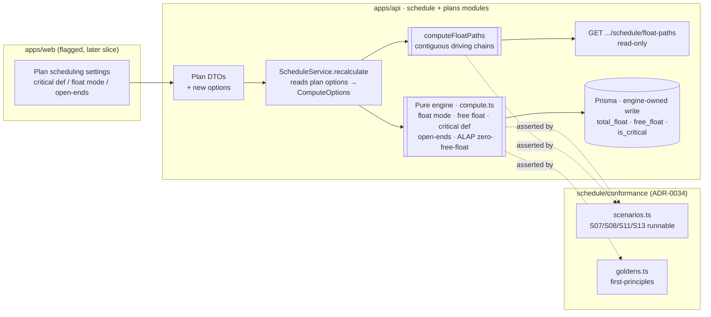
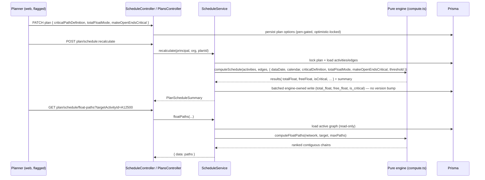
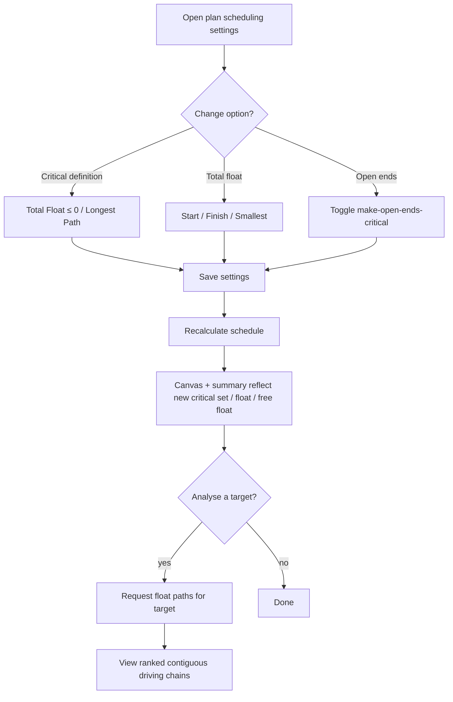

# Feature Spec: M6 — Float & Critical (ADR-0035 §17–§20)

- **Status:** Draft (awaiting approval)
- **Author(s):** feature-analyst (with James Ewbank)
- **Date:** 2026-07-16
- **Tracking issue / epic:** Engine conformance & validation framework (ADR-0034) — capability milestone **M6**
- **Roadmap link:** `docs/specs/engine-conformance-framework/CAPABILITY_MATRIX.md` (rows: _Longest-path critical_, _Free vs total / start-finish-smallest float_, _Multiple float paths_, _Make-open-ends-critical_; scenarios **S07/S08/S11/S13**; ALAP **con_alap 🟡**, **float_zero_free 🟡**)
- **Related ADR(s):** **ADR-0035 §17–§20 and §11** (this milestone _builds and Accepts_ those clauses); ADR-0034 (conformance methodology); ADR-0022 (recalc/persistence); ADR-0037 (per-activity calendars / own-calendar float); ADR-0033 (effective-Visual / ALAP placement precedent)

> **This milestone writes the behaviour ADR-0035 §17–§20 already decided.** The semantics are pre-approved
> and P6-aligned; nothing here re-litigates them. The job is to build the selectable critical definition,
> the float-type selection, free-float computation, the make-open-ends-critical option, the ALAP
> zero-free-float refinement, and multiple-float-path analysis — and to flip conformance rows/scenarios
> **S07/S08/S11/S13** (and **con_alap/float_zero_free**) from ❌/🟡 to ✅ in the same PRs.

---

## 1. Business understanding

### Problem

SchedulePoint's CPM engine today computes total float as **Finish Float** on each activity's own calendar
and marks an activity **critical** by the single rule `totalFloat ≤ 0` (`compute.ts`). That is the correct
**default** (ADR-0035 §17), but construction planners who have used P6/Asta expect to **choose how the
engine defines "critical" and "float"**, because the choice materially changes which activities the team is
told to protect:

- **Longest Path vs Total Float ≤ 0** (§17). A hugely-negative-float but **open-ended** activity (fixture
  `A12700`, weather-blocked past a Must-Finish-By) is critical under `TF ≤ 0` but is **not** on the longest
  path to the project finish. Reporting it as "critical" when it does not drive completion misleads the team.
- **Total Float as Start / Finish / Smallest** (§18). Once activities run on **different calendars** from
  their predecessors (ADR-0037 is now live), start-float and finish-float diverge; a planner must be able to
  pick which the "total float" number means.
- **Free float** (§11, capability row `float_zero_free` 🟡). The engine computes total float but **not free
  float** — so it cannot yet answer "how far can this slip **without delaying any successor**", nor complete
  the As-Late-As-Possible refinement (a flagged ALAP activity should end up with **free float = 0, total
  float unchanged**, fixture `A9400`).
- **Make open-ends critical** (§20). Some planners want every open-ended activity flagged critical; today
  there is no such option.
- **Multiple float paths** (§19). Planners analysing a key milestone (fixture target `A12500`) want the
  **contiguous driving chains** feeding it, ranked — not "activities sorted by total float".

These are the last ❌/🟡 rows on the **float & critical** band of the conformance capability matrix
(everything above M6 — calendars, lag, progress, constraints — has landed). Closing them makes S07/S08/S11/S13
runnable differentials and moves the engine to full P6-class parity on float/criticality.

### Users

| Persona                             | Organisation role (ADR-0012/0016) | Need                                                                                                                                                          |
| ----------------------------------- | --------------------------------- | ------------------------------------------------------------------------------------------------------------------------------------------------------------- |
| **Planner**                         | `PLANNER`                         | Choose the plan's critical definition and float type; trust which bars are flagged critical; see free float; analyse the driving chains into a key milestone. |
| **Org Admin**                       | `ORG_ADMIN`                       | Same, plus governance over plan-level scheduling settings.                                                                                                    |
| **Contributor / Viewer**            | `CONTRIBUTOR` / `VIEWER`          | Read the resulting schedule (float, criticality) — no settings changes.                                                                                       |
| **Engine / conformance maintainer** | (engineering)                     | Prove each option is wired via the differential harness (flip-one-option-must-differ), keep the capability matrix honest, self-baseline goldens.              |

### Primary use cases

1. **Select the critical definition for a plan** — `Total Float ≤ threshold` (default) or `Longest Path` — and
   recalculate so `isCritical` reflects it.
2. **Select the total-float type** — Start / Finish (default) / Smallest — and recalculate so `totalFloat`
   reflects it.
3. **Toggle "make open-ended activities critical"** (default off) and recalculate.
4. **See free float** per activity alongside total float (new engine-owned output).
5. **Have a flagged ALAP activity settle to free float = 0** (total float unchanged) after recalculation.
6. **Analyse the multiple float paths** into a chosen target activity — the ranked contiguous driving chains.

### User journeys

**Happy path (settings → recalc → read).** A Planner opens the plan's scheduling settings, picks
`Critical = Longest Path` (or `Total Float = Smallest`, or toggles open-ends), saves, then triggers a
recalculation. The engine recomputes and persists `isCritical` / `totalFloat` / `freeFloat`; the canvas and
summary reflect the new flags. Because every option **defaults to today's behaviour**, an untouched plan is
byte-identical (the golden-suite parity gate).

**Float-path analysis (on demand).** A Planner selects a target activity (e.g. a completion milestone) and
requests its float paths. A read-only analysis returns the driving chain (path 0) plus successively
higher-float contiguous chains, without mutating the stored schedule.

See the user-flow diagram in §4.

### Expected outcomes

- Planners can express the **same critical/float semantics they rely on in P6**, per plan, reproducibly.
- The engine reports **free float**, unlocking the ALAP zero-free-float refinement and float-quality analysis.
- Conformance scenarios **S07/S08/S11/S13** become runnable differentials; capability rows flip to ✅;
  ADR-0035 §11 and §17–§20 move to **Accepted** under M6.

### Success criteria

- **S07** (`Critical = LONGEST_PATH`): `A12700` is critical under `TF ≤ 0` and **not** critical under Longest
  Path; the two definitions produce a **different critical set** (differential proven on criticality).
- **S08** (`Open ends critical`): `A9500`, `A3900`, `A12700` are flagged critical when the option is on and
  not when off.
- **S13** (`Total float = Start`): `A4340`, `A7710`, `A11100`, `A5500` (activities whose calendar differs from
  their predecessors') get **different total-float values** vs the Finish-float baseline.
- **S11** (`Multiple float paths → A12500`): the analysis returns **contiguous driving chains**, path 0 = the
  driving chain, ordered by increasing float; not a total-float sort.
- **con_alap / float_zero_free**: a flagged ALAP activity (`A9400`) has **free float = 0** and **unchanged
  total float** post-recalc.
- **Parity gate:** with every new option at its default, the existing golden suite and all prior scenarios are
  **byte-identical** (no regression to early/late dates, total float, or criticality).
- All new engine code has unit goldens computed **from first principles** (no external oracle), ≥ 80% coverage.

### Open questions

See §"Critical questions for approval" at the end of the implementation plan. Defaults are stated inline and
below so work is not blocked; only the genuinely design-changing ones are surfaced for the human.

---

## 2. Functional requirements

### User stories & acceptance criteria

> **US-1 (Critical definition)** — As a **Planner**, I want to choose whether "critical" means
> `Total Float ≤ threshold` or `Longest Path`, so that flagged activities match how my team plans.
>
> **Acceptance criteria**
>
> - **Given** a plan with `criticalPathDefinition = TOTAL_FLOAT` (default) **when** I recalculate **then**
>   `isCritical = totalFloat ≤ criticalFloatThreshold` (threshold default 0) — **byte-identical to today**.
> - **Given** `criticalPathDefinition = LONGEST_PATH` **when** I recalculate **then** an activity is critical
>   iff it lies on a **driving chain to a project-finish-driving activity**; an open-ended, hugely-negative-
>   float activity that does **not** drive the finish (`A12700`) is **not** critical.
> - **Given** either definition **when** I read the schedule **then** `criticalCount` in the summary reflects
>   the chosen definition.

> **US-2 (Total-float type)** — As a **Planner**, I want to choose Start / Finish / Smallest total float, so
> that the float number means what I expect once activities use different calendars.
>
> **Acceptance criteria**
>
> - **Given** `totalFloatMode = FINISH` (default) **when** I recalculate **then** `totalFloat` = late-finish −
>   early-finish on the activity's own calendar — **byte-identical to today**.
> - **Given** `totalFloatMode = START` **then** `totalFloat` = late-start − early-start (own calendar).
> - **Given** `totalFloatMode = SMALLEST` **then** `totalFloat` = min(start float, finish float).
> - **Given** an activity whose calendar equals its predecessors' **then** all three modes coincide (no
>   divergence); divergence appears only for `A4340/A7710/A11100/A5500`-type mixed-calendar activities.

> **US-3 (Free float)** — As a **Planner**, I want to see each activity's **free float**, so that I know how
> far it can slip without delaying any successor.
>
> **Acceptance criteria**
>
> - **Given** any recalculated plan **when** I read an activity **then** `freeFloat` = `min(successor early
start) − this early finish`, measured on the activity's **own** calendar, floored appropriately.
> - **Given** an activity with **no successors** (open end) **then** `freeFloat` = its total float (no
>   downstream constrains it) — documented and asserted.
> - **Given** the default path **then** `freeFloat` is additive and never regresses existing outputs.

> **US-4 (Make open-ends critical)** — As a **Planner**, I want an option to mark all open-ended activities
> critical, default off, so that dangling ends are visible when I want them to be.
>
> **Acceptance criteria**
>
> - **Given** `makeOpenEndsCritical = false` (default) **then** open ends are critical only if the active
>   definition already makes them so — **byte-identical to today**.
> - **Given** `makeOpenEndsCritical = true` **then** every activity with no successors (or no predecessors,
>   per §20 open-end definition) is flagged critical (`A9500/A3900/A12700`).

> **US-5 (ALAP zero-free-float)** — As a **Planner**, I want a flagged As-Late-As-Possible activity to settle
> as late as its successors allow, so that its free float is 0 while its total float is unchanged.
>
> **Acceptance criteria**
>
> - **Given** an ALAP-flagged activity (`scheduleAsLateAsPossible = true`) **when** I recalculate **then** its
>   **pure** early/late/total-float are unchanged (display-only, per ADR-0035 §11) **and** its **effective**
>   placement is as late as successors allow, so its `freeFloat = 0`.
> - **Given** an ALAP open-end **then** it renders at its late dates and `freeFloat` follows the §11 rule.

> **US-6 (Multiple float paths)** — As a **Planner**, I want the ranked contiguous driving chains into a
> target activity, so that I can analyse the paths feeding a key milestone.
>
> **Acceptance criteria**
>
> - **Given** a target activity id **when** I request its float paths **then** I receive an **ordered list of
>   contiguous chains** (predecessor→…→target), path 0 = the driving (zero-relative-float) chain, subsequent
>   paths ordered by increasing float.
> - **Given** the analysis **then** it **does not mutate** the persisted schedule (read-only).
> - **Given** `target = A12500` **then** the paths are contiguous chains, **not** activities sorted by total
>   float.

> **US-7 (Conformance)** — As an **engine maintainer**, I want S07/S08/S11/S13 to become runnable
> differentials, so that each option is proven wired (flip-one-option-must-differ).
>
> **Acceptance criteria**
>
> - The differential predicate is extended to compare **criticality and float** (not just dates), so S07/S08
>   (which change `isCritical`, not dates) and S13 (which changes `totalFloat`) are provable.
> - S11 is asserted via a **path-shape** comparison (the paths output), not `resultsDiffer` on dates.
> - The capability matrix rows and the `SCENARIO_SUPPORT` registry flip to runnable in the same PR.

### Workflows

1. **Set option → recalc → persist → read.** Planner updates a plan-level option (validated DTO, pen-gated
   plan edit, ADR-0028); recalculation (ADR-0022) reads the plan's options into `ComputeOptions`, the engine
   computes, and the batched engine-owned write persists `total_float`, `free_float`, `is_critical` (never
   touching `version`/`updated_at`). Reads return the persisted values.
2. **Float-path analysis.** Planner requests paths for a target; the service loads the active graph, runs the
   pure engine, then the **path enumeration** over the driving structure, and returns the ranked chains — no
   write.

### Edge cases

- **Empty plan / single activity:** free float and paths are trivial; no successors ⇒ free float = total
  float; float-paths of a target with no predecessors = a single-node path.
- **All-inherit / untouched plan:** every option at default ⇒ **byte-identical** to pre-M6 output (parity gate).
- **Negative float:** longest-path critical must still include negative-float driving-chain members; open
  ends with negative float (`A12700`) are excluded under Longest Path but included under `TF ≤ 0`.
- **Mixed calendars (ADR-0037):** Start/Finish/Smallest diverge only here; all three must be measured on the
  **activity's own** calendar.
- **Cycles:** unreachable (DAG invariant, ADR-0021); the engine still throws `ScheduleGraphNotADagError` if
  breached — unchanged.
- **Target activity not in plan / soft-deleted:** float-paths endpoint returns 404.
- **Large fan-in / many paths:** path enumeration is bounded (a `maxPaths` cap, default e.g. 10 per §S11) to
  avoid combinatorial blow-up on dense networks.

### Permissions (RBAC + resource scope, ADR-0012)

- **Change plan options:** reuse the existing plan-update permission (`plan:update`) + org scope; pen-gated
  (ADR-0028) like other plan mutations. Deny-by-default.
- **Recalculate:** `schedule:calculate` (unchanged).
- **Read schedule / free float:** `schedule:read` (every member).
- **Float-paths analysis:** `schedule:read` (a read-only computation over the member-visible plan). No new
  permission introduced.

### Validation rules (shared client ↔ server where possible)

- `criticalPathDefinition ∈ {TOTAL_FLOAT, LONGEST_PATH}` (enum; default `TOTAL_FLOAT`).
- `totalFloatMode ∈ {START, FINISH, SMALLEST}` (enum; default `FINISH`).
- `makeOpenEndsCritical: boolean` (default `false`).
- `criticalFloatThreshold`: integer **working minutes**, default `0`; DTO may expose it in days and convert.
  (Threshold configurability is a low-priority sub-feature — see plan; the column ships with the engine wiring
  even if the UI is deferred.)
- Float-paths request: `targetActivityId` (uuid, must belong to the plan); optional `maxPaths` (1–N, default
  per §S11).
- New per-activity engine outputs (`freeFloat`) are **engine-owned** — never accepted from a write DTO
  (exactly like `total_float`/`is_critical`).

### Error scenarios

| Scenario                                      | Detection                   | User-facing result      | Status  |
| --------------------------------------------- | --------------------------- | ----------------------- | ------- |
| Not a member of the org                       | authz scope check           | friendly forbidden      | 403     |
| Missing `schedule:calculate` / `plan:update`  | permission check            | forbidden               | 403     |
| Invalid enum value for an option              | DTO (`class-validator`)     | inline validation error | 400/422 |
| Recalc without a plan start (data date)       | existing guard              | `PLAN_START_REQUIRED`   | 422     |
| Float-paths target not in plan / soft-deleted | not-found check             | not found               | 404     |
| `maxPaths` out of range                       | DTO validation              | inline error            | 400/422 |
| Not holding the edit pen on a plan mutation   | `assertHoldsPen` (ADR-0028) | locked                  | 423     |

---

## 3. Technical analysis

| Area           | Impact                     | Notes                                                                                                                                                                                                                             |
| -------------- | -------------------------- | --------------------------------------------------------------------------------------------------------------------------------------------------------------------------------------------------------------------------------- |
| Frontend       | low (flagged, later slice) | Plan settings pickers (critical definition, float type, open-ends toggle) mirroring `PlanRecalcModePicker`/`PlanExpectedFinishToggle`. Float-path **visualisation deferred**. Behind a flag.                                      |
| Backend        | med                        | `schedule` module: `ComputeOptions` + `compute.ts` gains critical-definition / float-mode / open-ends / free-float logic + a path-enumeration function; service threads plan options; optional new read endpoint for float paths. |
| Database       | low                        | Additive plan-option columns + enums; one engine-owned `free_float` column on activity. All constant-default, no data migration (mirrors `use_expected_finish_dates` / `total_float`).                                            |
| API            | low–med                    | Plan DTOs gain the new options; activity schedule read gains `freeFloat`; **optional** new read endpoint `GET .../plans/:id/schedule/float-paths`. Follows `docs/API.md` envelopes.                                               |
| Security       | low                        | No new permissions; reuse `plan:update` / `schedule:calculate` / `schedule:read` + org scope; engine-owned fields never client-writable; anti-IDOR via existing `resolveScope`.                                                   |
| Performance    | med                        | Longest-path + free-float are O(V+E) over the already-loaded graph (reuse driving-edge output). Path enumeration is bounded by `maxPaths` and a depth guard. No new N+1: single graph load per recalc/analysis.                   |
| Infrastructure | none                       | No new services/env.                                                                                                                                                                                                              |
| Observability  | low                        | Log the active critical definition / float mode / open-ends flag and `freeFloat`-touched counts on recalc (extend the existing structured recalc log).                                                                            |
| Testing        | med–high                   | Engine unit goldens (first-principles) for each definition/mode + free float + ALAP + paths; conformance differentials S07/S08/S11/S13; service tests for option threading + endpoint; a11y for the flagged settings UI.          |

### Dependencies

- **Prerequisite (in-milestone):** **free-float computation** must land before the ALAP zero-free-float
  refinement (F5) and before float-mode Smallest is fully meaningful. Sequence F1 first.
- **Depends on already-landed work:** per-activity calendars / own-calendar float (ADR-0037, M5) — required
  for S13 divergence; driving-edge output (M3) — reused by Longest Path and float paths; progress/constraints
  (M2/M4) — unaffected but must stay byte-identical.
- **Conformance harness:** the differential predicate extension (compare criticality/float) is a prerequisite
  for asserting S07/S08/S13; the path-shape assertion for S11.
- **No third parties.** No external oracle (self-baselined goldens, ADR-0034).

---

## 4. Solution design

### Architecture overview

The change is concentrated in the **pure engine** (`apps/api/src/modules/schedule/engine/`), threaded through
the **service** exactly like the M2/M4 plan options, surfaced via **DTOs/shared types**, proven by the
**conformance harness**, and optionally exposed via a **flagged web settings** slice. No new module.

### Data flow

### User flow

### Database changes

Additive, constant-default, no data migration — mirroring `use_expected_finish_dates` / `progress_recalc_mode`
and the engine-owned `total_float` column (ADR-0022 write contract).

**`Plan`** (new columns + enums):

- `criticalPathDefinition CriticalPathDefinition @default(TOTAL_FLOAT) @map("critical_path_definition")`
  — enum `CriticalPathDefinition { TOTAL_FLOAT, LONGEST_PATH }`.
- `totalFloatMode TotalFloatMode @default(FINISH) @map("total_float_mode")`
  — enum `TotalFloatMode { START, FINISH, SMALLEST }`.
- `makeOpenEndsCritical Boolean @default(false) @map("make_open_ends_critical")`.
- `criticalFloatThreshold Int @default(0) @map("critical_float_threshold")` (working minutes; threshold UI
  deferred, engine reads it). Single-row columns read with the plan, never a query predicate ⇒ **no index**.

**`Activity`** (engine-owned output column):

- `freeFloat Int? @map("free_float")` — engine-owned exactly like `total_float`: defaulted null, never accepted
  from a write DTO, written only by the recalc's batched `unnest` UPDATE (never touching
  `version`/`updated_at`/`updated_by`). No index (read within the already plan-scoped activity load; no
  predicate targets it — mirrors `total_float`/`is_critical`).

Longest-path criticality and open-ends-critical **do not** need new columns — they fill the existing
`is_critical`, whose meaning is now "critical **under the plan's chosen definition**".

Design the migration with the **database-architect** agent.

### API changes

- **Plan create/update DTOs** gain `criticalPathDefinition`, `totalFloatMode`, `makeOpenEndsCritical` (and,
  when its UI lands, `criticalFloatThreshold`), validated by `class-validator`; echoed on `PlanResponseDto`.
- **Activity schedule read** gains `freeFloat` (day-denominated at the boundary, like `totalFloat`).
- **`PlanScheduleSummaryDto`** may echo the active `criticalPathDefinition`/`totalFloatMode` (optional,
  observability); `criticalCount` continues to reflect the chosen definition.
- **New read endpoint (F6, may be deferred):**
  `GET /api/v1/organizations/:orgSlug/.../plans/:planId/schedule/float-paths?targetActivityId=&maxPaths=` —
  `schedule:read`, returns `{ data: { target, paths: [{ index, relativeFloat, activityIds: [...] }] } }` in the
  standard envelope; 404 if the target is not in the plan. Read-only; no persistence.

Review with the **api-reviewer** and **security-reviewer** agents.

### Component changes (frontend — flagged, later slice)

- A **plan scheduling settings** surface reusing the existing pattern: `PlanRecalcModePicker` /
  `PlanExpectedFinishToggle` as the template for a **critical-definition picker**, **total-float-mode picker**,
  and **make-open-ends-critical toggle**. Semantic tokens + shadcn/ui + CVA; no one-off styling; full
  loading/empty/error/success states; behind a feature flag (e.g. `VITE_FLOAT_CRITICAL_SETTINGS`).
- **Float-path visualisation is out of scope for M6** (a canvas overlay is a larger piece) — the endpoint may
  land without UI, or the whole F6 slice may be deferred. Review any UI with **ux-reviewer**,
  **component-reviewer**, **accessibility-reviewer**.

### Implementation approach & alternatives

**Chosen approach — thread plan-level options through the established M2/M4 spine, add one engine-owned output
(free float), and keep multiple-float-paths as a separate read-only analysis.**

1. **Options live at plan level** (not per-recalc request), because the persisted engine columns (`is_critical`,
   `total_float`) must reflect a **single, definite** definition — a per-request override would make the stored
   flags ambiguous and non-reproducible. This mirrors `progressRecalcMode`/`useExpectedFinishDates` exactly and
   keeps the recalc a pure function of persisted plan state.
2. **Free float is new engine computation and a new engine-owned column** (persisted like `total_float`) so the
   read path and future UI need no recompute, and so the ALAP refinement (F5) can consume it.
3. **Total-float type selects the measure of the existing `totalFloat` field** (Start = LS−ES, Finish = LF−EF,
   Smallest = min) — **not** three separate fields; the field's value depends on `totalFloatMode`. This keeps
   the contract small and matches P6, which shows one "Total Float" governed by a project setting.
4. **Longest Path reuses the driving-edge output** (M3): seed from the project-finish-driving activities
   (those whose early finish equals the project finish), walk **backward along driving edges**, mark reached
   activities critical. `isCritical` is then `totalFloat ≤ threshold` (TOTAL_FLOAT) **or** on-longest-path
   (LONGEST_PATH), OR-ed with `makeOpenEndsCritical`. Near-critical stays total-float-based regardless.
5. **Multiple float paths is a separate, on-demand, read-only analysis** (`computeFloatPaths`), not part of the
   per-activity recalc output, because it is **target-specific** and combinatorial: enumerate contiguous chains
   from the target backward along logic, ranked by relative float, bounded by `maxPaths`. Exposed via a read
   endpoint (or deferred). This is the **largest and most uncertain** piece — sliced last and independently
   deferrable.
6. **The differential harness is extended** to compare criticality/float (S07/S08/S13) and to assert path shape
   (S11), so each option is provably wired.

**Alternatives considered.**

- **Per-recalc-request options** (pass definition/float mode in the recalc call). Rejected: makes persisted
  `is_critical`/`total_float` ambiguous and non-reproducible; breaks the "recalc = pure function of plan state"
  invariant.
- **Three separate float fields (startFloat/finishFloat)** instead of a mode-selected `totalFloat`. Rejected as
  a wider contract than P6 exposes; Smallest still needs both internally, but the **public** number is one
  mode-governed `totalFloat`. (We may keep both intermediates **internal** to the engine to derive Smallest and
  free float.)
- **Compute free float on read (not persisted).** Rejected: the ALAP refinement and float-path analysis want it
  available without recompute, and persisting mirrors `total_float`'s established engine-owned pattern.
- **Longest Path as the default.** Rejected by ADR-0035 §17 — `TF ≤ 0` is P6's default and the construction
  expectation; Longest Path is selectable.
- **Bake float-paths into the recalc output (per activity).** Rejected: paths are target-specific and
  combinatorial; a per-activity field cannot express "the chains into target X" and would bloat every recalc.

**Architectural significance / ADR.** The **semantics are already governed by ADR-0035 §11/§17–§20**, which
this milestone Accepts — **no new semantics ADR is required.** The one design choice worth explicitly recording
is the **multiple-float-paths output shape and the new read-only analysis endpoint** (F6): a new analytical
endpoint family. Assessment: it follows existing schedule-module read patterns and envelopes and introduces no
new invariant, so it does **not** warrant a standalone ADR; its contract will be recorded in this spec and a
`docs/DECISIONS.md` entry. **Flag for approval:** if the reviewers consider a new analytical endpoint family
architecturally significant, F6 can (a) get a lightweight ADR, or (b) be deferred to its own follow-on
milestone — the rest of M6 (F1–F5, F7) is complete and shippable without it.

## 5. Links

- Implementation plan: `docs/specs/engine-conformance-framework/M6-float-and-critical-implementation-plan.md`
- Governing ADR: `docs/adr/0035-schedulepoint-cpm-semantics.md` (§11, §17–§20) — moves to Accepted under M6.
- Capability matrix (rows to flip): `docs/specs/engine-conformance-framework/CAPABILITY_MATRIX.md`.
- Conformance harness: `apps/api/src/modules/schedule/conformance/{scenarios.ts,goldens.ts,adapter.ts}`.
- Engine: `apps/api/src/modules/schedule/engine/{compute.ts,types.ts,graph.ts}`.
- Prior-art specs to mirror: `M2-progress-retained-logic-*.md`, `M4-advanced-constraints-*.md`.
</content>

</invoke>
