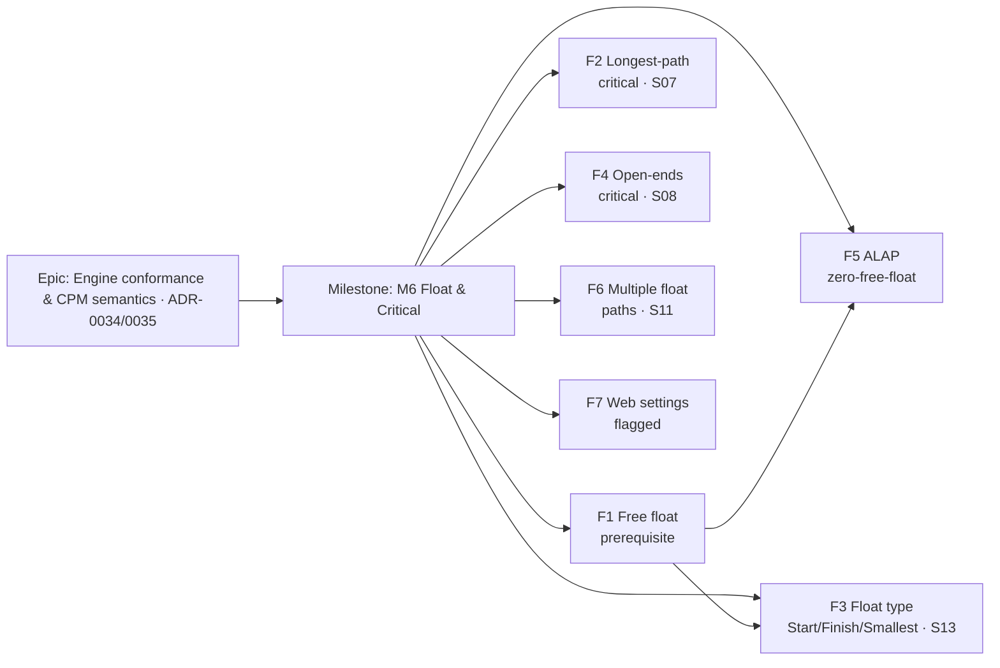

# Implementation Plan: M6 — Float & Critical (ADR-0035 §17–§20)

- **Feature spec:** `docs/specs/engine-conformance-framework/M6-float-and-critical-feature-spec.md`
- **Status:** **Approved** (2026-07-16) — build engine + conformance first, then the flagged web surface.
- **Owner:** engine + conformance

> **Approved scope (2026-07-16).** F1–F5 in full. **F6:** build the engine analysis (F6.T1) + conformance
> S11 (F6.T2); **defer the read endpoint (F6.T3)** to a follow-on. **F7:** yes — three plan-settings pickers
> behind a `VITE_` flag; float-path visualisation deferred. Design defaults taken: one mode-selected
> `totalFloat` field (start/finish kept internal); **persist** `free_float` as an engine-owned column;
> ship `critical_float_threshold` (default 0) with its UI deferred; options live at plan level.

## Breakdown

### Epic

**Engine conformance & CPM semantics (ADR-0034/0035)** — bring SchedulePoint's CPM engine to documented,
P6-class parity, proven by the conformance framework. **M6** is the **Float & Critical** capability slice.

### Milestone: M6 — Float & Critical (shippable slice)

**Outcome:** planners can select the plan's critical definition (`Total Float ≤ threshold` / `Longest Path`),
the total-float type (Start/Finish/Smallest), and "make open-ends critical"; the engine reports **free float**
and settles flagged ALAP activities to free-float = 0; and (optionally) planners analyse the multiple float
paths into a target. Conformance scenarios **S07/S08/S11/S13** and rows **con_alap/float_zero_free** flip to ✅,
and ADR-0035 §11/§17–§20 move to **Accepted** — with the default of every option keeping `main` byte-identical.

**Global invariant for every task:** with all new options at their defaults, the existing golden suite and all
prior scenarios (S01–S06, S12) are **byte-identical** (the ADR-0037/ADR-0034 parity gate). Any golden re-baseline
is a reviewed change, never silent.

---

#### Feature: F1 — Free float computation (prerequisite)

> **Description:** compute per-activity **free float** (`min(successor early start) − early finish`, own
> calendar; = total float for an open end) in the engine, persist it as an engine-owned column, and expose it.
> **Complexity:** M
> **Dependencies:** none (builds on the existing forward pass + graph).
> **Risks:** free-float definition at merge points / mixed calendars → mitigate with first-principles goldens
> and ADR-0037 own-calendar measurement; open-end free-float convention → document and assert.
> **Testing:** engine unit goldens (chain, merge point, floating branch, open end, mixed calendar); service
> write test; parity check (default path unchanged).

##### Task F1.T1 — Engine: compute `freeFloat`

- **Description:** in `compute.ts`, after the forward pass, compute free float per activity as the working time
  (own calendar) from its early finish to the **earliest successor early start**; open ends (no successors)
  take their total float. Add `freeFloat: number` to `EngineResult` (`types.ts`) with a doc comment.
- **Complexity:** M
- **Dependencies:** none
- **Risks:** SS/FF/SF successor relationships change what "successor start bound" means → reuse
  `forwardLowerBound` semantics for consistency; document the chosen convention.
- **Testing:** goldens in a new `compute.free-float.spec.ts` computed by hand.
- **Development steps:**
  1. Add `freeFloat` to `EngineResult`; compute it in the results loop using existing early maps + graph.outgoing.
  2. Handle the open-end case (freeFloat = totalFloat) and document it.
  3. Extend `goldens.ts` expectations with `freeFloat` where load-bearing; add the dedicated spec.
  4. Update the ADR-0035 §11 note / capability matrix `float_zero_free` (partial → carried by F5).

##### Task F1.T2 — Persist + expose free float

- **Description:** add engine-owned `free_float` column (`Activity`), write it in the batched recalc `unnest`
  UPDATE (no version bump), and surface `freeFloat` on the activity schedule read DTO + shared type.
- **Complexity:** S
- **Dependencies:** F1.T1
- **Risks:** write-contract drift → follow the exact `total_float` pattern; **run database-architect**.
- **Testing:** service spec (column written, version untouched); DTO/serialisation test.
- **Development steps:**
  1. Prisma migration: `free_float Int?` (constant default null, no data migration).
  2. Extend the recalc write + repository row mapping.
  3. Add `freeFloat` to the activity schedule DTO + `@repo/types`; changeset; docs (`DATABASE.md`, `API.md`).

---

#### Feature: F2 — Selectable critical definition: Longest Path (S07)

> **Description:** add plan option `criticalPathDefinition {TOTAL_FLOAT|LONGEST_PATH}` (+ `criticalFloatThreshold`)
> and implement Longest Path by walking backward along **driving edges** from the project-finish-driving
> activities; `isCritical` fills from the chosen definition.
> **Complexity:** M
> **Dependencies:** reuses the existing driving-edge output (M3); independent of F1.
> **Risks:** defining "project-finish-driving" set (open ends that end latest) → base on `earlyFinish ==
projectFinish`; interaction with negative float / multiple finish drivers → goldens for both.
> **Testing:** engine goldens (A12700-style open-end negative-float case); S07 differential; parity default.

##### Task F2.T1 — Engine: Longest-path criticality

- **Description:** add `criticalDefinition` + `criticalFloatThresholdMinutes` to `ComputeOptions`; compute a
  `onLongestPath` set by seeding project-finish drivers and walking backward over `isDriving` edges; set
  `isCritical` = (`TOTAL_FLOAT` ⇒ `totalFloat ≤ threshold`) or (`LONGEST_PATH` ⇒ `onLongestPath`). Keep
  near-critical total-float-based.
- **Complexity:** M
- **Dependencies:** F0/none
- **Risks:** tie-breaks when several activities finish at the project finish → include all; milestone finish
  tie-break already handled → reuse.
- **Testing:** `compute.longest-path.spec.ts` (A12700 critical under TF≤0, not under Longest Path).
- **Development steps:**
  1. Extend `ComputeOptions` + threshold default 0.
  2. Build the driving-edge adjacency (reuse `edgeResults`), compute the backward-reachable set from finish drivers.
  3. Branch `isCritical` on the definition; update `criticalCount`.
  4. Goldens + doc comments (ADR-0035 §17).

##### Task F2.T2 — Thread the plan option + persist

- **Description:** add the `CriticalPathDefinition` enum + `critical_path_definition` / `critical_float_threshold`
  columns; read them into `ComputeOptions` in `ScheduleService`; echo on plan DTOs.
- **Complexity:** S
- **Dependencies:** F2.T1; database-architect for the migration
- **Risks:** enum default must be behaviour-preserving → default `TOTAL_FLOAT`, threshold 0.
- **Testing:** service spec (option threaded); plan DTO test; parity default.
- **Development steps:**
  1. Prisma enum + columns (constant defaults). 2. Service wiring + create/update/response DTOs. 3. Changeset + docs.

##### Task F2.T3 — Conformance: S07 runnable + differential-predicate extension

- **Description:** extend the differential predicate to also compare **`isCritical`** (S07/S08 change criticality,
  not dates), flip `SCENARIO_SUPPORT.S07` to runnable, and assert `resultsDiffer`/critical-set differs vs the
  TF≤0 baseline; update the capability matrix row + scenario table.
- **Complexity:** S
- **Dependencies:** F2.T1
- **Risks:** predicate change could mask a real date regression → keep date comparison and ADD criticality, don't replace.
- **Testing:** `scenarios.spec.ts` S07 assertion; matrix update in the same PR.

---

#### Feature: F3 — Total float as Start / Finish / Smallest (S13)

> **Description:** add plan option `totalFloatMode {START|FINISH|SMALLEST}`; select the measure of `totalFloat`.
> **Complexity:** M
> **Dependencies:** benefits from F1 (Smallest needs both start- and finish-float internally); independent otherwise.
> **Risks:** divergence only on mixed calendars (ADR-0037) → S13 must run with per-activity calendars on;
> measuring on the own calendar → reuse `cal.workingTimeBetween` on both start and finish sides.
> **Testing:** engine goldens (mixed-calendar activity where start≠finish float); S13 differential; parity default.

##### Task F3.T1 — Engine: float-mode selection

- **Description:** compute start-float (LS−ES) and finish-float (LF−EF) on the own calendar; set `totalFloat`
  per `totalFloatMode` (FINISH default = today's value; START; SMALLEST = min). Keep both intermediates internal.
- **Complexity:** M
- **Dependencies:** none
- **Testing:** `compute.float-mode.spec.ts`.
- **Development steps:** extend `ComputeOptions`; compute both floats; branch `totalFloat`; goldens; doc (ADR-0035 §18).

##### Task F3.T2 — Thread the plan option + persist + S13 runnable

- **Description:** add `TotalFloatMode` enum + `total_float_mode` column (default FINISH); thread into
  `ComputeOptions`; echo on plan DTOs; flip `SCENARIO_SUPPORT.S13` runnable (extend the differential predicate to
  compare `totalFloat`) asserting divergence for `A4340/A7710/A11100/A5500`; matrix update.
- **Complexity:** S–M
- **Dependencies:** F3.T1; database-architect; the predicate extension from F2.T3
- **Testing:** service spec; S13 differential (needs `honorActivityCalendars` on in the adapter for S13).

---

#### Feature: F4 — Make open-ends critical (S08)

> **Description:** add plan option `makeOpenEndsCritical` (default off); when on, flag every open-ended
> activity critical, OR-ed with the active definition.
> **Complexity:** S
> **Dependencies:** F2 (shares the `isCritical` assembly); independent engine-wise.
> **Risks:** open-end definition (no successors vs no predecessors, per §20 = `A9500/A3900/A12700`) → follow the
> fixture's expected set; ensure OR-ing doesn't drop existing critical members.
> **Testing:** engine golden; S08 differential (reuses the criticality-comparison predicate); parity default.

##### Task F4.T1 — Engine + plan option + S08 runnable

- **Description:** add `makeOpenEndsCritical` to `ComputeOptions`; OR open-end criticality into `isCritical`; add
  `make_open_ends_critical` column (default false); thread + echo on DTOs; flip `SCENARIO_SUPPORT.S08` runnable
  asserting `A9500/A3900/A12700` become critical; matrix update.
- **Complexity:** S
- **Dependencies:** F2.T1 (definition assembly), F2.T3 (predicate extension); database-architect
- **Testing:** `compute.open-ends.spec.ts`; scenario spec; service spec; changeset + docs.

---

#### Feature: F5 — ALAP zero-free-float refinement (con_alap / float_zero_free)

> **Description:** complete ADR-0035 §11: a flagged As-Late-As-Possible activity keeps its **pure**
> early/late/total-float unchanged (display-only) but its **effective** placement is refined so it is as late as
> successors allow — its `freeFloat = 0`.
> **Complexity:** M
> **Dependencies:** **F1 (free float)** — hard prerequisite.
> **Risks:** must not touch the pure passes (§11) → refine only the effective/ALAP placement layer, like the
> effective-Visual pass; open-end ALAP → falls back to late dates per §11.
> **Testing:** engine golden (A9400-style: freeFloat 0, totalFloat unchanged); con_alap 🟡→✅; float_zero_free 🟡→✅.

##### Task F5.T1 — Engine: place ALAP at the zero-free-float position

- **Description:** for a `scheduleAsLateAsPossible` activity, compute its effective placement as late as
  possible without delaying any successor's early start (so free float = 0 at that placement), leaving
  `early*/late*/totalFloat` pure. Surface it on the effective placement fields; ensure `freeFloat` reflects 0.
- **Complexity:** M
- **Dependencies:** F1.T1
- **Testing:** `compute.alap.spec.ts` (extend); update `goldens.ts` `alap-*` case with `freeFloat: 0`.
- **Development steps:** compute the zero-free-float placement in the ALAP/effective layer; assert pure fields
  unchanged; flip capability rows `con_alap` and `float_zero_free`; doc (ADR-0035 §11).

---

#### Feature: F6 — Multiple float paths to a target (S11) — largest / deferrable

> **Description:** a read-only analysis returning the **ranked contiguous driving chains** into a target
> activity (path 0 = driving chain; then increasing float), bounded by `maxPaths`. Optionally a read endpoint.
> **Complexity:** L
> **Dependencies:** driving-edge output (M3); best after F1 (float ranking) and F2 (driving-set logic).
> **Risks:** combinatorial blow-up on dense networks → bound with `maxPaths` + depth guard; output-shape is a new
> contract → record in the spec + `docs/DECISIONS.md`; **may warrant deferral to a follow-on milestone** — call
> it out at approval.
> **Testing:** engine goldens (small multi-path network with a known ranking); S11 asserted via a **path-shape**
> comparison (not `resultsDiffer` on dates); endpoint tests (authz, scope, 404) if the endpoint lands.

##### Task F6.T1 — Engine: `computeFloatPaths(network, target, maxPaths)`

- **Description:** enumerate contiguous chains from the target backward along logic, rank by relative float,
  return ordered `{ index, relativeFloat, activityIds }` bounded by `maxPaths`. Pure, read-only.
- **Complexity:** L
- **Dependencies:** F1.T1, F2.T1
- **Testing:** `compute.float-paths.spec.ts` (contiguity + ranking; not a total-float sort).

##### Task F6.T2 — Conformance: S11 runnable (path-shape assertion)

- **Description:** flip `SCENARIO_SUPPORT.S11` runnable; assert the paths into `A12500` are contiguous chains,
  path 0 driving; add a path-shape comparison helper; matrix update.
- **Complexity:** S
- **Dependencies:** F6.T1

##### Task F6.T3 — (Optional) read endpoint

- **Description:** `GET .../plans/:id/schedule/float-paths` (`schedule:read`, org-scoped, read-only, 404 on
  unknown target), standard envelope. Behind the same milestone flag; **deferrable**.
- **Complexity:** M
- **Dependencies:** F6.T1; api-reviewer + security-reviewer
- **Testing:** controller/service e2e (authz, scope/IDOR, 404, envelope).

---

#### Feature: F7 — Web settings (flagged, later slice)

> **Description:** plan scheduling settings — critical-definition picker, total-float-mode picker, make-open-ends
> toggle — behind a flag, mirroring `PlanRecalcModePicker`/`PlanExpectedFinishToggle`. Float-path visualisation
> **deferred**.
> **Complexity:** M
> **Dependencies:** F2/F3/F4 DTOs landed.
> **Risks:** UI drift / one-off styling → reuse the design system + existing picker pattern; a11y → WCAG 2.2 AA.
> **Testing:** component tests (mirroring `PlanRecalcModePicker.test.tsx`), a11y checks, e2e for the settings flow.

##### Task F7.T1 — Settings controls + wiring

- **Description:** add the three controls, wire to the plan update mutation + query cache, behind
  `VITE_FLOAT_CRITICAL_SETTINGS`; loading/empty/error/success states.
- **Complexity:** M
- **Dependencies:** F2.T2, F3.T2, F4.T1
- **Testing:** component + a11y + e2e; review with ux/component/accessibility reviewers; changeset + docs.

---

## Sequencing & slices

Each feature is an independently releasable slice (options default to today's behaviour ⇒ `main` stays
byte-identical and releasable). Recommended order — **engine + conformance first (differential gates prove
correctness), web last**:

1. **F1 Free float** (prerequisite for F5/F3-Smallest).
2. **F2 Longest-path critical (S07)** — includes the differential-predicate extension (compare criticality)
   that F4/F3 reuse.
3. **F3 Float type (S13)** and **F4 Open-ends (S08)** — parallelisable after F2's predicate extension.
4. **F5 ALAP zero-free-float** — after F1.
5. **F6 Multiple float paths (S11)** — largest/most uncertain; **independently deferrable** to a follow-on
   milestone if approval prefers to keep M6 tight (F6.T3 endpoint is optional even within F6).
6. **F7 Web settings** — flagged; after the F2/F3/F4 DTOs.

**Feature flags:** `VITE_FLOAT_CRITICAL_SETTINGS` (web); the engine/API changes are dark by default (options
default to current behaviour), so no server flag is required.

## Definition of Done (per task)

Each task's PR must satisfy the Feature Completion Criteria in `docs/PROCESS.md` (code, tests ≥ 80% on changed
code, docs incl. capability-matrix/ADR-0035 acceptance-ledger updates, security review, performance,
accessibility for UI, Docker build, CI green, changeset, version impact). **Additionally:** every engine PR
runs the full golden + scenario suite and demonstrates the default path is byte-identical, and each S-scenario
PR flips its `SCENARIO_SUPPORT` entry and capability-matrix row in the same change.

## Risks & assumptions (rollup)

| Risk / assumption                                                                     | Likelihood | Impact | Mitigation                                                                                      |
| ------------------------------------------------------------------------------------- | ---------- | ------ | ----------------------------------------------------------------------------------------------- |
| Longest-path "finish-driver" set defined wrongly (open ends vs true finish)           | med        | high   | First-principles goldens incl. `A12700`; base on `earlyFinish == projectFinish`; review.        |
| Differential predicate change (compare criticality/float) masks a date regression     | med        | med    | Add criticality/float comparison **alongside** the date comparison, never replacing it.         |
| Free-float / Smallest divergence only visible on mixed calendars → weak test coverage | med        | med    | S13 runs with per-activity calendars on; dedicated mixed-calendar goldens.                      |
| Multiple-float-paths combinatorial blow-up / uncertain output shape                   | med        | med    | `maxPaths` + depth guard; F6 sliced last and **deferrable**; record shape in DECISIONS.md.      |
| ALAP refinement accidentally touches the pure passes (violates §11)                   | low        | high   | Refine only the effective/ALAP placement layer; assert pure fields unchanged in goldens.        |
| New plan columns/enums drift from the engine-owned write contract                     | low        | med    | Mirror `use_expected_finish_dates` / `total_float`; database-architect review; migration tests. |
| F6 endpoint judged architecturally significant                                        | low        | low    | Lightweight ADR or defer F6 to a follow-on milestone (rest of M6 ships without it).             |

## Recommended specialised agents (build phase)

- **database-architect** — the plan-option columns/enums + engine-owned `free_float` migration (before writing it).
- **api-reviewer** + **security-reviewer** — plan DTO additions and the optional float-paths endpoint (envelopes,
  status codes, authz + org scope / IDOR, engine-owned fields never client-writable).
- **backend-performance-reviewer** — free-float / longest-path O(V+E) reuse of the driving-edge output; path
  enumeration bounds; single graph load (no N+1).
- **test-engineer** — first-principles goldens, differential scenarios, endpoint tests.
- **ux-reviewer / component-reviewer / accessibility-reviewer** — the flagged F7 settings UI.
</content>
