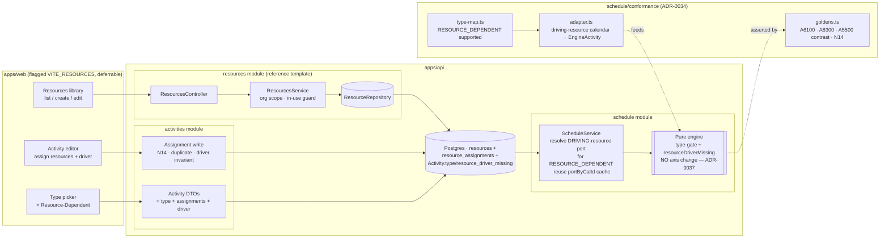
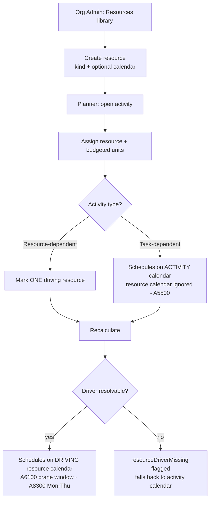

# Feature Spec: M7 — The Resource dimension (ADR-0035 §23 resource-dependent scheduling; §25 N14)

- **Status:** Draft (awaiting approval)
- **Author(s):** feature-analyst (with James Ewbank)
- **Date:** 2026-07-17
- **Tracking issue / epic:** Engine conformance & validation framework (ADR-0034) — capability epic **M7 (the Resource dimension)**, the **last** remaining capability area.
- **Roadmap link:** `docs/specs/engine-conformance-framework/CAPABILITY_MATRIX.md` — the single remaining ❌ (_Resource-dependent scheduling_: `type_resource_dependent`, `res_calendar_drives`, `res_driving`) plus the four ⚪ deferred groups (resources/levelling/cost/EV/accrual/curves; duration types `dt_*`; percent-complete types `pct_*`; external/inter-project `net_external_*`/S09), scenario **S10** (resource levelling) and negative **N14** (negative units).
- **Related ADR(s):** **ADR-0039 _(NEW — required, drafted by this epic)_** — resource model & resource-calendar scheduling (rungs 1–2); ADR-0035 **§23** (this epic _builds and Accepts_ it) + **§25** (N14 boundary reject); ADR-0037 (per-activity calendars / the engine's absolute working-instant axis — the seam rung 2 rides on); ADR-0024 (org calendar library — the sibling-library pattern the Resource library mirrors, and the calendar a resource references); ADR-0016/0012 (tenancy & RBAC + resource scoping); ADR-0022 (recalc/persistence write contract); ADR-0021 (dependency DAG — orthogonal). **Resource levelling (S10) will need its own ADR** (a heavier scheduling-algorithm change); **cost/earned-value/curves** and **external/inter-project (S09)** are each likely their own ADR when their rung lands.

> **This epic opens SchedulePoint's whole resource dimension** — the last unbuilt capability area on the
> conformance matrix. It is deliberately decomposed into **sequenced rungs**; the deep design here focuses on
> the **first two, highest-value, prerequisite** rungs and **sketches** the later ones (levelling, duration/units
> types, percent-complete/earned value, cost/curves/accrual, external/inter-project), rough-sizing them and
> flagging which need their own ADR. Nothing later than rung 2 is designed to build-ready depth in this spec.
>
> - **Rung 1 — a resource model + assignment** (the prerequisite everything else needs): an org-scoped
>   `Resource` entity (labour / equipment / material kinds, an optional own **calendar**, availability) and a
>   `ResourceAssignment` linking resources to activities. Schema + API + `@repo/types`, built from the reference
>   template. **N14** (negative units) rejects at the boundary here (ADR-0035 §25).
> - **Rung 2 — resource-dependent scheduling (ADR-0035 §23)**: the ❌ → ✅ rung. A `RESOURCE_DEPENDENT` activity
>   schedules on its **driving resource's** resolved calendar instead of its own, wired through the engine's
>   existing per-activity calendar-port seam (ADR-0037). Flips `type_resource_dependent` / `res_calendar_drives`
>   / `res_driving`; makes an S05-style conformance differential (A6100 crane-hire window, A8300 Mon–Thu
>   specialist calendar).
> - **Rungs 3+ (sketched only):** resource **levelling** (S10 — its own sub-epic + ADR), **duration/units
>   types** (`dt_*`), **percent-complete / earned-value types** (`pct_*`), **cost / EV / curves / accrual**, and
>   **external / inter-project** (S09).

---

## 1. Business understanding

### Problem

SchedulePoint's engine has, milestone by milestone (M1–M6, M5-epic), reached documented P6-class parity on
**time**: hour/shift-granular calendars (ADR-0036), per-relationship lag calendars (M3), progress & retained
logic (M2), the advanced constraints (M4), float & critical (M6), per-activity calendars (ADR-0037), and the
advanced activity types LOE + WBS-summary (M5-epic). What it has **never modelled is a resource.** There is no
`Resource` entity, no assignment of a resource to an activity, no notion of a crew, a crane, or a concrete
tonnage in the schema (verified: `schema.prisma` has `Client → Project → Plan → Activity → ActivityDependency`
and a `Calendar` library, and **nothing resource-shaped**). Every capability that depends on knowing _who_ or
_what_ does the work is therefore parked:

- **Resource-dependent scheduling (the one remaining ❌).** A construction activity is often gated not by its
  own working calendar but by **the availability of the resource that does it.** The fixture is explicit
  (`TEST_MATRIX.md` §5): **A6100** (a 600t crawler-crane lift) has an activity calendar (CAL-06) that would
  allow a **May** start, but the crane is **only on hire 27-Jul → 21-Aug** (`RCAL-CRANE600`, a window-only
  calendar) — _"if you get a May start, you're using the wrong calendar."_ **A8300** runs an HV specialist who
  works **Mon–Thu** (`RCAL-SPECIALIST`, a 4-day week) — _no work may land on a Friday_ even though the activity
  calendar is Mon–Fri. P6 models this as a **Resource-Dependent** activity type that schedules on the **driving
  resource's** calendar, not the activity's (ADR-0035 §23). SchedulePoint cannot represent it — `mapActivityType('RESOURCE_DEPENDENT')`
  returns `{ supported: false, reason: 'resource-dependent scheduling is not implemented (ADR-0035 §23, M5)' }`
  in `conformance/type-map.ts`, and the capability row is the last ❌ in the matrix.
- **The whole deferred quadrant.** Resource **levelling** (serialise two activities competing for a single 600t
  crane — S10), **duration/units types** (`dt_fixed_units` / `dt_fixed_units_time` / `dt_fixed_dur_units` — where
  duration and units trade off), **percent-complete types** (`pct_physical` / `pct_units` — where % complete is
  driven by units installed), **cost / earned value / curves / accrual** (budget, CPI/SPI, front/back-loaded
  histograms), and **external / inter-project** dates (S09) all need, first, a resource/units model to hang off.

The contrast case matters as much as the driving case: **A5500** is a `TASK_DEPENDENT` activity assigned a
resource whose own calendar (CAL-02 day shift) differs from the activity calendar (CAL-04 nights) — and here the
**activity calendar wins**; the resource's calendar is **ignored**. So resource-calendar-drives is a property of
the **resource-dependent activity type**, not of "having an assigned resource." Getting this right is the crux of
rung 2.

**Why now.** M7 is the last capability area, and the foundation it needs already exists. ADR-0037 moved the
engine off plan-calendar offsets onto an **absolute working-instant axis** where **each activity already
resolves onto its own calendar port** (`EngineActivity.calendar`, resolved and cached per-recalc in
`schedule.service.ts`). A resource's calendar is a natural extension of that **same** port: rung 2 is, at heart,
_"for a resource-dependent activity, resolve the port from the driving resource's `calendarId` instead of the
activity's own"_ — a **service-layer resolution change**, the pure engine staying calendar-agnostic. The
expensive half (the instant axis) is already paid for.

### Users

| Persona                             | Organisation role (ADR-0012/0016) | Need                                                                                                                                                    |
| ----------------------------------- | --------------------------------- | ------------------------------------------------------------------------------------------------------------------------------------------------------- |
| **Org Admin**                       | `ORG_ADMIN`                       | Curate the org's **resource library** (crews, plant, materials) and their availability calendars — the shared reference data planners draw on.          |
| **Planner**                         | `PLANNER`                         | Assign resources to activities; mark an activity **resource-dependent** so it schedules on the driving resource's real availability (the crane window). |
| **Contributor**                     | `CONTRIBUTOR`                     | Assign resources to activities they own; smaller scope, same need.                                                                                      |
| **Viewer / External Guest**         | `VIEWER` / guest                  | Read a schedule where resource-dependent activities land on the right dates and see what resources an activity uses; no edits.                          |
| **Engine / conformance maintainer** | (engineering)                     | Prove resource-dependent scheduling against the fixture (A6100/A8300 goldens + an S05-style differential), flip the matrix row + N14, Accept §23.       |

### Primary use cases

1. **Curate the resource library** — an Org Admin creates org-scoped resources (a Civil crew, a 600t crane,
   ready-mix concrete), each with a **kind** (labour / equipment / material) and an optional **own calendar**
   (the crane's hire window, the specialist's 4-day week) and availability.
2. **Assign a resource to an activity** — a Planner attaches one or more resources to an activity with a
   budgeted quantity of work (units).
3. **Mark an activity resource-dependent** — a Planner sets an activity's type to **Resource-Dependent** and
   designates the **driving** resource; on recalculation the activity schedules on that resource's calendar.
4. **Recalculate** and read a schedule where a resource-dependent activity lands inside its driving resource's
   availability (the crane on hire 27-Jul → 21-Aug; the specialist never on a Friday), while an ordinary
   task-dependent activity with an assigned resource still schedules on the **activity** calendar.
5. **(Engine/conformance)** run A6100/A8300 as goldens and an S05-style differential; flip `type_resource_dependent`
   / `res_calendar_drives` / `res_driving` and N14; Accept ADR-0035 §23.
6. **(Later rungs — sketched)** level over-allocations (S10), model units/duration-types, drive %-complete from
   units, roll up cost / earned value / resource histograms, and honour external/inter-project dates (S09).

### User journeys

**Happy path (rung 1 — build the library & assign).** An Org Admin opens **Resources** (a new org-scoped
library alongside Calendars), creates _"600t Crawler Crane"_ (kind **Equipment**, calendar _"Crane hire window"_)
and _"Civil Crew"_ (kind **Labour**, calendar _"6-Day Construction"_). A Planner opens an activity and **assigns**
the Civil Crew with a budgeted quantity. Nothing about the schedule changes yet — assignment is reference data
until an activity is made resource-dependent.

**Happy path (rung 2 — resource-dependent scheduling, §23).** The Planner opens the crane-lift activity (A6100),
sets its **type → Resource-Dependent**, assigns the 600t Crane and marks it the **driving** resource, and
recalculates. The activity — which on its own CAL-06 calendar could start in May — is instead pinned into the
crane's **27-Jul → 21-Aug hire window**; its successors move accordingly. For A8300 the HV specialist's Mon–Thu
calendar means the activity never schedules work on a Friday. The contrast activity A5500 (task-dependent, with an
assigned resource on a different calendar) is **unchanged** — the activity calendar still wins.

**Alternate (no resources / no resource-dependent activity).** A plan with no resources, or with resources
assigned but no `RESOURCE_DEPENDENT` activity, recalculates **byte-identically** to today. The whole dimension is
inert until an activity is made resource-dependent (the parity gate).

**Read-only (Viewer / Guest).** Sees the resource library and an activity's assignments read-only; the
resource-dependent activity's dates reflect the driving calendar; no create/assign affordance.

**Engine/conformance journey.** The maintainer flips `mapActivityType('RESOURCE_DEPENDENT')` to supported, teaches
the adapter to attach the driving resource's calendar to a resource-dependent `EngineActivity`, adds
first-principles goldens for A6100 (crane window) and A8300 (Mon–Thu), makes an S05-style differential (flip an
activity task↔resource-dependent ⇒ dates move), rejects N14 at the boundary, flips the matrix row + N14, and moves
ADR-0035 §23 to **Accepted** — with the no-resource path byte-identical.

See the user-flow diagram in §4.

### Expected outcomes

- Org Admins and Planners can model the **resources** construction actually schedules around, and pin an activity
  to the **availability of the resource that does it** (the single most-requested scheduling behaviour the engine
  still lacks).
- SchedulePoint gains a general, forward-compatible **resource model** (org-scoped library + activity assignment)
  that unblocks every later rung (levelling, units/duration types, %-complete, cost/EV, curves).
- The conformance matrix's last ❌ (_Resource-dependent scheduling_) flips to ✅; **N14** flips to a boundary
  reject; ADR-0035 **§23** moves to **Accepted**; the deferred groups gain a concrete owning rung.

### Success criteria

- **Resource-dependent drives (A6100 / `res_calendar_drives` / `res_driving`):** a `RESOURCE_DEPENDENT` activity
  whose driving resource is on a **window-only** calendar (hire 27-Jul → 21-Aug) schedules **inside that window**
  even though its own activity calendar would allow an earlier start; verified by a first-principles golden.
- **Resource-dependent 4-day week (A8300):** a resource-dependent activity on a Mon–Thu specialist calendar
  schedules **no work on a Friday**; golden.
- **Contrast holds (A5500):** a `TASK_DEPENDENT` activity with an assigned resource on a different calendar
  schedules on the **activity** calendar (resource calendar ignored) — the resource-calendar-drive is
  type-gated; golden/assert.
- **S05-style differential:** flipping one activity between `TASK` and `RESOURCE_DEPENDENT` (its driving resource
  on a distinct calendar) produces **different** dates — the option is provably wired.
- **N14 (negative units):** a resource assignment with negative units is **rejected at the API boundary**
  (`@Min(0)`), never persisted (ADR-0035 §25).
- **Parity gate:** a plan with **no resources / no resource-dependent activity** recalculates **byte-identically**
  to the pre-epic output across every prior golden + scenario (S01–S13, all negatives) — the ADR-0034/0037 gate.
- **Tenancy & standards:** resources are **org-scoped**, soft-deleted, audited, optimistic-locked, deny-by-default
  RBAC + org scope — built from the reference template (ADR-0015) exactly like `Calendar`; `pnpm lint && typecheck
&& test` green; **ADR-0039 accepted**; database-architect, api, security, backend-performance (and, for the
  flagged UI, a11y/component/ux) reviews clean.

### Open questions

The design-changing ones are surfaced for approval in the implementation plan's **"Critical questions for
approval."** Defaults are stated inline so work is not blocked. In brief the four that change scope/design are:
(1) **rung-1 model breadth** — a lean resource/assignment (kind + optional calendar + budgeted units) now, adding
cost/curve/EV columns only when their rung lands, vs. a wider forward-declared schema; (2) **how the driving
resource is designated** — a per-assignment `isDriving` boolean with a "exactly one driving on a resource-dependent
activity" invariant, vs. a `drivingResourceId` on the activity; (3) **`RESOURCE_DEPENDENT` as a new `ActivityType`
enum member** (mirroring the fixture/P6) vs. a boolean flag; (4) **product-surface scope** — ship schema + engine +
conformance now with the web resource library / assignment / type picker behind a flag as the last, deferrable
slice (mirroring M5-epic/M6), vs. holding for the full UX. Recommended defaults: **lean model** (kind, optional
`calendarId`, `budgetedUnits`/`unitOfMeasure`; no speculative cost columns); **per-assignment `isDriving`** +
service invariant; **new `RESOURCE_DEPENDENT` enum member**; **engine + conformance now, web flagged/deferrable.**

---

## 2. Functional requirements

### User stories & acceptance criteria

> **US-1 (Resource library CRUD)** — As an **Org Admin**, I want to create and manage org-scoped resources with a
> kind and an optional own calendar, so that planners share one curated list of crews, plant and materials.
>
> **Acceptance criteria**
>
> - **Given** I have `resource:create` in an org **when** I create a resource with a name, a `kind` (LABOUR /
>   EQUIPMENT / MATERIAL) and optionally a `calendarId` (an active calendar in the same org) **then** it is
>   created, org-scoped, versioned, audited, and appears in the org's resource list.
> - **Given** a resource name that collides with an **active** resource in the same org **then** I get 409
>   `DUPLICATE_RESOURCE` (a soft-deleted name is free to reuse) — mirroring the calendar library.
> - **Given** a `calendarId` that is not an active calendar in the org **then** I get 404 before any write
>   (in-org lookup, like the plan/activity calendar picker).
> - **Given** I delete a resource still **assigned to an active activity** **then** I get 409 `RESOURCE_IN_USE`
>   with a count (the delete-in-use guard, mirroring `CALENDAR_IN_USE`).

> **US-2 (Assign a resource to an activity)** — As a **Planner/Contributor**, I want to assign resources to an
> activity with a budgeted quantity, so that I record who/what does the work.
>
> **Acceptance criteria**
>
> - **Given** I hold the edit pen (ADR-0028) and `activity:update` **when** I assign a resource in the same org to
>   an activity with `budgetedUnits ≥ 0` **then** the assignment is created (org- and plan-scoped, versioned).
> - **Given** I assign the **same** resource to the **same** activity twice **then** the second is rejected 409
>   `DUPLICATE_ASSIGNMENT` (one assignment per (activity, resource); partial-unique index).
> - **Given** `budgetedUnits < 0` (N14) **then** it is **rejected at the boundary** (`@Min(0)`), never persisted.
> - **Given** a resource or activity in another org/plan **then** the assignment is rejected (scope check, 404).

> **US-3 (Mark an activity resource-dependent + designate the driver)** — As a **Planner**, I want to make an
> activity resource-dependent and mark which assigned resource drives it, so that it schedules on that resource's
> real availability.
>
> **Acceptance criteria**
>
> - **Given** an activity of type `RESOURCE_DEPENDENT` with exactly one assignment flagged `isDriving = true`
>   **when** I recalculate **then** the activity's duration is advanced, its dates derived and its float measured
>   on the **driving resource's** calendar (resolved via the driving resource's `calendarId`), not the activity's.
> - **Given** a `RESOURCE_DEPENDENT` activity with a driving resource on a **window-only** calendar (A6100 crane
>   hire) **then** it schedules **inside the window**, even if its activity calendar would allow an earlier start.
> - **Given** a driving resource on a **Mon–Thu** calendar (A8300) **then** no work lands on a Friday.
> - **Given** a `RESOURCE_DEPENDENT` activity with **no** driving assignment, **or more than one**, **then** the
>   engine **produces-and-flags** it (`resourceDriverMissing`, engine-owned) and falls back to the activity
>   calendar — never a crash (see the N-style contract in §4); the service also validates the "exactly one
>   driver" rule on write (default reject; see the critical question).

> **US-4 (Task-dependent activity ignores the resource calendar — contrast)** — As a **Planner**, I want an
> ordinary (task-dependent) activity to schedule on its **own** calendar even when it has assigned resources on
> other calendars, so that resource-calendar-drive is opt-in per §23.
>
> **Acceptance criteria**
>
> - **Given** a `TASK` activity (A5500) with a resource whose own calendar differs from the activity calendar
>   **when** I recalculate **then** the activity schedules on the **activity** calendar; the resource calendar is
>   **ignored** (adding/removing the assignment leaves its dates byte-identical).

> **US-5 (Read resources & assignments)** — As any member, I want to read the resource library and an activity's
> assignments, so that modelling intent is visible.
>
> **Acceptance criteria**
>
> - **Given** `resource:read` **when** I list resources **then** I get the org-scoped, paginated list (standard
>   `{ data, meta }` envelope, cursor pagination — `docs/API.md`).
> - **Given** an activity **when** I read it **then** I can read its assignments (resource id, kind, units, whether
>   driving); a resource-dependent activity's response reflects the driving-calendar dates.

> **US-6 (Conformance)** — As an **engine maintainer**, I want the fixture's resource-dependent activities to
> become runnable goldens/differentials, so that §23 is proven wired.
>
> **Acceptance criteria**
>
> - `mapActivityType('RESOURCE_DEPENDENT')` becomes **supported**; the adapter attaches the **driving resource's**
>   calendar to the resource-dependent `EngineActivity` (from the fixture's `assignments.csv` `res_driving` +
>   `resources.csv` `calendar`), and leaves task-dependent activities on the activity calendar.
> - First-principles goldens assert A6100 (crane window) and A8300 (Mon–Thu); an S05-style differential asserts a
>   task↔resource-dependent flip moves dates; N14 (negative units) is a runnable negative; the capability row +
>   N14 flip to ✅ and ADR-0035 §23 moves to Accepted, **in the same PRs**.
> - The `TASK_DEPENDENT`-with-resource contrast (A5500) still schedules on the activity calendar.

### Workflows

1. **Curate a resource (write):** authz (`resource:*`, org scope re-resolved from the caller's memberships,
   anti-IDOR) → validate the optional `calendarId` is an active calendar in the org (in-org lookup under the
   calendar advisory lock, like the plan picker) → optimistic-locked create/update → response. Delete runs the
   `RESOURCE_IN_USE` guard (active assignments) under a resource advisory lock (mirrors `CalendarsService.remove`).
2. **Assign / mark driver (write):** authz (`activity:update`) + `assertHoldsPen` → validate resource is
   in-org + activity in-scope + `budgetedUnits ≥ 0` → optimistic-locked upsert; setting `type =
RESOURCE_DEPENDENT` requires exactly one `isDriving` assignment (validated).
3. **Recalculate (read-through):** the service loads activities (already selecting `calendarId`, now also loading
   each activity's **driving assignment → driving resource → resource `calendarId`**), and — for a
   `RESOURCE_DEPENDENT` activity — resolves the engine port from the **driving resource's** `calendarId` instead
   of the activity's own; it reuses the **existing per-recalc calendar-port cache** (`portByCalId`), so the crane
   calendar is built at most once. The engine runs unchanged on the instant axis; results persist via the
   engine-owned batched write (ADR-0022).
4. **Conformance run:** the adapter maps each fixture activity + its driving assignment's resource calendar onto
   the `EngineActivity` port; harness asserts A6100/A8300 + the differential + N14.

### Edge cases

- **No resources / assigned-but-no-resource-dependent-activity:** inert; byte-identical to today (parity gate).
- **Resource with no own calendar** (`calendarId = null`) on a resource-dependent activity: the driving-calendar
  resolution falls back to the **activity** calendar, then the plan default (documented fallback order) — never
  an error.
- **Resource-dependent activity with 0 or >1 driving assignments:** produce-and-flag `resourceDriverMissing` +
  fall back to the activity calendar (engine); the service default **rejects** the write that would leave the
  invariant broken (critical question).
- **Material resource** (concrete m³, no calendar / no hourly cap): may be assigned for units/quantity but is
  **never** a driver of dates (drive is a labour/equipment concept); a material flagged `isDriving` is rejected.
- **Driving resource's calendar soft-deleted:** the `RESOURCE_IN_USE` / `CALENDAR_IN_USE` guards should prevent
  it; defensively the resolver falls back to the activity calendar (mirrors the existing `resolveCalendar`
  defensive path).
- **Over-allocation** (two resource-dependent activities on the single 600t crane, A6100/A6200 — S10): **not
  levelled in rungs 1–2** — the schedule is produced with the overlap; levelling is a later rung. Documented,
  not silently "fixed."
- **Milestone / zero-duration resource-dependent activity:** duration 0 ⇒ start = finish regardless of calendar;
  harmless.
- **Concurrent edits:** optimistic lock (409) + pen (423) cover assignment and type edits; no new concurrency
  surface.

### Permissions (RBAC + resource scope, ADR-0012/0016)

Resources are a **new org-scoped sibling library** (like Calendars), so they get their own permission set;
**assignment** is an activity edit and reuses the activity permission + pen.

| Action                            | Permission                      | Scope        | Notes                                                              |
| --------------------------------- | ------------------------------- | ------------ | ------------------------------------------------------------------ |
| List / read resources             | `resource:read`                 | resolved org | every member                                                       |
| Create / update / delete resource | `resource:create/update/delete` | resolved org | Org Admin (governance); delete runs `RESOURCE_IN_USE` guard        |
| Assign / unassign / mark driver   | `activity:update`               | resolved org | pen-gated (ADR-0028), optimistic-locked; resource validated in-org |
| Set `type = RESOURCE_DEPENDENT`   | `activity:update`               | resolved org | pen-gated; requires exactly one `isDriving` assignment             |
| Recalculate                       | `schedule:calculate`            | resolved org | unchanged                                                          |
| Read schedule (driving dates)     | `schedule:read`                 | resolved org | every member                                                       |

New permissions: `resource:read/create/update/delete` (added to the RBAC map, ADR-0012). No new
schedule/activity permission. Deny-by-default throughout; engine-owned outputs never client-writable.

### Validation rules (shared client ↔ server where possible)

- `Resource.kind ∈ {LABOUR, EQUIPMENT, MATERIAL}` (new Prisma enum + `@repo/types` union in lock-step). (The
  fixture's `NONLABOUR` maps to `EQUIPMENT`.)
- `Resource.name` — required, unique per org among **active** rows (partial-unique index, like `Calendar`).
- `Resource.calendarId` — optional nullable uuid; when set must reference an **active calendar in the same org**
  (service in-org lookup → 404); `z.string().uuid().nullable().optional()` / `@IsUUID` + `@IsOptional`.
- `Resource.unitOfMeasure` — short string (e.g. `h`, `m3`, `te`); `Resource.maxUnitsPerHour` — optional,
  `≥ 0` (availability; consumed by **levelling**, a later rung — stored now only if the lean-model default keeps
  it, see the critical question).
- `ResourceAssignment.budgetedUnits` — `@Min(0)` (**N14** reject, ADR-0035 §25); one assignment per (activity,
  resource) (partial-unique).
- `ResourceAssignment.isDriving` — boolean; **exactly one** true per `RESOURCE_DEPENDENT` activity (service
  invariant); a `MATERIAL` resource may not be `isDriving`.
- `ActivityType` gains `RESOURCE_DEPENDENT` (new enum member, Prisma + `@repo/types`).
- Engine-owned outputs (`resourceDriverMissing`) are **never** accepted from a write DTO (like `constraintViolated`
  / `loeNoSpan`).

### Error scenarios

| Scenario                                                 | Detection                   | User-facing result               | Status  |
| -------------------------------------------------------- | --------------------------- | -------------------------------- | ------- |
| Not a member of the org                                  | authz scope check           | friendly forbidden               | 403     |
| Missing `resource:*` / `activity:update`                 | permission check            | forbidden                        | 403     |
| Invalid `kind` / missing name                            | DTO (`class-validator`)     | inline validation error          | 400/422 |
| Duplicate active resource name                           | partial-unique (`P2002`)    | inline error                     | 409     |
| `calendarId` not an active calendar in org               | service in-org lookup       | not found                        | 404     |
| Negative `budgetedUnits` (**N14**)                       | DTO `@Min(0)`               | inline validation error          | 422     |
| Duplicate (activity, resource) assignment                | partial-unique              | inline error                     | 409     |
| `MATERIAL` resource flagged driving                      | service validation          | validation error                 | 422     |
| `RESOURCE_DEPENDENT` activity with 0/>1 drivers on write | service invariant           | validation error                 | 422     |
| `RESOURCE_DEPENDENT` with no resolvable driver at recalc | engine produce-and-flag     | `resourceDriverMissing` (no err) | 200     |
| Delete a resource assigned to an active activity         | `RESOURCE_IN_USE` guard     | "in use by N activities"         | 409     |
| Not holding the edit pen on a plan mutation              | `assertHoldsPen` (ADR-0028) | locked                           | 423     |
| Stale `version`                                          | optimistic `updateMany` = 0 | "changed elsewhere, refresh"     | 409     |

---

## 3. Technical analysis

| Area           | Impact                    | Notes                                                                                                                                                                                                                                                                                                                                                                                                         |
| -------------- | ------------------------- | ------------------------------------------------------------------------------------------------------------------------------------------------------------------------------------------------------------------------------------------------------------------------------------------------------------------------------------------------------------------------------------------------------------- |
| Frontend       | med (flagged, deferrable) | A new **Resources** library screen (list/create/edit, mirroring Calendars), an **assignment** affordance on the activity editor, a **Resource-Dependent** option + driver picker in the activity-type picker. Behind `VITE_RESOURCES`. Largest FE piece; deferrable like M5-epic F8.                                                                                                                          |
| Backend        | med                       | **New `resources` module** (controller → service → repository, reference template) for the library; **`ResourceAssignment`** write path on the activities module; **`schedule` service** resolves the driving-resource calendar port for `RESOURCE_DEPENDENT` activities (reusing `portByCalId`). Engine: a tiny type-gate + `resourceDriverMissing` flag; **no axis change** (ADR-0037 already paid for it). |
| Database       | **med–high (rung 1)**     | **New `Resource` + `ResourceAssignment` models** (org-scoped, soft-delete, audit, version) + a `ResourceKind` enum + a new `RESOURCE_DEPENDENT` `ActivityType` member + engine-owned `resource_driver_missing` bool on `Activity`. Indexes: org-scoped list, `(activity_id)` and `(resource_id)` FKs, partial-uniques. Designed with **database-architect**; **ADR-0039**.                                    |
| API            | med                       | New resource CRUD endpoints (`/api/v1/orgs/{org}/resources`), assignment endpoints under the activity, additive `type`/driver on activity DTOs, `resourceDriverMissing` on the schedule read. Standard envelopes, cursor pagination, OpenAPI (`@nestjs/swagger`). Additive → **minor** bump.                                                                                                                  |
| Security       | med                       | New `resource:*` permissions; **org scope + in-org calendar/resource lookups** (anti-IDOR, like the calendar picker); assignment scoped to same-org resource + in-plan activity; engine-owned fields never client-writable; N14 boundary reject. **security-reviewer** on the assignment/driver paths (IDOR).                                                                                                 |
| Performance    | med                       | Driving-calendar resolution reuses the **per-recalc port cache** (O(distinct calendars), not O(activities)); loading each activity's driving assignment is **one** plan-scoped join (no N+1) alongside the existing activity load. Re-verify the ADR-0036/0037 recalc budget (< 500 ms @ 500, < 2 s @ 2 000).                                                                                                 |
| Infrastructure | none                      | No new services/env/containers.                                                                                                                                                                                                                                                                                                                                                                               |
| Observability  | low                       | Extend the recalc structured log with `resourceDependentCount` / `resourceDriverMissingCount` alongside the existing `activityCalendarCount` family.                                                                                                                                                                                                                                                          |
| Testing        | high                      | Engine goldens (A6100 window, A8300 Mon–Thu, A5500 contrast, driver-missing flag, parity on the no-resource path); conformance differential + N14; resource module service/DTO/repo tests (scope, duplicate, in-use guard); assignment tests (N14, duplicate, driver invariant); one API e2e; flagged FE component/a11y.                                                                                      |

### Dependencies

- **Prerequisite (in-epic):** **rung 1** (the `Resource` + `ResourceAssignment` model + driver designation) must
  land before **rung 2** (§23 scheduling) — rung 2 has nothing to resolve a calendar from otherwise. This is the
  epic's internal ordering.
- **Depends on already-landed work:** **ADR-0037** per-activity calendar ports + the absolute-instant axis (the
  seam rung 2 rides — `EngineActivity.calendar`, `portByCalId`, `resolveCalendar` in `schedule.service.ts`);
  **ADR-0024** the org calendar library (a resource references a calendar; the library pattern + `CALENDAR_IN_USE`
  guard the resource library mirrors); **M5-epic** advanced-activity-type precedent (a new `ActivityType` member +
  produce-and-flag engine-owned flag, exactly mirrored by `RESOURCE_DEPENDENT` + `resourceDriverMissing`).
- **Reference template & standards:** `docs/REFERENCE_FEATURE.md`, `apps/api/examples/reference-feature/`,
  `docs/API.md`, `docs/DATABASE.md`, `docs/SECURITY_STANDARDS.md`, `docs/PERFORMANCE.md`, ADR-0015.
- **No third parties.** No external oracle (self-baselined goldens, ADR-0034).
- **Downstream (later rungs, this epic):** levelling (S10) needs resource **availability** (`maxUnits`) + a new
  scheduling-algorithm pass (its own ADR); duration/units types (`dt_*`) need the units model; %-complete/EV
  (`pct_*`, cost, curves) build on assignment units; external/inter-project (S09) is independent of resources but
  parked in this epic.

---

## 4. Solution design

### Architecture overview

Rung 1 is a **new `resources` module** built straight from the reference template (org-scoped library, same shape
as `calendars`) plus a `ResourceAssignment` write path on the activities module. Rung 2 is a **service-layer
resolution change** in the schedule module that reuses the ADR-0037 calendar-port seam; the **pure engine barely
changes** (a `RESOURCE_DEPENDENT` type-gate and one engine-owned flag). No engine axis change.



### Data flow

```mermaid
sequenceDiagram
  participant P as Planner (web, flagged)
  participant RAPI as ResourcesController
  participant AAPI as ActivitiesController
  participant S as ScheduleService
  participant E as Pure engine (instant axis)
  participant DB as Prisma

  P->>RAPI: POST /orgs/{org}/resources { name, kind, calendarId }
  RAPI->>DB: create (org-scoped; calendarId validated in-org)
  P->>AAPI: PATCH activity { type: RESOURCE_DEPENDENT } + POST assignment { resourceId, budgetedUnits, isDriving }
  AAPI->>DB: persist (pen-gated, optimistic-locked; N14 @Min(0); exactly-one-driver invariant)
  P->>S: POST schedule:recalculate
  S->>DB: lock plan + load activities (type, calendarId) + edges + each activity's DRIVING assignment→resource.calendarId
  Note over S: for a RESOURCE_DEPENDENT activity, resolve the port from the DRIVING resource's calendarId\n(else fall back to activity calendar → plan default); reuse portByCalId cache
  S->>E: computeSchedule(activities[{..,calendar: drivingOrActivityPort}], edges, options)
  Note over E: unchanged instant-axis passes; a RESOURCE_DEPENDENT activity with no resolvable driver → resourceDriverMissing (produce-and-flag)
  E-->>S: results (A6100 inside crane window; A8300 no Friday) + summary{ resourceDriverMissingCount }
  S->>DB: engine-owned batched write (early/late, resource_driver_missing) — no version bump
  S-->>P: PlanScheduleSummary; GET activities → resource-dependent dates on the driving calendar
```

### User flow



### Database changes

Designed with the **database-architect** and recorded in **ADR-0039**. Additive; the new tables and the constant-
default columns mean **no data migration**, and existing plans read "no resources" ⇒ byte-parity path unchanged.

**New enum `ResourceKind`** — `LABOUR | EQUIPMENT | MATERIAL` (Prisma + `@repo/types`, lock-step; the fixture's
`NONLABOUR` → `EQUIPMENT`).

**New `ActivityType` member** — `RESOURCE_DEPENDENT` (Prisma enum + `@repo/types` union).

**New model `Resource`** (org-scoped sibling library, modelled on `Calendar`):

- `id`, `organizationId` (FK → `Organization`, RESTRICT), `name`, `kind ResourceKind`, `calendarId String?`
  (self-none FK → `Calendar`, `onDelete: Restrict`, same-org **service**-checked like the plan/activity picker),
  `unitOfMeasure String`, `maxUnitsPerHour Decimal?` (availability — reserved for levelling; kept per the lean
  default), `description String?`, `version`, `createdAt/updatedAt/createdBy/updatedBy`, `deletedAt`,
  `deleteBatchId`.
- **Partial-unique** `uq_resources_org_name (organization_id, name) WHERE deleted_at IS NULL` (raw SQL) — active
  name unique per org.
- **Index** `(organization_id, created_at, id)` — org-scoped cursor list (the `Client`/`Calendar` pattern);
  **partial index** `(calendar_id) WHERE deleted_at IS NULL` — the `RESOURCE_IN_USE`/driving-calendar loads.

**New model `ResourceAssignment`** (join Activity ↔ Resource, plan-scoped):

- `id`, `organizationId` (denormalised, RESTRICT), `activityId` (FK → `Activity`, RESTRICT / soft-delete-owned),
  `resourceId` (FK → `Resource`, RESTRICT), `budgetedUnits Decimal @default(0)` (`≥ 0`, N14), `isDriving Boolean
@default(false)`, `version`, audit columns, `deletedAt`, `deleteBatchId`.
- **Partial-unique** `uq_assignments_activity_resource (activity_id, resource_id) WHERE deleted_at IS NULL` (one
  assignment per pair; N-style dedupe like `uq_dependencies_pred_succ_type`).
- **Indexes** `(activity_id) WHERE deleted_at IS NULL` (load an activity's assignments; the recalc driving-load),
  `(resource_id) WHERE deleted_at IS NULL` (the `RESOURCE_IN_USE` guard).
- **CHECK / service rule:** exactly one `isDriving` per `RESOURCE_DEPENDENT` activity is **service-enforced**
  (a partial-unique on `(activity_id) WHERE is_driving AND deleted_at IS NULL` guarantees **≤ 1** driver at the DB
  level; "exactly one on a resource-dependent activity" is the service invariant on write).

**`Activity`** — add `resourceDriverMissing Boolean @default(false) @map("resource_driver_missing")`,
**engine-owned** exactly like `constraint_violated` / `loe_no_span`: defaulted false, never accepted from a write
DTO, written only by the recalc batched `unnest` UPDATE (never touching `version`/`updated_at`, ADR-0022). No
index (aggregated into `resourceDriverMissingCount`). No `wbs`-style column; a resource's calendar is an existing
`Calendar`, not a new resource-calendar model (the fixture's `RESOURCE`-type calendars are just calendars).

### API changes

- **Resource library** (new, standard envelopes + cursor pagination, `docs/API.md`):
  `GET/POST /api/v1/orgs/{org}/resources`, `GET/PATCH/DELETE /api/v1/orgs/{org}/resources/{id}` — `CreateResourceDto`
  (`name`, `kind`, `calendarId?`, `unitOfMeasure`, `maxUnitsPerHour?`), `UpdateResourceDto` (version-gated),
  `ResourceResponseDto` (+ `@repo/types` `ResourceSummary`). Delete → 409 `RESOURCE_IN_USE`.
- **Assignment** (under the activity, pen-gated): `POST /api/v1/orgs/{org}/activities/{id}/assignments`,
  `PATCH/DELETE …/assignments/{assignmentId}` — `budgetedUnits` (`@Min(0)`, N14), `isDriving`. One per (activity,
  resource) → 409 `DUPLICATE_ASSIGNMENT`.
- **Activity DTOs** allow `type = RESOURCE_DEPENDENT`; the activity schedule read gains `resourceDriverMissing`
  (engine-owned); `PlanScheduleSummaryDto` may echo `resourceDriverMissingCount`.
- Review with **api-reviewer** + **security-reviewer**. No breaking change; **minor** version bump.

### Component changes (frontend — flagged `VITE_RESOURCES`, deferrable last slice)

- A **Resources** library screen (list + create/edit dialog) mirroring the Calendars screen — semantic tokens +
  shadcn/ui + CVA, no one-off styling, full loading/empty/error/success states, WCAG 2.2 AA.
- An **assignments** panel on the activity editor (add/remove a resource, budgeted units, a "driving" toggle),
  reusing the APG `Menu`/form primitives (ADR-0029/0007).
- The **activity-type picker** gains **Resource-Dependent** (with a driver picker) alongside the existing types.
- Largest FE piece and **deferrable** — the engine/API/conformance land without it (mirrors M5-epic F8 / M6).
  Review with **ux-reviewer**, **component-reviewer**, **accessibility-reviewer**.

### Implementation approach & alternatives

**Chosen approach — a reference-template resource library + a service-layer driving-calendar resolution that
reuses the ADR-0037 port seam; a new `RESOURCE_DEPENDENT` type + one engine-owned flag; later rungs sequenced
behind their own ADRs.**

1. **Resource library from the reference template.** `Resource` and `ResourceAssignment` are org-scoped,
   soft-deleted, audited, optimistic-locked, deny-by-default — built exactly like `Calendar`/`Client`
   (controller → service → repository), so there is no new cross-cutting pattern. A resource references an
   **existing** `Calendar`; SchedulePoint does **not** add a separate resource-calendar model (the fixture's
   `RESOURCE`-type calendars are just calendars — verified in `calendars.csv`).
2. **Resource-dependent scheduling as a resolution change, not an engine change (§23).** ADR-0037 already has the
   engine schedule each activity on a resolved `WorkingTimeCalendar` **port** chosen by the service. Rung 2 changes
   only **which** port the service resolves: for a `RESOURCE_DEPENDENT` activity, the port comes from the **driving
   resource's** `calendarId` (falling back to the activity calendar, then the plan default); for every other type
   it is unchanged. This reuses the existing per-recalc `portByCalId` cache, so the crane calendar is built once.
   The pure engine gains only (a) a `RESOURCE_DEPENDENT` type it treats like a `TASK` for logic, and (b) an
   engine-owned `resourceDriverMissing` produce-and-flag when no driver resolves — mirroring M4/M5's
   `constraintViolated`/`loeNoSpan`. **No axis change; the golden suite is the parity net.**
3. **The contrast is type-gated (A5500).** Because resource-calendar-drive keys off the **type**, a
   `TASK_DEPENDENT` activity with an assigned resource on a different calendar keeps the activity calendar — the
   assignment is inert for scheduling. This is the fixture's explicit contrast and falls out of (2) for free.
4. **N14 at the boundary (§25).** Negative `budgetedUnits` is rejected by `@Min(0)` in the assignment DTO — a
   boundary reject like N09/N17, not an engine concern.
5. **Conformance:** flip `mapActivityType('RESOURCE_DEPENDENT')` to supported; the adapter reads
   `assignments.csv` (`res_driving`) + `resources.csv` (`calendar`) to attach the driving resource's calendar to
   the resource-dependent `EngineActivity`, and leaves task-dependent activities on the activity calendar.
   First-principles goldens: A6100 (window), A8300 (Mon–Thu), A5500 (contrast); an S05-style differential; N14.
6. **Parity gate:** with no resources / no `RESOURCE_DEPENDENT` activity the resolution change is a no-op and
   every prior golden/scenario is byte-identical.

**Later rungs (sketched, sequenced, rough-sized — NOT designed here):**

| Rung | Capability                                                                                                                                                                               | Owning matrix rows / scenarios                                              | Rough size                                                                                                                                                            | Needs own ADR?                                                      |
| ---- | ---------------------------------------------------------------------------------------------------------------------------------------------------------------------------------------- | --------------------------------------------------------------------------- | --------------------------------------------------------------------------------------------------------------------------------------------------------------------- | ------------------------------------------------------------------- |
| 3    | **Resource levelling** — serialise over-allocations against `maxUnits` availability                                                                                                      | S10, `levelling_test`, `res_overallocation`; part of the ⚪ resources group | **XL** (a new heuristic scheduling pass — priority + serial/parallel, resource-limited dates; must **never** move a mandatory-constrained activity, `TEST_MATRIX` §7) | **Yes** — heavy scheduling-algorithm change; its own sub-epic + ADR |
| 4    | **Duration / units types** — `dt_fixed_units` / `dt_fixed_units_time` / `dt_fixed_dur_units` (duration ↔ units ↔ rate trade-off)                                                         | `dt_*` (⚪)                                                                 | **L**                                                                                                                                                                 | Likely (a duration-type semantics ADR, ADR-0035-style)              |
| 5    | **Percent-complete / earned-value types** — `pct_physical` / `pct_units` / `code_steps`, plus **cost / EV / CPI-SPI / curves / accrual** (LINEAR/BELL/FRONT/BACK/DOUBLE_PEAK histograms) | `pct_*`, `cost_*`, `*_curve_*`, `accrual_*` (⚪)                            | **XL** (a whole EV/cost dimension)                                                                                                                                    | **Yes** — cost/EV model ADR                                         |
| 6    | **External / inter-project dates** — external early-start / late-finish + the ignore-external option                                                                                     | `net_external_*`, `interproject`, **S09** (⚪)                              | **M–L** (independent of resources; parked here)                                                                                                                       | Likely (inter-project linkage ADR)                                  |

Each later rung is its own milestone; only rungs 1–2 are build-ready in this spec.

**Alternatives considered.**

- **Fold resource-dependent scheduling into per-activity calendars without a resource model** (just let the
  planner pick the crane's calendar as the activity calendar). Rejected: it loses the resource as first-class data
  (no assignment, no availability, no path to levelling/cost/EV), and mis-models the contrast (A5500 needs the
  resource **without** its calendar driving). §23 is explicitly about the **driving resource's** calendar.
- **`drivingResourceId` on the activity instead of a per-assignment `isDriving` flag.** Simpler to read, but
  duplicates the resource↔activity link that the assignment already is, and doesn't extend to "this assignment is
  the driver **and** carries these units." Rejected in favour of the per-assignment flag + DB partial-unique
  guaranteeing ≤1 driver. _(Surfaced as a critical question.)_
- **`RESOURCE_DEPENDENT` as a boolean flag rather than an `ActivityType` member.** Rejected: the fixture and P6
  treat it as an activity **type** with distinct scheduling; a new enum member mirrors `LEVEL_OF_EFFORT`/
  `WBS_SUMMARY` (M5-epic) and keeps `type` the single source of scheduling behaviour. _(Critical question.)_
- **A separate resource-calendar entity.** Rejected: a resource's calendar is an ordinary org `Calendar`
  (the fixture's `RESOURCE`-type rows are just calendars); reusing the library avoids a parallel model and the
  ADR-0037 port seam already consumes `Calendar`.
- **Do levelling in rungs 1–2.** Rejected: levelling is an XL scheduling-algorithm change (its own ADR/sub-epic);
  rungs 1–2 deliberately **produce-and-report** over-allocation rather than resolve it (fixture §7: _"both are
  defensible; pick one and document it"_).

**Architectural significance / ADR.** Introducing a **resource dimension** (a new org-scoped entity, activity
assignment, and — for §23 — a new scheduling input where the driving **resource's** calendar governs an activity)
is architecturally significant and warrants **ADR-0039 (resource model & resource-calendar scheduling)** covering
rungs 1–2. **Draft ADR-0039 outline** — _Problem:_ no resource dimension exists; §23 needs the driving resource's
calendar to schedule an activity. _Options:_ resource model shape (lean vs wide); driver designation
(per-assignment flag vs activity FK); `RESOURCE_DEPENDENT` type vs flag; reuse the calendar library vs a resource-
calendar entity. _Decision:_ org-scoped `Resource` (reference template) + `ResourceAssignment` with `isDriving`;
new `RESOURCE_DEPENDENT` `ActivityType`; resource-dependent activities resolve the driving resource's `Calendar`
port through the **existing ADR-0037 seam** (service resolution, engine stays calendar-agnostic); `resourceDriverMissing`
produce-and-flag; N14 boundary reject. _Invariants:_ resources org-scoped/soft-deleted; ≤1 driver per activity
(partial-unique) and exactly-one on a resource-dependent activity (service); material never drives; resource-
calendar-drive is type-gated (contrast A5500). _Consequences:_ unblocks the whole deferred quadrant; levelling
(S10), duration/units types, cost/EV each get their own later ADR. Write it with the **database-architect** before
the migration. **Resource levelling will need its own ADR** (rung 3).

## 5. Links

- Implementation plan: `docs/specs/engine-conformance-framework/M7-resource-dimension-implementation-plan.md`
- Governing ADR (to Accept): `docs/adr/0035-schedulepoint-cpm-semantics.md` **§23** (→ Accepted under M7 rung 2),
  **§25** (N14).
- New ADR (proposed): `docs/adr/0039-resource-model-and-resource-calendar-scheduling.md` (drafted with
  database-architect); **levelling** ADR + **cost/EV** ADR to follow with their rungs.
- Capability matrix (rows to flip): `docs/specs/engine-conformance-framework/CAPABILITY_MATRIX.md` —
  _Resource-dependent scheduling_ (❌ → ✅), **N14** (⚪ → reject); the ⚪ groups (resources/levelling/cost/EV,
  `dt_*`, `pct_*`, external/S09) gain a concrete owning rung; **S10** stays ⚪ until rung 3.
- Conformance harness: `apps/api/src/modules/schedule/conformance/{type-map.ts,adapter.ts,goldens.ts,scenarios.ts}`.
- Engine / service seam: `apps/api/src/modules/schedule/engine/{compute.ts,types.ts,constraints.ts}`,
  `apps/api/src/modules/schedule/{schedule.service.ts,plan-calendar.ts}` (the `portByCalId` / `resolveCalendar`
  cache rung 2 extends).
- Reference & sibling: `apps/api/examples/reference-feature/`, `apps/api/src/modules/calendars/*` (the library
  pattern), `docs/REFERENCE_FEATURE.md`; prior-art specs `M5-per-activity-calendars-*.md` (the port seam),
  `M5-epic-advanced-activity-types-*.md` (new type + produce-and-flag).
- Fixture: `packages/engine-conformance/fixtures/csv/{resources.csv,assignments.csv,calendars.csv}`,
  `fixtures/TEST_MATRIX.md` §5 (activity types) + §7 (resources/cost/levelling).
