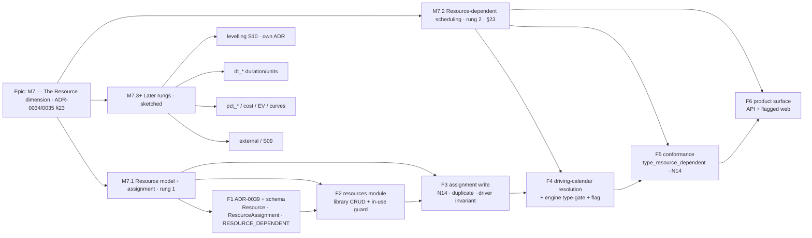

# Implementation Plan: M7 — The Resource dimension (ADR-0035 §23 resource-dependent scheduling; §25 N14)

- **Feature spec:** `docs/specs/engine-conformance-framework/M7-resource-dimension-feature-spec.md`
- **Status:** Draft (awaiting approval)
- **Owner:** engine + backend + conformance

> **Scope.** Open SchedulePoint's **resource dimension** — the last capability area on the conformance matrix.
> This plan builds **rung 1** (a resource model + assignment) and **rung 2** (ADR-0035 §23 resource-dependent
> scheduling, the ❌ → ✅ rung), and **sequences + rough-sizes** the later rungs (levelling, duration/units types,
> %-complete/EV/cost/curves, external/inter-project) as **subsequent milestones**, not built here.
>
> **Sequencing stance (recommended).** Rung 1 (schema + library + assignment, from the reference template) **first**
> — it unblocks everything. Then rung 2 (`RESOURCE_DEPENDENT` type + driving-calendar resolution + conformance),
> which is small because ADR-0037 already pays for the per-activity calendar port. Then the flagged web surface
> last (deferrable, like M5-epic F8 / M6). With no resources / no resource-dependent activity the whole dimension
> is inert, so `main` stays **byte-identical and releasable** throughout.

## Breakdown

### Epic

**M7 — The Resource dimension** — the final capability area of the engine-conformance epic (ADR-0034/0035): give
SchedulePoint a first-class resource model and bring resource-dependent scheduling (§23) to documented P6-class
parity, proven by the conformance framework, and lay the foundation for levelling, units/duration types, and
cost/earned value.

---

### Milestone: M7.1 — Resource model + assignment (rung 1, shippable slice)

**Outcome:** Org Admins curate an **org-scoped resource library** (labour / equipment / material, each with an
optional own calendar and availability); Planners **assign** resources to activities with a budgeted quantity and
mark a **driving** resource. No scheduling behaviour change yet (assignment is reference data) — but the model
that every later rung needs now exists, N14 rejects at the boundary, and the no-resource path is byte-identical.

**Global invariant for every task:** with no `Resource`, no `ResourceAssignment` and no `RESOURCE_DEPENDENT`
activity present, the engine and recalc are **byte-identical** to the pre-epic output across all prior goldens +
scenarios (the ADR-0034/0037 parity gate). Any golden re-baseline is a reviewed change, never silent.

---

#### Feature: F1 — Resource schema foundation (ADR-0039 + Prisma models + enums)

> **Description:** introduce the resource dimension's schema: `Resource` + `ResourceAssignment` models, a
> `ResourceKind` enum, a new `RESOURCE_DEPENDENT` `ActivityType` member, and the engine-owned
> `resource_driver_missing` boolean on `Activity`. **Schema + ADR only — no behaviour.**
> **ADR-0035 clause:** §23 (foundation) · **Capability row:** none yet · **Governing ADR:** **ADR-0039 (NEW).**
> **Complexity:** L (**the epic's biggest schema decision** — see the critical questions)
> **Dependencies:** none; **database-architect drafts the migration + ADR-0039 BEFORE it is written.**
> **Risks:** resource-calendar FK cross-org → service same-org check (FK alone doesn't enforce it) + partial index;
> assignment scope (same-org resource, in-plan activity) → denormalised `organization_id` + service checks;
> soft-delete cascade of an activity's assignments → define in ADR-0039 + the lifecycle service.
> **Testing:** migration up/down; enum lock-step (`@repo/types`); parity (no resource ⇒ unchanged).

##### Task F1.T1 — ADR-0039 + database-architect design

- **Description:** draft **ADR-0039 (resource model & resource-calendar scheduling)** — resource model shape
  (lean vs wide), driver designation (per-assignment `isDriving` vs activity FK), `RESOURCE_DEPENDENT` type vs
  flag, reuse the calendar library vs a resource-calendar entity; decision + invariants (org scope, ≤1 driver,
  material-never-drives, type-gated drive) + soft-delete/cascade + the ADR-0037 seam rung 2 rides. **database-architect**
  reviews the schema before any migration.
- **Complexity:** M · **Dependencies:** none · **Testing:** n/a (design) — sign-off gate for F1.T2.

##### Task F1.T2 — Prisma: Resource + ResourceAssignment + enums + engine-owned flag

- **Description:** add `ResourceKind` enum; `Resource` model (org-scoped, `calendarId?` FK RESTRICT,
  `unitOfMeasure`, `maxUnitsPerHour?`, soft-delete/audit/version) with the partial-unique name index + org-cursor
  index + `(calendar_id)` partial index; `ResourceAssignment` model with the `(activity_id, resource_id)` and
  `(activity_id) WHERE is_driving` partial-uniques + FK indexes; add `RESOURCE_DEPENDENT` to `ActivityType`; add
  `resource_driver_missing Boolean @default(false)` (engine-owned) to `Activity`. Raw-SQL partial indexes/CHECKs
  in the migration.
- **Complexity:** L · **Dependencies:** F1.T1 · **Testing:** migration up/down; enum lock-step check.
- **Development steps:** 1. enums + models + indexes + CHECKs. 2. `@repo/types` unions (`ResourceKind`,
  `ActivityType`, `ResourceSummary`, `ResourceAssignmentSummary`). 3. changeset + `DATABASE.md`.

---

#### Feature: F2 — Resources module (org-scoped library CRUD + in-use guard)

> **Description:** a new `resources` NestJS module (controller → service → repository) from the reference template:
> org-scoped list/create/read/update/delete with deny-by-default RBAC + org scope, soft-delete, audit, optimistic
> locking, a `RESOURCE_IN_USE` delete guard, and in-org `calendarId` validation — mirroring `calendars`.
> **ADR-0035 clause:** §23 (foundation) · **Capability row:** none · **Proven by:** service/repo/DTO + e2e tests.
> **Complexity:** L · **Dependencies:** F1 · **Governing docs:** `docs/REFERENCE_FEATURE.md`, `docs/API.md`.
> **Risks:** IDOR on `calendarId` / org scope → in-org lookup under the calendar advisory lock (like the plan
> picker); TOCTOU on delete-in-use → count + soft-delete in one tx under a resource advisory lock (mirror
> `CalendarsService.remove`).
> **Testing:** service specs (scope, duplicate-name 409, calendar-in-org 404, in-use 409); repo tests; one API e2e.

##### Task F2.T1 — `resources` module: controller + service + repository + DTOs + permissions

- **Description:** scaffold from the reference template; add `resource:read/create/update/delete` to the RBAC map
  (ADR-0012); implement list (cursor), create, get, update (version-gated), delete (`RESOURCE_IN_USE` guard over
  active assignments under a resource advisory lock); validate `calendarId` in-org.
- **Complexity:** L · **Dependencies:** F1.T2 · **Testing:** service + repo + DTO specs; api + security reviewers.
- **Development steps:** 1. module + controller + DTOs + repository. 2. service (scope, duplicate, in-use guard,
  calendar-in-org). 3. RBAC map + `docs/API.md` + changeset.

---

#### Feature: F3 — Resource assignment write path (N14 + duplicate + driver invariant)

> **Description:** assign/unassign resources on an activity with `budgetedUnits` (`@Min(0)`, **N14**) and
> `isDriving`; enforce one assignment per (activity, resource) and, when `type = RESOURCE_DEPENDENT`, exactly one
> driving assignment; a `MATERIAL` resource may not drive. Pen-gated, optimistic-locked.
> **ADR-0035 clause:** §23 (foundation) + §25 (N14) · **Capability row:** **N14** (⚪ → reject) · **Proven by:**
> activities service/DTO specs + the N14 conformance negative.
> **Complexity:** M · **Dependencies:** F1, F2.
> **Risks:** driver invariant race → DB partial-unique on `(activity_id) WHERE is_driving` guarantees ≤1; the
> "exactly one on a resource-dependent activity" check is transactional in the service; scope (same-org resource,
> in-plan activity) → service checks + denormalised org id.
> **Testing:** service specs (N14 reject, duplicate 409, material-can't-drive, exactly-one-driver, scope 404);
> N14 flips in `negative.spec.ts`.

##### Task F3.T1 — Assignment endpoints + validation

- **Description:** `POST/PATCH/DELETE …/activities/{id}/assignments` DTOs (`budgetedUnits @Min(0)`, `isDriving`);
  service validates resource in-org, activity in-scope, duplicate reject, material-not-driving, and the
  resource-dependent exactly-one-driver invariant; pen-gated (`assertHoldsPen`) + optimistic lock.
- **Complexity:** M · **Dependencies:** F2.T1 · **Testing:** service/DTO specs; security-reviewer (IDOR).

##### Task F3.T2 — N14 boundary reject + conformance negative

- **Description:** confirm `@Min(0)` rejects negative units (N14, ADR-0035 §25); assert N14 in the conformance
  `negative.spec.ts`; flip N14 (⚪ → reject/boundary-owned) in `CAPABILITY_MATRIX.md`.
- **Complexity:** S · **Dependencies:** F3.T1 · **Testing:** `negative.spec.ts`; docs updated in the same PR.

---

### Milestone: M7.2 — Resource-dependent scheduling (rung 2, §23 — the ❌ → ✅ rung)

**Outcome:** a `RESOURCE_DEPENDENT` activity schedules on its **driving resource's** calendar (A6100 inside the
crane hire window; A8300 never on a Friday), while a task-dependent activity with an assigned resource still
schedules on the **activity** calendar (A5500 contrast). The conformance row `type_resource_dependent` /
`res_calendar_drives` / `res_driving` flips ❌ → ✅, an S05-style differential runs, and ADR-0035 §23 moves to
**Accepted** — with the no-resource path byte-identical.

---

#### Feature: F4 — Driving-calendar resolution + engine type-gate + produce-and-flag

> **Description:** in `ScheduleService`, for a `RESOURCE_DEPENDENT` activity resolve the engine calendar port from
> the **driving resource's** `calendarId` (fallback: activity calendar → plan default), reusing the existing
> `portByCalId` per-recalc cache; in the pure engine, treat `RESOURCE_DEPENDENT` like `TASK` for logic and set an
> engine-owned `resourceDriverMissing` flag when no driver resolves.
> **ADR-0035 clause:** §23 · **Capability row:** _Resource-dependent scheduling_ — engine/service half ·
> **Proven by:** `compute.*`/service goldens (crane window, Mon–Thu, contrast, driver-missing, parity).
> **Complexity:** M (small because ADR-0037 already carries the per-activity port seam)
> **Dependencies:** F1–F3; ADR-0037 (per-activity calendar ports), the `resolveCalendar`/`portByCalId` cache.
> **Risks:** resolving the driving resource is an extra load → **one** plan-scoped join alongside the existing
> activity load (no N+1); a resource with no calendar / soft-deleted calendar → documented fallback order, never
> an error; the engine must NOT change its axis → RESOURCE_DEPENDENT is logic-identical to TASK, only the port
> differs (golden parity net).
> **Testing:** engine golden (RESOURCE_DEPENDENT == TASK logic on the same calendar); service test (driving port
> chosen; contrast keeps activity port); parity (no resource-dependent activity unchanged).

##### Task F4.T1 — Service: resolve the driving-resource port

- **Description:** load each activity's driving assignment → driving resource `calendarId`; in the port-resolution
  step, when `type === 'RESOURCE_DEPENDENT'` and a driver resolves, attach the **driving resource's** port to the
  `EngineActivity` (via `portByCalId`, extending the distinct-calendar set); else fall back to the activity
  calendar. Extend the recalc log (`resourceDependentCount`, `resourceDriverMissingCount`).
- **Complexity:** M · **Dependencies:** F3.T1 · **Testing:** service spec (port selection + fallback + contrast);
  backend-performance-reviewer (single join, cache reuse).

##### Task F4.T2 — Engine: RESOURCE_DEPENDENT type-gate + `resourceDriverMissing` + persist

- **Description:** add `RESOURCE_DEPENDENT` handling to the engine (logic-identical to `TASK`; `isResourceDependent`
  helper in `constraints.ts`); add engine-owned `resourceDriverMissing` to `EngineResult` and
  `resourceDriverMissingCount` to `EngineSummary` (set when the service marks the activity resource-dependent but
  no driver port was resolvable — produce-and-flag, mirroring `loeNoSpan`); write `resource_driver_missing` in the
  batched recalc UPDATE (no version bump); surface it on the activity schedule DTO + `@repo/types`.
- **Complexity:** M · **Dependencies:** F4.T1 · **Testing:** `compute.*` goldens; service write spec (column
  written, version untouched); parity suite byte-identical on the no-resource path.

---

#### Feature: F5 — Resource-dependent conformance (type_resource_dependent) + adapter driving calendar

> **Description:** flip `mapActivityType('RESOURCE_DEPENDENT')` to supported; teach the adapter to attach the
> driving resource's calendar to a resource-dependent `EngineActivity` (from `assignments.csv` `res_driving` +
> `resources.csv` `calendar`); add first-principles goldens A6100 (crane window) + A8300 (Mon–Thu) + the A5500
> contrast; add an S05-style differential; flip the capability row; Accept ADR-0035 §23.
> **ADR-0035 clause:** §23 · **Capability row:** _Resource-dependent scheduling_ ❌ → ✅ · **Proven by:**
> `goldens.ts` (A6100/A8300/A5500) + `adapter.spec.ts` (driving-calendar attach) + `scenarios.spec.ts`
> (differential).
> **Complexity:** M · **Dependencies:** F4.
> **Risks:** the fixture expresses the driver via `assignments.csv` tags + a `resources.csv` calendar, not an
> `EngineActivity.calendar` → the adapter resolves the chain (activity → driving assignment → resource → calendar)
> and attaches the built port; assert the task-dependent contrast (A5500) is unchanged.
> **Testing:** conformance goldens + differential; matrix + ADR-0035 §23 ledger update in the same PR.

##### Task F5.T1 — type-map + adapter: RESOURCE_DEPENDENT supported + driving calendar attach

- **Description:** `mapActivityType('RESOURCE_DEPENDENT') → { supported: true, value: 'RESOURCE_DEPENDENT' }`;
  in `adapter.ts`, for a resource-dependent fixture activity resolve its `res_driving` assignment → resource →
  `calendar` and attach that calendar port to the `EngineActivity`; leave task-dependent activities on the
  activity calendar (A5500 contrast).
- **Complexity:** M · **Dependencies:** F4.T2 · **Testing:** `adapter.spec.ts` (driving calendar attached; A5500
  keeps the activity calendar).

##### Task F5.T2 — Goldens + differential + capability matrix + ADR-0035 §23 Accepted

- **Description:** add `goldens.ts` expectations for A6100 (inside 27-Jul → 21-Aug), A8300 (no Friday work), A5500
  (activity calendar); add an S05-style differential (flip an activity TASK↔RESOURCE_DEPENDENT ⇒ dates move);
  assert N14; flip _Resource-dependent scheduling_ to ✅ in `CAPABILITY_MATRIX.md`; move ADR-0035 §23 to Accepted.
- **Complexity:** S · **Dependencies:** F5.T1 · **Testing:** `goldens.spec.ts`, `scenarios.spec.ts`; docs in the
  same PR.

---

#### Feature: F6 — Product surface (API + flagged web) — largest / deferrable

> **Description:** expose the resource library + assignments over the API for the UI, and ship the web Resources
> screen, activity assignment panel, and the Resource-Dependent type/driver picker behind a flag.
> **ADR-0035 clause:** §23 (surface) · **Capability row:** none (surface only) · **Proven by:** service/DTO +
> component/a11y/e2e tests.
> **Complexity:** L · **Dependencies:** F2, F3, F4 (API); flagged web deferrable like M5-epic F8.
> **Risks:** UI/a11y drift → design system + APG primitives (ADR-0029/0007), WCAG 2.2 AA; the assignment/driver
> UX is new → ux-reviewer.
> **Testing:** DTO round-trip; component + a11y + e2e (flagged).

##### Task F6.T1 — API surface complete (resources + assignments + activity type/driver round-trip)

- **Description:** confirm resource CRUD + assignment endpoints + `type = RESOURCE_DEPENDENT` + `resourceDriverMissing`
  round-trip through DTOs + `@repo/types`; OpenAPI + `docs/API.md`.
- **Complexity:** M · **Dependencies:** F3.T1, F4.T2 · **Testing:** service/DTO/e2e; api + security reviewers.

##### Task F6.T2 — Web: Resources library + assignment panel + Resource-Dependent picker (flagged, deferrable)

- **Description:** behind `VITE_RESOURCES` — a Resources list/create/edit screen (mirroring Calendars), an activity
  assignment panel (add/remove, budgeted units, driving toggle), and the Resource-Dependent option + driver picker
  in the type picker; full loading/empty/error/success states.
- **Complexity:** L · **Dependencies:** F6.T1 · **Testing:** component + a11y + e2e; ux/component/accessibility
  reviewers; changeset + docs.

---

### Milestone: M7.3+ — Later rungs (sketched — separate milestones, NOT built here)

Sequenced and rough-sized in the spec §4; each is its own milestone with its own spec/plan when it reaches the
roadmap. **None is designed to build-ready depth here.**

| Rung | Milestone                                                                                                                                          | Owning rows / scenarios                     | Rough size                                               | Own ADR? |
| ---- | -------------------------------------------------------------------------------------------------------------------------------------------------- | ------------------------------------------- | -------------------------------------------------------- | -------- |
| 3    | **Resource levelling** — serialise over-allocations vs `maxUnits` (must never move a mandatory-constrained activity)                               | S10, `levelling_test`, `res_overallocation` | **XL** (new heuristic scheduling pass; its own sub-epic) | **Yes**  |
| 4    | **Duration / units types** — `dt_fixed_units` / `dt_fixed_units_time` / `dt_fixed_dur_units`                                                       | `dt_*`                                      | **L**                                                    | Likely   |
| 5    | **Percent-complete / earned value / cost / curves / accrual** — `pct_physical`/`pct_units`, CPI/SPI, LINEAR/BELL/FRONT/BACK/DOUBLE_PEAK histograms | `pct_*`, `cost_*`, `*_curve_*`, `accrual_*` | **XL**                                                   | **Yes**  |
| 6    | **External / inter-project dates** — external early-start/late-finish + ignore-external option                                                     | `net_external_*`, `interproject`, **S09**   | **M–L**                                                  | Likely   |

---

## Sequencing & slices

Each feature is an independently releasable slice; the whole dimension is dark until an activity is made
resource-dependent, so `main` stays byte-identical and releasable throughout. Recommended order:

1. **M7.1 rung 1:** **F1** (ADR-0039 + schema — database-architect first, the biggest decision) → **F2** (resources
   library module) → **F3** (assignment write + N14). Ships the model; flips **N14**.
2. **M7.2 rung 2:** **F4** (driving-calendar resolution + engine type-gate) → **F5** (conformance + differential +
   Accept §23). Flips the last ❌ (_Resource-dependent scheduling_).
3. **F6 product surface** — API complete; **web flagged (`VITE_RESOURCES`) and deferrable** to a follow-on.
4. **M7.3+ later rungs** — levelling (own ADR/sub-epic), duration/units types, %-complete/EV/cost/curves,
   external/inter-project — each a subsequent milestone.

**Feature flags:** `VITE_RESOURCES` (web). The engine/API changes are dark by default (no resource-dependent
activity ⇒ no behaviour change), so no server flag is required.

## Critical questions for approval

1. **Rung-1 model breadth (CRITICAL).** Ship a **lean** `Resource`/`ResourceAssignment` — kind, optional
   `calendarId`, `unitOfMeasure`, `budgetedUnits`, `isDriving`, plus `maxUnitsPerHour` reserved for levelling —
   adding cost/curve/EV/at-completion columns only when their rung lands (**recommended**), vs. a wider
   forward-declared schema now. _Default: lean; extend per rung (mirrors how `calendarId` was reserved, ADR-0024)._
2. **Driver designation (CRITICAL).** Designate the driving resource via a **per-assignment `isDriving` boolean**
   - a DB partial-unique guaranteeing ≤1 driver + a service "exactly one on a resource-dependent activity"
     invariant (**recommended**), vs. a `drivingResourceId` FK on the activity. _Default: per-assignment `isDriving`._
3. **`RESOURCE_DEPENDENT` as an `ActivityType` member (CRITICAL).** Add a **new enum member** (mirroring the
   fixture/P6 and `LEVEL_OF_EFFORT`/`WBS_SUMMARY`), so `type` stays the single source of scheduling behaviour
   (**recommended**), vs. a boolean flag on the activity. _Default: new `RESOURCE_DEPENDENT` enum member._
4. **Product-surface scope (CRITICAL).** Ship **schema + engine + conformance** now (flips the row + N14, Accepts
   §23) with the **web** surface (Resources screen, assignment panel, type/driver picker) behind `VITE_RESOURCES`
   as the last, **deferrable** slice — mirroring M5-epic/M6 — vs. holding the milestone for the full UX. _Default:
   engine + conformance now; web flagged and deferrable._

Non-critical (defaults taken, not surfaced): a resource references an **existing org `Calendar`** (no separate
resource-calendar model — the fixture's `RESOURCE`-type rows are just calendars); driving-calendar **fallback
order** = driving-resource calendar → activity calendar → plan default; a `MATERIAL` resource **may not** be a
driver; a 0/>1-driver resource-dependent activity **produces-and-flags** `resourceDriverMissing` at recalc and is
**rejected on write** (service invariant); over-allocation is **produced-and-reported, not levelled** in rungs 1–2
(levelling is rung 3); the fixture's `NONLABOUR` maps to `EQUIPMENT`.

## Definition of Done (per task)

Each task's PR must satisfy the Feature Completion Criteria in `docs/PROCESS.md` (code, tests ≥ 80% on changed
code, docs incl. capability-matrix + ADR-0035 §23/§25 acceptance-ledger updates + ADR-0039, security review,
performance, accessibility for UI, Docker build, CI green, changeset, version impact). **Additionally:** every
engine/service PR runs the full golden + scenario suite and demonstrates the no-resource / no-resource-dependent
path is byte-identical; the rung-2 PR flips the _Resource-dependent scheduling_ matrix row (and N14) in the same
change; and the resource library follows the reference template (`scripts/verify-template.sh` conformance).

## Risks & assumptions (rollup)

| Risk / assumption                                                                    | Likelihood | Impact | Mitigation                                                                                                                      |
| ------------------------------------------------------------------------------------ | ---------- | ------ | ------------------------------------------------------------------------------------------------------------------------------- |
| The resource model is a large, architecturally-significant new dimension             | high       | high   | ADR-0039 + database-architect **before** the migration; lean model default; reuse the calendar library + reference template.    |
| Resource-calendar-drive leaks onto task-dependent activities (A5500 contrast breaks) | med        | high   | Drive is **type-gated** (only `RESOURCE_DEPENDENT`); golden asserts A5500 keeps the activity calendar and assignment is inert.  |
| IDOR / cross-org on `calendarId`, `resourceId`, or the activity of an assignment     | med        | high   | Org scope re-resolved from memberships; in-org lookups (calendar/resource) + in-plan activity check; security-reviewer.         |
| Loading the driving resource adds N+1 to recalc                                      | med        | med    | One plan-scoped join alongside the existing activity load; reuse the `portByCalId` per-recalc port cache (build each cal once). |
| Engine axis accidentally changed for RESOURCE_DEPENDENT                              | low        | high   | RESOURCE_DEPENDENT is **logic-identical to TASK**; only the resolved port differs; the golden/parity suite is the net.          |
| Driver invariant race (two concurrent driving assignments)                           | low        | med    | DB partial-unique `(activity_id) WHERE is_driving` (≤1) + transactional service check; optimistic lock.                         |
| Over-allocation mistaken for a bug (S10 not levelled in rungs 1–2)                   | med        | low    | Produce-and-report is the documented rung-1/2 behaviour (fixture §7); levelling is rung 3 with its own ADR.                     |
| Scope creep into levelling / cost / EV                                               | med        | med    | Later rungs explicitly out of scope for M7.1/M7.2; each is a subsequent milestone with its own spec/plan/ADR.                   |
| Fixture expresses the driver via CSV tags, not `EngineActivity.calendar`             | med        | med    | Adapter resolves activity → `res_driving` assignment → resource → calendar and attaches the built port; `adapter.spec.ts`.      |
| New engine-owned column (`resource_driver_missing`) drifts from the write contract   | low        | med    | Mirror `constraint_violated`/`loe_no_span`; database-architect review; service write spec asserts version untouched.            |

## Recommended specialised agents (build phase)

- **database-architect** — **ADR-0039** + the `Resource`/`ResourceAssignment` models, the `calendar_id` FK, the
  partial-uniques (name, `(activity_id, resource_id)`, `(activity_id) WHERE is_driving`), indexes, and the
  engine-owned `resource_driver_missing` column (**before** writing the migration) — the epic's biggest schema
  decision.
- **api-reviewer** + **security-reviewer** — the resource CRUD + assignment endpoints, `RESOURCE_IN_USE` guard,
  in-org calendar/resource scoping (IDOR), N14 boundary reject, engine-owned fields never client-writable.
- **backend-performance-reviewer** — the driving-resource load (single plan-scoped join, no N+1) + the
  `portByCalId` cache reuse; re-verify the ADR-0036/0037 recalc budget at 2 000 activities.
- **test-engineer** — first-principles goldens (A6100 window, A8300 Mon–Thu, A5500 contrast, driver-missing,
  parity), the S05-style differential, N14, and the resource/assignment service tests.
- **ux-reviewer / component-reviewer / accessibility-reviewer** — the flagged Resources screen, assignment panel,
  and Resource-Dependent type/driver picker.
