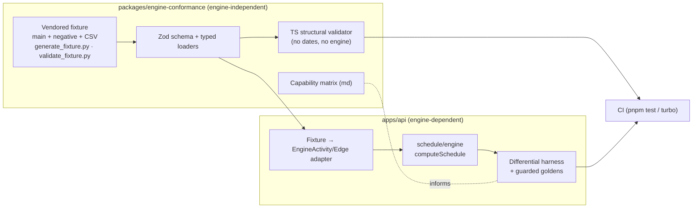
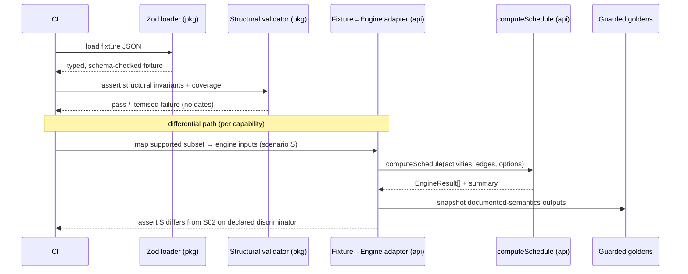

<!--
Feature Spec — Stages 1–4 of docs/PROCESS.md.
Produced by the feature-analyst agent. NO application/engine code is written at
this stage: this is spec + plan + ADR outlines only, awaiting approval.
-->

# Feature Spec: Engine Conformance & Validation Framework

- **Status:** Draft (awaiting approval)
- **Author(s):** feature-analyst (Product Owner / Solution Architect / Technical Lead hats)
- **Date:** 2026-07-15
- **Tracking issue / epic:** _TBD_
- **Roadmap link:** New engine-quality theme (see `docs/ROADMAP.md` → "M6 — CPM engine" lineage; this initiative underpins everything downstream of it)
- **Related ADR(s):** Consumes ADR-0021/0022/0023/0024/0025/0033. Proposes **ADR-0034** (conformance methodology), **ADR-0035** (SchedulePoint CPM semantics for ambiguous behaviours), **ADR-0036** (hour/shift-granular calendar & duration rework).

> **Scope guard.** This is a **north-star** initiative, not a P6-parity commitment.
> Phase 1 is **engine + test-infrastructure + docs only**. There is **no UI, no
> API, and no database change** in the committed scope. The fixture is a P6-class
> benchmark we measure ourselves against; we deliberately classify large parts of
> it as _out-of-scope-for-now_ and prioritise by SchedulePoint's actual users —
> **construction planners drawing TSLDs**.

---

## 1. Business understanding

### Problem

SchedulePoint's scheduling engine (`apps/api/src/modules/schedule/engine/`) is the
correctness core of the product: everything a planner sees on the TSLD canvas —
early/late dates, total float, the critical path, driving logic — is computed
there. Today it is verified only by **hand-written unit tests over small,
self-authored networks** (`compute.spec.ts`, `constraints.spec.ts`,
`graph.spec.ts`, `calendar.spec.ts`). Those tests prove the code does what its
author expected; they do **not** prove the engine is _correct against the
industry's hard cases_, and they give us **no map of the gap** between what we
compute and what a P6-class engine computes.

Three concrete pains follow:

1. **No regression floor for the engine.** As we extend the engine (progress,
   calendars, constraints, float definitions), we have no comprehensive,
   adversarial suite that fails loudly when a change silently alters a computed
   date. A subtle off-by-one in lag or calendar arithmetic can ship undetected.
2. **No objective feature-gap analysis.** We cannot currently answer "how far is
   our engine from what real planners need?" with evidence. Decisions about what
   to build next are made without a capability map.
3. **No buy-vs-build benchmark.** SchedulePoint chose to build its own engine
   rather than embed a commercial Gantt component. That decision needs periodic,
   evidence-based revalidation: which of the industry's hard behaviours can we
   express, and which can the alternatives express?

The product owner has supplied a **P6-class conformance fixture**
(`P6-TORTURE-01`): 129 activities, 188 relationships across all four link types
and all lag signs, 8 calendars (split-shift, 24 h, midnight-crossing night shift,
window-only, 4-month non-work block, resource calendars), 22 resources, 45
assignments, **13 scheduling scenarios** (each flips exactly one option), **18
hostile negative cases**, and a `coverage_index` mapping every feature tag to the
objects that exercise it. It is deliberately pathological and realistic. **Why
now:** we have the artifact, the engine is stable enough to benchmark, and every
future engine epic wants this suite as its acceptance harness.

### The no-oracle constraint (defining, read first)

We do **not** own P6 and the fixture ships **no golden dates on purpose** — a
hand-computed oracle would be a liability, and P6's calendar/lag arithmetic has
quirks worth _matching deliberately_ rather than guessing. Therefore the golden
strategy is **not** "diff against a reference tool". It is:

- **(a) Deterministic cases** — behaviours computable from first principles
  (link arithmetic, float, whole-day calendar walks) are asserted against
  hand-derived expected values.
- **(b) Documented-semantics cases** — genuinely-ambiguous behaviours
  (retained-logic vs progress-override, suspend/resume-after-data-date, SF
  semantics, mandatory-breaks-logic, float definitions) are **defined and
  documented as SchedulePoint's intended semantics** in an ADR (**ADR-0035**),
  then **self-baselined**: the engine's own output becomes the regression golden,
  guarded so drift is a deliberate, reviewed change.
- **An external oracle is OPTIONAL and never a dependency** — an open-source CPM
  engine cross-check, a P6 trial import, or the fixture author's F9/XER export are
  later _confidence_ checks, not gates.

### Users

This is **internal engineering infrastructure**; its "users" are roles, not
end-user personas. No SchedulePoint organisation role (Viewer…Org Admin) is
involved because there is no runtime surface.

| Role                               | What they need                                                                                                                                                                                             |
| ---------------------------------- | ---------------------------------------------------------------------------------------------------------------------------------------------------------------------------------------------------------- |
| **Engine/backend engineers**       | A comprehensive, adversarial suite that fails loudly on any regression in computed dates/float/critical path; and, per capability, a ready-made acceptance harness ("make this scenario differ from S02"). |
| **Solution architect / tech lead** | An objective, living **capability matrix** (supported / partial / missing / out-of-scope) to sequence engine work and defend the build-vs-buy decision.                                                    |
| **Product owner**                  | Evidence of what the engine can and cannot do, expressed in planner-relevant terms, to prioritise the roadmap and set customer expectations honestly.                                                      |
| **CI**                             | A structural gate that keeps the vendored fixture well-formed and the coverage index complete on every change.                                                                                             |

### Primary use cases

1. **Regression suite** — run the engine against the fixture (and the growing set
   of capability scenarios) in CI; any change to a computed date/float/critical
   flag that is not a deliberate, reviewed golden update fails the build.
2. **Feature-gap analysis** — a capability matrix mapping every `coverage_index`
   tag, the 13 scenarios, and the 18 negative cases to `{supported / partial /
missing / out-of-scope}`, kept current as the engine grows.
3. **Buy-vs-build benchmark** — the same fixture used to score candidate engines
   (commercial Gantt components / open-source CPM libraries) on how many scenarios
   they can even _express_, revalidating the build decision periodically.

### User journeys

- **Happy path (M0, doable now):** an engineer adds the vendored fixture + a TS
  structural validator; CI runs it on every push and blocks a malformed fixture or
  an incomplete coverage index. The capability matrix and methodology ADR land.
  No engine change yet — but the benchmark and regression scaffold exist.
- **Capability journey (each later epic):** an engineer picks a capability (e.g.
  "per-relationship lag calendars"), reads the fixture tags that define its
  acceptance criteria (`lag_calendar_24h`, `lag_calendar_setting_sensitive`; S05),
  implements it against the reference template + relevant ADR, and flips the
  corresponding scenario test from `todo`/`skip` to asserting **"S05 must differ
  from S02"**. The capability matrix cell moves to `supported`.
- **Benchmark journey:** the architect loads the fixture into a candidate engine
  and counts expressible scenarios, recording the score against our own matrix.

### Expected outcomes

- The engine gains a **permanent, adversarial regression floor** that grows with
  each capability.
- The team gains a **shared, evidence-based map** of the engine gap, in planner
  terms, that directly sequences the roadmap.
- The **hour/shift-granular calendar + hour-based duration** rework is identified,
  scoped, and sequenced as the single foundational gap it is — before it silently
  blocks half a dozen downstream features.

### Success criteria

- **S1 (M0):** the fixture is vendored with provenance; the TS structural
  validator runs in CI and reproduces the Python validator's verdicts (referential
  integrity, DAG, LOE spans, open ends, progress sanity, **coverage completeness =
  all required tags present**); a malformed fixture fails CI.
- **S2 (M0):** the capability matrix classifies **100%** of `coverage_index` tags,
  all 13 scenarios, and all 18 negative cases into one of the four statuses, with
  a cited rationale per row.
- **S3 (M0):** ADR-0034 (methodology) is accepted; ADR-0035 (semantics) and
  ADR-0036 (hour-granular rework) are drafted with outlines.
- **S4 (ongoing):** every engine capability epic ships with its fixture-tag
  scenario test wired as acceptance; the "identical-to-S02 ⇒ not wired" property
  holds (a scenario that does not differ from S02 fails).
- **S5 (ongoing):** golden snapshots exist for the deterministic + documented
  subset and are stable run-to-run; a change to any computed value is a reviewed
  diff, never a silent drift.

### Open questions

See §2 "Critical questions" — the few that genuinely change design/scope are
surfaced there; defaults are stated for the rest.

---

## 2. Functional requirements

### User stories & acceptance criteria

> **US-1 — Vendor the fixture as a first-class, versioned test asset.**
> As an engine engineer, I want the fixture (main + negative + CSVs + generator +
> validator) vendored in-repo with provenance, so tests can depend on it
> deterministically.
>
> **Acceptance criteria**
>
> - **Given** the uploaded fixture files **when** they are vendored **then** the
>   main JSON, negative-cases JSON, five CSVs, `generate_fixture.py` and
>   `validate_fixture.py` live under a single, documented location with a README
>   recording origin, `schema_version`, and how to regenerate.
> - **Given** the fixture **when** typed loaders parse it **then** parsing is
>   schema-validated (Zod) and fails loudly on shape drift, so a regenerated
>   fixture cannot silently change the contract.

> **US-2 — Structural validation in CI, with no engine dependency.**
> As CI, I want the fixture's structural invariants checked on every change, so a
> malformed or under-covering fixture blocks merge.
>
> **Acceptance criteria**
>
> - **Given** the vendored fixture **when** the validator runs **then** it checks:
>   referential integrity (activities/calendars/WBS/resources/curves/roles/
>   assignments/steps/expenses), main network is a **DAG**, every LOE has a full
>   span, open starts/finishes match the intended set, progress sanity
>   (completed⇒both actuals & no remaining; in-progress⇒actual start; milestone⇒
>   zero duration), and **coverage completeness** (every required tag present).
> - **Given** a deliberately broken fixture **when** the validator runs **then**
>   CI fails with a precise, itemised report.
> - **Given** the validator **when** it runs in CI **then** it needs **no engine,
>   database, or network** — it computes **no dates**.

> **US-3 — A living capability matrix.**
> As a solution architect, I want every fixture tag/scenario/negative-case mapped
> to a capability status, so I can sequence engine work and defend build-vs-buy.
>
> **Acceptance criteria**
>
> - **Given** the `coverage_index` **when** the matrix is authored **then** each
>   tag is `supported | partial | missing | out-of-scope`, with a one-line
>   rationale and the gating dependency (if any).
> - **Given** the 13 scenarios and 18 negative cases **when** the matrix is
>   authored **then** each has a status and the fixture objects that discriminate
>   it (e.g. S03's discriminator is A4300's date vs S02).
> - **Given** a capability is delivered **when** its epic merges **then** the
>   matrix row moves to `supported` in the same PR.

> **US-4 — A differential (scenario-diff) harness.**
> As an engine engineer, I want to run the engine on the fixture, flip exactly one
> scheduling option, and assert the output **changes**, so "the option is wired
> up" is a test, not a hope.
>
> **Acceptance criteria**
>
> - **Given** the engine and a fixture→engine adapter **when** the harness runs a
>   scenario **then** it produces a deterministic result set keyed by activity.
> - **Given** two scenarios that must differ (e.g. S02 vs S03 on A4300) **when**
>   both run **then** a scenario whose discriminator date equals S02's **fails**
>   ("option not wired up").
> - **Given** a capability not yet built **when** its scenario runs **then** the
>   test is an explicit `todo`/`skip` with a reason — never a false green.

> **US-5 — The no-oracle golden strategy.**
> As an engine engineer, I want deterministic goldens for first-principles cases
> and self-baselined goldens for documented-semantics cases, so we regress safely
> without owning P6.
>
> **Acceptance criteria**
>
> - **Given** a first-principles behaviour **when** it is tested **then** the
>   expected value is hand-derived and asserted (not snapshotted).
> - **Given** an ambiguous behaviour **when** ADR-0035 fixes its semantics **then**
>   the engine output is captured as a **guarded snapshot** golden; a later change
>   to that value is a reviewed diff.
> - **Given** the golden set **when** it runs twice **then** results are identical
>   (deterministic ordering; no wall-clock/timezone dependence).

> **US-6 — Hostile-input contract (negative cases).**
> As an engine engineer, I want each negative case to assert reject / repair /
> report — never hang, crash, or silently produce nonsense.
>
> **Acceptance criteria**
>
> - **Given** each of the 18 negative cases **when** loaded one at a time **then**
>   the engine/validator produces the case's declared `expect` outcome
>   (`REJECT`, `REJECT_WITH_CYCLE_REPORT`, `REPAIR_OR_WARN`,
>   `SCHEDULE_AND_REPORT_VIOLATION`, `CLAMP_TO_DATA_DATE`,
>   `REJECT_AT_LOAD_OR_TERMINATE_SAFELY`, …).
> - **Given** the zero-working-time calendar (N11) and the 100,000 h lag (N16)
>   **when** scheduled **then** the engine **terminates safely within a bounded
>   time** (iteration cap / horizon), never spins.
> - **Given** a cycle (N01/N03) **when** loaded **then** the report **names the
>   exact members** of the cycle.

### Workflows

**M0 structural pipeline (no engine):**

1. `pnpm test` (or a dedicated project) loads the vendored fixture through the Zod
   loader.
2. The TS structural validator asserts every invariant + coverage completeness.
3. CI runs it as a fast, engine-free job; failure blocks merge.

**Differential capability pipeline (per later epic):**

1. The adapter maps fixture objects into `EngineActivity[]`/`EngineEdge[]` +
   `ComputeOptions` for the subset the engine currently supports.
2. The harness runs the base scenario (S02) and the target scenario.
3. The test asserts the declared discriminator changed (or is `todo` if the
   capability is unbuilt).
4. Deterministic outputs are snapshotted as guarded goldens for documented cases.

### Edge cases

- **Empty / partial engine support:** the adapter must translate only what the
  engine models today and mark the rest `todo` with a reason — never fabricate an
  input the engine cannot represent (e.g. hour-granular lag) and pretend it passed.
- **Fixture regeneration:** re-running the generator must not silently change the
  contract — the Zod schema + `schema_version` pin it; a bump is a reviewed change.
- **Non-determinism traps:** topological ties, map iteration order, and any
  date/timezone dependence must be eliminated so goldens are stable.
- **Negative-case containment:** negative cases must **never** be merged into the
  main network; the loader loads them one at a time.
- **Performance traps:** N11 (zero working time) and N16 (100 k h lag) must be
  bounded by an iteration cap / horizon; CAL-06's 4-month block must not trigger a
  day-by-day crawl.

### Permissions

**None.** No runtime surface, no API, no data. RBAC/resource-scope (ADR-0012) is
not engaged. The only "gate" is CI.

### Validation rules

- Fixture parsing is **Zod-schema-validated** at load; unknown/malformed shapes
  fail loudly.
- Structural invariants mirror `validate_fixture.py` exactly (the Python remains
  the canonical upstream reference; the TS port is the CI gate).
- The `REQUIRED` coverage tag list is asserted complete (parity with the Python
  validator's list).

### Error scenarios

| Scenario                                | Detection               | Result                                    | Exit     |
| --------------------------------------- | ----------------------- | ----------------------------------------- | -------- |
| Malformed fixture JSON / shape drift    | Zod loader              | Itemised parse error; CI red              | non-zero |
| Broken referential integrity            | Structural validator    | Named bad refs; CI red                    | non-zero |
| Cycle in main network                   | DAG check               | Named unresolved activities; CI red       | non-zero |
| Missing coverage tag                    | Coverage check          | Named missing tags; CI red                | non-zero |
| Scenario equals S02 when it must differ | Differential harness    | "Option not wired up" failure             | non-zero |
| Golden snapshot drift                   | Snapshot assertion      | Reviewed diff; deliberate update required | non-zero |
| Engine hang risk (N11/N16)              | Iteration cap / horizon | Bounded error, never a spin               | n/a      |

### Critical questions (need the product owner)

1. **Repo location for the fixture + harness.** Default recommendation: a new
   workspace package **`packages/engine-conformance`** for the engine-independent
   assets (vendored fixture, Zod schema, TS structural validator, capability
   matrix), with the **engine-dependent differential harness co-located in
   `apps/api`** (it must import the engine, which lives in `apps/api/src/modules/
schedule/engine/`). _Alternative:_ keep everything under `apps/api` test
   assets (simpler, no new package; couples the benchmark to the API app).
   **Which do you prefer?**
2. **Optional external oracle.** Do you want us to pursue an optional open-source
   CPM cross-check (or accept the author's offered XER/P6-XML F9 export) as a
   later _confidence_ check? Default: **treat as optional, out of committed
   scope**; we self-baseline per ADR-0035.
3. **How far down the parity ladder do we commit now?** Default recommendation:
   commit **M0 (vendor + CI structural gate + capability matrix + methodology
   ADR)** and the **gating hour-granular calendar/duration rework (ADR-0036)**;
   treat the downstream capability epics (progress semantics, lag calendars, full
   constraints, activity types, float definitions) as a **dependency-ordered
   backlog** the PO draws from — and **defer resources/levelling/cost/EV and
   inter-project as out-of-scope-for-now**. **Confirm the committed line.**

---

## 3. Technical analysis

| Area           | Impact                             | Notes                                                                                                                                                                                             |
| -------------- | ---------------------------------- | ------------------------------------------------------------------------------------------------------------------------------------------------------------------------------------------------- |
| Frontend       | **none**                           | Phase 1 has no UI.                                                                                                                                                                                |
| Backend        | **none (M0) / high (later epics)** | M0 adds no engine code. Later capability epics change `apps/api/src/modules/schedule/engine/`.                                                                                                    |
| Database       | **none**                           | No schema change in committed scope. (The hour-granular rework will later touch calendar/duration storage — flagged in ADR-0036, out of this spec's committed scope.)                             |
| API            | **none**                           | No endpoint change. The recalculate endpoint (ADR-0022) is unchanged.                                                                                                                             |
| Security       | **none**                           | No runtime surface, no secrets, no auth. Fixture is synthetic, non-sensitive.                                                                                                                     |
| Performance    | **test-only**                      | Harness must be fast + deterministic; iteration caps/horizons prevent hang tests (N11/N16). No production perf change in M0.                                                                      |
| Infrastructure | **low**                            | A CI job (or Turbo task) runs the structural validator + harness. New workspace package if option 1 chosen. **No Python in CI** (default: port validator to TS/Vitest; keep Python as reference). |
| Observability  | **none**                           | No runtime logs/metrics/traces.                                                                                                                                                                   |
| Testing        | **this is the feature**            | Vitest structural + differential + golden-snapshot suites; the fixture becomes the engine's benchmark.                                                                                            |

### Current-engine reality (verified against source)

Confirmed by reading `apps/api/src/modules/schedule/engine/`:

- **Unit of work is the integer working-day.** `EngineActivity.durationDays` is
  integer working days; the CPM passes run in **continuous integer working-day
  offsets** from the data date (ADR-0023). There is **no hour/minute/shift**
  granularity anywhere.
- **Relationships:** FS/SS/FF/SF with a signed **integer working-day** `lagDays`
  (`forwardLowerBound`/`backwardUpperBound` in `compute.ts`). Correct arithmetic
  for all type×sign combinations.
- **Calendars:** `buildWorkingDayCalendar` = **7-bit weekday mask + whole-day
  dated exceptions** (ADR-0024), one calendar per plan; **per-activity calendars
  DEFERRED**. Guard rejects an all-non-working mask (helps N11 at day
  granularity). No intraday shifts, split shifts, midnight-crossing, or
  time-window exceptions.
- **Constraints:** SNET/SNLT/FNET/FNLT honoured; `MANDATORY_START/FINISH` are
  **parked** as MSO/MFO and counted (`parkedConstraintCount`) — they do **not**
  break logic. No ALAP, no expected-finish, no secondary constraints.
- **Progress:** the engine takes **no actuals** — `EngineActivity` has no actual
  start/finish/remaining-duration/status. There is **no data-date floor for
  remaining work**, no retained-logic / progress-override / actual-dates split, no
  suspend/resume.
- **Float / critical:** total float `= LS − ES`; critical `TF ≤ 0`;
  near-critical threshold. **No** longest-path definition, **no** multiple float
  paths, **no** start/finish/smallest-float option.
- **Absent entirely:** LOE, resource-dependent scheduling, WBS-summary rollup,
  zero-duration _task_ (vs milestone), per-relationship lag calendars,
  inter-project/external dates, resources/levelling/curves/cost/EV, expected-finish
  recalculation.
- **Cycle handling:** DAG invariant enforced on the **write path** (ADR-0021);
  the engine has a **defensive** guard (`ScheduleGraphNotADagError`) that reports
  _unresolved_ activity ids but does **not name the exact cycle members** the
  negative cases (N01/N03) ask for.
- **Effective-Visual pass** (ADR-0033) exists for canvas placement; it does not
  affect the pure early/late/float.

### The single foundational gap

**Hour/shift-granular calendars + hour-based durations is the one gap that gates
most others.** The fixture stores **durations in hours** and models calendars as
**intraday shift patterns** (split shift, 24 h, midnight-crossing night shift,
window-only positive exceptions, per-day hours from 0–24). Because
`168 h = 7 elapsed days` on a 24 h calendar but `= 21 working days` on CAL-02,
"days" is meaningless as a storage unit — exactly why P6 stores hours. Our engine
is whole-working-day, so it **cannot represent**: elapsed durations, hour-granular
lag, per-relationship lag calendars (lag measured in hours on a chosen calendar),
the night-shift/split-shift/24 h calendars, or the window-only calendar. This is a
**rework amending ADR-0023 (continuous working-day → continuous working-time) and
ADR-0024 (weekday mask + whole-day exceptions → intraday shift patterns +
time-window exceptions)** — proposed as **ADR-0036**, and the gating epic for the
capability ladder.

### Dependency order of downstream capabilities

```
[M1] Hour/shift calendars + hour durations (ADR-0036, GATING)
  ├─► [M3] Per-relationship lag calendars (lag in hours on a chosen calendar)
  ├─► [M5] Resource-dependent scheduling (resource calendars) + zero-duration task
  └─► elapsed durations, 24h/night/split/window calendars
[M2] Progress-aware scheduling (actuals into engine, data-date floor,
     retained-logic / progress-override / actual-dates, suspend/resume)
     — needs M1 for accurate remaining-hour maths; semantics per ADR-0035
[M4] Full constraints (un-park mandatory + break-logic, expected-finish,
     secondary, ALAP) — mostly independent; needs M1 for exact dates
[M6] Float & critical definitions (longest-path, multiple float paths,
     start/finish/smallest float, open-ends-critical) — largely independent
[M7] Resources / levelling / curves / cost / EV + inter-project
     — OUT-OF-SCOPE-FOR-NOW (deferred)
```

### Capability matrix (summary; full per-tag table maintained in the plan)

| Group                                                | Fixture tags / scenarios                                                                              | Status                                                                                            | Gating dependency |
| ---------------------------------------------------- | ----------------------------------------------------------------------------------------------------- | ------------------------------------------------------------------------------------------------- | ----------------- |
| Four link types                                      | `rel_fs/ss/ff/sf`                                                                                     | **supported**                                                                                     | —                 |
| Lag sign/type arithmetic                             | `lag_*` (zero/pos/neg × FS/SS/FF/SF)                                                                  | **partial** — sign/type correct in working-**days**; fixture lags are **hours**                   | M1                |
| Long lag / horizon                                   | `lag_long`, N16                                                                                       | **partial** — bounded search exists; hour horizon TBD                                             | M1                |
| Per-relationship lag calendar                        | `lag_calendar_24h`, `lag_calendar_setting_sensitive`, S05/S06                                         | **missing**                                                                                       | M1 → M3           |
| Moderate constraints                                 | `con_snet/snlt/fnet/fnlt`                                                                             | **supported**                                                                                     | —                 |
| Start-On / Finish-On                                 | `con_start_on`, `con_finish_on`                                                                       | **partial** — pinned via MSO/MFO                                                                  | —                 |
| Constraint on non-work day                           | `con_on_nonworkday`                                                                                   | **partial** — day-granular; exact roll-forward instant needs M1                                   | M1                |
| Mandatory (break logic)                              | `con_mandatory_start/finish`, N10                                                                     | **missing** — currently **parked**; must produce-and-flag violation                               | M4 (ADR-0035)     |
| Expected finish                                      | `con_expected_finish`, S12                                                                            | **missing**                                                                                       | M4                |
| Secondary constraint                                 | `con_secondary_fnlt`                                                                                  | **missing**                                                                                       | M4                |
| ALAP                                                 | `con_alap`                                                                                            | **missing**                                                                                       | M4/M6             |
| Milestones                                           | `type_start_ms/finish_ms`                                                                             | **supported**                                                                                     | —                 |
| Zero-duration task                                   | `net_zero_duration_task`                                                                              | **missing** — distinct from milestone                                                             | M1                |
| LOE                                                  | `type_loe`, `loe_*`, N12                                                                              | **missing**                                                                                       | M5                |
| Resource-dependent                                   | `type_resource_dependent`, `res_calendar_drives`                                                      | **missing**                                                                                       | M1 → M5           |
| WBS summary rollup                                   | `type_wbs_summary`                                                                                    | **missing**                                                                                       | M5                |
| Weekday/holiday/shutdown calendars                   | `cal_5day/6day/4day_week/holidays/shutdown`                                                           | **supported** (day granularity)                                                                   | —                 |
| Intraday shift calendars                             | `cal_split_shift/24h/night_crosses_midnight/asymmetric_week/forces_split`                             | **missing**                                                                                       | M1                |
| Window-only / empty base week                        | `cal_window_only`, `cal_empty_base_week`, `cal_positive_exception`                                    | **missing** — mask-must-be-nonzero guard rejects empty base week                                  | M1                |
| Elapsed duration                                     | `elapsed_duration`                                                                                    | **missing**                                                                                       | M1                |
| Progress states                                      | `prog_*`, `retained_logic_vs_progress_override`, S02/S03/S04, N06/N07/N08/N13/N18                     | **missing** — engine takes no actuals                                                             | M2 (ADR-0035)     |
| Negative float                                       | `float_negative`, `float_negative_driver`                                                             | **supported**                                                                                     | —                 |
| Free vs total / start-finish-smallest                | `float_zero_free`, S13                                                                                | **partial/missing**                                                                               | M6                |
| Longest path critical                                | S07                                                                                                   | **missing**                                                                                       | M6                |
| Multiple float paths                                 | `float_multiple_paths_target`, S11                                                                    | **missing**                                                                                       | M6                |
| Open-ends-critical                                   | S08                                                                                                   | **missing**                                                                                       | M6                |
| Open/dangling/merge/redundant topology               | `net_open_*`, `net_dangling_*`, `net_merge_point`, `net_redundant_logic`, `net_multiple_predecessors` | **supported**                                                                                     | —                 |
| External / inter-project                             | `net_external_*`, `interproject`, S09                                                                 | **out-of-scope-for-now**                                                                          | deferred          |
| Duration/%-complete types                            | `dt_*`, `pct_*`, `code_steps`                                                                         | **out-of-scope-for-now** (resource/units model)                                                   | deferred          |
| Resources / levelling / curves / cost / EV / accrual | `res_*`, `levelling_test`, `cost_*`, `accrual_*`, `*_curve_*`, S10, N14                               | **out-of-scope-for-now**                                                                          | deferred (M7)     |
| Cycle / self-loop / dangling ref / duplicate edge    | N01/N02/N03/N05/N04                                                                                   | **partial** — DAG invariant + reject exist; cycle-member naming + duplicate policy TBD (ADR-0035) | M0                |
| Zero-working-time / horizon safety                   | N11/N16                                                                                               | **partial** — day-mask guard exists; hour-model cap TBD                                           | M0/M1             |

### Dependencies

- **Prerequisite (M0):** none beyond the vendored fixture. M0 is buildable now.
- **Later epics** depend on M1 (ADR-0036) per the graph above.
- **Docs:** ADR-0034/0035/0036; updates to `docs/TESTING.md` (new suite),
  `docs/ROADMAP.md` (engine-quality theme), `docs/TECH_DEBT.md` (the gap register),
  and `CLAUDE.md` §20 if a conformance harness becomes a standing tool.

---

## 4. Solution design

### Architecture overview



### Data flow



### Repository layout (recommended — pending critical question 1)

```text
packages/engine-conformance/
  README.md                 # provenance, schema_version, regeneration, scope note
  fixtures/
    p6-torture-test-v1.json
    negative-cases.json
    csv/ (activities, relationships, calendars, resources, assignments)
    tools/ generate_fixture.py  validate_fixture.py   # upstream reference (not run in CI)
  src/
    schema.ts               # Zod schema for fixture + negative cases
    load.ts                 # typed loaders
    validate.ts             # TS structural validator (ports validate_fixture.py)
    coverage.ts             # REQUIRED tag list + completeness check
  test/
    structural.spec.ts      # US-2 CI gate (no engine)
  CAPABILITY_MATRIX.md       # US-3 living matrix

apps/api/src/modules/schedule/engine/conformance/   # engine-dependent
  adapter.ts                # fixture → EngineActivity/EngineEdge/ComputeOptions
  scenarios.ts              # scenario option-flips (as far as engine supports)
  differential.spec.ts      # US-4 harness + "must differ from S02"
  goldens/                  # US-5 guarded snapshots (documented-semantics)
```

### Golden strategy detail

- **Deterministic (assert):** link arithmetic, whole-day calendar walks, negative
  float magnitude, merge/free-float — hand-derived expected values.
- **Documented-semantics (snapshot, guarded):** everything ADR-0035 fixes —
  retained-logic vs override, suspend/resume-after-DD, SF, mandatory-breaks-logic,
  float definitions, duplicate-edge policy, lead-before-DD clamp. Captured as
  Vitest snapshots; drift is a reviewed diff.
- **Optional oracle (never a gate):** an open-source CPM cross-check or the
  author's F9/XER export, recorded separately as confidence evidence.

### Database / API / Component changes

**None** in committed scope. (ADR-0036 will later propose calendar/duration
storage changes; those are scoped there, not here.)

### Implementation approach & alternatives

- **Chosen:** vendor + engine-independent structural CI gate + capability matrix +
  methodology ADR **now** (M0, zero engine risk), then a differential harness that
  grows one capability epic at a time, each citing fixture tags as acceptance,
  gated behind the hour-granular rework where required. Self-baselined goldens per
  ADR-0035; no external oracle dependency.
- **Alternative A — build an external-oracle diff first.** Rejected: we don't own
  P6; an oracle is a liability and a dependency the fixture author explicitly warns
  against. Kept as optional later confidence only.
- **Alternative B — one big "P6 parity" epic.** Rejected: violates thin-slice
  delivery, over-commits to parity, and ignores that hour-granularity gates half
  the ladder. The matrix + dependency order replaces it.
- **Alternative C — run the Python validator in CI.** Rejected as default: adds a
  Python toolchain to a TS/pnpm CI. We port to Vitest and keep the Python as the
  canonical upstream reference (decision recorded in ADR-0034).
- **Alternative D — put everything in `apps/api`.** Viable (critical question 1);
  simpler but couples the benchmark to the API app and pulls the fixture into that
  package's graph. Default prefers the shared package for the engine-independent
  assets.

**ADR-worthy decisions:** ADR-0034 (conformance methodology, no-oracle golden
strategy, negative-case contract, fixture vendoring/regeneration), ADR-0035
(SchedulePoint CPM semantics for ambiguous behaviours — the documented golden
contract), ADR-0036 (hour/shift-granular calendar + hour-based duration rework,
amending ADR-0023/0024). Outlines in the plan.

## 5. Links

- Implementation plan: `docs/specs/engine-conformance-framework/implementation-plan.md`
- Docs to update on delivery: `docs/TESTING.md`, `docs/ROADMAP.md`,
  `docs/TECH_DEBT.md`, `CLAUDE.md` (§16 ADR list, §20 if the harness becomes a
  standing tool), new ADR-0034/0035/0036.
