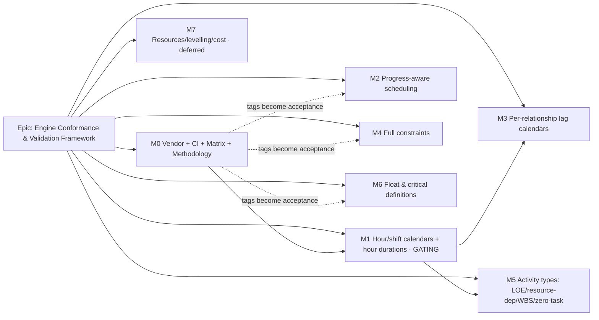

<!--
Implementation Plan — Stage 5 of docs/PROCESS.md. Sequenced as thin vertical
slices that keep `main` releasable. NO application/engine code is written until
this plan is approved.
-->

# Implementation Plan: Engine Conformance & Validation Framework

- **Feature spec:** `docs/specs/engine-conformance-framework/feature-spec.md`
- **Status:** Draft (awaiting approval)
- **Owner:** _TBD_

> **Committed vs backlog.** M0 (this section's first milestone) and the **gating**
> M1 hour-granular rework are the recommended committed scope. M2–M7 are a
> **dependency-ordered backlog** the product owner draws from (critical question
> 3). Each capability milestone cites the **fixture tags that become its
> acceptance criteria** — a scenario that does not differ from S02 fails.

## Breakdown

### Epic

**Engine Conformance & Validation Framework** — establish a P6-class conformance
benchmark for SchedulePoint's CPM/PDM engine: a vendored fixture, a CI structural
gate, a living capability matrix, a differential harness, a no-oracle golden
strategy, and a dependency-ordered ladder of engine capabilities each accepted
against fixture tags. Roadmap theme: **engine quality / build-vs-buy confidence**.

---

## Milestone M0 — Vendor + CI structural gate + capability matrix + methodology (COMMITTED, doable now)

**Outcome:** the fixture is a first-class, versioned test asset; CI blocks a
malformed or under-covering fixture with **no engine dependency**; the team has a
living capability matrix and an accepted methodology ADR. **No engine code
changes.**

#### Feature: Vendor the fixture

> **Description:** bring the fixture (main + negative + CSVs + generator +
> validator) in-repo with provenance and typed, schema-validated loaders.
> **Complexity:** M
> **Dependencies:** critical question 1 (repo location).
> **Risks:** fixture regeneration silently changes the contract → mitigate with a
> Zod schema pinned to `schema_version` and a README regeneration note. Large JSON
> in the graph → keep it as a test asset, not a runtime import.
> **Testing:** loader round-trips the fixture; schema rejects a mutated shape.

##### Task 1 — Create the package + vendor files

- **Description:** add `packages/engine-conformance` (or the chosen location); vendor the JSONs, CSVs, and the two Python tools as upstream reference; write the README (origin, `schema_version`, regeneration, scope note).
- **Complexity:** S
- **Dependencies:** —
- **Testing:** package builds; files present; README lints.
- **Development steps:**
  1. Scaffold the workspace package (pnpm/turbo wiring, tsconfig/eslint presets).
  2. Vendor fixtures under `fixtures/`; tools under `fixtures/tools/`.
  3. Write README + a CHANGELOG entry / changeset.

##### Task 2 — Zod schema + typed loaders

- **Description:** model the fixture + negative-cases shapes in Zod; expose typed `loadFixture()` / `loadNegativeCases()`.
- **Complexity:** M
- **Dependencies:** Task 1
- **Testing:** loads the real fixture; rejects a deliberately mutated copy.
- **Development steps:**
  1. Author `schema.ts` (project, calendars, WBS, activities, relationships, resources, curves, roles, assignments, steps, expenses, scenarios, coverage_index).
  2. `load.ts` typed loaders; assert `schema_version`.
  3. Unit tests for accept/reject.

#### Feature: TS structural validator in CI

> **Description:** port `validate_fixture.py` to TypeScript/Vitest and wire it into CI (engine-free).
> **Complexity:** M
> **Dependencies:** Vendor feature.
> **Risks:** TS/Python divergence → mitigate with a parity check (same verdicts on the same inputs) and keep Python as canonical reference. Adding Python to CI is explicitly avoided (ADR-0034).
> **Testing:** validator passes the good fixture; fails each of a set of deliberately broken copies with precise messages.

##### Task 1 — Port the structural checks

- **Description:** referential integrity, DAG check, LOE spans, open-start/finish sets, progress sanity, milestone-zero-duration.
- **Complexity:** M
- **Dependencies:** loaders
- **Testing:** one broken-fixture case per check.
- **Development steps:**
  1. Implement `validate.ts` mirroring the Python checks.
  2. Implement `coverage.ts` with the `REQUIRED` tag list + completeness.
  3. `structural.spec.ts` covering pass + each failure mode.

##### Task 2 — CI wiring

- **Description:** run the structural suite as a fast, engine-free job/turbo task; block merge on failure.
- **Complexity:** S
- **Dependencies:** Task 1
- **Testing:** CI goes red on a mutated fixture in a throwaway branch.
- **Development steps:**
  1. Add the turbo task / CI step.
  2. Document the gate in `docs/TESTING.md`.
  3. Changeset.

#### Feature: Capability matrix + methodology & semantics ADRs

> **Description:** the living matrix (every tag/scenario/negative-case → status) and ADR-0034/0035/0036.
> **Complexity:** M
> **Dependencies:** engine reality review (done in the spec).
> **Risks:** matrix rots → mitigate with a rule (each capability epic updates its rows in-PR) recorded in ADR-0034.
> **Testing:** N/A (docs); the spec's success criteria S2/S3 gate acceptance.

##### Task 1 — Author `CAPABILITY_MATRIX.md`

- **Description:** full per-tag table with status + rationale + gating dependency; scenario + negative-case tables.
- **Complexity:** M
- **Dependencies:** —
- **Development steps:**
  1. Expand the spec §3 summary into a full per-tag matrix.
  2. Add scenario (S01–S13) + negative (N01–N18) status tables.
  3. Cross-link to ADR-0035/0036.

##### Task 2 — ADR-0034 Conformance methodology (Accepted)

- **Description:** the fixture as north-star (not parity); no-oracle golden strategy (first-principles assert + documented-semantics self-baseline); optional-oracle-never-a-gate; negative-case contract (reject/repair/report, never hang; iteration caps/horizons; named cycle members); TS-port-not-Python-in-CI; fixture vendoring/regeneration; matrix-upkeep rule.
- **Complexity:** M
- **Development steps:** write ADR-0034 from `docs/adr/_template.md`; add to `CLAUDE.md` §16.

##### Task 3 — ADR-0035 SchedulePoint CPM semantics (Proposed/Draft)

- **Description:** the documented golden contract for ambiguous behaviours: retained-logic vs progress-override vs actual-dates; suspend/resume-after-data-date; stopped/zero-remaining; out-of-sequence; SF semantics; mandatory-breaks-logic (produce-and-flag, N10); duplicate-edge policy (N04); lead-before-data-date clamp (N13); float definitions (TF≤0 vs longest path; start/finish/smallest); ALAP as zero-free-float.
- **Complexity:** L (judgement-heavy)
- **Development steps:** draft ADR-0035 with a decision per behaviour + rationale; leave "Accepted" to the owning capability epic that implements it.

##### Task 4 — ADR-0036 Hour/shift calendar & duration rework (Proposed/Draft)

- **Description:** amend ADR-0023 (continuous working-day → continuous working-time/minutes) and ADR-0024 (weekday mask + whole-day exceptions → intraday shift patterns + time-window exceptions + window-only base weeks); elapsed durations; hour-based lag; per-relationship lag-calendar seam; iteration-cap/horizon; storage-model implications (hours) and migration note. **This is the gating design.**
- **Complexity:** L
- **Development steps:** draft ADR-0036; enumerate the port changes to `calendar.ts`/`types.ts`/`compute.ts`/`constraints.ts`; flag DB/storage follow-up.

#### Feature: Differential harness scaffold (engine-dependent, subset only)

> **Description:** the fixture→engine adapter + scenario runner + the "must differ from S02" assertion pattern, running only the subset the engine supports today; everything else is explicit `todo` with a reason.
> **Complexity:** M
> **Dependencies:** loaders; existing engine.
> **Risks:** false green (pretending an unsupported input passed) → mitigate by having the adapter refuse to fabricate unsupported inputs and mark them `todo`. Non-determinism → deterministic ordering, no wall-clock.
> **Testing:** the harness runs the logic subset deterministically; a wired scenario that equals S02 fails.

##### Task 1 — Adapter + scenario runner

- **Description:** map supported fixture fields to `EngineActivity[]`/`EngineEdge[]` + `ComputeOptions`; implement scenario option-flips as far as the engine supports.
- **Complexity:** M
- **Dependencies:** loaders
- **Development steps:**
  1. `adapter.ts` (day-granular approximation of hour data is **not** faked — unsupported activities/edges are excluded and reported).
  2. `scenarios.ts` for the flips the engine can express.
  3. `differential.spec.ts` with the "differ from S02" helper and `todo` placeholders for unbuilt capabilities.

##### Task 2 — Guarded goldens for the deterministic subset

- **Description:** capture stable snapshots for first-principles + already-supported behaviours (link arithmetic, negative float, merge/free-float, day-granular calendars).
- **Complexity:** S
- **Dependencies:** Task 1
- **Development steps:** add snapshot goldens; document the review-on-drift rule; changeset.

##### Task 3 — Hostile-input contract (testable-now subset)

- **Description:** assert current behaviour for the negative cases the engine/validator can already judge: N05 (dangling ref → reject), N01/N02/N03 (cycle/self-loop → reject; **note** cycle-member naming gap as a follow-up), N09 (negative duration), N12 (LOE-no-span → validator), N17 (milestone-with-duration → validator). Mark N06/N07/N08/N10/N11(hour)/N13/N14/N16/N18 as `todo` against their owning epics.
- **Complexity:** M
- **Dependencies:** loaders, validator, engine
- **Development steps:** one focused test per testable-now case; a tracking list mapping each deferred case to its epic.

---

## Milestone M1 — Hour/shift-granular calendars + hour-based durations (COMMITTED, GATING)

**Outcome:** the engine represents time at hour/minute granularity with intraday
shift calendars; elapsed durations, hour-granular lag, 24 h/night/split/window
calendars become expressible. Unlocks M3 and M5. **Amends ADR-0023/0024 via
ADR-0036 (moved to Accepted here).**

#### Feature: Hour-granular time model + intraday shift calendars

> **Description:** replace the continuous-working-day core with continuous
> working-time; intraday shift patterns + time-window exceptions + window-only
> base weeks behind the engine calendar port.
> **Complexity:** XL
> **Dependencies:** M0 (ADR-0036 accepted); ADR-0023/0024.
> **Risks:** correctness regression on existing plans → mitigate with the M0 golden
> subset as a safety net + a migration of stored day durations to hours. Hang on
> empty calendars (N11) → iteration cap + "no working time within N years" error.
> Perf regression → keep the binary-search/week-arithmetic approach; re-verify the
> recalc budget.
> **Testing:** fixture tags `cal_split_shift`, `cal_24h`, `cal_night_crosses_midnight`,
> `cal_asymmetric_week`, `cal_forces_split`, `cal_window_only`, `cal_empty_base_week`,
> `cal_positive_exception`, `elapsed_duration`; N11, N16, CAL-06 block; scenario
> assertions in S01/S02 that depend on exact instants (e.g. A5200 roll-forward to
> Tue 05-May 07:00).

_(Tasks: extend the calendar port to time granularity; port `compute.ts`/`constraints.ts` to work-time offsets; storage/migration for hour durations; iteration-cap/horizon guard; re-baseline goldens. Sized L/XL; sequenced so `main` stays releasable behind the existing recalc contract.)_

---

## Milestone M2 — Progress-aware scheduling (BACKLOG)

**Outcome:** the engine ingests actuals and schedules remaining work from the data
date, with the retained-logic / progress-override / actual-dates split and
suspend/resume. **Implements ADR-0035 progress semantics.**

> **Complexity:** XL · **Dependencies:** M1 (accurate remaining-hour maths); ADR-0035.
> **Risks:** ambiguous semantics → fixed and documented in ADR-0035, then
> self-baselined. **Acceptance (fixture tags):** `prog_complete`,
> `prog_in_progress`, `prog_out_of_sequence` (A4220→A4300 discriminator),
> `prog_suspend_resume`, `prog_suspended_no_resume`, `prog_stopped_zero_remaining`
> (A3040), `prog_resume_after_data_date` (A4230), `retained_logic_vs_progress_override`;
> **S02 vs S03 vs S04 must differ on A4220/A4300**; negatives N06/N07/N08/N13/N18.

---

## Milestone M3 — Per-relationship lag calendars (BACKLOG)

**Outcome:** lag measured in hours on a chosen calendar (Predecessor / Successor /
24-Hour / Project Default), with per-relationship overrides.

> **Complexity:** L · **Dependencies:** M1.
> **Acceptance (fixture tags):** `lag_calendar_24h`, `lag_calendar_setting_sensitive`;
> **S05 must move A8300 but NOT A4440** (explicit 24H override); **S06 must move
> every lagged edge** (check the negatives A4360/A8010/A9000/A10460); N16 horizon.

---

## Milestone M4 — Full constraints (BACKLOG)

**Outcome:** un-park mandatory constraints (produce-and-flag violations), plus
expected-finish, secondary constraints, and ALAP.

> **Complexity:** L · **Dependencies:** M1 (exact dates); ADR-0035.
> **Acceptance (fixture tags):** `con_mandatory_start`/`con_mandatory_finish`
> (A10100/A10500 override the network in both passes; **N10 impossible pair must
> schedule-and-report, not "fix"**), `con_expected_finish` (A6200; **S12 must
> differ**), `con_secondary_fnlt` (A5200), `con_alap` (A9400 free-float=0);
> `con_start_on`/`con_finish_on` exact-pin verification.

---

## Milestone M5 — Activity types: LOE / resource-dependent / WBS / zero-task (BACKLOG)

**Outcome:** level-of-effort spans, resource-dependent scheduling on resource
calendars, WBS-summary rollup, and the zero-duration _task_ (distinct from a
milestone).

> **Complexity:** XL · **Dependencies:** M1 (resource calendars, zero-task hours).
> **Acceptance (fixture tags):** `type_loe`/`loe_*` (never drive/critical/inherit
> negative float; N12 no-span rejected), `type_resource_dependent`/`res_calendar_drives`
> (A6100 on crane-hire window, A8300 Mon–Thu), `type_wbs_summary` (W4000/W5000/W7000
> rollup), `net_zero_duration_task` (A7550).

---

## Milestone M6 — Float & critical definitions (BACKLOG, largely independent)

**Outcome:** longest-path critical, multiple float paths, start/finish/smallest
float, open-ends-critical.

> **Complexity:** L · **Dependencies:** network dates (post-M1 for exactness);
> ADR-0035 float definitions.
> **Acceptance (fixture tags/scenarios):** **S07** (A12700 drops from critical set
> under longest path), **S08** (A9500/A3900/A12700 critical), **S11**
> (`float_multiple_paths_target` A12500 — 10 contiguous chains, re-run with
> free-float changes them), **S13** (`START_FLOAT` diverges at A4340/A7710/A11100/A5500),
> `float_zero_free`.

---

## Milestone M7 — Resources / levelling / curves / cost / EV + inter-project (DEFERRED, out-of-scope-for-now)

**Outcome:** resource levelling, resource curves, assignment lag, cost/earned-value,
inter-project/external dates. **Explicitly deferred** — not on the TSLD planner's
critical path to value; recorded in the matrix and `docs/TECH_DEBT.md` as a
candidate, revisited when resources land on the roadmap.

> **Acceptance (if/when picked up):** `res_*`, `levelling_test` (S10), `cost_*`,
> `accrual_*`, `*_curve_*`, `net_external_*`/`interproject` (S09), N14.

---

## Sequencing & slices

1. **M0 first, in full** — zero engine risk, immediately useful (regression
   scaffold + benchmark + matrix + ADRs). Keeps `main` releasable trivially (test
   assets + docs + CI job).
2. **M1 next** — the gating rework; sequence its tasks so the existing recalc
   contract keeps working throughout, with the M0 golden subset as the safety net.
3. **M2–M6** — drawn from the backlog by the product owner in dependency order
   (M3/M5 require M1; M2 benefits from M1; M4/M6 largely independent). Each is an
   independently valuable slice that flips its fixture-tag scenarios from `todo`
   to asserting "must differ from S02" and moves its matrix rows to `supported`.
4. **M7** — deferred; only if/when resources become roadmap-committed.

No feature flags are needed for M0 (test-only). Engine capability epics ship
behind the existing recalculate endpoint's contract; any behaviour change is a
reviewed golden diff.

## Definition of Done (per task)

Each task's PR must satisfy the Feature Completion Criteria in
[`docs/PROCESS.md`](../../PROCESS.md). For this initiative specifically: M0 tasks
require **CI green + docs/ADRs + changeset** (no security/a11y surface — note that
explicitly in the PR). Engine capability tasks additionally require the relevant
**backend-performance-reviewer** (recalc budget) and **test-engineer** review, the
matrix row updated in-PR, and any ADR-0035/0036 section moved to Accepted.

## Risks & assumptions (rollup)

| Risk / assumption                                  | Likelihood | Impact | Mitigation                                                                                            |
| -------------------------------------------------- | ---------- | ------ | ----------------------------------------------------------------------------------------------------- |
| Repo-location decision changes layout              | med        | low    | Critical question 1 up front; layout is mechanical to move.                                           |
| TS validator diverges from Python                  | med        | med    | Parity check on shared inputs; Python kept as canonical reference (ADR-0034).                         |
| Fixture regeneration changes the contract silently | med        | high   | Zod schema pinned to `schema_version`; regeneration is a reviewed change.                             |
| Hour-granular rework regresses existing plans      | med        | high   | M0 golden subset as safety net; day→hour migration; re-verify recalc perf budget.                     |
| Engine hang on N11/N16                             | low        | high   | Iteration cap + horizon + "no working time within N years" error (ADR-0034/0036).                     |
| Ambiguous semantics chosen wrongly                 | med        | med    | Fix in ADR-0035 with rationale; self-baseline; optional oracle as later confidence.                   |
| Scope creep toward full P6 parity                  | med        | med    | North-star framing; matrix classifies out-of-scope; PO confirms committed line (critical question 3). |
| Non-deterministic goldens                          | low        | med    | Deterministic ordering; no wall-clock/timezone; snapshot review-on-drift.                             |
