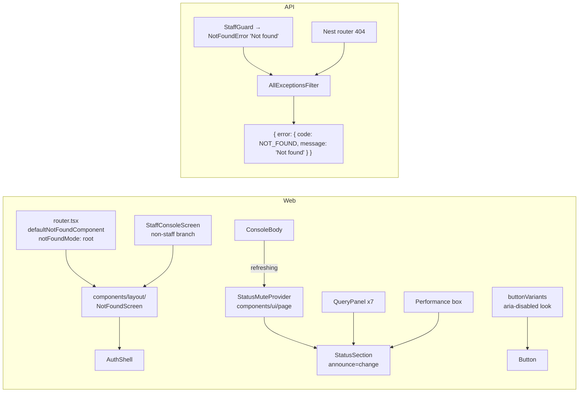
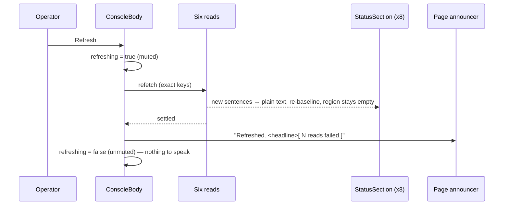
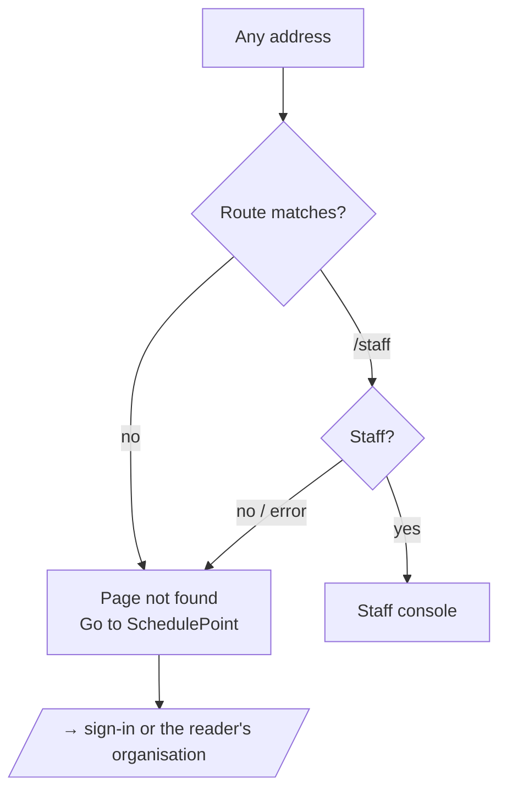

# Feature Spec: October estate polish — one "Page not found", a quiet Refresh, and shading that lives in `Button`

- **Status:** Draft — awaiting approval before implementation.
- **Decision:** approved in principle by the product owner 2026-10-06 ('Let's do 1, 2 & 3. Only do 1 if a proper page not found is worth it'), pending spec approval.
- **Author(s):** Claude Code (feature-analyst), for James Ewbank (product owner)
- **Date:** 2026-10-06
- **Tracking issue / epic:** `docs/TECH_DEBT.md` #459, #460, #461; the staff console redesign's M3 and M4
  records (`docs/specs/staff-console-redesign/implementation-plan.md:377-379`, `:410-412`); `docs/HANDOFF.md`
  "Decisions to put to the product owner" items 1–3.
- **Roadmap link:** none (quality of existing surfaces)
- **Related ADR(s):** ADR-0086 (uniform 404), ADR-0178 (StatusSection announce-on-change; **gains D8**),
  ADR-0082/0083 (shaded controls stay reachable), ADR-0111 (keyboard/SR contract reviewed before release),
  ADR-0088 D1 (no flag), ADR-0081 (entry point + journey), ADR-0105 (why this is a spec). **No new ADR.**

> **Why a spec (ADR-0105).** Item 1 changes what every unknown URL renders and what an API 404 body says;
> item 2 adds to a shared primitive's public contract; item 3 changes `Button`'s CVA and a shared gate. Each
> is a trigger. **No schema change. No new Playwright config or CI step** — existing suites gain steps, so
> `pnpm check:counts` figures do not move. **No flag** (ADR-0088 D1): each milestone is its own commit
> boundary, and that is the rollback.

---

## 0. What was checked, and what the register got wrong

Every claim below was re-read on 2026-10-06 (CLAUDE.md §19.11).

| #   | Claim (source)                                                                                                 | What is true                                                                                                                                                                                                                                                                                                                                                                                                                                                                                                                                                                                                                                                                                                          |
| --- | -------------------------------------------------------------------------------------------------------------- | --------------------------------------------------------------------------------------------------------------------------------------------------------------------------------------------------------------------------------------------------------------------------------------------------------------------------------------------------------------------------------------------------------------------------------------------------------------------------------------------------------------------------------------------------------------------------------------------------------------------------------------------------------------------------------------------------------------------- |
| 0.1 | Router has a `defaultNotFoundComponent` (brief)                                                                | **It has none.** `createRouter` at `apps/web/src/app/router.tsx:636-657` sets `defaultErrorComponent` and `defaultPendingComponent` only. An unknown URL renders the library's `DefaultGlobalNotFound`, which is literally `
Not Found
` (`@tanstack/react-router@1.170.41` `dist/esm/not-found.js:40-42`). No `notFoundMode` is set, so the default `"fuzzy"` applies (`@tanstack/router-core@1.171.34` `dist/esm/router.js:635`).                                                                                                                                                                                                                                                                              |
| 0.2 | Some routes throw `notFound()` in loaders (brief asks)                                                         | **None do.** Grep of `notFound\(` under `apps/web/src` finds only a test helper (`routes/staff.test.tsx:66`). The plan, project and client "not found" states are **query-error branches inside the screens** (`routes/plan-detail.tsx:64-94` and siblings), rendered in the shell with breadcrumbs. They are about an entity, not a URL, and are out of scope.                                                                                                                                                                                                                                                                                                                                                       |
| 0.3 | Where an unknown URL renders                                                                                   | Read from `router.js:659-665` and `:958-969` and `new-process-route-tree.js:396` (fuzzy matching skips index routes): `/no-such-path` matches only the root, so the `
` renders bare at root (agrees with `m0-measurement.md:108-111`). `/orgs/acme/nope` fuzzy-matches `/orgs/$orgSlug`, and the nearest route **with children** is `_authed`, so the `
` renders **inside the authenticated shell's outlet** (and a signed-out visitor is redirected to sign-in by `_authed`'s `beforeLoad` first). `/staff/x` fuzzy-matches `/staff` (a leaf), so it falls back to root. **This is a reading of library source, not a measurement**; M3-T0 drives all four.                                                    |
| 0.4 | API: non-staff `/staff` 404 equals an unmapped route's 404 (`docs/API.md:1453-1455`, `staff.controller.ts:68`) | **True of the status, false of the body.** `StaffGuard.notFound()` throws `new NotFoundError('Not found')` (`staff.guard.ts:160-162`) → `{ error: { code: 'NOT_FOUND', message: 'Not found' } }`. An unmapped route reaches `AllExceptionsFilter.mapHttp` as Nest's router `NotFoundException`, whose message is `Cannot GET /api/v1/…` (`all-exceptions.filter.ts:184-199` passes `exception.message` through; corroborated by `test/revision-delta-m0.e2e-spec.ts:313-314`). Every staff e2e asserts **status only** (`test/staff.e2e-spec.ts:213-229`), which is why nobody saw it. Grep finds **no** `new NotFoundException` in `apps/api/src`, so every `HttpException` 404 reaching the filter is the router's. |
| 0.5 | #461: "eight sites" with the hover pair                                                                        | **Seven today**: `copy-button.tsx:92`, `console-header.tsx:73`, `status-summary.tsx:131`, `accounts-panel.tsx:155`, `sitting-result.tsx:197`, `probe-sittings.tsx:419`, `performance-probe-panel.tsx:176`. `probe-controls.tsx` (listed by #461) now carries the **transient** shape (`aria-disabled:pointer-events-none aria-disabled:opacity-50`, lines 63/75/161) after the M4 split. More widely, `aria-disabled:opacity-*` is written by hand in **57 files** (63 occurrences) at **two values, 50 and 60** — the duplication is larger than #461 says.                                                                                                                                                          |
| 0.6 | #460: fifteen sites                                                                                            | **Fifteen**, matching `RESTING_POINTER_INERT_EXCEPTIONS` (`submit-guard.structural.test.ts:215-329`) one-for-one with the register.                                                                                                                                                                                                                                                                                                                                                                                                                                                                                                                                                                                   |
| 0.7 | Item 2: "threaded through six panels"                                                                          | **Eight call sites**: seven `QueryPanel`s (Mail, Retention, Security, Accounts, Installation, Alerting, Activity) and the Performance box's own `StatusSection` (`performance-probe-panel.tsx:150`, `announce="change"`). Diagnostics is `announce="settle"` and is not refetched by Refresh (`refresh-page-reads.ts:30`, exact keys).                                                                                                                                                                                                                                                                                                                                                                                |

---

## 1. Business understanding

### Problem

1. **Unknown URLs are a dead end, and they betray `/staff`.** Every mistyped, stale or flag-dark address
   (`/forgot-password` with `PASSWORD_RESET` off, an old bookmark) shows two words in the corner: no
   heading, no `<main>`, no link, tab title `SchedulePoint`. A non-staff `/staff` shows a styled page
   titled `Not found · SchedulePoint`, so the two can be told apart (#459), and the API bodies differ
   too (§0.4).
2. **Refresh on the staff console speaks twice.** After Refresh the page says one sentence, and any box
   whose sentence changed (after its one-way latch has flipped) also speaks from its own polite region.
3. **Resting shaded buttons are pointer-inert, and the shading is copied by hand.** Fifteen `<Button>`s
   that can be `aria-disabled` at rest carry `aria-disabled:pointer-events-none`, so their reason cannot
   be hovered and a click lands on whatever is behind (#460). The look itself is a caller string in 57
   files at two opacities (#461, §0.5).

### Users

Every role, including signed-out visitors (item 1); staff operators using a screen reader (item 2);
every role that meets a shaded control, chiefly Planners and Org Admins (item 3).

### Expected outcomes and success criteria

- **SC-1** `/no-such-path`, `/staff/x`, `/orgs/<slug>/nope` (signed in) and a non-staff `/staff` render
  the same screen: an `<h1>` "Page not found", one `<main>`, a link home, title
  `Page not found · SchedulePoint`. Signed out, `/no-such-path` renders it too.
- **SC-2** `GET /api/v1/staff/me` as a non-staff member and `GET /api/v1/no-such-route` answer
  byte-identical bodies: `{"error":{"code":"NOT_FOUND","message":"Not found"}}`.
- **SC-3** On the staff console, a Refresh produces exactly one announcement (the page sentence); no box's
  polite region changes text during or after it.
- **SC-4** No `<Button>` caller writes an `aria-disabled:opacity-*` or `aria-disabled:hover:*` class; the
  look comes from `buttonVariants`, one opacity for every variant.
- **SC-5** None of the fifteen #460 sites is pointer-inert while shaded (Playwright
  `click({ trial: true })` succeeds on each driven one); `RESTING_POINTER_INERT_EXCEPTIONS` is gone.

### Is item 1 worth it? — **Yes.**

- **Security** rated the tell **Low** (the route name ships in the public bundle). Alone, that would
  not justify a change.
- **Usability and WCAG 2.2 AA are the real case.** The current page has a title that does not describe
  it (`SchedulePoint` for an error — a probable **2.4.2 Page Titled** failure), no `<main>` and no `<h1>`
  (axe's `landmark-one-main` / `page-has-heading-one` best-practice rules; **1.3.1** at the margin), and
  no way forward but the Back button. It is reachable from every flag-dark route and every stale link,
  signed in or out — this is not a rare page.
- **Cost is small:** one component built from an existing primitive (`AuthShell`), one router option,
  one staff branch swapped, one filter line in the API, steps added to two existing suites. About a day.

So the parity fix comes almost free with a fix worth making on its own.

### Open questions

- **Q1 (critical, the only one).** Go ahead with item 1 (M3) as recommended? **Default: yes.** If no,
  M3 is dropped whole and #459 stays open with this section as its assessment.
- Defaults stated without asking: `notFoundMode: 'root'` (§4.1); the screen uses `AuthShell`; transient
  sites keep `pointer-events-none` (§4.3); item 2 is a context, not a prop (§4.2).

---

## 2. Functional requirements

**US-1** — As anyone who reaches an address that is not a page, I want a titled page that says so and
takes me home, so that I am not stranded.

- **Given** any URL no route matches, signed in or out, **then** `NotFoundScreen` renders at the root
  (outside the shell): `<main>`, `<h1>` "Page not found", the sentence "There is nothing at this
  address.", a link **Go to SchedulePoint** to `/`, title `Page not found · SchedulePoint`.
- **Given** a signed-in non-staff caller (or anyone whose identity call fails) on `/staff`, **then** the
  same component renders, with the same DOM.
- **Given** an API request to an unmapped route, **then** the body is `{ error: { code: 'NOT_FOUND',
message: 'Not found' } }`, identical to the staff guard's refusal.

**US-2** — As a staff operator using a screen reader, I want one sentence after Refresh, so that I am
told the page's answer once.

- **Given** Refresh (or **Try again for all**) is running, **when** a box's sentence changes, **then**
  its polite region does not change; its plain-text sentence does.
- **Given** the Refresh has finished, **then** no box speaks the sentence it reached during it; a
  **later** change (a box's own Try again) speaks as today.
- **Given** a Refresh after which any of the six reads has failed, **then** the page sentence ends with
  how many could not be read (`freshness.unreadable`, already computed — `model/freshness.ts:19-20`),
  because a box that newly failed would otherwise go unspoken.
- `announce="settle"` sections (Diagnostics, a probe run) are never muted.

**US-3** — As a pointer user, I want a shaded button to stay under my pointer, so that I can hover it for
its reason and my click never lands on what is behind it.

- **Given** a `<Button aria-disabled="true">` of any variant, **then** it renders at the one shaded
  opacity and its hover does not change its fill or ink.
- **Given** any of the fifteen #460 sites at rest, **then** it receives pointer events, and pressing it
  does nothing (the handler refuses).
- **Given** a transient site (`aria-disabled={x.isPending}`), **then** it keeps
  `aria-disabled:pointer-events-none` as today.

### Edge cases

- `/staff` while identity is pending still shows its spinner (`staff-console-screen.tsx:73-79`) before
  the answer; an unknown URL does not. That timing difference is **accepted residue**, as is the
  anonymous 401 on `/api/v1/staff/*` (global `AuthenticationGuard`; `staff.guard.ts:92-98` records it)
  and the staff controller's own 30/min throttle. All three are inside security's Low rating.
- A Refresh pressed while a box's own Try again is in flight: the box's answer lands inside the muted
  window and is covered by the page sentence.
- A `Link` or anchor styled with `buttonVariants` and `aria-disabled` gains the shading — intended.
- A `<Button>` that binds `aria-disabled` and today has **no** shading class will start to dim. M1-T0
  lists them (candidates from grep: `FloatPathsPanel`, `ImportScheduleDialog`, `AcceptInvitationCard`,
  `AssignmentRow`, `RecentlyDeletedTable`, `selection-actions`, `MembersTable`) and the reviewer
  confirms each is meant to look shaded.

### Permissions

No change. Item 1's screen is public. The staff gate and API scoping are unchanged; only the message
text of a 404 changes.

### Error scenarios

| Scenario                             | Detection                  | User-facing result                          | Status |
| ------------------------------------ | -------------------------- | ------------------------------------------- | ------ |
| Unknown web URL                      | router global not-found    | `NotFoundScreen`                            | n/a    |
| Non-staff `/staff`                   | identity `null`/error      | `NotFoundScreen`                            | n/a    |
| Unmapped API route / non-staff staff | Nest router / `StaffGuard` | `{ code: NOT_FOUND, message: "Not found" }` | 404    |

---

## 3. Technical analysis

| Area           | Impact | Notes                                                                                                                                                                                                                    |
| -------------- | ------ | ------------------------------------------------------------------------------------------------------------------------------------------------------------------------------------------------------------------------ |
| Frontend       | med    | New `components/layout/not-found-screen.tsx`; router option; staff branch; `StatusSection` context; `buttonVariants`; ~57 class strings deleted; 15 handler guards.                                                      |
| Backend        | low    | `AllExceptionsFilter.mapHttp`: a 404 `HttpException` gets the fixed message `Not found`.                                                                                                                                 |
| Database       | none   | —                                                                                                                                                                                                                        |
| API            | low    | 404 body text for unmapped routes. Not a contract field anyone parses (codes are the contract, `docs/API.md`). `api` patch.                                                                                              |
| Security       | low    | Closes #459's web and body tells; stops echoing the request path in an error body (the filter's own rule, `all-exceptions.filter.ts:31-32`).                                                                             |
| Performance    | none   | `NotFoundScreen` is eager like `RouteErrorScreen`; `AuthShell`/`BrandPanel` are already in the entry graph via `SignInScreen` (eager, `router-splitting.structural.test.ts:35-40`). Confirm with the build's chunk list. |
| Infrastructure | none   | —                                                                                                                                                                                                                        |
| Observability  | none   | The filter's `warn` log still records the real path.                                                                                                                                                                     |
| Testing        | med    | Unit, structural gate, API e2e, and steps in `e2e-staff`, `e2e-public` and the suites in plan §M1.                                                                                                                       |

**Dependencies.** None external. M1 touches `status-summary.tsx`, `console-header.tsx` and
`accounts-panel.tsx`, which M2 does not; M2 and M3 both touch `staff-console-screen.tsx` (different
hunks). Sequential merges avoid conflicts.

---

## 4. Solution design

### 4.1 Item 1 — one not-found screen, one 404 body

- **`NotFoundScreen`** in `components/layout/` (an app-level component both `app/` and
  `features/staff` may import; `features → app` would invert the layering). It renders
  `AuthShell title="Page not found" description="There is nothing at this address."` with a link
  **Go to SchedulePoint** (`href="/"`, a plain anchor like today's staff branch, so it works with no
  router context), and calls `useDocumentTitle('Page not found')`. `AuthShell` already supplies the one
  `<main>`, the `<h1>` (`CardTitle` defaults to level 1, `card.tsx:73-86`) and a live-region provider,
  and is the public screens' family (ADR-0077), so nothing new is styled.
- **Router:** `defaultNotFoundComponent: NotFoundScreen` and **`notFoundMode: 'root'`**. Root mode means
  every unknown URL renders the same screen outside the shell, which is the parity property. The
  alternative — fuzzy mode with an in-shell variant for `/orgs/…` typos — keeps the navigator but needs a
  second, `<main>`-less variant (the workspace already owns a `<main>`, `route-pending.tsx:18-19`) and
  gives two pictures. Rejected for this size of change.
- **Staff branch:** `if (identity.isError || identity.data === null) return <NotFoundScreen />;` and the
  title call becomes `useDocumentTitle(identity.data ? 'Staff console' : null)` so the two titles never
  fight (`useDocumentTitle(null)` sets nothing, `use-document-title.ts:27`).
- **API:** in `mapHttp`, a status-404 `HttpException` gets `message: 'Not found'` (the guard's exact
  string). It applies only to Nest's own 404s (§0.4: the app throws none), and `DomainError` 404s
  keep their specific messages.

### 4.2 Item 2 — a mute the screen provides, not a prop eight callers thread

**Context, not prop.** A `StatusMuteContext` (boolean, default `false`) exported beside `StatusSection`
from `components/ui/page`; `ConsoleBody` wraps its groups in `<StatusMuteProvider muted={refreshing}>`.
Why: (a) the fact belongs to the **screen** (it owns `refreshing`), and the eight sections are three
levels down in two features — `perf-probe` may not import `staff` (plan M4 record, `:408-409`); (b)
there is a direct precedent in the same primitive family — ADR-0178 D1's `HeadingLevelContext`, a
page-scoped fact supplied by a container rather than passed per call; (c) every other caller is
untouched because the default is `false`. A prop would mean eight call-site edits plus a pass-through
on `QueryPanel` for a fact none of those panels decides.

**Semantics (ADR-0178 D8).** Only `announce="change"` sections listen. While muted, a section writes its
current sentence as plain `sr-only` text and **re-baselines** to it (its latch resets), with the polite
region left empty; on unmute nothing is spoken, because the current sentence is the baseline. The page
sentence (`refreshedAnnouncement`) gains a tail when `freshness.unreadable > 0`. Mute ends in the same
`finally` that clears `refreshing` (`staff-console-screen.tsx:224-226`), which runs after
`setRefreshed`, so the page sentence is queued before any box could speak.

### 4.3 Item 3 — the look in `buttonVariants`, the behaviour at the caller

- **Base:** `aria-disabled:opacity-60` (the value the M1 staff fix and ADR-0178 D3's `CopyButton` chose;
  sites at 50 move to 60). Native `disabled:opacity-50` is untouched.
- **Per variant, cancel the hover** by restating the resting fill and ink under `aria-disabled:hover:`:
  default `bg-primary text-primary-foreground`; secondary `bg-secondary text-secondary-foreground`;
  outline `bg-background text-foreground` (today's hand-written pair); ghost `bg-transparent
text-inherit`; destructive `bg-destructive text-destructive-foreground`. Exact utilities are
  component-reviewer's call; the rule is "a shaded button looks the same hovered or not".
- **`pointer-events-none` does not move into the CVA.** Whether it is right depends on the expression
  bound to `aria-disabled`, which only the caller has; the #458 gate already reads that expression.
  Transient sites keep `aria-disabled:pointer-events-none` (it stops a mid-request click landing on a
  button that is about to change); resting sites must not have it. (Rejected: `aria-busy:pointer-events-none`
  in the CVA — not every transient site sets `aria-busy`, so it would silently change ~30 sites.)
- **Fifteen sites:** delete `aria-disabled:pointer-events-none`; confirm or add the handler refusal
  (`if (blocked) return;` — the staff Copy is the worked example). Where the site already has a reason
  (`aria-describedby`/title), it becomes hover-reachable; no new copy is written.
- **Gate (`submit-guard.structural.test.ts`):** add G1 "no `<Button>` tag's className contains
  `aria-disabled:opacity-` or `aria-disabled:hover:`", with pinned positive and negative fixtures
  (ADR-0110). Retire `unshadedSubmits` and `POINTER_EVENTS_EXEMPT` (shading is now unconditional for
  `<Button>`, and `ResendVerificationButton` is covered by the resting rule). Delete
  `RESTING_POINTER_INERT_EXCEPTIONS` and its loop: the resting rule becomes an unconditional
  `toEqual([])`. Out of reach, stated: raw `<button>`s (`RevisionChangesView.tsx:159`) and
  `ToolbarButton`/`ToolbarSplitButton`/`ToolbarPopover`, as today.

### 4.4 Surface test sheet (`docs/specs/gantt-coarse-pointer/device-checklist.md`) — site by site

The sheet tests Gantt bar drag/stretch, long-press and keyboard row menus, in-cell double-tap, the row
dots and summary arrow, column-heading sort, Shift+right-click, **Start editing**, and
`/pointer-check.html`.

| Site / change                   | Affected? | Why                                                                                                                                                                                                                                                                                                                                     |
| ------------------------------- | --------- | --------------------------------------------------------------------------------------------------------------------------------------------------------------------------------------------------------------------------------------------------------------------------------------------------------------------------------------- |
| `ArrangeDialog`                 | No        | A TSLD dialog; no sheet step opens it.                                                                                                                                                                                                                                                                                                  |
| `BulkSelectionBar`              | No        | Rendered only by `TsldPanel` (`TsldPanel.tsx:3067`); the sheet runs in the Gantt view.                                                                                                                                                                                                                                                  |
| `LinkChainDialog`               | No        | Rendered only by `TsldPanel` (`:3599`).                                                                                                                                                                                                                                                                                                 |
| `CreateActivityPopover`         | No        | Rendered only by `TsldPanel` (`:3342`).                                                                                                                                                                                                                                                                                                 |
| `TsldPanel` empty-canvas notice | No        | TSLD view only, and only on an empty plan.                                                                                                                                                                                                                                                                                              |
| `WbsBulkAssignBar`              | No        | In `ActivitiesTable` (the activities panel), shown on a bulk WBS selection; no sheet step makes one.                                                                                                                                                                                                                                    |
| `scope-save-bar`                | No        | In the activity editor's tabs; item 5's double-tap is the Gantt's in-cell edit (`features/gantt/model/cell-edit.ts`), which does not use it.                                                                                                                                                                                            |
| CVA shading (all `<Button>`s)   | No        | The Gantt's only `<Button>` is the row dots (`GanttRowMenu.tsx:156`), never `aria-disabled`; **Start editing** and the Gantt toolbar are toolbar items, not `<Button>`. The Gantt columns **Reset** (`gantt-columns-group.tsx:227-233`, outline, shaded at default widths) loses its hover fill when shaded — no sheet step touches it. |
| Items 1 and 2                   | No        | Not the plan workspace.                                                                                                                                                                                                                                                                                                                 |

**So no sheet update is due**, and each PR description says so in one line, as the sheet's banner asks.

### Database / API / component changes

- **Database:** none.
- **API:** 404 message text only (§4.1). `docs/API.md:1453-1455` gets "same status **and body**".
- **Components:** `NotFoundScreen` (new, `components/layout/`); `StatusMuteProvider` + `StatusSection`
  behaviour (`components/ui/page/`); `buttonVariants` (`components/ui/button.tsx`). Documented in
  `docs/COMPONENT_LIBRARY.md` (StatusSection contract, Button shaded state) and
  `docs/DESIGN_SYSTEM.md` §Buttons (the `aria-disabled` look now comes from the primitive).

### User flow (item 1)

## 5. Links

- Implementation plan: [`./implementation-plan.md`](./implementation-plan.md)
- Docs updated by this change: `docs/TECH_DEBT.md` (#459, #460, #461 closed), `docs/API.md`,
  `docs/COMPONENT_LIBRARY.md`, `docs/DESIGN_SYSTEM.md`, `docs/FRONTEND_ARCHITECTURE.md` (routing: the
  not-found rule), ADR-0178 (D8), `docs/HANDOFF.md`.
