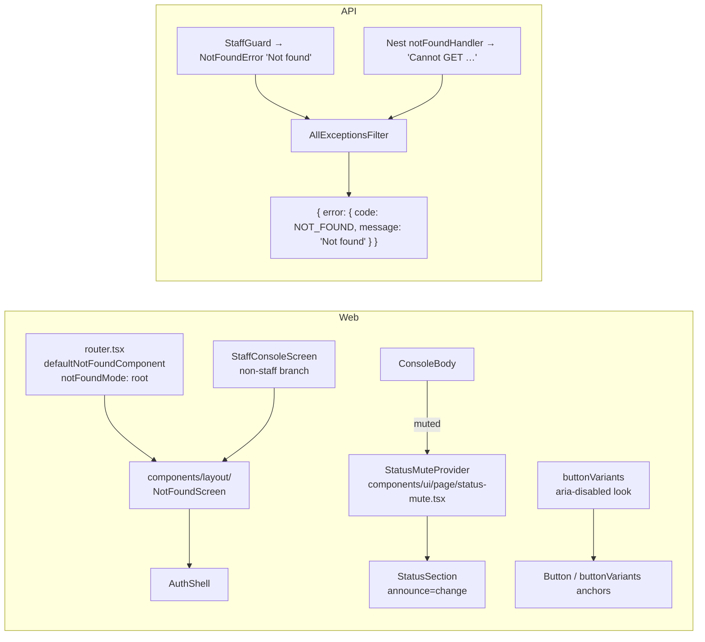
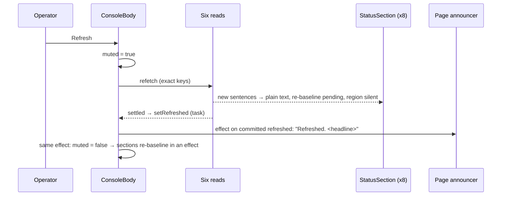
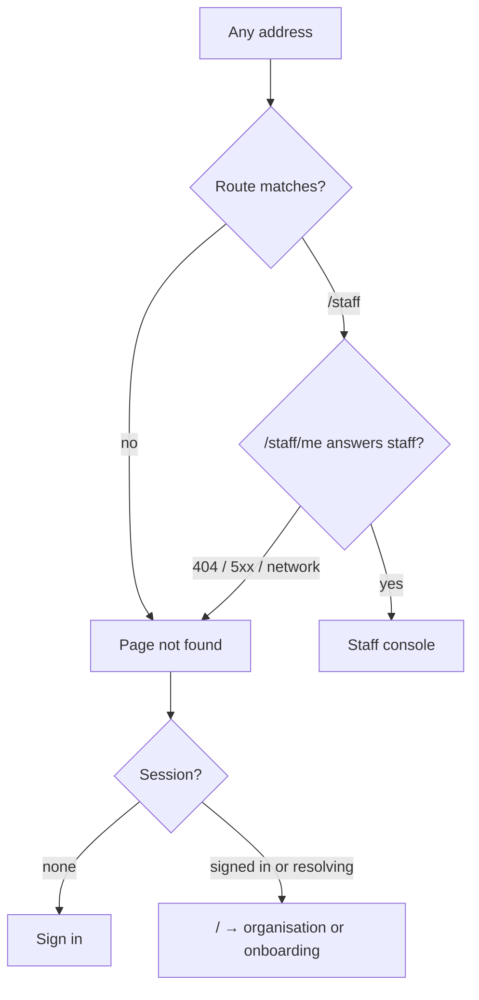

# Feature Spec: October estate polish — one "Page not found", a quiet Refresh, and shading that lives in `Button`

- **Status:** Draft — awaiting approval before implementation.
- **Decision:** approved in principle by the product owner 2026-10-06 ('Let's do 1, 2 & 3. Only do 1 if a proper page not found is worth it'), pending spec approval.
- **Author(s):** Claude Code (feature-analyst), for James Ewbank (product owner)
- **Date:** 2026-10-06 (revised the same day after four reviews — §6)
- **Tracking issue / epic:** `docs/TECH_DEBT.md` #459, #460, #461; the staff console redesign's M3 and M4
  records (`docs/specs/staff-console-redesign/implementation-plan.md:377-379`, `:410-412`); `docs/HANDOFF.md`
  "Decisions to put to the product owner" items 1–3.
- **Roadmap link:** none (quality of existing surfaces)
- **Related ADR(s):** ADR-0086 (uniform 404), ADR-0178 (StatusSection announce-on-change; **gains D8**),
  ADR-0082/0083 (shaded controls stay reachable), ADR-0111 (keyboard/SR contract reviewed before release),
  ADR-0088 D1 (no flag), ADR-0081 (entry point + journey), ADR-0105 (why this is a spec). **No new ADR.**

> **Why a spec (ADR-0105).** Item 1 changes what every unknown URL renders and what an API 404 body says;
> item 2 adds to a shared primitive's public contract; item 3 changes `Button`'s CVA and a shared gate. Each
> is a trigger. **No schema change. No new Playwright config or CI step** — existing suites gain steps, so
> `pnpm check:counts` figures do not move. **No flag** (ADR-0088 D1): each milestone is its own commit
> boundary, and that is the rollback.

---

## 0. What was checked, and what the register got wrong

Re-read on 2026-10-06 (CLAUDE.md §19.11).

| #   | Claim (source)                                                               | What is true                                                                                                                                                                                                                                                                                                                                                                                                                                                                                                                                                                                                                                                                                                                     |
| --- | ---------------------------------------------------------------------------- | -------------------------------------------------------------------------------------------------------------------------------------------------------------------------------------------------------------------------------------------------------------------------------------------------------------------------------------------------------------------------------------------------------------------------------------------------------------------------------------------------------------------------------------------------------------------------------------------------------------------------------------------------------------------------------------------------------------------------------- |
| 0.1 | Router has a `defaultNotFoundComponent` (brief)                              | **None.** `createRouter` (`apps/web/src/app/router.tsx:636-657`) sets the error and pending components only. Unknown URLs get the library's `DefaultGlobalNotFound` = `
Not Found
` (`@tanstack/react-router@1.170.41` `dist/esm/not-found.js:40-42`); `notFoundMode` defaults to `"fuzzy"` (`@tanstack/router-core@1.171.34` `dist/esm/router.js:635`).                                                                                                                                                                                                                                                                                                                                                                    |
| 0.2 | Routes throw `notFound()` (brief asks)                                       | **None do** (grep: only a test helper, `routes/staff.test.tsx:66`). Plan/project/client "not found" are **entity-level** query-error branches inside the shell (`routes/plan-detail.tsx:64-94`). They stay a deliberately different picture: they are about a thing that may exist and be hidden, inside the reader's organisation.                                                                                                                                                                                                                                                                                                                                                                                              |
| 0.3 | Where an unknown URL renders today                                           | Read from `router.js:659-665`, `:958-969` and `new-process-route-tree.js:396`: `/no-such-path` and `/staff/x` render at root; `/orgs/acme/nope` fuzzy-matches `/orgs/$orgSlug` and renders inside `_authed`'s outlet (signed out, `_authed` redirects to sign-in first). **A reading, not a measurement** — M3-T0 drives it.                                                                                                                                                                                                                                                                                                                                                                                                     |
| 0.4 | API: non-staff `/staff` 404 = unmapped route's 404 (`docs/API.md:1453-1455`) | **Status yes, body no.** `StaffGuard` throws `NotFoundError('Not found')` (`staff.guard.ts:160-162`). An unmapped route reaches the **same global filter**: Nest's `registerNotFoundHandler` throws ``new NotFoundException(`Cannot ${method} ${url}`)`` through `routerExceptionsFilter` (`@nestjs/core@11.2.7` `router/routes-resolver.js:72-82`), and `AllExceptionsFilter.mapHttp` passes the message through (`all-exceptions.filter.ts:184-199`) — so the body is the envelope with `message: "Cannot GET /api/v1/…"`, path and query echoed. (`test/revision-delta-m0.e2e-spec.ts:313-314`'s "bare 'Cannot GET' 404 from Express" is loose wording.) Staff e2e assert **status only** (`test/staff.e2e-spec.ts:213-229`). |
| 0.5 | #461: eight hover-pair sites                                                 | **Seven** today (`copy-button.tsx:92`, `console-header.tsx:73`, `status-summary.tsx:131`, `accounts-panel.tsx:155`, `sitting-result.tsx:197`, `probe-sittings.tsx:419`, `performance-probe-panel.tsx:176`); `probe-controls.tsx` now carries the transient shape. Hand-written `aria-disabled:opacity-*` is far wider: my grep counts 57 non-test files / 63 occurrences; reviewers counted ~63 files / ~75 (≈60 at 60 %, ≈15 at 50 %) — **M1a-T0's census is authoritative**. One is a constant, not a class attribute: `SHADED_BUTTON` (`ActivityProgressPanels.tsx:309`, used at `:580/:594/:608/:629`).                                                                                                                      |
| 0.6 | #460: fifteen sites                                                          | **Fifteen**, matching `RESTING_POINTER_INERT_EXCEPTIONS` (`submit-guard.structural.test.ts:215-329`). **Five are `type="submit"`** — `scope-save-bar.tsx:109`, `CalendarFormDialog.tsx:453`, `NoteComposer.tsx:104`, `NoteItem.tsx:328`, `CreateActivityPopover.tsx:137` — and several bind a pending flag beside the resting term (`NoteComposer.tsx:106`, `NoteItem.tsx:330`, `CalendarFormDialog.tsx:458`, `AuditEventList.tsx:198`; `blocked` locals may fold one in). Only `scope-save-bar` already refuses in `onClick` (`:115-117`). `CalendarExceptionsEditor.tsx:283/:561` and the Client/Resource form dialogs are **not** among the fifteen: they bind `isPending` only (transient) and change only in M1b.           |
| 0.7 | Item 2: "six panels"                                                         | **Eight sections**: seven `QueryPanel`s and the Performance box's `StatusSection` (`performance-probe-panel.tsx:150`, `announce="change"`). Diagnostics is `settle` and not refetched by Refresh (`refresh-page-reads.ts:30`).                                                                                                                                                                                                                                                                                                                                                                                                                                                                                                   |

---

## 1. Business understanding

### Problem

1. **Unknown URLs are a dead end, and they betray `/staff`.** Every mistyped, stale or flag-dark address
   shows two words in the corner: no heading, no `<main>`, no link, title `SchedulePoint`. A non-staff
   `/staff` shows a styled page titled `Not found · SchedulePoint` (#459), and the API bodies differ (§0.4).
2. **Refresh on the staff console can speak twice**: the page sentence, plus any box whose sentence
   changed after its latch flipped.
3. **Resting shaded buttons are pointer-inert, and the shading is copied by hand** (#460, #461, §0.5).

### Users

Every role and signed-out visitors (item 1); staff operators using a screen reader (item 2); every role
that meets a shaded control, chiefly Planners and Org Admins (item 3).

### Success criteria

- **SC-1** For a **signed-in non-staff member**, `/no-such-path`, `/staff`, `/staff/`, `/staff/x` and
  `/orgs/<slug>/nope` settle to the same screen: identical `document.title`, `<html lang>`, `<meta>` set,
  `<main>` markup, one `<h1>` "Page not found", one link. Signed out, unknown URLs render it too.
- **SC-2** For a signed-in non-staff member, `GET` and `POST /api/v1/staff/me`, `GET /api/v1/staff/no-such-route`
  and `GET /api/v1/x` return byte-identical bodies (`{"error":{"code":"NOT_FOUND","message":"Not found"}}`),
  `content-type`, `content-length` and security headers. Residue is listed, not claimed away (§2).
- **SC-3** A staff Refresh produces **one polite announcement** (the page sentence); a read that newly
  failed may add its own `role="alert"` (errors interrupt by design). No box's polite region speaks.
- **SC-4** No source file outside a named allow-list spells `aria-disabled:opacity-` or `aria-disabled:hover:`;
  `<Button>` and `buttonVariants()` anchors take the look from the CVA.
- **SC-5** None of the fifteen #460 sites is pointer-inert at rest; pressing one (pointer, Enter or Space)
  submits nothing and mutates nothing; each either shows a reachable reason or is an accepted no-op (§4.3).

### Is item 1 worth it? — **Yes.**

Security rated the tell **Low** (the route name ships in the public bundle); alone that would not
justify it. The usability and WCAG case does: the current page's title does not describe it (a probable
**2.4.2 Page Titled** failure), it has no `<main>` or `<h1>` (axe `landmark-one-main` /
`page-has-heading-one`; **1.3.1** at the margin), and no way on but Back — and it is reached from every
flag-dark route and stale link, signed in or out. Cost is about a day. The parity comes almost free.

### Open questions

- **Q1 (critical, the only one).** Go ahead with item 1 (M3)? **Default: yes.** If no, M3 is dropped and
  #459 stays open with this section as its assessment.
- Defaults chosen without asking: `notFoundMode: 'root'` with its trade-off accepted (§4.1); the link
  label is session-aware (§4.1); item 2 is a context; mixed-expression sites keep pointer protection for
  their pending half only (§4.3).

---

## 2. Functional requirements

**US-1** — As anyone who reaches an address that is not a page, I want a titled page that says so and
gives me a way on.

- **Given** any URL no route matches, signed in or out, **then** `NotFoundScreen` renders at root,
  outside the shell: `<main>`, `<h1>` "Page not found", "There is nothing at this address.", title
  `Page not found · SchedulePoint`, and focus moves to the `<h1>` on mount (as `RouteErrorScreen` does,
  `route-error-screen.tsx:88-89`), so a client-side arrival is announced.
- **The link is session-aware.** Session known absent → **Sign in** (`/sign-in`). Otherwise (signed in,
  or still resolving) → **Go to the home page** (`/`, which the home resolver sends to the reader's
  organisation or onboarding, `router.tsx:266-281`). Session is read with `useSession()`
  (`features/auth/api/use-session.ts:66`), which `components/layout` already imports elsewhere
  (`account-chip.tsx`). Both labels have a unit test.
- **Given** a signed-in caller whose `/staff/me` answers 404, or fails with a 5xx or network error,
  **then** `/staff` renders the same component (today's branch already folds `isError` in,
  `staff-console-screen.tsx:85`).
- **Given** an API request to an unmapped route, **then** the body is the guard's
  `{ code: 'NOT_FOUND', message: 'Not found' }`.

**US-2** — As a staff operator using a screen reader, I want a Refresh to be told once.

- **Given** Refresh or **Try again for all** is running, **when** an `announce="change"` box's sentence
  changes, **then** its polite region stays silent and its plain-text sentence updates; once the page
  sentence has been committed and announced, the box re-baselines and nothing it reached during the
  window is spoken later. A later change (the box's own **Try again**) speaks as today.
- **Given** a read newly fails during the Refresh, **then** `QueryErrorState`'s `role="alert"`
  (`query-error-state.tsx:41`) still speaks; mute does not touch it.
- `announce="settle"` sections (Diagnostics, a probe run) are never muted.
- **No new copy.** The headline already names unreadable checks ("N could not be checked",
  `console-status.ts:294`) and names recovery ("Nothing needs attention.", `:301`) for the four headline
  reads. **Accepted:** recovery of the two reads outside the headline (Staff activity, Performance
  history) during a Refresh is not spoken; it is visible and in the box's plain text (ADR-0178 D8).

**US-3** — As a pointer user, I want a shaded button to stay where I see it, so that a click never lands
on whatever is behind it, and where the control says why, I can reach the reason.

- **Given** `<Button aria-disabled>` of any variant, **then** it renders at `opacity-60` and hovering
  changes neither fill nor ink.
- **Given** any of the fifteen at rest, **then** it receives pointer events; pointer, Enter and Space
  all do nothing (submit sites: `onClick` `preventDefault`s **and** `onSubmit` guards the same
  expression, because Enter in a field submits the form regardless of the button).
- **Given** a mixed site while its request is in flight, **then** it is pointer-inert for that part only.

### Edge cases and accepted residue (item 1)

Parity holds **for a signed-in non-staff member's settled page**, not for anyone and not for every
observable. Accepted and listed in the #459 closing text: the `staff` chunk fetch; the `GET
/api/v1/staff/me` request and its `staff.access_denied` audit row (not for the identity probe,
`staff.guard.ts:89-90`); the pending-identity spinner (`staff-console-screen.tsx:73-79`); the staff
controller's 30/min throttle 429; the anonymous 401 on `/api/v1/staff/*` vs 404 elsewhere
(`staff.guard.ts:92-98`). `apiFetch` has no global 401→sign-in redirect (grep of `lib/api`,
`lib/query/query-client.ts`), so none adds a tell.

**Behaviour change (changeset says so):** with root mode, a signed-in mistype under `/orgs/<slug>/`
loses the shell (Project Explorer, breadcrumbs), and a signed-out deep mistype may now see the 404
instead of a sign-in redirect (M3-T0 confirms which).

### Edge cases (item 3)

`<Button>`s that bind `aria-disabled` with no shading today start to dim; M1a-T0 lists each with a
decision (§4.3). `buttonVariants()` anchors gain the shading — intended.

### Permissions

No change. Item 1's screen is public; staff gating and API scoping are unchanged; only 404 message text
changes.

### Error scenarios

| Scenario                                  | Detection                  | Result                                      | Status |
| ----------------------------------------- | -------------------------- | ------------------------------------------- | ------ |
| Unknown web URL                           | router global not-found    | `NotFoundScreen`                            | n/a    |
| `/staff`, identity 404 / 5xx / network    | `useStaffIdentity`         | `NotFoundScreen`                            | n/a    |
| Unmapped API route / non-staff staff call | Nest router / `StaffGuard` | `{ code: NOT_FOUND, message: "Not found" }` | 404    |

---

## 3. Technical analysis

| Area          | Impact | Notes                                                                                                                                                                                   |
| ------------- | ------ | --------------------------------------------------------------------------------------------------------------------------------------------------------------------------------------- |
| Frontend      | med    | `components/layout/not-found-screen.tsx`; router options; staff branch; `components/ui/page/status-mute.tsx`; `buttonVariants`; fifteen guards; caller class deletions.                 |
| Backend / API | low    | `AllExceptionsFilter.mapHttp`: only a 404 whose message has Nest's default `Cannot <METHOD> <path>` shape becomes `Not found`. `api` patch.                                             |
| Database      | none   | —                                                                                                                                                                                       |
| Security      | low    | Closes #459's settled-page and body tells; stops echoing path and query in an error body (the filter's own rule, `all-exceptions.filter.ts:31-32`). The `warn` log keeps the real path. |
| Performance   | none   | `AuthShell`/`BrandPanel` are already in the entry graph via the eager `SignInScreen` (`router-splitting.structural.test.ts:35-40`); M3 compares the build's asset list.                 |
| Testing       | med    | Unit, structural gate, API e2e (full run), steps in `e2e-staff`, `e2e-public` and the M1 suites.                                                                                        |

**Dependencies.** None external. Milestones merge one at a time (shared staff files, one local e2e DB).

---

## 4. Solution design

### 4.1 Item 1 — one not-found screen, one 404 body

- **`NotFoundScreen`** (`components/layout/`, importable by `app/` and `features/staff`; takes **no
  props**, and its TSDoc says why: a prop is a way for two callers to diverge, which is the tell). It
  renders `AuthShell` **without** `title` (the accept-invite shape, `auth-shell.tsx:41,73-79`) and its own
  `CardHeader`/`CardTitle` level 1 so the `<h1>` can take focus (`tabIndex={-1}`), plus the sentence and
  the session-aware link (US-1). `AuthShell` supplies the one `<main>`; `BrandPanel` is `aria-hidden`
  (`brand-panel.tsx:46`) so it adds no heading or landmark; the `AnnouncerProvider` region mounts empty
  (`announcer.tsx:25`) so nothing is announced on mount.
- **Router:** `defaultNotFoundComponent: NotFoundScreen`, `notFoundMode: 'root'`. **Accepted trade-off:**
  every unknown URL renders outside the shell, so a signed-in mistype under `/orgs/<slug>/` loses the
  navigator. The in-shell variant (fuzzy mode plus a `<main>`-less variant on `_authed`) would give two
  pictures and nest a second `<main>` in the workspace (`route-pending.tsx:18-19`); it is filed as a
  `docs/TECH_DEBT.md` follow-up in M3. URL-level and entity-level not-found remain two deliberate pictures (§0.2).
- **Staff branch:** `return <NotFoundScreen />`; title call becomes
  `useDocumentTitle(identity.data ? 'Staff console' : null)` (`null` sets nothing, `use-document-title.ts:27`).
- **API:** in `mapHttp`, when `status === 404` and the message matches `^Cannot [A-Z]+ /`, use
  `'Not found'`. A deliberate 404 message survives. Grep of `apps/api/src` and `apps/api/test` for
  `NotFoundException`, `HttpStatus.NOT_FOUND` and `, 404)` finds no app-thrown `NotFoundException` (only the
  filter's own mappings and an `audit.e2e-spec.ts:300` status assertion), recorded in the PR.

### 4.2 Item 2 — a mute the screen provides

**Contract.** `components/ui/page/status-mute.tsx` exports `StatusMuteContext`, `useStatusMuted()` and
`StatusMuteProvider` (default `false`), barrel-exported from `components/ui/page/index.ts` like
`heading-level.tsx`. Docblock says why not a prop: the fact belongs to the screen that owns Refresh; the
eight sections sit three levels down in two features, and `perf-probe` may not import `staff`; ADR-0178
D1's `HeadingLevelContext` is the precedent; every other caller is untouched by the default.

**Semantics (ADR-0178 D8).** Only `announce="change"` sections listen. While muted the section writes its
sentence as plain `sr-only` text, keeps the polite region empty, and marks itself for re-baseline; the
re-baseline (baseline := current sentence, latch reset) happens **in an effect**, not during render, so
strict-mode double renders cannot desynchronise it. D8 states plainly that **any** change during the
window — including a background refetch — is deliberately muted.

**Timing.** Today `setRefreshed` runs inside `setTimeout(0)` and `.finally` clears `refreshing` one
microtask later (`staff-console-screen.tsx:211-227`), so an unmute could land in the same commit as, or
before, the page announcement, and a late TanStack notification could then speak. So the mute is a
**separate** state, ended from the effect that announces the committed `refreshed` value (after
`announce(...)`), not from `.finally`. A unit test drives a box sentence change one task **after**
unmute and asserts it is treated as the new baseline only if it arrived inside the window, and spoken if
after.

### 4.3 Item 3 — the look in `buttonVariants`, the behaviour at the caller

**Scope, by name.** In: `<Button>` and anchors styled with `buttonVariants()`. Out: `ToolbarButton`,
`ToolbarSplitButton`, `ToolbarPopover` (own CVA; grep finds no `aria-disabled:` spelling under
`components/ui/toolbar/`), `RadioCardGroup` (`radio-card-group.tsx:131`, its own control), raw
`<button>`s (`RevisionComparePanel.tsx:826`, `RevisionChangesView.tsx:159`).

- **Base:** `aria-disabled:opacity-60`. **Hover is gated, not restated:** each variant's hover becomes
  `not-aria-disabled:hover:bg-…` (outline and ghost also gate `hover:text-…`). Tailwind 4.3.3 ships the
  compound `not-` variant (`tailwindcss/dist/lib.mjs`); M1a-T1 confirms from the built CSS that
  `not-aria-disabled:hover:` compiles to `:not([aria-disabled="true"]):hover`, and falls back to
  restating fills under `aria-disabled:hover:` only if it does not, recording why. `button.test.tsx`
  asserts each variant's string plus a caller-override case (`<Button className="bg-x" aria-disabled>`
  keeps `bg-x` and the shading).
- **Native `disabled:opacity-50` stays, documented in the docblock:** a natively disabled control is out
  of the tab order and carries no reachable reason, so it is deliberately fainter; an `aria-disabled`
  control keeps a label and often a reason the reader is meant to read. **The 50 → 60 move at the ≈15
  transient sites is visible**; the changeset says so and the PR carries a before/after screenshot.
- **`pointer-events-none` stays at the caller.** Whether it is right depends on the bound expression;
  the #458 gate reads it. Classification per site (M1a-T0): **resting** (drop it), **transient** (keep
  `aria-disabled:pointer-events-none`), **mixed** (drop it; protect the pending half with
  `aria-busy:pointer-events-none` at the caller where the site sets `aria-busy`, else a handler
  `isPending` guard). `aria-busy` was rejected only as a **CVA** rule (not every transient site sets it);
  at a caller that does set it, it is exact.
- **Submit sites** (§0.6): `onClick={(e) => { if (blocked) e.preventDefault(); }}` (the `scope-save-bar`
  shape, `:115-117`) **and** `onSubmit` returns early on the same expression.
- **Reasons (no implied gain).** For each site M1a-T0 records whether a reason exists, whether it is
  **visible** (not `sr-only`), and its mechanism (visible text via `aria-describedby`, tooltip, or
  `title` — which has no touch on the Surface). Each site ends in one of three states: a reachable
  reason; **stays pointer-inert** with a stated reason; or an accepted **"click is a no-op"** (e.g.
  **Clear filters** with nothing set, the audit list's end). The journey asserts the reason where there is one.
- **Newly dimmed buttons.** M1a-T0 emits the list of `<Button>`s binding `aria-disabled` with no
  shading today, each with a decision — _intended_ or _switch to native `disabled` / `aria-busy`_ — into
  the PR and a short `docs/COMPONENT_LIBRARY.md` note; component-reviewer signs off against it.
- **Gates (`submit-guard.structural.test.ts`).** The resting rule becomes unconditional
  (`RESTING_POINTER_INERT_EXCEPTIONS` deleted; `unshadedSubmits`/`POINTER_EVENTS_EXEMPT` retired) and
  also classifies an `aria-busy:pointer-events-none` site's `aria-busy` expression. **G1** scans **whole
  source files** under `apps/web/src` (comments stripped, tests excluded) for `aria-disabled:opacity-` and
  `aria-disabled:hover:`, with a named allow-list — `components/ui/button.tsx` (the one home),
  `components/ui/radio-card-group.tsx`, and the two raw-`<button>` files above — each with a reason.
  Pinned fixtures (ADR-0110): a `const SHADED = 'aria-disabled:opacity-60'` spelling is caught; a comment
  is not. A constant also hides `pointer-events-none` from the tag reader, so `SHADED_BUTTON`'s four
  sites are classified by hand in T0 and the constant is deleted.

### 4.4 Surface test sheet (`docs/specs/gantt-coarse-pointer/device-checklist.md`) — site by site

The sheet tests Gantt bar drag/stretch, long-press and keyboard row menus, in-cell double-tap, row dots,
summary arrow, column-heading sort, Shift+right-click, **Start editing**, and `/pointer-check.html`.

| Site / change                   | Affected? | Why                                                                                                                                                                                                                                                                             |
| ------------------------------- | --------- | ------------------------------------------------------------------------------------------------------------------------------------------------------------------------------------------------------------------------------------------------------------------------------- |
| `ArrangeDialog`                 | No        | A TSLD dialog; no sheet step opens it.                                                                                                                                                                                                                                          |
| `BulkSelectionBar`              | No        | Rendered only by `TsldPanel` (`TsldPanel.tsx:3067`); the sheet runs in the Gantt view.                                                                                                                                                                                          |
| `LinkChainDialog`               | No        | Rendered only by `TsldPanel` (`:3599`).                                                                                                                                                                                                                                         |
| `CreateActivityPopover`         | No        | Rendered only by `TsldPanel` (`:3342`).                                                                                                                                                                                                                                         |
| `TsldPanel` empty-canvas notice | No        | TSLD view, empty plan only.                                                                                                                                                                                                                                                     |
| `WbsBulkAssignBar`              | No        | In `ActivitiesTable`, on a bulk WBS selection; no sheet step makes one.                                                                                                                                                                                                         |
| `scope-save-bar`                | No        | Activity editor tabs; item 5 is the Gantt's in-cell edit (`features/gantt/model/cell-edit.ts`).                                                                                                                                                                                 |
| CVA shading (all `<Button>`s)   | No        | The Gantt's only `<Button>` is the row dots (`GanttRowMenu.tsx:156`), never `aria-disabled`; **Start editing** and the Gantt toolbar are toolbar items. The columns **Reset** (`gantt-columns-group.tsx:227-233`) loses its hover fill while shaded — no sheet step touches it. |
| Items 1 and 2                   | No        | Not the plan workspace.                                                                                                                                                                                                                                                         |

**No sheet update is due**; each PR description says so in one line.

### Database / API / component changes

- **Database:** none.
- **API:** 404 message text for Nest's default 404s only. `docs/API.md:1453-1455` becomes "the same status
  **and body for a signed-in non-staff member**", with the residue.
- **Components:** `NotFoundScreen`; `StatusMuteProvider`/`useStatusMuted`; `buttonVariants`. Documented
  in `docs/COMPONENT_LIBRARY.md` (all three, plus the newly-dimmed note) and `docs/DESIGN_SYSTEM.md`
  §Buttons. `docs/FRONTEND_ARCHITECTURE.md` routing: **no route adds its own URL-level not-found markup.**

### User flow (item 1)

## 5. Links

- Implementation plan: [`./implementation-plan.md`](./implementation-plan.md)
- Docs updated: `docs/TECH_DEBT.md` (#459, #460, #461 closed; one new row for the in-shell not-found),
  `docs/API.md`, `docs/BACKEND_ARCHITECTURE.md`, `docs/COMPONENT_LIBRARY.md`, `docs/DESIGN_SYSTEM.md`,
  `docs/FRONTEND_ARCHITECTURE.md`, ADR-0178 (D8), `docs/HANDOFF.md`.

## 6. Review record (2026-10-06)

Four reviews returned **agree with changes**. Blocking points and how each was resolved:

| Reviewer           | Blocking point                                                                                   | Resolution                                                                                                                                                                                                                                                                                        |
| ------------------ | ------------------------------------------------------------------------------------------------ | ------------------------------------------------------------------------------------------------------------------------------------------------------------------------------------------------------------------------------------------------------------------------------------------------- |
| Accessibility      | Removing `pointer-events-none` lets a click submit at five submit sites, some mid-request (A5)   | Per-site resting/transient/mixed classification; `onClick` + `onSubmit` guards; `aria-busy:pointer-events-none` for the pending half; a unit per site (§4.3, US-3). Correction: `CalendarExceptionsEditor` and the Client/Resource form dialogs are transient-only, not among the fifteen (§0.6). |
| Accessibility      | A hoverable greyed button with no reason is no gain (A6)                                         | Reason census with visibility and mechanism; three end states; US-3 reworded; journey asserts the reason; re-review drives Enter/Space.                                                                                                                                                           |
| Accessibility      | Refresh mute timing could precede the page announcement (B2)                                     | Mute ended from the effect that announces the committed `refreshed`; re-baseline in an effect; post-unmute test (§4.2).                                                                                                                                                                           |
| Accessibility / UX | No focus on client-side arrival; unclear "Go to SchedulePoint" (C6, C4)                          | `<h1>` focused on mount; session-aware link (**Sign in** / **Go to the home page**) with tests (US-1).                                                                                                                                                                                            |
| Component          | Restating fills under `aria-disabled:hover:` fights caller overrides (A1)                        | `not-aria-disabled:hover:` gating; caller-override test; restatement only as a recorded fallback.                                                                                                                                                                                                 |
| Component          | G1 read only tags, so constants escape (A2); scope and counts loose (A3); newly-dimmed list (A4) | Whole-file G1 with named allow-list and a constant fixture; scope stated by name; T0 recount authoritative; dimming census signed off; M1 split (A7).                                                                                                                                             |
| Component          | Context contract unspecified (B1)                                                                | `status-mute.tsx` with three exports, barrel, docblock, isolation and in-`QueryPanel` tests.                                                                                                                                                                                                      |
| UX                 | "N reads failed" tail duplicates existing copy (B3)                                              | Dropped; SC-3 reworded; the alert still speaks; unspoken recovery of two non-headline reads accepted in D8.                                                                                                                                                                                       |
| UX                 | Root mode loses the shell for in-org mistypes (C5)                                               | Accepted explicitly, in Risks and the changeset; in-shell variant filed as a debt row; two-picture rule stated.                                                                                                                                                                                   |
| Security / API     | Body parity premise and scope (C1, C2)                                                           | Nest source cited; live measurement in M3-T0; narrowed message override; no-`/api` unit test; full api e2e.                                                                                                                                                                                       |
| Security / API     | Residue and 401 redirect (C3)                                                                    | Residue listed; parity scoped to a signed-in non-staff member's settled page; `apiFetch` confirmed to have no global redirect; 5xx/network → not-found stated.                                                                                                                                    |

**Declined:** none in substance. Two adjustments: G1 lands in **M1b**, not M1a, because it cannot pass until
the caller strings are deleted (M1a tightens the pointer gate instead); and the reviewers' "Calendar/Resource/Client
form dialogs" are not #460 sites (§0.6), so they get no handler change, only the class deletion.
