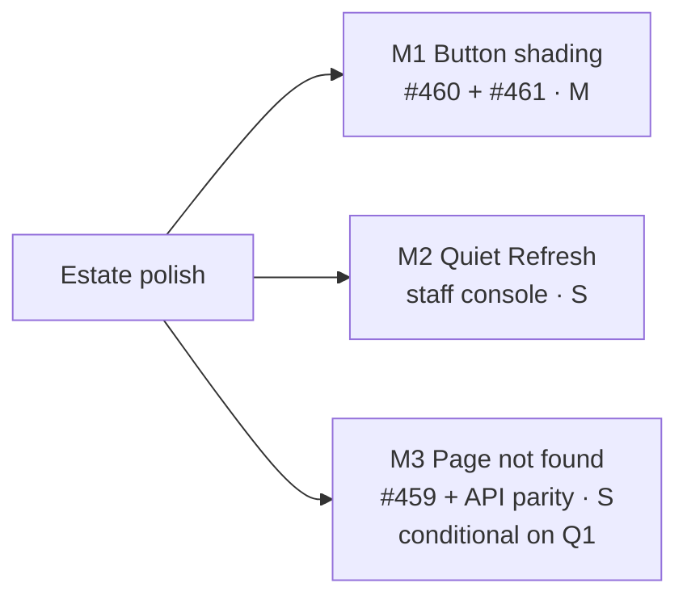

# Implementation Plan: October estate polish — one "Page not found", a quiet Refresh, and shading that lives in `Button`

- **Feature spec:** [`./feature-spec.md`](./feature-spec.md)
- **Status:** Draft
- **Owner:** Claude Code (builder agent per milestone), for James Ewbank

## Breakdown

Three milestones, **one PR each**, merged in order M1 → M2 → M3. None depends on another's code, but
M2 and M3 both edit `staff-console-screen.tsx` and M1 edits three staff files, and local e2e shares one
database (`docs/HANDOFF.md`), so they run one at a time. No flag (ADR-0088 D1). No schema change. No new
Playwright config or CI step. **No new ADR**; ADR-0178 gains D8 at M2.

---

### Milestone M1: The shaded look lives in `Button`, and resting shaded buttons keep the pointer (#460, #461)

**Outcome:** every `aria-disabled` `<Button>` looks the same shaded whatever its variant, and the fifteen
resting sites can be hovered for their reason and refuse a click in their handler.
**Entry point:** existing controls, e.g. the Notes composer's **Post** with an empty body; the audit log's
**Clear filters** with no filter set; the plan workspace's **Arrange** dialog's apply while it is refused.
**Journey:** each driven site below gains `await button.click({ trial: true })` while shaded (Playwright's
actionability check fails on a pointer-inert element, so this is the reachability assertion) and
asserts nothing changed.

> **Complexity:** M · **Dependencies:** none
> **Risks:** (1) a `<Button>` that binds `aria-disabled` with no shading today starts to dim → T0 census,
> reviewer confirms each; (2) an existing journey relies on the pointer-inert shape (e.g. `force: true`,
> or audit `audit.spec.ts:272-276`) → run every listed suite locally; (3) a resting site whose handler
> does not refuse becomes clickable → T2 reads each handler and adds a unit test per site that pressing
> it while shaded calls nothing.
> **Testing requirements:** `button.test.tsx` (each variant's shaded classes); gate fixtures (G1 red
> then green, ADR-0110); a unit per #460 site; the journeys below.

##### Task M1-T0 — Census (no code)

- Re-derive with the gate's own `buttonTags` reader: (a) every `<Button>` writing `aria-disabled:opacity-*`
  or `aria-disabled:hover:*` (grep today: 57 files, 63 occurrences, values 50 and 60); (b) every
  `<Button>` binding `aria-disabled` with **no** shading class (candidates in spec §2 Edge cases);
  (c) any `buttonVariants(...)` consumer that is not `<Button>`; (d) for each of the fifteen #460 sites,
  whether the handler already refuses and whether a reason is attached. Record the lists in the PR
  description.
- **Complexity:** S

##### Task M1-T1 — `buttonVariants` carries the look

- **Files:** `apps/web/src/components/ui/button.tsx`, `button.test.tsx`.
- Base gains `aria-disabled:opacity-60`; each variant gains its `aria-disabled:hover:` reset (spec §4.3).
  Docblock states why `pointer-events-none` stays with the caller.
- **Complexity:** S · **Testing:** one assertion per variant; `token-contrast` unaffected (shaded controls
  are exempt from 1.4.3, and no token changes).

##### Task M1-T2 — Fifteen resting sites keep the pointer

- **Files:** `components/ui/scope-save-bar.tsx`; `features/audit/components/AuditEventList.tsx`,
  `AuditFilterBar.tsx`; `features/calendars/components/CalendarFormDialog.tsx`, `CalendarsTable.tsx`;
  `features/clients/components/ClientsTable.tsx`; `features/notes/components/NoteComposer.tsx`,
  `NoteItem.tsx`; `features/resources/components/ResourcesTable.tsx`;
  `features/tsld/components/ArrangeDialog.tsx`, `BulkSelectionBar.tsx`, `CreateActivityPopover.tsx`,
  `LinkChainDialog.tsx`, `TsldPanel.tsx`; `features/wbs/components/WbsBulkAssignBar.tsx`.
- Delete `aria-disabled:pointer-events-none`; add or confirm `if (<expression>) return;` in the handler.
- **Complexity:** M · **Testing:** a unit per site (press while shaded → mutation/handler not called).
  Existing `scope-save-bar-assertions.ts` is checked for a pointer-events assertion.

##### Task M1-T3 — Delete the caller strings; extend the gate

- Delete `aria-disabled:opacity-*` and `aria-disabled:hover:*` from every `<Button>` in the T0 list,
  including the seven #461 sites, the transient sites (they keep only `aria-disabled:pointer-events-none`)
  and `gantt-columns-group.tsx:233`. Update `copy-button.test.tsx:83-84` to assert the shaded state via
  `buttonVariants` rather than the caller string.
- **`submit-guard.structural.test.ts`:** add **G1** (no `<Button>` writes the look); retire
  `unshadedSubmits` and `POINTER_EVENTS_EXEMPT`; delete `RESTING_POINTER_INERT_EXCEPTIONS` so the
  resting rule is an unconditional `toEqual([])`. Pinned fixtures: G1 fires on
  `className="aria-disabled:opacity-60"`, not on `aria-disabled:pointer-events-none` alone. Verify red
  by re-adding one string at one site.
- **Complexity:** M (mechanical, wide)

##### Task M1-T4 — Journeys, docs, release

- **Suites** (each run with `scripts/e2e-local.sh web:<suite>`): `e2e-notes` (Post, Save),
  `e2e-audit` (Clear filters, Show older), `e2e-library` (Calendars/Resources Clear),
  `e2e-calendar-shifts` (calendar form), `e2e-arrange` (Arrange), `e2e-multi-select` (BulkSelectionBar,
  Link chain), `e2e-authoring` / `e2e-authoring-flow` (CreateActivityPopover, empty-canvas notice),
  `e2e-wbs` (WbsBulkAssignBar), `e2e-activity-editor` (scope save bar), `e2e-staff` (unchanged look),
  `e2e-public` (auth submits now 60 %). Which suite drives Clients **Clear** is confirmed in T0 (grep
  finds no driver today); if none, the unit test is the evidence and the PR says so.
- **Docs:** `docs/TECH_DEBT.md` #460 and #461 closed; `docs/COMPONENT_LIBRARY.md` (Button shaded
  state), `docs/DESIGN_SYSTEM.md` §Buttons. **Surface sheet: not affected** (spec §4.4) — one line in
  the PR description.
- **Changeset:** `@repo/web` patch.
- **Reviewers:** **component-reviewer** (the Button contract) before merge; **accessibility-reviewer**
  before release (ADR-0111: shading and pointer reachability of fifteen controls).

---

### Milestone M2: A Refresh speaks once (staff console)

**Outcome:** after Refresh or **Try again for all**, a screen-reader user hears one sentence.
**Entry point:** `/staff` (as staff) → **Refresh** in the header; **Try again for all** in Status.
**Journey:** `e2e-staff`, in the existing Refresh step: after Refresh, every `[aria-live="polite"]`
inside a section is empty, and the page announcer holds `Refreshed. …`.

> **Complexity:** S · **Dependencies:** none (after M1 merges, to avoid rebasing three staff files)
> **Risks:** the mute ends before a late query notification lands → mute ends in the existing `finally`
> after `setRefreshed`'s task (`staff-console-screen.tsx:211-227`); a unit test drives a sentence change
> one task after the refetch resolves. A box that newly fails inside a Refresh is unspoken → the
> unreadable tail (US-2).
> **Testing requirements:** `status-section.test.tsx`, `staff-console-screen.test.tsx`, `panel-copy`
> unit, `e2e-staff`.

##### Task M2-T1 — `StatusMuteProvider` and the re-baseline

- **Files:** `apps/web/src/components/ui/page/status-section.tsx` (+ barrel export), its test.
- Context default `false`. A muted `announce="change"` section renders its sentence as plain text,
  keeps the polite region empty, and re-baselines (latch reset). `settle` sections ignore it.
- **Tests:** muted change → region text unchanged; unmute → still unchanged; next change → spoken;
  `settle` under mute → spoken; no provider → identical DOM to today (pins every other caller).
- **Complexity:** S

##### Task M2-T2 — The screen provides it; the page sentence counts failures

- **Files:** `features/staff/ui/staff-console-screen.tsx` (wrap the four `SectionGroup`s),
  `features/staff/model/panel-copy.ts` (`refreshedAnnouncement(headline, firstPageSize, unreadable)`),
  their tests.
- **Complexity:** S

##### Task M2-T3 — Docs, release

- ADR-0178 **D8** (the mute and the re-baseline; amends D6's ADR-0143 D2 bullet); the CLAUDE.md §16
  line is unchanged (the ADR's title does not change). `docs/COMPONENT_LIBRARY.md` StatusSection
  contract. The staff plan's M3/M4 "Not folded / Not built" bullets gain "→ built in
  `docs/specs/estate-polish-oct/` M2".
- **Changeset:** `@repo/web` patch.
- **Reviewers:** **accessibility-reviewer before release** (ADR-0111 — a live-region behaviour change),
  **component-reviewer** (new export on the archetype barrel).

---

### Milestone M3: One "Page not found", and one 404 body (#459) — **conditional on Q1**

**Outcome:** every unknown address, and a non-staff `/staff`, shows the same titled page with a way home;
the API's unmapped-route 404 and the staff refusal are byte-identical.
**Entry point:** any unknown URL, e.g. `/no-such-path`.
**Journey:** `e2e-public` gains `{ path: '/no-such-path', heading: 'Page not found', primary: 'Go to
SchedulePoint' }` in `URL_STATES` (`e2e-public/support.ts:73-100`), so it gets the suite's layout, reflow
and axe passes at every viewport for free. `e2e-staff`'s member block (`staff.spec.ts:124-145`) gains the
**parity step**: for `/staff`, `/staff/x`, `/no-such-path` and `/orgs/<slug>/nope`, capture
`document.title`, the `main` element's normalised `innerHTML` and the `h1` text, and assert all four
equal; then `request.get('/api/v1/staff/me')` and `request.get('/api/v1/no-such-route')` bodies equal.

> **Complexity:** S · **Dependencies:** none (after M2)
> **Risks:** (1) root not-found mode changes how `_authed`'s `beforeLoad` interacts with an unknown
> `/orgs/…` path → T0 drives it first and the spec's §0.3 is corrected if the reading was wrong;
> (2) `AuthShell` pulls a chunk into the entry graph → compare the build's asset list before/after
> (expected none: `SignInScreen` is already eager); (3) a client or test parses `Cannot GET` → grep
> found only a comment (`test/revision-delta-m0.e2e-spec.ts:313-314`).
> **Testing requirements:** unit for `NotFoundScreen`; filter spec; API e2e; the two journeys.

##### Task M3-T0 — Drive the four URLs before changing anything

- Signed in and signed out, record title, landmarks and heading for `/no-such-path`, `/staff/x`,
  `/orgs/<slug>/nope`, `/orgs/<slug>/plans/<id>/x`, and a non-staff `/staff`, and one `curl` of each API
  404 body. Paste into the PR. **Complexity:** S

##### Task M3-T1 — `NotFoundScreen` and the router

- **Files:** `apps/web/src/components/layout/not-found-screen.tsx` (+ test), `app/router.tsx`
  (`defaultNotFoundComponent`, `notFoundMode: 'root'`, docblock), `features/staff/ui/staff-console-screen.tsx`
  (branch + title), `routes/staff.test.tsx`, `staff-console-screen.test.tsx`, `e2e-staff/staff.spec.ts:127,155`
  (heading becomes "Page not found").
- **Complexity:** S

##### Task M3-T2 — The API's 404 body

- **Files:** `apps/api/src/common/filters/all-exceptions.filter.ts` (`mapHttp`: 404 → `'Not found'`),
  `all-exceptions.filter.spec.ts`, `apps/api/test/staff.e2e-spec.ts` (assert **bodies**, not just status,
  against an unmapped route).
- **Complexity:** S · run `scripts/e2e-local.sh api`.

##### Task M3-T3 — Docs, release

- `docs/TECH_DEBT.md` #459 closed (residue recorded: the pending-identity spinner, anonymous 401, staff
  throttle — all inside security's Low); `docs/API.md:1453-1455` ("same status and body");
  `docs/FRONTEND_ARCHITECTURE.md` routing (unknown URLs render `NotFoundScreen` at root);
  `docs/BACKEND_ARCHITECTURE.md` error handling (Nest 404s carry a fixed message).
- **Changesets:** `@repo/web` minor (a new screen every unknown URL reaches), `@repo/api` patch.
- **Reviewers:** **security-reviewer** (closes #459), **accessibility-reviewer** (new page; ADR-0111 not
  strictly triggered, but it is the page every lost reader meets), **api-reviewer** (error body).

---

## Sequencing & slices

M1 → M2 → M3, each releasable alone. If Q1 is answered no, M3 is dropped and nothing else changes. After
the last merge, write `docs/HANDOFF.md` (CLAUDE.md §19.14). `pnpm prepush` before every push; the e2e
halves named per milestone.

## Definition of Done (per task)

Each PR meets the Feature Completion Criteria in [`docs/PROCESS.md`](../../PROCESS.md): code, tests,
docs, security, performance, accessibility, Docker build, CI green (deduped check runs on the current
head, CLAUDE.md §19.9), changeset, version impact.

## Risks & assumptions (rollup)

| Risk / assumption                                            | Likelihood | Impact | Mitigation                                                                      |
| ------------------------------------------------------------ | ---------- | ------ | ------------------------------------------------------------------------------- |
| A `<Button>` that was never meant to dim starts dimming (M1) | med        | low    | T0 census; component-reviewer signs off the list                                |
| A resting site becomes clickable without a guard (M1)        | low        | med    | Unit per site; journey `click({ trial: true })` then assert no change           |
| Existing journeys depend on pointer-inert buttons (M1)       | med        | low    | Run every listed suite locally before push                                      |
| Mute window misses a late query notification (M2)            | low        | low    | Mute ends after `setRefreshed`'s task; unit pins the ordering                   |
| §0.3's reading of fuzzy not-found is wrong (M3)              | med        | low    | T0 drives it before any change; root mode makes the outcome uniform anyway      |
| A Surface-sheet step is affected after all                   | low        | med    | §4.4 table; any milestone that finds otherwise updates the sheet in the same PR |
