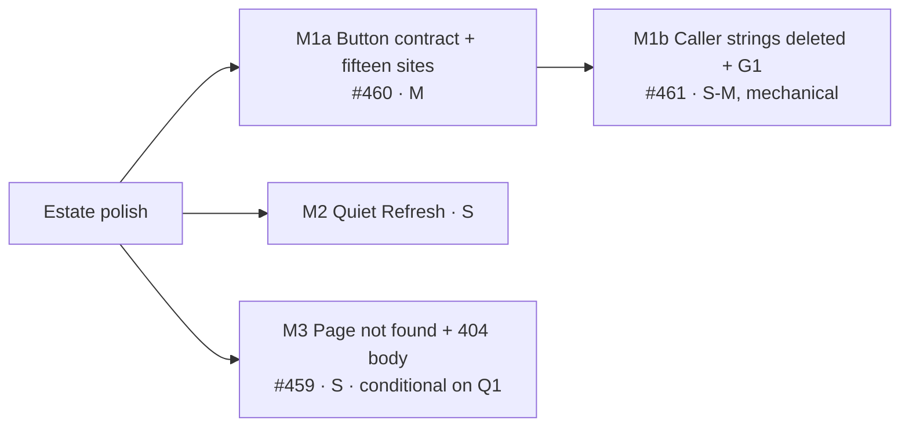

# Implementation Plan: October estate polish — one "Page not found", a quiet Refresh, and shading that lives in `Button`

- **Feature spec:** [`./feature-spec.md`](./feature-spec.md)
- **Status:** Draft
- **Owner:** Claude Code (builder agent per milestone), for James Ewbank

## Breakdown

Four PRs, merged **M1a → M1b → M2 → M3**, one at a time (shared staff files; one local e2e database,
`docs/HANDOFF.md`). M1 is split so the contract change is reviewed apart from ~60 mechanical deletions.
Every slice is releasable: between M1a and M1b a caller's own `aria-disabled:opacity-50` simply wins over
the CVA's 60 via `cn`'s merge. No flag (ADR-0088 D1), no schema change, no new Playwright config or CI
step, **no new ADR** (ADR-0178 gains D8 at M2). Each PR description carries one line: **Surface sheet
not affected** (spec §4.4).

---

### Milestone M1a: `Button` carries the shaded look; the fifteen resting sites keep the pointer safely (#460)

**Outcome:** every `aria-disabled` `<Button>` shades the same way; the fifteen resting sites are no longer
pointer-inert, refuse pointer/Enter/Space, and show their reason where they have one.
**Entry point:** e.g. Notes **Add note** with an empty body; audit **Clear filters** with no filter;
the plan workspace's **Arrange** apply while refused.
**Journey:** each driven site asserts `click({ trial: true })` succeeds while shaded (Playwright's
actionability check fails on a pointer-inert element), that a real click and Enter change nothing, and
that the reason is visible where one exists.

> **Complexity:** M · **Dependencies:** none
> **Risks:** a submit becomes clickable (empty note → validation error; pending → double submit) → T2
> guards both `onClick` and `onSubmit`, unit per site; a `<Button>` that never dimmed starts to → T0
> dimming list signed off by component-reviewer; journeys that relied on inertness (e.g.
> `e2e-audit/audit.spec.ts:272-276`) → run every suite below locally.

##### M1a-T0 — Census (no code; results in the PR description)

1. Recount, with the gate's own reader plus a whole-file scan, every `aria-disabled:opacity-*` /
   `aria-disabled:hover:*` spelling (my grep: 57 non-test files / 63; reviewers: ~63 / ~75). Include
   constants (`SHADED_BUTTON`, `ActivityProgressPanels.tsx:309`).
2. Classify each of the fifteen (and `SHADED_BUTTON`'s four) as **resting / transient / mixed**, and
   mark the five submits (spec §0.6).
3. Per site: reason exists? visible? mechanism (visible text via `aria-describedby` / tooltip /
   `title`, no touch on the Surface)? End state: reachable reason / stays inert with reason / accepted no-op.
4. **Dimming list:** every `<Button>` binding `aria-disabled` with no shading today, each marked
   _intended_ or _use native `disabled` / `aria-busy` instead_.
5. Any `buttonVariants()` consumer that is not `<Button>`.

##### M1a-T1 — `buttonVariants`

- **Files:** `components/ui/button.tsx`, `button.test.tsx`.
- Base `aria-disabled:opacity-60`; each variant's hover written `not-aria-disabled:hover:…` (outline and
  ghost: text too). Confirm the compiled selector in the built CSS; fall back to restatement under
  `aria-disabled:hover:` only if it does not compile, with the reason in the docblock. Docblock also
  says why native stays at 50 and why `pointer-events-none` stays with the caller.
- **Tests:** each variant's string; `<Button className="bg-x" aria-disabled>` keeps `bg-x` and the shading.
- **Complexity:** S

##### M1a-T2 — The fifteen sites

- **Files:** `components/ui/scope-save-bar.tsx`; `features/audit/components/AuditEventList.tsx`,
  `AuditFilterBar.tsx`; `features/calendars/components/CalendarFormDialog.tsx`, `CalendarsTable.tsx`;
  `features/clients/components/ClientsTable.tsx`; `features/notes/components/NoteComposer.tsx`,
  `NoteItem.tsx`; `features/resources/components/ResourcesTable.tsx`;
  `features/tsld/components/ArrangeDialog.tsx`, `BulkSelectionBar.tsx`, `CreateActivityPopover.tsx`,
  `LinkChainDialog.tsx`, `TsldPanel.tsx`; `features/wbs/components/WbsBulkAssignBar.tsx`.
- Resting: drop `aria-disabled:pointer-events-none`, add the handler refusal. Mixed: the same, plus
  `aria-busy:pointer-events-none` where the site sets `aria-busy`, else an `isPending` handler guard.
  Submits: `onClick` `preventDefault` when blocked **and** `onSubmit` returns early on the same expression.
- **Tests:** one unit per site — click the shaded button and press Enter in a field: neither the
  mutation nor `onSubmit`'s body runs.
- **Complexity:** M

##### M1a-T3 — Pointer gate

- `submit-guard.structural.test.ts`: delete `RESTING_POINTER_INERT_EXCEPTIONS`; the resting rule is
  `toEqual([])`; classify `aria-busy:pointer-events-none`'s `aria-busy` expression with the same
  `TRANSIENT_TERM`; retire `unshadedSubmits` and `POINTER_EVENTS_EXEMPT` (shading is now the CVA's).
  Verify red by restoring one pointer class at one resting site (ADR-0110).
- **Complexity:** S

##### M1a-T4 — Journeys, docs, release

- **Suites** (`scripts/e2e-local.sh web:<suite>`): `e2e-notes`, `e2e-audit`, `e2e-library`
  (Calendars/Resources Clear), `e2e-calendar-shifts` (calendar form), `e2e-arrange`, `e2e-multi-select`
  (BulkSelectionBar, Link chain), `e2e-authoring` / `e2e-authoring-flow` (CreateActivityPopover,
  empty-canvas notice), `e2e-wbs`, `e2e-activity-editor` (scope save bar), `e2e-staff`, `e2e-public`.
  Clients **Clear** has no driver today (grep); if T0 confirms, the unit test is the evidence and the PR
  says so.
- **Docs:** #460 closed; `docs/COMPONENT_LIBRARY.md` (Button shaded state, the dimming list);
  `docs/DESIGN_SYSTEM.md` §Buttons.
- **Changeset:** `@repo/web` patch — "shaded buttons no longer let a click through to what is behind
  them; some buttons that did not look shaded now do".
- **Reviewers:** component-reviewer (contract, dimming list) before merge; **accessibility-reviewer on
  the diff before release**, driving pointer, Enter and Space on shaded buttons (ADR-0111).

---

### Milestone M1b: Delete the caller strings; G1 makes the CVA the only home (#461)

**Outcome:** no caller spells the shaded look; transient sites move from 50 % to 60 %.
**Entry point:** n/a beyond M1a's — a visual consistency change; screenshots before/after in the PR.
**Journey:** M1a's suites re-run; `e2e-public` covers the auth submits that move 50 → 60.

> **Complexity:** S–M (wide, mechanical) · **Dependencies:** M1a
> **Risks:** a deletion drops a non-shading class beside it → the diff is class-attribute-only and
> reviewed as such; G1 under-matches → pinned fixtures.

##### M1b-T1 — Deletions

- Remove `aria-disabled:opacity-*` and `aria-disabled:hover:*` from every caller in T0's list (the seven
  #461 sites, the transient sites, `gantt-columns-group.tsx:233`); transient sites keep only
  `aria-disabled:pointer-events-none`. Delete `SHADED_BUTTON` (its sites take the per-site class from T0).
- Update tests asserting caller strings: `copy-button.test.tsx:83-84`,
  `ScheduleHealthPanel.test.tsx:436`, `diagnostics-panel.test.tsx:197` (assert behaviour/the CVA output).

##### M1b-T2 — G1

- Whole-file scan of `apps/web/src` (comments stripped, tests excluded) for `aria-disabled:opacity-` and
  `aria-disabled:hover:`; allow-list `components/ui/button.tsx`, `components/ui/radio-card-group.tsx`,
  `features/revision-compare/components/RevisionComparePanel.tsx`, `RevisionChangesView.tsx`, each with
  a reason. Fixtures: a constant spelling is caught; a comment is not; an allow-listed file that no longer
  exists fails.
- **Docs:** #461 closed. **Changeset:** `@repo/web` patch — "the shaded state of in-flight buttons is
  slightly less faint (50 % → 60 %)". **Reviewer:** component-reviewer.

---

### Milestone M2: A Refresh speaks once (staff console)

**Outcome:** after Refresh or **Try again for all**, one polite sentence; a newly failed read still alerts.
**Entry point:** `/staff` (as staff) → **Refresh**; **Try again for all** in Status.
**Journey:** `e2e-staff`'s Refresh step: afterwards every section's `[aria-live="polite"]` is empty and
the page announcer holds `Refreshed. …`.

> **Complexity:** S · **Dependencies:** M1b merged
> **Risks:** unmute before the committed announcement → mute ended from that effect; strict-mode render
> desync → re-baseline in an effect; background refetch inside the window is muted → stated in D8.

##### M2-T1 — `status-mute.tsx` and `StatusSection`

- **Files:** `components/ui/page/status-mute.tsx` (`StatusMuteContext`, `useStatusMuted`,
  `StatusMuteProvider`, docblock "why not a prop"), `index.ts` barrel, `status-section.tsx`, tests.
- **Tests:** provider in isolation (default `false`); `StatusSection` inside `QueryPanel` under the
  provider: muted change → region silent, plain text updated; unmute → silent; a change one task after
  unmute → spoken; `settle` under mute → spoken; no provider → DOM identical to today.

##### M2-T2 — The screen

- **Files:** `features/staff/ui/staff-console-screen.tsx` (a separate `muted` state set with Refresh,
  cleared in the effect that announces the committed `refreshed`; provider around the four groups),
  `staff-console-screen.test.tsx` (one polite announcement per Refresh). **No copy change**
  (`panel-copy.ts` untouched).

##### M2-T3 — Docs, release

- ADR-0178 **D8** (mute, effect-timed re-baseline, background changes muted, non-headline recovery
  unspoken by acceptance); `docs/COMPONENT_LIBRARY.md` StatusSection contract; the staff plan's M3/M4
  "not built" bullets point here.
- **Changeset:** `@repo/web` patch. **Reviewers:** accessibility-reviewer before release (ADR-0111);
  component-reviewer (new barrel export).

---

### Milestone M3: One "Page not found", and one 404 body (#459) — **conditional on Q1**

**Outcome:** a signed-in non-staff member cannot tell `/staff` from an unknown address on the settled
page or in an API body; every lost reader gets a titled page with a way on.
**Entry point:** any unknown URL, e.g. `/no-such-path`.
**Journey:** `e2e-public` adds `{ path: '/no-such-path', heading: 'Page not found', primary: 'Sign in' }`
to `URL_STATES` (`e2e-public/support.ts:73-100`; signed-out label), gaining layout, reflow and axe at every
viewport. `e2e-staff`'s member block (`staff.spec.ts:124-145`) adds the **parity step** on the settled
state: `/staff`, `/staff/`, `/staff/x`, `/no-such-path`, `/orgs/<slug>/nope` → equal `document.title`,
`<html lang>`, `<meta>` set, normalised `<main>` HTML, focused `<h1>`, link **Go to the home page**; then
`GET`/`POST /api/v1/staff/me`, `GET /api/v1/staff/no-such-route`, `GET /api/v1/x` → equal body,
`content-type`, `content-length` and security headers.

> **Complexity:** S · **Dependencies:** M2 merged
> **Risks:** root mode removes the shell for in-org mistypes (accepted; debt row filed) and may replace
> a signed-out sign-in redirect with the 404 (changeset); a sign-in return-URL loop → T0 checks;
> `AuthShell` adds a chunk → compare asset lists.

##### M3-T0 — Measure before changing

- Signed in (non-staff) and signed out: title, landmarks, heading and focus for `/no-such-path`,
  `/staff`, `/staff/`, `/staff/x`, `/orgs/<slug>/nope`, `/orgs/<slug>/plans/<id>/x`; follow the sign-in
  `?redirect=` for an unknown URL to confirm no loop.
- Supertest/curl as a signed-in non-staff member: unmapped `/api/v1/x`, `/api/v1/staff/no-such-route`,
  `GET` and `POST /api/v1/staff/me` — body, `content-type`, `content-length`, security headers.
- Record the grep for `NotFoundException`, `HttpStatus.NOT_FOUND` and `, 404)` across `apps/api/src`
  and `apps/api/test`.

##### M3-T1 — `NotFoundScreen` and the router

- **Files:** `components/layout/not-found-screen.tsx` (no props; TSDoc why) + `not-found-screen.test.tsx`
  (role queries: `main`, `h1` focused, link name per session state — **Sign in** / **Go to the home
  page** — and title); `app/router.tsx` (`defaultNotFoundComponent`, `notFoundMode: 'root'`, docblock
  with the trade-off); `features/staff/ui/staff-console-screen.tsx` (branch + title);
  `routes/staff.test.tsx`, `staff-console-screen.test.tsx` (identity 404, 5xx, network → the screen);
  `e2e-staff/staff.spec.ts:127,155` (heading "Page not found").

##### M3-T2 — The API's 404 body

- **Files:** `common/filters/all-exceptions.filter.ts` (404 + `^Cannot [A-Z]+ /` → `'Not found'`),
  `all-exceptions.filter.spec.ts` (Nest default → `Not found`, body contains no `/api`; a deliberate 404
  message survives), `test/staff.e2e-spec.ts` (bodies and headers vs an unmapped route). Run the **full**
  `scripts/e2e-local.sh api`.

##### M3-T3 — Docs, release

- `docs/TECH_DEBT.md`: #459 closed with the residue list (spec §2); **new row** — the in-shell not-found
  for signed-in mistypes under `/orgs/<slug>/`. `docs/API.md:1453-1455` ("same status and body for a
  signed-in non-staff member", plus residue); `docs/BACKEND_ARCHITECTURE.md` (Nest's default 404
  message is not echoed); `docs/FRONTEND_ARCHITECTURE.md` (no route adds URL-level not-found markup);
  `docs/COMPONENT_LIBRARY.md` (`NotFoundScreen`).
- **Changesets:** `@repo/web` minor (new screen; signed-in in-org mistypes leave the shell; signed-out
  deep mistypes may 404 rather than redirect), `@repo/api` patch.
- **Reviewers:** security-reviewer (closes #459), accessibility-reviewer, api-reviewer, ux-reviewer
  (link copy).

---

## Sequencing & slices

M1a → M1b → M2 → M3, each releasable alone. If Q1 is no, M3 is dropped and nothing else changes.
`pnpm prepush` before every push plus the e2e halves named per milestone. After the last merge, write
`docs/HANDOFF.md` (CLAUDE.md §19.14).

## Definition of Done (per task)

Each PR meets the Feature Completion Criteria in [`docs/PROCESS.md`](../../PROCESS.md): code, tests, docs,
security, performance, accessibility, Docker build, CI green (deduped check runs on the current head,
CLAUDE.md §19.9), changeset, version impact.

## Risks & assumptions (rollup)

| Risk / assumption                                              | Likelihood | Impact | Mitigation                                                                                |
| -------------------------------------------------------------- | ---------- | ------ | ----------------------------------------------------------------------------------------- |
| A shaded submit becomes clickable or double-submits (M1a)      | med        | high   | `onClick` + `onSubmit` guards; `aria-busy:pointer-events-none` for pending; unit per site |
| A greyed button becomes hoverable with no reason to show (M1a) | med        | low    | T0 reason census; three declared end states; journey asserts the reason                   |
| A `<Button>` that was never meant to dim starts dimming (M1a)  | med        | low    | Dimming list signed off by component-reviewer                                             |
| `not-aria-disabled:` does not compile as expected (M1a)        | low        | low    | Checked in built CSS; documented restatement fallback                                     |
| The 50 → 60 % change is noticed (M1b)                          | high       | low    | Stated in the changeset with screenshots                                                  |
| Mute window misses or swallows a late notification (M2)        | low        | low    | Ended from the committed-announcement effect; post-unmute test; D8 states it              |
| Signed-in in-org mistype loses the shell (M3)                  | high       | low    | Accepted trade-off; changeset; debt row for the in-shell variant                          |
| §0.3's reading of fuzzy not-found is wrong (M3)                | med        | low    | T0 drives it first; root mode makes the outcome uniform                                   |
| A Surface-sheet step turns out to be affected                  | low        | med    | §4.4 table; the PR that finds it updates the sheet in the same PR                         |
