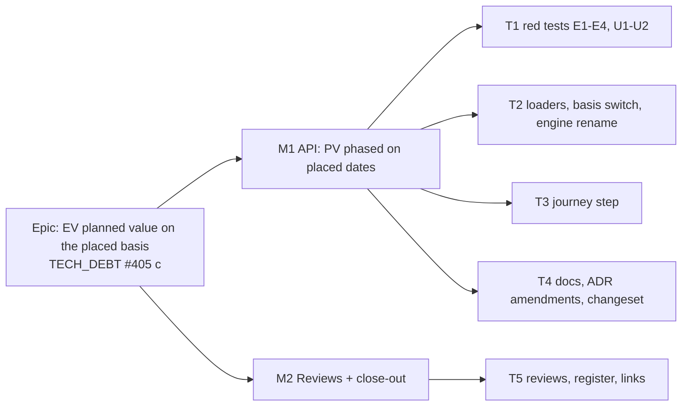

# Implementation Plan: Earned Value planned value on the placed basis

- **Feature spec:** [`./spec.md`](./spec.md)
- **Status:** Draft — awaiting approval before implementation.
- **Owner:** api

## Breakdown

### Epic

**EV planned value on the placed basis.** Earned Value spends planned value where bars are placed,
wherever the baseline recorded placements, and nothing changes on a plan with no placement.

**Parity (ADR-0034):** untouched in the strong form. No engine pass, recalculation or capture code
changes. **Pen:** not involved (read only). **Flag:** none (ADR-0088 D1); the rollback is M1's commit.
**Schema:** none. If any task finds a reason to touch one, it stops and goes to `database-architect`
(CLAUDE.md §19.3).

---

### Milestone M1: planned value follows the placed span (shippable slice)

**Outcome:** on a plan with hand-placed activities, PV, SV and SPI in the Earned-Value panel measure the
placed span (frozen on a `FULL` baseline, live with no baseline). An unplaced plan reads exactly as it
did.
**Entry point:** plan workspace → **Analysis** → **Earned value…** (`plan-actions-menu.tsx:86`), which
opens `EarnedValuePanel` (`plan-chrome-dialogs.tsx:183`), **PV** column and **Schedule Performance
Index** tile.
**Journey:** `apps/web/e2e/baselines.spec.ts` (the base journey, which already reaches **Analysis**),
extended in T3.

#### Feature F1: basis-aware PV

> **Description:** choose one basis per read, map both anchors onto it, and leave the pure function
> basis-blind.
> **Complexity:** S–M
> **Dependencies:** none
> **Risks:** see tasks.
> **Testing requirements:** E1 and E3 red first; E2 and E4 characterisation; U1 and U2; renamed engine
> suites green with no assertion edited; journey step.

##### Task T1 — red tests first (≈ same PR as T2)

- **Description:** In `apps/api/test/schedule.e2e-spec.ts`, beside the EV block (`:752-862`), add
  E1–E4 as the spec defines them (spec §2 "Regression tests"). In `schedule.service.spec.ts`, beside
  `getEarnedValue` (`:1117`), add U1 and U2.
- **Complexity:** S
- **Dependencies:** —
- **Risks:**
  - E1 must check its fixture before it asserts PV: through Prisma, live `visualEffectiveStart` is D
    and snapshot `placedStart` is D+3. Without that check, a 0 could come from a fixture where the
    bases never differed.
  - E4's golden must be **recorded against today's code** and committed as a literal. If it is written
    after T2, it proves nothing about parity.
  - Moving the data date in E4: use the plan PATCH that sets `plannedStart`, the EV read's data date
    (`schedule.service.ts:1205`). If that PATCH needs the pen or a recalculation, do both. Frozen anchors
    do not move.
- **Testing:** `scripts/e2e-local.sh api`. Record the red numbers (E1 and E3: PV 1,000,000) in the PR
  description (ADR-0110 D5).
- **Development steps:**
  1. Write E1–E4 and U1–U2. Run them against the current code. E1, E3 and U1 fail with the predicted
     numbers, and E2 and E4 pass.
  2. Commit E4's recorded literal.

##### Task T2 — loaders, basis switch, engine rename

- **Description:**
  - `loadEarnedValueActivities` (`schedule.repository.ts:597-637`): add `visualEffectiveStart`,
    `visualEffectiveFinish`, and widen `EarnedValueActivityRow` (`:132-156`).
  - `loadActiveBaselineCostSnapshot` (`:693-726`): select `placementSnapshotLevel` on the baseline
    (`:700`) and `placedStart`/`placedFinish` on each row (`:706-712`), and widen
    `EarnedValueBaselineRow` / `EarnedValueCostSnapshot` (`:182-212`).
  - `ScheduleService.getEarnedValue` (`schedule.service.ts:1131-1241`): add a private
    `pvBasisFor(snapshot)` with an exhaustive switch on the level (no `default`): `null` → `PLACED`,
    `FULL` → `PLACED`, `NONE` → `NETWORK`. The mapping at `:1187-1188` and `:1200-1201` picks both
    anchors from the basis. Update the docblock at `:1122-1130`.
  - `earned-value.ts`: rename `EvActivityInput.earlyStart/earlyFinish` to `liveStart/liveFinish`
    (`:148-151`, `:578-579`). Rewrite the docblocks at `:100-104`, `:135-138`, `:148-151` and `:527-528`
    to say the function does not know its basis. Update the callers: the three engine specs, the
    conformance adapter (`earned-value-adapter.ts:175-179`, `:88`) and `schedule.service.spec.ts:1134`.
    The compiler finds them all.
- **Complexity:** S
- **Dependencies:** T1
- **Risks:**
  - Switching only one anchor → U1 gives four distinct answers.
  - A per-row fallback to early when a placed date is null → U2.
  - An assertion edited during the rename → review the diff of every `*.spec.ts` for changed `expect`
    lines. There should be none.
- **Testing:** T1's cases turn green. The existing EV, accrual, steps and conformance suites pass with
  no assertion edited.
- **Development steps:** widen loaders → add `pvBasisFor` → rename → run the unit suites → run
  `scripts/e2e-local.sh api` → mutate each wrong mix in U1 and watch it fail.

##### Task T3 — journey step

- **Description:** extend `apps/web/e2e/baselines.spec.ts`. Through the API, create a 10-day activity
  with `budgetedExpense: 1000000`, `accrualType: 'START'` and `visualStart` D+3, then recalculate. Open
  **Analysis** → **Earned value…** and assert that the activity's **PV** cell reads zero (today it reads
  the full budget). Keep the axe scan.
- **Complexity:** S
- **Dependencies:** T2
- **Risks:** the base journey's actor must hold `cost:read`. It is an Org Admin, which does. Assert on
  the cell, not on copy.
- **Testing:** `scripts/e2e-local.sh web`; run once against pre-T2 code to see it fail.

##### Task T4 — docs, ADR amendments, changeset

- **Description:**
  - Mark the ADR-0042 and ADR-0044 amendments (drafted with this spec) _Accepted_ and add the spec link.
    The link is withheld while the spec is `Draft`, because `check:spec-status` S3 refuses a Draft spec
    that an ADR cites.
  - ADR-0035 §29 (`:319-326`): PV is phased on the frozen placed span (`FULL`), the frozen early span
    (`NONE`), or the live placed span. §32 (`:483-492`): accrual changes SPI (spec C4), and its anchors
    are §29's.
  - `docs/API.md`: add the basis paragraph and change the accrual clause (spec §4.5).
  - OpenAPI `pv` description (`plan-earned-value.dto.ts:18`).
  - Changeset: `api` minor, with the first sentence from spec §4.5.
- **Complexity:** S
- **Dependencies:** T2
- **Testing:** `pnpm prepush` (doc-links, adr-coverage, spec-status).

---

### Milestone M2: reviews and close-out

**Entry point:** none new. This milestone changes no behaviour.

##### Task T5 — reviews and register

- **Description:**
  - Reviews on M1's diff: **api-reviewer** (the meaning change with the shape unchanged, the Q2
    decision, the OpenAPI text) and **test-engineer** (E1–E4 and U1–U2 tell the cases apart, E4 was
    recorded before the change). **backend-performance-reviewer** only if the "four columns" claim is
    disputed. **security-reviewer** is not needed: same route, permission and scope, and no new data
    class.
  - `docs/TECH_DEBT.md` #405: close part (c) with a pointer to this spec. Add the sibling row for the
    resource histogram (spec F1).
  - `docs/TEST_PLAYBOOK.md:111`: "Correct" says the live-budget fallback (no baseline is seeded). "Wrong"
    adds "any PV change on this plan from the placed-basis epic: it carries no placement".
  - ADR-0148 References: add this spec, and a sentence correcting Consequences `:225-226` (spec C5).
  - CLAUDE.md §16: one clause on each of the ADR-0042 and ADR-0044 lines.
  - Spec header → `Approved — …` at approval, and `Accepted — shipped (ADR-0042)` at release.
- **Complexity:** S
- **Dependencies:** T1–T4
- **Testing:** `pnpm prepush` (debt-status, playbook, doc-links, adr-coverage, spec-status).

## Sequencing & slices

1. **M1** is one PR (T1 → T2, then T3 and T4) and releases `api`. Before it lands, PV is on early dates
   everywhere. After it lands, PV is on placed dates except against a `NONE` baseline. The response
   shape does not change, so the web needs no coordinated release.
2. **M2** (T5): reviews can start on M1's diff, and the register edits land last.

If Q2 is answered yes, T2 gains the types/DTO field and a new task adds the panel sentence and its unit
case, which adds `types` and `web` minor changesets. M1 still releases first.

## Definition of Done (per task)

Each task's PR meets the Feature Completion Criteria in [`docs/PROCESS.md`](../../PROCESS.md). "Tests"
means `pnpm prepush` was run, plus `scripts/e2e-local.sh api` (T1, T2) and `scripts/e2e-local.sh web`
(T3).

## Risks & assumptions (rollup)

| Risk / assumption                                                                                                                                                                                                                                                 | Likelihood | Impact | Mitigation                                                                                                                         |
| ----------------------------------------------------------------------------------------------------------------------------------------------------------------------------------------------------------------------------------------------------------------- | ---------- | ------ | ---------------------------------------------------------------------------------------------------------------------------------- |
| A plan whose persisted `visualEffective*` predate ADR-0148 D0 and that has not been recalculated since reads different PV for a started task, an LOE or a summary, even though nothing is placed. The strip migration leaves engine columns stale (#359 spec C4). | low        | low    | Any edit auto-recalculates (ADR-0032). The same exposure already exists for variance since #359. Stated in the ADR-0042 amendment. |
| Only one anchor switched                                                                                                                                                                                                                                          | med        | high   | U1's four distinct answers.                                                                                                        |
| The E4 golden written after the change                                                                                                                                                                                                                            | med        | high   | T1 step 1; test-engineer checks it in T5.                                                                                          |
| EV (placed) and the resource histogram (early) disagree for a hand-placed bar                                                                                                                                                                                     | certain    | low    | Sibling row (T5). The two are different quantities with different permissions.                                                     |
| External consumers assumed early-date PV                                                                                                                                                                                                                          | low        | med    | `api` minor with the change in the changeset's first sentence.                                                                     |
| Finish milestone on a `FULL` baseline captured 2026-09-21 to 09-23 is one working day out                                                                                                                                                                         | low        | low    | Already exists on the network basis (ADR-0155). Not introduced here.                                                               |
