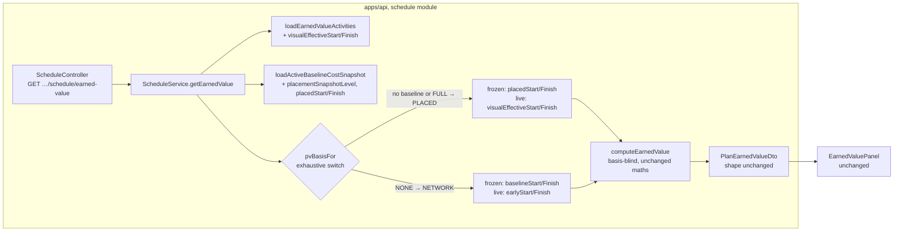
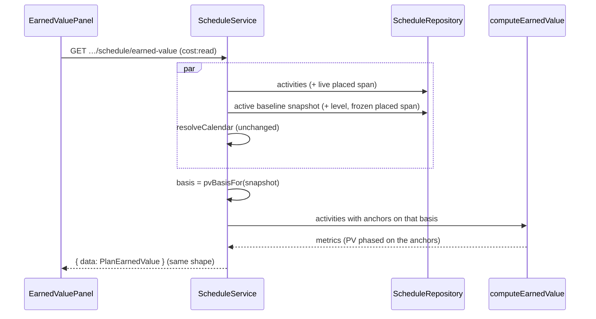
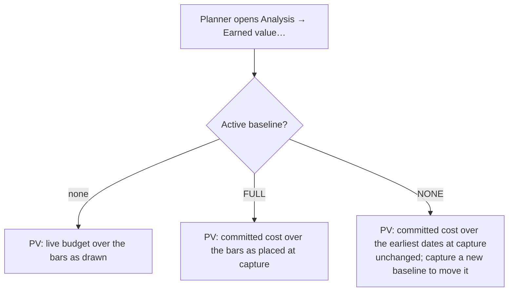

# Feature Spec: Earned Value planned value on the placed basis

- **Status:** Draft — awaiting approval before implementation.
- **Author(s):** feature-analyst (for the product owner)
- **Date:** 2026-09-29
- **Tracking issue / epic:** `docs/TECH_DEBT.md` #405, part (c) (parts (a) and (b) are decided separately)
- **Roadmap link:** none; this finishes a reader ADR-0148 left on the old basis
- **Related ADR(s):** ADR-0042 (Earned Value; amended here, §4.7), ADR-0044 (accrual; amended here),
  ADR-0148 (a bar is drawn where it is placed), ADR-0025 Amendment 3 (the #359 precedent this mirrors),
  ADR-0071 (per-assignment lag phasing), ADR-0088 D1 (no flag), ADR-0081 (entry point and journey)

**Why a spec and not a register fix (ADR-0105).** The change alters what a public read's figures mean
(`pv`, `sv`, `spi` on `GET …/schedule/earned-value`) for a class of plans. That is a public-contract
change, even though the response shape stays the same, so the row does not cover stages 1 to 4.

---

## 0. What was checked, and where the row and its neighbours are wrong

The row was checked against the code (CLAUDE.md §19.11). The defect is real. These details differ from
what the row and nearby documents say:

| #   | Claim                                                                                                                      | What the code says                                                                                                                                                                                                                                                                                                                                                                                                      | Effect                                                                                                 |
| --- | -------------------------------------------------------------------------------------------------------------------------- | ----------------------------------------------------------------------------------------------------------------------------------------------------------------------------------------------------------------------------------------------------------------------------------------------------------------------------------------------------------------------------------------------------------------------- | ------------------------------------------------------------------------------------------------------ |
| C1  | #405: "Earned Value phases planned value on the frozen early dates."                                                       | Half the story. PV uses the **frozen** early dates only when the activity's baseline row has both dates. Otherwise it uses the **live** early dates (`earned-value.ts:577-579`). The service passes frozen `baselineStart`/`baselineFinish` (`schedule.service.ts:1187-1188`) and live `earlyStart`/`earlyFinish` (`:1200-1201`). Engine case (6) pins the live fallback "on early dates" (`earned-value.spec.ts:286`). | Both anchors move to the placed basis. Q1 covers the live one.                                         |
| C2  | `TEST_PLAYBOOK.md:111`: the cost plan shows "PV from the active baseline".                                                 | The seeder cannot capture a baseline: `packages/seed-http/src` never mentions one (grep, 0 matches). So `plan:capability-cost-and-ev` shows the **live-budget fallback** with `costBaselineMissing: true`. It carries no `visualStart` either (`apps/seed-cli/src/capabilities/cost.ts:27-87`).                                                                                                                         | The playbook row is corrected at close-out. The plan becomes this epic's unplaced parity witness (§2). |
| C3  | ADR-0044 §3: curves "feed cost time-phasing".                                                                              | They do not. `earned-value.ts` never mentions a curve (grep `curve`, 0 matches). Curves feed only the resource histogram (`schedule.service.ts:1295-1309`).                                                                                                                                                                                                                                                             | Curves are not affected by this change (see the ADR-0044 amendment).                                   |
| C4  | ADR-0035 §32: accrual "never affects EV, AC, BAC, SPI/CPI".                                                                | Accrual changes PV, and `spi = ev / pv` (`earned-value.ts:279`), so accrual does change SPI.                                                                                                                                                                                                                                                                                                                            | Text corrected with the §29/§32 edit in the plan (T4).                                                 |
| C5  | ADR-0148 Consequences (`:225-226`): "Earned Value gains a per-component phasing model, because a placement shifts a span". | Nothing in `earned-value.ts` reads a placement. The per-component model is ADR-0071's lag phasing (`earned-value.ts:441-482`).                                                                                                                                                                                                                                                                                          | Recorded here; ADR-0148 References gain this spec at close-out.                                        |

Also found, outside the row's scope:

- **F1. The resource histogram still reads early dates** (`schedule.repository.ts:665`,
  `schedule.service.ts:1301-1302`). It is units, not money. It is `schedule:read`, not a baseline
  reader, and it is not part of #405. After this change, a hand-placed bar's cost S-curve (EV) and its
  resource load (histogram) sit on different spans. It is left out of scope on purpose and filed as a
  sibling row at close-out (plan T5).

---

## 1. Business understanding

### Problem

Since ADR-0148, a bar is drawn where it is **placed** (`visualEffectiveStart`/`Finish`). A drag writes a
placement and does not change the early dates. Since #359, baseline variance measures placed dates too
(ADR-0025 Amendment 3). Earned Value still spreads planned value over the **earliest** dates. So:

1. **Committed spend is dated where the bar is not.** If a planner drags an activity two weeks later
   and captures the baseline, the committed PV curve still spends that activity's budget two weeks early.
   SV and SPI then report the plan as behind for work that nobody planned to have done yet.
2. **EV and variance disagree about the same activity.** Variance says the bar is on plan (placed
   compared with placed). EV says it is behind (spent against early dates).
3. **With no baseline, the live S-curve does not match the diagram.** The live-budget fallback spreads
   cost over early dates that no screen draws.

### Users

Org Admin and Planner, the two roles with `cost:read` (`schedule.service.ts:1137`; Viewer and
Contributor get 403, `schedule.e2e-spec.ts:833-848`). External guests never see cost (`docs/API.md:596`).
None of this changes.

### Primary use cases

1. A planner hand-places activities, captures a baseline, and reads EV. Planned value is spent where
   the bars were placed.
2. A planner with no baseline reads EV. The live-budget PV follows the bars as drawn.

### User journeys

Plan workspace → **Analysis** → **Earned value…** (`plan-actions-menu.tsx:86`, which opens
`EarnedValuePanel` from `plan-chrome-dialogs.tsx:183`). The PV column, the SPI tile and the SV figure
under it all follow the placed span. See §4.3.

### Expected outcomes

On every plan with a placement, PV/SV/SPI agree with the diagram and with baseline variance. On every
plan without one, every EV figure is unchanged.

### Success criteria

- SC-1. E1 and E3 (§2) fail against today's code and pass after M1.
- SC-2. The service four-quadrant case U1 gives a different PV for each of the four anchor mixes, so
  changing only one side fails it.
- SC-3. The unplaced characterisation case E4 and the `plan:capability-cost-and-ev` reading are the
  same before and after.
- SC-4. `computeSchedule` is not called by the EV read, which is unchanged
  (`schedule.service.ts:1127-1129`, `:1208`).

### Open questions

See §6. There are two critical questions, and each has a default.

---

## 2. Functional requirements

### User stories & acceptance criteria

> **US-1** — As a **Planner**, I want planned value to be spent over the dates where my bars are placed,
> so that SV and SPI measure progress against the plan I drew.
>
> **Acceptance criteria**
>
> - **Given** the active baseline has `placementSnapshotLevel = FULL`, **when** I read EV, **then** each
>   leaf's PV is phased on its frozen `placedStart`/`placedFinish`.
> - **Given** a `FULL` baseline row whose `placedStart` or `placedFinish` is null, **then** that leaf
>   falls back to the **live placed** span, the same rule EV already uses for a null frozen date
>   (`earned-value.ts:577`). It never falls back to an early date.
> - **Given** the active baseline is `NONE`, **then** PV is phased on the frozen early dates, and the
>   live fallback is the live early span. This is exactly today's answer, and the same rule #359 used.
> - **Given** no active baseline (Q1 default), **then** the live-budget PV is phased on the live
>   `visualEffectiveStart`/`Finish`.
> - SV, SPI, and anything derived from SPI follow PV. BAC, EV, AC, CV, CPI and TCPI do not change
>   (see "Which figures change" below).

> **US-2** — As a **Planner** on a plan with no placements, I want every EV figure to stay the same.
>
> **Acceptance criteria**
>
> - **Given** a plan where no activity has ever been placed and the plan has been recalculated since
>   ADR-0148 M-P, **then** the EV response is byte-identical to today's, with any baseline level or with
>   none.

### Which figures change

The anchors feed only `leafPlannedPercent` (`earned-value.ts:386-408`) and the lag component sum
(`:441-482`), so the only thing that moves directly is **PV**. From `deriveMetrics`
(`earned-value.ts:270-305`):

| Figure                                                   | Changes?                                   | Why                                                                                                                                                                                 |
| -------------------------------------------------------- | ------------------------------------------ | ----------------------------------------------------------------------------------------------------------------------------------------------------------------------------------- |
| PV                                                       | yes                                        | anchors                                                                                                                                                                             |
| SV = EV − PV                                             | yes                                        | `:277`                                                                                                                                                                              |
| SPI = EV / PV                                            | yes                                        | `:279`; can switch between null and a number when PV crosses 0                                                                                                                      |
| EAC, ETC, VAC                                            | **only under `eacMethod = CPI_TIMES_SPI`** | EAC reads SPI only in that branch (`:292-296`); ETC = EAC − AC and VAC = BAC − EAC follow (`:300`, `:302`). Under `CPI` (the default) and `REMAINING_AT_BUDGET` they do not change. |
| TCPI                                                     | no                                         | `(BAC − EV)/(BAC − AC)`, no PV (`:301`)                                                                                                                                             |
| BAC, EV, AC, CV, CPI                                     | no                                         | none of them read a date (`:336-344`, `:573`, `:278`, `:280`)                                                                                                                       |
| performancePercent                                       | no                                         | `:350-375`                                                                                                                                                                          |
| WBS summary rows, plan total                             | yes, as sums                               | summaries add their children's PV (`:610-627`, `:630-640`)                                                                                                                          |
| `costBaselineMissing`                                    | no                                         | reads `baselineBudgetedCost` only (`:580`)                                                                                                                                          |
| `costPhasingLaggedCount`, `costPhasingApproximatedCount` | no, except the degenerate case below       | the lag path is chosen from components and lag, not dates (`:449-457`)                                                                                                              |

### Workflows

1. The EV read loads the activities, the active baseline's cost snapshot and the calendar, as today
   (`schedule.service.ts:1142-1146`).
2. It chooses **one basis for the whole read** from the snapshot, using an exhaustive switch: no active
   baseline → `PLACED` (Q1); `FULL` → `PLACED`; `NONE` → `NETWORK`. A third level is a compile error,
   the same way `varianceBasisFor` works (`baselines.service.ts:465-472`).
3. On that basis it maps each activity's frozen anchor (`placedStart`/`Finish` or
   `baselineStart`/`Finish`) and live anchor (`visualEffectiveStart`/`Finish` or `earlyStart`/`Finish`)
   into the engine input.
4. `computeEarnedValue` does not know which basis it received. Its rule "frozen if both frozen dates are
   present, else live" (`:577`) stays as it is.

### Edge cases

| Case                                                                                                                                                    | Behaviour                                                                                                                                                                                                                                                                                                                                                                          |
| ------------------------------------------------------------------------------------------------------------------------------------------------------- | ---------------------------------------------------------------------------------------------------------------------------------------------------------------------------------------------------------------------------------------------------------------------------------------------------------------------------------------------------------------------------------- |
| `FULL` row with placed null but early non-null (a plan last computed before the placed columns existed, captured without a recalculation; #359 spec §2) | Falls back to live **placed**. The basis never changes per row. This differs from variance, which shows null there. EV has never withheld PV for a missing frozen date; it falls back to live (`:577`), and that rule is kept.                                                                                                                                                     |
| Activity added after capture                                                                                                                            | Not in the snapshot, so it uses the live anchor on the read's basis. `pvCost = bac` and `costBaselineMissing` is set, as today (`:580-581`).                                                                                                                                                                                                                                       |
| Started or complete activity                                                                                                                            | Its placed span is its actual span; a placement cannot override an actual (`compute.visual.spec.ts:472-490`). No change.                                                                                                                                                                                                                                                           |
| Milestone                                                                                                                                               | Binary on the anchor start (`:394-395`). Placed and early use the same finish-milestone date rule (`docs/API.md:208-212`). A `FULL` baseline captured between 2026-09-21 and 2026-09-23 can be one working day out for a finish milestone. That problem already exists on the network basis (ADR-0155 consequences, as the #359 spec noted) and this change does not introduce it. |
| Lagged assignment                                                                                                                                       | Its window is `[anchor ⊕ lag, finish)` (`:473`), which is independent of the anchor, so it follows the placed anchor with no change.                                                                                                                                                                                                                                               |
| Placed span entirely after the data date                                                                                                                | PV is 0 (UNIFORM, `:402`). A placement cannot go before the data date because the engine applies a data-date floor (`docs/API.md:202-203`).                                                                                                                                                                                                                                        |
| Anchors null on the chosen basis and non-null on the other (only a plan never recalculated since the placed columns existed)                            | PV is 0 for that leaf, and the leaf leaves `costPhasingLaggedCount` (`:458`). This matches today's handling of an uncalculated activity. It is the "degenerate case" in the table above.                                                                                                                                                                                           |

### Permissions

Unchanged: `cost:read` is checked before any load (`schedule.service.ts:1136-1137`), the org scope comes
from the caller's memberships, and another org's plan returns 404 (`schedule.e2e-spec.ts:850-862`). This is
a read, not a structural write, so the pen (ADR-0028) is not involved.

### Validation rules

There is no new input.

### Error scenarios

| Scenario                           | Detection                                   | User-facing result | Status |
| ---------------------------------- | ------------------------------------------- | ------------------ | ------ |
| Not a member of the organisation   | scope resolve                               | not found          | 404    |
| Viewer / Contributor               | `cost:read`                                 | forbidden          | 403    |
| Lag walk past the calendar horizon | unchanged (`schedule.service.ts:1214-1225`) | named calendar     | 422    |

### Regression tests

All data dates are D = the plan start (`2026-01-01`, `schedule.e2e-spec.ts:768`). The calendar is
all-days (`makePlan` clears it, `:791`).

**Why START accrual in the e2e cases.** The engine's data-date floor means an unstarted bar never sits
before D. So under UNIFORM, a live-anchored PV is 0 on both bases unless the data date moves. START
switches from 0 to 100 at its anchor (`earned-value.ts:399`). That makes it the smallest fixture that
tells the two bases apart using public routes only.

- **E1: FULL baseline, frozen placed (fails today).** A: 10 days, `budgetedExpense: 1000000`,
  `accrualType: START`, `visualStart: D+3`. Recalculate, then capture (FULL). Clear the placement
  (`visualStart: null`) and recalculate. First check the fixture: through Prisma, A's live
  `visualEffectiveStart` is D and the snapshot row's `placedStart` is D+3. **Today:** PV = 1,000,000
  (frozen early D). **After:** PV = 0. The three wrong mixes (frozen early, live early, live placed) all
  give 1,000,000.
- **E2: NONE baseline keeps today's answer (characterisation).** Same as E1, then force the baseline to
  `placement_snapshot_level = 'NONE'` with the three placement columns null through Prisma. PV =
  1,000,000 both before and after. This pins the fallback rule.
- **E3: no baseline, live placed (fails today; pins Q1).** A: 10 days, START, 1,000,000,
  `visualStart: D+3`. Recalculate with no baseline. **Today:** PV = 1,000,000 (live early D).
  **After:** PV = 0, SV = 0, SPI null.
- **E4: unplaced parity (characterisation, golden).** One plan with no placement: a started task, a
  complete task, a WBS summary over two children, an LOE, one UNIFORM and one END task, and one lagged
  assignment. Capture a baseline, then move the data date past several spans. Record the whole EV
  response **against the pre-change code** and commit it as a literal. After the change it must be
  `toEqual`. This is the byte-identity proof at the product level. At the engine level it rests on FC-11
  (`compute.visual.spec.ts:442-458`: `visualEffective*` equals `early*` for every activity type when
  nothing is placed) and on capture copying both spans in one locked transaction
  (`baseline.repository.ts:238-239`, `:362-363`, `:382-383`).
- **U1: four-quadrant service case** (`schedule.service.spec.ts`, beside `getEarnedValue` at `:1117`).
  UNIFORM, 1,000,000, 10-day spans, data date D+10. Frozen early D+2, frozen placed D+4, live early
  D+6, live placed D+8. Frozen placed gives 600,000, frozen early 800,000, live early 400,000, live
  placed 200,000. On a `FULL` snapshot the expected value is 600,000. Each wrong mix gives a different
  number. Check it red against each of the three wrong mixes before merge (ADR-0110 D5).
- **U2: per-read basis.** A `FULL` row with placed null and early set gives the **live placed** answer,
  not the frozen early one. A `NONE` snapshot gives the frozen early answer. No snapshot gives the live
  placed answer.
- **Engine unit (not red-first, and deliberately so).** `computeEarnedValue` does not know its basis
  and does not change apart from the field rename (§4.7). A red-first engine case would test a change
  that is not made. What the engine suites must show is that **every existing assertion passes
  unedited** after the rename (`earned-value.spec.ts`, `.accrual.spec.ts`, `.steps.spec.ts`,
  `earned-value-conformance.spec.ts`). The before/after oracle is the pure maths.
- **Seed-catalogue witness.** `plan:capability-cost-and-ev` has no placement and no baseline (C2). Its
  EV reading must be the same before and after. That is the playbook row's new "Wrong" column.

---

## 3. Technical analysis

| Area           | Impact | Notes                                                                                                                                                                                                                               |
| -------------- | ------ | ----------------------------------------------------------------------------------------------------------------------------------------------------------------------------------------------------------------------------------- |
| Frontend       | none   | No copy mentions dates: grep `early                                                                                                                                                                                                 | earliest | placed`in`features/earned-value`gives only a code comment. The one PV sentence ("No active cost baseline — Planned Value falls back to the live budget",`EarnedValuePanel.tsx:289-292`) is true on both bases. Q2 would add one muted sentence. |
| Backend        | low    | Two loaders gain columns (`schedule.repository.ts:622-623` + `visualEffectiveStart/Finish`; `:700` + `placementSnapshotLevel`; `:710-711` + `placedStart/Finish`). The service adds a basis switch. The engine gets a field rename. |
| Database       | none   | The level (`schema.prisma:2112`), the frozen placed columns (`:2395-2396`) and the live placed columns (`:1309-1310`) all exist. No migration, no index: reads stay by `baseline_id` and by plan, as today.                         |
| API            | low    | The shape is unchanged. What `pv`/`sv`/`spi` mean changes for placed plans (and EAC/ETC/VAC under `CPI_TIMES_SPI`). `docs/API.md` and OpenAPI descriptions are updated.                                                             |
| Security       | none   | Same route, permission and scope. Placed dates are already on the member activity read.                                                                                                                                             |
| Performance    | none   | Four date columns and one enum on reads that are already plan-scoped.                                                                                                                                                               |
| Infrastructure | none   | No env var, no flag (ADR-0088 D1).                                                                                                                                                                                                  |
| Observability  | none   | —                                                                                                                                                                                                                                   |
| Testing        | low    | E1–E4, U1–U2, the renamed engine suites, and one journey step.                                                                                                                                                                      |

### Dependencies

- Must already exist, and does: M-C capture of placed columns (ADR-0025 Amendment 3 records it),
  FC-11 parity, #359 (`varianceBasisFor`).
- Siblings in #405: (a) the revision comparison and (b) the landing standing are decided separately.
  This spec does not touch them.

---

## 4. Solution design

### 4.1 Architecture overview

### 4.2 Data flow

### 4.3 User flow

### 4.4 Database changes

**None.** The verification is in the §3 row. `database-architect` is not engaged because nothing is
designed. If any task finds a reason to touch a column, index, constraint or migration, it stops and goes
to that agent first (CLAUDE.md §19.3).

### 4.5 API changes

`GET /api/v1/organizations/:orgSlug/plans/:planId/schedule/earned-value`: the **shape is unchanged**.

- OpenAPI: `pv`'s description (`plan-earned-value.dto.ts:18`) becomes "time-phased to the data date
  over the placed span (the frozen placed span on a baseline that recorded one; see docs/API.md)".
- **No basis field by default (Q2).** The one `NETWORK` case is an active `NONE` baseline. A client can
  already tell that from `GET …/baselines` (`placementSnapshotLevel`, `baseline-response.dto.ts:75`),
  and the variance read on the same plan already reports `meta.basis: 'NETWORK'`. The population is the
  baselines captured before `api-v0.70.0`, which on the one installation is 0 or 2 baselines of test data
  (#359 spec F3). A field would add a types change, a web change and two changesets to label a case that
  may not exist. If the answer to Q2 is yes, the field is `plannedValueBasis: 'PLACED' | 'NETWORK'`
  (never null, because EV always phases on something), reusing `VarianceBasis`.
- **Changeset:** `api` **minor**. It is a behavioural change to a public read's figures (pre-1.0,
  CLAUDE.md §10; #359 precedent). The first sentence names it: "Earned Value now phases planned value
  over placed dates; SV and SPI change for plans with hand-placed activities." There is no `types` or
  `web` changeset unless Q2 is answered yes.
- **`docs/API.md`:** a short "Earned Value planned-value basis" paragraph after the variance-basis
  section (`:274-302`), and the accrual clause at `:1519-1520` changes from "START at its start, END at
  its finish" to "at its placed start / placed finish".

### 4.6 Component changes (web)

None by default. The EV panel reads the same fields.

### 4.7 Implementation approach & alternatives

**Chosen:** the #359 shape. One basis per read in the service, from the level. The engine does not know
its basis. The live engine field names change from `earlyStart`/`earlyFinish` to `liveStart`/`liveFinish`
(`earned-value.ts:148-151`), because a field named "early" that holds a placed date is the silent
redefinition ADR-0148 refused (ADR-0025 Amendment 3 made the same rename in `variance.ts`).
`baselineStart`/`baselineFinish` keep their names; their docblock says they hold the frozen span on the
read's basis.

**The #359 fallback rule holds for EV, with no concrete reason to depart from it.** On `NONE` the only
frozen dates are early (`baseline.repository.ts:238-239`) and no placement can be backfilled
(`schema.prisma:2372-2379`). So EV uses frozen early, and its live fallback on that read is live early,
keeping one basis for the whole read.

| Alternative                                             | Why not                                                                                                    |
| ------------------------------------------------------- | ---------------------------------------------------------------------------------------------------------- |
| Switch only the frozen anchor                           | Leaves the no-baseline S-curve and post-capture additions on early dates. That is Q1's opposite answer.    |
| Per-row fallback to network where a placed date is null | Mixes two bases in one S-curve.                                                                            |
| `NONE`: frozen early vs live placed                     | Adds a basis mix that #359 considered and rejected for variance (its Q1 (b)). The product owner chose (a). |
| Phase PV over the resource curves as well               | Curves never fed PV (C3). That would be a new feature, not this fix.                                       |
| Fold in the resource histogram (F1)                     | A different reader with a different permission. Filed as a sibling row.                                    |

**ADR:** no new ADR. It is an **amendment to ADR-0042** (§4 says what PV is measured against), with a
short matching **amendment to ADR-0044** (§1's accrual anchors). Both are drafted in those files and
marked _Proposed_ until this spec is approved.

**Recalculation parity (ADR-0034).** The strong form is untouched. The EV read never calls
`computeSchedule` (`schedule.service.ts:1127-1129`), and nothing in the engine pass, the recalculation or
the capture changes.

---

## 5. Links

- Implementation plan: [`./plan.md`](./plan.md)
- Docs updated by this change: `docs/API.md`, `docs/adr/0042-…` and `docs/adr/0044-…` (amendments),
  `docs/adr/0035-…` §29 and §32 (text), `docs/adr/0148-…` (References), `docs/TEST_PLAYBOOK.md:111`,
  `docs/TECH_DEBT.md` #405 (part (c) closed; F1 sibling row), CLAUDE.md §16 (one clause each on the
  ADR-0042 and ADR-0044 lines).

---

## 6. Questions

**Q1 (critical: changes behaviour on placed plans with no baseline).** When there is no active baseline,
or an activity was added after capture, what does the live-budget PV phase on?

- **(a) Live placed dates (default).** This is ADR-0148's answer to "when is this activity". The S-curve
  matches the diagram, and on a `FULL` baseline an added activity is on the same basis as the rest of the
  read.
- **(b) Live early dates.** Only the frozen anchor changes. This is the narrowest reading of the row
  ("the frozen early dates"). The no-baseline S-curve then disagrees with the bars.

Default (a). Choosing (b) changes E3 and one line of `pvBasisFor`.

**Q2 (critical only if you want it on screen).** Should the EV response name its basis?

- **(a) No (default).** The shape is unchanged. `NETWORK` happens only on a pre-`api-v0.70.0` baseline
  (0 to 2 test baselines), and the level can already be read from `GET …/baselines`.
- **(b) Yes.** Additive `plannedValueBasis`, plus one muted panel sentence on `NETWORK`: "Planned value
  uses earliest dates: this baseline was captured before placements were recorded." This adds `types`
  and `web` minor changesets and a web unit case.

Every other point has a default stated above: the fallback rule, curves unaffected, the histogram as a
sibling row, the frozen-placed fallback to live placed, and the `api` minor bump.
