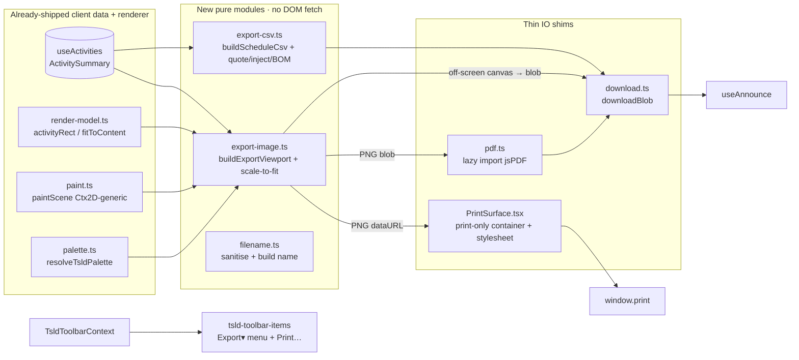

# Feature Spec: TSLD export & print

- **Status:** Draft (awaiting approval)
- **Author(s):** feature-analyst (Product Owner / Solution Architect / Technical Lead hats)
- **Date:** 2026-07-20
- **Tracking issue / epic:** TBD (toolbar-placeholder burn-down — Stage C1)
- **Roadmap link:** TSLD canvas workspace / toolbar burn-down (`docs/TOOLBAR_ROADMAP.md`, `docs/ROADMAP.md`)
- **Related ADR(s):** ADR-0026 (canvas: Canvas 2D, layered/culled, ≤16 ms draw budget, parallel focusable
  DOM a11y layer), ADR-0031 (toolbar-item registry — `defineToolbar`, 7-group taxonomy, prominence tiers,
  `placeholderItem()` "Coming soon" stubs), ADR-0006 (design tokens / theme). **A new lightweight client
  dependency (jsPDF) is proposed — see §4 CQ-2 and the ADR assessment.** No new architectural boundary
  otherwise; a `docs/DECISIONS.md` entry records the export module + light "print" palette contract.

---

## 1. Business understanding

### Problem

The two-row TSLD toolbar (ADR-0031) advertises a complete deliverables cluster, but three intended
outputs still ship as inert **"Coming soon" placeholders** (`placeholderItem()` stubs in
`tsld-toolbar-items.tsx`, Row 2 · Do, group `object`) — `export`, `print`, `share`. A planner who has
built a schedule cannot get it **out** of the app:

- There is **no way to hand the schedule to someone who isn't in SchedulePoint** — a client, a
  sub-contractor, a QS — as a spreadsheet. Every rival planning tool exports the activity table as CSV;
  ours can't, so the data is trapped behind the UI.
- There is **no way to produce a picture of the diagram** — the TSLD is the product's signature surface,
  yet it can't be dropped into a report, an email, or a site notice-board print-out. Planners screenshot
  the viewport by hand, losing everything off-screen.
- There is **no print path at all** — `Ctrl+P` on the live app prints the app-shell chrome and a single
  viewport-sized canvas bitmap, which is useless.

All three outputs can be produced **entirely client-side** from data and a renderer that **already ship**:
the CSV reuses the `ActivitySummary` columns the activities table already consumes; the diagram image
reuses the exact `paintScene` painter (ADR-0026) that draws the live canvas, run against an off-screen
canvas framed to the whole diagram. This is a pure **frontend wiring + client-render** job with **no** API,
schema, `@repo/types`, CPM-engine, or migration change. The recalc parity gate
(`apps/api/src/modules/schedule/engine/`) is not touched.

**Scope boundary (C1, this stage):** CSV of the schedule, PNG of the diagram, PDF of the diagram, and a
Browser Print of the diagram. **Deferred to C2:** XER (Primavera) and MSP (Microsoft Project) interchange
export/import, and the `share` per-plan guest link (ADR-0012) — none are specced here.

### Users

Mapped to the organisation role set (ADR-0016). Export and print are **read-only egress of
already-authorised data** — no mutation, no pen — so they are offered to **every** role that can view the
plan, viewers and External Guests included. A caller only ever exports the projection the API already
returned to them (e.g. cost columns are already `null` for non-`cost:read` callers, ADR-0042 EV4a), so
export adds **no** new data surface (see §2 Permissions).

- **Planner / Org Admin** — export the schedule to CSV for a client spreadsheet; drop a PNG/PDF of the
  diagram into a progress report; print a wall copy for the site office.
- **Contributor** — export their slice for offline reference.
- **Viewer / External Guest** — take a copy of a shared plan (image or CSV) without a screenshot.

### Primary use cases

1. **Export CSV** — download the current plan's activity table (code, name, type, duration, computed
   start/finish, total/free float, critical flag, constraints, WBS, % complete, …) as a UTF-8,
   Excel-friendly `.csv`.
2. **Export PNG** — download a raster image of the **whole** TSLD diagram (not just the on-screen
   viewport), device-pixel-ratio-scaled, in a light "print" theme, with a title band and legend.
3. **Export PDF** — download a single-page PDF of that same diagram image, client-side.
4. **Print** — produce a sensible printed page of the diagram via the browser print dialog.

### User journeys

**Happy path (CSV):** planner opens a computed plan → opens the toolbar **Export ▾** menu → picks
**Schedule (CSV)** → a `plan-name-schedule-2026-07-20.csv` downloads; a live-region message announces
"Downloaded plan-name-schedule-2026-07-20.csv (214 activities)". Opening it in Excel shows the columns
intact, dates readable, no mojibake (UTF-8 BOM), embedded commas/quotes/newlines correctly quoted.

**Happy path (PNG):** planner opens **Export ▾** → **Diagram (PNG)** → the app paints the whole diagram to
an off-screen canvas (light theme, title + legend), and downloads `plan-name-diagram-2026-07-20.png`; the
message announces the download. The image contains activities that were scrolled off-screen in the live
view.

**Happy path (PDF):** planner opens **Export ▾** → **Diagram (PDF)** → a small loading state shows while the
PDF library lazy-loads (first use only), then a single-page PDF (landscape, image fit to the page)
downloads.

**Happy path (Print):** planner presses the toolbar **Print…** button (or `Ctrl/Cmd+P` handled by the app)
→ the whole-diagram image is placed into a print-only container, a print stylesheet hides the app-shell,
and the browser print dialog opens showing just the diagram + title.

**Alternates:** empty/uncomputed canvas ⇒ Export and Print are disabled-with-reason "Add an activity
first" (ADR-0031 shade-don't-hide), matching the zoom cluster. A diagram larger than the raster cap is
**scaled down to fit** the cap and the title band notes "scaled to fit". `VITE_EXPORT_PRINT` off ⇒ the
`export`/`print` ids are their byte-for-byte "Coming soon" placeholders.

### Expected outcomes

Two placeholder ids (`export`, `print`) become live, delivering four outputs (CSV, PNG, PDF, Print). The
schedule and its signature diagram leave the app in the three formats stakeholders actually ask for; the
toolbar's advertised deliverables cluster gets materially closer to complete. `share` and XER/MSP remain
placeholders/roadmap for C2.

### Success criteria

- Export and Print are operable by **keyboard alone** and every download/print is **announced** (WCAG 2.2
  AA). The CSV doubles as the accessible, tabular equivalent of the diagram for screen-reader users.
- The PNG/PDF is a faithful render of the **whole** diagram (reusing `paintScene`), not a viewport crop,
  bounded by a documented max raster dimension with a scale-to-fit fallback.
- CSV is **RFC-4180**-quoted, **UTF-8 with a BOM** (Excel), and **CSV-injection-safe** (formula-prefix
  neutralisation) — verified by unit fixtures.
- Building the image/CSV does **not** regress the live canvas: export paints to an **off-screen** canvas,
  never the live one, so the ADR-0026 live-draw budget is untouched.
- **Flag-off (`VITE_EXPORT_PRINT=false`) is byte-for-byte today's toolbar** — `export`/`print` resolve to
  their existing placeholder stubs; `share` is unchanged regardless.
- No change to any API response, `@repo/types`, DB, or the engine parity golden suite.

### Open questions

**CRITICAL (answers change scope/design) — RESOLVED at approval (2026-07-20, product sign-off):**

- **CQ-1 — PNG/PDF extent: whole-diagram vs current viewport. → RESOLVED: OFFER BOTH.** M2 ships **two**
  extent options as menu items: **Whole diagram** (re-frame an off-screen canvas to the full activity
  extent at the current zoom's `pxPerDay`, reusing `fitToContent`-style bounds, **bounded to a max raster
  dimension** — 8192 px per side, DPR capped at 2 — with a **scale-to-fit fallback** and a "scaled to fit"
  title-band note) **and** **Current view** (crop to the live viewport). Both feed the same off-screen
  `paintScene`; the extent is a parameter of the export-viewport computation, so the second option is not a
  deferred fast-follow but a first-class M2 deliverable. PDF (M3) offers the same two extents.
- **CQ-2 — PDF: add jsPDF vs a hand-rolled PNG-in-PDF. → RESOLVED: LAZY jsPDF.** Add **jsPDF** (MIT),
  **dynamically imported (code-split, lazy)** so it is **absent from the initial bundle** and only fetched
  on first PDF export, embedding the already-produced PNG on a single landscape page. A hand-rolled PDF
  writer is rejected on maintenance/security-risk grounds. **Still requires devops-reviewer +
  performance-reviewer sign-off** on the bundle/licence/SBOM during M5.
- **CQ-3 — CSV: respect the active filter/isolate lens, or always all rows. → RESOLVED: ALL ROWS +
  CONDITIONAL "MATCHING ONLY".** CSV **exports ALL rows of the plan by default**, and — **when a Stage-A
  filter or Stage-B isolate lens is currently narrowing the set** — the Export menu offers a **second CSV
  item "Matching activities only (N)"**. PNG/PDF always render the whole diagram at the chosen extent (a
  lens only dims, it never removes geometry — Stage A CQ-2 — so the export shows the dim state as painted).
- **CQ-4 — Print: CSS print stylesheet over the live DOM vs the image path. → RESOLVED: IMAGE PATH.**
  Reuse the off-screen image, place it in a **print-only container**, and use a minimal **print
  stylesheet** to hide the app-shell before `window.print()`. Printing the live DOM is rejected: the canvas
  is a **single viewport-sized bitmap**, so a CSS-only print loses everything off-screen — the exact
  failure we're fixing. (The print stylesheet still exists, but only to isolate the injected image.)

**Non-critical (defaults applied, not blocking):**

- **Theme for PNG/PDF/print:** _default_ a **light "print" palette** (white ground, dark ink) regardless of
  the app's light/dark/system theme — reports and paper want light — with the current theme as a
  fast-follow option. Resolved from the same design tokens (ADR-0006), no one-off colours.
- **Title/legend inclusion:** _default_ include a compact **title band** (plan name · "as of" data date ·
  generated timestamp) and render the **current Legend key** into the image, so a printed diagram is
  self-describing. Toggling these off is a fast-follow.
- **CSV column set & order:** _default_ mirror the activities-table columns in table order (see §2
  Validation), one header row, ISO `YYYY-MM-DD` dates, integers for floats/durations, blank cell for
  `null`. Localisation of headers is a later concern (avoid hard-coding once i18n lands, §17 CLAUDE.md).
- **Filename:** _default_ `{sanitised-plan-name}-{schedule|diagram}-{YYYY-MM-DD}.{csv|png|pdf}`; the plan
  name is sanitised to a safe slug (see §2 Validation / §3 Security) to avoid header/path issues.
- **Export as a menu vs split-button:** _default_ the `export` id becomes a single APG **menu-button**
  (`Export ▾`) listing CSV / PNG / PDF (mirroring `ColourByControl`/`ZoomPresetControl`); `print` stays a
  plain action button. This keeps two toolbar ids delivering four commands.

## 2. Functional requirements

### User stories & acceptance criteria

> **US-1 — Export schedule as CSV.** As any role who can view a plan, I want to download the activity
> table as a CSV, so that I can work with the schedule in a spreadsheet or hand it to someone outside
> SchedulePoint.
>
> **Acceptance criteria**
>
> - **Given** a plan with activities **when** I open **Export ▾** and pick **Schedule (CSV)** **then** a
>   `.csv` downloads containing one header row and one row per activity, in the activities-table column set
>   and order, and a live region announces "Downloaded <filename> (N activities)".
> - **Given** a cell value containing a comma, quote, or newline **then** it is RFC-4180-quoted (wrapped in
>   double quotes, inner quotes doubled) so the CSV parses correctly.
> - **Given** a cell whose text begins with `=`, `+`, `-`, `@`, tab, or CR **then** it is neutralised
>   (formula-injection guard) before quoting, so opening the file in Excel/Sheets cannot execute it.
> - **Given** Excel opens the file **then** non-ASCII names render correctly (UTF-8 **BOM** prepended).
> - **Given** a `null` computed value (e.g. an uncalculated float) **then** its cell is blank.
> - **Given** a filter/isolate lens is currently narrowing the diagram **then** the menu additionally
>   offers **Matching activities only (N)**, exporting just that set (CQ-3); the default CSV item still
>   exports all rows.
> - **Given** the plan has no activities **then** the whole Export control is disabled-with-reason "Add an
>   activity first".

> **US-2 — Export diagram as PNG.** As any role, I want to download an image of the whole diagram, so that
> I can put it in a report or email.
>
> **Acceptance criteria**
>
> - **Given** a computed diagram **when** I pick **Diagram (PNG)** **then** a `.png` downloads that renders
>   the **whole** activity extent (including bars scrolled off the live viewport), painted by the same
>   `paintScene` used live, in the light print palette, with a title band and legend; a live region
>   announces the download.
> - **Given** the diagram's natural raster size exceeds the max dimension cap **then** it is scaled down to
>   fit the cap and the title band notes "scaled to fit"; the export never produces an over-cap canvas.
> - **Given** a device with `devicePixelRatio > 1` **then** the image is rendered at up to a 2× scale for
>   crispness (capped), matching the live-canvas DPR convention.
> - **Given** the plan has no computed diagram **then** the PNG item is disabled-with-reason.

> **US-3 — Export diagram as PDF.** As any role, I want a single-page PDF of the diagram, so that I can
> attach a portable document.
>
> **Acceptance criteria**
>
> - **Given** a computed diagram **when** I pick **Diagram (PDF)** **then** the diagram image is produced
>   (as US-2) and embedded on a single landscape page sized/scaled to fit, and a `.pdf` downloads.
> - **Given** this is the first PDF export in the session **then** the PDF library lazy-loads with a brief
>   loading/disabled state on the item; subsequent exports don't re-fetch it.
> - **Given** the library fails to load (offline) **then** a user-safe error is shown ("Couldn't load the
>   PDF exporter — try PNG"), no crash, and PNG/CSV remain available.

> **US-4 — Print the diagram.** As any role, I want to print a sensible page of the diagram, so that I can
> pin it up or file it.
>
> **Acceptance criteria**
>
> - **Given** a computed diagram **when** I activate **Print…** (button or the app-handled `Ctrl/Cmd+P`)
>   **then** the whole-diagram image is placed in a print-only container, the app-shell is hidden by the
>   print stylesheet, and the browser print dialog opens showing the diagram + title.
> - **Given** the print dialog is dismissed or completes **then** the print-only container is torn down and
>   the live app is visually unchanged.
> - **Given** the plan has no computed diagram **then** Print is disabled-with-reason.

> **US-5 — Flag fallback.** As an operator, I want one kill switch, so that I can roll export/print back
> instantly.
>
> - **Given** `VITE_EXPORT_PRINT=false` **then** `export` and `print` render as their existing "Coming
>   soon" placeholders and nothing else in the toolbar, canvas, or a11y tree differs; `share` is unchanged.

### Workflows

- **CSV:** menu pick → `buildScheduleCsv(activities, { scope })` (pure: project each `ActivitySummary` to
  the column row → neutralise → RFC-4180 quote → join → prepend BOM) → `downloadBlob(blob, filename)` →
  announce.
- **PNG:** menu pick → `buildExportViewport(activities, dataDate, { maxPx, dpr })` (pure: full-extent
  bounds + scale-to-fit) → create off-screen `<canvas>` at the target pixel size → `paintScene(offCtx,
exportScene, exportViewport, exportSize, printPalette, dpr)` → draw title band + legend → `canvas.toBlob`
  (fallback `toDataURL`) → `downloadBlob` → announce.
- **PDF:** menu pick → produce the PNG blob (as above) → `await import('jspdf')` (lazy) → new doc, add the
  image fit to a landscape page → `doc.save(filename)` → announce. First call shows a loading state.
- **Print:** activate → produce the PNG data URL → mount a print-only `<div>` with the image + title →
  `window.print()` → on `afterprint` (and a fallback timeout) unmount → announce.

### Edge cases

- **Empty / uncomputed canvas** — whole Export control + Print disabled-with-reason "Add an activity
  first" (stable toolbar shape, matches the zoom cluster).
- **Activities with no computed dates** (never recalculated) — CSV still exports them with blank date/float
  cells (definitions are useful); the image simply omits un-placeable bars (as the live canvas does).
- **Very large diagram** (extent > raster cap) — scale-to-fit, title notes it; never allocate an over-cap
  canvas (browsers hard-cap canvas area; exceeding it silently yields a blank image — the cap prevents it).
- **Very large activity count** (CSV) — pure string build; thousands of rows is milliseconds. If a plan is
  pathologically large (10k+), the synchronous build is still sub-100 ms; documented, revisit with real
  data (no premature async).
- **Filter/isolate lens active** — the image renders the diagram **as painted** (dimmed non-matches show
  dimmed — Stage A shade-don't-hide); the CSV default is all rows, with the conditional "matching only"
  item (CQ-3).
- **`canvas.toBlob` unsupported / returns null** — fall back to `toDataURL('image/png')`; if that fails,
  a user-safe error, CSV still works.
- **PDF library fails to load** — user-safe error, PNG/CSV unaffected (US-3).
- **Print dialog blocked/again pressed** — we mount into the **current document** (no popup window), so
  there is no pop-up blocker; re-pressing re-mounts idempotently.
- **Plan name empty or all-punctuation** — filename slug falls back to `plan` + the plan id short-hash.
- **Cost columns for non-`cost:read` callers** — already `null` from the API (ADR-0042 EV4a); the CSV
  simply has blank cost cells — no client-side privilege leak (see Permissions).

### Permissions

RBAC + resource scope per ADR-0012/0016. **No new permission.** Export and Print are pure client egress of
data the caller **already** fetched and is authorised to see (`useActivities`, the render model). No new
network call, no new fetch-by-id, no IDOR surface. An External Guest exports only what their per-plan
share scope already loaded. Conditionally-projected fields (cost, ADR-0042 EV4a) are already `null` for
un-permitted callers, so the CSV cannot leak them. Security-reviewer confirms: no authorisation change; the
only new security concerns are **CSV formula injection** and **filename sanitisation** (both client-side,
mitigated below).

### Validation rules

Client-only (no DTOs, nothing sent to the server):

- **CSV column set** (default order, mirroring the activities table): `code`, `name`, `type`,
  `durationDays`, `status`, `percentComplete`, `earlyStart`, `earlyFinish`, `lateStart`, `lateFinish`,
  `totalFloat`, `freeFloat`, `isCritical`, `constraintType`, `constraintDate`, `wbsParent` (the parent
  activity's code/name, resolved client-side from `parentId`), `budgetedExpense`, `actualExpense`. Dates
  ISO `YYYY-MM-DD`; floats/durations integers; booleans `Yes`/`No`; `null` → empty cell; money in the
  plan's minor units via `lib/format-money` (documented header note), or blank when un-permitted. The exact
  set is finalised with the component reviewer against the live table.
- **CSV cell safety:** trim; if the cell starts with `= + - @`, TAB (`\t`) or CR (`\r`), prefix a single
  apostrophe (`'`) before quoting (OWASP formula-injection guard); then RFC-4180 quote if it contains
  `" , \n \r`.
- **Filename slug:** lower-case, `[a-z0-9-]` only, collapse runs of `-`, trim to ≤ 64 chars; empty →
  `plan`. No path separators, no leading dot.
- **Raster cap:** `maxPx` (per side) and `dpr` (≤ 2) are fixed constants, unit-tested at the boundary.

### Error scenarios

| Scenario                           | Detection                 | User-facing result                                                     | Status |
| ---------------------------------- | ------------------------- | ---------------------------------------------------------------------- | ------ |
| No computed diagram                | `!ctx.hasDiagram`         | Export + Print disabled-with-reason "Add an activity first"            | n/a    |
| `canvas.toBlob` null / unsupported | null blob                 | fall back to `toDataURL`; else user-safe "Couldn't create image" toast | n/a    |
| PDF library import fails (offline) | `import()` rejects        | user-safe "Couldn't load the PDF exporter — try PNG"; PNG/CSV OK       | n/a    |
| Diagram exceeds raster cap         | computed extent > cap     | scale-to-fit; title notes "scaled to fit" (not an error)               | n/a    |
| Browser blocks the download        | anchor click no-op (rare) | announce still fires; documented browser-setting caveat                | n/a    |

No new network calls ⇒ no new HTTP error surface.

## 3. Technical analysis

| Area           | Impact                | Notes                                                                                                                                                                                                               |
| -------------- | --------------------- | ------------------------------------------------------------------------------------------------------------------------------------------------------------------------------------------------------------------- |
| Frontend       | **med**               | New pure modules (`export-csv.ts`, `export-image.ts`), a `downloadBlob` util, a lazy `pdf.ts`, a print-container component + print stylesheet, an `Export ▾` menu-button + `Print…` item, context wiring.           |
| Backend        | none                  | No module/service/endpoint change.                                                                                                                                                                                  |
| Database       | none                  | No model/migration/index.                                                                                                                                                                                           |
| API            | none                  | No endpoint/contract/OpenAPI change; reuses `useActivities` + the render model already in the client.                                                                                                               |
| Security       | **low (first-class)** | **CSV formula-injection** guard + **filename sanitisation**; no new authz/IDOR (client egress of already-authorised data). security-reviewer sign-off required.                                                     |
| Performance    | **med**               | Off-screen paint must NOT touch the live canvas (no live-draw regression); a bounded raster cap; **jsPDF must be code-split/lazy** so it never enters the initial bundle. performance-reviewer gate.                |
| Infrastructure | **low**               | One new `VITE_EXPORT_PRINT` flag (+ `.env.example`, `vite-env.d.ts`); one new lazy dependency (jsPDF) → devops-reviewer (licence, bundle, SBOM/Dependabot).                                                         |
| Observability  | none                  | Client-only; no new logs/metrics/traces.                                                                                                                                                                            |
| Testing        | **med**               | Unit: CSV projection/quote/inject/BOM, filename slug, export-viewport bounds/scale-to-fit; component: Export menu + gating + placeholder fallback; e2e/a11y: keyboard export → download + announce; print teardown. |

### Dependencies

- **Prerequisite (already shipped):** `useActivities` / `ActivitySummary`; the ADR-0026 render model
  (`activityRect`, `fitToContent`, `cull`) + `paintScene` (accepts any `Ctx2D`, so it paints off-screen)
  - `resolveTsldPalette` (token-derived, theme-aware); the ADR-0031 toolbar registry + `TsldToolbarContext`
  - `Menu`/`ToolbarPopover` primitives; the shared announcer (`useAnnounce`); `lib/format-money`.
- **Must land first:** nothing new — additive wiring, except the **jsPDF dependency add** (M3, gated on
  CQ-2 + devops/performance sign-off).
- **Interacts with:** Stage A insight lenses / Stage B isolate (their dim state is reflected in the image
  as painted; the "matching only" CSV reuses the same predicate seams). No coupling to the CPM engine.
- **New third party:** **jsPDF** (MIT), dynamically imported — see CQ-2. No other runtime dep (CSV/PNG/Print
  use only platform APIs: `Blob`, `URL.createObjectURL`, `<canvas>`, `window.print`).

## 4. Solution design

### Architecture overview

Export/print are **client render + serialisation** layered on shipped seams. The image path **reuses the
exact `paintScene`** the live canvas uses, run against an **off-screen** canvas framed to the whole diagram;
nothing crosses the API boundary and the live canvas is never touched.



### Data flow

```mermaid
sequenceDiagram
  participant U as User
  participant M as Export▾ menu item
  participant P as Pure module
  participant O as Off-screen canvas
  participant IO as download / jsPDF / print
  Note over U,IO: CSV
  U->>M: pick Schedule (CSV)
  M->>P: buildScheduleCsv(activities, scope)
  P-->>M: CSV string (BOM + RFC-4180 + inject-safe)
  M->>IO: downloadBlob(csv, filename) + announce
  Note over U,IO: PNG / PDF
  U->>M: pick Diagram (PNG|PDF)
  M->>P: buildExportViewport(activities, dataDate, cap)
  P-->>M: {viewport, size, scaledToFit}
  M->>O: paintScene(offCtx, scene, viewport, size, printPalette, dpr) + title/legend
  O-->>M: toBlob → PNG blob
  alt PNG
    M->>IO: downloadBlob(png) + announce
  else PDF
    M->>IO: await import('jspdf'); addImage(png); save() + announce
  end
```

### User flow

```mermaid
flowchart TD
  A[Plan open on TSLD canvas] --> B{VITE_EXPORT_PRINT on?}
  B -- no --> Z[Export… / Print… "Coming soon" placeholders — unchanged]
  B -- yes --> C{Diagram computed?}
  C -- no --> D[Export ▾ + Print… disabled: "Add an activity first"]
  C -- yes --> E[Export ▾ menu + Print… button]
  E --> F[Schedule (CSV) → download + announce]
  E --> G[Diagram (PNG) → off-screen paint → download]
  E --> H[Diagram (PDF) → PNG → lazy jsPDF → download]
  C -- yes --> I[Print… → print-only image + window.print → teardown]
```

### Database changes

None.

### API changes

None. Reuses `GET …/plans/:id/activities` (already in the client cache) and the client-side render model.

### Component changes

Feature-first under `apps/web/src/features/tsld/` (+ one flag in `config/env.ts`), reusing the design
system + toolbar/menu primitives — **no one-off styling**.

- **`config/env.ts`** — add `EXPORT_PRINT_ENABLED = flagDefaultOff(import.meta.env.VITE_EXPORT_PRINT)`
  (default OFF during build; flipped to `flagDefaultOn` at the enablement milestone), with a doc-comment
  mirroring `CANVAS_LENSES`/`CANVAS_NAV`. Add `VITE_EXPORT_PRINT` to `.env.example` + `vite-env.d.ts`.
- **`export/export-csv.ts` (new, pure)** — `SCHEDULE_COLUMNS` (a single declared column list: header +
  `(activity, ctx) => cell`), `csvCell(value)` (inject-neutralise + RFC-4180 quote), `buildScheduleCsv(
activities, { scope, columns, resolveWbsParent })` → string with a leading `` BOM. No DOM/React.
- **`export/export-image.ts` (new, pure)** — `buildExportViewport(activities, dataDate, { maxPx, dpr,
padding }) → { viewport, size, scaledToFit }` (full-extent bounds at the requested `pxPerDay`, clamped so
  `size.width*dpr ≤ maxPx` and `size.height*dpr ≤ maxPx`, scaling `pxPerDay`/`dpr` down to fit); constants
  `EXPORT_MAX_PX`, `EXPORT_DPR_CAP`. Pure geometry (no canvas): the caller creates the canvas and calls
  `paintScene`.
- **`export/render-export-image.ts` (new, thin)** — creates an off-screen `<canvas>` at `size*dpr`, calls
  the pure `paintScene` with the **print palette**, draws the title band + legend, returns a `Promise<Blob>`
  (`toBlob` with `toDataURL` fallback). The only module that touches a canvas element; kept minimal.
- **`export/filename.ts` (new, pure)** — `slugify(planName)` + `buildExportFilename(planName, kind, date)`.
- **`export/download.ts` (new, thin)** — `downloadBlob(blob, filename)` (anchor + object URL, revoke) —
  keyboard-operable because it's triggered by a real toolbar button.
- **`export/pdf.ts` (new, lazy IO)** — `exportDiagramPdf(pngBlob, meta)` that `await import('jspdf')`,
  builds a one-page landscape doc, `addImage`, `save`. Isolated so jsPDF is code-split.
- **`export/PrintSurface.tsx` (new component)** — mounts a print-only container (`@media print` reveals it,
  hides `#app-shell`) holding the image + title, calls `window.print()`, tears down on `afterprint`. Uses a
  small print stylesheet (co-located; tokens only).
- **`render/palette.ts`** — add `resolvePrintPalette()` (a light-forced, token-derived `TsldPalette`
  variant) — reuse `resolveTsldPalette` semantics against light-theme token values; no hard-coded colours.
- **`toolbar/tsld-toolbar-context.ts` / `use-tsld-toolbar-context.tsx`** — extend the context with the
  export commands + gating reads: `exportScheduleCsv(scope)`, `exportDiagramPng()`, `exportDiagramPdf()`,
  `printDiagram()`, `pdfExporting` (loading), `filterActive`/`matchingCount` (for the conditional CSV item,
  CQ-3), and reuse `hasDiagram`. Built from the workspace model (activities + plan name + data date) + the
  canvas render inputs.
- **`toolbar/tsld-toolbar-items.tsx`** — behind `EXPORT_PRINT_ENABLED`: replace the `export` placeholder
  with an `ExportMenuControl` (APG menu-button: **Schedule (CSV)** / **Matching activities only (N)** [when
  a lens narrows] / **Diagram (PNG)** / **Diagram (PDF)**), and the `print` placeholder with a real
  **Print…** action. Both gate on `hasDiagram` (disabled-with-reason otherwise). **Shared item shapes**
  (`exportShape`, `printShape`) spread into both the real and stub branches so they can't drift (the
  component-review shared-shape pattern). `share` stays `placeholderItem()` unchanged.

States: **enabled** (menu/print live); **disabled-with-reason** (no diagram); **loading** (PDF library
fetching → the PDF item shows a spinner/disabled); **error** (toB­lob/PDF failure → user-safe toast). No new
success surface beyond the announcement.

### Implementation approach & alternatives

**Chosen — pure serialisers + off-screen reuse of the live painter, behind one flag.** Keep all logic in
pure, unit-tested modules (`export-csv.ts`, `export-image.ts`, `filename.ts` — the `render/lenses.ts`
idiom); reuse `paintScene` verbatim against an off-screen canvas so the image is guaranteed faithful and
the live-draw budget is untouched; keep the two IO shims (download, print) and the one lazy dependency
(jsPDF) thin and isolated. The toolbar registry stays a thin reader (ADR-0031). Flag-off ⇒ byte-for-byte
today's toolbar (the two ids resolve to their placeholder stubs).

**Alternatives considered:**

- _Server-side export (a `GET …/export.csv` / render service)_ — rejected for C1: all the data + the
  renderer are already in the client, so a server round-trip, a new endpoint, auth surface, and headless
  rendering infra are pure cost. Revisit only if scheduled/large exports or watermarked PDFs are needed.
- _Hand-rolled PDF writer (no dependency)_ — rejected for v1 (CQ-2): correct, portable PDF (xref, image
  XObjects, compression) is real, security-sensitive code to own forever; jsPDF (lazy, MIT) is the smaller
  liability. Kept as the fallback if the dependency is refused.
- _Print via a CSS stylesheet over the live DOM_ — rejected (CQ-4): the canvas is one viewport bitmap, so
  it loses off-screen content — the very problem we're solving. The image path prints the whole diagram.
- _Screenshot the live canvas (`canvas.toDataURL` on the on-screen element)_ — rejected: it captures only
  the viewport at the live DPR/theme, not the whole diagram in a print palette. Off-screen re-paint is the
  faithful path.
- _Persist export preferences server-side_ — out of scope; these are ephemeral one-shot actions.

**ADR assessment — no new architectural ADR for the boundaries, but a dependency decision to record.** The
export logic is client render/serialisation on the existing canvas (ADR-0026) and toolbar (ADR-0031) — no
new module boundary, endpoint, data contract, or cross-cutting pattern. The two decisions worth recording
in **`docs/DECISIONS.md`** are the **export module + light "print" palette contract** and the **jsPDF
lazy-dependency choice** (with its devops/performance sign-off). If the team prefers, the jsPDF adoption can
be captured as a short ADR since it adds a runtime dependency (CLAUDE.md §2 "every dependency is a
liability"); recommend a `DECISIONS.md` entry unless devops asks for a full ADR.

## 5. Links

- Implementation plan: `docs/specs/export-print/implementation-plan.md`
- Docs to update by this change: `docs/TOOLBAR_ROADMAP.md` (close `export`/`print`, note `share` + XER/MSP
  as C2), `docs/ROADMAP.md`, `docs/DECISIONS.md` (export module + print palette + jsPDF), the ADR-0031
  registry placeholder-enumeration doc-comment in `tsld-toolbar-items.tsx`, `apps/web/.env.example` +
  `vite-env.d.ts`, and (if a dep lands) `package.json` + a Dependabot/SBOM note.
