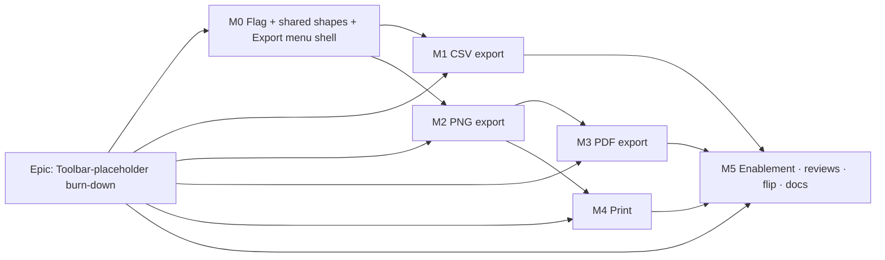

# Implementation Plan: TSLD export & print

- **Feature spec:** `docs/specs/export-print/feature-spec.md`
- **Status:** Draft (awaiting approval). Proposed decisions to confirm: **CQ-1** PNG/PDF export the
  **whole diagram** (bounded raster cap + scale-to-fit); **CQ-2** add **jsPDF, dynamically imported**
  (code-split), pending devops + performance sign-off; **CQ-3** CSV exports **all rows** by default with a
  conditional **Matching activities only (N)** item when a lens narrows; **CQ-4** Print uses the
  **image path** (print-only container + stylesheet), not a CSS print of the live DOM. Single flag flip at
  the enablement milestone, one release.
- **Owner:** TBD

## Breakdown

### Epic

**Toolbar-placeholder burn-down — Stage C1 (export & print)** — wire the `export` and `print` toolbar
placeholders to four client-side outputs (CSV of the schedule, PNG/PDF of the diagram, Browser Print),
frontend-only, behind one flag. Maps to the TSLD canvas-workspace / deliverables roadmap theme. **C2
(XER/MSP interchange, the `share` guest link) is out of scope.**

**Shared flag:** `VITE_EXPORT_PRINT` (`EXPORT_PRINT_ENABLED` in `apps/web/src/config/env.ts`),
**`flagDefaultOff` during build**, flipped to `flagDefaultOn` in M5 after specialist review (the pattern
every prior slice used). **Flag-off = byte-for-byte today's toolbar, canvas paint, and a11y tree** —
`export`/`print` resolve to their `placeholderItem()` stubs; `share` is untouched. M1–M4 each merge
independently behind the shared flag (inert until M5 flips it); M0 lands the flag + shared shapes +
the Export menu shell first.

**Global invariants (every task):** no API/schema/`@repo/types`/CPM-engine change; the
`apps/api/src/modules/schedule/engine/` recalc parity gate stays byte-identical; the **live** canvas is
never repainted for export (off-screen only); pure logic lives in unit-tested modules mirroring
`render/lenses.ts`; no one-off styling; the initial JS bundle does not grow (jsPDF is code-split, M3).

---

### Milestone 0: Flag, shared shapes & Export-menu shell (enabling slice)

**Outcome:** the flag exists, the two placeholder items carry shared shapes, and the `Export ▾`
menu-button renders (with items still stubbed/disabled) so M1–M3 can each drop their item in without
churn. Nothing user-visible changes with the flag off.

#### Feature: `VITE_EXPORT_PRINT` scaffolding + Export menu shell

> **Description:** the flag + `.env.example`/`vite-env.d.ts`; the `exportShape`/`printShape` shared item
> shapes spread into the real + stub branches; the `ExportMenuControl` menu-button skeleton, `hasDiagram`
> gating, and the `download.ts` + `filename.ts` utilities the later slices reuse.
> **Complexity:** S–M
> **Dependencies:** none.
> **Risks:** accidental default-on → `flagDefaultOff` + a flag-off registry snapshot asserting the two ids
> still resolve to `placeholderItem()`.
> **Testing requirements:** unit — flag-off registry snapshot unchanged; env parsing; `slugify`/filename;
> `downloadBlob` (anchor + revoke) via a DOM stub.

##### Task 0.1 — Flag + shared shapes + utils

- **Description:** add `EXPORT_PRINT_ENABLED = flagDefaultOff(import.meta.env.VITE_EXPORT_PRINT)` +
  doc-comment; `.env.example` + `vite-env.d.ts`; extract `exportShape`/`printShape` in
  `tsld-toolbar-items.tsx` and spread into the existing `placeholderItem()` calls; add
  `export/filename.ts` (`slugify`, `buildExportFilename`) + `export/download.ts` (`downloadBlob`).
- **Complexity:** S
- **Dependencies:** none
- **Risks:** none material.
- **Testing:** extend the toolbar test — flag-off, `export`/`print` are placeholders; filename slug unit
  fixtures (unicode, empty, punctuation-only); `downloadBlob` revokes the object URL.
- **Development steps:**
  1. Add the flag + typing + `.env.example`.
  2. Extract the two shared shapes; spread into stubs.
  3. Add `filename.ts` + `download.ts` + tests. Changeset deferred to M5.

##### Task 0.2 — Export-menu shell + context gating

- **Description:** add the `ExportMenuControl` menu-button (mirrors `ColourByControl`) rendering an empty
  menu behind the flag, and the `Print…` item as a disabled-with-reason button; extend `TsldToolbarContext`
  with `hasDiagram`-based gating stubs (`exportScheduleCsv`/`exportDiagramPng`/`exportDiagramPdf`/
  `printDiagram` as no-ops for now, filled by M1–M4).
- **Complexity:** S
- **Dependencies:** Task 0.1
- **Risks:** context memo churn → key on the new values only.
- **Testing:** toolbar predicate — enabled only with a diagram; flag-off placeholder; menu opens by
  keyboard.
- **Development steps:**
  1. `ExportMenuControl` skeleton + `hasDiagram` gate + placeholder fallback.
  2. Context/builder fields (no-op commands) + disabled-reason ("Add an activity first").

---

### Milestone 1: CSV export (shippable slice)

**Outcome:** a viewer can download the plan's activity table as an Excel-safe, injection-safe CSV.

#### Feature: Schedule CSV

> **Description:** the pure `export-csv.ts` (column projection, RFC-4180 quoting, formula-injection guard,
> UTF-8 BOM), the **Schedule (CSV)** menu item + the conditional **Matching activities only (N)** item
> (CQ-3), and the download + announcement.
> **Complexity:** M
> **Dependencies:** M0; `useActivities`/`ActivitySummary`; `lib/format-money`; the Stage-A/B lens
> predicate (for the conditional filtered item).
> **Risks:** (a) CSV injection → single `csvCell` guard, exhaustively unit-tested; (b) column drift from the
> live table → source `SCHEDULE_COLUMNS` once and diff against the table in review; (c) money/permission
> nuance → cost cells blank when the API projected `null` (no client leak).
> **Testing requirements:** unit (column projection, quoting matrix, each injection prefix, BOM presence,
> null→blank, WBS-parent resolution, filtered scope); toolbar predicate (enabled/gated, conditional item
> visible only when a lens narrows); a11y (download announced).

##### Task 1.1 — Pure `export/export-csv.ts`

- **Description:** `SCHEDULE_COLUMNS` (header + cell fn), `csvCell` (neutralise + quote),
  `buildScheduleCsv(activities, { scope, resolveWbsParent })` with a leading BOM.
- **Complexity:** M
- **Dependencies:** M0
- **Risks:** locale/format drift → ISO dates + integer floats, documented; money via `format-money`.
- **Testing:** `export-csv.test.ts` — quoting (comma/quote/newline), injection prefixes (`= + - @` TAB CR),
  BOM, null→blank, boolean Yes/No, full row snapshot.
- **Development steps:**
  1. Declare `SCHEDULE_COLUMNS` matching the activities table (component-review checkpoint).
  2. `csvCell` guard + RFC-4180 quoting; `buildScheduleCsv` + BOM.
  3. Tests.

##### Task 1.2 — CSV menu items + wiring

- **Description:** wire `ctx.exportScheduleCsv(scope)` (build → `downloadBlob` → announce); add the
  **Schedule (CSV)** item and the conditional **Matching activities only (N)** item to `ExportMenuControl`;
  expose `filterActive`/`matchingCount` on the context.
- **Complexity:** S
- **Dependencies:** Task 1.1
- **Risks:** conditional item confusing when no lens active → only render it when `filterActive`.
- **Testing:** context wiring (scope=all vs matching); menu shows the conditional item only under a lens;
  announcement text.
- **Development steps:**
  1. Context command + builder wiring (all vs matching scope).
  2. Menu items + announce; flag-off unchanged.

---

### Milestone 2: PNG export (shippable slice)

**Outcome:** a viewer can download a faithful image of the **whole** diagram (light theme, title, legend).

#### Feature: Diagram PNG (off-screen paint)

> **Description:** the pure `export-image.ts` (full-extent export viewport + raster cap + scale-to-fit),
> the `resolvePrintPalette()` light variant, the thin `render-export-image.ts` (off-screen canvas →
> `paintScene` → title/legend → blob), the **Diagram (PNG)** item + download.
> **Complexity:** M
> **Dependencies:** M0; the render model (`fitToContent`/`activityRect`) + `paintScene` + `resolveTsldPalette`.
> **Risks:** (a) over-cap canvas → hard cap + scale-to-fit, unit-tested at the boundary; (b) live-draw
> regression → paint OFF-screen only, never the live canvas (assert in review + a perf spot-check);
> (c) blank image on `toBlob` null → `toDataURL` fallback.
> **Testing requirements:** unit (export viewport bounds, cap clamp, scale-to-fit flag, dpr cap); component
> (PNG item gating + placeholder fallback); integration (off-screen paint produces a non-empty blob of the
> expected size); a11y (announce).

##### Task 2.1 — Pure `export/export-image.ts` + print palette

- **Description:** `buildExportViewport(activities, dataDate, { maxPx, dpr, padding })` →
  `{ viewport, size, scaledToFit }`; `EXPORT_MAX_PX`/`EXPORT_DPR_CAP`; `resolvePrintPalette()` in
  `render/palette.ts`.
- **Complexity:** M
- **Dependencies:** M0
- **Risks:** geometry drift from the live convention → reuse `fitToContent`/`activityRect` math; unit-test
  the inclusive-finish edge.
- **Testing:** `export-image.test.ts` — bounds cover the extent, cap clamps both axes, `scaledToFit` flag,
  dpr cap; print palette is light-forced + token-derived.
- **Development steps:**
  1. Full-extent bounds at the requested `pxPerDay`; clamp to `maxPx`/`dpr`.
  2. `resolvePrintPalette` (light token values, no hard-codes) + tests.

##### Task 2.2 — Off-screen render + PNG item

- **Description:** `render-export-image.ts` creates the off-screen canvas, calls `paintScene` with the
  print palette, draws the title band + legend, returns `Promise<Blob>` (`toBlob` → `toDataURL` fallback);
  wire `ctx.exportDiagramPng()` (paint → `downloadBlob` → announce); add the **Diagram (PNG)** menu item.
- **Complexity:** M
- **Dependencies:** Task 2.1
- **Risks:** title/legend overlap the diagram → reserve a top band; keep it token-styled.
- **Testing:** integration — blob non-empty + expected dimensions; item gating; fallback path; e2e — pick
  PNG → download event.
- **Development steps:**
  1. Off-screen paint + title/legend + blob (+ fallback).
  2. Context command + menu item + announce; perf spot-check (no live-canvas repaint).

---

### Milestone 3: PDF export (shippable slice)

**Outcome:** a viewer can download a single-page PDF of the diagram; the PDF library is code-split/lazy.

#### Feature: Diagram PDF (lazy jsPDF)

> **Description:** the `pdf.ts` lazy-import shim (embed the M2 PNG on a landscape page), the **Diagram
> (PDF)** item with a first-use loading state, and the load-failure fallback.
> **Complexity:** M
> **Dependencies:** M0, **M2** (reuses the PNG blob); **CQ-2 confirmed + devops/performance sign-off on the
> jsPDF add.**
> **Risks:** (a) bundle bloat → **dynamic `import('jspdf')`** so it never enters the initial chunk (assert
> with a bundle check); (b) library load failure offline → user-safe error + PNG/CSV unaffected; (c) image
> fit/orientation → fit-to-page landscape, unit-tested against known aspect ratios.
> **Testing requirements:** unit (page fit math); component (loading state, failure fallback, item gating);
> bundle assertion (jsPDF absent from the initial chunk); e2e (pick PDF → download).

##### Task 3.1 — Add jsPDF (gated) + `export/pdf.ts`

- **Description:** add the `jspdf` dependency (only after CQ-2 + devops/performance sign-off);
  `exportDiagramPdf(pngBlob, meta)` that `await import('jspdf')`, adds the image fit to a landscape page,
  `save()`.
- **Complexity:** M
- **Dependencies:** M2
- **Risks:** licence/SBOM → MIT; add a Dependabot/SBOM note (devops-reviewer).
- **Testing:** page-fit unit; dynamic-import isolation (bundle check).
- **Development steps:**
  1. Dependency add + changeset note (deferred flip at M5).
  2. `pdf.ts` lazy shim + page fit.

##### Task 3.2 — PDF menu item + loading/failure states

- **Description:** wire `ctx.exportDiagramPdf()` (produce PNG → lazy PDF → save → announce) with
  `pdfExporting` loading state; the **Diagram (PDF)** item shows loading on first use and a user-safe error
  on load failure.
- **Complexity:** S
- **Dependencies:** Task 3.1
- **Risks:** double-click during load → guard with `pdfExporting`.
- **Testing:** loading/disabled during import; failure toast; item gating.
- **Development steps:**
  1. Context command + loading flag.
  2. Menu item + loading/error states + announce.

---

### Milestone 4: Print (shippable slice)

**Outcome:** a viewer can print the whole diagram via the browser print dialog.

#### Feature: Browser Print (image path)

> **Description:** `PrintSurface.tsx` (print-only container + print stylesheet, image + title), the
> `printDiagram()` command (produce PNG → mount → `window.print()` → teardown on `afterprint`), and the
> **Print…** toolbar item; optional app-handled `Ctrl/Cmd+P`.
> **Complexity:** M
> **Dependencies:** M0, **M2** (reuses the whole-diagram image); the app-shell root selector for the
> print stylesheet to hide.
> **Risks:** (a) app-shell prints through → `@media print` hides `#app-shell`, reveals only the print
> container (assert); (b) teardown missed if `afterprint` doesn't fire → fallback timeout teardown;
> (c) live app visually changed after print → container is `@media print`-only (hidden on screen).
> **Testing requirements:** unit/component (mount/teardown lifecycle, `afterprint` + fallback); a11y
> (Print announced; focus returns); manual cross-browser print-preview sweep (documented, like the
> `VITE_TSLD_EDITING` keyboard sweep).

##### Task 4.1 — `PrintSurface` + print stylesheet

- **Description:** the print-only container + `@media print` stylesheet (hide app-shell, show container),
  holding the image + title; mount/teardown helpers.
- **Complexity:** M
- **Dependencies:** M2
- **Risks:** stylesheet specificity → scope to a print root class; tokens only.
- **Testing:** component — mounts image, tears down on `afterprint` and on the fallback timeout.
- **Development steps:**
  1. `PrintSurface` component + co-located print stylesheet.
  2. Mount/teardown lifecycle + `afterprint` + timeout fallback.

##### Task 4.2 — Print item + command

- **Description:** wire `ctx.printDiagram()` (produce PNG → mount `PrintSurface` → `window.print()` →
  announce); swap the `print` placeholder for the real **Print…** button behind the flag; optional
  app-level `Ctrl/Cmd+P` handler routing to it (with native-print suppression documented).
- **Complexity:** S
- **Dependencies:** Task 4.1
- **Risks:** intercepting `Ctrl/Cmd+P` may surprise users → default to the toolbar button only; the
  keyboard handler is a fast-follow if wanted.
- **Testing:** toolbar predicate (gating, flag-off placeholder); command lifecycle; announce.
- **Development steps:**
  1. Context command + real Print item (shared shape) + placeholder fallback.
  2. (Optional) `Ctrl/Cmd+P` route + preventDefault note.

---

### Milestone 5: Enablement (reviews → flip flag → docs)

**Outcome:** the four outputs are on by default, reviewed, documented, and released.

#### Feature: Reviews, flag flip, docs & changeset

> **Description:** run the specialist reviews (including the security + devops/performance gates unique to
> this stage), fold blockers, flip `VITE_EXPORT_PRINT` to `flagDefaultOn`, and complete the Feature
> Completion Criteria.
> **Complexity:** S–M
> **Dependencies:** M1–M4.
> **Risks:** a review blocker (e.g. CSV injection, bundle bloat) forces a change late → keep the flag off
> until green; `main` stays releasable regardless.
> **Testing requirements:** full flag-on unit + e2e/a11y green; bundle check (jsPDF code-split); manual
> cross-browser print sweep documented.

##### Task 5.1 — Specialist reviews

- **Description:**
  - **security-reviewer** — CSV formula-injection guard, filename sanitisation, confirm **no** new
    authz/IDOR surface and no client-side leak of un-permitted (cost) fields.
  - **performance-reviewer** — jsPDF is code-split/lazy (absent from the initial chunk); off-screen paint
    doesn't touch the live canvas; raster cap bounds memory.
  - **devops-reviewer** — the jsPDF dependency (licence/MIT, SBOM, Dependabot), no CI/Docker impact.
  - **component-reviewer** — Export menu / Print item API, shared-shape spread, token/variant usage, no
    one-off styling, the CSV column list vs the live table.
  - **accessibility-reviewer** — keyboard operability of the menu + downloads, announcements, print
    focus return, disabled-with-reason.
  - **ux-reviewer** — menu copy, loading/error states, filename convention, empty/gated coverage.
- **Complexity:** S–M (depends on findings)
- **Dependencies:** M1–M4
- **Testing:** re-run suites after folding blockers.

##### Task 5.2 — Flip flag + docs + changeset

- **Description:** flip `EXPORT_PRINT_ENABLED` to `flagDefaultOn` with the "ON by default" rationale
  doc-comment (mirror the lenses/nav comments); update `docs/TOOLBAR_ROADMAP.md` (close `export`/`print`;
  note `share` + XER/MSP as C2), `docs/ROADMAP.md`, `docs/DECISIONS.md` (export module + print palette +
  jsPDF), the ADR-0031 registry placeholder-enumeration doc-comment in `tsld-toolbar-items.tsx` (remove the
  two now-wired ids); add a **minor `@repo/web` changeset**.
- **Complexity:** S
- **Dependencies:** Task 5.1
- **Testing:** CI green (lint/typecheck/unit/e2e); Docker/web build; bundle check.
- **Development steps:**
  1. Flip the flag default.
  2. Update the docs + doc-comment enumeration.
  3. Changeset; assess SemVer (pre-1.0 minor).

## Sequencing & slices

`main` stays releasable throughout: **M0** lands the flag (default off) + shared shapes + the Export menu
shell; **M1** (CSV, zero-dependency — first, it also proves the `downloadBlob`/announce path); **M2** (PNG,
the off-screen paint the PDF + Print both reuse); **M3** (PDF) depends on M2; **M4** (Print) depends on M2;
**M5** reviews, flips default-on, ships docs + changeset. M1–M4 each merge independently behind the shared
flag (inert until flipped). Each is a thin vertical slice (pure module → thin IO/component → real toolbar
item) testable in isolation via `VITE_EXPORT_PRINT=true` in dev/e2e before the flip.

**Flag-off fallback (explicit):** with `VITE_EXPORT_PRINT=false` — `export` renders the `placeholderItem()`
"Coming soon" stub and `print` renders its `placeholderItem()` stub; `share` is unchanged; no export module
loads, no jsPDF chunk is fetched, the live canvas paints exactly as today, and the a11y tree is unchanged.
Nothing else in the toolbar or canvas differs.

## Definition of Done (per task)

Each task's PR satisfies the Feature Completion Criteria in `docs/PROCESS.md` §21: code, tests (≥ 80% on
changed code — unit for the pure CSV/image/filename modules, component for the menu/print items, e2e/a11y
for the flag-on journey), docs (TOOLBAR_ROADMAP/ROADMAP/DECISIONS + env + registry doc-comment), **security
review (CSV injection + filename + no new authz/IDOR)**, **performance (jsPDF code-split; no live-draw
regression; raster cap)**, accessibility (WCAG 2.2 AA — keyboard downloads + announcements + print focus),
Docker build, CI green, `@repo/web` **minor** changeset at M5, version impact assessed. **No new
architectural ADR** (client render/serialisation on ADR-0026/0031); the export module + print palette
contract and the jsPDF dependency decision are recorded in `docs/DECISIONS.md` (or a short ADR if devops
prefers, given the new runtime dependency).

## Risks & assumptions (rollup)

| Risk / assumption                                                              | Likelihood | Impact | Mitigation                                                                                                    |
| ------------------------------------------------------------------------------ | ---------- | ------ | ------------------------------------------------------------------------------------------------------------- |
| CSV formula injection (a cell runs in Excel/Sheets)                            | med        | high   | `csvCell` neutralises `= + - @` TAB CR before quoting; exhaustive unit fixtures; security-reviewer gate.      |
| jsPDF bloats the initial JS bundle                                             | med        | med    | **Dynamic `import('jspdf')`** (code-split, lazy on first PDF); bundle assertion; performance/devops sign-off. |
| Off-screen export accidentally repaints / regresses the live canvas            | low        | high   | Paint OFF-screen only; never the live canvas; perf spot-check + review assertion.                             |
| Whole-diagram raster exceeds the browser canvas cap → blank image              | med        | high   | Hard `EXPORT_MAX_PX` cap + scale-to-fit; unit-tested at the boundary; title notes "scaled to fit".            |
| Print stylesheet leaks the app-shell into the printout                         | med        | med    | `@media print` hides `#app-shell`, reveals only the print container; manual cross-browser print sweep.        |
| Filename injection / odd characters                                            | low        | med    | `slugify` to `[a-z0-9-]`, length-capped, `plan` fallback; unit-tested.                                        |
| New runtime dependency (jsPDF) — supply-chain / licence                        | low        | med    | MIT; Dependabot + SBOM; devops-reviewer; hand-rolled fallback documented if the dep is refused (CQ-2).        |
| **Assumption:** exporting is not a new data surface (already-authorised reads) | —          | —      | Confirmed: client egress of cached, already-projected data; cost fields already `null` for non-readers.       |
| **Assumption:** whole-diagram (CQ-1) + all-rows CSV (CQ-3) accepted            | med        | low    | Defaults stated; both cheap to change; "Current view" PNG + "matching only" CSV are the alternate paths.      |
