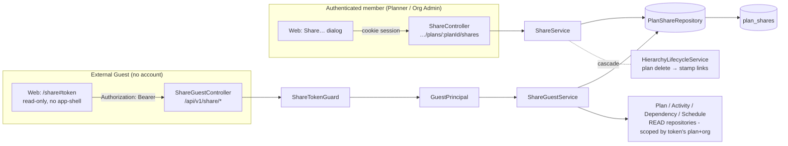
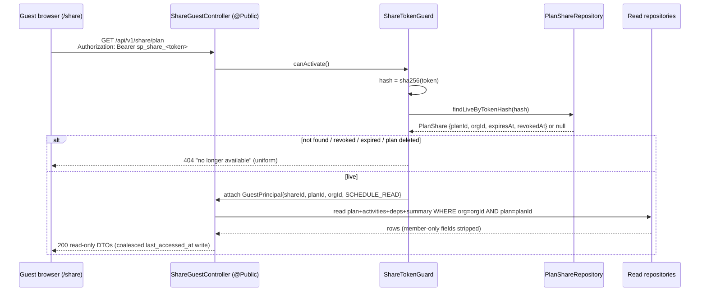
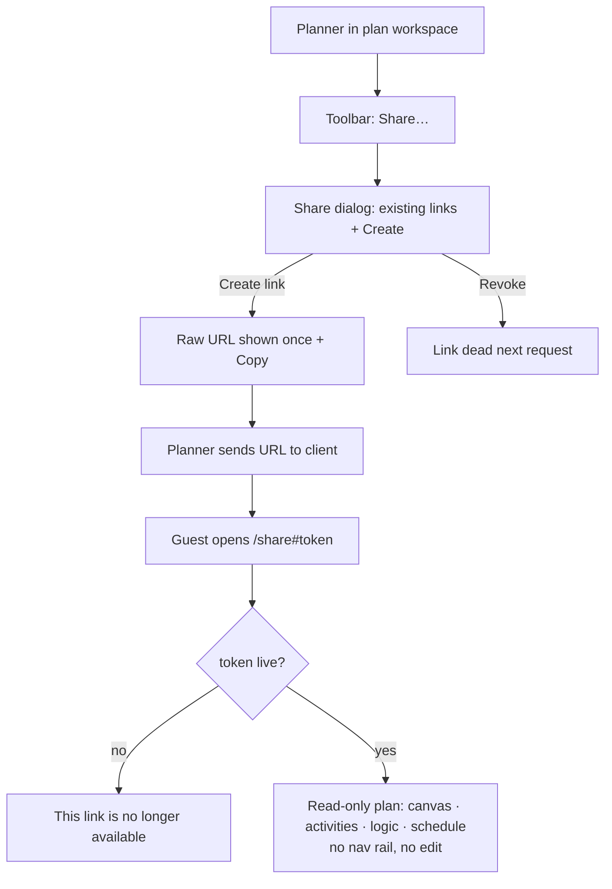

# Feature Spec: External-Guest per-plan share link (Stage F)

- **Status:** Draft — awaiting approval
- **Author(s):** feature-analyst
- **Date:** 2026-07-21
- **Tracking issue / epic:** _tbd_ — Stage F of the staged toolbar programme (A→B→C1→D→E→C2→**F**)
- **Roadmap link:** `docs/PROJECT_BRIEF.md` §5 (External Guest) / §8 "Should have — Sharable read-only plan links"
- **Related ADR(s):** **ADR-0051** (new — the share-link authz model), ADR-0012, ADR-0016, ADR-0003, ADR-0028

> This is the **final** stage of the approved programme that turns the TSLD toolbar's
> "Coming soon" placeholders into real features. Unlike C2 (which extended existing
> interchange work), Stage F is a **genuinely new capability**, so this is a full
> ground-up design that **stops for approval**. No application code is written here.

---

## 1. Business understanding

### Problem

SchedulePoint is multi-tenant: everything is organisation-scoped and every read
endpoint is gated on **org membership + a `*:read` permission**. But construction
scheduling is a team-of-teams activity — a planner routinely needs to show a plan
to someone **outside** the organisation: the client's owner rep for a status
review, a subcontractor who needs to see their sequence. Today the only way to do
that is to make the outsider a full org member (over-privileged, pollutes the
roster, requires them to create an account) or to export a static PDF/CSV (stale,
non-interactive). The brief has always promised a fifth role — **External Guest**,
"a per-plan share link (time-limited, revocable), read-only" (§5) — but it is the
one role never built (ADR-0016 deferred it to "a future ADR"). Stage F builds it.

### Users

| Persona              | Org role                 | Need                                                                                                                                            |
| -------------------- | ------------------------ | ----------------------------------------------------------------------------------------------------------------------------------------------- |
| **Planner**          | `PLANNER`                | Generate a shareable link to one plan; see and revoke the links they created; hand a client a URL that "just works" in a browser.               |
| **Org Admin**        | `ORG_ADMIN`              | Same as Planner, plus governance oversight (sharing is an org-governance act).                                                                  |
| **External Guest**   | _none — outside the org_ | Open the link in any browser, with no account and no login, and see the plan's canvas / activities / logic / schedule, read-only. Nothing else. |
| Contributor / Viewer | `CONTRIBUTOR` / `VIEWER` | **Not** allowed to create share links (sharing org data outward is a governance decision, above a reporter/reader).                             |

### Primary use cases

1. **Create a share link** — a Planner opens a plan and generates a revocable,
   optionally-expiring read-only link; copies the URL to send to a client.
2. **View a shared plan as a guest** — an outsider opens the URL and sees the
   read-only plan (canvas, activities, logic, schedule) with no account.
3. **List & revoke links** — a Planner sees the plan's live links and revokes one;
   the revoked link stops working immediately.

### User journeys

- **Happy path (share → view).** Planner → plan workspace → toolbar **Share…** →
  "Create link" (optionally set an expiry + label) → copies the `…/share#<token>`
  URL → sends it to the client. Client opens it in a browser → a **read-only plan
  view outside the app-shell** (no nav rail, no org switcher, no edit
  affordances) → pans/zooms the TSLD, reads the critical path and dates. See the
  user-flow diagram in §4.
- **Revoke.** Planner → **Share…** → sees the list → **Revoke** on a link → the
  link is dead; the guest's next request returns "This link is no longer
  available".
- **Expiry.** A link created with a 30-day expiry silently stops resolving after
  the TTL; the guest sees the same "no longer available" screen.
- **Deleted plan.** Planner deletes the plan → all its links stop working
  (the plan-cascade soft-delete stamps the links too).

### Expected outcomes

Planners can share a live, interactive, read-only plan with outsiders in seconds,
without granting membership or exporting stale files; org data outside the tenant
boundary is exposed only via a narrow, revocable, auditable, non-indexable grant.

### Success criteria

- A Planner creates a working share link and copies the URL in **< 20s**.
- A guest with the link reaches an interactive read-only plan in **< 1.5s**
  (matching the member plan-open target, brief §14) with **no account**.
- A revoked link returns the "unavailable" screen on the **next** request
  (revocation latency ≤ one request; no cache).
- **Zero** IDOR: a guest holding a link for plan A can reach **no** other plan,
  activity, org, or the roster — proven by e2e + security-review.
- The guest surface exposes **no cost/EV, no notes, no other plan, no user
  identities**.

### Open questions

See **§ Critical questions** at the end (each has a stated default; only the
genuinely blocking ones are surfaced).

## 2. Functional requirements

### User stories & acceptance criteria

> **US-1 — Create a share link.** As a **Planner/Org Admin**, I want to generate a
> read-only link to a plan, so that an outsider can view it without an account.
>
> - **Given** I hold `plan:share` in the plan's org **when** I POST to the plan's
>   shares endpoint **then** a link is created and the **raw token URL is returned
>   once** (never again).
> - **Given** I set an optional `expiresAt`/`label` **then** they are stored and
>   the link honours them.
> - **Given** I am a **Viewer/Contributor** **when** I try to create a link
>   **then** I get **403** (governance act, not a read/report act).
> - **Given** the plan is soft-deleted or not in my org **then** I get **404**
>   (indistinguishable — anti-IDOR).

> **US-2 — View a shared plan as a guest.** As an **External Guest**, I want to
> open the link and read the plan, so that I can review status without a login.
>
> - **Given** a live token **when** I open `…/share#<token>` **then** I see the
>   read-only plan (header, calendar, activities, logic, schedule summary) **and no
>   member chrome** (no nav rail, org switcher, or edit controls).
> - **Given** a revoked / expired / unknown token, or a token whose plan is
>   deleted **then** I see a single "This link is no longer available" screen
>   (backed by a uniform **404**).
> - **Given** I try to reach any other plan/activity/org **then** it is
>   impossible — the guest endpoints accept **only** the token and derive plan+org
>   from it; there is no id to tamper with.
> - **Given** I look for an edit/write control **then** there is none, on the UI or
>   the API (no guest write path exists).

> **US-3 — List & revoke links.** As a **Planner/Org Admin**, I want to see and
> revoke a plan's links, so that I control who still has access.
>
> - **Given** I hold `plan:share` **when** I GET the plan's shares **then** I see
>   the live links' **metadata** (label, created-by, created-at, expiry, last
>   accessed) — **never** a raw token.
> - **Given** I revoke a link **then** `revoked_at` is set and the token stops
>   resolving on the **next** guest request.
> - **Given** the link is already revoked/expired **then** revoke is idempotent
>   (no error, or a friendly 409 — see validation).

### Workflows

- **Create:** resolve org scope from `:orgSlug` + caller memberships (anti-IDOR)
  → assert `plan:share` → load the plan active-in-org → mint token, store hash →
  return raw URL once + row metadata.
- **Guest resolve (every guest request):** read Bearer token → hash → look up
  `PlanShare` by `token_hash` → assert `revoked_at IS NULL AND deleted_at IS NULL
AND (expires_at IS NULL OR expires_at > now)` **and** the plan is active → build
  `GuestPrincipal{shareId, planId, organizationId, scope}` → scoped repository
  read → strip member-only fields → return.
- **Revoke:** resolve org scope → assert `plan:share` → load the share in
  (org, plan) → set `revoked_at`.

### Edge cases

- **Empty:** a plan with no activities → guest sees an empty canvas + "no
  activities yet" (reuse the member empty state, read-only).
- **Max:** a 2,000-activity plan → guest list endpoints are cursor-paginated like
  the member ones; canvas culling applies (ADR-0026).
- **Concurrent:** two Planners create links → both succeed (many links per plan).
  A guest reading while a Planner recalculates → the guest reads committed
  persisted columns (no live lock interaction; guests never take a pen).
- **Boundary — expiry at the instant:** `expires_at == now` → treated as expired
  (strict `>`).
- **Partial:** plan deleted mid-session → the guest's next request 404s and the UI
  shows the "unavailable" screen.
- **Restore:** a deleted-then-restored plan re-activates its links (they were only
  soft-stamped) — acceptable; note in the revoke copy that revoke is permanent
  whereas delete is reversible.

### Permissions (RBAC + scope, ADR-0012)

| Action                             | New permission                                                          | Roles                          | Scope check                                                                              |
| ---------------------------------- | ----------------------------------------------------------------------- | ------------------------------ | ---------------------------------------------------------------------------------------- |
| Create / list / revoke share links | **`plan:share`** (new code)                                             | Planner, Org Admin             | Org resolved from `:orgSlug` + caller membership; plan loaded active-in-org (anti-IDOR). |
| Read a shared plan (guest)         | _none_ — a `GuestPrincipal` from the token, fixed `SCHEDULE_READ` scope | External Guest (no membership) | Plan + org derived **from the token row only**; never from guest input.                  |

`plan:share` is added to `org-permissions.ts` and granted to `PLANNER` +
`ORG_ADMIN` only (a new `SHARE_MANAGE` group), deliberately **not** the
every-member `HIERARCHY_READ`, `PROGRESS_WRITE`, or `NOTE_WRITE` sets — sharing
org data outward is a governance act, like member administration.

### Validation rules

| Field         | Rule                                                                | Shared?                           |
| ------------- | ------------------------------------------------------------------- | --------------------------------- |
| `label`       | optional, 1–120 chars, trimmed                                      | Zod (web) + class-validator (api) |
| `expiresAt`   | optional ISO-8601, must be **in the future** on create              | both                              |
| token         | server-minted 256-bit `sp_share_<base64url>`; never client-supplied | api                               |
| Bearer header | `Authorization: Bearer sp_share_<token>`; malformed → 404           | api                               |

### Error scenarios

| Scenario                                                  | Detection                     | User-facing result                 | Status            |
| --------------------------------------------------------- | ----------------------------- | ---------------------------------- | ----------------- |
| Viewer/Contributor creates a link                         | `plan:share` check in service | friendly forbidden                 | **403**           |
| Plan not in caller's org / soft-deleted                   | scoped load                   | "Plan not found"                   | **404**           |
| `expiresAt` in the past                                   | DTO validation                | inline form error                  | **422**           |
| Guest token unknown / revoked / expired / plan deleted    | `ShareTokenGuard`             | "This link is no longer available" | **404** (uniform) |
| Guest attempts a write (any method ≠ GET on guest routes) | route/guard                   | method not allowed                 | **404/405**       |
| Guest endpoint hit too often (scrape/spray)               | rate-limiter                  | throttled                          | **429**           |
| Revoke an already-revoked link                            | service                       | idempotent success or friendly 409 | **200/409**       |

## 3. Technical analysis

| Area           | Impact             | Notes                                                                                                                                                                                                                                                       |
| -------------- | ------------------ | ----------------------------------------------------------------------------------------------------------------------------------------------------------------------------------------------------------------------------------------------------------- |
| Frontend       | **med**            | New **public** route `/share` (outside `_authed` shell) rendering a read-only plan view; a **Share…** dialog wired to the existing toolbar placeholder (`id: 'share'`). Reuses the TSLD canvas read path. Behind `VITE_GUEST_SHARE_LINKS`.                  |
| Backend        | **med**            | New `share` module (controller/service/repository/DTOs from the reference template): member management endpoints + session-less guest read endpoints. New `GuestPrincipal` + `ShareTokenGuard` in `common/auth`.                                            |
| Database       | **low-med**        | One new table `plan_shares` (+ indexes) and a raw-SQL partial unique/index migration per house standards; cascade wired into `HierarchyLifecycleService`.                                                                                                   |
| API            | **med**            | New authenticated routes under `…/plans/:planId/shares`; new `@Public()` guest routes under `/api/v1/share/*` (Bearer-token). OpenAPI + `docs/API.md` updated.                                                                                              |
| Security       | **HIGH**           | The app's **first unauthenticated data-read surface**. Token entropy+hashing, no membership escalation, no write path, anti-IDOR, referrer/log leak mitigation, rate-limiting, revocation latency, deleted-plan interaction. **Mandatory security-review.** |
| Performance    | **low-med**        | Guest reads reuse indexed, paginated member repository reads. `last_accessed_at` is a coalesced write. Token lookup is a single indexed `token_hash` hit.                                                                                                   |
| Infrastructure | **new dependency** | Introduces **rate-limiting** for `/api/v1/share/*` (`@nestjs/throttler` and/or nginx `limit_req`) — the first such need. Response headers (`X-Robots-Tag`, `Referrer-Policy`) on the guest surface.                                                         |
| Observability  | **low**            | Structured guest-access logs (shareId/planId/org/IP); create/revoke audit logs (the invitations precedent).                                                                                                                                                 |
| Testing        | **high**           | Unit (token, guard resolution, scope stripping), API/e2e (Supertest: create/list/revoke + guest resolve + **IDOR negatives**), web e2e + a11y for the public guest view.                                                                                    |

### Dependencies

- **Prerequisite:** ADR-0051 accepted (the authz model). Reuse of the invitation
  token helper (extract to `common/tokens/`). Plan read services/repositories,
  schedule summary read, calendar read (all exist).
- **New:** a rate-limiter (infra). No third parties.
- **Must land first:** F-M1 (schema + guard seam) before F-M2/M3; F-M4 (web) last,
  behind a default-off flag.

## 4. Solution design

### Architecture overview

Two distinct surfaces share one module. The **management** surface is an ordinary
authenticated, org-scoped feature (reference template). The **guest** surface is a
session-less, token-bearing read path with its own guard and identity.

### Data flow — guest resolve (the crux)

### User flow

### Database changes

New model `PlanShare` (see ADR-0051 §1 for the column list). House standards:
UUID v7 PK, snake_case `@map`, timestamptz(3) UTC, soft delete + audit +
`version`. FK `plan_id → plans.id` `ON DELETE RESTRICT` (never hard-delete);
denormalised `organization_id` copied from the plan by the service inside the
create transaction (never client input). Indexes: `@@unique(token_hash)`; a
**partial** `(plan_id) WHERE deleted_at IS NULL` and `(organization_id)` added as
raw SQL in the migration (Prisma can't express partial indexes — the org/invite
precedent). Wire `plan_shares` into `HierarchyLifecycleService.cascadeSoftDelete`
for `'plan'` so a deleted plan stamps its links in the same batch. **Design with
the database-architect agent before writing the migration.**

### API changes

**Management (authenticated, cookie session, org-scoped):**

- `POST   /api/v1/organizations/:orgSlug/plans/:planId/shares` → `201` `{ data:
{ id, label, expiresAt, createdAt, url } }` — `url` (raw token) returned **once**.
  `@RequirePermissions('plan:share')`.
- `GET    …/plans/:planId/shares` → `200` cursor-paginated link **metadata**
  (no token). `@RequirePermissions('plan:share')`.
- `DELETE …/plans/:planId/shares/:shareId` → `204` (revoke = soft).
  `@RequirePermissions('plan:share')`.

**Guest (session-less, `@Public()` + `ShareTokenGuard`, Bearer token in header):**

- `GET /api/v1/share/plan` → plan header + calendar + schedule summary.
- `GET /api/v1/share/activities` → cursor-paginated activities (progress incl.).
- `GET /api/v1/share/dependencies` → dependencies.
- `GET /api/v1/share/schedule/summary` → computed summary.

All guest responses use the standard `{ data, meta }` / `{ error }` envelopes,
carry `X-Robots-Tag: noindex` + `Referrer-Policy: no-referrer`, and are
rate-limited. No `:planId` in guest paths — the token is the only input.
(Alternative single-endpoint `GET /api/v1/share/bootstrap` returning the whole
read model is a viable simplification — see critical questions.)

### Component changes

- **`ShareLinksDialog`** (`features/share/`) — opened by the existing toolbar
  `share` item (mirrors the export/lenses "real item when flag on, placeholder
  when off" pattern): lists live links (label, created, expiry, last accessed,
  Revoke) and a Create form (optional label + expiry) that surfaces the one-time
  URL with a **Copy** button. Reuses `Dialog`, `Button`, `Menu`, form primitives
  (RHF + Zod) — no one-off styling.
- **Public `/share` route** (`routes/share.tsx`) — **outside** the `_authed`
  shell: no nav rail, no org switcher, no edit affordances. Reads the token from
  `window.location.hash`, calls the guest API with the Bearer header, and renders
  the **read-only** TSLD canvas + a slim read-only header. Reuses the existing
  canvas read path (`TsldPanel`/`TsldCanvas`) with `canEdit={false}` and no
  toolbar authoring groups. States: loading, "unavailable" (404), empty plan,
  loaded. Must meet WCAG 2.2 AA (accessibility-reviewer).
- **Flag** `VITE_GUEST_SHARE_LINKS` (default **off** during build, flips on after
  the specialist reviews are green — the programme's established pattern).

### Implementation approach & alternatives

Chosen: a **separate `GuestPrincipal` + `ShareTokenGuard`**, guest reads reusing
the existing **repositories** scoped by the token's own plan+org, token in the URL
**fragment** delivered as a **Bearer** header, hashed-at-rest 256-bit tokens,
DB-row grant for revocability. Alternatives (synthesised Principal; path-token;
guest session cookie; stateless JWT; per-link scope column) are weighed and
rejected in **ADR-0051 § Alternatives**. This is architecturally significant (a
new authz path + the first unauthenticated data read) → **ADR-0051** captures it.

## 5. Links

- ADR: `docs/adr/0051-external-guest-share-links.md`
- Implementation plan: `docs/specs/external-guest-share-link/implementation-plan.md`
- Docs to update on build: `docs/API.md`, `docs/SECURITY_STANDARDS.md`,
  `docs/adr/0016-*` (cross-reference the now-built guest model), `CLAUDE.md` §16
  (add ADR-0051), the toolbar roadmap, `.env.example` (`VITE_GUEST_SHARE_LINKS`).

---

## Critical questions (defaults stated; only the blocking ones)

1. **Token delivery — fragment+Bearer (recommended) vs path token?**
   _Default:_ **URL fragment + `Authorization: Bearer`** (referrer- and
   log-safe; ADR-0051 §2). Path-based is simpler but leaks the token to referrers
   and access logs — override only if the extra simplicity is worth the leak.
2. **Does a guest see progress (status / % / actual dates)?**
   _Default:_ **Yes** — the "client status review" journey (brief §10.3) is the
   point of the share. (Cost/EV and notes remain excluded regardless.)
3. **Are baselines/variance and resources visible to a guest in v1?**
   _Default:_ **No** — v1 ships the core schedule read scope only; both are
   candidate future opt-in scopes via the reserved `scope`.
4. **Optional expiry — is a maximum/default TTL enforced?**
   _Default:_ **No forced expiry** (optional, planner's choice), since revocation
   is the primary control. Revisit if security wants a hard cap (e.g. 1 year).
5. **Guest API shape — per-resource endpoints vs one `bootstrap` payload?**
   _Default:_ **per-resource, paginated** (mirrors the member endpoints, reuses
   their reads); a single `bootstrap` is an acceptable perf simplification if the
   frontend prefers one round-trip.
6. **Does revoking an already-revoked link error?**
   _Default:_ **idempotent success (204)** — revoke is a safety action; a 409 is
   acceptable if we prefer to signal "already revoked".

**Awaiting approval before implementation.**
