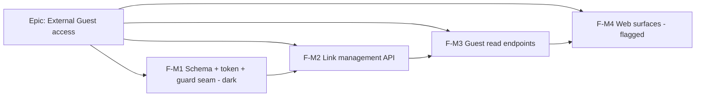

# Implementation Plan: External-Guest per-plan share link (Stage F)

- **Feature spec:** `docs/specs/external-guest-share-link/feature-spec.md`
- **ADR:** `docs/adr/0051-external-guest-share-links.md` (must be Accepted before F-M1 merges)
- **Status:** Draft — awaiting approval
- **Owner:** _tbd_

## Breakdown

### Epic

**External Guest access** — deliver the fifth product role (brief §5): a
revocable, read-only, per-plan share link for someone outside the organisation.
Maps to the roadmap "Should have — sharable read-only plan links" and closes the
last "Coming soon" toolbar placeholder (`share`).

---

### Milestone F-M1: schema + token model + guard seam (dark)

**Outcome:** the data model, token helper, `GuestPrincipal`/`ShareTokenGuard`, and
plan-cascade all exist and are unit-tested, but nothing is wired to a route yet —
`main` stays releasable and behaviour-unchanged.

#### Feature: PlanShare model, token helper & the guest-auth seam

> **Description:** the `plan_shares` table + migration, a shared hashed-token
> helper, and the parallel guest identity/guard — no endpoints.
> **Complexity:** M
> **Dependencies:** ADR-0051 accepted.
> **Risks:** schema drift from house standards → mitigate with **database-architect**
> review before the migration; a subtly-wrong resolve predicate → mitigate with the
> guard's unit tests covering every dead-token case.
> **Testing:** unit for the token helper (mint/hash), the guard resolution matrix
> (live / revoked / expired / deleted-plan / unknown → all 404), and the cascade.

##### Task 1 — `plan_shares` schema + migration

- **Description:** add the `PlanShare` Prisma model (ADR-0051 §1) + raw-SQL
  migration (unique `token_hash`; partial `(plan_id) WHERE deleted_at IS NULL`;
  `(organization_id)`). Wire the `Organization`/`Plan` back-relations.
- **Complexity:** S · **Dependencies:** — · **Agent:** database-architect
- **Risks:** partial-index SQL correctness → copy the org/invitation precedent.
- **Testing:** migration applies clean; a repository smoke test.
- **Development steps:** 1) model + `@map`s; 2) raw-SQL indexes; 3) `PlanShareRepository`
  (create / findLiveByTokenHash / listActiveByPlan / setRevoked); 4) update `docs/DATABASE.md` + changeset.

##### Task 2 — shared hashed-token helper

- **Description:** extract the invitation token util to `common/tokens/` (mint
  256-bit `sp_share_` token + SHA-256 hash), reuse in both features.
- **Complexity:** S · **Dependencies:** Task 1 · **Risks:** refactor touches
  invitations → keep behaviour identical, cover with the existing invitation tests.
- **Testing:** unit (entropy length, hash determinism, prefix).

##### Task 3 — `GuestPrincipal` + `ShareTokenGuard` (dark)

- **Description:** add `GuestPrincipal` (structurally distinct from `Principal`)
  and `ShareTokenGuard` that resolves a Bearer token → live `PlanShare` → guest
  principal, else 404. Not attached to any route yet.
- **Complexity:** M · **Dependencies:** Tasks 1–2 · **Agent:** security-reviewer
- **Risks:** the guard must re-check the **plan is active**, not just the row →
  explicit test.
- **Testing:** guard unit matrix (all dead-token cases → 404; live → principal).

##### Task 4 — plan-cascade wiring

- **Description:** extend `HierarchyLifecycleService.cascadeSoftDelete('plan', …)`
  to stamp `plan_shares.deleted_at` in the same batch (and restore symmetry).
- **Complexity:** S · **Dependencies:** Task 1
- **Testing:** unit — delete plan stamps its links; restore un-stamps them.

---

### Milestone F-M2: link management API (create / list / revoke)

**Outcome:** a Planner/Org Admin can create, list, and revoke share links via the
API (org-scoped, deny-by-default). Guest reads not yet live.

#### Feature: `share` module — management endpoints + `plan:share`

> **Description:** the authenticated management surface, built from the reference
> template (controller→service→repository, DTOs, standard envelopes).
> **Complexity:** M
> **Dependencies:** F-M1.
> **Risks:** the raw token could leak into logs/list responses → return it **once**
> on create only, never in list; assert with a test. Wrong role granted → matrix test.
> **Testing:** Supertest e2e (create returns URL once; list has no token; revoke →
> row `revoked_at`; Viewer/Contributor → 403; foreign/deleted plan → 404) + service unit.
> **Agents:** api-reviewer, security-reviewer, test-engineer.

##### Task 1 — `plan:share` permission

- **Description:** add `'plan:share'` to `OrgPermission`, a `SHARE_MANAGE` group,
  granted to `PLANNER` + `ORG_ADMIN` only; update `org-permissions.spec.ts`.
- **Complexity:** S · **Testing:** permission-matrix unit.

##### Task 2 — ShareService + ShareController (create/list/revoke)

- **Description:** service resolves org scope + asserts `plan:share` + loads plan
  active-in-org (anti-IDOR), mints/stores the token, returns the one-time URL;
  list returns metadata only; revoke sets `revoked_at`. Controller from the
  reference template with `@RequirePermissions('plan:share')` + DTOs.
- **Complexity:** M · **Dependencies:** Task 1 · **Testing:** e2e + unit (above).
- **Development steps:** 1) DTOs (create/response/list-query); 2) service; 3) controller; 4) module wiring; 5) OpenAPI + `docs/API.md`; 6) changeset.

---

### Milestone F-M3: guest read endpoints (session-less, scoped)

**Outcome:** an outsider with a live token can read exactly their one plan via the
API — no account, no other plan reachable.

#### Feature: `ShareGuestController` + `ShareGuestService`

> **Description:** `@Public()` guest routes under `/api/v1/share/*`, guarded by
> `ShareTokenGuard`, reading the token's plan via existing repositories scoped by
> the token's org+plan, with member-only fields stripped and rate-limiting applied.
> **Complexity:** L
> **Dependencies:** F-M1, F-M2.
> **Risks (highest in the feature):** IDOR / over-exposure → guest reads take
> **only** the token, derive plan+org from it, and go through dedicated read DTOs
> that omit cost/EV/notes/audit/user-identity; **security-review is mandatory and
> blocking**. Unauthenticated abuse → add the rate-limiter. A slow guest read →
> reuse indexed, paginated member reads; `last_accessed_at` coalesced.
> **Testing:** Supertest e2e — live token reads plan/activities/deps/summary; the
> **IDOR negatives** (a token for plan A returns nothing of plan B; no id to
> tamper with); revoked/expired/deleted-plan → 404; any write verb → 404/405;
> response carries no cost/EV/notes/audit fields; `noindex` + `no-referrer`
> headers present.
> **Agents:** **security-reviewer (crux)**, backend-performance-reviewer, api-reviewer, test-engineer.

##### Task 1 — guest read DTOs (field-stripped)

- **Description:** read-only DTOs for plan/activity/dependency/summary that expose
  **only** the guest scope (ADR-0051 §4) — no cost, EV, notes, audit, user ids.
- **Complexity:** M · **Testing:** DTO-shape unit asserts excluded fields absent.

##### Task 2 — ShareGuestService + controller (@Public + ShareTokenGuard)

- **Description:** service reads via existing repositories scoped by the
  `GuestPrincipal`'s org+plan; controller exposes the GET routes, sets the
  security headers, does the coalesced `last_accessed_at` write.
- **Complexity:** L · **Dependencies:** Task 1 · **Testing:** e2e (above).

##### Task 3 — rate-limiting the guest surface

- **Description:** add `@nestjs/throttler` (and/or document an nginx `limit_req`
  zone) on `/api/v1/share/*`; 429 on abuse.
- **Complexity:** M · **Agents:** security-reviewer, devops-reviewer
- **Risks:** first throttler in the app → keep it scoped to the guest routes so it
  can't affect member traffic; document config.
- **Testing:** e2e — burst → 429; normal → 200.

---

### Milestone F-M4: web surfaces (flagged `VITE_GUEST_SHARE_LINKS`, default off)

**Outcome:** the member **Share…** dialog and the public read-only guest view ship
behind a default-off flag; flip on once the specialist reviews are green (the
programme's established enablement pattern).

#### Feature: member Share dialog + public guest view

> **Description:** wire the toolbar `share` placeholder to a `ShareLinksDialog`
> (create/list/revoke, copy URL) and add a public `/share` route rendering the
> read-only plan **outside** the app-shell.
> **Complexity:** L
> **Dependencies:** F-M2 (dialog), F-M3 (guest view).
> **Risks:** the public route accidentally pulling in `_authed` chrome or a session
> query → build it as a sibling of the shell, no auth loader; a11y of a
> canvas-heavy read view → accessibility-review + the parallel focusable DOM layer
> (ADR-0026). Token in `location.hash` must not be logged by client telemetry →
> assert.
> **Testing:** web unit (dialog states, copy, revoke), Playwright journey
> (create → open guest URL → read-only → revoke → unavailable), a11y checks on the
> guest view.
> **Agents:** component-reviewer, ux-reviewer, accessibility-reviewer, performance-reviewer.

##### Task 1 — `ShareLinksDialog` + toolbar wiring

- **Description:** real `share` toolbar item when `VITE_GUEST_SHARE_LINKS` on
  (placeholder when off, byte-for-byte); dialog lists links + create form (label,
  optional expiry) + one-time URL with Copy; RHF + Zod; gated on the caller
  holding `plan:share`.
- **Complexity:** M · **Dependencies:** F-M2 · **Testing:** unit + a11y.

##### Task 2 — public `/share` read-only plan view

- **Description:** `routes/share.tsx` outside `_authed`; reads token from
  `location.hash`, calls guest API with Bearer header; renders read-only
  `TsldPanel` (`canEdit=false`, no authoring toolbar groups) + slim header +
  loading / "unavailable" / empty / loaded states; `noindex` meta.
- **Complexity:** L · **Dependencies:** F-M3 · **Testing:** Playwright + a11y.

##### Task 3 — flag, docs & enablement

- **Description:** add `VITE_GUEST_SHARE_LINKS` (default off) to `config/env.ts` +
  `.env.example`; update `CLAUDE.md` §16 (ADR-0051), `docs/API.md`,
  `docs/SECURITY_STANDARDS.md`, the toolbar roadmap; changeset. Flip on after the
  five reviews are green.
- **Complexity:** S

## Sequencing & slices

F-M1 (dark) → F-M2 (API create/list/revoke usable) → F-M3 (guest read path usable
via API) → F-M4 (UI behind a default-off flag). Each milestone keeps `main`
releasable: M1 changes no behaviour, M2/M3 add deny-by-default endpoints, M4 is
flag-gated. Security-review gates M3 (and the whole authz model); the web flag
flips only after component/ux/a11y/performance reviews + the Playwright journey
are green.

## Definition of Done (per task)

Each task's PR meets the Feature Completion Criteria in `docs/PROCESS.md` (code,
tests ≥ 80% on changed code, docs, **security review** — mandatory and blocking
for M3, performance, accessibility for M4, Docker build, CI green, changeset,
version impact).

## Risks & assumptions (rollup)

| Risk / assumption                                     | Likelihood | Impact   | Mitigation                                                                                                                |
| ----------------------------------------------------- | ---------- | -------- | ------------------------------------------------------------------------------------------------------------------------- |
| IDOR / over-exposure via the guest path               | med        | **high** | Token-only input; plan+org derived from the token row; field-stripped DTOs; blocking security-review; IDOR e2e negatives. |
| Share URL leaks (referrer / logs / history)           | med        | med      | Token in fragment + Bearer header; `no-referrer` + `noindex`; cheap revocation + optional expiry.                         |
| Unauthenticated endpoint abuse (scrape / spray / DoS) | med        | med      | 256-bit tokens; uniform 404; per-IP rate-limit (new infra); paginated reads.                                              |
| First throttler destabilises member traffic           | low        | med      | Scope the throttler to `/api/v1/share/*` only; devops-review.                                                             |
| Revocation not immediate                              | low        | high     | No token cache in v1; guard resolves live on every request.                                                               |
| Deleted plan's links keep working                     | low        | high     | Cascade stamps links + guard re-checks the live plan.                                                                     |
| Guest view drags in app-shell/auth                    | low        | med      | Build `/share` as a sibling of `_authed`, no auth loader; Playwright asserts no member chrome.                            |
