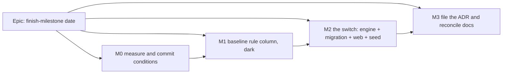

# Implementation Plan: A finish milestone is dated by the day it closes

- **Feature spec:** [`./spec.md`](./spec.md)
- **Status:** Approved 2026-09-23 — M1 and M0-T3 withdrawn; see `conditions.md`
- **Owner:** product owner (approval); build by Claude Code

## Breakdown

### Epic

**Finish-milestone date** — a finish milestone reads the day its predecessor finishes, a placement
on that day is not a conflict, and the seed needs no workaround. Closes `docs/TECH_DEBT.md` #381.

## Sequencing & slices

- **M0** changes no product behaviour. It commits the conditions, measures the population, and adds
  one staff diagnostic so the deployed counts can be read without a shell.
- **M1** ships the baseline rule column one release **before** the switch, with every capture writing
  the old rule. Readers learn to read a date under its rule, which is inert while both sides share
  one rule. This keeps the schema half and the behaviour half able to fail separately (ADR-0107).
- **M2** is the switch, and it is one API release plus one web release from the same Release run.
  The placement migration runs on API container start (ADR-0018), so the engine rule and the
  re-encoded placements arrive together. The web helpers must ship in the same run: a web image a
  release behind draws finish milestones one day left for as long as the images disagree
  (ADR-0047 recreates them independently). Stated risk, not avoidable.
- **M3** files the ADR and brings the documents into line.
- **No `VITE_` flag** (ADR-0088 D1). The rollback is a reverse migration plus the previous images,
  not a redeploy alone (see M2 risks).

---

### Milestone M0: Measure and commit the conditions

**Outcome:** the numbers that decide Q1–Q4 exist, and the falsification conditions are committed
before any engine change runs.
**Entry point:** staff console → **Diagnostics** → the new finish-milestone entry (ADR-0140).
**Journey:** `apps/web/e2e-staff/` gains a case pressing the new diagnostic and reading its counts.

#### Feature: Conditions and measurement

> **Description:** commit spec §5 as `conditions.md`, then measure.
> **Complexity:** M
> **Dependencies:** approval of the spec
> **Risks:** measuring with a copy of the rule rather than the rule → the harness imports the real
> engine and the real helpers.
> **Testing requirements:** the harness's own control (below) must fire when pointed at an
> unchanged engine.

##### Task M0-T1 — Commit `conditions.md` alone

- **Description:** transcribe spec §5 (FC-1…FC-9 and the predictions) into
  `docs/specs/finish-milestone-date/conditions.md`, in its own commit, before anything else.
- **Complexity:** S
- **Testing:** none (a document).

##### Task M0-T2 — Catalogue harness

- **Description:** a script that builds engine input from every seed-catalogue `SeedSpec` (never from
  persisted rows, ADR-0066), runs `computeSchedule` on the current engine and on a scratch branch of
  the rule, and prints per plan: finish-milestone rows whose dates change, any other row whose
  output changes (must be zero, FC-5), the project finish before/after, violation and negative-float
  counts, and cross-plan edges whose upstream is a finish milestone (Q4).
- **Complexity:** M
- **Dependencies:** M0-T1
- **Risks:** a harness that reports "no change" because it compared a plan with itself → control:
  the NetPoint plan must show GCO `2031-03-01 → 2031-02-28`, or the harness refuses to judge.
- **Testing:** run once against the unchanged engine (every diff empty) and once against the scratch
  rule (the NetPoint control fires).
- **Development steps:**
  1. Build inputs from `SeedSpec`s, reusing the seed pairwise builder.
  2. Run both engines; diff results keyed by activity id.
  3. Write `m0-measurement.md` with the table and each prediction marked held or broken.

##### Task M0-T3 — Staff diagnostic for the deployed host

- **Description:** one registry entry in the ADR-0140 diagnostics registry. It takes no input and
  returns counts only: finish milestones examined; with a placement; with a constraint or external
  date; baselines holding finish-milestone rows; cross-plan edges with a finish-milestone upstream.
- **Complexity:** S
- **Dependencies:** none
- **Risks:** widening the diagnostic return type → the ADR-0140 gate refuses it; keep the uniform
  shape (one or several entries, not a new field).
- **Testing:** API e2e (counts on a seeded fixture); the ADR-0140 boundary gate passes unedited;
  `e2e-staff` case.
- **Development steps:**
  1. Add the entry and its SQL.
  2. E2e with a plan holding one placed and one constrained finish milestone.
  3. Product owner presses it on the deployed host; record the numbers in `m0-measurement.md`.

**Stop rule:** if FC-5 finds any non-finish-milestone row changing, or the torture plan's violation
count moves, stop and report to the product owner before M1.

---

### Milestone M1: Baseline rule column (dark)

**Outcome:** every baseline records which milestone date rule it was captured under; every reader
knows how to read a date under its rule. No visible change.
**Entry point:** `Ships dark: every baseline is still captured under the old rule, so the readers'
new branch cannot be reached until M2 flips the capture.`
**Journey:** none (dark). M2's journey covers it.

#### Feature: Rule column and rule-aware readers

> **Description:** the capture-level column, and one shared read function.
> **Complexity:** M
> **Dependencies:** M0
> **Risks:** a reader missed → a census test lists every baseline date reader and fails on an
> unlisted one.
> **Testing requirements:** migration test on a populated database; unit tests of the read
> function; census test.

##### Task M1-T1 — Column design (database-architect)

- **Description:** the database-architect agent designs the `baselines` column (name, type, default,
  constraint) and answers the plan-standing question (spec §4, database item 3). **No migration is
  hand-written.** If the agent returns nothing, re-run it (§19.3).
- **Complexity:** S
- **Testing:** the architect's migration test: applied to a database holding existing baselines,
  every row reads the old rule.

##### Task M1-T2 — Capture writes the old rule explicitly

- **Description:** `baselines.service` capture path sets the column to the old rule explicitly (not
  via the default), so M2 changes one constant.
- **Complexity:** S
- **Testing:** API e2e: a fresh capture reads the old rule.

##### Task M1-T3 — One rule-aware read function

- **Description:** `readMilestoneDate(date, type, rule)` → an instant-like position (old rule: start
  of that day; new rule: end of that day), and movement measured in working time on the plan
  calendar as ADR-0125 does. Used by the revision projections, variance, completion carrier,
  revision ghosts, plan standing, health metrics 11/13/14 and Earned Value's baseline PV.
- **Complexity:** M
- **Dependencies:** M1-T1
- **Risks:** a comparison across rules reads as movement → unit cases for both rules, whole-day and
  mid-day, on a 24-hour and a Monday–Friday calendar.
- **Testing:** units; a census test that every module selecting `baseline_finish`, `baseline_start`,
  `late_*`, `placed_*`, `visual_start` or `captured_project_finish` calls it (pinned positive case).
- **Development steps:**
  1. Write the function beside `revision-projections.ts`.
  2. Route each reader through it.
  3. Expose the rule on the baseline DTOs; update OpenAPI and `docs/API.md`.
  4. Changeset (api, patch).

---

### Milestone M2: The switch

**Outcome:** finish milestones read the day their predecessor finishes; dragging one onto that day
is not a conflict; the status bar Finish matches P6 and NetPoint; the seed has no workaround.
**Entry point:** the plan workspace canvas — any finish milestone's label, the status bar **Finish**
fact, and dragging a diamond in the diagram.
**Journey:** `apps/web/e2e-workspace-chrome/placement.spec.ts` (the existing drag journey, which
already runs in the placed-plan world) gains a case: seed a task and a finish milestone after it,
drag the diamond onto the task's end, assert through the API that `visualConflict` is false and the
milestone's dates equal the task's last day, and assert the status bar Finish reads that day. No new
Playwright config.

#### Feature: Engine rule

> **Description:** R1/R2/R3 in the engine.
> **Complexity:** M
> **Dependencies:** M1 released
> **Risks:** the change leaks into non-milestone rows → FC-5 harness re-run on the real change;
> `goldens.spec.ts` and `compute.spec.ts` unedited (FC-4).
> **Testing requirements:** engine units, conformance suites, API e2e.

##### Task M2-T1 — Two helpers in `engine/instants.ts`

- **Description:** `finishMilestoneInstant(cal, dataDateAbs, date)` =
  `rollForwardToWorking(rollBackwardToWorking(end of date))`; and the projection index
  `max(ownOffset − 1, 0)`. One definition each.
- **Complexity:** S
- **Testing:** units on a 24-hour calendar, a Monday–Friday calendar, a non-working date, and a
  sub-day shift.

##### Task M2-T2 — Use them

- **Description:** `compute.ts` projection (`:753-755`, `:798-799`, `:922-927`) and placement parse
  (`:336-339`); `constraints.ts` `resolvePair` (`:103-121`) and both external clamps (`:221-265`),
  keyed on `type === 'FINISH_MILESTONE'` (so `resolvePair` gains the type).
- **Complexity:** M
- **Dependencies:** M2-T1
- **Risks:** a floor applied to the wrong axis → FC-7 unit case at the data date.
- **Testing:**
  - New `compute.finish-milestone.spec.ts`: FC-1, FC-7, FC-9; `LATER_THAN_BOUND` not firing with
    `FNLT` on the placement day; Mon–Fri reads Friday; completed milestone unchanged; start
    milestone unchanged; zero-duration task unchanged.
  - Re-characterise `compute.zero-task.spec.ts:62-63` with a comment citing the ADR (the only
    engine test expected to change).
  - FC-4: goldens and `compute.spec.ts` untouched.
  - Re-run the M0 harness against the real change (FC-5).

#### Feature: Placement migration and capture switch

> **Description:** re-encode stored placements (Q1 A) and flip the capture rule.
> **Complexity:** M
> **Dependencies:** M2 engine rule, database-architect design
> **Risks:** rollback → after this migration, the previous API image reads re-encoded placements
> one day early. The rollback is a reverse migration (possible because rewritten rows are recorded)
> shipped with the previous engine, not a bare redeploy. Written into `docs/DEPLOYMENT.md`.
> **Testing requirements:** FC-6 on a populated database, verified red by skipping the migration.

##### Task M2-T3 — Migration (database-architect)

- **Description:** the architect designs and writes the data migration: finish milestones with a
  non-null `visual_start` move one day earlier, recorded (ADR-0148's `placement_migrations` pattern
  or the architect's choice), `version` bumped. Nothing else is rewritten; baselines are never
  touched.
- **Complexity:** M
- **Testing:** API e2e: seed placed finish milestones on a 24-hour and a Mon–Fri calendar, compute,
  migrate, compute, compare every Pass 2 instant (FC-6).

##### Task M2-T4 — Capture writes the new rule

- **Description:** change M1-T2's constant.
- **Complexity:** S
- **Testing:** API e2e: capture before and after in one plan, compare with no false movement (Q3 A).

#### Feature: Web position helpers

> **Description:** one pair of helpers for date ↔ diamond position, used everywhere.
> **Complexity:** M
> **Dependencies:** M2 engine rule (same release run)
> **Risks:** a geometry site missed → structural gate over `isMilestone(` branches and `visualStart`
> writes, with a pinned positive case.
> **Testing requirements:** units per site; paint golden log (FC-8); the journey.

##### Task M2-T5 — Helpers and census

- **Description:** add `pointDayOf`/inverse in `apps/web/src/lib/` (rule-aware for ghosts). Route
  `geometry.ts:724-731`, `bar-geometry.ts:66-68`, `drawn-span.ts:38-55`, lenses, paint ghosts,
  minimap; gestures and writes (`gesture-machine.ts:620-633`, `use-plan-workspace-model.ts:728-734`,
  `:1183-1207`, `:1288`, the nudges, the Gantt bar move). Add-milestone click lands on the nearest
  boundary.
- **Complexity:** M
- **Testing:**
  - Units: diamond x at end of date; Mon–Fri case; ghost from an old-rule baseline at the old x.
  - `drawn-span` / `packLanes`: on a 24-hour calendar packing output unchanged for every catalogue
    plan (the M0 harness's web half).
  - Paint golden: re-baselined by hand against a written list of label lines only (ADR-0034 forbids
    `-u`) — FC-8.
  - The structural gate, verified red by bypassing the helper at one site.
  - The journey case above.

#### Feature: Seed without the workaround

##### Task M2-T6 — Remove `nextDay` from the NetPoint seed

- **Description:** `netpoint-power-plant.ts:77-103` places finish milestones on the picture's date;
  the docblock loses the workaround paragraph; the plan description keeps "finishes 28 Feb 2031",
  which is now true.
- **Complexity:** S
- **Testing:** `netpoint-power-plant.spec.ts` with a milestone-aware position helper (spec §0.4) and
  a new case asserting each milestone's `visualStart` equals its picture label (FC-3). Seed the plan
  against a local API and record GCO `2031-02-28` and no visual conflict (FC-2).
- **Development steps:**
  1. Edit `milestone()`; delete `nextDay` if unused.
  2. Add `pointDay(a)` to the spec (end of day for a finish milestone) and use it in the two link
     cases.
  3. Run `scripts/e2e-local.sh api` and the journey (`web:workspace-chrome`) before push.
  4. Changesets: api minor, web minor (user-visible dates change).

---

### Milestone M3: File the ADR and reconcile

**Outcome:** the decision is on the register and no document states the old rule.
**Entry point:** `Ships dark: documentation only.`

##### Task M3-T1 — File the ADR

- **Description:** move `adr-draft.md` to `docs/adr/0155-…` (re-check the number), add the
  amendment note to ADR-0023, a note to ADR-0035 §22, the CLAUDE.md §16 entry, and
  `docs/adr/README.md`. Set this spec to `Accepted — shipped (ADR-0155)`.
- **Complexity:** S
- **Testing:** `pnpm prepush` (adr-coverage, spec-status, doc-links).

##### Task M3-T2 — Reconcile documents

- **Description:** `docs/TEST_PLAYBOOK.md:43` and `:183` with the measured dates;
  `docs/TECH_DEBT.md` #381 closed and ledgered; new rows for the zero-duration task's start-dated
  reading and (Q4 A) the cross-plan day rule for tasks; `docs/DATABASE.md` for the column and
  migration; `docs/DEPLOYMENT.md` rollback note.
- **Complexity:** S
- **Testing:** `pnpm check:playbook`, `pnpm check:debt-status`.

## Definition of Done (per task)

Each task's PR meets the Feature Completion Criteria in [`docs/PROCESS.md`](../../PROCESS.md),
including `pnpm prepush`, `scripts/e2e-local.sh api` when `apps/api` changes, and
`scripts/e2e-local.sh web:<suite>` for the journey.

## Specialists to involve

- **database-architect** — M1-T1 and M2-T3. Mandatory (§19.3).
- **api-reviewer** — baseline DTO field and OpenAPI descriptions.
- **backend-performance-reviewer** — the migration's cost on `activities` and the census'd readers.
- **test-engineer** — FC-5 harness and FC-6 migration test.
- **component-reviewer** and **ux-reviewer** — web helpers, the nearest-boundary click.
- **accessibility-reviewer** — only if the a11y text around milestones changes wording (it should
  not; dates flow through).

## Risks & assumptions (rollup)

| Risk / assumption                                                                           | Likelihood | Impact | Mitigation                                                                                  |
| ------------------------------------------------------------------------------------------- | ---------- | ------ | ------------------------------------------------------------------------------------------- |
| A non-milestone output changes                                                              | low        | high   | FC-4 goldens unedited; FC-5 catalogue diff; stop rule                                       |
| The torture plan's violation or negative-float count moves (A10500 pin moves to end of day) | med        | med    | Measured in M0 and shown to the product owner before M2                                     |
| API and web images out of step after a release                                              | med        | low    | One Release run; state the transient one-day diamond offset                                 |
| Rollback after the migration                                                                | low        | high   | Rewritten rows recorded; reverse migration documented                                       |
| A baseline reader missed                                                                    | med        | med    | M1 census test with a pinned positive case                                                  |
| A web geometry site missed                                                                  | med        | med    | Structural gate over `isMilestone(` branches and `visualStart` writes                       |
| Mid-day finish milestones in legacy baselines compare one working day out                   | low        | low    | Disclosed on the panel (Q3 A)                                                               |
| Downstream programme plans move one day earlier (Q4 A)                                      | low        | med    | M0 counts affected edges; zero expected on the deployed host                                |
| Assumption: P6 prints a finish milestone at its predecessor's finish date                   | —          | —      | From the NetPoint picture the product owner supplied (#381); P6 internals not observed here |
