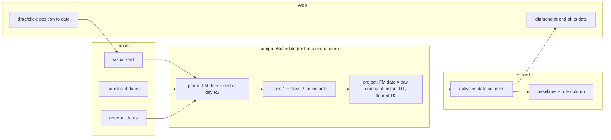
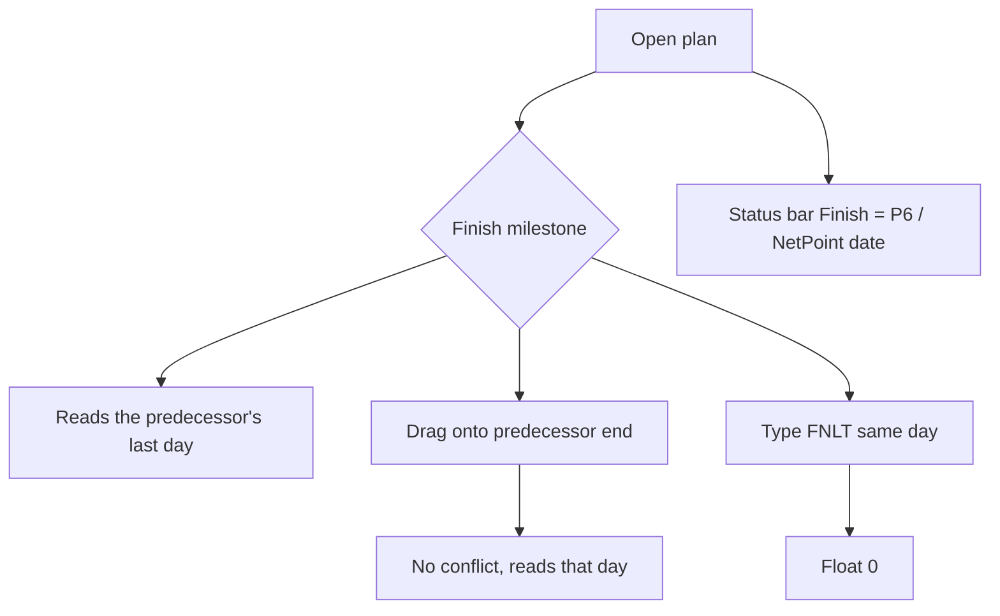

# Feature Spec: A finish milestone is dated by the day it closes

- **Status:** Accepted — shipped ([ADR-0155](../../adr/0155-a-finish-milestone-is-dated-by-the-day-it-closes.md)). Approved by the product owner in conversation, 2026-09-23 (Q1 A, Q2 A; Q3 moot, no baselines captured; Q4 default A). See `conditions.md` for the decisions and the two scope reductions they allow; the ADR records what changed in the build (the boot re-derivation, D9)
- **Author(s):** feature-analyst agent
- **Date:** 2026-09-23
- **Tracking issue / epic:** [`docs/TECH_DEBT.md`](../../TECH_DEBT.md) #381
- **Roadmap link:** _(none — a convention correction found by comparing against NetPoint)_
- **Implementation plan:** [`./implementation-plan.md`](./implementation-plan.md)
- **Related ADR(s):** [ADR-0155](../../adr/0155-a-finish-milestone-is-dated-by-the-day-it-closes.md),
  amending [ADR-0023](../../adr/0023-cpm-scheduling-date-convention.md) §4.

This spec crosses two ADR-0105 triggers — a schema change and a data migration — so it is a full
spec, not a debt-row fix. Every decision-bearing claim below names the file and line it was read
from (CLAUDE.md §19.11). Claims about P6 or NetPoint behaviour that were not observed are labelled.

---

## 0. What reading the code changed

The brief was checked claim by claim. It holds, with four corrections that change the design.

### 0.1 The error is not always "one calendar day"

ADR-0023 §4 says a finish milestone "reads one calendar day later than a task ending at T". That is
only true on a calendar where every day works from midnight. The engine places a milestone at the
**next working minute** after its predecessor ends (`compute.ts:254`,
`workStart = rollForwardToWorking(cal, lower)`) and prints the day of that minute
(`compute.ts:846-849` via `workingIndexDate`, `compute.ts:109-115`). On a Monday–Friday calendar a
finish milestone after a task ending Friday therefore reads **Monday** — three calendar days late.
The engine's own test pins this: `compute.zero-task.spec.ts:51-63` expects a finish milestone after a
Friday-ending task to carry the project finish to `2026-01-12`, a Monday.

### 0.2 Constraints on a finish milestone are read at the start of their day

`resolvePair` gives every zero-duration activity `finishAbs = startAbs` = the first working minute
of the constraint date (`constraints.ts:111-114`). So `FNLT 30 Apr` on a finish milestone means
"by the **start** of 30 Apr". A finish milestone after a task that ends on 30 Apr then carries
**one day of false negative float**, and the health check's Critical Path Length Index, which uses a
finish milestone's `FNLT`/`MFO` date as its target (`compute-health.ts:528-547`), inherits it.
The same holds for the external late finish (`constraints.ts:257-259`). Nobody reported this; it is
the same rule as #381 showing up in float instead of in a label.

This also affects imports. The XER adapter keeps only the date part of `cstr_date`
(`xer-adapter.ts:174-179`), so a P6 `FNLT 28-Feb 17:00` on a finish milestone arrives as
"start of 28 Feb". The torture fixture's `A10500 TA Window Closes` carries
`MANDATORY_FINISH 2026-10-16T18:00` (`packages/engine-conformance/fixtures/csv/activities.csv:112`);
today the engine pins it at the start of 16 Oct, twelve hours before P6 does.

### 0.3 Actual finishes are already read the P6 way

A completed activity's actual finish is read as the **end** of its day
(`progress.ts:91-97`, `rollBackwardToWorking(… nextCalendarDay(actualFinish))`). So the engine
already reads a finish milestone's _actual_ date at end of day and its _planned_ date at start of
day. The fix removes that inconsistency rather than adding a new idea.

### 0.4 The seed's spec cannot "still pass unedited"

`netpoint-power-plant.spec.ts:20-28` measures a milestone's position as the start of its
`visualStart` day, and its link checks (`:85-95`, `:115-135`) compare that with the predecessor's
end. That arithmetic **is** the old rule. Once the workaround goes, those two cases must read a
finish milestone at the end of its day. The acceptance condition is therefore "the spec passes with
a milestone-aware position helper, and every milestone's date equals the picture's label" — not
"passes unedited". Written here so nobody later reads an edited test as a weakened one.

---

## 1. Business understanding

### Problem

A planner comparing SchedulePoint with NetPoint or P6 sees the most prominent date on the screen
disagree. In the NetPoint reference plan, Guaranteed Commercial Operation follows a task ending
28 Feb 2031; NetPoint prints 2/28, and our status bar prints **01 Mar 2031**
(`docs/TEST_PLAYBOOK.md:183`). Every finish milestone does the same.

There is also a defect a planner can hit. A placement (`visualStart`) is read as the start of its
day (`compute.ts:336-339`). Dragging a finish milestone onto the day its predecessor ends puts it one
day before the predecessor's end, so the engine flags "placed earlier than logic allows"
(`compute.ts:346`). The seed file works around this by placing every finish milestone on the next
day (`netpoint-power-plant.ts:77-103`). A planner using the product has no such workaround except to
learn it.

### Users

Planner and Org Admin (who place and constrain milestones), Contributor and Viewer (who read dates),
External Guest (reads dates through the share view). Nobody gains or loses a permission.

### Primary use cases

1. Read a finish milestone's date and see the day its predecessor finishes.
2. Drag a finish milestone onto its predecessor's end and get no conflict.
3. Type `FNLT 28 Feb` on a finish milestone and get zero float when the work ends 28 Feb.
4. Read the project finish in the status bar and see the same date P6 and NetPoint print.

### Expected outcomes

- Finish milestones read like a task finishing at the same instant.
- The seed needs no next-day workaround.
- No task, start milestone, LOE or summary changes any output.

### Success criteria

See the falsification conditions in §5. Headline: the NetPoint reference plan's GCO and project
finish read **28 Feb 2031**, with no visual conflict and no workaround.

### Open questions

Critical questions are in §6. Defaults for everything else are stated inline.

---

## 2. Functional requirements

### The rule

For an activity of type `FINISH_MILESTONE`:

- **Reading (R1).** Its displayed dates — early start/finish, late start/finish, and the placed
  (effective-visual) start/finish — are the day whose working time **ends** at the milestone's
  instant: the day of the last working minute before it. That is exactly how a task's finish is
  read (`compute.ts:754`, `efOwn - 1`).
- **Floor (R2).** A finish milestone never reads earlier than the data date. It applies only when the
  milestone sits at the data date's first working minute (no predecessor, or its predecessors all
  finished before the data date). Without it, such a milestone would read the day before the data
  date and become a false "forecast before data date" offender in DCMA metric 9
  (`docs/TEST_PLAYBOOK.md:229`).
- **Writing (R3).** Every date given for it — a placement, a primary or secondary constraint of any
  kind, an external early start or late finish — means the **end** of that day's working time. So the
  date you type or import is the date you read back (subject to Q2).
- `START_MILESTONE` keeps today's rule: dated by its start, inputs read as the start of the day.
- A zero-duration `TASK` keeps today's rule (ADR-0035 §22 keeps it a task). Out of scope; a debt row
  is filed so its start-dated reading is recorded rather than forgotten.
- Actual finishes are unchanged (they are already end-of-day, §0.3).

### User stories & acceptance criteria

> **US-1** — As a Planner, I want a finish milestone to read the day its predecessor finishes, so
> that my dates match P6 and NetPoint.
>
> - **Given** a task ending 28 Feb and a finish milestone FS after it **when** the plan recalculates
>   **then** the milestone's early start and finish read 28 Feb, and the status bar Finish reads
>   28 Feb.
> - **Given** a Monday–Friday calendar and a task ending Friday **then** the milestone reads Friday,
>   not Monday.
> - **Given** an open-start finish milestone at the data date **then** it reads the data date.

> **US-2** — As a Planner, I want to drag a finish milestone onto its predecessor's end without a
> false conflict.
>
> - **Given** a finish milestone placed on its predecessor's last day **when** the plan recalculates
>   **then** `visualConflict` is false and the milestone reads that day.
> - **Given** it is placed one day earlier **then** `visualConflict` is true with reason
>   `EARLIER_THAN_LOGIC`, as today.
> - **Given** it also carries `FNLT` on that same day **then** `LATER_THAN_BOUND` does not fire.

> **US-3** — As a Planner, I want a finish constraint on a finish milestone to mean "by the end of
> that day".
>
> - **Given** a task ending 30 Apr and a finish milestone after it with `FNLT 30 Apr` **then** its
>   total float is 0, not −1 day.

> **US-4** — As any reader, I want the diamond to stay on its predecessor's end node.
>
> - **Given** a 24-hour-day calendar **then** every finish milestone's diamond is at the same pixel
>   as today; only its label changes.
> - **Given** a calendar with non-working time after the predecessor's end (a weekend) **then** the
>   diamond sits at the end of the predecessor's last day, before the gap, instead of after it.

> **US-5** — As a Planner comparing against a baseline captured before this change, I want no false
> movement for finish milestones that did not move (see Q3).

### Workflows

- **Recalculate:** unchanged flow; the engine projects finish-milestone dates by R1/R2.
- **Drag or click on the canvas / Gantt:** the diamond is drawn at the end of its date's column. A
  drag writes the date whose column ends where the diamond lands. A click in Add-milestone mode
  places a finish milestone on the day boundary nearest the pointer (default; today it lands on the
  left edge of the clicked column).
- **Type a date** (editor placement field, Gantt Start cell per ADR-0134, constraint fields): the
  typed date is read by R3 and reads back unchanged.

### Edge cases

| Case                                                            | Behaviour                                                                                                                                          |
| --------------------------------------------------------------- | -------------------------------------------------------------------------------------------------------------------------------------------------- |
| Constraint date on a non-working day (e.g. Saturday on Mon–Fri) | End of Saturday rolls back to end of Friday; the milestone reads Friday. Its instant is the same as today's (Monday first minute)                  |
| Milestone sits mid-day (sub-day durations, ADR-0070)            | Reads that day, as a task finishing mid-day does                                                                                                   |
| Type changed TASK/START_MILESTONE → FINISH_MILESTONE (or back)  | Stored dates are re-read under the new type's rule; the instant can move by one working day. Accepted; the typed date is what reads back           |
| Completed finish milestone                                      | Actual finish printed verbatim, unchanged                                                                                                          |
| Finish milestone with only an actual start                      | Refused shape in practice; engine keeps the start verbatim and reads the finish by R1. Covered by a unit case so the result is pinned, not assumed |
| Legacy baseline vs live plan                                    | Read each side under its own rule (Q3)                                                                                                             |
| Cross-plan edge whose upstream is a finish milestone            | See Q4                                                                                                                                             |

### Permissions

No change. Placement and constraint writes keep their existing gates, including the pen for
structural writes (ADR-0028). The migration is not a user action.

### Validation rules

No new validation. Dates stay `YYYY-MM-DD`.

### Error scenarios

None new. The existing 422/409/423 paths are untouched.

---

## 3. Technical analysis

| Area        | Impact      | Notes                                                                                                                                                            |
| ----------- | ----------- | ---------------------------------------------------------------------------------------------------------------------------------------------------------------- |
| Engine      | medium      | Date projection for finish milestones (R1/R2); date parsing for their inputs (R3). One helper each                                                               |
| Backend     | low         | Baseline capture writes the rule; baseline readers read each side under its rule                                                                                 |
| Database    | medium      | One capture-level column on `baselines`; one data migration on `activities.visual_start` for finish milestones (Q1). **database-architect designs both** (§19.3) |
| API         | low         | No new fields on activities. Baseline DTOs may expose the rule. OpenAPI descriptions of the date fields change                                                   |
| Frontend    | medium      | One pair of helpers for "date ↔ diamond position" used by every geometry and gesture site                                                                        |
| Interchange | none (code) | Import keeps the date part; the engine now reads it the P6 way. Export emits no computed dates (`xer-emit.ts:221-246`)                                           |
| Security    | none        | No auth or scope change                                                                                                                                          |
| Performance | low         | One extra subtraction per milestone; the migration updates finish-milestone rows only                                                                            |
| Testing     | high        | Engine units, API e2e, a canvas journey, a migration test against a populated database                                                                           |

### Blast radius — every place a finish milestone's date is produced or consumed

**Produced (engine, `apps/api/src/modules/schedule/engine/`)**

| Site                                                                        | Today         | Change                                                           |
| --------------------------------------------------------------------------- | ------------- | ---------------------------------------------------------------- |
| `compute.ts:753-755` `pointLike` → `inclusiveFinishOwn = esOwn`             | start-dated   | R1: `max(esOwn − 1, 0)` for FM, both early and late              |
| `compute.ts:846-853` early/late date projection                             | via the above | follows                                                          |
| `compute.ts:775-799` placed display `vInclusiveFinishOwn`                   | start-dated   | R1 for FM                                                        |
| `compute.ts:922-927` `visualEffectiveStart/Finish`                          | start-dated   | R1 for FM (both fields, since start = finish)                    |
| `compute.ts:336-339` placement parse                                        | start of day  | R3 for FM                                                        |
| `compute.ts:865` project-finish tie-break (`esInst` for milestones)         | instant       | unchanged — the instant is the same; the printed date follows R1 |
| `constraints.ts:103-121` `resolvePair`, `duration 0 ⇒ finishAbs = startAbs` | start of day  | R3 for FM: start = finish = end-of-day instant                   |
| `constraints.ts:221-235` external early start                               | start of day  | R3 for FM                                                        |
| `constraints.ts:246-265` external late finish, milestone branch             | start of day  | R3 for FM                                                        |
| `progress.ts:88-97` actuals                                                 | end of day    | unchanged                                                        |

**Consumed (API)**

| Site                                                                                                 | Effect                                                                                      |
| ---------------------------------------------------------------------------------------------------- | ------------------------------------------------------------------------------------------- |
| `schedule.repository.ts:410` `MAX(early_finish)` → status bar Finish                                 | reads 28 Feb, by construction                                                               |
| `overview.repository.ts:290` plan standing `MAX(act.early_finish)` vs `captured_project_finish`      | must read the baseline side under its rule (Q3)                                             |
| `cross-plan-derivation.ts:134-162` FS/FF bound from `predecessorPlacedFinish`                        | Q4                                                                                          |
| `compute-health.ts:514-561` CPLI                                                                     | target and project finish now agree; false −1 day disappears                                |
| Health metrics reading baseline finishes (11, 14)                                                    | read baseline side under its rule                                                           |
| `baselines/revision-projections.ts:102-108`, `variance.ts`, completion carrier, `revision-ghosts.ts` | read baseline side under its rule                                                           |
| `engine/earned-value.ts:352` milestone accrual at its date                                           | accrues one day earlier where the date moved; PV from a legacy baseline read under its rule |
| Share view DTOs                                                                                      | dates flow through; no code change                                                          |

**Consumed (web, `apps/web/src/`)**

| Site                                                                                                                                             | Effect                                                                                                                                                                                                    |
| ------------------------------------------------------------------------------------------------------------------------------------------------ | --------------------------------------------------------------------------------------------------------------------------------------------------------------------------------------------------------- |
| `features/tsld/render/geometry.ts:724-731` diamond x = start of date                                                                             | FM: end of date                                                                                                                                                                                           |
| `features/gantt/layout/bar-geometry.ts:66-68`                                                                                                    | same                                                                                                                                                                                                      |
| `features/tsld/model/drawn-span.ts:38-55` (packing, Arrange, auto-resolve, nudges)                                                               | FM occupies the column after its date, i.e. exactly the column it occupies today on a 24-hour calendar — so `packLanes` (`packages/layout/src/pack-lanes.ts:8-10`) and overlap counts are unchanged there |
| `render/lenses.ts`, ghost paths in `render/paint.ts:1469-1598`, `render/minimap.ts`                                                              | same helper; ghosts from a legacy baseline use the legacy rule                                                                                                                                            |
| Gestures: `interaction/gesture-machine.ts:620-633` (create), `use-plan-workspace-model.ts:728-734` (create), `:1183-1207` (move), `:1288` (bulk) | position → date through the inverse helper                                                                                                                                                                |
| Labels, activities table, Gantt text cells, status bar, a11y text, printed programme, PNG/PDF                                                    | print the API's dates; no code change                                                                                                                                                                     |

**Tests and fixtures**

- ADR-0034 goldens: `conformance/goldens.ts` contains no milestone at all and `engine/compute.spec.ts`
  uses only `START_MILESTONE` (`:19`) — grep for `MILESTONE` over `apps/api/src/modules/schedule`,
  2026-09-23. **They must pass unedited** (FC-4).
- Expected to change, deliberately: `compute.zero-task.spec.ts:62-63` (a finish milestone and a
  zero-duration task at the same instant stop printing the same date — ADR-0035 §22's "date-neutral"
  statement stops being true).
- Seed playbook predictions (to be measured in M0, not asserted): NetPoint project finish
  `2031-03-01 → 2031-02-28`; torture plan project finish `2027-03-12 → 2027-03-11`, because its
  finish is carried by `A13000 Project Complete`, a finish milestone (`activities.csv:130`) and
  2027-03-12 is a Friday. The torture plan's constraint-violation count (1) and negative-float count
  (67, `docs/TEST_PLAYBOOK.md:228`) may move, because `A10500`'s mandatory finish moves to the end of
  its day (§0.2). M0 measures both before anything ships.

### Dependencies

- None blocking. PR #677 (the NetPoint seed) should land first so the workaround exists to remove.

---

## 4. Solution design

### Architecture overview

Engine instants stay as they are. What changes is the two conversions at the engine's edge: date →
instant for a finish milestone's inputs, and instant → date for its outputs. The web gets the
matching pair for date ↔ diamond position.



### Data flow — dragging a finish milestone onto its predecessor's end

```mermaid
sequenceDiagram
  participant U as Planner
  participant W as Canvas
  participant A as API
  participant E as Engine
  U->>W: drop diamond on the 30 Apr / 1 May boundary
  W->>W: position day (1 May) minus one = date 30 Apr
  W->>A: PATCH visualStart 30 Apr (pen held)
  A->>E: recalculate
  E->>E: parse 30 Apr as end of 30 Apr = 1 May first working minute
  E->>E: logic earliest = 1 May first working minute; no conflict
  E->>A: visualEffectiveStart/Finish = 30 Apr
  A->>W: dates
  W->>U: diamond on the boundary, label 30 Apr
```

### User flow



### Parity — what changes and what does not

Stated precisely, with the recommended defaults for Q1–Q4:

1. **Pass 1 instants** (early/late start and finish instants, total and free float, criticality,
   driving flags, exposed offsets, the project-finish instant) are **byte-identical** for every
   activity **except** finish milestones that carry a constraint or an external date. For those, R3
   moves the input from the start of its day to the end of it — later by that day's working time,
   and by nothing when the day is non-working (§2 edge cases). This is the P6-correct reading
   (§0.2), so it is a correction, not drift.
2. **Pass 2 instants** are byte-identical for placed finish milestones, because the Q1 migration
   rewrites each stored placement `D` to `D − 1` calendar day, and R3 on `D − 1` yields exactly the
   old instant: `rollForward(rollBackward(D 00:00)) = rollForward(D 00:00)` for any calendar, since
   there is no working time between `rollBackward(X)` and `X` (`instants.ts:18-35`). That argument
   is derived from the two helpers, not yet run: `rollBackwardToWorking` counts from the data date,
   so a placement **before** the data date is outside it. FC-6 includes such a row, and if the
   identity fails there the migration leaves those rows alone and says how many.
3. **Date projection** changes for every finish milestone: its early, late and placed dates, and
   therefore `summary.projectFinish` and `MAX(early_finish)` when a finish milestone carries the
   finish.
4. **Tasks, start milestones, LOE, WBS summaries and zero-duration tasks** are byte-identical in
   every output. The goldens have no finish milestone and must pass unedited.
5. **Canvas pixels** for a finish milestone are identical on a 24-hour-day calendar (the diamond sat
   at the start of `date + 1`, and now sits at the end of `date`). Across a non-working gap the
   diamond moves back across the gap onto its predecessor's end node.

### Database changes (for database-architect to design — not designed here)

1. **Baseline rule column.** A capture-level fact on `baselines`, in the pattern of
   `cost_snapshot_level`, `revision_snapshot_level` and `placement_snapshot_level`
   (`schema.prisma:2040-2090`): which milestone date rule the frozen dates were written under.
   Every existing baseline was captured under the old rule, so a constant default naming the old
   rule is **true of every existing row** — the `hours_per_day_minutes DEFAULT 1440` precedent, not
   the "0 is a claim" one. Captures after the switch write the new rule. Shipped one release before
   the switch (plan M1), with the capture writing the old rule explicitly, so the two halves fail
   separately.
2. **Placement re-encoding (Q1).** For `activities` of type `FINISH_MILESTONE` with a non-null
   `visual_start`: `visual_start := visual_start − 1 day`, in the same release as the engine switch.
   ADR-0148 recorded its placement conversions in `placement_migrations`; recording these rows the
   same way makes the change auditable and makes a reverse exact. Whether to reuse that table is the
   architect's call. The migration bumps `version` (it changes a planner-owned input, ADR-0148's
   reasoning).
3. **Plan standing.** `overview.repository.ts:290` reads `captured_project_finish` without reading
   `baseline_activities` (ADR-0144). To read it under its rule it needs to know whether a finish
   milestone carried it. Whether that is a second capture-level column or a read-time join is the
   architect's call.

No change to `baseline_activities` history: frozen dates are never rewritten (ADR-0125/0126).

### API changes

- No new activity fields. OpenAPI descriptions for `earlyStart`, `earlyFinish`, `lateStart`,
  `lateFinish`, `visualEffectiveStart`, `visualEffectiveFinish`, `visualStart`, `constraintDate`,
  `externalEarlyStart`, `externalLateFinish` state the finish-milestone rule. `docs/API.md` updated.
- Baseline response DTOs expose the rule (`milestoneDateRule` or the architect's name) so the web
  can draw legacy ghosts correctly.

### Component changes

- New web helpers, one module (`apps/web/src/lib/`, beside `bar-dates.ts`): `pointDayOf(type, day,
rule)` (date → diamond position) and its inverse. `drawnDaySpan`, `activityRect`, `barGeometry`,
  lenses, ghosts, minimap and every `visualStart` write call them.
- A structural gate: every `isMilestone(` branch in `features/tsld/render/` and
  `features/gantt/layout/`, and every `visualStart:` write in `use-plan-workspace-model.ts`, goes
  through the helper. Pinned positive case included (ADR-0093).
- No new controls. The Add-milestone click lands on the nearest boundary for a finish milestone.

### Implementation approach & alternatives

**Recommended: (a) change the two conversions, keep the instants.** Smallest change that fixes both
the label and the false conflict, keeps Pass 1 byte-identical for everything without a finish
milestone date input, and needs no second meaning of an instant.

**(a′) Change the engine instants instead** — put a finish milestone at its predecessor's pre-gap end
(`rollBackwardToWorking`). Rejected: working-offset outputs would not change, but lag walks on a
different lag calendar would. A `TWENTY_FOUR_HOUR` lag from Friday 17:00 lands on Saturday and
rolls to Monday; from Monday 08:00 it lands on Tuesday (`compute.ts:973-979`, `applyLag`). That
would move successors, for a change whose purpose is a label.

**(a″) Side-aware reading** — read a finish milestone as "end of day" when its binding bound came
from a finish (FS/FF, finish constraint) and "start of day" when it came from a start (data date,
SS, SNET, external early start). This is closer to P6, which keeps clock times _(reasoned, not
observed in P6)_. Rejected: it needs a second state per activity and a tie rule, and an open-start
milestone could then read its late date before its early date with zero float. One rule is easier
to trust.

**(b) Web-only display shim.** Rejected: the API, status bar, exports, health check and share view
would disagree with the canvas, and it cannot fix the false conflict, which is in the engine.

**(c) Status quo and document it.** Rejected: leaves the false conflict (US-2) and the false
negative float (§0.2), and keeps the seed workaround the product owner asked to remove.

---

## 5. Falsification conditions and acceptance

Committed in M0 **before** any engine change runs (ADR-0128's ordering).

| ID   | Condition                                                                                                                                                                               | How it is judged                                                                                     |
| ---- | --------------------------------------------------------------------------------------------------------------------------------------------------------------------------------------- | ---------------------------------------------------------------------------------------------------- |
| FC-1 | A finish milestone placed on its predecessor's last day reports no visual conflict                                                                                                      | Engine unit case, API e2e, and the canvas journey (drag)                                             |
| FC-2 | The NetPoint reference plan's GCO and `summary.projectFinish` read **2031-02-28**                                                                                                       | Seed the plan against a local API after M2; also an API e2e reduced to TURNOVER → GCO                |
| FC-3 | The seed's next-day workaround is removed; `netpoint-power-plant.spec.ts` passes with a milestone-aware position helper, and every milestone's `visualStart` equals the picture's label | Unit suite                                                                                           |
| FC-4 | `goldens.spec.ts` and `compute.spec.ts` pass **unedited**                                                                                                                               | CI; any edit to either is a stop                                                                     |
| FC-5 | Over every seed-catalogue plan, engine outputs for non-finish-milestone rows are byte-identical before and after                                                                        | M0 harness, inputs built from each `SeedSpec` (ADR-0066), diff restricted to FM rows and the summary |
| FC-6 | The Q1 migration leaves every Pass 2 instant byte-identical on a populated database                                                                                                     | API e2e: compute, migrate, compute, compare instants; verified red by skipping the migration         |
| FC-7 | No finish milestone reads earlier than the data date                                                                                                                                    | Unit case; torture-plan DCMA metric 9 stays at 8 / 0 (`docs/TEST_PLAYBOOK.md:229`)                   |
| FC-8 | On a 24-hour-day calendar every finish-milestone diamond keeps its pixel x                                                                                                              | Paint golden log: only label text lines change, audited by hand against a written list               |
| FC-9 | `FNLT D` on a finish milestone after a task ending `D` gives float 0                                                                                                                    | Engine unit case                                                                                     |

**Predictions committed with the conditions:** NetPoint finish `2031-02-28`; torture finish
`2027-03-11`; `compute.zero-task.spec.ts:63` goes red and is re-characterised; the torture plan's
violation count stays 1. If the violation or negative-float count moves, M0 reports it and the
product owner sees the number before M2.

---

## 6. Critical questions for the product owner

**Q1 — Existing finish-milestone placements.** Today a planner who dragged a finish milestone onto a
boundary has it stored as the day _after_ (the seed does this on purpose).
**(A, recommended)** Rewrite each stored placement one day earlier in the migration. The diamond does
not move and no schedule changes; only its label moves to the predecessor's day.
(B) Keep stored dates. Every placed finish milestone moves one working day later, and so can its
successors.

**Q2 — Start-type inputs on a finish milestone.** R3 reads every date given for a finish milestone as
the end of that day, including `SNET`/`MSO`/`MANDATORY_START` and external early start.
**(A, recommended)** Yes: one rule, and the date you type is the date you read. Cost: where such an
input binds, the milestone and its successors sit one working day later than today (and, reasoned
not observed, later than P6). The torture fixture has five such milestones (external early starts,
`activities.csv:13-17`); M0 counts their successors.
(B) Only finish-type inputs read as end of day; start-type inputs keep start of day. Cost: a typed
`SNET 13 Apr` on a finish milestone reads back as 12 Apr (or the previous working day).

**Q3 — Baselines captured before the change.** Their frozen finish-milestone dates were written
under the old rule.
**(A, recommended)** Store the rule per baseline and read each date under the rule it was written
under (old: start of that day; new: end of that day), measuring differences in working time on the
plan calendar as ADR-0125 already does. Exact for whole-day milestones; can be one working day out
for a milestone that sat mid-day under sub-day durations, and the panel says so.
(B) Mark finish-milestone comparisons across rules "not assessable", including the completion
movement when a milestone carries either finish.

**Q4 — Cross-plan links from a finish milestone.** The programme derivation turns an upstream finish
date into a downstream start date at day granularity, and for tasks lets the successor start on the
predecessor's last day (pinned by `cross-plan-conformance.spec.ts:167-179`). An upstream finish
milestone escapes that today only because it reads a day late.
**(A, recommended)** Treat a finish milestone like any finish. A downstream plan can move one day
earlier on its next programme recalculation. M0 counts affected edges (likely none on the deployed
host). The task case is filed as a debt row.
(B) Keep finish-milestone bounds exact by reading them one day later in the derivation.

---

## 7. Links

- Implementation plan: [`./implementation-plan.md`](./implementation-plan.md)
- ADR: [ADR-0155](../../adr/0155-a-finish-milestone-is-dated-by-the-day-it-closes.md)
- Updated by this change: `docs/adr/0023-…` (amendment note), ADR-0035 §22 note, `docs/API.md`,
  `docs/DATABASE.md`, `docs/TEST_PLAYBOOK.md` (rows at `:43`, `:183`), `docs/TECH_DEBT.md` (#381
  closed; new rows for the zero-duration task and, under Q4 A, the cross-plan day rule), CLAUDE.md §16.
