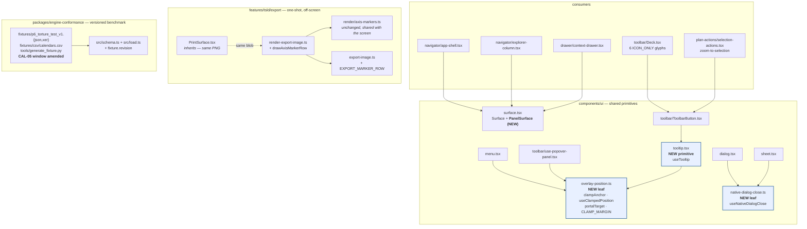
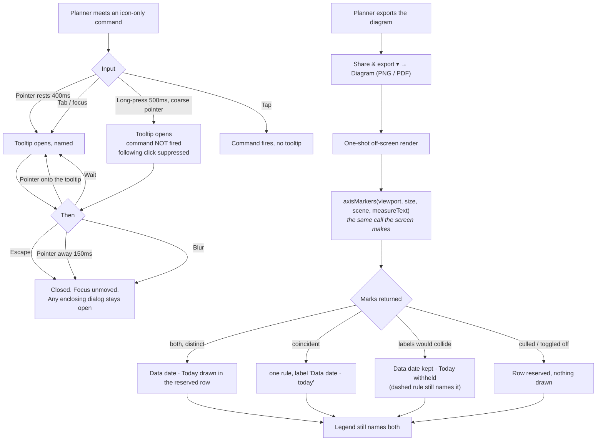
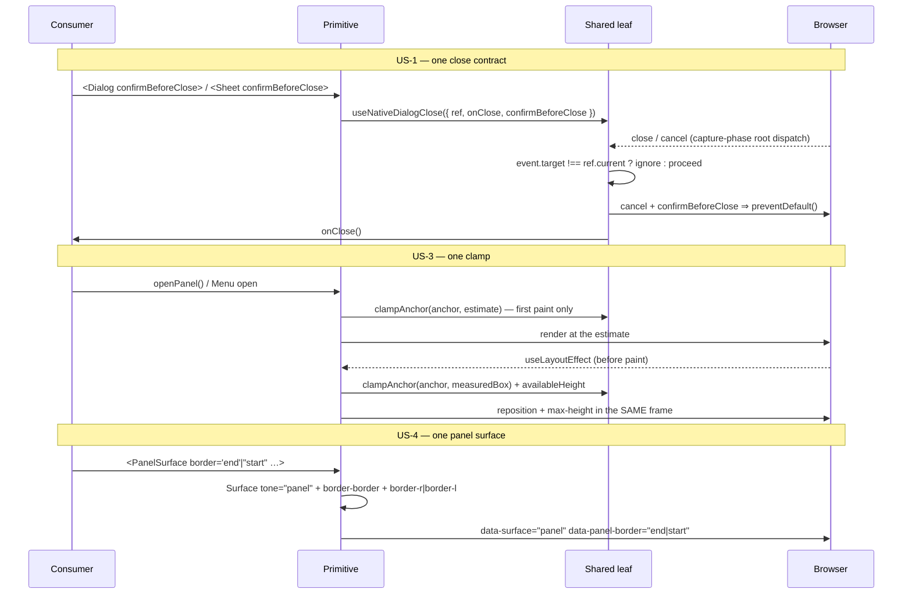

# Feature Spec: Known-issues fix slice — 2026-08

- **Status:** **Approved 2026-08-28** — the product owner chose the scope by direct questions (all four items + amend CAL-05 with a version bump + export axis marks, one specced epic) and then directed "Drive to completion", which covers this spec with the critical questions taken at their stated defaults (CQ-1 (a) evidence-led via E0.2, CQ-1b (a), CQ-2 (a) no, CQ-3 (a) yes, CQ-4 (a) marker row). R5 (a second starvation behind CAL-05) remains the one deliberately reserved product-owner question, asked only if E0.5 finds it.
- **Author(s):** feature-analyst (Product Owner / Solution Architect / Technical Lead hats)
- **Date:** 2026-08-28
- **Tracking issue / epic:** _(to be assigned)_
- **Roadmap link:** maintenance / design-system consolidation — no roadmap theme of its own
- **Related ADR(s):** ADR-0105 (why this spec exists at all), ADR-0111 + CLAUDE.md §19.13
  (primitive keyboard contract), ADR-0034 + ADR-0035 (the conformance benchmark),
  ADR-0055 / ADR-0097 / ADR-0102 (surface scopes), ADR-0103 + ADR-0106 (paper is a surface; a
  rule is a scene mark), ADR-0082 (shade, never hide), ADR-0067 M4 (the top-layer trap).
  **Proposes ADR-0117** — see §4.9.

---

## 0. What was verified, and where the brief and the register were wrong

> ADR-0076 Class 3 and `docs/PROCESS.md` "the brief is not evidence": every claim below that
> decides something was established by opening the file named, not by repeating a register row.
> Eleven claims were checked; **six were wrong or incomplete**, and three of those change the work.

| #   | Claim as inherited                                                                                   | What the code says                                                                                                                                                                                                                                                                                                                                                                                                                                                                                                      | Effect on this spec                                                                                                                                                                                                      |
| --- | ---------------------------------------------------------------------------------------------------- | ----------------------------------------------------------------------------------------------------------------------------------------------------------------------------------------------------------------------------------------------------------------------------------------------------------------------------------------------------------------------------------------------------------------------------------------------------------------------------------------------------------------------- | ------------------------------------------------------------------------------------------------------------------------------------------------------------------------------------------------------------------------ |
| F1  | #197(1): `Dialog` and `Sheet` each carry a private `closeIfSelf`, already diverged                   | **Confirmed verbatim.** `dialog.tsx:85-91` carries the `confirmBeforeClose && event.type === 'cancel'` clause; `sheet.tsx:53-56` does not, and `Sheet` has **no `confirmBeforeClose` prop at all**                                                                                                                                                                                                                                                                                                                      | none — M-A proceeds as written                                                                                                                                                                                           |
| F2  | Brief: "**#196a** — popover positioning consolidation"                                               | **Mis-citation.** #196**a** is the Escape/`preventDefault` defect (fixed in `Menu` + `Combobox`). The _positioning_ row is **#203(b)**. And #196a's third copy is **still unfixed**: `use-popover-panel.tsx:82-87` calls `stopPropagation()` and **not** `preventDefault()`                                                                                                                                                                                                                                             | M-C closes **both** — they are the same file, and shipping one without the other leaves "one contract" half true                                                                                                         |
| F3  | #116(3): "there is **no Tooltip primitive**… adding one is an **ADR-level** decision (CLAUDE.md §5)" | **Over-read.** §5 makes _adding a component library_ ADR-level; hand-rolling a primitive on the APG is the house pattern (`menu.tsx`, `combobox.tsx`). #131's own 2026-08-28 narrowing says the opposite of #116(3) — "a design-system spec item under ADR-0105". The register disagrees with itself                                                                                                                                                                                                                    | This spec **is** the required step. An ADR is proposed anyway (§4.9) for the _rule_, not for the dependency                                                                                                              |
| F4  | #210: "every `tone="panel"` consumer pairs the `Surface` with a **trailing-edge** border"            | Three sites are `border-r` (`app-shell.tsx:551`, `explorer-column.tsx:77`, `:119`); the fourth is **`border-l`** (`context-drawer.tsx:85`) — the drawer docks on the trailing edge, so its border leads                                                                                                                                                                                                                                                                                                                 | `PanelSurface` **must** take an edge parameter. Building it to the row's wording would put a `border-r` on the context drawer                                                                                            |
| F5  | #210: fold the two travelling minors "if their files are touched anyway"                             | **Their trigger does not fire.** Nothing in this epic edits `paint.ts`'s non-working wash branch (M-F edits `render-export-image.ts` / `export-image.ts`) or `HierarchyTree.tsx`                                                                                                                                                                                                                                                                                                                                        | Both stay filed, with this sentence as the record. Folding them would be an unjustified edit to a **golden-log-pinned** branch                                                                                           |
| F6  | #210: "a literal in **four** places"                                                                 | Six `<Surface tone="panel">` occurrences exist. Two — `explorer-column.tsx:135` and `context-drawer.tsx:65` — are `className="contents"` scope wrappers around a `PanelResizer`, carrying **no ground and no border**                                                                                                                                                                                                                                                                                                   | The spec names them as **deliberately not switched**, so a later reader does not "finish the job"                                                                                                                        |
| F7  | #205(a): "no valid schedule exists; the 422 is the correct answer to an infeasible network"          | True, and **understated**. `p6_torture_test_v1.json:5427` states the fixture's own intent for A10500: _"If A10400 runs long, the mandatory finish will sit BEFORE its predecessor's early finish — a genuinely impossible schedule that P6 will still produce. Your engine must produce it too (and flag it)."_ That requires A10400 to **have** an early finish, which CAL-05 makes uncomputable                                                                                                                       | Widening is not a convenience: it is what makes the fixture's own `con_mandatory_finish` + `breaks_logic` case **reachable**. That is the strongest argument for the PO's decision and it belongs in the ADR-0034 record |
| F8  | "This must not silently change golden snapshots"                                                     | **Structurally it cannot.** `conformance/adapter.ts:301-308` puts a calendar in `windowOnly` iff **every weekday of its base week is empty** — keyed on the base week, never the exception range — and substitutes it onto the plan default. Widening the range leaves membership unchanged, so not one engine input moves. `goldens.ts` is hand-authored and never reads the fixture; the only `toMatchSnapshot` under `apps/api` is `engine/__snapshots__/level.parity.spec.ts.snap`, driven from hand-authored cases | The re-baseline surface is **not** the goldens. It is the seed catalogue, `docs/TEST_PLAYBOOK.md` Tier 1, and `docs/API.md:495-505` — see §4.8                                                                           |
| F9  | #175 / brief: the export "draws no marks on the axis"                                                | The **rules do** reach the export — `paint.ts:1358-1388` strokes both full height, and the export composes `dataDateLine` / `todayOffset` / `todayFraction` (`use-diagram-image.ts:127-152`). What has never appeared is the **labels**, and after ADR-0106 the painter draws none at all. The export also has **no time axis of any kind** — `buildExportViewport` reserves a title band and (optionally) a WBS band, and nothing else                                                                                 | M-F **creates** a marker row; it does not restore one. Wording matters because "restore the labels" would send an implementer to `paint.ts`, where there is nothing to restore                                           |
| F10 | —                                                                                                    | `use-diagram-image.ts:128-133` explains `todayFraction` by saying `paint.ts` "gates the pill on this key". **There is no pill**: ADR-0106 moved every label to the ruler's DOM (`paint.ts:1374-1378`)                                                                                                                                                                                                                                                                                                                   | Corrected in M-F, in the file it describes                                                                                                                                                                               |
| F11 | —                                                                                                    | `e2e-toolbar/toolbar.spec.ts:15-20` still describes "**two** command `role="toolbar"` rows (Look / Do)". ADR-0109 D1 merged them into one                                                                                                                                                                                                                                                                                                                                                                               | Corrected in M-B/M-C, which touch that file                                                                                                                                                                              |

**Two claims about the running system that this spec relies on, with their evidence.**
`schema.prisma` is untouched by every item — the only data change is JSON/CSV fixture content
(`packages/engine-conformance/fixtures/`), so **`database-architect` is not engaged because there
is no schema to design**, not because a change was judged too small (CLAUDE.md §19.3). And the CPM
engine is not imported by items 1, 2, 3, 4 or 6; item 5 changes fixture **data** and no engine
code — so the ADR-0034 recalculation parity gate is untouched throughout, in its honest form
(§3.10).

---

## 1. Business understanding

### Problem

Six independent defects and consolidations are open in `docs/TECH_DEBT.md`. Each is small; each has
been deferred at least once for a reason that has now lapsed; and **five of the six are the same
shape this register keeps recording — one correct pattern applied to a control and not its
neighbour**:

1. **#197(1) — two close contracts.** `Dialog` and `Sheet` each hold a private copy of the guard
   that stops a nested `<dialog>`'s non-bubbling `close`/`cancel` tearing down its parent
   (TECH_DEBT #50's fix). They have already diverged: `Dialog` grew ADR-0108's
   `confirmBeforeClose` clause and `Sheet` did not. Nothing breaks today because no `Sheet`
   consumer holds unsaved editable state — so the next confirm-before-close drawer either writes
   the clause a third time or loses a planner's work finding out.
2. **#131 / #204(a) — six controls that name themselves only on hover.** `Deck.tsx:88`'s
   `ICON_ONLY` set (`zoom-in`, `zoom-out`, `fit`, `undo`, `redo`, `print`) and the object bar's
   `zoom-to-selection` carry their name in `aria-label` (for assistive technology) and `title`
   (for a pointer). **A tap fires neither, and no mainstream browser shows a `title` on keyboard
   focus.** So a sighted touch-only planner, and a sighted keyboard-only planner, get an
   unlabelled glyph. It is not a WCAG failure — the accessible name is unconditional and was
   checked rather than assumed — and the remedy has been blocked for sixteen days on a primitive
   nobody was allowed to build inside a layout milestone.
3. **#203(b) + #196(a) — two popover panels, one measured and one guessing.** `Menu` was fixed to
   clamp against its **own measured box** (`useClampedPosition`) after a row menu's `Delete` item
   shipped focusable and unclickable (WCAG 2.4.11). `usePopoverPanel` — the panel behind `View ▾`,
   `Summary ▾`, `Legend ▾` and `Go to date ▾` — still clamps against a hard-coded
   `ESTIMATED_HEIGHT = 320` and never measures. Its known-tall case is worked around locally in
   `tsld-toolbar-items.tsx:1690` with a `max-h-[60vh]`, in a comment that names the constant it is
   routing around. The same file also missed #196a's `preventDefault()` fix, so Escape in a
   toolbar popover opened inside a modal `<dialog>` still closes the dialog too.
4. **#210 — a copied literal in four places that has already drifted once.** `Surface tone="panel"`
   plus a border is written out at four sites. The first version of #172's fix copied only the
   ground half and shipped a panel whose trailing edge faded into the scrim; a ux reviewer reading
   a screenshot caught it, and `app-shell.test.tsx:217-221` still pins only the ground.
5. **#205(a) — the flagship test plan cannot be scheduled.** The conformance fixture's CAL-05
   "Turnaround Window" holds 144 h of working time that will ever exist and its TT.10 chain needs
   156 h in sequence, so a freshly seeded fixture plan answers `422
CALENDAR_WORKING_TIME_UNREACHABLE`. That strands `docs/TEST_PLAYBOOK.md` Tier 1 and the
   ADR-0116 DCMA rows in **every fresh environment**, and the only readings anyone has were taken
   against a legacy plan seeded before window-only calendars were creatable.
6. **#175 — the deliverable names two marks it does not draw.** The exported PNG/PDF (and the
   printed diagram, which embeds the same PNG) strokes a data-date rule and a Today rule and
   labels neither, then explains both in a legend the reader must cross-reference. Nobody decided
   that; the labels were pills at a fixed screen `y` that `drawTitleBand` has always painted over,
   and ADR-0106 then removed the pills entirely.

**Why now.** The product owner has chosen best-in-class fixes over patches, and to run all six as
one specced epic. Five of the six change a **shared primitive's public contract, a shared gate, or
a versioned benchmark** — every one of ADR-0105's triggers except the schema — so none of them may
be taken as a register-row fix. Batching them into one spec is cheaper than six, and the items are
mutually independent enough to ship as separate milestones inside it.

### Users

| Role                                     | What changes for them                                                                                                                                                                                                                         |
| ---------------------------------------- | --------------------------------------------------------------------------------------------------------------------------------------------------------------------------------------------------------------------------------------------- |
| **Planner** (org role `PLANNER`)         | Names on the six universal glyphs and on `zoom-to-selection`, by hover, by focus **and** by long-press. Toolbar popovers that do not run off the bottom of a short window. An exported diagram whose two date marks are named on the picture. |
| **Contributor / Viewer**                 | The same tooltip and popover improvements — none of this is pen-gated or role-gated. A Viewer reading a shared programme benefits most from the export labels.                                                                                |
| **External Guest** (ADR-0051 share link) | The guest plan view mounts `TsldPanel`; it does not reach the deck or the export. **No change.** Named so the "who is affected" answer is checked rather than assumed.                                                                        |
| **Engineer / reviewer**                  | One close contract, one clamp, one panel-surface primitive — three fewer places for the next fix to be applied to a control and not its neighbour.                                                                                            |
| **Whoever runs the test catalogue**      | `pnpm --filter @repo/seed-cli …` on a fresh database produces a fixture plan that recalculates, so `docs/TEST_PLAYBOOK.md` Tier 1 and the ADR-0116 health rows are readable without a pre-2026-08-02 plan.                                    |

### Primary use cases

1. A planner on a Surface Pro taps the `fit` glyph's neighbour by mistake and long-presses to find
   out what it is, without firing it.
2. A keyboard-only planner tabs onto `undo` and is told what it is, visibly.
3. A planner with a short window (or at 200% browser zoom) opens `View ▾` and can reach every
   switch in it.
4. A planner exports the diagram for a progress meeting and the picture says which vertical is the
   data date and which is today, on the axis, without a legend lookup.
5. An engineer seeds the catalogue on a fresh database, opens the fixture plan, presses
   **Recalculate**, and reads the ADR-0116 health rows.
6. A future drawer holds a half-typed form, and Escape asks before discarding it — because `Sheet`
   inherited the clause instead of being one primitive behind.

### User journeys

Happy path for the two user-facing milestones is in §4.3. In short: **M-B** — a planner points at,
focuses or long-presses an icon-only command and reads its name; Escape dismisses without losing
focus. **M-F** — a planner opens `Share & export ▾ → Diagram (PNG)`, and the downloaded picture
carries `Data date` and `Today` on a marker row above the diagram, positioned by the same model
the screen uses.

### Expected outcomes

- Six register rows close (#197(1), #131, #203(b) + #196a's third copy, #210, #205(a), #175), and
  #204(a) closes with #131.
- Three duplicated rules become one implementation each, with the duplication made structurally
  impossible rather than avoided by discipline.
- The conformance fixture's own `con_mandatory_finish` / `breaks_logic` torture case becomes
  reachable for the first time (F7).
- The deliverable a planner hands to somebody who was not in the room stops requiring a legend
  lookup for the two marks that say "when is now".

### Success criteria

| #   | Criterion                                                                                                      | How it is measured                                                                                                                                                                                                  |
| --- | -------------------------------------------------------------------------------------------------------------- | ------------------------------------------------------------------------------------------------------------------------------------------------------------------------------------------------------------------- |
| S1  | No `<dialog>`-close guard exists outside one module                                                            | Structural test: `dialog.tsx` and `sheet.tsx` contain no `event.target !== ` comparison of their own; both import the shared hook. Verified red against today's tree.                                               |
| S2  | `Sheet` honours `confirmBeforeClose`                                                                           | Unit test on `Sheet`, verified red.                                                                                                                                                                                 |
| S3  | Every icon-only deck control and `zoom-to-selection` shows a visible name on hover, on focus and on long-press | `e2e-toolbar` journey, verified red; plus unit coverage of the primitive.                                                                                                                                           |
| S4  | A tooltip is dismissible, hoverable and persistent                                                             | Unit tests per WCAG 1.4.13 clause, each verified red; accessibility-reviewer sign-off **before release** (ADR-0111 / §19.13).                                                                                       |
| S5  | Exactly one viewport clamp exists                                                                              | Structural test: no `ESTIMATED_HEIGHT` / `maxTop` arithmetic outside `components/ui/overlay-position.ts`. Verified red.                                                                                             |
| S6  | A tall popover opened near the viewport foot is fully **pointer-reachable**                                    | `elementFromPoint` assertion in `e2e-toolbar`, mirroring `e2e-wbs`'s `Menu` gate. Verified red.                                                                                                                     |
| S7  | `PanelSurface` is the only route to the panel-ground-plus-border pairing                                       | Structural test: no `tone="panel"` occurrence outside `surface.tsx` also carries `border-r`/`border-l`. Verified red.                                                                                               |
| S8  | The sheet-hosted Explorer keeps **both** halves of the pairing                                                 | `app-shell.test.tsx` asserts through the primitive's own attribute, not a raw class string (#210's instruction). Verified red against the ground-only version.                                                      |
| S9  | A freshly seeded fixture plan recalculates                                                                     | Measured against a real database: seed → `POST …/schedule/recalculate` → 200, and the ADR-0116 health rows read. Not arithmetic.                                                                                    |
| S10 | The amend moves no engine golden                                                                               | `scripts/e2e-local.sh api` and the full conformance suites green with **zero** snapshot updates; the re-baseline audit (§4.8) lists what did move, line by line, against a list written first (ADR-0106 precedent). |
| S11 | The exported picture names both marks on its own axis                                                          | `e2e-export` decodes the real PNG and finds the marker treatment in the reserved row. Verified red.                                                                                                                 |
| S12 | With both marks absent the export is byte-comparable to today apart from the reserved row                      | Unit parity test: no text and no marker fill drawn when `dataDateLine` is absent and Today is off.                                                                                                                  |

### Open questions

Four are **critical** (they change design or scope). Everything else has a stated default and is
not a question — see §4.

---

## 2. Functional requirements

### US-1 — One close contract (#197 item 1)

> **As an** engineer, **I want** the native-`<dialog>` close guard to exist once, **so that** the
> next drawer that holds unsaved work cannot silently discard it.

**Acceptance criteria**

- **Given** a `ConfirmDialog` nested inside a `Dialog`, **when** the inner one closes, **then** the
  outer `onClose` does not fire. _(Today's behaviour — `dialog.test.tsx:34` is the oracle and must
  pass untouched.)_
- **Given** a `<dialog>` nested inside a `Sheet`, **when** the inner one closes, **then** the sheet
  stays open. _(`sheet.test.tsx:90` is the oracle and must pass untouched.)_
- **Given** a `Sheet` with `confirmBeforeClose`, **when** the user presses Escape, **then** the
  sheet stays on screen and `onClose` is called so the host can ask.
- **Given** a `Sheet` **without** `confirmBeforeClose`, **when** the user presses Escape, **then**
  behaviour is byte-identical to today.
- **Given** the repository, **when** the structural gate runs, **then** no second implementation of
  the guard exists (S1).

### US-2 — An icon-only control names itself to everyone (#131, #204a)

> **As a** planner on a touch device or a keyboard, **I want** an icon-only command to tell me what
> it is, **so that** I do not have to press it to find out.

**Acceptance criteria**

- **Given** any of the six `ICON_ONLY` deck commands or `zoom-to-selection`, **when** the pointer
  rests on it for the open delay, **then** a visible tooltip appears naming it, and the control's
  **accessible name is unchanged**.
- **Given** the same control, **when** it receives keyboard focus, **then** the tooltip appears
  immediately (no delay).
- **Given** the same control on a coarse pointer, **when** it is long-pressed, **then** the tooltip
  appears **and the command does not fire**; **when** it is tapped, the command fires and no
  tooltip appears.
- **Given** a visible tooltip, **when** Escape is pressed, **then** the tooltip is dismissed,
  **focus does not move**, and — if the control sits inside a modal `<dialog>` — **the dialog does
  not close** (WCAG 1.4.13 Dismissible; the #196a mechanism).
- **Given** a visible tooltip, **when** the pointer moves from the control onto the tooltip,
  **then** it stays visible (1.4.13 Hoverable).
- **Given** a visible tooltip, **when** the pointer rests, **then** it does not disappear on a
  timer (1.4.13 Persistent).
- **Given** a **shaded** icon-only control, **when** the tooltip opens, **then** it reads exactly
  what the `title` reads today — `<label> — <reason>` — so no copy changes, and the reason becomes
  readable on **focus** for the first time.
- **Given** assistive technology, **when** the control is focused, **then** the name is announced
  **once** — the tooltip node must not add a second copy (see §4.2 `purpose`).
- **Given** `prefers-reduced-motion`, **when** a tooltip opens, **then** it does not animate.

### US-3 — One clamp (#203(b), and #196a's third copy)

> **As a** planner with a short window or at 200% zoom, **I want** every popover to fit on screen,
> **so that** its last control is not present, focusable and unclickable.

**Acceptance criteria**

- **Given** a toolbar popover whose real content is taller than the estimate, **when** it opens
  near the viewport foot, **then** every control in it is reachable by pointer (`elementFromPoint`
  returns the control or a descendant).
- **Given** a popover taller than the available space, **when** it opens, **then** it is capped to
  the available height and scrolls (closes #203(a)) — see **CQ-3**.
- **Given** a toolbar popover open inside a modal `<dialog>`, **when** Escape is pressed, **then**
  the popover closes and **the dialog does not**.
- **Given** a toolbar popover opened from inside a modal `<dialog>`, **when** it renders, **then**
  it is clickable — i.e. it portals into the top layer, not under it (ADR-0067 M4; latent today,
  fixed for the same reason `sheet.tsx` fixed its latent guard).
- **Given** `menu.test.tsx` and `ToolbarPopover.test.tsx`, **when** the consolidation lands,
  **then** both pass **untouched** — that is what makes them the before/after oracle
  (ADR-0078's barrel-preserving argument).

### US-4 — One panel surface (#210)

> **As an** engineer, **I want** the panel ground and its border to be one primitive, **so that** a
> future fix cannot copy half of the pairing again.

**Acceptance criteria**

- **Given** the four bordered sites, **when** they render, **then** the painted result is
  **identical** to today, including which edge carries the border (F4).
- **Given** the two `className="contents"` scope wrappers, **when** the epic lands, **then** they
  are **unchanged** — they carry no ground and no border (F6).
- **Given** the sheet-hosted Explorer below `lg`, **when** it opens, **then** its rail sits inside a
  `PanelSurface` with a border, asserted through the primitive (S8).
- **Given** the repository, **when** the structural gate runs, **then** the pairing exists in
  exactly one place (S7).

### US-5 — The flagship test plan schedules (#205a)

> **As an** engineer diagnosing the product, **I want** the seeded fixture plan to recalculate,
> **so that** `docs/TEST_PLAYBOOK.md` Tier 1 and the ADR-0116 health rows are readable in a fresh
> environment.

**Acceptance criteria**

- **Given** a fresh database, **when** the catalogue is seeded and the fixture plan is
  recalculated, **then** the response is 200 and the plan carries a critical path (S9).
- **Given** the amended fixture, **when** the conformance suites run, **then** **no golden or
  snapshot changes** (S10, F8).
- **Given** the amended fixture, **when** A10500's mandatory finish is evaluated, **then** its
  predecessor A10400 **has** an early finish and the mandatory finish sits **before** it — the
  fixture's own declared torture case, reachable for the first time (F7). The engine must
  produce and flag it, never "fix" it (ADR-0035 §7).
- **Given** the fixture, **when** it is loaded, **then** it carries a machine-readable **revision**
  recording that it was amended, and `packages/engine-conformance/fixtures/README.md` +
  `TEST_MATRIX.md` say what changed and why (ADR-0034 §6 — regeneration is a reviewed change).
- **Given** `docs/API.md:495-505`, which names CAL-05 as the canonical
  `CALENDAR_WORKING_TIME_UNREACHABLE` case, **when** the amend lands, **then** that sentence is
  corrected — it becomes false in the same commit (F8).
- **Given** CAL-05, **when** the amend lands, **then** its base week is **still empty**, so
  `cal_window_only` / `cal_empty_base_week` / `cal_positive_exception` remain honest and the
  adapter's `windowOnly` substitution is unchanged (F8, the parity argument).

### US-6 — The exported diagram names its own marks (#175)

> **As a** planner handing a picture to someone who was not in the room, **I want** the data date
> and today named on the axis, **so that** the reader does not have to cross-reference a legend.

**Acceptance criteria**

- **Given** a plan with the data-date rule on and Today in frame, **when** a PNG or PDF is
  exported, **then** a marker row above the diagram carries `Data date` and `Today`, each centred
  on its rule and clamped to the raster.
- **Given** the two rules coincide, **when** the export renders, **then** exactly **one** rule and
  one merged label `Data date · today` are drawn — the same answer the screen gives, from the same
  `axisMarkers` call, never a second implementation (ADR-0065's rule).
- **Given** the two labels would collide, **when** the export renders, **then** `Data date` keeps
  its label and `Today`'s is withheld — the screen's rule, unchanged.
- **Given** the legend, **when** the export renders, **then** it **still names both marks** (the
  PO's decision: the legend keeps naming them).
- **Given** a plan with the data-date rule off and Today toggled off, **when** the export renders,
  **then** no marker text and no marker fill are drawn (S12).
- **Given** the printed diagram, **when** it is produced, **then** it carries the marks — because
  `PrintSurface` embeds the same PNG (`PrintSurface.tsx:17-21`), so this is inherited by
  construction rather than by a second change.

### Workflows

**M-B, opening a tooltip.**

1. Pointer enters the control → start a 400 ms timer. Pointer leaves before it fires → cancel.
2. Timer fires → portal the tooltip, positioned by the one clamp.
3. Pointer leaves the control → start a 150 ms grace. Pointer enters the tooltip within it →
   cancel the close (1.4.13 Hoverable). Otherwise close.
4. Focus enters the control → open immediately, no timer. Blur → close immediately.
5. Escape while open → close, `preventDefault()` + `stopPropagation()`, focus unmoved.
6. `pointerdown` on a coarse pointer → start a 500 ms long-press timer; a move beyond 8 px or a
   `pointerup` before it cancels the timer **and** lets the click through. The timer firing opens
   the tooltip **and** suppresses the ensuing click.

**M-F, drawing the marker row.**

1. `buildExportViewport` reserves `EXPORT_MARKER_ROW` between the title band and the WBS band.
2. `renderExportImage` paints the scene (unchanged), the WBS band (offset by the extra row), the
   paper ground, the title band (unchanged).
3. It then calls `axisMarkers(viewport, size, sceneFacts, measure)` — the same model, with
   `ctx.measureText` as `measure` — and draws each returned mark into the reserved row at its
   `left`, in the print palette's already-gated `dataDate`/`dataDateInk` and `today`/`todayInk`
   pairs.

### Edge cases

| Case                                                        | Expected behaviour                                                                                                                                                                                                                               |
| ----------------------------------------------------------- | ------------------------------------------------------------------------------------------------------------------------------------------------------------------------------------------------------------------------------------------------ |
| Tooltip on a control that unmounts while open (a mode flip) | The tooltip unmounts with it. No orphan node; the open timer is cleared in the effect cleanup (ADR-0064's leaked-hold lesson).                                                                                                                   |
| Two tooltips racing (pointer moves quickly along the row)   | At most one is open. Opening one closes the other — a module-level "current tooltip" token, not per-instance state.                                                                                                                              |
| Tooltip wider than the viewport                             | Capped by `max-width` and clamped by the one clamp; never a horizontal scrollbar.                                                                                                                                                                |
| Popover taller than `innerHeight − 2 × margin`              | Capped to the available height with `overflow-y: auto` (CQ-3). Without this, `maxTop` collapses to the margin and the foot is still off-screen — #203(a) verbatim.                                                                               |
| `PanelSurface` nested inside another `panel` surface        | Inherits `Surface`'s existing dev-time throw. Unchanged.                                                                                                                                                                                         |
| Fixture: a **second** starvation behind CAL-05              | `RCAL-CRANE600` is also window-only (27-Jul–21-Aug 2026). It may starve a `RESOURCE_DEPENDENT` activity the same way and is currently masked by CAL-05 failing first. **M-E must re-measure after the amend**, not reason about it (§5 risk R5). |
| Export with **no** placeable activities                     | `buildExportViewport` already falls back to the `view` framing; the marker row is reserved either way and simply carries no marks.                                                                                                               |
| Export where a rule is off-screen                           | `axisMarkers` culls it — no mark, by the same rule as the screen.                                                                                                                                                                                |
| Export at `scaledToFit`                                     | The marker row is authored in CSS px like everything else and scales with `dpr`. No special case.                                                                                                                                                |

### Permissions

**Nothing changes.** No new endpoint, no new permission, no role gate. Explicitly:

- Tooltips, popovers and the panel surface are presentation; they are not pen-gated (ADR-0028) and
  do not consult a role. **Selecting and reading are reads** (the ADR-0063 M4b rule), and a name is
  a read.
- The export path is already reachable by any role that can read the plan; M-F changes what is
  drawn, never who may draw it.
- The fixture amend changes seed **data**, not authorisation.
- The External Guest surface (ADR-0051 `SCHEDULE_READ`) is unaffected — it mounts `TsldPanel` and
  reaches neither the deck nor the export.

### Validation rules

None new. The only new _values_ are layout constants, each named and justified in §4:
`TOOLTIP_OPEN_DELAY_MS`, `TOOLTIP_CLOSE_GRACE_MS`, `TOOLTIP_LONG_PRESS_MS`,
`EXPORT_MARKER_ROW`, and CAL-05's amended range end (an **output of measurement**, not a spec
constant — §4.8).

### Error scenarios

| Scenario                                                           | Detection               | User-facing result                                                                                              | Status |
| ------------------------------------------------------------------ | ----------------------- | --------------------------------------------------------------------------------------------------------------- | ------ |
| Tooltip cannot portal (no `document`)                              | guard                   | No tooltip; the control still carries its `aria-label`. Import-safe, matching `printDiagramImage`'s convention. | n/a    |
| Popover measured at zero (hidden ancestor)                         | `getBoundingClientRect` | Falls back to the pre-measurement estimate — today's behaviour, kept deliberately (`menu.tsx:46-63`).           | n/a    |
| Fixture amended into a shape the Zod schema rejects                | `loadFixture` throws    | CI fails loudly with the path detail. This is the intended guard (ADR-0034 §6).                                 | n/a    |
| Fixture still unschedulable after the amend                        | S9 measurement          | The milestone **does not ship**; the amount is re-derived from the measurement, never from arithmetic alone.    | 422    |
| Export marker row drawn but `measureText` unavailable (a fake ctx) | fallback                | Character-width estimate, as `drawLegend` already does (`render-export-image.ts:264-265`).                      | n/a    |

---

## 3. Technical analysis

| Area           | Impact                | Notes                                                                                                                                                                                                                                                                                                                                                                                                                                                                                                                                |
| -------------- | --------------------- | ------------------------------------------------------------------------------------------------------------------------------------------------------------------------------------------------------------------------------------------------------------------------------------------------------------------------------------------------------------------------------------------------------------------------------------------------------------------------------------------------------------------------------------ |
| Frontend       | **high**              | One new `components/ui/` primitive (Tooltip), one new shared leaf (`overlay-position.ts`), one new `PanelSurface`, one changed close contract, one changed export composition. No new route, no new state store, no new form.                                                                                                                                                                                                                                                                                                        |
| Backend        | **none**              | No module, service or endpoint changes. `apps/api` is touched only by the **conformance suites reading amended fixture data**.                                                                                                                                                                                                                                                                                                                                                                                                       |
| Database       | **none**              | No Prisma model, column, index, constraint or migration. `database-architect` is therefore not engaged — stated with its reason (CLAUDE.md §19.3).                                                                                                                                                                                                                                                                                                                                                                                   |
| API            | **doc only**          | `docs/API.md:495-505` names CAL-05 as the canonical `CALENDAR_WORKING_TIME_UNREACHABLE` case and goes stale with M-E. No contract, DTO or status code changes.                                                                                                                                                                                                                                                                                                                                                                       |
| Security       | **none**              | No auth, no authz, no input boundary, no secret. The tooltip renders application-authored strings only (labels and reasons from the registry) — no user content, so no injection surface. Confirmed by reading `Deck.tsx:290-341` and `selection-actions.tsx:262`.                                                                                                                                                                                                                                                                   |
| Performance    | **low, and measured** | The tooltip adds pointer/focus listeners to **seven** controls and one portal at a time — not a per-frame cost, and not on the canvas draw path. `usePopoverPanel` gains one `useLayoutEffect` measurement per open, matching `Menu`. M-F adds one `axisMarkers` call and ≤ 2 `fillText`s to a **one-shot off-screen** render; the live canvas is not touched (`render-export-image.ts:14-15`). **`docs/TECH_DEBT.md` #75's known painter overage is not attributable here — this epic makes zero commits under `render/paint.ts`.** |
| Infrastructure | **none**              | No new Playwright config and **no new CI step** — the two journeys extend `e2e-toolbar` and `e2e-export`, both of which already have their own step. That is a deliberate choice (§4.10).                                                                                                                                                                                                                                                                                                                                            |
| Observability  | **none**              | No log, metric, trace or health change.                                                                                                                                                                                                                                                                                                                                                                                                                                                                                              |
| Testing        | **high**              | Three structural gates (each verified **red first**), unit coverage for the two new primitives, two extended journeys, and one measured re-baseline audit.                                                                                                                                                                                                                                                                                                                                                                           |

### Dependencies

- **M-B depends on M-C.** A tooltip is a positioned overlay. If it lands before the clamp is
  consolidated it either adds a **third** clamp or takes a dependency on the one that is about to
  move. This is the only hard ordering in the epic.
- **M-B depends on M-C's portal extraction** for the same reason: a tooltip on a control inside a
  modal `<dialog>` hits ADR-0067 M4's top-layer trap, and `menu.tsx:322-325`'s `portalTarget()` is
  the solved answer, currently private.
- M-A, M-D, M-E and M-F are **mutually independent** and independent of M-B/M-C.
- **M-E must run `scripts/e2e-local.sh api`** — it changes data the API e2e and conformance suites
  consume, which is exactly the CLAUDE.md §19.8 trigger.
- **`scripts/frontend-only.json` is currently `"active": false`** (verified) — so it will not
  wrongly refuse M-E's `packages/` change. It must **stay** deactivated; arming it for this epic
  would reproduce the failure its own `reason` field records three times over.
- **`pnpm check:counts`** re-derives the ADR count in CLAUDE.md's banner. Filing ADR-0117 (§4.9)
  makes that count 117 and the banner must move in the same PR or CI fails.
- **`pnpm check:playbook`** gates that `docs/TEST_PLAYBOOK.md`'s rows resolve in both directions —
  M-E edits that file.
- **`pnpm check:doc-links`** — every doc edit here must keep its links resolving.

### The recalculation parity gate

**Items 1, 2, 3, 4 and 6 do not import the CPM engine at all** — they are `apps/web` presentation
changes, so ADR-0034's byte-identity gate is untouched _by construction_.

**Item 5 is the one that needs an argument rather than an assertion, and it has a structural one.**
`computeSchedule`'s inputs for the conformance harness are built by
`apps/api/src/modules/schedule/conformance/adapter.ts`, and lines 301–308 put a calendar in
`windowOnly` **iff every weekday of its base week is empty** — the exception range is not consulted.
A window-only calendar is then **substituted onto the plan default** and the substitution is
reported as an adaptation note. So widening CAL-05's exception range while leaving its base week
empty produces the **identical engine input**, and no scenario, differential or golden can move.
The seed catalogue is a different consumer: it posts the calendar honestly through the public REST
API, which is precisely why the application fails where the harness is green (#205(a)'s own
finding). **That asymmetry is the parity argument, and it is worth stating in the ADR-0034 record
rather than left implicit.** S10 turns it from an argument into a measurement.

---

## 4. Solution design

### 4.1 Architecture overview



**Everything here is reuse-before-invention.** Three of the five new files are _extractions_ of
code that already exists and already works; the tooltip is the only genuinely new component, and it
is hand-rolled on the APG per CLAUDE.md §5 and the `menu.tsx` / `combobox.tsx` precedent — no
library, so no ADR is needed for the _dependency_ question (F3).

### 4.2 The `Tooltip` primitive — public contract

**Shape: a hook, not a wrapper component.** `usePopoverPanel` set this precedent for exactly the
right reason (`use-popover-panel.tsx:24-27`): the _trigger_ differs per consumer and pretending
otherwise grows a `variant` prop per caller. A `<Tooltip>{children}</Tooltip>` wrapper would need
`cloneElement` and a ref it cannot type, against `ToolbarButton`'s `forwardRef` root.

```ts
// components/ui/tooltip.tsx
export interface TooltipOptions {
  /** The sentence the tooltip shows. Absent/empty ⇒ no listeners are attached at all. */
  content: string | undefined;
  /**
   * What the tooltip is FOR, and it changes the ARIA wiring — the sharp edge of this primitive.
   *
   * `'name-echo'`: the content restates the control's accessible name (the icon-only case). The
   *   panel is `aria-hidden` and NO `aria-describedby` is added — otherwise a screen reader says
   *   "Zoom in, Zoom in". It is a VISUAL affordance for sighted pointer/touch/keyboard users.
   * `'description'`: the content carries something the name does not. The panel is
   *   `role="tooltip"` and is linked with `aria-describedby`.
   */
  purpose: 'name-echo' | 'description';
  /** Suppresses the whole mechanism (e.g. a control that has a visible label). */
  disabled?: boolean;
}

export interface TooltipApi {
  /** Spread onto the trigger element. Never contains `title`. */
  triggerProps: {
    onPointerEnter: React.PointerEventHandler;
    onPointerLeave: React.PointerEventHandler;
    onPointerDown: React.PointerEventHandler;
    onPointerUp: React.PointerEventHandler;
    onPointerCancel: React.PointerEventHandler;
    onFocus: React.FocusEventHandler;
    onBlur: React.FocusEventHandler;
    onClickCapture: React.MouseEventHandler; // suppresses the click a long-press would fire
    ref: React.RefCallback<HTMLElement>;
    'aria-describedby'?: string;
  };
  /** The portalled node, or `null` while closed. Render it anywhere in the trigger's JSX. */
  tooltip: React.ReactNode;
}

export function useTooltip(options: TooltipOptions): TooltipApi;
```

**The decisions, each with its reason.**

| Decision                                                                                         | Reason                                                                                                                                                                                                                                                                                                             |
| ------------------------------------------------------------------------------------------------ | ------------------------------------------------------------------------------------------------------------------------------------------------------------------------------------------------------------------------------------------------------------------------------------------------------------------ |
| **A tooltip never carries the accessible name**                                                  | `ToolbarButton` already pins the name with `aria-label` and describes separately, and its own docblock records that folding a reason into the name shipped once and thirteen tests caught it. `purpose` makes the caller state which case they are in; there is no default, so it cannot be got wrong by omission. |
| **`purpose: 'name-echo'` renders `aria-hidden`**                                                 | The commonest case here is a tooltip that says exactly what `aria-label` says. Linking it would double the announcement. This is the clause most likely to be "simplified" later, so it is a decision with a test, not a comment.                                                                                  |
| **Open on hover after 400 ms; on focus immediately**                                             | A hover delay stops the row flickering as the pointer crosses it. A focus delay is user-hostile — focus is deliberate.                                                                                                                                                                                             |
| **Close on pointer-leave after a 150 ms grace, and stay open if the pointer enters the tooltip** | WCAG 1.4.13 **Hoverable**.                                                                                                                                                                                                                                                                                         |
| **Never close on a timer**                                                                       | WCAG 1.4.13 **Persistent**.                                                                                                                                                                                                                                                                                        |
| **Escape closes it, `preventDefault()` **and** `stopPropagation()`, focus unmoved**              | WCAG 1.4.13 **Dismissible**. Both calls, and `preventDefault` is the load-bearing one: a modal `<dialog>`'s Escape-to-close is a **default action** evaluated against `defaultPrevented`, so `stopPropagation` alone would close the dialog too — #196a, verbatim, applied at birth instead of six months late.    |
| **Escape is claimed only while open**                                                            | ADR-0080's Escape ladder. A listener that always claims Escape would take the rung above it.                                                                                                                                                                                                                       |
| **Long-press (500 ms) opens on a coarse pointer; a tap does not**                                | #131's requirement. A tap that both fires a command and shows its name is noise; a long-press is the platform's existing "tell me about this" gesture. The click that follows a fired long-press is suppressed in `onClickCapture`.                                                                                |
| **At most one tooltip is open, application-wide**                                                | A module-level token. Per-instance state leaves two open when the pointer crosses a gap quickly.                                                                                                                                                                                                                   |
| **Positioned by the one clamp** (`overlay-position.ts`)                                          | The whole point of M-C landing first. A third clamp is the defect this epic is closing.                                                                                                                                                                                                                            |
| **Portalled via the shared `portalTarget()`**                                                    | The topmost open modal `<dialog>` if there is one — ADR-0067 M4's top-layer trap, which no z-index can escape and no jsdom test can see.                                                                                                                                                                           |
| **`prefers-reduced-motion` ⇒ no transition**                                                     | House rule; the app already reduces every animation to 0.01 ms.                                                                                                                                                                                                                                                    |
| **Surface**                                                                                      | Renders inside the page's `popover` reset tone, like every other portalled overlay (`surface.tsx:19-21`: "an overlay belongs to the page, not to the surface that summoned it").                                                                                                                                   |

**What it retires, enumerated from the code, not from memory.**

_Retired in M-B_ — the `title` attribute on:

| Site                                                                                          | Today                                                   | After                                                          |
| --------------------------------------------------------------------------------------------- | ------------------------------------------------------- | -------------------------------------------------------------- |
| `ToolbarButton.tsx:97-104`, **icon-only branch only** (`showLabel === false`)                 | `title = label` or `` `${label} — ${disabledReason}` `` | `useTooltip({ content: <same string>, purpose: 'name-echo' })` |
| Reached by `Deck.tsx:296` `ICON_ONLY` — `zoom-in`, `zoom-out`, `fit`, `undo`, `redo`, `print` | hover only                                              | hover + focus + long-press                                     |
| `zoom-to-selection` on the object bar (`selection-actions.tsx`, `showLabel: 'never'`)         | hover only                                              | hover + focus + long-press (#204(a) closes)                    |

_Deliberately **not** retired in M-B, with the discriminator written down:_

| Category                                          | Sites                                                                                                                                           | Why it stays                                                                                                                                                                                                                                    |
| ------------------------------------------------- | ----------------------------------------------------------------------------------------------------------------------------------------------- | ----------------------------------------------------------------------------------------------------------------------------------------------------------------------------------------------------------------------------------------------- |
| **Truncation affordances**                        | `context-drawer.tsx:92`, `ActivitiesTable.tsx:655,681,703`, `ResourcesTable.tsx:283`                                                            | The native `title` on truncated text is free, correct, and is not a control's name. Replacing it buys nothing and adds listeners to every table row.                                                                                            |
| **Labelled toolbar controls**                     | `ToolbarButton`'s `showLabel === true` branch, `ToolbarPopover`, `ToolbarSplitButton`, `tsld-toolbar-items.tsx:532,687,857,1274,1438,1637,1868` | The name is already visible. Their `title` is a supplementary `description` clause; changing that channel is a copy decision, not this epic's.                                                                                                  |
| **Explanatory glyph tooltips**                    | `ActivitiesTable.tsx:576,590,604`, `GanttPanel.tsx:1847,1860`                                                                                   | Genuine `purpose: 'description'` candidates and a real improvement — but they are `'description'`, not `'name-echo'`, and adopting them changes what AT announces on data rows. A follow-on with its own review.                                |
| **The collapsed Explorer spine's destinations**   | `org-destinations.tsx:152`                                                                                                                      | These are **destination** icons whose names are not guessable from the glyph. A tooltip makes a bad affordance discoverable rather than good; the honest fix is a visible name or expanding the column. Recorded so the omission is a decision. |
| **Shaded control reasons on _labelled_ controls** | everywhere                                                                                                                                      | That is #116(3), and it changes ADR-0082's rule across the product. **CQ-2.**                                                                                                                                                                   |

### 4.3 User flow



### 4.4 Data flow — the three consolidations



### 4.5 Database changes

**None.** No model, column, index, constraint or migration. `database-architect` is not engaged
because there is nothing to design — stated explicitly so it reads as a checked fact rather than a
judgement somebody made about size (CLAUDE.md §19.3).

### 4.6 API changes

**None.** One documentation correction: `docs/API.md:495-505` currently offers CAL-05 as "the
canonical case" for `422 CALENDAR_WORKING_TIME_UNREACHABLE`, which M-E makes false. The error, its
reason code and all five mapping seams are unchanged; only the example sentence moves. A
replacement example is available and is _better_, because it is one nobody can accidentally fix: a
calendar whose only working exception sits years from the dates being walked (the wording
`schedule.service.ts:146-152` already uses).

### 4.7 Component changes

| File                                                                                                                 | Change                                              | Notes                                                                                                                                                                                                                                                               |
| -------------------------------------------------------------------------------------------------------------------- | --------------------------------------------------- | ------------------------------------------------------------------------------------------------------------------------------------------------------------------------------------------------------------------------------------------------------------------- |
| `components/ui/native-dialog-close.ts`                                                                               | **new leaf**                                        | `useNativeDialogClose({ ref, onClose, confirmBeforeClose })` returning `{ onClose, onCancel }`. The comment recording TECH_DEBT #50 moves **verbatim** — these comments record defects that shipped (ADR-0078's rule).                                              |
| `components/ui/dialog.tsx`                                                                                           | adopt                                               | Public props unchanged. `dialog.test.tsx` passes untouched or the move was not a move.                                                                                                                                                                              |
| `components/ui/sheet.tsx`                                                                                            | adopt + **new prop** `confirmBeforeClose?: boolean` | Default `false` ⇒ byte-identical to today. The prop is documented as latent-by-design, with `sheet.tsx:45-51`'s existing argument for fixing a latent guard.                                                                                                        |
| `components/ui/overlay-position.ts`                                                                                  | **new leaf**                                        | `CLAMP_MARGIN`, `clampAnchor`, `useClampedPosition`, `availableHeight`, `portalTarget` — all lifted verbatim from `menu.tsx`.                                                                                                                                       |
| `components/ui/menu.tsx`                                                                                             | adopt                                               | Behaviour byte-identical; `menu.test.tsx` is the oracle.                                                                                                                                                                                                            |
| `components/ui/toolbar/use-popover-panel.tsx`                                                                        | adopt + **fix**                                     | Measured clamp; `max-height` + `overflow-y` (CQ-3); `preventDefault()` on Escape (#196a's third copy); `portalTarget()` instead of `document.body`. `ToolbarPopover.test.tsx` is the oracle for the props.                                                          |
| `features/tsld/toolbar/tsld-toolbar-items.tsx:1659-1690`                                                             | remove workaround                                   | The local `max-h-[60vh] overflow-y-auto` and the comment naming `ESTIMATED_HEIGHT` go with the cause. Net **−1** arbitrary value against `token-architecture.test.ts`'s ratchet (a ceiling — removing is safe).                                                     |
| `components/ui/tooltip.tsx`                                                                                          | **new primitive**                                   | §4.2.                                                                                                                                                                                                                                                               |
| `components/ui/toolbar/ToolbarButton.tsx`                                                                            | adopt in the icon-only branch                       | `title` removed **only** where `showLabel === false`; the labelled branch and every `aria-*` are untouched. Its thirteen existing tests are the oracle.                                                                                                             |
| `components/ui/surface.tsx`                                                                                          | **`PanelSurface`**                                  | `border: 'end' \| 'start'` (default `'end'`), plus `as`, `ref`, `style`, `className` and pass-through attributes (the context drawer needs `as="aside"` + `aria-label`). Stamps `data-panel-border` so tests assert through the primitive (#210's own instruction). |
| `navigator/app-shell.tsx:549-551`, `navigator/explorer-column.tsx:76-77` + `:119`, `drawer/context-drawer.tsx:80-86` | switch                                              | Painted result identical. The drawer takes `border="start"` (F4).                                                                                                                                                                                                   |
| `navigator/explorer-column.tsx:135`, `drawer/context-drawer.tsx:65`                                                  | **unchanged**                                       | `className="contents"` scope wrappers with no ground and no border (F6). A structural comment says so.                                                                                                                                                              |
| `features/tsld/export/export-image.ts`                                                                               | `EXPORT_MARKER_ROW`                                 | Reserved between the title band and the WBS band; `reserved = topBand + markerRow + wbsBandHeight`.                                                                                                                                                                 |
| `features/tsld/export/render-export-image.ts`                                                                        | `drawAxisMarkerRow`                                 | Calls the shared `axisMarkers` with `ctx.measureText` as `measure`. Uses the print palette's `dataDate`/`dataDateInk` and `today`/`todayInk` — **which already exist and are already gated** by `print-palette.structural.test.ts:142`.                             |
| `features/tsld/toolbar/commands/use-diagram-image.ts:128-133`                                                        | comment fix                                         | Describes a Today pill that ADR-0106 removed (F10).                                                                                                                                                                                                                 |

**Loading / empty / error states.** The tooltip has no async state. The popover's states are
unchanged. The export's "nothing placeable" state already exists and is unchanged.

### 4.8 The fixture amendment (#205a) — mechanics, sizing and the audit

**What CAL-05 is today** (`p6_torture_test_v1.json:462-503`): an empty base week, `hours_per_day:
12`, and one positive exception `2026-10-05 … 2026-10-16` with windows `06:00–12:00` +
`12:30–18:30`. Twelve days × 12 h = **144 h**, all the working time that will ever exist on it. Its
three activities — A10200 (24 h) → A10300 (96 h) → A10400 (36 h), FS lag 0 — need **156 h in
sequence**, and A10100's `MANDATORY_START` pins the chain to 05-Oct.

**The amendment.** Extend the **end** of the single exception range. Three properties are
non-negotiable and are what keep the parity argument (F8) intact:

1. The **base week stays empty**, so `cal_window_only` / `cal_empty_base_week` /
   `cal_positive_exception` stay honest and the adapter's `windowOnly` membership does not move.
2. `hours_per_day` stays **12**, so ADR-0068's day↔minute factor for anything on this calendar is
   unchanged.
3. The activities' durations are **not** touched — shortening the chain was the rejected
   alternative (below).

**How far.** The floor is 13 days (156 h ÷ 12). It is **not** the answer, and the reason is the
backward pass: after ADR-0037 the engine measures on each activity's own calendar in absolute
working-instants, and the project's `must_finish_by` is 2026-12-18. A window that ends the moment
the forward pass finishes leaves the backward walk with no working time to reach, which is the
same horizon failure one direction along. **The default is therefore `2026-10-30`** — 26 days ×
12 h = 312 h, twice the chain, comfortably inside the project window, and it keeps A10500's
`MANDATORY_FINISH` of `2026-10-16T18:00` **strictly before** A10400's early finish, which is the
fixture's own declared intent (F7) and is the case that has never been reachable.

> **This number is a proposal, not a spec constant.** M-E0 measures it — seed, recalculate, read
> the dates — and the plan's task says so. Deriving a fixture's shape from arithmetic alone is
> exactly what produced the current state.

**Where CAL-05 lives — every consumer, enumerated:**

| Artefact                                                | Role                                                        | Must move?                                                                                                                                                  |
| ------------------------------------------------------- | ----------------------------------------------------------- | ----------------------------------------------------------------------------------------------------------------------------------------------------------- |
| `fixtures/tools/generate_fixture.py:100-111`            | the canonical generator (reference only, **not run in CI**) | **yes** — it is the source of truth for intent                                                                                                              |
| `fixtures/p6_torture_test_v1.json:462-503`              | the vendored fixture the loaders read                       | **yes**                                                                                                                                                     |
| `fixtures/csv/calendars.csv:6`                          | the flat mirror                                             | **yes**                                                                                                                                                     |
| `fixtures/p6_torture_test_v1.xer`                       | the XER mirror                                              | **yes if it encodes the range** — M-E0 establishes this by reading the file; nothing in `apps/` or `packages/` reads it (verified: zero non-doc references) |
| `fixtures/README.md`, `fixtures/TEST_MATRIX.md`         | the human map                                               | **yes** — ADR-0034 §6                                                                                                                                       |
| `packages/engine-conformance/src/schema.ts` + `load.ts` | the Zod contract                                            | **yes**, for the revision field (CQ-1b)                                                                                                                     |
| `apps/seed-cli/src/fixture.ts`                          | fixture → `SeedSpec` mapper                                 | **no code change** — it reads `date_range` generically (`expandException`, `:294-305`)                                                                      |
| `apps/api/.../conformance/adapter.ts`                   | the harness                                                 | **no change** — and that is the parity argument (F8)                                                                                                        |
| `docs/TEST_PLAYBOOK.md:41-49`                           | the Tier-1 caveat                                           | **yes** — the caveat becomes false; `pnpm check:playbook` gates the rows                                                                                    |
| `docs/API.md:495-505`                                   | names CAL-05 as the canonical 422 case                      | **yes** (F8)                                                                                                                                                |
| `docs/TECH_DEBT.md` #205                                | the row                                                     | **yes** — closed with the measurement                                                                                                                       |

**Editing mechanics — ADR-0034 §6 says "editing the fixture by hand is disallowed".** The generator
is Python, deliberately absent from CI, and **nobody has established that re-running it reproduces
the vendored artefacts**. Regenerating a ~9,600-line JSON and auditing the diff line by line
(ADR-0106's rule) is not feasible if the generator has drifted at all. **CQ-1.**

**The re-baseline audit — what may move, and how it is checked.** The ADR-0106 precedent applies:
_write the expected list first, then compare; never `-u`._

| Expected to move                                                                 | Expected **not** to move                         |
| -------------------------------------------------------------------------------- | ------------------------------------------------ |
| The four fixture artefacts' CAL-05 rows (and its `name`, which states the dates) | Any file under `apps/api/.../conformance/`       |
| `fixture.revision` (+ note) and `fixtureMetaSchema`                              | `goldens.ts` and every golden expectation        |
| `fixtures/README.md`, `TEST_MATRIX.md`                                           | `engine/__snapshots__/level.parity.spec.ts.snap` |
| `docs/TEST_PLAYBOOK.md` Tier 1                                                   | Every `scenarios.spec.ts` S01–S10 assertion      |
| `docs/API.md`, `docs/TECH_DEBT.md`                                               | Any `apps/api/src/modules/schedule/engine/` file |

**Anything outside the left column is a finding, not a re-baseline**, and stops the milestone. If a
conformance assertion does move, the F8 argument is wrong and the epic learns something more
valuable than the fix.

### 4.9 Implementation approach & alternatives

**Chosen: one spec, six independent milestones, three extractions and one new primitive.**

| Item    | Alternative considered                                              | Why not                                                                                                                                                                                                                                                                                        |
| ------- | ------------------------------------------------------------------- | ---------------------------------------------------------------------------------------------------------------------------------------------------------------------------------------------------------------------------------------------------------------------------------------------- |
| #197(1) | Copy `confirmBeforeClose` into `sheet.tsx`                          | That is the third copy the row predicts. Also leaves the _contract_ undocumented, so the fourth is inevitable.                                                                                                                                                                                 |
| #131    | Add a component library (Radix/Floating UI)                         | CLAUDE.md §5 makes that an ADR-level decision and the house pattern is hand-rolled on the APG (`menu.tsx`, `combobox.tsx`). A tooltip is ~150 lines; a library is a permanent dependency for it.                                                                                               |
| #131    | Keep `title` and add a visible label                                | Measured and rejected upstream: ADR-0090 M3's labels are what broke the row's fit, and ADR-0109 D1 restored labels for everything **except** these six deliberately universal glyphs.                                                                                                          |
| #203(b) | Raise `ESTIMATED_HEIGHT`                                            | `menu.tsx:57-59` records trying exactly this: "it moves the threshold and leaves the class".                                                                                                                                                                                                   |
| #203(b) | Leave the `View ▾` workaround and only fix the anchor               | Then "one clamp" is false, and the next tall panel writes a second workaround.                                                                                                                                                                                                                 |
| #210    | A `cn()` helper constant instead of a component                     | A constant can still be used with the ground and without it, which is the drift that already happened. A component makes the pairing unsplittable.                                                                                                                                             |
| #205(a) | Shorten the TT.10 chain                                             | Changes three activities' durations, which are themselves fixture assertions (`original_duration_days_display`, the assignment `AS0040` at 768 units). Widening one calendar range touches one object.                                                                                         |
| #205(a) | Mark the fixture plan expected-unschedulable, add a stand-in        | Rejected by the product owner. It also leaves the fixture's own `breaks_logic` case permanently unreachable (F7) and strands Tier 1 behind a caveat.                                                                                                                                           |
| #175    | Draw the labels in the existing 96 px band's spare gutter (y 80–96) | No geometry change and no journey update — genuinely cheaper. Rejected because it couples the marker row to the legend's layout: the legend already breaks early when it would overflow (`render-export-image.ts:268`), and a wrapped legend would collide with the marks. **CQ-4** offers it. |
| #175    | Only name them in the legend (the status quo)                       | The product owner has decided. Recorded because #175 explicitly held it open.                                                                                                                                                                                                                  |

**An ADR is proposed: ADR-0117 — "A tooltip echoes a name; it never carries one."** Not because a
hand-rolled primitive needs one (F3), but because M-B settles a **product-wide rule** with three
clauses that will otherwise be re-litigated per control: (1) when a tooltip is permitted at all
(the discriminator table in §4.2); (2) that a tooltip never contributes to the accessible name, and
the `purpose` split that enforces it; (3) that `title` survives only as a truncation affordance.
That is a convention of the same weight as ADR-0082's "shade, never hide", which is an ADR. Its
outline is §4.2's decision table; it should be **Accepted with M-B**, and `pnpm check:counts` will
require CLAUDE.md's ADR count to move to **117** in the same PR.

**No `VITE_` flag, for any milestone.** ADR-0088 D1: a `VITE_` constant is inlined at build time,
`apps/web/Dockerfile` declares one `VITE_` build arg and `docker-publish.yml` passes none — so a
flag has never been an operator rollback. The rollback contract is a **commit boundary**, which is
why the six milestones are six PRs. Two of them (M-A, M-D) are additionally revertible with no
behavioural surface at all.

### 4.10 Testing strategy

**No new Playwright config and no new CI step, deliberately.** The two user-facing milestones extend
suites that already exist and already have their own step: `e2e-toolbar` (drives the deck in a real
browser) and `e2e-export` (decodes the real downloaded PNG — "the only instrument in the repository
that can see the defect", per its own docblock). A new config is an ADR-0105 trigger and a standing
CI cost; there is no capability here it would reach that these two do not.

**Three structural gates, each verified red first** (ADR-0110's rule: _a gate is not finished when
it passes; it is finished when it has been made to fail by the defect it was written for_):

| Gate                                     | Asserts                                                                                                                                      | Its stated blind spot                                                                                                                                             |
| ---------------------------------------- | -------------------------------------------------------------------------------------------------------------------------------------------- | ----------------------------------------------------------------------------------------------------------------------------------------------------------------- |
| `native-dialog-close.structural.test.ts` | no `event.target !==` guard outside the leaf; **and** a pinned positive (both primitives import it)                                          | cannot see whether the two _behave_ alike — that is `dialog.test.tsx` / `sheet.test.tsx`'s job                                                                    |
| `overlay-position.structural.test.ts`    | no `window.innerHeight - … - CLAMP_MARGIN` arithmetic outside the leaf; **and** a pinned positive (≥ 3 importers)                            | a fourth overlay could re-derive the maths with different variable names; the pinned positive is what stops the gate passing on an empty world (ADR-0093's shape) |
| `panel-surface.structural.test.ts`       | no `tone="panel"` occurrence carrying `border-r`/`border-l` outside `surface.tsx`; **and** a pinned positive (≥ 4 `PanelSurface` call sites) | comments are stripped before scanning — the fourth scan-matching-prose defect in this repository was six days ago                                                 |

**Journeys.**

- `e2e-toolbar`: hover, focus and long-press a `ICON_ONLY` glyph; assert the visible name; press
  Escape and assert the tooltip goes and **focus does not move**; open the tallest popover at a
  short viewport and assert every control passes `elementFromPoint`. Both assertions verified red.
- `e2e-export`: decode the PNG, sample the reserved marker row, assert the data-date treatment's
  fill is present there. Verified red. **`TITLE_BAND_PX` must become `EXPORT_TOP_BAND +
EXPORT_MARKER_ROW`** or the existing colour counts will start sampling marker pixels — a
  consequence of CQ-4's default answer and a required edit, not an optional one.

**Accessibility.** `accessibility-reviewer` runs on the tooltip's keyboard model **before M-B
ships**, not at M-G — CLAUDE.md §19.13 / ADR-0111, whose whole subject is that twice in two days a
primitive's keyboard change passed every gate here and was wrong, the second time inside the fix
for the first. `component-reviewer` runs with it because two primitives (`Tooltip`, `Menu`) will
implement overlapping Escape rules.

---

## 5. Links

- Implementation plan: [`./implementation-plan.md`](./implementation-plan.md)
- Register rows closed: `docs/TECH_DEBT.md` #197(1), #131, #204(a), #203(b), #196a's third copy,
  #210, #205(a), #175
- Register rows **corrected but not closed**: #116(3) (F3), #210's site count and edge (F4, F6),
  #210's travelling minors (F5)
- Docs to update: `docs/TEST_PLAYBOOK.md`, `docs/API.md`, `docs/DESIGN_SYSTEM.md` (tooltip
  authoring rule), `docs/COMPONENT_LIBRARY.md`, `docs/UX_STANDARDS.md` (icon-only naming),
  `packages/engine-conformance/fixtures/README.md` + `TEST_MATRIX.md`, `CLAUDE.md` §16 (ADR-0117)
  and the stage banner's ADR count
