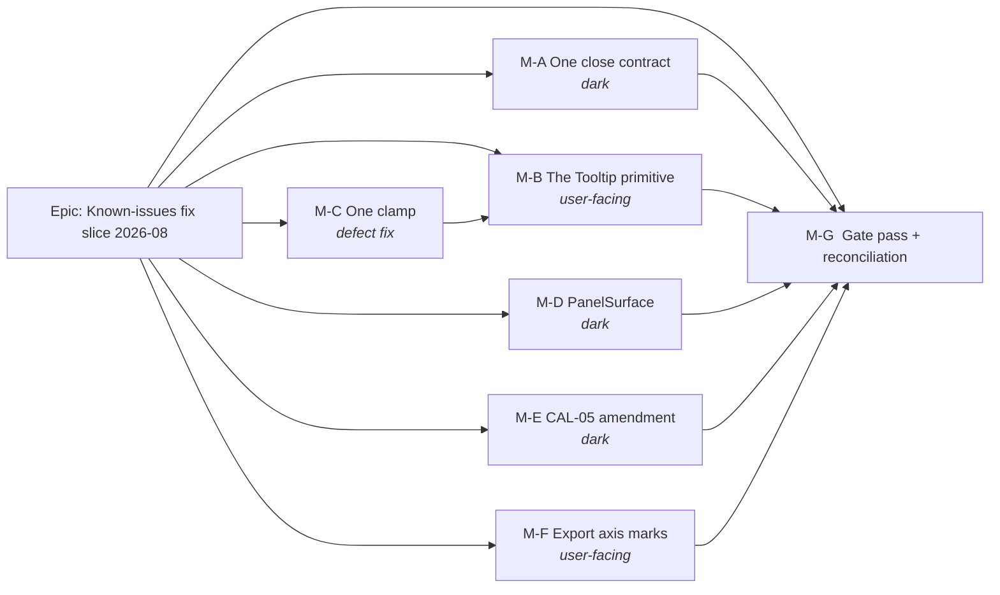

# Implementation Plan: Known-issues fix slice — 2026-08

- **Feature spec:** [`./feature-spec.md`](./feature-spec.md) — **not yet approved**
- **Status:** Draft — awaiting approval
- **Owner:** web (M-A–M-D, M-F) · api/engine-conformance (M-E) · unassigned (M-G)

## Breakdown

### Epic

**Known-issues fix slice — 2026-08** — six deferred register items taken as best-in-class fixes
rather than patches, in one spec and six independently releasable milestones. Maps to no roadmap
theme; it is maintenance plus design-system consolidation. Five of the six touch a shared
primitive's public contract, a shared gate, or a versioned benchmark, which is why a spec is
mandatory (ADR-0105) rather than a courtesy.

**Standing rules for every milestone in this epic:**

- **A gate added here is verified RED against the defect it names, before it is trusted**
  (ADR-0110 D5). "It passes" is not the finish line.
- **Every decision-bearing claim in a commit message, docblock or test name says what was run or
  read to establish it** (ADR-0076 / CLAUDE.md §19.11).
- **`pnpm prepush`** before every push — one command, ten derived checks; running its parts by hand
  is how `check:adr-coverage` was missed once. Plus `scripts/e2e-local.sh api` for M-E, and
  `scripts/e2e-local.sh web:toolbar` / `web:export` for M-B/M-C/M-F.
- **`scripts/frontend-only.json` stays `"active": false"`.** Arming it for this epic would refuse
  M-E's legitimate `packages/` change, which is the failure its own `reason` field records three
  times.
- **`scripts/e2e-sweep.sh`** after any label or layout change — the ADR-0091 M7 rule, three
  journeys deep.

---

## Milestone A — One close contract (`#197` item 1)

**Outcome:** the native-`<dialog>` close guard exists once, and `Sheet` honours
`confirmBeforeClose`.
**Entry point:** **Ships dark.** No user-visible behaviour changes: `Sheet`'s new prop defaults to
`false` and no consumer sets it. The capability it creates — a drawer that can refuse its own close
— is surfaced by whichever future feature needs it. (ADR-0081 §1: there is no third state, and
"the model landed" is not a claim that a capability exists.)
**Journey:** none, and deliberately. There is no user-facing surface to drive. The two existing
nesting unit tests (`dialog.test.tsx:34`, `sheet.test.tsx:90`) are the before/after oracle, which
is a stronger instrument here than a journey that would exercise nothing new.

---

#### Feature: the shared close contract

> **Description:** extract `closeIfSelf` into `components/ui/native-dialog-close.ts` and give
> `Sheet` the `confirmBeforeClose` clause it never received.
> **Complexity:** S
> **Dependencies:** none
> **Risks:** the extraction changes behaviour invisibly → the two nesting tests must pass
> **untouched**; if either needs editing, the move was not a move (ADR-0078's rule).
> **Testing requirements:** both existing nesting tests unchanged; one new `Sheet`
> `confirmBeforeClose` test verified red; one structural gate verified red.

##### Task A1 — Extract the guard (≈ one PR)

- **Description:** create the leaf, adopt it in both primitives, add `confirmBeforeClose` to
  `Sheet`, add the structural gate.
- **Complexity:** S
- **Dependencies:** none
- **Risks:** `Sheet`'s prop is latent (no consumer) → so is `sheet.tsx`'s existing guard, and
  `sheet.tsx:45-51` already writes the argument for fixing a latent thing in a general-purpose
  primitive. Reuse that reasoning verbatim rather than inventing a new one.
- **Testing:** as above.
- **Development steps:**
  1. Create `components/ui/native-dialog-close.ts` with
     `useNativeDialogClose({ ref, onClose, confirmBeforeClose })` → `{ onClose, onCancel }`.
     **Move `dialog.tsx:72-84`'s comment verbatim** — it records TECH_DEBT #50, and these comments
     record defects that shipped.
  2. `dialog.tsx`: replace the private `closeIfSelf`; **no public prop changes**.
  3. `sheet.tsx`: replace the private `closeIfSelf`; add `confirmBeforeClose?: boolean` (default
     `false`), documented as latent-by-design with the reason.
  4. Add `native-dialog-close.structural.test.ts` — no `event.target !==` comparison outside the
     leaf, **plus a pinned positive** (both primitives import it), so the gate cannot pass against
     a world where neither exists (ADR-0093's shape). Strip comments before scanning.
     **Verify red** against the pre-change tree.
  5. Add `sheet.test.tsx`: Escape with `confirmBeforeClose` leaves the sheet open and calls
     `onClose`; without it, behaviour is unchanged. **Verify red.**
  6. Run `dialog.test.tsx` and `sheet.test.tsx` **unedited** — that is the acceptance condition.
  7. Update `docs/TECH_DEBT.md` #197: item 1 closed, with the measurement; items 2 and 3 re-filed
     with #197(3) noting that M-C closes its `usePopoverPanel` half.
  8. Changeset (`patch`, `@repo/web`) — internal, but the primitive contract moved.

---

## Milestone C — One clamp (`#203(b)`, and `#196a`'s third copy)

> **Sequenced before M-B.** A tooltip is a positioned overlay; landing it first would add a third
> clamp or depend on one about to move.

**Outcome:** exactly one viewport clamp and one portal target in the product; toolbar popovers
measure themselves, cap their height, scroll, and no longer close an enclosing modal `<dialog>` on
Escape.
**Entry point:** `View ▾` on the plan command deck (and `Summary ▾`, `Legend ▾`, `Go to date ▾`'s
caret) — a planner at a short viewport or 200 % browser zoom can now reach every control in the
panel. This is a defect fix on an existing entry point, not a new one.
**Journey:** `apps/web/e2e-toolbar/toolbar.spec.ts` — open the tallest popover at a short viewport
and assert every control passes `elementFromPoint`, mirroring the `Menu` gate `e2e-wbs` already
carries. **Verified red first.**

---

#### Feature: the shared overlay-position leaf

> **Description:** lift `menu.tsx`'s measured clamp and portal target into
> `components/ui/overlay-position.ts`, adopt it in `usePopoverPanel`, and fix the two defects that
> adoption exposes.
> **Complexity:** M
> **Dependencies:** none
> **Risks:** `Menu`'s clamp is load-bearing and its **hook ordering is load-bearing too**
> (`menu.tsx:194-206`: the layout effect must run before the focus effect, and a reorder breaks it
> silently). The extraction must not change declaration order → `menu.test.tsx` untouched, plus an
> explicit ordering comment carried across.
> **Testing requirements:** `menu.test.tsx` and `ToolbarPopover.test.tsx` pass **untouched**; new
> unit coverage of `clampAnchor`'s boundary arithmetic (#203(a) records it has none but the browser
> gate); structural gate verified red; journey assertion verified red.

##### Task C1 — Extract the leaf

- **Description:** `CLAMP_MARGIN`, `clampAnchor`, `useClampedPosition`, `portalTarget` move
  verbatim; `menu.tsx` imports them.
- **Complexity:** S
- **Dependencies:** none
- **Risks:** a "tidy-up" during the move → move first, change nothing; behaviour changes land in C2.
- **Testing:** `menu.test.tsx` untouched. New `overlay-position.test.ts` covering `clampAnchor` at
  every boundary (anchor left of margin, right of `maxLeft`, box taller than the viewport), each
  case verified red against a deliberately broken clamp.
- **Development steps:**
  1. Create the leaf; move the four symbols and **all** their comments verbatim (including
     `menu.tsx:46-63`'s record of why raising the constant was the wrong fix).
  2. `menu.tsx` imports them; its own hook ordering and its ordering comment stay exactly where
     they are.
  3. Add `overlay-position.test.ts`.
  4. Run `menu.test.tsx` unedited.

##### Task C2 — Adopt it in `usePopoverPanel`, and fix what adoption exposes

- **Description:** replace the estimate-only clamp with the measured one; add `max-height` +
  `overflow-y: auto`; add `preventDefault()` to Escape; portal via `portalTarget()`.
- **Complexity:** M
- **Dependencies:** C1
- **Risks:**
  - Removing `ViewTogglesPanel`'s local `max-h-[60vh]` changes a **shipped** panel's behaviour at
    short viewports → the journey assertion is what proves it is better, not an opinion. **CQ-3
    can trim this half.**
  - `portalTarget()` changes where the panel mounts. No `ToolbarPopover` renders inside a modal
    `<dialog>` today (verified: the deck is not inside one), so this is **latent** — fixed for
    `sheet.tsx:45-51`'s reason, and the unit test asserts the target selection, not a visual
    outcome jsdom cannot reach.
- **Testing:** `ToolbarPopover.test.tsx` untouched (the props do not change — that is what makes it
  the oracle, `use-popover-panel.tsx:21-22`). New: Escape sets `defaultPrevented` (assert the
  **mechanism**, not the outcome — jsdom's `showModal` is a property flip that never fires
  `cancel`, stated in the test rather than implied, per #196's precedent). New: the panel receives
  a `maxHeight` derived from the available space.
- **Development steps:**
  1. `usePopoverPanel`: keep the estimate for the first paint (the same reason `Menu` keeps one),
     add the measured `useLayoutEffect` correction.
  2. Derive and apply `maxHeight` + `overflow-y: auto` from the available space.
  3. Escape handler: `event.preventDefault()` **before** `stopPropagation()`, with the #196a
     explanation.
  4. Portal via the shared `portalTarget()`.
  5. Delete `tsld-toolbar-items.tsx:1690`'s `max-h-[60vh] overflow-y-auto` **and** the docblock at
     `:1659-1662` that names `ESTIMATED_HEIGHT` as the cause — it becomes false in this commit.
     Confirm `token-architecture.test.ts`'s arbitrary-value count **falls** by one (a ceiling, so
     falling is safe; check it rather than assume it).
  6. Add `overlay-position.structural.test.ts` with its pinned positive. **Verify red.**
  7. Extend `e2e-toolbar` with the short-viewport `elementFromPoint` sweep. **Verify red** by
     reverting step 1 locally.
  8. While in `e2e-toolbar/toolbar.spec.ts`: correct its docblock, which still describes "two
     command `role="toolbar"` rows (Look / Do)" — ADR-0109 D1 merged them (spec F11).
  9. `docs/TECH_DEBT.md`: close #203(b) and #197(3)'s `usePopoverPanel` half; close #203(a) if
     CQ-3 is `yes`, otherwise re-file it with the reason.
  10. Changeset (`patch`, `@repo/web`).

---

## Milestone B — The `Tooltip` primitive (`#131`, `#204(a)`)

**Outcome:** every icon-only command names itself to a pointer, a keyboard **and** a touch device.
**Entry point:** the six `ICON_ONLY` commands on the plan command deck — **Zoom in**, **Zoom out**,
**Fit to plan**, **Undo**, **Redo**, **Print** (`Deck.tsx:88`) — and **Zoom to selection** on the
canvas object bar. A planner hovers, focuses or long-presses any of them and reads its name.
**Journey:** `apps/web/e2e-toolbar/toolbar.spec.ts` — hover a glyph and assert the visible name;
Tab to it and assert the same; long-press on a coarse-pointer context and assert the name appears
**and the command did not fire**; press Escape and assert the tooltip goes and `document.activeElement`
is unchanged. Lands **with this milestone**, not at a later gate pass (ADR-0081 §2).

---

#### Feature: `components/ui/tooltip.tsx`

> **Description:** a hand-rolled APG tooltip (`menu.tsx` / `combobox.tsx` precedent — semantic
> HTML + WAI-ARIA, no library), meeting WCAG 1.4.13 in full, positioned by the M-C clamp and
> portalled by the M-C portal target.
> **Complexity:** M
> **Dependencies:** M-C (both C1 and C2)
> **Risks:**
>
> - **A primitive's keyboard model is the class of defect this repository has shipped twice in two
>   days** (`#189`, then `#192` inside its own fix) → `accessibility-reviewer` runs **before B3
>   merges**, not at M-G (ADR-0111 / CLAUDE.md §19.13). This is non-negotiable and is the milestone's
>   largest risk control.
> - **Double announcement.** A tooltip echoing an `aria-label` must be `aria-hidden`. The `purpose`
>   discriminant has no default so it cannot be got wrong by omission, and there is a test for the
>   `'name-echo'` branch specifically.
> - **Escape ladder collision.** The tooltip must claim Escape only while open, or it takes a rung
>   from ADR-0080's ladder. Test both directions.
> - **jsdom cannot see any of the real behaviour** — no layout, no top layer, no focus ring. Stated
>   in the tests rather than implied; the journey is the instrument that can.
>   **Testing requirements:** unit coverage per 1.4.13 clause (Dismissible / Hoverable / Persistent),
>   each verified red; a `purpose: 'name-echo'` announcement test; an Escape-precedence test; the
>   journey above.

##### Task B1 — The primitive

- **Description:** `useTooltip` per feature-spec §4.2.
- **Complexity:** M
- **Dependencies:** M-C
- **Risks:** timer leaks on unmount → every timer cleared in the effect cleanup (ADR-0064's leaked-
  hold lesson: a leaked hold fails silently). Two tooltips open at once → a module-level current-
  tooltip token, tested by mounting two triggers and crossing between them.
- **Testing:** `tooltip.test.tsx`, every case verified red. Named constants
  (`TOOLTIP_OPEN_DELAY_MS = 400`, `TOOLTIP_CLOSE_GRACE_MS = 150`, `TOOLTIP_LONG_PRESS_MS = 500`)
  with their reasons in the docblock.
- **Development steps:**
  1. Implement `useTooltip` with the `TooltipApi` shape from §4.2.
  2. Escape: `preventDefault()` **and** `stopPropagation()`, only while open, focus unmoved.
  3. Long-press: `pointerdown` timer, cancelled by a move > 8 px or an early `pointerup`; a fired
     long-press suppresses the following click in `onClickCapture`.
  4. Position via `clampAnchor`; portal via `portalTarget()`.
  5. `prefers-reduced-motion` ⇒ no transition.
  6. Tests, each verified red.
  7. **Run `accessibility-reviewer` and `component-reviewer` on this task's diff before it merges.**

##### Task B2 — Adopt it on `ToolbarButton`'s icon-only branch

- **Description:** replace `title` where `showLabel === false`; leave the labelled branch, every
  `aria-*` and all copy untouched.
- **Complexity:** S
- **Dependencies:** B1
- **Risks:** `ToolbarButton` has thirteen existing tests that caught a name-pollution defect the
  moment it was written → they are the oracle and must pass untouched. The disabled icon-only
  string (`` `${label} — ${disabledReason}` ``) must be **character-identical** to today's `title`,
  or copy has silently changed.
- **Testing:** thirteen existing tests unchanged; a new case pinning that the icon-only branch
  renders **no** `title` attribute and that the accessible name is still exactly `label`.
- **Development steps:**
  1. Thread `useTooltip({ content, purpose: 'name-echo' })` into the `showLabel === false` branch.
  2. Delete the `title` for that branch only; keep `liveTitle` for the labelled branch.
  3. Confirm `zoom-to-selection` (`selection-actions.tsx`, `showLabel: 'never'`) inherits it —
     **by rendering it**, not by reading the registry. This is where #204(a) closes.
  4. Tests.

##### Task B3 — The journey, the rule and the ADR

- **Description:** the flag-on-equivalent journey, the authoring rule, and ADR-0117.
- **Complexity:** M
- **Dependencies:** B2
- **Risks:** a journey that locates by copy breaks on the next label change → locate by
  `[data-toolbar-item]` (the ADR-0091 M7 rule, after three journeys broke on a label change).
  Long-press needs a coarse-pointer context — Playwright defaults to a **fine** pointer, and the
  first coarse-pointer run in this repository was three weeks ago and found a real regression
  (`#133`); set `hasTouch` / `isMobile` explicitly for that case.
- **Testing:** the journey, verified red against the pre-B2 tree.
- **Development steps:**
  1. Extend `e2e-toolbar/toolbar.spec.ts` with the four assertions from the milestone header.
  2. Add the tooltip authoring rule to `docs/DESIGN_SYSTEM.md` and `docs/COMPONENT_LIBRARY.md`,
     including the **discriminator table** (§4.2) so the next `title` is not a judgement call, and
     the icon-only naming rule to `docs/UX_STANDARDS.md`.
  3. File **ADR-0117** with §4.2's decision table as its Decision section; Accepted with this
     milestone.
  4. Update `docs/adr/README.md` (`check:adr-coverage` checks **both** directions since ADR-0110
     D6) and **CLAUDE.md** §16 plus the stage banner's ADR count → **117**, or `pnpm check:counts`
     fails.
  5. `docs/TECH_DEBT.md`: close #131 and #204(a); **correct #116(3)**, whose "adding one is an
     ADR-level decision (CLAUDE.md §5)" over-reads that section (spec F3) — corrected rather than
     quietly dropped, and re-file its remaining half (a shaded _labelled_ control's reason is still
     `sr-only`-only) as the follow-on CQ-2 declines.
  6. Changeset (`minor`, `@repo/web`) — a user-visible capability.

---

## Milestone D — `PanelSurface` (`#210`)

**Outcome:** the panel ground and its border are one primitive; the half that broke once is pinned.
**Entry point:** **Ships dark.** The painted result is identical at all four sites; this is a
structural refactor with a regression test attached.
**Journey:** none. The one behaviour it protects — the sheet-hosted Explorer's border below `lg` —
is asserted in `app-shell.test.tsx` (unit, through the primitive) and is already driven end to end
by `e2e-narrow-shell`, which must be run unchanged as the oracle.

---

#### Feature: the panel-surface primitive

> **Description:** `PanelSurface` in `components/ui/surface.tsx`, four sites switched, the missing
> `border-r` assertion added, a structural gate added.
> **Complexity:** S
> **Dependencies:** none
> **Risks:** the drawer's border is `border-l`, not `border-r` (spec F4) → the `border` prop is
> required reading; building to #210's wording produces a wrong edge on one of the four.
> **Testing requirements:** `panel-surface.test.tsx`; `app-shell.test.tsx` extended and verified
> red; structural gate verified red; `e2e-narrow-shell` run unchanged.

##### Task D1 — Extract and switch (≈ one PR)

- **Complexity:** S
- **Dependencies:** none
- **Risks:** switching the two `className="contents"` wrappers would delete the resizer's scope →
  they are named in the spec (F6) as **not** switched, and a comment says so at both sites.
- **Testing:** as above.
- **Development steps:**
  1. Add `PanelSurface` to `surface.tsx`: `border: 'end' | 'start'` (default `'end'` — three of
     four), plus `as`, `ref`, `style`, `className` and pass-through attributes. Stamp
     `data-panel-border` so tests assert through the primitive (#210's own instruction).
  2. Switch `app-shell.tsx:549-551`, `explorer-column.tsx:76-77`, `explorer-column.tsx:116-121`,
     and `context-drawer.tsx:80-86` (**`border="start"`**).
  3. Add a one-line comment at `explorer-column.tsx:135` and `context-drawer.tsx:65` saying why
     those two stay raw `Surface`.
  4. `panel-surface.test.tsx`: both edges render the right class; the ground is present; the
     attribute is stamped.
  5. Extend `app-shell.test.tsx:217-221` to assert the border half **through the primitive**.
     **Verify red** against a ground-only render.
  6. Add `panel-surface.structural.test.ts` with its pinned positive, comments stripped.
     **Verify red.**
  7. Run `scripts/e2e-local.sh web:narrow-shell` unchanged.
  8. `docs/TECH_DEBT.md` #210: closed, **with the corrections recorded** — six occurrences not
     four (F6), one `border-l` not four `border-r` (F4), and the two travelling minors **not
     folded because their files are not touched** (F5). Recording a non-fold is the ADR-0071
     lesson; stepping over it leaves the register as wrong as not noticing.
  9. Changeset (`patch`, `@repo/web`).

---

## Milestone E — The CAL-05 amendment (`#205(a)`)

**Outcome:** a freshly seeded fixture plan recalculates, `docs/TEST_PLAYBOOK.md` Tier 1 and the
ADR-0116 DCMA rows are readable in a fresh environment, and the fixture's own
`con_mandatory_finish` / `breaks_logic` case becomes reachable for the first time.
**Entry point:** **Ships dark** for the product — no UI, no API, no engine change. Its reader is an
engineer running `pnpm --filter @repo/seed-cli` against a fresh database and then pressing
**Recalculate** on the fixture plan.
**Journey:** none, and the reason is that the right instrument already exists and is stronger: the
API e2e suite against a **real Postgres** (`scripts/e2e-local.sh api`), plus a measured
seed→recalculate on a fresh database (E0/E2). A Playwright journey would drive a browser to reach a
fact the API states directly.

---

#### Feature: the versioned-benchmark amendment

> **Description:** widen CAL-05's single working exception so its TT.10 chain fits, with a fixture
> revision, a documented change and an audited re-baseline.
> **Complexity:** M
> **Dependencies:** **CQ-1 must be answered** (editing mechanics) and **CQ-1b** (revision form).
> **Risks:** see the rollup — R4, R5, R6.
> **Testing requirements:** measured seed→recalculate on a fresh database; full API e2e; full
> conformance suites with **zero** snapshot updates; the audit list written **before** the run.

##### Task E0 — Measure before amending (no fixture change)

- **Description:** establish four facts that the amendment's shape depends on and that nobody has
  established. This task changes no fixture byte.
- **Complexity:** S
- **Dependencies:** none
- **Risks:** skipping it is how the current state arose — a fixture shape derived from arithmetic.
- **Testing:** the measurements themselves, written into
  `docs/specs/fix-slice-2026-08/m-e0-measurement.md`.
- **Development steps:**
  1. **Reproduce the failure.** Fresh database, seed the catalogue, `POST …/schedule/recalculate`
     on the fixture plan; record the exact status, reason code and message.
  2. **Does the generator reproduce the vendored artefacts?** Run
     `fixtures/tools/generate_fixture.py` into a scratch directory and diff against the four
     vendored files. Record the diff size. **This answers CQ-1**: a clean reproduction makes
     regenerate-and-audit viable; any drift makes the surgical edit the only auditable route
     (ADR-0106: never a bare `-u`).
  3. **Does the XER encode CAL-05's range?** Read `p6_torture_test_v1.xer`. Nothing under `apps/`
     or `packages/` reads it (verified: zero non-doc references), so this decides whether it is a
     required edit or a documented mirror-only artefact.
  4. **Derive the window end from the schedule, not from arithmetic.** Try the proposed
     `2026-10-30`; confirm the forward pass completes, the backward pass completes against
     `must_finish_by: 2026-12-18`, and A10500's `MANDATORY_FINISH` lands **before** A10400's early
     finish with the violation flagged (ADR-0035 §7). If it does not, widen and re-measure —
     record every attempt, including the failures.
  5. **Look for the second starvation.** `RCAL-CRANE600` is also window-only (27-Jul–21-Aug 2026)
     and is currently masked by CAL-05 failing first. Re-measure with CAL-05 amended. If a
     `RESOURCE_DEPENDENT` activity starves the same way, **stop and report** — it is a second
     decision for the product owner, not something to fix inside this task.
  6. Write `m-e0-measurement.md` with every number and every failed attempt.

##### Task E1 — Amend, version and document

- **Description:** the edit itself, per CQ-1's answer.
- **Complexity:** M
- **Dependencies:** E0
- **Risks:** an unaudited re-baseline → the audit list in feature-spec §4.8 is written **before**
  the run and compared line by line.
- **Testing:** the audit; `pnpm test`; `scripts/e2e-local.sh api`.
- **Development steps:**
  1. Amend `generate_fixture.py:100-111` (the canonical source of intent) **and** the vendored
     JSON, CSV and — if E0.3 says so — the XER, in lock-step. Base week stays empty;
     `hours_per_day` stays 12; the calendar's `name` is corrected (it states its own dates).
  2. Add the fixture revision per **CQ-1b** — default: `fixture.revision` +
     `fixture.revision_note` on `fixtureMetaSchema`, `schema_version` unchanged at `'1.0'` (the
     **shape** is unchanged and `SUPPORTED_SCHEMA_VERSION` guards shape), filename unchanged
     (renaming breaks `load.ts:17`, the seed CLI, the playbook and the docs for no gain).
  3. Add a fixture-consistency gate: the JSON and the CSV agree on CAL-05's exception range and
     hours-per-day. **Verify red** by de-syncing one. (This is the durable answer to "four
     artefacts, one fact", and it is why a hand edit is safe if CQ-1 lands there.)
  4. Update `fixtures/README.md` and `TEST_MATRIX.md` with what changed, why, and F7's argument —
     that the amendment is what makes the fixture's own `breaks_logic` case reachable.
  5. Run the audit against the list from §4.8. **Anything in the right-hand column moving stops
     the milestone.**
  6. `scripts/e2e-local.sh api` — required, because this changes data the API e2e and conformance
     suites consume (CLAUDE.md §19.8).
  7. Changeset (`patch`, `@repo/engine-conformance` and any dependent published package — confirm
     which are versioned).

##### Task E2 — Reconcile the documents the amendment falsifies

- **Description:** three shipped documents state things that stop being true.
- **Complexity:** S
- **Dependencies:** E1
- **Risks:** noticing drift and stepping over it (the ADR-0071 failure) → all three move in E1's PR
  or immediately after it, never "later".
- **Testing:** `pnpm check:playbook`, `pnpm check:doc-links`.
- **Development steps:**
  1. `docs/TEST_PLAYBOOK.md:41-49` — delete the "does not recalculate by construction" caveat and
     re-take the Tier-1 readings against a **fresh** seed, which is the first time they will have
     been taken that way.
  2. `docs/API.md:495-505` — replace CAL-05 as the canonical `CALENDAR_WORKING_TIME_UNREACHABLE`
     example. The error and all five seams are unchanged; only the example moves. Use the wording
     `schedule.service.ts:146-152` already carries.
  3. `docs/TECH_DEBT.md` #205 — close (a) with the measurement and the F7/F8 findings; keep (b) as
     the fixed record.
  4. Re-read the ADR-0116 DCMA rows in the playbook against the now-schedulable plan and correct
     any that were taken against the legacy plan.

---

## Milestone F — Export axis marks (`#175`)

**Outcome:** the exported PNG/PDF — and the printed diagram, which embeds the same PNG — names the
data date and today on its own axis, by the same model the screen uses.
**Entry point:** **Share & export ▾ → Diagram (PNG)** / **Diagram (PDF)** / **Print diagram** on the
plan command deck. The change is in the file the planner opens.
**Journey:** `apps/web/e2e-export/exported-diagram.spec.ts` — press the real menu item, catch the
real download, decode the PNG and assert the marker treatment is present in the reserved row.
**Verified red first.** That suite's own docblock explains why nothing else can see this: every
export unit suite runs in jsdom, where `resolvePrintPalette` takes its fallbacks, so they exercise
the branch that is correct and can never reach the branch that ships.

---

#### Feature: the export marker row

> **Description:** reserve a marker row below the title band and draw the two persistent marks into
> it from the shared `axisMarkers` model.
> **Complexity:** M
> **Dependencies:** **CQ-4** (reserve a row vs. draw into the band's spare gutter)
> **Risks:** a second implementation of "do these coincide?" → there must be exactly one
> `axisMarkers` call and no re-derivation, which is the ADR-0065 argument the module's own docblock
> makes. A geometry change ripples into the existing journey's sampling (see F2 below).
> **Testing requirements:** unit parity test (marks absent ⇒ nothing drawn); unit placement test;
> journey verified red; the existing journey's band constant updated.

##### Task F1 — Reserve the row

- **Description:** `EXPORT_MARKER_ROW` in `export-image.ts`; `reserved = topBand + markerRow +
wbsBandHeight`; the WBS band's draw offset moves with it.
- **Complexity:** S
- **Dependencies:** CQ-4 answered
- **Risks:** the WBS band is drawn at `topBand` today (`render-export-image.ts:153`) and must move,
  or a plan with the band on paints it over the marker row. `render-export-image.wbs-band.test.ts`
  is the oracle and **will legitimately need updating** — the one place in this milestone where an
  existing test's expectation genuinely changes; audit that diff rather than accepting it.
- **Testing:** `export-image.test.ts` extended for both extents (`whole` and `view`) and for the
  band-on and band-off cases.
- **Development steps:**
  1. Add the constant with its arithmetic in the docblock (14 px mark — matching the screen's
     `h-3.5` rows — plus breathing space).
  2. Thread it through `buildExportViewport` and `renderExportImage`'s band offset.
  3. Update `export-image.test.ts` and `render-export-image.wbs-band.test.ts`; audit both diffs.

##### Task F2 — Draw the marks

- **Description:** `drawAxisMarkerRow` calling the shared `axisMarkers` with `ctx.measureText`.
- **Complexity:** M
- **Dependencies:** F1
- **Risks:** the print palette's `dataDateInk` / `todayInk` are currently unused by any painter
  (ADR-0106 removed the pills) → confirm they still resolve and are still gated by
  `print-palette.structural.test.ts:142` before relying on them; they are, which is why this
  milestone needs no new palette work.
- **Testing:** placement test (both marks, at the model's `left`); coincidence test (one rule, the
  merged label); collision test (`Data date` kept, `Today` withheld); **parity test** (data-date
  rule off + Today off ⇒ no text and no marker fill).
- **Development steps:**
  1. Implement `drawAxisMarkerRow(ctx, viewport, size, markerRowTop, palette, sceneFacts)`, calling
     `axisMarkers(viewport, size, facts, (l) => ctx.measureText(l).width)`.
  2. Draw a rounded filled chip per mark in the `dataDate`/`dataDateInk` and `today`/`todayInk`
     pairs, with the `measureText`-unavailable fallback `drawLegend` already uses.
  3. Leave `EXPORT_LEGEND` **unchanged** — the legend keeps naming both marks (the product owner's
     decision), and `render-export-image.ts:87-90`'s hand-authored-mirror rule still holds.
  4. Correct `use-diagram-image.ts:128-133`'s comment, which describes a Today pill ADR-0106
     removed (spec F10).
  5. Unit tests, each verified red.

##### Task F3 — The journey

- **Complexity:** S
- **Dependencies:** F2
- **Risks:** `exported-diagram.spec.ts:53`'s `TITLE_BAND_PX = EXPORT_TOP_BAND` will start sampling
  marker pixels into its colour counts → it must become `EXPORT_TOP_BAND + EXPORT_MARKER_ROW`,
  **imported, never restated** (that file already records shipping a restated `110` against a real
  `96`, safe only by luck).
- **Testing:** the journey.
- **Development steps:**
  1. Update the band constant.
  2. Add an assertion sampling the reserved row for the data-date treatment. **Verify red.**
  3. Note in the docblock that the printed diagram inherits this by construction (same blob,
     `PrintSurface.tsx:17-21`) rather than by a second assertion.
  4. `scripts/e2e-local.sh web:export`.
  5. `docs/TECH_DEBT.md` #175: closed, with F9's correction recorded — the _rules_ always reached
     the export; the _labels_ never did, and there was no axis at all.
  6. Changeset (`minor`, `@repo/web`).

---

## Milestone G — The gate pass and reconciliation

**Outcome:** the combined diff has been read by the specialists whose gates the epic's own rules
name, and the register and manual describe what shipped.
**Entry point:** **Ships dark.** No product change beyond folded findings.
**Journey:** none new; every existing journey the epic touched is re-run (`scripts/e2e-sweep.sh`,
whose list is derived rather than remembered — it was wrong in both directions once).

> This milestone exists because **seven consecutive epics in this register have had specialist
> reviews find defects that had passed a human read**, several of them "one correct pattern applied
> to a control and not its neighbour" — which is literally what five of this epic's six items are
> about. Expect findings; budget for them.

##### Task G1 — Reviews over the combined diff

- **Complexity:** M
- **Dependencies:** M-A … M-F
- **Risks:** treating M-B's pre-merge accessibility review as covering this one → it is not; that
  one read one primitive, this one reads seven files' worth of interaction.
- **Testing:** every blocking finding folded **with a regression test verified red first**.
- **Development steps:**
  1. **accessibility-reviewer** — the tooltip's keyboard model in context, the popover's new
     max-height/scroll (does a scrolled panel keep its roving focus visible?), the export's
     marker contrast on paper.
  2. **component-reviewer** — three extractions, two new primitives, one new prop; and whether
     `Tooltip` and `Menu` now express overlapping Escape rules in two spellings.
  3. **ux-reviewer** — tooltip copy and timing; whether a shaded icon-only control's reason
     reading on focus creates a two-surface inconsistency with its labelled neighbours (the honest
     answer may be "yes, and it is #116(3)'s question").
  4. **performance-reviewer** (frontend) — bundle delta for the new primitive; confirm zero
     commits under `render/paint.ts` so `#75`'s known painter overage stays unattributable here.
  5. **security-reviewer** — a short pass confirming the tooltip renders application-authored
     strings only. Expected to find nothing; run it so that is a measurement.
  6. **`database-architect` is deliberately NOT engaged** — there is no schema change (verified: no
     Prisma delta), and saying so explicitly is the honest form of CLAUDE.md §19.3 rather than a
     silent omission.
  7. **`api-reviewer` is deliberately NOT engaged** — no endpoint, DTO or status code changes; the
     only API-doc edit is an example sentence (E2.2).

##### Task G2 — Reconciliation

- **Complexity:** S
- **Dependencies:** G1
- **Development steps:**
  1. `docs/TECH_DEBT.md`: confirm every row this epic touched is closed **or** re-filed with a
     reason, including the ones it corrected but did not close (#116(3), #210's counts, #210's
     unfolded minors).
  2. `CLAUDE.md`: ADR-0117 in §16; the stage banner's ADR count; the primitive inventory in §12 if
     it names components.
  3. `pnpm check:counts`, `check:adr-coverage`, `check:doc-links`, `check:playbook` — all green.
  4. Record what the gate pass **found wrong**, not only what changed (ADR-0058's rule: those
     findings are the evidence the pass is worth running).

---

## Sequencing & slices

```mermaid
gantt
  dateFormat X
  axisFormat %s
  section Independent
  M-A  one close contract      :a, 0, 1
  M-D  PanelSurface            :d, 0, 1
  M-E  CAL-05 (E0 measure)     :e0, 0, 1
  M-E  CAL-05 (E1/E2)          :e1, after e0, 1
  M-F  export axis marks       :f, 0, 2
  section Ordered
  M-C  one clamp               :c, 0, 2
  M-B  Tooltip                 :b, after c, 2
  section Close
  M-G  gate pass               :g, after b, 1
```

**One hard ordering: M-C before M-B.** Everything else may land in any order, and each milestone is
one to three PRs that keep `main` releasable on its own.

**Recommended order, and why:** **M-A → M-D → M-C → M-B → M-E → M-F → M-G.** M-A and M-D are the
cheapest and carry no user-visible surface, so they de-risk the branch early. M-C then unblocks
M-B, the epic's largest user-facing win. M-E is put after them because **E0 may return a question**
(a second starvation behind CAL-05, R5) that the product owner has to answer, and a blocking
question must block one milestone rather than the programme. M-F is independent and can slot
anywhere.

**No feature flags.** ADR-0088 D1: a `VITE_` constant is inlined at build time,
`apps/web/Dockerfile` declares one `VITE_` build arg and `docker-publish.yml` passes none, so a
flag has never been an operator rollback. The rollback contract here is the **commit boundary** —
which is why the milestones are separate PRs rather than one branch.

**No new Playwright config and no new CI step.** Both journeys extend suites that already have
their own step. A new config is an ADR-0105 trigger and a standing cost, and there is no capability
here it would reach that `e2e-toolbar` and `e2e-export` do not.

## Definition of Done (per task)

Each task's PR must satisfy the Feature Completion Criteria in
[`docs/PROCESS.md`](../../PROCESS.md) — code, tests, docs, security, performance, accessibility,
Docker build, CI, changelog, version impact. Three additions specific to this epic:

- **Every gate added here was verified RED first**, and the PR says against what.
- **`pnpm prepush`** was run (one command — not its parts by hand), plus
  `scripts/e2e-local.sh api` for M-E and `scripts/e2e-local.sh web:<suite>` for M-B/M-C/M-F.
- **A GitHub `check_suite` event is not proof CI passed** — read `get_check_runs` for the PR's
  current head before merging (CLAUDE.md §19.9).

## Risks & assumptions (rollup)

| #   | Risk / assumption                                                                                                                                       | Likelihood                       | Impact | Mitigation                                                                                                                                                                                                        |
| --- | ------------------------------------------------------------------------------------------------------------------------------------------------------- | -------------------------------- | ------ | ----------------------------------------------------------------------------------------------------------------------------------------------------------------------------------------------------------------- |
| R1  | The tooltip's keyboard model is wrong in a way jsdom cannot see — the class this repo shipped twice in two days, the second time inside the first's fix | **high**                         | high   | `accessibility-reviewer` **before B3 merges** (ADR-0111 / §19.13), plus the flag-on-equivalent journey in a real browser, plus a coarse-pointer context for long-press                                            |
| R2  | The `Menu` extraction changes behaviour invisibly — its hook **declaration order** is load-bearing and a reorder breaks focus placement silently        | med                              | high   | `menu.test.tsx` untouched is the acceptance condition; the ordering comment moves verbatim; C1 changes nothing but the file a symbol lives in                                                                     |
| R3  | Removing `View ▾`'s `max-h-[60vh]` workaround changes a shipped panel at short viewports                                                                | med                              | med    | The journey's `elementFromPoint` sweep proves it is better rather than asserting it. **CQ-3 can trim this half**                                                                                                  |
| R4  | ADR-0034 §6 forbids hand-editing the fixture, and regenerating may produce an unauditable diff                                                          | **high**                         | high   | **CQ-1**, answered by E0.2's measurement rather than by preference; a fixture-consistency gate makes either route safe                                                                                            |
| R5  | **A second starvation sits behind CAL-05** — `RCAL-CRANE600` is also window-only and is currently masked                                                | med                              | high   | E0.5 re-measures with CAL-05 amended and **stops and reports** rather than fixing; it is a second product-owner decision                                                                                          |
| R6  | The amendment moves a conformance assertion, falsifying the F8 parity argument                                                                          | low                              | high   | The argument is structural (`adapter.ts:301-308` keys on the **base week**), and S10 turns it into a measurement. Anything moving outside §4.8's left column stops the milestone and is the more valuable finding |
| R7  | The export geometry change ripples into the existing journey's pixel sampling                                                                           | **high**                         | low    | Known and planned (F3.1): the band constant is **imported**, never restated — that file already records shipping a restated constant that was wrong by 14 and safe only by luck                                   |
| R8  | `render-export-image.wbs-band.test.ts`'s expectations legitimately change                                                                               | high                             | low    | The one place an existing test's expectation genuinely moves; audit the diff rather than accepting it                                                                                                             |
| R9  | Escape precedence collides with ADR-0080's ladder                                                                                                       | med                              | med    | The tooltip claims Escape **only while open**; tested in both directions                                                                                                                                          |
| R10 | A tooltip echoing an `aria-label` double-announces                                                                                                      | med                              | med    | `purpose` has **no default**, so omission is a compile error; the `'name-echo'` branch has its own test                                                                                                           |
| R11 | The register's own counts and citations are wrong again                                                                                                 | **certain — six of eleven were** | med    | Every one re-derived from the code and recorded in feature-spec §0; corrections land in the register rather than only in this spec (the ADR-0071 lesson)                                                          |
| R12 | `scripts/frontend-only.json` gets armed for this epic and refuses M-E                                                                                   | low                              | med    | It is `"active": false` today (verified) and must stay so; its own `reason` field records this failure three times                                                                                                |

---

## Critical questions — answers change design or scope

> Everything not listed here has a stated default in the spec and is **not** a question.

### CQ-1 — How is the fixture edited, given ADR-0034 §6 says hand-editing is disallowed?

The generator is Python, deliberately absent from CI, and nobody has established that re-running it
reproduces the four vendored artefacts. **Options:**

- **(a) Surgical edit of all four artefacts + the generator, in lock-step, plus a new
  consistency gate** — _the default._ A ~9,600-line regenerated JSON cannot be audited line by line
  (ADR-0106's rule), the gate makes divergence impossible afterwards, and E0.2 measures the
  reproduction first so the choice is evidence-led.
- **(b) Regenerate via the Python generator and audit the whole diff.** Honours §6 literally; only
  viable if E0.2 shows a clean reproduction.
- **(c) Amend §6 in an ADR** to say the fixture may be edited under a consistency gate.

**Recommendation:** (a), with E0.2's measurement able to flip it to (b).

### CQ-1b — What form does the "fixture version bump" take?

- **(a) `fixture.revision` + `fixture.revision_note` on `fixtureMetaSchema`; `schema_version` stays
  `'1.0'`; filename unchanged** — _the default._ The **shape** does not change, and
  `SUPPORTED_SCHEMA_VERSION` guards shape (`load.ts:24-31`); a content revision is a different
  fact and deserves a different field.
- **(b) Bump `schema_version` to `1.1`.** Conflates content with shape and makes every future
  content edit a loader change.
- **(c) Rename to `p6_torture_test_v2.json`.** Breaks `load.ts:17`, the seed CLI, the playbook and
  the docs, for no gain — the file is vendored and git holds the previous content.

### CQ-2 — Does the tooltip become the **visible** reason channel for shaded controls (#116(3))?

- **(a) No — M-B ships names only** — _the default._ Icon-only shaded controls get today's exact
  `<label> — <reason>` string (so no copy changes, and the reason becomes readable on **focus** for
  the first time), and **labelled** controls are untouched. #116(3) stays filed.
- **(b) Yes** — every shaded control's `sr-only` reason becomes a visible tooltip. That changes
  ADR-0082's rule across the whole product and wants its own review; it also risks the
  false-statement defect ADR-0082 records shipping twice (a reason that says "your role" to someone
  who merely lacks the pen).

### CQ-3 — Does M-C also close #203(a) (max-height + scroll), removing `View ▾`'s local workaround?

- **(a) Yes** — _the default._ Without it "one clamp" is only half true: a panel taller than the
  viewport still overflows with no scroll (2.4.11 for the item below the fold), and the next tall
  panel writes a second local workaround. The `View ▾` panel's behaviour at short viewports changes,
  which the journey proves is an improvement.
- **(b) No** — consolidation only. Smaller diff, and `View ▾` keeps a workaround whose comment will
  then be describing a cause that no longer exists.

### CQ-4 — Where does the export draw its marks?

- **(a) Reserve an `EXPORT_MARKER_ROW` between the title band and the diagram** — _the default._
  Keeps the band's jobs separate (chrome vs. axis marks) and mirrors the screen, where the marks
  have a row of their own. **Costs:** every export gets ~18 px taller, `e2e-export`'s band constant
  must move, and `render-export-image.wbs-band.test.ts`'s expectations change.
- **(b) Draw into the existing 96 px band's spare gutter (y 80–96).** Zero geometry change, no
  journey update, no extra paper. **Risk:** couples the marks to the legend's layout — the legend
  already breaks early when it would overflow, and a wrapped legend would collide with them.

---

**Awaiting approval before implementation.** No application code has been written.
