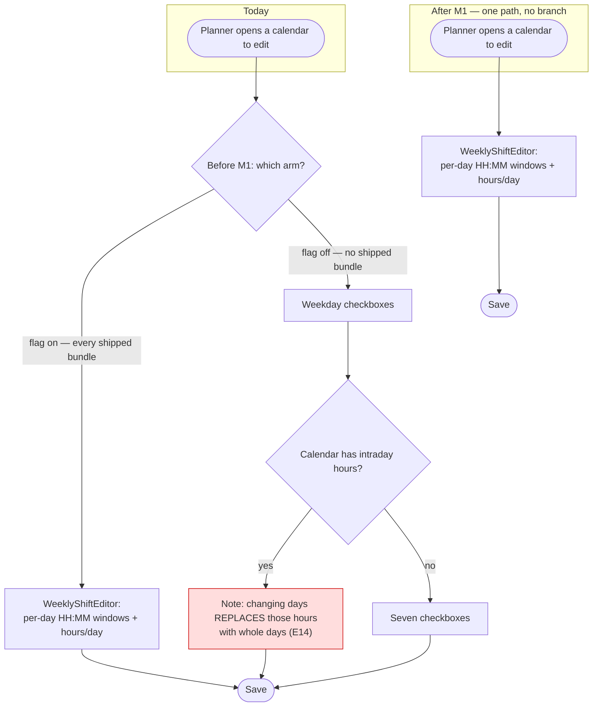

# Feature Spec: The next Class A feature-flag retirement (ADR-0088 D3)

- **Status:** Draft — awaiting approval
- **Author(s):** feature-analyst
- **Date:** 2026-08-10
- **Tracking issue / epic:** _(none yet)_
- **Roadmap link:** repository maintenance — ADR-0088 D3, the standing Class A retirement rule
- **Related ADR(s):** ADR-0088 (governing), ADR-0084 (D1/D5/D6 still live), ADR-0080, ADR-0081,
  ADR-0067, ADR-0068, ADR-0053, ADR-0058, ADR-0060, ADR-0061, ADR-0062, ADR-0076

> **Directory name.** This spec lives at `docs/specs/flag-retirement-activity-editor/` because that is
> where it was commissioned. **Its recommendation is not the activity editor.** See §1 "The
> recommendation is overturned" and OQ-1. The default is to rename the directory to
> `docs/specs/flag-retirement-batch-2/` on approval.

---

## 0. Evidence ledger (ADR-0076 §19.10)

Every decision-bearing claim below carries what established it. Read this before the argument,
because the argument turns on one claim that the commissioning brief and the register both had wrong.

| #       | Claim                                                                                                                  | How established                                                                                                                                                                                                 | Verdict                                                                                       |
| ------- | ---------------------------------------------------------------------------------------------------------------------- | --------------------------------------------------------------------------------------------------------------------------------------------------------------------------------------------------------------- | --------------------------------------------------------------------------------------------- |
| E1      | 56 live flags, 4 Class A, 52 Class B, 2 retired                                                                        | Read `scripts/flag-retirement.json` — counted `flags` keys and `class` values                                                                                                                                   | **Inherited from brief, verified true**                                                       |
| E2      | `classACap` = 4, actual Class A = 4 — the estate is at its ceiling                                                     | `scripts/flag-retirement.json:532`; `check-flags.mjs:135-142` compares `>` not `>=`                                                                                                                             | **Verified true.** Note the gate fires at 5, so the estate is _at_ the cap, not _over_ it     |
| E3      | `VITE_ACTIVITY_EDITOR_TABS` has 2 flag-OFF harnesses                                                                   | `playwright.assignment-lag.config.ts:74`, `playwright.sub-day.config.ts:75` — both `'false'`                                                                                                                    | **Verified true**                                                                             |
| E4      | `VITE_CALENDAR_SHIFT_EDITOR` has 0 flag-OFF harnesses                                                                  | Grepped all `playwright*.config.ts`; only `playwright.calendar-shifts.config.ts:64` pins it, `'true'`                                                                                                           | **Verified true**                                                                             |
| E5      | `VITE_LIBRARY_SCOPING` has 0 flag-OFF harnesses                                                                        | Only `playwright.library.config.ts:65`, `'true'`                                                                                                                                                                | **Verified true**                                                                             |
| E6      | `VITE_CANVAS_WORKSPACE` has 7 flag-OFF harnesses                                                                       | `playwright.config.ts:70`, `programme:63`, `activity-editor:74`, `assignment-lag:73`, `notes:61`, `sub-day:68`, `edit:72`                                                                                       | **Verified true**                                                                             |
| E7      | Non-test `apps/web/src` consumers, excluding `env.ts`: TABS 4, SHIFT_EDITOR 4, LIBRARY_SCOPING 12                      | `Grep` per constant, `files_with_matches`, tests filtered by hand                                                                                                                                               | **Verified true** (the brief's table excludes `env.ts`; stated here so the numbers reconcile) |
| **E8**  | **Retiring `VITE_ACTIVITY_EDITOR_TABS` does NOT delete `ActivityFormDialog`**                                          | `CreateActivityButton.tsx:47` renders it with **no flag reference anywhere in the file**; `ActivityEditorDialog.tsx:154` prop docblock: _"This editor is edit-only; creation stays with `ActivityFormDialog`."_ | **NEW — contradicts the register**                                                            |
| **E9**  | **The "nine receipts" tax survives the retirement**                                                                    | The nine `ActivityFormDialog.*.test.tsx` suites appear in **none** of the 12 files matching `ACTIVITY_EDITOR_TABS_ENABLED`. They test the component directly and are flag-unaware                               | **NEW — contradicts the register**                                                            |
| **E10** | **`VITE_ACTIVITY_EDITOR_TABS` has TWO derived children, and the register records NEITHER**                             | `env.ts:1031` (`ACTIVITY_EDITOR_CONVERGENCE_ENABLED`), `env.ts:1070` (`WBS_IMPROVEMENTS_ENABLED`); neither register entry carries `derivedFrom`                                                                 | **NEW**                                                                                       |
| **E11** | **The register records 3 of the 9 derivation edges in `env.ts`** — assertion 5 is decorative for six                   | `Grep` multiline `export const …_ENABLED[^;]*&&[^;]*;` over `env.ts` returned 9 edges (lines 168, 185, 671, 1030, 1069, 1098, 1132, 1502, 1526); register has `derivedFrom` on 3 flags                          | **NEW**                                                                                       |
| E12     | ADR-0088 contradicts itself on the cap: D3 says the measured count (five, ratcheting to four), Consequences says three | `docs/adr/0088-flag-classification.md:166,179` vs `:299`                                                                                                                                                        | **Inherited from brief, verified true**                                                       |
| E13     | `CLAUDE.md:1815` propagated the wrong number                                                                           | `CLAUDE.md:1815` — "a **cap of three**, so a fourth alternative surface fails CI"                                                                                                                               | **Inherited from brief, verified true**                                                       |
| E14     | The flag-off calendar branch can silently flatten an intraday shift pattern                                            | `CalendarFormDialog.tsx:219-220,529-535` — `weekIsSimplified` renders a note saying changing the days "replaces those hours with whole days"                                                                    | **Verified true**                                                                             |
| E15     | `WeekdayToggleGroup` is local to `CalendarFormDialog.tsx` and used only inside the flag-off arm                        | Defined `CalendarFormDialog.tsx:51`, sole use `:540`; no other match repo-wide                                                                                                                                  | **Verified true**                                                                             |
| E16     | `VITE_CALENDAR_SHIFT_EDITOR` is a parent of nothing                                                                    | It appears in no `&&` derivation in `env.ts` (E11's grep)                                                                                                                                                       | **Verified true**                                                                             |
| E17     | No schema change is involved                                                                                           | Blast radius is `apps/web/src`, `apps/web/playwright*.config.ts`, `apps/web/e2e-*`, `scripts/`, `docs/`. No `apps/api`, no `prisma/`                                                                            | **Verified true** — see §3                                                                    |

**Claims I did NOT verify and am not relying on:** the exact count of "135 no-op `'true'` pins across
39 flags" (ADR-0088 D6) and "17 flags with no off-branch test at all" (D7). Neither changes this
design. They are cited as context only, attributed to ADR-0088.

---

## 1. Business understanding

### Problem

ADR-0088 replaced ADR-0084's calendar with a classification. Class A — a flag whose value selects
which of two **different components** renders — is the only shape for which "a second product
maintained forever" is earned, and those flags retire **on merit and on epic-touch** under a standing
cap that ratchets down.

Three things are true today and pull against each other:

1. **The estate sits exactly on its cap.** `classACap` is 4 and Class A is 4 (E2). The next
   alternative surface anyone adds fails CI. That is the gate working as designed, but it means the
   cheapest moment to create headroom is now, before an epic needs it.
2. **No epic is currently touching any Class A surface**, so D3's preferred trigger — the person
   deleting the branch is the person who just paid for it — is not available. A deliberate,
   out-of-epic retirement therefore needs its own justification, and it should be the **cheapest**
   retirement that proves the process, not the most expensive.
3. **The register is wrong about its own contents in three separate ways** (E8/E9, E10/E11, E12/E13),
   and every one of those errors sits in the file or the ADR that governs which flag retires next.
   Retiring a flag on a register that mis-describes the estate is the ADR-0058 failure the whole
   decision was written to end.

### The recommendation is overturned

The brief proposed `VITE_ACTIVITY_EDITOR_TABS` first, on the register's own note calling it
_"arguably the worst case in the estate: at least nine unrelated features have had to add a case to
BOTH to keep them byte-identical."_ **That sentence is true about the codebase and false about the
flag**, and the difference decides the slice.

Reading the code (E8, E9):

- `ActivityEditorDialog` is **edit-only**, and says so in its own prop docblock:
  _"This editor is edit-only; creation stays with `ActivityFormDialog`."_
- `CreateActivityButton.tsx:47` renders `ActivityFormDialog` **unconditionally** — the file contains
  no flag reference at all.
- The nine `ActivityFormDialog.*.test.tsx` suites the register offers as receipts **do not mention
  the flag**. They are not flag-off parity suites; they are the create surface's own tests.

So retiring `VITE_ACTIVITY_EDITOR_TABS` deletes three legacy _mount sites_ and the edit arm of a
dialog that **keeps living as the create surface, with every one of the 22 fields those nine features
added**. The drift tax is not caused by the flag. It is caused by **create and edit being two
different components** — an ADR-0060 design decision that survives the retirement untouched.

That reverses the ranking completely. `VITE_ACTIVITY_EDITOR_TABS` is not the cheapest Class A
retirement with the biggest payoff; it is a **mid-cost retirement with a payoff the register
overstates**, carrying two spec-conversion harnesses (E3) and two unregistered derived children
(E10) that no other candidate has.

**Recommended order:**

| Rank  | Flag                         | Flag-off harnesses | Non-test src files | Derived children                 | Verdict                                                                                                   |
| ----- | ---------------------------- | ------------------ | ------------------ | -------------------------------- | --------------------------------------------------------------------------------------------------------- |
| **1** | `VITE_CALENDAR_SHIFT_EDITOR` | **0** (E4)         | 4 (E7)             | **0** (E16)                      | **Retire now.** Cleanest in the estate; its flag-on journey already exists and pins the _surviving_ world |
| **2** | `VITE_LIBRARY_SCOPING`       | **0** (E5)         | 12 (E7)            | 0                                | Retire next. Same shape, four times the surface                                                           |
| 3     | `VITE_ACTIVITY_EDITOR_TABS`  | 2 (E3)             | 4                  | **2** (E10)                      | **Defer to epic-touch.** Payoff overstated; register note must be corrected either way                    |
| 4     | `VITE_CANVAS_WORKSPACE`      | **7** (E6)         | 1                  | 1 (`CANVAS_AUTHORING`, recorded) | Defer. Largest conversion cost in the estate, as ADR-0088 D5 says                                         |

`VITE_CALENDAR_SHIFT_EDITOR` also carries the ADR-0080 argument the register reserves for
`VITE_CANVAS_TOOLBAR`, in a milder form: its flag-off branch is not merely unused, it is **actively
worse than the surviving one**. Editing an intraday calendar through the weekday toggles replaces its
hours with whole days, and the branch warns the reader about this in prose (E14) because it cannot
prevent it. That is live, maintained code, selectable by no shipped bundle, whose documented behaviour
is to destroy ADR-0036 shift data.

### Users

This is engineering-facing maintenance. **Nothing about the running application changes** — every
flag is compiled on and, per ADR-0088 D1, unreachable by any operator. Stated per role because the
process asks:

| Role                                                        | What changes                                                                                                                           |
| ----------------------------------------------------------- | -------------------------------------------------------------------------------------------------------------------------------------- |
| Org Admin / Planner / Contributor / Viewer / External Guest | **Nothing.** No behaviour, no permission, no screen                                                                                    |
| Operator                                                    | **Nothing.** A `VITE_` flag was never switchable on a deployed container (ADR-0088 D1)                                                 |
| Engineer                                                    | One fewer alternative surface to keep in step; a register that describes the estate correctly; a derived-flag gate that actually gates |

### Primary use cases

1. An engineer changes the calendar form and does not have to make the same change twice.
2. An engineer adds a derived flag and CI tells them the register is missing the edge.
3. An engineer reads `flag-retirement.json` to choose the next retirement and gets a true answer.
4. An engineer adds a fifth alternative surface and meets a cap whose number agrees across the gate,
   the ADR and `CLAUDE.md`.

### Expected outcomes

- Class A falls 4 → 3 (M1) → 2 (M2), with `classACap` ratcheting down in the same commit each time.
- `check:flags` assertion 5 becomes enforceable rather than decorative, covering 9 edges not 3.
- ADR-0088 and `CLAUDE.md` stop disagreeing with the shipped gate about the cap.
- The register stops asserting a payoff for `VITE_ACTIVITY_EDITOR_TABS` that the code does not deliver.

### Success criteria

- `pnpm check:flags` green with `classACap: 2` and 2 Class A flags at the end of M2.
- `pnpm lint && pnpm typecheck && pnpm test` green; `scripts/e2e-local.sh web:calendar-shifts` and
  `web:library` green **after** their retirements (they drive the surviving world).
- A deliberately-added ninth derivation edge with no `derivedFrom` fails `check:flags` — **verified
  red first** (M0-T2).
- No net loss of assertions: every test deleted is either a parity assertion about a branch that no
  longer exists, or re-hosted. Task-level accounting in the plan.

### Open questions

See §5. **OQ-1 and OQ-2 are the only critical ones**; everything else carries a stated default.

---

## 2. Functional requirements

There is no user-facing capability here, so the "user" in each story is an engineer and the
acceptance criteria are gate outcomes. This is deliberate and is what ADR-0081 §1 calls a milestone
that **ships dark** — except M1/M2, which do change a rendered surface for anyone who had the flag
off, i.e. nobody. Entry points are declared per milestone in the plan regardless.

> **US-1** — As an engineer, I want the flag register to record every derivation edge in `env.ts`, so
> that `check:flags` assertion 5 can actually refuse a child retiring before its parent.
>
> **Acceptance criteria**
>
> - **Given** `env.ts` declares `X_ENABLED = Y_ENABLED && flagDefaultOn(...)`, **when** the register
>   entry for `X` has no `derivedFrom: 'Y_ENABLED'`, **then** `pnpm check:flags` fails naming both.
> - **Given** the register records an edge `X → Y` **when** `env.ts` no longer contains it, **then**
>   `check:flags` fails (the edge is asserted in both directions — a stale edge is as wrong as a
>   missing one).
> - **Given** all 9 edges are recorded, **then** `check:flags` passes.
> - The check derives edges **from `env.ts`**, never from a hand-kept list, for the ADR-0088 D2 reason
>   that a hand-kept list is the drift.

> **US-2** — As an engineer, I want `VITE_CALENDAR_SHIFT_EDITOR` retired, so that "author a working
> week" has one implementation.
>
> **Acceptance criteria**
>
> - **Given** the retirement lands, **then** `CalendarFormDialog` renders `WeeklyShiftEditor` + the
>   hours-per-day section unconditionally, and `WeekdayToggleGroup` and `weekIsSimplified` no longer
>   exist (E15).
> - **Then** `calendarFormSchema`'s `workingWeekdays` refine drops the `CALENDAR_SHIFT_EDITOR_ENABLED ||`
>   conjunct and keeps only `WorkingWeekdays.isValid(mask)` — the empty (window-only) mask stays
>   valid, which is the flag-on behaviour ADR-0067 M4 shipped and the reason the conjunct exists.
> - **Then** `CalendarExceptionsEditor` and `CalendarsTable` lose their flag branches, keeping the
>   flag-on arm.
> - **Then** `playwright.calendar-shifts.config.ts` loses only its `env` pin; **the config and
>   `e2e-calendar-shifts/` survive** — they drive the world that remains.
> - **Then** the register moves the flag to `retired` with a note, and `classACap` becomes 3.
> - **Then** `pnpm check:flags` is green (assertion 4 would otherwise fail on the surviving `'true'`
>   pin as "dead config").

> **US-3** — As an engineer, I want `VITE_LIBRARY_SCOPING` retired, so that the four calendar/resource
> pickers have one implementation.
>
> **Acceptance criteria**
>
> - **Given** the retirement lands, **then** all four pickers (`ActivityCalendarField`,
>   `PlanCalendarPicker`, `ActivityResourcesPanel`, `ResourceFormDialog`) render `Combobox`
>   unconditionally and the `Select` arms are deleted.
> - **Then** the scope/archive/search surfaces in `CalendarsTable`, `ResourcesTable`,
>   `ProjectCalendarsSection`, `project-detail`, `resources`, `use-calendars`, `CalendarFormDialog`
>   and `ActivityFormDialog` lose their guards, keeping the flag-on arm.
> - **Then** `playwright.library.config.ts` loses only its pin; `e2e-library/` survives.
> - **Then** `classACap` becomes 2.

> **US-4** — As an engineer, I want the register's `VITE_ACTIVITY_EDITOR_TABS` note to describe what
> its retirement would actually achieve, so the next person choosing a slice is not misled.
>
> **Acceptance criteria**
>
> - **Then** the `classA` note records that `ActivityFormDialog` **survives** as the create surface
>   (E8), that the nine suites are flag-unaware (E9), and that the real cost is 2 harnesses + 2
>   derived children.
> - **Then** ADR-0088 §D2's table row and the paragraph beginning "**`VITE_ACTIVITY_EDITOR_TABS` is
>   arguably the worst case in the estate**" carry the correction **in place, not silently amended** —
>   the ADR-0088 house style for its own "the ADR said two, and the honest number is five".

> **US-5** — As an engineer, I want the cap to read the same number in the gate, the ADR and
> `CLAUDE.md`.
>
> **Acceptance criteria**
>
> - **Then** `docs/adr/0088-flag-classification.md:299` states the measured-and-ratcheting rule rather
>   than a literal, and `CLAUDE.md:1815` matches.
> - **Then** neither restates a number that a later retirement will falsify — the ADR-0073 C4 lesson
>   (a literal `20` that nineteen new actions overtook). The prose says _measured and ratcheting_;
>   `flag-retirement.json` holds the only number.

### Edge cases

| Case                                                        | Expected behaviour                                                                                                                              |
| ----------------------------------------------------------- | ----------------------------------------------------------------------------------------------------------------------------------------------- |
| Retiring a flag whose config pins it `'true'`               | `check:flags` assertion 4 fires as "dead config"; the pin line is deleted, **the config and its journey are kept**                              |
| Retiring a flag whose config pins it `'false'`              | Blocked. Convert the specs first (assertion 4). Not applicable to M1/M2 (E4/E5)                                                                 |
| Deleting a whole `playwright.*.config.ts`                   | **Only** when its specs drive the deleted branch (the `e2e-workspace` precedent). Not applicable here — both journeys drive the surviving world |
| A flag-off unit parity suite containing non-parity coverage | Re-host, do not delete (the `plan-detail.gating.test.tsx` precedent, ADR-0084 D5). `CalendarFormDialog.test.tsx` is exactly this case           |
| A derived child of a retiring flag                          | The child drops the conjunct; the child does **not** retire (ADR-0084 D4, register precedent `VITE_CANVAS_AUTHORING`). Not applicable to M1/M2  |
| `classACap` after retirement                                | Ratchets **down** in the same commit. Raising it needs an ADR                                                                                   |
| The empty (window-only) working week                        | Stays valid after M1. This is the ADR-0067 M4 behaviour, not a new permission                                                                   |

### Permissions

**No change.** No RBAC surface, no permission, no organisation scope and no pen (ADR-0028) behaviour
is touched. The calendar and library screens keep their existing `calendar:manage_org` gating
(ADR-0053) exactly — the flag never gated a permission, only which control rendered.

### Validation rules

One shared client-side rule changes shape without changing outcome: `calendarFormSchema`'s
`workingWeekdays` refine loses its flag conjunct (US-2). **The server rule is untouched** — the empty
mask has been valid at the domain and at the API since TECH_DEBT #79 (ADR-0036 §2), which the schema's
own comment records. So this narrows a _client_ bound to match the server, and the flag-on behaviour
is already the surviving one.

### Error scenarios

No runtime error surface changes. The failure modes are build-time:

| Scenario                                                    | Detection                                            | Result                                               |
| ----------------------------------------------------------- | ---------------------------------------------------- | ---------------------------------------------------- |
| Retired flag still pinned `'false'` by a config             | `check:flags` assertion 4                            | CI fails: "convert them first, or put the flag back" |
| Retired flag still pinned `'true'`                          | `check:flags` assertion 4                            | CI fails: "dead config — delete the line"            |
| Flag left in `env.ts` but moved to `retired`                | `check:flags` assertion 1                            | CI fails                                             |
| Class A count exceeds `classACap`                           | `check:flags` 3a                                     | CI fails: raise the cap in an ADR                    |
| A Class B flag grows a component-selecting ternary          | `check:flags` 3b + `detect-alternative-surfaces.mjs` | CI fails                                             |
| **A derivation edge in `env.ts` missing from the register** | **New, M0-T2**                                       | **CI fails** — today this passes silently (E11)      |

---

## 3. Technical analysis

| Area           | Impact                  | Notes                                                                                                                                                                                                                                                                                                     |
| -------------- | ----------------------- | --------------------------------------------------------------------------------------------------------------------------------------------------------------------------------------------------------------------------------------------------------------------------------------------------------- |
| Frontend       | **medium**              | M1: 4 non-test files + 1 parity suite. M2: 12 non-test files + several parity suites. Deletions of dead arms only; the surviving arm is unchanged                                                                                                                                                         |
| Backend        | **none**                | No `apps/api` file is touched                                                                                                                                                                                                                                                                             |
| Database       | **none**                | **Verified (E17): no model, column, index, constraint or data migration.** The database-architect agent is therefore **not** engaged — and this is the one place to say loudly that if review finds any schema delta, CLAUDE.md §19.3 makes that agent unconditional and the slice stops until it has run |
| API            | **none**                | No endpoint, DTO, status code or OpenAPI change                                                                                                                                                                                                                                                           |
| Security       | **none**                | No authN/Z, scope, input-validation or secret surface. The server remains the sole trust boundary; the client bound narrowed in US-2 is a UX bound, not a security one                                                                                                                                    |
| Performance    | **negligible-positive** | Dead branches removed from the bundle. No measurement claimed and none needed — **not** asserted as a win                                                                                                                                                                                                 |
| Infrastructure | **low**                 | `apps/web/package.json` script list and CI steps unchanged (both journeys survive). No env, container or compose change                                                                                                                                                                                   |
| Observability  | **none**                |                                                                                                                                                                                                                                                                                                           |
| Testing        | **high**                | The real work. Parity-suite deletion vs re-hosting per file, and two flag-on journeys that must stay green                                                                                                                                                                                                |
| **CPM engine** | **none — structurally** | The engine is not imported by any file in the blast radius. The ADR-0034 recalculation parity gate is untouched **by construction**; in its honest form, there is nothing here to hold parity for                                                                                                         |

### Dependencies

- **M0 must land before M1/M2.** The register cannot be the authority for a retirement while it
  mis-describes the derivation graph (E11) and the cap disagrees with itself (E12/E13).
- M1 and M2 are independent of each other and of M3.
- Nothing external. No third party, no other epic in flight on these surfaces (which is precisely why
  D3's epic-touch trigger is unavailable and this needs its own justification).

---

## 4. Solution design

### Architecture overview

The change is a **deletion of one arm at four (M1) then twelve (M2) selection sites**, plus one new
gate. Nothing is added to the runtime.

```mermaid
flowchart LR
  subgraph BEFORE["BEFORE — Class A = 4, cap 4 (at ceiling)"]
    direction TB
    F1["CALENDAR_SHIFT_EDITOR"] -->|on| A1["WeeklyShiftEditor<br/>+ Hours per day"]
    F1 -->|off| B1["WeekdayToggleGroup<br/>(flattens intraday hours — E14)"]
    F2["LIBRARY_SCOPING"] -->|on| A2["Combobox x4<br/>+ scope/archive/search"]
    F2 -->|off| B2["Select x4"]
    F3["ACTIVITY_EDITOR_TABS"] -->|on| A3["ActivityEditorDialog<br/>(EDIT ONLY)"]
    F3 -->|off| B3["ActivityFormDialog<br/>+ Progress + Steps"]
    F4["CANVAS_WORKSPACE"] -->|on| A4["PlanWorkspace"]
    F4 -->|off| B4["LegacyPlanLayout"]
    CREATE["CreateActivityButton<br/>(NO FLAG)"] --> B3
  end

  subgraph AFTER["AFTER M1+M2 — Class A = 2, cap 2"]
    direction TB
    A1b["WeeklyShiftEditor<br/>+ Hours per day"]
    A2b["Combobox x4<br/>+ scope/archive/search"]
    F3b["ACTIVITY_EDITOR_TABS<br/>(deferred to epic-touch)"] -->|on| A3b["ActivityEditorDialog"]
    F3b -->|off| B3b["ActivityFormDialog + Progress + Steps"]
    F4b["CANVAS_WORKSPACE<br/>(deferred — 7 harnesses)"] -->|on| A4b["PlanWorkspace"]
    F4b -->|off| B4b["LegacyPlanLayout"]
    CREATEb["CreateActivityButton<br/>(NO FLAG)"] --> B3b
  end

  BEFORE ==>|"M1: delete B1<br/>M2: delete B2"| AFTER

  style B1 fill:#fdd,stroke:#c00
  style B2 fill:#fdd,stroke:#c00
  style CREATE fill:#ffd,stroke:#c90
  style CREATEb fill:#ffd,stroke:#c90
```



**Read the amber node.** `CreateActivityButton → ActivityFormDialog` has **no flag on the edge** (E8),
and it is unchanged between BEFORE and AFTER. That single edge is the whole reason
`VITE_ACTIVITY_EDITOR_TABS` moves down the ranking: its flag-off branch cannot be deleted by retiring
the flag, because the create path holds it up.

### Data flow — how a retirement reaches CI

```mermaid
sequenceDiagram
  autonumber
  participant Dev as Engineer
  participant Env as apps/web/src/config/env.ts
  participant Src as apps/web/src (consumers)
  participant Cfg as playwright.*.config.ts
  participant Reg as scripts/flag-retirement.json
  participant Chk as pnpm check:flags
  participant E2E as scripts/e2e-local.sh

  Dev->>Src: delete the flag-off arm, keep the flag-on arm
  Dev->>Env: delete the constant + its docblock
  Dev->>Cfg: delete ONLY the 'true' pin line (keep config + specs)
  Dev->>Reg: flags{} -> retired[] with a note; classACap--
  Dev->>Chk: run
  Chk->>Env: assertion 1 - declared set == register set
  Chk->>Cfg: assertion 4 - no config pins a retired flag
  Chk->>Reg: 3a - every flag classified; classA <= classACap
  Chk->>Src: 3b - detected alternative surfaces subset-of classA
  Chk->>Env: NEW (M0) - every && derivation edge is recorded
  Chk-->>Dev: green
  Dev->>E2E: web:calendar-shifts (M1) / web:library (M2)
  E2E-->>Dev: the SURVIVING world still works
```

The last two steps are the gate that batch 1 lacked. `check:flags` proves the register is consistent;
only the journey proves the product still works — and per ADR-0088's own correction, the journey to
run is the one pinning the flag **`'true'`**, never the one that drove the deleted branch.

### User flow



The planner-visible flow after M1 is **the flow every planner already has**, because every shipped
bundle compiles the flag on. What is removed is a second path nobody could reach whose documented
behaviour was to discard shift data.

### Database changes

**None (E17).** No model, column, index, constraint, relationship or data migration. The
database-architect agent is not engaged for this reason and no other. If any task in the plan is found
to imply a schema delta, CLAUDE.md §19.3 applies **unconditionally** and that task stops until the
agent has run — including the judgement about whether the change is big enough to need it, which is
the judgement the agent exists to make.

### API changes

**None.** No endpoint, path, DTO, status code, envelope, pagination or OpenAPI change.

### Component changes

**M1 — `VITE_CALENDAR_SHIFT_EDITOR` (4 non-test files + `env.ts`):**

| File                                                         | Change                                                                                                                                                                                                                                                                                                                                         |
| ------------------------------------------------------------ | ---------------------------------------------------------------------------------------------------------------------------------------------------------------------------------------------------------------------------------------------------------------------------------------------------------------------------------------------- |
| `features/calendars/components/CalendarFormDialog.tsx`       | Delete the `WeekdayToggleGroup` function (`:51`), the `weekIsSimplified` derivation (`:219`) and the entire flag-off `FormSection` arm (`:524-549`). Unconditionalise `WeeklyShiftEditor` + "Standard working day" (`:467-523`), the seeding effect (`:232`), `parsedWeek` (`:252`), the submit branch (`:287`) and the dialog `size` (`:361`) |
| `features/calendars/schemas/calendar-schemas.ts`             | Drop the `CALENDAR_SHIFT_EDITOR_ENABLED \|\|` conjunct from the `workingWeekdays` refine (`:118`); rewrite the comment, which is _about_ the flag                                                                                                                                                                                              |
| `features/calendars/components/CalendarExceptionsEditor.tsx` | Unconditionalise `OFFERED_KINDS` (`:65`), the hours editor (`:121`) and the three render branches (`:403,408,426,437`)                                                                                                                                                                                                                         |
| `features/calendars/components/CalendarsTable.tsx`           | Unconditionalise the intraday badge (`:208`)                                                                                                                                                                                                                                                                                                   |
| `config/env.ts`                                              | Delete `CALENDAR_SHIFT_EDITOR_ENABLED` (`:1170`) and its docblock                                                                                                                                                                                                                                                                              |

**M2 — `VITE_LIBRARY_SCOPING` (12 non-test files + `env.ts`):** `ActivityCalendarField.tsx`,
`PlanCalendarPicker.tsx`, `ActivityResourcesPanel.tsx`, `ResourceFormDialog.tsx` (the four pickers);
`CalendarsTable.tsx`, `ResourcesTable.tsx`, `ProjectCalendarsSection.tsx`, `CalendarFormDialog.tsx`,
`ActivityFormDialog.tsx`, `routes/project-detail.tsx`, `routes/resources.tsx`,
`features/calendars/api/use-calendars.ts`. Every site keeps the flag-on arm.

Loading / empty / error states are **not** re-designed. Each surviving arm already owns its own; the
work is deletion of the alternative, and any state change would be a behaviour change smuggled into a
refactor.

### Implementation approach & alternatives

**Chosen: M0 (register truth) → M1 (cheapest Class A) → M2 (next cheapest) → M3 (record the rest).**

The ordering is not preference. M0 first because the register is the authority M1/M2 act on, and it is
wrong in three ways that all bear on which flag is chosen. M1 before M2 because 4 files is a better
first proof of the process than 12. Both before any consideration of `ACTIVITY_EDITOR_TABS`, because
that flag's payoff is overstated (E8/E9) and its cost is understated (E10).

**Alternatives considered:**

1. **`VITE_ACTIVITY_EDITOR_TABS` first (the brief's proposal).** Rejected on E8/E9: it does not delete
   `ActivityFormDialog`, so the nine-receipt drift tax the register cites as the reason survives
   intact. It is also the only candidate with both a spec-conversion cost (2 harnesses) and
   unregistered derived children. It should retire when an epic next touches the activity editor —
   ideally the same epic that unifies create and edit, which is the change that _would_ collect the
   payoff. **Recorded as a `docs/TECH_DEBT.md` row with a trigger** rather than a date, per ADR-0088
   D5's own correction that an undated intention rots.

2. **`VITE_CANVAS_WORKSPACE` first.** Rejected: 7 flag-off harnesses (E6), the largest conversion cost
   in the estate, which ADR-0088 D5 already says.

3. **Do nothing — keep all four (the product owner's opening position, ADR-0088 "Options rejected").**
   Partly right and already honoured for the 52 Class B flags. Not right for a branch that is a second
   screen: the estate is on its cap (E2), so "do nothing" means the next epic that wants an
   alternative surface meets a red build with no headroom and has to argue about the cap under time
   pressure — which is exactly when the wrong answer gets taken.

4. **Raise `classACap` to 5 instead of retiring anything.** Rejected. The cap ratchets _down_ by
   design; raising it needs an ADR and would be buying headroom with the thing the gate protects.

5. **Do M0's derivation gate as a hand-kept list.** Rejected for ADR-0088 D2's reason — a hand-kept
   list is the drift. The check derives from `env.ts`.

6. **Fold the ADR-0088 cap correction into a new ADR.** Rejected as disproportionate. ADR-0088 is
   **Proposed**, not Accepted, and this is an internal self-contradiction between its own D3 and its
   own Consequences (E12) — a correction in place, in ADR-0088's own house style, not a superseding
   decision.

**Is an ADR required?** **No.** This executes ADR-0088 D3 as written and corrects two drift sites
within it. It creates no new architectural rule. The one genuinely new thing — the derivation-edge
gate (M0-T2) — is an ADR-0058 computed gate for a rule ADR-0088 D4/assertion 5 already states, i.e.
enforcement of an accepted decision rather than a new one. If review disagrees, the ADR outline is:
_"Derivation edges are derived from `env.ts`, not declared"_ — problem: assertion 5 is decorative for
6 of 9 edges; options: hand-maintain / derive / delete the assertion; choice: derive; trade-off: the
check must parse `env.ts`, which couples it to that file's shape; consequence: a flag pair that cannot
be parsed fails loud rather than passing silently.

## 5. Open questions

**CRITICAL — these change scope or subject:**

- **OQ-1 — Do you accept the substitution?** The brief commissioned
  `VITE_ACTIVITY_EDITOR_TABS`; this spec recommends `VITE_CALENDAR_SHIFT_EDITOR` first on E8/E9.
  _Default if you do not answer:_ proceed with `VITE_CALENDAR_SHIFT_EDITOR` (M1) and
  `VITE_LIBRARY_SCOPING` (M2), and record `ACTIVITY_EDITOR_TABS` as deferred with its trigger.
- **OQ-2 — One retirement or two?** M1 and M2 are independent; M2 is three times the surface.
  _Default:_ do both, as separate revertible commits, M1 first — the cap then reads 2 and the estate
  has real headroom.

**Non-critical — defaults stated, work is not blocked:**

- **OQ-3 — Directory name.** _Default:_ rename to `docs/specs/flag-retirement-batch-2/` on approval,
  since the artefacts are not about the activity editor. Say so if you would rather keep the path.
- **OQ-4 — `CalendarFormDialog.test.tsx`.** It is the flag-off parity suite (deleted per ADR-0084 D5)
  but also holds a PATCH-body regression ("the flattening defect"). _Default:_ re-host that assertion
  onto the surviving dialog before deleting the file — the `plan-detail.gating.test.tsx` precedent.
  Task-level accounting is in the plan and nothing is deleted without a named destination.
- **OQ-5 — Correcting ADR-0088 in place.** _Default:_ correct D2's `ACTIVITY_EDITOR_TABS` paragraph
  and the Consequences cap sentence **in place with the correction visible**, matching how that ADR
  handled its own "the ADR said two, and the honest number is five". No new ADR.
- **OQ-6 — Where the deferred `ACTIVITY_EDITOR_TABS` finding is recorded.** _Default:_ a new
  `docs/TECH_DEBT.md` row (next free number — **#119** at time of writing; verify before use) with the
  trigger "the next epic touching the activity editor, or any epic unifying create and edit", plus the
  E8/E9 evidence so the next reader does not re-derive it.
- **OQ-7 — Scope of the derivation gate.** _Default:_ assert both directions (missing edge **and**
  stale edge) over `env.ts` only. Cross-package flags are out of scope; there are none.

## 6. Links

- Implementation plan: [`./implementation-plan.md`](./implementation-plan.md)
- Docs this change updates: `docs/adr/0088-flag-classification.md`, `CLAUDE.md` (§16 ADR-0088 entry),
  `scripts/flag-retirement.json`, `scripts/check-flags.mjs`, `docs/TECH_DEBT.md`,
  `docs/adr/0067-*` and `docs/adr/0053-*` (rollback-contract sentences that stop being true)
