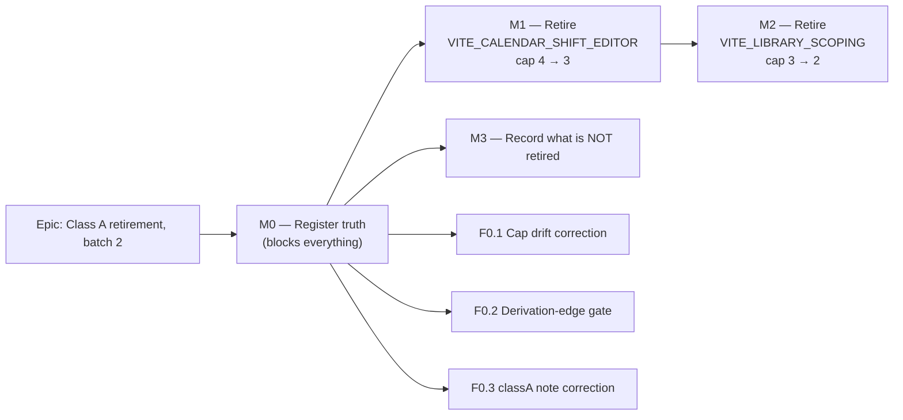

# Implementation Plan: The next Class A feature-flag retirement (ADR-0088 D3)

- **Feature spec:** [`./feature-spec.md`](./feature-spec.md)
- **Status:** Draft — awaiting approval
- **Owner:** _(unassigned)_

> **Subject substitution.** This plan retires **`VITE_CALENDAR_SHIFT_EDITOR`** then
> **`VITE_LIBRARY_SCOPING`**, not `VITE_ACTIVITY_EDITOR_TABS`. The reason is spec §1 "The
> recommendation is overturned" and evidence E8/E9: retiring the activity-editor flag does **not**
> delete `ActivityFormDialog`, because `CreateActivityButton.tsx:47` renders it unflagged and
> `ActivityEditorDialog` is edit-only by design. See spec OQ-1.

## Breakdown

### Epic

**Class A retirement, batch 2** — take the alternative-surface count from 4 to 2 under ADR-0088 D3,
and make the register that governs it true first. Maps to repository maintenance (CLAUDE.md §21
change management), not to a product roadmap theme.

---

## Milestone M0 — Register truth (blocks M1 and M2)

**Outcome:** `scripts/flag-retirement.json`, `check-flags.mjs`, ADR-0088 and `CLAUDE.md` agree with
each other and with `env.ts`. Assertion 5 gains teeth.

**Entry point:** **Ships dark** (ADR-0081 §1) — no user-facing capability. Its reachable surface is
`pnpm check:flags`, which every engineer runs via the pre-push gate and CI. There is no screen and
none is claimed.

**Journey:** none (no UI). The gate is the proof, and each new assertion is **verified red first**.

---

#### Feature F0.1 — The cap says the same number everywhere

> **Description:** ADR-0088 D3 defines the cap as the measured Class A count, ratcheting down, and
> explicitly records that drafts proposing three and two were rejected as the aspirational-80%
> mistake. Its own Consequences section then says "Class A is capped at three", and `CLAUDE.md:1815`
> propagated that. The shipped gate uses 4. This is ADR-0076 Class 1 inside the ADR written about it.
> **Complexity:** S
> **Dependencies:** none
> **Risks:** restating a literal that the very next retirement falsifies → the fix states the _rule_
> (measured, ratcheting) and leaves `flag-retirement.json` as the only place a number lives. This is
> the ADR-0073 C4 lesson (a literal `20` overtaken by nineteen new actions).
> **Testing requirements:** no code change, so no test. `pnpm check:doc-links` must stay green.

##### Task M0-T1 — Correct the cap in ADR-0088 and CLAUDE.md (≈ one PR, folded with M0-T2/T3)

- **Description:** `docs/adr/0088-flag-classification.md:299` and `CLAUDE.md:1815` stop naming a
  literal cap and state the measured-and-ratcheting rule, with the contradiction recorded rather than
  silently amended (ADR-0088's own house style).
- **Complexity:** S
- **Dependencies:** none
- **Risks:** a silent edit teaches nothing → the correction is written _as_ a correction, one sentence,
  naming that D3 and Consequences disagreed and the gate was right.
- **Testing:** `pnpm check:doc-links`.
- **Development steps:**
  1. Edit ADR-0088 Consequences: replace "Class A is capped at three" with the rule + a parenthetical
     recording that this sentence said "three" while D3 said the measured count.
  2. Edit `CLAUDE.md:1815` to match (it currently says "a **cap of three**, so a fourth alternative
     surface fails CI" — both halves are wrong: the cap is 4 and it is a _fifth_ that fails).
  3. Confirm no third site: grep `cap of three|capped at three` returns nothing.

---

#### Feature F0.2 — A derivation edge in `env.ts` must be in the register

> **Description:** `check-flags.mjs` assertion 5 refuses a child retiring before its parent, and reads
> the parent from a hand-written `derivedFrom` field. **`env.ts` contains 9 derivation edges; the
> register records 3** (spec E11). Six are invisible, including both children of
> `VITE_ACTIVITY_EDITOR_TABS` (E10). The assertion is therefore decorative for two-thirds of the
> graph, and — like the under-detecting detector ADR-0088 D2 warns about — **fails silently**.
> **Complexity:** M
> **Dependencies:** none
> **Risks:**
>
> - Parsing `env.ts` couples the check to that file's shape → the parser is deliberately narrow
>   (`export const X_ENABLED … Y_ENABLED &&`) and **fails loud on an unparseable pair** rather than
>   skipping it, which is the whole failure mode being fixed.
> - A false positive blocks CI on day one → verified against the current tree before the register is
>   edited, so the exact 9 edges are known before the assertion is armed.
>   **Testing requirements:** the check must be **verified red first** in both directions (missing edge,
>   stale edge) and then green on the corrected register.

##### Task M0-T2 — Derive `derivedFrom` from `env.ts` and assert both directions

- **Description:** Add an assertion to `check-flags.mjs`: the set of `X_ENABLED = … Y_ENABLED && …`
  edges parsed from `env.ts` must equal the set of `derivedFrom` edges in the register. Backfill the
  six missing entries.
- **Complexity:** M
- **Dependencies:** none
- **Risks:** the six backfilled edges could re-order batches through assertion 5 (`childDue < parentDue`
  fails) → **check this before backfilling.** If any pair now fails, that is a real pre-existing
  inversion the gate could not see, and it is fixed by moving the child's batch later, not by dropping
  the edge.
- **Testing:**
  - Red first: delete one `derivedFrom` → expect a named failure. Add a bogus edge → expect a named
    failure. Both before the real backfill.
  - Green: full `pnpm check:flags` after backfill.
- **Development steps:**
  1. Re-derive the edge list from `env.ts` (expected 9: lines 168, 185, 671, 1030, 1069, 1098, 1132,
     1502, 1526). **Re-run rather than trusting this list** — it is a spec-time reading.
  2. Write the parser + assertion in `check-flags.mjs`, docblocked with _why_ (assertion 5 was
     decorative for 6 of 9), in the file's existing voice.
  3. Verify red both ways.
  4. Backfill `derivedFrom` for `VITE_ACTIVITY_EDITOR_CONVERGENCE`, `VITE_WBS_IMPROVEMENTS`,
     `VITE_CANVAS_AUTHORING_FLOW`, `VITE_CANVAS_LINK_ROUTING`, `VITE_CANVAS_SEARCH_NAV`,
     `VITE_CANVAS_MULTI_SELECT`.
  5. Run `pnpm check:flags`; resolve any assertion-5 batch inversion the new edges expose.
  6. Update the script docblock's assertion list (it enumerates 1–5).

---

#### Feature F0.3 — The register stops overstating `VITE_ACTIVITY_EDITOR_TABS`

> **Description:** The `classA` map calls it "arguably the worst case in the estate: at least nine
> unrelated features have had to add a case to BOTH". True about the codebase, false about the flag
> (E8/E9). The next person choosing a slice reads this note.
> **Complexity:** S
> **Dependencies:** none
> **Risks:** deleting the note loses the real finding → it is **corrected, not removed**: the nine
> suites are real, and the note now says what actually causes them.
> **Testing requirements:** none (data + prose). `check:flags` must stay green.

##### Task M0-T3 — Correct the `classA` note and ADR-0088 D2

- **Description:** Rewrite `flag-retirement.json`'s `classA.VITE_ACTIVITY_EDITOR_TABS` value and the
  corresponding ADR-0088 D2 table row + paragraph.
- **Complexity:** S
- **Dependencies:** none
- **Risks:** as above.
- **Testing:** `pnpm check:flags`, `pnpm check:doc-links`.
- **Development steps:**
  1. Re-verify E8 by reading `CreateActivityButton.tsx` and `ActivityEditorDialog.tsx:154` — do not
     take this plan's word for it (ADR-0076: the brief is not evidence, and this plan is a brief).
  2. Rewrite the note: selects edit-only editor vs legacy trio; `ActivityFormDialog` **survives** as
     the create surface; the nine suites are flag-unaware and therefore survive; the real cost is 2
     flag-off harnesses + 2 derived children.
  3. Correct ADR-0088 D2's paragraph in place, in its own house style, recording that the "nine
     receipts" argument was assembled without checking whether the flag-off component had another
     caller.

---

## Milestone M1 — Retire `VITE_CALENDAR_SHIFT_EDITOR` (cap 4 → 3)

**Outcome:** "Author a working week" has one implementation. A planner's experience is unchanged
(every shipped bundle already compiles the flag on); a second path that flattens intraday shift data
stops existing.

**Entry point:** **Calendars** → open any calendar → the **Working week** editor (`WeeklyShiftEditor`,
per-day `HH:MM` window rows) and the **Standard working day** → **Hours per day** field. That is the
surface that must still work, and it is what the journey drives.

**Journey:** `scripts/e2e-local.sh web:calendar-shifts` (`apps/web/e2e-calendar-shifts/calendar-shifts.spec.ts`,
its own CI step). **This is the correct gate and the wrong one is instructive:** ADR-0088 recorded that
its first draft named the harness driving the _deleted_ branch, which is batch 1 verbatim.
`playwright.calendar-shifts.config.ts` pins the flag **`'true'`**, so it drives the world that
survives. There is no flag-off harness for this flag (E4), so nothing needs converting.

---

#### Feature F1.1 — Delete the flag-off calendar-authoring branch

> **Description:** Remove `WeekdayToggleGroup`, `weekIsSimplified` and the legacy "Working week"
> section; unconditionalise the shift editor, the hours-per-day section and the four
> `CALENDAR_SHIFT_EDITOR_ENABLED` guards in `CalendarExceptionsEditor` and `CalendarsTable`.
> **Complexity:** M
> **Dependencies:** M0
> **Risks:**
>
> - An unconditionalised branch drags in a state the flag-off path used to skip (e.g. the seeding
>   effect at `CalendarFormDialog.tsx:232`, gated on the flag) → each unconditionalisation is checked
>   against its flag-on behaviour, not merely de-indented.
> - The `size` prop at `:361` is `isEdit || CALENDAR_SHIFT_EDITOR_ENABLED ? 'lg' : 'md'` — dropping
>   the conjunct makes it unconditionally `'lg'`, which is the flag-on behaviour and a **visible**
>   change for the create dialog. Correct, but a reviewer will read it as unrelated → called out in
>   the PR description.
>   **Testing requirements:** unit suites for the calendar form/exceptions/table green; the flag-on
>   journey green; a11y unaffected (no new interactive element).

##### Task M1-T1 — `CalendarFormDialog.tsx`

- **Description:** Delete the flag-off arm and the dead helper; unconditionalise the flag-on arm.
- **Complexity:** M
- **Dependencies:** M0-T2
- **Risks:** `WeekdayToggleGroup` deletion assumed safe on E15 (local, single use) → re-grep before
  deleting.
- **Testing:** existing `CalendarFormDialog.shifts.test.tsx`, `CalendarFormDialog.scope.test.tsx`
  unchanged and green. **Every assertion in these files must still pass without edit** — they are the
  before/after oracle (the ADR-0078 barrel-preserving argument applied to a deletion).
- **Development steps:**
  1. Re-grep `WeekdayToggleGroup` and `weekIsSimplified`; confirm E15.
  2. Delete the function (`:51`), the derivation (`:219-220`) and the flag-off `FormSection`
     (`:524-549`).
  3. Unconditionalise `:232` (seed effect), `:252` (`parsedWeek`), `:264`, `:287` (submit), `:361`
     (size), `:467` (render).
  4. Remove the now-unused import of `CALENDAR_SHIFT_EDITOR_ENABLED`; check whether
     `hasIntradayDetail` is still used in this file (it is imported at `:9` for `weekIsSimplified`) —
     remove the import if not.
  5. Run the calendar unit suites.

##### Task M1-T2 — `calendar-schemas.ts`, `CalendarExceptionsEditor.tsx`, `CalendarsTable.tsx`

- **Description:** Drop the refine conjunct and the remaining guards.
- **Complexity:** S
- **Dependencies:** M1-T1
- **Risks:** the refine comment is _about_ the flag and explains why the bound moves with it →
  rewritten, not deleted: the empty mask is valid, and the comment should keep TECH_DEBT #79 /
  ADR-0036 §2 and the ADR-0067 M4 dead-end story, which is why it is valid.
- **Testing:** schema unit tests; `CalendarExceptionsEditor.hours.test.tsx`;
  `CalendarsTable.archive.test.tsx` / `.scope.test.tsx`.
- **Development steps:**
  1. `calendar-schemas.ts:118` → `WorkingWeekdays.isValid(mask)`; rewrite the comment.
  2. `CalendarExceptionsEditor.tsx:65,121,403,408,426,437` → keep the flag-on arm.
  3. `CalendarsTable.tsx:208` → unconditional intraday badge.
  4. Remove the imports.

##### Task M1-T3 — Parity-suite disposition (the accounting task)

- **Description:** `CalendarFormDialog.test.tsx` pins `CALENDAR_SHIFT_EDITOR_ENABLED: false` and is
  the flag-off parity suite. ADR-0084 D5 deletes it; ADR-0088's `VITE_CANVAS_TOOLBAR` precedent says
  coverage that merely _happened to live there_ is **re-hosted**, not lost.
- **Complexity:** M
- **Dependencies:** M1-T1, M1-T2
- **Risks:** **this is where assertions get lost silently.** The file contains at least one non-parity
  regression (the PATCH-body "flattening defect" check) → mitigation is a written per-`it()` ledger in
  the PR: _deleted (asserts the removed branch)_ or _re-hosted to `<file>`_. Nothing is deleted without
  a named destination.
- **Testing:** the re-hosted assertions must be **verified red** against a deliberately reintroduced
  bug, or they are not carrying the coverage they claim to.
- **Development steps:**
  1. Enumerate every `it()` in `CalendarFormDialog.test.tsx`; classify each.
  2. Re-host the survivors onto `CalendarFormDialog.shifts.test.tsx` (or a new sibling if the subject
     does not fit).
  3. Verify each re-hosted assertion red, then green.
  4. Delete the file.
  5. Repeat the sweep for any other suite pinning this flag `false` — re-grep rather than trusting the
     spec's list.

##### Task M1-T4 — Retire the flag, ratchet the cap, run the journey

- **Description:** Remove the constant, delete the config pin, move the register entry, ratchet
  `classACap` 4 → 3.
- **Complexity:** S
- **Dependencies:** M1-T1..T3
- **Risks:**
  - **Deleting `playwright.calendar-shifts.config.ts` would delete the journey covering the surviving
    surface** — the exact mistake ADR-0088 caught in its own first draft. → Delete **only** the
    `env: { VITE_CALENDAR_SHIFT_EDITOR: 'true' }` block (that is the config's sole `env` key, so the
    key goes too). Keep the config, the spec, the `test:e2e:calendar-shifts` script and the CI step.
  - A rollback sentence elsewhere becomes false → grep ADR-0067/ADR-0068 and the CLAUDE.md §16
    ADR-0067 entry for "set `VITE_CALENDAR_SHIFT_EDITOR=false`" and correct.
- **Testing:** `pnpm check:flags`; full pre-push gate; **`scripts/e2e-local.sh web:calendar-shifts`
  run locally, not left to CI** (CLAUDE.md §19.8 — omitting it cost five CI rounds on ADR-0063).
- **Development steps:**
  1. Delete `CALENDAR_SHIFT_EDITOR_ENABLED` + docblock from `env.ts:1170`.
  2. Delete the pin from `playwright.calendar-shifts.config.ts:64`; keep everything else.
  3. Move the register entry `flags{}` → `retired[]` with a note in the `VITE_CANVAS_TOOLBAR` style:
     what the flag-off branch was, why it went, what was deleted vs re-hosted, and that
     `e2e-calendar-shifts` was **kept** because it pins the surviving world.
  4. Remove the `classA` map entry; set `classACap: 3`.
  5. `pnpm check:flags` — expect green; a failure here names its own remedy.
  6. Pre-push gate + the journey.
  7. Changeset (`patch`, `web`): user-visible surface unchanged, so the note says exactly that.
  8. Update the CLAUDE.md §16 ADR-0067 entry if it asserts a rollback that no longer exists.

---

## Milestone M2 — Retire `VITE_LIBRARY_SCOPING` (cap 3 → 2)

**Outcome:** The four calendar/resource pickers and the library screens have one implementation.

**Entry point:** **Calendars** and **Resources** library screens (scope badge, archive filter, search),
the project-detail **Calendars** section, and the four pickers — activity calendar
(`ActivityCalendarField`), plan calendar (`PlanCalendarPicker`), activity resources
(`ActivityResourcesPanel`), resource form (`ResourceFormDialog`).

**Journey:** `scripts/e2e-local.sh web:library` (`apps/web/e2e-library/library.spec.ts`, its own CI
step). Pins the flag `'true'` (E5), so it drives the surviving world — same reasoning as M1.

---

#### Feature F2.1 — Delete the `Select` arms and the scoping guards

> **Description:** Twelve non-test files, keeping the flag-on arm at every site.
> **Complexity:** L
> **Dependencies:** M1 (sequencing only — the two are technically independent, but landing M1 first
> proves the process on 4 files before 12)
> **Risks:**
>
> - **Mixed branch shapes.** Only 4 of the 12 sites are true alternative surfaces (`Combobox` vs
>   `Select`); the rest are `&&` guards and conditional query args. A mechanical de-guard could change
>   a _query_ rather than a render — `use-calendars.ts:226-231` switches which query is enabled and
>   which result is returned. → That file is its own task with its own test.
> - Four pickers × one drift risk is the register's own description; deleting four `Select` arms in
>   one PR is the largest single deletion here → split by feature area (calendars / resources /
>   activities+plans) so a revert is surgical.
>   **Testing requirements:** every library/resource/calendar unit suite; the flag-on journey; **the
>   flag-off parity suites are the accounting problem again**, and there are more of them than in M1.

##### Task M2-T1 — Calendars area

- **Description:** `CalendarsTable.tsx`, `ProjectCalendarsSection.tsx`, `CalendarFormDialog.tsx`,
  `routes/project-detail.tsx`.
- **Complexity:** M
- **Dependencies:** M0
- **Risks:** `CalendarsTable` has 10+ guards including query args (`:120-121,147,153`) → check each
  against flag-on behaviour rather than de-indenting.
- **Testing:** `CalendarsTable.scope.test.tsx`, `.archive.test.tsx`, `library-filter-state.test.tsx`,
  `ProjectCalendarsSection.test.tsx`, `CalendarFormDialog.scope.test.tsx`.
- **Development steps:** unconditionalise each site; remove imports; run suites.

##### Task M2-T2 — `use-calendars.ts` (the query-shape site)

- **Description:** `:226-231` selects between an org query and a project query. This is the one site
  where the flag changes **what is fetched**, not what is rendered.
- **Complexity:** S
- **Dependencies:** M2-T1
- **Risks:** removing the wrong branch silently changes which calendars a picker offers → the
  surviving branch is the **project** query (`LIBRARY_SCOPING_ENABLED ? project : org`); assert it.
- **Testing:** add/keep a test asserting the project-scoped query is the one issued.
- **Development steps:** delete the org query and the ternary; keep `project`; remove the `enabled`
  conjuncts; run the calendar picker suites.

##### Task M2-T3 — Resources area

- **Description:** `ResourcesTable.tsx`, `ResourceFormDialog.tsx`, `ActivityResourcesPanel.tsx`,
  `routes/resources.tsx`.
- **Complexity:** M
- **Dependencies:** M0
- **Risks:** `ResourceFormDialog` gates the `GROUP` kind and the parent picker (`:150,156,185,303,318,362,411`)
  — the flag-off arm hides an entire ADR-0053 M3 capability. Deleting it is correct and is a
  **capability-visible** change for anyone on the flag-off branch (nobody) → stated in the PR.
- **Testing:** `ResourcesTable.hierarchy.test.tsx`, `.archive.test.tsx`,
  `ResourceFormDialog.hierarchy.test.tsx`, `.scope.test.tsx`, `ActivityResourcesPanel.test.tsx`.
- **Development steps:** as M2-T1.

##### Task M2-T4 — Activity + plan pickers

- **Description:** `ActivityCalendarField.tsx`, `PlanCalendarPicker.tsx`, `ActivityFormDialog.tsx`.
- **Complexity:** S
- **Dependencies:** M2-T1
- **Risks:** `ActivityFormDialog` is the **create** surface (spec E8) and is on the critical path for
  every new activity → its suites must pass unedited.
- **Testing:** `PlanCalendarPicker.scope.test.tsx`, `.test.tsx`, `ActivityFormDialog.calendar.test.tsx`,
  `.scope.test.tsx`, `.sub-day.test.tsx`.
- **Development steps:** as M2-T1.

##### Task M2-T5 — Parity-suite disposition (accounting)

- **Description:** Dispose of every suite pinning `LIBRARY_SCOPING_ENABLED: false` — at least
  `library-scoping-flag-off.test.tsx`, `ResourcesTable.hierarchy.flag-off.test.tsx`,
  `ResourcesTable.test.tsx`, `ActivityResourcesPanel.test.tsx`,
  `ActivityResourcesPanel.assignment-lag.flag-off.test.tsx`, and the four
  `ActivityResourcesDialog.*.test.tsx` suites that pin it off **to keep the base picker**.
- **Complexity:** L
- **Dependencies:** M2-T1..T4
- **Risks:** **the largest risk in the plan.** Several of these pin the flag off _incidentally_ — their
  own comments say so ("pinned OFF so the assign form's resource picker stays the BASE") — meaning they
  are **not** parity suites at all; they are earned-value / duration-type / curve / assignment-lag
  suites that chose the simpler picker. Deleting them under ADR-0084 D5 would delete unrelated
  coverage. → Each is **converted** (re-pointed at the `Combobox`), not deleted. Only
  `library-scoping-flag-off.test.tsx` and `*.flag-off.test.tsx` are true parity suites.
- **Testing:** per-`it()` ledger as in M1-T3; re-hosted/converted assertions verified red first.
- **Development steps:**
  1. Re-grep for `LIBRARY_SCOPING_ENABLED: false`; classify each file as _parity_ or _incidental_.
  2. Convert the incidental ones to drive the `Combobox`.
  3. Delete the true parity suites.
  4. Ledger in the PR description.

##### Task M2-T6 — Retire the flag, ratchet the cap, run the journey

- **Description:** As M1-T4, for `VITE_LIBRARY_SCOPING`; `classACap: 2`.
- **Complexity:** S
- **Dependencies:** M2-T1..T5
- **Risks:** deleting `playwright.library.config.ts` → **do not**; delete only the pin.
- **Testing:** `pnpm check:flags`; pre-push gate; `scripts/e2e-local.sh web:library` locally.
- **Development steps:** mirror M1-T4 steps 1–8, updating the CLAUDE.md §16 ADR-0053 entry where it
  asserts a rollback contract that no longer exists.

---

## Milestone M3 — Record what is deliberately NOT retired

**Outcome:** The two surviving Class A flags carry a written reason and a trigger, so the next reader
does not re-derive E8/E9 or re-discover the seven-config cost.

**Entry point:** **Ships dark.** `docs/TECH_DEBT.md` and the register are the surface.

**Journey:** none.

---

#### Feature F3.1 — Triggers, not dates

> **Description:** ADR-0088 D5 corrected itself on exactly this: "convert the specs before the flag is
> deleted" is a null commitment if the flag never retires, so the obligation takes a `TECH_DEBT` row
> with its **own** trigger. Same shape here.
> **Complexity:** S
> **Dependencies:** M0-T3
> **Risks:** an undated intention rots (ADR-0084 D1's own complaint) → each row names a trigger that
> is an _event_, not a date.
> **Testing requirements:** `pnpm check:doc-links`.

##### Task M3-T1 — `TECH_DEBT` rows for the two survivors

- **Description:** One row for `VITE_ACTIVITY_EDITOR_TABS`, one for `VITE_CANVAS_WORKSPACE`.
- **Complexity:** S
- **Dependencies:** M0-T3
- **Risks:** duplicating the register → the rows carry the _trigger and the evidence_; the register
  keeps the classification.
- **Testing:** `pnpm check:doc-links`, `pnpm check:flags`.
- **Development steps:**
  1. Take the next free numbers (**#119 / #120** at time of writing — **verify**, do not trust this
     plan).
  2. `ACTIVITY_EDITOR_TABS` row: trigger = the next epic touching the activity editor, or any epic
     unifying create and edit. Carry E8/E9 with file:line so the finding is not re-derived, and state
     plainly that retiring the flag alone does **not** collect the nine-suite payoff.
  3. `CANVAS_WORKSPACE` row: trigger = the next epic touching the plan workspace. Carry the seven
     flag-off configs by name, and note that `sub-day` and `assignment-lag` are harnesses for **both**
     surviving Class A flags — so converting those two is shared work, which is the argument for doing
     it once rather than twice.
  4. Cross-reference both rows from the register entries.

---

## Sequencing & slices

| Order | Slice             | Releasable?                                      | Revertible as                             |
| ----- | ----------------- | ------------------------------------------------ | ----------------------------------------- |
| 1     | **M0** (T1+T2+T3) | yes — docs + gate only                           | one commit                                |
| 2     | **M1** (T1→T4)    | yes — surface unchanged for every shipped bundle | one commit                                |
| 3     | **M2** (T1→T6)    | yes                                              | one commit per task area, retirement last |
| 4     | **M3**            | yes — docs only                                  | one commit                                |

**No feature flag.** ADR-0061's reasoning, at its strongest: gating a flag retirement behind a flag
would mean keeping the branch this work exists to delete. The rollback is `git revert`, and each
milestone is one revertible commit — the `VITE_CANVAS_TOOLBAR` precedent.

**`main` stays releasable** at every boundary: M1 and M2 each land with their register entry, their
cap ratchet and their journey green in the same commit, so `check:flags` is never transiently red on
`main`.

## Definition of Done (per task)

Each PR satisfies the Feature Completion Criteria in [`docs/PROCESS.md`](../../PROCESS.md). Sharpened
for this epic:

- `pnpm lint && pnpm typecheck && pnpm test` **run locally**, plus `pnpm check:flags`,
  `pnpm check:doc-links` and `pnpm check:counts`.
- **`scripts/e2e-local.sh web:calendar-shifts` (M1) / `web:library` (M2) run locally** — not left to
  CI. CLAUDE.md §19.8 is explicit that this is not optional, and batch 1's failure was invisible to
  every unit suite.
- `scripts/e2e-local.sh api` is **not** required: no `apps/api` file is touched.
- No new gate ships without being **verified red first**.
- Every deleted assertion has a named destination or a written reason (M1-T3, M2-T5 ledgers).
- Changeset added (`patch`, `web`) stating that no user-visible behaviour changes.
- **No schema change.** If any task turns out to imply one, it stops and the **database-architect**
  agent runs first, unconditionally (CLAUDE.md §19.3).

## Recommended agents

| Stage  | Agent                                          | Why                                                                                                                                         |
| ------ | ---------------------------------------------- | ------------------------------------------------------------------------------------------------------------------------------------------- |
| M0     | **devops-reviewer**                            | `check-flags.mjs` is CI tooling; the new assertion must fail loud, not silently                                                             |
| M0     | **test-engineer**                              | the red-first discipline on both new assertion directions                                                                                   |
| M1, M2 | **component-reviewer**                         | four pickers and a form dialog losing an arm — the place a one-off state or a dropped loading/error branch appears                          |
| M1, M2 | **ux-reviewer**                                | the `size: 'lg'` change (M1-T1) and the resource `GROUP` capability becoming unconditional (M2-T3) are visible consequences of a "refactor" |
| M1, M2 | **accessibility-reviewer**                     | the surviving arms are the ADR-0053 M6 / ADR-0067 M4 remediated ones; confirm nothing regresses when the guard around them goes             |
| M2     | **test-engineer**                              | M2-T5 is the highest-risk task: nine suites, most of them _incidental_ rather than parity                                                   |
| —      | **database-architect**                         | **not engaged — no schema change (spec E17).** Engage unconditionally if any task disproves that                                            |
| —      | security / api / backend-performance reviewers | **not engaged** — no API, auth, query or backend surface is touched                                                                         |

## Risks & assumptions (rollup)

| Risk / assumption                                                      | Likelihood | Impact   | Mitigation                                                                                                                                        |
| ---------------------------------------------------------------------- | ---------- | -------- | ------------------------------------------------------------------------------------------------------------------------------------------------- |
| **M2-T5 deletes incidental coverage as if it were parity**             | med        | **high** | Classify each of the nine suites before touching any; convert rather than delete; per-`it()` ledger in the PR                                     |
| A retirement deletes the journey covering the **surviving** world      | low        | **high** | Explicit rule in M1-T4/M2-T6: delete the pin, never the config. Both flags' only configs pin `'true'` (E4/E5)                                     |
| Backfilling six `derivedFrom` edges exposes a batch inversion          | med        | low      | Expected and welcome — it is a real defect assertion 5 could not see. Fix by moving the child's batch                                             |
| The new derivation parser couples to `env.ts` formatting               | med        | low      | Narrow pattern; fails loud on an unparseable pair rather than skipping                                                                            |
| Unconditionalising a guard changes a **query**, not a render           | low        | med      | `use-calendars.ts` isolated as its own task (M2-T2) with its own assertion                                                                        |
| A rollback sentence in an ADR/`CLAUDE.md`/`.env.example` becomes false | high       | low      | Grep per flag in M1-T4 / M2-T6. ADR-0088 D1 already corrected `.env.example`'s framing                                                            |
| **E8/E9 are wrong and the brief was right**                            | low        | med      | M0-T3 step 1 re-verifies by reading the two files before the register is edited. This plan is a brief, and ADR-0076 says a brief is not evidence  |
| Product owner wants `ACTIVITY_EDITOR_TABS` regardless                  | med        | med      | OQ-1. The plan's M0 and M3 are subject-independent and land either way; only M1/M2 would be re-pointed                                            |
| The CPM engine or the recalc parity gate is affected                   | **none**   | —        | The engine is not imported by any file in the blast radius. Structurally untouched — in its honest form, there is nothing here to hold parity for |
