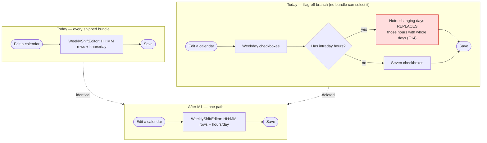

# Feature Spec: The next Class A feature-flag retirement (ADR-0088 D3)

- **Status:** Draft (rev 3) — two review rounds, all five reviewers AGREE WITH CONDITIONS, no blocks
- **Author(s):** feature-analyst
- **Date:** 2026-08-10 (rev 3)
- **Tracking issue / epic:** _(none yet)_
- **Roadmap link:** repository maintenance — ADR-0088 D3
- **Related ADR(s):** ADR-0088 (governing; **amended by this work**, see US-8), ADR-0084 (D1/D5/D6
  live), ADR-0080, ADR-0081, ADR-0067, ADR-0068, ADR-0053, ADR-0058, ADR-0060, ADR-0076

> **Subject.** Retires **`VITE_CALENDAR_SHIFT_EDITOR`** then **`VITE_LIBRARY_SCOPING`**. Commissioned
> as `VITE_ACTIVITY_EDITOR_TABS`; rejected on E8/E9, and the rejection is kept in full because it is
> the most reusable finding here.

---

## 0. Evidence ledger (ADR-0076 §19.10)

**Rev 3 corrects two regressions rev 2 introduced** (§0.1 R1/R2) and adopts one finding that **removes
work** (E26).

| #        | Claim                                                                                                                                                                                                                                                                                                                                                                                                                                                             | How established                                                                                      | Verdict                                                                                                                             |
| -------- | ----------------------------------------------------------------------------------------------------------------------------------------------------------------------------------------------------------------------------------------------------------------------------------------------------------------------------------------------------------------------------------------------------------------------------------------------------------------- | ---------------------------------------------------------------------------------------------------- | ----------------------------------------------------------------------------------------------------------------------------------- |
| E1       | 56 live flags, 4 Class A, 52 Class B, 2 retired                                                                                                                                                                                                                                                                                                                                                                                                                   | `scripts/flag-retirement.json`                                                                       | **Verified**                                                                                                                        |
| E2       | `classACap` = 4, actual Class A = 4; gate compares `>` so it fires at 5                                                                                                                                                                                                                                                                                                                                                                                           | `flag-retirement.json:532`, `check-flags.mjs:135-142`                                                | **Verified**                                                                                                                        |
| E3       | `VITE_ACTIVITY_EDITOR_TABS`: 2 flag-OFF harnesses                                                                                                                                                                                                                                                                                                                                                                                                                 | `playwright.assignment-lag.config.ts:74`, `sub-day:75`                                               | **Verified**                                                                                                                        |
| E4       | `VITE_CALENDAR_SHIFT_EDITOR`: 0 flag-OFF harnesses                                                                                                                                                                                                                                                                                                                                                                                                                | Only `playwright.calendar-shifts.config.ts:64`, `'true'`                                             | **Verified**                                                                                                                        |
| E5       | `VITE_LIBRARY_SCOPING`: 0 flag-OFF harnesses                                                                                                                                                                                                                                                                                                                                                                                                                      | Only `playwright.library.config.ts:65`, `'true'`                                                     | **Verified**                                                                                                                        |
| E6       | `VITE_CANVAS_WORKSPACE`: 7 flag-OFF harnesses                                                                                                                                                                                                                                                                                                                                                                                                                     | 7 configs listed in the plan                                                                         | **Verified**                                                                                                                        |
| E7       | `LIBRARY_SCOPING_ENABLED`: **12** non-test files excl. `env.ts` — **11 code, 1 comment-only** (`ProjectCalendarsSection.tsx:32`). `CALENDAR_SHIFT_EDITOR_ENABLED`: 4 code consumers                                                                                                                                                                                                                                                                               | Grep per constant, each file re-opened to classify                                                   | **Verified.** A review put it at 15; not reproduced — §0.1 R3                                                                       |
| E8       | Retiring `VITE_ACTIVITY_EDITOR_TABS` does **not** delete `ActivityFormDialog`                                                                                                                                                                                                                                                                                                                                                                                     | `CreateActivityButton.tsx:47` (no flag in the file); `ActivityEditorDialog.tsx:154`                  | **Verified — contradicts the register**                                                                                             |
| E9       | The "nine receipts" tax survives that retirement                                                                                                                                                                                                                                                                                                                                                                                                                  | The nine `ActivityFormDialog.*.test.tsx` suites appear in none of the 12 files matching the constant | **Verified — contradicts the register**                                                                                             |
| E10      | `VITE_ACTIVITY_EDITOR_TABS` has 2 derived children; register records neither                                                                                                                                                                                                                                                                                                                                                                                      | `env.ts:1031`, `:1070`                                                                               | **Verified**                                                                                                                        |
| E11      | Register records 3 of 9 derivation edges                                                                                                                                                                                                                                                                                                                                                                                                                          | Multiline grep → `:168,185,671,1030,1069,1098,1132,1502,1526`                                        | **Verified**                                                                                                                        |
| E11a     | `env.ts` uses **both** operand orders — parent-on-the-right at `:169,:186,:672`, which are exactly the three already recorded                                                                                                                                                                                                                                                                                                                                     | Read all 9 initialisers                                                                              | **Verified.** §0.1 R1 (rev 1)                                                                                                       |
| E11b     | Exactly one assertion-5 inversion: `CANVAS_AUTHORING_FLOW` (batch-10, 2026-10-13) ← `CANVAS_AUTHORING` (batch-13, 2026-11-03)                                                                                                                                                                                                                                                                                                                                     | Cross-read 6 new edges against `batches`                                                             | **Verified**                                                                                                                        |
| E11c     | `env.ts:1535` denies derivation in prose, naming `CANVAS_MULTI_SELECT_ENABLED`                                                                                                                                                                                                                                                                                                                                                                                    | Read `:1529-1541`                                                                                    | **Verified — negative fixture**                                                                                                     |
| E12/E13  | ADR-0088 `:299` and `CLAUDE.md:1815` say "three"; both halves of `CLAUDE.md`'s wrong (cap is 4; a _fifth_ fails)                                                                                                                                                                                                                                                                                                                                                  | Read both                                                                                            | **Verified**                                                                                                                        |
| E14      | Flag-off calendar branch can flatten intraday hours                                                                                                                                                                                                                                                                                                                                                                                                               | `CalendarFormDialog.tsx:219-220,529-535`                                                             | **Verified**                                                                                                                        |
| E15      | `WeekdayToggleGroup` local, single-use in the flag-off arm                                                                                                                                                                                                                                                                                                                                                                                                        | Defined `:51`, used `:540`                                                                           | **Verified**                                                                                                                        |
| E16      | `VITE_CALENDAR_SHIFT_EDITOR` parents nothing                                                                                                                                                                                                                                                                                                                                                                                                                      | Absent from all 9 edges                                                                              | **Verified**                                                                                                                        |
| E17      | No schema change                                                                                                                                                                                                                                                                                                                                                                                                                                                  | Blast radius `apps/web`, `scripts/`, `docs/`, `.github/`                                             | **Verified**                                                                                                                        |
| E18      | **13** files pin `LIBRARY_SCOPING_ENABLED: false`                                                                                                                                                                                                                                                                                                                                                                                                                 | Grep, unlimited                                                                                      | **Verified** — full list in plan M2-T5                                                                                              |
| E19      | Surviving calendar path strips the mask unconditionally                                                                                                                                                                                                                                                                                                                                                                                                           | `CalendarFormDialog.tsx:297`                                                                         | **Verified**                                                                                                                        |
| E20      | `workingWeekdays` becomes a phantom field after M1                                                                                                                                                                                                                                                                                                                                                                                                                | `calendar-schemas.ts:105-120` + `:297` + deletion of the only control                                | **Verified**                                                                                                                        |
| **E21**  | **CORRECTED (rev 3).** `VITE_LIBRARY_SCOPING` has **five two-arm selection sites** — `ActivityFormDialog.tsx:551`, `ActivityCalendarField.tsx:98`, `PlanCalendarPicker.tsx:146`, `ResourceFormDialog.tsx:362`, `ActivityResourcesPanel.tsx:367` — **plus one guard-only site**, `ResourceFormDialog.tsx:318`, whose flag-off branch is `: null` (no control at all)                                                                                               | Read `:314-327`; the `: null` at `:316`/`:318` is the discriminator                                  | **Verified.** Rev 2 said "six selection sites" — imprecise, in the milestone whose purpose is to correct an imprecise register note |
| **E21a** | **NEW.** The register's "FOUR pickers" was `detect-alternative-surfaces.mjs`'s **output**, not a clerical slip: it structurally cannot see `:318` (ternary wraps a `<div>`) or `:551` (intervening comment)                                                                                                                                                                                                                                                       | The detector's own `jsxRoot`/`matchingColon` rules vs the two call sites                             | **Verified.** Consequence at E21b                                                                                                   |
| **E21b** | **NEW.** Assertion 3b therefore does **not** backstop those two sites. The real backstop is **deleting the constant from `env.ts`**, which turns every missed reference into a typecheck error                                                                                                                                                                                                                                                                    | Follows from E21a + `check-flags.mjs:155-163`                                                        | **Verified by construction**                                                                                                        |
| E22      | `vite-env.d.ts:17` still declares `VITE_NAV_TREE_CRUD`, retired 2026-08-09                                                                                                                                                                                                                                                                                                                                                                                        | Read                                                                                                 | **Verified — live residue**                                                                                                         |
| **E22a** | **NEW.** A residue scan must be **declaration-anchored and word-boundary-matched**. `env.ts:133` is a correct, load-bearing history note naming the **retired** `VITE_CANVAS_TOOLBAR`; a text scan flags it as residue. And `vite-env.d.ts` holds two live prefix pairs — `VITE_NAV_TREE`/`VITE_NAV_TREE_CRUD`, `VITE_CANVAS_AUTHORING`/`VITE_CANVAS_AUTHORING_FLOW` — so a substring check reports a **live** flag as residue the day its prefix-sibling retires | Read `env.ts:128-137`; read `vite-env.d.ts`                                                          | **Verified — two negative fixtures**                                                                                                |
| **E23**  | **CORRECTED (rev 3).** `.env.example` has a `VITE_LIBRARY_SCOPING` stanza (ending `:286`; read the whole block, ~`:275-286`) and **no `VITE_CALENDAR_SHIFT_EDITOR` stanza at all**                                                                                                                                                                                                                                                                                | Grep `LIBRARY_SCOPING\|CALENDAR_SHIFT_EDITOR\|NAV_TREE_CRUD` over `.env.example` → one hit           | **Verified.** M1's instruction becomes "confirm absent", not "delete"                                                               |
| E24      | Neither rev-1 "visible consequence" is visible: `CalendarFormDialog.tsx:361` already evaluates `'lg'`; the `GROUP` kind is already offered                                                                                                                                                                                                                                                                                                                        | Read both against the compiled-on default                                                            | **Rev 1 was wrong** — §0.1 R2                                                                                                       |
| E25      | `ActivityResourcesPanel.tsx:161` `assignable` is read by the deleted arm **and** the gate at `:347`                                                                                                                                                                                                                                                                                                                                                               | Read `:155-166` and consumers                                                                        | **Verified**                                                                                                                        |
| **E26**  | **NEW — removes work.** The flattening assertion **already exists against a real API on the surviving path**: `e2e-calendar-shifts/calendar-shifts.spec.ts:12-14` states it, `:60-68` proves it (rename → save → reload → windows unchanged, `06:00`/`21:30`)                                                                                                                                                                                                     | Read the spec                                                                                        | **Verified.** Supersedes rev 2's "re-express it as a unit test" — see §0.1 R4                                                       |
| **E27**  | **NEW.** `use-calendars.ts:67` and `:92` type as `Omit<CalendarFormValues,'workingWeekdays'> & {…}`. Removing the field from `CalendarFormValues` makes the `Omit` a **silent no-op** — TypeScript does not error on omitting an absent key                                                                                                                                                                                                                       | Read `:66-95`                                                                                        | **Verified.** The one site typecheck will not catch                                                                                 |
| **E28**  | **NEW.** `playwright.library.config.ts:64-72` pins **seven** keys, including `VITE_SCHEDULING_MODES: 'false'`                                                                                                                                                                                                                                                                                                                                                     | Read                                                                                                 | **Verified.** M2 must delete **one line**, not the `env` block — see §0.1 R5                                                        |
| **E29**  | **NEW.** `pnpm check:counts` (`scripts/check-counts.mjs:37-45`) counts every `.ts`/`.tsx` under `apps/web/src` **including tests**, gated against **both** `CLAUDE.md` and `README.md`. M1 and M2 delete suites and add none                                                                                                                                                                                                                                      | Reported by review; the mechanism follows from ADR-0076's banner gate                                | **Folded — both milestones will fail it without a banner update**                                                                   |

### 0.1 — Corrections, and where I did not fold a number

- **R1 — rev 2 regression, mine.** Rev 1 required red-first proof for a **re-hosted** assertion. Rev 2
  moved that onto the new "re-expressed" verdict and left "re-hosted" defined as _"moves unchanged and
  still fails for its original cause"_ with **no evidence required** — the only verdict whose
  definition contains an unverified causal claim, and the only one with no check. That reopens exactly
  the laundering "re-expressed" was invented to close. **Restored to both**, and each ledger row must
  now name the **mutation** (file:line changed to make it red).
- **R2 — rev 2 regression, mine.** Rev 1's M2-T5 named nine files; rev 2 replaced them with prose while
  M2-T0 still said "reconcile against E18's list". The **full verified 13 with ownership** are restored
  in plan M2-T5.
- **R3 — substance folded, number not.** A review put E7 at 15 code consumers; I measure 12 files
  (11 code, 1 comment-only) and cannot reproduce 15. Likely a grep on `LIBRARY_SCOPING` rather than
  `_ENABLED`, which also matches `vite-env.d.ts`, `.env.example` and two config comments. Re-derived at
  implementation time (plan M2-T0) with the method recorded. Not load-bearing.
- **R4 — folded, and it is the best finding of the round because it deletes a task.** Rev 2 required
  re-expressing the flattening assertion as a new unit test. E26 shows `e2e-calendar-shifts` already
  proves it end-to-end, and M1 runs that journey anyway. Rev 2's instruction was also **impossible as
  written**: under M1-T2's own default `workingWeekdays` leaves the schema, so no mutation short of
  re-adding it reproduces the original cause. Verdict becomes **deleted — covered by
  `e2e-calendar-shifts`**, a fifth ledger verdict distinct from "deleted (asserts the removed branch)".
- **R5 — folded, with an added trap.** Rev 2's M2-T6 said "mirror M1-T4 steps 1–8", importing M1-T4's
  "the web server's sole env key" sentence. E28 shows that is false for M2. Worse: deleting the `env`
  block would **silently turn `VITE_SCHEDULING_MODES` on** for that journey, which pins it off
  deliberately. **M2 deletes one line.**

---

## 1. Business understanding

### Problem

ADR-0088 D3 retires Class A flags — those whose value selects which of two **different components**
renders — on merit and on epic-touch, under a cap that ratchets down. Three facts pull against
each other:

1. **The estate is exactly at its cap** (E2). The next alternative surface fails CI.
2. **No epic is touching a Class A surface**, so D3's preferred trigger is unavailable and a
   deliberate retirement must be the **cheapest** one that proves the process.
3. **The register is wrong about its own contents in four ways** (E8/E9, E10/E11, E12/E13, E21) —
   and a fifth, E21a, explains _why_ one of them happened. Acting on it before repairing it is the
   ADR-0058 failure ADR-0088 exists to end.

### The commissioned recommendation is overturned

The register calls `VITE_ACTIVITY_EDITOR_TABS` _"arguably the worst case in the estate: at least nine
unrelated features have had to add a case to BOTH."_ **True about the codebase, false about the flag**
(E8/E9): `ActivityEditorDialog` is edit-only and says so; `CreateActivityButton.tsx:47` renders
`ActivityFormDialog` unflagged; the nine cited suites never mention the flag. Retiring it leaves the
legacy monolith alive as the create surface. The tax comes from **create and edit being two different
components** — an ADR-0060 decision the retirement does not touch.

| Rank  | Flag                         | Flag-off harnesses | Code consumers | Derived children | Verdict                                          |
| ----- | ---------------------------- | ------------------ | -------------- | ---------------- | ------------------------------------------------ |
| **1** | `VITE_CALENDAR_SHIFT_EDITOR` | **0**              | 4              | **0**            | **Retire now**                                   |
| **2** | `VITE_LIBRARY_SCOPING`       | **0**              | 11             | 0                | Retire next — **hard date 2026-09-29** (§ below) |
| 3     | `VITE_ACTIVITY_EDITOR_TABS`  | 2                  | 4              | **2**            | Defer to epic-touch                              |
| 4     | `VITE_CANVAS_WORKSPACE`      | **7**              | 1              | 1                | Defer                                            |

`VITE_CALENDAR_SHIFT_EDITOR` also carries the ADR-0080 argument in mild form: its flag-off branch is
**worse** than the surviving one — editing an intraday calendar through the weekday toggles replaces
its hours with whole days, and the branch warns in prose (E14) because it cannot prevent it.

### The dates that actually bind

Three enforced dates, and **the earliest belongs to M2's own subject, not to the deferrals**:

| Date           | Flag                        | Batch    | Consequence                                                              |
| -------------- | --------------------------- | -------- | ------------------------------------------------------------------------ |
| **2026-09-29** | `VITE_LIBRARY_SCOPING`      | batch-8  | **M2's hard date.** Class A, no `keep` → CI reddens if M2 has not landed |
| 2026-10-06     | `VITE_ACTIVITY_EDITOR_TABS` | batch-9  | Deferred by this plan → needs M3                                         |
| 2026-10-27     | `VITE_CANVAS_WORKSPACE`     | batch-12 | Deferred by this plan → needs M3                                         |

A slip past 2026-09-29 takes the **same deferral field** M3 introduces, not a red build.

### Users

**Nothing about the running application changes.** Every flag is compiled on and, per ADR-0088 D1,
unreachable by any operator. Stated unqualified because rev 1's two counter-examples were both wrong
(E24). The only real risk is **mis-transcription** — which is where E20, E25 and E27 live.

| Role               | What changes                                                                     |
| ------------------ | -------------------------------------------------------------------------------- |
| Every product role | **Nothing.** No behaviour, permission or screen                                  |
| Operator           | Nothing functional; `.env.example` stops naming a flag that will not exist (E23) |
| Engineer           | Two fewer alternative surfaces; a true register; three repaired gates            |

### Success criteria

- `pnpm check:flags` green at `classACap: 2` with 2 Class A flags.
- The derivation parser returns **exactly 9** edges before its assertion is armed, and rejects the
  E11c fixture.
- The residue assertion is **verified red on the live `VITE_NAV_TREE_CRUD`**, and rejects both E22a
  fixtures (`env.ts:133`; the two prefix pairs).
- `check:flags` green with the clock advanced past 2026-09-29, 2026-10-06 and 2026-10-27.
- `pnpm check:counts` green (E29 — banner **and** README updated).
- Every removed assertion carries a ledger verdict **with a named destination or a written reason**,
  and every red-first claim names its mutation.
- `scripts/e2e-local.sh web:calendar-shifts` and `web:library` green locally.

### Open questions

§5. **OQ-1 and OQ-2 remain the only critical ones.**

---

## 2. Functional requirements

> **US-1** — Every derivation edge in `env.ts` is recorded, so assertion 5 can work.
>
> - Parser treats `&&` as **commutative**: parent = the operand that is a known `*_ENABLED` constant;
>   self = the `flagDefaultOn(import.meta.env.VITE_*)` operand (E11a).
> - **Anchored to the initialiser** (between `=` and `;`), never the docblock. `ACTIVITY_COPY_PASTE_ENABLED`
>   (E11c) is an explicit negative fixture.
> - **Total:** parsed declarations equal the `export const *_ENABLED` count; any initialiser containing
>   `&&`, `||` or `?` that cannot be fully decomposed **fails** rather than being skipped.
> - `derivedFrom` accepts `string | string[]` — `VITE_CANVAS_AUTHORING` had two parents until
>   2026-08-10. Requires updating `check-flags.mjs:198-212` (`byConstant.get` at `:200`, messages at
>   `:202`/`:208`).
> - Both directions asserted; **verified red first** each way.

> **US-2** — `VITE_CALENDAR_SHIFT_EDITOR` retired.
>
> - `WeeklyShiftEditor` + hours-per-day unconditional; `WeekdayToggleGroup` and `weekIsSimplified` gone.
> - **`workingWeekdays` does not become a phantom field** (E20). Default: **remove it from
>   `calendarFormSchema`**; keeping it needs a written reason. Removal touches three sites the earlier
>   revisions never named — `CalendarFormDialog.tsx:191` (defaultValues), `:199` (reset), `:297` (the
>   strip) — and **`use-calendars.ts:67`/`:92`, where `Omit` of an absent key is a silent no-op (E27)**.
> - `playwright.calendar-shifts.config.ts` loses **only** its env pin; config, spec, script and CI step survive.
> - `env.ts` **and `vite-env.d.ts:98`** lose the flag; `.env.example` — **confirm absent** (E23).
> - Register → `retired`; `classACap` → 3; **`CLAUDE.md` banner and `README.md` counts updated** (E29).

> **US-3** — `VITE_LIBRARY_SCOPING` retired.
>
> - The **five two-arm selection sites** render `Combobox` unconditionally: `ActivityFormDialog.tsx:551`,
>   `ActivityCalendarField.tsx:98`, `PlanCalendarPicker.tsx:146`, `ResourceFormDialog.tsx:362`,
>   `ActivityResourcesPanel.tsx:367`.
> - The **guard-only site** `ResourceFormDialog.tsx:318` (`: null`, E21) loses its guard — a Class B
>   shape, named as such.
> - `ActivityResourcesPanel.tsx:161` `assignable` is **kept**; only the `:165` conjunct goes (E25).
> - `playwright.library.config.ts` loses **one line**, not the `env` block — it pins seven keys
>   including `VITE_SCHEDULING_MODES: 'false'` (E28).
> - `classACap` → 2; banner + README updated.

> **US-4** — The register describes the estate accurately: the `ACTIVITY_EDITOR_TABS` note records
> E8/E9; the `LIBRARY_SCOPING` note says **five selection sites plus one guard**, not "four pickers";
> **and records E21a** — that "four" was the detector's output, so 3b does not backstop those sites
> and the real backstop is deleting the constant (E21b). ADR-0088 D2's table and paragraph corrected
> in place, in that ADR's house style.

> **US-5** — The cap reads the same everywhere: ADR-0088 Consequences and `CLAUDE.md:1815` state the
> **rule**, not a literal; `check-flags.mjs` compares **exactly** (`!==`), verified red first. A new
> assertion rejects a stale `classA` entry for a retired flag.

> **US-6** — The deferred flags survive their dates via a **constrained** deferral field: it must
> carry an **enumerated trigger or a named TECH_DEBT row** — an undated, gate-honoured opt-out for a
> Class A flag is the escape hatch this epic exists to remove. **ADR-0088 is amended** to define the
> field (D4/D6 define the register's vocabulary; a field the governing ADR does not know about is the
> ADR-0071 shape this spec cites twice).

> **US-7** — A retired flag leaves no residue: absent from `env.ts` **and** `vite-env.d.ts`, matched
> on **declaration forms** (`readonly VITE_X?:`, `import.meta.env.VITE_X`) with **word boundaries**.
> Verified red on `VITE_NAV_TREE_CRUD`; must **not** fire on `env.ts:133` or either prefix pair (E22a).

> **US-8** — An accessibility review runs over the combined **M1+M2** diff **before** the retirement
> commit. Acceptance: for every site where an arm is deleted, the surviving arm's accessible name,
> `aria-describedby`, `aria-invalid` and busy state are **equal to or better than** the deleted arm's,
> recorded as a per-site table in the PR — **and any site entering scope after that review re-opens
> it.** That last clause is the point: two sites entered scope after the rev-2 reviews.

### Edge cases

| Case                                                  | Expected behaviour                                                                     |
| ----------------------------------------------------- | -------------------------------------------------------------------------------------- |
| Config pins the retiring flag `'true'`                | Delete **the line**, never the config or the `env` block (E28)                         |
| Config pins it `'false'`                              | Blocked; convert specs first. Not applicable (E4/E5)                                   |
| A `*.flag-off.test.tsx` owned by a **different** flag | **Converted, never deleted.** Ownership from the **docblock**, never the filename      |
| A mixed suite                                         | Classified **per `it()`**                                                              |
| An assertion already proven by a journey              | Verdict **deleted — covered by `<journey>`** (E26); stronger than a unit re-expression |
| A "re-hosted" or "re-expressed" assertion             | **Both** require red-first, and the ledger row names the mutation (§0.1 R1)            |
| Removing a field typed via `Omit<…>`                  | `Omit` of an absent key is a silent no-op — retype, do not trust the compiler (E27)    |
| M2 slips past 2026-09-29                              | Takes the same deferral field, not a red build                                         |

### Permissions

**No change.** No RBAC surface, permission, organisation scope or pen behaviour. The flag never gated
a permission — only which control rendered.

### Validation rules

`calendarFormSchema`'s `workingWeekdays` refine loses its flag conjunct, and by default **the field is
removed** (E20/US-2). Two notes for the implementer:

- `features/calendars/schemas/` has **no unit test file**, so once the conjunct goes the only
  client-side invalid-mask assertion left is the one M1 removes as parity. Do not assume coverage.
- **Keep** `use-calendars.ts`'s body builders and their flatten docblocks (`:51-64`, `:73-82`) — they
  are the surviving record of the destructive server-side flatten, not residue. **Change only** the
  `Omit<CalendarFormValues,'workingWeekdays'>` at `:67`/`:92` to `CalendarFormValues` (E27). Rev 2
  said "simplify" and "keep" of the same ranges in adjacent steps; this is the resolution.

### Error scenarios

Build-time only:

| Scenario                                                 | Detection      | Result                                           |
| -------------------------------------------------------- | -------------- | ------------------------------------------------ |
| Retired flag pinned `'false'` / `'true'`                 | assertion 4    | convert / delete the line                        |
| Retired flag left in `env.ts`                            | assertion 1    | fails                                            |
| **Retired flag left in `vite-env.d.ts`**                 | **new (US-7)** | **fails — live residue exists today (E22)**      |
| **Residue scan hits a history note or a prefix sibling** | **new (US-7)** | **must NOT fire** (E22a)                         |
| Class A count ≠ `classACap`; stale `classA` entry        | 3a, exact      | fails                                            |
| **Derivation edge missing / stale / undecomposable**     | **new (US-1)** | **fails**                                        |
| **File counts drift after suite deletion**               | `check:counts` | **fails without a banner + README update (E29)** |

---

## 3. Technical analysis

| Area                     | Impact                              | Notes                                                                                                                                                                                                                                                                                                                                                                                                                                                                                                                                                                  |
| ------------------------ | ----------------------------------- | ---------------------------------------------------------------------------------------------------------------------------------------------------------------------------------------------------------------------------------------------------------------------------------------------------------------------------------------------------------------------------------------------------------------------------------------------------------------------------------------------------------------------------------------------------------------------- |
| Frontend                 | **medium**                          | M1: 4 code consumers. M2: 11 consumers, **5 selection + 1 guard** site, **13** pinning suites                                                                                                                                                                                                                                                                                                                                                                                                                                                                          |
| Backend / Database / API | **none**                            | **E17.** database-architect **not** engaged for that reason and no other; engage unconditionally if any task disproves it (CLAUDE.md §19.3)                                                                                                                                                                                                                                                                                                                                                                                                                            |
| Security                 | **none**                            | Server remains the sole trust boundary                                                                                                                                                                                                                                                                                                                                                                                                                                                                                                                                 |
| Performance              | **negligible**                      | No win claimed or measured                                                                                                                                                                                                                                                                                                                                                                                                                                                                                                                                             |
| Infrastructure           | **low-medium**                      | `ci.yml` comments — **`:296` is the library (M2) comment and `:305` calendar-shifts (M1)**, transposed in rev 2. **Nine** journeys lack report-upload paths (`assignment-lag`, `calendar-shifts`, `copy-paste`, `float-paths`, `multi-select`, `public`, `search-nav`, `staff`, `sub-day`)                                                                                                                                                                                                                                                                             |
| Observability            | **none**                            |                                                                                                                                                                                                                                                                                                                                                                                                                                                                                                                                                                        |
| Testing                  | **high**                            | The real work: per-`it()` ledgers, 13 suites in M2                                                                                                                                                                                                                                                                                                                                                                                                                                                                                                                     |
| **Doc gates**            | **medium**                          | **`check:counts` will fail both milestones** without banner + README updates (E29)                                                                                                                                                                                                                                                                                                                                                                                                                                                                                     |
| **CPM engine**           | **none — structurally**             | Not imported in the blast radius. ADR-0034 parity gate untouched **by construction**; honestly, there is nothing here to hold parity for                                                                                                                                                                                                                                                                                                                                                                                                                               |
| **Accessibility**        | **low, one accepted loss, one gap** | Retiring `LIBRARY_SCOPING` permanently removes the native `<select>` arm — mobile OS picker and platform typeahead go with it; **recorded in the register note**. `components/ui/combobox.test.tsx` is the surviving home of the three ADR-0053 M6 fixes. `PlanCalendarPicker.tsx:159` loses busy state on the **save** half only (`setCalendar.isPending`); list-load busy survives via `loading` — **pre-existing, deliberately not fixed here**. **`ActivityCalendarField` has no axe assertion anywhere** — the one surviving arm nothing checks; recorded as debt |

### Dependencies

M0 blocks M1 and M2. **M3 is pulled ahead of both** — it is independent and exists to beat a date.
M1 before M2 (4 files before 11). Nothing external.

---

## 4. Solution design

### Architecture overview

```mermaid
flowchart LR
  subgraph BEFORE["BEFORE — Class A = 4, cap 4 (at ceiling)"]
    direction TB
    F1["CALENDAR_SHIFT_EDITOR"] -->|on| A1["WeeklyShiftEditor + Hours/day"]
    F1 -->|off| B1["WeekdayToggleGroup<br/>(flattens intraday hours — E14)"]
    F2["LIBRARY_SCOPING"] -->|on| A2["Combobox — 5 selection sites"]
    F2 -->|off| B2["native Select — 5 sites"]
    F2 -.->|"guard only (: null)"| G2["ResourceFormDialog:318"]
    F3["ACTIVITY_EDITOR_TABS"] -->|on| A3["ActivityEditorDialog<br/>(EDIT ONLY)"]
    F3 -->|off| B3["ActivityFormDialog + Progress + Steps"]
    F4["CANVAS_WORKSPACE"] -->|on| A4["PlanWorkspace"]
    F4 -->|off| B4["LegacyPlanLayout"]
    CREATE["CreateActivityButton<br/>(NO FLAG)"] --> B3
  end

  subgraph AFTER["AFTER M1+M2 — Class A = 2, cap 2"]
    direction TB
    A1b["WeeklyShiftEditor + Hours/day"]
    A2b["Combobox — 5 sites"]
    F3b["ACTIVITY_EDITOR_TABS<br/>(deferred: enumerated trigger)"] -->|on| A3b["ActivityEditorDialog"]
    F3b -->|off| B3b["ActivityFormDialog + Progress + Steps"]
    F4b["CANVAS_WORKSPACE<br/>(deferred — 7 harnesses)"] -->|on| A4b["PlanWorkspace"]
    F4b -->|off| B4b["LegacyPlanLayout"]
    CREATEb["CreateActivityButton<br/>(NO FLAG)"] --> B3b
  end

  BEFORE ==>|"M1: delete B1<br/>M2: delete B2, unguard G2"| AFTER

  style B1 fill:#fdd,stroke:#c00
  style B2 fill:#fdd,stroke:#c00
  style G2 fill:#eef,stroke:#66c
  style CREATE fill:#ffd,stroke:#c90
  style CREATEb fill:#ffd,stroke:#c90
```



**The amber node** is why `VITE_ACTIVITY_EDITOR_TABS` moves down the ranking: `CreateActivityButton →
ActivityFormDialog` carries **no flag**, so retiring it cannot delete the branch. **The blue node** is
the taxonomy correction — `ResourceFormDialog:318` is a Class B guard living inside a Class A flag,
and calling it a selection site would repeat the imprecision M0 exists to fix.

### Data flow

```mermaid
sequenceDiagram
  autonumber
  participant Dev as Engineer
  participant Env as env.ts + vite-env.d.ts
  participant Src as apps/web/src consumers
  participant Cfg as playwright.*.config.ts
  participant Reg as flag-retirement.json
  participant Doc as CLAUDE.md + README.md
  participant Chk as pnpm check:flags / check:counts
  participant E2E as scripts/e2e-local.sh

  Dev->>Src: delete the flag-off arm, keep the flag-on arm
  Dev->>Env: delete the constant, docblock AND the vite-env declaration
  Dev->>Cfg: delete ONE pin line (never the env block — E28)
  Dev->>Reg: flags{} -> retired[]; classACap--
  Dev->>Doc: re-derive the file/suite counts (E29)
  Dev->>Chk: run
  Chk->>Env: 1 - declared set == register set
  Chk->>Env: NEW - retired flag absent (declaration-anchored, word-boundary)
  Chk->>Env: NEW - every && edge recorded (commutative, initialiser-anchored, total)
  Chk->>Cfg: 4 - no config pins a retired flag
  Chk->>Reg: 3a - classA EXACTLY equals classACap; no stale classA entry
  Chk->>Src: 3b - detected subset-of classA (does NOT backstop :318/:551 — E21b)
  Chk->>Doc: check:counts - banner and README agree with the tree
  Chk-->>Dev: green
  Dev->>E2E: web:calendar-shifts (M1) / web:library (M2)
  E2E-->>Dev: the SURVIVING world still works
```

Only the journey proves the product works — and the journey to run is the one pinning the flag
**`'true'`**, never the one that drove the deleted branch.

### User flow



After M1 the planner-visible flow is **byte-for-byte what every planner already has**. What goes is a
second path nobody could reach whose documented behaviour was to discard shift data — and which
`e2e-calendar-shifts:60-68` already guards against on the surviving path (E26).

### Database changes

**None (E17).**

### API changes

**None.**

### Component changes

**M1 (4 code consumers + `env.ts` + `vite-env.d.ts:98`):** `CalendarFormDialog.tsx` (delete `:51`,
`:219-220`, `:524-549`; unconditionalise `:232`, `:252`, `:264`, `:287`, `:358-360`, `:361`, `:467`;
plus `:191`/`:199`/`:297` for the field removal), `calendar-schemas.ts` (`:98` comment, `:118` refine,
field removal), `CalendarExceptionsEditor.tsx` (`:65,121,403,408,426,437`), `CalendarsTable.tsx`
(`:208`). `:361` **already evaluates `'lg'`** in every shipped bundle (E24) — no visual change.

**M2 — five selection sites + one guard (E21):** `ActivityFormDialog.tsx:551`,
`ActivityCalendarField.tsx:98`, `PlanCalendarPicker.tsx:146`, `ResourceFormDialog.tsx:362`,
`ActivityResourcesPanel.tsx:367`; guard `ResourceFormDialog.tsx:318`.
**Guard/query sites:** `CalendarsTable.tsx`, `ResourcesTable.tsx`, `CalendarFormDialog.tsx`,
`routes/project-detail.tsx`, `routes/resources.tsx`, `use-calendars.ts` (**query-shape**).
`ProjectCalendarsSection.tsx:32` is **comment-only**.

`ActivityResourcesPanel.tsx:161` `assignable` is **kept** (E25). `ActivityCalendarField`'s docblock
(`:20-21`) claims an importer it does not have — corrected; the duplicate-picker collapse it hints at
is **filed separately**. `ActivityFormDialog.tsx:569` (native `disabled` for a domain rule with an
`aria-describedby`-only, unannounced reason) is **filed as debt, not folded into M2**.

Loading / empty / error states are **not** re-designed — a state change smuggled into a deletion is
this plan's most likely defect.

### Implementation approach & alternatives

**M0 (register truth + gate repair) → M3 (deferral, before the dates) → M1 → M2.**

**Alternatives:** `ACTIVITY_EDITOR_TABS` first — rejected on E8/E9. `CANVAS_WORKSPACE` first —
rejected on 7 harnesses. Keep all four — right for the 52 Class B flags, wrong at the cap. Raise the
cap to 5 — buying headroom with the thing the gate protects. A hand-kept derivation list — the
hand-kept list _is_ the drift. A new ADR for the cap — disproportionate; ADR-0088 is **Proposed** and
this is an internal contradiction, corrected in place.

**Is an ADR required?** **No new ADR — but ADR-0088 is amended** (US-6): the deferral field enters the
register's vocabulary, which D4/D6 define. Amending the governing ADR in the same commit is the
ADR-0071 lesson this spec cites twice.

## 5. Open questions

**CRITICAL**

- **OQ-1 — Accept the substitution?** _Default:_ `VITE_CALENDAR_SHIFT_EDITOR` (M1) then
  `VITE_LIBRARY_SCOPING` (M2); `ACTIVITY_EDITOR_TABS` deferred with an enumerated trigger.
- **OQ-2 — One retirement or two?** _Default:_ both, separate revertible commits, M1 first.
  **Note the date:** M2's own flag reddens CI on **2026-09-29** if it has not landed.

**Non-critical — defaults stated**

- **OQ-3 — `workingWeekdays` (E20/E27).** _Default:_ remove from the schema; retype `use-calendars.ts:67,92`.
- **OQ-4 — Accepted a11y loss.** _Default:_ accept, record in the register note.
- **OQ-5 — ADR-0088 edits.** _Default:_ correct in place **and amend for the deferral field**.
- **OQ-6 — Deferral record.** _Default:_ register field **plus** TECH_DEBT rows — next free number is
  **#122** (#119–#121 all exist).
- **OQ-7 — Gate scope.** _Default:_ `env.ts` only; both directions; commutative; initialiser-anchored;
  total; declaration-anchored and word-boundary for residue.
- **OQ-8 — E7's count.** _Default:_ re-derive at M2-T0; neither 12 nor 15 is load-bearing.

## 6. Links

- Implementation plan: [`./implementation-plan.md`](./implementation-plan.md)
- Docs updated: `docs/adr/0088-flag-classification.md` (**corrected and amended**), `CLAUDE.md`
  (§16 entry **and the stage banner counts**), `README.md` (counts), `scripts/flag-retirement.json`,
  `scripts/check-flags.mjs`, `docs/TECH_DEBT.md`, `.env.example`, `apps/web/src/vite-env.d.ts`,
  `.github/workflows/ci.yml`, `docs/adr/0067-…`, `docs/adr/0053-…`
