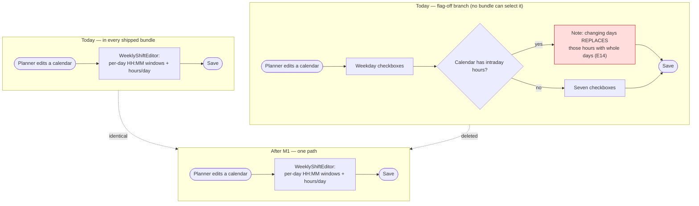

# Feature Spec: The next Class A feature-flag retirement (ADR-0088 D3)

- **Status:** Draft — revised after five specialist reviews (all AGREE WITH CONDITIONS, none blocked)
- **Author(s):** feature-analyst
- **Date:** 2026-08-10 (rev 2)
- **Tracking issue / epic:** _(none yet)_
- **Roadmap link:** repository maintenance — ADR-0088 D3, the standing Class A retirement rule
- **Related ADR(s):** ADR-0088 (governing), ADR-0084 (D1/D5/D6 still live), ADR-0080, ADR-0081,
  ADR-0067, ADR-0068, ADR-0053, ADR-0058, ADR-0060, ADR-0061, ADR-0062, ADR-0076

> **Subject.** This spec retires **`VITE_CALENDAR_SHIFT_EDITOR`** then **`VITE_LIBRARY_SCOPING`**.
> It was commissioned as `VITE_ACTIVITY_EDITOR_TABS`; that recommendation is **rejected** on evidence
> E8/E9 below, and the rejection is kept in full because it is the most reusable finding here. The
> directory was renamed from `flag-retirement-activity-editor/` to match the actual subject.

---

## 0. Evidence ledger (ADR-0076 §19.10)

**Rev 2 note.** Three rows below were wrong or under-specified in rev 1 and are corrected in place
rather than amended silently — including one row that was itself unchecked, which is the exact failure
this ledger exists to prevent.

| #        | Claim                                                                                                                                                                                                                                                                                                                                                                                                 | How established                                                                                                                                                                                   | Verdict                                                                                                                                                                                                                                |
| -------- | ----------------------------------------------------------------------------------------------------------------------------------------------------------------------------------------------------------------------------------------------------------------------------------------------------------------------------------------------------------------------------------------------------- | ------------------------------------------------------------------------------------------------------------------------------------------------------------------------------------------------- | -------------------------------------------------------------------------------------------------------------------------------------------------------------------------------------------------------------------------------------- |
| E1       | 56 live flags, 4 Class A, 52 Class B, 2 retired                                                                                                                                                                                                                                                                                                                                                       | Read `scripts/flag-retirement.json`                                                                                                                                                               | Inherited from brief, **verified**                                                                                                                                                                                                     |
| E2       | `classACap` = 4, actual Class A = 4                                                                                                                                                                                                                                                                                                                                                                   | `flag-retirement.json:532`; `check-flags.mjs:135-142` compares `>`, so the gate fires at 5 — the estate is _at_ the cap, not over it                                                              | **Verified**                                                                                                                                                                                                                           |
| E3       | `VITE_ACTIVITY_EDITOR_TABS` has 2 flag-OFF harnesses                                                                                                                                                                                                                                                                                                                                                  | `playwright.assignment-lag.config.ts:74`, `playwright.sub-day.config.ts:75`                                                                                                                       | **Verified**                                                                                                                                                                                                                           |
| E4       | `VITE_CALENDAR_SHIFT_EDITOR` has 0 flag-OFF harnesses                                                                                                                                                                                                                                                                                                                                                 | Only `playwright.calendar-shifts.config.ts:64`, `'true'`                                                                                                                                          | **Verified**                                                                                                                                                                                                                           |
| E5       | `VITE_LIBRARY_SCOPING` has 0 flag-OFF harnesses                                                                                                                                                                                                                                                                                                                                                       | Only `playwright.library.config.ts:65`, `'true'`                                                                                                                                                  | **Verified**                                                                                                                                                                                                                           |
| E6       | `VITE_CANVAS_WORKSPACE` has 7 flag-OFF harnesses                                                                                                                                                                                                                                                                                                                                                      | `playwright.config.ts:70`, `programme:63`, `activity-editor:74`, `assignment-lag:73`, `notes:61`, `sub-day:68`, `edit:72`                                                                         | **Verified**                                                                                                                                                                                                                           |
| **E7**   | **CORRECTED.** Non-test `apps/web/src` files referencing `LIBRARY_SCOPING_ENABLED`, excluding `env.ts`: **12 — of which 11 are code consumers and 1 is comment-only** (`ProjectCalendarsSection.tsx:32`, a docblock mention with no import). Plus `env.ts` (declaration) and `vite-env.d.ts:77` (type declaration). `CALENDAR_SHIFT_EDITOR_ENABLED`: 4 code consumers + `env.ts` + `vite-env.d.ts:98` | `Grep` on the constant, `files_with_matches`, tests removed by hand, then each file re-opened to separate code from comment                                                                       | **Verified at 12/11/1.** Rev 1 said "12, verified true" with no method and no code-vs-comment split — under-specified. **A review put this at 15 code consumers; I could not reproduce that and am not folding the number** — see §0.1 |
| **E8**   | Retiring `VITE_ACTIVITY_EDITOR_TABS` does **not** delete `ActivityFormDialog`                                                                                                                                                                                                                                                                                                                         | `CreateActivityButton.tsx:47` renders it with **no flag reference anywhere in the file**; `ActivityEditorDialog.tsx:154`: _"This editor is edit-only; creation stays with `ActivityFormDialog`."_ | **Verified — contradicts the register**                                                                                                                                                                                                |
| **E9**   | The "nine receipts" tax survives that retirement                                                                                                                                                                                                                                                                                                                                                      | The nine `ActivityFormDialog.*.test.tsx` suites appear in **none** of the 12 files matching `ACTIVITY_EDITOR_TABS_ENABLED`                                                                        | **Verified — contradicts the register**                                                                                                                                                                                                |
| **E10**  | `VITE_ACTIVITY_EDITOR_TABS` has two derived children; the register records neither                                                                                                                                                                                                                                                                                                                    | `env.ts:1031`, `env.ts:1070`                                                                                                                                                                      | **Verified**                                                                                                                                                                                                                           |
| **E11**  | The register records 3 of 9 derivation edges in `env.ts`                                                                                                                                                                                                                                                                                                                                              | Multiline grep `export const …_ENABLED[^;]*&&[^;]*;` → lines 168, 185, 671, 1030, 1069, 1098, 1132, 1502, 1526                                                                                    | **Verified**                                                                                                                                                                                                                           |
| **E11a** | **NEW. `env.ts` uses BOTH operand orders.** Parent-on-the-**right** at `:169`, `:186`, `:672`; parent-on-the-**left** at the other six                                                                                                                                                                                                                                                                | Read each of the 9 initialisers                                                                                                                                                                   | **Verified.** The three right-operand edges are exactly the three the register already records — see §0.1 R1                                                                                                                           |
| **E11b** | **NEW. Exactly one assertion-5 inversion exists**, and the backfill exposes it: `CANVAS_AUTHORING_FLOW` (batch-10, due 2026-10-13) ← `CANVAS_AUTHORING` (batch-13, due 2026-11-03)                                                                                                                                                                                                                    | Cross-read all 6 new edges against `register.batches` due dates                                                                                                                                   | **Verified.** The other five are correctly ordered                                                                                                                                                                                     |
| **E11c** | **NEW. `env.ts:1535` denies a derivation in prose**, naming `CANVAS_MULTI_SELECT_ENABLED` inside `ACTIVITY_COPY_PASTE_ENABLED`'s docblock ("**Not derived.** Unlike {@link CANVAS_MULTI_SELECT_ENABLED}…")                                                                                                                                                                                            | Read `env.ts:1529-1541`                                                                                                                                                                           | **Verified.** A docblock-scoped scan would invent an edge from a sentence denying one                                                                                                                                                  |
| E12      | ADR-0088 contradicts itself on the cap                                                                                                                                                                                                                                                                                                                                                                | `0088:166,179` (measured, ratcheting) vs `:299` ("capped at three")                                                                                                                               | **Verified**                                                                                                                                                                                                                           |
| E13      | `CLAUDE.md:1815` propagated it                                                                                                                                                                                                                                                                                                                                                                        | Reads "a **cap of three**, so a fourth alternative surface fails CI" — **both halves wrong**: the cap is 4 and it is a _fifth_ that fails                                                         | **Verified**                                                                                                                                                                                                                           |
| E14      | The flag-off calendar branch can silently flatten an intraday shift pattern                                                                                                                                                                                                                                                                                                                           | `CalendarFormDialog.tsx:219-220,529-535`                                                                                                                                                          | **Verified**                                                                                                                                                                                                                           |
| E15      | `WeekdayToggleGroup` is local and used only in the flag-off arm                                                                                                                                                                                                                                                                                                                                       | Defined `:51`, sole use `:540`                                                                                                                                                                    | **Verified**                                                                                                                                                                                                                           |
| E16      | `VITE_CALENDAR_SHIFT_EDITOR` is a parent of nothing                                                                                                                                                                                                                                                                                                                                                   | Absent from all 9 edges (E11)                                                                                                                                                                     | **Verified**                                                                                                                                                                                                                           |
| E17      | No schema change                                                                                                                                                                                                                                                                                                                                                                                      | Blast radius is `apps/web`, `scripts/`, `docs/`. No `apps/api`, no `prisma/`                                                                                                                      | **Verified**                                                                                                                                                                                                                           |
| **E18**  | **NEW. 13 files pin `LIBRARY_SCOPING_ENABLED: false`**, not the 9 rev 1 listed                                                                                                                                                                                                                                                                                                                        | `Grep "LIBRARY_SCOPING_ENABLED: false"`, unlimited                                                                                                                                                | **Verified — rev 1 understated it.** The four rev 1 missed: `PlanCalendarPicker.test.tsx`, `ActivityFormDialog.calendar.test.tsx`, `ActivityFormDialog.sub-day.test.tsx`, `ActivityResourcesPanel.assignment-lag.test.tsx`             |
| **E19**  | **NEW. On the surviving calendar path the working-week mask is unconditionally stripped before the request** — `const { workingWeekdays: _mask, ...rest } = values;`                                                                                                                                                                                                                                  | `CalendarFormDialog.tsx:297`                                                                                                                                                                      | **Verified.** Consequences at E20 and §2 US-2                                                                                                                                                                                          |
| **E20**  | **NEW. `workingWeekdays` becomes a phantom field after M1** — still in `calendarFormSchema`, still validated, still surfaced by `FormErrorSummary`, bound to no control and always stripped (E19)                                                                                                                                                                                                     | `calendar-schemas.ts:105-120` + `CalendarFormDialog.tsx:297` + M1's deletion of the only control at `:540`                                                                                        | **Verified.** This is verbatim the ADR-0067 M4 dead end and must be decided, not inherited                                                                                                                                             |
| **E21**  | **NEW. `VITE_LIBRARY_SCOPING` selects a component at 6 sites across 5 files, not "FOUR pickers"**                                                                                                                                                                                                                                                                                                     | `ActivityFormDialog.tsx:551`; `ResourceFormDialog.tsx:318` and `:362`; plus `ActivityCalendarField`, `PlanCalendarPicker`, `ActivityResourcesPanel`                                               | **Verified — the register's `classA` note and ADR-0088 D2's table both say four.** A third register error                                                                                                                              |
| **E22**  | **NEW. `vite-env.d.ts:17` still declares `VITE_NAV_TREE_CRUD`, retired 2026-08-09**                                                                                                                                                                                                                                                                                                                   | Read `vite-env.d.ts:17`                                                                                                                                                                           | **Verified. Live residue** — no gate reads that file, so a retirement can and did leave a declaration behind                                                                                                                           |
| **E23**  | **NEW. `.env.example:286` tells an operator to set `VITE_LIBRARY_SCOPING=false` "for a byte-for-byte rollback"**                                                                                                                                                                                                                                                                                      | Read `.env.example:283-286`                                                                                                                                                                       | **Verified.** Per ADR-0088 D1 that instruction never worked; after M2 it names a flag that does not exist                                                                                                                              |
| **E24**  | **CORRECTED. Neither "visible consequence" rev 1 claimed is visible.** `CalendarFormDialog.tsx:361` is `isEdit \|\| CALENDAR_SHIFT_EDITOR_ENABLED ? 'lg' : 'md'` and the flag is compiled on in every shipped bundle, so it already evaluates to `'lg'`; the resource `GROUP` kind is likewise already offered                                                                                        | Read both sites against the compiled-on default                                                                                                                                                   | **Rev 1 was wrong.** See §0.1 R2                                                                                                                                                                                                       |
| **E25**  | **NEW. `ActivityResourcesPanel.tsx:161` `assignable` is read by the deleted arm AND by a gate wrapping both arms** (`:347`)                                                                                                                                                                                                                                                                           | Read `:155-166` and its consumers                                                                                                                                                                 | **Verified.** Deleting it as dead code would remove two empty states                                                                                                                                                                   |

### 0.1 — Where I did not fold a reviewer's number, and why

A reviewer condition is evidence, not an instruction. Three items:

- **R1 — folded, and it is the most important correction in this revision.** Rev 1's M0 parser
  specified `export const X_ENABLED … Y_ENABLED &&` — parent operand **first**. E11a shows `env.ts`
  uses both orders, and the three parent-on-the-right edges are precisely the three already in the
  register. A both-directions assertion built on that pattern would have reported the three
  **correct** entries as stale, and the obvious remedy is to delete them. That is a gate that
  destroys working coverage on its first run. Folded as: `&&` is commutative, the parent is whichever
  operand is a known `*_ENABLED` constant, the self-flag is the `flagDefaultOn(import.meta.env.VITE_*)`
  operand, and the parser must return **exactly 9** on the current tree before the assertion is armed.
- **R2 — folded in full; rev 1 was wrong.** Rev 1 called the `size: 'lg'` change "a **visible**
  change" and the `GROUP` kind "capability-visible". E24 shows both already evaluate to the surviving
  value in every shipped bundle. This mattered more than its size: the epic's entire warrant is _no
  user's experience changes today_, and rev 1 undercut it with an unchecked claim in the one
  direction that damages the argument. **There are no user-visible changes at all.** The only risk in
  M1/M2 is **mis-transcription** — which is exactly where conditions E20 and E25 live.
- **R3 — substance folded, number not.** A review put E7 at 15 code consumers plus `vite-env.d.ts`.
  I measured 12 files (11 code, 1 comment-only) and re-opened each to classify it; I cannot reproduce
  15 and will not restate a figure I could not derive. The **substance** of the finding is correct and
  is folded: rev 1's row asserted a count with no method and no code-vs-comment split, which is an
  unchecked row in the ledger built to prevent unchecked rows. The likely origin of 15 is a grep on
  `LIBRARY_SCOPING` (not `_ENABLED`), which additionally matches `vite-env.d.ts`, `.env.example` and
  two `playwright*.config.ts` files. **Re-derive before relying on either number** (plan M2-T0).

---

## 1. Business understanding

### Problem

ADR-0088 replaced ADR-0084's calendar with a classification. Class A — a flag whose value selects
which of two **different components** renders — is the only shape for which "a second product
maintained forever" is earned, and those flags retire **on merit and on epic-touch** under a standing
cap that ratchets down.

Three things are true and pull against each other:

1. **The estate sits exactly on its cap** (E2). The next alternative surface anyone adds fails CI.
2. **No epic is touching a Class A surface**, so D3's preferred trigger — the person deleting the
   branch is the person who just paid for it — is unavailable. A deliberate retirement therefore needs
   its own justification, and should be the **cheapest** one that proves the process.
3. **The register is wrong about its own contents in four ways** (E8/E9, E10/E11, E12/E13, E21), and
   every one bears on which flag retires next. Acting on it before fixing it is the ADR-0058 failure
   ADR-0088 was written to end.

### The commissioned recommendation is overturned

The brief proposed `VITE_ACTIVITY_EDITOR_TABS`, on the register's note calling it _"arguably the worst
case in the estate: at least nine unrelated features have had to add a case to BOTH."_ **That sentence
is true about the codebase and false about the flag** (E8, E9): `ActivityEditorDialog` is edit-only and
says so, `CreateActivityButton.tsx:47` renders `ActivityFormDialog` unflagged, and the nine cited
suites never mention the flag. Retiring it deletes three mount sites and leaves the legacy monolith
alive as the create surface with every field those nine features added. The tax is caused by **create
and edit being two different components** — an ADR-0060 decision that survives the retirement.

| Rank  | Flag                         | Flag-off harnesses | Code consumers | Derived children | Verdict                 |
| ----- | ---------------------------- | ------------------ | -------------- | ---------------- | ----------------------- |
| **1** | `VITE_CALENDAR_SHIFT_EDITOR` | **0** (E4)         | 4 (E7)         | **0** (E16)      | **Retire now**          |
| **2** | `VITE_LIBRARY_SCOPING`       | **0** (E5)         | 11 (E7)        | 0                | Retire next             |
| 3     | `VITE_ACTIVITY_EDITOR_TABS`  | 2 (E3)             | 4              | **2** (E10)      | **Defer to epic-touch** |
| 4     | `VITE_CANVAS_WORKSPACE`      | **7** (E6)         | 1              | 1 (recorded)     | Defer                   |

`VITE_CALENDAR_SHIFT_EDITOR` also carries the ADR-0080 argument in mild form: its flag-off branch is
not merely unused, it is **worse** than the surviving one — editing an intraday calendar through the
weekday toggles replaces its hours with whole days, and the branch warns in prose (E14) because it
cannot prevent it.

### Users

**Nothing about the running application changes.** Every flag is compiled on and, per ADR-0088 D1,
unreachable by any operator. This is now stated as an unqualified claim because rev 1's two
counter-examples were both wrong (E24, R2).

| Role                                                        | What changes                                                                                                  |
| ----------------------------------------------------------- | ------------------------------------------------------------------------------------------------------------- |
| Org Admin / Planner / Contributor / Viewer / External Guest | **Nothing.** No behaviour, permission or screen                                                               |
| Operator                                                    | **Nothing functional** — but `.env.example` stops instructing them to set two flags that will not exist (E23) |
| Engineer                                                    | Two fewer alternative surfaces; a register that describes the estate correctly; a derivation gate that gates  |

### Success criteria

- `pnpm check:flags` green with `classACap: 2` and 2 Class A flags at the end of M2.
- The new derivation parser returns **exactly 9** edges on the current tree before its assertion is
  armed (R1), and rejects the E11c negative fixture.
- A retired flag left in `vite-env.d.ts` fails CI — demonstrated by the **live** `VITE_NAV_TREE_CRUD`
  residue (E22), which M0 fixes.
- `check:flags` stays green **past 2026-10-06 and 2026-10-27** with both deferred Class A flags in
  place (E11b / §2 US-6).
- Every deleted assertion has a named destination or a written reason, classified **per `it()`**.
- `pnpm lint && pnpm typecheck && pnpm test` green; `scripts/e2e-local.sh web:calendar-shifts` and
  `web:library` green after their retirements.

### Open questions

See §5. **OQ-1 and OQ-2 remain the only critical ones.**

---

## 2. Functional requirements

> **US-1** — As an engineer, I want every derivation edge in `env.ts` recorded, so `check:flags`
> assertion 5 can refuse a child retiring before its parent.
>
> **Acceptance criteria**
>
> - The parser treats `&&` as **commutative**: parent = the operand that is a known `*_ENABLED`
>   constant; self = the `flagDefaultOn(import.meta.env.VITE_*)` operand (R1).
> - It is anchored to the **initialiser** (text between `=` and `;`), never the docblock.
>   `ACTIVITY_COPY_PASTE_ENABLED` (E11c) is an explicit **negative fixture**: a docblock naming
>   `CANVAS_MULTI_SELECT_ENABLED` while denying derivation must yield **no** edge.
> - **Totality:** parsed declarations must equal the `export const *_ENABLED` count, and any
>   initialiser containing `&&`, `||` or `?` that cannot be fully decomposed **fails** rather than
>   being skipped.
> - `derivedFrom` accepts `string | string[]`. `VITE_CANVAS_AUTHORING` had two parents until
>   2026-08-10; under strict single-string equality the day a second conjunct returns, the gate fails
>   with no representable fix.
> - Both directions asserted: a missing edge and a stale edge each fail, naming both flags.
> - Verified **red first** in both directions, then green.

> **US-2** — As an engineer, I want `VITE_CALENDAR_SHIFT_EDITOR` retired.
>
> **Acceptance criteria**
>
> - `CalendarFormDialog` renders `WeeklyShiftEditor` + hours-per-day unconditionally;
>   `WeekdayToggleGroup` and `weekIsSimplified` no longer exist (E15).
> - `CalendarExceptionsEditor` and `CalendarsTable` lose their guards, keeping the flag-on arm.
> - **`workingWeekdays` does not become a phantom field.** After M1 its only control is deleted and
>   the value is unconditionally stripped at submit (E19/E20). The default is to **remove it from
>   `calendarFormSchema`** and simplify `use-calendars.ts:67-68,92-93` accordingly; keeping it
>   requires a written reason in the PR. Leaving it validated-but-unreachable reproduces the ADR-0067
>   M4 dead end this flag's own epic exists to have fixed.
> - `playwright.calendar-shifts.config.ts` loses **only** its env pin; the config, the spec, the
>   package script and the CI step survive.
> - `env.ts` **and `vite-env.d.ts`** lose the flag; `.env.example` loses its stanza.
> - Register entry moves to `retired`; `classACap` → 3.

> **US-3** — As an engineer, I want `VITE_LIBRARY_SCOPING` retired.
>
> **Acceptance criteria**
>
> - All **six** component-selection sites across **five** files (E21) render `Combobox`
>   unconditionally: `ActivityCalendarField`, `PlanCalendarPicker`, `ActivityResourcesPanel`,
>   `ResourceFormDialog` (**two** sites, `:318` and `:362`), `ActivityFormDialog` (`:551`).
> - `ActivityResourcesPanel.tsx:161` `assignable` is **kept**, dropping only the flag conjunct at
>   `:165` — it is read by the gate at `:347` that wraps both arms (E25).
> - The remaining guard sites keep the flag-on arm.
> - `playwright.library.config.ts` loses only its pin; `e2e-library/` survives.
> - `classACap` → 2.

> **US-4** — As an engineer, I want the register to describe `VITE_ACTIVITY_EDITOR_TABS` and
> `VITE_LIBRARY_SCOPING` accurately.
>
> **Acceptance criteria**
>
> - The `ACTIVITY_EDITOR_TABS` note records E8/E9 and the real cost (2 harnesses + 2 children).
> - The `LIBRARY_SCOPING` note and ADR-0088 D2's table say **six sites across five files**, not four
>   pickers (E21).
> - ADR-0088 D2's paragraph carries the correction in place, in that ADR's own house style.

> **US-5** — As an engineer, I want the cap to read the same everywhere.
>
> **Acceptance criteria**
>
> - ADR-0088 Consequences and `CLAUDE.md:1815` state the measured-and-ratcheting **rule**, not a
>   literal. `flag-retirement.json` holds the only number.
> - `check-flags.mjs`'s cap comparison becomes **exact** (`!==`, not `>`), verified red first — an
>   estate _below_ its cap is stale bookkeeping, and today that is silent.

> **US-6** — As an engineer, I want the two deferred Class A flags to survive their batch dates.
>
> **Acceptance criteria**
>
> - `VITE_ACTIVITY_EDITOR_TABS` (batch-9, due **2026-10-06**) and `VITE_CANVAS_WORKSPACE` (batch-12,
>   due **2026-10-27**) carry no `keep` today, so `check-flags.mjs:103-112` turns CI red on those
>   dates for work deliberately deferred (E11b context).
> - They take a **gate-honoured deferral carrying the trigger**, and `check:flags` is demonstrated
>   green with the clock advanced past both dates.

> **US-7** — As an engineer, I want a retired flag to leave no residue.
>
> **Acceptance criteria**
>
> - New assertion: a flag in `retired[]` appears in **neither** `env.ts` **nor** `vite-env.d.ts`.
> - It is verified red by the **live** `VITE_NAV_TREE_CRUD` residue at `vite-env.d.ts:17` (E22),
>   which is then fixed in M0.

### Edge cases

| Case                                                                | Expected behaviour                                                                                                                                                                                                                                                                                        |
| ------------------------------------------------------------------- | --------------------------------------------------------------------------------------------------------------------------------------------------------------------------------------------------------------------------------------------------------------------------------------------------------- |
| Retiring a flag whose config pins it `'true'`                       | Delete the pin line only. **Keep the config and its journey** — it drives the surviving world                                                                                                                                                                                                             |
| Retiring a flag whose config pins it `'false'`                      | Blocked; convert the specs first. Not applicable (E4/E5)                                                                                                                                                                                                                                                  |
| Deleting a whole `playwright.*.config.ts`                           | Only when its specs drive the deleted branch (the `e2e-workspace` precedent). Not applicable here                                                                                                                                                                                                         |
| A parity suite named `*.flag-off.test.tsx` for a **different** flag | **Converted, never deleted.** `ActivityResourcesPanel.assignment-lag.flag-off.test.tsx` is the rollback contract for `VITE_ASSIGNMENT_LAG` (a live Class B flag carrying `keep`) and pins `LIBRARY_SCOPING_ENABLED: false` only incidentally. Ownership is read from the **docblock**, never the filename |
| A suite that is mixed parity/non-parity                             | Classified **per `it()`**, not per file. At least three are mixed                                                                                                                                                                                                                                         |
| An assertion that would pass for a new reason after re-hosting      | Not re-hosted. Re-expressed against the surviving path and **verified red** against a reintroduced bug (E19)                                                                                                                                                                                              |
| A derived child of a retiring flag                                  | Drops the conjunct; does not retire (ADR-0084 D4). Not applicable to M1/M2                                                                                                                                                                                                                                |
| `classACap` after retirement                                        | Ratchets **down** in the same commit; exact comparison                                                                                                                                                                                                                                                    |

### Permissions

**No change.** No RBAC surface, permission, organisation scope or pen (ADR-0028) behaviour is touched.
The flag never gated a permission — only which control rendered.

### Validation rules

Two client-side changes, both narrowing toward the server:

1. `calendarFormSchema`'s `workingWeekdays` refine loses its flag conjunct. The empty (window-only)
   mask has been valid at the domain and the API since TECH_DEBT #79 / ADR-0036 §2.
2. **`workingWeekdays` is removed from the schema entirely** (default, US-2) — E20. Note for the
   implementer: `features/calendars/schemas/` has **no unit test file**, so once the conjunct goes the
   only client-side invalid-mask assertion left is the one M1 deletes as parity. Do not assume
   coverage that is not there.

`use-calendars.ts:67-68,73-82,92-93` is **deliberately kept** as the surviving record of the
destructive server-side flatten behaviour, and the plan says so rather than leaving it to look like
residue somebody forgot.

### Error scenarios

No runtime error surface changes. Failures are build-time:

| Scenario                                    | Detection      | Result                                                         |
| ------------------------------------------- | -------------- | -------------------------------------------------------------- |
| Retired flag still pinned `'false'`         | assertion 4    | "convert them first, or put the flag back"                     |
| Retired flag still pinned `'true'`          | assertion 4    | "dead config — delete the line"                                |
| Retired flag left in `env.ts`               | assertion 1    | fails                                                          |
| **Retired flag left in `vite-env.d.ts`**    | **new (US-7)** | **fails — today this passes, and there is live residue (E22)** |
| Class A count ≠ `classACap`                 | 3a, exact      | fails                                                          |
| Class B grows a component-selecting ternary | 3b             | fails                                                          |
| **Derivation edge missing or stale**        | **new (US-1)** | **fails — today 6 of 9 are invisible**                         |
| **Undecomposable initialiser**              | **new (US-1)** | **fails rather than skipping**                                 |

---

## 3. Technical analysis

| Area              | Impact                          | Notes                                                                                                                                                                                                                                                                                                                                                                                                       |
| ----------------- | ------------------------------- | ----------------------------------------------------------------------------------------------------------------------------------------------------------------------------------------------------------------------------------------------------------------------------------------------------------------------------------------------------------------------------------------------------------- |
| Frontend          | **medium**                      | M1: 4 code consumers + parity disposition. M2: 11 code consumers, 6 selection sites, **13** flag-off-pinning suites (E18). Deletion of dead arms only                                                                                                                                                                                                                                                       |
| Backend           | **none**                        |                                                                                                                                                                                                                                                                                                                                                                                                             |
| Database          | **none**                        | **Verified (E17).** database-architect **not** engaged for that reason and no other. If any task implies a schema delta it **stops** and the agent runs unconditionally (CLAUDE.md §19.3)                                                                                                                                                                                                                   |
| API               | **none**                        |                                                                                                                                                                                                                                                                                                                                                                                                             |
| Security          | **none**                        | Server remains the sole trust boundary                                                                                                                                                                                                                                                                                                                                                                      |
| Performance       | **negligible**                  | Dead branches leave the bundle. **No win is claimed or measured**                                                                                                                                                                                                                                                                                                                                           |
| Infrastructure    | **low**                         | Package scripts and CI steps unchanged (both journeys survive). CI **comments** at `ci.yml:296` and `:305` name flags that stop existing and must be updated; `playwright-report-calendar-shifts` should join the artefact upload list                                                                                                                                                                      |
| Observability     | **none**                        |                                                                                                                                                                                                                                                                                                                                                                                                             |
| Testing           | **high**                        | The real work. Per-`it()` classification, 13 suites in M2                                                                                                                                                                                                                                                                                                                                                   |
| **CPM engine**    | **none — structurally**         | Not imported by any file in the blast radius. The ADR-0034 recalculation parity gate is untouched **by construction**; honestly, there is nothing here to hold parity for                                                                                                                                                                                                                                   |
| **Accessibility** | **low, with one accepted loss** | Retiring `LIBRARY_SCOPING` removes the native `<select>` arm permanently: the mobile OS picker and platform typeahead go with it. Accepted and **recorded in the register note**, not discovered later. `components/ui/combobox.test.tsx` is the surviving home of the three ADR-0053 M6 a11y fixes. `PlanCalendarPicker.tsx:159`'s missing `aria-busy` is **pre-existing and deliberately not fixed here** |

### Dependencies

- **M0 blocks M1 and M2** — the register is the authority they act on and is wrong four ways.
- M1 and M2 are independent of each other; M1 lands first to prove the process on 4 files before 11.
- Nothing external.

---

## 4. Solution design

### Architecture overview

```mermaid
flowchart LR
  subgraph BEFORE["BEFORE — Class A = 4, cap 4 (at ceiling)"]
    direction TB
    F1["CALENDAR_SHIFT_EDITOR"] -->|on| A1["WeeklyShiftEditor<br/>+ Hours per day"]
    F1 -->|off| B1["WeekdayToggleGroup<br/>(flattens intraday hours — E14)"]
    F2["LIBRARY_SCOPING"] -->|on| A2["Combobox — 6 sites / 5 files"]
    F2 -->|off| B2["native Select — 6 sites"]
    F3["ACTIVITY_EDITOR_TABS"] -->|on| A3["ActivityEditorDialog<br/>(EDIT ONLY)"]
    F3 -->|off| B3["ActivityFormDialog<br/>+ Progress + Steps"]
    F4["CANVAS_WORKSPACE"] -->|on| A4["PlanWorkspace"]
    F4 -->|off| B4["LegacyPlanLayout"]
    CREATE["CreateActivityButton<br/>(NO FLAG)"] --> B3
  end

  subgraph AFTER["AFTER M1+M2 — Class A = 2, cap 2"]
    direction TB
    A1b["WeeklyShiftEditor<br/>+ Hours per day"]
    A2b["Combobox — 6 sites"]
    F3b["ACTIVITY_EDITOR_TABS<br/>(deferred: trigger, not date)"] -->|on| A3b["ActivityEditorDialog"]
    F3b -->|off| B3b["ActivityFormDialog + Progress + Steps"]
    F4b["CANVAS_WORKSPACE<br/>(deferred — 7 harnesses)"] -->|on| A4b["PlanWorkspace"]
    F4b -->|off| B4b["LegacyPlanLayout"]
    CREATEb["CreateActivityButton<br/>(NO FLAG)"] --> B3b
  end

  BEFORE ==>|"M1: delete B1<br/>M2: delete B2"| AFTER

  style B1 fill:#fdd,stroke:#c00
  style B2 fill:#fdd,stroke:#c00
  style CREATE fill:#ffd,stroke:#c90
  style CREATEb fill:#ffd,stroke:#c90
```



**Read the amber node.** `CreateActivityButton → ActivityFormDialog` carries **no flag on the edge**
(E8) and is identical in BEFORE and AFTER. That single edge is why `VITE_ACTIVITY_EDITOR_TABS` moves
down the ranking: its flag-off branch cannot be deleted by retiring the flag, because the create path
holds it up. Note the same file also carries a `LIBRARY_SCOPING` selection site (`:551`, E21), so
**M2 touches the create surface** — which is why its suites cannot be assumed to pass unedited.

### Data flow — how a retirement reaches CI

```mermaid
sequenceDiagram
  autonumber
  participant Dev as Engineer
  participant Env as env.ts + vite-env.d.ts
  participant Src as apps/web/src consumers
  participant Cfg as playwright.*.config.ts
  participant Reg as scripts/flag-retirement.json
  participant Chk as pnpm check:flags
  participant E2E as scripts/e2e-local.sh

  Dev->>Src: delete the flag-off arm, keep the flag-on arm
  Dev->>Env: delete the constant, the docblock AND the vite-env declaration
  Dev->>Cfg: delete ONLY the 'true' pin (keep config + specs + CI step)
  Dev->>Reg: flags{} -> retired[] with a note; classACap--
  Dev->>Chk: run
  Chk->>Env: 1 - declared set == register set
  Chk->>Env: NEW - retired flag absent from env.ts AND vite-env.d.ts
  Chk->>Env: NEW - every && edge recorded (commutative, initialiser-anchored, total)
  Chk->>Cfg: 4 - no config pins a retired flag
  Chk->>Reg: 3a - classified; classA EXACTLY equals classACap
  Chk->>Src: 3b - detected alternative surfaces subset-of classA
  Chk-->>Dev: green
  Dev->>E2E: web:calendar-shifts (M1) / web:library (M2)
  E2E-->>Dev: the SURVIVING world still works
```

Only the journey proves the product still works — and per ADR-0088's own correction, the journey to
run is the one pinning the flag **`'true'`**, never the one that drove the deleted branch.

### User flow



The planner-visible flow after M1 is **byte-for-byte the flow every planner already has**. What is
removed is a second path nobody could reach whose documented behaviour was to discard shift data.

### Database changes

**None (E17).** No model, column, index, constraint, relationship or data migration.

### API changes

**None.**

### Component changes

**M1 — `VITE_CALENDAR_SHIFT_EDITOR` (4 code consumers + `env.ts` + `vite-env.d.ts` + `.env.example`):**

| File                                        | Change                                                                                                                                                                                                                                                                  |
| ------------------------------------------- | ----------------------------------------------------------------------------------------------------------------------------------------------------------------------------------------------------------------------------------------------------------------------- |
| `CalendarFormDialog.tsx`                    | Delete `WeekdayToggleGroup` (`:51`), `weekIsSimplified` (`:219-220`), the flag-off `FormSection` (`:524-549`). Unconditionalise `:232`, `:252`, `:264`, `:287`, `:361`, `:467`. **`:361` already evaluates to `'lg'` in every shipped bundle (E24) — no visual change** |
| `calendar-schemas.ts`                       | Drop the flag conjunct from the `workingWeekdays` refine (`:118`); then **remove the field** per E20/US-2 (or write down why not)                                                                                                                                       |
| `CalendarExceptionsEditor.tsx`              | Unconditionalise `:65`, `:121`, `:403`, `:408`, `:426`, `:437`                                                                                                                                                                                                          |
| `CalendarsTable.tsx`                        | Unconditionalise the intraday badge (`:208`)                                                                                                                                                                                                                            |
| `env.ts` / `vite-env.d.ts` / `.env.example` | Delete `CALENDAR_SHIFT_EDITOR_ENABLED` + docblock (`:1170`), the `vite-env.d.ts:98` declaration, and the `.env.example` stanza                                                                                                                                          |

**M2 — `VITE_LIBRARY_SCOPING` — six selection sites across five files (E21):**
`ActivityCalendarField.tsx`, `PlanCalendarPicker.tsx`, `ActivityResourcesPanel.tsx`,
`ResourceFormDialog.tsx` (**`:318` and `:362`**), `ActivityFormDialog.tsx` (`:551`).
**Guard sites:** `CalendarsTable.tsx`, `ResourcesTable.tsx`, `CalendarFormDialog.tsx`,
`routes/project-detail.tsx`, `routes/resources.tsx`, `use-calendars.ts` (a **query-shape** site, not a
render site). `ProjectCalendarsSection.tsx` is **comment-only** — a docblock edit, not a code change.

`ActivityResourcesPanel.tsx:161` `assignable` is **kept** (E25). `ActivityCalendarField`'s docblock
(`:20-21`) claims an importer it does not have and is corrected in passing; the duplicate-picker
collapse it hints at is **filed separately**, not done here.

Loading / empty / error states are **not** re-designed — each surviving arm already owns its own, and
a state change smuggled into a deletion is the defect this plan is most exposed to.

### Implementation approach & alternatives

**Chosen: M0 (register truth + gate repair) → M1 → M2 → M3 (record the deferrals).**

M0 first because the register is the authority M1/M2 act on and is wrong four ways; because two of the
new gates (US-1 commutativity, US-7 residue) are the difference between a gate that helps and one that
deletes working entries; and because M3's deferral must exist before the October batch dates.

**Alternatives considered:**

1. **`VITE_ACTIVITY_EDITOR_TABS` first (the brief).** Rejected on E8/E9 — the cited payoff does not
   arrive. It should retire when an epic touches the activity editor, ideally the one that unifies
   create and edit, which is the change that _would_ collect it.
2. **`VITE_CANVAS_WORKSPACE` first.** Rejected: 7 flag-off harnesses (E6).
3. **Keep all four.** Right for the 52 Class B flags and already honoured. Wrong at the cap: the next
   epic wanting an alternative surface meets a red build with no headroom, under time pressure.
4. **Raise `classACap` to 5.** Rejected — buying headroom with the thing the gate protects.
5. **A hand-kept derivation list.** Rejected for ADR-0088 D2's reason: the hand-kept list _is_ the drift.
6. **A new ADR for the cap correction.** Rejected as disproportionate — ADR-0088 is **Proposed**, and
   this is an internal self-contradiction, corrected in place in its own house style.

**Is an ADR required?** **No.** This executes ADR-0088 D3 and repairs drift inside it. The new gates
enforce rules ADR-0088 D4/assertion 5 already state. ADR outline if review disagrees: _"Derivation
edges are derived from `env.ts`, not declared"_ — options hand-maintain / derive / delete the
assertion; choice derive; trade-off the check couples to that file's shape; consequence an
undecomposable pair fails loud rather than passing silently.

## 5. Open questions

**CRITICAL:**

- **OQ-1 — Do you accept the substitution?** _Default:_ proceed with `VITE_CALENDAR_SHIFT_EDITOR` (M1)
  and `VITE_LIBRARY_SCOPING` (M2); record `ACTIVITY_EDITOR_TABS` as deferred with its trigger.
- **OQ-2 — One retirement or two?** _Default:_ both, as separate revertible commits, M1 first.

**Non-critical — defaults stated:**

- **OQ-3 — `workingWeekdays` after M1 (E20).** _Default:_ **remove it from `calendarFormSchema`** and
  simplify `use-calendars.ts:67-68,92-93`. Keeping a validated field bound to no control is the
  ADR-0067 M4 dead end. Say so if you would rather keep it for the API shape.
- **OQ-4 — Accepted a11y loss in M2.** Retiring `LIBRARY_SCOPING` permanently removes the native
  `<select>` arm (mobile OS picker, platform typeahead). _Default:_ accept and record it in the
  register note.
- **OQ-5 — Correcting ADR-0088 in place.** _Default:_ yes, in that ADR's own house style. No new ADR.
- **OQ-6 — Where the deferrals are recorded.** _Default:_ `docs/TECH_DEBT.md` rows (next free numbers
  — **#119/#120** at time of writing; **verify**) **plus** a gate-honoured deferral in the register
  (US-6), because a TECH_DEBT row does not stop `check-flags.mjs:103-112` going red in October.
- **OQ-7 — Scope of the derivation gate.** _Default:_ `env.ts` only; both directions; commutative;
  initialiser-anchored; total.
- **OQ-8 — E7's count (R3).** _Default:_ re-derive at implementation time (M2-T0) and record the
  method beside the number. Neither 12 nor 15 is load-bearing for the design.

## 6. Links

- Implementation plan: [`./implementation-plan.md`](./implementation-plan.md)
- Docs updated: `docs/adr/0088-flag-classification.md`, `CLAUDE.md` §16, `scripts/flag-retirement.json`,
  `scripts/check-flags.mjs`, `docs/TECH_DEBT.md`, `.env.example`, `apps/web/src/vite-env.d.ts`,
  `.github/workflows/ci.yml` (comments + artefact list), `docs/adr/0067-…:149-152`, `docs/adr/0053-…`
