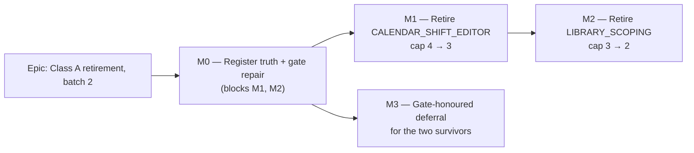

# Implementation Plan: The next Class A feature-flag retirement (ADR-0088 D3)

- **Feature spec:** [`./feature-spec.md`](./feature-spec.md)
- **Status:** Draft — revised after five specialist reviews (all AGREE WITH CONDITIONS, none blocked)
- **Owner:** _(unassigned)_

> **Subject.** Retires **`VITE_CALENDAR_SHIFT_EDITOR`** then **`VITE_LIBRARY_SCOPING`**, not
> `VITE_ACTIVITY_EDITOR_TABS` — spec §1 and evidence E8/E9.
>
> **Rev 2 changed the shape of the work, not just its detail.** Three rev-1 tasks would have
> _destroyed_ coverage as specified: the M0 parser would have reported the register's three correct
> edges as stale (E11a/R1); M2-T5's filename rule would have deleted another flag's rollback contract
> (E18); and M1-T3's "re-host the flattening assertion" would have moved a test onto a path where it
> passes for an unrelated reason and can never fail for the original cause (E19). Each is now a named
> task with a named guard.

## Breakdown

### Epic

**Class A retirement, batch 2** — take the alternative-surface count from 4 to 2 under ADR-0088 D3,
make the register that governs it true first, and repair three gate holes found on the way. Maps to
repository maintenance (CLAUDE.md §21), not a product roadmap theme.

---

## Milestone M0 — Register truth and gate repair (blocks M1 and M2)

**Outcome:** `flag-retirement.json`, `check-flags.mjs`, ADR-0088 and `CLAUDE.md` agree with each other
and with `env.ts`. Three gate holes close: the derivation graph, retired-flag residue, and the
non-exact cap comparison.

**Entry point:** **Ships dark** (ADR-0081 §1). Its reachable surface is `pnpm check:flags`, run by
every engineer via the pre-push gate and by CI. No screen, and none is claimed.

**Journey:** none (no UI). Each new assertion is **verified red first** — that is the substitute, and
it is stronger here than a journey would be.

---

#### Feature F0.1 — The cap says the same number everywhere, and the gate is exact

> **Description:** ADR-0088 D3 defines the cap as the measured Class A count, ratcheting down, and
> records that drafts proposing three and two were rejected as the aspirational-80% mistake. Its own
> Consequences then says "capped at three" and `CLAUDE.md:1815` propagated it — where **both halves
> are wrong**: the cap is 4, and it is a _fifth_ surface that fails. Separately the gate compares `>`,
> so an estate _below_ its cap is silent stale bookkeeping.
> **Complexity:** S
> **Dependencies:** none
> **Risks:** restating a literal the next retirement falsifies → the prose states the **rule**;
> `flag-retirement.json` holds the only number (the ADR-0073 C4 lesson).
> **Testing requirements:** exact-comparison change **verified red first**; `pnpm check:doc-links`.

##### Task M0-T1 — Correct the cap prose and make the comparison exact

- **Description:** ADR-0088 Consequences and `CLAUDE.md:1815` state the rule; `check-flags.mjs:136`
  becomes `classAcount !== register.classACap`.
- **Complexity:** S
- **Dependencies:** none
- **Risks:** an exact comparison fails immediately if the register is already inconsistent → run it
  before editing prose; today 4 === 4, so it should pass. If it does not, that is a real finding.
- **Testing:** set `classACap: 5` locally → expect failure (previously silent). Restore → green.
- **Development steps:**
  1. Change the comparison; verify red with a deliberately-high cap; restore.
  2. Widen the failure message to cover both directions ("retire one, raise it in an ADR, **or ratchet
     it down — a cap above the measured count is stale**").
  3. Edit ADR-0088 Consequences: replace the literal with the rule, recording in one sentence that D3
     and Consequences disagreed and the gate was right.
  4. Edit `CLAUDE.md:1815` to match, correcting **both** errors.
  5. Grep `cap of three|capped at three` → expect no remaining matches.

---

#### Feature F0.2 — Every derivation edge in `env.ts` is in the register

> **Description:** Assertion 5 refuses a child retiring before its parent and reads the parent from a
> hand-written `derivedFrom`. **`env.ts` holds 9 edges; the register holds 3** (E11). Six are
> invisible, including both children of `VITE_ACTIVITY_EDITOR_TABS` (E10). Like the under-detecting
> detector ADR-0088 D2 warns about, it **fails silently**.
> **Complexity:** M
> **Dependencies:** none
> **Risks:** the parser is the risk, and rev 1 got it wrong — see M0-T2's guards.
> **Testing requirements:** exactly 9 edges on the current tree **before** the assertion is armed;
> the E11c negative fixture yields none; red-first in both directions; totality proven.

##### Task M0-T2 — A commutative, initialiser-anchored, total derivation parser

- **Description:** Parse `env.ts` for derivation edges; assert the parsed set equals the register's
  `derivedFrom` set; backfill the six missing entries.
- **Complexity:** M
- **Dependencies:** none
- **Risks (each with its guard — these are the review's blocking findings):**
  - **`&&` is commutative and rev 1 assumed it was not.** `env.ts` uses both orders: parent-on-the-
    right at `:169`, `:186`, `:672`; parent-on-the-left at the other six. Those three right-operand
    edges are **exactly the three the register already records correctly**, so rev 1's parser would
    have reported them as stale and the obvious remedy is to delete them — a gate that destroys
    working coverage on its first run. → **Parent = whichever operand is a known `*_ENABLED`
    constant; self = the `flagDefaultOn(import.meta.env.VITE_*)` operand. Order is irrelevant.**
  - **A docblock is not an initialiser.** `env.ts:1535` reads "**Not derived.** Unlike
    {@link CANVAS_MULTI_SELECT_ENABLED}…" inside `ACTIVITY_COPY_PASTE_ENABLED`'s docblock. A
    block-scoped scan invents an edge from a sentence **denying** one. → **Anchor to the text between
    `=` and `;`.** `detect-alternative-surfaces.mjs:17-28` records three prior versions of this exact
    anchoring failure; this would be the fourth.
  - **Silent under-match.** → **Totality:** parsed declarations must equal the `export const
*_ENABLED` count, and any initialiser containing `&&`, `||` or `?` that cannot be fully
    decomposed **fails** rather than being skipped.
  - **`derivedFrom` must be `string | string[]`.** `VITE_CANVAS_AUTHORING` had two parents until
    2026-08-10 (the register's own note records the second being dropped when `VITE_CANVAS_TOOLBAR`
    retired). Under strict single-string equality, the day a second conjunct returns the gate fails
    with no representable fix.
- **Testing:**
  - Print the parsed set first; **assert it is exactly 9** and matches E11's line list, before arming.
  - Negative fixture: `ACTIVITY_COPY_PASTE_ENABLED` yields **no** edge.
  - Red first: remove one `derivedFrom` → named failure. Add a bogus edge → named failure. Break an
    initialiser into an undecomposable shape → totality failure.
  - Green: full `pnpm check:flags`.
- **Development steps:**
  1. Re-derive the edge list from `env.ts` — **re-run, do not trust this plan** (ADR-0076: a brief is
     not evidence, and this plan is a brief).
  2. Write the parser with all four guards; docblock _why_, in the file's existing voice, naming the
     commutativity trap and the E11c fixture.
  3. Verify red three ways; confirm exactly 9.
  4. Backfill: `VITE_ACTIVITY_EDITOR_CONVERGENCE` ← `ACTIVITY_EDITOR_TABS_ENABLED`;
     `VITE_WBS_IMPROVEMENTS` ← `ACTIVITY_EDITOR_TABS_ENABLED`;
     `VITE_CANVAS_AUTHORING_FLOW` ← `CANVAS_AUTHORING_ENABLED`;
     `VITE_CANVAS_LINK_ROUTING` ← `CANVAS_DIRECT_MANIPULATION_ENABLED`;
     `VITE_CANVAS_SEARCH_NAV` ← `CANVAS_LENSES_ENABLED`;
     `VITE_CANVAS_MULTI_SELECT` ← `CANVAS_DIRECT_MANIPULATION_ENABLED`.
  5. **Resolve the one inversion the backfill exposes** (see M0-T2a).
  6. Update the script docblock's assertion list (it enumerates 1–5).

##### Task M0-T2a — Resolve the single assertion-5 inversion

- **Description:** Backfilling exposes **exactly one** ordering failure: `VITE_CANVAS_AUTHORING_FLOW`
  is batch-10 (due **2026-10-13**) while its parent `VITE_CANVAS_AUTHORING` is batch-13 (due
  **2026-11-03**) — the child would be declared permanent while the parent can still switch it off.
  The other five new edges are correctly ordered (verified).
- **Complexity:** S
- **Dependencies:** M0-T2
- **Risks:** "fix" it by dropping the edge → forbidden; the edge is real (`env.ts:1098-1099`). The
  inversion is a **pre-existing defect the gate could not see**, which is the finding.
- **Testing:** `pnpm check:flags` green after the move.
- **Development steps:**
  1. Move `VITE_CANVAS_AUTHORING_FLOW` to a batch due **on or after** batch-13 (2026-11-03) — the
     minimal change, and both flags are Class B `keep` so no retirement is actually scheduled.
  2. Note in the register entry that the batch moved because the derivation gate found the inversion,
     not because anyone re-planned the work.

---

#### Feature F0.3 — A retired flag leaves no residue

> **Description:** `vite-env.d.ts:17` **still declares `VITE_NAV_TREE_CRUD`, retired 2026-08-09**
> (E22). No gate reads that file, so a retirement can — and did — leave a declaration behind. The
> hole is live, not hypothetical, which makes it its own red-first fixture.
> **Complexity:** S
> **Dependencies:** none
> **Risks:** the fix and the fixture are the same object → arm the assertion **first**, observe it
> fail on the real residue, then remove the residue.
> **Testing requirements:** verified red by the existing residue.

##### Task M0-T3 — Assert retired flags are absent from `env.ts` and `vite-env.d.ts`

- **Complexity:** S
- **Dependencies:** none
- **Risks:** `vite-env.d.ts` may hold declarations for non-flag `VITE_*` vars (e.g. `VITE_API_URL`) →
  the assertion checks only flags in `retired[]`, never the converse.
- **Testing:** arm → expect failure naming `VITE_NAV_TREE_CRUD`; remove `vite-env.d.ts:17` → green.
- **Development steps:**
  1. Add the assertion; run; **confirm it fails on the live residue**.
  2. Delete `vite-env.d.ts:17`.
  3. Check `.env.example` for a `VITE_NAV_TREE_CRUD` stanza and remove it if present.
  4. Extend the retirement checklist in the script docblock: `env.ts`, `vite-env.d.ts`, `.env.example`,
     configs, register.

---

#### Feature F0.4 — The register describes the estate accurately

> **Description:** Two `classA` notes are wrong. `ACTIVITY_EDITOR_TABS`'s "nine receipts" argument
> does not survive E8/E9. `LIBRARY_SCOPING`'s says "FOUR pickers" where there are **six sites across
> five files** (E21) — and ADR-0088 D2's table repeats it.
> **Complexity:** S
> **Dependencies:** none
> **Risks:** deleting the notes loses real findings → both are **corrected, not removed**.
> **Testing requirements:** `check:flags`, `check:doc-links`.

##### Task M0-T4 — Correct both `classA` notes and ADR-0088 D2

- **Complexity:** S
- **Dependencies:** none
- **Risks:** none material.
- **Testing:** as above.
- **Development steps:**
  1. **Re-verify E8 by opening `CreateActivityButton.tsx` and `ActivityEditorDialog.tsx:154`** before
     editing anything.
  2. Rewrite the `ACTIVITY_EDITOR_TABS` note: edit-only editor vs legacy trio; `ActivityFormDialog`
     **survives** as the create surface; the nine suites are flag-unaware and survive; real cost is 2
     harnesses + 2 derived children.
  3. Rewrite the `LIBRARY_SCOPING` note: **six selection sites across five files**, enumerated,
     including `ActivityFormDialog.tsx:551` and `ResourceFormDialog.tsx:318`/`:362`.
  4. Correct ADR-0088 D2's table row and paragraph in place, in that ADR's house style, recording that
     the nine-receipts argument was assembled without checking whether the flag-off component had
     another caller.

---

## Milestone M1 — Retire `VITE_CALENDAR_SHIFT_EDITOR` (cap 4 → 3)

**Outcome:** "Author a working week" has one implementation. **No user's experience changes** — every
shipped bundle already compiles the flag on (E24).

**Entry point:** **Calendars** → open any calendar → the **Working week** editor (`WeeklyShiftEditor`,
per-day `HH:MM` rows) and **Standard working day → Hours per day**.

**Journey:** `scripts/e2e-local.sh web:calendar-shifts`. **This is the correct gate and the wrong one
is instructive:** ADR-0088's first draft named the harness driving the _deleted_ branch, which is
batch 1 verbatim. `playwright.calendar-shifts.config.ts` pins the flag **`'true'`**, so it drives the
surviving world; there is no flag-off harness for this flag (E4), so nothing needs converting.

---

#### Feature F1.1 — Delete the flag-off calendar-authoring branch

> **Description:** Remove `WeekdayToggleGroup`, `weekIsSimplified` and the legacy Working-week
> section; unconditionalise the guards in `CalendarFormDialog`, `CalendarExceptionsEditor` and
> `CalendarsTable`; decide `workingWeekdays`.
> **Complexity:** M
> **Dependencies:** M0
> **Risks:** the only real risk is **mis-transcription** — an unconditionalised branch dragging in or
> dropping a state the flag-on path relies on. Not a visible-behaviour risk: E24 establishes that both
> rev-1 "visible consequences" already evaluate to the surviving value in every shipped bundle.
> **Testing requirements:** calendar unit suites green **without edit** (they are the before/after
> oracle); the flag-on journey green.

##### Task M1-T1 — `CalendarFormDialog.tsx`

- **Description:** Delete the flag-off arm and the dead helper; unconditionalise the flag-on arm.
- **Complexity:** M
- **Dependencies:** M0-T2
- **Risks:** `WeekdayToggleGroup` assumed local and single-use (E15) → re-grep before deleting.
  `:361` `isEdit || CALENDAR_SHIFT_EDITOR_ENABLED ? 'lg' : 'md'` becomes unconditionally `'lg'`,
  which is **already** what every shipped bundle evaluates — state this in the PR so a reviewer does
  not read it as an unrelated visual change.
- **Testing:** `CalendarFormDialog.shifts.test.tsx` and `.scope.test.tsx` pass **unedited**.
- **Development steps:**
  1. Re-grep `WeekdayToggleGroup`, `weekIsSimplified`; confirm E15.
  2. Delete `:51`, `:219-220`, `:524-549`.
  3. Unconditionalise `:232`, `:252`, `:264`, `:287`, `:361`, `:467`.
  4. Remove the flag import; check whether `hasIntradayDetail` (imported `:9` for `weekIsSimplified`)
     is still used here and drop the import if not.
  5. Run the calendar unit suites.

##### Task M1-T2 — Schema, exceptions, table — and the phantom-field decision

- **Description:** Drop the refine conjunct and the remaining guards, and **decide `workingWeekdays`**.
- **Complexity:** M
- **Dependencies:** M1-T1
- **Risks:**
  - **The phantom field (E20).** After M1 the only control binding `workingWeekdays` is deleted, yet
    it stays in `calendarFormSchema`, still validated, still surfaced by `FormErrorSummary`, and is
    **unconditionally stripped at submit** (`CalendarFormDialog.tsx:297`). That is verbatim the
    ADR-0067 M4 dead end — a hidden rule with no control on screen to satisfy it. → **Default:
    remove it from the schema** and simplify `use-calendars.ts:67-68,92-93`. Keeping it requires a
    written reason in the PR.
  - **`features/calendars/schemas/` has no unit test file.** Once the conjunct goes, the only
    client-side invalid-mask assertion left is the one M1-T3 deletes as parity. Do not assume
    coverage that is not there — if the field stays, it needs a new test; if it goes, note the gap
    closed by deletion.
- **Testing:** schema behaviour via `CalendarFormDialog.shifts.test.tsx`;
  `CalendarExceptionsEditor.hours.test.tsx`; `CalendarsTable.archive.test.tsx` / `.scope.test.tsx`.
- **Development steps:**
  1. `calendar-schemas.ts:118` → `WorkingWeekdays.isValid(mask)`; rewrite the comment, keeping
     TECH_DEBT #79 / ADR-0036 §2 and the ADR-0067 M4 story (they explain _why_ the empty mask is valid).
  2. Apply the phantom-field decision; if removing, simplify `use-calendars.ts:67-68,92-93`.
  3. **Keep `use-calendars.ts:67-68,73-82,92-93`'s record of the destructive server-side flatten
     behaviour** and say so in a comment — it is the surviving documentation of why this matters, not
     residue somebody forgot.
  4. `CalendarExceptionsEditor.tsx:65,121,403,408,426,437` → keep the flag-on arm.
  5. `CalendarsTable.tsx:208` → unconditional badge.

##### Task M1-T3 — Parity disposition, classified per `it()`

- **Description:** `CalendarFormDialog.test.tsx` pins the flag off. ADR-0084 D5 deletes a parity
  suite; ADR-0088's `VITE_CANVAS_TOOLBAR` precedent **re-hosts** coverage that merely happened to live
  there. This file is mixed.
- **Complexity:** M
- **Dependencies:** M1-T1, M1-T2
- **Risks:**
  - **The flattening assertion cannot be re-hosted (three reviewers, independently).** On the
    surviving path the mask is unconditionally stripped (`CalendarFormDialog.tsx:297`), so the
    assertion moved verbatim **passes for an unrelated reason and can never fail for the original
    cause** — the ledger would read "re-hosted" while the coverage is gone. → **Re-express it as a
    new shifts round-trip assertion on the surviving path, verified red against a deliberately
    reintroduced bug.** "Re-expressed" is a distinct ledger verdict from "re-hosted".
  - **Account for all four non-parity `it()`s**, not "at least one": `:64`, `:83`, `:124`, `:135`,
    `:159` — and note `:135` has **no counterpart in either flag-on sibling**, so it is a real gap if
    dropped.
- **Testing:** every re-expressed assertion **verified red first**.
- **Development steps:**
  1. Enumerate every `it()`; classify each as _deleted (asserts the removed branch)_ / _re-hosted
     (moves unchanged and still fails for its original cause)_ / _re-expressed (new assertion, same
     intent, red-first)_.
  2. Apply; land the ledger in the PR description.
  3. Re-grep `CALENDAR_SHIFT_EDITOR_ENABLED: false` for any other suite — do not trust this list.
  4. Delete dead `'true'` pins, including `WeeklyShiftEditor.presets.test.tsx:17`.

##### Task M1-T4 — Retire the flag, ratchet the cap, run the journey

- **Complexity:** S
- **Dependencies:** M1-T1..T3
- **Risks:**
  - **Deleting `playwright.calendar-shifts.config.ts` would delete the journey covering the surviving
    surface** — the mistake ADR-0088 caught in its own first draft. → Delete **only** the env pin.
    That is the web server's sole env key, so the `env` key goes with it; the config, spec, package
    script and CI step stay.
  - Stale rollback prose → grep by **flag name plus "rollback contract" / "parity suite"**, not the
    literal `"=false"`. The sentence at stake is **`docs/adr/0067-…:149-152`**.
- **Testing:** `pnpm check:flags`; full pre-push gate; **`scripts/e2e-local.sh web:calendar-shifts`
  run locally** (CLAUDE.md §19.8 — omitting it cost five CI rounds on ADR-0063).
- **Development steps:**
  1. Delete `CALENDAR_SHIFT_EDITOR_ENABLED` + docblock (`env.ts:1170`).
  2. Delete the `vite-env.d.ts:98` declaration and the `.env.example` stanza.
  3. Delete the pin from `playwright.calendar-shifts.config.ts:64`.
  4. Move the register entry to `retired[]` with a `VITE_CANVAS_TOOLBAR`-style note: what the branch
     was, why it went, what was deleted / re-hosted / **re-expressed**, and that `e2e-calendar-shifts`
     was **kept** because it pins the surviving world.
  5. Remove the `classA` entry; set `classACap: 3`.
  6. Update `ci.yml:296`/`:305` comments; add `playwright-report-calendar-shifts` to the artefact
     upload list.
  7. Update `docs/adr/0067-…:149-152` and the CLAUDE.md §16 ADR-0067 entry.
  8. `pnpm check:flags`, pre-push gate, the journey, changeset (`patch`, `web`, "no user-visible
     change").

##### Task M1-T5 — Residue sweep

- **Description:** Dead derivations and comments the deletion strands.
- **Complexity:** S
- **Dependencies:** M1-T1..T4
- **Risks:** deleting something still read → each removal justified by a grep in the PR.
- **Testing:** `pnpm lint` (unused-symbol rules), `pnpm typecheck`.
- **Development steps:** sweep the dead `missing*` derivations, orphaned docblock sentences naming the
  flag, and any `'true'` pins left behind; run lint/typecheck.

---

## Milestone M2 — Retire `VITE_LIBRARY_SCOPING` (cap 3 → 2)

**Outcome:** Six picker sites across five files have one implementation.

**Entry point:** **Calendars** and **Resources** library screens (scope badge, archive filter,
search); the project-detail **Calendars** section; and the six pickers — activity calendar, plan
calendar, activity resources, resource form (**two**), and the **create-activity** dialog's calendar
picker (`ActivityFormDialog.tsx:551`).

**Journey:** `scripts/e2e-local.sh web:library`. Pins `'true'` (E5) — the surviving world.

---

##### Task M2-T0 — Re-derive the inventory before touching code

- **Description:** Rev 1 understated both the pinning-suite count (9 vs the verified **13**) and left
  the consumer count unmethodical. Two independent counts disagreed (spec §0.1 R3).
- **Complexity:** S
- **Dependencies:** M0
- **Risks:** working from a stale inventory → this task exists precisely so no later task does.
- **Testing:** n/a (inventory).
- **Development steps:**
  1. `Grep "LIBRARY_SCOPING_ENABLED"` → classify every file: **code consumer**, **comment-only**
     (`ProjectCalendarsSection.tsx:32`), or **test**.
  2. `Grep "LIBRARY_SCOPING_ENABLED: false"` → expect **13** files; reconcile against E18's list.
  3. `Grep "LIBRARY_SCOPING"` (no `_ENABLED`) → catches `vite-env.d.ts:77`, `.env.example:286`, and
     config comments.
  4. Record the numbers **and the method** in the PR; correct spec E7 if it disagrees.

#### Feature F2.1 — Delete the `Select` arms and the scoping guards

> **Description:** Six selection sites, several guard sites, one query-shape site.
> **Complexity:** L
> **Dependencies:** M0, M2-T0, M1 (sequencing only)
> **Risks:** mixed branch shapes — a mechanical de-guard can change a **query** rather than a render.
> **Testing requirements:** every library/resource/calendar suite; the flag-on journey.

##### Task M2-T1 — Calendars area (guards)

- **Description:** `CalendarsTable.tsx`, `CalendarFormDialog.tsx`, `routes/project-detail.tsx`, and
  the **comment-only** `ProjectCalendarsSection.tsx:32` (docblock edit).
- **Complexity:** M
- **Dependencies:** M2-T0
- **Risks:** `CalendarsTable` guards include **query args** (`:120-121`, `:147`, `:153`) → check each
  against flag-on behaviour rather than de-indenting.
- **Testing:** `CalendarsTable.scope.test.tsx`, `.archive.test.tsx`, `library-filter-state.test.tsx`,
  `ProjectCalendarsSection.test.tsx`, `CalendarFormDialog.scope.test.tsx`.
- **Development steps:** unconditionalise each; remove imports; run suites.

##### Task M2-T2 — `use-calendars.ts` (the query-shape site)

- **Description:** `:226-231` selects between an org query and a project query — the one site where
  the flag changes **what is fetched**.
- **Complexity:** S
- **Dependencies:** M2-T1
- **Risks:** removing the wrong branch silently changes which calendars every picker offers → the
  surviving branch is the **project** query (`LIBRARY_SCOPING_ENABLED ? project : org`); assert it.
- **Testing:** an assertion that the project-scoped query is the one issued.
- **Development steps:** delete the org query and the ternary; keep `project`; remove the `enabled`
  conjuncts; run the picker suites.

##### Task M2-T3 — Resources area

- **Description:** `ResourcesTable.tsx`, `ResourceFormDialog.tsx` (**two** selection sites, `:318`
  and `:362`), `ActivityResourcesPanel.tsx`, `routes/resources.tsx`.
- **Complexity:** M
- **Dependencies:** M2-T0
- **Risks:**
  - **`assignable` is not dead code (E25).** `ActivityResourcesPanel.tsx:161-166` is read by the
    deleted arm **and** by the gate at `:347` that wraps both arms; deleting it removes **two empty
    states**. → **Keep it; drop only the flag conjunct at `:165`.**
  - The `GROUP` kind and parent picker become unconditional — **already offered in every shipped
    bundle** (E24), so this is not a capability change. Rev 1 said otherwise and was wrong.
- **Testing:** `ResourcesTable.hierarchy.test.tsx`, `.archive.test.tsx`,
  `ResourceFormDialog.hierarchy.test.tsx`, `.scope.test.tsx`, `ActivityResourcesPanel.test.tsx`.
- **Development steps:** unconditionalise the six-site subset here; keep `assignable`; drop
  `ASSIGNABLE_RESOURCE_KINDS` if the sweep shows no remaining consumer.

##### Task M2-T4 — Activity and plan pickers (including the create surface)

- **Description:** `ActivityCalendarField.tsx`, `PlanCalendarPicker.tsx`, `ActivityFormDialog.tsx`
  (`:551` — a **full alternative surface**, not a guard).
- **Complexity:** M
- **Dependencies:** M2-T1
- **Risks:**
  - `ActivityFormDialog` is the **create** surface (E8) — on the critical path for every new activity.
  - **Rev 1's "its suites must pass unedited" claim is deleted as false.** `ActivityFormDialog.calendar.test.tsx`,
    `.sub-day.test.tsx` and `PlanCalendarPicker.test.tsx` all pin `LIBRARY_SCOPING_ENABLED: false`
    and therefore **cannot** pass unedited. `PlanCalendarPicker.test.tsx` is sharpest: **4 of its 6
    assertions have no counterpart in the scope suite**, so a bulk deletion loses them.
  - `ActivityCalendarField`'s docblock (`:20-21`) claims an importer it does not have → correct the
    docblock; **file the duplicate-picker collapse separately**, do not do it here.
  - `PlanCalendarPicker.tsx:159` loses `aria-busy` — **pre-existing; deliberately not fixed in M2**
    (recorded, so a reviewer does not read the omission as an oversight).
- **Testing:** the three suites above are **converted** under M2-T5, not assumed green.
- **Development steps:** unconditionalise the three selection sites; correct the docblock; narrow
  `CalendarControl` (`PlanCalendarPicker.tsx:28`) if the sweep shows the union is no longer needed.

##### Task M2-T5 — Suite disposition: ownership from the docblock, classification per `it()`

- **Description:** Dispose of the **13** suites pinning `LIBRARY_SCOPING_ENABLED: false` (E18).
- **Complexity:** L
- **Dependencies:** M2-T0..T4
- **Risks — the highest in the plan, and rev 1's rule was actively dangerous:**
  - **A filename does not establish ownership.** `ActivityResourcesPanel.assignment-lag.flag-off.test.tsx`
    matches `*.flag-off.test.tsx`, but its **docblock says it is the rollback contract for
    `VITE_ASSIGNMENT_LAG`** — a live Class B flag carrying `keep`. It pins `LIBRARY_SCOPING_ENABLED:
false` only incidentally. Rev 1's rule would have deleted another flag's rollback contract while
    the ledger recorded it as parity cleanup. → **Read each suite's docblock and identify _whose_
    rollback contract it is.** That suite is **converted, never deleted**.
  - **Several suites pin the flag off for convenience**, and say so ("pinned OFF so the assign form's
    resource picker stays the BASE"): the four `ActivityResourcesDialog.*.test.tsx`,
    `ResourcesTable.test.tsx`, `ActivityResourcesPanel.test.tsx`. These are earned-value /
    duration-type / curve suites, not parity. → **Converted** to drive the `Combobox`.
  - **At least three files are mixed** → classify **per `it()`**, matching M1-T3, never per file.
  - **`components/ui/combobox.test.tsx` is the surviving home of the three ADR-0053 M6 a11y fixes**
    (the `emptyOption` label rendering as the selection, the announced result count, the keyboard-
    reachable "Load more"). It is a **flag-unaware primitive suite** and is named here explicitly so a
    bulk deletion cannot orphan those behaviours.
- **Testing:** converted assertions re-run against the `Combobox`; re-expressed ones verified red first.
- **Development steps:**
  1. For each of the 13: open the **docblock**, record _whose_ contract it is.
  2. Classify per `it()`: deleted / converted / re-hosted / re-expressed.
  3. Convert the incidental suites; delete only true `LIBRARY_SCOPING` parity `it()`s.
  4. Confirm `combobox.test.tsx` still covers the three M6 fixes.
  5. Ledger in the PR description.

##### Task M2-T6 — Retire the flag, ratchet the cap, run the journey

- **Complexity:** S
- **Dependencies:** M2-T1..T5
- **Risks:** deleting `playwright.library.config.ts` → **do not**; delete only the pin.
- **Testing:** `pnpm check:flags`; pre-push gate; `scripts/e2e-local.sh web:library` locally.
- **Development steps:** mirror M1-T4 steps 1–8 for `VITE_LIBRARY_SCOPING` (`env.ts:815`,
  `vite-env.d.ts:77`, `.env.example:286`, `playwright.library.config.ts:65`), `classACap: 2`, and
  update the CLAUDE.md §16 ADR-0053 entry. **Record in the register note the accepted a11y cost:** the
  native `<select>` arm is gone permanently, taking the mobile OS picker and platform typeahead with
  it; and add a sentence to `docs/TECH_DEBT.md` **#114.3** that it is latent with zero reachable
  instances and that after M2 there is no native arm to fall back to.

##### Task M2-T7 — Residue sweep

- **Complexity:** S
- **Dependencies:** M2-T1..T6
- **Testing:** `pnpm lint`, `pnpm typecheck`.
- **Development steps:** `CalendarControl` narrowing (`PlanCalendarPicker.tsx:28`); the dead `missing*`
  derivations; the two hook `enabled` parameters (`use-calendar-project-names.ts` and
  `use-result-count-announcement.ts` — **verify the latter's consumer count before removing; it is
  reported to reach zero**); `ASSIGNABLE_RESOURCE_KINDS`; dead `'true'` pins; and the docblock sweep.

---

## Milestone M3 — Gate-honoured deferral for the two survivors

**Outcome:** `VITE_ACTIVITY_EDITOR_TABS` and `VITE_CANVAS_WORKSPACE` are deliberately deferred and
**CI stays green past their batch dates**.

**Entry point:** **Ships dark.** The register and `docs/TECH_DEBT.md` are the surface.

**Journey:** none. Proof is `check:flags` green with the clock advanced.

---

#### Feature F3.1 — A deferral the gate honours, carrying a trigger

> **Description:** Both survivors are Class A **without `keep`**, on batch-9 (due **2026-10-06**) and
> batch-12 (due **2026-10-27**). `check-flags.mjs:103-112` counts flags whose `keep` is undefined, so
> **CI goes red on those dates** for work deliberately deferred by this very plan. A `TECH_DEBT` row
> does not stop that.
> **Complexity:** M
> **Dependencies:** M0-T4
> **Risks:** reaching for `keep` verbatim → `keep` means "Class B, guard-only, never retires", which
> is **false** for a Class A flag and would corrupt the classification the epic exists to defend. A
> distinct, honestly-named field is required (e.g. `deferredUntil` carrying a trigger string).
> **Testing requirements:** `check:flags` green with the system clock advanced past both dates.

##### Task M3-T1 — Add the deferral field and record the triggers

- **Complexity:** M
- **Dependencies:** M0-T4
- **Risks:** an undated intention rots (ADR-0084 D1) → the field carries an **event trigger**, not a
  date, and assertion 3 honours it the way it honours `keep`.
- **Testing:** advance the clock past 2026-10-06 and 2026-10-27 → `check:flags` green. Remove the
  field → red. (Verified both ways.)
- **Development steps:**
  1. Add the field to both entries with its trigger:
     - `VITE_ACTIVITY_EDITOR_TABS` — "the next epic touching the activity editor, or any epic
       unifying create and edit". Carry E8/E9 with file:line so the finding is not re-derived, and
       state plainly that retiring the flag alone does **not** collect the nine-suite payoff.
     - `VITE_CANVAS_WORKSPACE` — "the next epic touching the plan workspace". Name the seven
       flag-off configs, and note that `sub-day` and `assignment-lag` are harnesses for **both**
       survivors, so converting those two is shared work — an argument for doing it once.
  2. Teach assertion 3 to honour the field; document it in the script docblock **and** say it is a
     deferral, not a `keep`.
  3. Verify green past both dates and red without the field.
  4. Add `docs/TECH_DEBT.md` rows (next free numbers — **#119/#120** at time of writing; **verify**)
     cross-referenced from the register entries.

---

## Sequencing & slices

| Order | Slice                        | Releasable?                  | Revertible as                                 |
| ----- | ---------------------------- | ---------------------------- | --------------------------------------------- |
| 1     | **M0** (T1, T2, T2a, T3, T4) | yes — docs + gates           | one commit                                    |
| 2     | **M3**                       | yes — register + docs        | one commit (**before October, not after M2**) |
| 3     | **M1** (T1→T5)               | yes — no user-visible change | one commit                                    |
| 4     | **M2** (T0→T7)               | yes                          | one commit per task area, retirement last     |

**M3 is pulled ahead of M1/M2** — it is independent of both, and its whole purpose is to beat a date.

**No feature flag.** ADR-0061's reasoning at its strongest: gating a flag retirement behind a flag
keeps the branch this work exists to delete. Rollback is `git revert`; each milestone is one revertible
commit (the `VITE_CANVAS_TOOLBAR` precedent).

**`main` stays releasable** at every boundary: each retirement lands with its register entry, its cap
ratchet and its journey green in the same commit, so `check:flags` is never transiently red on `main`.

## Definition of Done (per task)

Each PR satisfies the Feature Completion Criteria in [`docs/PROCESS.md`](../../PROCESS.md), sharpened:

- `pnpm lint && pnpm typecheck && pnpm test` **run locally**, plus `pnpm check:flags`,
  `pnpm check:doc-links`, `pnpm check:counts`.
- **`scripts/e2e-local.sh web:calendar-shifts` (M1) / `web:library` (M2) run locally** — not left to
  CI (CLAUDE.md §19.8).
- `scripts/e2e-local.sh api` **not** required: no `apps/api` file is touched.
- **No new gate ships without being verified red first** — and M0's three gates each have a _specific_
  red fixture named (a high cap; a removed/bogus/undecomposable edge; the live `VITE_NAV_TREE_CRUD`
  residue).
- Every deleted assertion has a ledger verdict — **deleted / converted / re-hosted / re-expressed** —
  classified **per `it()`**, with ownership read from the docblock.
- Changeset (`patch`, `web`) stating **no user-visible behaviour changes**.
- **No schema change.** If any task implies one, it stops and **database-architect** runs first,
  unconditionally (CLAUDE.md §19.3).

## Recommended agents

| Stage      | Agent                                | Why                                                                                                      |
| ---------- | ------------------------------------ | -------------------------------------------------------------------------------------------------------- |
| M0         | **devops-reviewer**                  | three new CI assertions; the parser must fail loud, not silently                                         |
| M0, M1, M2 | **test-engineer**                    | red-first discipline; the per-`it()` ledgers; M2-T5's ownership rule                                     |
| M1, M2     | **component-reviewer**               | six picker sites losing an arm — where a dropped loading/empty/error state appears (E25 is exactly this) |
| M1, M2     | **ux-reviewer**                      | the phantom-field decision (E20) and the copy left behind by deleted branches                            |
| M2         | **accessibility-reviewer**           | the accepted native-`<select>` loss and the three M6 fixes' surviving home                               |
| —          | **database-architect**               | **not engaged — no schema change (E17).** Engage unconditionally if any task disproves that              |
| —          | security / api / backend-performance | **not engaged** — no API, auth, query-cost or backend surface                                            |

## Risks & assumptions (rollup)

| Risk / assumption                                                   | Likelihood                 | Impact   | Mitigation                                                                                                           |
| ------------------------------------------------------------------- | -------------------------- | -------- | -------------------------------------------------------------------------------------------------------------------- |
| **M0's parser reports the register's three correct edges as stale** | was **certain** in rev 1   | **high** | Commutative operand rule; exactly-9 check before arming (M0-T2)                                                      |
| **M2-T5 deletes another flag's rollback contract**                  | was **high** in rev 1      | **high** | Ownership from the docblock, not the filename; per-`it()` classification (M2-T5)                                     |
| **A "re-hosted" assertion passes for a new reason**                 | med                        | **high** | "Re-expressed" is a distinct verdict, verified red against a reintroduced bug (M1-T3)                                |
| **`assignable` deleted as dead code, removing two empty states**    | med                        | med      | E25; keep the binding, drop only the conjunct (M2-T3)                                                                |
| **`workingWeekdays` left as a phantom field**                       | med                        | med      | Explicit decision required in M1-T2; default is removal                                                              |
| **CI red in October on deliberately deferred flags**                | **certain** without M3     | med      | M3 pulled ahead of M1/M2                                                                                             |
| A retired flag leaves residue in `vite-env.d.ts`/`.env.example`     | **already happened** (E22) | low      | New assertion + checklist (M0-T3)                                                                                    |
| Inventory counts disagree between reviewers                         | **observed**               | low      | M2-T0 re-derives with the method recorded                                                                            |
| A retirement deletes the journey covering the surviving world       | low                        | high     | "Delete the pin, never the config" — stated in M1-T4 and M2-T6                                                       |
| **E8/E9 are wrong and the brief was right**                         | low                        | med      | M0-T4 step 1 re-verifies before the register is edited. This plan is a brief, and a brief is not evidence            |
| Product owner wants `ACTIVITY_EDITOR_TABS` regardless               | med                        | med      | OQ-1. M0 and M3 land either way; only M1/M2 re-point                                                                 |
| **Any user-visible change**                                         | **none**                   | —        | E24: both rev-1 counter-examples already evaluate to the surviving value in every shipped bundle                     |
| CPM engine / recalc parity gate affected                            | **none**                   | —        | Engine not imported in the blast radius. Structurally untouched — honestly, there is nothing here to hold parity for |
