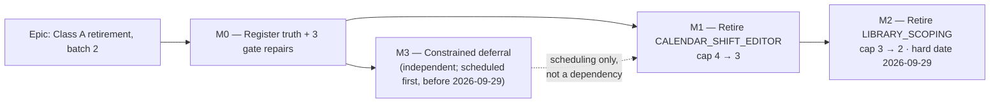

# Implementation Plan: The next Class A feature-flag retirement (ADR-0088 D3)

- **Feature spec:** [`./feature-spec.md`](./feature-spec.md)
- **Status:** Draft (rev 4) — three review rounds; round 3 was component **AGREE (unconditional)** and
  four **AGREE WITH CONDITIONS**, all textual. No blocks in any round. **Ready for approval.**
- **Owner:** _(unassigned)_

> **Subject.** Retires **`VITE_CALENDAR_SHIFT_EDITOR`** then **`VITE_LIBRARY_SCOPING`** — spec §1,
> evidence E8/E9.
>
> **Rev 3 fixes two regressions rev 2 introduced** (red-first narrowed onto one verdict; the M2 file
> list deleted), **adopts one finding that removes a task** (the flattening assertion is already
> proven end-to-end, E26), and corrects the selection-site taxonomy before it reaches ADR-0088.

## Breakdown

### Epic

**Class A retirement, batch 2** — take the alternative-surface count from 4 to 2 under ADR-0088 D3,
make the register true first, and repair three gate holes found on the way.

---

## Milestone M0 — Register truth and gate repair (blocks everything)

**Outcome:** `flag-retirement.json`, `check-flags.mjs`, ADR-0088 and `CLAUDE.md` agree with each other
and with `env.ts`. Three gate holes close: the derivation graph, retired-flag residue, the non-exact cap.

**Entry point:** **Ships dark** (ADR-0081 §1) — `pnpm check:flags` is the reachable surface.

**Journey:** none. Each assertion is **verified red first** against a **named** fixture; that is the
substitute and it is stronger here than a journey.

---

#### Feature F0.1 — The cap says one number, and the gate is exact

> **Complexity:** S · **Dependencies:** none
> **Risks:** restating a literal the next retirement falsifies → prose states the **rule**;
> `flag-retirement.json` holds the only number (ADR-0073 C4).
> **Testing:** exact comparison verified red; `check:doc-links`.

##### Task M0-T1 — Exact cap comparison, corrected prose, stale-entry assertion

- **Complexity:** S · **Dependencies:** none
- **Testing:** set `classACap: 5` → expect failure (previously silent); restore → green. Add a
  `classA` entry for a retired flag → expect failure.
- **Development steps:**
  1. `check-flags.mjs:136` → `classAcount !== register.classACap`; verify red; restore.
  2. Widen the message: "…**or ratchet it down — a cap above the measured count is stale**."
  3. **Add an assertion that `register.classA` holds no entry for a flag in `retired[]`.**
  4. ADR-0088 Consequences: replace the literal with the rule, recording in one sentence that D3 and
     Consequences disagreed and the gate was right.
  5. `CLAUDE.md:1815` — correct **both** errors (cap is 4; a _fifth_ fails).
  6. Grep `cap of three|capped at three` → expect none.
  7. **Normalise `retired[]`'s shape** — it is drifted: `retired` vs `retiredOn`, `constant` on one
     entry only. One line, in the milestone about register truth.

---

#### Feature F0.2 — Every derivation edge is recorded

> **Complexity:** M · **Dependencies:** none
> **Risks:** the parser is the risk; rev 1 got it wrong three ways. Guards below.
> **Testing:** exactly 9 edges before arming; the E11c fixture yields none; red-first three ways.

##### Task M0-T2 — A commutative, initialiser-anchored, total parser

- **Complexity:** M · **Dependencies:** none
- **Risks (each a blocking review finding, with its guard):**
  - **`&&` is commutative and rev 1 assumed otherwise.** Parent-on-the-right at `:169`, `:186`,
    `:672` — **exactly the three the register already records correctly**, so rev 1's parser would
    report them stale and the obvious remedy deletes them: a gate that destroys working coverage on
    its first run. → **Parent = whichever operand is a known `*_ENABLED` constant; self = the
    `flagDefaultOn(import.meta.env.VITE_*)` operand.**
  - **A docblock is not an initialiser.** `env.ts:1535` ("**Not derived.** Unlike
    {@link CANVAS_MULTI_SELECT_ENABLED}…") would yield an edge from a sentence **denying** one. →
    **Anchor between `=` and `;`.** `detect-alternative-surfaces.mjs:17-28` records three prior
    versions of this anchoring failure; this would be the fourth.
  - **Silent under-match.** → **Totality:** parsed declarations equal the `export const *_ENABLED`
    count; any initialiser containing `&&`, `||` or `?` that cannot be fully decomposed **fails**.
  - **`derivedFrom` must be `string | string[]`** (`VITE_CANVAS_AUTHORING` had two parents until
    2026-08-10). → **Also update `check-flags.mjs:198-212`** — `byConstant.get` at `:200` and the
    messages at `:202`/`:208` all assume a single string.
- **Testing:** print the parsed set and **assert exactly 9** before arming; E11c yields none; red-first
  on a removed edge, a bogus edge, and an undecomposable initialiser.
- **Development steps:**
  1. Re-derive from `env.ts` — **re-run, do not trust this plan** (a brief is not evidence, and this
     plan is a brief).
  2. Write the parser with all four guards; docblock _why_, naming the commutativity trap and the
     E11c fixture.
  3. Verify red three ways; confirm exactly 9.
  4. Update `:198-212` for the array form.
  5. Backfill six edges: `ACTIVITY_EDITOR_CONVERGENCE`←`ACTIVITY_EDITOR_TABS_ENABLED`;
     `WBS_IMPROVEMENTS`←`ACTIVITY_EDITOR_TABS_ENABLED`; `CANVAS_AUTHORING_FLOW`←`CANVAS_AUTHORING_ENABLED`;
     `CANVAS_LINK_ROUTING`←`CANVAS_DIRECT_MANIPULATION_ENABLED`; `CANVAS_SEARCH_NAV`←`CANVAS_LENSES_ENABLED`;
     `CANVAS_MULTI_SELECT`←`CANVAS_DIRECT_MANIPULATION_ENABLED`.
  6. Resolve the one inversion (M0-T2a).
  7. Update the script docblock's assertion list — **and correct `check-flags.mjs:4`, which says
     "declares 58 `VITE_` flags" where the register holds 56.** A count in the docblock of the gate
     that enforces counts is the ADR-0076 Class 1 shape, and this is the register-truth milestone.

##### Task M0-T2a — Resolve the single inversion the backfill exposes

- **Description:** `VITE_CANVAS_AUTHORING_FLOW` is batch-10 (due **2026-10-13**); its parent
  `VITE_CANVAS_AUTHORING` is batch-13 (**2026-11-03**). The other five are correctly ordered.
- **Complexity:** S · **Dependencies:** M0-T2
- **Risks:** "fixing" it by dropping the edge is forbidden — the edge is real (`env.ts:1098-1099`).
  The inversion is a **pre-existing defect the gate could not see**, which is the finding.
- **Development steps:** move `VITE_CANVAS_AUTHORING_FLOW` to a batch due on/after 2026-11-03 (both
  are Class B `keep`, so nothing is actually scheduled); note that the gate found it, not a re-plan.

---

#### Feature F0.3 — A retired flag leaves no residue

> **Complexity:** S · **Dependencies:** none
> **Risks:** a naive text scan is **worse than nothing** — it fires on correct history notes and on
> live prefix siblings. Two named negative fixtures below.
> **Testing:** verified red on the **live** residue; verified **silent** on both fixtures.

##### Task M0-T3 — Declaration-anchored, word-boundary residue assertion

- **Complexity:** S · **Dependencies:** none
- **Risks — this is the sibling of M0-T2's anchoring failure, in the same milestone:**
  - **Anchor to declaration forms only** — `readonly VITE_X?:` in `vite-env.d.ts`,
    `import.meta.env.VITE_X` in `env.ts`. A text scan also matches **`env.ts:133`**, a correct,
    load-bearing history note naming the retired `VITE_CANVAS_TOOLBAR`, and `.env.example:167`.
    **Named negative fixture, beside E11c's.**
  - **Word-boundary matching required.** `vite-env.d.ts` holds two live prefix pairs —
    `VITE_NAV_TREE`/`VITE_NAV_TREE_CRUD` and `VITE_CANVAS_AUTHORING`/`VITE_CANVAS_AUTHORING_FLOW`. A
    substring check reports a **live** flag as residue the day its prefix-sibling retires. **Named
    fixture.**
  - **Residue lives in a third file class, and it is live now.** `.github/workflows/ci.yml:504` still
    uploads `apps/web/playwright-report-workspace/`, although `e2e-workspace/` and
    `playwright.workspace.config.ts` were deleted in the **previous** retirement (`VITE_CANVAS_TOOLBAR`,
    2026-08-10). Verified directly. Rev 3's checklist named `env.ts`, `vite-env.d.ts`, `.env.example`,
    configs, register and banner/README — **not `ci.yml`**. It is a second live fixture, exactly as
    `vite-env.d.ts:17` is.
- **Testing:** arm → **fails on `VITE_NAV_TREE_CRUD`**; confirm it does **not** fire on `env.ts:133`
  or either prefix pair; remove `vite-env.d.ts:17` → green.
- **Development steps:**
  1. Add the assertion; run; confirm it fails on the live residue and is silent on both fixtures.
  2. Delete `vite-env.d.ts:17`; check `.env.example` for a `VITE_NAV_TREE_CRUD` stanza.
  3. **Delete `ci.yml:504`** (`apps/web/playwright-report-workspace/`) — live residue from the
     previous retirement.
  4. Extend the retirement checklist in the script docblock: `env.ts`, `vite-env.d.ts`,
     `.env.example`, configs, register, **`CLAUDE.md` banner + `README.md` counts**, **and
     `.github/workflows/ci.yml` — both the comment block and the report-upload paths**.

---

#### Feature F0.4 — The register describes the estate accurately

> **Complexity:** S · **Dependencies:** none
> **Risks:** deleting the notes loses real findings → both **corrected, not removed**.

##### Task M0-T4 — Correct both `classA` notes and ADR-0088 D2

- **Complexity:** S
- **Development steps:**
  1. **Re-verify E8** by opening `CreateActivityButton.tsx` and `ActivityEditorDialog.tsx:154` first.
  2. `ACTIVITY_EDITOR_TABS` note: edit-only editor vs legacy trio; `ActivityFormDialog` **survives**
     as the create surface; the nine suites are flag-unaware; real cost 2 harnesses + 2 children.
  3. `LIBRARY_SCOPING` note: **five two-arm selection sites** (`ActivityFormDialog.tsx:551`,
     `ActivityCalendarField.tsx:98`, `PlanCalendarPicker.tsx:146`, `ResourceFormDialog.tsx:362`,
     `ActivityResourcesPanel.tsx:367`) **plus one guard-only site** (`ResourceFormDialog.tsx:318`,
     whose flag-off branch is `: null` — ADR-0088 D2's Class B shape).
  4. **Record why the register said "four":** it was `detect-alternative-surfaces.mjs`'s output, not
     a clerical slip — the detector structurally cannot see `:318` (ternary wraps a `
`) or
     `:551` (intervening comment). **Consequence: assertion 3b does not backstop those sites**; the
     real backstop is deleting the constant, which turns every missed reference into a typecheck
     error. State that in M1-T4/M2-T6 too.
  5. Correct ADR-0088 D2's table row and paragraph in place, in that ADR's house style.

---

## Milestone M3 — A constrained, gate-honoured deferral

**Outcome:** the two deferred Class A flags — **and M2's own flag if it slips** — survive their batch
dates without a red build, and the deferral cannot become an escape hatch.

**Entry point:** **Ships dark.** The register, ADR-0088 and `docs/TECH_DEBT.md`.

**Journey:** none. Proof is `check:flags` green with the clock advanced, by a **named executable
method**.

**Why M3 is pulled ahead of M1/M2:** it is independent of both and exists to beat a date — the
earliest of which (**2026-09-29**) belongs to M2's own subject.

---

##### Task M3-T1 — Add the deferral field, constrain it, amend ADR-0088

- **Complexity:** M · **Dependencies:** M0-T4
- **Risks:**
  - **Reaching for `keep` verbatim is wrong** — `keep` means "Class B, guard-only, never retires",
    false for a Class A flag, and would corrupt the classification this epic defends.
  - **An undated, gate-honoured opt-out for a Class A flag is the escape hatch this epic exists to
    remove.** → The field **must carry an enumerated trigger or a named TECH_DEBT row**; a bare date
    or empty string fails the gate.
  - **A field the governing ADR does not know about is the ADR-0071 shape** this plan cites twice →
    ADR-0088 D4/D6 amended in the same commit.
- **Testing:** **back-date `register.batches['batch-9'].due` and `['batch-12'].due` only, run
  `pnpm check:flags`, restore.** Preferred over a `FLAG_CHECK_TODAY` override — a date override in a
  gate is a bypass. Remove the field → red.
  **`batch-8` is deliberately excluded, and this is a correction rev 3 got wrong.** Batch-8's only
  non-`keep` flag is `VITE_LIBRARY_SCOPING`, which M3 does **not** defer, so back-dating it makes
  assertion 3 fire **correctly** — that redness is M2's hard date working as intended. Rev 3 listed
  all three, which meant the proof could not pass and the two ways out were both wrong: add the field
  to `LIBRARY_SCOPING`, silently cancelling the hard date rev 3 introduced, or stop verifying.
- **Development steps:**
  1. Add the field with an enumerated trigger to both survivors:
     - `VITE_ACTIVITY_EDITOR_TABS` — "the next epic touching the activity editor, or any epic
       unifying create and edit". Carry E8/E9 with file:line, and state that retiring the flag alone
       does **not** collect the nine-suite payoff.
     - `VITE_CANVAS_WORKSPACE` — "the next epic touching the plan workspace". Name the seven
       flag-off configs, and note that `sub-day` and `assignment-lag` harness **both** survivors, so
       converting them is shared work.
       1a. **Add the self-limiting enumeration value now:**
       `"retirement in flight — docs/specs/flag-retirement-library-and-calendar/, M2"`. Without it, an
       M2 slip past 2026-09-29 meets a rule with no fitting value and the author invents one under time
       pressure — the escape hatch this task's first risk exists to close.
  2. Teach assertion 3 to honour the field **and to reject an empty/undated trigger**.
  3. Amend **ADR-0088 D3 as well as D4/D6**. D4/D6 define the register's vocabulary, but **D3 is the
     decision that says Class A retires on merit under a standing cap** — the thing this field
     suspends. A reader of D3 alone would learn nothing about it, which is the confusion this task's
     own risk warns about.
     3a. **Add the assertion-5 clause:** after M3 a deferred parent's `due` is no longer a retirement
     date, yet it still bounds its children. `CANVAS_WORKSPACE → CANVAS_AUTHORING → SCHEDULING_MODES`
     is a live chain, so state what a deferred parent's date means for a child.
  4. Verify green past **2026-10-06 and 2026-10-27** by back-dating **`batch-9` and `batch-12` only**;
     red without the field.
  5. `docs/TECH_DEBT.md` rows — next free number is **#122** (#119–#121 all exist) — cross-referenced
     from the register.

---

## Milestone M1 — Retire `VITE_CALENDAR_SHIFT_EDITOR` (cap 4 → 3)

**Outcome:** "Author a working week" has one implementation. **No user-visible change** (E24).

**Entry point:** **Calendars** → open a calendar → the **Working week** editor (`WeeklyShiftEditor`,
per-day `HH:MM` rows) and **Standard working day → Hours per day**.

**Journey:** `scripts/e2e-local.sh web:calendar-shifts`. **The correct gate, and the wrong one is
instructive:** ADR-0088's first draft named the harness driving the _deleted_ branch — batch 1
verbatim. `playwright.calendar-shifts.config.ts` pins **`'true'`**, so it drives the surviving world.

---

##### Task M1-T1 — `CalendarFormDialog.tsx`

- **Complexity:** M · **Dependencies:** M0-T2
- **Risks:** the only real risk is **mis-transcription**. `:361` becomes unconditionally `'lg'`, which
  is **already** what every shipped bundle evaluates (E24) — say so in the PR so a reviewer does not
  read it as an unrelated visual change.
- **Testing:** `CalendarFormDialog.shifts.test.tsx` and `.scope.test.tsx` pass **unedited** — with
  **two** exceptions: the `:235` assertion ruled on in step 5 below, and the dead `'true'` pin at
  `:18` that M1-T3 step 4 deletes.
- **Development steps:**
  1. Re-grep `WeekdayToggleGroup`, `weekIsSimplified`; confirm E15.
  2. Delete `:51`, `:219-220`, `:524-549`.
  3. Unconditionalise `:232`, `:252`, `:264`, `:287`, **`:358-360`**, `:361`, `:467`.
  4. Remove the flag import; drop the `hasIntradayDetail` import (`:9`) if now unused.
  5. **Rule on `CalendarFormDialog.shifts.test.tsx:235`** — it asserts the absence of the flag-off
     advisory, which becomes a tautology asserting the absence of a string no longer in the repo.
     Delete it or rewrite its comment. It currently survives only because "passes unedited" is the
     oracle.
  6. **Correct `features/calendars/model/shift-summary.ts:5-16`.** Its docblock says
     `hasIntradayDetail` is "the predicate behind two behaviours that must agree: the advisory telling
     a planner their week is shown simplified, and … the library table's '· 2 shifts' suffix". M1
     deletes that advisory, so the docblock becomes false — and it names **neither the flag nor the
     constant**, so no grep in this plan reaches it. It is the worked proof that the prose sweep needs
     a term list rather than a constant name (M1-T5).

##### Task M1-T2 — The field decision first, then schema, exceptions, table

- **Complexity:** M · **Dependencies:** M1-T1
- **Risks:**
  - **The phantom field (E20).** After M1 the only control binding `workingWeekdays` is gone, yet it
    stays validated, surfaced by `FormErrorSummary`, and unconditionally stripped at `:297` — verbatim
    the ADR-0067 M4 dead end. → **Default: remove it from the schema.**
  - **`Omit` of an absent key is a silent no-op (E27)** — `use-calendars.ts:67` and `:92` are
    `Omit<CalendarFormValues,'workingWeekdays'> & {…}`. Removing the field leaves these compiling and
    meaningless. **The one site typecheck will not catch.**
  - **`features/calendars/schemas/` has no unit test file** — once the conjunct goes, the only
    client-side invalid-mask assertion left is the one M1-T3 removes as parity.
- **Development steps (order corrected — the decision comes first):**
  1. **Decide `workingWeekdays`.** Default: remove from `calendarFormSchema`. Keeping it requires a
     written reason in the PR.
  2. If removing, fold the three sites the earlier revisions never named: `CalendarFormDialog.tsx:191`
     (defaultValues seed), `:199` (reset seed), `:297` (the strip) — typecheck catches all three, but
     a plan whose stated top risk is mis-transcription should not leave the fold to the compiler.
  3. **Retype `use-calendars.ts:67` and `:92`** from `Omit<CalendarFormValues,'workingWeekdays'> & {…}`
     to `CalendarFormValues & {…}`. **Keep** the body builders and flatten docblocks (`:51-64`,
     `:73-82`) — they are the surviving record of the destructive server-side flatten, not residue.
     (Rev 2 said "simplify" and "keep" of the same ranges in adjacent steps; this is the resolution.)
  4. **Only if step 1 kept the field:** `calendar-schemas.ts:118` → `WorkingWeekdays.isValid(mask)`;
     rewrite the comment, keeping TECH_DEBT #79 / ADR-0036 §2 and the ADR-0067 M4 story. **If step 1
     removed it there is no `:118` refine to simplify** — the field and its refine go together.
     Update **`:98`**'s comment either way.
  5. `CalendarExceptionsEditor.tsx:65,121,403,408,426,437` → keep the flag-on arm.
  6. `CalendarsTable.tsx:208` → unconditional badge.

##### Task M1-T3 — Suite disposition, classified per `it()`

- **Complexity:** M · **Dependencies:** M1-T1, M1-T2
- **Risks:**
  - **The flattening assertion does not need re-expressing — it is already proven end-to-end (E26).**
    `e2e-calendar-shifts/calendar-shifts.spec.ts:12-14` states the claim and `:60-68` proves it
    against a real API on the surviving path (rename → save → reload → `06:00`/`21:30` unchanged), and
    M1-T4 runs that journey. Rev 2's "re-express as a unit test" was also **impossible as written**:
    under step 1 above the field leaves the schema, so no mutation short of re-adding it reproduces
    the original cause. → Verdict: **deleted — covered by `e2e-calendar-shifts`.**
  - **Five non-parity `it()`s, not four** — `:64`, `:83`, `:124`, `:135`, `:159`. **"Non-parity" means
    "does not assert the deleted branch"; it does not mean "must survive as a unit test"** — `:83` is
    in this list _and_ takes the `deleted — covered by …` verdict above, which is consistent and reads
    as a contradiction to a hurried implementer. **`:135` has no
    counterpart in either flag-on sibling**, so it is a real gap if dropped without a destination.
- **Testing:** **both "re-hosted" and "re-expressed" require red-first**, and each ledger row names
  the **mutation** (file:line changed to make it red).
- **Development steps:**
  1. Enumerate every `it()`; assign one of **five** verdicts:
     - _deleted (asserts the removed branch)_
     - _`deleted — covered by <spec file>:<line>`_ — **the ledger row must quote the covering
       assertion. A journey _name_ alone does not satisfy it**, or this verdict becomes a laundering
       route requiring no `file:line`, no quote and no red-first. M1's single use is
       `e2e-calendar-shifts/calendar-shifts.spec.ts:60-68`, quoted.
     - _converted_
     - _re-hosted_ — **red-first, naming the mutation**
     - _re-expressed_ — **red-first, naming the mutation**
  2. **State `CalendarFormDialog.test.tsx`'s own fate explicitly** — rev 2 never did. Default: the
     file goes once every `it()` has a verdict.
  3. Re-grep `CALENDAR_SHIFT_EDITOR_ENABLED: false` for any other suite.
  4. Delete the **three** dead `'true'` pins: `CalendarExceptionsEditor.hours.test.tsx:23`,
     `WeeklyShiftEditor.presets.test.tsx:17`, `CalendarFormDialog.shifts.test.tsx:18`.
  5. Ledger in the PR description.

##### Task M1-T4 — Retire, ratchet, update the doc gates, run the journey

- **Complexity:** S · **Dependencies:** M1-T1..T3
- **Risks:**
  - **Deleting `playwright.calendar-shifts.config.ts` would delete the journey covering the surviving
    surface** — the mistake ADR-0088 caught in its own draft. Delete **only** the env pin. Here that
    _is_ the web server's sole env key, so the `env` key goes with it — **this sentence is true for M1
    and false for M2** (E28).
  - **`pnpm check:counts` will fail** (E29): this deletes suites and adds none, and the gate reads
    both `CLAUDE.md` and `README.md`.
  - **3b does not backstop the missed sites** (E21b) — the backstop is deleting the constant.
- **Testing:** `pnpm check:flags`, `pnpm check:counts`, full pre-push gate, **`scripts/e2e-local.sh
web:calendar-shifts` run locally** (CLAUDE.md §19.8 — omitting it cost five CI rounds on ADR-0063).
- **Development steps:**
  1. Delete `CALENDAR_SHIFT_EDITOR_ENABLED` + docblock (`env.ts:1170`).
  2. Delete `vite-env.d.ts:98`. **`.env.example`: confirm there is no stanza** (E23 — there is none;
     rev 2 said "delete it").
  3. Delete the pin at `playwright.calendar-shifts.config.ts:64`.
  4. Register entry → `retired[]`, `VITE_CANVAS_TOOLBAR`-style note: what the branch was, why it went,
     the ledger summary, and that `e2e-calendar-shifts` was **kept** because it pins the surviving world.
  5. Remove the `classA` entry; `classACap: 3`.
  6. **Update the `CLAUDE.md` stage banner and `README.md` counts** (E29).
  7. **`ci.yml`: `:305` is the calendar-shifts comment** (`:296` is library — rev 2 assigned both to
     M1). Add `playwright-report-calendar-shifts` to the artefact upload list; **nine** journeys lack
     one (`assignment-lag`, `calendar-shifts`, `copy-paste`, `float-paths`, `multi-select`, `public`,
     `search-nav`, `staff`, `sub-day`) — fix this one, file the rest.
  8. **Docs sweep: read every `rg -n "CALENDAR_SHIFT_EDITOR" docs/` hit.** Checksum, **with the unit
     named** because rev 3's was wrong and a wrong checksum on a "read every hit" instruction licenses
     stopping early: **7 files**, of which **2 are this spec directory, 2 are the sibling
     `docs/specs/calendar-shift-editor/`, and 3 are outside any spec directory** —
     `docs/adr/0067-…`, `docs/adr/0088-…`, `docs/ROADMAP.md` (≈4 _hits_ outside any spec directory;
     file and hit counts are different units, so re-derive rather than matching one against the
     other). **Do not stop at the sibling spec directory** — that is exactly where rev 3's figure
     ran out. `docs/adr/0067-…:149-152` is the sentence at stake; update the CLAUDE.md §16 ADR-0067
     entry too.
  9. Changeset (`patch`, `web`): **no user-visible change**.

##### Task M1-T5 — Residue sweep

- **Complexity:** S · **Dependencies:** M1-T1..T4
- **Risks:** rev 2 sent this task after `missing*` derivations that live only in **M2's** files —
  corrected: those belong to M2-T7.
- **Development steps:** the prose sweep is **runnable, not an intention.** Rev 3's "naming the flag
  _or the feature_" gave no term list, no scope and no done-condition, and
  `features/calendars/model/shift-summary.ts:5-16` is the proof it would have missed something — that
  docblock goes false when M1 deletes the advisory, and names **neither** the flag nor the constant.
  1. **Terms:** `shift editor|shown simplified|works specific hours|weekday (mask|checkbox)|WeekdayToggleGroup`.
  2. **Scope:** `apps/web/src` **and** `docs/`.
  3. **Done-condition:** every hit read, then corrected or explicitly left, with the count in the PR.
  4. Then orphaned docblock sentences and leftover pins; `pnpm lint`, `pnpm typecheck`.

---

## Milestone M2 — Retire `VITE_LIBRARY_SCOPING` (cap 3 → 2) · **hard date 2026-09-29**

**Outcome:** five picker sites and one guard have one implementation.

**Entry point:** **Calendars** and **Resources** library screens; the project-detail **Calendars**
section; the five pickers — activity calendar, plan calendar, activity resources, resource form, and
the **create-activity** dialog's calendar picker (`ActivityFormDialog.tsx:551`).

**Journey:** `scripts/e2e-local.sh web:library` (pins `'true'` — the surviving world).

---

##### Task M2-T0 — Re-derive the inventory before touching code

- **Complexity:** S · **Dependencies:** M0
- **Development steps:**
  1. `Grep LIBRARY_SCOPING_ENABLED` → classify every file: **code consumer**, **comment-only**
     (`ProjectCalendarsSection.tsx:32`), or **test**.
  2. `Grep "LIBRARY_SCOPING_ENABLED: false"` → expect **13**; reconcile against M2-T5's list.
  3. `Grep LIBRARY_SCOPING` (no `_ENABLED`) → **expected extra hits include `vite-env.d.ts:77`,
     `.env.example` (~`:275-286`), config comments, `use-plan-workspace-model.ts:368`,
     `components/ui/form.tsx:152` and `use-optimistic-select.ts:27`.** The last three are prose;
     **`form.tsx:152` is historical and stays.**
  4. Record numbers **and method** in the PR; correct spec E7 if it disagrees.

##### Task M2-T1 — Calendars area (guards)

- **Complexity:** M · **Dependencies:** M2-T0
- **Risks:** `CalendarsTable` guards include **query args** (`:120-121`, `:147`, `:153`) — check each
  against flag-on behaviour rather than de-indenting.
- **Testing:** `CalendarsTable.scope.test.tsx`, `.archive.test.tsx`, `library-filter-state.test.tsx`,
  `ProjectCalendarsSection.test.tsx`, `CalendarFormDialog.scope.test.tsx`.
- **Development steps:** unconditionalise each; edit `ProjectCalendarsSection.tsx:32`'s docblock;
  remove imports; run suites.

##### Task M2-T2 — `use-calendars.ts` (the query-shape site)

- **Complexity:** S · **Dependencies:** M2-T1
- **Risks:** removing the wrong branch silently changes which calendars every picker offers.
- **Testing:** assert the project-scoped query is the one issued, **and that no request is made when
  `projectId` is empty**.
- **Development steps:** delete the org query and the ternary at `:226-231`; keep `project`. At
  **`:229`** drop **only** the `LIBRARY_SCOPING_ENABLED &&` conjunct and **keep `Boolean(projectId)`**
  (rev 2's "remove the `enabled` conjuncts" was ambiguous and would have removed the guard).

##### Task M2-T3 — Resources area

- **Complexity:** M · **Dependencies:** M2-T0
- **Risks:**
  - **`assignable` is not dead code (E25).** `ActivityResourcesPanel.tsx:161-166` is read by the
    deleted arm **and** by the gate at `:347` wrapping both arms — deleting it removes **two empty
    states**. → **Keep it; drop only the `:165` conjunct.**
  - `ResourceFormDialog.tsx:318` is a **guard** (`: null`), `:362` a **selection site** — treat them
    differently and say which is which in the PR.
  - The `GROUP` kind becoming unconditional is **not** a capability change — already offered (E24).
- **Testing:** `ResourcesTable.hierarchy.test.tsx`, `.archive.test.tsx`,
  `ResourceFormDialog.hierarchy.test.tsx`, `.scope.test.tsx`, `ActivityResourcesPanel.test.tsx`.

##### Task M2-T4 — Activity and plan pickers (including the create surface)

- **Complexity:** M · **Dependencies:** M2-T1
- **Risks:**
  - `ActivityFormDialog` is the **create** surface (E8) — critical path for every new activity.
  - **Rev 2's "must pass unedited" claim is deleted as false.** `ActivityFormDialog.calendar.test.tsx`,
    `.sub-day.test.tsx` and `PlanCalendarPicker.test.tsx` all pin the flag off and **cannot** pass
    unedited. `PlanCalendarPicker.test.tsx` is sharpest: **4 of its 6 assertions have no counterpart
    in the scope suite.** They are converted under M2-T5.
  - `ActivityCalendarField`'s docblock (`:20-21`) claims an importer it does not have → correct it;
    **file the duplicate-picker collapse separately**.
  - `PlanCalendarPicker.tsx:159` loses busy state on the **save** half only (`setCalendar.isPending`);
    list-load busy survives via `loading`. **Pre-existing; deliberately not fixed here — and it is
    US-8's one named exception**, declared in the DoD so the per-site table cites it instead of
    failing on it. Filed as debt in M2-T7.
  - **`ActivityCalendarField` has no axe assertion anywhere** — the one surviving arm nothing checks.
    Record as debt; US-8's per-site table is where it surfaces.
  - `ActivityFormDialog.tsx:569` (native `disabled` for a domain rule, reason `aria-describedby`-only
    and therefore unannounced) → **file as debt, do not fold into M2.**
- **Development steps:** unconditionalise `:551`, `ActivityCalendarField.tsx:98`,
  `PlanCalendarPicker.tsx:146`; correct the docblock; narrow `CalendarControl`
  (`PlanCalendarPicker.tsx:28`) if the sweep shows the union is unused.

##### Task M2-T5 — Suite disposition: ownership from the docblock, classification per `it()`

- **Complexity:** L · **Dependencies:** M2-T0..T4
- **Risks — the highest in the plan, and rev 1's rule was actively dangerous:**
  **A filename does not establish ownership.** `ActivityResourcesPanel.assignment-lag.flag-off.test.tsx`
  matches `*.flag-off.test.tsx` but its **docblock names `VITE_ASSIGNMENT_LAG`** — a live Class B flag
  carrying `keep`. Rev 1's rule would have deleted another flag's rollback contract while the ledger
  recorded it as parity cleanup.
- **The full verified 13, with ownership** (restored — rev 2 deleted this list while M2-T0 still
  referenced it):

  | File (`apps/web/src/features/…`)                                               | Owner / verdict                                       |
  | ------------------------------------------------------------------------------ | ----------------------------------------------------- |
  | `calendars/components/library-scoping-flag-off.test.tsx`                       | **LIBRARY_SCOPING parity**                            |
  | `resources/components/ResourcesTable.hierarchy.flag-off.test.tsx`              | **LIBRARY_SCOPING parity**                            |
  | `resources/components/ActivityResourcesPanel.assignment-lag.flag-off.test.tsx` | **ASSIGNMENT_LAG — convert, never delete**            |
  | `resources/components/ActivityResourcesPanel.assignment-lag.test.tsx`          | **ASSIGNMENT_LAG — convert**                          |
  | `resources/components/ActivityResourcesPanel.test.tsx`                         | incidental — convert                                  |
  | `resources/components/ResourcesTable.test.tsx`                                 | incidental — convert                                  |
  | `resources/components/ActivityResourcesDialog.test.tsx`                        | incidental — convert                                  |
  | `resources/components/ActivityResourcesDialog.curves.test.tsx`                 | incidental — convert                                  |
  | `resources/components/ActivityResourcesDialog.duration-types.test.tsx`         | incidental — convert                                  |
  | `resources/components/ActivityResourcesDialog.earned-value.test.tsx`           | incidental — convert                                  |
  | `activities/components/ActivityFormDialog.calendar.test.tsx`                   | incidental — convert                                  |
  | `activities/components/ActivityFormDialog.sub-day.test.tsx`                    | incidental — convert                                  |
  | `plans/components/PlanCalendarPicker.test.tsx`                                 | incidental — convert (**4 of 6 uncovered elsewhere**) |

- **`components/ui/combobox.test.tsx` is the surviving home of the three ADR-0053 M6 a11y fixes** (the
  `emptyOption` label rendering as the selection, the announced result count, the keyboard-reachable
  "Load more"). It is a **flag-unaware primitive suite**, named explicitly so a bulk deletion cannot
  orphan those behaviours.
- **Testing:** converted assertions re-run against the `Combobox`; **re-hosted and re-expressed both
  verified red first**, each naming its mutation.
- **Development steps:**
  1. For each of the 13: open the **docblock**, record _whose_ contract it is.
  2. Classify **per `it()`** (the five verdicts defined in M1-T3 step 1, **including its evidence
     rule**: `deleted — covered by <spec file>:<line>` with the covering assertion quoted. "Covered by
     `e2e-library`" is **not** a verdict — this task spans 13 suites and is where an unevidenced
     verdict would do the most damage). At least three files are mixed.
  3. Convert the incidental and foreign-owned suites; delete only true `LIBRARY_SCOPING` parity `it()`s.
  4. Confirm `combobox.test.tsx` still covers the three M6 fixes.
  5. Ledger in the PR description.

##### Task M2-T6 — Retire, ratchet, update the doc gates, run the journey

- **Complexity:** S · **Dependencies:** M2-T1..T5
- **Risks:**
  - **Delete ONE line, not the `env` block.** `playwright.library.config.ts:64-72` pins **seven** keys
    including **`VITE_SCHEDULING_MODES: 'false'`** (E28). Deleting the block would silently turn
    scheduling modes **on** for a journey that pins it off deliberately. M1-T4's "sole env key"
    sentence is **false here** — rev 2 imported it via "mirror steps 1–8".
  - `check:counts` will fail without banner + README updates (E29).
- **Testing:** `pnpm check:flags`, `pnpm check:counts`, pre-push gate, `web:library` locally.
- **Development steps:**
  1. Delete `LIBRARY_SCOPING_ENABLED` + docblock (`env.ts:815`) and `vite-env.d.ts:77`.
  2. Delete the **`.env.example`** stanza (read the whole block, ~`:275-286`).
  3. Delete **only** `playwright.library.config.ts:65`.
  4. Register → `retired[]` with the note, **recording the accepted a11y cost**: the native `<select>`
     arm is gone permanently, taking the mobile OS picker and platform typeahead with it.
  5. Remove the `classA` entry; `classACap: 2`.
  6. `CLAUDE.md` banner + `README.md` counts; `ci.yml:296` (the **library** comment) + report upload.
  7. Read every `rg -n "LIBRARY_SCOPING" docs/` hit; update the CLAUDE.md §16 ADR-0053 entry.
  8. Add a sentence to `docs/TECH_DEBT.md` **#114.3**: it is latent with **zero reachable instances**,
     and after M2 **there is no native arm to fall back to**.
  9. Changeset (`patch`, `web`): no user-visible change.

##### Task M2-T7 — Residue sweep

- **Complexity:** S · **Dependencies:** M2-T1..T6
- **Development steps:** `CalendarControl` narrowing (`PlanCalendarPicker.tsx:28`); the dead `missing*`
  derivations (**they live here, not in M1**); the two hook `enabled` parameters —
  `use-calendar-project-names.ts` and `use-result-count-announcement.ts` (**verify the latter's
  consumer count before removing; it is reported to reach zero**); `ASSIGNABLE_RESOURCE_KINDS`; dead
  `'true'` pins; and the prose sweep in M1-T5's runnable form, with terms
  `library scoping|scope (badge|filter)|organisation calendar|native select|optgroup` over
  `apps/web/src` + `docs/`, every hit read. **Also file the debt** this milestone deliberately did not
  fix: `PlanCalendarPicker.tsx:159`'s save-half `aria-busy` (US-8's named exception),
  `ActivityCalendarField`'s absent axe assertion, `ActivityFormDialog.tsx:569`, and the
  duplicate-picker collapse. `pnpm lint`, `pnpm typecheck`.

---

## Sequencing & slices

| Order | Slice                        | Releasable?                  | Revertible as                             |
| ----- | ---------------------------- | ---------------------------- | ----------------------------------------- |
| 1     | **M0** (T1, T2, T2a, T3, T4) | yes — docs + gates           | one commit                                |
| 2     | **M3**                       | yes                          | one commit — **lands before 2026-09-29**  |
| 3     | **M1** (T1→T5)               | yes — no user-visible change | one commit                                |
| 4     | **M2** (T0→T7)               | yes                          | one commit per task area, retirement last |

**Dates:** `VITE_LIBRARY_SCOPING` is batch-8, **due 2026-09-29** — Class A with no `keep`, so CI
reddens that day if M2 has not landed. That is **earlier than both deferral dates**. A slip takes M3's
deferral field under the **already-enumerated** value
`"retirement in flight — docs/specs/flag-retirement-library-and-calendar/, M2"` (M3-T1 step 1a), not a
red build and not an invented trigger — which is the second reason M3 is scheduled first.

**M3 is scheduled ahead of M1/M2 but does not depend on them**, and they do not depend on it; the
flowchart's dotted edge says so. Its ordering is a date, not a dependency.

**No feature flag.** Gating a flag retirement behind a flag keeps the branch this work deletes.
Rollback is `git revert`; each milestone is one revertible commit (the `VITE_CANVAS_TOOLBAR` precedent).

## Definition of Done (per task)

Feature Completion Criteria in [`docs/PROCESS.md`](../../PROCESS.md), sharpened:

- `pnpm lint && pnpm typecheck && pnpm test` **run locally**, plus `pnpm check:flags`,
  **`pnpm check:counts`** (E29 — will fail without banner + README updates) and `pnpm check:doc-links`.
- **`scripts/e2e-local.sh web:calendar-shifts` (M1) / `web:library` (M2) run locally.**
  `…api` not required — no `apps/api` file is touched.
- **No new gate ships without being verified red first against a _named_ fixture**, and M0's gates
  must also be verified **silent** on their named negative fixtures (`env.ts:133`, `env.ts:1535`, both
  prefix pairs).
- Every removed assertion carries a ledger verdict **with a named destination or a written reason** —
  a bare "deleted" does not satisfy this. **"Re-hosted" and "re-expressed" both require red-first,
  each naming the mutation** (file:line changed to make it red); **`deleted — covered by …` requires
  a `<spec file>:<line>` and the covering assertion quoted** — a journey name alone does not satisfy
  it.
- **Accessibility (US-8):** a review runs over the combined **M1+M2** diff **before** the retirement
  commit. Acceptance: for every site where an arm is deleted, the surviving arm's accessible name,
  `aria-describedby`, `aria-invalid` and busy state are **equal to or better than** the deleted arm's,
  recorded as a **per-site table** in the PR — **and any site entering scope after that review
  re-opens it.**
  **One named exception, declared here rather than waived at the table:**
  `PlanCalendarPicker.tsx:159` is strictly **worse** on busy state — the deleted `<select>` carried
  `aria-busy` for both halves, the `Combobox` survivor carries the list-load half only (`loading`);
  `setCalendar.isPending` is unreflected. **Pre-existing, out of scope by this plan's own no-behaviour-
  change-in-a-refactor rule**, and the round-two review that raised it said "do not fix it inside M2".
  Filed as debt in M2-T7. Without naming it, the first table filled in contains a failing row and the
  gate gets waived wholesale — which is what it existed to prevent.
- Changeset (`patch`, `web`) stating **no user-visible behaviour changes**.
- **No schema change.** If any task implies one, it stops and **database-architect** runs first,
  unconditionally (CLAUDE.md §19.3).

## Recommended agents

| Stage                   | Agent                                | Why                                                                                                              |
| ----------------------- | ------------------------------------ | ---------------------------------------------------------------------------------------------------------------- |
| M0, M3                  | **devops-reviewer**                  | four new/changed CI assertions; the parser and the residue scan must fail loud and stay silent on their fixtures |
| M0, M1, M2              | **test-engineer**                    | red-first discipline, the mutation naming, per-`it()` ledgers, M2-T5's ownership rule                            |
| M1, M2                  | **component-reviewer**               | five selection sites losing an arm — where a dropped loading/empty/error state appears (E25 is exactly this)     |
| M1, M2                  | **ux-reviewer**                      | the phantom-field decision and the prose left behind by deleted branches                                         |
| **M1+M2 combined diff** | **accessibility-reviewer**           | **a DoD gate, not a recommendation** (US-8)                                                                      |
| —                       | **database-architect**               | **not engaged — no schema change (E17).** Engage unconditionally if any task disproves that                      |
| —                       | security / api / backend-performance | not engaged — no API, auth, query-cost or backend surface                                                        |

## Risks & assumptions (rollup)

| Risk / assumption                                                      | Likelihood                    | Impact   | Mitigation                                                                                                     |
| ---------------------------------------------------------------------- | ----------------------------- | -------- | -------------------------------------------------------------------------------------------------------------- |
| **Parser reports the register's three correct edges as stale**         | was **certain** in rev 1      | **high** | Commutative operand rule; exactly-9 before arming (M0-T2)                                                      |
| **Residue scan fires on a history note or a live prefix sibling**      | **high** without guards       | **high** | Declaration-anchored + word-boundary; two named fixtures (M0-T3)                                               |
| **M2-T5 deletes another flag's rollback contract**                     | was **high** in rev 1         | **high** | Docblock ownership; the 13-file table restored                                                                 |
| **A "re-hosted" assertion launders a lost check**                      | was **reopened** in rev 2     | **high** | Red-first on **both** verdicts; each row names its mutation                                                    |
| **`Omit` of an absent key silently no-ops**                            | med                           | med      | E27; retype `use-calendars.ts:67,92` (M1-T2)                                                                   |
| **`assignable` deleted as dead code**                                  | med                           | med      | E25; keep it, drop the conjunct (M2-T3)                                                                        |
| **`env` block deleted instead of one pin in M2**                       | med                           | **high** | E28; turns `VITE_SCHEDULING_MODES` on silently (M2-T6)                                                         |
| **`check:counts` fails both milestones**                               | **certain** without the fold  | med      | Banner + README in M1-T4 / M2-T6                                                                               |
| **CI red on 2026-09-29 (M2's own flag)**                               | med                           | med      | M3 scheduled first; a slip takes the **already-enumerated** `"retirement in flight …"` trigger (M3-T1 step 1a) |
| **M3's own proof cannot pass — and going green cancels the hard date** | was **certain** in rev 3      | **high** | Back-date **`batch-9` + `batch-12` only**; `batch-8` redness is M2's hard date working as intended             |
| **`deleted — covered by …` spent without evidence across 13 suites**   | med                           | **high** | Verdict requires `<spec file>:<line>` **and** the quoted assertion (M1-T3, M2-T5, DoD)                         |
| **US-8's table holds a known-failing row, so the gate is waived**      | was **certain** in rev 3      | med      | `PlanCalendarPicker.tsx:159` named as an exception **in the rule**, filed as debt in M2-T7                     |
| **Residue in a third file class (`ci.yml`)**                           | **already happened** (`:504`) | low      | `ci.yml` added to the retirement checklist; `:504` deleted in M0 as the second live fixture                    |
| **The deferral becomes an escape hatch**                               | med                           | med      | Enumerated trigger or named TECH_DEBT row required; ADR-0088 amended (M3-T1)                                   |
| A retirement deletes the surviving world's journey                     | low                           | high     | "Delete the pin, never the config" — M1-T4, M2-T6                                                              |
| **E8/E9 are wrong and the brief was right**                            | low                           | med      | M0-T4 step 1 re-verifies first. This plan is a brief, and a brief is not evidence                              |
| **Any user-visible change**                                            | **none**                      | —        | E24: both rev-1 counter-examples already evaluate to the surviving value                                       |
| CPM engine / recalc parity gate affected                               | **none**                      | —        | Engine not imported in the blast radius; structurally untouched                                                |
