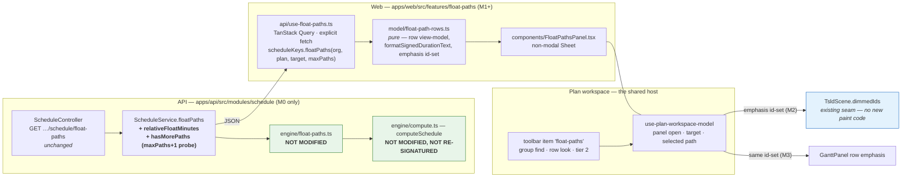
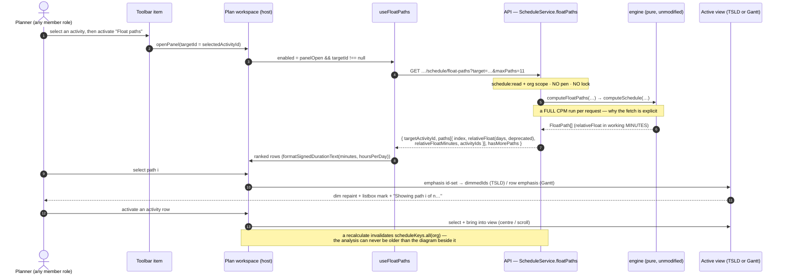
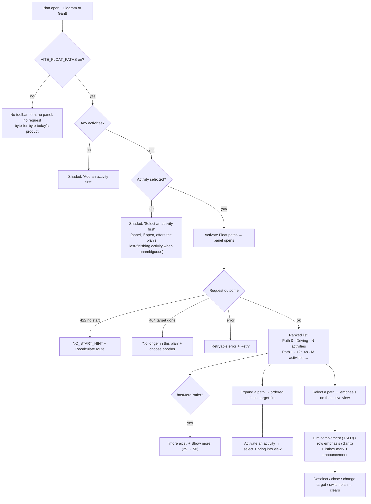

# Feature Spec: Multiple float paths — the planner's surface

- **Status:** Draft — **awaiting approval before implementation**
- **Author(s):** feature-analyst (Product Owner / Solution Architect / Technical Lead hats)
- **Date:** 2026-08-02
- **Tracking issue / epic:** _(to be raised)_
- **Roadmap link:** engine↔planner surface reconciliation — `docs/specs/engine-surface-audit.md` **F4**
  (the register's last open item); ADR-0035 §19 / conformance **S11**
- **Related ADR(s):** **no new ADR proposed** (see §4 "ADR assessment"). Builds on ADR-0031 (toolbar
  taxonomy), ADR-0033 (the read-only Late-Start overlay precedent), ADR-0035 §19 (the float-path
  semantic), ADR-0037 §4 (float measured on the activity's own calendar), ADR-0055 (surface scopes /
  no colour literals), ADR-0059 (the Gantt as a peer view), ADR-0062 (extract, never reimplement),
  ADR-0068 (hours-per-day), ADR-0070 (`d`/`h`/`m` grammar). Amends the **`docs/DECISIONS.md` §19
  float-path output contract** entry, whose "relative float in working days" clause this spec makes
  false on purpose.

---

## 0. What was verified, and what was not

Per ADR-0058 — _verify the claim; do not trust the document._ Every load-bearing claim below was read
out of the code.

| Claim                                                                        | Verified where                                                                                                    | Result                                                                                                       |
| ---------------------------------------------------------------------------- | ----------------------------------------------------------------------------------------------------------------- | ------------------------------------------------------------------------------------------------------------ |
| The engine computes ranked contiguous driving chains, not a total-float sort | `apps/api/src/modules/schedule/engine/float-paths.ts:39-104` + its docblock                                       | **True.** Frontier of non-driving predecessors, popped lowest-total-float first; every activity in one path  |
| `relativeFloat` is working **minutes** at the engine and can be **negative** | `float-paths.ts:11-15`, `:98`; golden `compute.float-paths.spec.ts:67` asserts `1 * DAY` (1440)                   | **True**                                                                                                     |
| The endpoint exists and is `schedule:read`, org-scoped, not pen-gated        | `schedule.controller.ts:108-131`; `schedule.service.ts:596-597` (`assertCan('schedule:read')`, no pen)            | **True** — an analysis read, no `assertHoldsPen` anywhere on the path                                        |
| **Nothing in `apps/web/src` references it**                                  | Repo-wide grep for `float-paths` / `floatPaths` / `PlanFloatPaths`                                                | **True.** Only API code, specs and `docs/specs/canvas-nav` (which records it as _deliberately not consumed_) |
| The endpoint **recomputes the whole schedule live** on every call            | `schedule.service.ts:610-619` — `buildEngineGraph` in a transaction, then `computeFloatPaths` → `computeSchedule` | **True.** One request ≈ one CPM run. This is the single biggest design constraint (§3 Performance)           |
| The DTO's `relativeFloat` is converted at a **flat 1440**                    | `schedule.service.ts:623` — `Math.round(p.relativeFloat / MINUTES_PER_DAY)`, `day-compat-calendar.ts:2`           | **True — and it is the unfixed F8 defect.** See §1 "The number this surface would show is wrong"             |
| F8 named this exact line as unchecked                                        | `docs/specs/engine-surface-audit.md:347-349`                                                                      | **True** — "Neither has been checked. They are named here so the next pass starts from a list"               |
| The DTO docblock claims working **days**                                     | `dto/plan-float-paths.dto.ts:7`, `:17`                                                                            | **True** — and so does `docs/DECISIONS.md:1295`                                                              |
| Total float is measured on the **activity's own** calendar                   | ADR-0037 §4, ADR-0035 §18, `engine/types.ts:20`                                                                   | **True** — which is why `entryFloat − targetFloat` is not a single well-defined unit (CQ-3)                  |
| The canvas already has a `dimmedIds` seam with a culled paint branch         | `render/paint.ts:276`; `render/logic-path.ts:85-94`                                                               | **True** — the emphasis half needs **no new paint code**                                                     |
| The canvas already has `barFill` / `barInk` overrides                        | `render/paint.ts:282-291`; `render/lenses.ts:257-324`                                                             | **True** — an all-paths colour mode is additive, and is **deferred** (§4 "What is deliberately not built")   |
| The Isolate control is already a split button with a mode menu               | `toolbar/tsld-toolbar-items.tsx:974-1104`                                                                         | **True** — but a float path is ranked, numeric data; a third mode there would hide the numbers (§4)          |
| `canvas-nav` reserved this exact fast-follow                                 | `docs/specs/canvas-nav/feature-spec.md:282-288`, `:428-431`                                                       | **True** — "If a future float-path isolate mode is wanted, add a read-only query hook against the endpoint"  |
| The toolbar has **no reserved slot** for float paths                         | `docs/TOOLBAR_ROADMAP.md` catalogue — no such id                                                                  | **True.** A new id in an existing `find` group; ADR-0031 forbids inventing a group, not an id                |
| The toolbar renders in the Gantt view too                                    | `apps/web/src/features/gantt/toolbar-in-gantt.test.tsx`; ADR-0059 M6 (canvas-only items shade)                    | **True** — so one panel serves both views (§4)                                                               |
| A negative-capable duration formatter already exists                         | `apps/web/src/lib/duration-text.ts:251` — `formatSignedDurationText(minutes, hoursPerDay)`                        | **True.** `formatDurationText` clamps `minutes <= 0` to `'0d'` (`:194`) and must **not** be used here        |
| External Guests cannot reach it                                              | `modules/share` guest controller exposes plan / activities / dependencies only (ADR-0051 F-M3)                    | **True** — no float-paths route in the `SCHEDULE_READ` share scope                                           |
| The endpoint gives no way to know the list was truncated                     | `float-paths.ts:61` (`while paths.length < maxPaths && frontier.length > 0`); DTO has no such field               | **True** — "Showing 10 of ?" is currently unanswerable (§4 API changes)                                      |

**Not verified, and stated as such:** nothing in this repository measures what one float-paths request
costs on a 2,000-activity plan. The claim "≈ one CPM run" is read off the call graph, not off a
stopwatch. **Task M0.5 measures it before M1 builds a UI on top of it** — the ADR-0065 discipline
(measure the painter, then decide), applied before the decision rather than after.

---

## 1. Business understanding

### The finding, and why it is a product call

`docs/specs/engine-surface-audit.md` **F4** is the register's last open item, and it is the only one
phrased as a decision rather than a defect:

> A capability construction planners actively want ("show me the second and third paths, not just the
> critical one"), fully built and reachable only with `curl`. Whether it earns a surface is a product
> call, not a defect call — but it should be a decision rather than an omission.

So the first job of this spec is **not** "wire the endpoint". It is to answer what a planner does with
this, and let the surface follow. "The endpoint exists" is not a reason to build a screen; it is a
reason the screen is cheap **if** the need is real.

### Problem — the planner's job-to-be-done

The job is **acceleration and delay-mitigation planning**, and it has a specific shape:

> _"We are six weeks late. I have to pull it in. The critical path is one chain — if I compress it,
> what becomes critical next, and how much room do I have before it does?"_

That question is asked in a delay meeting, in front of a client, with a completion milestone on the
screen. Answering it needs three things at once:

1. **Contiguous chains, in rank order.** Not a scatter of low-float activities — a _chain_, because
   you compress a chain. The engine's own docblock draws the distinction in the first sentence: "a
   float path is a **contiguous driving chain**, not activities sorted by total float."
2. **A number per chain.** Path 1's relative float is the compression headroom: shorten the driving
   path by more than that and path 1 becomes the driver. That number is the entire actionable output.
3. **The chain read out in order**, target-first, so a planner can walk it aloud.

**What SchedulePoint already has does not cover this, and it is worth being precise about why:**

| Shipped surface                                        | What it gives                              | Why it does not answer the question                                                                                                        |
| ------------------------------------------------------ | ------------------------------------------ | ------------------------------------------------------------------------------------------------------------------------------------------ |
| **Isolate logic path** (driving mode, ADR/canvas-nav)  | The driving chain of the selected activity | **Path 0 only.** It cannot enumerate the _second_ chain, and it carries no relative-float number                                           |
| **Colour by → Total-float bucket** (ADR/canvas-lenses) | Per-activity float bands                   | **Per-activity, not per-chain, and not contiguous.** Two activities in the same band may be on unrelated branches — the opposite of a path |
| **Near-critical flag / critical float threshold** (F7) | "within N of critical"                     | A _set_, not a ranked partition. It cannot say which chain binds next, or by how much                                                      |
| **Filter → Critical**                                  | The critical set                           | Path 0's members, un-ordered, with no successor chains                                                                                     |

So the capability is genuinely additive over everything shipped, and the addition is exactly the part a
planner cannot reconstruct by eye on a dense diagram.

**Why now.** Because F4 is the last open row on the audit register, because the expensive half (the
engine and the endpoint) is already built and tested against the P6-class fixture (S11), and because
the surface's cost is dominated by a panel — not by a schema, a migration or an engine pass.

### The number this surface would show is wrong — and that changes the shape of the work

This is the most important paragraph in the spec, and the task brief's "if your design would change
the endpoint, say so loudly" is met here.

`schedule.service.ts:623` converts the engine's working **minutes** to the DTO's `relativeFloat` at a
flat 1440:

```ts
relativeFloat: Math.round(p.relativeFloat / MINUTES_PER_DAY); // MINUTES_PER_DAY = 1440
```

Total float, however, is measured in working minutes **on the activity's own calendar** (ADR-0037 §4).
On an **eight-hour** calendar — a shape ADR-0067 made authorable and ADR-0068 made a first-class
per-calendar quantity — one working day of relative float is 480 minutes, and:

```
Math.round(480 / 1440) = 0
```

So on an eight-hour calendar **the first two-and-a-half working days of relative float all render as
`0`** — the same value the driving path shows. The one number this feature exists to display is
indistinguishable from zero exactly where a planner most needs it, and it is silently wrong by a factor
of three where it is non-zero.

This is **F8's defect, one field along, still open.** F8 resolved the critical-float threshold and
explicitly named this line as unchecked:

> Two more flat-1440 conversions sit in the same file — `relativeFloat / MINUTES_PER_DAY` (line 575,
> the float-paths read-model) and `durationMinutes / MINUTES_PER_DAY` (line 905). **Neither has been
> checked.** They are named here so the next pass starts from a list rather than a search.

It has never bitten for the same reason F8 never bit: **nothing consumes the field.** Building the
surface is what makes it bite. So — stated loudly, as asked — **the design is not purely frontend-only.
It requires one additive, non-breaking API change (M0), and that change must land before any pixel.**
Shipping the panel on the day-rounded field would be knowingly repeating the defect the previous
milestone documented.

The cheapest possible moment to fix it is now, because the field has **zero consumers**.

### Users

Mapped to ADR-0016 organisation roles. This is a **read-only analysis** — no write, no pen, no new
permission.

| Role               | Need                                                          | This feature                                                                               |
| ------------------ | ------------------------------------------------------------- | ------------------------------------------------------------------------------------------ |
| **Planner**        | Compression planning: which chain binds next, and by how much | **Primary.** Runs the analysis, steps the paths, reads the chains                          |
| **Org Admin**      | Everything a Planner can do                                   | Same                                                                                       |
| **Contributor**    | Understand why their work is or is not driving                | **Full read.** Identical surface — there is nothing here to gate                           |
| **Viewer**         | Read the programme and its logic                              | **Full read.** Identical surface                                                           |
| **External Guest** | Read-only share of a plan's schedule                          | **Not exposed.** ADR-0051's `SCHEDULE_READ` scope has no float-paths route, and gains none |

The Contributor/Viewer row is a deliberate decision, not an oversight: the Late-Start overlay
(ADR-0033) and every canvas lens are offered to every role that can view the plan, because reading an
analysis of a plan you can already read grants nothing. Restricting it would be gating for its own
sake.

### Primary use cases

1. **Compression planning.** Select the completion milestone → open **Float paths** → read path 0 (the
   driving chain) and path 1 (`+2d 4h`) → conclude "I can take three days out of the driving path
   before the piling chain binds".
2. **Read a chain aloud.** Expand path 0 → the ordered list of activities, target-first, with codes and
   dates → walk it in a delay meeting.
3. **Find a chain on the diagram.** Select a path → everything not on it dims → the shape of that chain
   is visible on the TSLD (and its rows are emphasised in the Gantt).
4. **Explain why a branch is not critical.** Select any activity as the target and see which chain
   feeds it and with how much slack above the driver.

### User journeys

**Happy path.** Planner opens a plan → selects the completion milestone on the canvas (or a row in the
Gantt) → presses **Float paths** in the Look row → a non-modal side panel opens beside the live
diagram, naming the target → the ranked list renders: `Path 0 · Driving · 14 activities`, `Path 1 ·
+2d 4h · 6 activities`, … → the planner expands path 1, reads its chain, clicks an activity → the
canvas selects and centres it.

**Alternate — nothing selected.** The toolbar item is **shaded with a reason**, "Select an activity
first" (the Isolate precedent, shade-don't-hide). The panel, if already open, shows a chooser state
naming the plan's last-finishing activity as a one-click suggestion when that activity is unambiguous.

**Alternate — the plan has no start date.** The endpoint 422s `PLAN_START_REQUIRED`; the panel shows
the shared `NO_START_HINT` copy already used by the recalculate path, not a raw error.

**Alternate — the target was deleted in another tab.** 404 → "That activity is no longer in this plan."
plus a Choose-another-target affordance. Never an empty list, because an empty list would read as "this
activity has no float paths", which is never true for a present target (path 0 always exists).

**Alternate — more paths than requested.** The panel says `Showing 10 paths · more exist` and offers
**Show more** (→ 25, → 50, the API ceiling). Without the M0 `hasMorePaths` field this sentence cannot
be written honestly, which is why that field is in M0 rather than invented client-side.

### Expected outcomes

- **F4 closes**, and the engine↔planner surface audit register has no open findings.
- A planner can answer "what binds next, and by how much" without exporting to the tool SchedulePoint
  exists to replace.
- The **F8 residue** on `relativeFloat` is closed, and the second flat-1440 conversion F8 named
  (`durationMinutes / MINUTES_PER_DAY`, `schedule.service.ts:966`) is **checked and recorded** in the
  same pass — checked, not necessarily changed (§3 Dependencies).
- `GET …/schedule/float-paths` stops being an endpoint reachable only with `curl`.

### Success criteria

1. **The recalc parity gate is structurally untouched.** `computeSchedule`, `engine/compute.ts` and
   every engine-owned persisted column are **not modified** by any milestone. `computeFloatPaths` is a
   read-only analysis sibling and is likewise not modified (the `hasMorePaths` probe is implemented in
   the **service**, by asking for `maxPaths + 1` — see §4).
2. **The unit is right, and provably so.** An API e2e on an **eight-hour** calendar asserts that a
   one-working-day relative float returns `relativeFloatMinutes: 480` while the legacy `relativeFloat`
   returns `0` — the defect pinned as a test rather than described in prose.
3. **Flag-off is byte-for-byte today's product.** No toolbar item, no panel, no scene field, no query.
   Pinned by flag-off parity suites (`vi.mock` of `@/config/env`) that are **kept, not weakened** — the
   rollback contract (the ADR-0053 M6 rule).
4. **The canvas draw cost does not move.** The emphasis half contributes to the existing `dimmedIds`
   set and adds **no new paint branch**; proven by a paint-parity test and by the existing budget
   suites' call-count shape assertions, not by a millisecond claim on a CI runner (TECH_DEBT #75).
5. **The request cost is known before it is depended upon.** M0.5 records the measured p95 of one
   float-paths request at 200 / 2,000 activities against the seeded scale plans (ADR-0066), and the
   panel's fetch policy is chosen from that number.
6. **WCAG 2.2 AA.** Path membership is never carried by colour or dim alone: the panel is the primary
   readout, the a11y listbox marks emphasised rows, and every state change is announced.

### Open questions

Three are **CRITICAL** — their answers change the surface or the scope. Everything else has a stated
default and proceeds. See **§6**.

---

## 2. Functional requirements

### User stories & acceptance criteria

> **US-1 — Ranked chains for a target.** As a **Planner**, I want the ranked contiguous driving chains
> into a chosen activity, so that I can see which chain binds next and how much compression headroom I
> have.
>
> **Acceptance criteria**
>
> - **Given** an activity is selected **when** I activate **Float paths** **then** a panel opens naming
>   that activity as the target and listing the paths in returned order, path 0 first.
> - **Given** the list has rendered **then** path 0 is labelled **Driving** (not "+0d"), and every
>   other path shows its relative float rendered by `formatSignedDurationText(minutes, hoursPerDay)`
>   — so `+2d 4h`, and `−1d` for a negative one.
> - **Given** a path has a **negative** relative float **then** it renders as a signed value with a
>   plain-language note ("more critical than the target"), and **not** as an error or a clamped zero.
>   This is a real engine signal (`float-paths.ts:13-15`).
> - **Given** each path row **then** it names its **entry activity** (`activityIds[0]`) and its length,
>   so the row is readable without expanding it.
> - **Given** the response reports more paths exist **then** the panel says so and offers **Show more**
>   (10 → 25 → 50); at 50 it says the ceiling is reached.
> - **Given** `VITE_FLOAT_PATHS` is off **then** there is no toolbar item, no panel and no request —
>   byte-for-byte today's product.

> **US-2 — Read a chain in order.** As a **Planner**, I want to expand a path into its ordered
> activities, so that I can walk the chain in a meeting.
>
> **Acceptance criteria**
>
> - **Given** a path row **when** I expand it **then** its activities list **target-first** (the order
>   the API returns — never re-sorted), each showing code, name, early start/finish and total float.
> - **Given** an activity row **when** I activate it **then** the plan's selection moves to it and the
>   active view brings it into sight (the canvas centres it; the Gantt scrolls its row into view).
> - **Given** an id in `activityIds` that is not in the client's activity list (deleted or still
>   loading) **then** the row renders with the id's absence stated ("no longer in this plan") rather
>   than being silently dropped — a dropped row would make the chain read as shorter than it is.

> **US-3 — See the chain on the diagram.** As a **Planner**, I want the selected path emphasised on the
> TSLD, so that I can see its shape among hundreds of bars.
>
> **Acceptance criteria**
>
> - **Given** a path is selected in the panel **then** every activity **not** on that path paints
>   dimmed via the existing `dimmedIds` seam, the parallel a11y listbox marks those rows dimmed, and a
>   live region announces "Showing path 1 of 6 — 6 activities, 2 days 4 hours above the driving path."
> - **Given** a filter and/or Isolate is also active **then** the dim sets **union** (a bar dimmed by
>   any lens recedes) — the rule canvas-nav already established; no precedence is needed because
>   dimming composes.
> - **Given** I deselect the path, close the panel, change target, or switch plan **then** the emphasis
>   clears and the announcement says so.
> - **Given** the emphasis is off **then** the painter receives no float-path contribution and paints
>   byte-for-byte as today.

> **US-4 — The same analysis in the Gantt.** As a **Planner** working in the Gantt view, I want the
> same panel and the same emphasis, so that the analysis is not a TSLD-only feature.
>
> **Acceptance criteria**
>
> - **Given** the Gantt view is active **then** the **Float paths** toolbar item is **live**, not
>   shaded — it is an analysis, not a canvas viewport command (the ADR-0059 M6 lit-but-inert finding
>   inverted: shade what only the canvas can do, never what both can).
> - **Given** a path is selected **then** its rows are emphasised in the grid and the others recede,
>   using the same derived id-set the canvas uses (**one derivation, two consumers** — the ADR-0063
>   `wbs-band-source` rule).
> - **Given** the selection moves to an activity **then** the Gantt scrolls its row into view and moves
>   the roving tab stop to it.

> **US-5 — Honest states.** As anyone reading a plan, I want every failure of this analysis to be a
> sentence I can act on, not a spinner or a 500.
>
> **Acceptance criteria**
>
> - **Given** the plan has no start date **then** the panel shows the shared `NO_START_HINT` copy, not
>   a raw 422.
> - **Given** the target is not in the plan **then** the panel says so and offers to choose another
>   target.
> - **Given** the request fails for any other reason **then** the panel shows a retryable error with a
>   **Retry** control — never an empty list, which would read as "no paths".
> - **Given** the request is in flight **then** the panel shows a busy state and announces it, because
>   this request runs a full CPM computation and can take visible time on a large plan.

> **US-6 — A number a planner can trust.** As a **Planner**, I want the relative float to mean what it
> says on my plan's calendar.
>
> **Acceptance criteria**
>
> - **Given** a plan on an **eight-hour** calendar and a path one working day above the driving path
>   **then** the panel shows `+1d` (from `relativeFloatMinutes: 480` and the resolved `hoursPerDay: 8`)
>   — **not** `0`.
> - **Given** the `hoursPerDay` factor cannot be resolved (the calendar list has not loaded) **then**
>   the value degrades to hours and minutes, which need no factor, with the reason stated — the ADR-0071
>   M4 degrade rule, **never** a silently-defaulted factor (ADR-0070's compiler-enforced ordering).
> - **Given** a plan whose activities sit on **different** calendars **then** the panel discloses which
>   calendar's day the figure is expressed in, exactly as the critical-float-threshold control does
>   (F8's resolution) — a disclosure, not a fix.

### Workflows

1. **Run the analysis.** Selection → toolbar **Float paths** → panel opens → `useFloatPaths(org, plan,
targetId, maxPaths)` fires **once** (explicit invocation; see §3 Performance) → ranked list renders.
2. **Step the paths.** Panel arrow keys / clicks move between path rows; the selected path drives the
   emphasis set; a live region announces "path _i_ of _n_".
3. **Walk a chain.** Expand a path → activity rows → activating one lifts the plan selection and brings
   it into view in whichever view is active.
4. **Change target.** Selecting a different activity does **not** silently re-run the analysis (see
   Edge cases — it would be a hidden CPM run per click). The panel shows "Target: <old> · **Use
   selected activity**", one deliberate press.
5. **Refresh.** A recalculate invalidates the float-paths cache alongside the summary, so the analysis
   is never older than the diagram beside it.

### Edge cases

| Case                                                | Behaviour                                                                                                                                                                                                                                                            |
| --------------------------------------------------- | -------------------------------------------------------------------------------------------------------------------------------------------------------------------------------------------------------------------------------------------------------------------- |
| **Target with no predecessors**                     | One path: itself, relative float 0 (the engine's `a lone target has a single path of just itself` golden). The panel says "This activity has no predecessors" rather than showing a one-row list with no note                                                        |
| **Target is a WBS summary**                         | A summary carries no logic (ADR-0038), so it is never a dependency endpoint ⇒ one path, itself. Panel states it. The toolbar item stays **enabled** — refusing would imply an error where there is none                                                              |
| **Target is a milestone**                           | Ordinary; milestones are frequently the _best_ targets                                                                                                                                                                                                               |
| **`maxPaths` truncation**                           | `hasMorePaths` (M0) drives "more exist" + **Show more**. Without it the panel would either lie or stay silent                                                                                                                                                        |
| **Negative relative float**                         | Rendered signed, with the "more critical than the target" note. Ranking is still non-decreasing, so a negative path is first after path 0                                                                                                                            |
| **Plan never recalculated**                         | The endpoint still answers (it computes live), but the canvas has no bars to emphasise. The panel renders the chains; the emphasis half shows "Recalculate to see this on the diagram"                                                                               |
| **Plan edited since the last recalc**               | The analysis is computed **live** from current logic while the diagram shows persisted dates, so the two can disagree for the window before the ADR-0032 coalesced recalc lands. The panel states that it reflects current logic; a recalc invalidates and refetches |
| **Selection changes while the panel is open**       | Target is **sticky**. A "Use selected activity" affordance appears. Auto-following would fire a CPM run per click                                                                                                                                                    |
| **Plan switch / view switch**                       | Plan switch clears panel state entirely. **View switch does not** — the analysis is view-agnostic and losing it on a Diagram↔Gantt toggle would be gratuitous                                                                                                        |
| **An `activityIds` member missing from the client** | Rendered as an absent row with a reason (see US-2), never dropped                                                                                                                                                                                                    |
| **Very long chain (hundreds of activities)**        | The expanded chain list is virtualized or capped-with-more, matching the Gantt's row treatment; a 2,000-row DOM list inside a Sheet is the defect ADR-0059 rejected canvas to avoid                                                                                  |
| **Concurrent recalc by the pen holder**             | Invalidation refetches; no lock, no conflict — this is a read                                                                                                                                                                                                        |
| **Guest (`/share`)**                                | Not reachable: no route, no toolbar (the guest view has no member chrome)                                                                                                                                                                                            |

### Permissions

ADR-0012 RBAC + organisation resource scoping, deny-by-default. **No new permission. No pen.**

| Action                     | Permission      | Roles                    | Scope                  | Pen (ADR-0028)                                                                            |
| -------------------------- | --------------- | ------------------------ | ---------------------- | ----------------------------------------------------------------------------------------- |
| Read float paths           | `schedule:read` | All four member roles    | Plan's organisation    | **No** — verified: `schedule.service.ts:596-597` asserts the permission and takes no lock |
| Open the panel / emphasise | —               | Every role that can view | Client-side only       | **No**                                                                                    |
| External Guest             | —               | **Denied**               | Not in `SCHEDULE_READ` | n/a                                                                                       |

**Is the new write structural?** **There is no write.** Every milestone is a read plus client render
state; no endpoint gains a write, no engine-owned column moves, no plan row is touched. That is the
whole reason this feature does not need the pen, and it is stated explicitly because the process
requires the question answered rather than assumed.

### Validation rules

No new persisted fields and no new write DTO. The rules that exist are read-boundary and client-side:

| Rule                             | Where                                                                                                                                                                                                                    |
| -------------------------------- | ------------------------------------------------------------------------------------------------------------------------------------------------------------------------------------------------------------------------ |
| `target` is a UUID in the plan   | Existing `FloatPathsQueryDto` `@IsUUID()` + the service's active-activity check → **404**                                                                                                                                |
| `maxPaths` ∈ [1, 50], default 10 | Existing DTO `@Min(1) @Max(50)`. The client only ever sends 10 / 25 / 50                                                                                                                                                 |
| Plan has a start date            | Existing service check → **422 `PLAN_START_REQUIRED`**                                                                                                                                                                   |
| Relative-float rendering         | `formatSignedDurationText(relativeFloatMinutes, hoursPerDay)` — **`formatDurationText` is forbidden here**: it clamps `minutes <= 0` to `'0d'` (`duration-text.ts:194`), which would erase every negative relative float |
| `hoursPerDay` is never defaulted | Passed explicitly from the resolved calendar; where unresolved, the h/m degrade path runs (ADR-0070's rule, compiler-enforced)                                                                                           |

### Error scenarios

| Scenario                             | Detection                                  | User-facing result                                          | Status           |
| ------------------------------------ | ------------------------------------------ | ----------------------------------------------------------- | ---------------- |
| Plan has no start date               | Service 422 `PLAN_START_REQUIRED`          | Shared `NO_START_HINT` copy + a Recalculate route           | 422              |
| Target not active in this plan       | Service 404                                | "That activity is no longer in this plan." + choose-another | 404              |
| Plan / org not visible to the caller | `resolveScope` + `schedule:read`           | Uniform not-found (no existence oracle)                     | 404 / 403        |
| Calendar with no working time        | Service 422 `CALENDAR_HAS_NO_WORKING_TIME` | The existing named-calendar message                         | 422              |
| Network / unexpected failure         | Query error                                | Retryable inline error with **Retry**; never an empty list  | 5xx              |
| No activity selected                 | Client                                     | Toolbar shaded-with-reason "Select an activity first"       | n/a (no request) |
| Plan has no activities               | Client                                     | Toolbar shaded-with-reason "Add an activity first"          | n/a              |
| `hoursPerDay` unresolved             | Client                                     | h/m rendering with the reason stated                        | n/a              |

---

## 3. Technical analysis

| Area               | Impact                         | Notes                                                                                                                                                                                                                                                                                                                                         |
| ------------------ | ------------------------------ | --------------------------------------------------------------------------------------------------------------------------------------------------------------------------------------------------------------------------------------------------------------------------------------------------------------------------------------------- |
| **Frontend**       | **medium**                     | One new feature folder `features/float-paths/` (query hook, pure view-model, panel), one new toolbar item, one workspace-hosted `Sheet`, one contribution to the existing `dimmedIds` union, one Gantt row-emphasis prop. Behind `VITE_FLOAT_PATHS`, default off, with flag-off parity suites                                                 |
| **Backend**        | **low**                        | `schedule.service.ts` `floatPaths()` only: one additive mapped field, one `maxPaths + 1` truncation probe. **No engine file is modified.** `computeSchedule` is not touched, imported differently, or re-signatured                                                                                                                           |
| **Database**       | **none**                       | No models, columns, indexes, constraints or migrations                                                                                                                                                                                                                                                                                        |
| **API**            | **low**                        | Two additive response fields on `PlanFloatPathsDto` (`relativeFloatMinutes` per path, `hasMorePaths` on the envelope) + `@repo/types`. No new endpoint, no new query param, no breaking change. `relativeFloat` (days) is **retained and deprecated in its docblock**, not deleted — nothing consumes it, but deleting is a break for no gain |
| **Security**       | **none**                       | No new permission, endpoint, trust boundary or input. The existing `schedule:read` + org scope + uniform-404 hold. Not guest-reachable. No PII, no secrets                                                                                                                                                                                    |
| **Performance**    | **high — the real constraint** | See below                                                                                                                                                                                                                                                                                                                                     |
| **Infrastructure** | **low**                        | One `VITE_FLOAT_PATHS` env flag (`.env.example`, `vite-env.d.ts`), one new Playwright config + CI step                                                                                                                                                                                                                                        |
| **Observability**  | **low**                        | The service already logs nothing here; add the existing structured-log fields (plan, target, path count, duration) at debug so the measured cost stays observable after M0.5                                                                                                                                                                  |
| **Testing**        | **medium-high**                | API e2e (the eight-hour-calendar unit proof, 404/422, truncation); web unit (hook, view-model, panel states, toolbar predicates); paint-parity; flag-off parity suites; a flag-on Playwright journey with its own CI step                                                                                                                     |

### Performance — the constraint that shapes the design

`GET …/schedule/float-paths` is **not** a read-model over persisted columns. Unlike its two siblings
— `earned-value.ts` and `resource-histogram.ts`, which ADR-0042/ADR-0044 deliberately made
"persisted CPM dates only, no engine recompute" — `floatPaths()` loads the whole graph in a
transaction and calls `computeSchedule` (`schedule.service.ts:610-619`). **One request costs about one
recalculation's compute.**

That was a reasonable choice: it is what makes the analysis unable to drift from a recalculate. But it
has three consequences a UI must respect, and they are the reason this spec's fetch policy is
conservative:

1. **Never fetch on selection change.** A panel that follows the selection would run a CPM computation
   on every click on the canvas. Target is sticky; changing it is one deliberate press.
2. **Never fetch on hover, never prefetch.**
3. **Cache and invalidate deliberately.** `scheduleKeys.floatPaths(org, plan, target, maxPaths)` under
   the existing `schedule` namespace, so `useRecalculate`'s `scheduleKeys.all(orgSlug)` sweep already
   refreshes it — one line of intent, not a new invalidation rule.

**M0.5 measures it before M1 depends on it.** Against the ADR-0066 seeded scale plans (200 / 2,000
activities), record the p95 wall-clock of one request. If it is materially worse than a recalculate,
that number — not a guess — decides whether the panel needs an explicit **Analyse** button rather than
fetching on open. The ADR-0065 lesson is that a cost nobody measured is a cost nobody knows; this
feature is not going to repeat it.

**A rejected alternative, recorded so it is not re-litigated:** rewrite `floatPaths()` as a read-model
over the persisted `total_float` and `dependencies.is_driving` columns (its siblings' shape). It would
be much cheaper and it is genuinely tempting — but it changes a shipped endpoint's semantics from
"always current" to "as of the last recalc", it needs its own staleness story, and it is a backend
change this feature does not need. **Not in scope.** Recorded as a candidate in `docs/BACKLOG.md`.

### Client-side derivation — considered and rejected, with the reason

The client already holds everything `computeFloatPaths` reads: `DependencySummary.isDriving` from
`usePlanDependencies`, and `ActivitySummary.totalFloat` from `useActivities`. The algorithm is a pure
walk. **The whole feature could be built with no network call at all** — and `canvas-nav` did exactly
that for the driving chain.

**Rejected, for two reasons:**

1. **It would be a second implementation of an engine algorithm, and the drift would be invisible.**
   This is the ADR-0065 `routeOrthogonal` and ADR-0069 `packLanes` rule, stated twice in this
   repository's ADRs: two implementations drift, and only someone comparing the same plan two ways
   would ever see it. Float paths are ranked and partitioned; a subtly different tie-break would
   reorder the list with nothing on screen looking wrong.
2. **`ActivitySummary.totalFloat` is day-rounded.** Ranking on it would tie paths the engine separates
   — the same defect as §1, arriving through a different door.

And a third, decisive one: F4 is the finding that _nothing consumes this endpoint_. Resolving it by
never calling the endpoint would leave the finding exactly where it is.

### Dependencies

**Prerequisites — all landed:** the engine + endpoint (M6-F6, ADR-0035 §19), `dimmedIds` (canvas
lenses), the toolbar registry (ADR-0031), the Gantt peer view + shared toolbar (ADR-0059),
`formatSignedDurationText` (ADR-0070), the `Sheet` primitive and the non-modal drawer precedent
(entry-routes), the ADR-0066 seeded scale plans (for M0.5).

**Affected:** `docs/specs/engine-surface-audit.md` (F4 closes), `docs/DECISIONS.md` (§19 entry's unit
clause becomes false), `docs/API.md` + OpenAPI, `docs/TOOLBAR_ROADMAP.md` (a new live id),
`docs/ROADMAP.md`.

**Adjacent, checked in the same pass, not necessarily changed:** the second flat-1440 conversion F8
named — `durationMinutes / MINUTES_PER_DAY` at `schedule.service.ts:966`. It feeds the engine-input
builder's day-compat path, so changing it could move dates; this spec's obligation is to **check and
record** it (Task M0.6), not to change it. If it is wrong it earns its own finding and its own spec.

**Nothing is blocked externally.**

---

## 4. Solution design

### The shape, in one paragraph

A **panel is the primary surface**, because the output is ranked, numeric and ordinal, and a colour
scheme cannot say "+2d 4h". The **canvas and Gantt emphasis are the secondary half**, because seeing
the chain's shape is the other half of the job. The panel is **hosted by the plan workspace, not by the
canvas**, so it serves both views from one implementation — which is how this design "considers the
Gantt" without building two things. Everything is a read; nothing touches the engine.

### Which visual channel this takes, and what that channel currently means

The brief's constraint, answered explicitly. Current owners of each canvas channel:

| Channel                     | Currently means                                                            | Taken here?                                                             |
| --------------------------- | -------------------------------------------------------------------------- | ----------------------------------------------------------------------- |
| **Bar dim / alpha**         | "not in the current focus" — filter non-match (lenses) + isolate off-chain | **YES — the only channel taken.** Same meaning, unioned with the others |
| Bar fill colour             | Colour-by mode: criticality / float bucket / WBS group                     | **No** (an all-paths colour mode is deferred — see below)               |
| Bar outline weight + dash   | Criticality emphasis, retained under every colour mode (WCAG 1.4.1)        | **No** — taking it would erase the critical cue this feature is _about_ |
| Hatch                       | Non-working ground (ADR-0056) + float tails (ADR-0054)                     | **No**                                                                  |
| Tails right of a bar        | GPM float / drift (ADR-0054)                                               | **No**                                                                  |
| Link weight / dash          | Driving cue (ADR-0052) + relationship slack (ADR-0054)                     | **No**                                                                  |
| Arrowheads, corridors       | Direction + routing (ADR-0065)                                             | **No**                                                                  |
| Month bands, gridline tiers | Time axis (ADR-0055 §4 / ADR-0056)                                         | **No**                                                                  |
| Badge shapes                | Constraint pin, over-allocation mini-histogram                             | **No**                                                                  |

Taking **only the dim channel** is what makes the per-frame cost argument trivial: `dimmedIds` is
already read once per culled bar as a `Set.has`, and this feature contributes members to a set that
already exists. There is **no new paint branch, no new layer, no new pass** — which matters because
the painter is already measured at 16.7–23.1 ms p95 against ADR-0026 §16's ≤ 4 ms (TECH_DEBT #75), and
a feature that adds a per-frame cost right now would need an argument this one does not have to make.

**Colour-only is also a WCAG problem**, which is the second reason the panel leads: path membership
must be readable without colour, and "the panel lists it, the listbox marks it, the announcement says
it" is a complete non-visual answer, where "path 3 is the teal one" is not.

### What is deliberately not built (recorded, not forgotten)

- **An all-paths Colour-by mode** (a fourth `ColourMode` painting every path a different fill). It is
  additive by construction — `buildColourMap` is mode-generic and `lenses.ts:86` already reserves the
  pattern — but it is colour-carrying-meaning for up to 50 categories, it collides with the float-bucket
  mode's own palette, and it answers a question the panel answers better. **Deferred, named, cheap
  later.**
- **A third Isolate mode.** The `IsolateControl` split button (Full / Driving) is the obvious host, and
  it is the wrong one: isolate's output is a boolean set, and this feature's output is a ranked list
  with numbers. Folding it in would hide the number that is the entire point.
- **A Gantt "Float path" / "Path order" column with group-by.** This is genuinely the P6-native shape
  and it is genuinely wanted — but it is grid-column plumbing, sort keys, the print surface and the
  row model, for a second presentation of data the panel already gives. **Deferred to its own slice**
  (§5 of the plan), and it does **not** fight the roadmap's Gantt dependency arrows: a column lives in
  the grid half, arrows in the chart half.
- **Persisting the target or the panel state.** Session-local, like every lens and view toggle.
- **Changing the endpoint to a persisted read-model.** See §3.

### Architecture overview



Green = not modified (the parity gate, structural). Blue = an existing seam reused, not extended.

### Data flow



### User flow



### Database changes

**None.** No model, column, index, constraint or migration.

### API changes

Both additive; no versioning impact; `api` bumps **minor** (pre-1.0). `docs/API.md` + OpenAPI updated
in the same PR, with the 404 and 422 responses already declared on the route.

**`PlanFloatPathDto`** (and `PlanFloatPath` in `@repo/types`) gains:

```ts
@ApiProperty({
  description:
    'Working MINUTES of total float above the driving path (the entry activity’s total float minus ' +
    'the target’s). Path 0 is 0; branch paths are non-decreasing and MAY BE NEGATIVE when a branch ' +
    'is more critical than a floating target — a real signal, not an error. Minutes, not days, ' +
    'because total float is measured on each activity’s OWN calendar (ADR-0037 §4): dividing by a ' +
    'flat 1440 renders one working day on an eight-hour calendar as 0. Render it against a resolved ' +
    'hoursPerDay (ADR-0068/0070).',
})
relativeFloatMinutes!: number;
```

`relativeFloat` (days) is **retained** and its docblock gains a deprecation note naming this field as
the correct one. It is not deleted: nothing consumes it, so deleting is a break for no gain, and the
day figure remains a reasonable coarse value on a 24-hour plan.

**`PlanFloatPathsDto`** gains:

```ts
@ApiProperty({
  description:
    'True when the analysis was truncated by maxPaths and further ranked paths exist. Computed in ' +
    'the SERVICE by requesting maxPaths + 1 and returning the first maxPaths — deliberately not an ' +
    'engine change, so engine/float-paths.ts and its goldens are untouched.',
})
hasMorePaths!: boolean;
```

**No new endpoint, no new query parameter, no new error code, no new permission.**

**Why the `maxPaths + 1` probe rather than an engine field.** Adding `hasMore` to `FloatPath[]`'s
return would change a pure engine module's contract and its goldens for a presentation concern. Asking
for one more path and discarding it is a service-level detail that costs one extra chain walk on a
bounded loop and keeps the engine file untouched — which is the parity discipline applied to an
analysis module, not only to `computeSchedule`.

### Component changes

Feature-first, in `apps/web/src/features/float-paths/`. Design-system primitives only; no one-off
styling (ADR-0055 forbids colour literals in `className`/`style`, enforced by lint).

| Component / module                                        | Change                                                                                                                                                                                                                                                                                                                                                   |
| --------------------------------------------------------- | -------------------------------------------------------------------------------------------------------------------------------------------------------------------------------------------------------------------------------------------------------------------------------------------------------------------------------------------------------- |
| `features/float-paths/api/use-float-paths.ts`             | **New.** `queryOptions` + hook keyed by `scheduleKeys.floatPaths(org, plan, target, maxPaths)`; `enabled` on `panelOpen && target !== null` (explicit fetch); `staleTime` set from the M0.5 measurement; already swept by `useRecalculate`'s `scheduleKeys.all(org)` invalidation                                                                        |
| `lib/query/hierarchy-keys.ts`                             | One additive `scheduleKeys.floatPaths(...)` factory beside `earnedValue` / `resourceHistogram`, keyed under the same `schedule` namespace **on purpose** — that is what makes the recalc invalidation already correct                                                                                                                                    |
| `features/float-paths/model/float-path-rows.ts`           | **New, pure** (no React/DOM/fetch — the `lenses.ts` / `logic-path.ts` idiom). Builds the row view-model (path label, signed relative-float text, entry-activity name, length), the **emphasis id-set** for a selected path, and the missing-activity marker. Exhaustively unit-tested                                                                    |
| `features/float-paths/components/FloatPathsPanel.tsx`     | **New.** Non-modal right-anchored `Sheet` (the entry-routes plan-notes precedent — the diagram stays live). Target header with a "Use selected activity" affordance; ranked path list (APG disclosure rows); expanded chain rows; every state: idle / no-target / loading+announced / empty-predecessors / 422 / 404 / error+Retry / truncated+Show more |
| `components/layout/workspace/use-plan-workspace-model.ts` | Panel open state, target id, selected path index, and the derived emphasis id-set — **derived once here** and handed to both views (the ADR-0063 `wbs-band-source` one-derivation rule)                                                                                                                                                                  |
| `features/tsld/toolbar/tsld-toolbar-items.tsx`            | One new item `float-paths` — group **`find`**, row **`look`**, tier **2**, `showLabel: 'auto'`, icon `GitBranch`/`Waypoints` (distinct from `isolate-logic`'s `Route` and `next-conflict`'s `TriangleAlert`). `aria-pressed` on the panel-open state. **View-only, never pen-gated.** Disabled-with-reason ladder: no diagram → no selection             |
| `features/tsld/components/TsldPanel.tsx`                  | Unions the float-path emphasis set into the existing `TsldScene.dimmedIds` memo and marks the a11y listbox rows. **The painter is not modified**                                                                                                                                                                                                         |
| `features/gantt/components/GanttPanel.tsx`                | Accepts the same emphasis id-set and applies row emphasis + brings a selected activity's row into view. No column change (deferred)                                                                                                                                                                                                                      |
| `config/env.ts`, `.env.example`, `vite-env.d.ts`          | `VITE_FLOAT_PATHS`, `flagDefaultOff` initially — the first consumer of `flagDefaultOff` since `VITE_SUB_DAY_DURATIONS` moved on (the docblock at `env.ts:42-49` says that helper is kept for exactly this)                                                                                                                                               |

**Flag-off shape — a deliberate choice.** Flag-off ⇒ **no toolbar item at all**, not a "Coming soon"
placeholder. Every existing placeholder predates its feature; introducing one here would change today's
bar, so "flag-off is byte-for-byte today's product" would stop being true and the parity suite would
lose its meaning. If the product owner wants the placeholder for discoverability it is a one-line PR
that should land _before_ this epic, not inside it.

### Implementation approach & alternatives

**Chosen.** One additive API change to make the number true (M0, unflagged, safe alone), then a
view-agnostic panel hosted by the workspace (M1), then emphasis on each view through seams that already
exist (M2 canvas, M3 Gantt), then the enablement gate (M4). Nothing in the engine; nothing persisted;
one visual channel taken and it is the one that already means "not in focus".

**Alternatives considered:**

- _Panel only, no emphasis._ Cheapest and genuinely defensible — the numbers are the value. Rejected as
  the whole scope because "find that chain among 800 bars" is the other half of the job, and the
  emphasis half costs almost nothing (an existing seam). It **is** viable as a reduced scope: see CQ-1.
- _A third Isolate mode._ Rejected: hides the numbers (above).
- _An all-paths Colour-by mode._ Deferred: colour for up to 50 ordered categories, colliding with an
  existing float palette, answering a question the list answers better.
- _Gantt-first (column + group-by)._ Rejected as v1: the P6-native shape, but far more machinery, and
  it would leave the TSLD — the primary editing surface — without the analysis. Named as the follow-on.
- _Derive client-side, no fetch._ Rejected — see §3, the drift rule, plus it would leave F4 unresolved.
- _Make the endpoint a persisted read-model._ Out of scope; recorded in `docs/BACKLOG.md`.
- _Record the decision **not** to build it._ Considered seriously, and rejected: §1's table shows the
  capability is not covered by any shipped lens, and the shipped-but-unreachable state is precisely the
  failure the audit exists to end. If the product owner disagrees, CQ-1 option **E** is the honest
  route — and the outcome should then be written into ADR-0035 §19 and the audit register as a
  _decision_, not left as an omission.

**ADR assessment — no new ADR proposed.** This is client render/navigation state on shipped seams plus
two additive response fields. No architectural boundary, data contract, storage model or cross-cutting
standard changes; the engine and the recalc parity gate are untouched by construction. The precedent is
`canvas-nav`, which made the same call for the same reasons.

**Two things must nonetheless be written down**, and a reader should not have to infer them:

1. **`docs/DECISIONS.md:1286-1299`** — the §19 float-path output contract entry says "relative float in
   working days". That clause becomes **false** with M0 and must be corrected in the same PR, with the
   reason (the flat-1440 conversion and its eight-hour-calendar consequence) recorded.
2. **ADR-0035 §19** currently says only that float paths are contiguous driving chains. It does not say
   what unit `relativeFloat` is in, nor what it means when the entry and target sit on **different**
   calendars. That second point is a genuine semantic gap (CQ-3). Default: record the disclosure in
   `docs/DECISIONS.md` rather than amend an accepted ADR section. If the product owner considers the
   unit change architecturally significant, **ADR-0072** is the next free number (ADR-0071 is claimed by
   the assignment-lag draft).

---

## 5. Links

- Implementation plan: [`./implementation-plan.md`](./implementation-plan.md)
- Docs updated by this change: `docs/specs/engine-surface-audit.md` (F4 → resolved),
  `docs/DECISIONS.md` (§19 entry correction + this feature's entry), `docs/API.md` + OpenAPI,
  `docs/TOOLBAR_ROADMAP.md`, `docs/ROADMAP.md`, `docs/BACKLOG.md` (the persisted-read-model candidate),
  `apps/web/.env.example` + `vite-env.d.ts`, `apps/web/CHANGELOG.md` + `apps/api/CHANGELOG.md`
  (changesets), `CLAUDE.md` if the flag list is enumerated there.

---

## 6. Open questions

### CRITICAL — these change the surface or the scope

> **CQ-1 — What does a planner want to _see_, and therefore what is the surface?**
>
> This is the question the audit itself flagged as a product call, and everything else follows from it.
>
> - **A — Panel only.** The ranked list with relative float, no canvas or Gantt change. Smallest
>   possible honest answer; the numbers are the value. **~40% of the effort.**
> - **B — Panel + one-path-at-a-time emphasis on both views. ← RECOMMENDED DEFAULT.** The list answers
>   "which chain and how much room"; the dim answers "where is it". Takes exactly one visual channel,
>   the one that already means "not in focus", with no new paint code and no new per-frame cost.
> - **C — B plus an all-paths colour mode.** Every path a different fill. Prettiest demo; worst
>   accessibility story (up to 50 ordered colour categories) and it collides with the existing
>   float-bucket palette.
> - **D — Gantt-first: a "Float path" column with group-by and sort, no canvas lens.** The P6-native
>   shape. Considerably more machinery, and it leaves the primary editing surface without the analysis.
> - **E — Record the decision not to build it.** Write the reasoning into the audit register and
>   ADR-0035 §19 and close F4 as a deliberate omission. Legitimate, and cheaper than any of the above.
>   §1's table is the argument against it.
>
> **Default if unanswered: B**, with the Gantt column (D) as a named follow-on slice.

> **CQ-2 — Where does the target come from when nothing is selected?**
>
> The endpoint requires a target activity; most canvas lenses are whole-view toggles. Two honest
> answers:
>
> - **A — Require a selection. ← RECOMMENDED DEFAULT.** Toolbar shaded-with-reason "Select an activity
>   first" (the Isolate precedent), plus a one-click "Use the plan's last-finishing activity"
>   suggestion inside the panel when that activity is unambiguous. Zero guessing.
> - **B — Auto-default the target to the project finish.** Fewer clicks for the most common question
>   ("float paths into completion"), but a plan with several open ends has no unambiguous finish, and
>   guessing the _target_ silently changes the entire analysis.
>
> **Default if unanswered: A.**

> **CQ-3 — What does relative float mean on a mixed-calendar plan, and what do we show?**
>
> `relativeFloat = entryActivity.totalFloat − target.totalFloat`, and total float is measured in
> working minutes **on each activity's own calendar** (ADR-0037 §4). When the entry and the target sit
> on different calendars, the subtraction is a difference of quantities in different units — so there
> is no single correct "day" to render it in. This is not a new defect; it is a semantic ADR-0035 §19
> never addressed, and it becomes visible the moment a number appears on screen.
>
> - **A — Report it and disclose. ← RECOMMENDED DEFAULT.** Render against the **target activity's**
>   resolved calendar and say so in the panel, exactly as the critical-float-threshold control does
>   after F8 ("a disclosure, not a fix"). Consistent with the precedent set two findings ago.
> - **B — Suppress the number when a path's entry and target calendars differ**, showing the rank only.
>   Strictly honest; loses the actionable figure on precisely the plans most likely to be complex.
> - **C — Change the engine to normalise onto the target's calendar.** Correct in principle, an engine
>   change with §19 goldens to rebaseline and an ADR-0035 amendment. Out of scope here; would be its
>   own spec.
>
> **Default if unanswered: A**, with the mixed-calendar case named in the panel copy and recorded in
> `docs/DECISIONS.md`.

### Non-critical — defaults applied, not blocking

- **`maxPaths`:** request `10` (the API default) and offer **Show more** → 25 → 50 (the API ceiling).
  The client requests `n + 1` so `hasMorePaths` is honest.
- **Panel host:** a non-modal right-anchored `Sheet` (the entry-routes plan-notes precedent), so the
  diagram stays live and interactive beside it. Not a modal dialog; not a toolbar popover (too small
  for a chain list).
- **Toolbar placement:** group `find`, row `look`, tier 2 — beside Isolate and Next-conflict, which is
  where a planner already looks for "find/focus" commands. Icon distinct from both.
- **Persistence:** none. Panel open state, target and selected path are session-local, cleared on plan
  switch and **kept** across a Diagram↔Gantt view switch.
- **Refetch policy:** explicit fetch on open / target change / Show more; swept by the existing
  recalculate invalidation; no refetch on window focus; never on selection change or hover.
- **Emphasis composition:** dim sets **union** with any active filter/isolate dim (canvas-nav's rule).
- **Flag:** `VITE_FLOAT_PATHS`, `flagDefaultOff`, flipped in its own enablement milestone.
- **Flag-off shape:** no toolbar item (not a placeholder) — see §4.
- **Guests:** unchanged and out of scope; the `SCHEDULE_READ` share scope gains nothing.
- **`relativeFloat` (days):** retained, deprecated in its docblock, not deleted.

---

## 7. Decisions taken (product owner, 2026-08-02)

The three critical questions in §6 are answered. Each takes the spec's recommended option; the
alternatives stay recorded above rather than deleted, so a later reader can see what was weighed.

**CQ-1 — scope: (B) panel + one-path emphasis on both views.** The float-paths panel is hosted by
the plan workspace, and the selected path is emphasised on whichever view is open (TSLD or Gantt) by
dimming everything off it. Not (A): the ranked list alone answers "what binds next" but leaves the
planner to find the chain by eye on a diagram that already draws it. Not (C): an all-paths colour
mode takes a second visual channel on a canvas where ADR-0054, ADR-0056 and ADR-0065 already own
most cues, and adds per-frame cost to a painter measured 4–6× over ADR-0026 §16 (TECH_DEBT #75) —
it stays the named M5 deferral. Not (E): §1's table is the argument, and the capability is built,
correct and unreachable, which is the condition the audit exists to end.

**CQ-2 — target: require a selection, with a one-click suggestion.** The panel asks for an activity
before it computes anything, following the Isolate precedent, and offers "use the plan's
last-finishing activity" as a single click. Deliberately **not** auto-defaulting to the project
finish: the endpoint runs a full CPM pass per request (§3), so opening a panel must not silently
spend one, and picking the planner's subject for them is the wrong default for an analysis whose
entire point is "what binds _this_".

**CQ-3 — mixed calendars: render on the target's calendar and disclose it.** `relativeFloat` is
`entryFloat − targetFloat`, and after ADR-0037 §4 those two quantities may be measured on different
calendars — a gap ADR-0035 §19 never addressed. The figure is shown in the **target activity's**
working days, with the help text saying so, which is exactly the precedent the F7 critical-float
threshold control set. Not suppression: withholding the number on mixed-calendar plans withholds it
from the plans where compression planning is hardest. Not engine normalisation: that changes engine
output, needs its own conformance slice, and reopens the ADR-0034 parity argument this design is
otherwise structurally clear of — it is recorded as a follow-on, not adopted here.

**Unchanged by these answers:** M0 (the `relativeFloatMinutes` unit fix) lands first and unflagged
regardless — the stored figure is wrong by 3× on an eight-hour calendar today, and it is wrong for
anyone reading the endpoint directly whether or not a surface is ever built.
