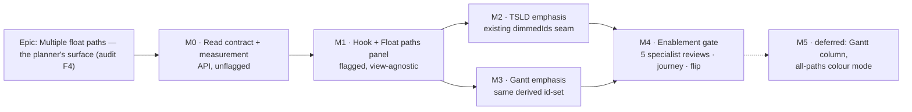

# Implementation Plan: Multiple float paths — the planner's surface

- **Feature spec:** [`./feature-spec.md`](./feature-spec.md) — **Draft, awaiting approval**
- **Status:** Draft — **do not implement before approval** (`docs/PROCESS.md` Definition of Ready)
- **Owner:** _(to be assigned)_
- **Flag:** `VITE_FLOAT_PATHS` (`flagDefaultOff`), flipped in **M4**
- **Register item:** `docs/specs/engine-surface-audit.md` **F4** — the register's last open finding

> **The one thing to read before sequencing anything.** M0 is an **API** milestone and it is
> **unflagged**, because a `VITE_` constant is a client build-time value and cannot gate a server
> field (the ADR-0060 M0 lesson). It must land **first**: the field the whole surface ranks on is
> converted at a flat 1440 today, so on an eight-hour calendar the first two-and-a-half working days
> of relative float all render as `0`. Building M1 on the current field would knowingly ship F8's
> defect one field along. M0 is additive, has zero consumers, and is safe to release alone.

## Breakdown

### Epic

**Multiple float paths — the planner's surface.** Give the ranked contiguous driving chains the engine
has computed since M6-F6 (ADR-0035 §19, scenario S11) a surface a planner can reach, so the question
_"if I compress the critical path, what binds next and by how much?"_ can be answered in SchedulePoint
rather than in the tool it exists to replace. Closes the engine↔planner surface audit's last open
finding, and closes the F8 residue on `relativeFloat` in passing. Roadmap theme: engine↔planner surface
reconciliation.

**Epic-level invariants — true of every milestone, and each is a test somewhere:**

- `apps/api/src/modules/schedule/engine/compute.ts` is **not modified**. `computeSchedule`'s signature
  is unchanged. The ADR-0034 recalc parity gate is structurally untouched.
- `apps/api/src/modules/schedule/engine/float-paths.ts` is **not modified** either — the truncation
  probe is a service concern (`maxPaths + 1`), not an engine field.
- **No schema change, no migration, no write path, no new permission, no pen assertion.**
- The canvas painter (`render/paint.ts`) gains **no new field and no new branch**; the emphasis half
  contributes members to the existing `dimmedIds` set.
- Flag-off is **byte-for-byte today's product** — no toolbar item, no panel, no query, no scene
  contribution.

---

## Milestone M0 — The read contract, and the measurement (API, unflagged)

**Outcome:** `GET …/schedule/float-paths` returns a relative float that is true on any calendar, and
says whether its list was truncated; and the cost of one request is a measured number rather than an
assumption. Nothing user-visible ships; nothing can regress, because nothing consumes the endpoint.

---

#### Feature: F0 — An honest float-paths read contract

> **Description:** Two additive response fields (`relativeFloatMinutes` per path, `hasMorePaths` on the
> envelope), the documentation corrections they force, and the measurement that sets M1's fetch policy.
> **Complexity:** M
> **Dependencies:** none — this is the epic's root
> **Risks:** _Touching a schedule-module service tempts a "while I'm here" engine change_ → the tasks
> below name the two engine files as **not modified** and Task M0.7 adds a structural test that fails
> if `computeSchedule`'s parameter list changes. _The day field looks redundant and invites deletion_ →
> it is explicitly retained and deprecated; deleting it is a break for no gain.
> **Testing requirements:** API e2e on an **eight-hour** calendar proving the unit (the defect pinned
> as a test, not described in prose); truncation e2e; the existing engine goldens re-run **unchanged**
> as the proof that no engine file moved.

##### Task M0.1 — `relativeFloatMinutes` on the float-paths response (≈ one PR)

- **Description:** Add `relativeFloatMinutes: number` to `PlanFloatPath` (`@repo/types`) and
  `PlanFloatPathDto`, mapped straight from the engine's `p.relativeFloat` with **no conversion at
  all**. Retain `relativeFloat` (days) and add a deprecation note to its docblock naming the new field
  and the reason (a flat 1440 against a per-activity calendar — ADR-0037 §4 / ADR-0068).
- **Complexity:** S
- **Dependencies:** none
- **Risks:** _A reader assumes the day field was already right and "tidies" the new one away_ → the
  docblock states the eight-hour-calendar arithmetic explicitly (`480 / 1440 → 0`).
- **Testing:** unit on the service mapping (a 480-minute relative float returns `relativeFloatMinutes:
480` and `relativeFloat: 0`); `@repo/types` ↔ DTO structural agreement.
- **Development steps:**
  1. `packages/types` — add the field to `PlanFloatPath`.
  2. `apps/api/.../dto/plan-float-paths.dto.ts` — add the property with the full `@ApiProperty`
     description from the spec's §4; annotate `relativeFloat` as deprecated.
  3. `schedule.service.ts:619-626` — emit both; **do not** remove the day mapping.
  4. Unit test the mapping at both 1440 and 480 minutes-per-day.

##### Task M0.2 — `hasMorePaths`, without touching the engine

- **Description:** The service requests `maxPaths + 1` from `computeFloatPaths`, returns the first
  `maxPaths`, and sets `hasMorePaths = returned.length > maxPaths`. `engine/float-paths.ts` is **not
  modified** — adding a `hasMore` to a pure engine module's return type would change its contract and
  its goldens for a presentation concern.
- **Complexity:** S
- **Dependencies:** M0.1 (same file, same PR-adjacent area — sequence to avoid a conflict)
- **Risks:** _The `+1` walk costs an extra chain traversal_ → bounded by the same per-chain depth guard;
  negligible beside the `computeSchedule` call that dominates the request. _A caller sends
  `maxPaths = 50` and the service asks for 51, above the DTO's declared ceiling_ → the ceiling is a
  **request** validation; the internal call is not re-validated. Assert this with a test at
  `maxPaths = 50` so nobody later "fixes" it by clamping and silently disabling the probe.
- **Testing:** API e2e — a plan with more than 3 paths queried at `maxPaths=3` returns 3 paths and
  `hasMorePaths: true`; the same plan at `maxPaths=50` returns every path and `false`; a plan with
  exactly `maxPaths` paths returns `false` (the off-by-one that matters).
- **Development steps:**
  1. Add `hasMorePaths` to `PlanFloatPaths` + DTO.
  2. Service: call with `maxPaths + 1`, slice, set the flag.
  3. Tests including the exactly-`maxPaths` boundary.

##### Task M0.3 — API e2e: the eight-hour-calendar unit proof

- **Description:** A Supertest case that builds a plan on an eight-hour calendar (ADR-0067 shift
  windows / ADR-0068 `hoursPerDay = 8`) with a branch carrying exactly one working day of float, and
  asserts `relativeFloatMinutes === 480` while `relativeFloat === 0`. This test **is** the record of
  the defect; the prose in the audit register is not.
- **Complexity:** M
- **Dependencies:** M0.1
- **Risks:** _Building the calendar fixture is fiddly and the test ends up asserting the fixture rather
  than the behaviour_ → assert the unlagged 24-hour twin in the same spec so the two differ in exactly
  one thing (the ADR-0034 flip-one-option discipline).
- **Testing:** the task **is** the test. Also cover 404 (target not in plan), 422
  (`PLAN_START_REQUIRED`), and a Viewer-role 200 (the analysis is not role-gated beyond
  `schedule:read`).
- **Development steps:**
  1. Fixture: plan + eight-hour calendar + a driving spine + one floating branch.
  2. Assert both fields; assert the 24-hour twin.
  3. Add the 404 / 422 / Viewer cases.

##### Task M0.4 — Documentation corrections (the ones this change makes necessary)

- **Description:** `docs/DECISIONS.md:1286-1299` states "relative float in working days" — that clause
  becomes false. Correct it, record **why** (the flat-1440 conversion and its eight-hour consequence),
  and add the F4 surface decision entry. Update `docs/API.md` + the OpenAPI description. Update
  `docs/specs/engine-surface-audit.md` F8's "neither has been checked" list to record that the
  float-paths conversion **has now been checked and changed**.
- **Complexity:** S
- **Dependencies:** M0.1, M0.2
- **Risks:** _Correcting one document and leaving the other_ → `pnpm check:doc-links` plus an explicit
  checklist of the four files in the PR description.
- **Testing:** `pnpm check:doc-links`; a reviewer reads the DECISIONS entry against the shipped DTO.
- **Development steps:**
  1. DECISIONS.md §19 entry — correct the unit clause, keep the rest.
  2. `docs/API.md` + OpenAPI.
  3. Audit register F8 list + F4 status note ("surface in progress").
  4. Changeset (`api`, minor).

##### Task M0.5 — Measure one float-paths request before anything depends on it

- **Description:** `GET …/schedule/float-paths` runs a **full `computeSchedule`** per request
  (`schedule.service.ts:610-619`). Record its p95 wall-clock against the ADR-0066 seeded scale plans at
  ~200 and ~2,000 activities, beside a `POST …/schedule/recalculate` on the same plan as the reference
  point. Write the numbers into this plan document and into `docs/TECH_DEBT.md` if they are bad.
- **Complexity:** S
- **Dependencies:** none (can run in parallel with M0.1–M0.3)
- **Risks:** _The number is never taken and the panel's fetch policy is guessed_ → this task gates M1.3;
  the panel's `staleTime` and the "fetch on open vs. explicit **Analyse** button" decision are both
  written from it. This is the ADR-0065 lesson applied **before** the build rather than after.
- **Testing:** not a CI test — a recorded measurement with its method, hardware and plan named, in the
  ADR-0065 `measure-link-routing.mjs` spirit (state the caveats; a shared runner is not a planner's
  laptop).
- **Development steps:**
  1. Seed / reuse the ADR-0066 scale plans.
  2. Time 20 requests at each size; record p50/p95 and the recalculate reference.
  3. Record the result **in this document** under M1.3's decision, with caveats.

> ### M0.5 RESULT (measured 2026-08-02) — and the M1.3 decision it settles
>
> Harness: `apps/api/scripts/measure-float-paths.mjs`, 20 runs after one warm-up, against a
> **540-activity / 800-link** ADR-0066 scale plan (`--tier scale --activities 500`) seeded through
> the public REST API. Target = the latest-finishing non-summary activity, which is also the panel's
> suggested default (CQ-2).
>
> | request                                   | p50      | p95          | min / max     |
> | ----------------------------------------- | -------- | ------------ | ------------- |
> | `GET …/schedule/float-paths`              | 85.7 ms  | **100.4 ms** | 75.7 / 107.9  |
> | `POST …/schedule/recalculate` (reference) | 148.2 ms | 165.3 ms     | 119.2 / 166.1 |
>
> **float-paths is 0.61× a recalculate at p95.** That is the number that matters: it is _cheaper_
> than the write a planner already presses a button for and waits on, on a plan larger than most.
> The "one request ≈ one CPM run" worry is real in mechanism and small in magnitude, because the
> forward/backward pass over 540 activities is simply not expensive — and this request skips the
> batched persistence a recalculate pays for.
>
> **Decision for M1.3: fetch on panel open.** No explicit **Analyse** press, no confirmation step. A
> ~100 ms request behind a control the planner deliberately opened is an ordinary read; making them
> press twice for it would be ceremony. `staleTime` is set to **0 with the query kept mounted** —
> the analysis is derived from the live schedule, so a stale float path is a _wrong_ float path, and
> the ADR-0022 recalc invalidation (`scheduleKeys.all`) already sweeps this key by construction
> because it lives in the same namespace.
>
> **Caveats, stated rather than implied.** A container on shared infrastructure is not a planner's
> machine and not a production host; treat the absolutes as indicative and the **ratio** as the
> finding. This is one plan shape — the ADR-0066 scale generator's spine-and-branches — not a survey.
> If a real programme ever lands where float-paths is materially _slower_ than its own recalculate,
> that inverts the reasoning above and the fetch policy should be revisited, not patched.

##### Task M0.6 — Check the second flat-1440 conversion F8 named (check, do not necessarily change)

- **Description:** F8 listed two unchecked conversions. This epic closes one. Read the other —
  `durationMinutes / MINUTES_PER_DAY` at `schedule.service.ts:966` — establish what consumes it and
  whether the flat factor is wrong there, and **record the finding**. It feeds the engine-input
  builder's day-compat path, so a change could move dates: that would be its own spec, not a drive-by.
- **Complexity:** S
- **Dependencies:** none
- **Risks:** _Scope creep into a date-moving change_ → the task's deliverable is explicitly a written
  finding, not a code change. If it is wrong, raise it as a new audit-register row.
- **Testing:** n/a (a reading task). If a defect is found, a failing test accompanies the new finding.
- **Development steps:**
  1. Trace the consumers of the line.
  2. Record the conclusion in `docs/specs/engine-surface-audit.md` (F8's list) — checked-and-correct,
     or a new finding.

##### Task M0.7 — Structural pin: the engine did not move

- **Description:** A structural test asserting `computeSchedule`'s parameter list and
  `computeFloatPaths`'s return shape are unchanged — the `EngineResource`-shape precedent from
  ADR-0053 M3. Cheap, and it turns "we did not touch the engine" from a claim in a PR description into
  something CI enforces for the rest of the epic.
- **Complexity:** S
- **Dependencies:** M0.2
- **Risks:** _A brittle test that fails on unrelated refactors_ → assert arity and the named fields
  only, not the full type text.
- **Testing:** the task is the test. Re-run the existing `compute.float-paths.spec.ts` goldens
  **unchanged** in the same PR as the second half of the proof.
- **Development steps:**
  1. Add `float-paths.structural.spec.ts`.
  2. Confirm the existing goldens pass without edit.

---

## Milestone M1 — The hook and the Float paths panel (flagged, view-agnostic)

**Outcome:** With `VITE_FLOAT_PATHS=true`, a planner selects an activity, presses **Float paths**, and
reads the ranked chains with a relative float that is correct on their calendar — from **either** the
Diagram or the Gantt view. No canvas or Gantt rendering changes yet.

---

#### Feature: F1 — Read the analysis into the client

> **Description:** The query hook, the query key, the invalidation wiring and the pure view-model.
> **Complexity:** M
> **Dependencies:** M0 (the whole milestone — the panel must never render the day-rounded field)
> **Risks:** _An `enabled`-less hook fetches on mount for every plan, running a CPM computation nobody
> asked for_ → `enabled` is gated on `panelOpen && target !== null` and covered by a test that asserts
> **zero** requests with the panel closed. _Formatting a negative relative float with
> `formatDurationText` silently renders `0d`_ (it clamps `minutes <= 0`, `duration-text.ts:194`) →
> `formatSignedDurationText` is mandatory and a unit test pins a negative value.
> **Testing requirements:** hook tests (enabled gating, key shape, invalidation on recalculate);
> exhaustive pure-model unit tests including negative, zero, truncated and missing-activity cases.

##### Task M1.1 — `scheduleKeys.floatPaths` + `useFloatPaths`

- **Description:** Add the key factory beside `earnedValue` / `resourceHistogram` under the same
  `schedule` namespace — which is what makes `useRecalculate`'s existing `scheduleKeys.all(org)` sweep
  already correct, with no new invalidation rule. Add the `queryOptions` + hook with `enabled` gating
  and the `staleTime` chosen from M0.5.
- **Complexity:** S
- **Dependencies:** M0.1, M0.5
- **Risks:** _Keying without `maxPaths` makes **Show more** return a cached short list_ → `maxPaths` is
  part of the key; a test proves 10 and 25 are separate entries.
- **Testing:** key shape; `enabled` false ⇒ no fetch; a recalculate invalidates it; 404/422 surface as
  typed errors the panel can branch on.
- **Development steps:**
  1. `lib/query/hierarchy-keys.ts` — the factory with a docblock saying why it lives in the schedule
     namespace.
  2. `features/float-paths/api/use-float-paths.ts`.
  3. Tests, including the invalidation path.

##### Task M1.2 — The pure row model

- **Description:** `features/float-paths/model/float-path-rows.ts` — no React, no DOM, no fetch (the
  `lenses.ts` / `logic-path.ts` idiom). Builds: the path row view-model (label — **"Driving"** for
  index 0, never "+0d"; signed relative-float text; entry-activity name; length), the **emphasis
  id-set** for a selected path, and the missing-activity marker for an id the client does not hold.
- **Complexity:** M
- **Dependencies:** M1.1
- **Risks:** _Re-sorting the chain "helpfully"_ → the API's target-first order is the contract; a test
  asserts the model preserves it verbatim. _Dropping an unknown id_ → a test asserts the row is kept
  and marked, because dropping makes the chain read shorter than it is.
- **Testing:** unit — driving label, positive/negative/zero relative float, `hoursPerDay` unresolved
  (h/m degrade), unknown id retained-and-marked, order preserved, emphasis set is exactly the path's
  members.
- **Development steps:**
  1. Types + builder.
  2. `formatSignedDurationText` wiring with a **required** `hoursPerDay` parameter (never defaulted —
     ADR-0070's compiler-enforced ordering).
  3. Exhaustive unit tests.

---

#### Feature: F2 — The Float paths panel and its entry point

> **Description:** The non-modal `Sheet`, its full state matrix, the workspace host state, and the
> toolbar item.
> **Complexity:** L
> **Dependencies:** F1
> **Risks:** _A shipped control that renders and does nothing_ (the ADR-0064 lit-but-inert shape) → the
> disabled-with-reason ladder is a pure predicate with its own unit tests, and the flag-on journey in
> M4 drives the real thing. _A modal dialog would hide the diagram the analysis is about_ → non-modal
> `Sheet`, the entry-routes plan-notes precedent. _A menu portalled from inside a modal is unclickable_
> (the ADR-0067 M4 top-layer finding) → the panel is deliberately **not** modal, which side-steps it.
> **Testing requirements:** panel state tests for every branch (idle / no-target / loading+announced /
> ok / empty-predecessors / truncated / 422 / 404 / error+Retry); toolbar predicate tests for the
> ladder and the flag; axe assertions; a flag-off parity suite.

##### Task M2.1 — Workspace host state

- **Description:** Extend `use-plan-workspace-model` with `floatPathsOpen`, `floatPathsTargetId`,
  `selectedPathIndex` and the **derived emphasis id-set** — derived **once, here**, and handed to both
  views. That is the ADR-0063 `wbs-band-source` rule: two derivations of "which rows are on the path"
  would differ eventually, and only in a printed programme or a screenshot.
- **Complexity:** M
- **Dependencies:** F1
- **Risks:** _Target follows selection and fires a CPM run per click_ → target is **sticky**; a test
  asserts changing the canvas selection issues no request. _State survives a plan switch_ → cleared on
  plan change; **kept** across a Diagram↔Gantt switch (a test for each).
- **Testing:** unit on the model — stickiness, clearing rules, derived set identity/memoisation.
- **Development steps:**
  1. State + setters, memoised like the existing ones.
  2. Derived emphasis set with a stable identity while inputs are unchanged.
  3. Tests, including "selection change ⇒ no fetch".

##### Task M2.2 — `FloatPathsPanel`

- **Description:** The non-modal right-anchored `Sheet`. Target header with a **Use selected activity**
  affordance; ranked list as APG disclosure rows; expanded chain rows (code, name, early start/finish,
  total float) that select-and-bring-into-view on activation; **Show more** driven by `hasMorePaths`;
  every state from the spec's §2. Long chains are virtualized or capped-with-more.
- **Complexity:** L
- **Dependencies:** M2.1
- **Risks:** _An in-flight request with no busy state feels broken_ — this request runs a CPM
  computation → busy state **and** a polite announcement. _An error rendered as an empty list reads as
  "no paths"_ → error and empty are separate, differently-worded branches, each with a test. _Copy
  invents a pen reason_ (the ADR-0060 M6 finding) → there is no pen here and no copy mentions one.
- **Testing:** RTL per state; `formatSignedDurationText` output asserted for `+2d 4h` and `−1d`; the
  mixed-calendar disclosure sentence present when calendars differ (CQ-3 default A); axe.
- **Development steps:**
  1. Panel shell + header + target affordance.
  2. Ranked rows + disclosure + chain rows.
  3. States: loading / empty-predecessors / truncated / 422 / 404 / error+Retry.
  4. Announcements via the existing `useAnnounce`.
  5. Tests + axe.

##### Task M2.3 — The `float-paths` toolbar item

- **Description:** A new registry item — group **`find`**, row **`look`**, tier **2**,
  `showLabel: 'auto'`, `aria-pressed` on panel-open. ADR-0031 forbids inventing a **group**, not an id;
  `find` (find/focus) is the correct existing home, beside Isolate and Next-conflict. **View-only,
  never pen-gated.** Disabled-with-reason ladder: no diagram → "Add an activity first"; no selection →
  "Select an activity first". **Live in the Gantt view too** — it is an analysis, not a canvas viewport
  command (the ADR-0059 M6 finding inverted: shade what only the canvas can do, never what both can).
- **Complexity:** M
- **Dependencies:** M2.2
- **Risks:** _The Look row is already crowded and a tier-2 addition demotes something into `⋯`_ → the
  registry's measured demotion handles it, but **measure the row at 1280 px and 1920 px** and record
  what demotes; if a valued command is pushed out, that is a design decision for CQ-1, not a silent
  regression. _Icon collision_ → distinct from `Route` (isolate) and `TriangleAlert` (next-conflict).
- **Testing:** toolbar predicate tests (flag on/off, each ladder rung, pressed state, Gantt-view
  liveness); a flag-off test asserting the item is **absent** and the bar is today's.
- **Development steps:**
  1. Register the item behind `FLOAT_PATHS_ENABLED`.
  2. Ladder + pressed state + announcements.
  3. Measure and record the row demotion at both widths.
  4. Tests including the Gantt-view case.

##### Task M2.4 — The flag and its flag-off parity suite

- **Description:** `VITE_FLOAT_PATHS` via `flagDefaultOff` (the first consumer since
  `VITE_SUB_DAY_DURATIONS` moved on — `env.ts:42-49` keeps the helper for exactly this), `.env.example`,
  `vite-env.d.ts`, and a flag-off parity suite (`vi.mock` of `@/config/env`) pinning every touched
  surface byte-for-byte: **no toolbar item**, no panel, no query, no scene contribution.
- **Complexity:** S
- **Dependencies:** M2.3
- **Risks:** _A "Coming soon" placeholder is added flag-off for discoverability, quietly breaking
  "flag-off is today's product"_ → the spec's §4 rules it out; if wanted, it is a separate PR that
  lands **before** this epic.
- **Testing:** the parity suite. It is the rollback contract and is **kept, not weakened**, at M4 (the
  ADR-0053 M6 rule).
- **Development steps:**
  1. Flag + env plumbing.
  2. Parity suite.
  3. Changeset (`web`, minor).

---

## Milestone M2 — TSLD emphasis (the shipped dim seam, no new paint code)

**Outcome:** Selecting a path in the panel dims everything not on it, on the canvas, with the a11y
listbox marked and the change announced.

---

#### Feature: F3 — Path emphasis on the canvas

> **Description:** Union the derived emphasis complement into `TsldScene.dimmedIds`, mark the parallel
> listbox, announce, and define the exit rules.
> **Complexity:** M
> **Dependencies:** M1 (F2 — the panel owns the selection)
> **Risks:** _A new scene field or paint branch would add per-frame cost to a painter already measured
> at 16.7–23.1 ms p95 against ADR-0026 §16's ≤ 4 ms (TECH_DEBT #75)_ → **no new field and no new
> branch**; this contributes members to a set the paint loop already reads once per culled bar. Pinned
> by a paint-parity test. _Dim composed wrongly with an active filter/isolate_ → **union**, the
> canvas-nav rule; a test with all three active.
> **Testing requirements:** paint-parity (the painter's call shape is unchanged with the emphasis set
> absent **and** present); union composition; listbox marking; announcement copy; exit rules.

##### Task M3.1 — Scene contribution + listbox marking

- **Description:** `TsldPanel` unions the float-path emphasis complement into its existing `dimmedIds`
  memo and marks the a11y listbox rows, exactly as the filter and isolate lenses do.
- **Complexity:** M
- **Dependencies:** M2.1
- **Risks:** _A memo that rebuilds every frame_ → memoised on `(selectedPathIndex, paths, activityIds,
filterDim, isolateDim)`; an identity test pins it.
- **Testing:** union with filter and isolate; memo stability; the listbox marks exactly the dimmed set;
  paint-parity with the contribution absent.
- **Development steps:**
  1. Memoised union in `TsldPanel`.
  2. Listbox marking.
  3. Tests + paint-parity.

##### Task M3.2 — Announcements, exit rules and select-and-centre

- **Description:** "Showing path _i_ of _n_ — _k_ activities, 2 days 4 hours above the driving path."
  Exit on: deselect the path, close the panel, change target, switch plan. Activating an activity row
  lifts the plan selection and **centres** it on the canvas (the `centerOnDay` variant canvas-nav
  added for Next-conflict — reuse it, do not add a second).
- **Complexity:** S
- **Dependencies:** M3.1
- **Risks:** _Pointer paths silent while the keyboard path announces_ (the ADR-0064 finding) → one
  announcement site for both. _A "path 0 of n" announcement reading as an error_ → path 0 announces as
  "the driving path".
- **Testing:** announcement copy per branch; each exit rule; centring reuses the existing handle.
- **Development steps:**
  1. Announcement helper (single source, shared with the panel).
  2. Exit rules + tests.
  3. Select-and-centre via the existing handle.

---

## Milestone M3 — Gantt emphasis (the peer of M2)

**Outcome:** The same analysis, the same panel and the same emphasis in the Gantt view — so this is not
a TSLD-only feature.

---

#### Feature: F4 — Path emphasis on the Gantt grid

> **Description:** `GanttPanel` consumes the **same** derived emphasis id-set and applies row emphasis;
> activating an activity row scrolls it into view and moves the roving tab stop.
> **Complexity:** M
> **Dependencies:** M2.1 (the derived set), M2 (F3 — so the two views' behaviour is written together
> and cannot drift in copy or exit rules)
> **Risks:** _A second derivation of "which rows are on the path"_ → forbidden; the set comes from the
> workspace model (ADR-0063 rule). _Emphasis implemented as `visibility: hidden` or a native `disabled`
> takes rows out of the tab order_ (the ADR-0063 M6 and ADR-0060 M6 findings) → emphasis is a visual
> de-emphasis only; every row stays focusable and announced.
> **Testing requirements:** the emphasised set equals the canvas's for the same path (one assertion,
> both consumers); rows stay focusable when de-emphasised; scroll-into-view; the toolbar item is live
> (not shaded) in the Gantt.

##### Task M4.1 — Row emphasis + bring-into-view

- **Description:** Accept the id-set, de-emphasise non-members, scroll a selected activity's row into
  view, move the roving tab stop.
- **Complexity:** M
- **Dependencies:** M2.1, M3.1
- **Risks:** as above.
- **Testing:** identity with the canvas's set; focusability; virtualization interaction (a row outside
  the rendered window must still be scrollable-to — the Gantt's virtualization is exactly the case a
  naive `scrollIntoView` misses).
- **Development steps:**
  1. Prop + row styling via tokens (no colour literals — ADR-0055 lint rule).
  2. Bring-into-view through the existing virtualized-scroll path.
  3. Tests, including a target outside the rendered window.

##### Task M4.2 — The panel in the Gantt, proven

- **Description:** No new component — the panel is workspace-hosted and already renders. This task is
  the **proof**: tests that open it from the Gantt, run the analysis, select a path and emphasise rows,
  plus the assertion that the toolbar item is live rather than shaded there.
- **Complexity:** S
- **Dependencies:** M4.1
- **Risks:** _The panel turns out to import canvas-only code_ → caught here rather than at the flag
  flip; the pure model and the hook have no canvas dependency by construction, and a structural import
  test pins it.
- **Testing:** the task is the test, plus a structural test that `features/float-paths` imports nothing
  from `features/tsld/render`.
- **Development steps:**
  1. Gantt-hosted panel tests.
  2. Structural import test.

---

## Milestone M4 — Enablement (the gate, then the flip)

**Outcome:** `VITE_FLOAT_PATHS` becomes `flagDefaultOn`, with the specialist gates run over the
**combined** diff and every blocking finding folded with a regression test that was verified to fail
against the old code first.

> **This milestone is not a formality, and this repository has the receipts.** ADR-0063 M6, ADR-0064
> §7, ADR-0067 M4 and ADR-0070 M4–M6 each found defects in code that had already passed a human read —
> and in every case several were "a correct pattern applied to one control and not its neighbour".
> Budget it as real work.

---

#### Feature: F5 — The five specialist gates

> **Description:** accessibility, ux, component, performance and security reviews over the combined
> M0–M3 diff, with findings folded.
> **Complexity:** L
> **Dependencies:** M1, M2, M3
> **Risks:** _Reviews run per-milestone find less than one pass over the whole diff_ → run them at the
> end, over everything, which is what every prior epic here found to work.
> **Testing requirements:** every blocking finding ships with a regression test **verified to fail
> against the pre-fix code**.

##### Task M5.1 — accessibility-reviewer

- **Description:** WCAG 2.2 AA over the panel, the toolbar item, the emphasis in both views.
- **Complexity:** M
- **Dependencies:** M3
- **Risks / what to look for specifically:** meaning carried by dim alone (1.4.1); focus lost when the
  panel closes (2.4.3); a reason sentence beside a control rather than `aria-describedby`-linked to it
  (the ADR-0060 M6 finding); a control on native `disabled` that flips during a fetch (the
  `ScopeSaveBar` lesson); status messages for the settled result count (4.1.3); "Load more"-style
  controls reachable by keyboard (the ADR-0053 M6 finding).
- **Testing:** axe on every panel state; keyboard-only walkthrough of the whole journey.

##### Task M5.2 — ux-reviewer

- **Description:** copy, hierarchy, state coverage, responsive behaviour.
- **Complexity:** M
- **Dependencies:** M3
- **Risks / what to look for:** "+0d" instead of "Driving"; a negative relative float presented as an
  error; an error state indistinguishable from empty; the truncation sentence when `hasMorePaths` is
  false; the mixed-calendar disclosure being either absent or so loud it reads as breakage; the panel
  competing with the notes drawer for the same edge.

##### Task M5.3 — component-reviewer

- **Description:** component API, composability, token/variant usage, shared-shape drift.
- **Complexity:** S
- **Dependencies:** M3
- **Risks / what to look for:** one-off styling and colour literals (ADR-0055 lint); a duplicated
  path-row renderer between the panel and a future Gantt column; the announcement copy duplicated
  rather than single-sourced; the emphasis set derived twice.

##### Task M5.4 — performance-reviewer + the request-cost decision

- **Description:** confirm the paint path is untouched, the memoisation holds, and the fetch policy
  matches M0.5's measurement. If the measured request cost is high, decide **here** whether the panel
  needs an explicit **Analyse** button rather than fetching on open — and record the decision.
- **Complexity:** M
- **Dependencies:** M0.5, M3
- **Risks:** _The request cost is quietly accepted because the feature is nearly done_ → the decision is
  a named deliverable with the number attached.
- **Testing:** paint-parity + the budget suites' call-count shape assertions; a test asserting zero
  requests with the panel closed and exactly one on open.

##### Task M5.5 — security-reviewer

- **Description:** confirm what this spec claims: no new permission, no new endpoint, no write, no pen,
  org scope re-resolved, uniform 404, guests unreachable.
- **Complexity:** S
- **Dependencies:** M0, M3
- **Risks:** _"It's only a read" is exactly what a reviewer should not take on trust_ → the review
  re-derives the `schedule:read` + org-scope path and confirms the guest surface gains nothing.

---

#### Feature: F6 — The flag-on journey and the flip

> **Description:** `apps/web/e2e-float-paths/` with its own Playwright config and CI step, then the
> flag flip.
> **Complexity:** M
> **Dependencies:** F5
> **Risks:** _A unit suite cannot tell you a locator, an accessible name or a collapsed panel is wrong_
> — every recent epic here learned that the expensive way. Run it locally (`scripts/e2e-local.sh
web:float-paths`) before pushing; CI is the second opinion, never the first.
> **Testing requirements:** the journey drives a **real browser against a real API** as a **Viewer**
> and as a **Planner**, proving the analysis is not role-gated, and asserts the relative float read
> back from the **API response**, not from the DOM under test.

##### Task M6.1 — `apps/web/e2e-float-paths/float-paths.spec.ts`

- **Description:** Seed a plan on an **eight-hour** calendar with a driving spine and two branches;
  open the panel; assert path 0 is labelled Driving; assert path 1 shows `+1d` (**not** `0d`) — the
  journey that would have caught the unit defect had it existed; select a path and assert the canvas
  dim and the listbox marking; switch to the Gantt and assert the same emphasis; activate an activity
  row and assert selection + bring-into-view; assert the truncation sentence at `maxPaths=1`.
- **Complexity:** L
- **Dependencies:** F5
- **Risks:** _Flaky waits on a request that runs a CPM computation_ → wait on the settled result count
  announcement, not a timeout.
- **Testing:** the task is the test.
- **Development steps:**
  1. `playwright.float-paths.config.ts` + `test:e2e:float-paths` script + CI step.
  2. The journey, run locally first.
  3. Both roles.

##### Task M6.2 — Flip the flag, and close the register

- **Description:** `flagDefaultOff` → `flagDefaultOn` with a docblock recording what was found and
  folded (the house convention — every flag's docblock is the epic's short history). Update
  `docs/TOOLBAR_ROADMAP.md` (a new live id), `docs/ROADMAP.md`, `docs/DECISIONS.md`, and mark **F4
  RESOLVED** in `docs/specs/engine-surface-audit.md` — the register's last open finding, with a note
  on what building it revealed (the unfixed F8 residue).
- **Complexity:** S
- **Dependencies:** M6.1
- **Risks:** _The audit register is updated to say "resolved" without recording what was found wrong_ →
  ADR-0058's rule: record what was found, not only what changed.
- **Testing:** flag-off parity suites still pass **unchanged** — that is the rollback contract.
- **Development steps:**
  1. Flip + docblock.
  2. Doc updates + `pnpm check:doc-links`.
  3. Changeset (`web`, minor).

---

## Milestone M5 — Deferred, named, not scheduled

Recorded so they are decisions rather than omissions — the F4 lesson applied to its own follow-ons.

- **The Gantt "Float path" / "Path order" column with group-by and sort.** The P6-native shape; grid
  column plumbing, sort keys, the print surface and the row model. Does not conflict with the roadmap's
  Gantt dependency arrows (a column is in the grid half, arrows in the chart half).
- **An all-paths Colour-by mode.** Additive by construction (`buildColourMap` is mode-generic), but
  colour carrying meaning for up to 50 ordered categories, colliding with the existing float-bucket
  palette.
- **Rewriting `floatPaths()` as a persisted read-model** (the `earned-value` / `resource-histogram`
  shape). Much cheaper per request; changes a shipped endpoint's semantics from "always current" to "as
  of the last recalc". Recorded in `docs/BACKLOG.md`.
- **Normalising relative float onto the target's calendar in the engine** (CQ-3 option C). An engine
  change with §19 goldens to rebaseline and an ADR-0035 amendment.

---

## Sequencing & slices

| Order | Slice                                | Releasable alone?                  | Flag                   |
| ----- | ------------------------------------ | ---------------------------------- | ---------------------- |
| 1     | **M0** — read contract + measurement | **Yes.** Additive, zero consumers  | none (server-side)     |
| 2     | **M1** — hook + panel                | Yes, dark                          | `VITE_FLOAT_PATHS` off |
| 3     | **M2** — TSLD emphasis               | Yes, dark                          | same flag              |
| 4     | **M3** — Gantt emphasis              | Yes, dark                          | same flag              |
| 5     | **M4** — gates + journey + flip      | Yes — the flip is its own decision | flag → on              |

**M2 and M3 are independent of each other** and both depend only on M1; they are sequenced together so
their copy, exit rules and derived set are written as one thing rather than two.

`main` stays releasable at every point: M0 is additive to an unconsumed endpoint, and M1–M3 are behind a
default-off flag with parity suites pinning the prior surface.

## Definition of Done (per task)

Each task's PR must satisfy the Feature Completion Criteria in [`docs/PROCESS.md`](../../PROCESS.md) —
code, tests, docs, security, performance, accessibility, Docker build, CI, changeset, version impact.

**Specifically for this epic:**

- The **pre-push gate was run, not just written**: `pnpm lint && pnpm typecheck && pnpm test`, **plus
  `scripts/e2e-local.sh api` for every M0 task** (it touches `apps/api`), **plus `scripts/e2e-local.sh
web:float-paths` for M6.1**.
- No PR modifies `engine/compute.ts` or `engine/float-paths.ts`. If one appears to need to, that is a
  scope change and returns to the spec.
- Flag-off parity suites pass **unchanged** in every web PR.

## Recommended specialised agents

| When       | Agent                            | For                                                                                             |
| ---------- | -------------------------------- | ----------------------------------------------------------------------------------------------- |
| M0, review | **api-reviewer**                 | The two additive fields, the deprecation of `relativeFloat`, OpenAPI/`docs/API.md` lock-step    |
| M0, review | **backend-performance-reviewer** | The per-request `computeSchedule` cost and the `maxPaths + 1` probe; sanity-check M0.5's method |
| M0, review | **test-engineer**                | The eight-hour-calendar unit proof and the truncation boundary cases                            |
| M1, design | **ui-architect**                 | Panel host (workspace vs. view), the toolbar slot, and the view-agnostic seam                   |
| M4, gate   | **accessibility-reviewer**       | WCAG 2.2 AA over panel + toolbar + emphasis in both views                                       |
| M4, gate   | **ux-reviewer**                  | Copy, state coverage, the negative and mixed-calendar cases                                     |
| M4, gate   | **component-reviewer**           | Token/variant usage, shared-shape drift, single-sourced announcements                           |
| M4, gate   | **performance-reviewer**         | Paint parity, memoisation, and the fetch-policy decision against M0.5's number                  |
| M4, gate   | **security-reviewer**            | Re-derive the read path: permission, org scope, uniform 404, guest exclusion                    |

**No `database-architect`** — there is no schema change of any kind.

## Risks & assumptions (rollup)

| Risk / assumption                                                                                      | Likelihood | Impact   | Mitigation                                                                                                                                               |
| ------------------------------------------------------------------------------------------------------ | ---------- | -------- | -------------------------------------------------------------------------------------------------------------------------------------------------------- |
| **One request runs a full CPM computation** and the panel makes it feel like a per-click cost          | **high**   | **high** | M0.5 measures it first; explicit fetch, sticky target, no hover/prefetch; an **Analyse** button is the fallback, decided at M5.4 with the number in hand |
| The relative-float unit ships wrong (the F8 residue) because the day field looked fine                 | med        | **high** | M0 lands first; the eight-hour-calendar e2e pins it; the day field is deprecated in its docblock, not silently left as the obvious one to use            |
| Relative float is ill-defined across calendars (CQ-3) and the panel implies more precision than exists | **high**   | med      | Disclose in the panel (the F8 control's precedent) and record in `docs/DECISIONS.md`; suppression (CQ-3 B) is the fallback                               |
| The dim channel becomes ambiguous with filter + isolate + float paths all active                       | med        | med      | Union composition (the shipped rule); the panel and the announcement carry the _reason_ for the dim, which colour never could                            |
| A tier-2 addition demotes a valued Look-row command into `⋯`                                           | med        | low      | Measure at 1280/1920 px in M2.3 and **record** what demotes; if it is bad, it is a CQ-1 decision, not a silent regression                                |
| Scope creep from "one additive field" into changing the endpoint's execution model                     | med        | **high** | Explicitly out of scope; recorded in `docs/BACKLOG.md`; the structural pin (M0.7) fails CI if the engine moves                                           |
| The panel accidentally couples to canvas code and cannot serve the Gantt                               | low        | med      | Structural import test (M4.2); the hook and the model are pure by construction                                                                           |
| The enablement gate finds several defects and the milestone is under-budgeted                          | **high**   | med      | It has done so on every recent epic here — budget M4 as real work, not a formality                                                                       |
| The product owner concludes this does not earn a surface (CQ-1 E)                                      | low        | low      | M0 is still worth landing on its own: it fixes a wrong number on a shipped endpoint. The rest is not started until CQ-1 is answered                      |
