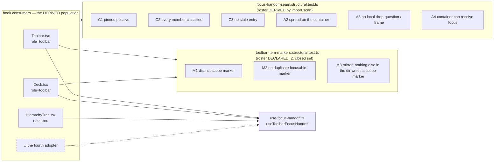
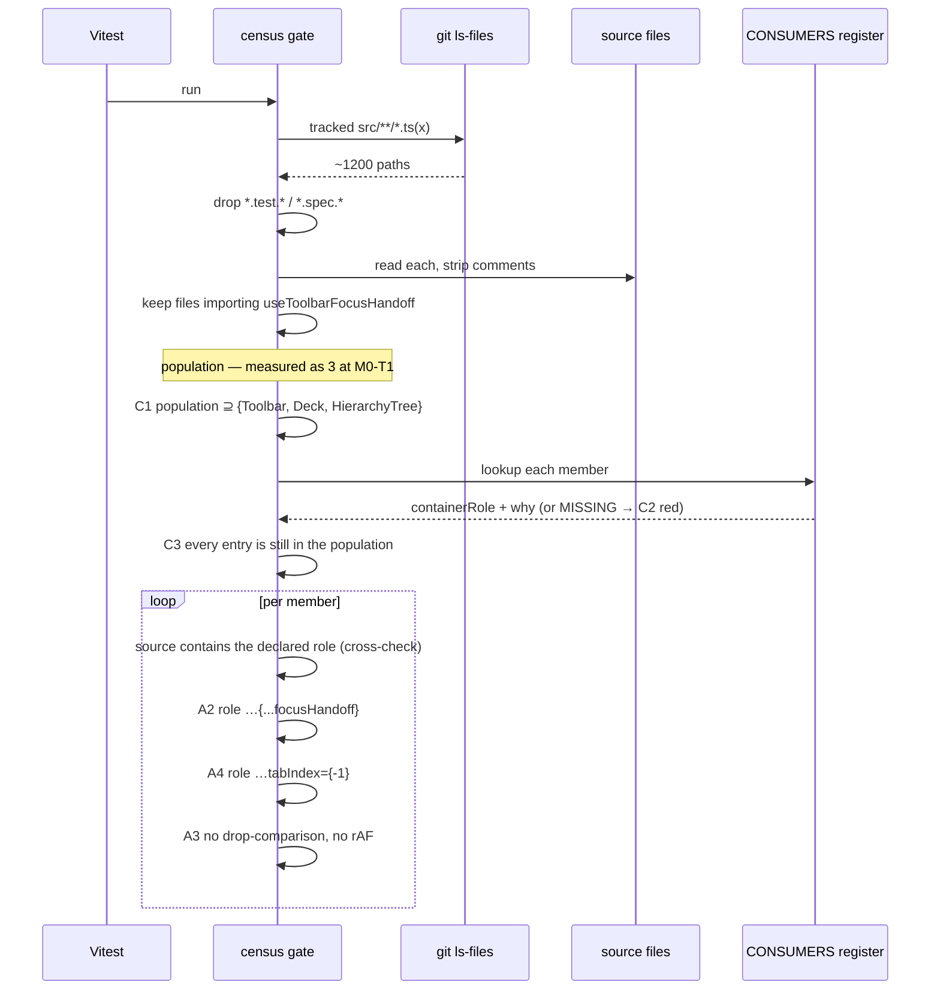
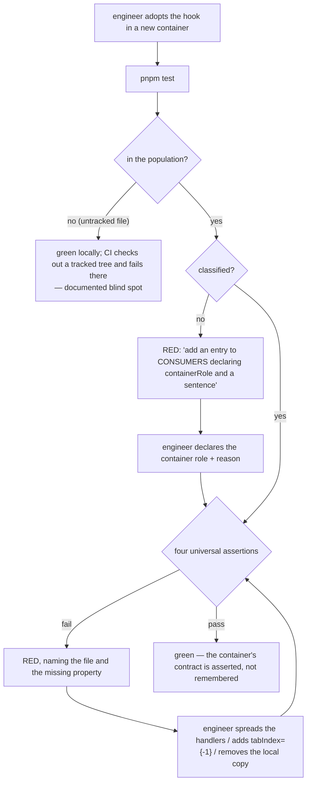

# Feature Spec: The focus-handoff gate finds its consumers, and the toolbar keeps its own marker rule

- **Status:** Draft — awaiting approval before implementation.
- **Author(s):** feature-analyst (web)
- **Date:** 2026-09-12
- **Tracking issue / epic:** `docs/TECH_DEBT.md` #306
- **Roadmap link:** none — this is a shared-gate correction, not a planner-visible capability. It is
  deliberately absent from `docs/ROADMAP.md` (the ADR-0124/ADR-0131/ADR-0136 class: a planner cannot
  act on a structural test).
- **Related ADR(s):** amends **ADR-0135** (its Consequences accepted the gap this closes, and the
  reason it gave for accepting it is answerable); applies **ADR-0073 C4** (a hand-written roster
  beside a growing set), **ADR-0093** (a census that cannot tell "all classified" from "found
  nothing"), **ADR-0110 D5** (a gate is finished when it has been made to fail), **ADR-0124**
  (finding is generous, refusing is strict; a generous reader owes a control on a _different_
  quantity), **ADR-0105** (why this is a spec), **ADR-0088 D1** (no flag).

---

## 0. Corrections to #306 and to the brief

`docs/RECONCILE.md`'s rule is _verify the claim; do not trust the document_, and CLAUDE.md §19.11
extends it to a brief. Everything below was established by reading the named file, not inherited.

### 0.1 What #306 gets right — every load-bearing claim holds

| #306's claim                                                                                   | Verified                                                                                                                                                                                                    |
| ---------------------------------------------------------------------------------------------- | ----------------------------------------------------------------------------------------------------------------------------------------------------------------------------------------------------------- |
| `focus-handoff-seam.structural.test.ts:27` is `const PRIMITIVES = ['Toolbar.tsx', 'Deck.tsx']` | **True**, verbatim, `as const`.                                                                                                                                                                             |
| It is scoped to `src/components/ui/toolbar/`                                                   | **True** — `DIR` at `:26` is `join(process.cwd(), 'src/components/ui/toolbar')`, and `primitiveSource` at `:33-35` joins `DIR` with the roster entry.                                                       |
| All five assertions are `it.each(PRIMITIVES)`                                                  | **True** — `:38`, `:45`, `:61`, `:84`, `:91`.                                                                                                                                                               |
| `HierarchyTree.tsx` is invisible to every one of them                                          | **True**. It is at `apps/web/src/features/navigator/components/HierarchyTree.tsx`, outside `DIR`, and is named by no roster entry.                                                                          |
| The hook is `useToolbarFocusHandoff`, under `components/ui/toolbar/`, taking `toolbarLabel`    | **True** — `use-focus-handoff.ts:177`, `:76`.                                                                                                                                                               |
| The tree passes it `'Project Explorer'`                                                        | **True** — `HierarchyTree.tsx:289`.                                                                                                                                                                         |
| Nothing in its logic is toolbar-specific                                                       | **True** of the _handoff_ logic (`:186-251` reads only `containerRef`, `resolvedIds` and DOM containment). Two helpers, `itemIdOf` (`:125-131`) and `labelOf` (`:146-153`), _are_ toolbar-aware — see §0.3. |
| ADR-0135's Consequences predicted it                                                           | **True**, at `0135-…md:125-129`: _"a third primitive would be invisible to it."_                                                                                                                            |
| Three production components import the hook                                                    | **True and exactly three**: `Toolbar.tsx:14/181`, `Deck.tsx:17/254`, `HierarchyTree.tsx:15/286`. Every other mention in `apps/web/src` is a comment or a test.                                              |

**No claim in #306 was found to be false.** The corrections below are additions and one false premise
in the brief's question list, not retractions.

### 0.2 Correction 1 — the brief's Q5 premise is false: the tree's handoff carries **no** visible-instance guard

The brief states: _"`HierarchyTree` uses one [an `offsetParent`-style visible-instance guard];
`Toolbar` and `Deck` do not."_ It does not. The handoff call is
`HierarchyTree.tsx:286-290` — three options, no guard, no wrapper.

`offsetParent` appears twice in that file and neither is the handoff:

- `:138` — `announceLazyLoad`, the ADR-0029 §202-203 lazy-load announcement (#307(b)).
- `:310` — the `afterDelete` re-home.

Both are driven by **shared state** (two rails share one expansion set, ADR-0029 Phase 2), so both
instances see the same transition and both would act. **The handoff is not**, and the reason it needs
no guard is structural rather than lucky: the record is created in `onFocusCapture`
(`use-focus-handoff.ts:186-204`), which fires only for the container that actually contains the
focused element — and at most one element in a document holds focus. So at most one container can
ever hold a record, and at most one handoff can be scheduled.

It is stronger still in this particular shell: the docked instance sits inside
`className="… hidden min-h-0 shrink-0 lg:flex"` (`app-shell.tsx:171`), and Tailwind's `hidden` is
`display: none`, whose subtree is not focusable at all. _(That last consequence — `display: none`
removes focusability — is reasoned from the HTML/CSS specification, not observed in this repository.
The class and its presence are observed.)_ And even a hypothetical second record could not
double-focus: the frame turns away unless `activeElement` is `null` or `<body>`
(`use-focus-handoff.ts:234-235`).

**This correction decides Q5 rather than informing it** — see D5.

### 0.3 Correction 2 — assertion 5 is not an assertion about the focus handoff

#306 calls `:91` "toolbar-shaped", which is right, and the sharper statement changes where the
remedy goes. Read its own comment (`:92-95`): the defect it guards is that a duplicate
`data-toolbar-item` on a wrapper "would match first and its `.focus()` does nothing, **silently
breaking roving focus on every split button**". `Toolbar.onKeyDown` focuses by
`querySelector('[data-toolbar-item="…"]')`; `Deck.focusables()` queries in document order.

That is a **roving-focus** invariant. The handoff's interest in the marker is second-hand: `itemIdOf`
(`:126`) and `labelOf` (`:148`) use `[data-toolbar-item-scope]` to attribute a split-button caret to
its item. So the assertion has two stakeholders and **both are toolbar mechanisms**. It lives in this
file by adjacency, not by subject.

A `role="tree"` consumer has no registry items, no split buttons and no marker: `HierarchyTree.tsx`
contains the string `data-toolbar-item` exactly **once**, at `:281`, inside the docblock that records
relying on `labelOf`'s `textContent` fallback. Comment-stripped, it is zero.

This dissolves the brief's "hard part" rather than engineering around it — see D2/D3.

### 0.4 Correction 3 — ADR-0135's stated reason for accepting the gap does not survive an import scan

`0135-…md:127-129` accepts the gap because _"deriving the roster would mean deciding what counts as a
roving container, which is the judgement the gate exists to avoid making wrongly."_

That objection is **correct about the roster it imagined and does not apply to the one proposed
here.** An import scan makes no judgement about what a roving container is; it observes which files
call the hook. Deciding _whether a container ought to adopt the hook_ is the judgement ADR-0135
declined to automate, and this proposal still declines it — see the false-negative class in D4, which
is exactly that judgement and is left with a human.

The ADR is amended rather than contradicted: its prediction stands, its reason is narrowed.

### 0.5 Correction 4 — #306 understates the primitives' exposure, and the two halves are **inverses**

#306 says the gap leaves "`Toolbar` and `Deck` each get a unit test **and** a structural gate, and
the Explorer's spread is protected by one unit case alone". The first half is true only if "a unit
test" means a test of something the handoff _creates_. Nothing asserts that `Toolbar` or `Deck` is
**wired**:

- `use-focus-handoff.test.tsx` mounts a **synthetic** `Harness` (`:81-127`) — its own
  `role="toolbar"` div with the handlers spread by the test. It proves the hook, and structurally
  cannot prove that any real consumer spreads it. (That is the ADR-0101 `drawer-entry-point.test.tsx`
  shape: a synthetic probe that stays green through a removal.)
- `Toolbar.test.tsx:470-490` and `:508-514`, and `Deck.test.tsx:271-291`, cover the **resulting
  state** — arrows from the container, the Tab-stop count. **All five call `bar.focus()` directly**
  (`Toolbar.test.tsx:474`, `:485`; `Deck.test.tsx:275`, `:286`), so not one of them depends on the
  handoff having run. Deleting `{...focusHandoff}` from `Toolbar.tsx:322` or `Deck.tsx:271` leaves
  every one of them green. _(`Deck.test.tsx:262-265` records these two cases existing at all because
  a component gate found `Toolbar` had them and `Deck` had none — the same shape, one tier along.)_
- `HierarchyTree.test.tsx:291-317` is a **behavioural** case through the real component, driving a
  held fetch, asserting the placeholder really holds focus first (`:304-306`, with its own ADR-0093
  note) and that focus lands inside the tree. Its docblock records it **verified red against the
  pre-fix component** (`:289`).

So the honest picture:

| Consumer            | behavioural proof it hands focus back | structural proof it is wired |
| ------------------- | ------------------------------------- | ---------------------------- |
| `Toolbar.tsx`       | **none**                              | A1–A5                        |
| `Deck.tsx`          | **none**                              | A1–A5                        |
| `HierarchyTree.tsx` | **yes** (`:291`, red-verified)        | **none**                     |

Each of the three is protected by exactly one instrument, and they are **different** instruments.
That reframes the value of the remedy: it is not "level the tree up to the primitives". It is that
A2 — "actually SPREADS the hook" — is the **only** thing standing between `Toolbar`/`Deck` and a
silently disabled WCAG 2.4.3 mechanism, which makes it the gate's most load-bearing assertion and the
one whose generalisation matters most. It also surfaces a second, separable gap (§1 Open questions,
CQ-2).

---

## 1. Business understanding

### Problem

A WCAG 2.2 §2.4.3 (level A) mechanism is shared by three components. Two of them are protected by a
structural gate; the third, added 2026-09-12 (`c18efbce`), is protected by one unit case, and the
gate's roster is a two-element literal that cannot see it. A refactor of `HierarchyTree`'s container
props that dropped `{...focusHandoff}` would be caught by one test; the same refactor in `Toolbar`
would be caught by the gate. Neither file's author has any way to learn that the other instrument
exists.

**The fourth adopter is the real subject.** ADR-0135 predicted this precisely, so the gap is not a
regression — what changed on 2026-09-12 is that it stopped being hypothetical. The next adopter will
be equally invisible, and nothing will tell them: the mechanism they are reusing has a gate whose
roster does not contain them, and a green local run is indistinguishable from a covered one.

**And the naive remedy does not work**, which is why #306 is a spec and not a list edit. Adding
`'HierarchyTree.tsx'` to `PRIMITIVES` fails three ways at once: `DIR` (`:26`) resolves relative to
`components/ui/toolbar`, so the file would not be read at all; A1's regex (`:41`) pins the _relative_
import specifier `'./use-focus-handoff'`, and the tree imports the alias path
`'@/components/ui/toolbar/use-focus-handoff'`; and A5 (`:97`) requires a marker the tree does not and
should not have.

### Users

Nobody outside the repository. The beneficiaries are:

- **A keyboard or AT user of the Project Explorer or the plan command surface** — indirectly, and
  only in the counterfactual: they are the person who loses focus to `<body>` if a future refactor
  removes a spread and nothing reports it. No behaviour changes for them when this ships.
- **The next engineer to adopt `useToolbarFocusHandoff`** — the direct user. They get a failing gate
  naming the four things their container owes, instead of silence.
- **A reviewer** of any change to the three consumers' container props.

RBAC is not engaged: no route, no permission, no organisation scope, no role. This is
`apps/web` source and tests.

### Primary use cases

1. A fourth component adopts the hook. The gate finds it on the first run after the import lands and
   fails until its container is classified and satisfies the universal assertions.
2. A refactor of any consumer's container drops the spread, the container's `tabIndex={-1}`, or
   reintroduces a local copy of the "was focus dropped?" question. The gate fails, naming the file.
3. A consumer stops using the hook. The stale classification entry fails the mirror assertion, so the
   register cannot become an archive claiming coverage for something that is gone.
4. A caller reads the hook's option list and is told what the option is for, rather than being told to
   pass a toolbar label to a tree.

### User journeys

There is no user journey. This milestone set **ships dark** in ADR-0081 §1's sense: no user-facing
entry point is added or changed, and nothing a planner can press behaves differently. The
option rename (M3) is a compile-time identifier with no rendered consequence.

### Expected outcomes

- The three existing consumers are each covered by the structural limb **and** the roster is derived,
  so the fourth is covered the day its import lands.
- `focus-handoff-seam.structural.test.ts` asserts only things that are true of **any** roving
  container; the toolbar's marker convention is asserted where its subject lives.
- One option name stops misdescribing itself at every call site.
- ADR-0135's accepted gap is closed and its Consequences amended, rather than left reading as an open
  known-issue whose reason has lapsed (the #124 shape: _a deferral whose reason has lapsed reads
  exactly like one whose reason still holds_).

### Success criteria

| Criterion                                                                                                      | How it is known                                                                                     |
| -------------------------------------------------------------------------------------------------------------- | --------------------------------------------------------------------------------------------------- |
| SC-1 — the derived roster contains exactly the three known consumers on its first run                          | M0-T1 records the run's output; C1 pins the three by name thereafter                                |
| SC-2 — every assertion has been made to fail by a named mutation                                               | `m0-mutation-ledger.md` written **before** the assertions; `m1-mutation-sweep.md` records results   |
| SC-3 — the mutation sweep refuses a verdict unless it executed a declared population                           | the sweep prints `failed + passed === N` and `WRONG POPULATION` otherwise                           |
| SC-4 — the gate passes against the tree as it is on the day it is armed, with no product change required       | M0-T2, measured, not assumed                                                                        |
| SC-5 — deleting `{...focusHandoff}` from **any** of the three consumers turns the gate red                     | three named mutations in the ledger                                                                 |
| SC-6 — no production behaviour changes                                                                         | `pnpm prepush` green with no assertion edits outside the two gate files and the rename's call sites |
| SC-7 — `docs/TECH_DEBT.md` #306 closes, and ADR-0135's Consequences bullet is amended in the same pull request | review                                                                                              |

### Open questions

**CQ-1 (CRITICAL) — how far does the rename go?** The spec recommends **the option only**
(`toolbarLabel` → `containerLabel`), declining the hook rename and the module move with a named
trigger to revisit (D4). The alternatives are (a) the full `useFocusHandoff` + move to
`components/ui/` now, and (b) nothing at all. This changes the plan by one milestone and is a
public-contract change the product owner may hold a view on. **Default if unanswered: option only.**

**CQ-2 (CRITICAL) — is the §0.5 behavioural gap in scope?** Nothing proves `Toolbar` or `Deck` is
wired except the structural regex; their suites cover the resulting state and the hook's suite uses a
synthetic harness. Closing it is two cases that mount the **real** primitives and remove a focused
item by flipping an `isVisible` through `context` — cheap, and it closes the ADR-0101 synthetic-probe
shape for the two consumers that have it. It is **beyond #306**, which is why it is a question rather
than a decision. **Default if unanswered: include it (M4), because the epic is already in these
files and a red-first behavioural case is the instrument the register credits with the catches.**

**Non-critical, with defaults stated:**

- _Does the marker assertion keep a hand-written roster?_ Yes, `['Toolbar.tsx', 'Deck.tsx']`, with a
  derived mirror control. ADR-0073 C4's rule is about a roster beside a **growing** set; this one is a
  closed set of two item-rendering primitives in one directory, and the control measures a different
  quantity so a third arrival fails (D3, M2).
- _Does the `requestAnimationFrame` ban get narrowed pre-emptively?_ No. Measured: all three consumers
  contain zero occurrences today. Narrowing a gate that currently discriminates, against a future that
  has not happened, is how a gate loses its teeth. The escape route goes in the failure message (D3).
- _Does the gate learn about the visible-instance guard?_ No (D5, and §0.2).
- _A new ADR, or a `docs/DECISIONS.md` line?_ A short ADR, because this **amends** an Accepted ADR's
  Consequences and records a decline with a trigger; a running-log line cannot carry either. Its
  number is chosen at filing time, never in this plan — ADR-0071 and ADR-0079 both record a number
  being taken between the plan and the milestone.
- _A `VITE_` flag?_ No. ADR-0088 D1: a `VITE_` constant is inlined at build time and is not an
  operator rollback. There is also nothing to roll back — no runtime code path changes.

---

## 2. Functional requirements

### User stories & acceptance criteria

> **US-1** — As the next engineer adopting `useToolbarFocusHandoff`, I want the gate to find my
> component, so that I am told what my container owes instead of discovering it from a defect report.
>
> **Acceptance criteria**
>
> - **Given** a tracked, non-test file under `apps/web/src` whose comment-stripped source imports
>   `useToolbarFocusHandoff` from the hook module by **either** the relative or the `@/` alias path,
>   **when** the gate runs, **then** that file is in the census population.
> - **Given** such a file with no entry in the consumer register, **when** the gate runs, **then** it
>   fails naming the file and the register to add it to, in a message that states what an entry must
>   declare.
> - **Given** a classified consumer, **when** the gate runs, **then** the four universal assertions
>   (D3: spread-on-container, container focusability, no local drop-question, no local frame) are
>   applied to it.

> **US-2** — As a reviewer of a change to a consumer's container, I want the gate to fail when the
> mechanism is disabled, so that a green suite is not the same green as a correct one.
>
> **Acceptance criteria**
>
> - **Given** any consumer, **when** `{...focusHandoff}` is removed from its container, **then** the
>   gate fails for that consumer. _(Three named mutations; SC-5.)_
> - **Given** any consumer, **when** the container's `tabIndex={-1}` is removed, **then** the gate
>   fails — including where a **descendant** still carries `tabIndex={-1}`, which `HierarchyTree.tsx:601`
>   does, so the assertion must be anchored to the container's role and not satisfied by the file
>   merely containing the string.
> - **Given** any consumer, **when** a local `activeElement`-against-`body`/`null` comparison is
>   pasted in, **then** the gate fails — in **both** operand orders, the hole the component review of
>   ADR-0135 found and `:74-77` already closes.

> **US-3** — As a maintainer, I want the consumer register to be incapable of claiming coverage for a
> consumer that no longer exists.
>
> **Acceptance criteria**
>
> - **Given** a register entry for a file that no longer imports the hook, **when** the gate runs,
>   **then** it fails naming the stale entry.
> - **Given** an empty or unexpectedly small population, **when** the gate runs, **then** it fails —
>   the census pins its three known members by name, so "every consumer is classified" cannot pass by
>   finding none.

> **US-4** — As a reader of the toolbar primitives, I want the split-button marker invariant asserted
> where its subject is, so that a non-toolbar consumer is not measured against a rule it cannot hold.
>
> **Acceptance criteria**
>
> - **Given** `Toolbar.tsx` and `Deck.tsx`, **when** the marker gate runs, **then** each is asserted
>   to carry `data-toolbar-item-scope={r.item.id}` and to not duplicate the focusable marker on that
>   wrapper — the two assertions `:97` and `:99-101` make today, unchanged in substance.
> - **Given** any other file under `components/ui/toolbar/` that writes `data-toolbar-item-scope=` in
>   code, **when** the marker gate runs, **then** it fails — so a third item-rendering primitive
>   cannot arrive unasserted behind a two-element list.
> - **Given** `HierarchyTree.tsx`, **when** either gate runs, **then** no marker assertion is applied
>   to it.

> **US-5** — As a caller of the hook, I want the option to name what it is.
>
> **Acceptance criteria**
>
> - **Given** the hook's options, **then** the container's accessible name is passed as
>   `containerLabel`; `toolbarLabel` does not exist and there is no deprecated alias.
> - **Given** the three call sites, **then** each passes `containerLabel`, and the composed sentence
>   is byte-identical to today's for the same inputs. _(The existing message cases in
>   `use-focus-handoff.test.tsx:331-427` are the before/after oracle and must pass with only the
>   option key renamed.)_

### Workflows

**W1 — the gate's run.** Enumerate tracked `src/**/*.ts(x)` via `git ls-files` → drop `*.test.*` /
`*.spec.*` → strip comments → keep files matching the import predicate → sort. Compare against the
pinned known members (C1), the register (C2), and the register against the population (C3). Then, per
member, apply the four universal assertions using that member's declared container role as the anchor.

**W2 — a fourth adopter.** Import lands → C2 fails naming the file → author adds an entry declaring
`containerRole` and a sentence → the four universal assertions run → author fixes or is already
correct → green. The author has, at that point, been told about the mechanism's contract by the tool
rather than by a docblock they did not open.

**W3 — the marker gate.** Assert the two item-rendering primitives, plus the derived mirror control
over the directory.

### Edge cases

| Case                                                                          | Expected behaviour                                                                                                                                                                                                                                                                      |
| ----------------------------------------------------------------------------- | --------------------------------------------------------------------------------------------------------------------------------------------------------------------------------------------------------------------------------------------------------------------------------------- |
| The hook module itself (`use-focus-handoff.ts`)                               | Not in the population. It **defines** the hook; an `import … from './use-focus-handoff'` of itself cannot occur, so the predicate excludes it without a special case. Asserted, not assumed (ledger M-F1).                                                                              |
| Test and spec files                                                           | Excluded by extension. Required, not cosmetic: `focus-handoff-seam.structural.test.ts` and `use-focus-handoff.test.tsx` both contain the identifier in **code** (a regex, an import), so comment stripping cannot exclude them.                                                         |
| Comments and docblocks mentioning the hook                                    | Excluded by comment stripping. Measured: `toolbar-registry.ts:421`, `toolbar-keyboard.ts:125`, `selection-actions.tsx:469` and `HierarchyTree.test.tsx:286` are all comment-only mentions.                                                                                              |
| A consumer that imports only the **types**                                    | In the population, and therefore must be classified. Accepted: a type-only importer that is not a consumer is classified with a sentence saying so — cheaper than a predicate that tries to tell a value import from a type one.                                                        |
| A consumer re-exporting the hook without calling it                           | Same treatment: classified with a sentence. There is no such file today.                                                                                                                                                                                                                |
| A new consumer not yet `git add`ed                                            | Invisible locally. Documented in the gate's own docblock, the `search-consumer-census.structural.test.ts:40-47` precedent verbatim: CI checks out a tree where everything is tracked, so the gate is sound at the moment it decides whether a change merges.                            |
| A container whose role is not `toolbar` or `tree`                             | Supported: the anchor comes from the member's declared `containerRole`, cross-checked against the source (D3).                                                                                                                                                                          |
| A consumer with two containers in one file                                    | Not supported and not silently wrong: the assertions are per-file, so a second container in the same file is not independently asserted. Named as a blind spot in the gate's docblock; no such file exists.                                                                             |
| A consumer that legitimately needs `requestAnimationFrame` for unrelated work | The gate fails, and its message names the decision (narrow the pattern to the conjunction with a drop comparison, or classify the exception with a reason) rather than inviting deletion. Zero occurrences in all three consumers today.                                                |
| `selection-actions.tsx` holding its own drop guard (`:995-996`)               | Correct and untouched. It is not a hook consumer, so it is not in the population, and the two mechanisms are mutually exclusive by construction (`use-focus-handoff.ts:31-36`). An estate-wide ban on the comparison would be **wrong**, and this is why the ban is scoped to adopters. |

### Permissions

None. No endpoint, no permission, no organisation scope, no role, no pen (ADR-0028). There is no
structural plan write, because there is no write.

### Validation rules

Not applicable — no user input, no DTO, no form. The register's shape is enforced by TypeScript:
`Record<string, { containerRole: string; rendersRegistryItems: false; why: string }>` (see D3 for why
`rendersRegistryItems` is a literal `false` rather than a boolean under the recommended design).

### Error scenarios

A gate has no HTTP surface; the honest analogue is its failure modes and how each is detected.

| Scenario                                                 | Detection                                   | Result                                                               |
| -------------------------------------------------------- | ------------------------------------------- | -------------------------------------------------------------------- |
| A new consumer is unclassified                           | C2                                          | Red, naming the file and what an entry declares                      |
| The population is empty or short                         | C1 (pinned positive)                        | Red — the ADR-0093/ADR-0108 hole, closed before the other assertions |
| A register entry is stale                                | C3 (mirror)                                 | Red, naming the entry                                                |
| A declared container role is absent from the source      | the derived cross-check in D3               | Red — a declaration that cannot be true of the file                  |
| The spread is missing or not on the container            | A2                                          | Red                                                                  |
| The container cannot receive focus                       | A4                                          | Red — the case that otherwise fails **silently** at runtime          |
| A local copy of the drop question                        | A3 (both operand orders)                    | Red                                                                  |
| A local frame                                            | A3 (second limb; the weaker one — see D3)   | Red                                                                  |
| A third item-rendering toolbar primitive arrives         | the marker gate's derived mirror control    | Red                                                                  |
| **A container that ought to adopt the hook and has not** | **nothing** — see D4's false-negative class | Silent. This is ADR-0135's declined judgement and stays declined.    |

---

## 3. Technical analysis

| Area           | Impact   | Notes                                                                                                                                                                                                                                                                          |
| -------------- | -------- | ------------------------------------------------------------------------------------------------------------------------------------------------------------------------------------------------------------------------------------------------------------------------------ |
| Frontend       | **low**  | One shared gate rewritten, one new gate, one option renamed across three call sites. No component renders differently; no runtime code path changes except the option's name.                                                                                                  |
| Backend        | **none** | No file under `apps/api/` is touched.                                                                                                                                                                                                                                          |
| Database       | **none** | No model, column, index, constraint or migration. **`database-architect` is therefore not engaged, and that is a statement rather than an omission** (the ADR-0121/ADR-0129 form: there is nothing to design).                                                                 |
| API            | **none** | No endpoint, no DTO, no OpenAPI change, no `docs/API.md` change.                                                                                                                                                                                                               |
| Security       | **none** | No auth, scope, input or secret is involved.                                                                                                                                                                                                                                   |
| Performance    | **none** | Two Vitest files. The census reads ~1,200 tracked sources once (`git ls-files` + `readFileSync`), the same shape and order of cost as `search-consumer-census.structural.test.ts`, which is already in the suite. Measured in M0-T1 so the figure is real rather than assumed. |
| Infrastructure | **none** | No Playwright config, **no CI step** — the two gates are ordinary Vitest files picked up by `pnpm test`. No `ci.yml` change, so `check:ci-roster` and `check:e2e-roster` are not engaged.                                                                                      |
| Observability  | **none** | No log, metric, trace or health surface.                                                                                                                                                                                                                                       |
| Testing        | **high** | This _is_ the change. Two structural suites, each assertion red-verified against a named mutation from a ledger written first; optionally (CQ-2) two behavioural cases against the real primitives.                                                                            |

**Recalculation parity (CLAUDE.md §1).** `computeSchedule` is not called, not imported and not
reachable from anything this change touches; no scheduling input is added, so the ADR-0034 parity gate
is untouched **in its honest form: there is nothing here to hold parity for.** No migration runs.
`apps/web` source and tests only — which is what makes the whole change revertible at a commit
boundary, and is the rollback (ADR-0088 D1).

### Dependencies

- Nothing must land first. All three consumers exist (`c18efbce`, merged 2026-09-12).
- **ADR-0135's Consequences bullet at `:125-129` must be amended in the same pull request** as M1, or
  the register keeps an accepted-gap paragraph whose reason has lapsed — the #124 shape this spec
  cites in §1.
- `docs/TECH_DEBT.md` #306's status must move in the same pull request as the last shipping
  milestone. `check:debt-status` has no `closed` token (ADR-0138's closing finding), so the row is
  **deleted and ledgered** in the Closed-numbers ledger, not restatused.
- `check:spec-status` S3/S4: when the ADR is filed it will cite this directory, so this spec's header
  must move off `Draft` in that same commit.

---

## 4. Solution design

### Architecture overview



### Data flow



### User flow



### Database changes

None.

### API changes

None.

### Component changes

No component renders differently. Three files change in ways a compiler can see, and two test files
are rewritten.

| File                                                                                               | Change                                                                                                                                                                                                                                                                                                             |
| -------------------------------------------------------------------------------------------------- | ------------------------------------------------------------------------------------------------------------------------------------------------------------------------------------------------------------------------------------------------------------------------------------------------------------------ |
| `components/ui/toolbar/focus-handoff-seam.structural.test.ts`                                      | Rewritten: derived roster + `CONSUMERS` register + C1/C2/C3 + A2/A3/A4. A1 absorbed into the predicate (D2); A5 moved out.                                                                                                                                                                                         |
| `components/ui/toolbar/toolbar-item-markers.structural.test.ts` _(new)_                            | A5 relocated, plus the derived mirror control (D3, M2).                                                                                                                                                                                                                                                            |
| `components/ui/toolbar/use-focus-handoff.ts`                                                       | M3 only: `toolbarLabel` → `containerLabel` in `ToolbarFocusHandoffOptions` (`:76`), `composeHandoffMessage`'s parameter (`:163-175`) and the call at `:245`. Both interfaces renamed to `FocusHandoffOptions`/`FocusHandoffHandlers` — **free**, because they are imported nowhere outside this module (verified). |
| `components/ui/toolbar/Toolbar.tsx`, `Deck.tsx`, `features/navigator/components/HierarchyTree.tsx` | M3 only: one option key each (`:184`, `:257`, `:289`). The primitives pass `toolbarLabel: label`, so their own `label` prop is untouched and the rename cascades into no component's public contract.                                                                                                              |
| `components/ui/toolbar/use-focus-handoff.test.tsx`                                                 | M3: the harness's option key. Its message assertions are the before/after oracle and must not change.                                                                                                                                                                                                              |
| `components/ui/toolbar/Toolbar.test.tsx`, `Deck.test.tsx`                                          | CQ-2 only: two new behavioural cases.                                                                                                                                                                                                                                                                              |

### Implementation approach & alternatives

#### D1 — the roster is **derived by import scan**, and each member is then **classified**

The predicate: a **tracked**, non-test file under `apps/web/src` whose **comment-stripped** source
matches an import of `useToolbarFocusHandoff` from the hook module by either specifier form.

```
/import\s*\{[^}]*\buseToolbarFocusHandoff\b[^}]*\}\s*from\s*'(\.\/use-focus-handoff|@\/components\/ui\/toolbar\/use-focus-handoff)'/
```

Both specifier forms are required and that is measured, not defensive: `Toolbar.tsx:14` and
`Deck.tsx:17` use the relative form, `HierarchyTree.tsx:15` the alias. A single-form predicate would
find two of three and C1 would catch it — which is exactly why C1 is written first (ADR-0131's own
`70 of 72` under-inclusion went green because the only assertion was non-emptiness).

**Population, derived from the repository as it stands: exactly three** — `Toolbar.tsx`, `Deck.tsx`,
`HierarchyTree.tsx`. Established by enumerating every occurrence of `useToolbarFocusHandoff` in
`apps/web` and classifying each: three production imports, two test files, the defining module, and
four comment-only mentions. **To be re-derived by running the gate at M0-T1** rather than carried from
this paragraph.

The classification half is what the search-consumer census
(`search-consumer-census.structural.test.ts:73-110`) already does in this repository and it earns its
keep twice. It makes a new consumer **fail until somebody decides** what its container is — which is
the mechanism, and the reason this is a census rather than a list. And it gives the anchor problem a
home: an entry declares `containerRole`, so A2 and A4 have something to anchor to that is neither
`role="toolbar"` (wrong for a tree) nor role-agnostic (which would let the spread sit on any inner
element — the very defect A2 was added for, per its comment at `:46-51`).

**Rejected — a declaration-only roster** (a JSON file or a `CONSUMERS` list not derived from
anything). That is ADR-0073 C4's defect: a hand-written roster beside a growing set, which this
repository has watched go wrong in `check:ci-roster`'s subject, `check-build-contract`, the audit
action cap and the `e2e` step list. It also cannot fail when a consumer arrives, which is the one
thing #306 asks for.

**Rejected — an AST scan.** The regex's failure modes are enumerable and its false positives are all
"a file is classified that need not be", which costs one sentence. A TypeScript program walk buys
precision this population does not need and adds a dependency on a compiler API in a suite that must
stay cheap.

#### D2 — assertion A1 is **deleted, not kept**, and its value is replaced

Under a derived roster, "%s imports the shared hook" is a **tautology**: every member imports the hook
by construction of the predicate. Keeping it would be worse than deleting it, because a tautological
assertion in a gate reads as coverage — the failure mode ADR-0124 catalogues four times over
(`A9` comparing heading counts against heading counts and "agreeing with itself" is the same shape).

What A1 was really buying is the **positive limb** ADR-0135 D1 insisted on: proof that the mechanism is
adopted at all, so the negative limb cannot pass against a tree where nobody uses it. That value moves
to **C1**, which pins the three known consumers **by name** — strictly stronger than A1, because A1
could only ever say "the files I was told about import it" while C1 says "the files I was told about
are still found by a predicate I did not hand-write".

#### D3 — what a discovered consumer owes: four universal assertions, and the marker rule leaves

Derived from what would catch a defect, not from what is easy to assert.

| Today                                               | Subject                           | Universal? | Disposition                                                                                                                                                                                          |
| --------------------------------------------------- | --------------------------------- | ---------- | ---------------------------------------------------------------------------------------------------------------------------------------------------------------------------------------------------- |
| **A1** `:38` imports the hook                       | adoption                          | —          | **Deleted** (D2). Tautological under derivation; value → C1.                                                                                                                                         |
| **A2** `:45` spreads the handlers, on the container | **the mechanism is connected**    | **Yes**    | **Kept, generalised.** The anchor becomes the declared `containerRole`. Per §0.5 this is the **only** protection `Toolbar` and `Deck` have.                                                          |
| **A3** `:61` no second copy of the rule             | one home for "was focus dropped?" | **Yes**    | **Kept unchanged**, both operand orders and both limbs. Measured: zero occurrences of either token in all three consumers.                                                                           |
| **A4** `:84` container can receive focus            | **a silent runtime failure**      | **Yes**    | **Kept, generalised.** Without `tabIndex={-1}` the container refuses `focus()` and the hook's own "did focus land?" check (`:242`) turns the whole mechanism into a no-op with nothing red anywhere. |
| **A5** `:91` distinct marker attribute              | roving-focus attribution          | **No**     | **Relocated** to `toolbar-item-markers.structural.test.ts` (§0.3).                                                                                                                                   |

**A2 and A4 are anchored to a declared role, cross-checked against the source.** The entry says
`containerRole: 'tree'`; the gate asserts the source contains `role="tree"` **and** that the role
occurrence is followed, within a bounded window, by `{...focusHandoff}` and by `tabIndex={-1}`. That
is ADR-0124's rule applied: a generous reader (the declaration) owes a control that measures a
**different** quantity (the source), or the declaration can be wrong and nothing says so. Window
sizes are inherited from today's gate (600 and 400 characters) and **re-measured** at M0-T2 against
comment-stripped sources, because stripping moves every offset; measured line gaps today are
Toolbar 314→322, Deck 264→271, HierarchyTree 432→436.

**A4's mutation is the one to get right.** `HierarchyTree.tsx` carries a second `tabIndex={-1}` at
`:601`, on a row. A file-contains assertion would pass with the container's removed. The ledger names
this mutation specifically (M-A4b), and the assertion is finished only when it fails against it.

**The `requestAnimationFrame` limb is the weaker half and is labelled as such**, for the reason
ADR-0135's own sweep recorded about a different assertion (`m1-mutation-sweep.md:31-36`, M6 "masked …
kept as defence in depth"): any reimplementation of the rule **must** ask the drop question, so the
first limb catches it and the rAF ban is defence in depth. It is retained because it currently
discriminates, and its escape route is written into the failure message so the next author narrows the
pattern rather than deleting the assertion.

**The relocated marker gate** keeps a **declared** roster of the two item-rendering primitives, plus a
derived mirror control: no other file under `components/ui/toolbar/` may write
`data-toolbar-item-scope=` in comment-stripped, non-test code. Measured today: exactly two do
(`Toolbar.tsx:264`, `Deck.tsx:395`); the only other occurrences in that directory are the gate's own
regexes, the hook's docblock and the hook test's harness. So a third item-rendering primitive fails on
arrival, which is the growth ADR-0073 C4's rule is actually about.

_(Measured, and recorded because it was the design's near-miss: the discriminator "does the consumer
mention `data-toolbar-item` in comment-stripped source" separates the three perfectly — Toolbar and
Deck yes, `HierarchyTree` no, its single occurrence at `:281` being inside a docblock. A second
independent signal agrees: both primitives pass `lostReasonFor` (`Toolbar.tsx:185`, `Deck.tsx:258`)
and the tree does not. Either would support a **conditional** A5 inside one gate. Both are rejected in
favour of relocation, because a conditional assertion requires the gate to carry a rule about a
subject that is not its own, and the condition's own correctness then needs a control — two mechanisms
where separation needs none.)_

#### D4 — discovery is by **import scan**, and its two error classes are named

**False positives** — a file in the population that is not really a consumer:

1. A type-only import. Costs one sentence in the register.
2. A re-export without a call.
3. A file that imports the hook and never calls it (dead import). ESLint's unused-import rule catches
   this first, so it is theoretical.

All three are cheap and **loud**: the consequence is somebody writes a sentence. None can make the
gate pass when it should fail.

**False negatives** — a container the gate cannot see:

1. **A container that ought to adopt the hook and has not.** This is the #305 class itself, and it is
   **structurally invisible to any import scan**: `HierarchyTree` had the defect for as long as it
   existed and no gate reported it, because the file imported nothing. This is precisely the judgement
   ADR-0135 declined to automate (§0.4), and it stays declined — deciding "is this a roving container
   that can lose a focused child to a peer's write?" is not decidable from the code, for the same
   reason ADR-0135 D6 records `lostReason` not being derivable. **Named, not solved**, and it is the
   honest limit of this whole epic.
2. **A brand-new consumer not yet `git add`ed.** `git ls-files` sees tracked files only. Inherited
   verbatim from `search-consumer-census.structural.test.ts:40-47`, including its reasoning: CI checks
   out a tree where everything is tracked, so the gate is sound at the moment it decides whether a
   change merges; the alternative — walking the filesystem — sweeps in build output. It is a gate going
   **quiet** locally, which is the failure mode this file's own preamble complains about, so it goes in
   the docblock rather than being discovered.
3. **A consumer that copies the hook instead of importing it.** Invisible, because it has no import.
   A3 bans the copy only _within_ the population. Accepted and named; the containment is that a new
   roving container is a `components/ui/` primitive or a feature container, and §19.13 sends both to a
   reviewer before release.

**Rejected — discovery by declaration** (a component opts in via a marker or a registry entry). It
inverts the burden onto the person who does not know the gate exists, which is the defect.
**Rejected — discovery by container role** (scan for `role="toolbar"`/`role="tree"`). It makes the
judgement ADR-0135 declined, and would sweep in every `role="tree"` in the app as an alleged consumer.

#### D5 — the visible-instance guard is **not** part of the contract, and the gate must not know about it

Per §0.2 the premise is false — the tree's handoff carries no guard — and the deeper answer is that it
**needs** none: the record is created by a real focus event, and focus is a singleton, so at most one
container can ever hold one. The guard exists on the tree's two **shared-state** mechanisms
(`announceLazyLoad`, `afterDelete`) because those fire from data, not from focus.

So the contract is unchanged and the gate says nothing about `offsetParent`. Asserting it would be
worse than silent: it would require every consumer to carry a guard against a hazard the mechanism
structurally does not have, and the first author to be refused by it would satisfy the gate by adding
dead code. _(If a future consumer ever mounts twice **and** its containers can both hold focus — which
requires two focused elements, so it cannot — this is revisited. There is no trigger to write, because
there is no reachable state.)_

The one thing worth carrying forward is a **docblock sentence** in the hook, since the question has now
been asked twice: the handoff is focus-driven and therefore instance-safe; a mechanism driven by shared
state in a twice-mounted component is not, and wants the `offsetParent` discriminator.

#### D6 — do not rename the hook or move the module; rename the **option** (CQ-1)

**Declined: the move and the hook rename.** #306's own framing is that renaming without the roster
change "just moves the invisible file" — and with the roster change the location becomes irrelevant to
the gate, which now finds consumers by import rather than by directory. What remains is a readability
cost with no measured consequence, against: three call sites' import paths, the hook module's path in
citations that exist in `HierarchyTree.tsx` (`use-focus-handoff.ts:8-10`, `:17`, `:206-212`),
`HierarchyTree.test.tsx:286`, `toolbar-registry.ts:421`, `toolbar-keyboard.ts:125`,
`selection-actions.tsx:469`, both gates and the hook's own suite. The component review of #305 reached
the same conclusion on its merits and named the specific cost: _a `components/ui/` move with a
re-export touches three call sites' import paths for zero behavioural gain and leaves a forwarding shim
that tends to become permanent_ (#306(a)).

A decision not to act is a result here (ADR-0085, ADR-0137), and it comes with a **checkable trigger**
rather than a feeling: **a second non-toolbar consumer.** At that point the majority of consumers sit
outside `components/ui/toolbar/`, the directory signal is wrong for most readers, and the move is worth
the churn. One non-toolbar consumer is an exception a docblock can carry; two is a pattern a path
should.

**Accepted: `toolbarLabel` → `containerLabel`, with no alias.** This is the half that actually
misleads, and the asymmetry is the argument: a module path and a hook name are read once, when
importing; an option name is read at **every call site** and in the interface, and
`toolbarLabel: 'Project Explorer'` reads as a mistake at `HierarchyTree.tsx:289`. The register's own
worry is that the next adopter concludes the hook is not for them and writes a fourth copy — the drift
ADR-0135 D1 exists to prevent — and the call site is where that conclusion gets reached.

Mechanically it is tiny: one interface field, one `composeHandoffMessage` parameter, one destructure,
one template read, three call sites, one test harness. Both exported interfaces are renamed with it
(`ToolbarFocusHandoffOptions`/`Handlers` → `FocusHandoffOptions`/`Handlers`) at **zero** cost —
verified, they are imported nowhere outside the hook module. No forwarding alias: an alias is the shim
the component review warned about, in a smaller costume.

It **is** an ADR-0105 public-contract trigger, which is why it is in this spec rather than folded into
a register row — and it lands in its **own** milestone after the gates, so the gates' red-verification
is not done against a moving identifier.

#### D7 — no report-only → sweep → arm sequence, and that is measured

ADR-0120's sequence exists for a gate that would fail on day one, because ADR-0058 records that such a
gate gets deleted rather than fixed. This one should pass on day one: all three consumers spread the
handlers on their container, all three carry `tabIndex={-1}` on it, and none contains either A3 token.

**That is a prediction, and M0-T2 is where it is checked rather than asserted.** If the first run is
red for any reason that is not a fixable defect in a consumer, the ADR-0120 sequence applies and the
plan gains a milestone. Stated as a condition, with the number to beat, so it cannot be quietly
resolved the convenient way.

#### D8 — the mutation ledger is written **before** the assertions

ADR-0110 D5: a gate is finished when it has been **made to fail** by the defect it was written for.
That rule has been broken in this repository by gates written for exactly this class — ADR-0110's own
sweep could not see a split-button caret, ADR-0136's sweep found **nine false greens** in one epic, and
ADR-0135's own sweep reported nine STILL-GREEN mutations because every run died loading a reporter
vitest 4 does not have.

So the ledger is a **deliverable of M0**, not a write-up of M1, and the sweep reuses the repair from
`m1-mutation-sweep.md:45-48` verbatim: the verdict requires the run to have executed a **declared
population** (`failed + passed === N`) before it means anything. A sweep measuring a suite it does not
have reads as a result.

---

## 5. Links

- Implementation plan: [`./implementation-plan.md`](./implementation-plan.md)
- The row: `docs/TECH_DEBT.md` #306 (and #305, the fix that created it; #307, its sibling)
- The mechanism: [ADR-0135](../../adr/0135-a-container-hands-focus-back-when-somebody-else-removes-the-control-you-were-on.md),
  and its spec [`docs/specs/unmount-focus-handoff/`](../unmount-focus-handoff/)
- Why this is a spec: [ADR-0105](../../adr/0105-a-register-row-is-not-a-spec.md), `docs/PROCESS.md:20-43`
- The derived-roster rule: ADR-0073 C4; the pinned-positive rule: ADR-0093, ADR-0108
- The precedent gate this one copies: `apps/web/src/app/search-consumer-census.structural.test.ts`
- Docs updated by this change: `docs/TECH_DEBT.md` (#306 closed + ledgered), ADR-0135 (Consequences
  amended), a new ADR (number chosen at filing), `docs/DECISIONS.md` if the ADR is declined at review
