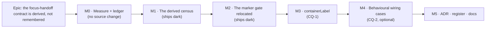

# Implementation Plan: The focus-handoff gate finds its consumers

- **Feature spec:** [`./feature-spec.md`](./feature-spec.md) — **Draft, awaiting approval before
  implementation.**
- **Status:** Draft — awaiting approval before implementation.
- **Owner:** web

## Breakdown

### Epic

**The focus-handoff contract is derived, not remembered** — close `docs/TECH_DEBT.md` #306 by making
the shared gate discover its consumers, move the toolbar's marker rule to where its subject lives,
and settle the rename question with a decision rather than a deferral. Maps to no roadmap theme: it
is a shared-gate correction, and a planner cannot act on a structural test.

---

### Milestone M0 — Measure before designing the gate (no source change)

**Outcome:** four numbers and a ledger, so every later milestone is built on a measurement rather
than on this document.
**Entry point:** `Ships dark: M0 writes two markdown files under this spec directory and changes no
source. Nothing is reachable because nothing is added.`
**Journey:** none required — ADR-0081 §2 attaches a journey to the first **user-facing** milestone,
and no milestone in this epic is user-facing (see "Why there is no journey" below).

> **Why M0 exists at all.** ADR-0090's first recorded consequence is that it was wrong three times
> for having been drafted without running anything, and ADR-0097 Landing C's harness returned
> `PROCEED` from an `undefined`. Every number in the spec's §0 was read from a file; the four below
> can only come from running the thing.

---

#### Feature: the measurement

> **Description:** derive the population, confirm the current tree passes, size the cost, and write
> the mutation ledger.
> **Complexity:** S
> **Dependencies:** none
> **Risks:** the population is not three → the predicate is wrong or a consumer was missed; either
> way the spec's §0 table is corrected in place rather than carried (the ADR-0128/ADR-0130 rule:
> a re-derivation that disagrees is recorded, not smoothed).
> **Testing requirements:** none — this milestone's output is evidence, not code.

##### Task M0-T1 — derive the population and record it (≈ one PR, docs only)

- **Description:** run the D1 predicate as a throwaway script and record what it returns.
- **Complexity:** S
- **Dependencies:** none
- **Risks:** a `grep`-derived expectation is not a run — the spec says "exactly three" from
  enumeration and this task exists to disagree with it if it can.
- **Testing:** n/a
- **Development steps:**
  1. From `apps/web`, enumerate tracked sources (`git ls-files -- 'src/*.ts' 'src/*.tsx'`), drop
     `*.test.*`/`*.spec.*`, strip comments, apply the two-form import regex from spec D1.
  2. Record: the population, its size, and the **specifier form each member uses** (the spec claims
     relative for `Toolbar`/`Deck`, alias for `HierarchyTree` — confirm, because a single-form
     predicate silently finding two of three is the failure C1 exists to catch).
  3. Record the **false-positive sweep**: run the predicate _without_ the test-file exclusion and
     record which files it then admits, so the exclusion's necessity is evidence rather than an
     assumption. (Prediction: `focus-handoff-seam.structural.test.ts` and
     `use-focus-handoff.test.tsx`, both matching in **code**.)
  4. Record the **comment-stripping sweep**: run it without stripping and record the additions.
     (Prediction: `toolbar-registry.ts`, `toolbar-keyboard.ts`, `selection-actions.tsx`,
     `HierarchyTree.test.tsx`.)
  5. Write `m0-measurement.md` §1 with the outputs and any correction to the spec's §0 table.

##### Task M0-T2 — confirm the current tree passes the four universal assertions (docs only)

- **Description:** check spec D7's prediction that no ADR-0120 report-only sequence is needed.
- **Complexity:** S
- **Dependencies:** M0-T1
- **Risks:** if any consumer fails, the epic gains a milestone. **Written as a falsification
  condition before the run, so it cannot be resolved the convenient way:** _all three consumers
  spread the handlers within the measured window of their container's role, all three carry
  `tabIndex={-1}` on that container, and none contains an `activeElement`-against-`body`/`null`
  comparison or `requestAnimationFrame` in comment-stripped source. If any limb fails, M1 ships
  report-only, a sweep milestone is inserted, and the gate is armed after it (ADR-0120)._
- **Testing:** n/a
- **Development steps:**
  1. For each member, comment-strip and measure the **character** distance from the container's
     `role="…"` to `{...focusHandoff}` and to `tabIndex={-1}`. Line gaps today are 314→322, 264→271,
     432→436; stripping moves every offset, so the windows (600 / 400 today) are re-derived from the
     measured maximum plus headroom, and the headroom is stated as a number.
  2. Grep each member, comment-stripped, for both A3 tokens and record the counts.
  3. Record the verdict against the condition above, verbatim.

##### Task M0-T3 — size the census's cost (docs only)

- **Description:** the census reads every tracked source; record what that costs.
- **Complexity:** S
- **Dependencies:** M0-T1
- **Risks:** none material — the precedent census already does this in the same suite. Recorded so
  the spec's "same order of cost" claim is a number.
- **Testing:** n/a
- **Development steps:**
  1. Record the tracked-source count and the wall-clock of one predicate pass.
  2. Record `search-consumer-census.structural.test.ts`'s own duration from the same run as the
     comparator. A ratio against a sibling in the same suite is the honest comparison; an absolute
     millisecond figure on a CI runner is noise (ADR-0128).

##### Task M0-T4 — write the mutation ledger, **before** any assertion exists (docs only)

- **Description:** name every mutation each planned assertion must fail against.
- **Complexity:** M
- **Dependencies:** M0-T1
- **Risks:** an assertion written first and mutated afterwards gets a mutation chosen to fit it.
  Writing the ledger first is the only ordering that avoids it (ADR-0110 D5).
- **Testing:** n/a
- **Development steps:**
  1. Write `m0-mutation-ledger.md` containing the table below, with a **Result** column left empty.
  2. State the population rule the sweep will enforce (`failed + passed === N`, from
     `m1-mutation-sweep.md:45-48`) and where `N` comes from.
  3. State, for each mutation, **which single assertion** should catch it — so a mutation caught by
     the wrong assertion is a finding rather than a pass.

**The ledger (M1's gate).** Each is applied alone and the source restored.

| Id    | Mutation                                                                               | Must be caught by                                                      |
| ----- | -------------------------------------------------------------------------------------- | ---------------------------------------------------------------------- |
| M-C1a | narrow the import regex to the relative specifier only                                 | C1                                                                     |
| M-C1b | narrow it to the alias specifier only                                                  | C1                                                                     |
| M-C1c | point the scan at an empty directory (the ADR-0108 vacuous-census shape)               | C1                                                                     |
| M-C1d | drop the comment-stripping step                                                        | C2 (four comment-only files arrive unclassified)                       |
| M-C1e | drop the test-file exclusion                                                           | C2 (two test files arrive unclassified)                                |
| M-C2  | delete one register entry                                                              | C2                                                                     |
| M-C3  | add a register entry for a file that does not import the hook                          | C3                                                                     |
| M-X1  | change one entry's `containerRole` to a role its source does not contain               | the role cross-check                                                   |
| M-A2a | delete `{...focusHandoff}` from `Toolbar.tsx`                                          | A2                                                                     |
| M-A2b | delete it from `Deck.tsx`                                                              | A2                                                                     |
| M-A2c | delete it from `HierarchyTree.tsx`                                                     | A2                                                                     |
| M-A2d | move the spread from the container onto an inner element, keeping the call             | A2 (the proximity limb)                                                |
| M-A3a | paste `document.activeElement === document.body` into `HierarchyTree.tsx`              | A3 limb 1                                                              |
| M-A3b | paste it in the reversed operand order (`document.body === document.activeElement`)    | A3 limb 1                                                              |
| M-A3c | paste a `requestAnimationFrame` into `HierarchyTree.tsx`                               | A3 limb 2                                                              |
| M-A4a | remove `tabIndex={-1}` from `Toolbar.tsx`'s container                                  | A4                                                                     |
| M-A4b | remove it from `HierarchyTree.tsx`'s **container** only, leaving the row's at `:601`   | A4 (the proximity limb)                                                |
| M-F1  | — control, not a mutation: assert the hook module itself is absent from the population | C1/C2 must stay green; a red here means the predicate is self-matching |

**Two mutations are predicted to stay green, and predicting it is the point** (the
`m1-mutation-sweep.md` precedent, which recorded two and softened neither):

- **M-A3c** may be masked in the sense that limb 1 would catch any _real_ reimplementation; it is
  kept as defence in depth and its case says so.
- **M-F1** is a control. If it goes red the predicate matches the defining module, which is a
  predicate defect and not a mutation result.

Each predicted-green entry must be **explained in the sweep write-up, not deleted.**

---

### Milestone M1 — The derived census (ships dark)

**Outcome:** `focus-handoff-seam.structural.test.ts` finds its consumers, so a fourth adopter is
covered on the day its import lands, and all three current consumers have the structural limb.
**Entry point:** `Ships dark: a Vitest structural suite. No route, no control, no rendered change.`
**Journey:** none — see "Why there is no journey".

---

#### Feature: the consumer census

> **Description:** replace the two-element literal with a derived population plus a classification
> register; generalise A2/A4's anchor; keep A3; delete A1.
> **Complexity:** M
> **Dependencies:** M0 (the ledger, and the window measurements)
> **Risks:** (1) the new gate is green for the wrong reason → every assertion is verified red against
> its ledger entry, and the sweep refuses a verdict on a wrong population. (2) the rewrite drops a
> load-bearing comment → the comments in this file record defects that shipped, and they move
> verbatim (ADR-0078's rule).
> **Testing requirements:** the file **is** the test. The ledger is its oracle; `pnpm prepush` green.

##### Task M1-T1 — the derived population and its three census assertions (≈ one PR)

- **Description:** discovery + C1/C2/C3.
- **Complexity:** M
- **Dependencies:** M0-T1, M0-T4
- **Risks:** writing C2 before C1 produces a gate that passes by finding nothing — the exact shape
  ADR-0108's census hit on its own first run, corroborated at
  `search-consumer-census.structural.test.ts:26-29`. **C1 is written and verified red first.**
- **Testing:** M-C1a–e, M-C2, M-C3, M-F1.
- **Development steps:**
  1. Add `trackedSourceFiles()` and the two-form import predicate, keeping `stripComments` as it is.
  2. Write **C1** — the population contains the three named consumers and is non-empty — and verify
     it red against M-C1a, M-C1b and M-C1c.
  3. Add the `CONSUMERS` register: `containerRole`, and `why` as a **sentence, not a boolean**, for
     the reason `search-consumer-census.structural.test.ts:68-72` gives — "why is this fine?" is the
     question a reader arrives with and a `true` answers none of it.
  4. Write **C2** (every member classified) and **C3** (the mirror: no entry outside the population),
     verified red against M-C2 and M-C3.
  5. Confirm M-C1d and M-C1e go red at C2, which is what makes comment-stripping and the test-file
     exclusion _load-bearing_ rather than tidy.
  6. Confirm M-F1 stays green.
  7. Rewrite the file docblock: what the census is, the two error classes from spec D4 **by name**,
     and the `git ls-files` blind spot verbatim from the precedent.

##### Task M1-T2 — A2, A3 and A4 over the derived roster (≈ one PR)

- **Description:** generalise the two anchored assertions, keep A3, delete A1.
- **Complexity:** M
- **Dependencies:** M1-T1
- **Risks:** a role-agnostic anchor would let the spread sit on any inner element — the defect A2 was
  added for (`:46-51`). The anchor is the **declared** role, cross-checked against the source.
- **Testing:** M-X1, M-A2a–d, M-A3a–c, M-A4a–b.
- **Development steps:**
  1. Add the role cross-check (the declared `containerRole` appears in the member's source); verify
     red against M-X1.
  2. Rewrite A2 with the declared-role anchor and the window from M0-T2; verify red against M-A2a,
     M-A2b, M-A2c **and** M-A2d — four separate runs, because "the spread exists" and "the spread is
     on the container" are different assertions and a single mutation proves only one.
  3. Rewrite A4 the same way; verify red against M-A4a and **M-A4b** — the row-`tabIndex` case is
     the one a file-contains assertion passes.
  4. Keep A3 verbatim, including both operand orders and the comment explaining why the ban is on the
     **question** and not the API (`Deck.tsx:219` is a correct, unrelated `activeElement` read).
     Verify red against M-A3a, M-A3b, M-A3c.
  5. **Delete A1**, with a one-line comment recording that it is tautological under a derived roster
     and that its positive-limb value moved to C1 — so a later reader does not "restore" it.
  6. Add the rAF escape route to A3's failure message: narrow the pattern or classify the exception
     with a reason; do not delete the assertion.

##### Task M1-T3 — run the sweep and write it up (≈ same PR as M1-T2)

- **Description:** execute the ledger and record the results.
- **Complexity:** S
- **Dependencies:** M1-T2
- **Risks:** the sweep reports a verdict having run nothing — the failure that produced nine false
  greens in ADR-0136 and nine STILL-GREENs in ADR-0135's own first sweep.
- **Testing:** the sweep is the test of the tests.
- **Development steps:**
  1. Run each ledger entry alone, whole suite, source restored after each.
  2. Enforce the population rule: a run that did not execute `N` cases prints `WRONG POPULATION` and
     produces no verdict.
  3. Write `m1-mutation-sweep.md`: the ledger with its Result column filled, every predicted-green
     entry explained rather than softened, and any instrument failure recorded where it happened.

---

### Milestone M2 — The marker rule moves to its subject (ships dark)

**Outcome:** the split-button marker invariant is asserted where roving focus lives, over a roster
whose growth fails rather than going quiet; the handoff gate carries no rule about a subject that is
not its own.
**Entry point:** `Ships dark: a second Vitest structural suite. No rendered change.`
**Journey:** none.

---

#### Feature: `toolbar-item-markers.structural.test.ts`

> **Description:** relocate today's assertion 5 and give its declared roster a derived control.
> **Complexity:** S
> **Dependencies:** M1 (so the handoff gate is already the shape A5 is leaving)
> **Risks:** a relocation that loses an assertion is a silent coverage loss → the two existing
> expectations move **verbatim**, and the sweep re-verifies both against their own mutations.
> **Testing requirements:** three mutations, below.

##### Task M2-T1 — create the marker gate and delete A5 from the handoff gate (≈ one PR)

- **Description:** move `:91-102` into a new file, add the mirror control.
- **Complexity:** S
- **Dependencies:** M1-T2
- **Risks:** the mirror control's pattern also matches the gate's own regex or the hook test's
  harness → it is scoped to comment-stripped, **non-test** files under
  `src/components/ui/toolbar/`, and M0's measurement says exactly two such files write the marker in
  code (`Toolbar.tsx:264`, `Deck.tsx:395`).
- **Testing:** M-M1 (remove `data-toolbar-item-scope={r.item.id}` from each primitive in turn — two
  runs); M-M2 (add a second `data-toolbar-item=` to the wrapper in each in turn — two runs); M-M3
  (add a third file under the directory that writes a scope marker in code → the mirror control must
  fail). All verified red before the milestone closes.
- **Development steps:**
  1. Create the file with `PRIMITIVES = ['Toolbar.tsx', 'Deck.tsx']` and a docblock stating **why a
     declared roster is correct here** — a closed set of two item-rendering primitives in one
     directory, with a derived control on a different quantity, so ADR-0073 C4's rule (a roster beside
     a _growing_ set) is satisfied rather than waived.
  2. Move the two expectations verbatim, comments included.
  3. Add a **pinned positive**: both primitives are found and both write the marker, so a future
     scoping error cannot make this pass by measuring nothing.
  4. Add the mirror control and verify it red against M-M3.
  5. Delete assertion 5 from `focus-handoff-seam.structural.test.ts`, leaving a one-line pointer to
     the new file — a reader who arrives via #306 or ADR-0135 must not conclude the invariant was
     dropped.
  6. Re-run M-M1 and M-M2 against the new home.

---

### Milestone M3 — `containerLabel` (CQ-1; ships dark)

**Outcome:** the hook's option names what it is, so a non-toolbar caller is not asked to pass a
toolbar label.
**Entry point:** `Ships dark: a compile-time identifier. Nothing renders differently and the composed
sentence is byte-identical.`
**Journey:** none.

> **Sequenced after the gates deliberately**, so M1/M2's red-verification is not done against a
> moving identifier. It is a separate milestone rather than a task inside M1 for the same reason: it
> is the one public-contract change in the epic, and it must be revertible on its own.
>
> **Blocked on CQ-1.** If the answer is "nothing at all", this milestone is withdrawn and the spec's
> D6 is amended to record the decline; if it is "the full rename and move", this milestone grows the
> module move and the citation sweep, and its complexity goes S → M.

---

#### Feature: the option rename

> **Description:** `toolbarLabel` → `containerLabel`; both exported interfaces renamed with it; no
> alias, no shim.
> **Complexity:** S
> **Dependencies:** M1, M2
> **Risks:** a deprecated alias left "for safety" is the forwarding shim the component review warned
> about, in a smaller costume → there is no alias, and `tsc` is the enforcement (a missed call site
> cannot compile).
> **Testing requirements:** the existing message cases
> (`use-focus-handoff.test.tsx:331-427`, `410-427`) are the before/after oracle and must pass with
> **no assertion text changed**. If any expected string moves, the rename has changed behaviour.

##### Task M3-T1 — rename the option and the two interfaces (≈ one PR)

- **Description:** six edits in the hook, three call sites, one harness.
- **Complexity:** S
- **Dependencies:** M2-T1
- **Risks:** `composeHandoffMessage` is **exported**; its parameter name is part of the object it
  destructures, so the rename reaches its callers' object literals. Only the hook itself and the test
  call it (verified) — so this is contained, but it is the one place the rename is not purely local.
- **Testing:** the existing suite, unchanged except the harness's key.
- **Development steps:**
  1. `use-focus-handoff.ts`: `ToolbarFocusHandoffOptions` → `FocusHandoffOptions` and
     `ToolbarFocusHandoffHandlers` → `FocusHandoffHandlers` (verified imported nowhere outside this
     module); `toolbarLabel` → `containerLabel` at `:76`, in `composeHandoffMessage`'s parameter
     (`:163-175`), in the destructure at `:177-182`, at the call at `:245` and in the effect's
     dependency list at `:251`.
  2. Update the option's docblock: "the container's accessible name, used verbatim in the sentence" —
     it already says _container_, which is the clearest evidence the option name was the outlier.
  3. Update the three call sites: `Toolbar.tsx:184`, `Deck.tsx:257`, `HierarchyTree.tsx:289`. Both
     primitives pass `toolbarLabel: label`, so their **own** `label` prop is untouched and its
     docblocks (`Toolbar.tsx:23`, `Deck.tsx:144`, both reading "Accessible name for the
     `role="toolbar"` container") stay accurate — those two components genuinely are toolbars. The
     rename does not cascade into any component's public props.
  4. Update `use-focus-handoff.test.tsx:91`.
  5. Confirm the census gate is unaffected — it matches the **hook's** identifier and module path,
     neither of which moves. If it needed an edit, the rename would have been more than an option.
  6. Add the D5 docblock sentence: the handoff is focus-driven and therefore instance-safe; a
     mechanism driven by shared state in a twice-mounted component is not, and wants the
     `offsetParent` discriminator (`HierarchyTree.tsx:138`, `:310`). The question has been asked
     twice now and answered nowhere.

---

### Milestone M4 — The behavioural wiring cases (CQ-2; optional; ships dark)

**Outcome:** `Toolbar` and `Deck` each have a behavioural case proving **they** hand focus back, not
only a regex saying they are wired and a case exercising the state that follows.
**Entry point:** `Ships dark: two unit cases.`
**Journey:** none.

> **Beyond #306**, which is why the spec makes it CQ-2 rather than a decision. It exists because of
> §0.5: the hook's own suite mounts a **synthetic** harness (`use-focus-handoff.test.tsx:81-127`) and
> `Toolbar.test.tsx:463-491` / `:508-514` call `bar.focus()` directly, so **deleting the spread from
> `Toolbar.tsx` leaves both suites green.** That is the ADR-0101 synthetic-probe shape, and
> `HierarchyTree` — the consumer #306 describes as least protected — is the only one that does not
> have it.

---

#### Feature: a red-first case per primitive

> **Description:** mount the real `Toolbar` and the real `Deck`, remove a focused item by flipping an
> `isVisible` through `context`, assert focus lands on the container and the announcement is made.
> **Complexity:** S
> **Dependencies:** M1 (so the structural limb exists first and the behavioural one is additive)
> **Risks:** the case asserts the hook rather than the wiring → it must be **verified red by deleting
> `{...focusHandoff}`**, not by breaking the hook. That is the discriminator, and it is the whole
> point of the case.
> **Testing requirements:** two cases, each verified red against its own consumer's deleted spread.

##### Task M4-T1 — `Toolbar` and `Deck` behavioural wiring cases (≈ one PR)

- **Description:** two cases in the primitives' existing suites.
- **Complexity:** S
- **Dependencies:** M1-T2
- **Risks:** `makeItems()`/`context` may not offer a flippable `isVisible` in the existing fixtures →
  check first; if not, the fixture gains one item whose `isVisible` reads a context field, which is
  what the production registry does anyway.
- **Testing:** self.
- **Development steps:**
  1. Render with an item visible, focus it, re-render with the context flipping its `isVisible`.
  2. Flush the animation frame. **Measured: neither primitive's suite stubs it** — the only
     `vi.stubGlobal('requestAnimationFrame', …)` under `components/ui/toolbar/` is
     `use-focus-handoff.test.tsx:52`, with its `cancelAnimationFrame` partner at `:56` and
     `vi.unstubAllGlobals()` at `:60`. So the synchronous-flush stub is copied **by value** from
     there, for the reason `use-focus-handoff.ts:232-233` gives about the drop guard: two copies of a
     flushing rule come to mean different things. _(This step said "the suite already stubs it" until
     the claim was checked — an ADR-0076 Class 3 assertion inside a plan whose subject is gates that
     pass for the wrong reason.)_
  3. Assert focus is on the `role="toolbar"` container and the announcer read the composed sentence.
  4. **Verify red by deleting the spread from the primitive**, and record that in the case's comment
     — the assertion is meaningless unless that is the mutation it fails against.
  5. Repeat for `Deck`.

---

### Milestone M5 — The ADR, the register and the docs

**Outcome:** the decision has a durable home, ADR-0135 no longer reads as carrying an open accepted
gap whose reason has lapsed, and #306 is closed rather than restatused.
**Entry point:** `Ships dark: documentation.`
**Journey:** none.

---

#### Feature: filing

> **Description:** one short ADR amending ADR-0135; the register row closed and ledgered; the
> Consequences bullet corrected.
> **Complexity:** S
> **Dependencies:** M1–M4 (whatever ships)
> **Risks:** the ADR number is taken between this plan and the milestone — ADR-0071 and ADR-0079 both
> record it. **The number is chosen at filing time and never written into this plan.**
> **Testing requirements:** `pnpm check:adr-coverage` (which checks the ADR index **both
> directions** since ADR-0110 D6), `pnpm check:spec-status`, `pnpm check:debt-status`,
> `pnpm check:doc-links`, `pnpm check:counts`.

##### Task M5-T1 — file the ADR and amend ADR-0135 (≈ one PR)

- **Description:** record the decisions, including the two declines.
- **Complexity:** S
- **Dependencies:** the shipping milestones
- **Risks:** filing an ADR and not adding it to `docs/adr/README.md` or CLAUDE.md §16 — ADR-0078 S1
  found seven missing, ADR-0110 D6 gated the index, and ADR-0132 was missing from CLAUDE.md's own
  list for a day (`docs/TECH_DEBT.md` #291, which `check:adr-coverage` **structurally cannot see**).
  So CLAUDE.md §16 is updated by hand in the same commit and checked by reading.
- **Testing:** the five `check:*` gates above; `pnpm prepush`.
- **Development steps:**
  1. Choose the next free number by reading `docs/adr/` (never by incrementing this plan).
  2. Write the ADR: D1 derived roster, D2 A1 deleted, D3 the universal/toolbar split, D4 the two
     error classes with the false negative named as ADR-0135's still-declined judgement, D5 the
     visible-instance guard excluded **and the brief's premise corrected**, D6 the rename decision
     with its trigger, D7 no report-only sequence (with M0-T2's numbers), D8 the ledger-first rule.
     Include the §0 corrections — especially §0.5, which is a finding about coverage nobody had
     stated, and §0.2, which corrects a question that was put to me.
  3. **Amend ADR-0135's Consequences bullet at `:125-129`**: the prediction stands, the gap is closed,
     and the stated reason ("deciding what counts as a roving container") is narrowed — an import scan
     makes no such judgement, and the judgement it _does_ decline is still declined.
  4. Add the ADR to `docs/adr/README.md` and to CLAUDE.md §16.
  5. Add a `docs/DECISIONS.md` line only if the ADR is declined at review.

##### Task M5-T2 — close and ledger #306 (≈ same PR)

- **Description:** delete the row, ledger the number.
- **Complexity:** S
- **Dependencies:** M5-T1
- **Risks:** writing `Status: closed`, which `check:debt-status` A2's vocabulary does not contain —
  ADR-0138's closing finding, where the approved plan's own instruction was wrong about this
  repository. The row is **deleted** and its number recorded in the Closed-numbers ledger, so
  inbound citations stay resolvable.
- **Testing:** `pnpm check:debt-status`, and the register's row-count ratchet.
- **Development steps:**
  1. Delete #306; add its number to the ledger with a one-line outcome and the ADR reference.
  2. If CQ-2 was declined, file the §0.5 behavioural gap as its own row **with the measurement**
     (deleting the spread from `Toolbar.tsx` leaves `Toolbar.test.tsx` green) — a gap filed without
     its number is a gap nobody triages.
  3. If CQ-1 declined the move, the trigger from D6 (a second non-toolbar consumer) is recorded in
     the ADR, not in a register row: it is a decision with a condition, not debt.
  4. Update the row-count ratchet if the net row count changed, in the same commit that changes it
     (ADR-0120's A7 rule).
  5. Move this spec's header off `Draft` to `Accepted — shipped (ADR-NNNN)` in the same commit the
     ADR lands, or `check:spec-status` S3 fails on a cited `Draft`.

---

## Sequencing & slices

| Order | Milestone | Ships                                             | Releasable alone? |
| ----- | --------- | ------------------------------------------------- | ----------------- |
| 1     | M0        | two markdown files                                | yes — no source   |
| 2     | M1        | the derived census                                | yes               |
| 3     | M2        | the marker gate; A5 deleted from the handoff gate | yes               |
| 4     | M3        | `containerLabel` (CQ-1)                           | yes               |
| 5     | M4        | two behavioural cases (CQ-2)                      | yes               |
| 6     | M5        | ADR, register, docs                               | yes               |

Every slice keeps `main` releasable because none of them changes a runtime code path except M3, whose
change is an identifier the compiler checks exhaustively. **No feature flag** (ADR-0088 D1: a `VITE_`
constant is inlined at build time and is not an operator rollback); the rollback is a commit
boundary, and `apps/web` being the only app touched is what makes that true.

**M1 before M2** because A5 must leave a gate that has already been reshaped, not one being reshaped
around it. **M2 before M3** because the rename must not move while assertions are being red-verified.
**M0 before everything**, because three of its four outputs can invalidate a later milestone's design
and one of them (M0-T2) can insert a milestone.

### Why there is no journey

ADR-0081 §2 attaches a flag-on journey to the **first user-facing milestone**. No milestone here is
user-facing: the epic adds two Vitest files, renames one option and optionally adds two unit cases.
Every milestone therefore takes the template's second branch and **declares itself dark**, which is
the option ADR-0081 §1 requires be exercised explicitly rather than by omission.

This is stated rather than assumed because the register records the opposite mistake twice: a
milestone that _was_ user-facing and shipped without a journey (ADR-0099 M6's drawer with no entry
point), and a suite named for a module that did not exist (ADR-0078). The honest form here: **there is
nothing for a browser to drive**, and the instrument that would catch a defect in this epic is the
mutation sweep, which is why it is a deliverable of M0 rather than a write-up of M1.

## Definition of Done (per task)

Each task's PR must satisfy the Feature Completion Criteria in [`docs/PROCESS.md`](../../PROCESS.md).
Reading them against this epic:

- **Code** — `apps/web` source and tests only. The CPM engine is not imported; no migration runs; no
  file under `apps/api/` is touched. `check:frontend-only` is **not** engaged (it is opt-in per epic
  via `scripts/frontend-only.json`, and ADR-0096 records a stale entry there refusing an unrelated
  branch — so this epic does not add one).
- **Tests** — `pnpm prepush` green. `scripts/e2e-local.sh api` is **not** required (no `apps/api`
  change) and no new Playwright suite is added, so no `web:<suite>` run either. Stated explicitly
  because CLAUDE.md §19.8's e2e half is conditional and skipping it must be a decision with a reason.
- **Docs** — M5. `docs/API.md`, `docs/DATABASE.md` and the OpenAPI spec are untouched and that is
  correct: there is no API and no schema change (ADR-0130's gate pass found a change that updated one
  and not the other, so the _absence_ is recorded rather than left implicit).
- **Security** — no auth, scope, input, secret or audit surface. No `security-reviewer` run is
  proposed, and that is a statement: there is nothing for it to review.
- **Performance** — M0-T3's number, reported as a ratio against a sibling census in the same run.
- **Accessibility** — no rendered change, so no axe scan applies. **But §19.13 does apply**: M3 and
  M4 touch a shared primitive's focus contract's _surface_. See "Reviews" below.
- **Docker build / CI** — unaffected; no workflow or Playwright config changes, so
  `check:ci-roster` and `check:e2e-roster` are not engaged.
- **Changelog / changeset** — **a changeset is required for M3 only.** It is the one milestone whose
  output is shipped code (`apps/web`), even though nothing user-visible changes; the gates and docs
  carry no changeset. Version impact: patch — no public runtime behaviour changes, and the renamed
  identifiers are internal to `apps/web`.

## Reviews to run

Per CLAUDE.md §19.13 and §20, named with what each is for rather than as a checklist:

| Agent                      | When                              | Why                                                                                                                                                                                                                  |
| -------------------------- | --------------------------------- | -------------------------------------------------------------------------------------------------------------------------------------------------------------------------------------------------------------------- |
| **component-reviewer**     | M1 and M2, before merge           | The gates encode a shared primitive's contract. It is the reviewer that found A2 — the assertion §0.5 shows is the only protection two consumers have — missing from the original gate.                              |
| **accessibility-reviewer** | M3 and M4, before merge           | §19.13: M3 changes the surface of a focus contract and M4 asserts it. Twice in two days a change to a primitive's keyboard model passed every gate here and was wrong (ADR-0111, `#189` then `#192`).                |
| **test-engineer**          | M0-T4 and M1-T3                   | The ledger and the sweep. Its subject is whether each assertion discriminates, which is the epic's only real risk.                                                                                                   |
| **ui-architect**           | M1, if CQ-1 answers "full rename" | Only then: a module move in `components/ui/` is a structural decision. Not otherwise.                                                                                                                                |
| ~~database-architect~~     | **not engaged**                   | No model, column, index, constraint or migration — verified against the diff. Recorded so "the agent was not run" cannot read as an oversight (CLAUDE.md §19.3 exists because that judgement was made wrongly once). |
| ~~security-reviewer~~      | **not engaged**                   | No auth, scope, input or secret surface.                                                                                                                                                                             |
| ~~performance reviewers~~  | **not engaged**                   | Two test files; M0-T3 carries the number.                                                                                                                                                                            |

## Risks & assumptions (rollup)

| Risk / assumption                                                                               | Likelihood | Impact | Mitigation                                                                                                                                                                              |
| ----------------------------------------------------------------------------------------------- | ---------- | ------ | --------------------------------------------------------------------------------------------------------------------------------------------------------------------------------------- |
| The new gate is **green for the wrong reason** — this repository's most-repeated failure        | med        | high   | The ledger is written **before** the assertions (M0-T4); every assertion red-verified against a named mutation; the sweep refuses a verdict on a wrong population                       |
| C1 written after C2, producing a census that passes by finding nothing                          | low        | high   | M1-T1 step 2 writes and red-verifies C1 **first**; M-C1c is the vacuous-census mutation                                                                                                 |
| The population is not three                                                                     | low        | med    | M0-T1 measures it; the spec's §0 table is corrected in place rather than carried                                                                                                        |
| A consumer fails a universal assertion on day one, so the gate would fail on arrival            | low        | med    | M0-T2's falsification condition, written before the run; if it fails, ADR-0120's report-only → sweep → arm sequence and one extra milestone                                             |
| The comment-stripped window measurements are wrong, so A2/A4 pass or fail for offset reasons    | med        | med    | M0-T2 measures character distances on **stripped** sources and states the headroom as a number; M-A2d and M-A4b are the proximity mutations                                             |
| The rAF ban fires on a legitimate future use and gets deleted rather than narrowed              | med        | low    | Zero occurrences today (measured); the escape route is in the failure message, not in a docblock nobody opens                                                                           |
| The relocation loses an assertion silently                                                      | low        | high   | The two expectations move verbatim and are re-verified red in their new home (M-M1, M-M2); a pointer comment is left where A5 was                                                       |
| A fourth consumer copies the hook instead of importing it, so the census never sees it          | low        | med    | **Named, not solved** (spec D4 false-negative 3). §19.13 routes a primitive's focus change to a reviewer before release                                                                 |
| **A container that ought to adopt the hook and has not** — the #305 class itself                | med        | high   | **Not addressed by this epic and said so plainly.** ADR-0135 declined this judgement and it stays declined; no import scan can see a file with no import                                |
| A new consumer is unstaged, so the gate is quiet locally                                        | med        | low    | Documented in the gate's docblock verbatim from `search-consumer-census.structural.test.ts:40-47`; CI checks out a tracked tree                                                         |
| CQ-1 is answered "full rename" after M1/M2 land                                                 | low        | low    | M3 is a separate milestone; the census matches the hook's identifier and module path, so a later move costs M3 only                                                                     |
| The ADR number is taken between this plan and M5                                                | med        | low    | The number is never written in this plan; M5-T1 step 1 chooses it by reading `docs/adr/` (ADR-0071, ADR-0079)                                                                           |
| The ADR is filed and missing from CLAUDE.md §16 — which `check:adr-coverage` **cannot see**     | med        | med    | M5-T1 step 4, updated by hand and checked by reading (`docs/TECH_DEBT.md` #291)                                                                                                         |
| #306 closed with `Status: closed`, a token the gate's vocabulary does not hold                  | med        | low    | M5-T2: delete and ledger, per ADR-0138's closing finding                                                                                                                                |
| **Assumption** — the census's cost is negligible beside the sibling census already in the suite | —          | low    | M0-T3 measures it as a ratio; if it is not, the predicate is narrowed to a directory allow-list and the blind spot documented                                                           |
| **Assumption** — `role="…"` is a literal string attribute in every consumer's container JSX     | —          | med    | True of all three today (`Toolbar.tsx:314`, `Deck.tsx:264`, `HierarchyTree.tsx:432`). A computed role would defeat the anchor; the cross-check fails loudly rather than passing quietly |
